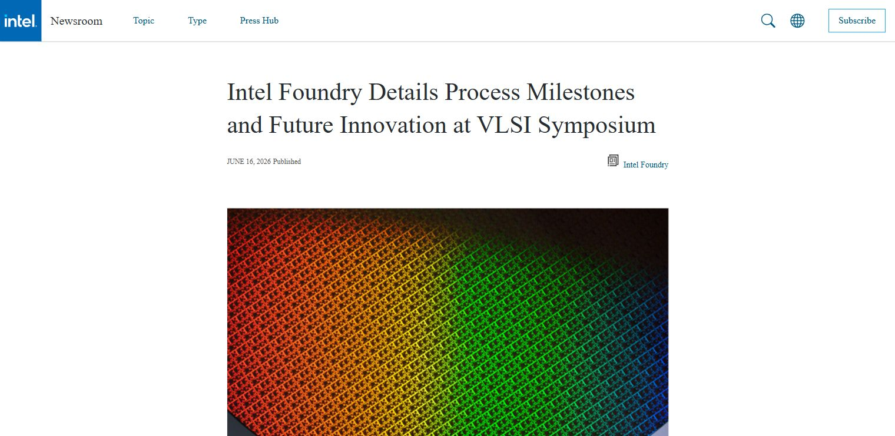
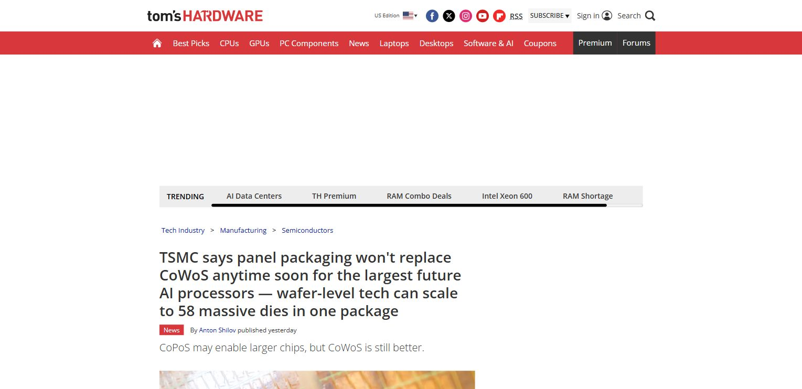
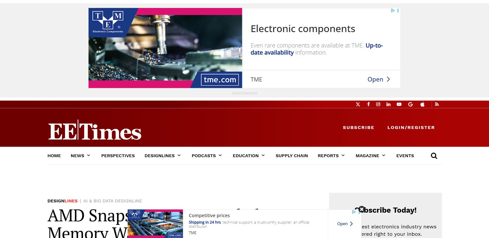
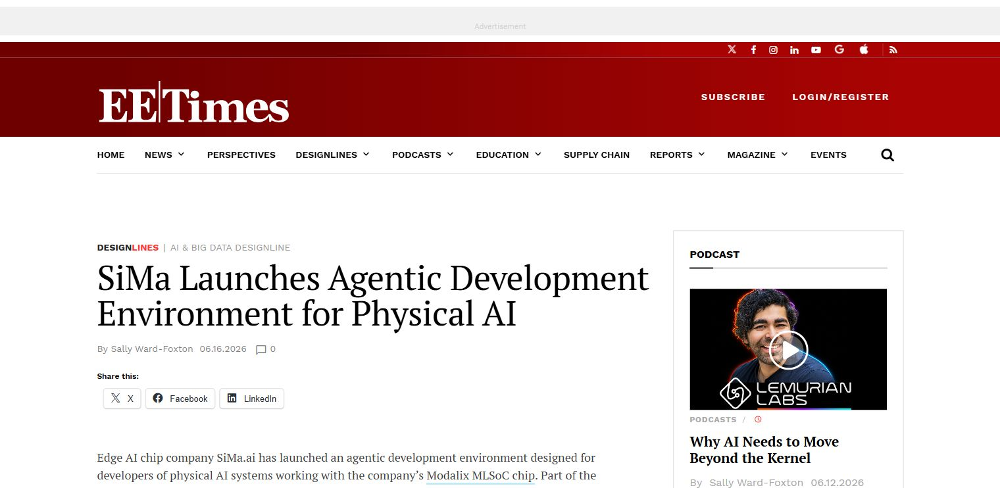

# Daily Semiconductor Current Affairs

Date: 2026-06-16

## Editorial Coverage Rule

Embed each relevant image/screenshot before its explanation. For any related editorial, write full original study coverage in this note: thesis, main arguments, evidence, counterpoints, semiconductor/VLSI relevance, India angle, and questions to revise. Keep the source link for the original article.

## News Images

Screenshots for this day should be stored in:

```text
images/2026-06-16/
```

Screenshot/source manifest:

- [../images/2026-06-16/links.md](../images/2026-06-16/links.md)

Current screenshot status: captured.



Image-linked study note: This screenshot anchors the process-node execution story. The learning point is not only that Intel announced 18A-P risk production; it is whether Intel can convert RibbonFET/PowerVia roadmap claims into manufacturable foundry service, with PDK readiness, yield learning, and customer confidence.



Image-linked study note: This image anchors the packaging-scaling debate. CoWoS versus CoPoS is not simply old packaging versus new packaging; the real question is when panel-level approaches can beat mature silicon-interposer style packaging on package size, warpage control, routing density, yield, and AI-accelerator economics.



Image-linked study note: This source is the memory-wall anchor for the day. Treat it as a reminder that adding compute is not enough when model weights and activations cannot move fast enough; revise bandwidth, latency, memory pooling, CXL-style expansion, HBM, and how software sees memory tiers.



Image-linked study note: This image links edge AI hardware with the developer workflow. The important point is that physical AI products need chips, compilers, model deployment tools, sensor integration, and power-aware runtime support, not just a standalone accelerator block.

## Source Snippets

| Source | Link | Topic | Date Signal | One-Line Summary |
|---|---|---|---|---|
| Intel Newsroom | https://newsroom.intel.com/intel-foundry/intel-foundry-details-process-milestones-future-innovation-at-vlsi-symposium | Intel 18A-P | Published June 16, 2026 | Intel Foundry said Intel 18A-P entered risk production and shared process updates at the 2026 VLSI Symposium. |
| Tom's Hardware | https://www.tomshardware.com/tech-industry/semiconductors/tsmc-says-panel-packaging-wont-replace-cowos-anytime-soon-for-the-largest-future-ai-processors-wafer-level-tech-can-scale-to-58-massive-dies-in-one-package | TSMC CoWoS vs CoPoS | Published June 16, 2026 | TSMC argued that panel-level packaging will not replace CoWoS soon for the largest AI processors. |
| EE Times | https://www.eetimes.com/amd-snaps-mext-to-break-the-memory-wall/ | Memory wall | Published June 16, 2026 | EE Times framed AMD-MEXT as a move to address the memory wall in AI and cloud infrastructure. |
| EE Times | https://www.eetimes.com/sima-launches-agentic-development-environment-for-physical-ai/ | Edge/physical AI silicon | Published June 16, 2026 | SiMa launched an agentic development environment for developers using its Modalix MLSoC chip. |

## Discussion

### What Happened?

June 16 was a strong technology-learning day. Intel's 18A-P update connects directly to transistor architecture, backside power delivery, design rules, and foundry competitiveness. TSMC's CoWoS discussion connects to packaging limits for future AI processors. AMD's MEXT acquisition connects to the memory wall. SiMa's physical AI announcement connects semiconductor hardware with embedded AI software workflows.

### Why It Matters

The common pattern is that AI hardware bottlenecks are not only about "more compute." The industry is fighting bottlenecks in process technology, packaging size, memory capacity, memory bandwidth, software tooling, power, and thermal behavior.

This is useful for VLSI GK because it connects news directly to the areas an engineer should understand:

- Process scaling: Intel 18A-P, RibbonFET/GAA, PowerVia/backside power.
- Packaging scaling: CoWoS, CoPoS, interposers, panel-level packaging.
- Memory scaling: DRAM, flash, HBM, memory tiering, memory wall.
- Edge AI: MLSoC, deployment workflows, power-constrained inference.

### News Coverage Mix

- Local / India: No direct India policy announcement in today's selected items, but the concepts matter for Indian VLSI roles in design enablement, verification, physical design, packaging, embedded AI, and system software.
- International: Intel, TSMC, AMD, and SiMa show how the global semiconductor industry is solving process, packaging, memory, and edge-AI bottlenecks.
- Why both matter together: Even when the source is international, the concepts map directly to what a VLSI engineer in India should understand for interviews, discussions, and career planning.

### Value-Chain Segment

- Foundry/process: Intel 18A-P.
- Packaging/test: TSMC CoWoS and CoPoS.
- Memory/system architecture: AMD-MEXT.
- Edge AI silicon: SiMa Modalix MLSoC.
- EDA/IP/design flow: Intel design-rule compatibility and SiMa software stack.

### VLSI / Semiconductor Concepts To Revise

- Risk production
- GAA / RibbonFET
- Backside power delivery
- PowerVia
- Design-rule compatibility
- CoWoS and panel-level packaging
- HBM and the memory wall
- Memory tiering
- MLSoC and edge AI accelerators

## Concept Review

| Concept | Quick Definition | Why It Matters In This News | Revise Next |
|---|---|---|---|
| Risk production | Early manufacturing phase before full high-volume production. | Intel 18A-P entering risk production is a signal that the process is moving from lab/qualification toward customer-ready manufacturing. | Yield, PDK maturity, design enablement, tapeout flow. |
| GAA / RibbonFET | Gate-all-around transistor architecture where the gate surrounds the channel more fully than FinFET. | Advanced nodes need better electrostatic control as transistor dimensions shrink. | FinFET vs GAA, leakage, drive current, scaling limits. |
| Backside power delivery | Routing power from the backside of the wafer instead of only the frontside metal stack. | Intel's PowerVia/backside power strategy can improve routing congestion and power delivery at advanced nodes. | IR drop, routing congestion, power grid, PDN. |
| CoWoS | Chip-on-Wafer-on-Substrate, an advanced packaging approach used for large AI accelerators and HBM integration. | TSMC says CoWoS remains hard to replace for the largest AI packages. | Interposer, HBM, 2.5D packaging, package yield. |
| Memory wall | The gap between compute capability and memory bandwidth/capacity/data movement. | AMD-MEXT shows AI infrastructure bottlenecks are often memory and data movement problems. | DRAM, HBM, cache hierarchy, memory tiering. |
| MLSoC | Machine-learning system-on-chip for edge or physical AI workloads. | SiMa's news shows chip companies compete through hardware plus developer tooling. | Edge inference, accelerators, embedded software stack. |

### India Relevance

For India, these stories show where capability can be built:

- Intel 18A-P: advanced process knowledge is difficult and capital-intensive, but Indian engineers can work in design enablement, PDKs, verification, physical design, and EDA flows.
- TSMC CoWoS: packaging is strategically important, so OSAT/ATMP and advanced packaging skills matter.
- AMD-MEXT: memory optimization and system software are areas where Indian software and hardware engineers can contribute.
- SiMa: embedded/edge AI is relevant for automotive, industrial, robotics, drones, and smart infrastructure.

### Simple Explanation

June 16 ka simple point: the semiconductor race is now about solving bottlenecks. Intel is trying to prove its process roadmap. TSMC is showing that CoWoS still has room for huge AI packages. AMD is trying to reduce memory pressure in AI data centers. SiMa is trying to make physical AI development easier on edge AI chips.

## Interview / Discussion Questions

1. What does "risk production" mean in semiconductor manufacturing?
2. Why is backside power delivery important for advanced nodes?
3. Why does Intel need 18A-P to be design-rule compatible with 18A?
4. Why is CoWoS hard to replace for large AI processors?
5. What is the memory wall?
6. How can memory tiering reduce AI infrastructure cost?
7. Why does edge AI need specialized chips instead of only cloud GPUs?

## Follow-Up

- Create a concept note on risk production, yield, and PDK maturity.
- Create a concept note on CoWoS vs CoPoS.
- Create a concept note on HBM and memory wall.
