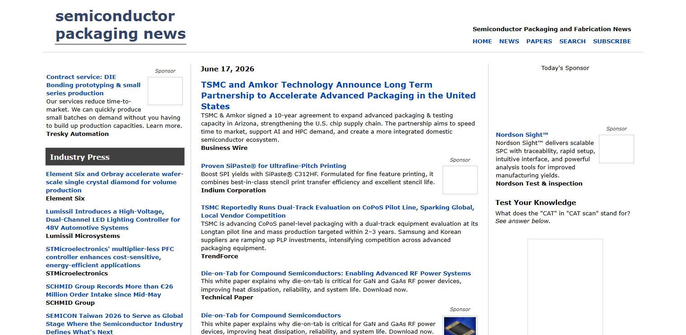
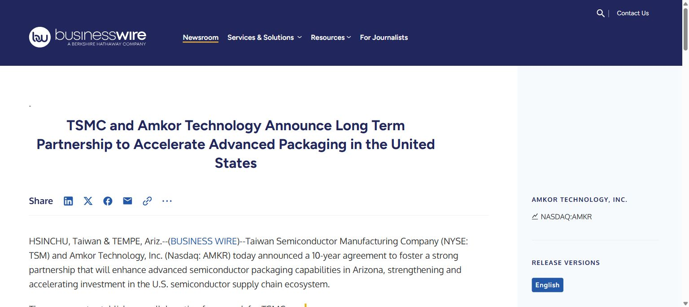
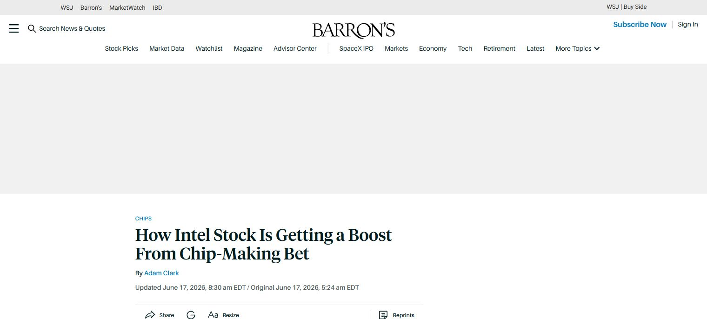
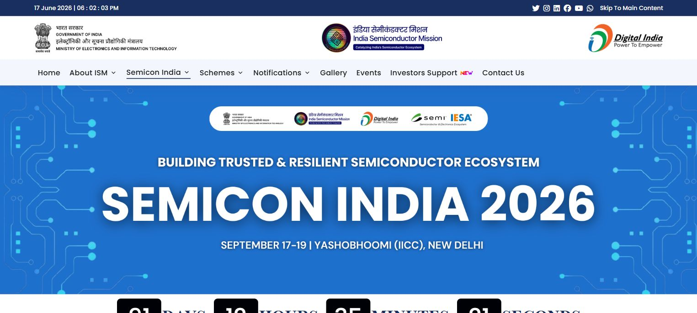

# Daily Semiconductor Current Affairs

Date: 2026-06-17

## News Images

Screenshots for this day should be stored in:

```text
images/2026-06-17/
```

Screenshot/source manifest:

- [../images/2026-06-17/links.md](../images/2026-06-17/links.md)

Current screenshot status: captured.










## Source Snippets

| Source | Link | Topic | Date Signal | One-Line Summary |
|---|---|---|---|---|
| Semiconductor Packaging News / Business Wire | https://www.semiconductorpackagingnews.com/ | TSMC-Amkor advanced packaging | Listed as June 17, 2026 | TSMC and Amkor announced a 10-year partnership to expand advanced packaging and testing capacity in Arizona. |
| Business Wire | https://www.businesswire.com/news/home/20260616574153/en/TSMC-and-Amkor-Technology-Announce-Long-Term-Partnership-to-Accelerate-Advanced-Packaging-in-the-United-States | TSMC-Amkor partnership | Published/reposted today; URL date is 2026-06-16 | TSMC will procure advanced packaging and testing services from Amkor to strengthen the US semiconductor supply chain. |
| Financial Times | https://www.ft.com/content/234c9aeb-33aa-469e-844d-f721e81296cf | Huawei and export controls | Published June 17, 2026 in search results | Huawei's comeback is being discussed as a test of how far US chip controls can slow China's semiconductor push. |
| Barron's | https://www.barrons.com/articles/intel-stock-price-today-chips-2cd104d5 | Intel market reaction | Published June 17, 2026 in search results | Intel's foundry news around 18A-P risk production triggered market attention. |
| India Semiconductor Mission | https://ism.gov.in/semicon-india-2026 | SEMICON India 2026 | Active page checked June 17, 2026 | SEMICON India 2026 will run from 17-19 September 2026 with the theme "Building Trusted and Resilient Semiconductor Ecosystems." |

## Discussion

### What Happened?

The strongest June 17 reading theme is advanced packaging. TSMC and Amkor announced a long-term partnership around US-based advanced packaging and test capacity in Arizona. This matters because making advanced wafers in the US is not enough if the chips still need to leave the country for packaging and testing.

The second theme is export controls. The Huawei story is useful because it shows that export controls do not simply stop a country from innovating. They can also force local workarounds, domestic chip design, chip stacking, and cluster-level system engineering.

The third theme is India. SEMICON India 2026 is now a useful anchor for tracking India's semiconductor policy and ecosystem narrative: trusted supply chains, workforce development, country pavilions, and industry participation.

### Why It Matters

For AI chips, packaging is no longer a low-level backend detail. Advanced packaging decides whether compute dies, HBM stacks, interposers, substrates, power delivery, and thermal management can work together at scale.

For VLSI learning, this means you should not think only in RTL or transistor terms. Modern chip performance depends on the full stack: architecture, memory bandwidth, package design, substrate technology, thermal behavior, test, yield, and supply-chain location.

### Value-Chain Segment

- Packaging/test: TSMC-Amkor, CoWoS, CoPoS, advanced packaging in Arizona.
- Foundry: TSMC and Intel Foundry remain central.
- Policy/geopolitics: Huawei, US export controls, China self-sufficiency.
- India: SEMICON India 2026, workforce development, ecosystem building.
- Materials/substrates: ABF, interposers, vias, warpage control.

### VLSI / Semiconductor Concepts To Revise

- CoWoS vs CoPoS
- OSAT and ATMP
- HBM integration
- Interposer and substrate
- Warpage and package reliability
- Export controls and AI accelerator system design
- Foundry vs backend packaging capacity

### India Relevance

India should be tracked through two lenses:

1. Near-term realistic capability: design, verification, DFT, physical design, embedded systems, OSAT/ATMP, compound semiconductors, test, and packaging.
2. Long-term ecosystem buildout: fabs, materials, chemicals, gases, equipment maintenance, trained operators, suppliers, and policy execution.

SEMICON India 2026 is important because it gives a public stage where government, global equipment companies, design companies, packaging players, and state governments show what they are actually building.

### Simple Explanation

Today ka simple point: AI chips are becoming package-level systems. A GPU alone is not enough. It needs HBM close to the compute die, advanced interconnects, strong substrates, good thermal handling, and reliable testing. That is why TSMC-Amkor and CoWoS/CoPoS news is important.

Huawei/export-control news shows another angle: if one country blocks access to top chips, the other side may try chip stacking, domestic foundries, local memory, or system-level scaling to compensate.

## Interview / Discussion Questions

1. Why is advanced packaging now strategically important for AI chips?
2. What problem does a US-based TSMC-Amkor packaging partnership solve?
3. Why is CoWoS important for NVIDIA-class AI accelerators?
4. How can export controls push China toward domestic semiconductor alternatives?
5. Why do future AI packages care about substrate quality and package reliability?
6. What should India prioritize first: leading-edge fabs, OSAT/ATMP, design, or materials? Why?

## Follow-Up

- Create a deep-dive note on CoWoS, CoPoS, and advanced package substrates.
- Track whether TSMC-Amkor Arizona capacity supports AI/HPC customers or broader advanced packaging demand.
- Watch for India SEMICON 2026 speaker and agenda updates.
