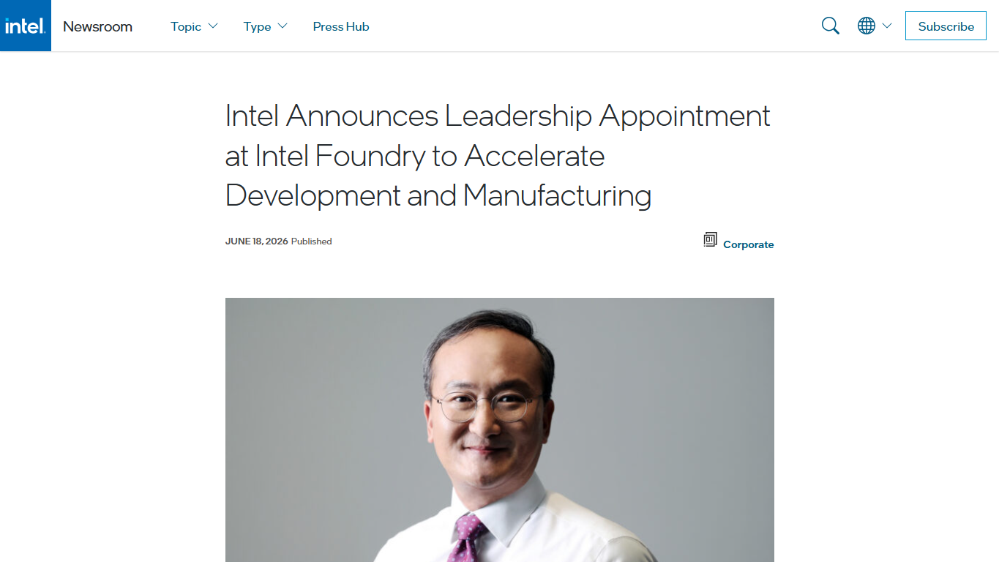
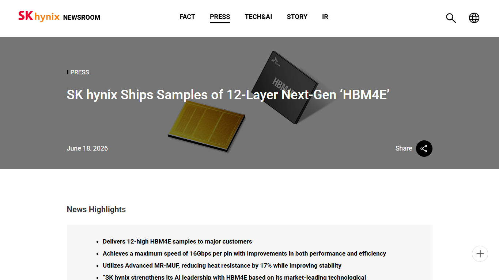
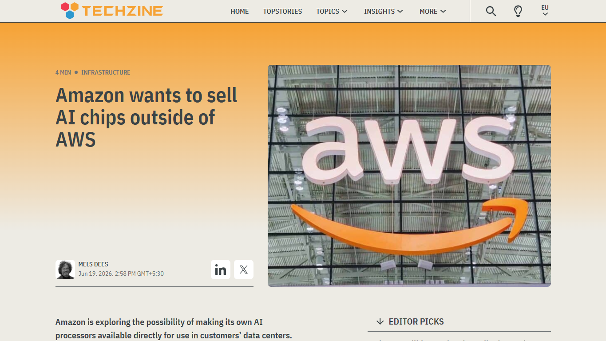
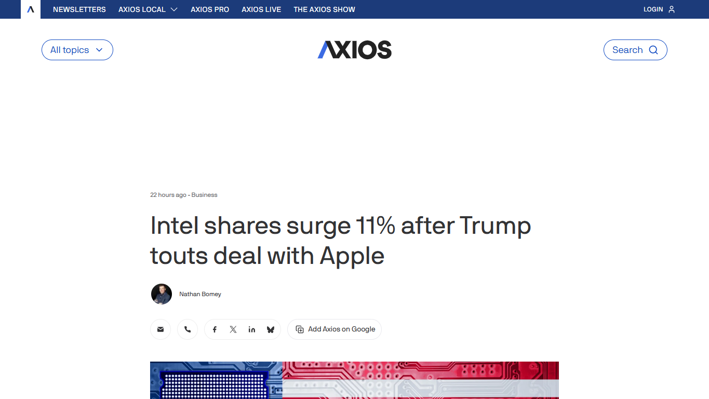

# Daily Semiconductor Current Affairs

Date: 2026-06-18

## Editorial Coverage Rule

Embed each relevant image/screenshot before its explanation. For any related editorial, write full original study coverage in this note: thesis, main arguments, evidence, counterpoints, semiconductor/VLSI relevance, India angle, and questions to revise. Keep the source link for the original article.

## News Images

Screenshots for this day should be stored in:

```text
images/2026-06-18/
```

Screenshot/source manifest:

- [../images/2026-06-18/links.md](../images/2026-06-18/links.md)

Current screenshot status: captured.



Image-linked study note: This image anchors Intel Foundry's backend leadership shift. The important point is that Intel needs process technology plus advanced packaging, system integration, back-end development, and high-volume manufacturing discipline to compete as an external foundry.



Image-linked study note: This image is the HBM roadmap anchor. Customer sampling matters because AI accelerator roadmaps depend on memory capacity, bandwidth, package height, power, thermal limits, and qualification timing, not just peak compute performance.



Image-linked study note: This image links hyperscaler infrastructure to merchant silicon competition. If Trainium moves outside AWS, the story becomes cloud-house ASICs competing with GPUs and other accelerators through software ecosystem, cost, availability, and workload fit.



Image-linked study note: This image should be treated as a reported signal, not a confirmed manufacturing deal. Its value is in showing why large customer rumors matter for foundries: one premium customer can change perceptions about node credibility, domestic manufacturing, and supply-chain politics.

## Source Snippets

| Source | Link | Topic | Date Signal | One-Line Summary |
|---|---|---|---|---|
| Intel Newsroom | https://newsroom.intel.com/corporate/intel-announces-leadership-appointment-at-intel-foundry-to-accelerate-development-and-manufacturing | Intel Foundry leadership | Published June 18, 2026 | Intel appointed former SK hynix CEO Seok-Hee Lee as executive vice president, strengthening foundry and advanced-packaging leadership. |
| SK hynix Newsroom | https://news.skhynix.com/12-layer-hbm4e-sample/ | 12-layer HBM4E samples | Published June 18, 2026 | SK hynix shipped 12-stack HBM4E samples to major AI customers, showing the next HBM generation moving toward customer validation. |
| Techzine / Bloomberg report | https://www.techzine.eu/news/infrastructure/132254/amazon-in-talks-to-sell-trainium-ai-chips-outside-its-own-cloud/ | Amazon Trainium external sales | Published June 19, 2026 | Amazon was reported to be considering selling Trainium AI chips outside AWS, which would turn a cloud-house ASIC into a broader merchant silicon product. |
| Axios | https://www.axios.com/2026/06/18/intel-stock-apple-trump | Apple-Intel reported signal | Published June 18, 2026 | A reported Apple-Intel US chipmaking discussion moved Intel shares, but the item should be treated as reported/political signal until Apple or Intel confirms. |
| Semiconductor Engineering | https://semiengineering.com/chip-industry-week-in-review-143/ | Weekly semiconductor roundup | Published June 19, 2026 with June 18 items | The roundup connects Intel leadership, HBM4E, Trainium, and policy/market signals into one semiconductor-week context. |

## Discussion

### What Happened?

June 18 was mainly about the AI hardware supply chain becoming more system-level. The important stories were not a single new GPU launch. They were about the pieces that decide whether future AI accelerators can be built, shipped, and deployed at scale.

Intel strengthened its foundry leadership by bringing in Seok-Hee Lee, a memory-industry veteran and former SK hynix CEO. That matters because Intel Foundry is not only competing on transistor roadmaps like Intel 18A and 18A-P. It also needs credibility in advanced packaging, memory-adjacent integration, customer execution, and high-volume manufacturing discipline.

SK hynix moving 12-layer HBM4E samples to major AI customers is another major signal. HBM roadmaps are now tightly coupled to AI accelerator roadmaps. When NVIDIA, AMD, custom ASIC builders, or hyperscalers plan future accelerators, they must know how much memory capacity, bandwidth, power, package height, and thermal headroom the HBM supplier can realistically provide.

Amazon's reported interest in selling Trainium outside AWS is strategically important because it blurs the line between cloud provider and chip vendor. Trainium was originally a way for AWS to lower its own AI training cost and reduce dependence on external accelerator suppliers. If Amazon sells Trainium externally, then cloud ASICs become a competitive product category, not just an internal infrastructure tool.

The Apple-Intel item should be handled carefully. It is a reported/political signal, not a confirmed Apple or Intel manufacturing announcement. Still, it matters because the market is watching whether Intel can win large external foundry customers and whether US-based manufacturing can attract premium consumer-chip work.

### Why It Matters

The deeper theme is that AI chips are now limited by supply-chain coordination, not only by circuit design.

For a future AI accelerator, the compute die is only one part of the product. The final system also needs HBM stacks, interposers or bridge technologies, advanced substrates, high-yield packaging, power delivery, thermal design, firmware, networking, and enough manufacturing capacity. Any one weak link can delay the whole product.

Intel's foundry challenge is therefore multi-dimensional:

- Process: deliver competitive nodes such as 18A and 18A-P.
- Packaging: offer credible advanced packaging options for chiplets and AI/HPC systems.
- Memory interface: support HBM integration and package-level bandwidth needs.
- Trust: convince external customers that Intel can execute on schedule without prioritizing only internal products.
- Economics: fill fabs and packaging capacity with enough profitable volume.

HBM4E sampling matters because memory suppliers must lock in customer roadmaps early. Samples allow customers to validate signal integrity, thermals, power, package stack behavior, controller compatibility, and system-level training performance. In AI infrastructure, memory bandwidth and capacity often decide model size, batch size, training efficiency, and inference cost.

Trainium external sales, if they happen, would show a second strategic shift: hyperscalers want more control over accelerator economics. NVIDIA remains dominant, but AWS, Google, Microsoft, Meta, and others are all incentivized to build custom silicon because AI compute is now a core cost center. The question is whether custom ASICs can become general enough, available enough, and software-supported enough to compete outside their home cloud.

### News Coverage Mix

- Local / India: No direct India policy announcement in the selected June 18 items, but the learning relevance is strong for Indian VLSI roles in memory interface design, verification, packaging-aware design, physical design, DFT, and cloud AI infrastructure.
- International: Intel, SK hynix, Amazon, Apple, and US policy/market signals show how AI-chip competitiveness depends on foundry execution, memory, packaging, and cloud economics.
- Why both matter together: India should track these bottlenecks because its near-term opportunity is not only fabs. Design services, verification, packaging/test, embedded AI, system software, and memory-interface skills all map to the global bottlenecks visible in this news.

### Value-Chain Segment

- Foundry: Intel Foundry leadership and external customer credibility.
- Memory: SK hynix HBM4E samples.
- Packaging/test: HBM stacks, package height, thermal handling, interconnect density.
- Design / custom silicon: Amazon Trainium and hyperscaler ASIC strategy.
- Policy/geopolitics: US manufacturing narrative around Apple-Intel reports.
- Market/finance: Intel share reaction to reported customer/manufacturing signals.

### VLSI / Semiconductor Concepts To Revise

- HBM4E and HBM generation changes
- 12-layer HBM stacks
- Memory bandwidth vs memory capacity
- Advanced packaging for AI accelerators
- Foundry customer qualification
- Hyperscaler ASICs
- Reported news vs confirmed source
- Package-level thermal limits
- HBM controller and PHY validation

## Concept Review

| Concept | Quick Definition | Why It Matters In This News | Revise Next |
|---|---|---|---|
| HBM4E | Future enhanced HBM4-class high-bandwidth memory generation for AI/HPC accelerators. | SK hynix samples show the next memory generation moving from roadmap talk to customer validation. | DRAM stack structure, TSVs, bandwidth per pin, controller/PHY compatibility. |
| 12-layer HBM | A vertical stack of 12 DRAM dies in one HBM package. | More layers can increase capacity, but also make thermals, yield, warpage, and packaging harder. | TSV yield, stack bonding, thermal resistance, package height. |
| Hyperscaler ASIC | A custom accelerator designed by a cloud-scale company for its own workloads. | Trainium shows cloud providers trying to control AI compute cost and reduce vendor dependence. | TPU, Trainium, Maia, inference vs training ASICs. |
| Foundry customer qualification | The process by which external chip customers validate a foundry's PDK, yield, schedule, reliability, and packaging ecosystem. | Intel needs external customers to believe its process and packaging roadmap is dependable. | PDK maturity, test chips, risk production, yield ramps. |
| Advanced packaging | Package-level integration of compute, memory, interconnect, substrate, and thermal structures. | AI accelerators depend on HBM and chiplet integration, so backend execution can decide product success. | CoWoS, EMIB, interposers, bridges, substrates. |
| Merchant silicon | Chips sold broadly to external customers rather than used only internally. | If Trainium is sold externally, Amazon moves closer to merchant AI accelerator competition. | Software ecosystem, supply commitments, customer support, TCO. |

### India Relevance

For India, June 18 points to practical capability areas:

- Verification and validation: HBM controllers, PHYs, chiplet interfaces, PCIe/CXL, UCIe, high-speed SerDes, and AI accelerator blocks need heavy verification work.
- Physical design and signoff: high-bandwidth interfaces and advanced-node blocks need timing, power integrity, signal integrity, and thermal-aware thinking.
- Packaging/test: if India builds OSAT/ATMP strength, HBM and AI-package knowledge becomes a valuable direction, even if the most advanced CoWoS-like packaging remains outside India initially.
- Cloud AI infrastructure: custom ASICs need compiler, runtime, kernel, networking, and system-software skills, not only RTL.

India should not read this news as "only fabs matter." The global bottlenecks are distributed across design, memory, packaging, and software. That is exactly where many Indian engineers can enter the value chain earlier.

### Simple Explanation

June 18 ka simple point: AI chip competition is becoming a full-stack supply-chain problem. Intel is trying to improve foundry trust and packaging leadership. SK hynix is pushing the memory side with HBM4E samples. Amazon may try to sell its own AI chips outside AWS. Apple-Intel is only a reported signal for now, but it shows how badly the market wants evidence that Intel can win major foundry customers.

For VLSI, the lesson is clear: do not study only RTL or transistor scaling. Also study HBM, package integration, foundry qualification, thermal limits, and cloud AI accelerator economics.

## Interview / Discussion Questions

1. Why is HBM so important for AI accelerators?
2. What changes when HBM moves from 8-layer to 12-layer stacks?
3. Why does a foundry need packaging capability to win AI/HPC customers?
4. How is a hyperscaler ASIC different from a merchant GPU?
5. Why would Amazon want to sell Trainium outside AWS?
6. What should be treated differently between a confirmed company announcement and a reported political/market signal?
7. Why is Intel Foundry customer trust as important as process-node claims?

## Follow-Up

- Track whether SK hynix HBM4E samples convert into named customer qualifications.
- Track whether Amazon officially announces external Trainium sales or only keeps Trainium inside AWS.
- Treat Apple-Intel as reported/unconfirmed until Apple or Intel publishes a direct confirmation.
- Create a deep-dive note on HBM stack structure, TSVs, thermal limits, and controller/PHY validation.
