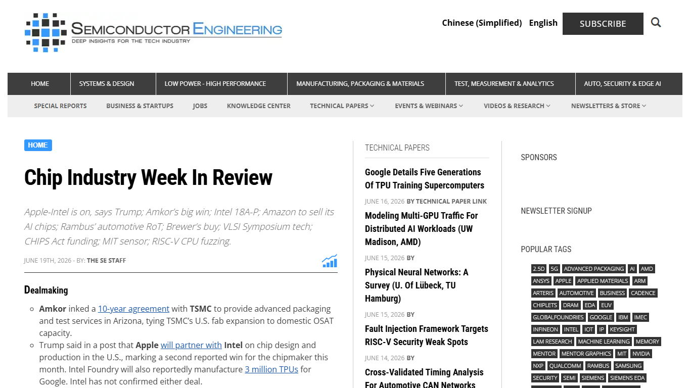
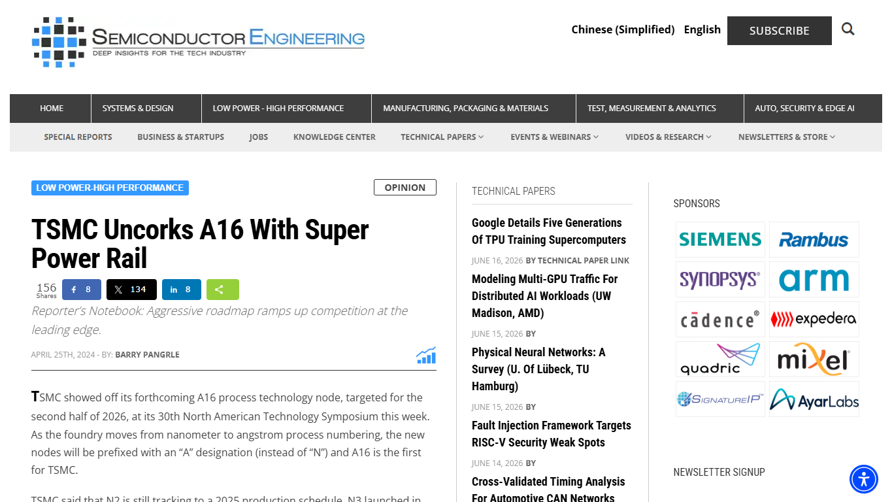
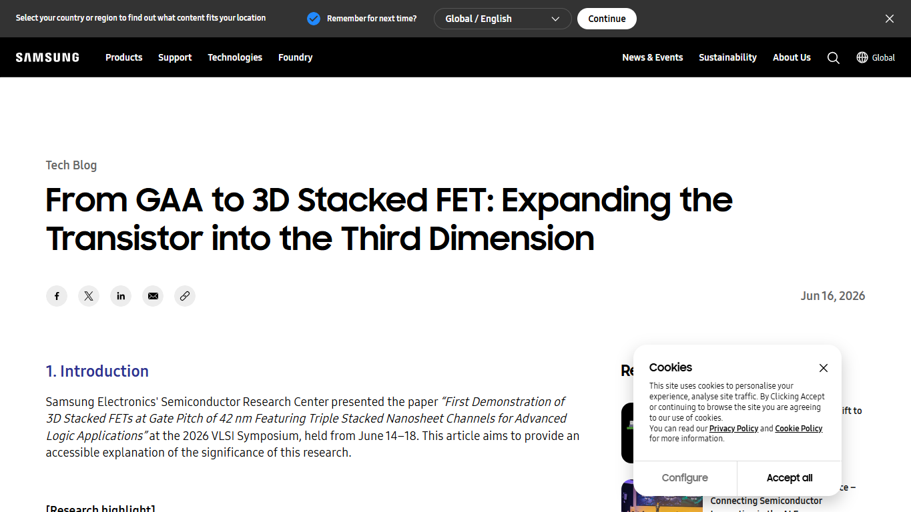
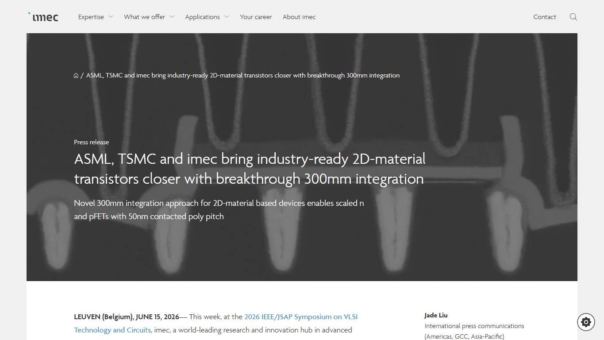
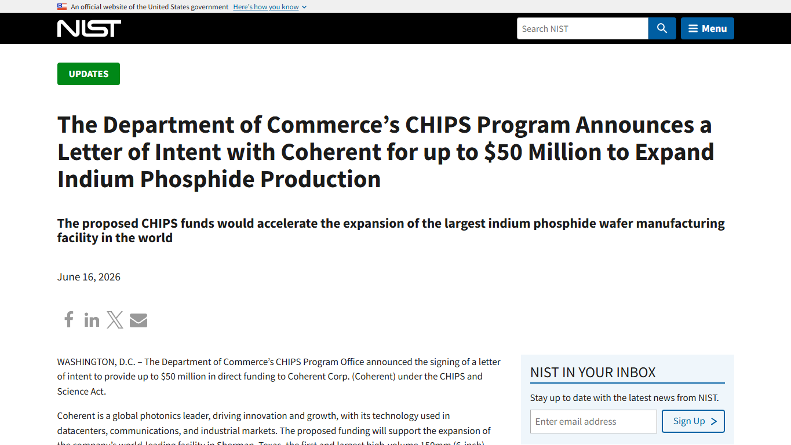
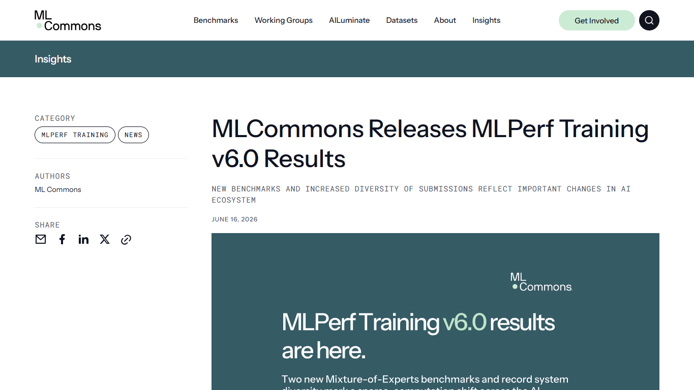

# Daily Semiconductor Current Affairs

Date: 2026-06-19

## News Images

Screenshots for this day should be stored in:

```text
images/2026-06-19/
```

Screenshot/source manifest:

- [../images/2026-06-19/links.md](../images/2026-06-19/links.md)

Current screenshot status: captured.













## Source Snippets

| Source | Link | Topic | Date Signal | One-Line Summary |
|---|---|---|---|---|
| Semiconductor Engineering | https://semiengineering.com/chip-industry-week-in-review-143/ | Chip Industry Week In Review | Published June 19, 2026 | Weekly roundup ties together Intel 18A-P, Intel leadership, HBM4E, VLSI Symposium scaling work, AI benchmarks, CHIPS funding, and policy signals. |
| TSMC / Semiconductor Engineering | https://www.tsmc.com/english/dedicatedFoundry/technology/logic/l_A16 and https://semiengineering.com/tsmc-uncorks-a16-with-super-power-rail/ | A16 and Super Power Rail | TSMC page checked June 19, 2026; explainer published earlier | TSMC positions A16 with nanosheet transistors and backside-like power delivery for high-performance AI/HPC designs. |
| Samsung Semiconductor | https://semiconductor.samsung.com/news-events/tech-blog/from-gaa-to-3d-stacked-fet-expanding-the-transistor-into-the-third-dimension/ | 3D stacked FET direction | Published June 2026 | Samsung explains moving beyond GAA toward vertical transistor stacking as a future scaling path. |
| imec | https://www.imec-int.com/en/press/asml-tsmc-and-imec-bring-industry-ready-2d-material-transistors-closer-breakthrough-300mm | 2D-material transistors on 300mm | Published June 2026 | ASML, TSMC, and imec reported progress toward industry-ready 2D-material transistors on 300mm wafers. |
| NIST / CHIPS Program | https://www.nist.gov/news-events/news/2026/06/department-commerces-chips-program-announces-letter-intent-coherent-50 | Coherent InP photonics funding | Published June 2026 | The CHIPS Program announced a letter of intent with Coherent for up to $50 million to support indium phosphide photonic semiconductor work. |
| MLCommons | https://mlcommons.org/2026/06/mlperf-training-v6-0-results/ | MLPerf Training v6.0 | Published June 16, 2026 | MLPerf Training v6.0 added new sparse-computation benchmarks and highlights changing AI system requirements. |

## Discussion

### What Happened?

June 19 is best read as a synthesis day. The single biggest message from the week's semiconductor news is that the industry is attacking AI-compute scaling from several directions at the same time:

- Better front-end process technology: Intel 18A-P, TSMC A16, Samsung GAA-to-3D stacked FET research, and imec/ASML/TSMC 2D-channel transistor work.
- Better power delivery: PowerVia-style or Super Power Rail-style backside power approaches to reduce routing congestion and improve power integrity.
- Better memory and packaging: SK hynix HBM4E samples, TSMC-Amkor advanced packaging, CoWoS/CoPoS discussions, and broader backend capacity.
- Better system measurement: MLPerf Training v6.0, which tracks full training systems rather than only isolated chip specs.
- Better photonics and interconnect: CHIPS Program support for Coherent's indium phosphide work points toward optical links and photonic components as strategic infrastructure.

This means semiconductor progress is no longer a single-lane race where the winner only has the smallest process node. The race now has several lanes: transistors, backside power, advanced packaging, HBM, photonics, EDA/multiphysics signoff, benchmarks, and policy-backed supply-chain localization.

### Why It Matters

At older nodes, the simplified story was "smaller transistor equals better chip." At modern AI/HPC nodes, that is not enough.

Modern scaling has multiple bottlenecks:

- Transistor bottleneck: FinFET gave way to GAA/nanosheet; future paths include CFET/3D stacked FET and possibly 2D-channel materials.
- Power bottleneck: frontside routing competes with signal routing; backside power delivery can reduce congestion and improve IR-drop behavior.
- Memory bottleneck: AI training and inference need massive memory bandwidth and capacity, which pushes HBM and package integration.
- Package bottleneck: large AI packages need high-yield interposers, substrates, thermal solutions, and test flows.
- Interconnect bottleneck: copper/electrical links become power-hungry at scale; silicon photonics and InP devices can matter for future data movement.
- Verification/signoff bottleneck: chiplet and 3D systems need electrical, thermal, mechanical, and reliability signoff together.

TSMC A16 and Intel 18A-P show the near-term commercial battle. Samsung's 3D stacked FET discussion and imec's 2D-material work show the longer-term research direction. Coherent's InP funding shows that the system is also moving beyond classic logic and memory into photonic semiconductor infrastructure.

For AI systems, MLPerf Training v6.0 is important because it measures complete training systems. A chip with excellent theoretical performance can still lose if the software stack, networking, memory hierarchy, parallelism strategy, or cluster reliability is weak. That is why benchmarks increasingly matter for customers.

### News Coverage Mix

- Local / India: No major India-only semiconductor policy item surfaced in today's selected set, but the India learning angle is strong: advanced packaging, photonics, EDA signoff, verification, and AI-system benchmarking are realistic knowledge areas for Indian engineers.
- International: The main items are US, Taiwan, Korea, Europe, and global industry signals around front-end scaling, backend packaging, AI memory, photonics, and benchmarks.
- Why both matter together: India must understand the global bottleneck map before deciding where to specialize. Chasing only leading-edge fabs misses near-term opportunities in design, verification, ATMP/OSAT, photonics packaging, reliability, EDA flows, and AI infrastructure software.

### Value-Chain Segment

- Foundry/process: Intel 18A-P, TSMC A16, Samsung GAA/3D stacked FET, imec 2D-material transistors.
- Equipment/materials: ASML/imec work, 2D materials, indium phosphide.
- Packaging/test: HBM, TSMC-Amkor, advanced substrates, package reliability.
- EDA/IP: multiphysics signoff, chiplet/3D-IC design challenges.
- Memory: HBM4E and AI memory bandwidth.
- Policy/geopolitics: CHIPS funding, US manufacturing, export-control watch.
- Market/finance: Intel and broader chip-stock reaction to foundry and AI infrastructure signals.

### VLSI / Semiconductor Concepts To Revise

- Backside power delivery
- Super Power Rail
- GAA / nanosheet transistor
- 3D stacked FET / CFET direction
- 2D-channel materials
- Indium phosphide photonics
- HBM4E and memory bandwidth
- Multiphysics signoff
- MLPerf training benchmarks
- Chiplet reliability and thermal behavior

## Concept Review

| Concept | Quick Definition | Why It Matters In This News | Revise Next |
|---|---|---|---|
| Backside power delivery | Moving power routing to the wafer backside instead of routing only through frontside metal layers. | Intel PowerVia and TSMC Super Power Rail-style approaches attack routing congestion and power integrity at advanced nodes. | IR drop, PDN, routing congestion, buried power rails. |
| GAA / nanosheet | Transistor architecture where the gate surrounds thin channels more completely than FinFET. | TSMC A16 and Samsung's roadmap discussion use nanosheet/GAA ideas as the commercial scaling base. | FinFET vs GAA, channel control, leakage, drive current. |
| 3D stacked FET / CFET | Future transistor direction that stacks nFET and pFET devices vertically to reduce footprint. | Samsung's discussion shows where scaling may go after horizontal nanosheet improvements become harder. | Standard-cell height, routing, process integration, thermal limits. |
| 2D-material transistor | A transistor using atomically thin channel materials such as transition-metal dichalcogenides. | imec/ASML/TSMC progress matters because ultra-thin channels may help scaling beyond silicon nanosheets. | Contact resistance, wafer-scale growth, variability, integration. |
| Indium phosphide photonics | Compound-semiconductor technology useful for high-speed optical and photonic devices. | Coherent's CHIPS-related funding points toward optical interconnect and photonic semiconductor infrastructure. | Silicon photonics vs InP, lasers, modulators, optical I/O. |
| MLPerf Training | Standardized benchmark suite for measuring full AI training systems. | AI customers need system evidence, not only TOPS/TFLOPS claims. | Scaling efficiency, cluster networking, sparse computation, benchmark rules. |
| Multiphysics signoff | Verification across electrical, thermal, mechanical, and reliability domains together. | Chiplets, 3D-ICs, and advanced packages fail if only timing is checked while thermal or mechanical stress is ignored. | Thermal simulation, warpage, electromigration, signal integrity. |

### India Relevance

India's semiconductor opportunity should be read through the bottleneck map:

- Design and verification: AI accelerators, high-speed interfaces, chiplet protocols, and memory controllers need large engineering teams.
- Physical design/signoff: backside power, advanced nodes, and high-current AI chips make power integrity and thermal-aware design more important.
- Packaging/test: India can build capability in OSAT/ATMP and gradually move toward more advanced package/test knowledge.
- Photonics: InP and silicon photonics may become important for data-center interconnects; this is a high-value research and manufacturing direction.
- Benchmark/software: AI hardware needs compilers, kernels, runtimes, distributed training, and benchmarking. Indian software strength can connect to semiconductor value here.

The practical lesson: India should not frame semiconductor learning as only "how to build a 2nm fab." It should build expertise around the full stack that AI hardware now requires.

### Simple Explanation

June 19 ka simple point: semiconductor scaling is becoming multi-path. One company is improving backside power. Another is pushing nanosheet and A16. Samsung is talking about stacked transistors. imec/ASML/TSMC are working on 2D materials. SK hynix is pushing HBM. Coherent/InP shows photonics is strategic. MLPerf shows that customers care about full AI system performance.

For VLSI study, this is a strong day because it connects device physics, process technology, packaging, memory, photonics, and AI systems in one map.

## Interview / Discussion Questions

1. Why is backside power delivery useful at advanced nodes?
2. What is the difference between FinFET, GAA/nanosheet, and 3D stacked FET direction?
3. Why are 2D materials interesting for future transistors?
4. Why does AI hardware depend so heavily on HBM?
5. Why are optical interconnects and photonics becoming strategically important?
6. Why can a chip with strong raw performance still perform poorly in MLPerf training?
7. What semiconductor areas can India realistically build strength in before leading-edge fabs mature?

## Follow-Up

- Create a concept note comparing FinFET, GAA/nanosheet, CFET/3D stacked FET, and 2D-channel transistors.
- Create a short note on backside power delivery: PowerVia vs Super Power Rail-style approaches.
- Add photonics and InP to the glossary.
- Track MLPerf Training v6.0 submissions to identify which AI accelerators and systems are actually appearing in public benchmarks.
- Track which of the June 19 device-scaling ideas move from research/demo stage toward customer PDKs or production design enablement.
