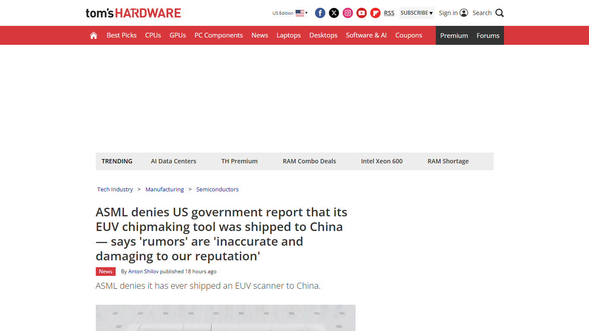
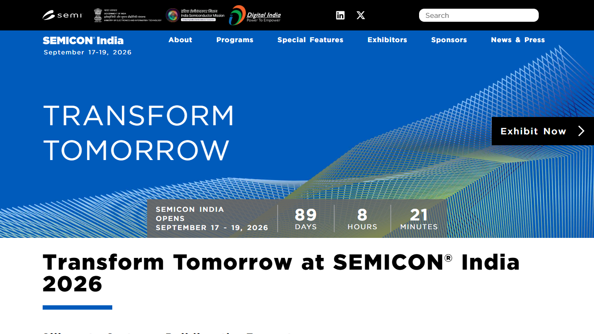
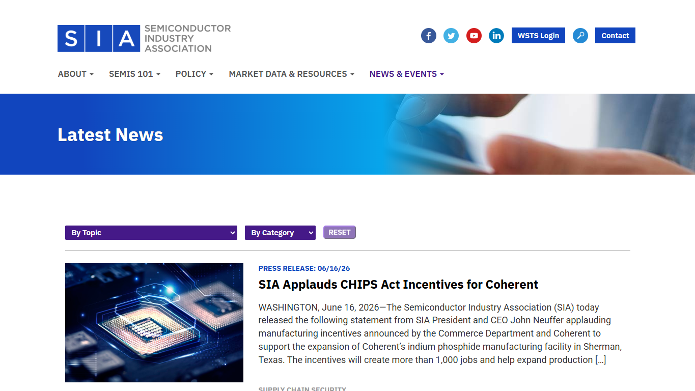

# Daily Semiconductor Current Affairs

Date: 2026-06-20

## News Images

Screenshots for this day should be stored in:

```text
images/2026-06-20/
```

Screenshot/source manifest:

- [../images/2026-06-20/links.md](../images/2026-06-20/links.md)

Current screenshot status: captured.









## Source Snippets

| Source | Link | Topic | Date Signal | One-Line Summary |
|---|---|---|---|---|
| Wall Street Journal | https://www.wsj.com/tech/why-the-memory-crunch-is-almost-impossible-to-solve-4023cb40 | Memory crunch | Published June 20, 2026 in search results | Memory supply remains tight because DRAM/NAND producers are prioritizing AI/HBM demand and are cautious after past downcycles. |
| Tom's Hardware / ASML response | https://www.tomshardware.com/tech-industry/semiconductors/asml-denies-us-government-report-that-its-euv-chipmaking-tool-was-shipped-to-china-says-rumors-are-inaccurate-and-damaging-to-our-reputation | ASML EUV export-control allegation | Published June 19, 2026 | ASML denied that an EUV scanner or EUV-specific components were shipped to China, after reported US concerns. |
| Intel Newsroom | https://newsroom.intel.com/corporate/intel-announces-leadership-appointment-at-intel-foundry-to-accelerate-development-and-manufacturing | Intel Foundry packaging leadership | Published June 18, 2026; still active follow-up today | Intel appointed Seok-Hee Lee to lead advanced packaging, system integration, back-end development, and back-end manufacturing. |
| SK hynix Newsroom | https://news.skhynix.com/12-layer-hbm4e-sample/ | 12-layer HBM4E samples | Published June 18, 2026; still active follow-up today | SK hynix shipped samples of 12-layer HBM4E to major AI customers. |
| SEMICON India | https://www.semiconindia.org/ | SEMICON India 2026 | Checked June 20, 2026 | SEMICON India 2026 is scheduled for September 17-19 in Delhi with a "Silicon to Systems" ecosystem theme. |
| SIA Latest News | https://www.semiconductors.org/news-events/latest-news/ | Industry market and policy context | Checked June 20, 2026 | SIA's latest items include Coherent/InP CHIPS support, April sales growth, and AI data-center semiconductor value-chain context. |

## Discussion

### What Happened?

June 20 is a weekend news day, so there were fewer fresh primary company releases. The important development is not a single new chip launch. It is the way several active stories now connect into one supply-chain picture:

- Memory scarcity is becoming a structural AI bottleneck, not only a short-term inventory issue.
- ASML is back at the center of export-control scrutiny because EUV lithography remains the most sensitive tool category in leading-edge manufacturing.
- Intel's Seok-Hee Lee hire reinforces that Intel Foundry is trying to compete at the system-integration and advanced-packaging layer, not only by advertising 18A/14A nodes.
- SK hynix HBM4E sampling shows that AI accelerator roadmaps are now tightly linked to HBM stack timing, thermal behavior, and customer qualification.
- India did not show a major new policy release today, but SEMICON India 2026 remains the next major public checkpoint for India's "silicon to systems" ecosystem narrative.

### Confirmed Facts vs Reported / Analysis Items

Confirmed by primary sources:

- Intel confirmed that Seok-Hee Lee joined Intel Foundry as executive vice president and will lead advanced packaging, system integration, back-end technology development, and back-end manufacturing.
- SK hynix confirmed that it shipped 12-layer HBM4E samples to major AI customers.
- SEMICON India 2026 is scheduled for September 17-19, 2026 at Yashobhoomi, Delhi, with the theme "Silicon to Systems: Building the Ecosystem."
- SIA's public latest-news page continues to frame AI data centers, Coherent/InP photonics, and market growth as major semiconductor policy and supply-chain themes.

Reported / analysis items:

- WSJ's memory-crunch report argues that the memory shortage is hard to solve because suppliers are favoring AI/HBM demand and are cautious after prior memory downturns.
- Bloomberg/WSJ/Tom's Hardware/TNW reporting says US officials raised concerns that EUV-related ASML equipment may have reached China. ASML denies this directly. No public evidence has been shown in the sources checked today.
- Barron's and other market outlets are interpreting Intel's Seok-Hee Lee hire as a packaging and EMIB/HBM strategy signal, not as a sign that Intel is re-entering commodity memory.

### Why It Matters

The central theme is resource allocation. AI demand is changing what the semiconductor industry chooses to build first.

Memory makers can allocate wafers, cleanroom expansion, engineering attention, and capex toward different products: commodity DRAM, NAND, LPDDR, enterprise SSDs, HBM, and advanced DRAM generations. AI customers pay for high-bandwidth, high-margin memory, so suppliers have strong incentives to prioritize HBM and AI server memory over lower-margin consumer memory. That creates a supply-chain tension: AI infrastructure gets priority, while PCs, phones, industrial electronics, and consumer devices may face tighter pricing or availability.

This is why "memory shortage" should not be read as only "not enough chips." It is also a mix problem:

- Same wafer capacity cannot instantly become every memory product.
- HBM needs advanced stacking, TSVs, bonding, package integration, known-good-die control, thermal materials, and tight customer qualification.
- Memory companies remember the last downcycle, so they avoid overbuilding too aggressively.
- Export controls and China capacity complicate whether lower-end or alternative sources can fill gaps.

The ASML story matters for a different reason: EUV is a control point. If leading-edge AI processors depend on EUV lithography, and only ASML supplies EUV systems, then export-control claims around ASML are not ordinary compliance stories. They affect the credibility of the entire advanced-node control regime. ASML's denial is important, but the dispute itself shows how much geopolitical pressure sits on lithography.

Intel's packaging move connects the two themes. Intel needs external foundry customers, but leading AI/HPC customers need more than wafers. They need package-level integration: logic, HBM, bridges/interposers, substrates, thermal control, test, and manufacturing discipline. By separating front-end process leadership from back-end/packaging leadership, Intel is signaling that advanced packaging is a business line, not a support function.

### News Coverage Mix

- Local / India: No fresh India semiconductor policy release was found in today's last-24-hour check. SEMICON India 2026 remains the next major checkpoint, and the official page emphasizes "Silicon to Systems," which matches today's global theme: the value is in the whole stack, not only a fab.
- International: The strongest global stories are memory scarcity, ASML/EUV export-control scrutiny, Intel advanced packaging leadership, and SK hynix HBM4E customer sampling.
- Why both matter together: India should read the global news as a bottleneck map. The opportunity is not just "build a fab"; it is design, verification, packaging, materials, photonics, equipment support, test, and AI infrastructure software.

### Value-Chain Segment

- Memory: DRAM, NAND, HBM, HBM4E, AI server allocation.
- Equipment: ASML EUV, export controls, lithography logistics and tool traceability.
- Foundry: Intel 18A/14A credibility and external customer trust.
- Packaging/test: Intel EMIB-T/HBI direction, HBM integration, back-end manufacturing.
- Policy/geopolitics: US-China export controls, ASML compliance dispute, India ecosystem buildout.
- Market/finance: Intel and ASML share reactions are being driven by packaging credibility and export-control risk.
- India: SEMICON India 2026, ISM 2.0, design/IP, materials, equipment, supply chains, and R&D centers.

### VLSI / Semiconductor Concepts To Revise

- HBM vs commodity DRAM
- HBM stack yield and known-good-die testing
- TSVs and micro-bump / hybrid-bonding style integration
- EUV lithography and why it is export-controlled
- DUV vs EUV lithography
- EMIB and bridge-based packaging
- CoWoS vs EMIB style integration
- Back-end manufacturing vs front-end wafer fabrication
- Memory-cycle economics
- Supply allocation and qualification cycles

## Concept Review

| Concept | Quick Definition | Why It Matters In This News | Revise Next |
|---|---|---|---|
| HBM | Stacked DRAM placed close to AI accelerators to deliver very high bandwidth. | AI demand is pulling memory suppliers toward high-margin HBM and away from some commodity allocation. | TSV, stack height, HBM controller, thermal path. |
| HBM4E | Enhanced next-generation HBM4-class memory for future AI systems. | SK hynix samples show AI customers are already validating future memory generations. | Sampling, qualification, bandwidth per pin, package integration. |
| EUV lithography | Extreme ultraviolet lithography used for advanced chip patterning. | ASML/EUV is one of the biggest export-control chokepoints for leading-edge logic. | EUV source, mirrors, masks, stochastic defects, Wassenaar restrictions. |
| EMIB | Intel's Embedded Multi-die Interconnect Bridge packaging technology. | Intel wants EMIB/HBI and back-end integration to help win AI/HPC foundry customers. | Bridge vs interposer, CoWoS comparison, signal integrity. |
| Back-end manufacturing | Assembly, packaging, system integration, and test work after wafers are fabricated. | Intel created dedicated leadership for this area because AI systems are package-limited. | OSAT, package test, reliability, thermal-mechanical stress. |
| Memory cycle | The boom-bust pattern in memory supply, pricing, and capex. | Memory suppliers are cautious about overexpansion after previous downturns. | Capex cycles, utilization, contract pricing, inventory correction. |
| Export-control compliance | Rules and traceability systems controlling where sensitive tools/chips can go. | The ASML dispute shows that tool traceability and evidence matter as much as chip performance. | Entity List, license rules, tool servicing, end-use controls. |

### India Relevance

Today's stories are important for India because they show where a country can build semiconductor capability even before becoming a leading-edge logic powerhouse.

For India, the practical skill map is:

- Design and verification: memory controllers, chiplet interfaces, AI accelerator blocks, PCIe/CXL/UCIe, SerDes, DFT, and physical design.
- Packaging and test: ATMP/OSAT, substrate knowledge, package reliability, test engineering, thermal materials, and yield analysis.
- Materials and equipment support: gases, chemicals, metrology, maintenance, process-control support, and equipment ecosystem development.
- Photonics and compound semiconductors: InP and silicon photonics can matter for future AI data movement.
- Policy and ecosystem: SEMICON India 2026 should be watched for actual company participation, agenda details, and whether "silicon to systems" becomes concrete projects.

The important mindset: India should not measure semiconductor progress only by "Do we have a 2nm fab?" The global bottlenecks today are memory, packaging, lithography access, test, materials, and system integration. Those are real entry points.

### Simple Explanation

June 20 ka simple point: AI is eating the semiconductor supply chain from multiple sides. Memory makers are prioritizing HBM because AI customers need it badly and pay well. ASML is under scrutiny because EUV is the gatekeeper for advanced-node chips. Intel is hiring leadership for packaging because future AI chips are not just wafers; they are package-level systems. India should watch this as a "full stack" lesson: design, packaging, materials, equipment, photonics, and test all matter.

## Interview / Discussion Questions

1. Why can a memory shortage happen even if total memory production is increasing?
2. Why is HBM harder to scale than ordinary DRAM?
3. Why is EUV lithography more geopolitically sensitive than many other semiconductor tools?
4. How does EMIB differ from a full silicon interposer approach like CoWoS?
5. Why would Intel treat advanced packaging as a dedicated business function?
6. How do export controls affect semiconductor supply-chain planning?
7. What should India prioritize first in a "silicon to systems" semiconductor strategy?

## Follow-Up

- Memory crunch: still pending. Track Micron, Samsung, and SK hynix pricing/capex commentary for confirmation.
- ASML/EUV China allegation: still pending. ASML denies the claim; no public evidence has been shown in checked sources.
- Intel packaging reset: updated. Seok-Hee Lee appointment confirms packaging/system integration is now a focused Intel Foundry leadership area.
- HBM4E samples: updated. SK hynix confirmed sampling, but named customers and qualification status remain undisclosed.
- India: still pending. Watch for SEMICON India 2026 agenda, exhibitor list, and state/company participation updates.

