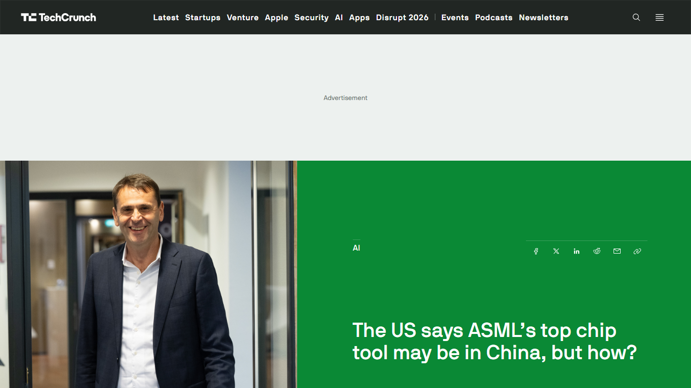
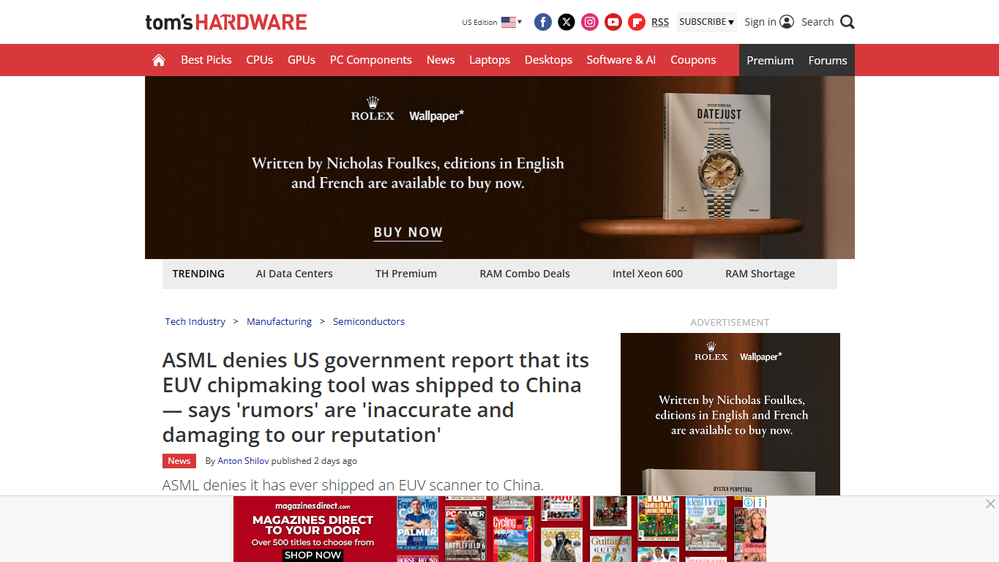
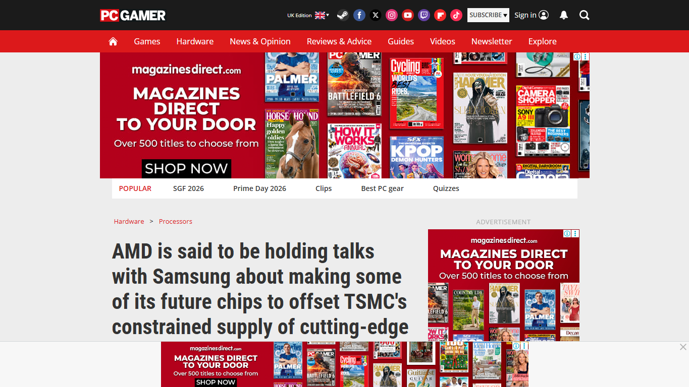
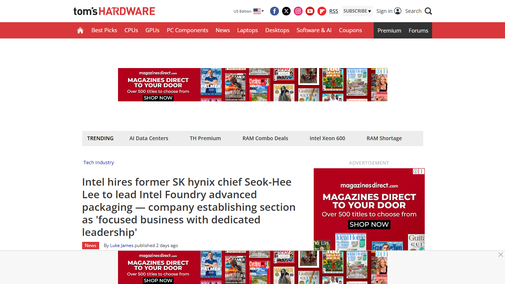
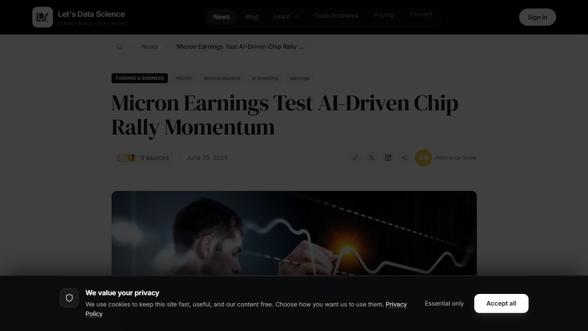
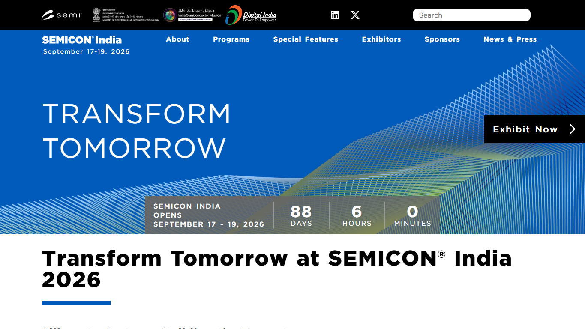

# Daily Semiconductor Current Affairs

Date: 2026-06-21

## Editorial Coverage Rule

Embed each relevant image/screenshot before its explanation. For any related editorial, write full original study coverage in this note: thesis, main arguments, evidence, counterpoints, semiconductor/VLSI relevance, India angle, and questions to revise. Keep the source link for the original article.

## News Images

Screenshots for this day should be stored in:

```text
images/2026-06-21/
```

Screenshot/source manifest:

- [../images/2026-06-21/links.md](../images/2026-06-21/links.md)

Current screenshot status: captured.



Image-linked study note: This image anchors the reported ASML-China concern. The useful study habit is to label what is confirmed, what is reported, and what is denied, because export-control news often mixes technical facts, government concern, and market interpretation.



Image-linked study note: This image gives the counterweight to the reported concern. For revision, separate an EUV scanner, EUV-specific components, DUV tools, service access, and know-how; each has a different meaning for leading-edge manufacturing capability.



Image-linked study note: This source anchors supply diversification. If AMD explores Samsung Foundry, the issue is not only price; it is capacity, node maturity, design portability, PDK changes, packaging availability, yield risk, and dependence on TSMC for high-end wafers.



Image-linked study note: This image keeps Intel's packaging reset in focus. Advanced packaging is now a foundry selling point because AI/HPC customers need chiplets, HBM integration, substrates, test, thermal handling, and system-in-package execution.



Image-linked study note: This image links market reporting to technical supply. Micron earnings can become a proxy for whether AI memory demand is strong enough to sustain DRAM pricing, HBM investment, and broader semiconductor investor confidence.



Image-linked study note: This image keeps the local ecosystem visible even on an international-heavy day. Use it to ask what India can learn from global bottlenecks: packaging capacity, trusted supply chains, talent development, design-to-system thinking, and long-term policy consistency.

## Source Snippets

| Source | Link | Topic | Date Signal | One-Line Summary |
|---|---|---|---|---|
| TechCrunch / Bloomberg report | https://techcrunch.com/2026/06/19/the-us-says-asmls-top-chip-tool-may-be-in-china-asml-says-it-isnt/ | US concern over ASML/EUV and China | Published June 19, 2026; active follow-up on June 21 | Reporting says US officials raised concern that China may have access to a top ASML lithography tool; ASML denies this. |
| Tom's Hardware | https://www.tomshardware.com/tech-industry/semiconductors/asml-denies-us-government-report-that-its-euv-chipmaking-tool-was-shipped-to-china-says-rumors-are-inaccurate-and-damaging-to-our-reputation | ASML denial | Published June 20/21 in search results | ASML denied that it has shipped an EUV scanner or EUV-specific components into China. |
| PC Gamer | https://www.pcgamer.com/hardware/processors/amd-is-said-to-be-holding-talks-with-samsung-about-making-some-of-its-future-chips-to-offset-tsmcs-constrained-supply-of-cutting-edge-wafers/ | AMD-Samsung foundry talks | Published June 20, 2026 | AMD is reportedly talking with Samsung about making some future chips to reduce dependence on constrained TSMC capacity. |
| Tom's Hardware | https://www.tomshardware.com/tech-industry/intel-hires-former-sk-hynix-chief-seok-hee-lee-to-lead-intel-foundry-advanced-packaging | Intel packaging leadership | Published June 20, 2026 | Intel's Seok-Hee Lee appointment was framed as a dedicated advanced-packaging business shift for Intel Foundry. |
| Let's Data Science / Reuters summary | https://letsdatascience.com/news/micron-earnings-test-ai-driven-chip-rally-momentum-206d84cb | Micron earnings and AI memory rally | Published June 20, 2026 in search results | Investors are watching Micron's June 24 earnings as a pulse check for AI-driven memory and chip-stock momentum. |
| SEMICON India | https://www.semiconindia.org/ | India ecosystem checkpoint | Checked June 21, 2026 | SEMICON India 2026 remains the next major public checkpoint for India's silicon-to-systems semiconductor ecosystem. |

## Discussion

### What Happened?

June 21 is a Sunday, so primary company announcements were limited. The important pattern is a continuation of the risk-management theme that started on June 20:

- ASML/EUV remained the biggest geopolitics story. A Bloomberg report, republished by BusinessMirror, said US officials are concerned China may have access to a top ASML chipmaking tool. ASML publicly denies that it has shipped EUV scanners or EUV-specific components to China.
- AMD is reportedly exploring Samsung Foundry for some future chips, which points to TSMC capacity pressure and the need for supply diversification.
- Intel's advanced-packaging leadership reset continued to draw attention because packaging is becoming a strategic foundry business rather than a back-end support detail.
- Memory remained active in market coverage, with Reuters-syndicated reporting pointing to Micron's June 24 earnings as a key test of AI-driven chip and memory demand.
- No major new India semiconductor policy announcement surfaced in the last-24-hour check, so SEMICON India 2026 remains the main India watch item.

### Confirmed Facts vs Reported / Analysis Items

Confirmed or directly sourced:

- ASML denies that it shipped EUV scanners or EUV-specific components to China, according to reporting that includes ASML's response.
- Intel has appointed Seok-Hee Lee to lead advanced packaging, system integration, back-end technology development, and back-end manufacturing at Intel Foundry.
- SEMICON India 2026 is scheduled for September 17-19, 2026 at Yashobhoomi, Delhi.

Reported / not directly confirmed by the companies:

- The ASML/EUV concern itself is a Bloomberg-reported US-government concern. Public evidence was not available in checked sources.
- AMD-Samsung foundry talks are reported, not confirmed by AMD or Samsung in the checked sources.
- The WSJ memory-crunch story is market reporting; the underlying trend is consistent with confirmed HBM demand and memory-company behavior, but specific allocation claims should be tracked through Micron, Samsung, and SK hynix earnings/capex commentary.

### Why It Matters

The main concept today is supply-chain optionality.

Leading semiconductor companies are trying to reduce single-point failure risk:

- Chip designers do not want to depend entirely on one foundry.
- Foundries do not want to compete only on front-end process nodes; they also need packaging, HBM integration, test, and system-level capability.
- Governments do not want sensitive lithography tools to move into restricted ecosystems.
- Memory suppliers do not want to overbuild commodity memory after painful downcycles, so they favor high-margin AI/HBM demand.

The AMD-Samsung report matters because it shows how TSMC capacity pressure can force design and sourcing changes. A leading-edge CPU/GPU design is not easily portable from one foundry to another. Each foundry has different design rules, libraries, PDKs, SRAM behavior, analog/IP blocks, yield curves, packaging flows, and qualification timelines. This is why a realistic dual-sourcing strategy often starts with less risky die types: I/O dies, lower-end APUs, companion chips, or later-generation products, rather than immediately moving the most sensitive high-performance compute chiplet.

The ASML story matters because EUV is not just another machine. EUV is a strategic control point for leading-edge logic. If the US and allied governments believe EUV-related tools could leak into China, the consequences go beyond ASML's stock. It could increase pressure on tool tracking, servicing rules, component-level controls, and the proposed expansion of restrictions to older DUV categories. ASML's denial is important, but the dispute itself shows that tool traceability is now a geopolitical topic.

Intel's packaging reset connects these two stories. If AMD, Nvidia, Apple, Broadcom, and hyperscalers face TSMC capacity or packaging constraints, they need alternatives. Intel may not win a customer only by saying "we have 18A." It must offer a credible route to package logic, HBM, chiplets, substrates, thermal design, and test. That is why Seok-Hee Lee's background matters: memory and manufacturing discipline are directly relevant to AI-package bottlenecks.

### News Coverage Mix

- Local / India: No major new India policy announcement was found today. SEMICON India 2026 stays in watch mode. India's relevant angle is "silicon to systems": not only fabs, but design, packaging, test, equipment support, materials, and workforce.
- International: ASML/EUV, AMD-Samsung, Intel packaging, and the memory crunch all point to global capacity, control, and integration risk.
- Why both matter together: India can learn from the global bottlenecks before choosing where to specialize. The easier entry points are not necessarily leading-edge fabs; they include packaging/test, cleanroom operations, DFT, verification, physical design, embedded AI, materials, and semiconductor equipment services.

### Value-Chain Segment

- Equipment: ASML EUV, lithography traceability, export-control compliance.
- Foundry: AMD-Samsung reported talks, TSMC capacity pressure, Samsung 2nm/4LPP opportunity.
- Packaging/test: Intel advanced packaging, EMIB-T, HBI, HBM integration, back-end manufacturing.
- Memory: DRAM/NAND crunch, HBM priority, Micron-linked market watch.
- Policy/geopolitics: US-China controls, Wassenaar-style restrictions, China tool-access concerns.
- India: SEMICON India 2026, silicon-to-systems ecosystem building.

### VLSI / Semiconductor Concepts To Revise

- Foundry portability and why chips are hard to move between fabs
- PDK and design-rule dependence
- I/O die vs compute die
- Dual sourcing
- EUV vs DUV lithography
- Tool traceability and service lock-in
- Advanced packaging as foundry differentiation
- HBM integration
- Memory allocation and pricing cycles

## Concept Review

| Concept | Quick Definition | Why It Matters In This News | Revise Next |
|---|---|---|---|
| Dual sourcing | Designing a supply chain so more than one manufacturing source can produce a product or part of it. | AMD-Samsung reports show why designers want alternatives when TSMC capacity is tight. | PDK portability, qualification, redesign cost, yield risk. |
| I/O die | A chiplet handling memory interfaces, PCIe/CXL, Infinity Fabric-style links, and other system I/O. | I/O dies may be easier to move to a second foundry than the most advanced compute chiplets. | Chiplet partitioning, PHYs, SerDes, package routing. |
| PDK | Process Design Kit: the rules, models, libraries, and signoff data needed to design for a specific foundry process. | Moving from TSMC to Samsung is not a simple file transfer; the design must match a different PDK and yield behavior. | DRC, LVS, timing corners, standard cells, SRAM compilers. |
| EUV traceability | Ability to track EUV scanner location, operation, parts, and service history. | The ASML dispute is partly about whether a massive, networked EUV tool or its components could be diverted. | Tool telemetry, service controls, export licensing. |
| Advanced packaging | Integration of logic, memory, bridges/interposers, substrates, thermal handling, and test after wafer fabrication. | Intel is trying to make packaging a foundry differentiator for AI/HPC customers. | EMIB, CoWoS, HBI, TSVs, package reliability. |
| Capacity allocation | Deciding which customers/products get limited fab, memory, or packaging capacity. | Memory and TSMC capacity pressure are both allocation problems, not just production problems. | Wafer starts, capex, utilization, long-term agreements. |

### India Relevance

India should treat today's news as a map of practical semiconductor work:

- Cleanrooms and fabs: the ASML and foundry stories show why process control, tool access, maintenance, and compliance matter.
- Design and verification: dual sourcing needs portable architectures, clean IP partitioning, and strong verification discipline.
- Packaging/test: Intel's move reinforces that AI/HPC value is shifting toward package-level integration.
- Policy and ecosystem: India's "silicon to systems" narrative is sensible only if it includes materials, packaging, test, design tools, equipment support, and trained engineers.

For interviews and discussions, do not say "India should just build a 2nm fab." A better answer is: India should build layered capability, starting with design, verification, ATMP/OSAT, cleanroom skills, materials, and selected specialty semiconductors, while gradually building the manufacturing ecosystem.

### Simple Explanation

June 21 ka simple point: semiconductor companies are trying to reduce dependency risk. AMD may want Samsung because TSMC capacity is tight. Intel is pushing packaging because customers need complete AI systems, not only wafers. ASML is under scrutiny because EUV is a strategic control point. Memory remains tight because AI/HBM gets priority. For India, this means the real opportunity is the full stack: design, test, packaging, materials, cleanrooms, and system integration.

## Interview / Discussion Questions

1. Why is it difficult to move a chip from TSMC to Samsung?
2. Why might a company move an I/O die before moving a compute die?
3. Why is EUV lithography more tightly controlled than many other tools?
4. How can advanced packaging help Intel Foundry compete even before it wins many leading-edge wafer customers?
5. Why is capacity allocation a strategic issue in both memory and foundry markets?
6. What semiconductor capabilities should India build before trying to compete directly at the leading edge?

## Follow-Up

- ASML/EUV allegation: still pending. ASML denies shipment; no public evidence found in checked sources.
- AMD-Samsung foundry talks: new reported item, pending confirmation from AMD/Samsung.
- Intel packaging reset: still active. Dedicated packaging leadership is confirmed; customer wins remain the real proof point.
- Memory crunch: still pending. Track Micron earnings and Samsung/SK hynix commentary for allocation and capex evidence.
- India: still pending. Watch SEMICON India 2026 agenda and ISM updates for concrete ecosystem progress.
