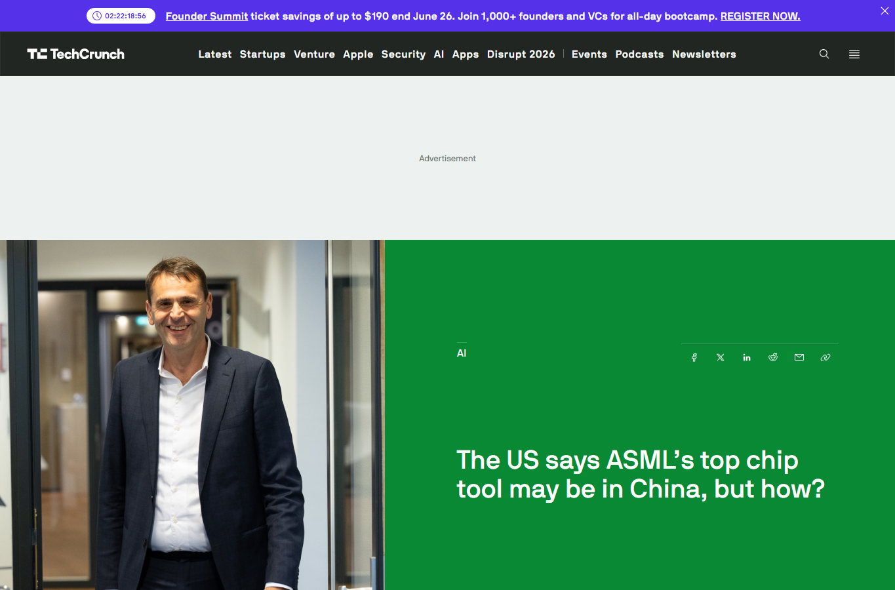
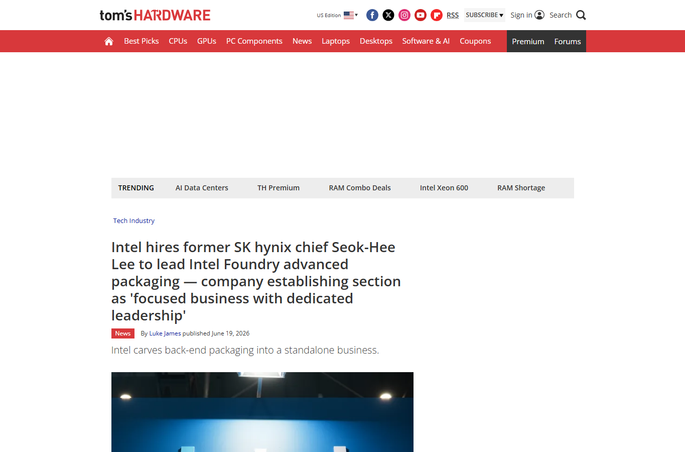
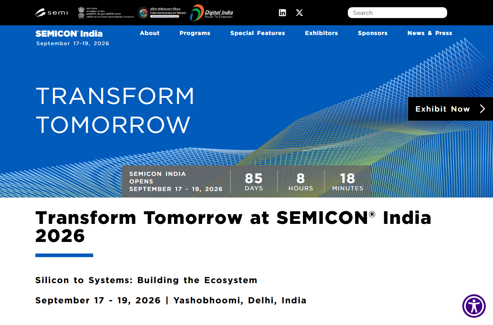

# Daily Semiconductor Current Affairs

Date: 2026-06-22

## News Images

Screenshots for this day should be stored in:

```text
images/2026-06-22/
```

Screenshot/source manifest:

- [../images/2026-06-22/links.md](../images/2026-06-22/links.md)

Current screenshot status: partial. Investopedia blocked automated screenshot capture; source link retained below.








## Source Snippets

| Source | Link | Geography | Topic | One-Line Summary |
|---|---|---|---|---|
| Investopedia | https://www.investopedia.com/micron-leads-ai-trade-higher-expectations-are-rising-ahead-of-the-memory-chipmaker-earnings-mu-12003674 | International | Micron and AI memory expectations | Micron and memory-related stocks rose as investors looked to Micron earnings for evidence that AI memory demand remains strong. |
| PC Gamer / Nikkei report | https://www.pcgamer.com/hardware/processors/amd-is-said-to-be-holding-talks-with-samsung-about-making-some-of-its-future-chips-to-offset-tsmcs-constrained-supply-of-cutting-edge-wafers/ | International | AMD-Samsung foundry diversification | AMD is reportedly discussing future CPU production with Samsung to reduce dependence on constrained TSMC capacity. |
| TechCrunch / Bloomberg report | https://techcrunch.com/2026/06/19/the-us-says-asmls-top-chip-tool-may-be-in-china-asml-says-it-isnt/ | International | ASML/EUV China concern | Reporting said US officials were concerned that China may have access to a top ASML lithography tool; ASML denied it. |
| Tom's Hardware | https://www.tomshardware.com/tech-industry/intel-hires-former-sk-hynix-chief-seok-hee-lee-to-lead-intel-foundry-advanced-packaging | International | Intel packaging leadership | Intel's Seok-Hee Lee appointment continued to be interpreted as a packaging-led Intel Foundry reset. |
| SEMICON India | https://www.semiconindia.org/ | India | India semiconductor ecosystem | SEMICON India 2026 remains the next major public checkpoint for India's silicon-to-systems semiconductor ecosystem. |

## Technical Terms / Deep Definitions

| Term | Deep Definition | Why It Appears Today | Source |
|---|---|---|---|
| HBM | High-Bandwidth Memory is vertically stacked DRAM placed very close to a processor or accelerator through advanced packaging. Its value is not only capacity; it gives very wide, short data paths so AI chips can feed matrix operations faster than with ordinary off-package memory. This matters because AI training and inference often become memory-bandwidth limited before compute units are fully used. | Micron expectations and the memory trade are driven by AI demand for HBM and server DRAM. | https://www.jedec.org/ |
| Foundry diversification | Foundry diversification means spreading chip manufacturing across more than one manufacturing partner or process family. It reduces supply risk, but it is technically hard because each foundry has different PDKs, design rules, SRAM behavior, IP libraries, packaging flows, and yield learning curves. | AMD is reportedly considering Samsung to reduce dependence on TSMC capacity. | https://www.synopsys.com/glossary/what-is-a-process-design-kit.html |
| EUV lithography | EUV lithography uses 13.5 nm extreme-ultraviolet light to print tiny chip features on wafers. Compared with older DUV flows, EUV can reduce multi-patterning steps for advanced logic, but the machines are extremely complex, expensive, and export-controlled because they are central to leading-edge manufacturing. | ASML/EUV access remains a US-China control point. | https://www.asml.com/en/technology/lithography-principles |
| Advanced packaging | Advanced packaging integrates multiple dies, memory stacks, bridges, interposers, substrates, thermal structures, and test flows into one high-performance package. For AI accelerators, the package often decides memory bandwidth, power delivery, and yield as much as the process node does. | Intel is reorganizing around advanced packaging leadership. | https://www.intel.com/content/www/us/en/foundry/emib.html |

## Discussion

### What Happened?

Micron became the market's main memory check for the AI trade.
Term: HBM
Definition: HBM is stacked DRAM connected near an accelerator through very wide package-level links, so the accelerator can move data with much higher bandwidth and lower energy than ordinary memory modules. In AI, this matters because model weights and activations must move continuously; if memory is slow, more compute units do not help. Source: https://www.jedec.org/

AMD was reportedly exploring Samsung as a future manufacturing option.
Term: Foundry diversification
Definition: Foundry diversification means building a supply chain where a chip company can use more than one manufacturing partner. It is not simple outsourcing: a chip must be redesigned, verified, timed, and qualified against a specific foundry PDK, packaging flow, and yield model. Source: https://www.synopsys.com/glossary/what-is-a-process-design-kit.html

The ASML-China story remained active.
Term: EUV lithography
Definition: EUV lithography is the advanced chip-patterning method that uses 13.5 nm light to print very small features. It is strategically sensitive because only ASML supplies production EUV scanners, and those scanners are needed for the most advanced logic nodes. Source: https://www.asml.com/en/technology/lithography-principles

Intel's Seok-Hee Lee appointment continued to matter because it makes packaging a dedicated Intel Foundry leadership area.
Term: Advanced packaging
Definition: Advanced packaging is the engineering layer after wafer fabrication where multiple dies, memory stacks, substrates, and interconnect bridges become one working product. For AI chips, packaging is where compute dies meet HBM, power, thermals, and test yield. Source: https://www.intel.com/content/www/us/en/foundry/emib.html

### Why It Matters

June 22 was a transition day from technical news to market validation. The question was no longer only "is AI demand strong?" The sharper question was whether AI demand is strong enough to support very high memory-stock expectations, tight HBM supply, and expensive foundry/packaging strategies.

Micron matters because memory is the part of the AI value chain that exposes bottlenecks quickly. If HBM, server DRAM, and enterprise SSD demand are strong, it supports the AI data-center buildout story. If guidance disappoints, the market may question whether AI hardware spending is being pulled forward too aggressively.

AMD-Samsung matters because TSMC capacity is a single-point pressure point for many advanced chip designers. Even a partial Samsung path for I/O dies or lower-risk products would show that customers are taking dual-sourcing seriously.

### News Coverage Mix

- Local / India: No new India policy release was found. SEMICON India 2026 remains the India watch item.
- International: Micron, AMD, Samsung, TSMC, ASML, and Intel remain the main global actors.
- Why both matter together: India should study these bottlenecks because the entry points are design, verification, packaging/test, equipment support, and memory-interface work, not only a leading-edge fab.

### Value-Chain Segment

- Memory: Micron, HBM, DRAM, AI server demand.
- Foundry: AMD-Samsung talks, TSMC capacity risk.
- Equipment: ASML/EUV export-control scrutiny.
- Packaging/test: Intel Foundry advanced packaging.
- India: SEMICON India ecosystem watch.

### VLSI / Semiconductor Concepts To Revise

- HBM vs commodity DRAM
- PDK portability
- I/O die vs compute die
- EUV vs DUV
- EMIB vs CoWoS
- Packaging yield

## Concept Review

| Concept | Deep Definition | Why It Matters In This News | Revise Next | Source |
|---|---|---|---|---|
| PDK | A Process Design Kit is the foundry-specific rule and model package used by chip designers. It includes device models, design rules, layout layers, parasitic extraction data, standard-cell information, and verification decks. Without a mature PDK, a design cannot be confidently taped out. | AMD cannot simply copy a TSMC design into Samsung; PDK differences drive redesign and verification work. | DRC, LVS, SPICE models, timing corners. | https://www.synopsys.com/glossary/what-is-a-process-design-kit.html |
| I/O die | An I/O die handles external interfaces such as memory controllers, PCIe/CXL, fabric links, and platform logic. It often uses a less advanced node than the compute die because analog and I/O circuits do not always benefit from the newest node. | Reported AMD-Samsung talks may start with lower-risk dies rather than top compute chiplets. | Chiplet partitioning, PHYs, SerDes. | https://www.amd.com/en/products/processors/server/epyc.html |
| EMIB | Intel's Embedded Multi-die Interconnect Bridge uses small silicon bridges embedded in a package substrate to connect dies without requiring a full silicon interposer. | Intel's packaging strategy is part of its foundry pitch for AI/HPC customers. | EMIB vs CoWoS, bridge routing, signal integrity. | https://www.intel.com/content/www/us/en/foundry/emib.html |

### India Relevance

India should treat this as a lesson in semiconductor entry points. The biggest near-term needs are not only fabs; they are design verification, package-aware physical design, DFT, SerDes, memory controllers, substrate/test engineering, and process/equipment support.

### Simple Explanation

June 22 ka simple point: AI demand is now being tested through memory stocks and supply-chain choices. If Micron confirms strong HBM and DRAM demand, the AI buildout story looks stronger. If AMD really explores Samsung, it means TSMC capacity pressure is serious. If Intel focuses on packaging, it means AI chips are full package systems, not just wafers.

## Interview / Discussion Questions

1. Why is HBM more valuable for AI than ordinary DRAM?
2. Why is moving a chip from TSMC to Samsung difficult?
3. Why is EUV equipment export-controlled?
4. Why can advanced packaging become a foundry differentiator?

## Follow-Up

- Micron earnings: pending until June 24 results and guidance.
- AMD-Samsung: reported, not confirmed by AMD or Samsung.
- ASML/EUV concern: ASML denial remains the confirmed position.
- India: watch SEMICON India agenda and exhibitor updates.
