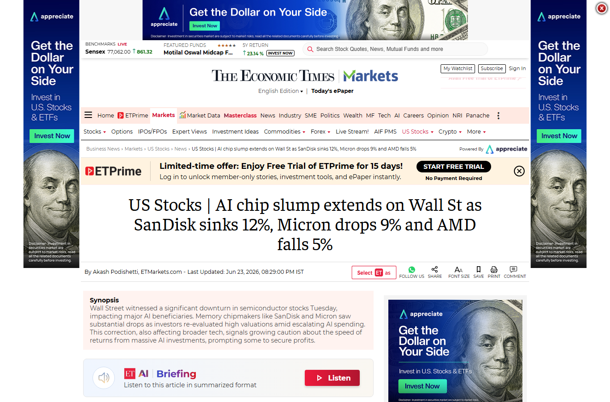
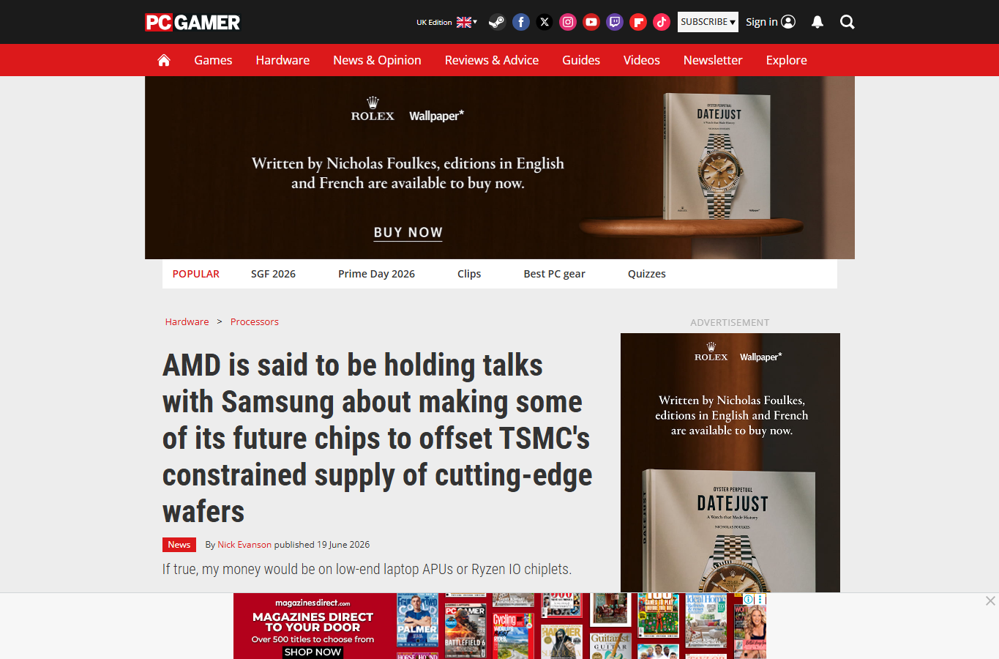
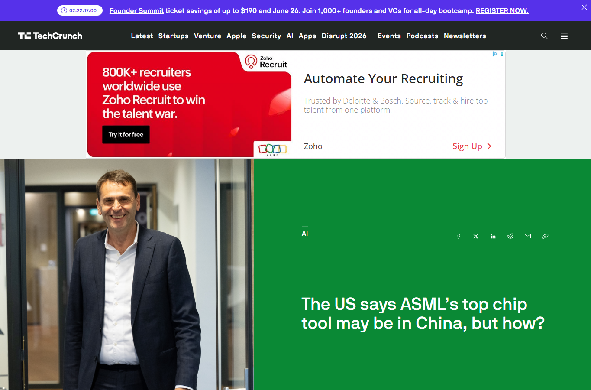

# Daily Semiconductor Current Affairs

Date: 2026-06-23

## News Images

Screenshots for this day should be stored in:

```text
images/2026-06-23/
```

Screenshot/source manifest:

- [../images/2026-06-23/links.md](../images/2026-06-23/links.md)

Current screenshot status: partial. Investopedia and MarketWatch blocked automated screenshot capture; source links retained below.







## Source Snippets

| Source | Link | Geography | Topic | One-Line Summary |
|---|---|---|---|---|
| Investopedia | https://www.investopedia.com/memory-stock-rout-hits-popular-dram-etf-12004971 | International | Memory ETF rout | Memory and data-storage stocks sold off sharply, with a popular memory ETF hit by exposure to Korea's Samsung and SK hynix. |
| MarketWatch | https://www.marketwatch.com/story/micron-and-sandisk-lead-a-sharp-tech-selloff-in-a-gut-check-moment-for-ai-stocks-cd92fa5d | International | Micron/Sandisk selloff | Micron and Sandisk led a sharp AI-memory selloff before Micron earnings. |
| Economic Times | https://m.economictimes.com/markets/us-stocks/news/us-stocks-ai-chip-slump-extends-on-wall-st-as-sandisk-sinks-12-micron-drops-9-and-amd-falls-5/articleshow/131941559.cms | International | AI chip slump | AI chip stocks including Sandisk, Micron, and AMD fell as investors reassessed valuation and capex risk. |
| PC Gamer / Nikkei report | https://www.pcgamer.com/hardware/processors/amd-is-said-to-be-holding-talks-with-samsung-about-making-some-of-its-future-chips-to-offset-tsmcs-constrained-supply-of-cutting-edge-wafers/ | International | Foundry diversification | AMD-Samsung foundry talks remained an important supply-chain follow-up. |
| TechCrunch / Bloomberg report | https://techcrunch.com/2026/06/19/the-us-says-asmls-top-chip-tool-may-be-in-china-asml-says-it-isnt/ | International | ASML/EUV controls | ASML/EUV concerns remained unresolved, with ASML denying shipment to China. |

## Technical Terms / Deep Definitions

| Term | Deep Definition | Why It Appears Today | Source |
|---|---|---|---|
| Memory ETF | A memory ETF is an exchange-traded fund that bundles memory and data-storage stocks into one tradable product. It gives investors concentrated exposure to DRAM, NAND, HBM, SSD, and storage-cycle companies, but it can amplify volatility when those stocks move together. | Memory stocks sold off sharply through ETF-linked exposure. | https://www.sec.gov/resources-for-investors/investor-alerts-bulletins/exchange-traded-funds-etfs |
| DRAM | Dynamic Random-Access Memory stores bits as charge in tiny capacitors that must be refreshed. It is the main working memory technology in PCs, servers, and AI systems, but AI demand increasingly favors high-bandwidth forms such as HBM. | Micron, Samsung, SK hynix, and Sandisk moves were tied to memory-cycle concerns. | https://www.jedec.org/ |
| Capacity allocation | Capacity allocation is the decision about which products and customers receive limited wafer, memory, packaging, or test capacity. In a shortage, producers may prioritize high-margin HBM and data-center parts over consumer memory. | Memory-market volatility is partly about who gets scarce supply. | https://www.semiconductors.org/ |
| Chip valuation risk | Chip valuation risk is the danger that stock prices assume future AI demand, margins, and capex returns that may not materialize. It is not a circuit concept, but it matters because market pressure affects capex, hiring, and product-roadmap funding. | June 23 was a market gut-check for the AI semiconductor trade. | https://www.investor.gov/introduction-investing |

## Discussion

### What Happened?

The memory trade reversed sharply.
Term: Memory ETF
Definition: A memory ETF is a basket of memory and storage stocks that trades like one security. It can make it easier for investors to buy the AI-memory theme, but it can also create crowded trades where many investors exit at the same time. Source: https://www.sec.gov/resources-for-investors/investor-alerts-bulletins/exchange-traded-funds-etfs

Micron and Sandisk led the US memory selloff.
Term: DRAM
Definition: DRAM is volatile semiconductor memory that stores data in capacitor cells and needs periodic refresh. AI demand stresses DRAM supply because HBM uses DRAM dies in complex stacks close to accelerators, competing for wafer and packaging capacity. Source: https://www.jedec.org/

The selloff spread from Korea to US chip stocks.
Term: Capacity allocation
Definition: Capacity allocation is how fabs and memory makers decide which product lines receive limited production capacity. In today's market, AI/HBM can crowd out lower-margin consumer memory, while investor fear rises if pricing or demand looks overheated. Source: https://www.semiconductors.org/

### Why It Matters

June 23 was a reminder that semiconductor fundamentals and semiconductor stock prices are not the same thing. AI demand can be real while the trade around it is still overcrowded. Memory companies may have strong demand and still see large market swings if investors fear that expectations moved too far ahead of earnings.

For VLSI learning, the important connection is that financial volatility follows real technical bottlenecks. HBM is hard to expand quickly because it needs DRAM dies, TSV stacking, bonding, known-good-die control, advanced packaging capacity, and customer qualification. When the market sees that bottleneck, it can push memory stocks too high, then punish them when risk appetite changes.

### News Coverage Mix

- Local / India: No fresh India policy release surfaced today.
- International: Korea memory giants, US memory stocks, AMD/Samsung/TSMC supply risk, and ASML/EUV policy risk dominated.
- Why both matter together: India should study both the engineering bottleneck and the market cycle, because semiconductor careers are shaped by capex and supply decisions.

### Value-Chain Segment

- Memory: Micron, Sandisk, Samsung, SK hynix.
- Market/finance: DRAM ETF, chip-stock selloff, AI valuation risk.
- Foundry: AMD-Samsung reported talks.
- Equipment/policy: ASML/EUV.
- Packaging/test: HBM supply and qualification.

### VLSI / Semiconductor Concepts To Revise

- DRAM cell and refresh
- HBM stack
- TSV and known-good die
- ETF and sector valuation
- Foundry capacity
- PDK portability

## Concept Review

| Concept | Deep Definition | Why It Matters In This News | Revise Next | Source |
|---|---|---|---|---|
| TSV | Through-silicon via is a vertical electrical connection passing through a silicon die. In stacked memory, TSVs let signals and power move vertically between DRAM dies and a base die. | HBM cannot scale like ordinary DIMM memory; vertical connections and bonding make supply harder. | TSV fabrication, bonding, yield. | https://www.jedec.org/ |
| Known-good die | A known-good die is a chip die that has been tested before being integrated into a package or stack. This matters because one bad die inside a multi-die package can ruin the whole product. | HBM and chiplet packages need strong pre-bond testing. | Wafer sort, binning, package test. | https://semiengineering.com/knowledge_centers/test/ |
| Memory cycle | The memory cycle is the repeated boom-bust pattern caused by high fixed costs, delayed capacity additions, and demand swings. | Memory stocks can rise fast during shortages and fall fast when investors fear overvaluation. | Capex, utilization, contract pricing. | https://www.semiconductors.org/ |

### India Relevance

India should connect this to practical roles: DFT, memory-controller verification, package test, reliability, and supply-chain analytics. These skills matter because memory bottlenecks are technical and operational, not only financial.

### Simple Explanation

June 23 ka simple point: memory stocks got hit because investors started asking whether the AI-memory rally had become too crowded. The real engineering issue is still HBM supply. The market issue is that everyone wants exposure to the same bottleneck.

## Interview / Discussion Questions

1. Why does HBM make memory supply harder than ordinary DRAM?
2. What is an ETF, and why can it amplify sector moves?
3. Why can strong AI demand still lead to a stock selloff?
4. Why does known-good-die testing matter for stacked memory?

## Follow-Up

- Micron earnings: still pending for June 24.
- Memory ETF volatility: new watch item.
- ASML/EUV allegation: still pending; ASML denies.
- AMD-Samsung: still reported, not confirmed.
