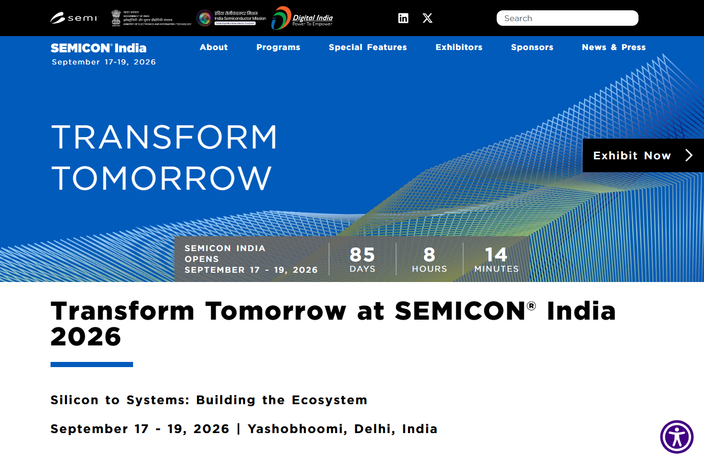

# Daily Semiconductor Current Affairs

Date: 2026-06-24

## News Images

Screenshots for this day should be stored in:

```text
images/2026-06-24/
```

Screenshot/source manifest:

- [../images/2026-06-24/links.md](../images/2026-06-24/links.md)

Current screenshot status: partial. MarketWatch and Investors.com blocked automated screenshot capture; source links retained below.



## Source Snippets

| Source | Link | Geography | Topic | One-Line Summary |
|---|---|---|---|---|
| MarketWatch | https://www.marketwatch.com/livecoverage/stock-market-today-dow-s-p-500-nasdaq-tech-rout-micron-earnings-results/card/u-s-futures-set-to-rise-ahead-of-micron-earnings-iDJ0tl4Yyp2cUflxGGoE | International | Micron earnings watch | US futures attempted to rebound as investors waited for Micron results after a semiconductor-led selloff. |
| MarketWatch | https://www.marketwatch.com/story/worlds-hottest-stock-market-rallies-after-10-plunge-156f47fa | International | Korea chip rebound | Korea's market rebounded after a 10% plunge, with Samsung and SK hynix central to the memory-stock swing. |
| Investors.com | https://www.investors.com/news/technology/cerebras-stock-cbrs-first-report-post-ipo-q1-2026/ | International | Cerebras earnings | Cerebras beat sales expectations and guided higher, but stock reaction remained weak because investors focused on losses and AI infrastructure costs. |
| Investors.com | https://www.investors.com/market-trend/stock-market-today/dow-jones-futures-nasdaq-ai-sell-off-spacex-fedex-cerebras-micron-earnings/ | International | AI selloff and Micron due | Nasdaq broke support during an AI selloff; Cerebras and Micron were key chip names to watch. |
| SEMICON India | https://www.semiconindia.org/ | India | India ecosystem checkpoint | SEMICON India 2026 remains the next India semiconductor ecosystem checkpoint. |

## Technical Terms / Deep Definitions

| Term | Deep Definition | Why It Appears Today | Source |
|---|---|---|---|
| Forward guidance | Forward guidance is management's statement about expected future revenue, margins, demand, supply, and capex. For chip companies, guidance often matters more than the reported quarter because investors want to know whether AI demand and pricing are still improving. | Micron's results after market close are being watched for memory-cycle direction. | https://www.investor.gov/introduction-investing/investing-basics/glossary/earnings-guidance |
| Wafer-scale engine | A wafer-scale engine is an AI processor approach where a very large processor is built at wafer scale rather than as many small chips. It keeps huge compute and SRAM resources on one wafer-sized device, but it creates hard yield, packaging, power, cooling, and system-integration problems. | Cerebras reported its first earnings as a public AI-chip company. | https://www.cerebras.ai/ |
| SRAM | Static RAM stores bits in transistor latch circuits rather than capacitor cells. It is much faster and does not need refresh like DRAM, but it uses far more silicon area per bit, so it is used as cache or on-chip memory rather than bulk memory. | Cerebras uses large on-chip SRAM as part of its wafer-scale architecture. | https://www.jedec.org/ |
| Semiconductor index | A semiconductor index tracks a basket of chip-related stocks, such as designers, foundries, memory makers, equipment suppliers, and EDA firms. It is useful for seeing sector sentiment, but it mixes very different businesses under one market signal. | The AI selloff hit chip stocks broadly. | https://www.nasdaq.com/solutions/phlx-semiconductor-sector-index |

## Discussion

### What Happened?

Micron earnings became the key near-term test for AI memory demand.
Term: Forward guidance
Definition: Forward guidance is the company's forecast and commentary about future demand, supply, margins, and spending. For Micron, guidance matters because investors want to know if HBM and server DRAM demand are strong enough to justify high memory-stock expectations. Source: https://www.investor.gov/introduction-investing/investing-basics/glossary/earnings-guidance

Korean memory stocks rebounded after a sharp drop.
Term: Semiconductor index
Definition: A semiconductor index groups many chip-related companies into one market measure. It can show broad investor sentiment, but it hides the fact that memory, equipment, foundry, EDA, and AI accelerators have different business cycles. Source: https://www.nasdaq.com/solutions/phlx-semiconductor-sector-index

Cerebras delivered its first public earnings report.
Term: Wafer-scale engine
Definition: A wafer-scale engine is a processor built using a whole wafer-scale piece of silicon instead of many conventional reticle-sized chips. The benefit is very large on-chip compute and memory fabric; the risk is that yield, power, cooling, and deployment cost are much harder than with ordinary packaged chips. Source: https://www.cerebras.ai/

Cerebras also highlighted the role of on-chip memory.
Term: SRAM
Definition: SRAM is fast on-chip memory made from transistor latch cells. It avoids refresh and has low latency compared with DRAM, but it consumes much more silicon area per bit, so designers use it for caches and local buffers rather than cheap bulk capacity. Source: https://www.jedec.org/

### Why It Matters

June 24 is a validation day. The market is testing whether the AI semiconductor story has enough earnings support. Micron is the memory validation point. Cerebras is the alternative-AI-chip validation point. Korea's rebound is the sentiment validation point.

For engineering study, the important lesson is that each market move has a technical root. Micron is about HBM/DRAM supply. Cerebras is about wafer-scale integration and SRAM-rich architecture. Korea is about concentrated exposure to memory giants. The AI selloff is about whether capex and chip demand can support valuations.

### News Coverage Mix

- Local / India: No new India policy release was found. SEMICON India 2026 remains the India checkpoint.
- International: Micron, Samsung, SK hynix, Cerebras, and the US chip market dominated.
- Why both matter together: India should study how technical bottlenecks become investment cycles because fab, OSAT, and design decisions depend on capex confidence.

### Value-Chain Segment

- Memory: Micron, Samsung, SK hynix, HBM/DRAM.
- AI accelerators: Cerebras, wafer-scale architecture.
- Market/finance: AI selloff, semiconductor index, earnings guidance.
- Packaging/test: wafer-scale integration and HBM packaging.
- India: SEMICON India ecosystem watch.

### VLSI / Semiconductor Concepts To Revise

- HBM and server DRAM
- Forward guidance and capex
- Wafer-scale integration
- SRAM vs DRAM
- Semiconductor index composition
- AI accelerator architecture

## Concept Review

| Concept | Deep Definition | Why It Matters In This News | Revise Next | Source |
|---|---|---|---|---|
| Wafer-scale integration | Wafer-scale integration tries to build a very large system from a whole wafer or near-wafer-scale silicon instead of dicing the wafer into many small chips. It can reduce off-chip communication, but manufacturing defects, packaging, cooling, and power delivery become much harder. | Cerebras uses this as its architectural difference from GPU-style accelerators. | Yield, redundancy, reticle limit, cooling. | https://www.cerebras.ai/ |
| DRAM vs SRAM | DRAM uses capacitor cells that need refresh and provide dense, cheap bulk memory. SRAM uses latch cells that are faster and refresh-free but much larger per bit. | Micron is a DRAM/HBM story; Cerebras is partly an SRAM-rich architecture story. | 6T SRAM cell, DRAM capacitor, cache hierarchy. | https://www.jedec.org/ |
| Earnings guidance | Earnings guidance is management's forward-looking business outlook. In semiconductors, it shapes capex and valuation because product cycles are long and capacity decisions happen before demand is fully visible. | Micron's guidance can affect the whole AI-memory trade. | Revenue guide, gross margin, capex, backlog. | https://www.investor.gov/introduction-investing/investing-basics/glossary/earnings-guidance |

### India Relevance

India should watch Micron and Cerebras through different skill lenses. Micron points to memory controllers, HBM packaging, test, DFT, and fab operations. Cerebras points to AI accelerator architecture, SRAM, compiler/runtime work, power delivery, cooling, and datacenter deployment.

### Simple Explanation

June 24 ka simple point: the market is asking for proof. Micron must prove AI memory demand is still strong. Cerebras must prove wafer-scale AI chips can become a profitable business. Samsung and SK hynix must prove the memory rally is not only a crowded trade. For India, the study point is that technical bottlenecks and market confidence move together.

## Interview / Discussion Questions

1. Why does Micron guidance matter for the whole AI-memory trade?
2. What is the difference between SRAM and DRAM?
3. Why is wafer-scale integration hard?
4. Why can a semiconductor index fall even if some companies still have strong fundamentals?

## Follow-Up

- Micron earnings: pending until after market close on June 24.
- Cerebras: updated. Revenue beat and stronger guide are positive, but losses and deployment costs remain the risk.
- Korea memory selloff: partially updated. Rebound happened, but volatility remains.
- India: still pending. Watch SEMICON India agenda and ISM updates.
