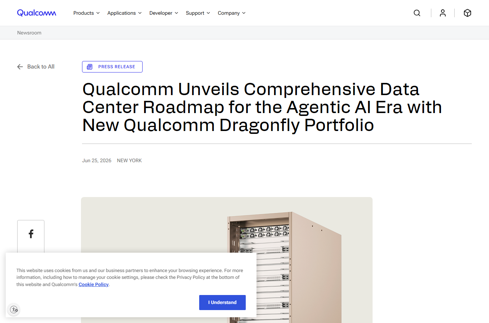
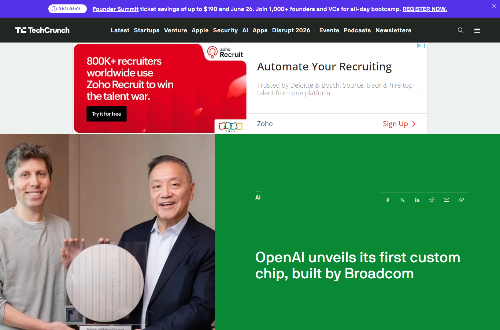
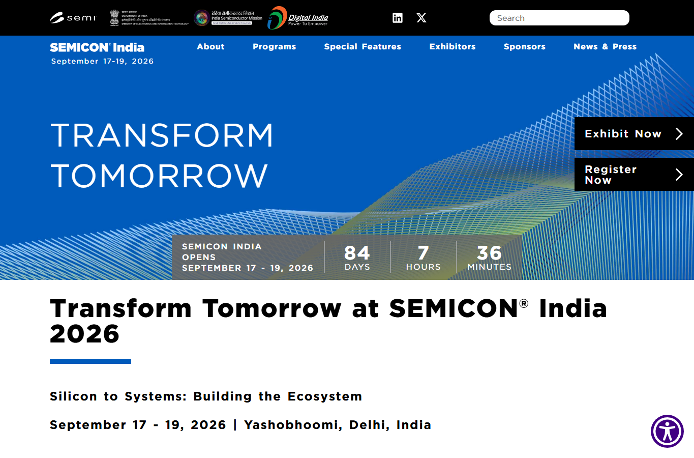

# Daily Semiconductor Current Affairs

Date: 2026-06-25

## News Images

Screenshots for this day should be stored in:

```text
images/2026-06-25/
```

Screenshot/source manifest:

- [../images/2026-06-25/links.md](../images/2026-06-25/links.md)

Current screenshot status: partial. Micron blocked automated screenshot capture; OpenAI's official page hit Cloudflare in headless capture, so the OpenAI/Broadcom headline screenshot uses TechCrunch while the primary OpenAI source link remains cited below.








## Source Snippets

| Source | Link | Geography | Topic | One-Line Summary |
|---|---|---|---|---|
| Micron investor relations | https://investors.micron.com/news-releases/news-release-details/micron-technology-inc-reports-record-results-third-quarter | US / Global | Memory earnings | Micron reported record fiscal Q3 2026 results: $41.46 billion revenue, $25.11 non-GAAP EPS, about 84.9% non-GAAP gross margin, and Q4 revenue guidance of $50.0 billion plus or minus $1.0 billion. |
| Micron prepared remarks | https://investors.micron.com/static-files/631b1a32-5537-46ae-8f40-82e42fc79dfe | US / Global | Memory supply | Micron said DRAM and NAND demand continue to exceed supply and that tight conditions are expected to persist beyond calendar 2027. |
| Qualcomm newsroom | https://www.qualcomm.com/news/releases/2026/06/qualcomm-unveils-comprehensive-data-center-roadmap-for-the-agent | US / Global | AI accelerators / CPUs | Qualcomm unveiled the Dragonfly C1000 CPU, HBC technology, Dragonfly AI300 inference accelerator, and a broader rack-scale AI inference roadmap. |
| Qualcomm and Meta | https://www.qualcomm.com/news/releases/2026/06/qualcomm-and-meta-announce-strategic-multi-generation-agreement- | US / Global | Hyperscaler CPU supply | Qualcomm and Meta announced a multi-generation data center CPU collaboration, with Dragonfly C1000 production planned for the second half of 2028. |
| Qualcomm Modular acquisition | https://www.qualcomm.com/news/releases/2026/06/qualcomm-to-acquire-modular | US / Global | AI software stack | Qualcomm agreed to acquire Modular to strengthen an open, hardware-flexible AI software layer for edge-to-cloud inference. |
| OpenAI | https://openai.com/index/openai-broadcom-jalapeno-inference-chip/ | US / Global | Custom AI chip | OpenAI and Broadcom unveiled Jalapeno, OpenAI's first LLM-optimized inference accelerator, with deployment targeted from late 2026. |
| Economic Times | https://economictimes.indiatimes.com/tech/technology/at-pax-silica-india-seeks-investment/articleshow/131974607.cms | India / US / EU | Policy / materials | India will seek semiconductor investment and multilateral funding at the Pax Silica summit, focused on trusted technology and critical raw-material supply chains. |
| SEMICON India | https://www.semiconindia.org/ | India | Ecosystem checkpoint | SEMICON India 2026 remains scheduled for September 17-19, 2026, at Yashobhoomi, Delhi. |

## Technical Terms / Deep Definitions

| Term | Deep Definition | Why It Appears Today | Source |
|---|---|---|---|
| HBM | High Bandwidth Memory is stacked DRAM placed very close to an accelerator die through advanced packaging. Instead of pushing data through a narrow board-level memory bus, HBM uses many short, parallel connections through the stack and package, which gives AI chips much higher bandwidth per watt. The problem it solves is the memory wall: compute units wait unless model weights, activations, and key-value cache data arrive fast enough. | Micron's HBM4 and HBM4E roadmap is central to the record quarter and AI memory guidance. | https://www.jedec.org/standards-documents/results/jesd235 |
| Strategic Customer Agreement | A Strategic Customer Agreement is a long-term commercial supply arrangement between a chip supplier and major customers. In semiconductors, it can reduce cycle volatility by locking in volume, pricing structure, technology roadmap commitments, or capacity access earlier than normal spot-market purchasing. It matters most when capacity is scarce because the buyer wants assured supply and the supplier wants predictable demand before funding fabs and packaging expansion. | Micron said it has signed 16 SCAs, changing the durability of its memory business model. | https://investors.micron.com/static-files/631b1a32-5537-46ae-8f40-82e42fc79dfe |
| AI inference | AI inference is the phase where a trained model produces outputs for new user requests. Training builds the model; inference serves it repeatedly at scale. In chips, inference stresses latency, memory movement, networking, power, and cost per token because every ChatGPT/Codex/API request becomes a live compute job. | Qualcomm and OpenAI both positioned new hardware around inference rather than only training. | https://www.nvidia.com/en-us/glossary/ai-inference/ |
| Performance per watt | Performance per watt measures how much useful work a chip or system performs for each watt of power. For AI data centers, it is a direct economic metric because power delivery and cooling limit deployment size; a chip that produces more tokens per watt can reduce operating cost and fit more inference capacity into the same electrical envelope. | Qualcomm, Meta, and OpenAI all emphasized energy-efficient inference. | https://www.qualcomm.com/news/releases/2026/06/qualcomm-unveils-comprehensive-data-center-roadmap-for-the-agent |
| American Depositary Receipt | An ADR is a US-traded security representing shares of a non-US company held by a depositary bank. It solves cross-border access problems: US investors can trade a foreign company's economic exposure in dollars and during US market hours instead of directly buying local-market shares. | SK hynix ADR listing reports matter because US access to a leading HBM supplier could alter memory-stock flows and valuation comparisons. | https://www.sec.gov/investor/alerts/adr-bulletin.pdf |
| Pax Silica | Pax Silica is a trusted-technology and critical-supply-chain coalition effort described by Economic Times as a US-led initiative around semiconductor-related materials, funding, and partner-country cooperation. The semiconductor problem it addresses is not transistor design; it is geopolitical concentration in raw materials, rare earths, trusted suppliers, and capital channels. | India is using the summit to seek semiconductor investment and multilateral funding. | https://economictimes.indiatimes.com/tech/technology/at-pax-silica-india-seeks-investment/articleshow/131974607.cms |

## Confirmed Facts

Micron converted the prior "earnings watch" into a confirmed record quarter. It reported $41.46 billion revenue, $28.86 billion non-GAAP net income, $25.11 non-GAAP diluted EPS, and guided fiscal Q4 revenue to $50.0 billion plus or minus $1.0 billion.
Term: HBM
Definition: HBM is stacked DRAM built for very high bandwidth near a processor package. It matters because AI accelerators are often limited by how quickly model data can move, not only by raw arithmetic. Compared with ordinary DDR modules on a motherboard, HBM is closer, wider, faster, and much more packaging-intensive. Source: https://www.jedec.org/standards-documents/results/jesd235

Micron said DRAM and NAND industry demand continues to exceed supply and expects tight conditions to persist beyond calendar 2027.
Term: Strategic Customer Agreement
Definition: A Strategic Customer Agreement is a long-term supply agreement that can reserve capacity, volumes, or commercial terms between a chipmaker and a major customer. In memory, this matters because customers need guaranteed HBM/DRAM/NAND supply while suppliers need confidence before spending billions on fabs, packaging, tooling, and inventory. Source: https://investors.micron.com/static-files/631b1a32-5537-46ae-8f40-82e42fc79dfe

Qualcomm announced a broad Dragonfly data center roadmap: C1000 CPU, High Bandwidth Compute, AI300 inference accelerator, connectivity, and custom silicon.
Term: AI inference
Definition: AI inference is the running phase of AI: a trained model receives a new prompt, image, request, or data stream and generates an answer or prediction. It matters today because inference volume scales with usage; every real customer interaction consumes latency-sensitive compute, memory bandwidth, networking, and energy. Source: https://www.nvidia.com/en-us/glossary/ai-inference/

Qualcomm and Meta announced a multi-generation data center CPU collaboration, with the first Dragonfly C1000 production planned for the second half of 2028.
Term: Performance per watt
Definition: Performance per watt asks how much useful computation a system delivers for each watt of electrical power. In AI data centers, this is not just an engineering metric; it controls capex, cooling, utility availability, and cost per token. A lower-power chip can be strategically valuable even if peak performance is not the only headline. Source: https://www.qualcomm.com/news/releases/2026/06/qualcomm-and-meta-announce-strategic-multi-generation-agreement-

Qualcomm agreed to acquire Modular, an AI software infrastructure company, to strengthen a hardware-flexible software stack.
Term: Hardware-agnostic software stack
Definition: A hardware-agnostic software stack lets developers run or optimize models across CPUs, GPUs, NPUs, and custom ASICs without rewriting everything for one vendor's accelerator. The business problem is lock-in: Nvidia CUDA is powerful partly because developers already use it. Qualcomm buying Modular is a software move to make its silicon easier to adopt. Source: https://www.qualcomm.com/news/releases/2026/06/qualcomm-to-acquire-modular

OpenAI and Broadcom unveiled Jalapeno, OpenAI's first LLM-optimized inference accelerator, and said engineering samples are running ML workloads in the lab.
Term: AI ASIC
Definition: An AI ASIC is an application-specific integrated circuit designed for targeted AI workloads instead of broad general-purpose computing. It can reduce data movement, improve utilization, and lower energy per token, but it is less flexible than GPUs and depends heavily on software, model roadmap stability, packaging, memory, and networking. Source: https://openai.com/index/openai-broadcom-jalapeno-inference-chip/

India is seeking semiconductor investment and multilateral funding at the Pax Silica summit in Washington, D.C.
Term: Pax Silica
Definition: Pax Silica is a coalition-style supply-chain and technology-security effort focused on trusted semiconductor inputs, critical minerals, rare earths, and partner-country funding. For India, it matters because fabs and ATMP projects need not only subsidies but also trusted suppliers, equipment access, raw materials, and strategic capital. Source: https://economictimes.indiatimes.com/tech/technology/at-pax-silica-india-seeks-investment/articleshow/131974607.cms

## Analysis

Today confirms that the AI semiconductor cycle is no longer only a GPU story. It is splitting into three linked bottlenecks: memory supply, inference-optimized compute, and software portability.

Micron is the clearest signal. A record quarter and a $50 billion Q4 revenue guide say the memory shortage is still giving suppliers pricing power. The important technical point is that AI workloads pull memory demand from several directions at once: HBM attached to accelerators, server DRAM for CPU nodes, data center SSDs for storage, and client/mobile memory for local AI features.

Qualcomm is trying to enter the data center through an inference-first angle. Instead of directly copying Nvidia's training GPU position, Qualcomm is arguing that future AI economics will be determined by tokens per watt, rack-scale memory/connectivity, and lower TCO. The Meta CPU agreement validates that hyperscalers are at least willing to diversify CPU supply for AI infrastructure, even though production starts only in 2028.

OpenAI's Jalapeno announcement is strategically important because a model company is moving down the stack into chip architecture. This does not remove Nvidia from the market, but it shows that large AI labs want more control over inference cost, latency, hardware availability, and data-center system design.

Qualcomm buying Modular is the software-side mirror of the same shift. If inference hardware fragments across Nvidia, AMD, Google, Amazon, OpenAI/Broadcom, Qualcomm, and Cerebras, software portability becomes a strategic weapon. A good compiler/runtime layer can make hardware adoption less painful.

India's Pax Silica angle is smaller in immediate dollars but important for policy. India is trying to convert geopolitical supply-chain diversification into funding, materials access, and ecosystem credibility. The key risk is execution: announcements only matter if they connect to fabs, OSAT/ATMP, design IP, equipment support, and trained engineers.

## Value-Chain Segment

- Chipmakers / memory: Micron, SK hynix, Samsung.
- AI accelerators: OpenAI/Broadcom Jalapeno, Qualcomm Dragonfly AI300, Cerebras follow-up.
- Foundry / custom silicon: Broadcom implementation for OpenAI, Qualcomm custom silicon, Meta CPU roadmap.
- Equipment / materials: EUV remains a strategic dependency; Pax Silica highlights raw materials and rare earths.
- Packaging: HBM, advanced 3D stacking, rack-scale systems, and memory integration remain limiting factors.
- EDA / IP / software: Modular acquisition, hardware-agnostic AI software, custom ASIC design cycle.
- Policy / geopolitics: India-US-EU trusted supply chains, China export-control leakage concerns, ASML/EUV follow-up.

## Pending Follow-Ups From Prior Briefings

| Item | Previous Status | June 25 Status | Why |
|---|---|---|---|
| Micron earnings | Pending after market close on June 24 | Updated / closed for Q3 result; new follow-up opened for Q4 execution and SCAs | Micron reported record results and strong Q4 guidance. |
| Korea memory selloff | Partially updated on June 24 | Updated, still volatile | Micron's beat and SK hynix ADR reports lifted the memory complex, but volatility remains. |
| Cerebras first earnings | Updated, profitability risk open | Still pending | No major new primary update today. Keep watching deployment cost and customer concentration. |
| AMD-Samsung foundry talks | Pending | Still pending | No confirmed AMD or Samsung announcement found today. |
| ASML/EUV China concern | Pending | Still pending | No new public evidence found today; ASML denial remains the latest company position. |
| India semiconductor ecosystem | Pending | Updated, still pending | Pax Silica creates a funding/materials watch item; SEMICON India agenda remains pending. |

## VLSI / Semiconductor Concepts To Revise

- HBM stack, TSVs, base die, interposer, and thermal limits.
- DRAM vs NAND demand and why both can tighten in AI data centers.
- Inference vs training workloads.
- Custom ASIC tradeoffs versus GPUs.
- Compiler/runtime portability and why CUDA became a moat.
- ADR listings and how capital markets affect semiconductor capacity expansion.
- Critical minerals, rare earths, and materials security for fabs.

## Concept Review

| Concept | Deep Definition | Why It Matters In This News | Revise Next | Source |
|---|---|---|---|---|
| Memory wall | The memory wall is the gap between how fast compute units can process data and how fast memory systems can deliver data. AI accelerators can have huge arithmetic capacity, but if weights and activations cannot move quickly, compute sits idle. | Micron and Qualcomm both framed memory bandwidth as a binding constraint. | Bandwidth, latency, cache hierarchy, HBM vs DDR. | https://www.jedec.org/standards-documents/results/jesd235 |
| Tape-out | Tape-out is the stage where a chip design is finalized and sent for manufacturing. After tape-out, changes become expensive and slow because masks and wafer fabrication steps are involved. | OpenAI said Jalapeno moved from design to tape-out in nine months. | RTL, verification, GDSII, masks, silicon bring-up. | https://openai.com/index/openai-broadcom-jalapeno-inference-chip/ |
| Total cost of ownership | TCO includes purchase price, power, cooling, networking, racks, software effort, maintenance, utilization, and operational risk. For AI infrastructure, a chip with lower energy per token can win even if sticker price is high. | Qualcomm is positioning Dragonfly around lower TCO for inference. | Capex, opex, utilization, energy cost. | https://www.qualcomm.com/news/releases/2026/06/qualcomm-unveils-comprehensive-data-center-roadmap-for-the-agent |
| Critical raw materials | Critical raw materials are inputs whose supply is economically or strategically important and vulnerable to concentration, disruption, or coercion. In semiconductors this includes gases, chemicals, rare earths, wafers, metals, and specialty materials. | Pax Silica is explicitly about trusted access to such inputs. | Rare earths, gallium, germanium, neon, photoresists. | https://economictimes.indiatimes.com/tech/technology/at-pax-silica-india-seeks-investment/articleshow/131974607.cms |

### India Relevance

India should study June 25 through two lenses. First, Micron proves that memory and packaging skill are strategic, not secondary. Second, Pax Silica shows that India's semiconductor plan must connect manufacturing with materials, trusted capital, international partners, and design talent.

For students, the practical lesson is this: semiconductor power is not only having a fab. It is having the chain around the fab: chemicals, gases, water, power, tools, packaging, EDA, IP, skilled operators, reliability labs, and customers willing to commit.

### Simple Explanation

June 25 ka simple point: AI chips are moving from "who has the fastest GPU" to "who controls memory, inference cost, software, and supply chain." Micron showed memory is scarce and profitable. Qualcomm showed it wants to compete in data-center inference. OpenAI showed AI labs want their own chips. India is trying to enter the trusted supply-chain conversation through Pax Silica.

## Interview / Discussion Questions

1. Why did Micron's results matter for Nvidia, AMD, Broadcom, and the broader AI trade?
2. What is the difference between training and inference in chip-design terms?
3. Why does performance per watt matter more in inference than in many consumer workloads?
4. Why is a hardware-agnostic software stack strategically valuable?
5. How can an ADR listing affect a semiconductor company's capacity expansion?
6. Why are critical raw materials part of semiconductor policy?

## Follow-Up

- Track Micron's Q4 execution, HBM4 customer qualification, and whether strategic customer agreements reduce memory-cycle volatility.
- Track Qualcomm's Investor Day follow-through: Meta CPU production is only planned for 2H 2028, so near-term revenue proof is still needed.
- Track OpenAI/Broadcom Jalapeno technical report and actual deployment timing.
- Track SK hynix ADR filing/listing details and impact on memory-stock liquidity.
- Track India Pax Silica outcomes and whether any funding or materials commitments become concrete.
- Continue ASML/EUV China and AMD-Samsung foundry follow-ups until there is primary-source closure.
