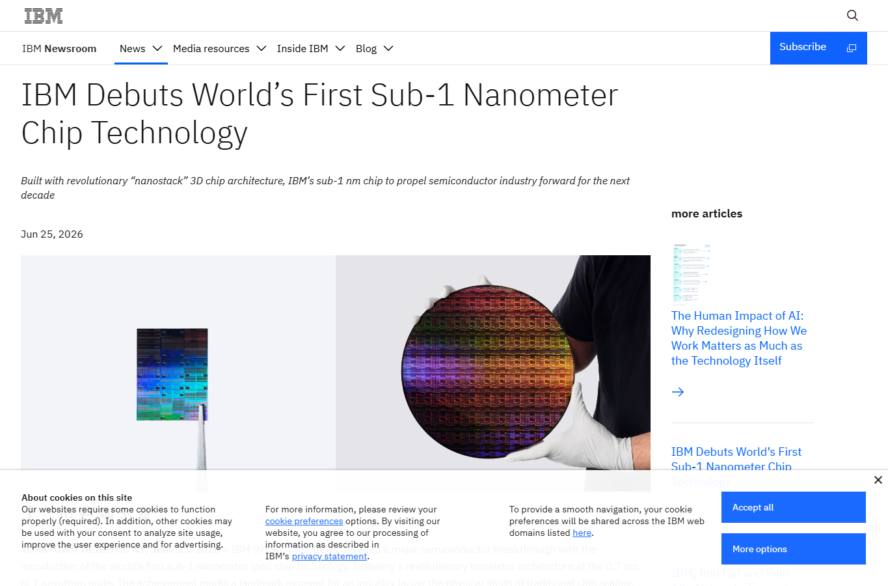
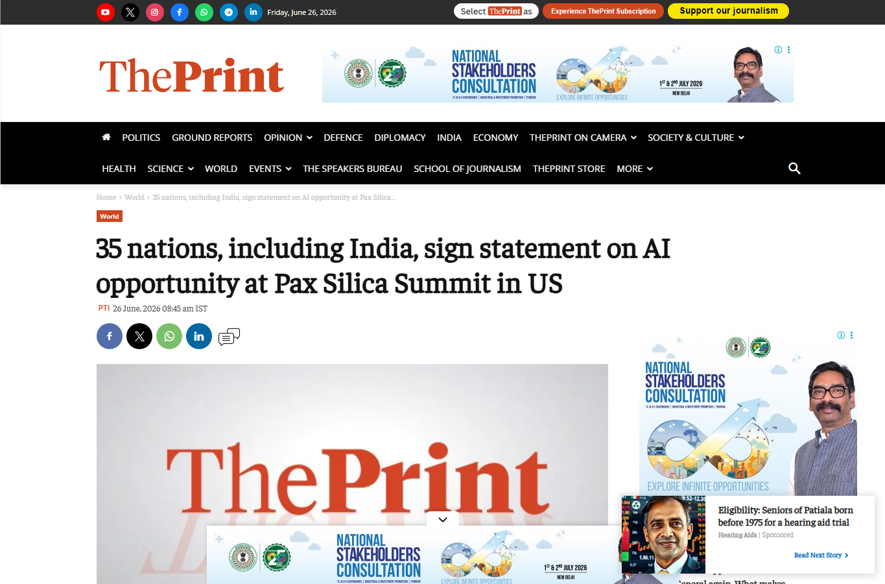
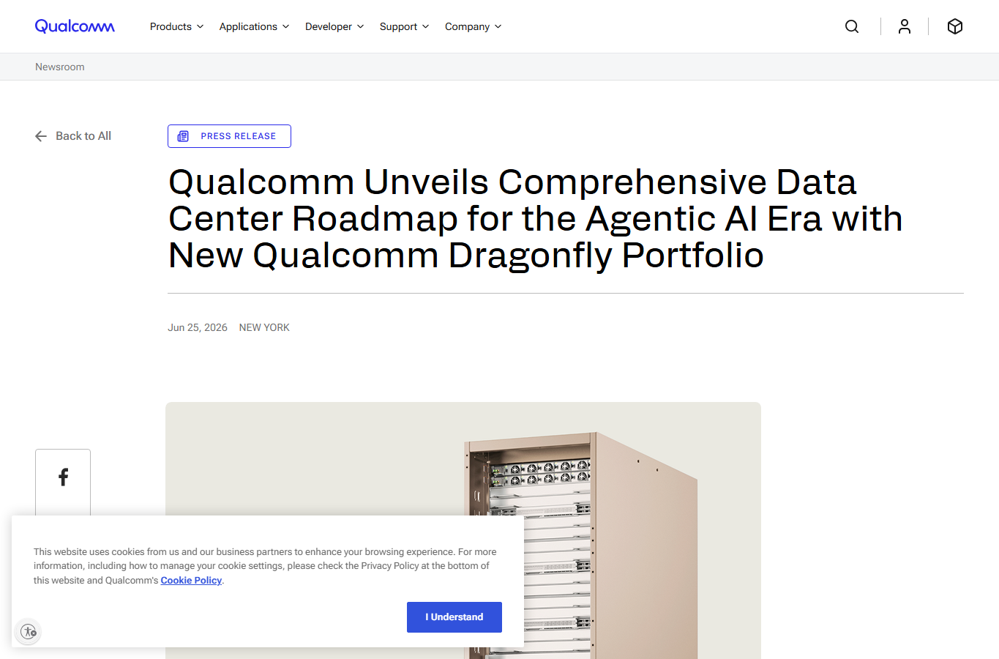
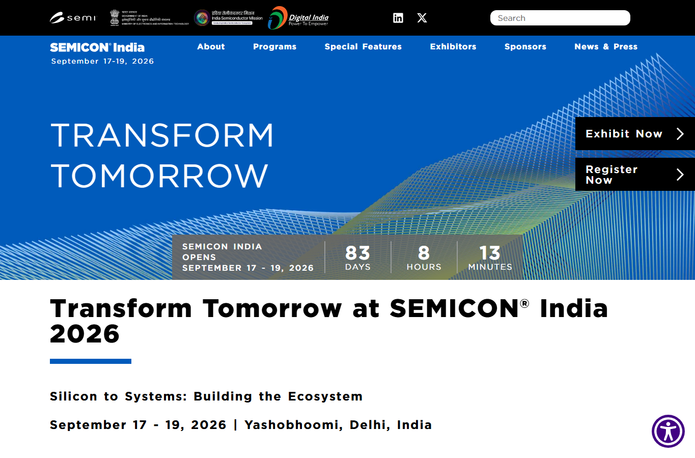

# Daily Semiconductor Current Affairs

Date: 2026-06-26

## Technical Terms / Deep Definitions

Term: High Bandwidth Memory (HBM)
Definition: HBM is DRAM stacked vertically and connected through very short, very wide interconnects inside an advanced package near the processor. The physical problem it solves is data movement: AI accelerators can have enormous compute, but they stall if model weights, activations, and key-value cache data cannot arrive fast enough. HBM is like replacing a narrow road to memory with a very wide, short expressway. It matters today because Micron and SK hynix are using AI demand for HBM to justify record revenue, long-term customer agreements, and new fab/packaging investment. Source: https://www.jedec.org/standards-documents/results/jesd235

Term: Nanostack transistor architecture
Definition: Nanostack is IBM's 3D transistor approach that stacks nanosheet-style transistor structures so more logic can fit in the same chip area. The manufacturing problem it tries to solve is that two-dimensional transistor shrink is running into spacing, leakage, wiring, and material limits. Instead of only squeezing transistors side by side, nanostack moves part of the structure vertically, like building a city upward when land runs out. It matters today because IBM says this is a path to sub-1 nm logic scaling for future AI and cloud chips. Source: https://research.ibm.com/blog/what-is-a-nanostack

Term: High-NA EUV
Definition: High numerical aperture extreme ultraviolet lithography is the next generation of EUV patterning with higher optical resolution than today's EUV scanners. The fabrication problem it solves is printing extremely small and dense circuit features without repeating many lower-resolution patterning steps. Fewer patterning steps can improve yield because each extra exposure and etch adds alignment risk. It matters today because IBM says sub-1 nm nanostack production depends on High-NA EUV process capability from ASML-class tools. Source: https://www.asml.com/en/technology/lithography-principles

Term: American Depositary Receipt (ADR)
Definition: An ADR is a US-traded certificate representing shares of a non-US company held by a depositary bank. The market-access problem it solves is that US investors can buy foreign-company exposure in dollars and through US market infrastructure instead of directly trading on a foreign exchange. It matters today because SK hynix's planned US listing could raise capital for HBM fabs, packaging lines, and EUV equipment while giving US investors direct exposure to a leading AI memory supplier. Source: https://www.sec.gov/investor/alerts/adr-bulletin.pdf

Term: High Bandwidth Compute (HBC)
Definition: HBC is Qualcomm's data-center memory/compute architecture for inference accelerators. Qualcomm describes it as an integrated memory technology meant to raise effective memory bandwidth and capacity per watt versus conventional accelerator memory approaches. The system problem it solves is inference throughput under power limits: agents and large language models need fast memory access while racks are constrained by electricity and cooling. It matters today because Qualcomm is trying to compete in AI infrastructure by attacking memory bandwidth per watt, not only peak compute. Source: https://www.qualcomm.com/news/releases/2026/06/qualcomm-unveils-comprehensive-data-center-roadmap-for-the-agent

Term: Pax Silica
Definition: Pax Silica is a US-led trusted-technology and supply-chain initiative focused on AI infrastructure, semiconductors, critical minerals, energy, advanced manufacturing, and investment coordination among partner economies. The policy problem it solves is dependency concentration: AI systems need chips, tools, minerals, power, logistics, and trusted suppliers, and many of those inputs are geopolitically concentrated. It matters today because 35 nations, including India, signed a Joint Statement on AI Opportunity at the second Pax Silica Summit. Source: https://theprint.in/world/35-nations-including-india-sign-statement-on-ai-opportunity-at-pax-silica-summit-in-us/2970173/

Term: Advanced node
Definition: An advanced node is a leading semiconductor manufacturing generation used for high-performance chips, typically described by labels such as 7 nm, 5 nm, 3 nm, or 2 nm. The label is no longer a literal transistor dimension; it is a technology generation combining transistor architecture, wiring density, power, performance, and cost. It matters today because reported TSMC price increases across advanced nodes would raise wafer costs for Nvidia, AMD, Apple, Qualcomm, Broadcom, and other AI chip designers. Source: https://www.tomshardware.com/tech-industry/semiconductors/tsmc-is-reportedly-hiking-prices-for-all-advanced-nodes-accounting-for-74-percent-of-the-companys-wafer-business-nvidia-amd-apple-qualcomm-and-others-will-face-higher-wafer-costs

## News Images

Screenshots for this day should be stored in:

```text
images/2026-06-26/
```

Screenshot/source manifest:

- [../images/2026-06-26/links.md](../images/2026-06-26/links.md)

Current screenshot status: captured five headline/date/source screenshots. Reuters mirror pages for the Micron/Qualcomm market-rally item blocked automated screenshot capture, so that item is retained as a cited text source only.










## Source Snippets

| Source | Link | Geography | Topic | One-Line Summary |
|---|---|---|---|---|
| IBM Newsroom | https://newsroom.ibm.com/2026-06-25-ibm-debuts-worlds-first-sub-1-nanometer-chip-technology | US / Global | Device architecture / research | IBM announced a sub-1 nm chip technology using a 0.7 nm / 7 angstrom nanostack architecture, claiming nearly 100 billion transistors on a fingernail-sized chip. |
| IBM Research | https://research.ibm.com/blog/what-is-a-nanostack | US / Global | Transistor architecture | IBM explains nanostack as stacked nanosheets that move logic scaling into 3D and require wafer bonding, backside power, High-NA EUV, metrology, and EDA support. |
| Micron investor relations | https://investors.micron.com/news-releases/news-release-details/micron-technology-inc-reports-record-results-third-quarter | US / Global | Memory earnings | Micron reported record fiscal Q3 revenue of $41.46 billion and guided Q4 revenue to $50.0 billion plus or minus $1.0 billion. |
| Kitco / Reuters | https://www.kitco.com/news/off-the-wire/2026-06-25/tech-stocks-surge-micron-earnings-ease-ai-fears-oil-falls-further | Global | Market-moving signal | Reuters reported that Micron and Qualcomm forecasts helped reignite the AI rally, lifting Japan, Korea, US futures, and semiconductor sentiment. |
| Investing.com / Reuters | https://www.investing.com/news/stock-market-news/micron-and-qualcomm-forecasts-ignite-400-billion-ai-chip-stock-rally-4759394 | US / Global | Chip-stock rally | Reuters reported over $400 billion of chip-market value added after Micron and Qualcomm forecasts, with ASML and Applied Materials also rising. |
| Qualcomm newsroom | https://www.qualcomm.com/news/releases/2026/06/qualcomm-unveils-comprehensive-data-center-roadmap-for-the-agent | US / Global | AI accelerators / memory architecture | Qualcomm detailed Dragonfly C1000, HBC, AI300, connectivity, custom silicon, and annual accelerator roadmap plans. |
| Tom's Hardware / SEC filing reference | https://www.tomshardware.com/tech-industry/sk-hynix-files-to-raise-up-to-29-billion-in-nasdaq-listing | Korea / US | Memory capital markets / equipment | SK hynix filed for a large ADR raise to fund Yongin fab work, Cheongju advanced packaging, and EUV equipment. |
| SEC Form F-1 | https://www.sec.gov/Archives/edgar/data/2120882/000119312526280172/d32785df1.htm | Korea / US | Primary filing | SK hynix filed an F-1 registration statement for common shares represented by ADSs. |
| ThePrint / PTI | https://theprint.in/world/35-nations-including-india-sign-statement-on-ai-opportunity-at-pax-silica-summit-in-us/2970173/ | India / US / Global | Policy / supply chain | Thirty-five nations, including India, signed a Joint Statement on AI Opportunity at the second Pax Silica Summit. |
| Business Standard / PTI | https://www.business-standard.com/world-news/india-34-others-sign-statement-on-ai-opportunity-at-pax-silica-summit-126062600123_1.html | India / US / Global | Policy / supply chain | India's delegation engaged on semiconductors, AI, and resilient technology supply chains. |
| PR Newswire / Ceva | https://www.prnewswire.com/news-releases/ceva-ceo-amir-panush-named-artificial-intelligence-company-ceo-of-the-year-in-2026-ai-breakthrough-awards-program-302810369.html | US / Global | Semiconductor IP / edge AI | Ceva highlighted its Connect, Sense and Infer IP portfolio for distributed edge inference. |
| Tom's Hardware / Culpium report | https://www.tomshardware.com/tech-industry/semiconductors/tsmc-is-reportedly-hiking-prices-for-all-advanced-nodes-accounting-for-74-percent-of-the-companys-wafer-business-nvidia-amd-apple-qualcomm-and-others-will-face-higher-wafer-costs | Taiwan / Global | Foundry pricing | TSMC reportedly told customers to prepare for 5% to 10% price increases across advanced-node production. |
| SEMICON India | https://www.semiconindia.org/ | India | India ecosystem checkpoint | SEMICON India 2026 remains scheduled for September 17-19, 2026, at Yashobhoomi, Delhi. |

## Confirmed Facts

IBM announced a sub-1 nm logic research milestone using nanostack architecture.
Term: Nanostack transistor architecture
Definition: Nanostack is a 3D logic-scaling architecture that stacks nanosheet transistor structures instead of only placing devices side by side. This matters because classical transistor scaling is constrained by leakage, spacing, wiring, and material limits. IBM says its version supports nearly twice the density of its 2 nm chip and could improve performance or energy efficiency for future AI and cloud compute. Source: https://research.ibm.com/blog/what-is-a-nanostack

IBM said the technology depends on structural/material innovations and future High-NA EUV capability.
Term: High-NA EUV
Definition: High-NA EUV is next-generation extreme ultraviolet lithography with better patterning resolution. It matters because when circuit features approach atomic scale, repeating lower-resolution patterning steps creates overlay and defect risk. A higher-resolution single or reduced-step pattern can improve manufacturability and yield. Source: https://www.asml.com/en/technology/lithography-principles

Micron's record Q3 result and stronger Q4 guide became a market-wide semiconductor signal.
Term: High Bandwidth Memory (HBM)
Definition: HBM is stacked memory designed to sit close to AI accelerators and move data at very high bandwidth. It matters because Micron's strong results are not only about selling more commodity memory; the AI cycle is shifting value toward high-performance memory that is packaged with accelerators. Source: https://www.jedec.org/standards-documents/results/jesd235

Reuters reported that Micron and Qualcomm forecasts helped add more than $400 billion in semiconductor market value in late trading, with memory peers, Arm, Marvell, Broadcom, ASML, and Applied Materials moving higher.
Term: Semiconductor equipment supplier
Definition: A semiconductor equipment supplier makes the tools used to fabricate, inspect, package, and test chips. ASML sells lithography tools; Applied Materials sells deposition, etch, inspection, and process equipment. Their stocks move with AI demand because more AI chips and HBM capacity require more fab tools before supply can expand. Source: https://www.semi.org/en

Qualcomm's data-center story stayed active because its Dragonfly roadmap uses HBC to compete in inference infrastructure.
Term: High Bandwidth Compute (HBC)
Definition: HBC is Qualcomm's memory/compute architecture for AI inference cards and racks. Qualcomm says HBC raises effective memory bandwidth per watt and capacity per watt, which targets the main bottleneck for large language model serving: moving huge amounts of data under tight rack power limits. Source: https://www.qualcomm.com/news/releases/2026/06/qualcomm-unveils-comprehensive-data-center-roadmap-for-the-agent

SK hynix moved toward a large US ADR offering tied to AI memory expansion, advanced packaging, and EUV equipment funding.
Term: American Depositary Receipt (ADR)
Definition: An ADR lets US investors trade a foreign company's shares through a US-listed depositary instrument. For SK hynix, it could expand investor access and raise capital for memory capacity, but the new fabs and packaging lines would not solve today's shortage immediately because semiconductor capacity takes years to build and qualify. Source: https://www.sec.gov/investor/alerts/adr-bulletin.pdf

Thirty-five nations, including India, signed the Joint Statement on AI Opportunity at the second Pax Silica Summit.
Term: Pax Silica
Definition: Pax Silica is a trusted supply-chain and AI infrastructure alignment effort. It matters for semiconductors because AI leadership depends on compute, chips, advanced manufacturing, critical minerals, energy, logistics, and private capital, not only algorithms. Source: https://theprint.in/world/35-nations-including-india-sign-statement-on-ai-opportunity-at-pax-silica-summit-in-us/2970173/

Ceva highlighted distributed edge inference through its Connect, Sense and Infer IP portfolio.
Term: Semiconductor IP
Definition: Semiconductor IP is reusable, pre-designed circuit or software/hardware blocks licensed into chips. It solves the design-time problem: companies do not want to reinvent every interface, DSP, NPU, wireless, security, or sensor block from scratch. Ceva matters because edge AI depends on licensed building blocks that can run inference locally under tight power and latency constraints. Source: https://www.prnewswire.com/news-releases/ceva-ceo-amir-panush-named-artificial-intelligence-company-ceo-of-the-year-in-2026-ai-breakthrough-awards-program-302810369.html

## Analysis

June 26 is a "proof and bottleneck" day. Micron and Qualcomm gave the market proof that AI demand is spreading beyond GPUs. IBM showed a possible long-term path for device scaling. SK hynix showed that memory suppliers need capital markets to fund the next wave of HBM capacity. Pax Silica showed that governments are treating compute and chip supply chains as strategic infrastructure.

The Micron/Qualcomm rally matters because it tests whether the AI trade can survive valuation fear. Earlier this week, semiconductor stocks sold off because investors questioned whether AI capex would convert into earnings. Micron's results gave a direct answer: memory suppliers are already monetizing the boom. Qualcomm gave a second answer: hyperscalers are looking beyond GPUs into CPUs, inference accelerators, memory architecture, and custom silicon.

The IBM news matters differently. It is not a 2026 production story. It is a research-roadmap story. The important detail is that IBM is not just shrinking a number. Nanostack requires 3D device construction, wafer bonding, backside power, new materials, High-NA EUV, metrology, and EDA support. That means future scaling is becoming a system of process, device, materials, tools, and design automation.

The SK hynix ADR story links capital markets to manufacturing capacity. AI memory shortages cannot be solved by sentiment alone. A fab cluster, HBM packaging plant, and EUV scanner pipeline are multi-year projects. This is why a memory stock rally and an ADR raise matter for actual supply: money has to become buildings, tools, qualified processes, yield, and packaged output.

Pax Silica links geopolitics to the same hardware reality. Nations are not only arguing about AI regulation; they are trying to organize trusted supply chains for chips, minerals, energy, and compute. India should treat this as an ecosystem opportunity, but also as an execution challenge: partnership value depends on whether India can translate alignment into fabs, ATMP, materials, testing, talent, and design wins.

TSMC's reported price-hike follow-up is a foundry warning. Even if AI demand is strong, higher wafer prices can move through the chain into chip ASPs, cloud costs, device prices, and gross margins. That is why the memory shortage, TSMC pricing, and Qualcomm's performance-per-watt story are linked: every part of the AI hardware stack is under cost and capacity pressure.

## Value-Chain Segment

- Chipmakers / memory: Micron, SK hynix, Samsung, Western Digital, Sandisk, Seagate.
- Foundry: TSMC reported advanced-node price pressure; AMD-Samsung reported talks remain unconfirmed.
- AI accelerators: Qualcomm Dragonfly AI300, OpenAI/Broadcom Jalapeno follow-up, Cerebras still under profitability watch.
- Equipment: ASML and Applied Materials moved with the AI rally; SK hynix funding is tied to EUV and fab equipment.
- EDA/IP: Ceva edge AI IP and IBM's note that nanostack needs EDA support.
- Materials/device architecture: IBM nanostack, new channel/material combinations, wafer bonding, backside power.
- Packaging/test: HBM packaging, Cheongju advanced packaging, HBC memory architecture, advanced interconnect.
- Policy/geopolitics: Pax Silica, India-US-EU trusted technology supply-chain alignment, ASML/EUV export-control follow-up.

## Pending Follow-Ups From Prior Briefings

| Item | Previous Status | June 26 Status | Why |
|---|---|---|---|
| Micron earnings | Q3 closed; Q4 execution and SCAs open | Updated, still open | Market reaction confirms Micron became the memory-cycle validation point; next watch is whether Q4 guide and customer agreements hold. |
| Qualcomm data center roadmap | Open after June 25 | Updated, still open | Market reaction is positive, but Dragonfly C1000 production is still planned for 2H 2028 and HBC/AI300 sampling is later. |
| OpenAI/Broadcom Jalapeno | Pending deployment details | Still pending | No new primary technical report today. Watch silicon bring-up, software stack, package/memory details, and deployment timing. |
| SK hynix ADR/listing | Open after reports | Updated, still open | SEC filing and reports point to a very large capital raise; final pricing, July 10 listing, and use of proceeds need tracking. |
| ASML/EUV China concern | Pending | Still pending | No new primary evidence today. IBM/High-NA news reinforces why EUV control remains strategic. |
| AMD-Samsung foundry talks | Pending | Still pending | No official AMD or Samsung confirmation found today. |
| India semiconductor ecosystem | Updated through Pax Silica | Updated, still open | India is active in Pax Silica; next watch is concrete funding, materials, fab, ATMP, and SEMICON India commitments. |
| Cerebras first earnings | Updated, profitability risk open | Still pending | No major new company update today. |

## VLSI / Semiconductor Concepts To Revise

- HBM stack, TSV, interposer, base die, thermal path, and package yield.
- Nanostack vs nanosheet vs FinFET.
- High-NA EUV and why fewer patterning steps can improve yield.
- ADR vs ordinary shares vs ADS.
- HBC, HBM, SRAM, LPDDR, and memory bandwidth per watt.
- Foundry pricing, wafer allocation, and gross margin pass-through.
- Edge AI IP: NPU IP, DSP IP, sensor fusion, local inference.
- Supply-chain policy: critical minerals, trusted compute, energy, and capital.

## Concept Review

| Concept | Deep Definition | Why It Matters In This News | Revise Next | Source |
|---|---|---|---|---|
| 3D sequential integration | 3D sequential integration builds active transistor/device layers vertically in sequence, rather than only connecting separately completed chips side by side. The hard parts are thermal budget, alignment, wafer bonding, metrology, and interconnect density. | IBM's nanostack architecture depends on moving logic scaling into 3D. | Wafer bonding, monolithic 3D, thermal budget. | https://research.ibm.com/blog/what-is-a-nanostack |
| Backside power delivery | Backside power delivery routes power from the back of the wafer, separating power wiring from signal wiring. This can reduce congestion and voltage drop in dense logic. | IBM says nanostack benefits from backside power; Intel and TSMC roadmaps also use backside-style ideas. | IR drop, routing congestion, buried power rail. | https://research.ibm.com/blog/what-is-a-nanostack |
| Memory bandwidth per watt | Memory bandwidth per watt measures how much data can be moved for each watt spent. AI inference is power-constrained, so bandwidth efficiency can be more important than peak compute alone. | Qualcomm is positioning HBC against HBM/GPU-style architectures. | Bandwidth, latency, capacity, energy per bit. | https://www.qualcomm.com/news/releases/2026/06/qualcomm-unveils-comprehensive-data-center-roadmap-for-the-agent |
| Take-or-pay / long-term supply agreement | A long-term supply agreement can commit customers to buy or pay for capacity, giving the supplier more predictable demand and giving the customer supply access. | Micron's strategic customer agreements are meant to reduce cyclicality and justify capacity investment. | Supply contracts, capex, utilization, cycle risk. | https://investors.micron.com/news-releases/news-release-details/micron-technology-inc-reports-record-results-third-quarter |
| Advanced packaging | Advanced packaging integrates multiple dies, memory stacks, interposers, bridges, substrates, and thermal solutions into one high-performance module. It solves the problem that one monolithic die cannot economically contain all compute and memory. | SK hynix, Micron, Qualcomm, and OpenAI/Broadcom all depend on package-level integration. | CoWoS, EMIB, hybrid bonding, HBM attach. | https://www.intel.com/content/www/us/en/foundry/emib.html |

### India Relevance

India should read today's news as a capacity lesson. AI leadership is not only model training or software. The hard constraints are memory, lithography, advanced packaging, energy, trusted supply chains, and capital formation.

Pax Silica gives India diplomatic leverage, but the real test is industrial execution. India needs material suppliers, OSAT/ATMP capacity, reliability labs, semiconductor-grade chemicals and gases, fab operations talent, power/water planning, and design/IP teams. SEMICON India 2026 should be used to watch which of these become actual commitments.

### Simple Explanation

June 26 ka simple point: AI hardware demand is real, but every layer is constrained. Micron proves memory is scarce and profitable. Qualcomm proves companies are trying new inference architectures. IBM proves transistor scaling is moving into 3D and atomic-scale manufacturing. SK hynix proves memory expansion needs huge capital. Pax Silica proves governments now see chips, compute, minerals, and energy as one strategic stack.

## Interview / Discussion Questions

1. Why can HBM demand lift equipment makers like ASML and Applied Materials?
2. Why does nanostack architecture need High-NA EUV, wafer bonding, and new EDA support?
3. How does an ADR help SK hynix raise capital for fabs and packaging?
4. Why is Qualcomm focusing on memory bandwidth per watt for inference?
5. How can TSMC wafer price hikes affect Nvidia, AMD, Apple, and cloud AI costs?
6. Why is Pax Silica relevant to semiconductor manufacturing, not only AI policy?

## Follow-Up

- Track Micron Q4 execution and whether strategic customer agreements reduce memory-cycle volatility.
- Track Qualcomm HBC sampling, AI300 sampling, Meta CPU timeline, and Modular integration.
- Track IBM nanostack technical papers and whether EDA/tool vendors show practical support.
- Track SK hynix ADR pricing, July 10 listing, and allocation of proceeds to Yongin, Cheongju, and EUV tools.
- Track TSMC price-hike confirmation from primary sources.
- Track Pax Silica concrete outputs: funding, critical minerals, fab/ATMP commitments, and India-specific partnerships.
- Continue ASML/EUV China, AMD-Samsung foundry, and Cerebras profitability follow-ups.
