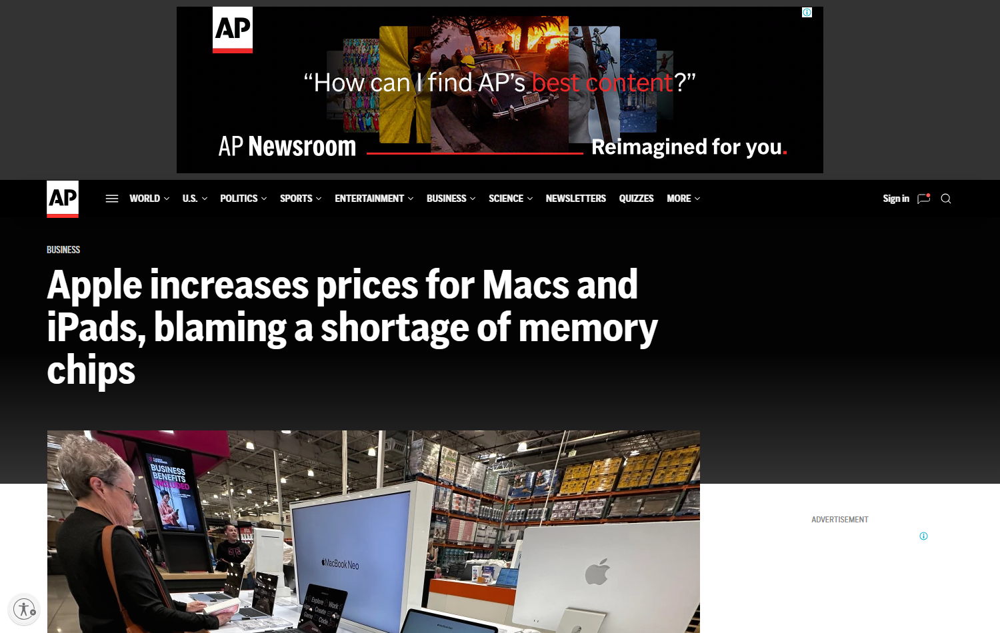

# Daily Semiconductor Current Affairs

Date: 2026-06-27

## Quick Index

| No. | Topic | Main Sources | Why To Read |
|---|---|---|---|
| 1 | Consumer-device memory shortage | AP, Micron | Shows how AI demand for memory can reach normal buyers through higher Mac/iPad prices. |
| 2 | Semiconductor prices and inflation | AP inflation report | Connects chip supply pressure with broader goods inflation, not only stock-market moves. |
| 3 | Previous research expansion | Qualcomm, Micron, JEDEC | Adds deeper explanation to the June 25-26 AI-memory and inference-chip research. |
| 4 | VLSI revision angle | JEDEC, Qualcomm | Memory hierarchy, HBM, LPDDR, NAND, inference cost, and data movement. |

## News Images

Screenshots for this day are stored in:

```text
images/2026-06-27/
```

Screenshot/source manifest:

- [../images/2026-06-27/links.md](../images/2026-06-27/links.md)

Current screenshot status: one clean AP headline screenshot was captured. A second AP inflation page and Qualcomm's official page were retained as cited links because automated screenshot capture either produced a privacy overlay or a blank page.



## Source Snippets

| Source | Link | Geography | Topic | One-Line Summary |
|---|---|---|---|---|
| AP News | https://apnews.com/article/fe95fe57dfa9b4a9917d68df5dcfe0e3 | US / Global | Consumer-device pricing | Apple raised Mac and iPad prices and blamed a shortage of memory chips. |
| AP News | https://apnews.com/article/inflation-federal-reserve-spending-d9348cc01b41c8de31051acf1b39268f | US / Global | Inflation / supply costs | AP reported that semiconductors, food, and electricity were among items becoming pricier in the latest inflation context. |
| Micron investor relations | https://investors.micron.com/news-releases/news-release-details/micron-technology-inc-reports-record-results-third-quarter | US / Global | Memory earnings | Micron's record quarter and strong guidance are the supply-side reason memory-price pressure is believable. |
| Qualcomm newsroom | https://www.qualcomm.com/news/releases/2026/06/qualcomm-unveils-comprehensive-data-center-roadmap-for-the-agent | US / Global | Inference architecture | Qualcomm's Dragonfly roadmap focuses on data-center inference, memory bandwidth, connectivity, and power efficiency. |
| JEDEC HBM standard page | https://www.jedec.org/standards-documents/results/jesd235 | Global | Memory standard | JEDEC is the standards body reference for HBM terminology and stack/bandwidth context. |

## Technical Terms / Deep Definitions

Term: DRAM
Definition: DRAM, or dynamic random-access memory, stores each bit using a tiny capacitor and transistor cell. Because the capacitor leaks charge, DRAM must be refreshed repeatedly. The advantage is density: DRAM can store a lot of data at lower cost per bit than SRAM, so it becomes the main working memory for PCs, phones, servers, and AI systems. It matters today because AI servers, HBM stacks, and consumer products all compete for advanced memory capacity. Source: https://www.jedec.org/

Term: LPDDR
Definition: LPDDR is low-power DRAM used in mobile devices and thin laptops. It reduces voltage and power draw compared with standard desktop/server DRAM, which helps battery life and thermal design. The tradeoff is that LPDDR supply is still tied to the same memory-industry capacity decisions that also serve data-center AI demand. It matters today because when AI demand absorbs memory output, device makers using LPDDR can face higher costs and tighter allocation. Source: https://www.jedec.org/

Term: NAND flash
Definition: NAND flash is non-volatile memory, meaning it keeps data even when power is off. It is used in SSDs, phones, memory cards, and data-center storage. The physical problem it solves is persistent storage, while DRAM solves fast temporary working memory. It matters today because AI data centers need both: DRAM/HBM for active computation and NAND SSDs for model checkpoints, datasets, logs, and storage layers. Source: https://www.jedec.org/

Term: Memory wall
Definition: The memory wall is the performance gap between how quickly compute units can process data and how quickly the memory system can deliver that data. A processor may have many arithmetic units, but if weights, activations, or user-context data arrive too slowly, expensive compute sits idle. It matters today because the same bottleneck that pushes AI companies toward HBM can also tighten ordinary DRAM and LPDDR supply. Source: https://www.jedec.org/standards-documents/results/jesd235

Term: Pass-through inflation
Definition: Pass-through inflation happens when a company's higher input cost is passed to buyers through higher product prices. In semiconductors, this can happen when memory, wafers, substrates, packaging, or logistics become expensive enough that device makers cannot absorb the cost inside their margins. It matters today because Apple's price rise turns an upstream chip shortage into a visible consumer-price signal. Source: https://apnews.com/article/inflation-federal-reserve-spending-d9348cc01b41c8de31051acf1b39268f

Term: AI inference
Definition: AI inference is the stage where a trained model answers real user requests. Training builds the model; inference runs it repeatedly. The engineering problem is not only peak compute. Inference must control latency, memory bandwidth, networking, power, and cost per token. It matters today because Qualcomm, OpenAI/Broadcom, and other players are designing chips around cheaper inference, while memory demand keeps rising. Source: https://www.nvidia.com/en-us/glossary/ai-inference/

## Confirmed Facts

Apple's price action is the most practical signal in this note. The semiconductor story is often discussed through Nvidia, Micron, SK hynix, TSMC, and ASML, but consumer-device pricing shows the second-order effect. If memory makers prioritize HBM, server DRAM, and high-margin data-center demand, then consumer device makers can face higher LPDDR and NAND costs.

The AP inflation context matters because semiconductors are not isolated from macroeconomics. If chips, electricity, and food rise together, central banks and consumers see the result as inflation pressure. For current-affairs preparation, this is important: a semiconductor shortage can become an economics topic, not only a VLSI or stock-market topic.

Micron's June 25 results give the technical reason behind the pressure. Micron said demand remained ahead of supply and guided very strongly. That means the Apple/AP story is not random; it fits the broader memory-cycle evidence from the previous research.

Qualcomm's data-center roadmap adds the forward-looking angle. AI inference chips need memory bandwidth per watt, rack-scale connectivity, and predictable software support. If inference grows as quickly as expected, memory demand will not only come from training GPUs. It will also come from CPUs, accelerators, networking, storage, and edge-to-cloud deployment.

## Analysis

June 27 is a "shortage reaches the customer" day. Earlier notes focused on chip companies and capital markets. This note explains how the same memory shortage can travel through the chain and reach a person buying a laptop or tablet.

The simple chain is:

```text
AI data-center growth -> higher HBM/server DRAM demand -> memory suppliers prioritize scarce capacity -> consumer-memory allocation tightens -> device makers pay more -> end-user prices rise
```

This does not mean every Mac or iPad price rise is caused only by AI. Device pricing also depends on tariffs, exchange rates, product mix, margins, and retail strategy. But the memory explanation is technically plausible because memory is a shared upstream input. LPDDR and NAND are not the same as HBM, but they come from the same industry structure: Samsung, SK hynix, Micron, and other suppliers decide where wafer starts, packaging capacity, and capex should go.

For VLSI study, the key lesson is that "memory" is not one thing. HBM is high-bandwidth stacked DRAM for accelerators. LPDDR is low-power DRAM for phones and laptops. NAND is persistent storage. Server DRAM supports CPUs and general data-center workloads. These products have different packages and interfaces, but they compete for fab capacity, equipment, materials, and investment attention.

This also adds explanation to the June 25 and June 26 research. Micron's record quarter was not only a finance headline; it was a signal that memory supply is tight enough to affect product pricing. Qualcomm's HBC/inference story was not only an architecture headline; it was another example of the industry trying to reduce the cost and energy of moving data.

## Value-Chain Segment

- Memory: DRAM, LPDDR, NAND, HBM, supplier allocation.
- Consumer electronics: Apple price pass-through into Macs and iPads.
- AI infrastructure: inference chips, memory bandwidth, data-center storage.
- Market/finance: memory upcycle, supplier margins, device-maker cost pressure.
- Policy/macro: inflation, consumer prices, supply concentration.
- VLSI learning: memory hierarchy, bandwidth, latency, energy per bit, packaging.

## Concept Review

| Concept | Deep Definition | Why It Matters In This News | Revise Next | Source |
|---|---|---|---|---|
| Memory hierarchy | Memory hierarchy is the layered organization of storage from very fast/small SRAM caches to DRAM/HBM working memory to NAND/SSD persistent storage. Each layer trades speed, capacity, cost, and power. | Apple devices and AI servers both depend on memory, but they use different layers and packages. | SRAM, DRAM, HBM, LPDDR, NAND, cache. | https://www.jedec.org/ |
| Energy per bit | Energy per bit measures how much energy it takes to move or store a bit of data. In AI, moving data can cost more energy than arithmetic, so memory placement and bandwidth matter. | Qualcomm's inference roadmap and HBM demand both come from reducing data-movement cost. | HBM vs DDR, on-package memory, interconnect. | https://www.qualcomm.com/news/releases/2026/06/qualcomm-unveils-comprehensive-data-center-roadmap-for-the-agent |
| Supply allocation | Supply allocation is how a supplier decides which customers/products receive limited output. It becomes critical when demand exceeds capacity. | Memory suppliers may prioritize high-margin AI/server products, affecting consumer-device memory costs. | Wafer starts, capacity planning, long-term agreements. | https://investors.micron.com/news-releases/news-release-details/micron-technology-inc-reports-record-results-third-quarter |
| Cost pass-through | Cost pass-through occurs when upstream input costs move into the final selling price. It depends on margins, competition, contracts, and buyer willingness to pay. | Apple's price increase is a visible downstream result of upstream memory pressure. | Gross margin, bill of materials, inflation. | https://apnews.com/article/fe95fe57dfa9b4a9917d68df5dcfe0e3 |

### India Relevance

India should read this as a warning and an opportunity. The warning is that depending only on imported memory and finished electronics exposes consumers and device brands to global memory cycles. The opportunity is that India can build more value around packaging, testing, storage modules, electronics manufacturing, and memory-system design even before it has leading-edge memory fabs.

For students, the career link is strong. Memory shortages create demand for engineers who understand controllers, PHYs, DFT, signal integrity, packaging, thermal behavior, and reliability. Even if India does not immediately manufacture HBM wafers, it can still work on verification, firmware, package test, board design, and system integration around memory-heavy products.

### Simple Explanation

June 27 ka simple point: AI demand is now strong enough that memory shortage is not only visible inside data centers. It can show up in normal products too. When Apple says memory chips are short and prices go up, that connects the AI boom to consumer inflation. The VLSI lesson is that memory bandwidth, capacity, and packaging are becoming central to the whole electronics economy.

## Interview / Discussion Questions

1. Why can AI demand for HBM affect ordinary consumer-device memory prices?
2. What is the difference between DRAM, LPDDR, NAND, and HBM?
3. Why is memory bandwidth often more important than peak compute for AI inference?
4. How does cost pass-through convert a chip shortage into an inflation issue?
5. Which parts of the memory supply chain could India realistically participate in first?

## Follow-Up

- Track whether Apple gives more detail on which memory types are constrained.
- Track Micron, SK hynix, and Samsung commentary on consumer-memory allocation versus HBM allocation.
- Track Qualcomm's HBC and AI300 roadmap for whether it reduces memory bandwidth pressure or creates another kind of memory demand.
- Add a separate glossary note for DRAM, LPDDR, NAND, HBM, and SRAM if this topic keeps appearing.

