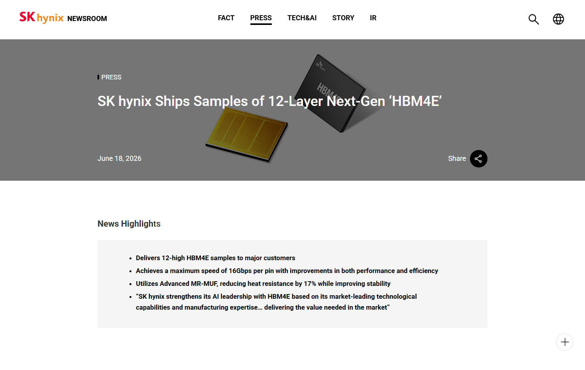

# Daily Semiconductor Current Affairs

Date: 2026-06-28

## Quick Index

| No. | Topic | Main Sources | Why To Read |
|---|---|---|---|
| 1 | HBM-led memory supercycle | SK hynix, Micron | Explains why memory became one of the biggest AI bottlenecks. |
| 2 | HBM4E and packaging | SK hynix | Connects product news with VLSI ideas: stack height, heat, signal speed, yield, and package reliability. |
| 3 | Previous research expansion | June 25-27 notes | Deepens the earlier Micron, Qualcomm, Apple, and SK hynix research. |
| 4 | Revision terms | JEDEC, SK hynix | HBM, TSV, MR-MUF, thermal resistance, memory supercycle, strategic customer agreements. |

## News Images

Screenshots for this day are stored in:

```text
images/2026-06-28/
```

Screenshot/source manifest:

- [../images/2026-06-28/links.md](../images/2026-06-28/links.md)

Current screenshot status: two clean SK hynix screenshots were captured. Micron investor relations blocked automated screenshot capture, so it is cited as a text source only.




## Source Snippets

| Source | Link | Geography | Topic | One-Line Summary |
|---|---|---|---|---|
| SK hynix newsroom | https://news.skhynix.com/12-layer-hbm4e-sample/ | Korea / Global | HBM4E samples | SK hynix said it shipped 12-layer HBM4E samples to major customers and highlighted speed, thermal, and stability improvements. |
| SK hynix newsroom | https://news.skhynix.com/2026-market-outlook-focus-on-the-hbm-led-memory-supercycle/ | Korea / Global | Memory-market outlook | SK hynix framed 2026 as a transitional period toward an HBM-led memory supercycle. |
| Micron investor relations | https://investors.micron.com/news-releases/news-release-details/micron-technology-inc-reports-record-results-third-quarter | US / Global | Memory earnings | Micron's record results reinforce that AI memory demand is translating into revenue and pricing power. |
| Qualcomm newsroom | https://www.qualcomm.com/news/releases/2026/06/qualcomm-unveils-comprehensive-data-center-roadmap-for-the-agent | US / Global | Inference chips | Qualcomm's roadmap shows why memory bandwidth per watt is becoming a system-level design target. |
| JEDEC HBM standard page | https://www.jedec.org/standards-documents/results/jesd235 | Global | HBM reference | JEDEC is the standards reference for HBM terminology. |

## Technical Terms / Deep Definitions

Term: HBM (High Bandwidth Memory)
Definition: HBM is stacked DRAM placed close to a processor or accelerator inside an advanced package. Instead of a narrow board-level memory channel, HBM uses many short, parallel connections through the stack and package. The problem it solves is data movement: AI accelerators need weights, activations, and cache data to arrive at enormous bandwidth. It matters today because HBM supply is becoming a strategic limit for AI hardware scaling. Source: https://www.jedec.org/standards-documents/results/jesd235

Term: HBM4E
Definition: HBM4E is an enhanced generation after HBM4, designed to increase bandwidth, capacity, and efficiency for future AI accelerators. The important idea is not only a faster memory chip; it is a more demanding package, stack, thermal, and test problem. It matters today because SK hynix says its 12-layer HBM4E samples are moving to major customers, which means next-generation AI chips are already being planned around this memory roadmap. Source: https://news.skhynix.com/12-layer-hbm4e-sample/

Term: TSV (Through-Silicon Via)
Definition: A TSV is a vertical electrical connection that passes through a silicon die. In stacked memory, TSVs connect multiple DRAM layers so signals can move vertically instead of traveling across long board traces. The manufacturing challenge is alignment, etching, filling, stress, and reliability. TSVs matter today because HBM would not work as high-bandwidth stacked memory without dense vertical interconnect. Source: https://www.jedec.org/standards-documents/results/jesd235

Term: MR-MUF
Definition: MR-MUF stands for mass reflow molded underfill. It is a packaging process SK hynix uses to improve heat dissipation and structural stability in HBM stacks. The packaging problem is that stacked dies generate heat and mechanical stress; underfill and molding must protect interconnects while keeping thermal resistance low. It matters today because SK hynix linked HBM4E stability and thermal improvement to advanced MR-MUF. Source: https://news.skhynix.com/12-layer-hbm4e-sample/

Term: Thermal resistance
Definition: Thermal resistance measures how difficult it is for heat to move from a hot component to a cooler environment. Lower thermal resistance means heat escapes more easily. In stacked memory, heat is difficult because dies are placed vertically and inner layers can be trapped. It matters today because HBM capacity and speed gains are useless if the stack overheats or throttles. Source: https://news.skhynix.com/12-layer-hbm4e-sample/

Term: Memory supercycle
Definition: A memory supercycle is a longer-than-normal period of strong memory demand, tight supply, high pricing, and elevated investment. Ordinary memory cycles often swing between shortages and oversupply. An HBM-led supercycle would be different if AI demand stays structurally high and if customers sign longer supply agreements. It matters today because SK hynix and Micron are both talking like memory demand is more durable than a normal consumer-electronics cycle. Source: https://news.skhynix.com/2026-market-outlook-focus-on-the-hbm-led-memory-supercycle/

## Confirmed Facts

SK hynix's HBM4E sample update is a technical milestone, not just a sales headline. A 12-layer HBM stack means the package must manage more vertical interconnects, more heat, more mechanical stress, and tighter yield targets. The customer-sample stage matters because AI accelerator designers need memory behavior before finalizing board, package, power, and thermal assumptions.

SK hynix's 2026 outlook frames memory as one of the main beneficiaries of AI infrastructure expansion. The important point is that the company is not only expecting more memory bits; it is expecting a mix shift toward higher-value products like HBM and advanced server memory.

Micron's June 25 results support the same direction from another supplier. Strong results across memory and storage make the SK hynix outlook more credible because two major memory companies are showing similar signals.

Qualcomm's inference roadmap adds demand-side context. If future AI infrastructure includes more inference accelerators, CPUs, and custom silicon, memory bandwidth and capacity will remain central. A new AI chip without enough memory bandwidth is like a very fast factory with a narrow gate at the entrance.

## Analysis

June 28 is a weekend deep-dive day: the main job is to connect the previous research into one strong memory story.

The most important idea is that AI hardware is not only limited by compute. A GPU, ASIC, or inference accelerator can perform many operations per second, but the model data must be delivered continuously. For large language models, the memory system carries weights, activations, and key-value cache data. If the memory path is slow, compute units wait. If memory is expensive, the cost per token rises. If memory runs hot, the system throttles. If memory supply is scarce, customers cannot build enough servers.

That is why HBM matters. It solves part of the bandwidth problem by stacking DRAM close to the accelerator. But it also creates new problems: packaging complexity, thermal resistance, yield, test coverage, and supply concentration. HBM is not a cheap commodity module; it is a high-value package-level subsystem.

HBM4E shows the direction of travel. The industry is not only asking for more memory capacity; it wants more bandwidth per pin, better energy efficiency, better thermals, and customer-qualified reliability. The fact that SK hynix is sampling HBM4E means accelerator vendors are designing future systems around memory that may not be mass-produced yet.

This helps explain why Micron's numbers were so strong and why Apple pricing moved. Memory suppliers are being pulled toward high-value AI products. That does not automatically eliminate consumer memory, but it changes the opportunity cost of capacity. A wafer, package line, or engineering team assigned to lower-margin memory may be less attractive when AI customers are willing to pay for HBM and advanced server memory.

## Value-Chain Segment

- Memory: HBM, HBM4E, DRAM, NAND, server memory.
- Packaging/test: TSVs, MR-MUF, stack assembly, thermal reliability.
- AI accelerators: GPUs, custom ASICs, inference chips that depend on HBM.
- Equipment/materials: lithography, etch, deposition, bonding, molding, test equipment.
- Market/finance: memory supercycle, strategic customer agreements, high-margin product mix.
- VLSI learning: bandwidth, latency, thermal resistance, signal integrity, yield.

## Concept Review

| Concept | Deep Definition | Why It Matters In This News | Revise Next | Source |
|---|---|---|---|---|
| Package-level bandwidth | Package-level bandwidth is data movement enabled by short, dense interconnects inside the chip package instead of long board-level traces. | HBM works because the memory stack is close to the accelerator and connected with many parallel paths. | Interposer, TSV, microbump, substrate. | https://www.jedec.org/standards-documents/results/jesd235 |
| Stack yield | Stack yield is the probability that a multi-die stack works after all dies and interconnects are assembled. Even if each die has high yield, stacking many dies can reduce final package yield. | 12-layer HBM4E increases the need for known-good dies, good bonding, and strong test. | Known-good die, package test, redundancy. | https://news.skhynix.com/12-layer-hbm4e-sample/ |
| Thermal path | The thermal path is the route heat follows from silicon junctions through package materials to heat spreaders, cold plates, or air/liquid cooling. | HBM stacks can trap heat, so MR-MUF and package design matter for stability. | Thermal resistance, TIM, cold plate, throttling. | https://news.skhynix.com/12-layer-hbm4e-sample/ |
| Structural demand | Structural demand is demand created by a long-term technology shift rather than a short replacement cycle. | AI infrastructure could make HBM demand more durable than normal PC/phone memory cycles. | Cyclical vs structural demand, capex. | https://news.skhynix.com/2026-market-outlook-focus-on-the-hbm-led-memory-supercycle/ |

### India Relevance

India should not read HBM only as "Korea makes memory." The useful study question is: which parts of this chain can India build?

Near-term India opportunities are more likely in OSAT/ATMP, reliability testing, board/system integration, memory-controller verification, firmware, and data-center hardware operations. Leading-edge HBM wafer fabrication is extremely hard, but package test, failure analysis, thermal validation, and system integration are reachable skills.

SEMICON India should be watched for concrete announcements around advanced packaging, substrate ecosystems, test labs, semiconductor-grade chemicals, cleanroom construction, and tool-service support. These are the practical foundations that make a memory ecosystem possible.

### Simple Explanation

June 28 ka simple point: AI chips are powerful, but memory decides whether that power can be used. HBM gives AI chips a wide, short road to data. But that road is expensive to build because it needs stacked dies, vertical connections, advanced packaging, and thermal control. That is why SK hynix, Micron, and Samsung are becoming central to the AI story.

## Interview / Discussion Questions

1. Why does HBM need advanced packaging instead of a normal memory slot?
2. What problems appear when a memory stack moves from 8 layers to 12 layers?
3. Why does thermal resistance matter in stacked memory?
4. How can an HBM-led memory cycle be different from a normal PC/phone memory cycle?
5. Which VLSI roles are connected to HBM even if you do not work in a memory fab?

## Follow-Up

- Track whether SK hynix names the major HBM4E customers or qualification schedule.
- Track Micron and Samsung responses around HBM4/HBM4E capacity.
- Track packaging terms: MR-MUF, hybrid bonding, interposer, substrate, known-good die.
- Add a dedicated concept note comparing HBM, GDDR, DDR, LPDDR, SRAM, and NAND.

