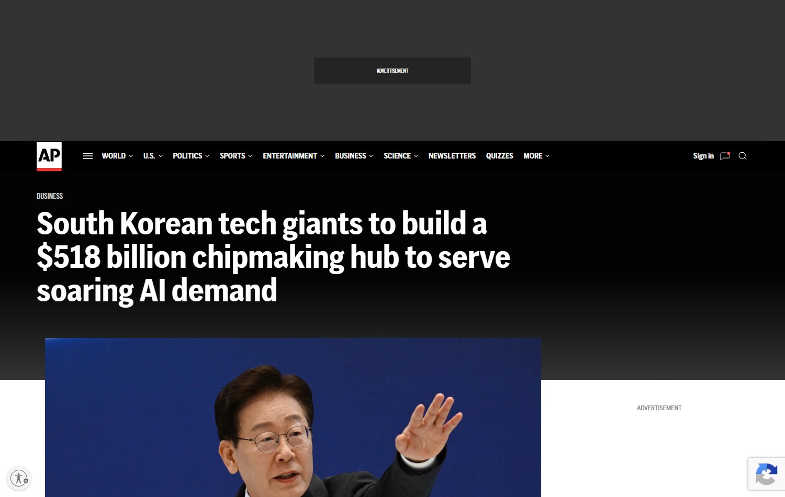
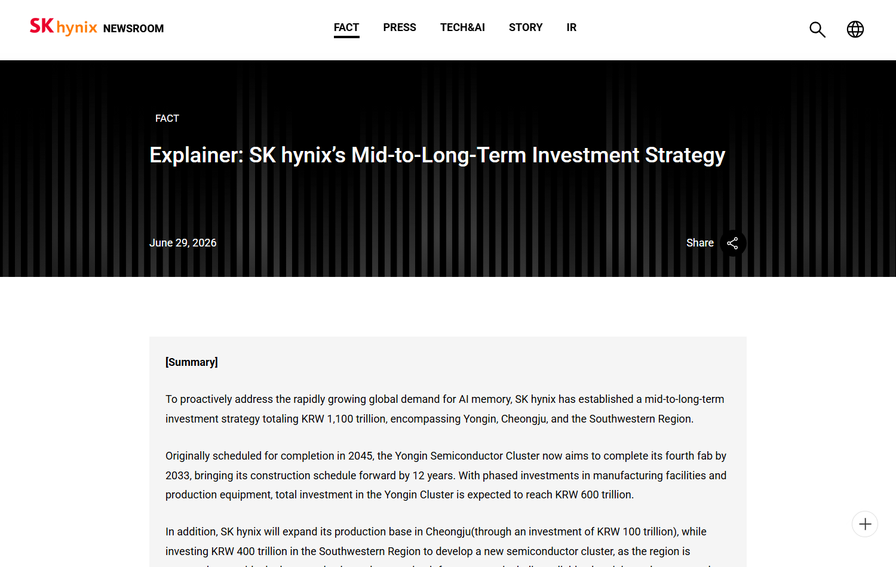
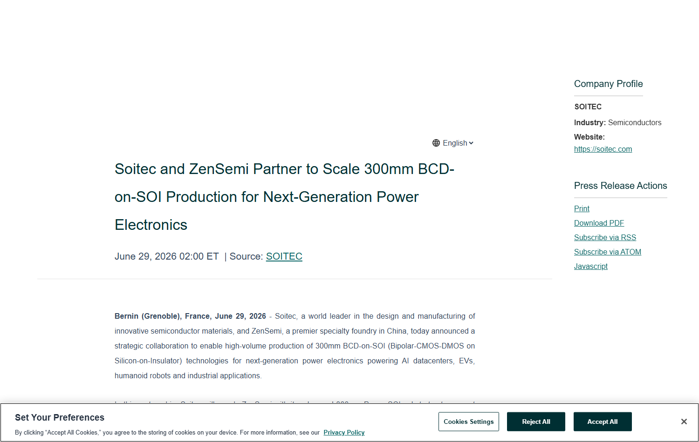

# Daily Semiconductor Current Affairs

Date: 2026-06-29

## Quick Index

| No. | Topic | Main Sources | Why To Read |
|---|---|---|---|
| 1 | South Korea chipmaking hub | AP, SK hynix | Shows how AI demand is turning into multi-decade fab-cluster investment. |
| 2 | Nvidia China stall and local substitution | AP | Explains why export controls can create openings for local AI-chip suppliers. |
| 3 | Chip shares and AI-market concentration | The Guardian | Turns the AI semiconductor rally into an editorial-style discussion about risk and concentration. |
| 4 | Power electronics / BCD-on-SOI | Soitec / GlobeNewswire | Adds a non-GPU semiconductor angle: AI data centers, EVs, robotics, and power-management chips. |
| 5 | Previous research follow-up | SK hynix, Micron, Qualcomm | Connects June 25-28 memory research with today's capacity and market signals. |

## News Images

Screenshots for this day are stored in:

```text
images/2026-06-29/
```

Screenshot/source manifest:

- [../images/2026-06-29/links.md](../images/2026-06-29/links.md)

Current screenshot status: four clean headline/source screenshots were captured. AP's Nvidia-China page produced a blank page during the cleaned retry, so it is retained as a cited text source only.








## Source Snippets

| Source | Link | Geography | Topic | One-Line Summary |
|---|---|---|---|---|
| AP News | https://apnews.com/article/22352d95c7a821c5f4548b2d1a4ebde8 | Korea / Global | Fab cluster / AI demand | AP reported that Samsung and SK hynix plan a massive South Korean chipmaking hub to serve AI demand. |
| SK hynix newsroom | https://news.skhynix.com/fact-05/ | Korea / Global | Investment strategy | SK hynix described a mid-to-long-term investment plan across Yongin, Cheongju, and the Southwestern Region. |
| AP News | https://apnews.com/article/1ae6228c4928ddbb43f984e9b38f49dd | China / US / Global | Nvidia / China / local AI chips | AP reported that Nvidia's AI-chip sales in China are stalling while local chipmakers gain ground. |
| The Guardian | https://www.theguardian.com/business/2026/jun/29/shares-in-chipmakers-underpinning-ai-boom-surge-in-first-half-of-2026 | Global / Asia-Pacific | Market rally / AI chip shares | The Guardian discussed how chipmakers powering the AI boom drove major share-price gains in the first half of 2026. |
| Soitec / GlobeNewswire | https://www.globenewswire.com/news-release/2026/06/29/3318663/0/en/soitec-and-zensemi-partner-to-scale-300mm-bcd-on-soi-production-for-next-generation-power-electronics.html | France / China / Global | BCD-on-SOI / power electronics | Soitec and ZenSemi announced collaboration to scale 300mm BCD-on-SOI production for power electronics in AI data centers, EVs, robotics, and industrial systems. |
| JEDEC HBM standard page | https://www.jedec.org/standards-documents/results/jesd235 | Global | HBM reference | JEDEC provides the standards context for HBM terminology. |

## Technical Terms / Deep Definitions

Term: Fab cluster
Definition: A fab cluster is a geographic concentration of semiconductor manufacturing facilities, suppliers, utilities, logistics, workers, universities, and service firms. It solves a coordination problem: fabs need water, power, gases, chemicals, equipment maintenance, skilled operators, transport, and nearby partners. It matters today because Korea's planned hub is not just buildings; it is an attempt to build the ecosystem around AI-memory and logic demand. Source: https://apnews.com/article/22352d95c7a821c5f4548b2d1a4ebde8

Term: Capacity lead time
Definition: Capacity lead time is the delay between deciding to invest in a fab and actually producing qualified chips. Semiconductor capacity is slow because land, cleanrooms, tools, process qualification, yield learning, and customer certification take years. It matters today because a 2040s-style investment plan can support future supply, but it cannot instantly solve today's HBM and AI-chip shortages. Source: https://news.skhynix.com/fact-05/

Term: Local substitution
Definition: Local substitution happens when domestic companies replace foreign suppliers because imports are blocked, restricted, expensive, or politically risky. In semiconductors, export controls can slow access to top chips, but they can also create demand for domestic alternatives. It matters today because Nvidia's China sales pressure is linked to Huawei and other local AI-chip suppliers gaining space. Source: https://apnews.com/article/1ae6228c4928ddbb43f984e9b38f49dd

Term: BCD-on-SOI
Definition: BCD-on-SOI combines Bipolar, CMOS, and DMOS device types on silicon-on-insulator wafers. Bipolar devices can handle analog precision, CMOS handles digital control, and DMOS handles higher-voltage power switching. SOI helps reduce leakage, improve isolation, and improve power efficiency. It matters today because AI data centers, EVs, robotics, and industrial systems need power-management chips, not only GPUs and HBM. Source: https://www.globenewswire.com/news-release/2026/06/29/3318663/0/en/soitec-and-zensemi-partner-to-scale-300mm-bcd-on-soi-production-for-next-generation-power-electronics.html

Term: Silicon-on-insulator (SOI)
Definition: SOI is a wafer technology where a thin silicon layer sits on an insulating oxide layer. The insulating layer electrically isolates devices, reducing parasitic capacitance and leakage. In power and RF chips, this can improve efficiency, isolation, and high-voltage behavior. It matters today because Soitec's substrate expertise is tied to specialty chips used around AI data centers and electrified systems. Source: https://www.soitec.com/

Term: Specialty foundry
Definition: A specialty foundry manufactures chips that are not necessarily leading-edge CPU/GPU logic, but require specialized processes such as power, analog, RF, display, sensors, MEMS, or embedded non-volatile memory. The problem it solves is process fit: many real-world chips need voltage handling, isolation, reliability, and mixed-signal behavior more than the smallest transistor node. It matters today because AI data centers also need power conversion, control, sensors, and industrial support chips. Source: https://www.globenewswire.com/news-release/2026/06/29/3318663/0/en/soitec-and-zensemi-partner-to-scale-300mm-bcd-on-soi-production-for-next-generation-power-electronics.html

Term: Market concentration
Definition: Market concentration means a small number of companies capture a large share of value, supply, or strategic control in a sector. In AI semiconductors, concentration can appear in GPUs, HBM, EUV tools, foundry capacity, and advanced packaging. It matters today because share-price gains in chipmakers show optimism, but they also show dependence on a narrow set of hardware bottlenecks. Source: https://www.theguardian.com/business/2026/jun/29/shares-in-chipmakers-underpinning-ai-boom-surge-in-first-half-of-2026

## Confirmed Facts

AP reported a very large Korea chipmaking-hub plan involving Samsung and SK hynix. The study point is not only the dollar number. The important point is that AI demand is now being used to justify multi-decade, region-level industrial planning. Fabs need power, water, land, tools, workers, suppliers, and local government coordination.

SK hynix's own June 29 investment explainer gives useful structure. It describes investment across Yongin, Cheongju, and the Southwestern Region. This helps interpret the AP story because a "hub" is not a single fab. It is a network: front-end wafer fabs, advanced packaging, materials, equipment service, logistics, and talent.

AP's Nvidia-China report adds the geopolitical counterpoint. Export controls and restricted access can reduce Nvidia sales, but they also push Chinese customers toward domestic accelerators. This is the classic policy tradeoff: restrictions can slow the target, but they can also strengthen local substitution over time.

The Guardian's market-rally article turns the same hardware story into an editorial question. If the first half of 2026 was led by chipmakers tied to AI demand, investors are betting that HBM, GPUs, foundries, equipment, and packaging remain scarce and valuable. That can be rational, but it also raises concentration risk if growth disappoints or supply catches up too quickly.

Soitec/ZenSemi adds a useful reminder: semiconductors are broader than AI accelerators. AI data centers also need power electronics, voltage conversion, management ICs, sensors, robotics chips, and industrial control. BCD-on-SOI is not a headline GPU node, but it supports the power and control layers that let AI infrastructure actually run.

## Editorial-Style Analysis

The headline lesson for June 29 is that AI demand is becoming industrial policy. Korea is not treating the AI memory boom as a short trend; it is planning physical capacity around it. That matters because semiconductor leadership is not only a company's product roadmap. It is the ability of a region to provide enough power, water, land, labor, chemicals, gases, tool uptime, and logistics for decades.

The Korea hub also shows why HBM shortages cannot be solved quickly. You can announce money today, but a fab does not become qualified capacity tomorrow. New fabs require cleanroom buildout, tool installation, process tuning, yield learning, and customer qualification. This is why memory suppliers can have strong pricing power even while announcing huge investments.

The Nvidia-China story shows the other side of strategic semiconductors. If the US restricts advanced AI chips into China, Nvidia loses some market access. Chinese AI companies then have stronger reasons to adopt Huawei or other domestic alternatives. Export controls may still slow access to the highest-performance chips, but they can create a protected demand pool for local substitutes.

The market-rally story should be read carefully. Rising semiconductor shares can reflect real demand, but markets can compress many assumptions into one price: future AI capex, memory pricing, foundry capacity, energy availability, model demand, and geopolitics. If any of those assumptions weaken, chip shares can fall even if the technical story remains strong.

The Soitec/ZenSemi item is important because it widens the lens. AI data centers are not only GPUs plus HBM. They require power delivery, battery backup, voltage regulation, thermal control, networking, sensors, and industrial automation. BCD-on-SOI belongs to that supporting infrastructure. For VLSI study, this is a good reminder that analog, mixed-signal, power, and reliability engineering are as real as digital AI accelerators.

## Value-Chain Segment

- Foundry / fabs: Korea hub, Samsung, SK hynix, regional capacity.
- Memory: HBM, DRAM, advanced packaging, SK hynix investment.
- AI accelerators: Nvidia China pressure, Huawei/local substitutes.
- Materials / substrates: Soitec SOI wafers, specialty substrates.
- Power electronics: BCD-on-SOI, AI data-center power management, EVs, robotics.
- Policy/geopolitics: export controls, industrial policy, China local substitution.
- Market/finance: first-half 2026 AI-chip share rally and concentration risk.

## Concept Review

| Concept | Deep Definition | Why It Matters In This News | Revise Next | Source |
|---|---|---|---|---|
| Cleanroom capacity | Cleanroom capacity is controlled manufacturing space with extremely low particle contamination. Chips need it because microscopic particles can ruin patterns and reduce yield. | New Korean fabs require cleanroom buildout before tools can produce qualified wafers. | ISO cleanroom classes, yield, contamination. | https://news.skhynix.com/fact-05/ |
| Yield learning | Yield learning is the process of improving the percentage of chips that meet spec after manufacturing. It involves defect analysis, process tuning, design feedback, and reliability testing. | New fabs and HBM packages need years of learning before they become high-volume, profitable capacity. | Defect density, process control, DFT, reliability. | https://news.skhynix.com/fact-05/ |
| Export-control substitution | Export-control substitution is when restricted buyers replace blocked imports with local products, even if local products initially lag in performance. | Nvidia's China pressure can strengthen local AI-chip ecosystems. | BIS rules, Huawei Ascend, supply-chain localization. | https://apnews.com/article/1ae6228c4928ddbb43f984e9b38f49dd |
| Mixed-signal power IC | A mixed-signal power IC combines analog sensing/control, digital logic, and power-switching devices. It is used to regulate voltage, control motors, manage batteries, and protect systems. | BCD-on-SOI targets power electronics for AI data centers, EVs, robotics, and industrial use. | BCD, DMOS, SOI, gate drivers, PMICs. | https://www.globenewswire.com/news-release/2026/06/29/3318663/0/en/soitec-and-zensemi-partner-to-scale-300mm-bcd-on-soi-production-for-next-generation-power-electronics.html |

### India Relevance

India should compare Korea's hub approach with its own semiconductor strategy. A fab announcement is only one part of the work. The larger question is whether the region can support power, water, land, tool service, chemicals, gases, skilled technicians, universities, logistics, and customer demand.

For India, the near-term lesson is to build clusters rather than isolated projects. OSAT/ATMP, reliability labs, compound semiconductors, power electronics, sensors, and design centers can form an ecosystem even before leading-edge logic fabs mature.

The Soitec/ZenSemi item is especially relevant because India has opportunities in power electronics for EVs, industrial drives, renewable energy, data centers, and rail. Not every semiconductor opportunity requires a 2 nm logic fab. Power, analog, and mixed-signal process knowledge can be strategically valuable.

### Simple Explanation

June 29 ka simple point: AI demand is now big enough that countries are building entire semiconductor regions around it. Korea is planning huge fab capacity. Nvidia is facing China pressure because local chips are getting a chance under restrictions. Chip stocks are rising because investors see bottlenecks. And Soitec/ZenSemi reminds us that AI infrastructure also needs power chips, not only GPUs.

## Interview / Discussion Questions

1. Why does a semiconductor hub need power, water, suppliers, and workers, not only fab buildings?
2. Why can export controls both hurt Nvidia and help Chinese local chipmakers?
3. What is the difference between leading-edge logic foundry work and specialty foundry work?
4. Why does BCD-on-SOI matter for AI data centers even though it is not a GPU technology?
5. Why can semiconductor stocks rise sharply even when the industry still has supply risks?
6. What should India learn from Korea's cluster model?

## Follow-Up

- Track whether Korea publishes project-level timelines, sites, power/water plans, and supplier commitments for the new hub.
- Track Samsung and SK hynix official capex details around the AP-reported hub.
- Track Nvidia China sales commentary and domestic Chinese accelerator adoption.
- Track Soitec/ZenSemi production milestones and whether BCD-on-SOI capacity moves beyond announcement.
- Continue the HBM capacity watch from June 28: HBM4E qualification, packaging yield, thermal performance, and customer commitments.

