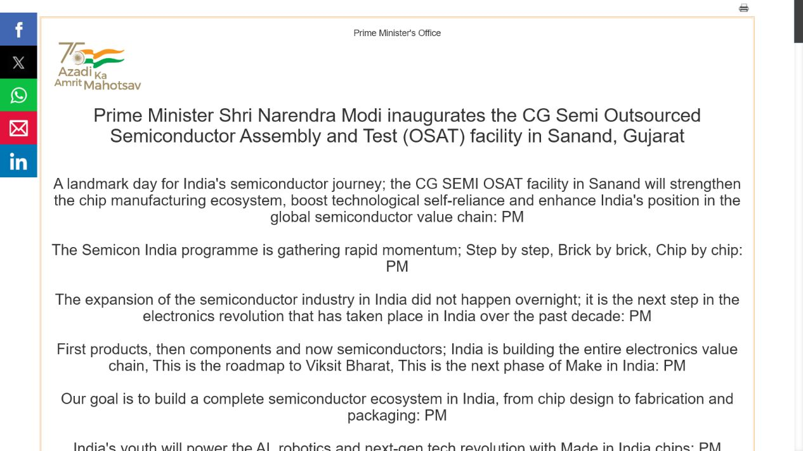
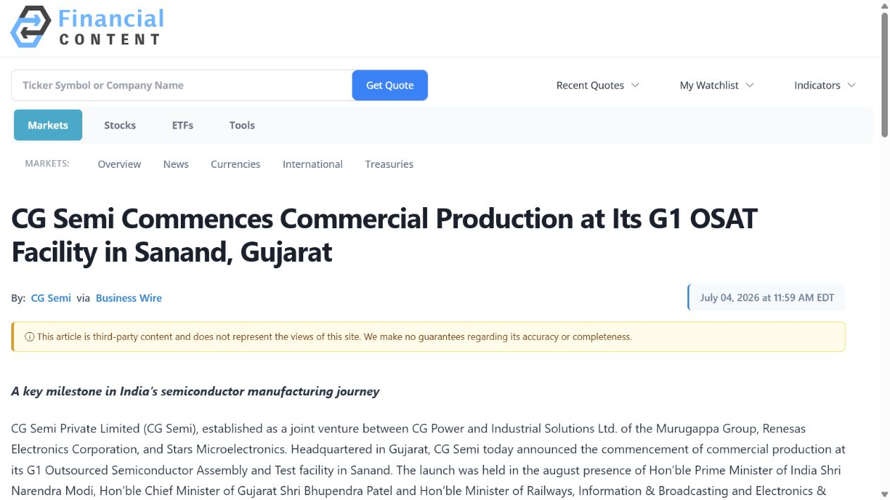

# Daily Semiconductor Current Affairs

Date: 2026-07-05

Research window: Sunday verification brief using late July 4 official releases plus the nearest July 2-to-July 5 semiconductor window. Exact-date global news was limited. The main new evidence is the post-event confirmation of CG Semi's inauguration, production start, and first shipment; other segments are explicitly marked as follow-up or technical watch items.

## Quick Index

| Date | Major Topic | Source Groups | Why To Read |
|---|---|---|---|
| 2026-07-05 | CG Semi ceremony and first shipment confirmed | PIB India, CG Semi / Business Wire | Closes yesterday's event uncertainty and identifies what the first shipment does and does not prove. |
| 2026-07-05 | G1 versus full-site output arithmetic | CG Semi, PIB India | Reconciles 300 million per year, 0.5 million per day, 14.5 million per day, and five billion per year without mixing facility stages. |
| 2026-07-05 | India project-count policy signal | Ministry of Electronics and IT | Separates approved projects, commercial production, and the five-plant year-end expectation. |
| 2026-07-05 | Secure mobile-chip July watch | STMicroelectronics, NIST, ISO / IATF | Connects future-resistant cryptography, hardware acceleration, product certification, and manufacturing quality. |
| 2026-07-05 | Weekend value-chain follow-ups | Kioxia, Infineon, SK hynix, FormFactor, Socionext, BIS | Preserves unresolved memory, factory-ramp, equipment, design, market, and policy questions. |

## Source Images



The Prime Minister's Office headline confirms that the July 4 inauguration occurred. The image is limited to the source identity, headline, and headline summaries.


The PIB page records a July 4, 2026, 7:22 PM posting and states that the Prime Minister inaugurated the facility. This closes the event-status question left open at the July 4 note's 2:02 PM research cutoff.



The syndicated CG Semi release identifies the company as the source, Business Wire as distributor, the publication date, and the commercial-production claim. The direct Business Wire page rendered blank in the in-app browser, so its URL and the successful syndicated capture are both documented in the manifest.

Source manifest: [../images/2026-07-05/links.md](../images/2026-07-05/links.md)

## Technical Terms / Deep Definitions

Term: Outsourced Semiconductor Assembly and Test (OSAT)
Definition: An OSAT receives fabricated wafers or dies, screens them electrically, assembles acceptable dies into packages, and performs final electrical, reliability, and shipping operations. It solves the back-end manufacturing problem between wafer fabrication and a system-ready component. CG Semi's G1 milestone is important because India is building this packaging-and-test layer; it is not evidence that G1 fabricates transistor layers from blank silicon wafers. A foundry creates dies on wafers, while an OSAT converts dies into tested packaged products. Source: [PIB post-event release](https://www.pib.gov.in/PressReleasePage.aspx?PRID=2281125&lang=1&reg=3)

Term: First commercial shipment
Definition: A first commercial shipment is the first dispatched lot produced for a customer under a commercial programme rather than only an internal experiment or qualification exercise. It solves the transition from proving that a process can run to delivering a saleable output. It is stronger evidence than a ceremony or pilot lot, but one shipment does not establish recurring orders, stable yield, utilization, profitability, or broad customer acceptance. CG Semi's chairman referred to a first shipment, but the release did not disclose the customer, destination, package type, quantity, value, or acceptance result. Source: [CG Semi / Business Wire](https://www.businesswire.com/news/home/20260704038873/en/CG-Semi-Commences-Commercial-Production-at-Its-G1-OSAT-Facility-in-Sanand-Gujarat)

Term: Process stabilization
Definition: Process stabilization is the work of making a manufacturing flow repeatably operate within controlled limits after tools, recipes, materials, operators, and inspection steps are introduced. It solves the gap between making an occasional good unit and producing predictable lots. Engineers monitor variation, equipment matching, defect modes, cycle time, and control charts, then correct special causes. CG Semi lists process stabilization among the steps completed before commercial production, but does not publish capability indices, defect rates, or package-specific yields. Source: [CG Semi / Business Wire](https://www.businesswire.com/news/home/20260704038873/en/CG-Semi-Commences-Commercial-Production-at-Its-G1-OSAT-Facility-in-Sanand-Gujarat)

Term: Quality readiness
Definition: Quality readiness is a company-level judgment that people, processes, controls, documentation, inspection, reliability work, and response systems are sufficiently prepared for customer production. It solves the operational risk of shipping before the factory can detect, contain, trace, and correct problems. It is not a universal numerical standard and should not be treated as identical to an independent certificate. In today's news, CG Semi uses the phrase as part of its production-readiness sequence; audited certifications and customer-specific approvals remain separate evidence. Source: [CG Semi / Business Wire](https://www.businesswire.com/news/home/20260704038873/en/CG-Semi-Commences-Commercial-Production-at-Its-G1-OSAT-Facility-in-Sanand-Gujarat)

Term: Manufacturing traceability
Definition: Manufacturing traceability is the ability to reconstruct which wafer, die, package materials, machines, recipes, operators, test programmes, measurements, and dispositions were associated with a shipped unit or lot. It solves containment and root-cause problems: when a defect appears, the manufacturer can identify affected material instead of recalling everything. Traceability matters at CG Semi because automotive, industrial, and infrastructure customers need controlled genealogy and change history, not merely a pass/fail test result. Source: [CG Semi / Business Wire](https://www.businesswire.com/news/home/20260704038873/en/CG-Semi-Commences-Commercial-Production-at-Its-G1-OSAT-Facility-in-Sanand-Gujarat)

Term: Peak capacity and throughput
Definition: Peak capacity is the highest designed output under stated assumptions, while throughput is the rate material actually completes the line. Capacity solves planning for tools, labour, and demand; throughput measures operations. Both depend on product mix because a simple package and a complex multi-die package consume different machine and test time. CG Semi's 300-million-unit annual G1 peak cannot be interpreted as current shipments, and it should not be added mechanically to other daily figures without knowing calendars, package mix, uptime, and yield. Source: [CG Semi / Business Wire](https://www.businesswire.com/news/home/20260704038873/en/CG-Semi-Commences-Commercial-Production-at-Its-G1-OSAT-Facility-in-Sanand-Gujarat)

Term: Capacity utilization
Definition: Capacity utilization is actual output divided by the output a facility could produce under its defined capacity assumptions. It solves the business question of how much installed productive capability is being used. A factory may be in commercial production at low utilization while customer programmes ramp, then increase output as demand and yield improve. CG Semi has disclosed peak capacity but not current utilization, so no present production rate can be calculated from the announcement. Source: [CG Semi / Business Wire](https://www.businesswire.com/news/home/20260704038873/en/CG-Semi-Commences-Commercial-Production-at-Its-G1-OSAT-Facility-in-Sanand-Gujarat)

Term: Quality Management System (QMS)
Definition: A QMS is the documented set of responsibilities, processes, controls, measurements, corrective actions, and continuous-improvement methods used to deliver products consistently against customer and regulatory requirements. It solves the problem of quality depending on individual memory or inspection alone. ISO 9001 defines globally agreed QMS requirements but does not prescribe one factory recipe. For CG Semi, a QMS links traceability, training, process changes, complaints, audits, and corrective action into a repeatable operating system. Source: [ISO 9001 explained](https://www.iso.org/home/insights-news/resources/iso-9001-explained.html)

Term: IATF 16949
Definition: IATF 16949 is an automotive-sector quality-management standard aligned with ISO 9001 and developed to harmonize assessment and certification expectations across the automotive supply chain. It solves the need for stricter defect prevention, variation reduction, change control, and customer-specific discipline in safety- and reliability-sensitive vehicle production. CG Semi's 2025 pilot release said the facility was undergoing IATF 16949 certification; the July 2026 release does not state that certification is complete, so public verification remains pending. Source: [International Automotive Task Force](https://www.iatfglobaloversight.org/iatf-169492016/about/)

Term: Post-quantum cryptography (PQC)
Definition: PQC uses algorithms designed to resist attacks from both conventional computers and future cryptographically relevant quantum computers. It solves the long-term risk that powerful quantum machines could break widely used public-key systems protecting identities, payments, and confidential data. NIST's first finalized PQC standards use mathematical problems such as structured lattices and hash functions rather than relying on integer factoring. ST's secure mobile chip matters because mobile credentials may need hardware support for these larger, more computationally demanding algorithms before quantum computers actually arrive. Source: [NIST](https://www.nist.gov/cybersecurity-and-privacy/what-post-quantum-cryptography)

Term: Secure element
Definition: A secure element is a tamper-resistant chip subsystem that stores secret keys and executes security-sensitive operations in an isolated environment. It solves the risk that ordinary application software or memory could expose payment, identity, access, or connectivity credentials. ST integrates a secure element with contactless communication, embedded-SIM functions, and a PQC accelerator on one die, reducing board area and inter-chip attack surfaces while concentrating more functions in one security-certification boundary. Source: [STMicroelectronics](https://newsroom.st.com/media-center/press-item.html/p4784.html)

Term: Hardware accelerator
Definition: A hardware accelerator is a dedicated circuit that performs a specific computation faster or with less energy than executing the same work as general-purpose processor instructions. It solves latency, power, and predictability problems for repetitive workloads. ST's PQC accelerator matters because quantum-resistant algorithms can require larger keys, signatures, and polynomial operations; dedicated logic can protect mobile user experience while keeping sensitive intermediate values inside the security boundary. A GPU accelerates parallel graphics or AI, while this block accelerates cryptographic mathematics. Source: [STMicroelectronics](https://newsroom.st.com/media-center/press-item.html/p4784.html)

Term: Export control
Definition: An export control is a legal restriction on transferring specified goods, software, technology, or technical assistance to particular destinations, entities, or end uses. It solves national-security and foreign-policy concerns by requiring licences or prohibiting some transactions. Semiconductor controls may cover AI accelerators, equipment, design software, and technical know-how. No new semiconductor export-control rule was verified in the July 5 weekend window, so the existing US Export Administration Regulations remain the policy baseline. Source: [US Bureau of Industry and Security](https://www.bis.gov/regulations/ear)

## Source Map

| Source | Source date | Role | Confidence / limitation |
|---|---:|---|---|
| [PIB Prime Minister's Office](https://www.pib.gov.in/PressReleasePage.aspx?PRID=2281125&lang=1&reg=3) | 2026-07-04 | Post-event inauguration confirmation | Primary government record; policy speech is not an operating-data disclosure. |
| [PIB Ministry of Electronics and IT](https://www.pib.gov.in/PressReleasePage.aspx?PRID=2281174&lang=2&reg=48) | 2026-07-04 | Commercial-production status and national project count | Primary government source; five-plant year-end statement is an expectation. |
| [CG Semi / Business Wire](https://www.businesswire.com/news/home/20260704038873/en/CG-Semi-Commences-Commercial-Production-at-Its-G1-OSAT-Facility-in-Sanand-Gujarat) | 2026-07-04 | G1 capacity, readiness sequence, production, and first-shipment statement | Primary company release distributed by Business Wire; no customer, product, yield, or utilization data. |
| [CG Semi pilot-line release](https://www.businesswire.com/news/home/20250828997549/en/CG-Semi-Unveils-One-of-Indias-First-End-to-End-OSAT-Facilities-in-Sanand-Gujarat) | 2025-08-28 | Historical G1 and G2 daily-capacity targets and certification status | Primary historical release; assumptions are not reconciled with the new annual figure. |
| [STMicroelectronics](https://newsroom.st.com/media-center/press-item.html/p4784.html) | 2026-06-24 | July technical watch: secure mobile chip, samples, production and certification target | Primary company source; production and certification were targets, not confirmed completions. |
| [NIST PQC explainer](https://www.nist.gov/cybersecurity-and-privacy/what-post-quantum-cryptography) | Updated 2026-02-27 | Authoritative cryptography definition and standards context | US standards authority; does not validate ST's product performance. |
| [ISO 9001](https://www.iso.org/home/insights-news/resources/iso-9001-explained.html) | Current reference | Quality-management definition | Standards authority; certification is performed by independent bodies, not ISO itself. |
| [IATF 16949](https://www.iatfglobaloversight.org/iatf-169492016/about/) | Current reference | Automotive quality-system context | Standard-owner source; today's CG release does not confirm certificate completion. |

## 1. CG Semi: Yesterday's Open Question Is Closed

### Confirmed facts

PIB's 7:22 PM July 4 release confirms that the Prime Minister inaugurated the Sanand facility. A later Ministry of Electronics and IT release says commercial production began. CG Semi's own release states that G1 has started commercial production, gives peak capacity of up to 300 million units per year, and refers to a first shipment.

The company says G1 progressed through equipment installation, process stabilization, workforce training, customer qualification, and quality readiness after its August 2025 pilot inauguration. This is materially stronger evidence than yesterday's pre-event schedule.

### What changed in the follow-up ledger

- **Ceremony occurrence: closed.** The post-event government release confirms it happened.
- **Commercial-production start: closed.** Government and company releases both state that production began.
- **Existence of a first shipment: updated and substantially closed.** The company chairman explicitly referred to it.
- **Shipment quality and business scale: still pending.** No customer, package, quantity, value, destination, acceptance, return rate, or recurring schedule was disclosed.
- **Stable high-volume production: still pending.** Yield, utilization, cycle time, output history, and profitability remain undisclosed.

### Capacity arithmetic: four figures, different scopes

| Figure | Source and scope | Simple normalization | Correct interpretation |
|---:|---|---:|---|
| 0.5 million units/day | August 2025 G1 pilot release | About 182.5 million/year at 365 days | Historical G1 peak statement under unspecified product and calendar assumptions. |
| 300 million units/year | July 2026 G1 commercial release | About 0.82 million/day averaged over 365 days | Updated G1 peak figure; not current output. |
| 14.5 million units/day | August 2025 G2 target | About 5.29 billion/year at 365 days | Future G2 scale after construction and ramp. |
| Up to 5 billion chips/year | July 2026 PMO full-ramp statement | About 13.7 million/day averaged over 365 days | Rounded full-site or major G2-scale target, not G1's current output. |

The arithmetic is only a comparison aid. Semiconductor-package throughput changes with package complexity, test duration, line balance, downtime, yield, and operating calendar. The sources do not explain why G1's annualized figures differ. The numerical alignment between G2's 14.5 million/day and the PMO's five-billion/year full-ramp figure strongly suggests the headline scale is associated with future G2 or the fully developed site; this is an inference, not an explicit source statement.

### Why the first shipment matters

The production sequence is now:

```text
pilot line -> engineering and qualification lots -> process stabilization
-> customer qualification -> quality readiness -> commercial production
-> first shipment -> repeat shipments -> stable yield and utilization
```

CG Semi has crossed more gates than yesterday's note could verify. The next evidence should be operating evidence rather than another ceremony: recurring shipments, named package families, customer approvals, quality certificates, output, yield, utilization, and customer-return performance.

### India, geopolitics, and supply-chain relevance

The joint venture combines India's CG Power, Japan's Renesas, and Thailand's Stars Microelectronics. This matters because OSAT capability depends on transferred process knowledge, customer access, equipment, materials, test development, and production discipline, not only buildings. The model can shorten learning, but long-term competitiveness requires Indian teams to own process improvement and customer problem solving.

The Ministry says three of twelve approved semiconductor projects are now in commercial production and expects five plants to be operational by the end of 2026. That is a policy pipeline, not a guarantee: each remaining project must still complete construction, install tools, qualify processes, and ship acceptable products.

### VLSI and career relevance

High-value roles include package design, design for test, automatic-test-equipment programming, product engineering, process control, reliability, failure analysis, quality engineering, MES and traceability, yield analytics, equipment engineering, supplier quality, and customer qualification. The first-shipment milestone shows why back-end VLSI careers combine circuits, manufacturing statistics, materials, software, and customer communication.

Simple explanation: yesterday India officially opened the line; today the evidence shows the line has begun commercial work and sent a first shipment. That is real progress, but a factory proves itself through repeated good shipments, not through its maximum design number.

## 2. India Policy Signal: Approved Is Not Operational

The government reports twelve approved semiconductor projects, three in commercial production, two more expected to be inaugurated in coming months, and five expected to be operational by year-end.

These categories must remain separate:

```text
approved project -> financed and constructed -> tools installed
-> qualified line -> commercial production -> stable volume
```

An approved project is a policy and investment commitment. An inauguration confirms a facility milestone. Commercial production indicates customer-oriented output. Stable volume requires operating data over time. The July 4 Ministry release does not provide a project-by-project table, so this note does not guess which two future plants will meet the target.

Confirmed: the Ministry's stated current count and year-end expectation. Analysis: India's programme is shifting from approval announcements toward operating evidence, which raises the importance of public reporting on qualification, output, jobs filled, domestic value added, exports, and quality.

## 3. July Technical Watch: Secure Mobile Chips And PQC

This is a clearly labelled technical watch rather than a fresh July 5 launch. STMicroelectronics announced the ST54M on June 24 and said samples were available, with production and Common Criteria / EMVCo certification targeted for July 2026. No official completion update was verified by today's cutoff.

### Why the architecture matters

ST combines a PQC hardware accelerator, secure element, contactless controller, and embedded-SIM functions on one die. The integration can reduce component count, communication overhead, board area, and exposed interfaces. It also makes security verification harder because more functions and attack paths share one device.

Mobile credentials can remain valuable for years. Data captured today might be attacked later when stronger quantum computers exist, so migration begins before the threat machine is available. Hardware support matters because PQC keys, signatures, and calculations can be larger or more computationally demanding than today's common public-key operations.

### Confirmed versus pending

Confirmed: the announced single-die architecture, sample availability, intended applications, and July targets. Pending: production start, completed certifications, algorithm and performance details, customer devices, independent security evaluation, power consumption, and volume.

### India and career relevance

India's mobile-payment, digital-identity, transit, telecom, and connected-vehicle ecosystems make secure-element engineering relevant, but the announcement does not claim an Indian deployment. Career areas include cryptographic hardware, side-channel resistance, secure boot, embedded firmware, verification, formal security properties, test, certification, and hardware-software co-design.

Simple explanation: ST is preparing a phone-security chip to perform new quantum-resistant mathematics without making every security operation depend on the phone's main processor. The product is sampled, while July production and certificates still need confirmation.

## 4. Weekend Follow-Up Across The Value Chain

No additional primary-source event on July 5 displaced the CG Semi confirmation. The nearest 72-hour items remain open as follows:

| Segment | Latest verified evidence | July 5 status |
|---|---|---|
| Memory | Kioxia sampled 332-layer flash and began tenth-generation Fab2 production with Sandisk. | **Still pending:** customer qualification, SSD adoption, yield, cost, and volume. |
| Memory / packaging capex | SK hynix announced long-horizon Cheongju NAND and AI-memory packaging investment. | **Still pending:** construction, tool orders, qualification, cycle risk, and 2027-2029 output. |
| Foundry / custom AI silicon | Socionext plans a TSMC A14 compute-chiplet tape-out for September. | **Still pending:** tape-out, first silicon, package, benchmarks, yield, and customer product. |
| Equipment / test | Texas announced support for FormFactor's probe-card manufacturing facility. | **Still pending:** grant conditions, construction, installed tools, hiring, and qualified production. |
| Power / mixed signal | Infineon opened its Dresden Smart Power Fab. | **Still pending:** product qualification, yield, utilization, and shipment mix. |
| EDA / IP | No new exact-date launch was verified. | Cadence's autonomous-verification early access remains an H2 2026 watch item. |
| Materials | No new exact-date primary disclosure was verified. | Packaging materials, bonding, mold compounds, and substrates remain enabling constraints. |
| Policy / export controls | No new rule was verified on July 5. | Existing BIS regulations remain the baseline; ignore unsourced weekend claims. |
| Markets | Major markets were closed for the weekend after a US holiday. | No new price signal is inferred from the absence of trading; reassess in normal sessions. |

## Follow-Up Ledger

| Earlier item | July 5 status | Evidence / next check |
|---|---|---|
| CG Semi inauguration | **Closed** | PIB confirms the July 4 ceremony occurred. |
| CG Semi commercial-production start | **Closed** | Government and company releases confirm commencement. |
| CG Semi first shipment | **Updated, partly closed** | Shipment existence is stated; customer, product, quantity, value, acceptance, and recurrence remain pending. |
| CG Semi G1 operating performance | **Still pending** | Watch package mix, current output, utilization, yield, cycle time, certificates, returns, and revenue. |
| CG Semi G2 completion | **Still pending** | Watch construction, tools, qualification, and whether the 14.5-million-unit/day target changes. |
| Five Indian plants operational by end-2026 | **Still pending** | Government expectation requires project-by-project completion and production evidence. |
| ST54M production and certification | **Still pending** | Watch official production start, Common Criteria / EMVCo status, and customer devices. |
| Kioxia, Infineon, SK hynix, FormFactor, Socionext | **Still pending** | No weekend primary update closed their qualification, ramp, or execution questions. |

## Concept Review

| Concept | Deep distinction | Why it matters today |
|---|---|---|
| First shipment versus stable production | One dispatched commercial lot proves a customer-oriented output exists; stable production requires repeatability, yield, quality, and recurring demand. | Prevents overreading CG Semi's first-shipment statement. |
| G1 versus G2 | G1 is the current smaller production facility; G2 is the future scale expansion. | Prevents applying the five-billion annual target to today's G1 output. |
| Peak capacity versus shipments | Peak capacity is a designed ceiling; shipments are actual dispatched good units. | The release discloses the former but not the latter's quantity. |
| Quality readiness versus certification | Readiness is an operating claim; certification is an independent assessment against a defined standard. | CG Semi's July release confirms readiness language, not completion of every certificate. |
| Product integration versus security proof | Combining functions can reduce interfaces and power, but does not by itself prove resistance to attacks. | ST54M still needs certification and customer evidence. |

## Interview Questions

1. What additional evidence does a first commercial shipment provide beyond a pilot line?
2. Why can two capacity figures for the same facility differ without either being mathematically false?
3. How do product mix, test time, yield, and uptime affect OSAT throughput?
4. What information would you request before claiming that G1 is in stable high-volume production?
5. How does manufacturing traceability help contain an automotive semiconductor defect?
6. What is the difference between quality readiness, ISO 9001, IATF 16949, and customer qualification?
7. Why can future quantum computers threaten data collected today?
8. When is a cryptographic hardware accelerator preferable to software on a general-purpose processor?

## What To Watch Next

1. CG Semi's named customers, package families, shipment quantity, exports, yield, utilization, and recurring production.
2. Independent confirmation of ISO 9001 and IATF 16949 certification status.
3. G2 construction, equipment installation, process qualification, and capacity definitions.
4. A project-by-project government update explaining which five Indian plants are expected to operate by year-end.
5. ST54M production, certifications, detailed PQC support, and customer-device adoption.
6. Normal-session market reaction to the week's memory, packaging, and capacity announcements.

## Final Takeaway

July 5 converts the CG Semi story from a scheduled event into an operating milestone: the inauguration occurred, commercial production began, and the company referred to a first shipment. The disciplined interpretation is neither dismissive nor promotional. G1 has crossed real gates, while the five-billion-unit headline belongs to future full-site scale and current yield, utilization, customer mix, certificates, and recurring shipments remain unknown. That distinction is the central skill for reading semiconductor manufacturing news.
