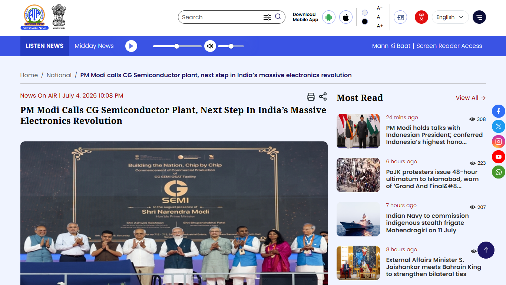

# Daily Semiconductor Current Affairs

Date: 2026-07-07

Research window: July 7 India afternoon, plus the nearest July 6-to-July 7 market and policy window. Today's lead is Samsung's company-confirmed second-quarter guidance. The SIA sales release is from July 6 U.S. time but is included because it became part of the July 7 India study window. SK hynix and TSMC are tracked as pending follow-ups, not new completed outcomes.

## Quick Index

| Date | Major Topic | Source Groups | Why To Read |
|---|---|---|---|
| 2026-07-07 | Samsung posts company guidance far above last year | Samsung Newsroom, Samsung IR, market reporting | Teaches how to separate company guidance, actual audited results, and market reaction. |
| 2026-07-07 | Global chip sales hit a new high in May | SIA, WSTS | Shows that AI-led demand is now visible in broad industry sales, not only in one stock. |
| 2026-07-07 | TSMC quiet-period watch continues | TSMC Investor Relations | Keeps foundry expectations disciplined until July 16 actual results. |
| 2026-07-07 | India Semicon 2.0 and CG Semi follow-up | Economic Times, India Semiconductor Mission comments, NewsOnAir | Connects Indian policy design with packaging/test production evidence. |
| 2026-07-07 | SK hynix U.S. offering still pending | SEC, Reuters-linked reporting | Marks what is still unresolved before pricing and trading later this week. |

## Source Images And Manifest

Source manifest: [../images/2026-07-07/links.md](../images/2026-07-07/links.md)



This screenshot is used only to preserve source identity, headline, date, and visible context for the India follow-up. Samsung, SIA, Economic Times, and TSMC are cited as text links because headless screenshot capture either produced no file, hung, or showed a bot-check page rather than a usable source headline.

## Source Map

| Source | Source date | Role | Confidence / limitation |
|---|---:|---|---|
| [Samsung Global Newsroom: Q2 2026 earnings guidance](https://news.samsung.com/global/samsung-electronics-announces-earnings-guidance-for-second-quarter-2026) | 2026-07-07 | Company-confirmed sales and operating-profit guidance | Primary company source; still unaudited guidance before full earnings. |
| [Samsung IR public disclosure](https://www.samsung.com/global/ir/reports-disclosures/public-disclosure-view.84695/) | 2026-07-07 | Investor-facing disclosure and forward-looking caution | Primary company source; confirms the same guidance and audit caveat. |
| [Reuters via KELO: Samsung flags 19-fold jump, shares slump](https://kelo.com/2026/07/06/samsung-estimates-19-fold-rise-in-q2-operating-profit-beating-expectations/) | 2026-07-07 | Market reaction, LSEG SmartEstimate, DRAM/NAND ASP context | Reputable wire reporting; market moves are time-specific and can change intraday. |
| [SIA: Global Semiconductor Sales Increase 9.2% Month-to-Month in May](https://www.semiconductors.org/global-semiconductor-sales-increase-9-2-month-to-month-in-may/) | 2026-07-06 | Market data for May 2026 global chip sales | Primary industry association release using WSTS data; three-month moving average smooths monthly noise. |
| [TSMC Q2 2026 results page](https://investor.tsmc.com/english/quarterly-results/2026/q2) | 2026-07-07 status | Official Q2 guidance, quiet period, and conference date | Primary company source; results remain pending until July 16. |
| [Economic Times: India finalising Semicon 2.0](https://economictimes.indiatimes.com/industry/cons-products/electronics/india-finalising-semicon-2-0-to-expand-chip-incentives-beyond-fabs/articleshow/132232886.cms?from=mdr) | 2026-07-07 | India policy report based on ISM CEO comments | Reputable reporting; final official policy notification is still pending. |
| [India Semiconductor Mission homepage](https://ism.gov.in/) | 2026 status | Official scheme and timeline context for ISM 1.0 and ISM 2.0 focus areas | Primary government source; it confirms direction, not the final Semicon 2.0 scheme text. |
| [NITI Aayog: Future of India's Semiconductor Industry](https://niti.gov.in/sites/default/files/2026-05/Future-of-India-Semiconductor-Industry.pdf) | 2026-05 | Policy roadmap context for ecosystem deepening, packaging, compound semiconductors, design infrastructure | Government roadmap; strategic context rather than daily news. |
| [NewsOnAir: CG Semi OSAT inauguration](https://newsonair.gov.in/pm-modi-inaugurates-%E2%82%B97500-crore-semiconductor-osat-facility-in-gujarat/) | 2026-07-04 | Government broadcaster source for CG Semi production follow-up | Public source; does not disclose customer, yield, utilization, or exact shipment data. |
| [SEMI: 300mm memory equipment investment outlook](https://www.semi.org/en/semi-press-release/semi-projects-300mm-memory-equipment-investment-to-surpass-50-billion-dollars-in-2026) | 2026-06-29 | Equipment and capacity context for memory cycle | Primary industry source; forecast, not installed output. |
| [SEC: SK hynix Form F-1 filing index](https://www.sec.gov/Archives/edgar/data/2120882/000119312526280172/0001193125-26-280172-index.htm) | 2026-06-24 | Offering registration and issuer record | Primary regulator filing; final pricing remains pending. |
| [Reuters via MarketScreener: SK hynix offering launch](https://www.marketscreener.com/news/south-korea-s-sk-hynix-launching-28-billion-us-listing-to-ride-global-ai-wave-ce7f5edadf88f327) | 2026-07-06 | Offering launch, depositary ratio, estimated size, timing | Reputable reporting; final price, trading, and net proceeds still pending. |
| [ASML lithography principles](https://www.asml.com/en/technology/lithography-principles) | Reference | EUV and lithography definitions | Primary technology explainer from equipment supplier. |
| [Synopsys EDA glossary](https://www.synopsys.com/glossary/what-is-electronic-design-automation.html) | Reference | EDA definition | Vendor technical explainer; useful for study definitions. |
| [Amkor OSAT reference](https://ir.amkor.com/news-releases/news-release-details/amkor-announces-us-advanced-packaging-and-test-facility) | Reference | OSAT definition context | Primary company release from a major OSAT provider. |

## Technical Terms / Deep Definitions

This note defines important terms immediately after their first learning use in the relevant section, using the required `Term:` and `Definition:` format. The main definition clusters are Samsung financial terms, memory technologies, SIA/WSTS market data, TSMC foundry reporting, India policy/OSAT terms, SEMI equipment context, EUV lithography, and SK hynix depositary-share mechanics.

## Verification Matrix

| News item | Verification status | Strongest evidence | What is analysis, not fact | What must be checked next |
|---|---|---|---|---|
| Samsung Q2 guidance | **Verified by primary company sources** | Samsung Newsroom and Samsung IR both state about 171 trillion won sales and 89.4 trillion won operating profit. | Why shares fell, whether AI demand is peaking, and whether memory pricing remains durable. | Full Q2 earnings release, semiconductor-division profit, HBM qualification volume, capex, and outlook. |
| Samsung / Korea market reaction | **Verified as reporting, time-sensitive** | Reuters-linked reporting says Samsung and SK hynix fell sharply despite the profit guidance. | Interpretation that investors fear AI capex slowdown or overcapacity. | Closing prices, follow-on trading, analyst revisions, and Korean exchange disclosures. |
| SIA May sales | **Verified by primary industry source** | SIA release using WSTS data reports US$120.6 billion May sales, +9.2% month-to-month, +104.1% year-to-year. | Whether this pace continues into June and Q3. | Next SIA release and WSTS update. |
| TSMC Q2 watch | **Verified by primary company source** | TSMC investor page states July 6-15 quiet period, July 16 conference, and Q2 guidance. | Any claim that TSMC will raise guidance is analyst speculation until management says it. | July 16 actuals and guidance. |
| India Semicon 2.0 | **Current report plus official directional support** | ET reports policy is being finalised; ISM official site says ISM 2.0 focus includes Equipment & Materials, Design IP, Supply Chains, and R&D Centres; NITI roadmap supports ecosystem deepening. | Final incentive structure, budget, eligible categories, and application rules. | Official MeitY/ISM notification. |
| CG Semi OSAT | **Verified event/capacity claim, production detail still incomplete** | NewsOnAir confirms July 4 inauguration and states 20 crore annual capacity with future target of 500 crore chips. | Actual customer mix, yield, utilization, quality certificates, and recurring shipments. | Company disclosures, customer announcements, export/shipment evidence, and audit-style production data. |
| SK hynix U.S. offering | **Verified filing and reported launch, final outcome pending** | SEC F-1 filing and Reuters-linked launch report. | Whether the listing improves valuation or accelerates HBM supply. | Final pricing, net proceeds, trading start, and capex deployment. |

## 1. Samsung: Company Guidance Confirms The Memory Boom, But Not The Full Quarter Yet

Samsung issued second-quarter 2026 earnings guidance on July 7.
Term: Earnings guidance
Definition: Earnings guidance is a company estimate of expected financial results before the full audited or externally reviewed earnings package is released. It solves the investor-information problem of giving the market a timely range or point estimate, but it is still not the same as final detailed results by division. In today's news, Samsung guidance is stronger evidence than analyst forecasts from July 6, but investors still need the full July earnings release to see semiconductor-division profit, memory shipment mix, inventory, capex, and outlook. Example: guidance is like a measured preview; the final earnings report is the detailed lab result. Source: [Samsung Newsroom](https://news.samsung.com/global/samsung-electronics-announces-earnings-guidance-for-second-quarter-2026)

Samsung guided to consolidated sales of about 171 trillion Korean won and consolidated operating profit of about 89.4 trillion Korean won. Samsung also disclosed the underlying ranges: sales of 170-172 trillion won and operating profit of 89.3-89.5 trillion won.
Term: Operating profit
Definition: Operating profit is revenue minus the costs and operating expenses tied to the core business, before financing costs and income tax. It solves the question "how profitable was the business engine itself?" without mixing in debt structure or tax effects. In this news it matters because memory price increases can flow strongly into operating profit when fixed fab costs are already covered. Example: if a DRAM fab sells each bit at a higher price while much of the tool depreciation is fixed, operating profit can rise faster than revenue. Source: [Samsung IR disclosure](https://www.samsung.com/global/ir/reports-disclosures/public-disclosure-view.84695/)

Samsung says the figures are based on K-IFRS.
Term: K-IFRS
Definition: K-IFRS means Korean International Financial Reporting Standards, the accounting framework Samsung uses for consolidated reporting. It solves the comparability problem by forcing revenue, expense, asset, liability, and consolidation rules into a defined standard rather than allowing companies to choose their own measurement style. In this news, K-IFRS matters because Samsung compares Q2 2026 guidance with Q1 2026 and Q2 2025 consolidated figures. Example: an engineering analogy is using the same test bench before comparing two chips. Source: [Samsung Newsroom](https://news.samsung.com/global/samsung-electronics-announces-earnings-guidance-for-second-quarter-2026)

Samsung and analysts discuss capex because memory supply cannot expand without tool-heavy factory spending.
Term: Capital expenditure (capex)
Definition: Capital expenditure is money spent on long-lived productive assets such as fabs, cleanrooms, EUV scanners, deposition tools, etch systems, test equipment, packaging lines, and data-center infrastructure. It solves future capacity and technology needs, but it is not the same as current production. In today's news, capex matters because Samsung's profits and SK hynix's offering are both linked to future memory supply, yet capex only becomes shipped chips after installation, process qualification, yield learning, and customer qualification. Example: buying a lithography tool is not equal to shipping a qualified HBM stack. Source: [SEMI memory equipment outlook](https://www.semi.org/en/semi-press-release/semi-projects-300mm-memory-equipment-investment-to-surpass-50-billion-dollars-in-2026)

The year-on-year comparison is extreme. Samsung listed Q2 2025 sales at 74.57 trillion won and operating profit at 4.68 trillion won. Compared with that baseline, guided Q2 2026 sales are about 2.29 times last year's level, while operating profit is about 19.1 times last year's level. Compared with Q1 2026, guided sales are up about 27.7% from 133.87 trillion won, and guided operating profit is up about 56.2% from 57.23 trillion won.

### Numerical verification

| Check | Calculation | Result | Why it matters |
|---|---:|---:|---|
| Sales growth versus Q2 2025 | 171 / 74.57 | about 2.29x | Revenue more than doubled, showing demand and price strength. |
| Operating-profit growth versus Q2 2025 | 89.4 / 4.68 | about 19.1x | Profit expanded much faster than sales, which is typical of a tight memory cycle with operating leverage. |
| Sales growth versus Q1 2026 | 171 / 133.87 - 1 | about 27.7% | Sequential growth shows the cycle accelerated from the already strong Q1. |
| Operating-profit growth versus Q1 2026 | 89.4 / 57.23 - 1 | about 56.2% | Profit acceleration implies mix, pricing, and utilization improved faster than revenue alone. |

### Confirmed facts

- Samsung itself confirmed the July 7 guidance.
- The company gave a point estimate plus a regulatory-compliance range.
- Samsung warned that the guidance is provided before external audit or review of headquarters, subsidiaries, and affiliates is complete.
- Full divisional details, memory product mix, HBM volume, DRAM/NAND pricing, capex, and forward outlook remain pending.

DRAM and NAND are the two main memory-product families behind the market interpretation.
Term: DRAM
Definition: Dynamic random-access memory stores bits as charge in tiny capacitors that must be refreshed repeatedly. It solves the computer's need for fast working memory close to processors, but it loses data without power. In today's news, DRAM matters because servers, AI accelerators, PCs, and phones all compete for fast memory, and tight supply can raise prices sharply. Example: DRAM is the active workbench; storage is the warehouse. Source: [Micron technical brief](https://www.micron.com/content/dam/micron/global/public/products/technical-marketing-brief/micron-hbm2e-memory-wp.pdf)

Term: NAND flash
Definition: NAND flash is non-volatile memory that stores data even when power is removed, using cells arranged for dense storage. It solves the problem of persistent data storage in SSDs, phones, servers, and embedded systems. In today's news, NAND matters because AI infrastructure also needs huge storage and fast SSDs, not only GPUs and HBM. Example: DRAM is fast temporary scratch space; NAND is persistent storage. Source: [Micron storage and memory references](https://www.micron.com/products/storage)

High-Bandwidth Memory remains the premium AI-memory product investors care about.
Term: High-Bandwidth Memory (HBM)
Definition: HBM is stacked DRAM placed very close to a processor through advanced package interconnects so data can move through a very wide, energy-efficient path. It solves the memory-bandwidth bottleneck in AI accelerators, where compute units can sit idle if data cannot arrive fast enough. In this news, HBM matters because Samsung's memory profitability and valuation depend partly on how much premium AI-memory supply it can qualify and ship against SK hynix and Micron. Example: ordinary DIMM memory is like a narrower road outside the chip package; HBM is like a much wider road built next to the compute die. Source: [Synopsys HBM3 explainer](https://www.synopsys.com/glossary/what-is-high-bandwitdth-memory-3.html)

Reuters-linked reporting cites analyst estimates for average selling prices.
Term: Average selling price (ASP)
Definition: Average selling price is product revenue divided by the relevant unit base, such as units, wafers, bits, or product mix. It solves the pricing question when a company sells many grades, capacities, and contracts. In today's news, ASP matters because DRAM and NAND profit can rise sharply if memory makers sell similar or moderately higher bit volumes at much higher prices. Example: a DRAM maker can grow revenue even without doubling physical output if the price per bit rises. Source: [Reuters via KELO](https://kelo.com/2026/07/06/samsung-estimates-19-fold-rise-in-q2-operating-profit-beating-expectations/)

### Analysis

Samsung's guidance closes yesterday's forecast question: the company did not merely meet an 86 trillion won analyst estimate; it guided higher at about 89.4 trillion won. Reuters-linked reporting cites a newer LSEG SmartEstimate of 87.3 trillion won, which Samsung also beat. The important learning point is that a strong guidance number can still be followed by a weak share-price reaction if investors think the result was already priced in, if they worry about peak memory pricing, or if they want proof that AI infrastructure demand will stay strong into 2027 and 2028.

Market reporting today said Samsung shares fell despite the record guidance. That is not a contradiction. Equity prices discount future expectations. The stock can fall if the market moves from "memory boom is accelerating" to "the boom is real, but maybe already priced." This is a core review habit: treat a stock move as evidence of market expectations, not as proof that the operating business is weak.

### Deep mechanism: why memory profit can explode

Memory fabrication has high fixed costs. Once a fab is running, depreciation, labor, utilities, and many engineering costs are already committed. When supply is tight and ASP rises, extra revenue can drop heavily into operating profit. The simplified model is:

```text
tight AI demand -> higher DRAM/NAND/HBM ASP
high fab utilization -> fixed costs spread across more valuable output
better mix toward server and AI memory -> higher gross profit per wafer
=> operating profit rises faster than sales
```

The risk is symmetric. If every supplier adds capacity aggressively and demand slows later, ASP can fall while fixed costs remain. That is why the market worries about future overcapacity even during a record quarter.

### India angle and VLSI relevance

For India, high memory prices affect servers, phones, PCs, vehicles, and industrial electronics. For a VLSI student, the career lesson is that memory is not one topic. DRAM circuit design, NAND reliability, HBM package integration, signal integrity, test, thermal design, firmware, procurement, and finance all meet in one earnings line.

Simple explanation: Samsung says it likely made much more operating profit because memory demand and pricing are strong. The number is company guidance, not the full final result.

## 2. SIA: May Sales Show The Boom Is Broad, Not Only Company-Specific

SIA reported global semiconductor sales of US$120.6 billion for May 2026.
Term: Semiconductor Industry Association (SIA)
Definition: SIA is a U.S.-based industry association representing most U.S. semiconductor revenue and a large share of non-U.S. chip-company revenue. It solves the industry-voice and data-communication problem by publishing market updates, policy positions, and research. In this news, SIA matters because its sales release gives a broad market read that supports the earnings strength seen in Samsung and Micron, rather than treating those companies as isolated cases. Example: a company earnings report is one sensor; SIA market data is a wider dashboard. Source: [SIA May 2026 sales release](https://www.semiconductors.org/global-semiconductor-sales-increase-9-2-month-to-month-in-may/)

SIA said monthly sales are compiled by WSTS and represent a three-month moving average.
Term: WSTS three-month moving average
Definition: WSTS means World Semiconductor Trade Statistics. A three-month moving average smooths the latest month by averaging recent monthly revenue readings, reducing noise from calendar timing, shipments, and reporting volatility. It solves the problem of overreacting to one bumpy month. In this news, it matters because US$120.6 billion is a smoothed May sales figure, not necessarily the exact invoice total for one calendar month. Example: it is like averaging three ADC samples to reduce noise before interpreting a signal. Source: [SIA May 2026 sales release](https://www.semiconductors.org/global-semiconductor-sales-increase-9-2-month-to-month-in-may/) and [WSTS](https://www.wsts.org/)

The headline data are large:

| Metric | May 2026 SIA figure | Comparison |
|---|---:|---|
| Global sales | US$120.6 billion | Highest recorded monthly sales total according to SIA. |
| Month-to-month change | +9.2% | Compared with April 2026 sales of US$110.5 billion. |
| Year-to-year change | +104.1% | Compared with May 2025 sales of US$59.1 billion. |
| Growth streak | 15 consecutive months | SIA said May increased month-to-month for the 15th consecutive month. |

SIA also reported broad regional strength: year-to-year sales were up in the Americas, Asia Pacific/all other, China, Europe, and Japan, while month-to-month sales increased in all listed regions. This matters because a memory-only boom would be narrower; broad regional growth suggests AI infrastructure demand is pulling through logic, memory, networking, storage, equipment, and downstream electronics.

### Confirmed facts

- SIA published the release on July 6, 2026.
- It used WSTS data.
- Sales more than doubled from May 2025.
- SIA attributed growth to strong year-to-year growth in the Americas, Asia-Pacific/all other, and China.

### Analysis

This release matters because it converts the "AI chip boom" from a stock-market phrase into an industry revenue signal. A two-company story would be fragile. A broad SIA sales acceleration means the boom is reaching logic, memory, storage, networking, packaging, equipment, and regional supply chains.

The risk is that three-month average data are backward-looking. They confirm what has already shipped and been reported; they do not guarantee that AI capex, memory ASPs, or foundry utilization will stay at the same level.

### How to review the SIA number

| Review question | Correct interpretation |
|---|---|
| Is US$120.6 billion one company's revenue? | No. It is global semiconductor industry sales compiled through WSTS and reported by SIA. |
| Is it exact real-time demand? | No. It is a three-month moving average, so it is a smoothed lagging indicator. |
| Does it prove AI demand will last? | No. It proves recent industry sales were very strong; durability requires future monthly data and company guidance. |
| Why is it still important? | It validates that the upcycle is broad enough to show in industry-wide data, not only in stock narratives. |

### India angle and VLSI relevance

For India, a global sales surge creates opportunity and pressure. Opportunity: more demand for design, verification, packaging, test, electronics manufacturing, and supply-chain services. Pressure: higher component prices and tighter allocation for domestic electronics. For VLSI careers, this is why students should read market data alongside RTL, STA, DFT, and physical design. Real projects are shaped by demand cycles.

Simple explanation: the semiconductor industry is selling much more than last year, and the increase is broad enough to show up in industry-wide data.

## 3. TSMC: Quiet Period Means Watch The Official Range, Not Rumor

TSMC remains the key foundry watch item for July.
Term: Foundry
Definition: A foundry manufactures chips designed by other companies, using its process nodes, fabs, design rules, PDKs, and manufacturing services. It solves the problem that fabless companies can design advanced chips without owning multi-billion-dollar wafer fabs. In this news, TSMC matters because AI accelerators, custom ASICs, CPUs, networking chips, and many advanced packages depend on TSMC capacity and yield. Example: Nvidia may design an accelerator, but TSMC manufactures the wafer on an advanced process. Source: [TSMC Q2 2026 results page](https://investor.tsmc.com/english/quarterly-results/2026/q2)

TSMC states that its Q2 quiet period runs from July 6 through July 15.
Term: Earnings quiet period
Definition: An earnings quiet period is a pre-results window when management limits investor contact to reduce selective disclosure and rumor-driven information asymmetry. It solves fairness and compliance problems before material financial information is released. In today's news, the quiet period matters because TSMC silence should not be interpreted as hidden confirmation or denial of analyst expectations. Example: in a lab exam, you do not infer results from silence while the measurement is locked for review. Source: [TSMC Q2 2026 results page](https://investor.tsmc.com/english/quarterly-results/2026/q2)

TSMC's official Q2 guidance remains:

| Metric | TSMC Q2 2026 guidance |
|---|---:|
| Net revenue | US$39.0 billion to US$40.2 billion |
| Gross margin | 65.5% to 67.5% |
| Operating margin | 56.5% to 58.5% |
| Earnings conference | July 16, 2026, 14:00 Taiwan time |

Term: Gross margin
Definition: Gross margin is revenue minus cost of goods sold, divided by revenue. It solves the question of how much profit remains after direct production costs before R&D, sales, administration, interest, and taxes. In today's news, TSMC's high guided gross margin matters because it signals pricing power, strong utilization, advanced-node mix, and manufacturing efficiency. Example: a foundry can grow revenue but hurt gross margin if overseas ramp costs, depreciation, or low utilization rise faster than wafer pricing. Source: [TSMC Q2 2026 results page](https://investor.tsmc.com/english/quarterly-results/2026/q2)

### Confirmed facts versus analysis

Confirmed: the conference date, quiet period, and guidance range.

Analysis: Investor focus will be on whether AI demand supports higher full-year growth, whether advanced packaging capacity remains tight, and whether margins stay high while capex and overseas fabs expand.

### India and career relevance

Indian fabless and service teams depend on foundry availability, PDK readiness, IP qualification, tape-out schedules, and package capacity. A TSMC guidance change can affect project cost, delivery timing, and customer budgets. Career relevance: physical design, signoff, DFT, package co-design, IP integration, and program management all depend on foundry constraints.

Simple explanation: TSMC has not reported Q2 yet. Use the official guidance range until July 16.

## 4. India: Semicon 2.0 Moves From Fabs Toward The Whole Supply Chain

Economic Times reported on July 7 that India is finalising Semicon 2.0.
Term: Semicon 2.0
Definition: Semicon 2.0 is the reported next phase of India's semiconductor policy support, intended to broaden incentives beyond only wafer fabs and packaging plants toward design startups, materials, gases, chemicals, equipment, talent, and research. It solves the ecosystem gap: a fab cannot run alone without suppliers, trained engineers, design demand, utilities, test infrastructure, and local know-how. In today's news, it matters because India is trying to move from isolated project approvals toward a wider value-chain base. Example: building a fab without chemical, gas, equipment-service, design, and packaging support is like building a hospital without diagnostics, staff, and supply logistics. Source: [Economic Times](https://economictimes.indiatimes.com/industry/cons-products/electronics/india-finalising-semicon-2-0-to-expand-chip-incentives-beyond-fabs/articleshow/132232886.cms?from=mdr)

The report says India Semiconductor Mission CEO Amitesh Kumar Sinha told an online session that the policy is being finalised and will be announced soon. It also says Semicon 2.0 will strengthen incentives for design startups and extend support to semiconductor-grade chemicals, gases, materials, equipment, talent development, and indigenous research.

The official ISM site supports the direction of travel: its timeline says ISM 2.0 will focus on Equipment & Materials, Design IP, Supply Chains, and R&D Centres. NITI Aayog's 2026 roadmap similarly frames ISM 2.0 as a move from ecosystem initiation toward ecosystem deepening, with advanced packaging, compound semiconductors, design infrastructure, long-term capital, and governance called out as priorities. The July 7 ET item is therefore credible as a current report, but the final legal scheme still needs official notification.

Term: Design Linked Incentive (DLI)
Definition: DLI is India's incentive and infrastructure-support scheme for semiconductor design work such as ICs, chipsets, SoCs, systems, IP cores, and semiconductor-linked designs. It solves the problem that India has strong design talent but needs product companies, reusable IP, EDA access, prototyping support, and commercialization pathways. In today's news, DLI matters because Semicon 2.0 is reported to strengthen support for design startups, not only factories. Example: a fab incentive helps build manufacturing capacity; DLI helps create Indian-owned chip designs that can use foundry and OSAT capacity. Source: [India Semiconductor Mission](https://ism.gov.in/)

Term: Semiconductor-grade chemicals, gases, and materials
Definition: These are ultra-pure inputs used in wafer fabrication and packaging, including process gases, wet chemicals, photoresists, slurries, wafers, substrates, bonding materials, and cleaning materials. They solve the physical manufacturing problem of building nanoscale structures without contamination. In today's news, they matter because India cannot become resilient only by approving fabs; it also needs reliable local or allied supply of the inputs a fab consumes every day. Example: a tiny contamination level that looks harmless in normal manufacturing can ruin yield at semiconductor geometries. Source: [SEMI materials conference context](https://www.semi.org/en/connect/events/strategic-materials-conference-smc)

NewsOnAir's July 4 CG Semi report remains important because it gives production context for the same ecosystem discussion.
Term: OSAT
Definition: OSAT means outsourced semiconductor assembly and test. It is the back-end manufacturing stage where fabricated dies are packaged, assembled, and tested before being shipped into electronics systems. It solves the problem that a wafer die is not yet a usable product until it is protected, connected, thermally managed, electrically tested, and qualified. In today's news, OSAT matters because CG Semi is a packaging/test milestone for India, not a front-end wafer fabrication milestone. Example: wafer fabrication creates the die; OSAT turns that die into a reliable component a board can use. Source: [Amkor OSAT reference](https://ir.amkor.com/news-releases/news-release-details/amkor-announces-us-advanced-packaging-and-test-facility)

Term: ATMP
Definition: ATMP means assembly, testing, marking, and packaging. It overlaps strongly with OSAT terminology and describes the back-end steps that make a bare semiconductor die usable, traceable, and reliable in a customer system. It solves mechanical protection, electrical connection, thermal path, quality screening, and product-identification needs. In today's news, ATMP matters because India's earliest production wins are mostly in back-end semiconductor manufacturing, where commercial ramp is more achievable before leading-edge wafer fabrication. Example: a die without ATMP is like an engine without housing, connectors, and quality checks. Source: [India Semiconductor Mission](https://ism.gov.in/)

NewsOnAir said the Sanand plant is geared to produce 20 crore chips annually and that the future target is 500 crore chips per year. The same source says the plant was inaugurated on July 4 by Prime Minister Narendra Modi.

### Confirmed facts

- Economic Times reported Semicon 2.0 policy is being finalised and will expand beyond fabrication.
- The report cites ISM CEO comments and says 12 projects have been approved under the first phase.
- It says three facilities have commenced production: Micron's assembly/test plant, CG Power-Renesas OSAT, and Kaynes Semicon's packaging unit.
- NewsOnAir confirmed the CG Semi inauguration and quoted the 20 crore annual capacity and 500 crore future target.

### What remains pending

The Semicon 2.0 report is not the final policy notification. Pending items include official scheme text, incentive percentages, eligible categories, budget, state-level matching support, application deadlines, design-startup terms, materials supplier conditions, and disbursement milestones.

For CG Semi, still pending: customer names, package types, number of good units shipped, yield, utilization, recurring monthly output, automotive/industrial qualification, export certificates, and G2 timeline.

### India and VLSI relevance

This is one of the most relevant India items of the month. Students should separate:

| Layer | What it means | Career relevance |
|---|---|---|
| Design | RTL, verification, analog, DFT, physical design, IP | Direct VLSI jobs and startup formation. |
| Fabrication | Wafer processing, lithography, deposition, etch, metrology | Process, equipment, yield, and manufacturing engineering. |
| OSAT / packaging | Assembly, wire bond, flip-chip, package design, thermal, test | India's fastest near-term manufacturing ramp area. |
| Materials and equipment | Chemicals, gases, wafers, spares, service, cleanroom inputs | Supply-chain, quality, process-control, and vendor engineering. |
| Talent and research | Training, labs, university-industry programs | Long-term ecosystem depth. |

Simple explanation: India is trying to support not just the factory, but the whole system around the factory.

## 5. SEMI Equipment Context: Memory Expansion Needs Tools, Not Only Money

SEMI projects 300mm memory fab equipment investment to exceed US$50 billion in 2026.
Term: 300mm fab equipment investment
Definition: A 300mm fab uses circular silicon wafers about 300 millimeters in diameter, and fab equipment investment means spending on production tools such as lithography, deposition, etch, clean, implant, metrology, inspection, and process-control systems. It solves the capacity and technology-migration problem by giving manufacturers the physical tools needed to process more wafers or more advanced layers. In today's news, it matters because Samsung, SK hynix, Micron, and other memory suppliers cannot expand output from capital markets alone; they need installed and qualified equipment. Example: raising money is buying the ticket; installing and qualifying tools is reaching the destination. Source: [SEMI](https://www.semi.org/en/semi-press-release/semi-projects-300mm-memory-equipment-investment-to-surpass-50-billion-dollars-in-2026)

SEMI's June 29 outlook says memory-sector 300mm equipment investment is projected to rise 29% to US$52 billion in 2026 and then 11% to US$57 billion in 2027. It also says DRAM equipment spending is expected to grow 29% to US$37 billion in 2026, while 3D NAND equipment spending is expected to grow 28% to US$14 billion.

Term: EUV lithography
Definition: EUV lithography uses 13.5 nm extreme-ultraviolet light and reflective optics to print very small chip patterns with fewer multipatterning steps than older deep-ultraviolet methods. It solves the patterning problem for the most advanced layers, but EUV tools are expensive, complex, and constrained by supplier capacity and export-control policy. In today's news, EUV matters because SK hynix's offering proceeds are expected to support advanced fab equipment, while Samsung and TSMC performance depends on advanced process capacity. Example: DUV can still print many layers, but EUV is needed when the patterning problem becomes too tight for economical multipatterning. Source: [ASML lithography principles](https://www.asml.com/en/technology/lithography-principles)

### Analysis

The equipment data explains why today's Samsung number and yesterday's SK hynix financing plan are not short-term shortage fixes. Memory capacity must pass through:

```text
capital -> tool orders -> delivery -> installation -> recipe tuning
-> yield learning -> product qualification -> volume shipment
```

If AI demand stays high, equipment suppliers and materials companies benefit. If demand slows before the new tools are productive, the same capacity plan can become cycle risk.

## 6. SK hynix Follow-Up: Offering Pricing Is Still Open

SK hynix's U.S. depositary-share offering remains unresolved today.
Term: American Depositary Share (ADS) and American Depositary Receipt (ADR)
Definition: An ADS is a U.S.-traded ownership unit representing shares of a non-U.S. company held through a depositary structure; an ADR is the receipt or certificate evidencing that unit. It solves currency, custody, settlement, and market-access friction for U.S. investors. In today's news, it matters because SK hynix can raise U.S.-accessible equity while its underlying operating company remains Korean. Example: the ADR/ADS is the U.S. wrapper; the Korean common share is the underlying asset. Source: [SEC Investor Bulletin](https://www.investor.gov/introduction-investing/general-resources/news-alerts/alerts-bulletins/investor-bulletins-88)

The SEC F-1 filing is primary evidence that SK hynix registered the offering framework. Reuters-linked reporting on July 6 says the company was launching a large U.S. listing process, with final pricing expected Thursday and trading expected Friday. As of this July 7 note, final price, allocated shares, net proceeds, and first trading performance remain pending.

Term: Depositary ratio
Definition: A depositary ratio states how many U.S. depositary shares represent one underlying foreign share, or the reverse. It solves practical market-access and pricing issues by making the U.S.-traded unit a convenient size even when the home-market share has a very different currency and price level. In this news, Reuters-linked reporting says ten SK hynix depositary shares represent one Korean common share, so U.S. trading units are fractional economic claims on the Korean share. Example: if one Korean share is represented by ten ADS units, one ADS corresponds to one-tenth of the Korean share. Source: [Reuters via MarketScreener](https://www.marketscreener.com/news/south-korea-s-sk-hynix-launching-28-billion-us-listing-to-ride-global-ai-wave-ce7f5edadf88f327)

Term: Primary offering
Definition: A primary offering sells newly issued company shares so the company receives the cash. It solves a funding need for capex, R&D, debt reduction, or strategic investment, but it also increases the share count and can dilute existing owners. In this news, primary offering matters because SK hynix is using market demand for AI memory to fund fabs and equipment, not merely letting existing shareholders sell stock. Example: a secondary sale changes who owns shares; a primary sale gives the company new money. Source: [SEC Form F-1 filing index](https://www.sec.gov/Archives/edgar/data/2120882/000119312526280172/0001193125-26-280172-index.htm)

### Pending follow-up

The correct status is **updated, still pending**. The offering launch is known, but the actual financing outcome is not. Watch Thursday pricing, Friday trading, underwriter allocations, dilution math, net proceeds, and management's capex conversion plan.

## Coverage Check

| Segment | July 7 status | Study conclusion |
|---|---|---|
| Chipmakers / memory | Major update | Samsung guidance confirms very strong memory-cycle earnings, but full divisional detail is pending. |
| AI accelerators | Indirect update | AI accelerator demand is visible through HBM, DRAM, NAND, TSMC, and equipment data; no major new accelerator launch was verified today. |
| Foundry | Watch item | TSMC remains in quiet period; official guidance is the benchmark until July 16. |
| Equipment | Context update | SEMI's memory-equipment outlook explains why capex and tools are central to future supply. |
| EDA / IP | No major exact-date launch | Semicon 2.0 design-startup incentives and foundry demand keep EDA/IP relevant, but no new vendor release was added today. |
| Materials | India update | Semicon 2.0 is reported to include chemicals, gases, materials, and equipment suppliers. |
| Packaging / test | India update | CG Semi OSAT remains an important production follow-up; repeat shipments and yield are still pending. |
| Policy / export controls | Policy update | India policy broadening is active; U.S. memory allocation debate remains unresolved. |
| Geopolitics | Korea, Taiwan, India, U.S. | Korea memory earnings/financing, Taiwan foundry guidance, and India ecosystem policy are linked by AI demand. |
| Market-moving signals | Major update | Samsung's record guidance and SIA's record sales data are positive fundamentals, while share reaction can still be negative if expectations are too high. |

## Follow-Up Ledger

| Earlier item | July 7 status | Evidence / next check |
|---|---|---|
| Samsung July 7 preliminary result | **Updated, company guidance received** | Samsung guided to 171 trillion won sales and 89.4 trillion won operating profit; full earnings remain pending. |
| Samsung detailed Q2 release | **Still pending** | Watch divisional semiconductor profit, HBM commentary, DRAM/NAND ASP, inventory, capex, and outlook. |
| SK hynix U.S. offering | **Updated, still pending** | SEC filings and July 6 launch known; final pricing, net proceeds, and trading remain pending. |
| TSMC Q2 earnings | **Still pending** | Quiet period July 6-15; July 16 result must be compared with US$39.0-40.2 billion guidance. |
| U.S. memory intervention debate | **Still pending / no rule verified** | No new enacted allocation or export-control rule was verified today. |
| India Semicon 2.0 | **New, pending official policy** | ET reports the policy is being finalised; wait for scheme text and budget. |
| CG Semi G1 recurring production | **Updated, still pending** | Inauguration and annual capacity claims preserved; yield, utilization, and repeat shipment evidence still missing. |
| CG Semi G2 | **Still pending** | Watch construction, equipment arrival, qualification, and ramp schedule. |
| SEMI memory equipment outlook | **Still active context** | Forecast supports memory capex thesis; installed and qualified output remain future evidence. |
| Kioxia, Infineon, Socionext, FormFactor | **Still pending** | No new July 7 evidence closing prior qualification, yield, production, or tape-out questions. |

## Concept Review

| Concept | Key distinction | Why it matters |
|---|---|---|
| Guidance versus final results | Guidance is a preliminary company estimate; full earnings give detailed audited or reviewed results. | Samsung's headline is real company guidance, but divisional memory detail is still missing. |
| Operating profit versus sales | Sales measure revenue; operating profit measures core business profit after operating costs. | Samsung profit rose far faster than sales, showing operating leverage in memory. |
| WSTS moving average versus raw month | Moving average smooths volatility; raw monthly shipments can be noisier. | SIA's US$120.6 billion figure should be read as trend evidence, not a perfect daily pulse. |
| Foundry versus fabless | Foundry manufactures; fabless company designs and outsources manufacturing. | TSMC results affect many AI-chip designers even if they do not own fabs. |
| Fab versus OSAT | Fab makes wafer dies; OSAT packages and tests dies into usable components. | CG Semi is important, but it is a back-end manufacturing milestone, not a front-end wafer-fab milestone. |
| Capex versus capacity | Capex is spending; capacity is qualified productive output. | SK hynix and SEMI data show future supply intent, not immediate HBM relief. |

## Interview Questions

1. Why can Samsung's operating profit increase faster than revenue during a memory upcycle?
2. What is the difference between Samsung's July 7 guidance and its full Q2 earnings release?
3. Why does SIA use a three-month moving average for semiconductor sales?
4. How can global chip sales double year-on-year while some semiconductor stocks still fall?
5. What does a TSMC quiet period mean, and why should analysts avoid filling it with rumor?
6. Why is an OSAT plant not the same thing as a wafer fab?
7. What supply-chain layers must India build beyond fabs to make Semicon 2.0 useful?
8. Why does memory capex take years to become qualified HBM, DRAM, or NAND shipments?
9. How can a primary offering fund future growth while diluting current shareholders?
10. Which VLSI roles are most exposed to the AI-memory cycle: design, verification, physical design, packaging, test, or supply-chain planning?

## What To Watch Next

1. Samsung's full Q2 earnings release and semiconductor-division commentary.
2. SK hynix final offering price, shares sold, net proceeds, and first U.S. trading behavior.
3. TSMC July 16 actual revenue, margins, capex, packaging capacity, and updated AI demand view.
4. Official Semicon 2.0 policy notification, incentive structure, eligibility, and budget.
5. CG Semi repeat shipments, customer list, package types, yield, utilization, certifications, and G2 progress.
6. Whether SIA's June sales release later confirms another month of broad growth.

## Final Takeaway

July 7 turns yesterday's memory forecast into company-confirmed evidence. Samsung's Q2 guidance is exceptionally strong, SIA's May data shows broad global semiconductor demand, and SEMI's equipment outlook explains why the supply response still needs years of tools, qualification, and yield learning. India is moving in the correct direction by discussing incentives beyond fabs, but the measurable proof will be supplier depth, design activity, qualified packages, repeat shipments, and real production data.
