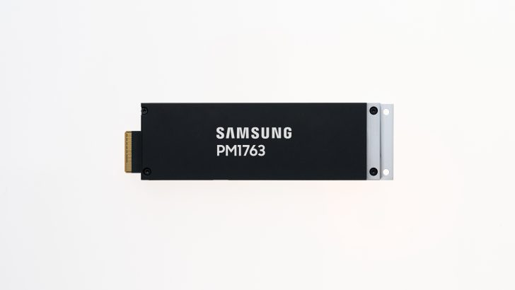

# Daily Semiconductor Current Affairs

Date: 2026-07-08

Research window: July 8 India afternoon, with July 7 U.S. market reaction included where it directly explains the July 8 Asia memory-stock move. Today's lead is Samsung's company-confirmed mass production of the PM1763 PCIe 6.0 enterprise SSD. The market story is treated as time-sensitive reporting, not as proof that the memory cycle has ended.

## Quick Index

| Date | Major Topic | Source Groups | Why To Read |
|---|---|---|---|
| 2026-07-08 | Samsung starts PM1763 PCIe 6.0 enterprise SSD mass production | Samsung Newsroom, Samsung Semiconductor, PCI-SIG, NVMe, NIST, PCI-SIG TDISP | Shows that AI infrastructure scaling also needs storage throughput, SSD controllers, cooling, and security, not only GPUs and HBM. |
| 2026-07-08 | Memory stocks sell off, then partially rebound | Samsung IR, MarketWatch, Business Insider, Economic Times / Reuters | Teaches how record fundamentals can still trigger valuation concern when expectations are already extreme. |
| 2026-07-08 | SK hynix ADR demand remains strong before pricing | Axios, SEC F-1 filing, Business Insider | Keeps the financing story separate from manufacturing capacity and explains depositary-share mechanics. |
| 2026-07-08 | TSMC and SIA watch items | TSMC investor calendar, TSMC Q2 page, SIA | Keeps students disciplined about pending official data instead of inventing results before July 10 and July 16. |
| 2026-07-08 | India Semicon 2.0 status | Economic Times, IBEF, ISM, PIB / Digital India context | Records that ecosystem broadening is the direction, but final Cabinet-approved scheme text is still pending. |

**Page navigation:** [Sources](#source-map) · [Concept review](#concept-review) · [Follow-up](#what-to-watch-next) · [Technical terms](#technical-terms-used-today) · [Master glossary](../knowledge-base/glossary.md)

## Source Images And Manifest

Source manifest: [../images/2026-07-08/links.md](../images/2026-07-08/links.md)



This official Samsung press image is used only as a visual identifier for the PM1763 item. Market and policy items are cited as text links because the important evidence is in company releases, regulator filings, and time-sensitive market reports rather than a durable screenshot.

## Source Map

| Source | Source date | Role | Confidence / limitation |
|---|---:|---|---|
| [Samsung Newsroom: PM1763 mass production](https://news.samsung.com/global/samsung-begins-mass-production-of-pm1763-ssd-optimized-for-next-generation-ai-infrastructure) | 2026-07-08 | Primary company source for PM1763 mass production, performance, capacities, controller, V-NAND, cooling, PQC, and TDISP claims | Strong primary product source; customer names, shipment volume, price, and platform-by-platform validation details are not disclosed. |
| [Samsung Semiconductor PM1763 product page](https://semiconductor.samsung.com/ssd/enterprise-ssd/pm1763/) | 2026-07-08 status | Product context for the enterprise SSD | Primary company product page; marketing page, not an independent benchmark. |
| [PCI-SIG: PCI Express 6.0 Specification](https://pcisig.com/pci-express-6.0-specification) | Reference | PCIe 6.0 raw data rate, PAM4, FLIT, FEC, and CRC context | Primary standards-body source; full spec access may require membership. |
| [NVM Express specifications](https://nvmexpress.org/specifications/) | Reference | NVMe host-software and SSD interface context | Primary consortium source; exact feature support depends on device implementation. |
| [NIST PQC standards announcement](https://csrc.nist.gov/news/2024/postquantum-cryptography-fips-approved) | Reference | Post-quantum cryptography standardization context | Primary government standards source; Samsung does not name the exact PQC algorithms used in PM1763. |
| [PCI-SIG TDISP document page](https://pcisig.com/PCI%20Express/ECN/Base/TEEDeviceInterfaceSecurityProtocol) | Reference | TDISP purpose and trusted I/O virtualization context | Primary standards source; implementation details depend on platform, device, and software stack. |
| [Samsung Newsroom: Q2 2026 earnings guidance](https://news.samsung.com/global/samsung-electronics-announces-earnings-guidance-for-second-quarter-2026) | 2026-07-07 | Primary evidence for 171 trillion won sales and 89.4 trillion won operating-profit guidance | Company guidance, not final audited or reviewed earnings. |
| [Samsung IR disclosure](https://www.samsung.com/global/ir/reports-disclosures/public-disclosure-view.84695/) | 2026-07-07 | Investor-facing disclosure, ranges, and audit caveat | Primary company source; still preliminary. |
| [MarketWatch: Micron and storage-stock decline](https://www.marketwatch.com/story/microns-stock-falls-as-investors-wonder-if-the-memory-market-is-near-the-top-ab2d2feb) | Updated 2026-07-07 U.S. time | U.S. market reaction after Samsung guidance | Reputable market reporting; stock prices are time-sensitive. |
| [Business Insider: SK hynix slumps ahead of U.S. listing](https://www.businessinsider.com/kospi-sk-hynix-stock-price-adr-listing-samsung-chip-stocks-2026-7) | 2026-07-08 | July 8 Korea market move, KOSPI impact, and investor appetite context | Secondary market reporting; useful for reaction, not final offering terms. |
| [Economic Times / Reuters: Samsung and SK hynix rebound](https://economictimes.indiatimes.com/markets/us-stocks/news/global-market-samsung-sk-hynix-rebound-as-bargain-buying-offsets-ai-chip-selloff-fears/articleshow/132253789.cms?from=mdr) | 2026-07-08 | Intraday rebound, analyst framing, and memory-pricing concern | Reuters-syndicated market report; intraday levels can change. |
| [Axios: SK hynix U.S. stock offering](https://www.axios.com/2026/07/08/hynix-chip-stock-offering) | 2026-07-08 | Investor-demand and ADR-offering watch | Secondary report; final price and allocation remain pending. |
| [SEC SK hynix Form F-1 filing index](https://www.sec.gov/Archives/edgar/data/2120882/000119312526280172/0001193125-26-280172-index.htm) | 2026-06-24 | Primary regulator filing for offering framework | Filing framework, not final pricing. |
| [SIA: May 2026 global chip sales](https://www.semiconductors.org/global-semiconductor-sales-increase-9-2-month-to-month-in-may/) | 2026-07-06 | Broad industry sales context | Primary industry association using WSTS data; three-month moving average. |
| [TSMC financial calendar](https://investor.tsmc.com/english/financial-calendar) | 2026 status | June monthly sales expected July 10 and Q2 results expected July 16 | Official calendar; dates can change. |
| [TSMC Q2 2026 results page](https://investor.tsmc.com/english/quarterly-results/2026/q2) | 2026 status | Quiet-period and Q2 result watch | Primary company page; actual Q2 results still pending. |
| [Economic Times: Semicon 2.0 finalisation](https://economictimes.indiatimes.com/industry/cons-products/electronics/india-finalising-semicon-2-0-to-expand-chip-incentives-beyond-fabs/articleshow/132232886.cms?from=mdr) | 2026-07-07 | India policy report on incentives beyond fabs | Reputable reporting; official scheme notification pending. |
| [IBEF: ISM 2.0 proposed outlay](https://www.ibef.org/news/india-s-chip-dreams-get-a-us-13-21-billion-push-with-semiconductor-mission-2-0) | Last week | Context for 1.25 lakh crore / US$13.21 billion proposal awaiting Cabinet approval | Government-linked investment promotion source; still not the final Cabinet-approved scheme text. |
| [PIB: Digital India and ISM 2.0 direction](https://www.pib.gov.in/PressReleasePage.aspx?PRID=2278453&lang=1&reg=3) | Last week | Official directional context: equipment, materials, IP, supply chains | Official context, but not a detailed implementation notification. |
| [India Semiconductor Mission press-release page](https://ism.gov.in/notifications/press-release) | Current status | Official India semiconductor programme context | Useful for official record; no new July 8 Semicon 2.0 notification was found in this research window. |

## Verification Matrix

| News item | Verification status | Strongest evidence | What is analysis, not fact | What must be checked next |
|---|---|---|---|---|
| Samsung PM1763 mass production | Verified by primary company source | Samsung Newsroom July 8 release and Samsung Semiconductor product page | Whether real customer workloads achieve the headline performance and efficiency across platforms. | Independent benchmarks, customer validation names, drive endurance, latency, queue-depth behavior, and pricing. |
| PM1763 performance claims | Verified as Samsung claims | 16TB model sequential read up to 28,400 MB/s and write up to 21,900 MB/s; more than 1.8x power-efficiency improvement versus PM1753 | How much of the gain is controller, NAND, PCIe 6.0 link, firmware, thermal design, or test condition. | Full datasheet, random IOPS, latency, endurance, form factors, thermal envelope, and failure-rate data. |
| Memory-stock selloff / rebound | Verified as market reporting, time-sensitive | MarketWatch, Business Insider, and Economic Times / Reuters | Whether the move is a short correction, peak-cycle signal, or broad AI valuation reset. | Closing prices, analyst revisions, Micron/SK hynix/Samsung full earnings, memory contract prices, and hyperscaler capex. |
| SK hynix ADR offering | Verified filing and reported demand, final pricing pending | SEC F-1 plus Axios and Business Insider reporting | Whether a U.S. listing narrows valuation gaps or improves long-run capital cost. | Thursday pricing, ADR allocation, Friday trading, net proceeds, fees, dilution, and capex deployment. |
| TSMC watch | Pending official data | TSMC calendar and Q2 page | Any claim that June revenue or Q2 results are already known before official release. | July 10 monthly sales and July 16 Q2 results. |
| India Semicon 2.0 | Direction supported, official final details pending | ET report, IBEF outlay context, PIB/Digital India direction, ISM official site | Exact incentive categories, budget approval, scheme terms, and deadlines. | Cabinet approval and official MeitY/ISM notification. |

## 1. Samsung PM1763: AI Infrastructure Needs Storage Throughput Too

Samsung announced mass production of PM1763 on July 8, 2026.
Term: Enterprise SSD
Definition: An enterprise SSD is a solid-state drive built for server and data-center workloads rather than consumer laptops or desktops. It solves storage problems where throughput, latency consistency, power efficiency, endurance, manageability, thermal behavior, and reliability matter at fleet scale. In today's news, PM1763 matters because AI infrastructure has to feed processors and accelerators with model weights, embeddings, datasets, checkpoints, logs, and generated outputs. If storage is slow or thermally unstable, expensive GPUs and accelerators can wait for data even when the compute silicon is available. Source: [Samsung Newsroom](https://news.samsung.com/global/samsung-begins-mass-production-of-pm1763-ssd-optimized-for-next-generation-ai-infrastructure)

Samsung says PM1763 is a PCIe 6.0-based enterprise SSD for next-generation AI and HPC servers. It uses Samsung's 9th-generation V-NAND and a newly developed 4 nm controller. The drive is listed in 4TB, 8TB, and 16TB capacities. The 16TB version is claimed to reach sequential read speeds up to 28,400 MB/s and sequential write speeds up to 21,900 MB/s, more than twice the predecessor PM1753's performance.

Term: PCIe 6.0
Definition: PCIe 6.0 is a high-speed serial interconnect generation defined by PCI-SIG. It doubles the raw transfer rate versus PCIe 5.0 to 64.0 GT/s and introduces PAM4 signaling, FLIT-based encoding, forward error correction, and CRC mechanisms to keep usable bandwidth high despite tougher signal-integrity conditions. In today's news, PCIe 6.0 matters because an SSD can only deliver extreme throughput if the storage media, controller, firmware, host software, link, retimers, board design, and thermal design work together. Source: [PCI-SIG](https://pcisig.com/pci-express-6.0-specification)

Term: NVMe
Definition: NVMe is the standard host-software interface for communicating with non-volatile storage over transports such as PCIe. It solves the old storage-stack problem that interfaces designed for spinning disks do not expose enough parallelism or low-latency command handling for NAND-based SSDs. In today's news, the important point is that a PCIe 6.0 physical link is not enough by itself; the storage command layer, queues, firmware, operating system, virtualization stack, and workload pattern decide how much of the hardware capability reaches the application. Source: [NVM Express](https://nvmexpress.org/specifications/)

Term: V-NAND
Definition: V-NAND is vertically stacked NAND flash, where memory cells are arranged in many layers instead of only in a flat two-dimensional plane. It solves the density problem by adding vertical layers when lateral shrinking becomes harder, improving capacity per die while preserving manufacturability. PM1763's 9th-generation V-NAND matters because AI and HPC platforms need not only fast HBM near accelerators but also large persistent storage close enough to keep data pipelines moving. Source: [Samsung Newsroom](https://news.samsung.com/global/samsung-begins-mass-production-of-pm1763-ssd-optimized-for-next-generation-ai-infrastructure)

Term: SSD controller
Definition: An SSD controller is the processor and logic subsystem inside the drive that schedules reads and writes, maps logical addresses to NAND locations, performs error correction, manages wear leveling, handles security, and communicates with the host. It solves the problem that raw NAND is not directly usable as a reliable block device. In PM1763, Samsung highlights a newly developed 4 nm controller, which suggests that controller performance and power are now strategic parts of AI-storage design, not secondary details. Source: [Samsung Newsroom](https://news.samsung.com/global/samsung-begins-mass-production-of-pm1763-ssd-optimized-for-next-generation-ai-infrastructure)

### Numerical sanity check

Samsung says the 16TB PM1763 can transfer a 40GB large-language-model file in about 1.4 seconds. The arithmetic is consistent with the headline sequential-read number:

| Check | Calculation | Result | Study meaning |
|---|---:|---:|---|
| Approximate read-transfer time | 40,000 MB / 28,400 MB/s | about 1.41 seconds | The claim is a storage-read illustration, not a full model-load-to-inference benchmark. |
| Sequential read versus write gap | 28,400 / 21,900 | about 1.30x | Reads are faster than writes, which is common because NAND programming and management are harder than reading. |
| Link generation implication | PCIe 6.0 doubles PCIe 5.0 raw data rate | 64.0 GT/s raw per lane | Board signal integrity, retimers, thermals, and host support become more important. |

The 1.4-second example should not be overread. It does not mean an LLM is instantly ready for service in every real data center. A real deployment may include file-system overhead, decompression, checkpoint sharding, host memory movement, accelerator memory staging, security checks, network storage, container startup, and model-runtime initialization. The useful lesson is narrower: storage bandwidth is now part of AI-platform performance.

### Cooling and security are not footnotes

Samsung says PM1763 is optimized for liquid-cooled server environments through direct-to-chip cooling.
Term: Direct-to-chip cooling
Definition: Direct-to-chip cooling moves heat from a component into a cold plate or liquid-cooled thermal path close to the heat source instead of relying only on air movement through a server. It solves the rising power-density problem in AI servers, where CPUs, GPUs, memory, SSDs, NICs, and voltage regulators can all create local hotspots. In today's news, D2C cooling matters because storage devices are becoming fast enough that sustained performance depends on thermal control, not just interface speed. Source: [Samsung Newsroom](https://news.samsung.com/global/samsung-begins-mass-production-of-pm1763-ssd-optimized-for-next-generation-ai-infrastructure)

Samsung also says PM1763 supports post-quantum cryptography and TDISP.
Term: Post-quantum cryptography (PQC)
Definition: PQC means cryptographic algorithms designed to resist attacks from future quantum computers that could break widely used public-key systems such as RSA or elliptic-curve cryptography. It solves a long-lifecycle security problem: encrypted data captured today may need to remain secure years later when stronger attackers exist. In today's SSD news, PQC matters because storage devices can hold sensitive model weights, customer data, training data, and infrastructure secrets. Source: [NIST](https://csrc.nist.gov/news/2024/postquantum-cryptography-fips-approved)

Term: TDISP
Definition: TDISP, or TEE Device Interface Security Protocol, is a PCIe security architecture for trusted I/O virtualization. It helps establish trust between a trusted virtual machine and a device, secure host-device communication, and attach or detach a trusted device interface in a controlled way. In today's news, TDISP matters because AI infrastructure is increasingly virtualized and multi-tenant; a high-performance SSD must fit into confidential-computing and secure-I/O models, not only into throughput charts. Source: [PCI-SIG](https://pcisig.com/PCI%20Express/ECN/Base/TEEDeviceInterfaceSecurityProtocol)

### Why this matters

AI systems often get described as "GPU plus HBM", but the real data path is longer:

```text
x86 or Arm host -> PCIe / CXL / network fabric -> SSD / object store
-> CPU memory -> accelerator memory -> HBM -> compute cores
-> generated output / logs / checkpoints back to storage
```

PM1763 sits in the persistent-storage part of that chain. Faster SSDs can help with checkpoint loading, retrieval-augmented generation datasets, vector databases, training-data streaming, cold-starts, model swaps, and AI service recovery after failure. The VLSI lesson is that the bottleneck can move: if compute and HBM improve, storage, networking, security, power, and cooling become more visible.

### Career relevance

For VLSI and semiconductor students, PM1763 touches more topics than a simple storage headline suggests:

| Role area | What to learn from this item |
|---|---|
| Digital design / verification | Controller datapaths, DMA engines, queue handling, error correction, security engines, and PCIe protocol verification. |
| Physical design | 4 nm controller timing closure, power integrity, high-speed interfaces, thermal-aware floorplanning, and signoff. |
| Firmware | Flash translation layer, wear leveling, garbage collection, power-loss behavior, telemetry, and secure updates. |
| Signal integrity | PCIe 6.0 PAM4, retimers, board channel loss, equalization, jitter, crosstalk, and test patterns. |
| Test / reliability | NAND endurance, bad-block management, controller validation, thermal cycling, sustained workload testing, and field failure analysis. |
| Security | PQC migration, TDISP, confidential computing, device identity, firmware trust, and multi-tenant isolation. |

Simple explanation: Samsung is not just making a faster SSD. It is showing that AI data centers need the storage layer to scale with accelerators, memory, cooling, and security.

## 2. Memory Market: Strong Results Can Still Produce A Selloff

Samsung's July 7 guidance remains the anchor for the market reaction.
Term: Preliminary earnings guidance
Definition: Preliminary earnings guidance is management's early estimate before a full earnings release and external audit or review. It solves the market's need for timely information, but it does not provide divisional profit, product mix, inventory, cash flow, capex, or management commentary. In today's news, guidance matters because Samsung's record profit estimate became a trigger for investors to ask whether the memory cycle is already priced into stocks. Source: [Samsung IR](https://www.samsung.com/global/ir/reports-disclosures/public-disclosure-view.84695/)

Samsung guided to about 171 trillion Korean won of consolidated sales and about 89.4 trillion won of operating profit for Q2 2026. The company also disclosed ranges of 170-172 trillion won for sales and 89.3-89.5 trillion won for operating profit, with a clear warning that the figures are preliminary and provided before external audit or review is complete.

MarketWatch reported that Micron fell 4.7% on Tuesday, while Sandisk lost 7.3%, Western Digital lost 7.9%, and Seagate lost 4.7%. Business Insider reported that SK hynix closed 5.7% lower on Wednesday, Samsung closed 6.3% lower, and the KOSPI lost 5.4%. Economic Times / Reuters later reported intraday rebounds in Samsung and SK hynix after bargain buying, while analysts still warned that memory-pricing increases may moderate in the second half of 2026.

### Why this is not a contradiction

Record operating profit and falling share prices can coexist. A share price is not a direct grade for the current quarter; it is a discounted view of future earnings, risk, and expectations. If investors already expected an extraordinary memory cycle, then even a record guidance number can trigger selling when:

- revenue only meets elevated expectations,
- investors worry that memory ASP growth has peaked,
- customers resist higher memory prices,
- new capex raises future oversupply risk,
- interest rates or geopolitical risk reduce appetite for long-duration AI trades,
- the same stock already rose sharply before the announcement.

Term: Average selling price (ASP)
Definition: ASP is revenue divided by a relevant unit base such as units, wafers, bits, drives, or product mix. It solves the pricing question when a company sells many product grades and contract types. In memory, ASP can move profit sharply because fabs have high fixed costs. In today's news, ASP matters because investors are debating whether strong DRAM, NAND, HBM, and enterprise-storage pricing can continue without damaging demand. Source: [MarketWatch](https://www.marketwatch.com/story/microns-stock-falls-as-investors-wonder-if-the-memory-market-is-near-the-top-ab2d2feb)

Term: Demand elasticity
Definition: Demand elasticity measures how much quantity demanded changes when price changes. It solves the question "will customers keep buying at higher prices?" In today's memory market, elasticity matters because AI infrastructure buyers may tolerate high HBM and SSD prices longer than consumers buying PCs or phones, but even hyperscalers can delay purchases if total system cost rises too fast. Source: [Economic Times / Reuters](https://economictimes.indiatimes.com/markets/us-stocks/news/global-market-samsung-sk-hynix-rebound-as-bargain-buying-offsets-ai-chip-selloff-fears/articleshow/132253789.cms?from=mdr)

### Study takeaway from the selloff

Do not write "memory boom over" just because stocks fell. Also do not write "selloff meaningless" just because fundamentals are strong. The correct current-affairs framing is:

```text
primary data: Samsung guidance and SIA sales are strong
market reaction: investors are nervous about expectations, pricing, capex, and timing
unknown: full divisional earnings, contract prices, customer demand, future supply, and 2027-2028 cycle risk
```

Simple explanation: the business result can be excellent while the stock falls because the market had already priced in excellence and now worries about what comes next.

## 3. SK hynix: ADR Demand Is A Financing Signal, Not Immediate HBM Supply

Axios reported on July 8 that SK hynix plans to sell roughly US$28 billion of stock in the United States later this week, with about 178 million American depositary receipts and each ADR representing one-tenth of a common share. The SEC F-1 filing is the primary record for the offering framework, but final price, allocation, net proceeds, and trading behavior remain pending.

Term: American Depositary Receipt (ADR)
Definition: An ADR is a U.S.-traded receipt representing shares of a non-U.S. company held through a depositary structure. It solves investor-access problems such as foreign custody, currency, trading hours, and settlement friction. In today's news, ADRs matter because SK hynix can give U.S. investors easier exposure to a Korean memory supplier without changing the fact that the operating company remains Korean. Source: [Axios](https://www.axios.com/2026/07/08/hynix-chip-stock-offering)

Term: Primary offering
Definition: A primary offering sells newly issued shares so the company receives cash. It solves a financing need for fabs, tools, packaging capacity, R&D, debt reduction, or strategic investment, but it can dilute existing shareholders. In SK hynix's case, the study point is that new money can support future HBM, DRAM, NAND, EUV, and packaging capacity only after years of construction, tool installation, process qualification, yield learning, and customer qualification. Source: [SEC F-1 filing index](https://www.sec.gov/Archives/edgar/data/2120882/000119312526280172/0001193125-26-280172-index.htm)

Business Insider reported that the planned U.S. listing remains strategically meaningful even during the selloff because it can broaden the investor base and improve liquidity. That is plausible, but still analysis. The confirmed pieces are the filing framework and reported offering demand. The open items are pricing, allocation, net proceeds, dilution, and how efficiently proceeds become productive capacity.

### Financing-to-capacity chain

```text
ADR demand -> offering pricing -> net proceeds -> capex plan
-> buildings and utilities -> tool orders -> installation
-> process qualification -> yield learning -> packaging capacity
-> customer qualification -> qualified HBM / DRAM / NAND shipments
```

The chain is long. That is why the same SK hynix news can be bullish for long-run manufacturing capacity and bearish for short-run stock supply or dilution.

Simple explanation: investors still want access to SK hynix because AI memory is scarce, but selling new stock does not create memory chips this week.

## 4. TSMC And SIA: Keep The Calendar Honest

SIA's July 6 release remains important context for July 8 because it says May 2026 global semiconductor sales were US$120.6 billion, up 9.2% from April and 104.1% from May 2025. SIA also says monthly sales are compiled by WSTS and represent a three-month moving average.

Term: Three-month moving average
Definition: A three-month moving average smooths a data series by averaging the latest three months instead of treating one month's raw number as the full signal. It solves the noise problem in cyclical markets where shipments, billing, customer schedules, and currency can distort one period. In today's news, SIA's data matters because it confirms broad semiconductor demand strength, but it should not be read as a real-time quote for July 8 trading. Source: [SIA](https://www.semiconductors.org/global-semiconductor-sales-increase-9-2-month-to-month-in-may/)

TSMC is still a watch item. Its financial calendar lists June 2026 monthly sales for July 10 and Q2 2026 earnings conference for July 16. The Q2 results page remains the official place to compare actuals with guidance once released.

Term: Earnings quiet period
Definition: An earnings quiet period is a company-defined interval before results when management restricts investor communication to reduce selective-disclosure risk. It solves the problem of some investors receiving material hints before others. For TSMC, the study discipline is simple: until the official monthly sales and Q2 release arrive, use the published calendar and prior guidance rather than market rumor. Source: [TSMC Q2 2026 results page](https://investor.tsmc.com/english/quarterly-results/2026/q2)

Simple explanation: SIA confirms the industry is strong through May. TSMC's next official checkpoints are still ahead, so do not fill the gap with speculation.

## 5. India Semicon 2.0: Ecosystem Direction Is Clear, Final Rules Still Pending

Economic Times reported on July 7 that India is finalising Semicon 2.0 to expand incentives beyond fabs. IBEF separately reported that a proposal for India Semiconductor Mission 2.0 has a 1.25 lakh crore rupee outlay and is awaiting Cabinet approval. PIB's Digital India context says ISM 2.0 is focused on equipment, materials, indigenous IP, and resilient supply chains.

Term: Semiconductor ecosystem
Definition: A semiconductor ecosystem is the full set of companies, institutions, suppliers, engineers, infrastructure, and policies needed to turn chip ideas into reliable shipped products. It includes design, EDA, IP, wafers, chemicals, gases, equipment, fabs, OSAT, test, substrates, logistics, standards, customers, financing, and skilled workers. In today's India watch, ecosystem matters because a fab alone cannot create a resilient chip industry if it lacks materials, design demand, equipment service, packaging, and talent. Source: [PIB Digital India context](https://www.pib.gov.in/PressReleasePage.aspx?PRID=2278453&lang=1&reg=3)

Term: Cabinet approval
Definition: Cabinet approval is the formal government decision step that converts a proposal into an officially authorized policy or scheme. It solves the accountability and budget-authorization problem, but until approval and notification occur, the exact terms can still change. In today's news, the correct status for ISM 2.0 is "direction supported, final scheme pending." Source: [IBEF](https://www.ibef.org/news/india-s-chip-dreams-get-a-us-13-21-billion-push-with-semiconductor-mission-2-0)

No new July 8 official Semicon 2.0 notification was found in the ISM press-release list during this research window. Therefore, today's India entry is a watch item, not a completed policy event.

Simple explanation: India appears to be moving from project approvals toward supplier depth, design support, materials, equipment, and IP. The final exam answer should wait for the official notification.

## Coverage Check

| Segment | July 8 status | Study conclusion |
|---|---|---|
| Memory / storage | Major product update | Samsung PM1763 shows AI infrastructure needs fast enterprise SSDs in addition to DRAM, NAND, and HBM. |
| AI accelerators | Indirect update | The storage path matters because accelerators need model and data movement, not only compute. |
| Foundry | Watch item | TSMC monthly sales and Q2 results remain pending official July 10 and July 16 checkpoints. |
| Equipment | Indirect update | PCIe 6.0, 4 nm controllers, NAND manufacturing, and liquid-cooled server design imply stronger validation and test needs. |
| EDA / IP | Indirect update | PCIe 6.0 controllers, security engines, NAND management, and high-speed interfaces require heavy verification and IP integration. |
| Materials | Indirect update | V-NAND, packaging substrates, server boards, thermal materials, and storage-device supply chains remain important. |
| Packaging / test | Indirect update | SSD reliability, thermal test, controller validation, and high-speed interface test are central. |
| Policy / India | Watch item | ISM 2.0 direction is broader than fabs, but final Cabinet-approved rules are pending. |
| Market / finance | Major update | Memory fundamentals look strong, but investor expectations and dilution/capex fears are causing sharp volatility. |

## Follow-Up Ledger

| Earlier item | July 8 status | Evidence / next check |
|---|---|---|
| Samsung full Q2 earnings | Still pending | July 7 guidance is strong; watch detailed earnings, semiconductor division, memory mix, capex, and outlook. |
| Samsung product roadmap | Updated | PM1763 mass production verified; watch datasheet, customer validation, endurance, latency, and server platform qualification. |
| SK hynix U.S. offering | Updated, still pending | Reported demand remains strong; watch Thursday pricing, Friday trading, allocation, net proceeds, dilution, and capex use. |
| Memory stock correction | Updated, still open | July 8 reports show selloff and rebound; watch whether contract prices, hyperscaler demand, and earnings revisions support the cycle. |
| SIA sales trend | Still active context | May sales hit US$120.6 billion; watch next monthly release for June confirmation. |
| TSMC monthly sales | Still pending | Calendar points to July 10 June sales release. |
| TSMC Q2 earnings | Still pending | Calendar points to July 16 Q2 earnings call. |
| India Semicon 2.0 | Still pending official policy | Watch Cabinet approval, MeitY/ISM scheme text, eligible categories, deadlines, and budget terms. |
| CG Semi repeat production | Still pending | No new July 8 evidence on customers, package mix, utilization, yield, certificates, or recurring shipments. |

## Concept Review

| Concept | Key distinction | Why it matters |
|---|---|---|
| Enterprise SSD versus consumer SSD | Enterprise SSDs are built for sustained server reliability, telemetry, endurance, power, thermal, and security requirements. | PM1763 targets AI and HPC servers, not ordinary consumer storage. |
| PCIe 6.0 versus SSD media speed | PCIe 6.0 gives a faster host link; NAND, controller, firmware, thermals, and workload determine realized performance. | A fast interface cannot compensate for poor controller design or thermal throttling. |
| Sequential bandwidth versus real workload | Sequential read/write speeds measure ideal large transfers; AI systems also have random, sharded, networked, and virtualized workloads. | Samsung's 1.4-second 40GB example is useful but not a complete AI-serving benchmark. |
| Storage versus HBM | SSD stores persistent data; HBM supplies very high bandwidth near accelerators for active compute. | AI platforms need both persistent data movement and near-compute memory bandwidth. |
| Guidance versus final earnings | Guidance is preliminary; final earnings include richer, reviewed details. | Samsung's record guidance is real, but divisional proof is still pending. |
| Fundamental result versus stock reaction | A company can perform strongly while its stock falls if expectations were higher or future risk rises. | July 8 memory volatility is about expectations, not only current profit. |
| ADR demand versus chip supply | ADR demand can finance capex; it does not produce qualified memory immediately. | SK hynix's offering must still pass through construction, tools, yield, and qualification. |
| Policy direction versus final scheme | Reports and budget direction are useful; official notifications define binding rules. | India Semicon 2.0 should be tracked as pending until Cabinet and MeitY/ISM documents land. |

## Interview Questions

1. Why does an AI data center need very fast enterprise SSDs even when it already has GPUs and HBM?
2. What does PCIe 6.0 add compared with PCIe 5.0, and why does it need PAM4, FLIT, FEC, and CRC?
3. Why is a 4 nm SSD controller important in a storage product?
4. How is V-NAND different from planar NAND, and why does vertical stacking matter for capacity?
5. Why can the 40GB model-transfer example be mathematically true but still not equal to full AI inference startup time?
6. What is TDISP, and why does trusted I/O matter in multi-tenant AI servers?
7. Why did memory stocks fall even after Samsung posted extremely strong preliminary operating-profit guidance?
8. What is the difference between ASP strength and sustainable demand?
9. How can an SK hynix ADR offering be good for long-term capex but negative for near-term stock sentiment?
10. What should be checked before treating Semicon 2.0 as an officially launched policy?

## What To Watch Next

1. Samsung PM1763 datasheet, endurance rating, random IOPS, latency, thermal envelope, form factors, and customer platform names.
2. Whether PCIe 6.0 SSD adoption creates new verification, signal-integrity, retimer, and liquid-cooling requirements in AI servers.
3. Micron, Samsung, SK hynix, and NAND vendors' contract-price data and customer resistance in the second half of 2026.
4. SK hynix final ADR price, allocation, net proceeds, dilution, and first Nasdaq trading behavior.
5. TSMC June monthly sales on July 10 and Q2 earnings on July 16.
6. Official Cabinet-approved Semicon 2.0 scheme text and ISM notification.
7. CG Semi repeat production evidence: customer, package type, yield, utilization, certification, and recurring shipments.

## Final Takeaway

July 8 is a useful reminder that AI infrastructure is a full-system story. Samsung's PM1763 turns storage into the day's concrete technology item: PCIe 6.0, V-NAND, 4 nm controllers, liquid cooling, PQC, and trusted I/O now belong in the same conversation as GPUs and HBM. At the same time, memory-stock volatility shows that excellent fundamentals do not remove valuation, pricing, dilution, and cycle risk. For India and TSMC, the disciplined answer is to keep watching the official calendar and not treat pending policy or earnings as finished facts.

## Technical Terms Used Today

[Back to quick index](#quick-index) · [Open the master A-Z glossary](../knowledge-base/glossary.md)

**Term index:** [American Depositary Receipt (ADR)](#daily-term-american-depositary-receipt-adr) · [Average selling price (ASP)](#daily-term-average-selling-price-asp) · [Cabinet approval](#daily-term-cabinet-approval) · [Demand elasticity](#daily-term-demand-elasticity) · [Direct-to-chip cooling](#daily-term-direct-to-chip-cooling) · [Enterprise SSD](#daily-term-enterprise-ssd) · [NVMe](#daily-term-nvme) · [PCIe 6.0](#daily-term-pcie-6-0) · [Post-quantum cryptography (PQC)](#daily-term-post-quantum-cryptography-pqc) · [Preliminary earnings guidance](#daily-term-preliminary-earnings-guidance) · [Primary offering](#daily-term-primary-offering) · [Quiet period](#daily-term-quiet-period) · [Semiconductor ecosystem](#daily-term-semiconductor-ecosystem) · [SSD controller](#daily-term-ssd-controller) · [TDISP](#daily-term-tdisp) · [Three-month moving average](#daily-term-three-month-moving-average) · [V-NAND](#daily-term-v-nand)

| Term | Meaning |
|---|---|
| <a id="daily-term-american-depositary-receipt-adr"></a>[**American Depositary Receipt (ADR)**](../knowledge-base/glossary.md#term-american-depositary-receipt-adr) | An ADR is a U.S.-traded receipt representing shares of a non-U.S. company held through a depositary structure. It solves investor-access problems such as foreign custody, currency, trading hours, and settlement friction. |
| <a id="daily-term-average-selling-price-asp"></a>[**Average selling price (ASP)**](../knowledge-base/glossary.md#term-average-selling-price-asp) | ASP is revenue divided by a relevant unit base such as units, wafers, bits, drives, or product mix. It solves the pricing question when a company sells many product grades and contract types. |
| <a id="daily-term-cabinet-approval"></a>[**Cabinet approval**](../knowledge-base/glossary.md#term-cabinet-approval) | Cabinet approval is the formal government decision step that converts a proposal into an officially authorized policy or scheme. It solves the accountability and budget-authorization problem, but until approval and notification occur, the exact terms can still change. |
| <a id="daily-term-demand-elasticity"></a>[**Demand elasticity**](../knowledge-base/glossary.md#term-demand-elasticity) | Demand elasticity measures how much quantity demanded changes when price changes. It solves the question "will customers keep buying at higher prices?" In today's memory market, elasticity matters because AI infrastructure buyers may tolerate high HBM and SSD prices longer than consumers buying PCs or phones, but even hyperscalers can delay purchases if total system cost rises too fast. |
| <a id="daily-term-direct-to-chip-cooling"></a>[**Direct-to-chip cooling**](../knowledge-base/glossary.md#term-direct-to-chip-cooling) | Direct-to-chip cooling moves heat from a component into a cold plate or liquid-cooled thermal path close to the heat source instead of relying only on air movement through a server. It solves the rising power-density problem in AI servers, where CPUs, GPUs, memory, SSDs, NICs, and voltage regulators can all create local hotspots. |
| <a id="daily-term-enterprise-ssd"></a>[**Enterprise SSD**](../knowledge-base/glossary.md#term-enterprise-ssd) | An enterprise SSD is a solid-state drive built for server and data-center workloads rather than consumer laptops or desktops. It solves storage problems where throughput, latency consistency, power efficiency, endurance, manageability, thermal behavior, and reliability matter at fleet scale. |
| <a id="daily-term-nvme"></a>[**NVMe**](../knowledge-base/glossary.md#term-nvme) | NVMe is the standard host-software interface for communicating with non-volatile storage over transports such as PCIe. It solves the old storage-stack problem that interfaces designed for spinning disks do not expose enough parallelism or low-latency command handling for NAND-based SSDs. |
| <a id="daily-term-pcie-6-0"></a>[**PCIe 6.0**](../knowledge-base/glossary.md#term-pcie-6-0) | PCIe 6.0 is a high-speed serial interconnect generation defined by PCI-SIG. It doubles the raw transfer rate versus PCIe 5.0 to 64.0 GT/s and introduces PAM4 signaling, FLIT-based encoding, forward error correction, and CRC mechanisms to keep usable bandwidth high despite tougher signal-integrity conditions. |
| <a id="daily-term-post-quantum-cryptography-pqc"></a>[**Post-quantum cryptography (PQC)**](../knowledge-base/glossary.md#term-post-quantum-cryptography-pqc) | PQC means cryptographic algorithms designed to resist attacks from future quantum computers that could break widely used public-key systems such as RSA or elliptic-curve cryptography. It solves a long-lifecycle security problem: encrypted data captured today may need to remain secure years later when stronger attackers exist. |
| <a id="daily-term-preliminary-earnings-guidance"></a>[**Preliminary earnings guidance**](../knowledge-base/glossary.md#term-preliminary-earnings-guidance) | Preliminary earnings guidance is management's early estimate before a full earnings release and external audit or review. It solves the market's need for timely information, but it does not provide divisional profit, product mix, inventory, cash flow, capex, or management commentary. |
| <a id="daily-term-primary-offering"></a>[**Primary offering**](../knowledge-base/glossary.md#term-primary-offering) | A primary offering sells newly issued shares so the company receives cash. It solves a financing need for fabs, tools, packaging capacity, R&D, debt reduction, or strategic investment, but it can dilute existing shareholders. |
| <a id="daily-term-quiet-period"></a>[**Quiet period**](../knowledge-base/glossary.md#term-quiet-period) | An earnings quiet period is a company-defined interval before results when management restricts investor communication to reduce selective-disclosure risk. It solves the problem of some investors receiving material hints before others. |
| <a id="daily-term-semiconductor-ecosystem"></a>[**Semiconductor ecosystem**](../knowledge-base/glossary.md#term-semiconductor-ecosystem) | A semiconductor ecosystem is the full set of companies, institutions, suppliers, engineers, infrastructure, and policies needed to turn chip ideas into reliable shipped products. It includes design, EDA, IP, wafers, chemicals, gases, equipment, fabs, OSAT, test, substrates, logistics, standards, customers, financing, and skilled workers. |
| <a id="daily-term-ssd-controller"></a>[**SSD controller**](../knowledge-base/glossary.md#term-ssd-controller) | An SSD controller is the processor and logic subsystem inside the drive that schedules reads and writes, maps logical addresses to NAND locations, performs error correction, manages wear leveling, handles security, and communicates with the host. It solves the problem that raw NAND is not directly usable as a reliable block device. |
| <a id="daily-term-tdisp"></a>[**TDISP**](../knowledge-base/glossary.md#term-tdisp) | TDISP, or TEE Device Interface Security Protocol, is a PCIe security architecture for trusted I/O virtualization. It helps establish trust between a trusted virtual machine and a device, secure host-device communication, and attach or detach a trusted device interface in a controlled way. |
| <a id="daily-term-three-month-moving-average"></a>[**Three-month moving average**](../knowledge-base/glossary.md#term-three-month-moving-average) | A three-month moving average smooths a data series by averaging the latest three months instead of treating one month's raw number as the full signal. It solves the noise problem in cyclical markets where shipments, billing, customer schedules, and currency can distort one period. |
| <a id="daily-term-v-nand"></a>[**V-NAND**](../knowledge-base/glossary.md#term-v-nand) | V-NAND is vertically stacked NAND flash, where memory cells are arranged in many layers instead of only in a flat two-dimensional plane. It solves the density problem by adding vertical layers when lateral shrinking becomes harder, improving capacity per die while preserving manufacturability. |

This page-end index covers the specialist terms central to this day's study. The fuller explanation, news context, and source remain at first use; the master glossary combines repeated terms across all days.
