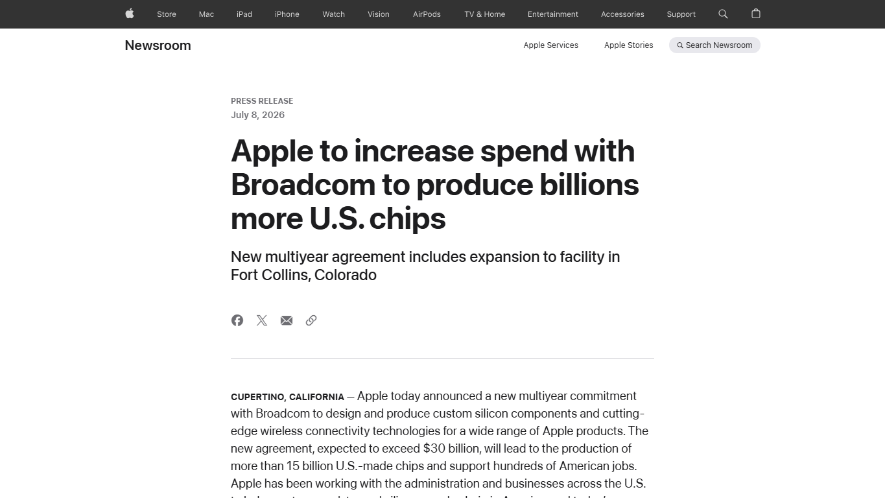
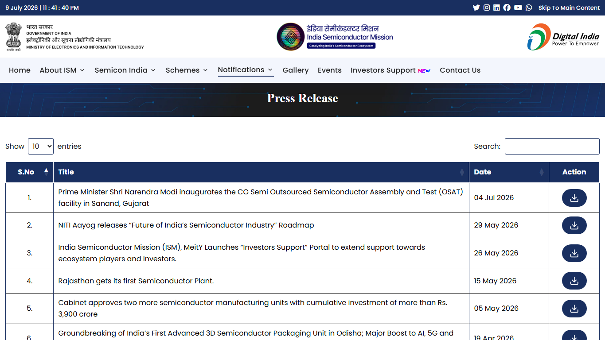

# Daily Semiconductor Current Affairs

Date: 2026-07-09

Research window: July 9 India evening, with July 8 U.S. official releases and market reports included because they entered the July 9 India review window. Today's lead is Micron and GlobalWafers committing to U.S.-made 300 mm silicon wafer supply for Micron's U.S. fabs. The Apple-Broadcom item is a July 8 official-source catch-up because it directly affects U.S. custom silicon and wireless-chip supply. SK hynix and Meta are treated as reported items until final company, exchange, or regulator records close the loop.

## Quick Index

| Date | Major Topic | Source Groups | Why To Read |
|---|---|---|---|
| 2026-07-09 | Micron and GlobalWafers tie U.S. memory fabs to U.S. wafer supply | Micron, GlobalWafers, CHIPS / NIST context | Teaches why silicon wafers are a strategic input, not a commodity footnote. |
| 2026-07-09 | SK hynix U.S. offering reportedly heavily oversubscribed | SEC, Reuters-linked reporting, prior Axios context | Separates investor demand from final pricing, dilution, and future HBM output. |
| 2026-07-09 | Apple expands Broadcom U.S.-made custom chip commitment | Apple Newsroom | Shows that semiconductor supply-chain localization includes RF and wireless components, not only CPUs and GPUs. |
| 2026-07-09 | Meta reportedly targets Iris AI-chip production in September | Reuters-linked reporting | Tracks hyperscaler custom silicon as an AI infrastructure cost and supply-control strategy. |
| 2026-07-09 | TSMC and India follow-ups remain pending | TSMC calendar, ISM press page | Keeps unresolved items honest: June TSMC sales and official Semicon 2.0 rules were not closed today. |

## Source Images And Manifest

Source manifest: [../images/2026-07-09/links.md](../images/2026-07-09/links.md)



This Apple screenshot is embedded before the Apple/Broadcom explanation because it cleanly captures source identity, date, headline, and a short opening snippet.



This ISM screenshot is embedded before the India follow-up because it shows the latest visible official press-release list during the July 9 review. It supports the conclusion that no newer Semicon 2.0 final-notification entry was visible on that page at capture time.

Micron's official investor page was text-verified, but the headless screenshot returned an access-denied page, so no Micron screenshot is retained. SK hynix, Meta, Reuters-linked market reports, TSMC, and technical references are text-link sources.

## Source Map

| Source | Source date | Role | Confidence / limitation |
|---|---:|---|---|
| [Micron: strategic investment to strengthen U.S. semiconductor supply chain](https://investors.micron.com/news-releases/news-release-details/micron-announces-3-billion-strategic-investment-strengthen-us) | 2026-07-09 | Primary company source for Micron-GlobalWafers memorandum of understanding, supply agreement, and U.S. wafer investment | Strong primary source; exact wafer volumes, price terms, and fab-by-fab allocation are not disclosed. |
| [GlobalWafers press release](https://www.globalwafers.com/en/news_detail/1292/) | 2026-07-09 | Primary supplier-side source for Sherman, Texas investment and long-term wafer supply | Strong primary source; commercial terms remain confidential. |
| [NIST / CHIPS preliminary terms with GlobalWafers](https://www.nist.gov/news-events/news/2024/07/biden-harris-administration-announces-preliminary-terms-globalwafers) | 2024-07-17 | Official policy context for U.S. 300 mm wafer manufacturing | Context source, not today's transaction. |
| [SEC SK hynix Form F-1 filing index](https://www.sec.gov/Archives/edgar/data/2120882/000119312526280172/0001193125-26-280172-index.htm) | 2026-06-24 | Primary regulator record for SK hynix offering framework | Filing framework; not final pricing. |
| [Reuters-linked Investing.com: SK hynix listing oversubscribed](https://www.investing.com/news/stock-market-news/sk-hynix-28-billion-us-listing-more-than-seven-times-oversubscribed-source-says-4144094) | 2026-07-09 | Reported demand level, expected pricing date, trading date | Reputable reporting, but final allocation and price still require company/exchange confirmation. |
| [Apple Newsroom: Broadcom U.S.-made chips](https://www.apple.com/newsroom/2026/07/apple-to-increase-spend-with-broadcom-to-produce-billions-more-us-chips/) | 2026-07-08 | Primary company source for Apple-Broadcom multiyear commitment and Fort Collins expansion | Strong primary source; exact chip mix, margins, and Broadcom revenue recognition are not disclosed. |
| [Reuters-linked Investing.com: Meta Iris AI chip](https://www.investing.com/news/stock-market-news/exclusive-meta-to-put-ai-chip-into-production-in-september-source-says-4144127) | 2026-07-09 | Reported Meta custom AI chip production target | Reported source-based item; no Meta primary release found in this window. |
| [TSMC financial calendar](https://investor.tsmc.com/english/financial-calendar) | 2026 status | Official calendar for June monthly sales and Q2 results | Primary company calendar; June sales and Q2 results still pending in this research window. |
| [TSMC Q2 2026 results page](https://investor.tsmc.com/english/quarterly-results/2026/q2) | 2026 status | Official Q2 guidance and quiet-period watch | Primary company source; results not yet released. |
| [India Semiconductor Mission press-release page](https://ism.gov.in/notifications/press-release) | Captured 2026-07-09 | Official India semiconductor programme status page | Supports no visible July 9 final Semicon 2.0 notification at capture time. |
| [Economic Times: Semicon 2.0 finalisation](https://economictimes.indiatimes.com/industry/cons-products/electronics/india-finalising-semicon-2-0-to-expand-chip-incentives-beyond-fabs/articleshow/132232886.cms?from=mdr) | 2026-07-07 | India policy report from prior window | Still pending official scheme text. |
| [SIA: May 2026 global semiconductor sales](https://www.semiconductors.org/global-semiconductor-sales-increase-9-2-month-to-month-in-may/) | 2026-07-06 | Broad market context | Backward-looking WSTS/SIA data; useful context but not a July 9 result. |
| [ASML lithography principles](https://www.asml.com/en/technology/lithography-principles) | Reference | EUV / DUV technical context | Primary equipment supplier explainer. |
| [Investor.gov ADR bulletin](https://www.investor.gov/introduction-investing/general-resources/news-alerts/alerts-bulletins/investor-bulletins-88) | Reference | ADR and depositary-share definition support | SEC investor-education source. |
| [Micron memory technology reference](https://www.micron.com/products/memory) | Reference | DRAM context | Primary memory-company technical reference. |
| [SEMI Semiconductor 101](https://www.semi.org/en/resources/semiconductor101) | Reference | Manufacturing and yield context | Industry association explainer. |
| [Synopsys tape-out glossary](https://www.synopsys.com/glossary/what-is-tape-out.html) | Reference | Tape-out definition for custom silicon | Vendor technical explainer. |

## Technical Terms / Deep Definitions

This note defines important terms immediately after their first learning use in the relevant section, using `Term:` and `Definition:`. The main definition clusters are wafer supply, memory-fab inputs, CHIPS policy, depositary-share financing, RF/custom silicon, hyperscaler AI ASICs, and pending official-calendar discipline.

## Verification Matrix

| News item | Verification status | Strongest evidence | What is analysis, not fact | What must be checked next |
|---|---|---|---|---|
| Micron-GlobalWafers U.S. wafer supply | **Verified by both companies** | Micron and GlobalWafers July 9 releases describe the MOU, expanded agreement, GlobalWafers' Sherman investment, and U.S.-made 300 mm wafers for Micron fabs. | Whether the deal materially lowers Micron's cost, how fast Sherman ramps, and how much supply is reserved for each Micron site. | Final supply volumes, wafer qualifications, Sherman ramp schedule, Boise/Clay/Syracuse fab timing, and CHIPS milestone disbursements. |
| SK hynix offering demand | **Reported, final terms pending** | Reuters-linked report says the listing is more than seven times oversubscribed; SEC F-1 remains the primary filing. | Whether oversubscription means better long-run valuation or faster HBM supply. | Final pricing, allocation, net proceeds, first trading, dilution, and capex deployment. |
| Apple-Broadcom U.S. chips | **Verified by Apple primary source** | Apple says the agreement is expected to exceed US$30 billion, produce more than 15 billion U.S.-made chips, and expand Fort Collins. | Exact Broadcom revenue schedule, product mix, margins, and Apple device allocation. | Broadcom disclosures, facility ramp, job count, chip types, and shipment timing. |
| Meta Iris AI chip | **Reported, not company-confirmed here** | Reuters-linked report says Meta plans September production for Iris, previously delayed from April. | Whether Iris will reduce Nvidia dependence, how much capacity it gets, and performance versus merchant GPUs. | Meta confirmation, foundry/packaging partner, benchmarks, volume, deployment scope, and software stack. |
| TSMC July checkpoints | **Pending official release** | TSMC financial calendar and Q2 page. | Any June-sales or Q2-result claim before official publication. | July 10 monthly sales and July 16 earnings call. |
| India Semicon 2.0 | **Still pending official notification** | ISM press-release page captured July 9; latest visible item remained CG Semi July 4. | Final incentive structure, budget, eligibility, and deadlines. | Cabinet/MeitY/ISM official scheme release. |

## 1. Micron And GlobalWafers: Silicon Wafers Become Strategic Memory Infrastructure

Micron and GlobalWafers announced an expanded U.S. supply arrangement for 300 mm silicon wafers.
Term: 300 mm silicon wafer
Definition: A 300 mm silicon wafer is a round, highly purified silicon substrate about 300 millimeters in diameter on which many semiconductor dies are fabricated through repeated lithography, deposition, etch, implant, clean, metrology, and anneal steps. It solves the manufacturing-scale problem: instead of making one chip at a time, fabs build hundreds or thousands of dies across one wafer and then dice them after processing. In today's news, the wafer matters because Micron's future DRAM output in U.S. fabs depends not only on fab buildings and tools, but also on qualified wafer supply with tight defect, flatness, resistivity, crystal-quality, and contamination controls. Source: [GlobalWafers](https://www.globalwafers.com/en/news_detail/1292/)

Micron says GlobalWafers plans to invest US$3 billion in advanced 300 mm wafer manufacturing in Sherman, Texas. Micron also says it signed a non-binding memorandum of understanding and an expanded supply agreement that will provide U.S.-made 300 mm wafers to Micron's U.S. fabs.
Term: Memorandum of understanding (MOU)
Definition: An MOU is a formal written statement of intent between parties before or alongside binding contracts. It solves coordination problems by recording shared goals, investment direction, and expected cooperation, but it may not by itself lock every commercial term. In today's news, the MOU matters because it signals Micron and GlobalWafers are aligning fab expansion with domestic wafer supply, while final volumes, pricing, qualification milestones, and remedies may still sit in separate agreements or confidential schedules. Source: [Micron](https://investors.micron.com/news-releases/news-release-details/micron-announces-3-billion-strategic-investment-strengthen-us)

Term: Supply agreement
Definition: A supply agreement is a commercial contract that sets terms for purchasing inputs such as wafers, including volume, quality, delivery, price formulas, qualification rules, and often long-term commitments. It solves the planning problem in capital-intensive manufacturing: the wafer supplier needs demand visibility, and the fab operator needs assured input supply. In today's news, the supply agreement matters because Micron's U.S. memory-fab plan is only useful if materials arrive at the right purity, diameter, quality, and timing. Source: [Micron](https://investors.micron.com/news-releases/news-release-details/micron-announces-3-billion-strategic-investment-strengthen-us)

### Confirmed facts

- Micron and GlobalWafers both announced the expanded arrangement on July 9.
- GlobalWafers plans US$3 billion of advanced 300 mm silicon wafer investment in Sherman, Texas.
- Micron says the agreement supports its U.S. fabs in Boise, Idaho; Clay, New York; and Manassas, Virginia.
- The companies describe the relationship as supporting America's first leading-edge silicon wafer production and a more resilient domestic memory supply chain.
- The Sherman wafer project has earlier CHIPS Act context through the U.S. Department of Commerce / NIST preliminary terms with GlobalWafers.

Term: CHIPS Act
Definition: The CHIPS Act is U.S. legislation that provides incentives for domestic semiconductor manufacturing, research, workforce development, and supply-chain resilience. It solves a strategic vulnerability: the U.S. designs many chips but relies heavily on overseas manufacturing and materials capacity. In today's news, CHIPS policy matters because GlobalWafers' Sherman wafer investment and Micron's U.S. memory fabs are part of the same localization logic: a fab needs domestic or allied inputs, not only domestic cleanrooms. Source: [NIST](https://www.nist.gov/news-events/news/2024/07/biden-harris-administration-announces-preliminary-terms-globalwafers)

### Why this is a big deal technically

A memory fab is not just a building full of lithography tools. It consumes wafers continuously. If wafers have defect density, flatness, contamination, or crystal-quality problems, the fab can lose yield before the first transistor pattern is even finished.

Term: Yield
Definition: Yield is the percentage of manufactured dies or wafers that meet required electrical, reliability, and quality specifications. It solves the manufacturing-efficiency question: how much of the expensive processed output can actually be sold? In today's news, wafer quality matters because defects entering at the substrate stage can reduce yield across many downstream process steps. Example: if a wafer starts with a hidden defect, the fab may spend hundreds of process steps on material that later fails test. Source: [SEMI semiconductor manufacturing overview](https://www.semi.org/en/resources/semiconductor101)

Micron's arrangement should be read as a supply-chain architecture move:

```text
U.S. wafer supply -> Micron U.S. memory fabs -> DRAM / future memory output
-> servers, AI infrastructure, automotive, industrial, consumer devices
```

The important point is not that wafers are new. The important point is domestic alignment: wafer manufacturing, memory fabrication, packaging/test, and end customers are being pulled into shorter and more controllable supply chains.

Term: DRAM
Definition: DRAM is dynamic random-access memory, a fast volatile memory technology that stores bits as charge and must refresh them repeatedly. It solves the processor's need for fast working memory, but it loses data when power is removed. In today's news, DRAM matters because Micron's U.S. fabs are aimed at strengthening domestic memory supply, and every DRAM die starts on a silicon wafer before becoming a packaged memory device. Source: [Micron memory technology reference](https://www.micron.com/products/memory)

### Confirmed versus analysis

Confirmed: companies announced the MOU, expanded agreement, Sherman investment, U.S.-made 300 mm wafer supply, and Micron fab locations. Analysis: the deal should improve supply resilience, but it does not by itself guarantee lower cost, higher yield, or immediate output. Wafers must be qualified, fabs must ramp, process recipes must be stable, and customers must qualify final memory products.

### India angle and VLSI relevance

India's semiconductor policy often focuses on fabs and OSAT, but the Micron-GlobalWafers item shows why upstream inputs matter. India will need materials, gases, chemicals, substrates, silicon wafers or allied wafer access, equipment service, metrology, and quality systems. For VLSI students, this is the difference between chip design and semiconductor industrialization.

Simple explanation: Micron is making sure its future U.S. memory fabs can get U.S.-made high-quality silicon wafers. Without wafers, a fab has nothing to process.

## 2. SK hynix: Oversubscription Is Investor Demand, Not Yet Manufacturing Output

Reuters-linked reporting says SK hynix's roughly US$28 billion U.S. listing was more than seven times oversubscribed.
Term: Oversubscription
Definition: Oversubscription means investor orders exceed the amount of securities available in an offering. It solves price-discovery information for underwriters: strong excess demand can support pricing and allocation decisions. In today's news, oversubscription matters because it shows investors still want AI-memory exposure through SK hynix despite recent memory-stock volatility. It does not mean final price, proceeds, trading performance, or future HBM supply is already known. Source: [Reuters-linked Investing.com](https://www.investing.com/news/stock-market-news/sk-hynix-28-billion-us-listing-more-than-seven-times-oversubscribed-source-says-4144094)

Term: American Depositary Receipt (ADR)
Definition: An ADR is a U.S.-traded receipt representing economic ownership in shares of a non-U.S. company held through a depositary structure. It solves custody, settlement, currency, and access friction for U.S. investors. In today's news, ADRs matter because SK hynix can broaden its U.S. investor base while the underlying manufacturing company remains Korean. Source: [SEC Investor Bulletin](https://www.investor.gov/introduction-investing/general-resources/news-alerts/alerts-bulletins/investor-bulletins-88)

Term: Depositary ratio
Definition: A depositary ratio defines how many ADRs represent one underlying foreign share or vice versa. It solves practical trading-price design, letting a U.S.-listed security trade at a convenient dollar amount even when the home-market share has a different price and currency. Reuters-linked reporting and earlier sources say ten SK hynix ADRs represent one Korean common share, so each ADR maps to one-tenth of a Korean share. Source: [Reuters via MarketScreener](https://www.marketscreener.com/news/south-korea-s-sk-hynix-launching-28-billion-us-listing-to-ride-global-ai-wave-ce7f5edadf88f327)

### Evidence boundary

Confirmed by primary filing: SK hynix filed a Form F-1 registration framework with the SEC. Reported by Reuters-linked coverage: more than seven times oversubscription, expected pricing today, and Nasdaq trading expected Friday. Still pending: final price, exact allocation, net proceeds, fees, dilution, first trading behavior, and capex execution.

Term: Form F-1
Definition: Form F-1 is the SEC registration statement foreign private issuers use to register public securities offerings in the United States. It solves investor-disclosure requirements by presenting business, risk, ownership, financial, and offering information before securities are sold. In today's news, the F-1 is the primary record that matters more than rumors because it establishes the offering framework, even though it does not by itself reveal final price or trading outcome. Source: [SEC filing index](https://www.sec.gov/Archives/edgar/data/2120882/000119312526280172/0001193125-26-280172-index.htm)

### Why this matters for memory

SK hynix is central to high-bandwidth memory supply for AI accelerators.
Term: High-Bandwidth Memory (HBM)
Definition: HBM is stacked DRAM placed close to a processor through dense package interconnects to deliver very high bandwidth at lower energy per bit than many traditional memory paths. It solves the memory-bandwidth bottleneck that can leave AI compute units waiting for data. In today's news, HBM matters because investor demand for SK hynix is largely a bet on AI-memory leadership, not just ordinary DRAM demand. Example: HBM is like a wide short road next to the compute die, while conventional module memory is farther away and narrower for many AI workloads. Source: [JEDEC HBM standard family](https://www.jedec.org/standards-documents/focus/memory-interfaces)

The financing chain is still long:

```text
oversubscribed orders -> final pricing -> net proceeds
-> fab / equipment / packaging capex -> installation
-> process qualification -> yield ramp -> customer qualification
-> shipped HBM / DRAM / NAND
```

### India and career relevance

For India, this is a capital-market lesson. Semiconductor projects need huge financing, but finance is not physical capacity. For careers, it links investor relations, semiconductor finance, fab planning, equipment engineering, packaging, product qualification, and yield analytics.

Simple explanation: many investors want SK hynix shares because AI memory is hot. That demand can fund future capacity, but chips still require tools, process work, yield, packaging, and customer approval.

## 3. Apple And Broadcom: U.S.-Made Chips Include RF And Connectivity Silicon

Apple announced a new multiyear commitment with Broadcom to design and produce custom silicon components and cutting-edge wireless connectivity technologies for Apple products. Apple says the agreement is expected to exceed US$30 billion, lead to production of more than 15 billion U.S.-made chips, and expand Broadcom's Fort Collins, Colorado facility.
Term: Custom silicon
Definition: Custom silicon means chips or chip components designed for a specific company's products, workloads, or system architecture rather than generic merchant use. It solves performance, power, integration, security, and supply-control problems by tailoring silicon to the product. In today's news, Apple uses custom silicon to control the hardware stack across devices, and Broadcom supplies specialized wireless and connectivity components that fit Apple's design requirements. Source: [Apple Newsroom](https://www.apple.com/newsroom/2026/07/apple-to-increase-spend-with-broadcom-to-produce-billions-more-us-chips/)

Term: RF component
Definition: An RF, or radio-frequency, component processes signals in frequency ranges used for wireless communication, including filtering, amplification, switching, tuning, and front-end signal conditioning. It solves the physical problem of sending and receiving clean wireless signals amid interference, limited antenna space, and strict power budgets. In today's news, RF matters because U.S.-made semiconductor supply is not only CPUs or AI accelerators; wireless front-end chips are critical for iPhone, iPad, Mac, Apple Watch, Vision Pro, and connected accessories. Source: [Apple Newsroom](https://www.apple.com/newsroom/2026/07/apple-to-increase-spend-with-broadcom-to-produce-billions-more-us-chips/)

Apple says the agreement includes components produced with "American-made FBAR filter technology."
Term: FBAR filter
Definition: FBAR means film bulk acoustic resonator, a tiny acoustic filter technology used in RF front ends to select desired frequency bands and reject unwanted signals. It solves the wireless coexistence problem: modern devices must handle many bands without letting nearby signals interfere with the receiver or transmitter path. In today's news, FBAR matters because the semiconductor supply chain includes specialized materials, acoustic structures, packaging, and RF test, not just digital logic. Source: [Apple Newsroom](https://www.apple.com/newsroom/2026/07/apple-to-increase-spend-with-broadcom-to-produce-billions-more-us-chips/)

### Why this matters

This item is not about leading-edge AI GPUs. It is about volume, specialization, and supply-chain geography. More than 15 billion chips is a scale signal. Fort Collins expansion is a location signal. Broadcom's RF and connectivity role is a product-architecture signal.

For VLSI students, the lesson is that semiconductor value is spread across:

| Segment | What Apple-Broadcom highlights |
|---|---|
| RF design | Filters, front-end modules, interference rejection, antenna coexistence. |
| Mixed-signal | Interfaces between analog radio behavior and digital baseband/system control. |
| Packaging / test | RF packages, acoustic devices, calibration, and high-volume reliability. |
| Supply chain | Long-term commitments can stabilize local production and workforce investment. |
| Systems engineering | The wireless chip only matters if it fits the full device power, size, antenna, and software stack. |

### India angle

India's electronics manufacturing ambitions depend heavily on RF, connectivity, power, display, memory, storage, and packaging supply, not only processors. If India wants deeper value capture in phones and wearables, it needs skills in RF validation, module packaging, high-volume test, reliability, and supplier quality.

Simple explanation: Apple is committing more money to Broadcom so many more wireless and RF chips can be made in the U.S. It is a supply-chain and custom-silicon story, not only a headline about spending.

## 4. Meta Iris: Hyperscalers Keep Pushing Custom AI Silicon

Reuters-linked reporting says Meta plans to put its in-house AI chip, called Iris, into production in September after a delay from April.
Term: Hyperscaler
Definition: A hyperscaler is a company running enormous cloud or internet infrastructure, such as Meta, Google, Microsoft, Amazon, or similar platform operators. It solves compute at massive scale by designing data centers, networks, software, and sometimes chips around internal workloads. In today's news, hyperscalers matter because they buy huge volumes of AI accelerators and increasingly design custom chips to control cost, power, supply, and software fit. Source: [Reuters-linked Investing.com](https://www.investing.com/news/stock-market-news/exclusive-meta-to-put-ai-chip-into-production-in-september-source-says-4144127)

Term: AI ASIC
Definition: An AI ASIC is an application-specific integrated circuit optimized for AI workloads such as inference, recommendation, ranking, training support, or model serving. It solves the efficiency problem: a general-purpose GPU is flexible, but a workload-specific chip can reduce cost and power if software and volume are strong enough. In today's news, Iris matters because Meta wants more control over AI infrastructure economics and less complete dependence on merchant accelerator supply. Source: [Reuters-linked Investing.com](https://www.investing.com/news/stock-market-news/exclusive-meta-to-put-ai-chip-into-production-in-september-source-says-4144127)

### Evidence boundary

This is not a Meta primary announcement in today's research window. Treat it as reputable reported information. The important open items are foundry partner, process node, package, memory type, software stack, workload target, volume, and benchmark results.

Term: Tape-out
Definition: Tape-out is the design handoff point where final chip layout data are sent to the foundry for mask generation and manufacturing. It solves the transition from design to fabrication, but it does not prove the chip works in production. In today's Meta item, production timing matters only after tape-out, silicon bring-up, validation, yield learning, packaging, and data-center deployment all succeed. Source: [Synopsys tapeout overview](https://www.synopsys.com/glossary/what-is-tape-out.html)

### Why this matters

Meta's internal AI silicon would sit in a broader trend:

```text
AI workload growth -> GPU scarcity / cost pressure
-> hyperscalers design custom accelerators
-> foundry + HBM + packaging + software stack constraints
-> deployment only if performance-per-watt and developer support work
```

The key comparison is not "custom chip beats Nvidia" by default. The correct question is narrower: for Meta's own workloads, can Iris reduce cost or power enough to justify design, validation, manufacturing, and software complexity?

India relevance: custom AI chip programs create demand for RTL, verification, physical design, DFT, STA, package-aware design, firmware, compiler/runtime, and data-center validation skills. Indian design services and engineers can participate in pieces of that flow even without owning the chip product.

Simple explanation: Meta reportedly wants its own AI chip in production this year. That could reduce cost for Meta-specific workloads, but it still needs proof in silicon, software, and deployment.

## 5. TSMC And India Follow-Ups: Pending Means Pending

TSMC's official financial calendar remains the source for the next foundry checkpoint. It lists June monthly sales for July 10 and the Q2 earnings conference for July 16.
Term: Earnings quiet period
Definition: An earnings quiet period is a pre-results interval when a company limits investor communication to reduce selective-disclosure risk. It solves the fairness problem of some investors receiving material information before others. In today's news, the quiet period matters because TSMC guidance should not be replaced by rumor before official June sales and Q2 results are published. Source: [TSMC Q2 2026 results page](https://investor.tsmc.com/english/quarterly-results/2026/q2)

TSMC's Q2 guidance remains US$39.0-40.2 billion revenue, 65.5%-67.5% gross margin, and 56.5%-58.5% operating margin.

Term: Foundry
Definition: A foundry manufactures chips for design companies using its process technologies, fabs, design rules, PDKs, and manufacturing services. It solves the capital problem for fabless firms that cannot or do not want to own advanced fabs. In today's news, TSMC matters because many AI chips, custom ASICs, CPUs, networking chips, and advanced packages depend on its capacity and yield. Source: [TSMC Q2 2026 results page](https://investor.tsmc.com/english/quarterly-results/2026/q2)

For India, the ISM press-release page captured on July 9 shows the latest visible release as the July 4 CG Semi OSAT inauguration, followed by May items. No July 9 Semicon 2.0 final-notification entry was visible there during the capture.

Term: OSAT
Definition: OSAT means outsourced semiconductor assembly and test, the back-end manufacturing stage where dies are packaged, electrically tested, marked, and prepared for system use. It solves the gap between a bare wafer die and a reliable board-ready component. In today's India follow-up, OSAT matters because CG Semi is a real packaging/test milestone, while full ecosystem depth still requires customers, yield, utilization, materials, tools, design, and repeat shipments. Source: [India Semiconductor Mission press-release page](https://ism.gov.in/notifications/press-release)

### Follow-up discipline

| Item | July 9 status | What would close it |
|---|---|---|
| TSMC June monthly sales | Still pending | Official July 10 monthly revenue release. |
| TSMC Q2 earnings | Still pending | Official July 16 Q2 release and call. |
| India Semicon 2.0 | Still pending | Cabinet / MeitY / ISM official scheme notification. |
| CG Semi recurring output | Still pending | Customer, package mix, yield, utilization, certificate, and recurring shipment data. |

Simple explanation: not every watch item becomes news each day. TSMC and India remain important, but the correct July 9 status is still pending.

## Coverage Check

| Segment | July 9 status | Study conclusion |
|---|---|---|
| Chipmakers / memory | Major update | Micron is tying U.S. memory expansion to domestic 300 mm wafer supply; SK hynix financing demand remains strong. |
| AI accelerators | Reported update | Meta's Iris item shows hyperscalers keep pursuing custom AI silicon, but primary confirmation and benchmarks are pending. |
| Foundry | Watch item | TSMC remains pending until official July 10 and July 16 checkpoints. |
| Equipment | Indirect update | Wafer manufacturing, fab qualification, and process control are core to Micron's U.S. ramp. |
| EDA / IP | Indirect update | Meta custom silicon and Apple/Broadcom chips imply heavy RTL, verification, physical design, RF, and IP work. |
| Materials | Major update | 300 mm silicon wafers become the day's main materials story. |
| Packaging / test | Updated indirectly | Apple RF chips, Meta AI ASICs, HBM, and CG Semi all depend on advanced packaging and test. |
| Policy / export controls | Policy context | CHIPS localization and India Semicon 2.0 watch remain central; no new export-control rule was verified. |
| Geopolitics | U.S., Korea, Taiwan, India | U.S. wafer/chip localization, Korean memory financing, Taiwan foundry calendar, and India policy watch are connected by supply resilience. |
| Market-moving signals | Major update | SK hynix oversubscription indicates strong investor demand, but final pricing and trading remain open. |

## Follow-Up Ledger

| Earlier item | July 9 status | Evidence / next check |
|---|---|---|
| Samsung full Q2 earnings | Still pending | July 7 guidance remains strong; full divisional earnings still needed. |
| Samsung PM1763 | Still active | July 8 product verified; watch independent benchmarks, datasheet, endurance, latency, thermal envelope, and customer validation. |
| SK hynix U.S. offering | Updated, still pending | Reported more than seven times oversubscribed; final price, allocation, net proceeds, and first trading still needed. |
| Memory stock volatility | Still open | Strong investor demand coexists with cycle-risk concerns; watch contract prices and earnings revisions. |
| Micron U.S. fab supply chain | New, active | Micron-GlobalWafers wafer supply verified; watch wafer qualification and fab ramp milestones. |
| TSMC monthly sales | Still pending | Official calendar points to July 10. |
| TSMC Q2 earnings | Still pending | Official calendar points to July 16. |
| India Semicon 2.0 | Still pending official policy | ISM page did not show a July 9 final notification at capture time. |
| CG Semi repeat production | Still pending | No new July 9 evidence on customers, package mix, utilization, yield, certificates, or recurring shipments. |

## Concept Review

| Concept | Key distinction | Why it matters |
|---|---|---|
| Wafer supply versus fab capacity | Wafers are the input substrate; fab capacity is the ability to process wafers into working dies. | Micron needs both U.S. wafers and qualified U.S. fabs. |
| MOU versus supply agreement | MOU records intent; supply agreement sets commercial purchase terms. | Micron/GlobalWafers has strategic intent plus an expanded supply arrangement, but not every term is public. |
| Oversubscription versus final pricing | Excess orders show demand; final price and allocation close the transaction. | SK hynix is not finished until pricing, allocation, trading, and proceeds are known. |
| ADR versus underlying share | ADR is the U.S. receipt; the underlying share remains the home-market equity. | Ten SK hynix ADRs reportedly represent one Korean common share. |
| Custom silicon versus merchant chip | Custom silicon is optimized for one company or workload; merchant chips are sold broadly. | Apple and Meta both show why system owners want silicon control. |
| RF chip versus AI accelerator | RF chips handle wireless signals; AI accelerators handle matrix/tensor compute. | The semiconductor supply chain is broader than the AI-GPU headline. |
| Reported source versus primary release | Reporting can be credible but still needs later company or filing confirmation. | Meta Iris and SK hynix oversubscription should be watched until official closure. |
| Pending watch item versus news | A watch item matters, but it is not closed until official evidence arrives. | TSMC and Semicon 2.0 remain pending on July 9. |

## Interview Questions

1. Why is a 300 mm silicon wafer a strategic supply-chain item for a memory fab?
2. How can wafer defects reduce die yield even if the downstream fab process is advanced?
3. What is the difference between an MOU and a binding supply agreement?
4. Why does the CHIPS Act support materials and wafer supply, not only fabs?
5. What does oversubscription tell you about an equity offering, and what does it not tell you?
6. How does an ADR differ from the underlying foreign common share?
7. Why can SK hynix investor demand be strong while near-term dilution risk remains?
8. What is an FBAR filter, and why is it important for smartphones and wireless devices?
9. Why do hyperscalers build custom AI ASICs instead of only buying merchant GPUs?
10. What evidence would you need before saying Meta's Iris chip is successful?
11. Why should TSMC monthly sales and India Semicon 2.0 be treated as pending until official releases appear?

## What To Watch Next

1. SK hynix final offering price, allocations, net proceeds, Friday Nasdaq trading, and use-of-proceeds detail.
2. Micron and GlobalWafers wafer qualification milestones, Sherman ramp schedule, and Micron U.S. fab timelines.
3. TSMC June monthly sales on July 10 and Q2 earnings on July 16.
4. Meta Iris primary confirmation, foundry/package partner, process node, memory type, benchmarks, and deployment target.
5. Broadcom disclosures that quantify Apple-related revenue, product mix, facility ramp, and shipment timing.
6. Official Semicon 2.0 Cabinet / MeitY / ISM notification and CG Semi repeat-production evidence.

## Final Takeaway

July 9 is about supply-chain depth. Micron and GlobalWafers show that a memory strategy needs qualified domestic silicon wafers before a fab can produce anything. SK hynix shows that capital markets still want AI-memory exposure, but financing must still become tools, yield, packaging, and qualified shipments. Apple and Broadcom show that localized semiconductor value includes RF and connectivity chips, not only processors. Meta's reported Iris timing keeps custom AI silicon on the watchlist, while TSMC and India remain pending until official releases close the evidence gap.
