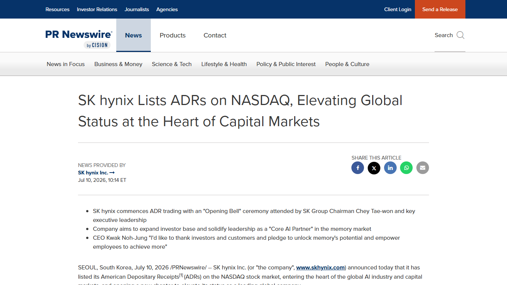
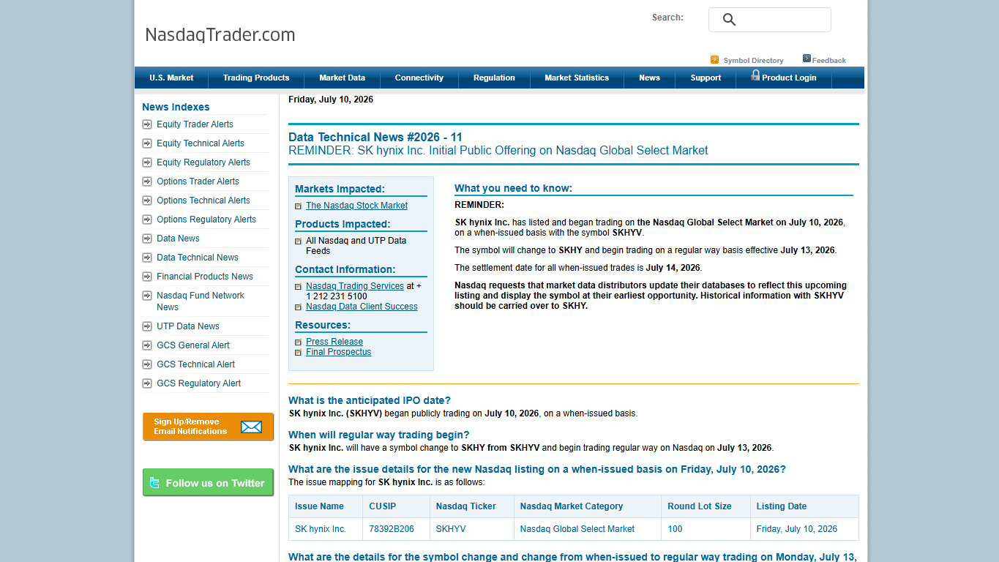

# Daily Semiconductor Current Affairs

Date: 2026-07-10

Research window: July 10 India evening through the U.S. trading day. Today's strongest verified item is SK hynix's U.S. listing launch, because it is backed by the company release, Nasdaq Trader mechanics, and the SEC filing record. TSMC's expected June monthly-sales checkpoint did not publish on July 10 because TSMC's calendar moved it to July 13 after a typhoon day-off.
Term: Monthly sales release
Definition: A monthly sales release is a short company disclosure that reports revenue for a specific month before the full quarterly report is available. It solves the timing problem for investors and supply-chain watchers by giving a faster demand signal than quarterly earnings. In today's news, it matters because TSMC's June number would help verify AI/HPC foundry demand, but the official calendar moved the release to July 13. Source: https://investor.tsmc.com/english/financial-calendar

## Quick Index

| Date | Major Topic | Source Groups | Why To Read |
|---|---|---|---|
| 2026-07-10 | SK hynix begins U.S. trading | SK hynix, Nasdaq Trader, SEC, market reporting | Teaches how a foreign memory leader reaches U.S. investors and why financing does not instantly become chip supply. |
| 2026-07-10 | Nasdaq mechanics: temporary ticker, regular trading, settlement | Nasdaq Trader, FINRA context | Explains the difference between trading start, symbol migration, and trade settlement. |
| 2026-07-10 | TSMC monthly-sales delay | TSMC investor calendar | Prevents a false read: no July 10 June-sales number was published because the event moved to July 13. |
| 2026-07-10 | India packaging/test policy watch | ISM page and prior July 4 CG Semi context | Keeps India follow-ups separated from global market noise. |

**Page navigation:** [Sources](#source-map) · [Concept review](#concept-review) · [Follow-up](#what-to-watch-next) · [Technical terms](#technical-terms-used-today) · [Master glossary](../knowledge-base/glossary.md)

## Source Images And Manifest

Source manifest: [../images/2026-07-10/links.md](../images/2026-07-10/links.md)



This source-identifying screenshot captures the SK hynix release title, source, date, and opening bullets. It is embedded before the explanation because the company release is the primary record for the listing announcement.



This Nasdaq Trader screenshot is embedded before the trading-mechanics discussion because it shows the temporary ticker, date, market category, and settlement information in one official exchange notice.

TSMC's investor calendar was text-verified, but the headless screenshot returned a security-verification page. No blocked image is retained.

## Source Map

| Source | Source date | Role | Confidence / limitation |
|---|---:|---|---|
| [SK hynix release via PR Newswire](https://www.prnewswire.com/news-releases/sk-hynix-lists-adrs-on-nasdaq-elevating-global-status-at-the-heart-of-capital-markets-302822845.html) | 2026-07-10 | Primary company announcement for the U.S. listing, opening-bell event, offering-close target, and Korea listing of underlying shares | Strong company source; promotional tone, so use exchange and filing records for mechanics. |
| [Nasdaq Trader Data Technical News #2026-11](https://www.nasdaqtrader.com/TraderNews.aspx?id=DTN2026-11) | 2026-07-10 | Official market-operations notice for SKHYV, SKHY, when-issued trading, regular-way start, and settlement date | Strong exchange operations source. |
| [SEC final prospectus, Form 424B4](https://www.sec.gov/Archives/edgar/data/2120882/000119312526299963/d32785d424b4.htm) | 2026-07-10 | Primary filing for final offering record | Public SEC page; automated local pull was rate/traffic blocked, so no local capture was retained. |
| [MarketWatch: SK hynix stock sees double-digit pop](https://www.marketwatch.com/story/sk-hynixs-stock-looks-primed-for-a-pop-in-its-nasdaq-debut-38054370) | 2026-07-10 | First-day trading context: open, close, and percent move | Reputable market report; screenshot blocked by access restriction. |
| [Investor's Business Daily: SK hynix stock jumps after U.S. debut](https://www.investors.com/news/technology/sk-hynix-debut-tests-memory-chip-stock-demand/) | 2026-07-10 | Market context and closing price | Reputable market report; screenshot blocked by verification wall. |
| [TSMC financial calendar](https://investor.tsmc.com/english/financial-calendar) | Updated 2026-07-10 | Primary calendar showing June monthly sales postponed to July 13 due to typhoon day-off and Q2 results on July 16 | Strong official source; screenshot blocked by security verification. |
| [Investor.gov ADR definition](https://www.investor.gov/introduction-investing/investing-basics/glossary/american-depositary-receipts-adrs) | Reference | Definition support for U.S.-traded depositary receipts | U.S. investor-education source. |
| [FINRA settlement-cycle explainer](https://www.finra.org/investors/insights/understanding-settlement-cycles) | Reference | Definition support for trade settlement | U.S. market-education source. |
| [JEDEC memory-interface standards page](https://www.jedec.org/standards-documents/focus/memory-interfaces) | Reference | HBM standards-family context | Standards-body source. |
| [India Semiconductor Mission press-release page](https://ism.gov.in/notifications/press-release) | Checked 2026-07-10 | India policy follow-up | Official page; no new July 10 Semicon 2.0 final notification was visible in this check. |

## Technical Terms / Deep Definitions

This note defines important terms immediately after first learning use. The central terms are U.S. depositary receipts, exchange trading mechanics, HBM finance-to-capacity translation, monthly sales releases, foundry signals, and India packaging/test follow-ups.

## Verification Matrix

| News item | Verification status | Strongest evidence | What is analysis, not fact | What to check next |
|---|---|---|---|---|
| SK hynix U.S. listing launch | Verified | SK hynix release and Nasdaq Trader notice | Whether the listing will permanently improve valuation, liquidity, or financing cost | Offering close on July 14, symbol change on July 13, KOSPI listing of underlying shares on July 29, and use of proceeds. |
| SKHYV to SKHY trading mechanics | Verified | Nasdaq Trader notice | Whether regular-way trading will behave differently from the first day | Monday July 13 symbol transition and Tuesday July 14 settlement. |
| First-day trading strength | Reported | MarketWatch and IBD report open/close/percent-move context | Whether first-day enthusiasm proves long-run value or HBM supply | Next trading sessions, analyst coverage, lock-up/allocation details, and HBM-capacity milestones. |
| TSMC June sales | Updated, still pending | TSMC calendar says the event moved to July 13 | Any June revenue number before official publication | July 13 monthly sales release and July 16 Q2 call. |
| India Semicon 2.0 | Still pending official notification | ISM press-release page check | Final incentive structure remains unknown | Cabinet/MeitY/ISM final scheme text. |

## 1. SK hynix Starts U.S. Trading: A Memory Company Becomes Easier To Own In America

SK hynix announced that it listed American Depositary Receipts on Nasdaq on July 10.
Term: American Depositary Receipt
Definition: An American Depositary Receipt is a U.S.-traded security representing shares of a non-U.S. company that are held through a depositary structure. It solves the access problem for U.S. investors: instead of opening a foreign brokerage account, handling foreign custody, currency conversion, and local settlement, investors can buy a U.S.-market receipt. In today's news, this matters because SK hynix remains a Korean memory manufacturer, but U.S. investors can now trade an instrument linked to its shares on Nasdaq. Source: https://www.investor.gov/introduction-investing/investing-basics/glossary/american-depositary-receipts-adrs

The company release says SK hynix used the Nasdaq opening-bell ceremony and positioned the listing as part of its "Core AI Partner" identity. It also said the newly issued common shares underlying the receipts are expected to be additionally listed on the Korea Exchange on July 29 Korea time.

Term: Underlying shares
Definition: Underlying shares are the actual company shares that economically support another security such as a depositary receipt. They solve the linkage problem: the U.S. receipt is not a separate operating company; it represents an interest connected to ordinary shares in the home market. In today's news, the distinction matters because trading happens on Nasdaq, while the economic exposure ultimately links back to SK hynix common shares in Korea. Source: https://www.investor.gov/introduction-investing/investing-basics/glossary/american-depositary-receipts-adrs

The same release said the offering was scheduled to close on July 14 U.S. Eastern Time and that the underlying common shares would be listed on the KOSPI Market of the Korea Exchange.
Term: KOSPI Market
Definition: The KOSPI Market is the main stock market of the Korea Exchange for many of South Korea's large listed companies. It solves the domestic listing and trading venue problem for Korean ordinary shares, while a U.S. depositary receipt solves the U.S. investor-access problem. In today's news, KOSPI matters because SK hynix's U.S. receipts and Korean common shares are connected but trade through different market infrastructures. Source: https://www.prnewswire.com/news-releases/sk-hynix-lists-adrs-on-nasdaq-elevating-global-status-at-the-heart-of-capital-markets-302822845.html

### Confirmed facts

- SK hynix announced the Nasdaq listing on July 10.
- Nasdaq Trader says SK hynix began publicly trading on July 10 on a when-issued basis under ticker `SKHYV`.
- Nasdaq Trader says the ticker changes to `SKHY` and regular-way trading begins July 13.
- Nasdaq Trader lists July 14 as the settlement date for when-issued trades.
- SK hynix says the offering is scheduled to close July 14 U.S. Eastern Time.
- SK hynix says the common shares underlying the receipts will be additionally listed on KOSPI on July 29 Korea time.

### Why this matters for the semiconductor value chain

This is not a product launch. It is a capital-market event for a company sitting at the center of AI-memory supply.
Term: High-Bandwidth Memory
Definition: High-Bandwidth Memory is stacked DRAM connected near a compute die through very dense package-level interconnects so an AI accelerator can move data at extremely high bandwidth. It solves the memory-wall problem: AI chips can have many compute units, but those units stall if model weights and activations cannot reach them fast enough. In today's news, HBM matters because investor demand for SK hynix is strongly tied to its role in supplying memory for AI accelerators, but a listing itself does not create more HBM stacks. Source: https://www.jedec.org/standards-documents/focus/memory-interfaces

The chain from listing to physical semiconductor supply is long:

```text
U.S. listing -> investor demand -> gross proceeds / liquidity
-> capital expenditure budget -> fab tools and packaging capacity
-> process integration -> yield ramp -> customer qualification
-> shipped memory devices
```

Term: Capital expenditure
Definition: Capital expenditure is money spent on long-lived productive assets such as fabs, cleanroom buildouts, lithography tools, deposition systems, etch tools, metrology, test equipment, and packaging capacity. It solves the capacity problem by turning financing into physical manufacturing capability. In today's news, capex matters because SK hynix can raise or allocate money for future memory output, but equipment installation, process qualification, and customer acceptance still take time. Source: https://www.semi.org/en/resources/semiconductor101

### Confirmed versus analysis

Confirmed: the listing, temporary ticker, regular-way transition date, settlement date, offering-close target, and KOSPI-underlying-share timing are supported by company and exchange records. Analysis: the event improves U.S. market access and can support financing for memory expansion, but it does not instantly relieve AI-memory shortages. The hard engineering steps remain tool delivery, yield, thermal behavior, package reliability, and customer qualification.

Simple explanation: SK hynix made it easier for U.S. investors to buy exposure to the company. That is important because SK hynix is a key AI-memory supplier, but the listing is a financial bridge, not a new factory by itself.

## 2. Nasdaq Mechanics: Trading Start Is Not The Same As Final Settlement

Nasdaq Trader says SK hynix began publicly trading on July 10 on a when-issued basis with the ticker `SKHYV`.
Term: When-issued trading
Definition: When-issued trading is trading in a security before the final issuance or distribution process has fully settled. It solves the timing problem where the market wants price discovery and trading access before all delivery mechanics are complete. In today's news, `SKHYV` tells you this was the temporary trading form for SK hynix before regular-way trading begins. Source: https://www.nasdaqtrader.com/TraderNews.aspx?id=DTN2026-11

Nasdaq says the ticker changes from `SKHYV` to `SKHY` and regular-way trading begins July 13.
Term: Regular-way trading
Definition: Regular-way trading is the normal exchange-trading state where trades follow the standard settlement cycle and security identifiers. It solves the operational problem of moving from temporary issuance mechanics into ordinary secondary-market trading. In today's news, July 13 is the date to watch because `SKHY` becomes the standard Nasdaq ticker after the temporary `SKHYV` phase. Source: https://www.nasdaqtrader.com/TraderNews.aspx?id=DTN2026-11

Nasdaq lists July 14 as the settlement date for all when-issued trades.
Term: Settlement date
Definition: The settlement date is the date when the buyer must deliver cash and the seller must deliver the security through the market infrastructure. It solves the legal ownership-transfer problem: a trade execution records the deal, but settlement completes delivery and payment. In today's news, July 14 matters because first-day trades are not fully complete just because the stock price moved on July 10. Source: https://www.finra.org/investors/insights/understanding-settlement-cycles

Term: Nasdaq Global Select Market
Definition: Nasdaq Global Select Market is Nasdaq's top listing tier, with quantitative and governance standards for companies that meet higher listing thresholds. It solves investor-screening and market-structure needs by grouping more established listings into a premier tier. In today's news, the tier matters because Nasdaq is positioning SK hynix's receipt listing as a major, high-profile foreign issuer event. Source: https://www.nasdaqtrader.com/TraderNews.aspx?id=DTN2026-11

### What to remember

Do not compress the mechanics into one headline. There are four separate dates:

| Date | What it means |
|---|---|
| July 10 | Temporary ticker `SKHYV` begins public trading. |
| July 13 | Ticker changes to `SKHY`; regular-way trading begins. |
| July 14 | Settlement for when-issued trades and scheduled offering close. |
| July 29 | Newly issued common shares underlying the receipts are expected to be listed on KOSPI. |

This is useful for interviews because it shows how semiconductor news can include market microstructure. A VLSI student does not need to become a trader, but must understand that a chip company's financing, exchange listing, and manufacturing output are different layers of the same business system.

## 3. Market Signal: Strong Debut, But Do Not Confuse Price With Yield

MarketWatch reported that SK hynix receipts began trading at 11:34 a.m. Eastern at USD 170 each, about 14% above the offering price, and closed up 12.8%. Investor's Business Daily also reported the USD 168.01 close and 12.8% gain from the offering price.
Term: Offering price
Definition: The offering price is the price at which securities are sold to investors in the offering before or as they enter public trading. It solves the capital-raising price-discovery problem between the issuer, underwriters, and initial buyers. In today's news, the reported USD 149 offering price is the base from which first-day gains were measured, but it is not the same as future business value or manufacturing capacity. Source: https://www.sec.gov/Archives/edgar/data/2120882/000119312526299963/d32785d424b4.htm

Term: Market-moving signal
Definition: A market-moving signal is information that changes investor expectations enough to move prices, trading volume, or sector sentiment. It solves the attention problem in financial markets by showing what investors consider important. In today's news, the SK hynix debut is a market-moving signal because investors treated AI memory as a scarce, strategic asset, but the move does not prove that every future HBM wafer or package will qualify successfully. Source: https://www.marketwatch.com/story/sk-hynixs-stock-looks-primed-for-a-pop-in-its-nasdaq-debut-38054370

### Analysis

The first-day reaction tells us three things:

| Signal | What it suggests | What it does not prove |
|---|---|---|
| Strong first-day gain | Investors still want AI-memory exposure. | Long-run valuation is correct. |
| U.S. listing liquidity | More U.S. funds can access SK hynix directly. | Manufacturing capacity has increased. |
| Large offering scale | Memory capex can be financed aggressively. | HBM yield, thermal performance, or customer acceptance is solved. |

For semiconductors, the key mental model is "financial liquidity versus physical liquidity." Financial liquidity means shares trade easily. Physical liquidity means customers can actually obtain qualified HBM, DRAM, NAND, or packaged products at the needed volume and reliability. The former can move in a day; the latter is built over quarters and years.

Term: Yield ramp
Definition: Yield ramp is the process of improving the percentage of good dies or packages as manufacturing moves from early production toward stable high-volume output. It solves the economic problem that a process can be technically possible but unprofitable if too many units fail. In today's news, yield ramp matters because SK hynix's real AI-memory value depends on qualified output, not only investor appetite. Source: https://www.semi.org/en/resources/semiconductor101

Simple explanation: the market liked SK hynix's U.S. debut. That is a strong signal about AI-memory demand, but actual chip availability still depends on factories, equipment, packages, and yield.

## 4. TSMC: June Monthly Sales Moved To July 13, So No July 10 Revenue Number Should Be Invented

TSMC's financial calendar says June 2026 monthly sales were postponed to July 13 because of the typhoon day-off on July 10.

Term: Foundry
Definition: A foundry manufactures chips for design companies using its process nodes, process-design kits, fabs, design rules, and manufacturing services. It solves the capital barrier for fabless companies that need advanced manufacturing but do not own advanced fabs. In today's news, TSMC's monthly sales matter because many AI accelerators, CPUs, smartphone chips, networking chips, and custom ASICs depend on its capacity and yield. Source: https://investor.tsmc.com/english/financial-calendar

TSMC's Q2 earnings conference remains listed for July 16.
Term: Earnings conference
Definition: An earnings conference is the scheduled investor call where management explains quarterly financial results, margins, outlook, capex, and demand trends after the formal release. It solves the context problem: the numbers show what happened, while management commentary explains drivers and risks. In today's news, the July 16 call matters because it should clarify whether AI/HPC strength, advanced-node utilization, packaging demand, and customer mix support current expectations. Source: https://investor.tsmc.com/english/financial-calendar

### Confirmed versus analysis

Confirmed: TSMC's calendar moved June monthly sales to July 13 and lists Q2 results for July 16. Analysis: the delay is an administrative/weather-calendar event, not a demand signal. Treat "no July 10 revenue number" as exactly that: no number yet.

Simple explanation: TSMC did not miss demand guidance today. The company calendar says the sales release moved because of a typhoon day-off.

## 5. India Follow-Up: Packaging/Test Progress Remains Active, Semicon 2.0 Still Needs Official Text

No new July 10 official final notification for India's next semiconductor incentive phase was visible on the India Semiconductor Mission press-release page during this check. The July 4 CG Semi Sanand item remains the latest concrete official packaging/test milestone in this notebook's India thread.

Term: Outsourced Semiconductor Assembly and Test
Definition: Outsourced Semiconductor Assembly and Test is the back-end stage where finished wafer dies are assembled into packages, tested electrically, marked, and prepared for use in systems. It solves the gap between a bare die and a reliable component that can be soldered onto boards or integrated into modules. In today's India follow-up, OSAT matters because India has visible progress in packaging/test before it has large-scale advanced wafer fabrication, and packaging quality determines whether chips can be shipped repeatedly to real customers. Source: https://semiengineering.com/knowledge_centers/packaging/outsourced-semiconductor-assembly-and-test/

Term: Policy notification
Definition: A policy notification is an official government document that turns policy intent into rules, eligibility criteria, incentives, deadlines, and administrative process. It solves the ambiguity problem for investors: companies need to know exactly what qualifies, how support is calculated, and what compliance obligations apply. In today's news, Semicon 2.0 remains a watch item until MeitY, ISM, or Cabinet documents publish final terms. Source: https://ism.gov.in/

### India angle

India's near-term semiconductor credibility is not measured only by announcements. It needs repeat evidence:

| Evidence type | Why it matters |
|---|---|
| Customer names or sectors | Shows demand beyond ceremony. |
| Package mix | Shows technical complexity: discrete, power, analog, sensor, memory, or advanced packages. |
| Yield and test escapes | Shows manufacturing quality. |
| Utilization | Shows whether installed capacity is used. |
| Recurring shipments | Shows the plant is moving from event milestone to production habit. |

Simple explanation: India has a real packaging/test milestone from CG Semi, but the next incentive policy still needs official text before we can analyze eligibility and impact.

## Coverage Check

| Segment | July 10 status | Study conclusion |
|---|---|---|
| Chipmakers / memory | Major update | SK hynix became directly tradeable in the U.S. through depositary receipts; the AI-memory financing story moved from reported demand to actual trading. |
| AI accelerators | Indirect update | The listing matters because HBM is a bottleneck input for AI accelerators. |
| Foundry | Watch item | TSMC's June sales moved to July 13; Q2 call remains July 16. |
| Equipment | Indirect update | Financing can support future EUV, packaging, test, and fab equipment, but no new tool order was verified today. |
| EDA / IP | Indirect | No major new EDA/IP announcement verified; HBM and custom AI-chip demand continue to pull design and verification work. |
| Materials | No new central item | Materials remain important from the July 9 Micron-GlobalWafers story. |
| Packaging / test | Active follow-up | HBM and India OSAT both show packaging/test as strategic bottlenecks. |
| Policy / export controls | Pending | No new verified export-control rule; India Semicon 2.0 remains pending. |
| Geopolitics | Korea / U.S. / Taiwan / India | Korean memory financing, U.S. capital markets, Taiwan foundry data, and India policy are linked by AI supply-chain competition. |
| Market-moving signals | Major update | SK hynix first-day trading was the day's main market signal. |

## Follow-Up Ledger

| Earlier item | July 10 status | Evidence / next check |
|---|---|---|
| SK hynix U.S. offering | Updated, still active | Listing began; watch July 13 ticker transition, July 14 settlement/close, July 29 KOSPI underlying-share listing, and use-of-proceeds execution. |
| TSMC June monthly sales | Updated, still pending | Official calendar moved release to July 13 due to typhoon day-off. |
| TSMC Q2 earnings | Still pending | Official results/call remain July 16. |
| Micron-GlobalWafers wafer supply | Still active | Watch GlobalWafers Sherman ramp, wafer qualification, and Micron U.S. fab timing. |
| Samsung full Q2 earnings | Still pending | July 7 guidance is known; divisional details still needed. |
| India Semicon 2.0 | Still pending official policy | No final ISM/MeitY notification found today. |
| CG Semi recurring output | Still pending | Need customers, package mix, yield, utilization, certifications, and recurring shipments. |

## Concept Review

| Concept | Key distinction | Why it matters |
|---|---|---|
| U.S. listing versus Korean operating company | U.S. receipts trade on Nasdaq; the manufacturing company remains SK hynix in Korea. | Helps avoid thinking a listing changes factory geography. |
| When-issued versus regular-way trading | Temporary pre-settlement trading versus ordinary trading after symbol transition. | Explains why July 10, July 13, and July 14 all matter. |
| Financial liquidity versus physical chip supply | Shares can trade quickly; qualified memory output requires fabs, tools, packages, and yield. | Prevents hype from replacing manufacturing reality. |
| HBM demand versus HBM output | Demand is market desire; output is qualified shipped memory. | AI accelerator supply depends on the second, not only the first. |
| Monthly sales release versus earnings call | Monthly sales show revenue pulse; earnings call explains margins, mix, capex, and outlook. | TSMC July 13 and July 16 are different evidence points. |
| Policy report versus policy notification | Reporting can preview direction; notification sets enforceable rules. | India Semicon 2.0 remains unresolved until official text appears. |

## Interview Questions

1. Why would a Korean semiconductor company list depositary receipts in the U.S.?
2. What is the difference between a depositary receipt and an underlying common share?
3. Why does when-issued trading use a temporary ticker?
4. Why is settlement separate from trade execution?
5. How can a large capital raise help future HBM output without fixing shortages immediately?
6. What is the difference between financial liquidity and physical chip supply?
7. Why is HBM so important for AI accelerators?
8. Why should TSMC's July 10 monthly-sales delay not be interpreted as weak demand?
9. What evidence would prove that India's OSAT capacity is moving from ceremony to production?
10. What final official document is needed before Semicon 2.0 can be analyzed properly?

## What To Watch Next

1. SK hynix regular-way ticker transition from `SKHYV` to `SKHY` on July 13.
2. SK hynix offering close and settlement on July 14.
3. Newly issued common shares underlying the receipts on KOSPI on July 29 Korea time.
4. TSMC June 2026 monthly sales on July 13 and Q2 earnings on July 16.
5. ASML Q2 results on July 15 because lithography orders will test whether AI capex is still pulling equipment demand.
6. India Semicon 2.0 official notification and CG Semi recurring-output proof.

## Final Takeaway

July 10 is a market-structure day. SK hynix's U.S. listing confirms that AI memory is important enough to attract major global capital-market attention. Nasdaq's official notice gives the operational mechanics: temporary ticker, regular-way trading, and settlement. The engineering takeaway is stricter: financing can support future capacity, but HBM supply still depends on equipment, yield, package reliability, thermals, and customer qualification. TSMC and India remain important, but their correct July 10 status is pending, not guessed.

## Technical Terms Used Today

[Back to quick index](#quick-index) · [Open the master A-Z glossary](../knowledge-base/glossary.md)

**Term index:** [American Depositary Receipt (ADR)](#daily-term-american-depositary-receipt-adr) · [Capital expenditure (capex)](#daily-term-capital-expenditure-capex) · [Earnings conference](#daily-term-earnings-conference) · [Foundry](#daily-term-foundry) · [High-Bandwidth Memory (HBM)](#daily-term-high-bandwidth-memory-hbm) · [KOSPI Market](#daily-term-kospi-market) · [Market-moving signal](#daily-term-market-moving-signal) · [Monthly sales release](#daily-term-monthly-sales-release) · [Nasdaq Global Select Market](#daily-term-nasdaq-global-select-market) · [Offering price](#daily-term-offering-price) · [OSAT](#daily-term-osat) · [Policy notification](#daily-term-policy-notification) · [Regular-way trading](#daily-term-regular-way-trading) · [Settlement date](#daily-term-settlement-date) · [Underlying shares](#daily-term-underlying-shares) · [When-issued trading](#daily-term-when-issued-trading) · [Yield ramp](#daily-term-yield-ramp)

| Term | Meaning |
|---|---|
| <a id="daily-term-american-depositary-receipt-adr"></a>[**American Depositary Receipt (ADR)**](../knowledge-base/glossary.md#term-american-depositary-receipt-adr) | An American Depositary Receipt is a U.S.-traded security representing shares of a non-U.S. company that are held through a depositary structure. It solves the access problem for U.S. investors: instead of opening a foreign brokerage account, handling foreign custody, currency conversion, and local settlement, investors can buy a U.S.-market receipt. |
| <a id="daily-term-capital-expenditure-capex"></a>[**Capital expenditure (capex)**](../knowledge-base/glossary.md#term-capital-expenditure-capex) | Capital expenditure is money spent on long-lived productive assets such as fabs, cleanroom buildouts, lithography tools, deposition systems, etch tools, metrology, test equipment, and packaging capacity. It solves the capacity problem by turning financing into physical manufacturing capability. |
| <a id="daily-term-earnings-conference"></a>[**Earnings conference**](../knowledge-base/glossary.md#term-earnings-conference) | An earnings conference is the scheduled investor call where management explains quarterly financial results, margins, outlook, capex, and demand trends after the formal release. It solves the context problem: the numbers show what happened, while management commentary explains drivers and risks. |
| <a id="daily-term-foundry"></a>[**Foundry**](../knowledge-base/glossary.md#term-foundry) | A foundry manufactures chips for design companies using its process nodes, process-design kits, fabs, design rules, and manufacturing services. It solves the capital barrier for fabless companies that need advanced manufacturing but do not own advanced fabs. |
| <a id="daily-term-high-bandwidth-memory-hbm"></a>[**High-Bandwidth Memory (HBM)**](../knowledge-base/glossary.md#term-high-bandwidth-memory-hbm) | High-Bandwidth Memory is stacked DRAM connected near a compute die through very dense package-level interconnects so an AI accelerator can move data at extremely high bandwidth. It solves the memory-wall problem: AI chips can have many compute units, but those units stall if model weights and activations cannot reach them fast enough. |
| <a id="daily-term-kospi-market"></a>[**KOSPI Market**](../knowledge-base/glossary.md#term-kospi-market) | The KOSPI Market is the main stock market of the Korea Exchange for many of South Korea's large listed companies. It solves the domestic listing and trading venue problem for Korean ordinary shares, while a U.S. depositary receipt solves the U.S. investor-access problem. |
| <a id="daily-term-market-moving-signal"></a>[**Market-moving signal**](../knowledge-base/glossary.md#term-market-moving-signal) | A market-moving signal is information that changes investor expectations enough to move prices, trading volume, or sector sentiment. It solves the attention problem in financial markets by showing what investors consider important. |
| <a id="daily-term-monthly-sales-release"></a>[**Monthly sales release**](../knowledge-base/glossary.md#term-monthly-sales-release) | A monthly sales release is a short company disclosure that reports revenue for a specific month before the full quarterly report is available. It solves the timing problem for investors and supply-chain watchers by giving a faster demand signal than quarterly earnings. |
| <a id="daily-term-nasdaq-global-select-market"></a>[**Nasdaq Global Select Market**](../knowledge-base/glossary.md#term-nasdaq-global-select-market) | Nasdaq Global Select Market is Nasdaq's top listing tier, with quantitative and governance standards for companies that meet higher listing thresholds. It solves investor-screening and market-structure needs by grouping more established listings into a premier tier. |
| <a id="daily-term-offering-price"></a>[**Offering price**](../knowledge-base/glossary.md#term-offering-price) | The offering price is the price at which securities are sold to investors in the offering before or as they enter public trading. It solves the capital-raising price-discovery problem between the issuer, underwriters, and initial buyers. |
| <a id="daily-term-osat"></a>[**OSAT**](../knowledge-base/glossary.md#term-osat) | Outsourced Semiconductor Assembly and Test is the back-end stage where finished wafer dies are assembled into packages, tested electrically, marked, and prepared for use in systems. It solves the gap between a bare die and a reliable component that can be soldered onto boards or integrated into modules. |
| <a id="daily-term-policy-notification"></a>[**Policy notification**](../knowledge-base/glossary.md#term-policy-notification) | A policy notification is an official government document that turns policy intent into rules, eligibility criteria, incentives, deadlines, and administrative process. It solves the ambiguity problem for investors: companies need to know exactly what qualifies, how support is calculated, and what compliance obligations apply. |
| <a id="daily-term-regular-way-trading"></a>[**Regular-way trading**](../knowledge-base/glossary.md#term-regular-way-trading) | Regular-way trading is the normal exchange-trading state where trades follow the standard settlement cycle and security identifiers. It solves the operational problem of moving from temporary issuance mechanics into ordinary secondary-market trading. |
| <a id="daily-term-settlement-date"></a>[**Settlement date**](../knowledge-base/glossary.md#term-settlement-date) | The settlement date is the date when the buyer must deliver cash and the seller must deliver the security through the market infrastructure. It solves the legal ownership-transfer problem: a trade execution records the deal, but settlement completes delivery and payment. |
| <a id="daily-term-underlying-shares"></a>[**Underlying shares**](../knowledge-base/glossary.md#term-underlying-shares) | Underlying shares are the actual company shares that economically support another security such as a depositary receipt. They solve the linkage problem: the U.S. receipt is not a separate operating company; it represents an interest connected to ordinary shares in the home market. |
| <a id="daily-term-when-issued-trading"></a>[**When-issued trading**](../knowledge-base/glossary.md#term-when-issued-trading) | When-issued trading is trading in a security before the final issuance or distribution process has fully settled. It solves the timing problem where the market wants price discovery and trading access before all delivery mechanics are complete. |
| <a id="daily-term-yield-ramp"></a>[**Yield ramp**](../knowledge-base/glossary.md#term-yield-ramp) | Yield ramp is the process of improving the percentage of good dies or packages as manufacturing moves from early production toward stable high-volume output. It solves the economic problem that a process can be technically possible but unprofitable if too many units fail. |

This page-end index covers the specialist terms central to this day's study. The fuller explanation, news context, and source remain at first use; the master glossary combines repeated terms across all days.
