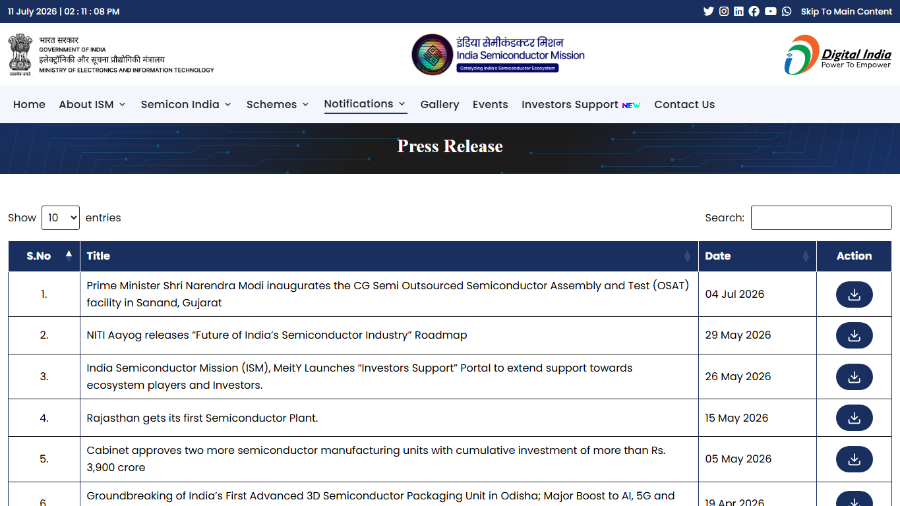

# Daily Semiconductor Current Affairs

Date: 2026-07-11

Research window: Weekend / catch-up research on July 11 India afternoon, covering the July 10 U.S. trading close, Saturday Korea/global follow-up reports, and official calendar checks for the coming semiconductor earnings week. Exact-date Saturday semiconductor announcements were limited, so the note focuses on verified Friday outcomes and forward checkpoints.
Term: Semicon 2.0
Definition: Semicon 2.0 refers here to India's expected next semiconductor incentive phase after the original India Semiconductor Mission programme. It solves the policy-evolution problem: after early fab, assembly, packaging, and design incentives, the government needs deeper support for equipment, materials, design IP, supply chains, and R&D centers. In today's news, it matters because the ISM home page points to these focus areas, but final eligibility, rates, budgets, and deadlines still need official notification before serious project analysis. Source: https://ism.gov.in/

## Quick Index

| Date | Major Topic | Source Groups | Why To Read |
|---|---|---|---|
| 2026-07-11 | SK hynix first U.S. trading outcome | AP, MarketWatch, IBD, Nasdaq Trader, SK hynix | Shows how the market priced AI-memory exposure after the listing began. |
| 2026-07-11 | TSMC and ASML earnings-week setup | TSMC calendar, ASML investor pages, IBD preview | Sets the next evidence checkpoints for revenue, margins, customer demand, and tool orders. |
| 2026-07-11 | India official-policy watch | India Semiconductor Mission | Confirms no visible July 11 final Semicon 2.0 notification on the checked ISM press-release page. |
| 2026-07-11 | Follow-up ledger cleanup | Prior daily notes and current official pages | Marks old items as updated, still pending, or closed instead of letting them drift. |

## Source Images And Manifest

Source manifest: [../images/2026-07-11/links.md](../images/2026-07-11/links.md)



This ISM screenshot is embedded before the India policy section because it cleanly shows the official press-release table visible during the July 11 review. It supports the conclusion that no newer Semicon 2.0 final-notification entry was visible there at capture time.

AP, MarketWatch, IBD, and TSMC were text-verified. Their headless screenshots returned privacy, access, verification, or bot-check pages, so no blocked image is retained.

## Source Map

| Source | Source date | Role | Confidence / limitation |
|---|---:|---|---|
| [AP News: SK hynix rises nearly 13% in Wall Street debut](https://apnews.com/article/73f13a85ae00e30bad0540281bbe44f3) | 2026-07-11 | Broad market and business context for first-day performance, offering scale, and AI-memory framing | Reputable reporting; screenshot blocked by privacy modal. |
| [MarketWatch: SK hynix's stock sees double-digit pop](https://www.marketwatch.com/story/sk-hynixs-stock-looks-primed-for-a-pop-in-its-nasdaq-debut-38054370) | 2026-07-10 | Timestamped market report with open, close, and percent gain | Reputable market reporting; screenshot blocked by access restriction. |
| [Investor's Business Daily: SK hynix stock jumps](https://www.investors.com/news/technology/sk-hynix-debut-tests-memory-chip-stock-demand/) | 2026-07-10 | Closing price and market context | Reputable market report; screenshot blocked by verification wall. |
| [SK hynix release via PR Newswire](https://www.prnewswire.com/news-releases/sk-hynix-lists-adrs-on-nasdaq-elevating-global-status-at-the-heart-of-capital-markets-302822845.html) | 2026-07-10 | Primary company source for listing announcement and offering-close schedule | Strong primary source; not a market-performance source. |
| [Nasdaq Trader notice #2026-11](https://www.nasdaqtrader.com/TraderNews.aspx?id=DTN2026-11) | 2026-07-10 | Official ticker, regular-way start, and settlement mechanics | Strong exchange operations source. |
| [TSMC financial calendar](https://investor.tsmc.com/english/financial-calendar) | Checked 2026-07-11 | Official July 13 monthly-sales and July 16 Q2-results checkpoints | Primary source; screenshot blocked by security verification. |
| [ASML Q2 2026 financial-results page](https://www.asml.com/en/investors/financial-results/q2-2026) | Checked 2026-07-11 | Official July 15 Q2 press-release and investor-call schedule | Strong primary source. |
| [ASML Q1 2026 results release](https://www.asml.com/en/news/press-releases/2026/q1-2026-financial-results) | 2026-04-15 | Prior guidance for Q2 sales, 2026 outlook, AI demand, and export-control uncertainty | Official prior-quarter context, not today's result. |
| [Investor's Business Daily earnings preview](https://www.investors.com/research/earnings-preview/tsmc-asml-kick-off-semiconductor-earnings-goldman-sachs-jpmorgan-in-financial-parade/) | 2026-07-11 | Market framing for TSMC and ASML earnings week | Reputable preview; not a primary result. |
| [India Semiconductor Mission press-release page](https://ism.gov.in/notifications/press-release) | Captured 2026-07-11 | Official India policy/page watch | Dynamic table visible in screenshot; use page as official check, not as final Semicon 2.0 text. |
| [India Semiconductor Mission home page](https://ism.gov.in/) | Checked 2026-07-11 | ISM 2.0 focus areas context | Official source for stated focus areas. |
| [Investor.gov ADR definition](https://www.investor.gov/introduction-investing/investing-basics/glossary/american-depositary-receipts-adrs) | Reference | Definition support for depositary receipts | U.S. investor-education source. |
| [ASML lithography principles](https://www.asml.com/en/technology/lithography-principles) | Reference | Lithography definition support | Primary equipment-supplier explainer. |
| [Semiconductor Engineering OSAT reference](https://semiengineering.com/knowledge_centers/packaging/outsourced-semiconductor-assembly-and-test/) | Reference | Packaging/test definition support | Reputable technical explainer. |

## Technical Terms / Deep Definitions

This note defines important terms immediately after first learning use. The main learning terms are U.S. first-day trading, depositary receipts, market capitalization, lithography-equipment demand, foundry monthly sales, and India packaging/test policy.

## Verification Matrix

| News item | Verification status | Strongest evidence | What is analysis, not fact | What to check next |
|---|---|---|---|---|
| SK hynix first-day U.S. close | Reported by multiple reputable outlets; mechanics verified by exchange | AP, MarketWatch, IBD, Nasdaq Trader, SK hynix release | Whether first-day strength predicts durable valuation or faster chip output | July 13 regular-way trading, July 14 settlement/close, future capex/yield evidence. |
| TSMC June monthly sales | Updated, still pending | TSMC calendar lists July 13 because July 10 was a typhoon day-off | Any June revenue estimate before official release | July 13 official monthly-sales release. |
| TSMC Q2 earnings | Still pending | TSMC calendar | Margin, capex, packaging, and customer mix until management reports | July 16 Q2 release/call. |
| ASML Q2 results | Still pending | ASML official Q2 page | Order intake, China/export-control impact, and AI capacity pull until results publish | July 15 press release and call. |
| India Semicon 2.0 | Still pending official final text | ISM page check and ISM home-page context | Budget, incentive rates, eligibility, and timeline | MeitY/ISM/Cabinet final notification. |

## 1. SK hynix First-Day Outcome: AI Memory Is Now A U.S. Market Story Too

AP reported that SK hynix's U.S.-listed American Depositary Receipts opened at USD 170 after being priced at USD 149 and closed at USD 168.01, up 12.8%.
Term: American Depositary Receipt
Definition: An American Depositary Receipt is a U.S.-traded security representing shares of a non-U.S. company through a depositary structure. It solves the practical access problem for U.S. investors, who can trade a dollar-denominated U.S.-market instrument instead of directly handling foreign-share custody and settlement. In today's news, this matters because SK hynix is a Korean memory company, but its AI-memory story is now directly tradable on Nasdaq. Source: https://www.investor.gov/introduction-investing/investing-basics/glossary/american-depositary-receipts-adrs

Term: First trading day
Definition: The first trading day is the first session in which a newly listed security trades publicly on an exchange. It solves price discovery: investors reveal what they are willing to pay after the initial offering price has been set. In today's news, the first trading day matters because the gap between the USD 149 offering price and the reported USD 168.01 close shows strong immediate demand for SK hynix exposure, but not guaranteed long-term performance. Source: https://www.nasdaqtrader.com/TraderNews.aspx?id=DTN2026-11

Term: Offering price
Definition: The offering price is the price at which securities are sold to initial offering investors before public trading establishes a market price. It solves capital formation by turning investor orders into proceeds for the issuer and selling holders, subject to underwriting and filing rules. In today's news, the reported USD 149 price is the baseline used to measure the first-day percentage gain. Source: https://www.sec.gov/Archives/edgar/data/2120882/000119312526299963/d32785d424b4.htm

### Confirmed facts and reported facts

Confirmed by primary sources: SK hynix listed on Nasdaq, Nasdaq used temporary ticker `SKHYV` for July 10 when-issued trading, and the normal ticker `SKHY` is scheduled for July 13. Reported by AP, MarketWatch, and IBD: the receipts were priced at USD 149, opened at USD 170, and closed at USD 168.01, a 12.8% first-day gain.

Term: When-issued trading
Definition: When-issued trading is trading before the final issuance or distribution process has fully settled. It solves the transition problem between offering mechanics and ordinary secondary-market trading. In today's news, the temporary `SKHYV` ticker marks that transition stage before regular-way `SKHY` trading begins. Source: https://www.nasdaqtrader.com/TraderNews.aspx?id=DTN2026-11

### Analysis: why investors cared

The first-day reaction is about more than one stock. SK hynix sits inside a tight AI-memory supply chain:

```text
AI model growth -> accelerator demand -> HBM demand
-> DRAM stack manufacturing -> advanced packaging and test
-> foundry/package/customer qualification -> data-center deployment
```

Term: High-Bandwidth Memory
Definition: High-Bandwidth Memory is a stacked DRAM technology placed very close to AI processors through dense package interconnects, delivering far higher bandwidth than conventional off-package memory paths. It solves the memory-bandwidth bottleneck that limits AI accelerators when compute units cannot receive data fast enough. In today's news, HBM matters because SK hynix's valuation story is tied to supplying memory for AI accelerators, not simply selling commodity memory. Source: https://www.jedec.org/standards-documents/focus/memory-interfaces

Term: Market capitalization
Definition: Market capitalization is the market value of a company implied by its share price multiplied by shares outstanding. It solves a comparison problem by giving investors a rough size measure across companies. In today's news, market value headlines can show investor enthusiasm, but they do not measure wafer starts, package yield, or actual HBM units shipped. Source: https://www.investor.gov/introduction-investing/investing-basics/glossary/market-capitalization

The danger is reading a stock move as a manufacturing result. A high share price can lower financing friction and improve investor access, but it cannot skip tool install, process control, thermal validation, or customer qualification.

Term: Customer qualification
Definition: Customer qualification is the process by which a chip customer verifies that a component meets performance, reliability, thermal, electrical, and supply requirements before using it at volume. It solves the risk problem that a chip can work in a lab but fail under real system conditions or lifecycle needs. In today's news, qualification matters because AI-memory supply is useful only when Nvidia, AMD, hyperscalers, or system makers can reliably deploy it. Source: https://www.semi.org/en/resources/semiconductor101

Simple explanation: SK hynix had a very strong first U.S. trading day. That tells us investors want exposure to AI memory. It does not by itself prove more HBM is ready to ship.

## 2. TSMC And ASML: Next Week Is The Real Evidence Window

TSMC's financial calendar lists June monthly sales for July 13 and Q2 results for July 16.
Term: Monthly sales release
Definition: A monthly sales release is a short revenue disclosure that gives investors a near-term view of demand before a full quarterly report. It solves the timing problem in fast-moving industries: users of the data do not have to wait for quarterly earnings to see whether sales momentum is changing. In today's news, TSMC's June release matters because it will test whether AI/HPC demand remained strong in the final month of Q2. Source: https://investor.tsmc.com/english/financial-calendar

Term: Foundry
Definition: A foundry manufactures chips for customers that design chips but do not own the required fabs, process technology, or manufacturing infrastructure. It solves the capital and execution problem for fabless companies by letting them use a specialized manufacturer's process nodes and yield systems. In today's news, TSMC matters because many AI accelerators, custom ASICs, CPUs, networking chips, and smartphone SoCs depend on its advanced capacity. Source: https://investor.tsmc.com/english/financial-calendar

ASML says it will announce Q2 2026 financial results on July 15, with a press release at 07:00 CEST and an investor call at 15:00 CEST. Its Q1 release said it expected Q2 2026 net sales between 8.4 billion and 9.0 billion euros, with gross margin between 51% and 52%.
Term: Lithography equipment
Definition: Lithography equipment projects circuit patterns onto wafers during chip manufacturing, using tightly controlled light, optics, masks, stages, resists, and overlay systems. It solves the patterning problem: modern transistors and interconnects are too small to manufacture by ordinary mechanical methods, so fabs need optical systems to define tiny features repeatedly across wafers. In today's news, ASML matters because lithography demand is a leading signal for whether customers are expanding advanced chip capacity. Source: https://www.asml.com/en/technology/lithography-principles

Term: EUV lithography
Definition: EUV lithography uses 13.5 nm extreme-ultraviolet light to print very small chip features with fewer multi-patterning steps than many older DUV flows. It solves the advanced-node patterning problem by enabling smaller, denser, more power-efficient chip structures, but it requires extremely complex light sources, optics, masks, vacuum systems, and process control. In today's news, EUV matters because SK hynix, TSMC, Samsung, Intel, and advanced logic/memory roadmaps depend on leading-edge patterning capacity. Source: https://www.asml.com/en/technology/lithography-principles

Term: Order intake
Definition: Order intake is the value of new customer orders booked during a period. It solves the forward-demand visibility problem for equipment suppliers: revenue shows what shipped or was recognized, while orders indicate future tool demand. In today's news, ASML order intake will be watched because AI customers may be accelerating capacity plans, but export controls and customer digestion can change the mix. Source: https://www.asml.com/en/news/press-releases/2026/q1-2026-financial-results

### Why next week matters

| Company | Date | What to learn | Why it matters |
|---|---:|---|---|
| TSMC | July 13 | June monthly sales | Checks the final Q2 revenue pulse after the delay. |
| ASML | July 15 | Tool revenue, margins, orders, export-control commentary | Tests whether AI capacity expansion is still pulling lithography demand. |
| TSMC | July 16 | Q2 revenue, margins, capex, AI/HPC commentary, packaging capacity | Gives the deepest near-term read on foundry demand and margin quality. |

Term: Advanced packaging
Definition: Advanced packaging connects multiple dies, memory stacks, substrates, interposers, and high-speed links into one high-performance package. It solves the scaling problem when a single monolithic chip is too large, too costly, or too memory-limited. In today's news, TSMC's Q2 call matters because AI accelerators increasingly depend not only on wafer fabrication but also on packaging capacity for compute dies and HBM stacks. Source: https://www.semi.org/en/resources/semiconductor101

Simple explanation: July 11 itself has limited new official semiconductor data. The important work today is preparing for the July 13-16 evidence window, where TSMC and ASML will show whether AI demand is still turning into revenue, orders, margins, and capacity plans.

## 3. India Policy Watch: No New Final Semicon 2.0 Entry Visible On ISM Press Page

The India Semiconductor Mission press-release table captured during the July 11 review showed the July 4 CG Semi Sanand press release at the top, followed by earlier May items. No newer final Semicon 2.0 official notification was visible on that page at capture time.

Term: Outsourced Semiconductor Assembly and Test
Definition: Outsourced Semiconductor Assembly and Test is the back-end manufacturing stage where wafer dies are assembled into packages, tested electrically, marked, inspected, and prepared for system-level use. It solves the practical problem that a bare die is fragile and unusable in most products until it is packaged and tested. In today's India watch, OSAT matters because India's confirmed near-term progress is strongest in packaging/test milestones such as CG Semi, while full ecosystem depth still requires design, equipment, materials, recurring customers, and yield data. Source: https://semiengineering.com/knowledge_centers/packaging/outsourced-semiconductor-assembly-and-test/

### What is updated, pending, or closed

| Item | July 11 status | Reason |
|---|---|---|
| CG Semi inauguration event | Closed as event occurrence | Prior official July 4/5 sources confirmed inauguration/start/first-shipment milestone. |
| CG Semi repeat production | Still pending | Need customer names or sectors, package mix, yield, utilization, certifications, and recurring shipment evidence. |
| Semicon 2.0 official rules | Still pending | ISM page check did not show final official scheme text today. |
| ISM 2.0 direction | Updated, broad context only | ISM home page lists focus areas such as equipment, materials, design IP, supply chains, and R&D centers. |

Simple explanation: India has a concrete OSAT milestone, but the next incentive framework still needs official rules. Do not treat newspaper previews as final scheme design.

## 4. Follow-Up Ledger: Evidence Status After July 11

| Earlier item | July 11 status | Evidence / next check |
|---|---|---|
| SK hynix U.S. offering | Updated, still active | First-day trading reported strong; watch July 13 regular-way ticker change and July 14 settlement/close. |
| SK hynix manufacturing impact | Still pending | Need capex deployment, tool orders, HBM capacity plan, package capacity, yield, and customer qualification evidence. |
| TSMC June monthly sales | Still pending | Official calendar points to July 13 because July 10 was delayed. |
| TSMC Q2 results | Still pending | Official calendar points to July 16. |
| ASML Q2 results | Still pending | Official page points to July 15; watch orders and export-control commentary. |
| Samsung full Q2 earnings | Still pending | July 7 preliminary guidance remains the latest company-confirmed checkpoint. |
| Micron-GlobalWafers wafer supply | Still active | Watch wafer qualification, Sherman ramp, and Micron U.S. fab schedules. |
| Apple-Broadcom U.S.-made chips | Still active | Watch Broadcom disclosures, product mix, shipment timing, and facility ramp. |
| Meta Iris AI chip | Still reported, not primary-confirmed | Watch Meta confirmation, foundry/package partner, benchmarks, and deployment scope. |
| India Semicon 2.0 | Still pending official policy | Need MeitY/ISM/Cabinet final text. |

## Coverage Check

| Segment | July 11 status | Study conclusion |
|---|---|---|
| Chipmakers / memory | Major follow-up | SK hynix's debut keeps AI memory at the center of capital-market attention. |
| Foundry | Pending checkpoint | TSMC's delayed June sales and July 16 Q2 call are now the next core evidence. |
| AI accelerators | Indirect update | SK hynix matters because HBM is an accelerator bottleneck; no new primary accelerator product was verified today. |
| Equipment | Pending checkpoint | ASML July 15 results will test lithography demand, order intake, and export-control effects. |
| EDA / IP | Indirect | AI custom silicon and advanced packaging remain design-flow drivers, but no new EDA/IP primary release was verified today. |
| Materials | No new central item | July 9 Micron-GlobalWafers remains the active materials story. |
| Packaging / test | Active | HBM packages, TSMC advanced packaging, and India OSAT remain high-priority follow-ups. |
| Policy / export controls | Pending | Watch ASML export-control commentary and India Semicon 2.0 final text. |
| Geopolitics | Korea / U.S. / Taiwan / Netherlands / India | AI memory, U.S. markets, Taiwan foundry output, Dutch equipment, and Indian policy are connected by supply-chain control. |
| Market-moving signals | Major follow-up | First-day SK hynix strength shows investor appetite for AI-memory exposure. |

## Concept Review

| Concept | Key distinction | Why it matters |
|---|---|---|
| First-day gain versus manufacturing progress | Price move shows investor demand; manufacturing progress requires capacity and yield. | Prevents the stock market from replacing engineering evidence. |
| Depositary receipt versus ordinary share | U.S. receipt trades on Nasdaq; underlying economics connect to foreign shares. | Helps interpret SK hynix's U.S. listing correctly. |
| Monthly revenue versus quarterly call | Monthly sales give revenue pulse; quarterly call gives margin, capex, and customer-mix detail. | TSMC July 13 and July 16 answer different questions. |
| Equipment order intake versus revenue | Orders point to future demand; revenue reflects recognized sales. | ASML's July 15 report will be judged partly by orders. |
| Lithography versus packaging | Lithography patterns wafers; packaging integrates dies and memory stacks. | AI chips need both advanced patterning and advanced package integration. |
| OSAT milestone versus OSAT maturity | Facility start is a milestone; repeat yield and customer shipments prove maturity. | India tracking should focus on production evidence. |
| Reported policy direction versus official policy text | Reports preview intent; official notification defines incentives and rules. | Semicon 2.0 remains pending. |

## Interview Questions

1. What does SK hynix's first-day U.S. trading gain tell you, and what does it not tell you?
2. Why is a depositary receipt useful for U.S. investors in a foreign semiconductor company?
3. How is HBM different from ordinary memory modules in AI accelerators?
4. Why can a memory company have strong investor demand while actual chip supply remains constrained?
5. What should you look for in TSMC's monthly sales release versus its quarterly earnings call?
6. Why is ASML order intake important for understanding future semiconductor capacity?
7. What is the difference between lithography and advanced packaging?
8. Why are export-control comments from ASML relevant even when the company reports revenue growth?
9. What evidence would move India's CG Semi story from milestone to manufacturing maturity?
10. Why should Semicon 2.0 be treated as pending until official text appears?

## What To Watch Next

1. July 13: SK hynix regular-way ticker transition to `SKHY`.
2. July 13: TSMC June 2026 monthly sales after the typhoon-related delay.
3. July 14: SK hynix settlement/offering close.
4. July 15: ASML Q2 2026 results, order intake, gross margin, and export-control commentary.
5. July 16: TSMC Q2 2026 results, AI/HPC commentary, margin, capex, and packaging capacity.
6. India: official Semicon 2.0 notification and CG Semi recurring production proof.

## Final Takeaway

July 11 is a weekend evidence-cleanup day. SK hynix's first U.S. trading outcome confirms that investors still want AI-memory exposure, but the notebook keeps the evidence boundary clear: price action is not yield, and listing access is not shipped HBM. The next deep evidence window is July 13-16, when TSMC and ASML report. India remains on official-policy watch, with the CG Semi event closed but repeat production and Semicon 2.0 final rules still pending.
