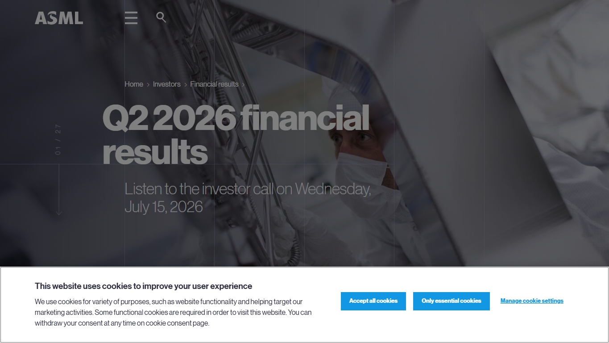
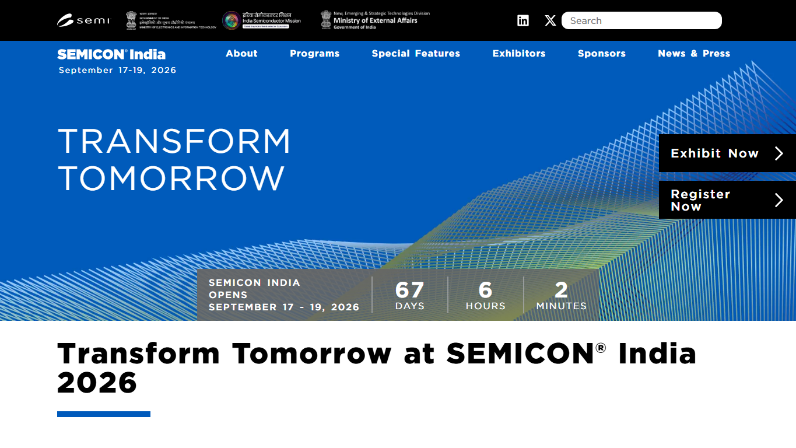

# Daily Semiconductor Current Affairs

Date: 2026-07-12

Research window: Weekend / catch-up research on July 12 India evening, covering official July 11 India semiconductor-policy/talent remarks, Sunday calendar checks, and the next 24-72 hour semiconductor evidence window. Sunday had limited exact-date company announcements, so the note separates confirmed official checkpoints from analysis and pending market expectations.

## Quick Index

| Date | Major Topic | Source Groups | Why To Read |
|---|---|---|---|
| 2026-07-12 | India: AI services, semiconductor design talent, and 315 university tool access | PIB / MeitY, Synopsys technical reference | Connects India's IT-services base to chip design, EDA tools, and the VLSI talent pipeline. |
| 2026-07-12 | ASML Q2 results checkpoint | ASML Q2 page, ASML Q1 guidance, ASML lithography reference | Shows why equipment order intake and export-control commentary matter before TSMC's foundry call. |
| 2026-07-12 | TSMC Monday revenue checkpoint | TSMC financial calendar and monthly revenue page | Keeps the July 13 June-sales release separate from speculation. |
| 2026-07-12 | SK hynix regular-way transition | Nasdaq Trader and SK hynix prior release | Tracks the listing mechanics after Friday's strong debut. |
| 2026-07-12 | SEMICON India 2026 ecosystem watch | SEMICON India / SEMI / ISM event page | Preserves India's next public ecosystem milestone and what to verify before September. |

## Source Images And Manifest

Source manifest: [../images/2026-07-12/links.md](../images/2026-07-12/links.md)



This ASML screenshot is embedded before the equipment discussion because it cleanly captures source identity, Q2 2026 page title, and the July 15 investor-call date.



This SEMICON India screenshot is embedded before the India ecosystem section because it shows the official event branding, September 17-19 dates, and "Silicon to Systems" ecosystem theme.

PIB and TSMC were text-verified, but screenshot capture returned access/security pages, so blocked images were deleted and recorded in the manifest.

## Source Map

| Source | Source date | Role | Confidence / limitation |
|---|---:|---|---|
| [PIB / MeitY: India's IT industry must pivot to AI as a Service](https://www.pib.gov.in/PressReleasePage.aspx?PRID=2283693&reg=48&lang=2) | 2026-07-11 | Primary official source for Vaishnaw's India AI, semiconductor manufacturing, design-tool, and Hyderabad remarks | Strong official source; screenshot capture was access-denied, so text link only. |
| [Synopsys: What is EDA?](https://www.synopsys.com/glossary/what-is-electronic-design-automation.html) | Reference | Technical definition support for EDA and chip design flow | Reputable EDA-company explainer. |
| [ASML Q2 2026 financial-results page](https://www.asml.com/en/investors/financial-results/q2-2026) | Checked 2026-07-12 | Primary source for July 15 press-release and investor-call timing | Strong official source; screenshot saved. |
| [ASML Q1 2026 financial-results release](https://www.asml.com/en/news/press-releases/2026/q1-2026-financial-results) | 2026-04-15 | Prior guidance for Q2 net sales, gross margin, AI demand, order intake, and export-control uncertainty | Primary prior-quarter context, not today's result. |
| [ASML lithography principles](https://www.asml.com/en/technology/lithography-principles) | Reference | Technical definition support for lithography | Primary equipment-supplier explainer. |
| [TSMC financial calendar](https://investor.tsmc.com/english/financial-calendar) | Checked 2026-07-12 | Official July 13 June monthly-sales checkpoint and July 16 Q2 call | Strong official source; screenshot blocked by security verification. |
| [TSMC 2026 monthly revenue page](https://investor.tsmc.com/english/monthly-revenue/2026) | Checked 2026-07-12 | Shows June revenue cell still blank before the July 13 release | Primary source; useful to avoid invented June numbers. |
| [TSMC Q2 2026 results page](https://investor.tsmc.com/english/quarterly-results/2026/q2) | Checked 2026-07-12 | Q2 call time and quiet-period status | Primary source. |
| [Nasdaq Trader notice #2026-11](https://www.nasdaqtrader.com/TraderNews.aspx?id=DTN2026-11) | 2026-07-10 | Official SK hynix `SKHYV` to `SKHY` and settlement mechanics | Strong exchange operations source. |
| [SK hynix listing release](https://www.prnewswire.com/news-releases/sk-hynix-lists-adrs-on-nasdaq-elevating-global-status-at-the-heart-of-capital-markets-302822845.html) | 2026-07-10 | Company source for ADR listing and offering-close schedule | Strong company source. |
| [SEMICON India 2026](https://www.semiconindia.org/) | Checked 2026-07-12 | Official event page for September 17-19, "Silicon to Systems" ecosystem watch | Strong event source; screenshot saved. |
| [Investor.gov ADR glossary](https://www.investor.gov/introduction-investing/investing-basics/glossary/american-depositary-receipts-adrs) | Reference | Definition support for ADRs | U.S. investor-education source. |
| [SEMI Semiconductor 101](https://www.semi.org/en/resources/semiconductor101) | Reference | General manufacturing, packaging, and ecosystem context | Industry-association explainer. |

## Verification Matrix

| News item | Verification status | Strongest evidence | What is analysis, not fact | What to check next |
|---|---|---|---|---|
| India AI/semiconductor talent remarks | Verified official statement | PIB / MeitY release dated July 11 | Whether 315-university tool access becomes job-ready VLSI capability | Tool vendors, curriculum depth, lab access, tape-out opportunities, internship conversion, and hiring outcomes. |
| 12 semiconductor plants / 3 producing chips | Official statement, details still need project-level verification | PIB / MeitY release | Which exact plants, product mix, export value, utilization, and recurring-volume quality | ISM/MeitY project updates, company releases, customs/export data, customer names. |
| ASML July 15 Q2 checkpoint | Verified official calendar/page | ASML Q2 2026 page | Whether orders will beat expectations or export controls will pressure outlook | July 15 release, order intake, gross margin, China/export-control commentary. |
| TSMC June monthly sales | Still pending | TSMC calendar and monthly revenue page | Any June revenue estimate before July 13 | July 13 official monthly revenue and July 16 Q2 call. |
| SK hynix listing mechanics | Verified, still active | Nasdaq Trader and SK hynix release | Monday trading behavior and long-term valuation | July 13 regular-way `SKHY`, July 14 settlement/offering close. |
| SEMICON India 2026 | Verified event page | SEMICON India page | Final agenda quality, exhibitors, state participation, project announcements | Program agenda, exhibitor list, sponsors, government/company announcements. |

## 1. India: From IT Services To AI Services And Semiconductor Design Talent

PIB reported that Union Minister Ashwini Vaishnaw called for India's IT industry to move from software services toward an "AI as a Service" model.
Term: AI as a Service
Definition: AI as a Service means delivering AI capabilities through reusable platforms, APIs, managed models, domain-specific tools, and deployment support instead of only selling headcount-based software projects. It solves the business-scaling problem: a services company can package model access, data pipelines, inference workflows, monitoring, security, and customization into repeatable offerings. In today's news, it matters because the minister is asking Indian IT firms to turn AI capability into productized services while also connecting that software strength to electronics and semiconductor opportunities. Source: https://www.pib.gov.in/PressReleasePage.aspx?PRID=2283693&reg=48&lang=2

The semiconductor part is the sharper VLSI signal: PIB says the minister stated that 12 semiconductor manufacturing plants are at various development stages, with three already producing chips exported to Japan, Europe, and domestic markets. PIB also says the government has made advanced semiconductor design tools available to 315 universities.

Term: Semiconductor design tools
Definition: Semiconductor design tools are specialized software and hardware systems used to design, simulate, verify, implement, and prepare chips for manufacturing. They solve the complexity problem: modern chips contain millions to billions of transistors, so manual design is impossible beyond small circuits. In today's news, tool access matters because giving universities design tools can expose students to real VLSI flows such as RTL design, simulation, synthesis, place-and-route, timing signoff, physical verification, and DFT. Source: https://www.synopsys.com/glossary/what-is-electronic-design-automation.html

Term: Electronic Design Automation
Definition: Electronic Design Automation is the software-and-methodology stack used to design electronic systems and integrated circuits, covering architecture exploration, HDL entry, simulation, synthesis, physical design, timing, power, verification, and manufacturing checks. It solves the error-control and productivity problem: without EDA, engineers cannot reliably build complex chips at modern scale. In today's news, EDA matters because tool access at 315 universities can only become a real talent pipeline if students learn the full design flow, not just click through software menus. Source: https://www.synopsys.com/glossary/what-is-electronic-design-automation.html

Term: Talent pipeline
Definition: A talent pipeline is the structured path that turns students into job-ready engineers through curriculum, tools, labs, projects, mentors, internships, assessment, and hiring. It solves the workforce bottleneck in industries where equipment and capital are not enough without trained people. In today's news, the 315-university claim is important only if it produces graduates who can debug timing violations, write verification testbenches, understand PDK constraints, and work with manufacturing/package teams. Source: https://www.pib.gov.in/PressReleasePage.aspx?PRID=2283693&reg=48&lang=2

### Confirmed facts

- PIB dates the release July 11, and it entered this July 12 review window.
- The statement links India's next growth phase to AI, semiconductor manufacturing, electronics manufacturing, and advanced infrastructure.
- PIB reports the minister said 12 semiconductor manufacturing plants are at different development stages and three are already producing chips for export/domestic markets.
- PIB reports advanced semiconductor design tools have been made available to 315 universities.
- Hyderabad is framed as a technology-led growth center for semiconductors, AI, electronics, digital public infrastructure, and related innovation.

### Analysis

This is more than a generic talent statement. India already has a large IT services workforce. The policy challenge is converting some of that base into semiconductor-adjacent capability:

```text
software services -> AI platforms -> chip/system software
-> EDA-aware design engineers -> verification / DFT / physical design
-> India design IP, OSAT, electronics, and systems ecosystem
```

Term: Design IP
Definition: Design IP is a reusable block of chip design such as a processor core, memory controller, interface, security module, or analog block that can be licensed or reused inside a larger SoC. It solves the time-to-market problem because chip teams do not redesign every block from scratch. In today's news, design IP matters because India can participate deeply in semiconductors through reusable design blocks and verification capability even before it has many advanced fabs. Source: https://www.synopsys.com/glossary/what-is-electronic-design-automation.html

Term: System-on-chip
Definition: A system-on-chip is an integrated circuit that combines processors, memory interfaces, accelerators, I/O, security, and control logic on one chip or chiplet-based system. It solves the integration problem by putting many system functions close together for lower power, smaller size, and better performance. In today's news, SoC skills matter because Indian engineers need to move from software-only work toward hardware/software co-design, verification, and package-aware system thinking. Source: https://www.synopsys.com/glossary/what-is-electronic-design-automation.html

### What would make this real

| Needed evidence | Why it matters |
|---|---|
| Tool vendor and license details | Determines whether students get industry-grade flows or limited demos. |
| PDK / process access | Real chip design requires foundry rules and libraries, not only schematic exercises. |
| Tape-out projects | Converts classroom design into manufacturable silicon learning. |
| Verification depth | Most VLSI jobs require debugging, assertions, coverage, and testbench skill. |
| Internship and hiring data | Shows whether the programme creates industry-ready engineers. |
| University lab support | Tools alone fail without servers, licenses, mentors, and project discipline. |

Simple explanation: India is trying to connect its IT strength with AI and chip design. The important part for you is the 315-university design-tool access, but the real test is whether students learn actual VLSI flows deeply enough for jobs.

## 2. ASML: July 15 Is The Equipment Checkpoint Before TSMC's Foundry Call

ASML's Q2 page says it will announce Q2 2026 financial results on Wednesday, July 15, with the press release at 07:00 CEST and an investor call at 15:00 CEST.
Term: Lithography equipment
Definition: Lithography equipment projects circuit patterns onto silicon wafers using light, masks, optics, wafer stages, photoresist, alignment, and process control. It solves the patterning problem: transistors and interconnects are too small and dense to draw mechanically, so fabs use optical systems to print repeated chip layers. In today's news, ASML matters because lithography tool demand is an upstream signal for future advanced-node logic, memory, and AI-chip capacity. Source: https://www.asml.com/en/technology/lithography-principles

ASML's Q1 release guided Q2 net sales between EUR 8.4 billion and EUR 9.0 billion and gross margin between 51% and 52%. It also said AI-related infrastructure investments were pushing customers to accelerate capacity expansion, while 2026 guidance had to accommodate export-control uncertainty.

Term: Order intake
Definition: Order intake is the value of new customer orders booked during a period. It solves the forward-visibility problem for equipment companies: revenue tells you what was delivered or recognized, while orders indicate future demand and backlog strength. In today's news, order intake matters because ASML tools are ordered long before they become installed wafer capacity. Source: https://www.asml.com/en/news/press-releases/2026/q1-2026-financial-results

Term: Export controls
Definition: Export controls are government restrictions on selling or transferring sensitive goods, software, technology, or services to certain countries, companies, or end uses. They solve national-security and strategic-technology concerns, but they also reshape commercial supply chains. In today's ASML watch, export controls matter because lithography tools are strategic equipment, and restrictions can change where ASML can ship tools, how customers plan fabs, and how China develops domestic alternatives. Source: https://www.asml.com/en/news/press-releases/2026/q1-2026-financial-results

Term: EUV lithography
Definition: EUV lithography uses 13.5 nm extreme-ultraviolet light to pattern very small chip features with fewer multi-patterning steps than many older DUV flows. It solves the scaling problem for leading-edge chips where smaller transistors, tighter metal pitches, and lower power require extremely precise patterning. In today's news, EUV matters because advanced AI logic, cutting-edge foundry nodes, and future memory processes depend on scarce, expensive, highly controlled EUV capacity. Source: https://www.asml.com/en/technology/lithography-principles

### Why this matters

ASML is not just another earnings release. It is a readout on whether the AI hardware boom is translating into upstream equipment demand.

| What to watch July 15 | Interpretation |
|---|---|
| Net sales and gross margin | Whether tool shipments and service mix matched guidance. |
| Net bookings / order intake | Whether customers are still placing future capacity bets. |
| China and export-control comments | Whether geopolitical restrictions are changing the outlook. |
| EUV / DUV mix | Whether leading-edge and mature-node customers are both investing. |
| Installed-base upgrades | Whether customers are improving throughput without only buying new scanners. |

Simple explanation: ASML reports before TSMC. If ASML orders are strong, it suggests chipmakers are still planning more future capacity. If orders disappoint or export controls bite, the AI capacity story becomes more complicated.

## 3. TSMC: Do Not Invent June Sales Before July 13

TSMC's financial calendar says June 2026 monthly sales are scheduled for July 13 after being postponed because of the typhoon day-off on July 10. The TSMC monthly revenue page still showed June blank during this July 12 check.
Term: Monthly sales release
Definition: A monthly sales release is a short revenue disclosure that reports a company's revenue for one month before full quarterly results are published. It solves the timing problem for investors and supply-chain watchers who want a near-real-time demand signal. In today's news, TSMC's June release matters because it will confirm the final month of Q2 revenue rather than leaving the market to rely on estimates. Source: https://investor.tsmc.com/english/financial-calendar

Term: Foundry
Definition: A foundry manufactures chips for customers that design chips but do not own or use their own high-volume manufacturing fabs. It solves the capital and execution problem for fabless companies by providing process technology, manufacturing capacity, design rules, and yield systems. In today's news, TSMC matters because many AI accelerators, custom ASICs, CPUs, networking chips, and smartphone SoCs depend on its advanced-node capacity. Source: https://investor.tsmc.com/english/quarterly-results/2026/q2

TSMC's Q2 page says the Q2 2026 earnings conference will be held July 16 at 14:00 Taiwan time / 2:00 Eastern Time, and that the quiet period runs July 6-15.
Term: Quiet period
Definition: A quiet period is the pre-results interval when a company limits communication with investors to avoid selective disclosure and speculation before earnings. It solves the fairness problem: all investors should receive material information through official releases, not private updates. In today's news, the quiet period matters because TSMC should not be analyzed through rumors when official monthly sales and Q2 results are imminent. Source: https://investor.tsmc.com/english/quarterly-results/2026/q2

### Why this matters

The correct July 12 status is not "TSMC reported." It is "TSMC is about to report." That matters because a notebook built for review must separate:

| Item | Status |
|---|---|
| January-May 2026 revenue | Published on TSMC monthly revenue page. |
| June 2026 revenue | Blank / pending before July 13 release. |
| Q2 full results | Pending July 16 call. |
| AI/HPC margin and capex explanation | Pending management commentary. |

Term: HPC
Definition: HPC means high-performance computing, a market category covering compute-intensive workloads such as AI training, AI inference, cloud acceleration, simulation, and advanced data-center processing. It solves the need for extremely high compute throughput, memory bandwidth, and energy efficiency. In today's TSMC watch, HPC matters because AI and data-center chips are major drivers of advanced-node demand and advanced packaging pressure. Source: https://investor.tsmc.com/english/quarterly-results/2026/q2

Simple explanation: TSMC is the main foundry checkpoint this week, but July 12 has no June revenue number yet. The disciplined move is to wait for July 13 and July 16 official releases.

## 4. SK hynix: The Listing Story Moves From Debut Pop To Settlement Discipline

Nasdaq Trader says SK hynix began July 10 trading on a when-issued basis under `SKHYV`, changes to `SKHY` on a regular-way basis on July 13, and settles all when-issued trades on July 14.
Term: American Depositary Receipt
Definition: An American Depositary Receipt is a U.S.-traded receipt representing shares of a non-U.S. company through a depositary structure. It solves the access problem for U.S. investors by letting them trade foreign-company exposure through U.S. market infrastructure. In today's news, ADRs matter because SK hynix's Korean memory business became easier for U.S. investors to own, but the receipt does not itself create new HBM capacity. Source: https://www.investor.gov/introduction-investing/investing-basics/glossary/american-depositary-receipts-adrs

Term: Regular-way trading
Definition: Regular-way trading is the ordinary exchange-trading state where the security uses its normal ticker and standard settlement cycle. It solves the transition problem after temporary issuance mechanics such as when-issued trading. In today's news, July 13 matters because `SKHY` becomes the normal ticker after the temporary `SKHYV` phase. Source: https://www.nasdaqtrader.com/TraderNews.aspx?id=DTN2026-11

Term: Settlement
Definition: Settlement is the post-trade process where the buyer delivers cash and the seller delivers the security through clearing and market infrastructure. It solves the ownership-transfer problem: a trade execution records the transaction, but settlement completes payment and delivery. In today's news, July 14 matters because SK hynix's first trading phase still has operational close-out before the listing is fully routine. Source: https://www.nasdaqtrader.com/TraderNews.aspx?id=DTN2026-11

### Analysis

This is now less about headline excitement and more about follow-through:

```text
Friday debut -> Monday regular ticker -> Tuesday settlement / offering close
-> proceeds and dilution clarity -> capex deployment
-> equipment, packaging, yield, customer qualification
```

Term: HBM
Definition: HBM, or High-Bandwidth Memory, is stacked DRAM placed close to AI processors through dense package interconnects so data can move at very high bandwidth. It solves the memory bottleneck in AI accelerators, where compute units can sit idle if model data cannot arrive fast enough. In today's SK hynix follow-up, HBM matters because investors are valuing SK hynix largely as a scarce AI-memory supplier, but actual value depends on qualified shipped stacks, not only trading volume. Source: https://www.jedec.org/standards-documents/focus/memory-interfaces

Simple explanation: SK hynix had a strong U.S. debut, but July 12 is about waiting for the normal ticker and settlement. The real semiconductor question remains whether financing becomes more qualified HBM output.

## 5. SEMICON India 2026: The Next Public Ecosystem Stage

The official SEMICON India page lists the event for September 17-19, 2026 at Yashobhoomi, Delhi, with the theme "Silicon to Systems: Building the Ecosystem."
Term: Semiconductor ecosystem
Definition: A semiconductor ecosystem is the connected set of companies, universities, suppliers, tools, fabs, OSATs, designers, materials providers, equipment vendors, customers, and government institutions needed to turn ideas into shipped chips and systems. It solves the coordination problem: no single fab or design company can build the whole industry alone. In today's news, the SEMICON India event matters because India's real progress will be visible through ecosystem depth, not only isolated project announcements. Source: https://www.semiconindia.org/

Term: OSAT
Definition: OSAT means outsourced semiconductor assembly and test, the back-end manufacturing stage where wafer dies are packaged, electrically tested, marked, and prepared for system use. It solves the gap between a fragile bare die and a reliable board-ready component. In today's India watch, OSAT matters because India's near-term production credibility is currently strongest in packaging/test milestones such as CG Semi, while advanced fab scale remains longer-term. Source: https://www.semi.org/en/resources/semiconductor101

### What to verify before September

| Evidence | Why it matters |
|---|---|
| Full agenda | Shows whether the event is technical or only promotional. |
| Exhibitor list | Shows which global and Indian supply-chain players are participating. |
| State participation | Shows whether projects are distributed beyond one state. |
| Tool/vendor presence | Connects university design-tool access to industry. |
| OSAT/fab project updates | Separates inaugurated capacity from recurring output. |
| Workforce sessions | Shows whether talent is tied to real hiring and lab skills. |

Simple explanation: SEMICON India is the next big public checkpoint for India's chip ecosystem. The useful question is not whether the event happens, but whether it reveals real suppliers, customers, tools, jobs, and project progress.

## Coverage Check

| Segment | July 12 status | Study conclusion |
|---|---|---|
| Chipmakers / memory | Follow-up | SK hynix listing mechanics move to Monday/Tuesday; HBM output proof remains pending. |
| AI accelerators | Indirect | HBM, TSMC foundry demand, and ASML lithography all feed AI accelerator capacity. |
| Memory | Active | SK hynix remains the key memory-market follow-up. |
| Foundry | Pending checkpoint | TSMC June sales on July 13 and Q2 call on July 16 are the decisive near-term evidence. |
| Equipment | Major checkpoint | ASML July 15 results will test orders, margins, EUV/DUV demand, and export-control risk. |
| EDA / IP | Major India learning item | PIB's 315-university design-tool claim is the day's strongest VLSI-career signal. |
| Materials | No new primary item | July 9 Micron-GlobalWafers remains active. |
| Packaging / test | Active | India OSAT and HBM packaging remain key constraints. |
| Policy / export controls | Active watch | ASML export-control commentary and India Semicon 2.0 remain pending. |
| Geopolitics | India / Taiwan / Netherlands / Korea / U.S. | Talent, foundry data, lithography controls, and U.S. capital markets remain connected. |
| Market-moving signals | Pending | Monday-Wednesday evidence window is more important than Sunday speculation. |

## Follow-Up Ledger

| Earlier item | July 12 status | Evidence / next check |
|---|---|---|
| SK hynix U.S. offering | Updated, still active | Watch July 13 `SKHY` regular-way trading and July 14 settlement/offering close. |
| SK hynix manufacturing impact | Still pending | Need capex deployment, HBM capacity, yield, packaging, and customer qualification. |
| TSMC June monthly sales | Still pending | Official release due July 13; June cell remained blank during July 12 check. |
| TSMC Q2 results | Still pending | Official call July 16; quiet period continues through July 15. |
| ASML Q2 results | Still pending | Official Q2 page confirms July 15 release/call. |
| India Semicon 2.0 | Still pending official final policy | No final scheme text closed this in today's research. |
| India design-tool access | New, active | PIB says advanced tools are available to 315 universities; verify vendors, curriculum, labs, and tape-out pathways. |
| CG Semi recurring output | Still pending | Need customer, product, package mix, yield, utilization, certification, and repeat shipment evidence. |
| SEMICON India 2026 | Updated | Event page confirms September 17-19; agenda/exhibitors still pending. |

## Concept Review

| Concept | Key distinction | Why it matters |
|---|---|---|
| AI as a Service versus software services | AI services package models, data workflows, deployment, and monitoring; software services often sell project delivery. | India wants IT companies to move up the value chain. |
| Tool access versus job readiness | Licenses expose students to tools; projects, debugging, and tape-outs build real skill. | The 315-university claim must become VLSI capability. |
| EDA versus fabrication | EDA designs and verifies chips; fabrication manufactures wafers. | India can grow design strength even before many advanced fabs exist. |
| ASML orders versus ASML revenue | Revenue shows delivered/recognized business; orders show future demand. | July 15 order intake will shape AI capacity expectations. |
| TSMC monthly sales versus Q2 earnings | Monthly sales give revenue pulse; Q2 call explains margins, customer mix, and capex. | July 13 and July 16 answer different questions. |
| ADR trading versus chip output | ADR trading improves market access; chip output needs fabs, tools, packages, yield, and customers. | SK hynix valuation and HBM supply must be kept separate. |
| SEMICON event versus ecosystem maturity | Event presence is a signal; repeated production and supplier/customer data prove maturity. | Useful for India current-affairs review. |

## Interview Questions

1. What does "AI as a Service" mean, and how is it different from traditional software services?
2. Why are EDA tools important for VLSI students?
3. Why does university tool access not automatically create job-ready semiconductor engineers?
4. What is the difference between semiconductor design, fabrication, and OSAT?
5. Why is ASML's order intake important before TSMC reports earnings?
6. How do export controls affect ASML and global semiconductor capacity?
7. Why should TSMC June revenue not be guessed before the July 13 release?
8. What is the difference between TSMC monthly sales and a quarterly earnings call?
9. Why does SK hynix's ADR listing not directly increase HBM supply?
10. What evidence would prove SEMICON India 2026 is producing ecosystem depth rather than only publicity?

## What To Watch Next

1. July 13: TSMC June 2026 monthly revenue.
2. July 13: SK hynix regular-way ticker transition to `SKHY`.
3. July 14: SK hynix settlement and offering-close checkpoint.
4. July 15: ASML Q2 results, order intake, margin, EUV/DUV mix, and export-control comments.
5. July 16: TSMC Q2 results, AI/HPC demand, advanced packaging, capex, and margin commentary.
6. India: official Semicon 2.0 policy text, CG Semi recurring-production evidence, and details behind 315-university design-tool access.

## Final Takeaway

July 12 is a disciplined weekend watch note. The strongest India item is official: the government is linking AI services, semiconductor manufacturing, design tools, and university talent. For VLSI learning, the most important phrase is not "AI" but "advanced semiconductor design tools available to 315 universities"; that needs to become real EDA-flow skill. Globally, the next three days matter more than Sunday headlines: TSMC will update June revenue, SK hynix will normalize trading mechanics, and ASML will reveal whether AI demand is still pulling lithography orders despite export-control uncertainty.
