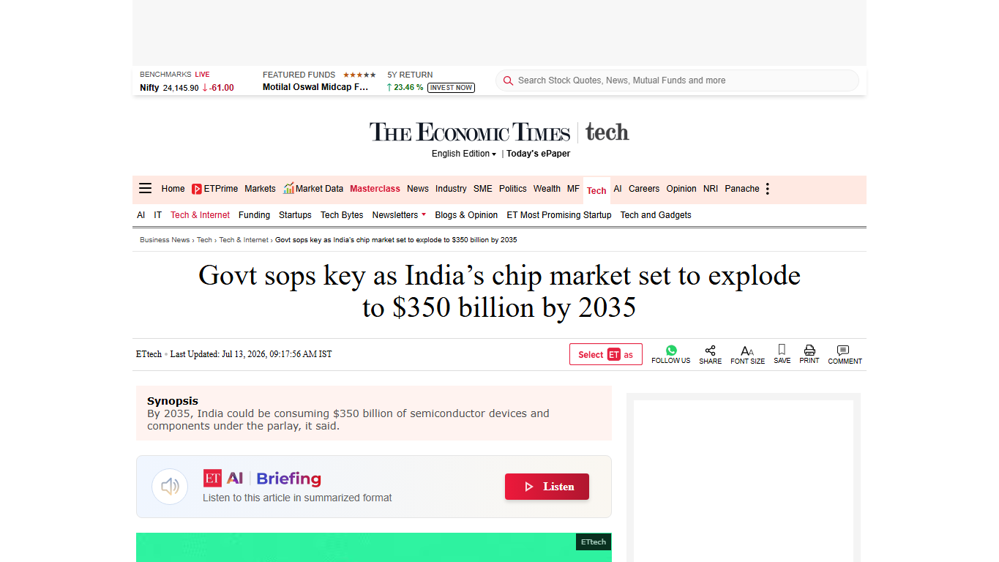

# Daily Semiconductor Current Affairs

Date: 2026-07-13

Research window: July 13 India evening catch-up, covering official TSMC June revenue, India semiconductor-demand reporting, materials/geopolitics risk from the last 72 hours, and SK hynix U.S. trading mechanics after its Nasdaq debut.

## Quick Index

| Date | Major Topic | Source Groups | Why To Read |
|---|---|---|---|
| 2026-07-13 | TSMC June 2026 revenue | TSMC press release and investor monthly-revenue table | Closes the delayed foundry-demand checkpoint from July 10 and sets context before TSMC Q2 results. |
| 2026-07-13 | India chip-consumption forecast | Economic Times / Fab Economics reporting | Separates Indian demand opportunity from domestic manufacturing capability. |
| 2026-07-13 | Helium and specialty-gas risk | AP News reporting | Shows why fabs depend on upstream materials and geopolitical logistics, not only chips and tools. |
| 2026-07-13 | SK hynix trading transition | Nasdaq Trader, Business Insider, FT reporting | Separates capital-market mechanics from actual HBM manufacturing capacity. |
| 2026-07-13 | ASML and TSMC earnings watch | ASML and TSMC official investor pages | Prepares the July 15-16 equipment/foundry evidence window. |

**Page navigation:** [Sources](#source-map) · [Concept review](#concept-review) · [Follow-up](#what-to-watch-next) · [Technical terms](#technical-terms-used-today) · [Master glossary](../knowledge-base/glossary.md)

## Source Images And Manifest

Source manifest: [../images/2026-07-13/links.md](../images/2026-07-13/links.md)



This screenshot is embedded before the India-demand discussion because it preserves the headline, source identity, publication date, and topic. TSMC and several market sources were text-verified, but screenshot capture returned security or access pages, so they are listed as text-only sources in the manifest.

## Source Map

| Source | Source date | Role | Confidence / limitation |
|---|---:|---|---|
| [TSMC June 2026 Revenue Report](https://pr.tsmc.com/english/news/3323) | 2026-07-13 | Primary source for June revenue, month-over-month growth, year-over-year growth, and first-half revenue | Strong official source; screenshot capture returned security verification. |
| [TSMC 2026 monthly revenue table](https://investor.tsmc.com/english/monthly-revenue/2026) | 2026-07-13 | Primary investor table cross-check for the June figure | Strong official source; screenshot capture returned security verification. |
| [Economic Times: India chip market forecast](https://economictimes.indiatimes.com/tech/technology/govt-sops-key-as-indias-chip-market-set-to-explode-to-350-billion-by-2035/articleshow/132355783.cms?from=mdr) | 2026-07-13 | India demand forecast and incentive-dependence reporting | Reputable reporting; forecast is not an official target and should not be treated as guaranteed production. |
| [AP News: China halts helium exports](https://apnews.com/article/china-helium-export-iran-war-chips-346d8806f8ba410d81de6ced150acb87) | 2026-07-10 | Materials and geopolitics risk in the 72-hour window | Reputable reporting; screenshot blocked by privacy overlay. |
| [Nasdaq Trader notice #2026-11](https://www.nasdaqtrader.com/TraderNews.aspx?id=DTN2026-11) | 2026-07-10 / active 2026-07-13 | Exchange mechanics for `SKHYV` to `SKHY` transition | Strong exchange operations source. |
| [Business Insider: SK hynix market reaction](https://www.businessinsider.com/sk-hynix-stock-kospi-price-skhy-adr-samsung-korea-markets-2026-7) | 2026-07-13 | Reported Korea-share correction and ADR/local-share premium context | Secondary market reporting; use as market signal, not manufacturing evidence. |
| [Financial Times: won and SK hynix listing flows](https://www.ft.com/content/b433644d-caba-4962-8d60-f46fcd9716f9) | 2026-07-13 | Reported currency-flow angle after SK hynix listing | Paywalled; use only the accessible headline/snippet context. |
| [ASML Q2 2026 results page](https://www.asml.com/en/investors/financial-results/q2-2026) | Checked 2026-07-13 | Upcoming equipment checkpoint | Official page, full result still pending on this date. |
| [TSMC Q2 2026 results page](https://investor.tsmc.com/english/quarterly-results/2026/q2) | Checked 2026-07-13 | Upcoming foundry checkpoint | Official page, Q2 call still pending on this date. |

## Verification Matrix

| Item | Confirmed facts | Analysis boundary | Follow-up |
|---|---|---|---|
| TSMC June revenue | Official June revenue was about NT$442.68 billion, up 6.2% from May and 67.9% from June 2025; January-June revenue was about NT$2,404.48 billion, up 35.6% year over year. | The release proves revenue momentum; it does not reveal margin, customer mix, CoWoS availability, or capex. | Closed July 10 monthly-sales delay; watch July 16 Q2 call. |
| India demand forecast | ET reported Fab Economics expects India semiconductor device/component consumption to grow from USD 54 billion in 2026 to USD 130 billion by 2030 and USD 350 billion by 2035 if incentives continue. | Consumption forecast is not the same as domestic fabrication output. | Watch final Semicon 2.0 policy text and project-level implementation. |
| Helium risk | AP reported China halted helium exports amid Iran-war supply pressure and domestic supply concerns. | The specific impact on each fab is not quantified in the report. | Watch specialty-gas prices, fab contingency plans, and export restrictions. |
| SK hynix trading mechanics | Nasdaq Trader showed temporary `SKHYV` trading and regular-way `SKHY` effective July 13, with settlement expected July 14. | Price swings and currency flows do not immediately increase HBM output. | Watch offering close, proceeds deployment, and HBM capacity evidence. |

## 1. TSMC June Revenue: Foundry Demand Stayed Strong Before Q2 Earnings

TSMC officially reported June 2026 revenue of about NT$442.68 billion, up 6.2% from May and 67.9% from June 2025. First-half 2026 revenue reached about NT$2,404.48 billion, up 35.6% from the same period in 2025.
Term: Monthly revenue
Definition: Monthly revenue is a company disclosure showing sales recognized in one month before the full quarterly earnings package is published. It solves the timing problem for investors and supply-chain watchers: they can see demand direction earlier than quarterly margins, capex, and product-mix detail. In today's news, TSMC's June figure matters because it closes the delayed July 10 sales checkpoint and confirms strong foundry demand before the July 16 earnings call. Source: https://pr.tsmc.com/english/news/3323

Term: Consolidated net revenue
Definition: Consolidated net revenue is revenue from the whole company group after combining subsidiaries and removing internal transactions. It solves the accounting problem of showing the economic revenue of the business as one entity instead of double-counting intercompany sales. In today's news, it matters because TSMC reports consolidated monthly revenue, giving a group-level demand signal rather than a narrow single-site number. Source: https://pr.tsmc.com/english/news/3323

Term: Foundry
Definition: A foundry manufactures chips for customers that design chips but do not own or use their own high-volume manufacturing fabs. It solves the capital-intensity problem for fabless chip companies: they can focus on design while the foundry supplies process technology, capacity, yield learning, and manufacturing execution. In today's news, TSMC's revenue is a foundry signal because it reflects demand from AI accelerator, smartphone, HPC, automotive, and networking customers that buy wafer manufacturing services. Source: https://www.semi.org/en/resources/semiconductor101

Term: Year-over-year growth
Definition: Year-over-year growth compares a metric with the same period one year earlier. It solves the seasonality problem: June compared with June is cleaner than June compared with December for businesses with calendar effects. In today's news, TSMC's 67.9% June year-over-year increase shows how much stronger demand was than the same month in 2025, but it still needs the Q2 call to explain margin and customer mix. Source: https://pr.tsmc.com/english/news/3323

### Confirmed facts

- June revenue: about NT$442.68 billion.
- Month-over-month growth: 6.2%.
- Year-over-year growth: 67.9%.
- January-June revenue: about NT$2,404.48 billion.
- First-half year-over-year growth: 35.6%.

### Why it matters

The June figure is a high-quality demand pulse, not a complete business diagnosis. TSMC monthly revenue tells you that customers are buying wafers and that advanced-node demand is likely strong, but it does not reveal gross margin, pricing, capex timing, or whether advanced packaging is still the bottleneck. For VLSI learning, the key distinction is:

```text
monthly revenue = demand pulse
quarterly earnings = demand + margin + capex + node mix + management guidance
```

Simple explanation: the July 13 data says TSMC had a very strong June. The July 16 call is still needed to know what kind of chips drove it and whether the company must spend more on fabs and packaging.

## 2. India Forecast: USD 350 Billion Consumption Is Demand, Not Yet Production

Economic Times reported a Fab Economics forecast that India could consume USD 350 billion of semiconductor devices and components by 2035 if incentives and subsidies continue. The report said current 2026 consumption is about USD 54 billion and could reach USD 130 billion by 2030.
Term: Semiconductor consumption market
Definition: A semiconductor consumption market measures the value of chips and semiconductor-containing components used by a country or region, regardless of where those chips were designed, fabricated, packaged, or tested. It solves the demand-sizing problem: policymakers and investors can estimate how large the local electronics pull could become. In today's news, it matters because India's USD 350 billion forecast is about demand absorption, not proof that India will manufacture that value domestically. Source: https://economictimes.indiatimes.com/tech/technology/govt-sops-key-as-indias-chip-market-set-to-explode-to-350-billion-by-2035/articleshow/132355783.cms?from=mdr

Term: Import dependence
Definition: Import dependence is the share of inputs, equipment, materials, components, or finished goods that must be bought from abroad. It solves a policy measurement problem: a country can see where local value addition is weak and where supply-chain risk is concentrated. In today's news, import dependence matters because even a fast-growing Indian chip market may still rely on imported tools, wafers, gases, chemicals, substrates, and finished chips unless domestic ecosystem depth improves. Source: https://ism.gov.in/

Term: Semiconductor subsidy
Definition: A semiconductor subsidy is public financial support, such as capex reimbursement, tax support, grants, infrastructure aid, or production-linked incentives, used to attract or deepen semiconductor activity. It solves the competitiveness problem created by very high fab, ATMP, material, and equipment costs. In today's news, subsidy continuity matters because the India forecast is explicitly conditional on ongoing government support. Source: https://ism.gov.in/

### Analysis

The forecast is valuable because electronics demand can justify local ecosystem investment. But a demand forecast should not be confused with capability. The domestic value chain must answer separate questions:

| Layer | What must be proven |
|---|---|
| Design | Indian companies own IP, tape out products, and win customers. |
| Front-end fabs | Qualified wafers ship with competitive yield, cost, and reliability. |
| ATMP / OSAT | Packaged parts pass electrical, thermal, reliability, and customer qualification. |
| Materials and tools | Gases, chemicals, wafers, substrates, and equipment support local production. |
| Workforce | Engineers can run EDA, verification, DFT, physical design, fab process, test, and packaging workflows. |

India angle: a USD 350 billion demand pool can attract fabs and OSATs, but the real current-affairs answer should be "demand creates incentive; supply-chain capability still has to be built."

## 3. Helium: Materials Can Become A Semiconductor Bottleneck

AP reported China halted helium exports amid Iran-war-related supply pressure and domestic supply concerns. Helium matters to semiconductors because fabs and tool ecosystems rely on ultra-clean gases, cryogenic cooling, controlled atmospheres, leak detection, and specialized process environments.
Term: Helium
Definition: Helium is an inert, extremely light gas used in high-technology supply chains for cooling, leak detection, controlled atmospheres, and some manufacturing support roles. It solves thermal and chemical-stability problems because it does not easily react and can support very cold or clean processes. In today's news, helium matters because a geopolitical supply squeeze can raise cost and risk for chipmaking even when wafer demand remains strong. Source: https://apnews.com/article/china-helium-export-iran-war-chips-346d8806f8ba410d81de6ced150acb87

Term: Specialty gas
Definition: A specialty gas is a high-purity industrial gas used for tightly controlled manufacturing steps or tool support, often with strict impurity, moisture, and particle limits. It solves the contamination problem in fabs: tiny impurities can ruin films, etches, plasmas, sensors, or process stability. In today's news, specialty-gas risk matters because chip supply chains are constrained by upstream materials as much as by headline processors. Source: https://www.semi.org/en/resources/semiconductor101

Term: Export ban
Definition: An export ban is a government restriction that prevents a product, material, or technology from being sold abroad. It solves a domestic-security or supply-protection objective for the exporting country, but it can transmit shortages to global customers. In today's news, the reported helium halt matters because it shows how geopolitics can affect fab inputs that are not chips themselves. Source: https://apnews.com/article/china-helium-export-iran-war-chips-346d8806f8ba410d81de6ced150acb87

Simple explanation: even if Nvidia, TSMC, Samsung, and SK hynix have demand, factories still need gases and chemicals. A missing upstream material can slow production just like a missing lithography tool.

## 4. SK hynix: Trading Mechanics Are Not The Same As HBM Output

Nasdaq Trader's July 10 notice showed SK hynix's temporary `SKHYV` trading phase and the regular-way `SKHY` transition effective July 13. Market reports on July 13 also described a sharp correction in Korean shares after listing euphoria and discussed ADR/local-share premium and currency-flow effects.
Term: American Depositary Receipt (ADR)
Definition: An American Depositary Receipt is a U.S.-traded receipt representing shares of a non-U.S. company through a depositary structure. It solves the market-access problem by letting U.S. investors trade foreign-company exposure through U.S. systems and often in U.S. dollars. In today's news, SK hynix's ADR improves investor access to the memory leader, but it does not by itself create more qualified HBM capacity. Source: https://www.investor.gov/introduction-investing/investing-basics/glossary/american-depositary-receipts-adrs

Term: Regular-way trading
Definition: Regular-way trading is the normal exchange-trading state where the security uses its ordinary ticker and standard settlement cycle. It solves the transition problem after temporary issuance or when-issued mechanics. In today's news, July 13 matters because SK hynix moves from the temporary `SKHYV` phase toward normal `SKHY` trading. Source: https://www.nasdaqtrader.com/TraderNews.aspx?id=DTN2026-11

Term: Valuation premium
Definition: A valuation premium is the extra price investors pay for one security relative to another comparable claim on the same or similar business. It solves a market-pricing comparison question: are investors paying more because of liquidity, access, momentum, scarcity, or expectations? In today's news, any ADR/local-share premium must be read as a capital-market signal, not as direct evidence of stronger memory output. Source: https://www.businessinsider.com/sk-hynix-stock-kospi-price-skhy-adr-samsung-korea-markets-2026-7

Term: High-Bandwidth Memory (HBM)
Definition: HBM is stacked DRAM connected through dense package-level interconnects so an AI accelerator can access memory at very high bandwidth with lower energy per bit than many conventional memory arrangements. It solves the AI memory-wall problem: compute units stall if model data cannot move fast enough. In today's news, SK hynix's listing matters because HBM demand supports investor interest, but output still depends on DRAM wafers, stacking, bonding, packaging yield, and customer qualification. Source: https://www.jedec.org/standards-documents/focus/memory-interfaces

## Follow-Up Ledger

| Earlier item | July 13 status | Evidence / next check |
|---|---|---|
| TSMC June monthly sales | Closed | Official June revenue released July 13. |
| TSMC Q2 results | Still pending | Q2 release and call due July 16. |
| ASML Q2 results | Still pending | Q2 release due July 15. |
| SK hynix U.S. listing | Updated, still active | Regular-way trading begins July 13; settlement/offering close expected July 14. |
| SK hynix manufacturing impact | Still pending | Need capex deployment, tool delivery, HBM packaging/yield, and customer qualification. |
| India Semicon 2.0 | Still pending official final page on this date | Watch ISM/MeitY for scheme notification and details. |
| Specialty gases | New active watch | Track whether helium export restrictions affect fab inputs, prices, or contingency sourcing. |

## Concept Review

| Concept | Key distinction | Why it matters |
|---|---|---|
| Revenue pulse vs earnings detail | Monthly revenue shows sales; quarterly results show margins, node mix, capex, and guidance. | Prevents over-reading TSMC's June release. |
| Consumption vs production | Consumption measures demand; production measures local manufacturing value. | India's USD 350 billion forecast is not a domestic-output guarantee. |
| Materials vs chips | Fabs need gases, chemicals, wafers, tools, and packaging inputs. | Helium shows hidden supply-chain risk. |
| ADR access vs capacity | ADRs improve trading access; fabs and packaging create chips. | SK hynix valuation does not equal HBM supply. |

## Interview Questions

1. Why is TSMC monthly revenue useful but incomplete?
2. What is the difference between month-over-month and year-over-year growth?
3. Why does India's semiconductor consumption forecast not equal domestic semiconductor production?
4. Why can helium or specialty gases become chipmaking bottlenecks?
5. What is an ADR, and why does it not directly increase HBM supply?
6. How would you separate a memory-stock market signal from manufacturing evidence?
7. What follow-up data would you want from TSMC's Q2 call after this June revenue report?

## What To Watch Next

1. July 15: ASML Q2 results, order intake, EUV/DUV capacity, and export-control comments.
2. July 16: TSMC Q2 results, 2 nm ramp, advanced-node revenue mix, margins, capex, and AI/HPC demand.
3. July 14-16: SK hynix settlement/offering close and whether trading premiums normalize.
4. India: official Semicon 2.0 scheme details, not only demand forecasts.
5. Materials: helium and other specialty-gas availability under geopolitical stress.

## Final Takeaway

July 13 is a demand-and-risk checkpoint. TSMC confirmed strong foundry revenue, India demand projections stayed large, and the SK hynix listing continued to show intense investor interest in AI memory. The deeper lesson is discipline: revenue is not margin, consumption is not production, and market access is not manufacturing output.

## Technical Terms Used Today

[Back to quick index](#quick-index) · [Open the master A-Z glossary](../knowledge-base/glossary.md)

**Term index:** [American Depositary Receipt (ADR)](#daily-term-american-depositary-receipt-adr) · [Consolidated net revenue](#daily-term-consolidated-net-revenue) · [Export ban](#daily-term-export-ban) · [Foundry](#daily-term-foundry) · [Helium](#daily-term-helium) · [High-Bandwidth Memory (HBM)](#daily-term-high-bandwidth-memory-hbm) · [Import dependence](#daily-term-import-dependence) · [Monthly revenue](#daily-term-monthly-revenue) · [Regular-way trading](#daily-term-regular-way-trading) · [Semiconductor consumption market](#daily-term-semiconductor-consumption-market) · [Semiconductor subsidy](#daily-term-semiconductor-subsidy) · [Specialty gas](#daily-term-specialty-gas) · [Valuation premium](#daily-term-valuation-premium) · [Year-over-year growth](#daily-term-year-over-year-growth)

| Term | Meaning |
|---|---|
| <a id="daily-term-american-depositary-receipt-adr"></a>[**American Depositary Receipt (ADR)**](../knowledge-base/glossary.md#term-american-depositary-receipt-adr) | An American Depositary Receipt is a U.S.-traded receipt representing shares of a non-U.S. company through a depositary structure. It solves the market-access problem by letting U.S. investors trade foreign-company exposure through U.S. systems and often in U.S. dollars. |
| <a id="daily-term-consolidated-net-revenue"></a>[**Consolidated net revenue**](../knowledge-base/glossary.md#term-consolidated-net-revenue) | Consolidated net revenue is revenue from the whole company group after combining subsidiaries and removing internal transactions. It solves the accounting problem of showing the economic revenue of the business as one entity instead of double-counting intercompany sales. |
| <a id="daily-term-export-ban"></a>[**Export ban**](../knowledge-base/glossary.md#term-export-ban) | An export ban is a government restriction that prevents a product, material, or technology from being sold abroad. It solves a domestic-security or supply-protection objective for the exporting country, but it can transmit shortages to global customers. |
| <a id="daily-term-foundry"></a>[**Foundry**](../knowledge-base/glossary.md#term-foundry) | A foundry manufactures chips for customers that design chips but do not own or use their own high-volume manufacturing fabs. It solves the capital-intensity problem for fabless chip companies: they can focus on design while the foundry supplies process technology, capacity, yield learning, and manufacturing execution. |
| <a id="daily-term-helium"></a>[**Helium**](../knowledge-base/glossary.md#term-helium) | Helium is an inert, extremely light gas used in high-technology supply chains for cooling, leak detection, controlled atmospheres, and some manufacturing support roles. It solves thermal and chemical-stability problems because it does not easily react and can support very cold or clean processes. |
| <a id="daily-term-high-bandwidth-memory-hbm"></a>[**High-Bandwidth Memory (HBM)**](../knowledge-base/glossary.md#term-high-bandwidth-memory-hbm) | HBM is stacked DRAM connected through dense package-level interconnects so an AI accelerator can access memory at very high bandwidth with lower energy per bit than many conventional memory arrangements. It solves the AI memory-wall problem: compute units stall if model data cannot move fast enough. |
| <a id="daily-term-import-dependence"></a>[**Import dependence**](../knowledge-base/glossary.md#term-import-dependence) | Import dependence is the share of inputs, equipment, materials, components, or finished goods that must be bought from abroad. It solves a policy measurement problem: a country can see where local value addition is weak and where supply-chain risk is concentrated. |
| <a id="daily-term-monthly-revenue"></a>[**Monthly revenue**](../knowledge-base/glossary.md#term-monthly-revenue) | Monthly revenue is a company disclosure showing sales recognized in one month before the full quarterly earnings package is published. It solves the timing problem for investors and supply-chain watchers: they can see demand direction earlier than quarterly margins, capex, and product-mix detail. |
| <a id="daily-term-regular-way-trading"></a>[**Regular-way trading**](../knowledge-base/glossary.md#term-regular-way-trading) | Regular-way trading is the normal exchange-trading state where the security uses its ordinary ticker and standard settlement cycle. It solves the transition problem after temporary issuance or when-issued mechanics. |
| <a id="daily-term-semiconductor-consumption-market"></a>[**Semiconductor consumption market**](../knowledge-base/glossary.md#term-semiconductor-consumption-market) | A semiconductor consumption market measures the value of chips and semiconductor-containing components used by a country or region, regardless of where those chips were designed, fabricated, packaged, or tested. It solves the demand-sizing problem: policymakers and investors can estimate how large the local electronics pull could become. |
| <a id="daily-term-semiconductor-subsidy"></a>[**Semiconductor subsidy**](../knowledge-base/glossary.md#term-semiconductor-subsidy) | A semiconductor subsidy is public financial support, such as capex reimbursement, tax support, grants, infrastructure aid, or production-linked incentives, used to attract or deepen semiconductor activity. It solves the competitiveness problem created by very high fab, ATMP, material, and equipment costs. |
| <a id="daily-term-specialty-gas"></a>[**Specialty gas**](../knowledge-base/glossary.md#term-specialty-gas) | A specialty gas is a high-purity industrial gas used for tightly controlled manufacturing steps or tool support, often with strict impurity, moisture, and particle limits. It solves the contamination problem in fabs: tiny impurities can ruin films, etches, plasmas, sensors, or process stability. |
| <a id="daily-term-valuation-premium"></a>[**Valuation premium**](../knowledge-base/glossary.md#term-valuation-premium) | A valuation premium is the extra price investors pay for one security relative to another comparable claim on the same or similar business. It solves a market-pricing comparison question: are investors paying more because of liquidity, access, momentum, scarcity, or expectations? |
| <a id="daily-term-year-over-year-growth"></a>[**Year-over-year growth**](../knowledge-base/glossary.md#term-year-over-year-growth) | Year-over-year growth compares a metric with the same period one year earlier. It solves the seasonality problem: June compared with June is cleaner than June compared with December for businesses with calendar effects. |

This page-end index covers the specialist terms central to this day's study. The fuller explanation, news context, and source remain at first use; the master glossary combines repeated terms across all days.
