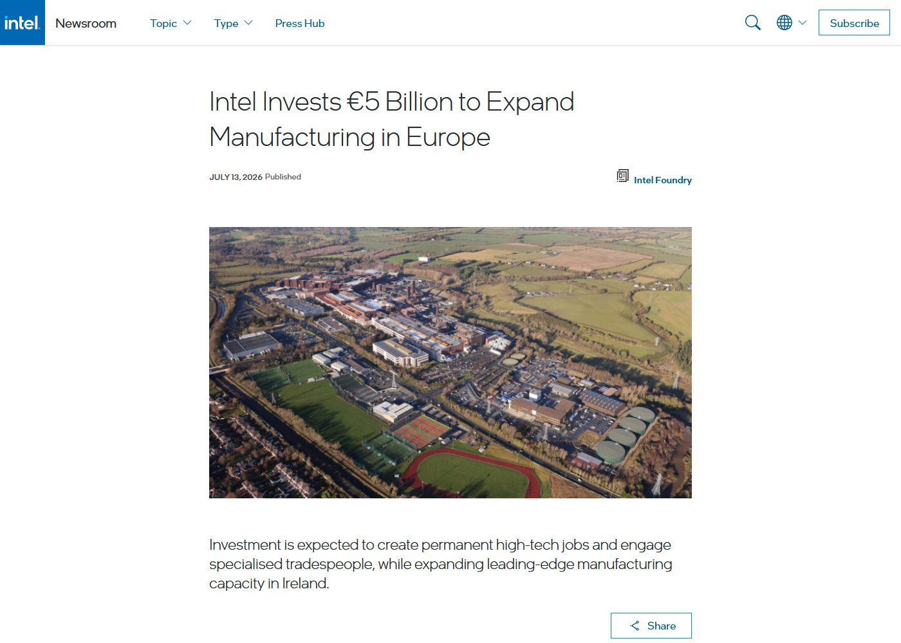

# Daily Semiconductor Current Affairs

Date: 2026-07-14

Research window: July 14 catch-up note using July 13-14 verified items. Exact-date official semiconductor releases were limited, so this page labels nearby-window items clearly and focuses on manufacturing capacity, India AI-infrastructure cooling, export-control compliance, and China IC export-value interpretation.

## Quick Index

| Date | Major Topic | Source Groups | Why To Read |
|---|---|---|---|
| 2026-07-14 | Intel Ireland EUR 5 billion expansion | Intel Newsroom | Shows how AI/HPC demand becomes tool installation, cleanroom utilization, and European supply-chain policy. |
| 2026-07-14 | Submer India / Madhya Pradesh data-center cooling investment | Times of India reporting | Connects AI data-center growth to liquid cooling, power, and semiconductor demand. |
| 2026-07-14 | Nvidia authorized-buyer tightening | Tom's Hardware citing FT reporting | Shows export controls moving from legal text to customer verification and channel enforcement. |
| 2026-07-14 | China IC export value surge | Tom's Hardware citing China customs / SCMP reporting | Teaches why export value can rise because prices rise, not because advanced domestic chip capability suddenly changed. |

**Page navigation:** [Sources](#source-map) · [Concept review](#concept-review) · [Follow-up](#what-to-watch-next) · [Technical terms](#technical-terms-used-today) · [Master glossary](../knowledge-base/glossary.md)

## Source Images And Manifest

Source manifest: [../images/2026-07-14/links.md](../images/2026-07-14/links.md)



This Intel screenshot is embedded before the manufacturing discussion because it shows the official source, title, publication date, and Leixlip site context.


This Times of India screenshot is embedded before the India AI-infrastructure discussion because it preserves the headline, date, source identity, and opening context.

## Source Map

| Source | Source date | Role | Confidence / limitation |
|---|---:|---|---|
| [Intel: EUR 5 billion to expand manufacturing in Europe](https://newsroom.intel.com/intel-foundry/intel-invests-5-billion-euro-to-expand-manufacturing-in-europe) | 2026-07-13 | Primary source for Intel Leixlip capacity, Intel 3, Xeon, cleanroom/tool upgrades, and Europe supply-chain framing | Strong official source; used in July 14 catch-up window. |
| [Times of India: Submer USD 2 billion MP semiconductor/data-center investment](https://timesofindia.indiatimes.com/business/india-business/spains-submer-to-invest-2-billion-in-madhya-pradesh-semiconductor-sector-may-create-5000-jobs/articleshow/132362019.cms) | 2026-07-13 | India data-center cooling and semiconductor-adjacent investment report | Reputable reporting; state/project details still need company and government primary documents. |
| [Tom's Hardware: Nvidia authorized-buyer list report](https://www.tomshardware.com/tech-industry/big-tech/nvidia-slashes-list-of-authorized-customers-in-asia-in-a-bid-to-reduce-ai-chip-smuggling-report-claims-company-sent-field-inspectors-called-customers-to-check-if-business-is-genuine-after-pressure-from-washington) | 2026-07-14 | Secondary accessible report of FT-sourced Nvidia Asia customer-compliance tightening | Reported, not directly confirmed by Nvidia in this source. |
| [Tom's Hardware: China IC export value](https://www.tomshardware.com/tech-industry/china-claims-chip-exports-nearly-doubled-to-177-billion-in-the-first-half-of-2026) | 2026-07-14 | Accessible analysis of China IC export-value surge citing customs/SCMP | Secondary report; useful for value-vs-volume interpretation. |
| [SEMI Semiconductor 101](https://www.semi.org/en/resources/semiconductor101) | Reference | Manufacturing and supply-chain term support | Industry-association explainer. |

## Verification Matrix

| Item | Confirmed / reported | Analysis boundary | Follow-up |
|---|---|---|---|
| Intel Ireland expansion | Intel officially announced a EUR 5 billion Leixlip investment tied to Intel 3, Xeon 6, next-gen Xeon, tool upgrades, and cleanroom use. | The release is forward-looking; actual output depends on tool delivery, process ramp, yield, and product demand. | Watch Intel Foundry customer evidence and Intel 3 volume execution. |
| Submer MP investment | TOI reported a USD 2 billion announcement and nearly 5,000 direct job opportunities tied to MP Tech Growth Conclave. | Report is semiconductor-adjacent: liquid cooling and data centers support AI infrastructure, not wafer fabrication. | Watch official Submer/MP documents, land allotment, build timeline, customer/OEM agreements. |
| Nvidia compliance tightening | Tom's Hardware reported, citing FT, that Nvidia cut authorized Asia customers by more than half and increased verification. | Treat as reported compliance action, not an Nvidia press release. | Watch BIS/export-control actions and Nvidia statements. |
| China IC exports | Report said China exported 179.44 billion ICs worth USD 177.28 billion in H1 2026, with value up sharply. | Value growth can be price-driven; it does not prove leading-edge self-sufficiency. | Compare volume, average selling price, product mix, and processing-trade share. |

## 1. Intel Leixlip: AI Demand Becomes Tools, Cleanrooms, And Track Systems

Intel announced a EUR 5 billion capital investment at its Leixlip campus in Ireland. Intel says the investment expands capacity for Intel Xeon 6 and next-generation Xeon processors built on Intel 3, upgrades existing fabrication facilities, installs leading-edge manufacturing equipment, and expands automated track systems across campus modules.
Term: Leading-edge manufacturing capacity
Definition: Leading-edge manufacturing capacity is qualified wafer-processing capability on advanced process technologies used for high-performance logic, AI, and data-center chips. It solves the supply problem for products that need dense transistors, high performance per watt, and tight process control. In today's news, Intel's Leixlip investment matters because AI and HPC demand is being converted into tool installs, cleanroom use, and Intel 3 output plans in Europe. Source: https://newsroom.intel.com/intel-foundry/intel-invests-5-billion-euro-to-expand-manufacturing-in-europe

Term: Intel 3
Definition: Intel 3 is an Intel process technology generation used for high-performance products such as server processors, building on Intel's recent process roadmap. It solves a product-performance and manufacturing-competitiveness problem for Intel: Xeon products need a process that can deliver density, power, performance, and yield at volume. In today's news, Intel 3 matters because the Leixlip investment is tied directly to Xeon 6 and next-generation Xeon output. Source: https://newsroom.intel.com/intel-foundry/intel-invests-5-billion-euro-to-expand-manufacturing-in-europe

Term: Cleanroom
Definition: A cleanroom is a highly controlled manufacturing space where airborne particles, humidity, temperature, vibration, chemical contamination, and human procedures are tightly managed. It solves the contamination problem in semiconductor fabrication: a microscopic particle can destroy a transistor layer or create yield loss. In today's news, existing cleanroom utilization matters because Intel can expand output faster by upgrading and equipping qualified space than by only building new empty shells. Source: https://www.semi.org/en/resources/semiconductor101

Term: Automated material handling system
Definition: An automated material handling system moves wafer carriers between tools, bays, storage buffers, and process modules using controlled tracks, vehicles, and scheduling software. It solves the cycle-time and contamination problem: wafers must move quickly and safely without manual handling errors. In today's news, Intel's automated track expansion matters because high-volume fabs are logistics systems as much as process-tool collections. Source: https://www.semi.org/en/resources/semiconductor101

### Why it matters

Intel's announcement is an execution story, not just a headline capex number. For advanced manufacturing, the chain is:

```text
capital approved -> tools ordered -> cleanroom prepared -> tools installed
-> process qualified -> product ramped -> yield stabilized -> customer shipments
```

Europe angle: the release explicitly links Ireland to EU technology-sovereignty ambitions. That means the same investment has two readings: commercial AI/HPC demand and policy-driven regional supply resilience.

VLSI career relevance: Intel 3 and Xeon output rely on process integration, device engineering, DFM, yield analysis, DFT, validation, thermal design, and server platform qualification. A VLSI engineer should ask what product, node, yield, and volume evidence follows the capex announcement.

## 2. Submer In Madhya Pradesh: AI Data Centers Pull Cooling, Power, And Chips

Times of India reported that Spain's Submer Group announced a USD 2 billion investment connected to Madhya Pradesh's semiconductor/data-center ecosystem, with nearly 5,000 direct job opportunities expected. The report emphasized advanced liquid cooling for high-density data centers and India's lack of legacy infrastructure as a chance to build more efficient facilities.
Term: Liquid cooling
Definition: Liquid cooling removes heat from servers, accelerators, or data-center racks using liquid loops, cold plates, immersion tanks, heat exchangers, or related thermal systems. It solves the thermal-density problem: AI accelerators can produce too much heat for air cooling alone at high rack power. In today's news, liquid cooling matters because AI chip demand creates a parallel need for data-center infrastructure that can feed and cool those chips reliably. Source: https://timesofindia.indiatimes.com/business/india-business/spains-submer-to-invest-2-billion-in-madhya-pradesh-semiconductor-sector-may-create-5000-jobs/articleshow/132362019.cms

Term: AI data center
Definition: An AI data center is a facility optimized for training or serving AI models using accelerators, high-bandwidth memory, fast networking, dense power delivery, cooling, storage, and orchestration software. It solves the compute-scale problem: AI models need many chips working together under tight power, thermal, and networking constraints. In today's news, MP's reported Submer investment matters because semiconductor demand is increasingly tied to data-center power and cooling infrastructure. Source: https://timesofindia.indiatimes.com/business/india-business/spains-submer-to-invest-2-billion-in-madhya-pradesh-semiconductor-sector-may-create-5000-jobs/articleshow/132362019.cms

Term: OEM and ODM
Definition: An OEM sells branded equipment or systems, while an ODM designs and manufactures products that may be sold under another company's brand. This solves the scaling problem in hardware ecosystems: specialized suppliers can integrate cooling, server, and rack designs into repeatable products. In today's news, Submer's stated OEM/ODM partnership direction matters because liquid-cooling adoption depends on server makers, rack integrators, chip vendors, and operators working together. Source: https://timesofindia.indiatimes.com/business/india-business/spains-submer-to-invest-2-billion-in-madhya-pradesh-semiconductor-sector-may-create-5000-jobs/articleshow/132362019.cms

India angle: this is semiconductor-adjacent but still important. It is not a fab announcement. It is infrastructure around AI compute, and AI compute is one of the biggest drivers of advanced-node foundry, HBM, networking, power semiconductors, and packaging demand.

## 3. Nvidia Compliance: Export Controls Move Into Customer Verification

Tom's Hardware reported, citing Financial Times, that Nvidia cut its authorized Asia customer list by more than half and tightened verification steps such as site visits, contract checks, and end-user interviews to reduce AI-chip diversion into China.
Term: Export-control compliance
Definition: Export-control compliance is the operational system a company uses to obey restrictions on where controlled goods, software, technology, or services can go. It solves the legal and national-security risk that restricted chips or tools are diverted through intermediaries. In today's news, compliance matters because AI accelerator controls are no longer only about rule text; they require customer vetting, documentation, and channel enforcement. Source: https://www.tomshardware.com/tech-industry/big-tech/nvidia-slashes-list-of-authorized-customers-in-asia-in-a-bid-to-reduce-ai-chip-smuggling-report-claims-company-sent-field-inspectors-called-customers-to-check-if-business-is-genuine-after-pressure-from-washington

Term: End-user verification
Definition: End-user verification checks who will actually receive and use a controlled product, not merely who placed the purchase order. It solves the shell-company and diversion problem: a listed buyer may be a front for a restricted destination. In today's news, reported site inspections and interviews matter because AI servers can be routed through regional buyers unless suppliers and regulators verify the real user. Source: https://www.tomshardware.com/tech-industry/big-tech/nvidia-slashes-list-of-authorized-customers-in-asia-in-a-bid-to-reduce-ai-chip-smuggling-report-claims-company-sent-field-inspectors-called-customers-to-check-if-business-is-genuine-after-pressure-from-washington

Term: Authorized customer list
Definition: An authorized customer list is a supplier-controlled roster of buyers allowed to purchase certain products after checks on identity, business purpose, compliance risk, and sometimes end use. It solves the channel-control problem when products are scarce, regulated, or strategically sensitive. In today's news, a narrower Nvidia buyer list would mean legal access becomes more selective even if demand remains high. Source: https://www.tomshardware.com/tech-industry/big-tech/nvidia-slashes-list-of-authorized-customers-in-asia-in-a-bid-to-reduce-ai-chip-smuggling-report-claims-company-sent-field-inspectors-called-customers-to-check-if-business-is-genuine-after-pressure-from-washington

Policy lesson: export controls are not self-executing. They require distributors, cloud operators, OEMs, customs authorities, banks, and end customers to leave a verifiable paper trail.

## 4. China IC Exports: Value Growth Can Hide Product-Mix Reality

Tom's Hardware reported that China exported 179.44 billion integrated circuits worth USD 177.28 billion in the first half of 2026, with export value up sharply. The article's key interpretation is that a large part of the increase can come from higher prices, especially memory, rather than a sudden leap in advanced processor capability.
Term: Integrated circuit export value
Definition: Integrated circuit export value is the monetary value of ICs recorded as exported by customs, regardless of whether the chips were locally designed, locally fabricated, imported for packaging, or re-exported after processing. It solves a trade-accounting problem, but it can mislead if read as domestic leading-edge capability. In today's news, China's high IC export value matters because price inflation and processing trade can lift export dollars without proving a breakthrough in advanced AI chips. Source: https://www.tomshardware.com/tech-industry/china-claims-chip-exports-nearly-doubled-to-177-billion-in-the-first-half-of-2026

Term: Processing trade
Definition: Processing trade means imported inputs are processed, assembled, packaged, or tested in a country and then re-exported. It solves global manufacturing specialization, but it complicates origin analysis because exported value may include foreign-made inputs. In today's news, it matters because some Chinese IC exports may reflect packaging/test and re-export flows rather than fully domestic design and fabrication. Source: https://www.tomshardware.com/tech-industry/china-claims-chip-exports-nearly-doubled-to-177-billion-in-the-first-half-of-2026

Term: Average selling price
Definition: Average selling price is revenue divided by the relevant unit base, such as chips, wafers, bits, or modules. It solves the pricing question when volume and mix are changing. In today's news, ASP matters because export value can rise fast if memory prices rise, even when shipment volume grows much more slowly. Source: https://www.tomshardware.com/tech-industry/china-claims-chip-exports-nearly-doubled-to-177-billion-in-the-first-half-of-2026

Simple explanation: if a country exports the same number of chips but each chip sells for more, export value rises. That is not the same as shipping many more advanced AI processors.

## Follow-Up Ledger

| Earlier item | July 14 status | Evidence / next check |
|---|---|---|
| TSMC Q2 results | Still pending | Official call due July 16. |
| ASML Q2 results | Still pending | Official release due July 15. |
| SK hynix listing | Still active | Watch settlement/offering close and volatility after regular-way trading. |
| India Semicon 2.0 | Still pending official scheme page at this point | Watch ISM/MeitY. |
| India AI infrastructure | Updated | Submer/MP report adds cooling/data-center angle; need official project documents. |
| Export-control enforcement | Updated | Nvidia buyer-list report adds operational compliance angle; need primary confirmation/regulator follow-up. |

## Concept Review

| Concept | Key distinction | Why it matters |
|---|---|---|
| Capex announcement vs qualified capacity | Money and construction start the process; qualified output comes after tools, process control, yield, and customer qualification. | Intel Leixlip is important but forward-looking. |
| Data-center infrastructure vs semiconductor manufacturing | Cooling and power enable AI chip deployment; they are not wafer fabrication. | Submer is semiconductor-adjacent, not a fab. |
| Export-control rule vs compliance workflow | Laws define restrictions; companies implement screening and end-user checks. | Nvidia report shows enforcement moving into sales operations. |
| Export value vs capability | Export dollars can rise from price and processing trade. | China IC data must be read carefully. |

## Interview Questions

1. Why does Intel's Leixlip investment not automatically prove higher wafer output today?
2. What is the difference between cleanroom space and installed qualified capacity?
3. Why is liquid cooling part of the AI semiconductor story?
4. How can export controls fail if end users are not verified?
5. Why can IC export value rise faster than IC export volume?
6. What evidence would prove China is moving from mature-node exports to advanced AI-chip self-sufficiency?
7. How would you classify Submer's Madhya Pradesh investment in the semiconductor value chain?

## What To Watch Next

1. July 15: ASML Q2 results, EUV/DUV capacity expansion, and 2026 outlook.
2. July 15-17: ISM/MeitY Semicon 2.0 official details.
3. July 16: TSMC Q2 results, advanced-node mix, and 2 nm ramp.
4. Nvidia/export controls: primary statements from Nvidia, BIS, or customs authorities.
5. India MP/Submer: official MoU, land allotment, timeline, cooling-system manufacturing location, and OEM/ODM partners.

## Final Takeaway

July 14 is about infrastructure beneath the AI chip boom. Intel shows the fab/tool side, Submer shows the cooling/data-center side, Nvidia shows compliance channel control, and China export data shows why headline trade values need product-mix interpretation.

## Technical Terms Used Today

[Back to quick index](#quick-index) · [Open the master A-Z glossary](../knowledge-base/glossary.md)

**Term index:** [AI data center](#daily-term-ai-data-center) · [Authorized customer list](#daily-term-authorized-customer-list) · [Automated material handling system](#daily-term-automated-material-handling-system) · [Average selling price](#daily-term-average-selling-price) · [Cleanroom](#daily-term-cleanroom) · [End-user verification](#daily-term-end-user-verification) · [Export controls](#daily-term-export-controls) · [Integrated circuit export value](#daily-term-integrated-circuit-export-value) · [Intel 3](#daily-term-intel-3) · [Leading-edge manufacturing capacity](#daily-term-leading-edge-manufacturing-capacity) · [Liquid cooling](#daily-term-liquid-cooling) · [OEM and ODM](#daily-term-oem-and-odm) · [Processing trade](#daily-term-processing-trade)

| Term | Meaning |
|---|---|
| <a id="daily-term-ai-data-center"></a>[**AI data center**](../knowledge-base/glossary.md#term-ai-data-center) | An AI data center is a facility optimized for training or serving AI models using accelerators, high-bandwidth memory, fast networking, dense power delivery, cooling, storage, and orchestration software. It solves the compute-scale problem: AI models need many chips working together under tight power, thermal, and networking constraints. |
| <a id="daily-term-authorized-customer-list"></a>[**Authorized customer list**](../knowledge-base/glossary.md#term-authorized-customer-list) | An authorized customer list is a supplier-controlled roster of buyers allowed to purchase certain products after checks on identity, business purpose, compliance risk, and sometimes end use. It solves the channel-control problem when products are scarce, regulated, or strategically sensitive. |
| <a id="daily-term-automated-material-handling-system"></a>[**Automated material handling system**](../knowledge-base/glossary.md#term-automated-material-handling-system) | An automated material handling system moves wafer carriers between tools, bays, storage buffers, and process modules using controlled tracks, vehicles, and scheduling software. It solves the cycle-time and contamination problem: wafers must move quickly and safely without manual handling errors. |
| <a id="daily-term-average-selling-price"></a>[**Average selling price**](../knowledge-base/glossary.md#term-average-selling-price) | Average selling price is revenue divided by the relevant unit base, such as chips, wafers, bits, or modules. It solves the pricing question when volume and mix are changing. |
| <a id="daily-term-cleanroom"></a>[**Cleanroom**](../knowledge-base/glossary.md#term-cleanroom) | A cleanroom is a highly controlled manufacturing space where airborne particles, humidity, temperature, vibration, chemical contamination, and human procedures are tightly managed. It solves the contamination problem in semiconductor fabrication: a microscopic particle can destroy a transistor layer or create yield loss. |
| <a id="daily-term-end-user-verification"></a>[**End-user verification**](../knowledge-base/glossary.md#term-end-user-verification) | End-user verification checks who will actually receive and use a controlled product, not merely who placed the purchase order. It solves the shell-company and diversion problem: a listed buyer may be a front for a restricted destination. |
| <a id="daily-term-export-controls"></a>[**Export controls**](../knowledge-base/glossary.md#term-export-controls) | Export-control compliance is the operational system a company uses to obey restrictions on where controlled goods, software, technology, or services can go. It solves the legal and national-security risk that restricted chips or tools are diverted through intermediaries. |
| <a id="daily-term-integrated-circuit-export-value"></a>[**Integrated circuit export value**](../knowledge-base/glossary.md#term-integrated-circuit-export-value) | Integrated circuit export value is the monetary value of ICs recorded as exported by customs, regardless of whether the chips were locally designed, locally fabricated, imported for packaging, or re-exported after processing. It solves a trade-accounting problem, but it can mislead if read as domestic leading-edge capability. |
| <a id="daily-term-intel-3"></a>[**Intel 3**](../knowledge-base/glossary.md#term-intel-3) | Intel 3 is an Intel process technology generation used for high-performance products such as server processors, building on Intel's recent process roadmap. It solves a product-performance and manufacturing-competitiveness problem for Intel: Xeon products need a process that can deliver density, power, performance, and yield at volume. |
| <a id="daily-term-leading-edge-manufacturing-capacity"></a>[**Leading-edge manufacturing capacity**](../knowledge-base/glossary.md#term-leading-edge-manufacturing-capacity) | Leading-edge manufacturing capacity is qualified wafer-processing capability on advanced process technologies used for high-performance logic, AI, and data-center chips. It solves the supply problem for products that need dense transistors, high performance per watt, and tight process control. |
| <a id="daily-term-liquid-cooling"></a>[**Liquid cooling**](../knowledge-base/glossary.md#term-liquid-cooling) | Liquid cooling removes heat from servers, accelerators, or data-center racks using liquid loops, cold plates, immersion tanks, heat exchangers, or related thermal systems. It solves the thermal-density problem: AI accelerators can produce too much heat for air cooling alone at high rack power. |
| <a id="daily-term-oem-and-odm"></a>[**OEM and ODM**](../knowledge-base/glossary.md#term-oem-and-odm) | An OEM sells branded equipment or systems, while an ODM designs and manufactures products that may be sold under another company's brand. This solves the scaling problem in hardware ecosystems: specialized suppliers can integrate cooling, server, and rack designs into repeatable products. |
| <a id="daily-term-processing-trade"></a>[**Processing trade**](../knowledge-base/glossary.md#term-processing-trade) | Processing trade means imported inputs are processed, assembled, packaged, or tested in a country and then re-exported. It solves global manufacturing specialization, but it complicates origin analysis because exported value may include foreign-made inputs. |

This page-end index covers the specialist terms central to this day's study. The fuller explanation, news context, and source remain at first use; the master glossary combines repeated terms across all days.
