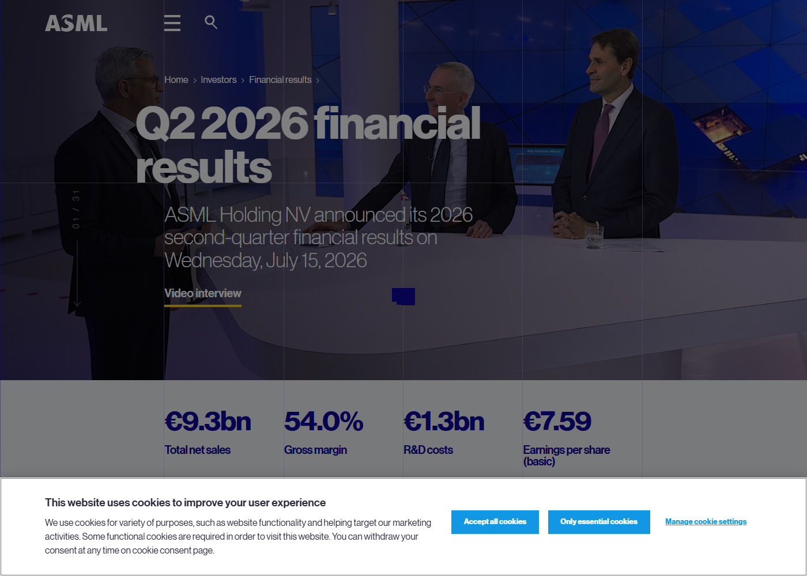
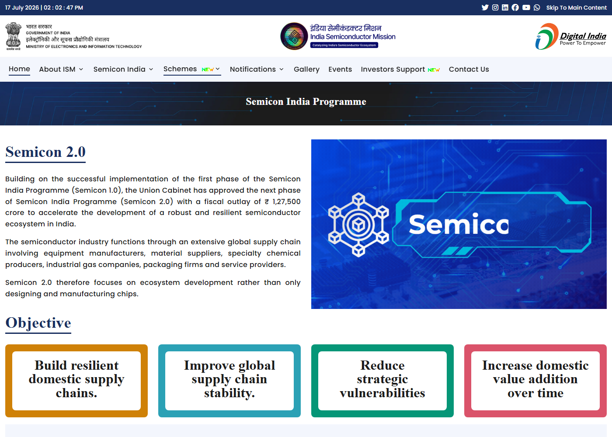

# Daily Semiconductor Current Affairs

Date: 2026-07-15

Research window: July 15 India evening, focused on official ASML Q2 results and India's official Semicon 2.0 page from India Semiconductor Mission. This date is a major equipment-and-policy checkpoint before TSMC's Q2 report.

## Quick Index

| Date | Major Topic | Source Groups | Why To Read |
|---|---|---|---|
| 2026-07-15 | ASML Q2 2026 results | ASML press release and investor results page | Equipment demand is the upstream signal for future AI, memory, and advanced-node capacity. |
| 2026-07-15 | ASML capacity-expansion plan | ASML CEO statement | Low-NA EUV and DUV immersion capacity plans show how tool bottlenecks may respond to AI demand. |
| 2026-07-15 | India Semicon 2.0 | India Semiconductor Mission official page | Officially confirms INR 1,27,500 crore outlay and six strategic pillars. |
| 2026-07-15 | VLSI learning relevance | ASML, ISM, SEMI references | Connects lithography economics, capex support, design IP, EDA tools, and talent development. |

**Page navigation:** [Sources](#source-map) · [Concept review](#concept-review) · [Follow-up](#what-to-watch-next) · [Technical terms](#technical-terms-used-today) · [Master glossary](../knowledge-base/glossary.md)

## Source Images And Manifest

Source manifest: [../images/2026-07-15/links.md](../images/2026-07-15/links.md)



This ASML screenshot is embedded before the equipment discussion because it captures the official page title, July 15 date, and headline financial metrics. A cookie banner is visible, but the source identity and result summary remain clear.



This ISM screenshot is embedded before the India policy discussion because it captures the official Semicon 2.0 page, outlay, ecosystem framing, and strategic objectives.

## Source Map

| Source | Source date | Role | Confidence / limitation |
|---|---:|---|---|
| [ASML Q2 2026 press release](https://www.asml.com/en/news/press-releases/2026/q2-2026-financial-results) | 2026-07-15 | Primary source for net sales, gross margin, net income, outlook, and capacity-expansion commentary | Strong official source. |
| [ASML Q2 2026 financial-results page](https://www.asml.com/en/investors/financial-results/q2-2026) | 2026-07-15 | Official investor result page and downloadable results package | Strong official source; screenshot saved. |
| [India Semiconductor Mission: Semicon 2.0](https://ism.gov.in/schemes/semicon2.0/index) | 2026-07-15 | Primary official source for Semicon 2.0 outlay, objectives, and six pillars | Strong official source; screenshot saved. |
| [ASML lithography principles](https://www.asml.com/en/technology/lithography-principles) | Reference | Technical support for lithography/EUV/DUV definitions | Primary equipment-supplier explainer. |
| [SEMI Semiconductor 101](https://www.semi.org/en/resources/semiconductor101) | Reference | Manufacturing ecosystem context | Industry-association explainer. |

## Verification Matrix

| Item | Confirmed facts | Analysis boundary | Follow-up |
|---|---|---|---|
| ASML Q2 result | ASML reported EUR 9.3 billion total net sales, 54.0% gross margin, EUR 2.9 billion net income, and EUR 7.59 basic EPS. | Strong result does not immediately equal installed wafer capacity at customers. | Watch backlog, order mix, shipment timing, and customer fab ramps. |
| ASML outlook | ASML expects Q3 sales of EUR 11.0-12.0 billion and 2026 sales of EUR 43-45 billion with 54%-56% gross margin. | Outlook is forward-looking and exposed to customer timing, export controls, and supply-chain execution. | Watch Q3 results and whether customers absorb tools on schedule. |
| ASML tool capacity | ASML said it plans to add 30% to 2026 low-NA EUV capacity of around 65 for 2027, and 30% to 2026 DUV immersion capacity of around 130 for 2027; it is also investigating another 30% for 2028. | Planned tool capacity is not the same as shipped, installed, qualified capacity. | Watch supplier capacity, modules, optics, stages, lasers, service teams, and customer site readiness. |
| Semicon 2.0 | ISM official page confirms INR 1,27,500 crore fiscal outlay and six pillars: design, machines/materials, more fabs, ATMP/OSAT, R&D, talent. | Policy page does not by itself prove project execution. | Watch notifications, eligibility, approvals, disbursements, and project milestones. |

## 1. ASML Q2: Equipment Demand Is Now A Confirmed Upstream AI Signal

ASML reported Q2 2026 total net sales of EUR 9.3 billion, gross margin of 54.0%, and net income of EUR 2.9 billion. It raised its 2026 outlook to EUR 43-45 billion in total net sales and 54%-56% gross margin.
Term: Total net sales
Definition: Total net sales are the revenue recognized from products and services after returns, discounts, and relevant deductions. It solves the business-measurement problem of showing how much commercial activity became recognized sales in the period. In today's news, ASML total net sales matter because lithography and installed-base revenue are upstream indicators of how aggressively chipmakers are preparing future capacity. Source: https://www.asml.com/en/news/press-releases/2026/q2-2026-financial-results

Term: Gross margin
Definition: Gross margin is gross profit divided by revenue, usually expressed as a percentage. It solves the profitability question at the product-and-service level before R&D, sales, administration, financing, and tax effects. In today's news, ASML's 54.0% gross margin matters because it shows pricing, product mix, service revenue, and manufacturing efficiency in a constrained tool market. Source: https://www.asml.com/en/news/press-releases/2026/q2-2026-financial-results

Term: Installed Base Management
Definition: Installed Base Management is ASML's revenue from service and field options for tools already installed at customer fabs. It solves the lifecycle problem: lithography tools need upgrades, maintenance, performance tuning, parts, and support after initial sale. In today's news, higher-than-expected Installed Base Management sales helped ASML beat guidance, showing that existing tools are being maintained and upgraded intensely, not just new tools ordered. Source: https://www.asml.com/en/news/press-releases/2026/q2-2026-financial-results

### Why this matters

ASML sits upstream from TSMC, Samsung, Intel, SK hynix, Micron, and many other chipmakers. When ASML sees stronger demand, it usually means customers are preparing capacity for future wafer output. The important caveat is time: a lithography order can take many quarters to become installed, qualified production.

```text
ASML order / shipment -> tool install -> process qualification
-> wafer starts -> yield ramp -> packaged chips -> customer systems
```

Term: Order intake
Definition: Order intake is the value of new customer orders booked in a period. It solves the forward-visibility problem for equipment suppliers because revenue shows what has shipped or been recognized, while orders point to future demand. In today's news, ASML said first-half order intake remained extremely strong, which supports the view that customers are still expanding for AI logic and memory. Source: https://www.asml.com/en/news/press-releases/2026/q2-2026-financial-results

## 2. Tool Capacity: Low-NA EUV And DUV Immersion Are Still Physical Bottlenecks

ASML said ongoing AI investments and AI-technology progress are driving demand for advanced logic and memory. Management said it plans to add 30% to its 2026 low-NA EUV capacity of around 65 for 2027 and is investigating another 30% for 2028. It also plans to add 30% to 2026 DUV immersion capacity of around 130 for 2027 and is investigating another 30% for 2028.
Term: Low-NA EUV
Definition: Low-NA EUV refers to current mainstream EUV lithography systems with a lower numerical aperture than newer High-NA EUV tools, using 13.5 nm light to pattern very small chip features. It solves the leading-edge patterning problem with fewer multi-patterning steps than many DUV-only flows. In today's news, low-NA EUV matters because ASML's stated 2026 capacity baseline and 2027 expansion plan show how scarce advanced lithography output may scale. Source: https://www.asml.com/en/technology/lithography-principles

Term: DUV immersion lithography
Definition: DUV immersion lithography uses deep-ultraviolet light with a liquid medium between the final lens and wafer to improve resolution compared with dry exposure. It solves the mature-and-advanced patterning problem across many chip layers and nodes, including layers where EUV is not used. In today's news, DUV immersion matters because advanced fabs still need many DUV steps, so AI capacity growth is not only an EUV story. Source: https://www.asml.com/en/technology/lithography-principles

Term: Numerical aperture
Definition: Numerical aperture measures an optical system's ability to collect and focus light at high angles, affecting resolution. It solves a patterning-resolution problem: higher NA can print smaller features, but it raises complexity in optics, masks, stages, process windows, and cost. In today's news, distinguishing low-NA and High-NA EUV matters because ASML is discussing capacity additions for the current production workhorse, while High-NA adoption remains a separate roadmap. Source: https://www.asml.com/en/technology/lithography-principles

VLSI relevance: if you study physical design, remember that process scaling is not magic. Smaller transistors require lithography capability, design rules, OPC, overlay control, process windows, metrology, and yield learning. Layout constraints seen in EDA tools are downstream from these manufacturing physics.

## 3. Semicon 2.0: India Moves From Fab Announcements To Ecosystem Depth

India Semiconductor Mission's official Semicon 2.0 page says the Union Cabinet approved the next phase of the Semicon India Programme with a fiscal outlay of INR 1,27,500 crore. It emphasizes that semiconductors require equipment manufacturers, material suppliers, specialty chemicals, industrial gases, packaging firms, and service providers, and therefore Semicon 2.0 focuses on ecosystem development, not only chip design and manufacturing.
Term: Semicon 2.0
Definition: Semicon 2.0 is the second phase of India's semiconductor programme, approved with a fiscal outlay of INR 1,27,500 crore and organized around design, machines/materials, fabs, ATMP/OSAT, R&D, and talent development. It solves the ecosystem-depth problem: a semiconductor industry cannot stand on fabs alone without tools, gases, chemicals, packaging, design IP, and workforce. In today's news, it matters because India is shifting from individual project announcements toward a broader supply-chain policy framework. Source: https://ism.gov.in/schemes/semicon2.0/index

Term: Fiscal outlay
Definition: Fiscal outlay is the amount of public budget support allocated for a scheme or programme. It solves the policy-commitment question by showing the financial envelope available for incentives, support, and implementation. In today's news, the INR 1,27,500 crore Semicon 2.0 outlay matters because semiconductor projects require large upfront capital and long payback periods. Source: https://ism.gov.in/schemes/semicon2.0/index

Term: Capex support
Definition: Capex support is financial assistance tied to capital expenditure such as fabs, tools, buildings, utilities, and manufacturing equipment. It solves the entry-barrier problem in semiconductors because upfront investment is extremely high before revenue appears. In today's news, ISM says CMOS silicon fabs can receive 40% capex support on a pari-passu basis, while other fabs and packaging categories have separate support levels. Source: https://ism.gov.in/schemes/semicon2.0/index

Term: ATMP
Definition: ATMP means assembly, testing, marking, and packaging, the back-end semiconductor work that turns bare dies into traceable, protected, electrically tested products. It solves the final-usability problem: a die is not a customer-ready component until it is connected, protected, tested, marked, and qualified. In today's news, ATMP matters because Semicon 2.0 explicitly strengthens India's ATMP/OSAT industry and supports advanced packaging. Source: https://ism.gov.in/schemes/semicon2.0/index

### Six-pillar reading

| Pillar | Deep meaning | What to verify |
|---|---|---|
| Design | IP, SoCs, EDA tools, tape-outs, startups, strategic-sector chips | Real products, tape-outs, customer wins, reusable IP. |
| Machines and materials | Equipment, gases, chemicals, wafers, specialty inputs | Domestic suppliers, quality standards, customer qualification. |
| More fabs | Silicon, compound, discrete, display fabs | Node, product type, yield, power/water, customer demand. |
| ATMP/OSAT | Conventional and advanced packaging | Package mix, reliability, capacity, recurring shipments. |
| R&D | Advanced nodes and technology collaboration | Research centers, prototypes, technology transfer, patents. |
| Talent | EDA tools, cleanroom, fab construction, packaging training | Job conversion, lab access, mentors, tape-out projects. |

Term: Deployment-linked incentive
Definition: A deployment-linked incentive supports eligible chip or IP projects when they reach deployment milestones, rather than only promising design activity. It solves the commercialization gap: many designs can be started, but fewer reach tape-out, validation, and customer use. In today's news, this matters because Semicon 2.0 aims to offset higher tape-out costs for startups/MSMEs and Indian/OCI-owned companies. Source: https://ism.gov.in/schemes/semicon2.0/index

Term: Risk capital
Definition: Risk capital is funding that accepts high uncertainty in exchange for the possibility of high future value, often used by startups for product development, tape-outs, hiring, and market entry. It solves the early-stage financing problem when banks may not fund technical risk. In today's news, risk capital matters because chip startups face expensive EDA, IP, prototyping, packaging, and validation before revenue. Source: https://ism.gov.in/schemes/semicon2.0/index

## Follow-Up Ledger

| Earlier item | July 15 status | Evidence / next check |
|---|---|---|
| ASML Q2 results | Closed / updated | Official Q2 results released; 2026 outlook raised. |
| ASML order and capacity watch | Updated, still active | Strong first-half order intake and tool-capacity expansion plans; execution remains pending. |
| TSMC Q2 results | Still pending | Official result due July 16. |
| India Semicon 2.0 | Updated | Official ISM page confirms outlay and pillars; scheme notifications and project approvals still pending. |
| India talent/tools | Updated | ISM now states 320 universities and around 70,000 students trained; verify job/tape-out outcomes. |
| Materials and specialty gases | Updated | Semicon 2.0 explicitly includes machines, materials, chemicals, and gases. |

## Concept Review

| Concept | Key distinction | Why it matters |
|---|---|---|
| Equipment revenue vs customer chip output | ASML revenue precedes customer wafer output. | Strong ASML results are upstream evidence, not finished chip supply. |
| EUV vs DUV immersion | EUV handles the tightest leading-edge layers; DUV immersion remains essential across many layers. | Advanced nodes need both tool categories. |
| Policy outlay vs project execution | Budget support enables projects; execution requires approvals, construction, tools, yield, and customers. | Semicon 2.0 is important but not self-executing. |
| Design support vs manufactured chip | EDA/IP support can create designs; fabs/ATMP/test turn designs into products. | India needs both design and manufacturing depth. |

## Interview Questions

1. Why is ASML an upstream indicator for AI chip capacity?
2. What is Installed Base Management, and why can it matter as much as new tool sales?
3. Why do advanced-node fabs still need DUV immersion if they use EUV?
4. What is the difference between an ASML capacity plan and customer qualified wafer capacity?
5. What are the six pillars of Semicon 2.0?
6. Why is capex support needed in semiconductor policy?
7. How would you verify that Semicon 2.0 is improving India's real VLSI career pipeline?

## What To Watch Next

1. July 16: TSMC Q2 results, advanced-node revenue mix, margins, 2 nm ramp, and capex.
2. ASML: Q3 sales, customer order conversion, EUV/DUV capacity execution, and export-control risk.
3. India: detailed Semicon 2.0 notifications, application rules, approval list, and disbursement conditions.
4. Talent: whether 320-university training converts into tape-outs, internships, and VLSI hiring.
5. Materials: which Indian suppliers enter chemicals, gases, substrates, wafers, and precision manufacturing.

## Final Takeaway

July 15 is a hard evidence day. ASML confirmed strong equipment demand and raised its outlook; India officially moved Semicon 2.0 into a broad ecosystem framework. The common lesson is that AI chip demand is no longer only a processor story. It is a lithography, materials, packaging, design, workforce, and capex-allocation story.

## Technical Terms Used Today

[Back to quick index](#quick-index) · [Open the master A-Z glossary](../knowledge-base/glossary.md)

**Term index:** [ATMP](#daily-term-atmp) · [Capex support](#daily-term-capex-support) · [Deployment-linked incentive](#daily-term-deployment-linked-incentive) · [DUV immersion lithography](#daily-term-duv-immersion-lithography) · [Fiscal outlay](#daily-term-fiscal-outlay) · [Gross margin](#daily-term-gross-margin) · [Installed Base Management](#daily-term-installed-base-management) · [Low-NA EUV](#daily-term-low-na-euv) · [Numerical aperture](#daily-term-numerical-aperture) · [Order intake](#daily-term-order-intake) · [Risk capital](#daily-term-risk-capital) · [Semicon 2.0](#daily-term-semicon-2-0) · [Total net sales](#daily-term-total-net-sales)

| Term | Meaning |
|---|---|
| <a id="daily-term-atmp"></a>[**ATMP**](../knowledge-base/glossary.md#term-atmp) | ATMP means assembly, testing, marking, and packaging, the back-end semiconductor work that turns bare dies into traceable, protected, electrically tested products. It solves the final-usability problem: a die is not a customer-ready component until it is connected, protected, tested, marked, and qualified. |
| <a id="daily-term-capex-support"></a>[**Capex support**](../knowledge-base/glossary.md#term-capex-support) | Capex support is financial assistance tied to capital expenditure such as fabs, tools, buildings, utilities, and manufacturing equipment. It solves the entry-barrier problem in semiconductors because upfront investment is extremely high before revenue appears. |
| <a id="daily-term-deployment-linked-incentive"></a>[**Deployment-linked incentive**](../knowledge-base/glossary.md#term-deployment-linked-incentive) | A deployment-linked incentive supports eligible chip or IP projects when they reach deployment milestones, rather than only promising design activity. It solves the commercialization gap: many designs can be started, but fewer reach tape-out, validation, and customer use. |
| <a id="daily-term-duv-immersion-lithography"></a>[**DUV immersion lithography**](../knowledge-base/glossary.md#term-duv-immersion-lithography) | DUV immersion lithography uses deep-ultraviolet light with a liquid medium between the final lens and wafer to improve resolution compared with dry exposure. It solves the mature-and-advanced patterning problem across many chip layers and nodes, including layers where EUV is not used. |
| <a id="daily-term-fiscal-outlay"></a>[**Fiscal outlay**](../knowledge-base/glossary.md#term-fiscal-outlay) | Fiscal outlay is the amount of public budget support allocated for a scheme or programme. It solves the policy-commitment question by showing the financial envelope available for incentives, support, and implementation. |
| <a id="daily-term-gross-margin"></a>[**Gross margin**](../knowledge-base/glossary.md#term-gross-margin) | Gross margin is gross profit divided by revenue, usually expressed as a percentage. It solves the profitability question at the product-and-service level before R&D, sales, administration, financing, and tax effects. |
| <a id="daily-term-installed-base-management"></a>[**Installed Base Management**](../knowledge-base/glossary.md#term-installed-base-management) | Installed Base Management is ASML's revenue from service and field options for tools already installed at customer fabs. It solves the lifecycle problem: lithography tools need upgrades, maintenance, performance tuning, parts, and support after initial sale. |
| <a id="daily-term-low-na-euv"></a>[**Low-NA EUV**](../knowledge-base/glossary.md#term-low-na-euv) | Low-NA EUV refers to current mainstream EUV lithography systems with a lower numerical aperture than newer High-NA EUV tools, using 13.5 nm light to pattern very small chip features. It solves the leading-edge patterning problem with fewer multi-patterning steps than many DUV-only flows. |
| <a id="daily-term-numerical-aperture"></a>[**Numerical aperture**](../knowledge-base/glossary.md#term-numerical-aperture) | Numerical aperture measures an optical system's ability to collect and focus light at high angles, affecting resolution. It solves a patterning-resolution problem: higher NA can print smaller features, but it raises complexity in optics, masks, stages, process windows, and cost. |
| <a id="daily-term-order-intake"></a>[**Order intake**](../knowledge-base/glossary.md#term-order-intake) | Order intake is the value of new customer orders booked in a period. It solves the forward-visibility problem for equipment suppliers because revenue shows what has shipped or been recognized, while orders point to future demand. |
| <a id="daily-term-risk-capital"></a>[**Risk capital**](../knowledge-base/glossary.md#term-risk-capital) | Risk capital is funding that accepts high uncertainty in exchange for the possibility of high future value, often used by startups for product development, tape-outs, hiring, and market entry. It solves the early-stage financing problem when banks may not fund technical risk. |
| <a id="daily-term-semicon-2-0"></a>[**Semicon 2.0**](../knowledge-base/glossary.md#term-semicon-2-0) | Semicon 2.0 is the second phase of India's semiconductor programme, approved with a fiscal outlay of INR 1,27,500 crore and organized around design, machines/materials, fabs, ATMP/OSAT, R&D, and talent development. It solves the ecosystem-depth problem: a semiconductor industry cannot stand on fabs alone without tools, gases, chemicals, packaging, design IP, and workforce. |
| <a id="daily-term-total-net-sales"></a>[**Total net sales**](../knowledge-base/glossary.md#term-total-net-sales) | Total net sales are the revenue recognized from products and services after returns, discounts, and relevant deductions. It solves the business-measurement problem of showing how much commercial activity became recognized sales in the period. |

This page-end index covers the specialist terms central to this day's study. The fuller explanation, news context, and source remain at first use; the master glossary combines repeated terms across all days.
