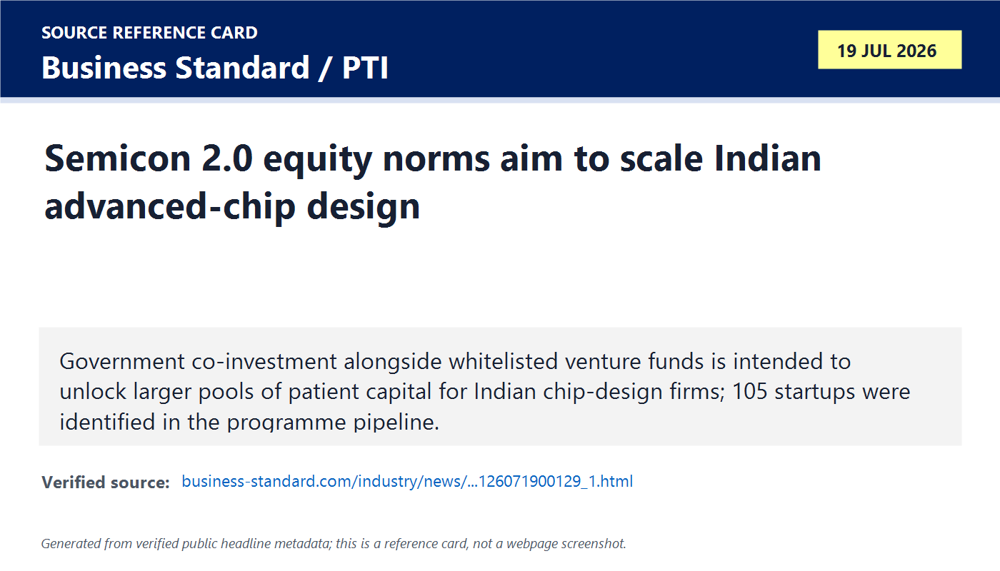
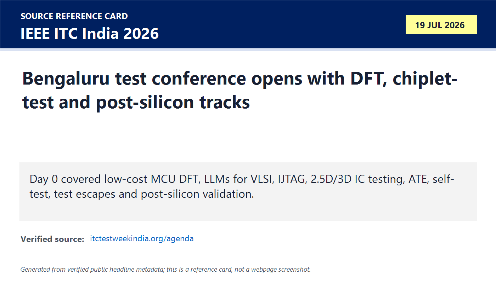
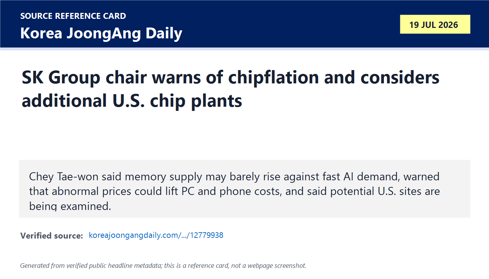

# Daily Semiconductor Current Affairs

Date: 2026-07-19

Research window: Sunday update through the end of July 19 India time. Exact-date material was unusually useful: India disclosed more detail on Semicon 2.0 design financing, IEEE ITC India opened in Bengaluru with a test-focused programme, and Korean reporting published SK Group chair Chey Tae-won's memory-capacity and price warning.

## Quick Index

| Date | Major Topic | Source Groups | Why To Read |
|---|---|---|---|
| 2026-07-19 | Semicon 2.0 equity / VC co-investment | Business Standard / PTI, NDTV Profit, ISM official page | Explains how India may move from small design grants toward patient growth capital for fabless product companies. |
| 2026-07-19 | IEEE ITC India opens in Bengaluru | Official ITC India programme | Turns DFT, ATE, chiplet test, IJTAG, test escapes and post-silicon validation into a direct VLSI-career study list. |
| 2026-07-19 | SK hynix capacity and chipflation warning | Korea JoongAng Daily / Korea Chamber remarks | Connects AI-memory scarcity with fab lead time, downstream device prices, national security and possible U.S. capacity. |

**Page navigation:** [Sources](#source-map) · [Concept review](#concept-review) · [Follow-up](#what-to-watch-next) · [Technical terms](#technical-terms-used-today) · [Master glossary](../knowledge-base/glossary.md)

## Source Images And Manifest

Source manifest: [../images/2026-07-19/links.md](../images/2026-07-19/links.md)

The following are generated source-reference cards based on verified public headline metadata. They are not webpage screenshots and do not reproduce article bodies.







## Source Map

| Source | Source date | Role | Confidence / limitation |
|---|---:|---|---|
| [Business Standard / PTI: Semicon 2.0 equity norms](https://www.business-standard.com/industry/news/semicon-2-0-equity-norms-to-boost-chip-design-investment-it-secy-126071900129_1.html) | 2026-07-19 | Exact-date reporting of MeitY Secretary S. Krishnan's explanation of grants, equity, royalty-linked support, whitelisted investors and 105 design startups | Strong attributed interview reporting; operational rules, caps, selection criteria and disbursement schedules are still pending. |
| [NDTV Profit: government to co-invest in chip startups](https://www.ndtvprofit.com/economy/govt-to-co-invest-in-chip-startups-to-prevent-acquisition-deals-by-global-giants-meity-secy-11791683/) | 2026-07-19 | Corroborates the purpose of co-investment: crowd in private capital and help Indian product companies scale | Interview coverage, not final scheme guidelines. |
| [India Semiconductor Mission: Semicon 2.0](https://ism.gov.in/schemes/semicon2.0/index) | 2026-07-15 / active | Official anchor for the INR 1,27,500 crore programme and its design, equipment/materials, fabs, ATMP/OSAT, R&D and talent pillars | Strong official programme source; detailed application rules remain the next evidence layer. |
| [IEEE ITC India 2026 programme](https://itctestweekindia.org/agenda) | 2026-07-19 | Official agenda for the Bengaluru conference's tutorial and industry-test day | Strong event source. An agenda confirms planned sessions, not the content or conclusions of every talk. |
| [Korea JoongAng Daily: SK Group chair on memory supply and U.S. plants](https://www.koreajoongangdaily.com/business/sk-chief-says-us-plants-are-in-the-works-to-address-abnormal-prices-with-bolstered-supply/12779938) | 2026-07-19 | Exact-date report of Chey Tae-won's remarks on memory scarcity, chipflation, power and potential U.S. sites | Strong attributed reporting; site search is exploratory, not a board-approved fab project. |

## Verification Matrix

| Item | Confirmed / reported | Do not overclaim | Follow-up |
|---|---|---|---|
| Semicon 2.0 design funding | Reporting says the government intends to combine grants, possible equity or royalty-linked support, and co-investment alongside whitelisted venture funds. It identifies 105 startups already developing chips. | No final company selection, cheque size, government ownership percentage, cap, valuation method or exit rule is yet established in the cited reporting. | Watch final guidelines, fund whitelist, conflict-of-interest rules, IP ownership, milestone releases and first investments. |
| ITC India | The official programme shows July 19 tutorials on MCU DFT, LLMs for VLSI, IJTAG/TAP, 2.5D/3D test, self-test, ATE, test analytics, test escapes and post-silicon validation. | A listed tutorial does not prove a new standard, product or measured improvement. | Watch published proceedings, slides, accepted papers and company follow-ups. |
| SK hynix / chipflation | Chey said potential U.S. sites are being examined, memory demand may outgrow supply, current prices are unusually high, and persistent shortage could lift PC and phone prices. | This is not an announced U.S. investment, construction start, capacity number or production schedule. His demand range is an executive forecast, not audited industry data. | Watch SK hynix filings, site/incentive decisions, capex, tool orders, power agreements and qualified output. |

## 1. Semicon 2.0: India Is Trying To Finance Product Companies, Not Only Projects

The July 19 policy detail is not simply “more subsidy.” Business Standard/PTI reported that high-end chip development can require INR 1,000 crore or more, far beyond the approximately INR 15 crore support level discussed for the existing DLI route. The proposed answer is a blended structure: a private investor first signals commercial conviction, and the government co-invests rather than attempting to choose every company alone.

Term: Public-private co-investment
Definition: Public-private co-investment is a financing structure in which government capital invests alongside qualified private investors in the same company or project. It solves two problems at once: public money can support strategically important technology, while private investors contribute commercial selection, valuation discipline and follow-on financing. In today's news, the model matters because India wants to support expensive advanced-chip design without making the state the sole selector or funder. Source: https://www.business-standard.com/industry/news/semicon-2-0-equity-norms-to-boost-chip-design-investment-it-secy-126071900129_1.html

Term: Patient capital
Definition: Patient capital is funding willing to wait longer for returns because the business needs extended R&D, validation, customer qualification and market development before revenue scales. It solves the time-horizon mismatch between semiconductor product development and investors seeking quick exits. In today's news, patient capital matters because a chip startup may spend years on architecture, RTL, verification, physical design, masks, first silicon, bring-up and qualification before meaningful volume sales. Source: https://www.ndtvprofit.com/economy/govt-to-co-invest-in-chip-startups-to-prevent-acquisition-deals-by-global-giants-meity-secy-11791683/

Term: Semiconductor intellectual property (IP)
Definition: Semiconductor intellectual property is reusable or protectable chip-design knowledge such as processor cores, interfaces, memory controllers, analog blocks, algorithms, circuit architectures, RTL, layouts and patents. It solves the repeated-design problem by allowing proven building blocks and differentiated inventions to be reused or licensed. In today's news, India wants design companies to retain and commercialise valuable IP instead of being forced into an early acquisition because growth capital is unavailable. Source: https://www.ndtvprofit.com/economy/govt-to-co-invest-in-chip-startups-to-prevent-acquisition-deals-by-global-giants-meity-secy-11791683/

### Why the financing structure matters

The capital sequence for a serious fabless product company is closer to this:

```text
market problem -> architecture -> IP/RTL -> verification -> physical design
-> tape-out and masks -> first silicon -> bring-up -> qualification
-> customer design-in -> volume production -> recurring revenue
```

A grant can help at one step. Equity can finance the company across several uncertain steps. Royalty-linked support can recycle returns if sales occur. But each instrument changes incentives:

| Instrument | Strength | Risk to watch |
|---|---|---|
| Grant | Non-dilutive and useful for a defined R&D milestone | Weak commercial discipline if milestones are vague. |
| Equity co-investment | Larger pool, shared upside, and external investor screening | Valuation, state ownership, exit, governance and favoritism questions. |
| Royalty-linked support | Repayment tracks product success | Complex revenue attribution and long monitoring period. |

India's core policy test is not the number of supported startups. It is how many produce owned IP, complete tape-outs, obtain working silicon, secure design wins, reach repeat production and retain enough value in India.

## 2. IEEE ITC India: Test Engineering Is A First-Class VLSI Discipline

The July 19 ITC India programme is unusually useful for study because it shows how broad “testing” really is. The sessions span design-time test structures, on-chip access, automatic test equipment, chiplet/3D integration, functional safety, analytics, test escapes and post-silicon validation.

Term: Design for testability (DFT)
Definition: Design for testability adds structures and operating modes—such as scan chains, test access, compression and built-in self-test—so manufacturing defects can be controlled, observed and diagnosed after fabrication. It solves the controllability and observability problem: internal sequential states are otherwise difficult to set and inspect through normal chip pins. In today's news, DFT is central because the ITC India agenda connects low-cost MCU testing, packetized scan, in-system test and the limits of scan coverage. Source: https://itctestweekindia.org/agenda

Term: Scan chain
Definition: A scan chain connects selected storage elements into shift-register paths during test mode, allowing automatic test equipment to shift in an internal state, apply one or more capture clocks, and shift out the observed response. It solves limited internal access, but adds area, routing, timing, power and security constraints. The July 19 agenda matters because several sessions address scan transport, state extraction and test escapes rather than treating scan as a complete solution. Source: https://blogs.sw.siemens.com/tessent/2017/04/24/scan-insertion-for-better-atpg/

Term: Automatic test equipment (ATE)
Definition: Automatic test equipment is hardware and software that drives precise electrical patterns into a semiconductor device, measures responses, applies timing and voltage conditions, and classifies devices at wafer sort or final test. It solves the production-scale screening problem: millions of devices cannot be tested manually. In today's agenda, ATE appears with packetized scan and scalable reusable hardware because test bandwidth, channel count, accuracy and test time directly affect cost. Source: https://itctestweekindia.org/agenda

Term: Test escape
Definition: A test escape is a defective device that passes the applied manufacturing tests and reaches the customer or next production stage. It solves no problem; it is the residual risk left by incomplete fault models, insufficient patterns, marginal conditions, analog defects or system interactions not reproduced during test. The agenda explicitly studies scan limitations because high structural coverage does not guarantee zero defective-parts-per-million. Source: https://itctestweekindia.org/agenda

Term: Post-silicon validation
Definition: Post-silicon validation is the process of exercising fabricated chips in real boards, firmware, workloads, interfaces, voltage/temperature corners and system scenarios to find behavior that pre-silicon models or manufacturing tests missed. It solves the reality-gap problem between simulation and physical silicon. In today's news, the dedicated SoC session matters because functional correctness, performance, power, interoperability and customer use cases continue after a die passes production test. Source: https://itctestweekindia.org/agenda

### DFT, manufacturing test and validation are not the same

| Layer | Main question | Typical evidence |
|---|---|---|
| Pre-silicon verification | Does the design logically match its specification? | Simulation, formal proofs, emulation, coverage. |
| DFT insertion / ATPG | Can internal faults be made observable and test patterns generated? | Scan architecture, fault coverage, pattern count, power checks. |
| Wafer sort / final test | Does this physical device meet electrical and functional limits? | ATE pass/fail, parametric bins, yield data. |
| Post-silicon validation | Does the fabricated system behave correctly in realistic operation? | Boards, workloads, firmware, corner testing, errata. |
| Reliability qualification | Will it continue to meet specifications over life and stress? | Burn-in, temperature cycling, HTOL and package tests. |

Career signal: DFT engineers need digital design, ATPG/fault-model knowledge, scripting, timing awareness and production-test economics. Product/test engineers need measurement, statistics, yield analysis and failure isolation. Post-silicon engineers bridge hardware, firmware and systems.

## 3. SK hynix: “Chipflation” Shows Why Memory Supply Cannot Respond Instantly

Korea JoongAng Daily reported Chey Tae-won's view that memory demand could grow far faster than supply, that unusually high prices could propagate into computers and phones, and that SK hynix is examining potential U.S. sites. The important analytical boundary is that a site search is an option study, not committed capacity.

Term: Chipflation
Definition: Chipflation is the pass-through of rising semiconductor costs into more expensive electronic systems or reduced specifications and margins. It solves an explanatory problem: a shortage is not confined to chip vendors if memory, controllers or processors become a larger share of a PC, phone, server or vehicle bill of materials. In today's news, the warning matters because sustained memory scarcity could weaken downstream demand even while memory suppliers initially enjoy higher prices. Source: https://www.koreajoongangdaily.com/business/sk-chief-says-us-plants-are-in-the-works-to-address-abnormal-prices-with-bolstered-supply/12779938

Term: Supply elasticity
Definition: Supply elasticity describes how much output can increase when price or demand rises. Semiconductor supply is inelastic over short periods because cleanrooms, power, tools, process recipes, trained teams, yield learning and customer qualification cannot be added instantly. In today's news, memory prices can stay elevated even when producers intend to expand because new saleable bits arrive only after a long engineering and construction chain. Source: https://www.semi.org/en/resources/semiconductor101

Term: Fab lead time
Definition: Fab lead time is the elapsed time required to plan, permit, build, equip, qualify and ramp a semiconductor factory or expansion. It solves the capacity-timing question: an investment announcement today cannot relieve a shortage tomorrow. In today's news, Chey's urgency reflects that site choice, utilities, tool delivery, process transfer, hiring and yield ramp can take years before mass production. Source: https://www.koreajoongangdaily.com/business/sk-chief-says-us-plants-are-in-the-works-to-address-abnormal-prices-with-bolstered-supply/12779938

### The capacity chain

```text
site search -> incentives / permits -> power and water -> construction
-> cleanroom and utilities -> tool installation -> process qualification
-> yield ramp -> customer qualification -> saleable memory output
```

This is why “build more fabs” is directionally correct but temporally incomplete. The market can remain tight during every intermediate stage. At the same time, expanding too aggressively risks oversupply once all producers' capacity arrives, which is the classic memory-cycle danger.

## Follow-Up Ledger

| Earlier item | July 19 status | Evidence / next check |
|---|---|---|
| Semicon 2.0 | Materially updated | Design financing now includes reported grant/equity/royalty and VC co-investment concepts; final rules remain pending. |
| India design ecosystem | Updated | 105 startups are reported in the pipeline; track tape-outs, working silicon, IP ownership, customer wins and revenue. |
| DFT / talent | New India career item | ITC India supplies a current, practical revision map across scan, ATE, chiplets and post-silicon work. |
| Memory shortage | Updated | Chey's remarks add price-pass-through and geographic-capacity arguments; official SK hynix project decisions remain pending. |
| Potential U.S. SK hynix fabs | Watch only | Site examination is not a committed project. Require filing, location, investment, capacity and timetable. |

## Concept Review

| Concept | Key distinction | Why it matters |
|---|---|---|
| Grant vs equity | A grant funds work without ownership; equity funds the company in exchange for an ownership claim. | Semicon 2.0 may need larger, longer-lived capital than the existing grant scale. |
| Design success vs manufacturing success | Owning advanced IP and tape-outs is different from fabricating the design domestically. | India can become stronger in product/IP before it has local leading-edge fabs. |
| Verification vs DFT vs validation | Verification checks the design model; DFT enables structural manufacturing test; post-silicon validation tests real operation. | ITC India's programme spans the complete test lifecycle. |
| High fault coverage vs zero escapes | Coverage is measured against models; real defects can violate model assumptions. | A high scan-coverage number does not eliminate quality risk. |
| Price signal vs fast supply | High prices encourage investment, but semiconductor capacity responds slowly. | Explains memory chipflation and why a site search cannot immediately lower prices. |

## Interview Questions

1. Why might public-private co-investment suit semiconductor design better than only a small grant?
2. What milestones should India require before releasing later funding tranches?
3. What is semiconductor IP, and how is it different from contract engineering work?
4. Why is a tape-out not proof of a commercial chip company?
5. What problem does a scan chain solve, and what costs does it introduce?
6. How can a device escape even if reported scan fault coverage is high?
7. What is the difference between ATE production test and post-silicon validation?
8. Why are 2.5D/3D packages harder to test than a single monolithic die?
9. What is chipflation, and how can it eventually reduce end-market demand?
10. Why does new fab investment take years to become saleable output?

## What To Watch Next

1. Semicon 2.0's final co-investment rules, eligible investors, ownership limits, milestone gates, royalty formula and IP conditions.
2. Which of the reported 105 design startups have tape-outs, working silicon, customers and repeat revenue.
3. ITC India proceedings and any public slides on IJTAG, chiplet test, test escapes and post-silicon validation.
4. SK hynix filings or government announcements that convert U.S. site exploration into a named project.
5. DRAM, NAND and HBM contract pricing, PC/phone bill-of-material effects and memory capex.
6. Power-generation and grid commitments for new memory fabs and AI data centres.

## Final Takeaway

July 19 connects three parts of the semiconductor system that are often studied separately: capital, test and capacity. India needs patient capital to convert engineering talent into owned chip products; the ITC India agenda shows that real VLSI quality depends on a complete test lifecycle; and SK hynix's warning shows why physical supply cannot respond as fast as demand or stock prices. The common lesson is that announcements matter only when they cross disciplined engineering milestones.

## Technical Terms Used Today

[Back to quick index](#quick-index) · [Open the master A-Z glossary](../knowledge-base/glossary.md)

**Term index:** [Automatic test equipment (ATE)](#daily-term-automatic-test-equipment-ate) · [Chipflation](#daily-term-chipflation) · [Design for testability (DFT)](#daily-term-design-for-testability-dft) · [Fab lead time](#daily-term-fab-lead-time) · [Patient capital](#daily-term-patient-capital) · [Post-silicon validation](#daily-term-post-silicon-validation) · [Public-private co-investment](#daily-term-public-private-co-investment) · [Scan chain](#daily-term-scan-chain) · [Semiconductor intellectual property (IP)](#daily-term-semiconductor-intellectual-property-ip) · [Supply elasticity](#daily-term-supply-elasticity) · [Test escape](#daily-term-test-escape)

| Term | Meaning |
|---|---|
| <a id="daily-term-automatic-test-equipment-ate"></a>[**Automatic test equipment (ATE)**](../knowledge-base/glossary.md#term-automatic-test-equipment-ate) | Automatic test equipment is hardware and software that drives precise electrical patterns into a semiconductor device, measures responses, applies timing and voltage conditions, and classifies devices at wafer sort or final test. It solves the production-scale screening problem: millions of devices cannot be tested manually. |
| <a id="daily-term-chipflation"></a>[**Chipflation**](../knowledge-base/glossary.md#term-chipflation) | Chipflation is the pass-through of rising semiconductor costs into more expensive electronic systems or reduced specifications and margins. It solves an explanatory problem: a shortage is not confined to chip vendors if memory, controllers or processors become a larger share of a PC, phone, server or vehicle bill of materials. |
| <a id="daily-term-design-for-testability-dft"></a>[**Design for testability (DFT)**](../knowledge-base/glossary.md#term-design-for-testability-dft) | Design for testability adds structures and operating modes—such as scan chains, test access, compression and built-in self-test—so manufacturing defects can be controlled, observed and diagnosed after fabrication. It solves the controllability and observability problem: internal sequential states are otherwise difficult to set and inspect through normal chip pins. |
| <a id="daily-term-fab-lead-time"></a>[**Fab lead time**](../knowledge-base/glossary.md#term-fab-lead-time) | Fab lead time is the elapsed time required to plan, permit, build, equip, qualify and ramp a semiconductor factory or expansion. It solves the capacity-timing question: an investment announcement today cannot relieve a shortage tomorrow. |
| <a id="daily-term-patient-capital"></a>[**Patient capital**](../knowledge-base/glossary.md#term-patient-capital) | Patient capital is funding willing to wait longer for returns because the business needs extended R&D, validation, customer qualification and market development before revenue scales. It solves the time-horizon mismatch between semiconductor product development and investors seeking quick exits. |
| <a id="daily-term-post-silicon-validation"></a>[**Post-silicon validation**](../knowledge-base/glossary.md#term-post-silicon-validation) | Post-silicon validation is the process of exercising fabricated chips in real boards, firmware, workloads, interfaces, voltage/temperature corners and system scenarios to find behavior that pre-silicon models or manufacturing tests missed. It solves the reality-gap problem between simulation and physical silicon. |
| <a id="daily-term-public-private-co-investment"></a>[**Public-private co-investment**](../knowledge-base/glossary.md#term-public-private-co-investment) | Public-private co-investment is a financing structure in which government capital invests alongside qualified private investors in the same company or project. It solves two problems at once: public money can support strategically important technology, while private investors contribute commercial selection, valuation discipline and follow-on financing. |
| <a id="daily-term-scan-chain"></a>[**Scan chain**](../knowledge-base/glossary.md#term-scan-chain) | A scan chain connects selected storage elements into shift-register paths during test mode, allowing automatic test equipment to shift in an internal state, apply one or more capture clocks, and shift out the observed response. It solves limited internal access, but adds area, routing, timing, power and security constraints. |
| <a id="daily-term-semiconductor-intellectual-property-ip"></a>[**Semiconductor intellectual property (IP)**](../knowledge-base/glossary.md#term-semiconductor-intellectual-property-ip) | Semiconductor intellectual property is reusable or protectable chip-design knowledge such as processor cores, interfaces, memory controllers, analog blocks, algorithms, circuit architectures, RTL, layouts and patents. It solves the repeated-design problem by allowing proven building blocks and differentiated inventions to be reused or licensed. |
| <a id="daily-term-supply-elasticity"></a>[**Supply elasticity**](../knowledge-base/glossary.md#term-supply-elasticity) | Supply elasticity describes how much output can increase when price or demand rises. Semiconductor supply is inelastic over short periods because cleanrooms, power, tools, process recipes, trained teams, yield learning and customer qualification cannot be added instantly. |
| <a id="daily-term-test-escape"></a>[**Test escape**](../knowledge-base/glossary.md#term-test-escape) | A test escape is a defective device that passes the applied manufacturing tests and reaches the customer or next production stage. It solves no problem; it is the residual risk left by incomplete fault models, insufficient patterns, marginal conditions, analog defects or system interactions not reproduced during test. |

This page-end index covers the specialist terms central to this day's study. The fuller explanation, news context, and source remain at first use; the master glossary combines repeated terms across all days.
