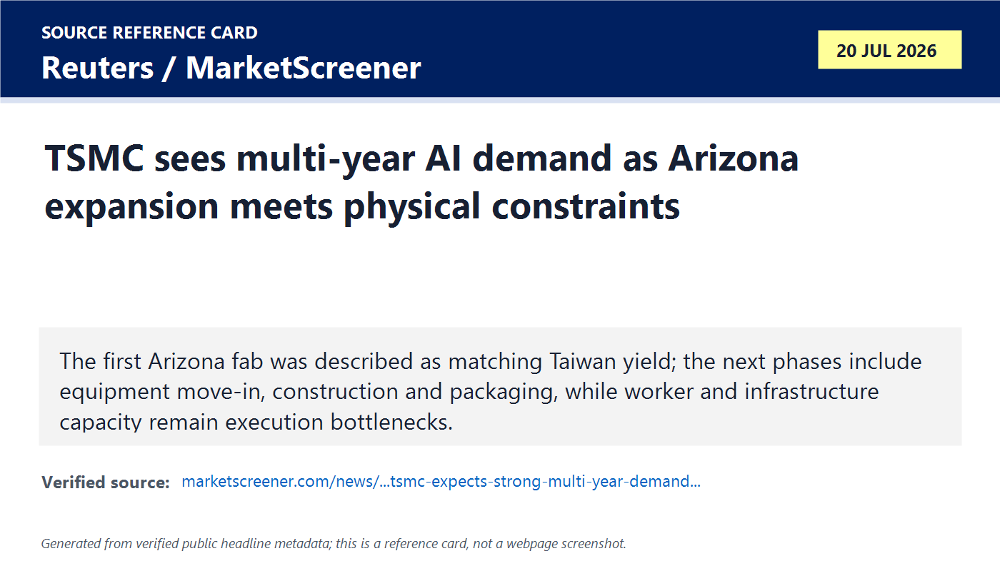
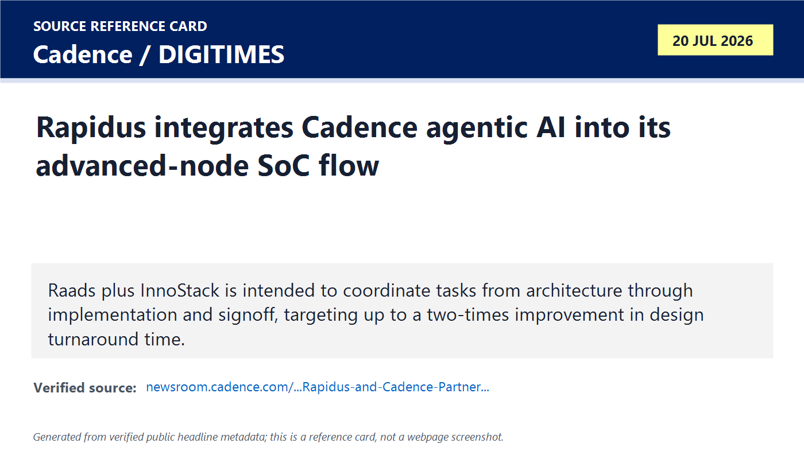

# Daily Semiconductor Current Affairs

Date: 2026-07-20

Research window: Monday update through approximately 18:30 IST on July 20. The strongest exact-date evidence was Reuters' interview with TSMC CFO Wendell Huang on Arizona sequencing and constraints, plus DIGITIMES' July 20 coverage of the Rapidus-Cadence agentic design collaboration anchored to Cadence's official July 16 release.

## Quick Index

| Date | Major Topic | Source Groups | Why To Read |
|---|---|---|---|
| 2026-07-20 | TSMC Arizona expansion execution | Reuters / MarketScreener, TSMC Q2 investor materials | Separates AI-demand confidence and yield claims from worker, infrastructure, sequencing, transfer and export-control constraints. |
| 2026-07-20 | Rapidus-Cadence agentic EDA | Cadence official release, DIGITIMES exact-date report | Explains what AI design orchestration can automate—and why signoff accountability still remains with engineering teams. |
| 2026-07-20 | India test-engineering follow-up | IEEE ITC India official programme | Keeps DFT, ATE, chiplet test and post-silicon skills tied to the conference continuing in Bengaluru. |

**Page navigation:** [Sources](#source-map) · [Concept review](#concept-review) · [Follow-up](#what-to-watch-next) · [Technical terms](#technical-terms-used-today) · [Master glossary](../knowledge-base/glossary.md)

## Source Images And Manifest

Source manifest: [../images/2026-07-20/links.md](../images/2026-07-20/links.md)

The following are generated source-reference cards based on verified public headline metadata. They are not webpage screenshots and do not reproduce article bodies.





## Source Map

| Source | Source date | Role | Confidence / limitation |
|---|---:|---|---|
| [Reuters via MarketScreener: TSMC multi-year AI demand and Arizona ramp](https://au.marketscreener.com/news/tsmc-expects-strong-multi-year-demand-for-ai-chips-as-it-ramps-up-arizona-investment-ce7f51dade8df521) | 2026-07-20 | Exact-date interview with TSMC CFO on fab status, yield, investment, workforce, infrastructure, Taiwan sequencing, finance and export-control visibility | Strong attributed reporting. Long-range facility count has no detailed completion schedule in the interview. |
| [TSMC Q2 2026 quarterly results](https://investor.tsmc.com/english/quarterly-results/2026/q2) | 2026-07-16 / reviewed 2026-07-20 | Official results, presentation and transcript anchor for demand, capex and manufacturing roadmap | Strong primary source; the July 20 operational detail comes from the CFO interview. |
| [Cadence: Rapidus and Cadence partner on agentic AI](https://newsroom.cadence.com/press-releases/press-release-details/2026/Rapidus-and-Cadence-Partner-on-Agentic-AI-for-Advanced-SoC-Design/default.aspx) | 2026-07-16 | Official description of Raads, InnoStack, Navigator, Indicator, workflow span and up-to-2X target | Primary company source; performance is a target, not an independently measured result. |
| [DIGITIMES: Rapidus taps Cadence AI agents](https://www.digitimes.com/news/a20260720VL211/rapidus-cadence-2nm-design-technology.html) | 2026-07-20 | Exact-date reporting that places the collaboration in Rapidus's effort to attract customers for planned 2 nm manufacturing | Headline and accessible summary only; full article requires subscription. |
| [IEEE ITC India 2026 programme](https://itctestweekindia.org/agenda) | 2026-07-19 to 2026-07-21 | Ongoing India career and test-engineering context | Official event agenda; detailed session results require proceedings or slides. |

## Verification Matrix

| Item | Confirmed / reported | Do not overclaim | Follow-up |
|---|---|---|---|
| TSMC Arizona demand and investment | CFO said TSMC sees multi-year structural AI demand and raised total Arizona investment to USD 265 billion. | Demand confidence is management guidance, not a guaranteed utilization or return. The cited interview gives no completion schedule for all planned facilities. | Track construction, equipment, node qualification, package capacity, customers, cost and margins. |
| Arizona fab status | The first fab is operating and was described as having yield as good as the flagship Taiwan fab; second-fab equipment move-in is near, third-fab construction is underway, and preparatory work has begun on a fourth fab and first packaging facility. | “Yield as good as” is a management comparison without detailed product mix, defect density or audited yield data in the article. | Watch comparable-node/product yield, wafer starts, output mix and customer qualification. |
| Physical constraints | CFO identified construction-worker and infrastructure availability as constraints. | These constraints do not prove failure; they define schedule and cost risk. | Watch labour pipeline, power/water/transport, tool installation and permitting. |
| Rapidus-Cadence | Official release says Raads integrates the Cadence InnoStack AI Super Agent across architecture, implementation and signoff, targeting up to 2X design turnaround improvement. | This is a collaboration and target, not proof of autonomous tape-out, first-pass silicon success or production 2 nm yield. | Watch customer designs, benchmark methodology, human review, signoff convergence and silicon results. |

## 1. TSMC Arizona: Demand Is Strong, But Capacity Is A Sequence Of Physical Gates

The July 20 Reuters interview adds execution detail to the July 16 earnings announcement. TSMC's first Arizona fab is operating; the next facilities are at different stages—equipment move-in, construction, site preparation and packaging planning. Treating the whole USD 265 billion programme as one block hides the important fact that semiconductor capacity comes online one qualified stage at a time.

Term: Structural demand
Definition: Structural demand is demand expected to persist because of a long-term change in technology or industry behavior rather than a short inventory cycle. It solves the forecasting distinction between a temporary order spike and a durable workload shift. In today's news, TSMC uses multi-year structural AI demand to justify large fab and packaging commitments, but the thesis must still be checked against customer capex, utilization and product revenue over time. Source: https://au.marketscreener.com/news/tsmc-expects-strong-multi-year-demand-for-ai-chips-as-it-ramps-up-arizona-investment-ce7f51dade8df521

Term: Equipment move-in
Definition: Equipment move-in is the stage when fabrication tools are installed inside a completed and qualified cleanroom and connected to power, gases, chemicals, vacuum, cooling, automation and process-control systems. It solves the transition from an empty fab shell to a process-capable factory. In today's news, the second Arizona fab approaching tool move-in is meaningful progress, but recipes, integration, qualification and yield ramp still follow. Source: https://au.marketscreener.com/news/tsmc-expects-strong-multi-year-demand-for-ai-chips-as-it-ramps-up-arizona-investment-ce7f51dade8df521

Term: Fab ramp
Definition: A fab ramp is the controlled increase from early process lots to stable high-volume manufacturing. It solves the scale-up problem by improving tool matching, process windows, cycle time, defect density, yield, staffing and output without losing quality. In today's news, separate Arizona phases matter because an operating first fab does not mean later fabs, nodes and package lines are already qualified. Source: https://www.semi.org/en/resources/semiconductor101

Term: Yield parity
Definition: Yield parity means two manufacturing locations or lines produce comparable shares of good output under a defined product, process and measurement basis. It solves the transfer-quality question: can an overseas fab reproduce the economic output of the reference fab? In today's news, TSMC's statement that Arizona yield is as good as Taiwan is encouraging, but a rigorous comparison would need the same node, design mix, maturity, test limits and time window. Source: https://au.marketscreener.com/news/tsmc-expects-strong-multi-year-demand-for-ai-chips-as-it-ramps-up-arizona-investment-ce7f51dade8df521

Term: Manufacturing infrastructure constraint
Definition: A manufacturing infrastructure constraint is a physical resource that limits construction or production even when capital and customer demand exist. Examples include skilled trades, power, water, roads, gas systems, waste treatment, tool service and permitting capacity. It solves the explanation for why funding alone cannot set the fab schedule. In today's news, TSMC explicitly identifies construction-worker and infrastructure availability as Arizona ramp constraints. Source: https://au.marketscreener.com/news/tsmc-expects-strong-multi-year-demand-for-ai-chips-as-it-ramps-up-arizona-investment-ce7f51dade8df521

### Read the expansion as a state machine

```text
land / permits
    -> fab shell and cleanroom
    -> utilities and automation
    -> equipment move-in
    -> process integration and qualification
    -> product qualification
    -> yield and cycle-time ramp
    -> high-volume wafer output
    -> packaging / test
    -> shipped customer systems
```

Each arrow can become the bottleneck. A packaging facility matters because an AI accelerator is not useful as a bare leading-edge die; it must be integrated with memory and package interconnect, tested and delivered within power and thermal limits.

## 2. Technology Transfer: The Leading Edge Stays Close To R&D First

Huang said the newest technologies require very close R&D and operations collaboration in Taiwan and can be considered for overseas transfer after stabilization. This is a process-learning point, not only geopolitics.

Term: Geographic process transfer
Definition: Geographic process transfer is the controlled replication of a semiconductor process from a reference development or production fab into another site. It solves regional capacity and supply-resilience goals, but requires matched tools, recipes, metrology, materials, data systems, training and engineering response. In today's news, TSMC's Taiwan-first sequence reflects the lower risk of stabilizing a leading process beside the R&D team before copying it overseas. Source: https://au.marketscreener.com/news/tsmc-expects-strong-multi-year-demand-for-ai-chips-as-it-ramps-up-arizona-investment-ce7f51dade8df521

The VLSI consequence is subtle: a node being “available” in two countries does not automatically mean identical PDK versions, IP maturity, process options, wafer capacity, turnaround time or cost on the same date. Product teams need exact foundry qualification data, not only a node label.

The business consequence is also two-sided:

- Regional fabs can improve customer proximity and resilience.
- A distributed footprint can raise cost, staffing and coordination burden.
- Keeping the first learning loop near R&D may protect yield and speed.
- Delaying overseas transfer can leave regional customers one generation behind for a period.

## 3. Rapidus And Cadence: Agentic AI Moves From Point Optimization To Flow Orchestration

DIGITIMES highlighted on July 20 that Rapidus is integrating Cadence AI-agent technology into its design platform as it seeks customers for planned 2 nm manufacturing. Cadence's official July 16 release says its InnoStack AI Super Agent will work with Rapidus's Raads environment, including Navigator and Indicator, across architecture, implementation and signoff. The stated objective is up to a two-times improvement in design turnaround time.

Term: Agentic EDA
Definition: Agentic EDA uses AI agents to plan, launch, monitor and adjust sequences of electronic-design-automation tasks toward engineering objectives. It solves workflow-fragmentation and search problems: instead of optimizing only one command, an agent can coordinate tools, interpret results and choose the next experiment. In today's news, Rapidus and Cadence aim to apply this across the advanced-node SoC lifecycle, but human engineers still own specifications, constraints, approvals and signoff accountability. Source: https://newsroom.cadence.com/press-releases/press-release-details/2026/Rapidus-and-Cadence-Partner-on-Agentic-AI-for-Advanced-SoC-Design/default.aspx

Term: Design orchestration
Definition: Design orchestration is the coordination of dependent EDA stages, data, constraints, compute resources and decision loops across a chip project. It solves the handoff problem where an improvement in synthesis can worsen placement, timing, power, routing or verification later. In today's news, InnoStack plus Raads is positioned to coordinate tasks from early architecture through implementation and signoff rather than acting as an isolated optimizer. Source: https://newsroom.cadence.com/press-releases/press-release-details/2026/Rapidus-and-Cadence-Partner-on-Agentic-AI-for-Advanced-SoC-Design/default.aspx

Term: Design turnaround time (TAT)
Definition: Design turnaround time is the elapsed time required to complete a defined design iteration or workflow and obtain actionable results. It solves the productivity measurement problem: advanced chips require many expensive loops before closure. In today's news, the up-to-2X TAT target matters only if the comparison fixes design scope, compute budget, quality, PPA, verification completeness and signoff criteria. Source: https://newsroom.cadence.com/press-releases/press-release-details/2026/Rapidus-and-Cadence-Partner-on-Agentic-AI-for-Advanced-SoC-Design/default.aspx

Term: Design closure
Definition: Design closure is the convergence of implementation and verification so a chip satisfies timing, power, area, signal-integrity, physical-verification, reliability and functional requirements at the required corners and modes. It solves the final-convergence problem: optimizing one metric is insufficient if another signoff check fails. In today's news, agentic orchestration is valuable only when it helps reach valid closure rather than producing faster intermediate runs. Source: https://www.cadence.com/en_US/home/tools/digital-design-and-signoff.html

Term: Signoff
Definition: Signoff is the formal set of final engineering checks and approvals before releasing a chip design for tape-out. It solves the risk-control problem by requiring validated timing, power, physical rules, extraction, signal integrity and other foundry/customer criteria. In today's news, Cadence says the integrated flow spans signoff; that does not mean an AI agent can waive the rules or accept unverified results. Source: https://www.cadence.com/en_US/home/tools/digital-design-and-signoff.html

### What can improve—and what must remain controlled

| Agentic opportunity | Human / methodology control still required |
|---|---|
| Generate and compare flow strategies | Define the correct specification, modes, corners and constraints. |
| Launch parallel experiments | Control compute budget and reproducibility. |
| Diagnose logs and recommend parameter changes | Verify that the diagnosis matches circuit and tool reality. |
| Optimize PPA across stages | Prevent metric gaming or violations hidden in another corner. |
| Track closure progress | Approve signoff evidence and exception waivers. |

A good test of the “2X” claim would use the same design, node, starting database, compute resources and signoff target, then compare elapsed time, engineering hours, PPA, violations, reruns and final silicon quality. Faster tool activity without equal closure quality is not a real productivity gain.

## 4. India Career Follow-Up: ITC India Keeps Test Skills Concrete

IEEE ITC India continued in Bengaluru on July 20. The exact agenda is valuable because it makes the current skills demand tangible: DFT architecture, test access, ATE, chiplet/3D test, functional safety, test analytics, post-silicon validation and failure analysis. Agentic EDA does not remove these disciplines; it raises the value of engineers who can state correct constraints, recognize implausible tool output and connect failures to physical mechanisms.

For a VLSI learner, the combined July 19-20 study sequence is:

```text
RTL / architecture -> verification -> synthesis / implementation
-> DFT insertion and ATPG -> signoff -> tape-out
-> wafer sort / package test -> post-silicon validation -> yield learning
```

Rapidus-Cadence focuses on accelerating design loops. ITC India focuses on making real silicon observable, testable and trustworthy. Both are needed.

## Follow-Up Ledger

| Earlier item | July 20 status | Evidence / next check |
|---|---|---|
| TSMC Q2 / Arizona | Materially updated | CFO interview adds first-fab yield claim, second-fab tool timing, third/fourth construction sequence, packaging and physical constraints. |
| TSMC AI demand | Reaffirmed by management | Treat as guidance; verify through orders, utilization, packaging demand, customer capex and future revenue. |
| Advanced packaging bottleneck | Stronger execution context | First Arizona packaging facility is in preparatory work; capacity, technology, start date and customers remain unspecified. |
| Agentic chip design | New foundry-flow example | Cadence/Rapidus targets up to 2X TAT; require benchmark, closure and silicon evidence. |
| ITC India | Ongoing | Continue watching proceedings and public technical material through July 21. |
| Semicon 2.0 | No new official rule today | July 19 financing detail remains the latest India policy development; final implementation rules are pending. |

## Concept Review

| Concept | Key distinction | Why it matters |
|---|---|---|
| Investment vs ready capacity | Money funds stages; it is not equivalent to qualified wafer or package output. | TSMC's USD 265 billion programme spans facilities at very different maturity levels. |
| Yield claim vs comparable yield data | A management statement is useful, but parity requires matched products, nodes and measurement windows. | Prevents over-reading the first Arizona fab result. |
| Shell vs equipped fab | A building becomes process-capable only after tools, utilities, recipes and qualification. | Second-fab equipment move-in is progress, not volume production. |
| Point optimization vs orchestration | A point tool improves one step; orchestration coordinates dependencies across the flow. | This is the central Cadence-Rapidus claim. |
| Faster run vs true closure | Shorter runtime matters only if signoff quality, PPA and reproducibility remain equal or better. | Defines how to evaluate the 2X TAT target. |

## Interview Questions

1. Why does an operating first fab not prove the entire Arizona cluster is production-ready?
2. What happens between equipment move-in and high-volume manufacturing?
3. What evidence would you request before accepting a yield-parity claim?
4. Why might the newest process stay near the R&D organization before overseas transfer?
5. Why is an advanced packaging facility strategically important for AI accelerators?
6. What is agentic EDA, and how is it different from optimizing one EDA command?
7. What is design orchestration?
8. How would you design a fair benchmark for a 2X turnaround-time claim?
9. Why can faster implementation still fail to improve tape-out time?
10. Which decisions should remain under engineer control at signoff?

## What To Watch Next

1. Arizona second-fab equipment installation, process qualification and production start.
2. Third/fourth fab and packaging-facility permits, construction milestones, technology mix and timelines.
3. Arizona labour, power, water, transport, tool-service and supplier buildout.
4. TSMC customer allocation, utilization, package capacity, geographic cost and margin disclosure.
5. Rapidus-Cadence customer adoption, benchmark methodology, PDK/IP readiness and completed tape-outs.
6. Whether agentic flows improve final signoff convergence and first-pass silicon—not only intermediate runtime.
7. ITC India proceedings and practical learning material from the July 19-21 programme.
8. Semicon 2.0's final design co-investment rules and first supported companies.

## Final Takeaway

July 20 is an execution day. TSMC's interview shows that even the world's strongest foundry must convert capital into workers, infrastructure, tools, process transfer, yield and packaging one stage at a time. Rapidus and Cadence show the design-side response to rising complexity: orchestrate more of the workflow with AI. The two stories meet at the same engineering truth—speed is valuable only when the result is reproducible, qualified and signoff-correct.

## Technical Terms Used Today

[Back to quick index](#quick-index) · [Open the master A-Z glossary](../knowledge-base/glossary.md)

**Term index:** [Agentic EDA](#daily-term-agentic-eda) · [Design closure](#daily-term-design-closure) · [Design orchestration](#daily-term-design-orchestration) · [Design turnaround time (TAT)](#daily-term-design-turnaround-time-tat) · [Equipment move-in](#daily-term-equipment-move-in) · [Fab ramp](#daily-term-fab-ramp) · [Geographic process transfer](#daily-term-geographic-process-transfer) · [Manufacturing infrastructure constraint](#daily-term-manufacturing-infrastructure-constraint) · [Signoff](#daily-term-signoff) · [Structural demand](#daily-term-structural-demand) · [Yield parity](#daily-term-yield-parity)

| Term | Meaning |
|---|---|
| <a id="daily-term-agentic-eda"></a>[**Agentic EDA**](../knowledge-base/glossary.md#term-agentic-eda) | Agentic EDA uses AI agents to plan, launch, monitor and adjust sequences of electronic-design-automation tasks toward engineering objectives. It solves workflow-fragmentation and search problems: instead of optimizing only one command, an agent can coordinate tools, interpret results and choose the next experiment. |
| <a id="daily-term-design-closure"></a>[**Design closure**](../knowledge-base/glossary.md#term-design-closure) | Design closure is the convergence of implementation and verification so a chip satisfies timing, power, area, signal-integrity, physical-verification, reliability and functional requirements at the required corners and modes. It solves the final-convergence problem: optimizing one metric is insufficient if another signoff check fails. |
| <a id="daily-term-design-orchestration"></a>[**Design orchestration**](../knowledge-base/glossary.md#term-design-orchestration) | Design orchestration is the coordination of dependent EDA stages, data, constraints, compute resources and decision loops across a chip project. It solves the handoff problem where an improvement in synthesis can worsen placement, timing, power, routing or verification later. |
| <a id="daily-term-design-turnaround-time-tat"></a>[**Design turnaround time (TAT)**](../knowledge-base/glossary.md#term-design-turnaround-time-tat) | Design turnaround time is the elapsed time required to complete a defined design iteration or workflow and obtain actionable results. It solves the productivity measurement problem: advanced chips require many expensive loops before closure. |
| <a id="daily-term-equipment-move-in"></a>[**Equipment move-in**](../knowledge-base/glossary.md#term-equipment-move-in) | Equipment move-in is the stage when fabrication tools are installed inside a completed and qualified cleanroom and connected to power, gases, chemicals, vacuum, cooling, automation and process-control systems. It solves the transition from an empty fab shell to a process-capable factory. |
| <a id="daily-term-fab-ramp"></a>[**Fab ramp**](../knowledge-base/glossary.md#term-fab-ramp) | A fab ramp is the controlled increase from early process lots to stable high-volume manufacturing. It solves the scale-up problem by improving tool matching, process windows, cycle time, defect density, yield, staffing and output without losing quality. |
| <a id="daily-term-geographic-process-transfer"></a>[**Geographic process transfer**](../knowledge-base/glossary.md#term-geographic-process-transfer) | Geographic process transfer is the controlled replication of a semiconductor process from a reference development or production fab into another site. It solves regional capacity and supply-resilience goals, but requires matched tools, recipes, metrology, materials, data systems, training and engineering response. |
| <a id="daily-term-manufacturing-infrastructure-constraint"></a>[**Manufacturing infrastructure constraint**](../knowledge-base/glossary.md#term-manufacturing-infrastructure-constraint) | A manufacturing infrastructure constraint is a physical resource that limits construction or production even when capital and customer demand exist. Examples include skilled trades, power, water, roads, gas systems, waste treatment, tool service and permitting capacity. |
| <a id="daily-term-signoff"></a>[**Signoff**](../knowledge-base/glossary.md#term-signoff) | Signoff is the formal set of final engineering checks and approvals before releasing a chip design for tape-out. It solves the risk-control problem by requiring validated timing, power, physical rules, extraction, signal integrity and other foundry/customer criteria. |
| <a id="daily-term-structural-demand"></a>[**Structural demand**](../knowledge-base/glossary.md#term-structural-demand) | Structural demand is demand expected to persist because of a long-term change in technology or industry behavior rather than a short inventory cycle. It solves the forecasting distinction between a temporary order spike and a durable workload shift. |
| <a id="daily-term-yield-parity"></a>[**Yield parity**](../knowledge-base/glossary.md#term-yield-parity) | Yield parity means two manufacturing locations or lines produce comparable shares of good output under a defined product, process and measurement basis. It solves the transfer-quality question: can an overseas fab reproduce the economic output of the reference fab? |

This page-end index covers the specialist terms central to this day's study. The fuller explanation, news context, and source remain at first use; the master glossary combines repeated terms across all days.
