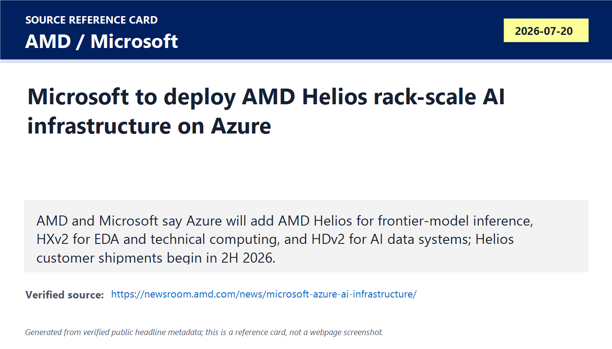
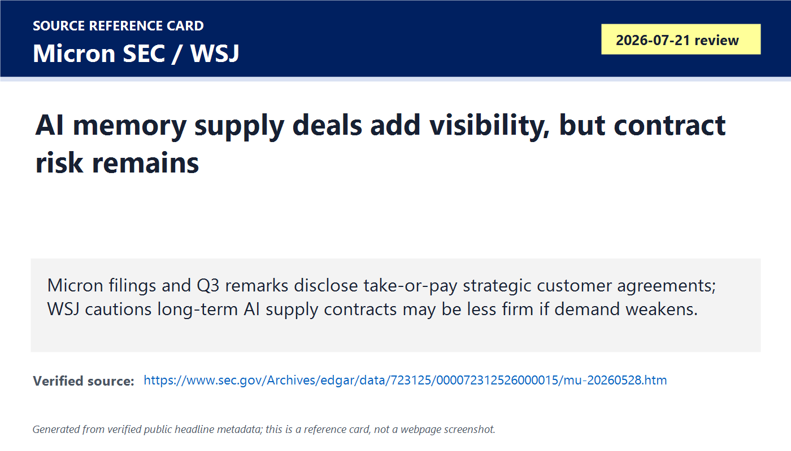
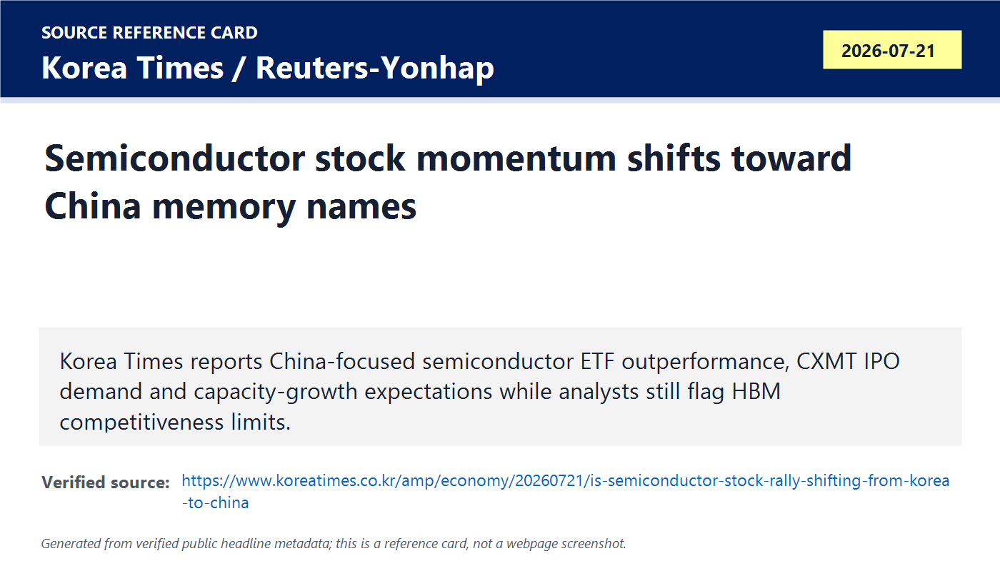
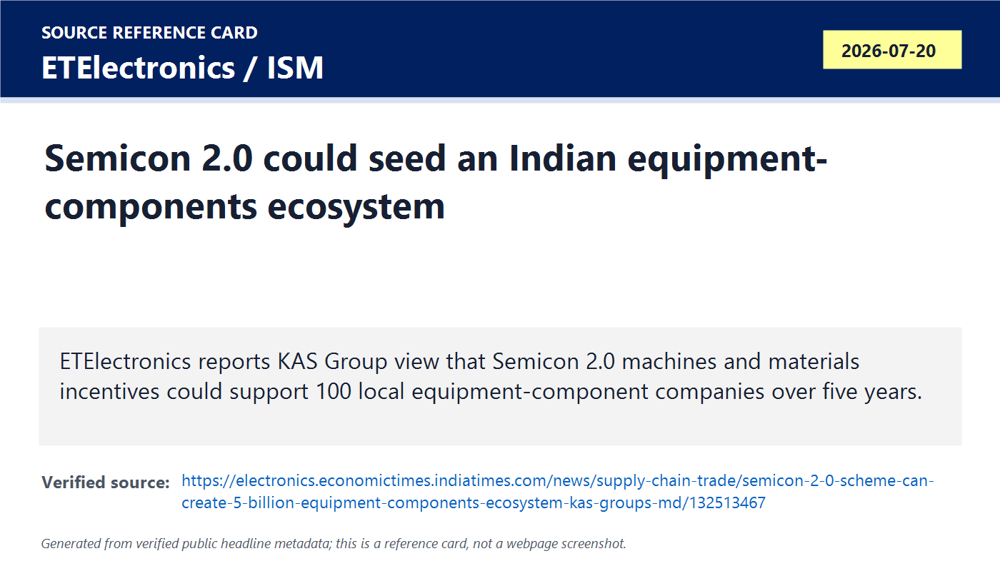

# Daily Semiconductor Current Affairs

Date: 2026-07-21

Research window: Tuesday update through approximately 14:00 IST on July 21. The strongest evidence is a July 20 U.S. primary-source announcement from AMD and Microsoft that entered today's India review window, plus exact-date July 21 reporting on memory-market rotation and July 20-21 India policy/equipment follow-up. Exact-date pure company releases were limited, so this note labels the market and policy items as last-24-to-72-hour context.

## Quick Index

| Date | Major Topic | Source Groups | Why To Read |
|---|---|---|---|
| 2026-07-21 | AMD-Microsoft cloud AI infrastructure | AMD Newsroom, Microsoft official blog, AMD Helios product page | Shows AI accelerators moving from single-chip comparisons to full rack systems with memory, CPUs, networking, software, cloud virtual machines and EDA compute. |
| 2026-07-21 | Memory contracts, chipflation and contract risk | Micron SEC filing, Micron prepared remarks, WSJ, Business Insider, MarketWatch | Explains why AI memory demand can look contractually strong while still carrying renegotiation, price, supply-allocation and end-demand risk. |
| 2026-07-21 | China/Korea memory-market rotation | Korea Times with Reuters-Yonhap context | Connects CXMT, Chinese self-sufficiency, ETF flows, HBM gaps and Korea memory leadership into one geopolitical market signal. |
| 2026-07-21 | India Semicon 2.0 equipment ecosystem | ETElectronics, India Semiconductor Mission context, SEMI resource hub | Moves India discussion from fabs and OSAT into equipment components, gases, chemicals, wet tools, talent and global supplier qualification. |

**Page navigation:** [Sources](#source-map) · [Concept review](#concept-review) · [Follow-up](#what-to-watch-next) · [Technical terms](#technical-terms-used-today) · [Master glossary](../knowledge-base/glossary.md)

## Source Images And Manifest

Source manifest: [../images/2026-07-21/links.md](../images/2026-07-21/links.md)

The following are generated source-reference cards based on verified public headline/date/source metadata. They are not webpage screenshots and do not reproduce article bodies.









## Source Map

| Source | Source date | Role | Confidence / limitation |
|---|---:|---|---|
| [AMD Newsroom: Microsoft to deploy next-gen AMD Instinct and EPYC processors](https://newsroom.amd.com/news/microsoft-azure-ai-infrastructure/) | 2026-07-20 | Primary-source announcement that Microsoft will deploy AMD Helios on Azure, add AMD EPYC VM series and expand Pensando DPU use | Strong company source. It confirms partnership scope and stated shipment timing, not volume, pricing, Azure region availability or performance in production. |
| [Microsoft official blog: Azure AI and HPC infrastructure with AMD](https://blogs.microsoft.com/blog/2026/07/20/microsoft-expands-azure-ai-and-hpc-infrastructure-with-amd/) | 2026-07-20 | Primary-source cloud-customer confirmation of HDv2, HXv2 and ND MI455X v7 workload positioning | Strong official customer source. It does not disclose procurement value, fleet scale, model customers or measured benchmarks. |
| [AMD Helios Rackscale solution page](https://www.amd.com/en/products/rackscale-solutions/helios.html) and [AMD Helios brochure](https://www.amd.com/content/dam/amd/en/documents/solutions/ai/amd-helios-bro.pdf) | 2026-07-20 / reviewed 2026-07-21 | Technical specs for 72 MI455X GPUs, 31 TB HBM4, FP4/FP8 claims, UALink/UEC/OCP positioning, DPU/NIC details and reference-design status | Primary technical marketing. Many performance numbers are projections or peak/theoretical specs and must not be read as delivered application throughput. |
| [Micron Q3 2026 10-Q](https://www.sec.gov/Archives/edgar/data/723125/000072312526000015/mu-20260528.htm) and [Micron Q3 2026 prepared remarks](https://investors.micron.com/static-files/631b1a32-5537-46ae-8f40-82e42fc79dfe) | 2026-06-24 / reviewed 2026-07-21 | Primary-source evidence on strategic customer agreements, take-or-pay terms, pricing bands, deposits, supply allocation and memory-price surge | Strong primary financial evidence. It is earlier than today but necessary to verify exact contract details behind today's market debate. |
| [WSJ: The Massive Supply Deals Feeding the AI Frenzy Are No Sure Thing](https://www.wsj.com/finance/the-massive-supply-deals-feeding-the-ai-frenzy-are-no-sure-thing-3a89ec09) | 2026-07-21 | Exact-date analysis warning that AI supply contracts may be renegotiated if the boom weakens | Reputable reporting/analysis; paywalled and limited visible text, so use only for thesis/context and verify concrete contract terms through Micron filing. |
| [Business Insider: Chipflation is the AI trade's next major test](https://www.businessinsider.com/ai-chip-prices-chipflation-semiconductors-memory-stocks-kospi-ny-life-2026-7) | 2026-07-20 | Market context on DRAM export-price inflation and investor concern over AI infrastructure input costs | Reputable market reporting. It quotes strategist views, not company guidance or official price series. |
| [MarketWatch: Micron stock rebounds as Morgan Stanley says memory remains a bottleneck](https://www.marketwatch.com/story/as-microns-stock-rebounds-morgan-stanley-says-investors-shouldnt-get-spooked-by-the-past-6996574b) | 2026-07-20 | Market context on memory-stock rebound after semiconductor-index bear-market pressure | Reputable market reporting. Analyst views are not demand proof. |
| [Korea Times: Is semiconductor stock rally shifting from Korea to China?](https://www.koreatimes.co.kr/amp/economy/20260721/is-semiconductor-stock-rally-shifting-from-korea-to-china) | 2026-07-21 | Exact-date Korea/China semiconductor-market rotation and CXMT capacity/IPO context | Reputable reporting with Reuters-Yonhap image context and analyst quotes. Capacity and IPO expectations still need company filings and regulator documents. |
| [ETElectronics: Semicon 2.0 can create equipment components ecosystem](https://electronics.economictimes.indiatimes.com/news/supply-chain-trade/semicon-2-0-scheme-can-create-5-billion-equipment-components-ecosystem-kas-groups-md/132513467) | 2026-07-20 | India equipment-components follow-up tied to Semicon 2.0 machines/materials, gases, chemicals, etch/deposition/coating/wet benches and local suppliers | Useful attributed interview. It is an industry executive estimate, not an official target or approved company list. |
| [SEMI Resource Hub](https://www.semi.org/en/semiconductor-resource-hub) | reviewed 2026-07-21 | Official SEMI anchor for standards, equipment, assembly/manufacturing courses and global fab/intelligence context | Authoritative association source. Some market intelligence details are commercial or member-only. |

## Verification Matrix

| Item | Confirmed / reported | Do not overclaim | Follow-up |
|---|---|---|---|
| AMD-Microsoft Helios | AMD and Microsoft both confirmed Azure will deploy AMD Helios for AI inference, add HDv2/HXv2 AMD EPYC VMs and expand Pensando networking use; AMD says Helios shipments to customers begin in 2H 2026. | No deal value, GPU count, Azure region, customer workload benchmark, TCO comparison or Nvidia share shift is disclosed. AMD Helios is described by AMD as a reference design, not a standalone retail product. | Track AMD Advancing AI details, customer deployment timing, actual Azure ND MI455X v7 availability, ROCm software maturity and measured model throughput. |
| AMD Helios specs | AMD lists 72 MI455X GPUs, 31 TB HBM4 per rack, 2.9 EF FP4, 1.4 EF FP8, 260 TB/s scale-up bandwidth and 43 TB/s scale-out bandwidth. | Peak arithmetic and bandwidth do not equal application-level throughput, utilization, efficiency, availability or customer revenue. Some brochure numbers are internal projections. | Watch independent benchmarks, power envelope, cooling, networking utilization, reliability, software stack and system pricing. |
| Micron memory contracts | Micron discloses strategic customer agreements structured as take-or-pay deals with volume commitments, price bands for most agreements and expected USD 22B deposits/commitments to date. Prepared remarks say 14 of 16 signed agreements represent about USD 100B minimum-price revenue over the remaining term. | Contract visibility is not risk-free revenue. Micron also warns disputes, customer non-performance, allocation limits and market changes can harm business. | Track actual deposits, revenue recognition, customer compliance, litigation/dispute risk, capacity additions and memory price bands. |
| AI chipflation | Business Insider reports strategist concern that AI-related logic and memory price increases are testing hyperscaler ROI; MarketWatch reports memory stocks rebounded even after the PHLX Semiconductor Index fell into bear-market territory. | A market rebound does not prove physical supply has improved; a sell-off does not prove end demand collapsed. | Watch DRAM/HBM contract prices, hyperscaler capex, AI cloud pricing, end-device price increases and memory supplier capex. |
| China memory rotation | Korea Times reports China-focused semiconductor ETF outperformance, CXMT IPO demand and capacity expansion expectations; analysts still flag HBM competitiveness limits. | ETF flows and IPO demand are sentiment signals, not proof that CXMT can match SK hynix/Samsung/Micron in HBM or leading-edge DRAM. | Track CXMT prospectus, actual wafer starts, technology node, yields, HBM qualification, export-control limits and customer adoption. |
| India equipment-components ecosystem | ETElectronics reports KAS Group's view that Semicon 2.0 could create a USD 5B local equipment-components ecosystem and that global equipment makers are already working with Indian local players and CoEs. | This is an industry forecast and interview, not an official procurement list. Equipment qualification barriers remain high. | Track Semicon 2.0 notification, component eligibility, JV announcement expected in September, delivered tools, customer qualification and export/global supplier acceptance. |

## 1. AMD-Microsoft: AI Competition Is Now Rack-Scale, Not Just GPU-Versus-GPU

AMD and Microsoft turned the latest AI-chip story into a full system story. The primary-source point is not only that Microsoft will use AMD accelerators. It is that Azure is being split into workload-specific infrastructure: HDv2 for data and agent coordination, HXv2 for chip design and technical computing, and ND MI455X v7 for large-scale AI inference.

Term: Rack-scale AI infrastructure
Definition: Rack-scale AI infrastructure is a complete rack-level system that integrates accelerators, host CPUs, memory, power distribution, cooling, networking, management, security and software into one deployable unit. It solves the scaling problem that appears when many accelerators must act like one machine rather than isolated PCIe cards. In today's news, AMD Helios matters because Microsoft is treating it as Azure infrastructure for frontier-model inference, not merely as a GPU announcement. Compared with buying a single accelerator card, a rack-scale design answers the harder questions: how data moves, how heat leaves, how GPUs synchronize and how operators service failures. Source: https://www.amd.com/en/products/rackscale-solutions/helios.html

Term: AI inference
Definition: AI inference is the execution phase where a trained model uses input data to produce outputs such as text, code, images, rankings or decisions. It solves the deployment problem after training: the model must respond to real user or application requests with acceptable latency, throughput, cost and reliability. In today's news, Microsoft says AMD Helios will support frontier-model inference in Azure, which means the business question is serving cost and fleet capacity, not only training headline performance. Example: training is like creating the model's learned parameters; inference is using those parameters millions of times per day. Source: https://blogs.microsoft.com/blog/2026/07/20/microsoft-expands-azure-ai-and-hpc-infrastructure-with-amd/

Term: High-Bandwidth Memory 4 (HBM4)
Definition: High-Bandwidth Memory 4 is a next-generation stacked DRAM memory technology placed very close to an accelerator through advanced packaging to provide extremely high bandwidth and capacity per package. It solves the memory-wall problem: AI accelerators can contain huge arithmetic units, but those units sit idle if model weights and activations cannot be supplied fast enough. In today's news, AMD Helios lists up to 31 TB of HBM4 per rack and 432 GB per MI455X GPU, making HBM4 availability a core constraint for AMD, Microsoft and memory suppliers. Compared with ordinary DDR memory on a server motherboard, HBM trades higher packaging complexity and cost for much higher bandwidth near the compute die. Source: https://www.amd.com/content/dam/amd/en/documents/solutions/ai/amd-helios-bro.pdf

Term: FP4 and FP8 arithmetic
Definition: FP4 and FP8 are low-precision floating-point number formats that use fewer bits than FP16 or FP32 to represent values. They solve the throughput and energy problem in AI workloads by allowing more multiply-accumulate operations and less data movement per watt when model accuracy can tolerate lower precision. In today's news, AMD quotes rack-level FP4 and FP8 peak performance for Helios, but these are precision-specific peak numbers, not guaranteed real-world application throughput. A simple comparison: FP32 is useful for high numerical precision, while FP4 is useful when AI model serving can trade precision for scale and efficiency. Source: https://www.amd.com/content/dam/amd/en/documents/solutions/ai/amd-helios-bro.pdf

Term: Open accelerator interconnect
Definition: An open accelerator interconnect is a standards-based connection approach for linking accelerators, CPUs and networking devices without depending entirely on one vendor's proprietary fabric. It solves vendor lock-in and ecosystem-fragmentation problems by giving hyperscalers, OEMs and component vendors a common target for scale-up or scale-out designs. In today's news, AMD positions Helios around OCP Open Rack Wide, UALink and Ultra Ethernet Consortium specifications, making openness part of its challenge to Nvidia's vertically integrated rack platforms. Source: https://www.amd.com/en/products/rackscale-solutions/helios.html

Term: Data processing unit (DPU)
Definition: A data processing unit is a programmable infrastructure processor that offloads networking, storage, security, packet processing and telemetry tasks from the host CPU. It solves the cloud-infrastructure overhead problem: at hyperscale, general CPUs should not spend too much time doing packet steering, encryption, virtualization and storage plumbing. In today's news, AMD says Microsoft will broaden deployment of Pensando DPUs and integrate AMD silicon with Azure Boost, so the accelerator story includes the network and host-infrastructure layer too. Source: https://newsroom.amd.com/news/microsoft-azure-ai-infrastructure/

Term: Electronic design automation (EDA) cloud workload
Definition: An EDA cloud workload is a chip-design computation such as RTL simulation, verification, synthesis, physical implementation, timing analysis, extraction or signoff running on cloud infrastructure instead of only on local data-center servers. It solves burst-capacity and schedule-pressure problems because chip teams need thousands of CPU cores and large memory pools during peak design iterations. In today's news, Microsoft's HXv2 VMs are explicitly positioned for silicon design and technical computing, so AI infrastructure is feeding back into the design tools used to create the next chips. Source: https://blogs.microsoft.com/blog/2026/07/20/microsoft-expands-azure-ai-and-hpc-infrastructure-with-amd/

### Confirmed Facts

AMD says Microsoft will deploy AMD Helios at scale on Azure for frontier-model inference, and Microsoft confirms three upcoming Azure offerings: HDv2 for data processing, HXv2 for EDA and technical computing, and ND MI455X v7 for AI inference. AMD says Helios combines MI455X GPUs, EPYC Venice CPUs, Pensando networking and ROCm software; AMD also says Helios customer shipments begin in the second half of 2026.

The Helios technical page says a full rack uses 72 MI455X GPUs and offers 31 TB of HBM4 memory capacity. The brochure and page also list large scale-up and scale-out bandwidth claims, liquid-cooling/serviceability features, hardware root-of-trust and attestation, and open standards including OCP, UALink and UEC.

### Analysis

This is a direct Nvidia-challenge story, but the serious reading is broader. In 2023-2025, many investor discussions compared individual accelerators: H100 versus MI300, B200 versus MI325, and so on. By July 2026 the competition is at the rack and cloud-service layer. Hyperscalers buy clusters, not datasheet rows. A useful AI rack must combine accelerators, host CPUs, coherent data movement, HBM supply, liquid cooling, fleet serviceability, cloud virtualization, compiler/runtime software and reliability.

The Microsoft blog is important because it breaks the AI pipeline into three infrastructure layers:

| Azure offering | Workload problem | Semiconductor meaning |
|---|---|---|
| HDv2 | Data preparation, search, reinforcement learning and agent coordination | CPUs and memory still matter because accelerators need a data/control plane. |
| HXv2 | Chip design, simulation and technical computing | EDA workloads need high-frequency CPU cores, cache, RAM and interconnect before the next accelerator can even tape out. |
| ND MI455X v7 | Production-scale AI inference | Accelerators and HBM are monetized by serving models, not only by training demos. |

For VLSI learning, the feedback loop is the key point: AI chips need EDA compute to be designed, and cloud providers now sell EDA-optimized VMs partly because AI-chip complexity is exploding. That ties today's AMD-Microsoft news to the July 20 Rapidus-Cadence note: AI is entering both the product being built and the design infrastructure used to build it.

### India Angle

The India angle is not that India immediately manufactures Helios-class racks. The practical angle is that Indian design, validation, cloud, networking and systems teams need to understand rack-level constraints. If AMD and Microsoft push open rack and open interconnect designs, Indian ODM/EMS suppliers, verification teams, thermal engineers, data-center operators and software teams could participate around subsystems, integration, test automation and cloud workload optimization. But high-value participation requires evidence: qualified suppliers, design ownership, field reliability and export-compliant supply chains.

## 2. Memory Contracts: Visibility Is Better, But The Contract Is Not The Same As Demand Forever

The exact-date WSJ piece warns that long-term AI supply contracts may not be as unbreakable as investors assume. To avoid relying on paywalled commentary alone, the hard facts should come from Micron's Q3 filing and prepared remarks. Micron's own documents confirm a major change in memory contracting: customers are committing to multi-year supply, deposits and pricing bands because memory has become strategic to AI product roadmaps.

Term: Strategic customer agreement (SCA)
Definition: A strategic customer agreement is a multi-year commercial contract between a semiconductor supplier and important customers that can define committed supply, volumes, deposits, pricing bands, technology access and business obligations. It solves the planning problem created by shortage: customers need supply assurance, while suppliers need revenue visibility before funding expensive capacity. In today's news, Micron's SCAs are the verified foundation under the broader debate about whether AI supply contracts make the memory cycle less volatile. Source: https://investors.micron.com/static-files/631b1a32-5537-46ae-8f40-82e42fc79dfe

Term: Take-or-pay agreement
Definition: A take-or-pay agreement requires a customer either to take a committed volume of product or pay according to the contract even if the customer later needs less product. It solves supplier investment risk by making demand more bankable before the supplier commits fab capacity, tools and inventory. In today's news, Micron says its SCAs are structured as take-or-pay agreements with binding volume commitments, but investors still need to watch enforcement, renegotiation and customer relationship risk if AI demand weakens. Source: https://www.sec.gov/Archives/edgar/data/723125/000072312526000015/mu-20260528.htm

Term: Price band
Definition: A price band sets a minimum and maximum price range for a product over a contract term. It solves both sides of pricing risk: customers avoid unlimited upside if spot prices spike, while suppliers avoid selling below an agreed floor if the cycle turns down. In today's news, Micron says most strategic agreements are fixed-price or subject to minimum and maximum pricing, with large agreements generally using a ceiling near second-calendar-quarter 2026 market prices and a floor through the term. Source: https://www.sec.gov/Archives/edgar/data/723125/000072312526000015/mu-20260528.htm

Term: Remaining performance obligation (RPO)
Definition: A remaining performance obligation is contracted revenue a company expects to recognize in the future for goods or services it has not yet delivered, measured according to accounting rules. It solves the visibility question by separating already recognized revenue from contractual future commitments. In today's news, Micron's filing discloses about USD 5 billion allocated to remaining performance obligations as of May 28, 2026, while prepared remarks discuss much larger minimum-price contract value over the full term; the difference shows why accounting RPO and headline contract value are not the same measure. Source: https://www.sec.gov/Archives/edgar/data/723125/000072312526000015/mu-20260528.htm

Term: Memory supply allocation
Definition: Memory supply allocation is the process of deciding which customers and end markets receive limited DRAM, NAND or HBM output when total demand exceeds available qualified supply. It solves shortage triage, but it can strain customer relationships and redirect capacity away from lower-margin markets. In today's news, Micron says AI-driven data-center growth is outpacing industry supply and may affect some customers and end markets, which means the AI boom can create winners and losers inside the same supplier's customer base. Source: https://www.sec.gov/Archives/edgar/data/723125/000072312526000015/mu-20260528.htm

Term: Chipflation
Definition: Chipflation is the pass-through of higher semiconductor prices into more expensive cloud services, servers, PCs, phones, vehicles or other electronics. It solves the macro/business explanation for why a chip shortage is not only a supplier-profit story: higher logic, memory, energy and infrastructure costs can eventually pressure buyers' return on investment. In today's news, Business Insider frames AI-related logic and memory price increases as a test for hyperscalers because expensive chips can both prove strong demand and weaken adoption if customers cannot monetize AI fast enough. Source: https://www.businessinsider.com/ai-chip-prices-chipflation-semiconductors-memory-stocks-kospi-ny-life-2026-7

### Confirmed Facts

Micron's 10-Q says AI-driven memory and storage growth is outpacing industry supply. It says strategic customer agreements are take-or-pay, have binding volume commitments, and usually use fixed pricing or price bands. It also says these agreements can constrain Micron's flexibility and could create disputes or litigation if customers fail to meet purchase commitments.

Micron's prepared remarks say 16 signed SCAs cover customers across data-center, consumer and auto segments; typically run five years from calendar 2026 through 2030, with auto agreements generally three years; represent roughly 20% of DRAM volume and one-third of NAND volume over the period; and include 14 agreements with about USD 100B cumulative revenue at minimum contract price over the remaining term. Micron also says it expects USD 22B of deposits and related financial commitments under signed SCAs.

### Analysis

The mature reading is two-sided:

| Bullish side | Risk side |
|---|---|
| Contracts reduce memory suppliers' historical visibility problem. | Contracts can still be renegotiated, disputed, delayed or economically softened if customers' AI ROI weakens. |
| Deposits and committed volumes help justify fab, tool and packaging investment. | Locked allocation can reduce flexibility if product mix, customer quality or end-market demand changes. |
| Price floors can protect margins through a downturn. | Price ceilings can cap upside if shortage becomes even worse. |
| Customers get supply assurance for AI roadmaps. | Non-AI customers may face higher prices or less supply. |

The key distinction for your review is physical demand versus financial visibility. A take-or-pay contract improves visibility, but it does not manufacture wafers faster. It does not eliminate packaging capacity limits, tool lead times, yields, data-center power constraints or the possibility that customers later ask to amend terms. For memory, the semiconductor cycle may be changing, but it has not become risk-free.

### India Angle

India should read this as a supply-chain lesson. If AI memory is sold through multi-year strategic agreements, late entrants cannot assume spot-market availability of advanced HBM, DDR or NAND when they need it. Indian AI-cloud, server, electronics and automotive companies will need procurement strategy, design flexibility and supplier relationships. For VLSI careers, this means memory-controller design, signal integrity, package-aware architecture, firmware, validation and supply-chain literacy are not optional add-ons.

## 3. China/Korea Memory Rotation: Markets Are Pricing A New Competitor Before HBM Proof

Korea Times reports that a China-focused semiconductor ETF outperformed Korea- and U.S.-focused semiconductor ETFs over a recent three-month window, helped by excitement around CXMT's IPO and Chinese memory capacity growth. The same report keeps the right caution: Chinese memory makers may grow in role, but HBM competitiveness remains the hard test.

Term: Exchange-traded fund (ETF)
Definition: An exchange-traded fund is an investment fund traded on an exchange that usually tracks a basket of securities, index or theme. It solves access and diversification problems for investors who want exposure to a sector without buying each stock separately. In today's news, Korea Times uses ETF performance to show market rotation toward Chinese semiconductor exposure, but ETF price movement is sentiment and positioning evidence, not manufacturing proof. Source: https://www.koreatimes.co.kr/amp/economy/20260721/is-semiconductor-stock-rally-shifting-from-korea-to-china

Term: Crowded trade
Definition: A crowded trade is a market position where many investors own the same theme or stocks, making prices vulnerable to sharp reversals when expectations wobble. It solves the explanation for why good company fundamentals can coexist with falling share prices. In today's news, analysts cited by Korea Times say Korean semiconductor names remain fundamentally strong but may be crowded after a sharp rally, while China names attract fresh inflows. Source: https://www.koreatimes.co.kr/amp/economy/20260721/is-semiconductor-stock-rally-shifting-from-korea-to-china

Term: DRAM wafer capacity
Definition: DRAM wafer capacity is the number of wafer starts or wafer outputs a memory manufacturer can process for DRAM production over a period, usually discussed monthly. It solves the scale question: market share and pricing depend not only on technology, but on how many wafers can be processed, yielded and converted into qualified memory products. In today's news, reported CXMT capacity targets matter because extra Chinese wafer capacity could increase global DRAM supply, but wafer capacity alone does not prove high-yield HBM or leading-edge product parity. Source: https://www.koreatimes.co.kr/amp/economy/20260721/is-semiconductor-stock-rally-shifting-from-korea-to-china

Term: HBM competitiveness
Definition: HBM competitiveness is a supplier's ability to deliver high-bandwidth memory stacks that meet customer requirements for bandwidth, capacity, power, thermal behavior, yield, package integration, reliability and qualification with accelerator partners. It solves the difference between producing commodity DRAM bits and winning AI-accelerator sockets. In today's news, analysts still identify HBM as the decisive gap for CXMT because AI accelerators need advanced stacked memory, not only more conventional DRAM wafers. Source: https://www.koreatimes.co.kr/amp/economy/20260721/is-semiconductor-stock-rally-shifting-from-korea-to-china

Term: Semiconductor self-sufficiency
Definition: Semiconductor self-sufficiency is a country's ability to supply strategically important chip design, manufacturing, equipment, materials, packaging and talent needs domestically or through trusted local ecosystems. It solves national-security and supply-resilience concerns, but it is segment-specific: success in memory wafers does not automatically mean success in EUV tools, EDA, HBM, analog, packaging or leading-edge logic. In today's news, China's push for self-sufficiency supports sentiment around CXMT, while export controls and HBM complexity still shape the real technology boundary. Source: https://www.csis.org/analysis/countering-chinas-challenge-american-ai-leadership

### Confirmed Facts

Korea Times reports that a Korea-listed China semiconductor ETF gained 49% over three months through Thursday, outperforming Korea- and U.S.-focused semiconductor ETFs over that window. It also reports CXMT's planned IPO demand and capacity growth expectations, and says analysts expect China's share of net global DRAM wafer-capacity additions to become significant through 2028.

### Analysis

This is a classic gap between market anticipation and technology proof. Markets may rotate before engineering catches up because investors price optionality: if CXMT scales, if Chinese AI demand keeps expanding, if export controls fail to stop progress, and if HBM capability improves, then China's memory role grows. But the technical gate is still HBM qualification with accelerator ecosystems.

For Korea, the risk is not that SK hynix and Samsung suddenly lose leadership overnight. The risk is that investors begin treating Korea as a crowded, already-owned AI-memory trade while assigning higher incremental upside to Chinese capacity. For China, the risk is the reverse: share prices can rise faster than yields, HBM readiness, packaging skill and customer qualification.

### India Angle

India should study the China example without copying the slogans blindly. Self-sufficiency is not one switch. It is many capabilities: design IP, wafer fabs, mature-node capacity, memory, materials, equipment, packaging, standards, talent and end customers. India is still early in most of these layers, so credible progress should be measured by shipped products, qualified suppliers, repeat orders and owned IP, not only by policy outlay.

## 4. India Semicon 2.0: Equipment Components Are The Understudied Layer

ETElectronics reports KAS Group's view that Semicon 2.0 could help create at least a USD 5B local semiconductor equipment-components ecosystem over five years, with roughly 100 companies averaging USD 50M each. The report also says global semiconductor equipment makers are already working with local players in Bengaluru, Hyderabad, Coimbatore, Faridabad and Pune, as well as Centres of Excellence.

Term: Semiconductor equipment component
Definition: A semiconductor equipment component is a specialized part, module or subsystem used inside fab, packaging or test equipment, such as chambers, pumps, valves, gas-delivery parts, robot handlers, wet-process modules, precision stages, sensors, heaters, power supplies or chemical-delivery systems. It solves the localization problem below the tool level: a country may not build an entire lithography or deposition tool immediately, but it can enter the supply chain through qualified components. In today's news, India's Semicon 2.0 machines/materials pillar matters because equipment components are a realistic path into global semiconductor value chains if suppliers meet contamination, precision, reliability and documentation standards. Source: https://electronics.economictimes.indiatimes.com/news/supply-chain-trade/semicon-2-0-scheme-can-create-5-billion-equipment-components-ecosystem-kas-groups-md/132513467

Term: Wet bench
Definition: A wet bench is semiconductor process equipment used for wet chemical cleaning, etching, stripping or surface preparation of wafers or substrates under controlled contamination and safety conditions. It solves the surface-preparation problem: tiny residues, particles, oxides or films can destroy yield if not removed or processed uniformly. In today's news, KAS Group mentions wet benches as part of Indian custom equipment capability, which matters because even mature wet-process tools require chemical compatibility, flow control, safety, automation and particle control. Source: https://electronics.economictimes.indiatimes.com/news/supply-chain-trade/semicon-2-0-scheme-can-create-5-billion-equipment-components-ecosystem-kas-groups-md/132513467

Term: Photoresist coating equipment
Definition: Photoresist coating equipment applies a uniform light-sensitive polymer layer onto a wafer before lithography. It solves the pattern-transfer preparation problem: if resist thickness, uniformity, edge bead, bake conditions or contamination are wrong, the lithography image will distort and downstream etch will fail. In today's news, India's mention of coating equipment is important because lithography quality depends on many support tools, not only the exposure scanner. Source: https://www.asml.com/en/technology/lithography-principles

Term: Etching and deposition equipment
Definition: Etching equipment removes selected material from a wafer, while deposition equipment adds thin films such as dielectrics, metals, barriers or semiconductor layers. Together they solve the build-and-remove problem at the heart of chip manufacturing: every transistor and interconnect layer is created by repeatedly adding, patterning and removing materials with nanometer-level control. In today's news, Indian custom equipment work in etching and deposition shows why machines/materials policy is technically deep, not just an import-substitution slogan. Source: https://www.semi.org/en/resources/semiconductor101

Term: Global value chain (GVC)
Definition: A global value chain is the international network of companies, countries and process steps that design, source, manufacture, test, package, sell and service a product. It solves the specialization problem by allowing each region to contribute where it has capability, cost, talent or scale advantages. In today's news, India's goal is not only domestic consumption; Semicon 2.0 must help Indian equipment, materials and component suppliers qualify into the global semiconductor GVC. Source: https://www.oecd.org/en/topics/sub-issues/global-value-and-supply-chains.html

Term: Centre of Excellence (CoE)
Definition: A Centre of Excellence is a focused institution or industry-academic hub that concentrates people, tools, labs, training and applied R&D around a technical domain. It solves capability-building problems when private firms alone cannot justify expensive training, metrology or prototype infrastructure early in an ecosystem's development. In today's news, ETElectronics reports global equipment makers working with Indian local players and CoEs, which makes CoE quality and industry relevance a real policy execution checkpoint. Source: https://electronics.economictimes.indiatimes.com/news/supply-chain-trade/semicon-2-0-scheme-can-create-5-billion-equipment-components-ecosystem-kas-groups-md/132513467

### Confirmed Facts

ETElectronics attributes the USD 5B ecosystem view to KAS Group's managing director, not to the government. The report says Semicon 2.0 has a total outlay of INR 1.27 lakh crore and focus areas including design, machines and materials, fabs, ATMP/OSAT, R&D and talent. It also says the government will notify the scheme in coming days and that KAS expects a joint-venture announcement in September.

### Analysis

India's semiconductor discussion often jumps from "fab" to "chip self-reliance." The equipment-components layer is less glamorous but strategically important. A fab imports or buys hundreds of tool types and thousands of high-spec components. The localization ladder can look like this:

```text
machine shop / precision fabrication
    -> clean-compatible components
    -> subsystem modules
    -> process-support tools
    -> qualified local tool variants
    -> global supplier status
```

Every step requires qualification. Semiconductor customers care about particles, metals contamination, outgassing, vibration, uptime, repeatability, recipe stability, documentation, service response and traceability. A company can make industrial equipment and still fail semiconductor qualification if cleanliness, materials compatibility or process repeatability is weak.

### VLSI Career Relevance

This item is valuable for more than manufacturing students. Design engineers should understand why process assumptions, PDK rules and yield depend on equipment stability. DFT and test engineers should understand that process variation and contamination become observable as fails, marginal timing, leakage or reliability problems. Supply-chain and product engineers should understand that a local component is useful only after it is qualified, supported and trusted by tool makers and fabs.

## 5. Packaging, Test And Training: The Quiet Follow-Up From ITC India And SEMI

July 21 is also the closing day for IEEE ITC India in Bengaluru and the start date for a SEMI Semiconductor Device and Assembly Manufacturing course listed on SEMI's resource hub. These are not market-moving headlines, but they keep the career signal concrete. AI chips, HBM stacks and rack-scale systems cannot ship unless packaging, assembly and test flows catch defects and qualify products.

Term: Assembly manufacturing
Definition: Assembly manufacturing is the post-wafer process of turning individual dies into packaged, handled, connected and testable semiconductor products through steps such as die attach, wire bonding or flip-chip attach, molding, substrate attach, marking and inspection. It solves the physical-product problem: a wafer die cannot be sold as a usable chip until it is protected, connected and qualified. In today's news, SEMI's device and assembly manufacturing course is a reminder that India and global ecosystems need back-end process skills as much as design slogans. Source: https://www.semi.org/en/semiconductor-resource-hub

Term: Failure and yield analysis
Definition: Failure and yield analysis is the engineering discipline of finding why devices fail tests or why fewer good dies/packages are produced than expected. It solves the feedback-loop problem between design, process, equipment, package, test patterns and customer returns. In today's news, SEMI's upcoming failure/yield course and ITC India's test programme show the practical skills needed after tape-out: diagnose, isolate, correct and prevent defects. Source: https://www.semi.org/en/semiconductor-resource-hub

### Why It Matters

This follow-up connects the week:

```text
AMD Helios needs HBM4 and package reliability.
Micron contracts depend on qualified memory output.
CXMT's challenge is not only wafer capacity; it is HBM qualification.
India's Semicon 2.0 must build equipment, materials, OSAT, test and talent.
```

The common bottleneck is qualified output. A chip economy is not built by announcements alone. It is built by repeatable design flows, stable tools, controlled materials, package integration, test coverage, yield learning and customer trust.

## Follow-Up Ledger

| Earlier item | July 21 status | Evidence / next check |
|---|---|---|
| AMD rack-scale AI watch | Materially updated | AMD and Microsoft confirmed Azure Helios deployment and workload-specific AMD VMs; watch July 22 AMD Advancing AI details, volume, benchmarks and software maturity. |
| Agentic EDA / cloud design compute | Updated | Microsoft HXv2 explicitly targets silicon design and technical computing, tying AI infrastructure to chip-design workloads. |
| Memory shortage / chipflation | Updated | Micron primary filings verify SCAs; WSJ/BI/MarketWatch frame today's debate around contract durability, price pressure and market volatility. |
| AI-trade sell-off | Still active | Semiconductor index pressure remains a market-positioning risk, but memory-stock rebound shows fundamentals and sentiment can move differently. |
| China memory competition | Updated | Korea Times adds ETF rotation, CXMT IPO/capacity context and HBM competitiveness caveat. Need primary CXMT filings. |
| India Semicon 2.0 | Updated | ETElectronics adds equipment-components view; final official notification, eligibility rules and first machines/materials beneficiaries remain pending. |
| ITC India test-engineering thread | Closing-day follow-up | Continue watching for proceedings, slides or public technical papers from July 19-21. |
| Advanced packaging bottleneck | Still pending | Helios/HBM4 reinforces package and memory pressure; need HBM supplier allocation and packaging-capacity evidence. |

## Concept Review

| Concept | Key distinction | Why it matters |
|---|---|---|
| GPU card vs rack-scale system | A GPU card is one component; a rack-scale system includes accelerators, memory, CPUs, networking, cooling, power, security and software. | AMD-Microsoft is a system/cloud-infrastructure story, not only a chip launch. |
| Peak FLOPS vs useful throughput | Peak arithmetic measures theoretical compute under specific precision; useful throughput depends on memory, networking, kernels, batch size, model shape and software. | Prevents over-reading Helios FP4/FP8 claims. |
| Contract value vs delivered revenue | A contract may define future commitments; revenue appears only when accounting criteria and delivery are met. | Micron's SCAs improve visibility but do not remove performance, customer or dispute risk. |
| Supply allocation vs total demand | A supplier can have high demand and still disappoint certain customers if qualified supply is scarce. | AI memory can crowd out consumer, auto or lower-margin segments. |
| Wafer capacity vs HBM competitiveness | More DRAM wafers increase potential supply; HBM requires stacking, packaging, bandwidth, thermal and accelerator qualification. | Central to evaluating CXMT's real threat to Korean leaders. |
| Equipment component vs full tool | A component is a qualified subsystem or part; a full tool performs a process step at fab-grade reliability. | India's realistic path may start inside tool supply chains before complete tool ownership. |
| Policy outlay vs ecosystem depth | Money can fund attempts; capability is proven by qualified suppliers, repeat shipments and customer trust. | Semicon 2.0 execution should be measured by outcomes, not headlines. |

## Interview Questions

1. Why is rack-scale AI infrastructure a harder engineering problem than comparing two accelerator chips?
2. What bottlenecks can prevent peak FP4 or FP8 performance from appearing in real AI inference?
3. Why does HBM4 capacity matter for frontier-model inference?
4. What is the difference between scale-up bandwidth and scale-out bandwidth in an AI cluster?
5. Why would Microsoft need separate VMs for data processing, silicon design and AI inference?
6. What risk does a take-or-pay agreement reduce for a memory supplier?
7. Why can take-or-pay contracts still be risky during a future demand downturn?
8. How is remaining performance obligation different from headline contract value?
9. Why does ETF outperformance not prove manufacturing competitiveness?
10. Why is HBM harder than ordinary DRAM for a new memory competitor?
11. What does a wet bench do in semiconductor processing?
12. Why are equipment components an important entry point for India's semiconductor ecosystem?
13. What evidence would prove that an Indian equipment supplier has moved from prototype to serious semiconductor supplier?
14. How do DFT, assembly manufacturing and failure analysis connect to AI accelerator reliability?

## What To Watch Next

1. AMD Advancing AI 2026 details on MI455X, Helios, customers, software, deployment timing and performance methodology.
2. Azure availability dates for HDv2, HXv2 and ND MI455X v7, plus region coverage and customer case studies.
3. ROCm support maturity for large inference frameworks, model kernels, observability, scheduling and multi-rack reliability.
4. HBM4 supplier allocation for AMD Helios and competing Nvidia/ASIC platforms.
5. Micron SCA deposits, customer compliance, revenue recognition, disputes, capacity additions and price-band behavior.
6. DRAM/HBM contract pricing and whether chipflation reaches cloud pricing, server pricing, PCs, smartphones or vehicles.
7. CXMT IPO documents, wafer-capacity ramp, technology-node evidence, HBM samples, yields and customer qualification.
8. Semicon 2.0 final notification, machines/materials eligibility, equipment-component incentives and first beneficiaries.
9. KAS Group's expected September JV announcement and whether delivered equipment wins fab/toolmaker qualification.
10. Public proceedings or slides from ITC India 2026 and SEMI training material relevant to assembly/test/yield.

## Final Takeaway

July 21 is a systems-infrastructure day. AMD and Microsoft show that AI hardware competition has moved to racks, software, cloud VMs, HBM, networking and serviceability. Micron shows why memory suppliers now want contract structures that look less like the old spot-cycle business, while WSJ and market reporting remind us those contracts still depend on AI economics holding up. China/Korea market rotation shows investors searching for the next memory upside before HBM parity is proven. India's equipment-components story is the practical domestic lesson: the semiconductor ecosystem is not only fabs and chip startups, but every qualified component, wet tool, material, test flow and engineer that makes saleable output possible.

## Technical Terms Used Today

[Back to quick index](#quick-index) · [Open the master A-Z glossary](../knowledge-base/glossary.md)

**Term index:** [AI inference](#daily-term-ai-inference) · [Assembly manufacturing](#daily-term-assembly-manufacturing) · [Centre of Excellence (CoE)](#daily-term-centre-of-excellence-coe) · [Chipflation](#daily-term-chipflation) · [Crowded trade](#daily-term-crowded-trade) · [Data processing unit (DPU)](#daily-term-data-processing-unit-dpu) · [DRAM wafer capacity](#daily-term-dram-wafer-capacity) · [Electronic design automation (EDA) cloud workload](#daily-term-electronic-design-automation-eda-cloud-workload) · [Etching and deposition equipment](#daily-term-etching-and-deposition-equipment) · [Exchange-traded fund (ETF)](#daily-term-exchange-traded-fund-etf) · [Failure and yield analysis](#daily-term-failure-and-yield-analysis) · [FP4 and FP8 arithmetic](#daily-term-fp4-and-fp8-arithmetic) · [Global value chain (GVC)](#daily-term-global-value-chain-gvc) · [HBM competitiveness](#daily-term-hbm-competitiveness) · [High-Bandwidth Memory 4 (HBM4)](#daily-term-high-bandwidth-memory-4-hbm4) · [Memory supply allocation](#daily-term-memory-supply-allocation) · [Open accelerator interconnect](#daily-term-open-accelerator-interconnect) · [Photoresist coating equipment](#daily-term-photoresist-coating-equipment) · [Price band](#daily-term-price-band) · [Rack-scale AI infrastructure](#daily-term-rack-scale-ai-infrastructure) · [Remaining performance obligation (RPO)](#daily-term-remaining-performance-obligation-rpo) · [Semiconductor equipment component](#daily-term-semiconductor-equipment-component) · [Semiconductor self-sufficiency](#daily-term-semiconductor-self-sufficiency) · [Strategic customer agreement (SCA)](#daily-term-strategic-customer-agreement-sca) · [Take-or-pay agreement](#daily-term-take-or-pay-agreement) · [Wet bench](#daily-term-wet-bench)

| Term | Meaning |
|---|---|
| <a id="daily-term-ai-inference"></a>[**AI inference**](../knowledge-base/glossary.md#term-ai-inference) | AI inference is the execution phase where a trained model uses input data to produce outputs such as text, code, images, rankings or decisions. It solves the deployment problem after training: the model must respond to real user or application requests with acceptable latency, throughput, cost and reliability. |
| <a id="daily-term-assembly-manufacturing"></a>[**Assembly manufacturing**](../knowledge-base/glossary.md#term-assembly-manufacturing) | Assembly manufacturing is the post-wafer process of turning individual dies into packaged, handled, connected and testable semiconductor products through steps such as die attach, wire bonding or flip-chip attach, molding, substrate attach, marking and inspection. It solves the physical-product problem: a wafer die cannot be sold as a usable chip until it is protected, connected and qualified. |
| <a id="daily-term-centre-of-excellence-coe"></a>[**Centre of Excellence (CoE)**](../knowledge-base/glossary.md#term-centre-of-excellence-coe) | A Centre of Excellence is a focused institution or industry-academic hub that concentrates people, tools, labs, training and applied R&D around a technical domain. It solves capability-building problems when private firms alone cannot justify expensive training, metrology or prototype infrastructure early in an ecosystem's development. |
| <a id="daily-term-chipflation"></a>[**Chipflation**](../knowledge-base/glossary.md#term-chipflation) | Chipflation is the pass-through of higher semiconductor prices into more expensive cloud services, servers, PCs, phones, vehicles or other electronics. It solves the macro/business explanation for why a chip shortage is not only a supplier-profit story: higher logic, memory, energy and infrastructure costs can eventually pressure buyers' return on investment. |
| <a id="daily-term-crowded-trade"></a>[**Crowded trade**](../knowledge-base/glossary.md#term-crowded-trade) | A crowded trade is a market position where many investors own the same theme or stocks, making prices vulnerable to sharp reversals when expectations wobble. It solves the explanation for why good company fundamentals can coexist with falling share prices. |
| <a id="daily-term-data-processing-unit-dpu"></a>[**Data processing unit (DPU)**](../knowledge-base/glossary.md#term-data-processing-unit-dpu) | A data processing unit is a programmable infrastructure processor that offloads networking, storage, security, packet processing and telemetry tasks from the host CPU. It solves the cloud-infrastructure overhead problem: at hyperscale, general CPUs should not spend too much time doing packet steering, encryption, virtualization and storage plumbing. |
| <a id="daily-term-dram-wafer-capacity"></a>[**DRAM wafer capacity**](../knowledge-base/glossary.md#term-dram-wafer-capacity) | DRAM wafer capacity is the number of wafer starts or wafer outputs a memory manufacturer can process for DRAM production over a period, usually discussed monthly. It solves the scale question: market share and pricing depend not only on technology, but on how many wafers can be processed, yielded and converted into qualified memory products. |
| <a id="daily-term-electronic-design-automation-eda-cloud-workload"></a>[**Electronic design automation (EDA) cloud workload**](../knowledge-base/glossary.md#term-electronic-design-automation-eda-cloud-workload) | An EDA cloud workload is a chip-design computation such as RTL simulation, verification, synthesis, physical implementation, timing analysis, extraction or signoff running on cloud infrastructure instead of only on local data-center servers. It solves burst-capacity and schedule-pressure problems because chip teams need thousands of CPU cores and large memory pools during peak design iterations. |
| <a id="daily-term-etching-and-deposition-equipment"></a>[**Etching and deposition equipment**](../knowledge-base/glossary.md#term-etching-and-deposition-equipment) | Etching equipment removes selected material from a wafer, while deposition equipment adds thin films such as dielectrics, metals, barriers or semiconductor layers. Together they solve the build-and-remove problem at the heart of chip manufacturing: every transistor and interconnect layer is created by repeatedly adding, patterning and removing materials with nanometer-level control. |
| <a id="daily-term-exchange-traded-fund-etf"></a>[**Exchange-traded fund (ETF)**](../knowledge-base/glossary.md#term-exchange-traded-fund-etf) | An exchange-traded fund is an investment fund traded on an exchange that usually tracks a basket of securities, index or theme. It solves access and diversification problems for investors who want exposure to a sector without buying each stock separately. |
| <a id="daily-term-failure-and-yield-analysis"></a>[**Failure and yield analysis**](../knowledge-base/glossary.md#term-failure-and-yield-analysis) | Failure and yield analysis is the engineering discipline of finding why devices fail tests or why fewer good dies/packages are produced than expected. It solves the feedback-loop problem between design, process, equipment, package, test patterns and customer returns. |
| <a id="daily-term-fp4-and-fp8-arithmetic"></a>[**FP4 and FP8 arithmetic**](../knowledge-base/glossary.md#term-fp4-and-fp8-arithmetic) | FP4 and FP8 are low-precision floating-point number formats that use fewer bits than FP16 or FP32 to represent values. They solve the throughput and energy problem in AI workloads by allowing more multiply-accumulate operations and less data movement per watt when model accuracy can tolerate lower precision. |
| <a id="daily-term-global-value-chain-gvc"></a>[**Global value chain (GVC)**](../knowledge-base/glossary.md#term-global-value-chain-gvc) | A global value chain is the international network of companies, countries and process steps that design, source, manufacture, test, package, sell and service a product. It solves the specialization problem by allowing each region to contribute where it has capability, cost, talent or scale advantages. |
| <a id="daily-term-hbm-competitiveness"></a>[**HBM competitiveness**](../knowledge-base/glossary.md#term-hbm-competitiveness) | HBM competitiveness is a supplier's ability to deliver high-bandwidth memory stacks that meet customer requirements for bandwidth, capacity, power, thermal behavior, yield, package integration, reliability and qualification with accelerator partners. It solves the difference between producing commodity DRAM bits and winning AI-accelerator sockets. |
| <a id="daily-term-high-bandwidth-memory-4-hbm4"></a>[**High-Bandwidth Memory 4 (HBM4)**](../knowledge-base/glossary.md#term-high-bandwidth-memory-4-hbm4) | High-Bandwidth Memory 4 is a next-generation stacked DRAM memory technology placed very close to an accelerator through advanced packaging to provide extremely high bandwidth and capacity per package. It solves the memory-wall problem: AI accelerators can contain huge arithmetic units, but those units sit idle if model weights and activations cannot be supplied fast enough. |
| <a id="daily-term-memory-supply-allocation"></a>[**Memory supply allocation**](../knowledge-base/glossary.md#term-memory-supply-allocation) | Memory supply allocation is the process of deciding which customers and end markets receive limited DRAM, NAND or HBM output when total demand exceeds available qualified supply. It solves shortage triage, but it can strain customer relationships and redirect capacity away from lower-margin markets. |
| <a id="daily-term-open-accelerator-interconnect"></a>[**Open accelerator interconnect**](../knowledge-base/glossary.md#term-open-accelerator-interconnect) | An open accelerator interconnect is a standards-based connection approach for linking accelerators, CPUs and networking devices without depending entirely on one vendor's proprietary fabric. It solves vendor lock-in and ecosystem-fragmentation problems by giving hyperscalers, OEMs and component vendors a common target for scale-up or scale-out designs. |
| <a id="daily-term-photoresist-coating-equipment"></a>[**Photoresist coating equipment**](../knowledge-base/glossary.md#term-photoresist-coating-equipment) | Photoresist coating equipment applies a uniform light-sensitive polymer layer onto a wafer before lithography. It solves the pattern-transfer preparation problem: if resist thickness, uniformity, edge bead, bake conditions or contamination are wrong, the lithography image will distort and downstream etch will fail. |
| <a id="daily-term-price-band"></a>[**Price band**](../knowledge-base/glossary.md#term-price-band) | A price band sets a minimum and maximum price range for a product over a contract term. It solves both sides of pricing risk: customers avoid unlimited upside if spot prices spike, while suppliers avoid selling below an agreed floor if the cycle turns down. |
| <a id="daily-term-rack-scale-ai-infrastructure"></a>[**Rack-scale AI infrastructure**](../knowledge-base/glossary.md#term-rack-scale-ai-infrastructure) | Rack-scale AI infrastructure is a complete rack-level system that integrates accelerators, host CPUs, memory, power distribution, cooling, networking, management, security and software into one deployable unit. It solves the scaling problem that appears when many accelerators must act like one machine rather than isolated PCIe cards. |
| <a id="daily-term-remaining-performance-obligation-rpo"></a>[**Remaining performance obligation (RPO)**](../knowledge-base/glossary.md#term-remaining-performance-obligation-rpo) | A remaining performance obligation is contracted revenue a company expects to recognize in the future for goods or services it has not yet delivered, measured according to accounting rules. It solves the visibility question by separating already recognized revenue from contractual future commitments. |
| <a id="daily-term-semiconductor-equipment-component"></a>[**Semiconductor equipment component**](../knowledge-base/glossary.md#term-semiconductor-equipment-component) | A semiconductor equipment component is a specialized part, module or subsystem used inside fab, packaging or test equipment, such as chambers, pumps, valves, gas-delivery parts, robot handlers, wet-process modules, precision stages, sensors, heaters, power supplies or chemical-delivery systems. It solves the localization problem below the tool level: a country may not build an entire lithography or deposition tool immediately, but it can enter the supply chain through qualified components. |
| <a id="daily-term-semiconductor-self-sufficiency"></a>[**Semiconductor self-sufficiency**](../knowledge-base/glossary.md#term-semiconductor-self-sufficiency) | Semiconductor self-sufficiency is a country's ability to supply strategically important chip design, manufacturing, equipment, materials, packaging and talent needs domestically or through trusted local ecosystems. It solves national-security and supply-resilience concerns, but it is segment-specific: success in memory wafers does not automatically mean success in EUV tools, EDA, HBM, analog, packaging or leading-edge logic. |
| <a id="daily-term-strategic-customer-agreement-sca"></a>[**Strategic customer agreement (SCA)**](../knowledge-base/glossary.md#term-strategic-customer-agreement-sca) | A strategic customer agreement is a multi-year commercial contract between a semiconductor supplier and important customers that can define committed supply, volumes, deposits, pricing bands, technology access and business obligations. It solves the planning problem created by shortage: customers need supply assurance, while suppliers need revenue visibility before funding expensive capacity. |
| <a id="daily-term-take-or-pay-agreement"></a>[**Take-or-pay agreement**](../knowledge-base/glossary.md#term-take-or-pay-agreement) | A take-or-pay agreement requires a customer either to take a committed volume of product or pay according to the contract even if the customer later needs less product. It solves supplier investment risk by making demand more bankable before the supplier commits fab capacity, tools and inventory. |
| <a id="daily-term-wet-bench"></a>[**Wet bench**](../knowledge-base/glossary.md#term-wet-bench) | A wet bench is semiconductor process equipment used for wet chemical cleaning, etching, stripping or surface preparation of wafers or substrates under controlled contamination and safety conditions. It solves the surface-preparation problem: tiny residues, particles, oxides or films can destroy yield if not removed or processed uniformly. |

This page-end index covers the specialist terms central to this day's study. The fuller explanation, news context, and source remain at first use; the master glossary combines repeated terms across all days.
