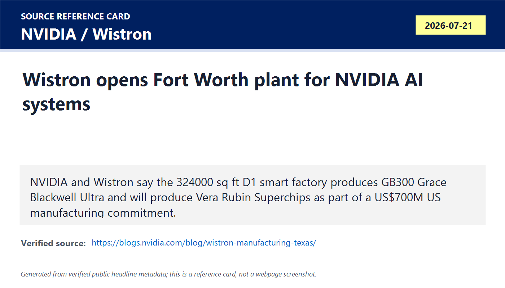
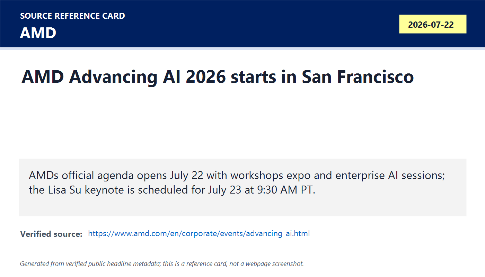
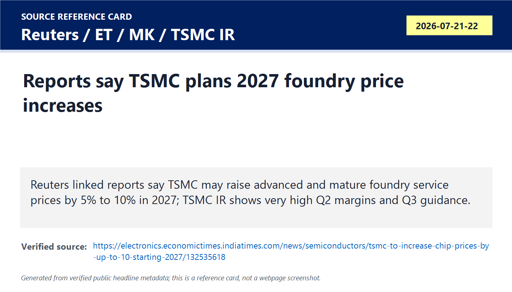
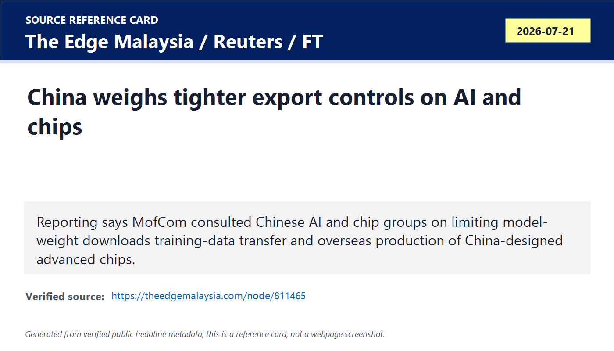
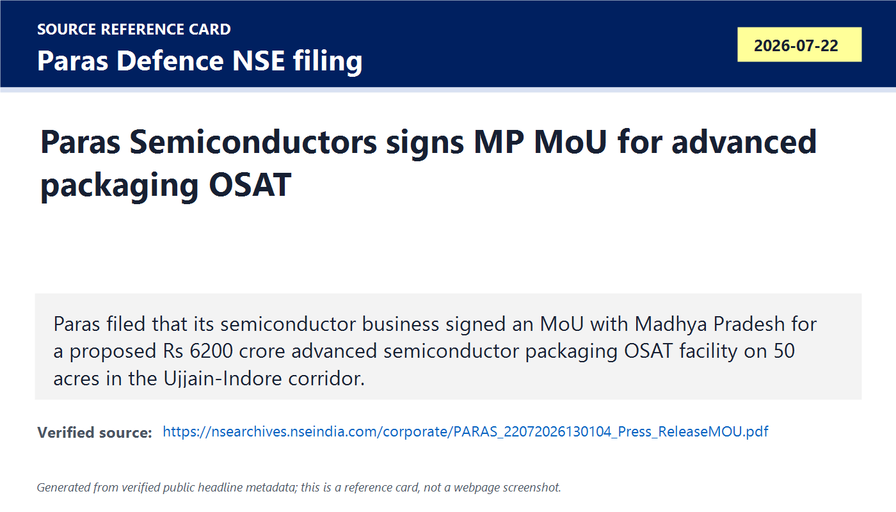
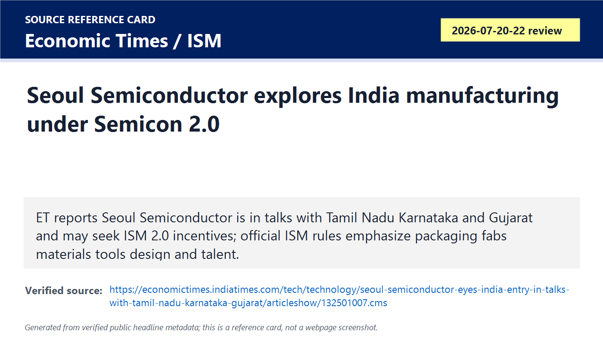
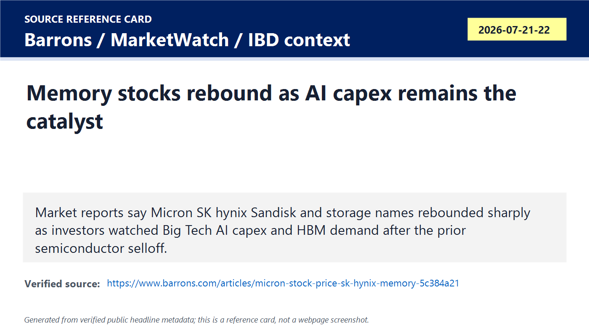

# Daily Semiconductor Current Affairs

Date: 2026-07-22

Research window: Wednesday update through the July 22 afternoon IST review window, with July 21 U.S. announcements included because they entered today's Asia/India market and policy reading cycle. No catch-up day was required after 2026-07-21; this note adds the July 22 daily briefing only.

## Quick Index

| Date | Major Topic | Source Groups | Why To Read |
|---|---|---|---|
| 2026-07-22 | NVIDIA-Wistron U.S. AI-system manufacturing | NVIDIA Blog, Wistron Newsroom, WSJ context | Shows that AI-chip competition is now also about board assembly, system integration, test, logistics, local manufacturing, and factory simulation. |
| 2026-07-22 | AMD Advancing AI opens before July 23 keynote | AMD event page and session agenda | Useful checkpoint before the deeper AMD AI-infrastructure announcements expected at the Lisa Su keynote. |
| 2026-07-22 | TSMC reported 2027 price increases | Reuters/ET, MK, TSMC investor relations | Connects foundry pricing power, mature-node inflation, advanced-node scarcity, overseas fab costs, and AI margin pressure. |
| 2026-07-22 | China reported AI and chip-design export-control review | Reuters/The Edge/FT context | Shows China moving toward U.S.-style technology controls, including model weights, training data, and overseas foundry access. |
| 2026-07-22 | India packaging and components | Paras Defence NSE filing, ET, India Semiconductor Mission | Exact-date India OSAT MoU plus Seoul Semiconductor state-talks follow-up under Semicon 2.0. |
| 2026-07-22 | Memory and semiconductor market signal | Barron's, MarketWatch, IBD context | AI capex expectations revived memory stocks, but the physical evidence still has to come from HBM allocation, deposits, capex, and customer qualification. |

**Page navigation:** [Sources](#source-map) · [Concept review](#concept-review) · [Follow-up](#what-to-watch-next) · [Technical terms](#technical-terms-used-today) · [Master glossary](../knowledge-base/glossary.md)

## Source Images And Manifest

Source manifest: [../images/2026-07-22/links.md](../images/2026-07-22/links.md)

The following are generated source-reference cards based on verified public headline/date/source metadata. They are not webpage screenshots and do not reproduce article bodies.

## Source Map

| Source | Source date | Role | Confidence / limitation |
|---|---:|---|---|
| [NVIDIA Blog: Wistron opens Fort Worth manufacturing plant](https://blogs.nvidia.com/blog/wistron-manufacturing-texas/) | 2026-07-21 | Primary-source NVIDIA account of Wistron's Fort Worth D1 facility, GB300 production, Vera Rubin production plan, $700M commitment, jobs, board output, and digital-twin factory setup | Strong company source for what NVIDIA and Wistron chose to disclose. It does not provide customer volumes, contract economics, yield, delivery schedules by customer, or independent throughput validation. |
| [Wistron Newsroom: first U.S. smart factory](https://www.wistron.com/en/Newsroom/2026-07-22) | 2026-07-21 | Primary-source manufacturer statement on the D1 facility, local assembly and test of NVIDIA systems, digital manufacturing, after-sales service, and supply-chain resilience | Strong company source. It confirms the MoU/plant event and intent, not long-term utilization or profitability. |
| [AMD Advancing AI 2026 event page](https://www.amd.com/en/corporate/events/advancing-ai.html) | 2026-07-22 to 2026-07-23 | Primary-source agenda for July 22 workshops, July 23 Lisa Su keynote, AI infrastructure/architecture/developer sessions, and sponsors | Strong event source. It previews topics but does not yet confirm July 23 product details, benchmarks, pricing, or customer volume. |
| [AMD Advancing AI sessions catalog](https://www.amd.com/en/corporate/events/advancing-ai/sessions-catalog.html) | 2026-07-22 | Primary-source session descriptions, including enterprise AI outcomes and network-transport sessions | Strong for topics under discussion. Session titles are not proof of product adoption. |
| [ETElectronics / Reuters: TSMC to raise prices](https://electronics.economictimes.indiatimes.com/news/semiconductors/tsmc-to-increase-chip-prices-by-up-to-10-starting-2027/132535618) | 2026-07-21 | Reputable reporting on Nikkei-cited 5%-10% 2027 TSMC price increases across advanced and mature foundry services | Reported, not directly confirmed by TSMC. Reuters says TSMC does not comment on specific pricing and frames pricing strategy as strategic. |
| [MK Korea: TSMC pricing stance](https://www.mk.co.kr/en/business/12104103) | 2026-07-22 | Additional regional reporting on mature-node increases, HPC order surcharges, materials costs, packaging costs, gases, and big-customer exposure | Useful corroborating report, machine-translated. Treat details beyond Reuters as reported until primary customer or TSMC confirmation appears. |
| [TSMC Q2 2026 investor page](https://investor.tsmc.com/english/quarterly-results/2026/q2) | 2026-07-16 / reviewed 2026-07-22 | Primary-source financial anchor: Q2 actual revenue/margins and Q3 guidance | Strong official data. It verifies profitability and guidance, not the reported 2027 customer-specific pricing negotiations. |
| [The Edge Malaysia / Reuters: China considers tighter export controls](https://theedgemalaysia.com/node/811465) | 2026-07-21 / posted 2026-07-22 | Reputable reporting on potential Chinese controls covering AI models, model weights, training data transfer, advanced China-designed chips, and overseas chipmaking | Important but explicitly unverified by Reuters at publication time. Treat as "reported / under consideration", not final policy. |
| [Paras Defence NSE filing: Paras Semiconductors MP MoU](https://nsearchives.nseindia.com/corporate/PARAS_22072026130104_Press_ReleaseMOU.pdf) | 2026-07-22 | Primary listed-company filing and press release for a proposed Rs 6,200 crore advanced semiconductor packaging OSAT facility on 50 acres in the Ujjain-Indore corridor | Strong source for the MoU and proposal. An MoU is not a completed fab; funding, approvals, technology partner, equipment orders, customers, and qualification remain open. |
| [Economic Times: Seoul Semiconductor India talks](https://economictimes.indiatimes.com/tech/technology/seoul-semiconductor-eyes-india-entry-in-talks-with-tamil-nadu-karnataka-gujarat/articleshow/132501007.cms) | 2026-07-20 / reviewed 2026-07-22 | India follow-up on Seoul Semiconductor considering manufacturing in India and talking with Tamil Nadu, Karnataka, and Gujarat | Reported through people aware of discussions. It is not a company announcement or signed investment. |
| [India Semiconductor Mission: Semicon 2.0](https://ism.gov.in/schemes/semicon2.0/index) | Last updated 2026-07-15 / reviewed 2026-07-22 | Official policy anchor for Semicon 2.0 outlay, design, machines/materials, fabs, ATMP/OSAT, R&D, and talent pillars | Strong official policy source. Final beneficiary approvals and disbursements still need future documents. |
| [Barron's: Micron and SK hynix stocks jump](https://www.barrons.com/articles/micron-stock-price-sk-hynix-memory-5c384a21) and [MarketWatch live chip rally context](https://www.marketwatch.com/livecoverage/stock-market-today-dow-s-p-500-nasdaq-oil-prices-us-iran-10-day-cease-fire/card/meet-the-biggest-winners-leading-the-chip-rally-on-the-stock-market-HmEUcTSq4SABLA6yKzhQ) | 2026-07-21 to 2026-07-22 | Market-moving context on memory and storage stocks rebounding as investors watch AI capex and HBM demand | Useful for market signal only. Market moves are not physical supply proof, and article access is partly restricted. |

## Verification Matrix

| Item | Confirmed / reported | Do not overclaim | Follow-up |
|---|---|---|---|
| Wistron Fort Worth AI plant | NVIDIA and Wistron confirm a 324,000 sq ft D1 facility in Fort Worth producing GB300 Grace Blackwell Ultra Superchips and planned Vera Rubin Superchips, tied to a $700M advanced U.S. manufacturing commitment. | This does not prove final Nvidia system availability, customer allocation, production yield, cost per board, or schedule by customer. | Track board output, shipment evidence, customer deployments, Vera Rubin ramp timing, after-sales capacity, and whether more U.S. AI-system plants follow. |
| AMD Advancing AI | AMD confirms the conference runs July 22-23 in San Francisco, with workshops/expo on July 22 and the Dr. Lisa Su keynote scheduled July 23 at 9:30 AM PT. | The July 22 agenda is a setup, not the product announcement itself. Do not assume new MI455X/Helios specs beyond AMD's already published material. | Review July 23 keynote, investor Q&A, customer names, software claims, benchmark methodology, and cloud availability. |
| TSMC 2027 pricing | Reuters/ET and MK report 5%-10% TSMC price hikes beginning in 2027, including mature nodes, with possible extra surcharge for forecast-beating HPC orders. TSMC Q2 IR confirms very strong Q2 margins and Q3 guidance. | TSMC has not publicly confirmed customer-specific price increases. Reported percentages should be treated as reported, not contractual facts for each customer. | Watch TSMC transcript, customer gross-margin commentary, Nvidia/AMD/Apple/Broadcom cost comments, and whether mature-node price hikes hit automotive/industrial demand. |
| China export controls | Reuters/The Edge report that Chinese regulators are considering limits on AI model weights, training-data transfer, foreign downloads, and overseas production of China-designed advanced chips. | Reuters could not independently verify at publication. No final rule text or official catalogue revision is available in today's sources. | Track China's technology export-control catalogue, MofCom notice, company responses, and whether TSMC/Qualcomm foundry relationships are affected. |
| Paras MP OSAT | Paras Defence filed that Paras Semiconductors signed an MoU with Madhya Pradesh for a proposed Rs 6,200 crore advanced semiconductor packaging OSAT facility on 50 acres. | A signed MoU and land allocation are early-stage evidence. They are not equivalent to funded capex, equipment purchase orders, customer qualification, or production. | Track project approval under Semicon 2.0/state policy, technology partners, tool orders, cleanroom schedule, hiring, customer pipeline, and first qualified packages. |
| Seoul Semiconductor India talks | ET reports Seoul Semiconductor is exploring an India manufacturing plant and state talks, possibly under ISM 2.0. | This remains a reported discussion. There is no signed investment or official Seoul Semiconductor release in today's evidence set. | Watch Tamil Nadu/Karnataka/Gujarat announcements, ISM application, segment choice, and whether the project is LED packaging, wafer fab, or broader optoelectronics. |
| Memory stock rebound | Market reports show memory and storage names rebounded as investors bet Big Tech AI capex will keep HBM and storage demand strong. | Stock rally does not equal actual HBM output, and a rebound after selloff can be positioning rather than new supply-chain evidence. | Watch Alphabet/Tesla/Big Tech capex, Micron deposits, SK hynix capacity updates, DRAM/HBM contract pricing, and NAND/storage demand. |

## 1. NVIDIA-Wistron: The AI Supply Chain Is Moving From Chip Hype To System Manufacturing

Term: AI systems manufacturing
Definition: AI systems manufacturing is the factory process of building complete AI computing systems from many parts: accelerator modules, CPUs, memory, networking cards, power supplies, cooling hardware, cables, firmware, test fixtures, racks, and logistics workflows. It solves the scale problem that appears after a chip is designed and fabricated: customers need tested systems that can be installed in data centers, not loose dies or boards. In today's news, Wistron's Fort Worth plant matters because NVIDIA's AI platform supply now depends on high-volume board and system production in the U.S., not only on TSMC wafers or Nvidia GPU design. A simple comparison: a wafer fab makes the silicon; system manufacturing turns silicon into shippable AI machines. Source: https://blogs.nvidia.com/blog/wistron-manufacturing-texas/

### Confirmed Facts

NVIDIA says Wistron opened its first U.S. manufacturing facility in Fort Worth on July 21. The site is a 324,000-square-foot greenfield plant. NVIDIA says it currently runs two manufacturing cells: one producing the NVIDIA GB300 Grace Blackwell Ultra Superchip and one planned for the NVIDIA Vera Rubin Superchip. NVIDIA also says the D1 facility is scaling this year toward tens of thousands of boards per month.

Wistron's official newsroom confirms the same core facts: D1 is Wistron's first U.S.-based manufacturing facility, the facility is tied to a US$700 million investment, the first NVIDIA GB300 Grace Blackwell Ultra Superchip was built and mass-produced in the U.S., and the plant is meant to serve local customers while strengthening AI infrastructure manufacturing and after-sales service.

Term: Superchip
Definition: A superchip is a high-performance semiconductor module or package-level product that combines major compute components into a tightly integrated unit, often including CPU, GPU, accelerator, memory interfaces, coherent links, and package/board-level interconnect. It solves the data-movement problem that appears when separate chips are too slow or power-hungry to communicate through ordinary board traces. In today's news, GB300 and Vera Rubin Superchips matter because Wistron's factory is not doing commodity electronics assembly; it is manufacturing the modules at the center of large AI systems. Compared with a normal standalone processor, a superchip is closer to an integrated compute complex built for bandwidth and system-level scaling. Source: https://www.wistron.com/en/Newsroom/2026-07-22

Term: Board-level assembly and test
Definition: Board-level assembly and test is the manufacturing stage where packaged chips and other components are mounted on printed circuit boards, connected, inspected, powered, programmed, and electrically tested before moving into larger systems. It solves the manufacturability problem between packaged silicon and working servers: even a perfect chip can fail at system level because of solder defects, signal-integrity problems, power-delivery faults, firmware issues, or thermal interfaces. In today's news, NVIDIA's "tens of thousands of boards per month" language makes board output a direct capacity metric. Example: TSMC wafer output is upstream; Wistron board output is downstream evidence that AI silicon is becoming deployable infrastructure. Source: https://blogs.nvidia.com/blog/wistron-manufacturing-texas/

Term: Digital twin factory
Definition: A digital twin factory is a virtual model of a physical factory used to simulate layout, material flow, worker procedures, equipment interaction, bottlenecks, safety, energy use, and throughput before or during real operation. It solves the ramp-risk problem: a complex factory can lose months if layout, automation, staffing, or process steps are wrong after equipment arrives. In today's news, Wistron says it used NVIDIA Omniverse, Nemotron, Cosmos, and Metropolis to optimize factory design and operations before scaling D1. Compared with a static CAD layout, a digital twin can model dynamic flows and train workers before the physical line is fully active. Source: https://www.wistron.com/en/Newsroom/2026-07-22

### Analysis

This is not just "NVIDIA supplier opens factory." The important value-chain shift is that AI hardware scarcity is becoming a downstream manufacturing story. A frontier AI platform needs wafer fabrication, advanced packaging, substrate supply, HBM allocation, board assembly, rack integration, burn-in, logistics, field service, and cloud deployment. The Fort Worth item sits after TSMC and packaging in the chain, but before data-center revenue.

That matters because a bottleneck can move. In 2023 the bottleneck was often GPUs and HBM. In 2024-2025 it expanded to CoWoS, substrates, power, liquid cooling, and networking. By 2026, high-volume U.S. AI-system manufacturing is also part of the strategic story. If Wistron can build and test tens of thousands of boards per month, NVIDIA gets a stronger local supply node. If the plant has ramp trouble, AI system availability can still be constrained even if wafers are available.

Term: AI factory
Definition: An AI factory is a data-center-style industrial facility that turns electricity, chips, networking, memory, software, and data into AI outputs such as tokens, model training steps, inference responses, simulations, or recommendations. It solves the business framing problem for AI infrastructure: the output is not a physical good, but compute service at industrial scale. In today's news, NVIDIA and Wistron use the language of AI factories because the manufactured systems are meant to become the production equipment of AI services. A comparison: a steel mill uses energy and machinery to produce steel; an AI factory uses energy and accelerated computing to produce model outputs. Source: https://blogs.nvidia.com/blog/wistron-manufacturing-texas/

### India Angle

India's lesson is practical. Semiconductor self-reliance is not proven only by announcing fabs. A country also needs EMS/ODM capability, board design, server integration, thermal validation, supplier qualification, data-center deployment, service teams, and export-compliant logistics. India's current strengths in electronics manufacturing, cloud services, and engineering services could become valuable if they move up from assembly toward validated AI infrastructure subsystems.

For VLSI careers, this item connects physical design to real systems. A VLSI engineer should be able to explain how chip-package-board interactions affect yield, signal integrity, power integrity, thermals, and test escapes. The factory story is downstream, but it sends feedback upstream into design-for-manufacturing, design-for-test, package-aware timing, and reliability rules.

## 2. AMD Advancing AI: July 22 Is The Setup, July 23 Is The Proof Point

Term: AI infrastructure conference
Definition: An AI infrastructure conference is an industry event where chip vendors, cloud providers, OEMs, developers, and enterprise customers present hardware roadmaps, software stacks, deployment methods, benchmark claims, and partner ecosystems for AI workloads. It solves the coordination problem in a platform business: accelerators need software, systems, channels, and customer confidence before they can challenge an incumbent. In today's news, AMD Advancing AI matters because the July 22 agenda sets up developer and customer sessions before the July 23 Lisa Su keynote. Compared with a simple product launch, this kind of event tries to prove an ecosystem. Source: https://www.amd.com/en/corporate/events/advancing-ai.html

### Confirmed Facts

AMD's official event page lists Advancing AI 2026 as its annual developer, customer, and partner conference in San Francisco on July 22-23. The online keynote with CEO Dr. Lisa Su is scheduled for Thursday, July 23 at 9:30 AM PT. The July 22 agenda includes registration, a luminary talk, expo opening, workshops, tech talks, breakout sessions, and a welcome reception.

AMD's page describes the event focus as AI infrastructure, architecture, and development. The session list includes "Driving Enterprise AI Outcomes with AMD" on July 22 and "From AI Clusters to AI Factories: Exploring Network Transport" on July 23. Sponsors include cloud, server, and platform partners such as AWS, Dell, HPE, Microsoft Azure, Nutanix, Sanmina, Supermicro, Tensorwave, and Vultr.

Term: Network transport
Definition: Network transport is the layer that moves data reliably and efficiently between machines, accelerators, storage, and software services across a network. It solves the cluster-scaling problem: an AI model split across many accelerators can slow down if packets arrive late, congested, reordered, or dropped. In today's news, AMD's session on network transport matters because AI-rack performance depends on communication, not only accelerator arithmetic. A comparison: adding more GPUs without better transport is like adding more lanes to a factory but leaving one narrow loading dock. Source: https://www.amd.com/en/corporate/events/advancing-ai.html

Term: RoCEv2
Definition: RoCEv2 means RDMA over Converged Ethernet version 2, a way to perform remote direct memory access over routable Ethernet/IP networks so one machine can read or write memory on another with lower CPU overhead and lower latency than ordinary software networking. It solves the high-throughput cluster communication problem, especially for storage, HPC, and AI training or inference clusters. In today's news, AMD names RoCEv2 limits in a session about multipath reliable connection, meaning the performance debate is about packet delivery, congestion, and multi-plane Ethernet, not just GPU count. Compared with TCP socket traffic, RDMA aims to bypass more software overhead and move data closer to memory-speed behavior. Source: https://www.amd.com/en/corporate/events/advancing-ai.html

Term: Multipath Reliable Connection
Definition: Multipath Reliable Connection is a network-transport approach that spreads traffic over multiple paths while maintaining reliability, using techniques such as packet spraying, adaptive failover, congestion signaling, and multi-plane Ethernet architecture. It solves the hot-spot and failure problem in huge AI clusters: one congested path should not stall a collective operation across thousands of accelerators. In today's news, AMD's session says MRC can overcome RoCEv2 limits, so this becomes a technical follow-up for AMD's open AI infrastructure pitch. Example: one highway route can jam; multipath transport can use many routes while keeping delivery correct. Source: https://www.amd.com/en/corporate/events/advancing-ai.html

### Analysis

The correct reading today is "setup, not conclusion." AMD has already used Microsoft Azure and Helios as a systems-level credibility story this week. July 22 shows AMD is now trying to build the partner and developer surface around that hardware. The July 23 keynote will matter more because it should disclose what AMD is ready to say publicly about MI455X, Helios, ROCm, customers, scale, and possibly performance methodology.

The network session is important because AI accelerator competition is moving toward cluster efficiency. If AMD can only say "our chip has strong peak compute," the moat is weaker. If AMD can also show reliable network transport, open rack standards, usable software, and cloud provider adoption, then it has a better chance of winning deployments where the customer cares about total cost per token or per training run.

Term: Total cost per token
Definition: Total cost per token is a serving-economics measure that estimates the full cost of generating AI output tokens, including accelerator cost, HBM, server/rack cost, power, cooling, networking, software efficiency, utilization, amortization, and operational overhead. It solves the business comparison problem between AI platforms: the winner is not always the chip with the highest theoretical peak FLOPS. In today's news, AMD's event matters because customers will judge Helios and competing systems by deployment economics, not keynote performance alone. Example: a lower-priced accelerator can still be expensive if utilization, software, or networking is poor. Source: https://www.amd.com/en/products/rackscale-solutions/helios.html

### India Angle

AMD's event has a strong India VLSI/career signal even without a new India plant announcement. Indian engineers working in verification, physical design, firmware, EDA compute, cloud infrastructure, network drivers, and validation should study the full stack: accelerator, memory, CPU, DPU/NIC, interconnect, cooling, runtime, and data-center operations. The jobs are not only "chip design"; they are system validation and software-hardware co-optimization jobs.

## 3. TSMC Pricing: Foundry Scarcity Is Becoming A Cost-Of-AI Story

Term: Foundry price increase
Definition: A foundry price increase is a higher wafer-manufacturing price charged by a contract chipmaker to customers that design chips but do not own that manufacturing line. It solves the supplier-margin problem when demand is strong, tools and materials become expensive, overseas fabs cost more, and customers compete for limited advanced capacity. In today's news, reported TSMC 2027 increases matter because TSMC supplies many AI, smartphone, networking, and HPC chips, so wafer cost can move through Nvidia, AMD, Apple, Qualcomm, Broadcom, and cloud economics. Compared with memory spot pricing, foundry pricing is usually negotiated customer-by-customer and node-by-node. Source: https://electronics.economictimes.indiatimes.com/news/semiconductors/tsmc-to-increase-chip-prices-by-up-to-10-starting-2027/132535618

### Confirmed And Reported Facts

Reuters/ET reports that TSMC plans to raise chipmaking prices by up to 10% from 2027, citing Nikkei Asia. The report says base increases range from 5% to 10% depending on customer and product, mature-node production covering 12 nm, 16 nm, and 28 nm could face increases up to 10%, negotiations began in June and concluded in July, and the new prices would start at the beginning of 2027. Reuters also says TSMC did not comment on specific pricing, but said its pricing strategy is strategic, not opportunistic.

MK's July 22 report adds that orders above forecast volumes in high-performance computing could face an additional surcharge of 10% to 15%, and points to raw materials, equipment, PCBs, packaging, helium, and other gases as cost pressures. Because MK is translated and relies on reporting rather than TSMC confirmation, treat these extra details as reported, not confirmed.

TSMC's official Q2 2026 investor page gives the hard financial anchor: Q2 net revenue of US$40.20B, Q2 gross margin of 67.7%, Q2 operating margin of 60.3%, and Q3 guidance for US$44.6B-US$45.8B revenue, 65.0%-67.0% gross margin, and 56.0%-58.0% operating margin.

Term: Mature node
Definition: A mature node is an older, proven semiconductor process technology such as 28 nm, 16 nm, 12 nm, 40 nm, or larger generations that still manufactures high-volume chips for automotive, industrial, display, power-management, RF, connectivity, and consumer electronics. It solves the cost, reliability, qualification, and longevity problem: many products do not need the smallest transistor and prefer stable supply and proven yields. In today's news, mature nodes matter because reported TSMC increases are not limited to cutting-edge AI chips; price pressure could reach controllers, display drivers, connectivity chips, and industrial parts. Example: a smartphone application processor may use an advanced node, while its power-management or display-driver chips may use mature nodes. Source: https://www.mk.co.kr/en/business/12104103

Term: High-performance computing order surcharge
Definition: A high-performance computing order surcharge is an extra price premium charged when a customer requests more HPC chip volume than its original forecast or allocation. It solves the foundry allocation problem when demand exceeds planned capacity: the supplier uses pricing to prioritize scarce wafers and compensate for disruption. In today's news, MK reports possible 10%-15% surcharges for forecast-beating HPC orders, which would mean urgent AI capacity costs more than planned capacity. A comparison: booked airline seats are cheaper than last-minute seats when capacity is tight. Source: https://www.mk.co.kr/en/business/12104103

Term: Gross margin
Definition: Gross margin is revenue minus cost of goods sold, expressed as a percentage of revenue. It solves the profitability question before operating expenses: how much money remains after direct manufacturing and service costs. In today's news, TSMC's 67.7% Q2 gross margin shows extremely strong foundry economics, while reported price increases may be partly about protecting margins as overseas fabs, materials, equipment, packaging, and energy costs rise. Example: a high revenue number with weak gross margin can still be a poor manufacturing business; TSMC has both high revenue and high gross margin in the latest official quarter. Source: https://investor.tsmc.com/english/quarterly-results/2026/q2

Term: Chipflation
Definition: Chipflation is the pass-through of higher semiconductor costs into more expensive servers, cloud services, PCs, phones, cars, networking equipment, or industrial electronics. It solves the macro/business explanation for why a chip bottleneck affects buyers outside the chip industry. In today's news, TSMC pricing reports and memory-stock movements make chipflation a live question: AI demand can raise wafer, HBM, packaging, power, and system costs faster than customers expected. Compared with ordinary inflation, chipflation is concentrated in the electronic supply chain but can still appear in consumer-device prices and cloud bills. Source: https://www.businessinsider.com/big-tech-spending-capex-earnings-season-memory-prices-ai-2026-7

### Analysis

TSMC's pricing power comes from scarcity plus trust. Customers pay TSMC not only for transistor density. They pay for process maturity, yield learning, design ecosystem, IP libraries, EDA signoff flows, packaging options, supply reliability, and predictable execution. That is why a 5%-10% reported price increase can be accepted by customers even if it hurts margins: switching foundries for leading AI silicon is usually harder than accepting a higher wafer bill.

This also changes how to read AI capex. When a hyperscaler says it is spending more on AI infrastructure, some of that spending is real new compute. Some may be higher prices for wafers, HBM, networking, power, cooling, construction, and labor. The serious question is not just "capex is up." It is "how much usable AI capacity does each dollar buy?"

### India Angle

For India, TSMC price pressure supports the logic of Semicon 2.0 but does not make domestic substitution easy. Higher global wafer prices can attract local policy ambition, but capability still depends on process know-how, yields, suppliers, tools, cleanroom operations, and customer qualification. India may benefit faster in OSAT, advanced packaging, EMS, materials, equipment components, and design services than in replacing TSMC's leading-edge foundry role.

## 4. China Export Controls: Beijing May Be Learning From Washington's Playbook

Term: Technology export controls
Definition: Technology export controls are legal restrictions on exporting, transferring, licensing, sharing, or enabling access to sensitive technology, know-how, software, data, equipment, or products across borders. They solve national-security and strategic-competition problems by trying to prevent rivals from acquiring capabilities that could strengthen military, intelligence, surveillance, or industrial power. In today's news, China is reportedly considering tighter controls on AI and semiconductor technologies, which would mirror parts of the U.S. strategy but from China's side. Example: controlling a chip can restrict hardware movement; controlling model weights or design data can restrict knowledge movement. Source: https://theedgemalaysia.com/node/811465

### Reported Facts

The Edge Malaysia, carrying Reuters/FT context, reports that Chinese authorities are considering tighter export controls on AI and semiconductor technologies. The report says regulators led by China's Ministry of Commerce have consulted domestic AI and chipmaking companies about preventing advanced Chinese technologies and leading startups from being acquired by the West.

It also reports possible limits on transferring key training data overseas, allowing foreign users to download model weights, and allowing overseas chipmakers such as Qualcomm and TSMC to produce advanced semiconductors based on designs developed by Chinese firms including Huawei, Alibaba, and ByteDance. The report says the measures could enter China's catalogue of prohibited or restricted technologies, but Reuters could not immediately verify the report and the named ministries/companies did not immediately respond.

Term: Model weights
Definition: Model weights are the learned numerical parameters inside an AI model that encode how the model transforms inputs into outputs after training. They solve the "knowledge storage" problem in machine learning: the model's capability is largely represented in billions or trillions of numbers rather than in ordinary source code. In today's news, model weights matter because if a foreign user can download them, the capability can travel even without exporting GPUs. A comparison: source code tells a program what steps to run; model weights are the trained values that make the model behave intelligently. Source: https://theedgemalaysia.com/node/811465

Term: Training-data transfer
Definition: Training-data transfer is the movement or sharing of datasets used to train or fine-tune AI models across companies, borders, cloud regions, or legal jurisdictions. It solves the model-development problem by giving developers access to examples the model can learn from, but it creates security, privacy, competitive, and export-control risk when the data is strategic. In today's news, reported Chinese limits on transferring key training data overseas show that AI policy is not only about finished chips; it is also about data flows. Example: a model trained on restricted domestic industrial data could reveal capability even if the hardware stays inside China. Source: https://theedgemalaysia.com/node/811465

Term: Offshore foundry restriction
Definition: An offshore foundry restriction is a rule that limits whether a chip designed in one country can be manufactured by a foundry in another country. It solves the strategic-leakage problem: an advanced chip design may reveal architecture, IP, performance targets, security functions, or customer relationships when handed to a foreign manufacturer. In today's news, reported Chinese discussions could restrict TSMC or Qualcomm-related overseas production of advanced China-designed chips. Compared with a normal fabless model where design can move to any qualified foundry, this would make design origin a policy-controlled variable. Source: https://theedgemalaysia.com/node/811465

### Analysis

The policy logic is important even if the rule is not final. U.S. controls focused for years on advanced AI chips, semiconductor manufacturing equipment, EDA access, and end users. China now appears to be considering controls over AI model weights, training data, startup acquisitions, and chip designs moving to overseas foundries. That means the contest is expanding from "who can buy GPUs" to "who can move capability across borders."

If finalized, such controls could create friction for Chinese fabless companies that rely on TSMC or other foreign production. It could also make global foundry and IP relationships more politically sensitive. The immediate effect is uncertainty, not a confirmed ban. But uncertainty itself changes customer planning because chip tape-outs require months or years of coordination.

### India Angle

India should study this closely. A country building semiconductor capability has to decide what technology can be exported, what data can move abroad, what foreign foundry access is acceptable, and how to balance domestic protection with global integration. Too much restriction can isolate startups; too little may leak strategic capability. For Indian VLSI students, this is a reminder that export-control knowledge is now part of semiconductor career literacy.

## 5. India: Paras MP OSAT Is The Exact-Date Item, Seoul Semiconductor Is The Follow-Up

Term: OSAT
Definition: OSAT means outsourced semiconductor assembly and test. It is the business of taking fabricated wafers or dies from a foundry or IDM, packaging them into usable chip products, marking them, electrically testing them, screening reliability, and shipping qualified parts. It solves the back-end manufacturing problem: a chip die is not a commercial product until it is connected, protected, tested, and traceable. In today's news, Paras Semiconductors' proposed MP facility matters because India can build semiconductor capability through packaging and test before it has many high-volume wafer fabs. Compared with a front-end fab, an OSAT is usually less capital-intensive but still needs strict process control, test engineering, yield, and customer qualification. Source: https://nsearchives.nseindia.com/corporate/PARAS_22072026130104_Press_ReleaseMOU.pdf

### Confirmed Facts

Paras Defence and Space Technologies filed a July 22 exchange communication enclosing a press release titled "Government of Madhya Pradesh and Paras Semiconductors Sign MoU for Rs 6,200 Crore Semiconductor Facility." The filing says Paras Semiconductors signed an MoU with the Government of Madhya Pradesh to establish an advanced semiconductor packaging OSAT facility in the state.

The release says 50 acres have been allotted on the Ujjain-Indore corridor and that the proposed investment is Rs 6,200 crore. It describes Paras Semiconductors as the semiconductor business of Paras Defence, focused on advanced semiconductor capabilities for strategic and high-performance sensor applications, optical and optronic systems, and other strategic applications, with potential future expansion into AI chips and advanced semiconductor technologies.

Term: Advanced semiconductor packaging
Definition: Advanced semiconductor packaging is the set of post-wafer technologies that connect one or more dies, memory stacks, interposers, substrates, heat spreaders, and electrical/thermal interfaces into a high-performance package. It solves the scaling problem that pure transistor shrinking cannot solve alone: modern chips need more memory bandwidth, more I/O, more power delivery, and multi-die integration. In today's news, the phrase matters because Paras is proposing an advanced packaging OSAT, which is more strategic than a simple low-pin-count assembly line if it actually reaches qualified capability. Example: a basic package may protect one die; an advanced package may connect compute dies, HBM, and substrates with very dense interconnect. Source: https://nsearchives.nseindia.com/corporate/PARAS_22072026130104_Press_ReleaseMOU.pdf

Term: Memorandum of Understanding (MoU)
Definition: A Memorandum of Understanding is a formal document recording intent, cooperation areas, proposed obligations, or facilitation between parties before a final binding investment, financing, supply, or project execution agreement is complete. It solves the coordination problem at the early stage of a project: government and company can reserve land, signal seriousness, and begin approvals without proving that every commercial detail is final. In today's news, the Paras MoU is important evidence but not the same as a completed OSAT facility. A comparison: an MoU is a signed plan to explore/build; a purchase order, construction milestone, and qualified shipment prove execution. Source: https://nsearchives.nseindia.com/corporate/PARAS_22072026130104_Press_ReleaseMOU.pdf

Term: Optronic systems
Definition: Optronic systems are electronic systems that use optical sensing or electro-optical components to detect, image, measure, track, guide, or communicate, often in defence, aerospace, surveillance, navigation, and industrial applications. They solve the problem of converting light or infrared signals into usable electronic information. In today's news, Paras' existing optics and optronics background matters because its semiconductor plan is linked to strategic sensors and high-performance applications rather than only commodity packaging. Example: thermal imaging, periscopes, targeting systems, and EO/IR modules combine optical hardware, detectors, electronics, and software. Source: https://nsearchives.nseindia.com/corporate/PARAS_22072026130104_Press_ReleaseMOU.pdf

### Analysis

The Paras announcement is meaningful because it is exact-date, primary, and aligned with India's current policy direction: back-end packaging, sensors, strategic electronics, and regional industrial corridors. But it must be read with discipline. The evidence today is an MoU and land allocation, not production. The hard milestones are still ahead: financing, cleanroom design, tools, technology partner, package types, test platforms, reliability standards, customer design-ins, yield ramp, and first qualified shipments.

If Paras can execute, this could create domestic capability around strategic electronics where India has defence and space demand. The facility's value would be higher if it supports advanced packages, sensors, photonics/optronics, SiP modules, and high-reliability test. It would be weaker if it remains a generic investment headline without proven customer programs.

Term: System-in-package (SiP)
Definition: System-in-package is a package architecture that integrates multiple chips or passive components into one package so the final module behaves like a compact system. It solves size, performance, and integration problems when putting all functions on one monolithic die is too costly, too slow, or technically unsuitable. In today's news, SiP is relevant because strategic sensors and optronic modules often need detectors, analog front ends, processors, memory, power management, and RF/optical interfaces close together. Compared with a system-on-chip, SiP keeps functions on separate dies or components but integrates them inside one package. Source: https://www.semi.org/en/resources/semiconductor101

### Seoul Semiconductor Follow-Up

ET reports that Seoul Semiconductor is assessing a manufacturing plant in India and talking with Tamil Nadu, Karnataka, and Gujarat. The company may seek incentives under ISM 2.0. This remains a reported discussion, but it fits India's policy emphasis because Seoul Semiconductor is an optoelectronics and LED company, and Semicon 2.0 includes support for fabs, compound semiconductors, packaging, materials, machines, and design.

Term: Optoelectronics
Definition: Optoelectronics is the semiconductor field that converts electricity into light or light into electrical signals using devices such as LEDs, laser diodes, photodiodes, image sensors, optical modules, and some display or communication components. It solves the interface problem between electronic circuits and the optical world. In today's news, Seoul Semiconductor matters because LED and optoelectronic manufacturing is a realistic semiconductor-adjacent capability for India, especially in automotive lighting, smart cities, displays, agriculture, and industrial systems. Compared with a CPU or GPU, an optoelectronic device is judged by light output, wavelength, efficiency, thermal behavior, reliability, and packaging. Source: https://economictimes.indiatimes.com/tech/technology/seoul-semiconductor-eyes-india-entry-in-talks-with-tamil-nadu-karnataka-gujarat/articleshow/132501007.cms

Term: Semicon 2.0
Definition: Semicon 2.0 is the second phase of India's Semicon India Programme, approved with a fiscal outlay of Rs 1,27,500 crore to build a resilient semiconductor ecosystem across design, machines/materials, fabs, ATMP/OSAT, R&D, and talent. It solves the policy-depth problem: a semiconductor ecosystem needs tools, gases, chemicals, packaging, suppliers, design IP, trained engineers, and fabs, not only one flagship plant. In today's news, Semicon 2.0 matters because both Paras and Seoul-style opportunities should be judged against the programme's actual incentive pillars and future approvals. Example: design support may help a fabless startup, while advanced packaging support may help an OSAT project. Source: https://ism.gov.in/schemes/semicon2.0/index

Term: Deployment-linked incentive
Definition: A deployment-linked incentive is a policy benefit tied to getting a design or product deployed into real use rather than only funding early development. It solves the commercialization gap in chip design: a startup can complete RTL and tape-out but still fail to win customers because prototypes, masks, validation, and ecosystem entry are expensive. In today's news, ISM's deployment-linked design support matters because India wants chip IP and SoCs to move into products, not remain academic demonstrations. A comparison: a grant can fund an attempt; a deployment-linked incentive rewards evidence that the design reaches market or strategic use. Source: https://ism.gov.in/schemes/semicon2.0/index

## 6. Memory And Market Signal: The Rebound Is Real, But It Is Not Manufacturing Proof

Term: HBM demand signal
Definition: An HBM demand signal is evidence that customers need more high-bandwidth memory for AI accelerators, servers, or custom chips, such as signed supply agreements, deposits, sold-out capacity, capex, tool orders, customer qualification, or sustained price strength. It solves the difference between stock-market enthusiasm and actual physical demand. In today's news, memory stocks rebounding ahead of Big Tech earnings is a market signal, but the stronger evidence still comes from supplier filings, HBM allocation, and equipment commitments. Example: a 10% stock rise is sentiment; a take-or-pay contract or qualified HBM stack shipment is operational evidence. Source: https://www.barrons.com/articles/micron-stock-price-sk-hynix-memory-5c384a21

### Reported Facts

Barron's and MarketWatch context indicate that Micron, SK hynix ADRs, Sandisk, and storage-related names rebounded sharply after the earlier chip selloff, helped by renewed expectations that Big Tech AI capex will keep memory and storage demand strong. IBD also frames the move as part of a broader semiconductor and AI-stock rebound while investors wait for Alphabet and Tesla earnings.

Term: Capital expenditure (capex)
Definition: Capital expenditure is spending on long-lived assets such as fabs, tools, data centers, servers, power systems, cooling, buildings, and infrastructure. It solves the future-capacity problem: companies must spend before output or revenue appears. In today's news, Big Tech capex matters because AI demand for HBM, foundry wafers, packaging, power components, networking, and storage depends on whether cloud providers keep building clusters. A comparison: operating expense pays for today; capex builds the machinery and facilities for tomorrow. Source: https://www.investopedia.com/terms/c/capitalexpenditure.asp

### Analysis

The market rebound is important but should be categorized correctly. It is a price signal, not a factory signal. It tells us investors are again willing to pay for memory exposure because AI capex expectations remain strong and because HBM supply is still viewed as tight. It does not tell us that Micron or SK hynix instantly produced more HBM, that CXMT has matched HBM competitiveness, or that Google-style model-embedding ideas will reduce memory demand by 2028.

For review discipline, separate four evidence levels:

| Evidence level | Example | How strong? |
|---|---|---|
| Market reaction | Micron/SK hynix/Sandisk shares rise | Useful sentiment, weak physical proof |
| Customer budget signal | Alphabet, Microsoft, Meta, Amazon capex | Stronger demand signal, but may include cost inflation |
| Supplier commitment | Micron SCAs, deposits, HBM sold-out statements | Stronger because it affects production planning |
| Manufacturing proof | qualified HBM output, yields, tool installs, shipments | Strongest operational evidence |

## Follow-Up Ledger

| Prior Item | Status On 2026-07-22 | Update |
|---|---|---|
| AMD-Microsoft Helios after July 21 note | Updated / still pending | July 22 AMD Advancing AI opened, but the main keynote is July 23. Wait for product/customer/benchmark details before closing. |
| Memory contract and chipflation debate | Still pending | July 22 market rebound strengthens the sentiment signal, but operational proof still requires Micron deposits, SK hynix capacity data, HBM pricing, and Big Tech capex commentary. |
| China/Korea memory rotation and CXMT watch | Still pending | Today's China export-control report adds policy risk around AI/model/chip design flows, but no final rule or CXMT filing has landed in this note. |
| India Semicon 2.0 machines/materials/ATMP follow-up | Updated | Paras MP OSAT MoU is a concrete exact-date India packaging development. It remains early-stage until funding, tools, partners, customers, and production milestones appear. |
| Seoul Semiconductor India talks | Still pending | Reported talks with Tamil Nadu, Karnataka, and Gujarat remain active watch items. No signed investment source found today. |
| TSMC price pressure from June and July notes | Updated | Reuters/ET/MK reporting now points to 2027 price increases across advanced and mature nodes; primary TSMC data verifies high margins but not customer-specific price hikes. |
| TSMC Arizona/fab-cost concern | Still pending | Reported price hikes may be partly tied to overseas expansion cost, but exact Arizona cost allocation is not disclosed. |
| India equipment-components ecosystem | Updated | Semicon 2.0 official pillars and Paras packaging MoU show policy direction; qualified local equipment and materials suppliers are still the key missing evidence. |

## Concept Review

| Concept | Key Distinction | Why It Matters |
|---|---|---|
| Wafer fabrication vs system manufacturing | A fab makes processed wafers; a system factory assembles boards, racks, firmware, cooling, and test into deployable AI hardware. | Wistron Fort Worth shows NVIDIA's U.S. AI supply chain depends on downstream manufacturing too. |
| Product launch vs ecosystem event | A product launch announces hardware; an ecosystem event proves partners, developers, customers, software, and deployment routes. | AMD July 22 is the setup; July 23 keynote is the checkpoint. |
| Reported price hike vs confirmed financials | TSMC price percentages are reported; TSMC Q2 margins and Q3 guidance are official. | Prevents overclaiming while still recognizing foundry pricing pressure. |
| Mature node vs advanced node | Mature nodes serve stable high-volume electronics; advanced nodes serve high-performance logic and AI. | TSMC price pressure could hit both AI leaders and ordinary electronics supply. |
| Exporting chips vs exporting capability | Hardware export rules control devices; model-weight, data, design, and foundry restrictions control knowledge and production pathways. | China policy reports are about AI capability movement, not only chip shipments. |
| MoU vs qualified production | An MoU signals intent and coordination; production requires capex, tools, cleanrooms, engineers, customers, yield, and reliability. | Paras MP OSAT should be tracked as an early-stage project, not completed capability. |
| Market signal vs manufacturing proof | Stock moves show investor expectations; factory proof comes from tool installs, qualified output, customer shipments, and financial filings. | The memory rebound matters, but it does not prove HBM supply has improved. |

## VLSI And Career Relevance

1. Learn how package, board, and system constraints feed back into chip design. Signal integrity, power integrity, thermals, DFT, firmware, and production test are not optional details for AI hardware.
2. Study network transport for AI clusters. RoCEv2, multipath routing, congestion control, and collective communication are becoming hardware-adjacent topics for accelerator engineers.
3. Understand foundry economics. A process node is not only physics; it is a business contract involving yield, allocation, wafer price, mask cost, IP, EDA flow, and customer trust.
4. Treat export controls as part of semiconductor literacy. EDA tools, model weights, foundry access, and design data can all become policy-controlled assets.
5. For India, follow packaging/test execution. OSAT roles need DFT, ATE, failure analysis, reliability, thermal/mechanical packaging knowledge, and quality systems.

## India Relevance

India had two useful signals today. The stronger one is Paras' exchange-filed MP OSAT MoU because it is primary and exact-date. The weaker but still relevant one is Seoul Semiconductor's reported India manufacturing exploration because it maps to optoelectronics and Semicon 2.0 incentives.

The practical policy lesson is that India's semiconductor strategy is shifting toward a full ecosystem:

| Layer | Today's Evidence | What To Verify Next |
|---|---|---|
| Packaging/test | Paras proposed MP advanced packaging OSAT | Package type, tool list, technology partner, customer qualification, production date |
| Optoelectronics | Seoul Semiconductor reported state talks | Official company confirmation, state selection, LED fab vs packaging scope |
| Design/IP | ISM design and deployment-linked incentive pillar | Beneficiary list, tape-outs, deployed products, EDA access |
| Machines/materials | ISM machines/materials pillar | Qualified suppliers, chemical/gas projects, global toolmaker partnerships |
| Talent | ISM says 320 universities and 70,000 students trained | Placement, internships, hands-on fab/packaging/test exposure |

## Interview Questions

1. Why does AI-system manufacturing matter even after a GPU or superchip has been designed?
2. What is the difference between wafer fabrication, advanced packaging, board assembly, and rack integration?
3. Why does a digital twin help a factory ramp faster?
4. Why should AMD talk about network transport and open infrastructure instead of only accelerator FLOPS?
5. What are RoCEv2 and multipath reliable connection trying to solve in AI clusters?
6. Why can TSMC raise prices even when customers already know it has high gross margin?
7. What is the difference between a reported foundry price increase and official TSMC financial data?
8. Why are mature nodes still strategic when AI uses advanced nodes?
9. How can model weights become an export-control issue?
10. Why might a country restrict overseas foundry production of domestically designed chips?
11. What evidence would prove that the Paras MP OSAT project has moved beyond an MoU?
12. Why is OSAT important for India's semiconductor strategy?
13. How is optoelectronics different from logic-chip manufacturing?
14. Why should memory-stock rallies be treated as market signals rather than manufacturing proof?
15. Which semiconductor career roles are connected to today's stories: DFT, ATE, packaging, physical design, firmware, cloud, or policy?

## What To Watch Next

1. AMD July 23 keynote, investor Q&A, and any MI455X/Helios/customer/ROCm updates.
2. Wistron D1 output evidence: board-per-month ramp, customer shipments, Vera Rubin production start, and defect/yield commentary.
3. TSMC price confirmation through customer commentary, 2027 contract signals, and future margin guidance.
4. Big Tech earnings and capex commentary from Alphabet, Tesla, Microsoft, Meta, Amazon, and cloud hardware suppliers.
5. Memory supplier evidence: Micron deposits, SK hynix HBM capacity, Samsung HBM qualification, DRAM/HBM contract pricing.
6. China technology export-control catalogue revision and any official MofCom notice.
7. Paras MP OSAT milestones: final investment decision, incentives, land handover, construction, equipment, hiring, technology partner, and package qualification.
8. Seoul Semiconductor India decision, state selection, and whether the facility is LED packaging, wafer processing, or broader optoelectronics.
9. Semicon 2.0 notifications, beneficiary approvals, disbursement structure, and machines/materials incentive details.
10. Whether TSMC price increases feed into consumer-device, cloud, automotive, or industrial chip pricing.

## Final Takeaway

July 22 is a supply-chain realism day. NVIDIA and Wistron show that AI leadership requires factories that can build and test boards at volume. AMD's event reminds us that the next proof point is ecosystem execution, not only accelerator specs. TSMC pricing reports show that AI demand and global fab expansion can turn into higher wafer costs across advanced and mature nodes. China's reported export-control review shows that AI capability is now treated like a strategic asset across chips, data, model weights, and foundry access. India's Paras MP OSAT MoU is useful but early evidence: the real test is whether the project becomes qualified packaging and test capacity.

## Technical Terms Used Today

[Back to quick index](#quick-index) · [Open the master A-Z glossary](../knowledge-base/glossary.md)

**Term index:** [Advanced semiconductor packaging](#daily-term-advanced-semiconductor-packaging) · [AI factory](#daily-term-ai-factory) · [AI infrastructure conference](#daily-term-ai-infrastructure-conference) · [AI systems manufacturing](#daily-term-ai-systems-manufacturing) · [Board-level assembly and test](#daily-term-board-level-assembly-and-test) · [Capital expenditure (capex)](#daily-term-capital-expenditure-capex) · [Chipflation](#daily-term-chipflation) · [Deployment-linked incentive](#daily-term-deployment-linked-incentive) · [Digital twin factory](#daily-term-digital-twin-factory) · [Foundry price increase](#daily-term-foundry-price-increase) · [Gross margin](#daily-term-gross-margin) · [HBM demand signal](#daily-term-hbm-demand-signal) · [High-performance computing order surcharge](#daily-term-high-performance-computing-order-surcharge) · [Mature node](#daily-term-mature-node) · [Memorandum of Understanding (MoU)](#daily-term-memorandum-of-understanding-mou) · [Model weights](#daily-term-model-weights) · [Multipath Reliable Connection](#daily-term-multipath-reliable-connection) · [Network transport](#daily-term-network-transport) · [Offshore foundry restriction](#daily-term-offshore-foundry-restriction) · [Optoelectronics](#daily-term-optoelectronics) · [Optronic systems](#daily-term-optronic-systems) · [OSAT](#daily-term-osat) · [RoCEv2](#daily-term-rocev2) · [Semicon 2.0](#daily-term-semicon-2-0) · [Superchip](#daily-term-superchip) · [System-in-package (SiP)](#daily-term-system-in-package-sip) · [Technology export controls](#daily-term-technology-export-controls) · [Total cost per token](#daily-term-total-cost-per-token) · [Training-data transfer](#daily-term-training-data-transfer)

| Term | Meaning |
|---|---|
| [**Advanced semiconductor packaging**](../knowledge-base/glossary.md#term-advanced-semiconductor-packaging) | Advanced semiconductor packaging is the set of post-wafer technologies that connect one or more dies, memory stacks, interposers, substrates, heat spreaders, and electrical/thermal interfaces into a high-performance package. It solves the scaling problem that pure transistor shrinking cannot solve alone: modern chips need more memory bandwidth, more I/O, more power delivery, and multi-die integration. |
| [**AI factory**](../knowledge-base/glossary.md#term-ai-factory) | An AI factory is a data-center-style industrial facility that turns electricity, chips, networking, memory, software, and data into AI outputs such as tokens, model training steps, inference responses, simulations, or recommendations. It solves the business framing problem for AI infrastructure: the output is not a physical good, but compute service at industrial scale. |
| [**AI infrastructure conference**](../knowledge-base/glossary.md#term-ai-infrastructure-conference) | An AI infrastructure conference is an industry event where chip vendors, cloud providers, OEMs, developers, and enterprise customers present hardware roadmaps, software stacks, deployment methods, benchmark claims, and partner ecosystems for AI workloads. It solves the coordination problem in a platform business: accelerators need software, systems, channels, and customer confidence before they can challenge an incumbent. |
| [**AI systems manufacturing**](../knowledge-base/glossary.md#term-ai-systems-manufacturing) | AI systems manufacturing is the factory process of building complete AI computing systems from many parts: accelerator modules, CPUs, memory, networking cards, power supplies, cooling hardware, cables, firmware, test fixtures, racks, and logistics workflows. It solves the scale problem that appears after a chip is designed and fabricated: customers need tested systems that can be installed in data centers, not loose dies or boards. |
| [**Board-level assembly and test**](../knowledge-base/glossary.md#term-board-level-assembly-and-test) | Board-level assembly and test is the manufacturing stage where packaged chips and other components are mounted on printed circuit boards, connected, inspected, powered, programmed, and electrically tested before moving into larger systems. It solves the manufacturability problem between packaged silicon and working servers: even a perfect chip can fail at system level because of solder defects, signal-integrity problems, power-delivery faults, firmware issues, or thermal interfaces. |
| [**Capital expenditure (capex)**](../knowledge-base/glossary.md#term-capital-expenditure-capex) | Capital expenditure is spending on long-lived assets such as fabs, tools, data centers, servers, power systems, cooling, buildings, and infrastructure. It solves the future-capacity problem: companies must spend before output or revenue appears. |
| [**Chipflation**](../knowledge-base/glossary.md#term-chipflation) | Chipflation is the pass-through of higher semiconductor costs into more expensive servers, cloud services, PCs, phones, cars, networking equipment, or industrial electronics. It solves the macro/business explanation for why a chip bottleneck affects buyers outside the chip industry. |
| [**Deployment-linked incentive**](../knowledge-base/glossary.md#term-deployment-linked-incentive) | A deployment-linked incentive is a policy benefit tied to getting a design or product deployed into real use rather than only funding early development. It solves the commercialization gap in chip design: a startup can complete RTL and tape-out but still fail to win customers because prototypes, masks, validation, and ecosystem entry are expensive. |
| [**Digital twin factory**](../knowledge-base/glossary.md#term-digital-twin-factory) | A digital twin factory is a virtual model of a physical factory used to simulate layout, material flow, worker procedures, equipment interaction, bottlenecks, safety, energy use, and throughput before or during real operation. It solves the ramp-risk problem: a complex factory can lose months if layout, automation, staffing, or process steps are wrong after equipment arrives. |
| [**Foundry price increase**](../knowledge-base/glossary.md#term-foundry-price-increase) | A foundry price increase is a higher wafer-manufacturing price charged by a contract chipmaker to customers that design chips but do not own that manufacturing line. It solves the supplier-margin problem when demand is strong, tools and materials become expensive, overseas fabs cost more, and customers compete for limited advanced capacity. |
| [**Gross margin**](../knowledge-base/glossary.md#term-gross-margin) | Gross margin is revenue minus cost of goods sold, expressed as a percentage of revenue. It solves the profitability question before operating expenses: how much money remains after direct manufacturing and service costs. |
| [**HBM demand signal**](../knowledge-base/glossary.md#term-hbm-demand-signal) | An HBM demand signal is evidence that customers need more high-bandwidth memory for AI accelerators, servers, or custom chips, such as signed supply agreements, deposits, sold-out capacity, capex, tool orders, customer qualification, or sustained price strength. It solves the difference between stock-market enthusiasm and actual physical demand. |
| [**High-performance computing order surcharge**](../knowledge-base/glossary.md#term-high-performance-computing-order-surcharge) | A high-performance computing order surcharge is an extra price premium charged when a customer requests more HPC chip volume than its original forecast or allocation. It solves the foundry allocation problem when demand exceeds planned capacity: the supplier uses pricing to prioritize scarce wafers and compensate for disruption. |
| [**Mature node**](../knowledge-base/glossary.md#term-mature-node) | A mature node is an older, proven semiconductor process technology such as 28 nm, 16 nm, 12 nm, 40 nm, or larger generations that still manufactures high-volume chips for automotive, industrial, display, power-management, RF, connectivity, and consumer electronics. It solves the cost, reliability, qualification, and longevity problem: many products do not need the smallest transistor and prefer stable supply and proven yields. |
| [**Memorandum of Understanding (MoU)**](../knowledge-base/glossary.md#term-memorandum-of-understanding-mou) | A Memorandum of Understanding is a formal document recording intent, cooperation areas, proposed obligations, or facilitation between parties before a final binding investment, financing, supply, or project execution agreement is complete. It solves the coordination problem at the early stage of a project: government and company can reserve land, signal seriousness, and begin approvals without proving that every commercial detail is final. |
| [**Model weights**](../knowledge-base/glossary.md#term-model-weights) | Model weights are the learned numerical parameters inside an AI model that encode how the model transforms inputs into outputs after training. They solve the "knowledge storage" problem in machine learning: the model's capability is largely represented in billions or trillions of numbers rather than in ordinary source code. |
| [**Multipath Reliable Connection**](../knowledge-base/glossary.md#term-multipath-reliable-connection) | Multipath Reliable Connection is a network-transport approach that spreads traffic over multiple paths while maintaining reliability, using techniques such as packet spraying, adaptive failover, congestion signaling, and multi-plane Ethernet architecture. It solves the hot-spot and failure problem in huge AI clusters: one congested path should not stall a collective operation across thousands of accelerators. |
| [**Network transport**](../knowledge-base/glossary.md#term-network-transport) | Network transport is the layer that moves data reliably and efficiently between machines, accelerators, storage, and software services across a network. It solves the cluster-scaling problem: an AI model split across many accelerators can slow down if packets arrive late, congested, reordered, or dropped. |
| [**Offshore foundry restriction**](../knowledge-base/glossary.md#term-offshore-foundry-restriction) | An offshore foundry restriction is a rule that limits whether a chip designed in one country can be manufactured by a foundry in another country. It solves the strategic-leakage problem: an advanced chip design may reveal architecture, IP, performance targets, security functions, or customer relationships when handed to a foreign manufacturer. |
| [**Optoelectronics**](../knowledge-base/glossary.md#term-optoelectronics) | Optoelectronics is the semiconductor field that converts electricity into light or light into electrical signals using devices such as LEDs, laser diodes, photodiodes, image sensors, optical modules, and some display or communication components. It solves the interface problem between electronic circuits and the optical world. |
| [**Optronic systems**](../knowledge-base/glossary.md#term-optronic-systems) | Optronic systems are electronic systems that use optical sensing or electro-optical components to detect, image, measure, track, guide, or communicate, often in defence, aerospace, surveillance, navigation, and industrial applications. They solve the problem of converting light or infrared signals into usable electronic information. |
| [**OSAT**](../knowledge-base/glossary.md#term-osat) | OSAT means outsourced semiconductor assembly and test. It is the business of taking fabricated wafers or dies from a foundry or IDM, packaging them into usable chip products, marking them, electrically testing them, screening reliability, and shipping qualified parts. |
| [**RoCEv2**](../knowledge-base/glossary.md#term-rocev2) | RoCEv2 means RDMA over Converged Ethernet version 2, a way to perform remote direct memory access over routable Ethernet/IP networks so one machine can read or write memory on another with lower CPU overhead and lower latency than ordinary software networking. It solves the high-throughput cluster communication problem, especially for storage, HPC, and AI training or inference clusters. |
| [**Semicon 2.0**](../knowledge-base/glossary.md#term-semicon-2-0) | Semicon 2.0 is the second phase of India's Semicon India Programme, approved with a fiscal outlay of Rs 1,27,500 crore to build a resilient semiconductor ecosystem across design, machines/materials, fabs, ATMP/OSAT, R&D, and talent. It solves the policy-depth problem: a semiconductor ecosystem needs tools, gases, chemicals, packaging, suppliers, design IP, trained engineers, and fabs, not only one flagship plant. |
| [**Superchip**](../knowledge-base/glossary.md#term-superchip) | A superchip is a high-performance semiconductor module or package-level product that combines major compute components into a tightly integrated unit, often including CPU, GPU, accelerator, memory interfaces, coherent links, and package/board-level interconnect. It solves the data-movement problem that appears when separate chips are too slow or power-hungry to communicate through ordinary board traces. |
| [**System-in-package (SiP)**](../knowledge-base/glossary.md#term-system-in-package-sip) | System-in-package is a package architecture that integrates multiple chips or passive components into one package so the final module behaves like a compact system. It solves size, performance, and integration problems when putting all functions on one monolithic die is too costly, too slow, or technically unsuitable. |
| [**Technology export controls**](../knowledge-base/glossary.md#term-technology-export-controls) | Technology export controls are legal restrictions on exporting, transferring, licensing, sharing, or enabling access to sensitive technology, know-how, software, data, equipment, or products across borders. They solve national-security and strategic-competition problems by trying to prevent rivals from acquiring capabilities that could strengthen military, intelligence, surveillance, or industrial power. |
| [**Total cost per token**](../knowledge-base/glossary.md#term-total-cost-per-token) | Total cost per token is a serving-economics measure that estimates the full cost of generating AI output tokens, including accelerator cost, HBM, server/rack cost, power, cooling, networking, software efficiency, utilization, amortization, and operational overhead. It solves the business comparison problem between AI platforms: the winner is not always the chip with the highest theoretical peak FLOPS. |
| [**Training-data transfer**](../knowledge-base/glossary.md#term-training-data-transfer) | Training-data transfer is the movement or sharing of datasets used to train or fine-tune AI models across companies, borders, cloud regions, or legal jurisdictions. It solves the model-development problem by giving developers access to examples the model can learn from, but it creates security, privacy, competitive, and export-control risk when the data is strategic. |

This page-end index covers the specialist terms central to this day's study. The fuller explanation, news context, and source remain at first use; the master glossary combines repeated terms across all days.
