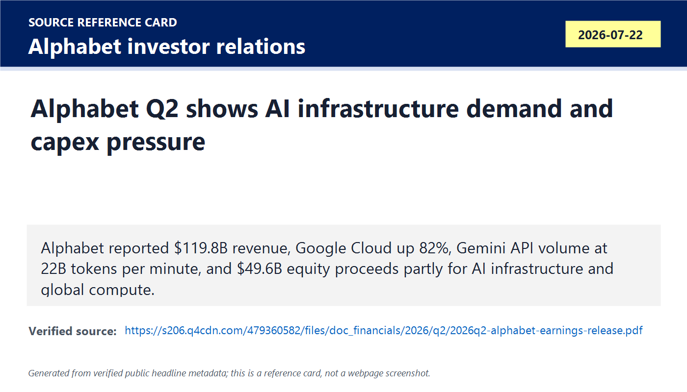
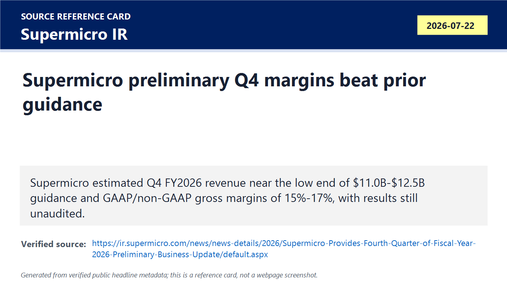
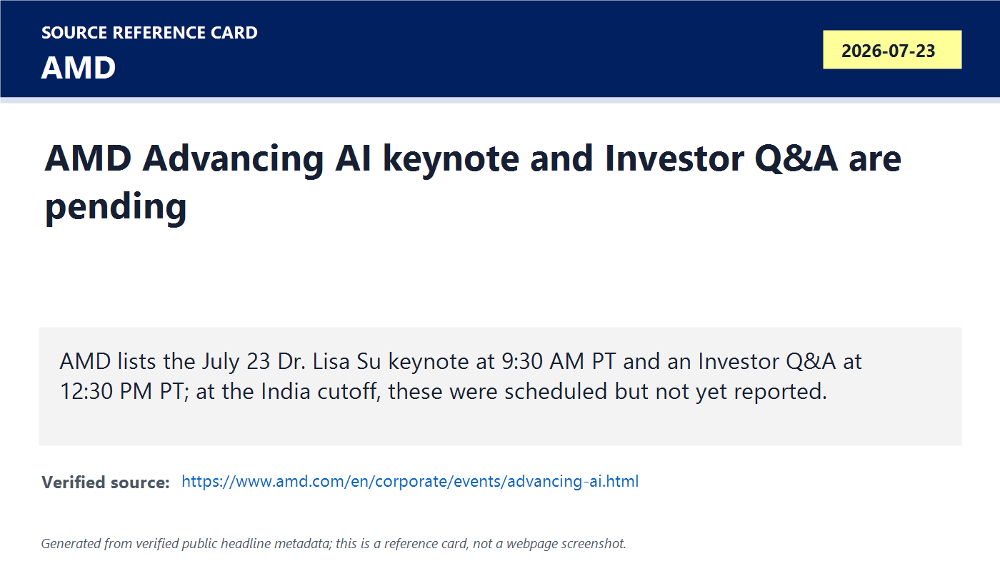
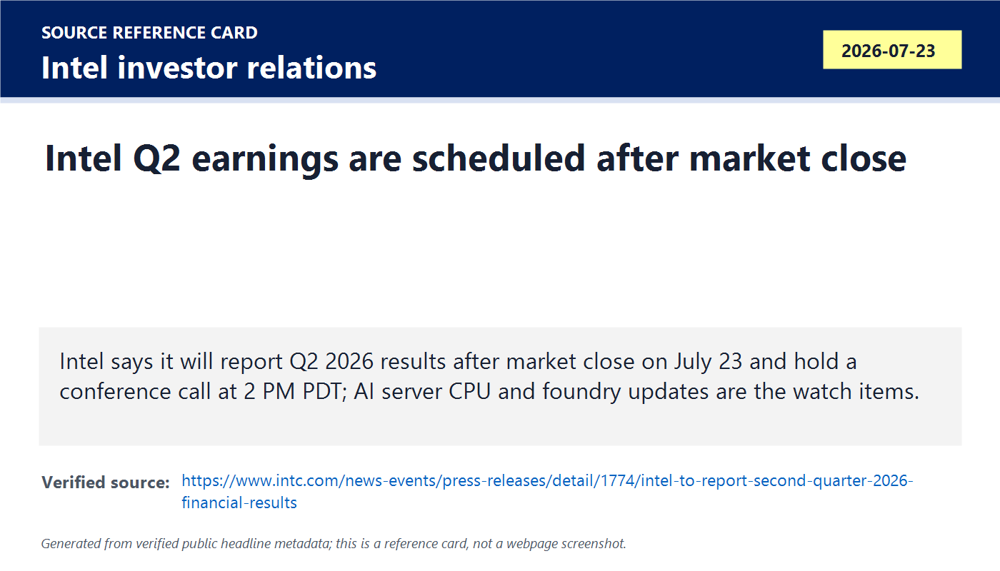
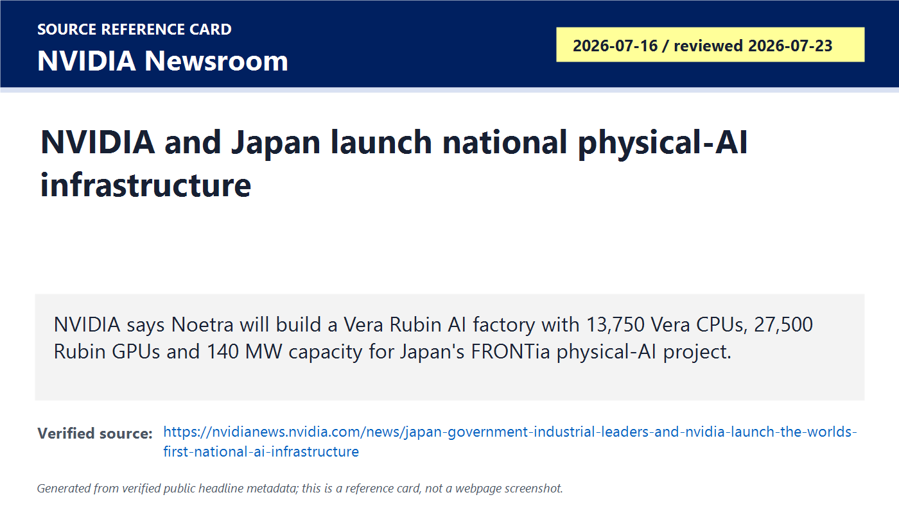
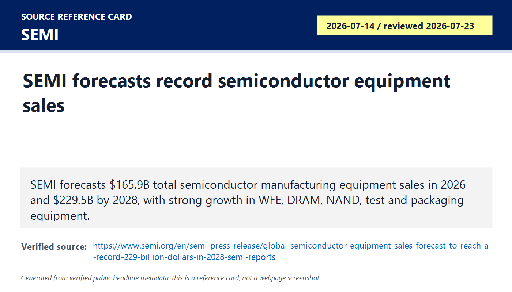
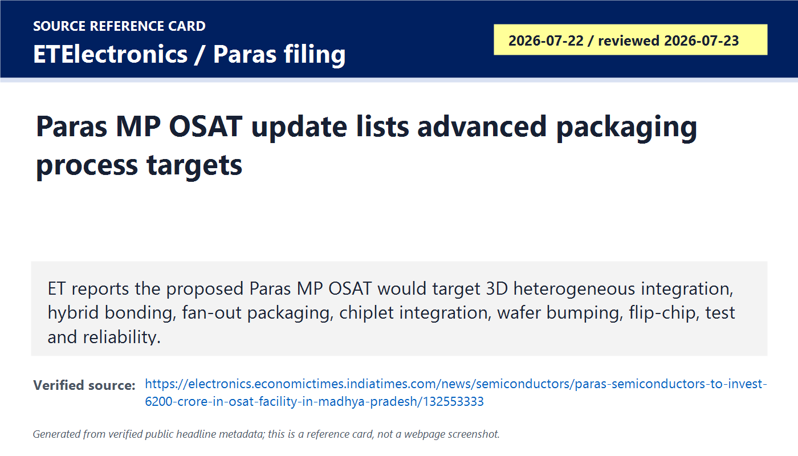
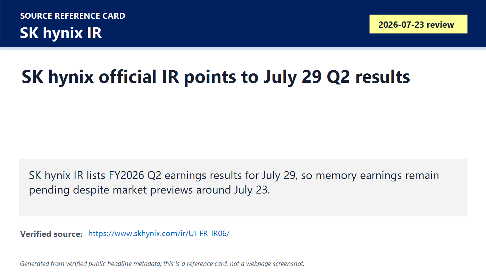

# Daily Semiconductor Current Affairs

Date: 2026-07-23

Research window: Thursday update through approximately 15:20 IST / 09:50 UTC on July 23. No catch-up day was required after 2026-07-22; this note adds the July 23 daily briefing only. AMD Advancing AI and Intel Q2 earnings are scheduled later on July 23 U.S. time, so they are tracked here as pending proof points, not as completed announcements.

## Quick Index

| Date | Major Topic | Source Groups | Why To Read |
|---|---|---|---|
| 2026-07-23 | Alphabet AI infrastructure demand and funding signal | Alphabet investor relations, market context | Shows how hyperscaler AI demand flows into accelerators, custom silicon, HBM, storage, networking, power, and data-center capex while creating return-on-capital pressure. |
| 2026-07-23 | Supermicro preliminary Q4 update | Supermicro IR, market context | AI server demand is visible downstream from chips; margin strength matters, but the result is preliminary and has an export-control-review caveat. |
| 2026-07-23 | AMD and Intel same-day proof-point watch | AMD event page, Intel investor relations | AMD's keynote and Intel's earnings are later U.S.-time events, so the disciplined reading is to track what evidence must land next. |
| 2026-07-23 | NVIDIA-Noetra Japan sovereign AI infrastructure | NVIDIA Newsroom, FT techAsia context | Japan is linking AI accelerators, national compute capacity, robotics, factory models, and industrial policy into one sovereign AI infrastructure project. |
| 2026-07-23 | SEMI equipment forecast catch-up | SEMI | Equipment demand gives the upstream view: WFE, DRAM, NAND, test, and advanced packaging tools are where AI capex becomes factory capacity. |
| 2026-07-23 | India Paras OSAT process detail update | Paras NSE filing, ETElectronics, PIB/ISM background | Adds process-level detail to the July 22 Paras MP OSAT MoU and turns it into a better packaging/test study item. |
| 2026-07-23 | Pending memory, EDA/IP, and export-control follow-ups | SK hynix IR, TSMC news page, China export-control reports | Keeps unresolved items clean: SK hynix earnings are official for July 29, TSMC has no new official July 23 release, and China controls remain reported but not final. |

**Page navigation:** [Sources](#source-map) · [Concept review](#concept-review) · [Follow-up](#what-to-watch-next) · [Technical terms](#technical-terms-used-today) · [Master glossary](../knowledge-base/glossary.md)

## Source Images And Manifest

Source manifest: [../images/2026-07-23/links.md](../images/2026-07-23/links.md)

The following are generated source-reference cards based on verified public headline/date/source metadata. They are not webpage screenshots and do not reproduce article bodies.

## Source Map

| Source | Source date | Role | Confidence / limitation |
|---|---:|---|---|
| [Alphabet Q2 2026 earnings release PDF](https://s206.q4cdn.com/479360582/files/doc_financials/2026/q2/2026q2-alphabet-earnings-release.pdf) | 2026-07-22 | Primary-source financial anchor for Google Cloud growth, Gemini usage, capital raising, debt issuance, and AI infrastructure commentary | Strong company source for disclosed numbers. It does not break out exact GPU/TPU/HBM/server purchases or supplier allocation. |
| [Supermicro preliminary Q4 FY2026 business update](https://ir.supermicro.com/news/news-details/2026/Supermicro-Provides-Fourth-Quarter-of-Fiscal-Year-2026-Preliminary-Business-Update/default.aspx) | 2026-07-22 | Primary-source preliminary revenue/margin update, unaudited caveat, product-mix explanation, and export-control-review warning | Strong for what management disclosed, but preliminary, unaudited, and explicitly subject to review-related effects. |
| [AMD Advancing AI 2026 event page](https://www.amd.com/en/corporate/events/advancing-ai.html) | 2026-07-23 | Primary-source schedule for the July 23 Dr. Lisa Su keynote, Investor Q&A, expo, workshops, and technical sessions | Strong for timing and agenda. At the India cutoff, keynote outcomes were not yet public. |
| [Intel Q2 2026 results schedule](https://www.intc.com/news-events/press-releases/detail/1774/intel-to-report-second-quarter-2026-financial-results) | 2026-06-30 / event on 2026-07-23 | Primary-source timing for Intel Q2 results after market close and 2 PM PDT conference call | Strong for timing. Results, guidance, foundry details, and management commentary were still pending at cutoff. |
| [NVIDIA Newsroom: Japan government, industrial leaders, and NVIDIA launch national AI infrastructure](https://nvidianews.nvidia.com/news/japan-government-industrial-leaders-and-nvidia-launch-the-worlds-first-national-ai-infrastructure) | 2026-07-16 / reviewed 2026-07-23 | Primary-source anchor for Noetra, Vera Rubin AI factory scale, METI support, FRONTia Project, DSX, Spectrum-X, BlueField, and physical AI models | Strong company source. Treat deployment, utilization, model quality, procurement cadence, and economics as future proof points. |
| [FT techAsia context on Japan physical AI consortium](https://www.ft.com/content/0322acf2-454d-4566-a304-8a0f2aabbd42) | 2026-07-23 | Exact-date reputable reporting context around Japan's sovereign/physical AI push and industrial consortium framing | Useful context, but access may be restricted; primary hard facts are taken from NVIDIA. |
| [SEMI equipment forecast](https://www.semi.org/en/semi-press-release/global-semiconductor-equipment-sales-forecast-to-reach-a-record-229-billion-dollars-in-2028-semi-reports) | 2026-07-14 / reviewed 2026-07-23 | Official industry forecast for semiconductor manufacturing equipment, WFE, DRAM, NAND, test, packaging, and regional demand | Strong industry-body forecast, but still a forecast; tool sales become output only after installation, qualification, yield, and utilization. |
| [ETElectronics: Paras Semiconductors to invest Rs 6,200 crore in MP OSAT](https://electronics.economictimes.indiatimes.com/news/semiconductors/paras-semiconductors-to-invest-6200-crore-in-osat-facility-in-madhya-pradesh/132553333) | 2026-07-22 / reviewed 2026-07-23 | Adds process-level detail to Paras MP OSAT: 3D heterogeneous integration, 2.5D/3D packaging, hybrid bonding, fan-out, chiplets, wafer bumping, flip-chip, test, reliability | Reputable reporting with regulatory-filing basis. Still early-stage because an MoU is not a funded, equipped, qualified OSAT line. |
| [Paras Defence NSE filing PDF](https://nsearchives.nseindia.com/corporate/PARAS_22072026130104_Press_ReleaseMOU.pdf) | 2026-07-22 | Primary listed-company filing for the Madhya Pradesh MoU and proposed Rs 6,200 crore advanced packaging OSAT facility | Strong for MoU, investment proposal, and land context. It does not prove final investment decision, tool purchase, customers, or production. |
| [SK hynix IR latest earnings page](https://www.skhynix.com/ir/UI-FR-IR06/) | Reviewed 2026-07-23 | Official memory earnings-calendar check; Q2 results are listed for July 29 rather than treated as landed today | Strong official date check. Market previews around July 23 should not override the company IR calendar. |
| [TSMC latest news page](https://pr.tsmc.com/english/latest-news) | Reviewed 2026-07-23 | Official check for whether a new July 23 TSMC release exists | No new July 23 release found in the reviewed source page; pricing reports remain reported, not primary-confirmed. |
| [PIB Semicon 2.0 background](https://www.pib.gov.in/PressReleasePage.aspx?PRID=2284806&lang=1&reg=48) | 2026-07-15 / reviewed 2026-07-23 | Official India policy background for Semicon 2.0, 12 projects, design talent, EDA access, and OSAT/ATMP expansion | Background context, not today's exact news. Use to place Paras within India's policy stack. |

## Verification Matrix

| Item | Confirmed / reported | Do not overclaim | Follow-up |
|---|---|---|---|
| Alphabet AI infrastructure signal | Alphabet officially reported $119.8B Q2 revenue, Google Cloud revenue of $24.8B, 82% Google Cloud growth, Gemini API usage at 22B tokens per minute, and financing actions tied partly to AI infrastructure and global compute. | Alphabet does not disclose exact semiconductor supplier orders in the release. Do not map the whole capex signal directly to one chip vendor. | Track hyperscaler capex guidance, TPU/GPU mix, server deployment, HBM procurement, networking, power/cooling spend, and cloud backlog conversion. |
| Supermicro Q4 preliminary update | Supermicro officially estimated Q4 FY2026 revenue near the low end of $11.0B-$12.5B guidance and gross margins of 15%-17%, higher than prior guidance, mainly due to customer/product mix. | These numbers are preliminary, unaudited, and unreviewed. The company also warns that an independent review of export-control-related allegations could affect forecasts or results. | Wait for final earnings, backlog/order detail, export-control review result, customer concentration, AI-server margin sustainability, and cash conversion. |
| AMD July 23 keynote | AMD confirms the Dr. Lisa Su keynote is scheduled at 9:30 AM PT and Investor Q&A at 12:30 PM PT on July 23. | At this note's India cutoff, keynote products, benchmarks, customers, and financial commentary were not yet public. | Review keynote replay, investor Q&A, MI/Helios roadmap claims, ROCm progress, network transport details, and customer commitments. |
| Intel July 23 earnings | Intel confirms Q2 2026 results are scheduled after market close with a 2 PM PDT call. | No Q2 result should be inferred before the release. Market previews are not official results. | Track Data Center and AI, Client, Foundry losses, 18A/18A-P update, capex, gross margin, cash flow, and any customer disclosure. |
| NVIDIA-Noetra Japan AI infrastructure | NVIDIA says Noetra will build a Vera Rubin AI factory with 13,750 Vera CPUs, 27,500 Rubin GPUs, and 140 MW capacity, supported by METI and FRONTia. | This is a strategic infrastructure announcement, not yet proof of sustained utilization, model quality, revenue, or Japan-wide developer adoption. | Track procurement schedule, data-center readiness, model releases, domestic user adoption, robotics pilots, power constraints, and supply allocation. |
| SEMI equipment forecast | SEMI forecasts total semiconductor manufacturing equipment OEM sales of $165.9B in 2026 and $229.5B in 2028, with strong WFE, DRAM, NAND, test, and packaging equipment growth. | Forecasts are not installed capacity. Semiconductor output depends on tool delivery, installation, process recipes, engineers, yield, uptime, and customer demand. | Watch ASML/Applied/Lam/KLA/Tokyo Electron order books, export-control impacts, HBM tool mix, and back-end tool capacity. |
| Paras MP OSAT | ET adds process targets to the Paras filing: 3D heterogeneous integration, 2.5D/3D packaging, hybrid bonding, ultra-high-density fan-out, chiplets, wafer bumping, flip-chip, testing, and reliability. | A process wish list in a proposed OSAT project is not qualified manufacturing capability. | Track final investment decision, Semicon 2.0 approval, technology partner, tool orders, construction, hiring, package types, customer qualification, and first shipments. |
| SK hynix Q2 memory evidence | Official SK hynix IR page points to July 29 for FY2026 Q2 earnings results. | Do not treat July 23 market previews as company results. | Keep HBM pricing, DRAM equipment, deposits, and capacity allocation pending until official SK hynix release. |

## 1. Alphabet Q2: AI Infrastructure Demand Is Real, But Capex Discipline Is Now The Test

Term: AI infrastructure capex
Definition: AI infrastructure capex is capital spending on long-lived assets used to produce AI compute, including data centers, accelerators, custom ASICs, CPUs, HBM, storage, networking, power systems, cooling, land, buildings, and grid connections. It solves the future-capacity problem: an AI service cannot serve more users or train larger models unless the company builds physical compute capacity before the revenue fully arrives. In today's news, Alphabet's AI infrastructure funding signal matters because one hyperscaler's budget can become demand for foundry wafers, advanced packaging, memory, SSDs, network chips, optics, power components, and equipment. A comparison: software operating expense can be changed quickly; capex becomes a multi-year hardware commitment. Source: https://s206.q4cdn.com/479360582/files/doc_financials/2026/q2/2026q2-alphabet-earnings-release.pdf

### Confirmed Facts

Alphabet's official Q2 2026 release says revenue increased 24% year over year to $119.8B. Google Services revenue was $94.5B, up 15%. Google Cloud revenue was $24.8B, up 82%, driven by Google Cloud Platform across enterprise AI solutions and enterprise AI infrastructure. Alphabet also says Gemini models processed 22B API tokens per minute and that the Gemini app had 950M monthly active users.

Term: Enterprise AI infrastructure
Definition: Enterprise AI infrastructure is the cloud and data-center stack that companies use to train, tune, deploy, secure, monitor, and scale AI systems for business workloads. It solves the production problem after a model demo works: enterprises need reliable compute, storage, networking, identity, data governance, APIs, observability, and uptime. In today's news, Google Cloud's 82% growth matters because enterprise AI infrastructure is where semiconductor demand becomes recurring server, accelerator, networking, and storage demand. Example: a chatbot demo can run on a small cluster, but enterprise AI across search, customer support, code, documents, analytics, and agents needs industrial-scale infrastructure. Source: https://s206.q4cdn.com/479360582/files/doc_financials/2026/q2/2026q2-alphabet-earnings-release.pdf

Term: API token throughput
Definition: API token throughput is the rate at which an AI service processes pieces of text or other model units through an application programming interface. It solves the scale-measurement problem for AI services: user count alone does not show how much compute is being consumed, while token volume better reflects inference workload. In today's news, Alphabet's 22B Gemini API tokens per minute is important because tokens become accelerator cycles, HBM bandwidth, networking traffic, storage reads, and power draw. A comparison: website page views measure web traffic; token throughput measures part of the AI compute workload. Source: https://s206.q4cdn.com/479360582/files/doc_financials/2026/q2/2026q2-alphabet-earnings-release.pdf

Alphabet disclosed multiple financing actions. In June 2026 it issued Class A, Class C, and mandatory convertible preferred stock for aggregate net proceeds of $49.6B, to be used for general corporate purposes including capital expenditures to scale AI infrastructure and global compute. It also issued senior unsecured notes for net proceeds of $20.3B, also for general corporate purposes.

Term: Equity capital raise
Definition: An equity capital raise is a financing action where a company sells ownership-linked securities, such as common stock or preferred stock, to obtain cash. It solves the funding problem when a company wants capital without relying only on operating cash flow or debt. In today's news, Alphabet's large equity proceeds matter because AI infrastructure is becoming capital intensive enough that even a highly profitable hyperscaler is actively strengthening funding capacity. Compared with debt, equity does not require fixed interest payments, but it can dilute existing shareholders or change future claim structure. Source: https://s206.q4cdn.com/479360582/files/doc_financials/2026/q2/2026q2-alphabet-earnings-release.pdf

Term: Senior unsecured notes
Definition: Senior unsecured notes are debt securities that rank ahead of subordinated debt but are not backed by specific collateral. They solve the large-company borrowing problem by letting a creditworthy issuer raise long-term money without pledging one exact asset, while investors rely on the issuer's overall ability to pay. In today's news, Alphabet's note issuance matters because AI compute expansion can require both equity and debt financing even for leading cloud platforms. A comparison: a secured loan is tied to collateral; unsecured notes depend more on the issuer's credit strength. Source: https://s206.q4cdn.com/479360582/files/doc_financials/2026/q2/2026q2-alphabet-earnings-release.pdf

Alphabet's net income was strongly affected by a large non-operating gain, primarily unrealized gains on equity securities. That makes the operating story and cash/capex story more important for semiconductor reading than headline EPS alone.

Term: Unrealized equity gain
Definition: An unrealized equity gain is an accounting increase in the value of securities a company still holds, rather than cash earned from selling products or services. It solves fair-value reporting by marking investments closer to market value, but it can distort net income if treated like ordinary operating profit. In today's news, Alphabet's large other-income gain should not be confused with semiconductor demand; the chip-relevant evidence is cloud AI demand, token usage, and infrastructure financing. A comparison: a cloud server rented to customers creates operating revenue; a stock holding rising in value creates a paper gain until sold. Source: https://s206.q4cdn.com/479360582/files/doc_financials/2026/q2/2026q2-alphabet-earnings-release.pdf

### Analysis

Alphabet is a semiconductor demand signal because Google Cloud and Gemini usage pull on the entire AI hardware chain. More enterprise AI usage can mean more TPUs, GPUs, CPUs, HBM, SSDs, NICs, optical interconnect, power regulators, cooling loops, racks, and data-center construction. The important current-affairs question is not just "AI demand is strong." It is "how much profitable AI output does each dollar of compute infrastructure produce?"

For chipmakers, this supports demand across Nvidia, AMD, Broadcom, custom ASIC suppliers, memory vendors, foundries, advanced packaging suppliers, and equipment companies. For investors and policy, the pressure point is return on invested capital. If hyperscalers need to raise more capital, issue debt, or accept free-cash-flow pressure to scale compute, then the AI cycle depends on whether customers pay enough for AI services to justify the buildout.

### India Angle

India should read Alphabet as a demand-side lesson. India may not immediately compete in leading AI accelerators, but AI infrastructure growth creates opportunities in design services, verification, firmware, cloud infrastructure operations, data-center power electronics, networking validation, packaging/test engineering, and equipment/materials support. For VLSI careers, this also means learning the chain from model workload to silicon bottleneck: token traffic creates compute demand; compute demand creates memory bandwidth demand; memory and compute demand create package, power, and test constraints.

## 2. Supermicro: Downstream AI Server Economics Improved, But The Caveat Is Serious

Term: AI server integrator
Definition: An AI server integrator designs, assembles, validates, and ships complete server or rack systems around accelerators, CPUs, memory, storage, networking, power, cooling, firmware, and management software. It solves the deployment problem between semiconductor components and usable data-center infrastructure: customers do not buy only chips; they need qualified systems that survive power, thermal, signal-integrity, reliability, and service requirements. In today's news, Supermicro matters because its preliminary update is a downstream read on AI server demand and margin mix. A comparison: TSMC fabricates wafers; an AI server integrator turns packaged chips into deployable AI machines. Source: https://ir.supermicro.com/news/news-details/2026/Supermicro-Provides-Fourth-Quarter-of-Fiscal-Year-2026-Preliminary-Business-Update/default.aspx

### Confirmed Facts

Supermicro said preliminary Q4 FY2026 revenue is estimated near the low end of its guidance range of $11.0B to $12.5B. It also said GAAP and non-GAAP gross margins are estimated at 15% to 17%, significantly higher than prior guidance of 8.2% to 8.4%, primarily because of favorable customer and product mix. The company stressed that the numbers are preliminary, unaudited, and unreviewed.

Term: Preliminary business update
Definition: A preliminary business update is an early company disclosure issued before final financial statements are complete. It solves the market-communication problem when management wants to update investors quickly, but it carries more uncertainty than final reported results. In today's news, Supermicro's update matters because the margin signal is large, but the company explicitly says final results may vary. Example: a preliminary margin estimate can move a stock price today, while audited or reviewed financials later can still revise the evidence. Source: https://ir.supermicro.com/news/news-details/2026/Supermicro-Provides-Fourth-Quarter-of-Fiscal-Year-2026-Preliminary-Business-Update/default.aspx

Term: Gross margin
Definition: Gross margin is revenue minus direct cost of goods sold, expressed as a percentage of revenue. It solves the basic profitability question before sales, R&D, administration, interest, and tax: how much is left after building or delivering the product. In today's news, Supermicro's estimated 15%-17% gross margin matters because AI server assembly can be a low-margin business unless customer mix, system configuration, component availability, and pricing improve. A comparison: a company can have high revenue but weak gross margin if it ships costly systems with little markup. Source: https://ir.supermicro.com/news/news-details/2026/Supermicro-Provides-Fourth-Quarter-of-Fiscal-Year-2026-Preliminary-Business-Update/default.aspx

Term: Customer and product mix
Definition: Customer and product mix is the blend of buyers and product types that make up a company's revenue. It solves the explanation problem when total revenue alone does not show profitability: one customer or system configuration can carry a higher margin than another. In today's news, Supermicro says customer/product mix primarily explains the higher margin estimate, which means the market should ask whether the mix is repeatable or a one-quarter effect. Example: a custom high-value liquid-cooled AI rack can carry different economics from a more commoditized server. Source: https://ir.supermicro.com/news/news-details/2026/Supermicro-Provides-Fourth-Quarter-of-Fiscal-Year-2026-Preliminary-Business-Update/default.aspx

Supermicro also says its board is conducting an independent review of transactions related to alleged export-control issues and that the review outcome could affect forecasts, preliminary results, or prior-period results.

Term: Export-control review
Definition: An export-control review is an internal, external, or regulator-facing examination of whether products, services, shipments, customers, end users, transactions, or support violated rules restricting sensitive technology flows. It solves the compliance problem in semiconductors: advanced AI hardware can have national-security restrictions, and companies must prove that channels, customers, geography, and end use were legal. In today's news, Supermicro's review is material because strong AI-server margins are less valuable if compliance findings later affect results, shipments, or customer trust. A comparison: a clean revenue beat is one thing; a revenue beat under unresolved compliance review carries more risk. Source: https://ir.supermicro.com/news/news-details/2026/Supermicro-Provides-Fourth-Quarter-of-Fiscal-Year-2026-Preliminary-Business-Update/default.aspx

### Analysis

Supermicro is a useful semiconductor signal because it sits after chips in the value chain. Nvidia, AMD, Intel, Broadcom, Micron, SK hynix, Samsung, SSD suppliers, NIC suppliers, power-component suppliers, and cooling suppliers all care whether server integrators can turn parts into high-volume AI systems at good margins. The preliminary update suggests customers are still paying for AI system configurations that can support better margins than previously guided.

The risk is that this evidence is not clean enough to close the story. Revenue near the low end means demand or timing may not be as strong as the margin headline suggests. The export-control review keeps a governance and compliance overhang on the business. The correct reading is "positive AI-server mix signal, pending final confirmation."

### India Angle

For India, Supermicro shows why OSAT and fab policy are only part of the stack. AI infrastructure value also sits in server design, board assembly, rack integration, liquid cooling, test automation, firmware validation, supply-chain compliance, and after-sales support. Indian electronics manufacturing services can move up the value chain only if they build engineering depth, not just assembly labor.

## 3. AMD And Intel: July 23 Is A Proof-Point Day, Not A Result Day Yet

Term: Earnings catalyst
Definition: An earnings catalyst is a scheduled financial disclosure or management call that can change investor expectations about revenue, margin, capex, product demand, roadmap execution, or risk. It solves the evidence-timing problem: markets often trade on expectations before the company gives the official numbers. In today's news, Intel's Q2 release is a catalyst because it can confirm or weaken the market's view of data-center CPUs, AI participation, foundry losses, 18A progress, and cash discipline. A comparison: a rumor can move sentiment, but an earnings release gives company-owned numbers and guidance. Source: https://www.intc.com/news-events/press-releases/detail/1774/intel-to-report-second-quarter-2026-financial-results

### Confirmed Facts

AMD's official event page lists the July 23 Advancing AI keynote with Dr. Lisa Su at 9:30 AM PT and Investor Q&A at 12:30 PM PT. The agenda also includes technical sessions around AI factories, enterprise AI, and network transport. Because this note was cut off around 09:50 UTC, those July 23 U.S.-time events had not yet occurred.

Term: AI accelerator
Definition: An AI accelerator is a processor or compute system optimized for machine-learning workloads, especially matrix multiplication, attention, inference, training, and high-bandwidth data movement. It solves the efficiency problem of running AI on general-purpose CPUs alone: specialized parallel hardware can produce more model work per watt and per dollar. In today's news, AMD's event matters because accelerator competition is shifting from single-chip peak performance toward rack-scale deployment, software maturity, network transport, and cloud availability. Example: a GPU, TPU, or custom inference ASIC can all be AI accelerators when designed for model workloads. Source: https://www.amd.com/en/corporate/events/advancing-ai.html

Term: Network transport
Definition: Network transport is the method used to move data reliably and efficiently among servers, accelerators, storage systems, and software services. It solves the cluster-scaling problem: an AI model split across thousands of accelerators can stall if communication is congested, lossy, imbalanced, or too CPU-heavy. In today's news, AMD's session on network transport matters because AI competition is increasingly about cluster throughput and total cost per token, not only chip peak FLOPS. A comparison: one fast engine does not make a fast logistics network if the roads are jammed. Source: https://www.amd.com/en/corporate/events/advancing-ai.html

Intel's official investor release says Q2 2026 results are scheduled promptly after market close on July 23, with a conference call at 2 PM PDT. At the cutoff, the results were not public.

Term: Server CPU
Definition: A server CPU is a central processor designed for data-center workloads such as cloud services, databases, virtualization, storage, networking, and coordination of accelerator-heavy systems. It solves the general-control and system-management problem around specialized accelerators: even GPU-heavy servers still need CPUs for orchestration, memory management, I/O, security, and many non-AI workloads. In today's news, Intel's server CPU commentary matters because AI data centers still depend on CPU platforms, PCIe/CXL lanes, memory channels, and platform reliability. Example: an accelerator may run matrix math, while the server CPU schedules work and manages the system. Source: https://www.intc.com/news-events/press-releases/detail/1774/intel-to-report-second-quarter-2026-financial-results

Term: Foundry update
Definition: A foundry update is company commentary on process-node progress, manufacturing readiness, customer wins, packaging capability, capacity, yield, cost, or operating losses in a contract-manufacturing business. It solves the credibility problem for a foundry: external customers need proof that a process is manufacturable, predictable, supported by EDA/IP flows, and commercially reliable. In today's news, Intel's call matters because investors need more than restructuring language; they need evidence on Intel Foundry execution, 18A/18A-P, customer engagement, packaging, and losses. A comparison: saying a node exists is weaker than showing customer tape-outs, yield, and volume. Source: https://www.intc.com/news-events/press-releases/detail/1774/intel-to-report-second-quarter-2026-financial-results

### Analysis

AMD and Intel sit on opposite sides of the same AI-infrastructure question. AMD must prove that it can convert strong accelerator roadmaps into usable rack-scale systems, software, networking, and customer deployment. Intel must prove that it has credible data-center products and a foundry path that can regain trust while controlling losses and cash use.

For review discipline, do not write the conclusion before the events happen. The correct current-affairs skill is to specify what evidence would matter: product specs, benchmark methodology, customer names, supply commitments, software compatibility, cloud availability, revenue guidance, foundry milestones, capex, gross margin, and management tone.

### India Angle

For VLSI students, AMD and Intel make one point very clear: "chip design" is not a single job. Accelerator work touches architecture, RTL, verification, physical design, DFT, memory controllers, packaging, firmware, compiler/runtime software, networking, thermal validation, and customer enablement. Foundry work adds process design kits, standard cells, SRAM macros, IP qualification, signoff flows, yield learning, and customer support.

## 4. NVIDIA-Noetra Japan: Sovereign AI Moves From Policy Slogan To Physical Infrastructure

Term: Sovereign AI infrastructure
Definition: Sovereign AI infrastructure is domestically anchored compute, data, model, software, and governance capacity that a country or region can use for strategic AI workloads under its own policy control. It solves the dependency problem: a country that relies entirely on foreign cloud compute, models, or suppliers may lack control over security, language, industrial data, availability, and economic capture. In today's news, Japan's Noetra project matters because sovereign AI is being tied to specific accelerator counts, power capacity, industrial partners, and national robotics goals. A comparison: cloud access is rented capacity; sovereign infrastructure aims to create national control points. Source: https://nvidianews.nvidia.com/news/japan-government-industrial-leaders-and-nvidia-launch-the-worlds-first-national-ai-infrastructure

### Confirmed Facts

NVIDIA says Japan's government, industrial leaders, Noetra, and NVIDIA launched what it calls the world's first national AI infrastructure. The project is supported by Japan's Ministry of Economy, Trade and Industry and is tied to the FRONTia Project. NVIDIA says Noetra will build a Vera Rubin AI factory with 13,750 NVIDIA Vera CPUs, 27,500 NVIDIA Rubin GPUs, and 140 MW of data-center capacity.

Term: AI factory
Definition: An AI factory is a large compute facility that turns electricity, accelerated computing, memory, networking, storage, data, and software into AI outputs such as training steps, inference tokens, simulations, robot policies, or digital-twin results. It solves the industrialization problem for AI: the output is not a physical product but useful computation at scale. In today's news, NVIDIA uses the AI factory framing because the Noetra project is not just a data center; it is intended to manufacture AI capability for industry. A comparison: a traditional factory uses machines to make goods; an AI factory uses chips and power to make model outputs. Source: https://nvidianews.nvidia.com/news/japan-government-industrial-leaders-and-nvidia-launch-the-worlds-first-national-ai-infrastructure

Term: Physical AI
Definition: Physical AI is AI used to understand, simulate, control, or optimize real-world physical systems such as robots, factories, vehicles, logistics networks, medical devices, and industrial equipment. It solves the gap between text or image intelligence and action in the physical world, where models must handle geometry, timing, sensors, safety, and feedback. In today's news, Japan's project matters because NVIDIA frames the AI infrastructure around robotics, digital twins, manufacturing, logistics, healthcare, and telecommunications. Example: a chatbot predicts words; physical AI may guide a robot arm or simulate a factory line. Source: https://nvidianews.nvidia.com/news/japan-government-industrial-leaders-and-nvidia-launch-the-worlds-first-national-ai-infrastructure

Term: Multimodal foundation model
Definition: A multimodal foundation model is a large AI model trained to work across more than one data type, such as text, images, video, audio, 3D geometry, sensor streams, robot states, or simulation data. It solves the real-world understanding problem because physical systems rarely produce one clean data type. In today's news, NVIDIA says the project will create open multimodal foundation models for AI agents, digital twins, robotics, and physical AI. A comparison: a text-only model can answer a written prompt; a multimodal model can combine a camera feed, instructions, and sensor state. Source: https://nvidianews.nvidia.com/news/japan-government-industrial-leaders-and-nvidia-launch-the-worlds-first-national-ai-infrastructure

Term: Vera Rubin NVL72
Definition: Vera Rubin NVL72 is NVIDIA's rack-scale AI system concept around its Vera CPU and Rubin GPU generation, packaged as a high-density, networked, power-and-cooling-aware rack architecture. It solves the scaling problem where AI performance depends on many accelerators acting as one system rather than one chip operating alone. In today's news, the NVL72 rack detail matters because the Japan project is measured in CPU/GPU counts and data-center power, not only in a chip-name announcement. A comparison: a single accelerator is a component; an NVL72 rack is a deployable compute unit inside an AI factory. Source: https://nvidianews.nvidia.com/news/japan-government-industrial-leaders-and-nvidia-launch-the-worlds-first-national-ai-infrastructure

Term: Spectrum-X Ethernet
Definition: Spectrum-X Ethernet is NVIDIA's Ethernet networking platform for accelerated AI data centers, combining switches, network adapters, software, congestion control, and telemetry to improve AI cluster communication. It solves the distributed-training and inference problem where GPUs can sit idle if the network cannot move data fast and predictably. In today's news, Spectrum-X matters because sovereign AI infrastructure needs networking and scheduling efficiency, not just GPUs. A comparison: adding more accelerators without high-performance networking is like adding factories without roads. Source: https://nvidianews.nvidia.com/news/japan-government-industrial-leaders-and-nvidia-launch-the-worlds-first-national-ai-infrastructure

Term: BlueField DPU
Definition: A BlueField DPU is NVIDIA's data processing unit used to offload and accelerate networking, storage, security, virtualization, and infrastructure tasks that would otherwise consume CPU cycles. It solves the data-center overhead problem: AI servers should spend more power and time on model work instead of infrastructure housekeeping. In today's news, BlueField matters because the Noetra stack is described as co-designed silicon, systems, and software, including DPUs, to reduce token cost and scale frontier training. A comparison: a CPU is the general manager; a DPU is a specialized infrastructure processor for data movement and security work. Source: https://nvidianews.nvidia.com/news/japan-government-industrial-leaders-and-nvidia-launch-the-worlds-first-national-ai-infrastructure

### Analysis

Japan's project is a geopolitical semiconductor story because it converts policy language into concrete constraints: CPU/GPU allocation, power capacity, data-center buildout, model strategy, software libraries, industrial data, and domestic adoption. It also shows how AI accelerators are now being sold as national infrastructure, not only cloud inventory.

For chip demand, a project like this pulls on leading-edge foundry wafers, HBM, advanced packaging, networking silicon, DPUs, optical links, power semiconductors, cooling, and data-center construction. For geopolitics, it shows Japan trying to connect semiconductors, robotics, industrial automation, and sovereign AI into one policy stack. For India, it is a benchmark: a serious national AI compute plan needs numbers, power, workloads, industrial partners, model access, and use cases.

## 5. SEMI: Equipment Forecasts Show Where AI Demand Becomes Manufacturing Capacity

Term: Semiconductor manufacturing equipment OEM sales
Definition: Semiconductor manufacturing equipment OEM sales are sales of original equipment manufacturer tools used to make, inspect, assemble, package, or test semiconductors. They solve the capacity-measurement problem upstream: before a fab can ship more chips, it needs tools for lithography, deposition, etch, cleaning, metrology, inspection, packaging, and test. In today's news, SEMI's forecast matters because AI demand is now visible as expected tool spending across front-end and back-end manufacturing. A comparison: chip revenue is output; equipment sales are part of the factory-building input. Source: https://www.semi.org/en/semi-press-release/global-semiconductor-equipment-sales-forecast-to-reach-a-record-229-billion-dollars-in-2028-semi-reports

### Confirmed Facts

SEMI forecasts global total semiconductor manufacturing equipment OEM sales of $165.9B in 2026, up 23.2% year over year, and $229.5B by 2028. SEMI says AI-driven demand is reshaping manufacturing investment. It expects foundry/logic WFE sales of $78.0B in 2026, growing to $104.7B by 2028. It expects DRAM equipment sales of $38.8B in 2026 and $56.9B by 2028. It expects NAND equipment sales of $13.9B in 2026 and $20.8B by 2028.

Term: Wafer fabrication equipment (WFE)
Definition: Wafer fabrication equipment is the set of front-end tools used to create chips on wafers, including lithography, deposition, etch, ion implantation, cleaning, chemical mechanical planarization, metrology, inspection, and process-control systems. It solves the physical manufacturing problem: a chip design cannot become silicon without hundreds of controlled wafer-processing steps. In today's news, WFE matters because SEMI's foundry/logic forecast is driven by advanced-node builds for AI accelerators, HPC, and premium mobile. A comparison: EDA tools create the design database; WFE tools create the physical transistor layers. Source: https://www.semi.org/en/semi-press-release/global-semiconductor-equipment-sales-forecast-to-reach-a-record-229-billion-dollars-in-2028-semi-reports

Term: Back-end equipment
Definition: Back-end equipment is semiconductor manufacturing equipment used after front-end wafer processing, including assembly, packaging, bonding, bumping, singulation, marking, burn-in, test handling, and reliability-screening tools. It solves the commercialization problem after wafer fabrication: a die must be connected, protected, tested, and qualified before shipment. In today's news, SEMI's back-end growth matters because AI and HBM devices need advanced packaging and high-reliability test capacity. A comparison: front-end tools build the die; back-end tools turn dies into qualified products. Source: https://www.semi.org/en/semi-press-release/global-semiconductor-equipment-sales-forecast-to-reach-a-record-229-billion-dollars-in-2028-semi-reports

Term: Test equipment
Definition: Test equipment electrically measures wafers, dies, packages, boards, or systems to determine whether they meet functional, performance, timing, power, and reliability requirements. It solves the quality problem: without test, defective or weak parts can escape into expensive systems. In today's news, SEMI projects test equipment sales up 31.0% to $15.3B in 2026, showing that complex AI/HBM devices require more screening and validation. Example: testing a simple controller is not the same as testing a high-bandwidth HBM stack or AI accelerator package. Source: https://www.semi.org/en/semi-press-release/global-semiconductor-equipment-sales-forecast-to-reach-a-record-229-billion-dollars-in-2028-semi-reports

Term: Assembly and packaging equipment
Definition: Assembly and packaging equipment connects dies to substrates, interposers, redistribution layers, bumps, wires, mold compounds, heat spreaders, and final package structures. It solves the interconnection and protection problem: chips must be mechanically protected, electrically connected, thermally managed, and manufacturable at volume. In today's news, SEMI projects assembly/packaging equipment sales growth because AI and HBM devices rely heavily on advanced and heterogeneous packaging. A comparison: transistor scaling improves one die; packaging equipment lets many dies and memory stacks work together. Source: https://www.semi.org/en/semi-press-release/global-semiconductor-equipment-sales-forecast-to-reach-a-record-229-billion-dollars-in-2028-semi-reports

Term: Gate-all-around high-volume manufacturing
Definition: Gate-all-around high-volume manufacturing is the production ramp of nanosheet or similar transistor architectures where the gate surrounds the channel more completely than in FinFETs, improving electrostatic control at very small nodes. It solves the leakage and scaling problem as planar and FinFET devices become harder to shrink efficiently. In today's news, SEMI connects future foundry/logic equipment growth to movement toward 2 nm GAA high-volume manufacturing, meaning tool demand is linked to the next transistor architecture shift. A comparison: FinFETs raised the channel like a fin; GAA wraps the gate around stacked channels. Source: https://www.semi.org/en/semi-press-release/global-semiconductor-equipment-sales-forecast-to-reach-a-record-229-billion-dollars-in-2028-semi-reports

### Analysis

Equipment forecasts are useful because they sit before chip shipments. If SEMI is right, the AI cycle is not only a stock-market story; it is causing fabs and packaging houses to place tool demand across logic, memory, test, and packaging. This also explains why ASML, Applied Materials, Lam Research, KLA, Tokyo Electron, ASM, Onto, Teradyne, Advantest, and packaging-tool vendors remain strategically important.

The limitation is timing. Tool sales do not become wafers overnight. A fab still needs facilities, utilities, installation, recipes, calibration, defect control, engineers, spare parts, uptime, yield learning, and customer qualification. The equipment boom can therefore be bullish for long-term capacity while still leaving near-term shortages in HBM, CoWoS-style packaging, or AI server systems.

## 6. India Paras OSAT: The Process List Makes The MoU More Study-Worthy, But Execution Is Still Open

Term: OSAT
Definition: OSAT means outsourced semiconductor assembly and test. It is the business of taking fabricated wafers or dies from a foundry or IDM, packaging them into usable chip products, marking them, electrically testing them, screening reliability, and shipping qualified parts. It solves the back-end manufacturing problem: a bare die is not yet a sellable chip until it is protected, connected, tested, and traceable. In today's news, Paras' proposed MP facility matters because India can build strategic capability through packaging and test even before it has broad high-volume front-end wafer fabs. Source: https://nsearchives.nseindia.com/corporate/PARAS_22072026130104_Press_ReleaseMOU.pdf

### Confirmed And Reported Facts

Paras Defence's July 22 exchange filing confirmed that Paras Semiconductors signed an MoU with Madhya Pradesh for a proposed Rs 6,200 crore advanced semiconductor packaging OSAT facility on 50 acres in the Ujjain-Indore corridor. ETElectronics adds that the facility would target 3D heterogeneous integration, 2.5D/3D advanced packaging, hybrid bonding, ultra-high-density fan-out packaging, chiplet integration, wafer bumping, flip-chip assembly, testing, and reliability.

Term: 3D heterogeneous integration
Definition: 3D heterogeneous integration is packaging technology that stacks or closely connects different types of dies, such as logic, memory, analog, RF, sensors, or photonics, in a three-dimensional structure. It solves the scaling problem when one monolithic die is too large, too expensive, or technologically unsuitable for all functions. In today's news, Paras naming 3D heterogeneous integration signals an ambition beyond simple packaging, but the real proof would be qualified process flows, bonding yield, thermal control, and customer products. A comparison: one large SoC puts functions on one die; heterogeneous integration lets multiple specialized dies work as one system. Source: https://electronics.economictimes.indiatimes.com/news/semiconductors/paras-semiconductors-to-invest-6200-crore-in-osat-facility-in-madhya-pradesh/132553333

Term: 2.5D/3D advanced packaging
Definition: 2.5D/3D advanced packaging connects multiple dies with very dense interconnect either side-by-side on an interposer or bridge-like structure, often called 2.5D, or stacked vertically, called 3D. It solves the bandwidth and integration problem by moving dies closer together than ordinary PCB routing can. In today's news, Paras' process target matters because AI accelerators, HBM, chiplets, sensors, and high-performance modules increasingly depend on 2.5D/3D packaging. Example: HBM beside a GPU on an interposer is a 2.5D-style idea; die-on-die stacking is a 3D-style idea. Source: https://electronics.economictimes.indiatimes.com/news/semiconductors/paras-semiconductors-to-invest-6200-crore-in-osat-facility-in-madhya-pradesh/132553333

Term: Hybrid bonding
Definition: Hybrid bonding is a fine-pitch wafer or die bonding method that directly connects metal pads and dielectric surfaces, creating very dense electrical interconnect and strong mechanical attachment without large solder bumps. It solves the interconnect-density and signal-distance problem in advanced packages and 3D stacks. In today's news, hybrid bonding is important because it is a high-skill, high-precision process; listing it in an OSAT plan is ambitious, but execution depends on cleanliness, alignment, surface preparation, metrology, and yield. Compared with solder bump bonding, hybrid bonding can enable much finer pitch. Source: https://electronics.economictimes.indiatimes.com/news/semiconductors/paras-semiconductors-to-invest-6200-crore-in-osat-facility-in-madhya-pradesh/132553333

Term: Fan-out packaging
Definition: Fan-out packaging redistributes a die's tiny input/output pads outward through redistribution layers so the package can connect to boards or other components without a traditional laminate substrate in some designs. It solves the I/O density, thinness, and package-size problem for high-performance or compact devices. In today's news, ultra-high-density fan-out matters because it can support chiplet, mobile, RF, and some accelerator-adjacent packages if the OSAT has strong lithography, molding, warpage, and reliability control. A comparison: fan-in keeps connections within the die footprint; fan-out spreads them beyond it. Source: https://electronics.economictimes.indiatimes.com/news/semiconductors/paras-semiconductors-to-invest-6200-crore-in-osat-facility-in-madhya-pradesh/132553333

Term: Chiplet integration
Definition: Chiplet integration is the assembly of multiple smaller dies into one package or system so they act like a larger chip. It solves yield, cost, reuse, and technology-mix problems: each die can be made on the node best suited to its function, then connected through package interconnect. In today's news, Paras listing chiplet integration is important because India's packaging ambition would be much more strategic if it can handle multi-die products, not only single-die assembly. Example: one chiplet may contain compute, another I/O, another memory interface, and the package makes them work together. Source: https://electronics.economictimes.indiatimes.com/news/semiconductors/paras-semiconductors-to-invest-6200-crore-in-osat-facility-in-madhya-pradesh/132553333

Term: Wafer bumping
Definition: Wafer bumping forms tiny conductive bumps or pillars on wafer pads before dies are separated, allowing the die to be flip-chip attached or connected into advanced packages. It solves the dense electrical-connection problem between a die and its package or substrate. In today's news, wafer bumping matters because any advanced OSAT that wants flip-chip, fan-out, or chiplet work needs controlled bump height, pitch, metallurgy, adhesion, and defect screening. A comparison: wire bonding connects pads with wires after singulation; bumping prepares dense direct connections at wafer level. Source: https://electronics.economictimes.indiatimes.com/news/semiconductors/paras-semiconductors-to-invest-6200-crore-in-osat-facility-in-madhya-pradesh/132553333

Term: Flip-chip assembly
Definition: Flip-chip assembly mounts a die face-down so solder bumps or copper pillars connect directly to the package substrate or interposer. It solves the performance and I/O problem of wire bonding by shortening electrical paths, supporting more connections, and improving high-speed or high-power behavior. In today's news, flip-chip capability would be a core building block for advanced Indian packaging if Paras executes the project. Example: many high-performance processors use flip-chip rather than long peripheral wire bonds. Source: https://electronics.economictimes.indiatimes.com/news/semiconductors/paras-semiconductors-to-invest-6200-crore-in-osat-facility-in-madhya-pradesh/132553333

Term: Reliability testing
Definition: Reliability testing stresses semiconductor devices or packages under heat, humidity, voltage, current, mechanical, thermal-cycle, and operating conditions to estimate whether they will survive their required lifetime. It solves the field-failure problem: a chip can pass a basic electrical test and still fail early in real use if packaging, materials, interfaces, or process margins are weak. In today's news, Paras listing testing and reliability is important because strategic packages need qualification evidence, not just assembly capability. A comparison: a prototype that works once is not the same as a qualified automotive, defense, or data-center part. Source: https://electronics.economictimes.indiatimes.com/news/semiconductors/paras-semiconductors-to-invest-6200-crore-in-osat-facility-in-madhya-pradesh/132553333

### Analysis

The process list makes Paras more interesting than a generic OSAT headline. If even part of this capability is built and qualified, it would place India deeper into back-end semiconductor manufacturing, where chiplets, HBM-adjacent packages, defense sensors, optoelectronics, and high-performance modules need packaging/test expertise.

But the execution gap is large. Hybrid bonding, fan-out, wafer bumping, flip-chip, and chiplet integration require cleanrooms, tools, metrology, materials, process recipes, reliability labs, trained engineers, EDA/package co-design flows, customers, and yield discipline. Therefore the status remains "updated, still pending execution," not "closed."

### India Angle

This is one of the better India study items because it connects policy, geography, capital, process technology, and career skills. Students should map the OSAT process list to roles: package design, DFT, ATE programming, failure analysis, materials engineering, thermal-mechanical simulation, signal integrity, power integrity, cleanroom process engineering, and quality systems.

## 7. Memory, EDA/IP, Foundry, And Policy Follow-Ups

Term: Official earnings calendar
Definition: An official earnings calendar is the company-published schedule for when financial results and conference calls will be released. It solves the verification problem in market coverage: analyst previews and media expectations should not be treated as reported results before the company releases numbers. In today's news, SK hynix's official IR page points to July 29 for FY2026 Q2 earnings, so memory earnings remain pending today. A comparison: a market preview is a forecast; an official earnings release is primary evidence. Source: https://www.skhynix.com/ir/UI-FR-IR06/

SK hynix remains a memory follow-up, not a closed July 23 result. That matters because HBM supply, DRAM equipment, pricing, customer prepayments, and packaging capacity are central to the AI cycle. But the clean evidence will be the company's own release and call.

Term: High-Bandwidth Memory (HBM)
Definition: High-Bandwidth Memory is stacked DRAM connected with dense vertical and package-level interconnect so an accelerator can access memory with far more bandwidth and lower energy per bit than many ordinary off-package memory paths. It solves the AI memory-wall problem: accelerators can perform many operations, but they slow down if data cannot reach compute fast enough. In today's news, HBM matters because Alphabet cloud demand, Supermicro AI server mix, NVIDIA Japan systems, and SEMI DRAM equipment growth all depend on high-bandwidth memory capacity and packaging. A comparison: ordinary server DRAM is like a wider road outside the city; HBM is like building short, wide roads directly beside the compute die. Source: https://www.jedec.org/standards-documents/focus/memory/high-bandwidth-memory-hbm

Term: EDA/IP
Definition: EDA/IP combines electronic design automation software and reusable semiconductor intellectual property blocks such as CPU cores, memory controllers, PCIe/CXL blocks, SerDes, standard cells, SRAM compilers, verification IP, and design kits. It solves the complexity problem in chip design: teams cannot manually design and verify billion-transistor chips from scratch every time. In today's news, exact-date EDA/IP news was limited, but AMD/Intel roadmaps, Alphabet custom compute, NVIDIA systems, and Paras advanced packaging all depend on EDA/IP flows for design, package co-design, verification, and signoff. Source: https://www.synopsys.com/glossary/what-is-electronic-design-automation.html

Term: Technology export-control catalogue
Definition: A technology export-control catalogue is an official list or regulatory framework identifying technologies whose export, transfer, licensing, or overseas use is prohibited or restricted. It solves the policy-enforcement problem by turning broad national-security concerns into specific controlled items or approval processes. In today's news, reported Chinese AI/chip controls remain pending because no final rule text or catalogue update was verified in today's evidence. A comparison: a news report can warn of possible policy; a catalogue entry makes the control administrable. Source: https://theedgemalaysia.com/node/811465

TSMC's official latest-news page showed no new July 23 TSMC release during the review. Therefore the July 22 reported TSMC 2027 price increase remains "reported, still pending primary confirmation." China AI/chip export-control reporting also remains "reported, still pending final rule." EDA/IP exact-date releases were limited, so today's EDA/IP relevance is mostly derivative: all major AI infrastructure and packaging stories depend on design tools, reusable IP, package co-design, verification, and signoff.

## Follow-Up Ledger

| Prior Item | Status On 2026-07-23 | Update |
|---|---|---|
| AMD Advancing AI July 23 keynote from July 22 note | Still pending at cutoff | AMD confirms the keynote and Investor Q&A timing, but both occur later U.S. time than this India review window. Review replay, products, benchmarks, customer names, and ROCm/Helios evidence next. |
| Intel Q2 earnings watch | New pending item | Intel confirms Q2 results after market close on July 23 and a 2 PM PDT call. Data-center AI, foundry losses, 18A/18A-P, cash flow, and guidance are the key checks. |
| Memory contract and chipflation debate | Updated / still pending | Alphabet and Supermicro strengthen AI-infrastructure demand signals, but memory supplier proof still depends on HBM allocation, contract pricing, deposits, capex, and SK hynix official Q2 on July 29. |
| SK hynix Q2 timing | Clarified / still pending | Official SK hynix IR points to July 29 for FY2026 Q2 results, so market previews should not be treated as July 23 results. |
| Paras MP OSAT MoU | Updated / still pending execution | ET added process targets including hybrid bonding, fan-out, chiplets, wafer bumping, flip-chip, test, and reliability. Still needs final investment, tools, partners, customers, qualification, and shipments. |
| TSMC 2027 pricing reports | Still pending primary confirmation | TSMC latest-news check found no new July 23 official release. Customer-specific pricing remains reported, not company-confirmed. |
| China AI/chip export-control review | Still pending | No final Chinese rule or catalogue update was found today. Continue tracking MofCom or official catalogue changes. |
| India Semicon 2.0 execution | Updated by Paras detail | PIB/ISM background keeps Semicon 2.0 as the policy frame, but Paras execution evidence remains the real test. |
| EDA/IP exact-date news | Limited / still pending | No strong new exact-date EDA/IP primary release was found in the review window. EDA/IP remains relevant through AMD, Intel, Alphabet custom compute, NVIDIA systems, SEMI GAA, and Paras package co-design. |

## Concept Review

| Concept | Key Distinction | Why It Matters |
|---|---|---|
| Hyperscaler demand vs semiconductor allocation | Cloud growth and token usage show demand; supplier orders and capacity reservations prove allocation. | Alphabet is a strong demand signal, but it does not disclose exact chip supplier volumes. |
| Preliminary result vs final earnings | Preliminary updates can move markets; final earnings and audited/reviewed statements carry stronger evidence. | Supermicro's margin signal is important but not final. |
| Chipmaker keynote vs completed announcement | A scheduled keynote is an evidence event, not the evidence itself. | AMD should be reviewed after the keynote and Investor Q&A land. |
| Earnings preview vs official release | Previews estimate; company releases confirm. | Intel and SK hynix should not be overclaimed before official results. |
| AI factory vs data center | A data center houses compute; an AI factory is framed around producing AI outputs at industrial scale. | NVIDIA Japan shows compute is becoming national industrial infrastructure. |
| Front-end WFE vs back-end equipment | WFE builds transistor layers on wafers; back-end tools package and test dies. | SEMI shows AI demand pulling both front-end and back-end investment. |
| MoU vs qualified OSAT capability | An MoU is intent and facilitation; qualified capability requires tools, recipes, yield, customers, and shipments. | Paras is promising but not yet a manufacturing proof point. |
| Market signal vs physical proof | Stock moves reflect expectations; physical proof comes from tool installs, yield, shipments, and customer qualification. | Today's AI-server and hyperscaler signals are positive, but operational follow-up remains necessary. |

## VLSI And Career Relevance

1. Learn the full AI infrastructure chain: model workload, accelerator, HBM, package, board, rack, network, cooling, data center, and cloud service.
2. Treat packaging/test as a serious VLSI career path. Paras' target process list maps directly to DFT, ATE, package design, failure analysis, reliability, thermal, power integrity, and signal integrity.
3. Study AI cluster networking. AMD and NVIDIA both show that transport, congestion control, NICs, DPUs, and Ethernet fabrics now influence accelerator economics.
4. Understand foundry and equipment economics. SEMI's WFE forecast, Intel Foundry watch, and TSMC pricing follow-up are business versions of process and yield questions.
5. Keep policy literacy current. Export controls, sovereign AI, national compute, and Semicon 2.0 now affect design choices, supplier access, and career opportunities.

## India Relevance

India's strongest exact follow-up today is Paras. The process list is meaningful because it moves the discussion from "an OSAT project was proposed" to "which back-end technologies are being targeted." But the same list also raises the execution bar. Hybrid bonding, fan-out, wafer bumping, chiplets, and reliability labs are hard capabilities, not press-release labels.

Alphabet, Supermicro, and NVIDIA Japan provide the demand-side and policy-side lessons. If India wants to benefit from AI infrastructure growth, the faster realistic paths are packaging/test, electronics manufacturing, power electronics, cloud/data-center engineering, design services, EDA-trained workforce, reliability labs, and equipment/materials suppliers. Leading-edge wafer fabrication remains strategically important, but it is not the only useful semiconductor capability.

## Interview Questions

1. Why is Alphabet's AI infrastructure spending a semiconductor demand signal even without exact chip-order disclosure?
2. What is the difference between token throughput and revenue?
3. Why can a large unrealized equity gain distort semiconductor reading of an earnings release?
4. What does an AI server integrator do that a chipmaker or foundry does not?
5. Why is Supermicro's margin signal useful but not fully clean evidence?
6. What should you verify after AMD's July 23 keynote before forming an opinion?
7. Why is Intel's foundry update different from its server CPU update?
8. What makes sovereign AI infrastructure different from ordinary cloud usage?
9. Why do AI factories need networking and DPUs, not only GPUs?
10. How does SEMI equipment spending become future chip supply?
11. What is the difference between WFE, back-end equipment, test equipment, and packaging equipment?
12. Why is GAA high-volume manufacturing a tool-demand event, not only a transistor-architecture event?
13. What process evidence would prove Paras has advanced beyond an OSAT MoU?
14. Why are hybrid bonding and fan-out packaging harder than basic assembly?
15. Why should SK hynix Q2 remain pending until the official IR date?

## What To Watch Next

1. AMD keynote replay, Investor Q&A, accelerator roadmap, Helios/customer details, ROCm claims, network transport claims, and benchmark methodology.
2. Intel Q2 results after market close: Data Center and AI, Client, Foundry, 18A/18A-P, packaging, margin, capex, cash flow, and customer commentary.
3. Alphabet capex and cloud backlog follow-through in later filings and management commentary.
4. Supermicro final Q4 results, export-control review outcome, order/backlog quality, customer concentration, and margin repeatability.
5. SK hynix official July 29 Q2 earnings, HBM allocation, DRAM equipment spend, packaging capacity, and customer deposits.
6. China official export-control catalogue or MofCom updates on AI models, training data, chip designs, and overseas foundry access.
7. TSMC official confirmation or customer commentary on reported 2027 price increases.
8. SEMI forecast validation through ASML, Applied Materials, Lam Research, KLA, Tokyo Electron, Advantest, Teradyne, and packaging-tool order books.
9. Paras MP OSAT execution: final investment decision, state and central incentives, land handover, technology partner, equipment orders, cleanroom schedule, hiring, package qualification, and first shipments.
10. India Semicon 2.0 notifications for design, machines/materials, fabs, ATMP/OSAT, R&D, and talent pillars.

## Final Takeaway

July 23 is an evidence-discipline day. Alphabet shows AI infrastructure demand is real and capital intensive. Supermicro shows downstream AI-server economics can improve, but preliminary numbers and export-control review risk require caution. AMD and Intel are major same-day proof points, but their outcomes were still pending at the India cutoff. NVIDIA's Japan project shows sovereign AI becoming physical infrastructure. SEMI's forecast shows where AI demand becomes tool spending. Paras' MP OSAT update is the India process-detail story: useful, ambitious, and still execution-dependent.

## Technical Terms Used Today

[Back to quick index](#quick-index) · [Open the master A-Z glossary](../knowledge-base/glossary.md)

**Term index:** [2.5D/3D advanced packaging](#daily-term-2-5d-3d-advanced-packaging) · [3D heterogeneous integration](#daily-term-3d-heterogeneous-integration) · [AI accelerator](#daily-term-ai-accelerator) · [AI factory](#daily-term-ai-factory) · [AI infrastructure capex](#daily-term-ai-infrastructure-capex) · [AI server integrator](#daily-term-ai-server-integrator) · [API token throughput](#daily-term-api-token-throughput) · [Assembly and packaging equipment](#daily-term-assembly-and-packaging-equipment) · [Back-end equipment](#daily-term-back-end-equipment) · [BlueField DPU](#daily-term-bluefield-dpu) · [Chiplet integration](#daily-term-chiplet-integration) · [Customer and product mix](#daily-term-customer-and-product-mix) · [Earnings catalyst](#daily-term-earnings-catalyst) · [EDA/IP](#daily-term-eda-ip) · [Enterprise AI infrastructure](#daily-term-enterprise-ai-infrastructure) · [Equity capital raise](#daily-term-equity-capital-raise) · [Export-control review](#daily-term-export-control-review) · [Fan-out packaging](#daily-term-fan-out-packaging) · [Flip-chip assembly](#daily-term-flip-chip-assembly) · [Foundry update](#daily-term-foundry-update) · [Gate-all-around high-volume manufacturing](#daily-term-gate-all-around-high-volume-manufacturing) · [Gross margin](#daily-term-gross-margin) · [High-Bandwidth Memory (HBM)](#daily-term-high-bandwidth-memory-hbm) · [Hybrid bonding](#daily-term-hybrid-bonding) · [Multimodal foundation model](#daily-term-multimodal-foundation-model) · [Network transport](#daily-term-network-transport) · [Official earnings calendar](#daily-term-official-earnings-calendar) · [OSAT](#daily-term-osat) · [Physical AI](#daily-term-physical-ai) · [Preliminary business update](#daily-term-preliminary-business-update) · [Reliability testing](#daily-term-reliability-testing) · [Semiconductor manufacturing equipment OEM sales](#daily-term-semiconductor-manufacturing-equipment-oem-sales) · [Senior unsecured notes](#daily-term-senior-unsecured-notes) · [Server CPU](#daily-term-server-cpu) · [Sovereign AI infrastructure](#daily-term-sovereign-ai-infrastructure) · [Spectrum-X Ethernet](#daily-term-spectrum-x-ethernet) · [Technology export-control catalogue](#daily-term-technology-export-control-catalogue) · [Test equipment](#daily-term-test-equipment) · [Unrealized equity gain](#daily-term-unrealized-equity-gain) · [Vera Rubin NVL72](#daily-term-vera-rubin-nvl72) · [Wafer bumping](#daily-term-wafer-bumping) · [Wafer fabrication equipment (WFE)](#daily-term-wafer-fabrication-equipment-wfe)

| Term | Meaning |
|---|---|
| [**2.5D/3D advanced packaging**](../knowledge-base/glossary.md#term-2-5d-3d-advanced-packaging) | 2.5D/3D advanced packaging connects multiple dies with very dense interconnect either side-by-side on an interposer or bridge-like structure, often called 2.5D, or stacked vertically, called 3D. It solves the bandwidth and integration problem by moving dies closer together than ordinary PCB routing can. |
| [**3D heterogeneous integration**](../knowledge-base/glossary.md#term-3d-heterogeneous-integration) | 3D heterogeneous integration is packaging technology that stacks or closely connects different types of dies, such as logic, memory, analog, RF, sensors, or photonics, in a three-dimensional structure. It solves the scaling problem when one monolithic die is too large, too expensive, or technologically unsuitable for all functions. |
| [**AI accelerator**](../knowledge-base/glossary.md#term-ai-accelerator) | An AI accelerator is a processor or compute system optimized for machine-learning workloads, especially matrix multiplication, attention, inference, training, and high-bandwidth data movement. It solves the efficiency problem of running AI on general-purpose CPUs alone: specialized parallel hardware can produce more model work per watt and per dollar. |
| [**AI factory**](../knowledge-base/glossary.md#term-ai-factory) | An AI factory is a large compute facility that turns electricity, accelerated computing, memory, networking, storage, data, and software into AI outputs such as training steps, inference tokens, simulations, robot policies, or digital-twin results. It solves the industrialization problem for AI: the output is not a physical product but useful computation at scale. |
| [**AI infrastructure capex**](../knowledge-base/glossary.md#term-ai-infrastructure-capex) | AI infrastructure capex is capital spending on long-lived assets used to produce AI compute, including data centers, accelerators, custom ASICs, CPUs, HBM, storage, networking, power systems, cooling, land, buildings, and grid connections. It solves the future-capacity problem: an AI service cannot serve more users or train larger models unless the company builds physical compute capacity before the revenue fully arrives. |
| [**AI server integrator**](../knowledge-base/glossary.md#term-ai-server-integrator) | An AI server integrator designs, assembles, validates, and ships complete server or rack systems around accelerators, CPUs, memory, storage, networking, power, cooling, firmware, and management software. It solves the deployment problem between semiconductor components and usable data-center infrastructure: customers do not buy only chips; they need qualified systems that survive power, thermal, signal-integrity, reliability, and service requirements. |
| [**API token throughput**](../knowledge-base/glossary.md#term-api-token-throughput) | API token throughput is the rate at which an AI service processes pieces of text or other model units through an application programming interface. It solves the scale-measurement problem for AI services: user count alone does not show how much compute is being consumed, while token volume better reflects inference workload. |
| [**Assembly and packaging equipment**](../knowledge-base/glossary.md#term-assembly-and-packaging-equipment) | Assembly and packaging equipment connects dies to substrates, interposers, redistribution layers, bumps, wires, mold compounds, heat spreaders, and final package structures. It solves the interconnection and protection problem: chips must be mechanically protected, electrically connected, thermally managed, and manufacturable at volume. |
| [**Back-end equipment**](../knowledge-base/glossary.md#term-back-end-equipment) | Back-end equipment is semiconductor manufacturing equipment used after front-end wafer processing, including assembly, packaging, bonding, bumping, singulation, marking, burn-in, test handling, and reliability-screening tools. It solves the commercialization problem after wafer fabrication: a die must be connected, protected, tested, and qualified before shipment. |
| [**BlueField DPU**](../knowledge-base/glossary.md#term-bluefield-dpu) | A BlueField DPU is NVIDIA's data processing unit used to offload and accelerate networking, storage, security, virtualization, and infrastructure tasks that would otherwise consume CPU cycles. It solves the data-center overhead problem: AI servers should spend more power and time on model work instead of infrastructure housekeeping. |
| [**Chiplet integration**](../knowledge-base/glossary.md#term-chiplet-integration) | Chiplet integration is the assembly of multiple smaller dies into one package or system so they act like a larger chip. It solves yield, cost, reuse, and technology-mix problems: each die can be made on the node best suited to its function, then connected through package interconnect. |
| [**Customer and product mix**](../knowledge-base/glossary.md#term-customer-and-product-mix) | Customer and product mix is the blend of buyers and product types that make up a company's revenue. It solves the explanation problem when total revenue alone does not show profitability: one customer or system configuration can carry a higher margin than another. |
| [**Earnings catalyst**](../knowledge-base/glossary.md#term-earnings-catalyst) | An earnings catalyst is a scheduled financial disclosure or management call that can change investor expectations about revenue, margin, capex, product demand, roadmap execution, or risk. It solves the evidence-timing problem: markets often trade on expectations before the company gives the official numbers. |
| [**EDA/IP**](../knowledge-base/glossary.md#term-eda-ip) | EDA/IP combines electronic design automation software and reusable semiconductor intellectual property blocks such as CPU cores, memory controllers, PCIe/CXL blocks, SerDes, standard cells, SRAM compilers, verification IP, and design kits. It solves the complexity problem in chip design: teams cannot manually design and verify billion-transistor chips from scratch every time. |
| [**Enterprise AI infrastructure**](../knowledge-base/glossary.md#term-enterprise-ai-infrastructure) | Enterprise AI infrastructure is the cloud and data-center stack that companies use to train, tune, deploy, secure, monitor, and scale AI systems for business workloads. It solves the production problem after a model demo works: enterprises need reliable compute, storage, networking, identity, data governance, APIs, observability, and uptime. |
| [**Equity capital raise**](../knowledge-base/glossary.md#term-equity-capital-raise) | An equity capital raise is a financing action where a company sells ownership-linked securities, such as common stock or preferred stock, to obtain cash. It solves the funding problem when a company wants capital without relying only on operating cash flow or debt. |
| [**Export-control review**](../knowledge-base/glossary.md#term-export-control-review) | An export-control review is an internal, external, or regulator-facing examination of whether products, services, shipments, customers, end users, transactions, or support violated rules restricting sensitive technology flows. It solves the compliance problem in semiconductors: advanced AI hardware can have national-security restrictions, and companies must prove that channels, customers, geography, and end use were legal. |
| [**Fan-out packaging**](../knowledge-base/glossary.md#term-fan-out-packaging) | Fan-out packaging redistributes a die's tiny input/output pads outward through redistribution layers so the package can connect to boards or other components without a traditional laminate substrate in some designs. It solves the I/O density, thinness, and package-size problem for high-performance or compact devices. |
| [**Flip-chip assembly**](../knowledge-base/glossary.md#term-flip-chip-assembly) | Flip-chip assembly mounts a die face-down so solder bumps or copper pillars connect directly to the package substrate or interposer. It solves the performance and I/O problem of wire bonding by shortening electrical paths, supporting more connections, and improving high-speed or high-power behavior. |
| [**Foundry update**](../knowledge-base/glossary.md#term-foundry-update) | A foundry update is company commentary on process-node progress, manufacturing readiness, customer wins, packaging capability, capacity, yield, cost, or operating losses in a contract-manufacturing business. It solves the credibility problem for a foundry: external customers need proof that a process is manufacturable, predictable, supported by EDA/IP flows, and commercially reliable. |
| [**Gate-all-around high-volume manufacturing**](../knowledge-base/glossary.md#term-gate-all-around-high-volume-manufacturing) | Gate-all-around high-volume manufacturing is the production ramp of nanosheet or similar transistor architectures where the gate surrounds the channel more completely than in FinFETs, improving electrostatic control at very small nodes. It solves the leakage and scaling problem as planar and FinFET devices become harder to shrink efficiently. |
| [**Gross margin**](../knowledge-base/glossary.md#term-gross-margin) | Gross margin is revenue minus direct cost of goods sold, expressed as a percentage of revenue. It solves the basic profitability question before sales, R&D, administration, interest, and tax: how much is left after building or delivering the product. |
| [**High-Bandwidth Memory (HBM)**](../knowledge-base/glossary.md#term-high-bandwidth-memory-hbm) | High-Bandwidth Memory is stacked DRAM connected with dense vertical and package-level interconnect so an accelerator can access memory with far more bandwidth and lower energy per bit than many ordinary off-package memory paths. It solves the AI memory-wall problem: accelerators can perform many operations, but they slow down if data cannot reach compute fast enough. |
| [**Hybrid bonding**](../knowledge-base/glossary.md#term-hybrid-bonding) | Hybrid bonding is a fine-pitch wafer or die bonding method that directly connects metal pads and dielectric surfaces, creating very dense electrical interconnect and strong mechanical attachment without large solder bumps. It solves the interconnect-density and signal-distance problem in advanced packages and 3D stacks. |
| [**Multimodal foundation model**](../knowledge-base/glossary.md#term-multimodal-foundation-model) | A multimodal foundation model is a large AI model trained to work across more than one data type, such as text, images, video, audio, 3D geometry, sensor streams, robot states, or simulation data. It solves the real-world understanding problem because physical systems rarely produce one clean data type. |
| [**Network transport**](../knowledge-base/glossary.md#term-network-transport) | Network transport is the method used to move data reliably and efficiently among servers, accelerators, storage systems, and software services. It solves the cluster-scaling problem: an AI model split across thousands of accelerators can stall if communication is congested, lossy, imbalanced, or too CPU-heavy. |
| [**Official earnings calendar**](../knowledge-base/glossary.md#term-official-earnings-calendar) | An official earnings calendar is the company-published schedule for when financial results and conference calls will be released. It solves the verification problem in market coverage: analyst previews and media expectations should not be treated as reported results before the company releases numbers. |
| [**OSAT**](../knowledge-base/glossary.md#term-osat) | OSAT means outsourced semiconductor assembly and test. It is the business of taking fabricated wafers or dies from a foundry or IDM, packaging them into usable chip products, marking them, electrically testing them, screening reliability, and shipping qualified parts. |
| [**Physical AI**](../knowledge-base/glossary.md#term-physical-ai) | Physical AI is AI used to understand, simulate, control, or optimize real-world physical systems such as robots, factories, vehicles, logistics networks, medical devices, and industrial equipment. It solves the gap between text or image intelligence and action in the physical world, where models must handle geometry, timing, sensors, safety, and feedback. |
| [**Preliminary business update**](../knowledge-base/glossary.md#term-preliminary-business-update) | A preliminary business update is an early company disclosure issued before final financial statements are complete. It solves the market-communication problem when management wants to update investors quickly, but it carries more uncertainty than final reported results. |
| [**Reliability testing**](../knowledge-base/glossary.md#term-reliability-testing) | Reliability testing stresses semiconductor devices or packages under heat, humidity, voltage, current, mechanical, thermal-cycle, and operating conditions to estimate whether they will survive their required lifetime. It solves the field-failure problem: a chip can pass a basic electrical test and still fail early in real use if packaging, materials, interfaces, or process margins are weak. |
| [**Semiconductor manufacturing equipment OEM sales**](../knowledge-base/glossary.md#term-semiconductor-manufacturing-equipment-oem-sales) | Semiconductor manufacturing equipment OEM sales are sales of original equipment manufacturer tools used to make, inspect, assemble, package, or test semiconductors. They solve the capacity-measurement problem upstream: before a fab can ship more chips, it needs tools for lithography, deposition, etch, cleaning, metrology, inspection, packaging, and test. |
| [**Senior unsecured notes**](../knowledge-base/glossary.md#term-senior-unsecured-notes) | Senior unsecured notes are debt securities that rank ahead of subordinated debt but are not backed by specific collateral. They solve the large-company borrowing problem by letting a creditworthy issuer raise long-term money without pledging one exact asset, while investors rely on the issuer's overall ability to pay. |
| [**Server CPU**](../knowledge-base/glossary.md#term-server-cpu) | A server CPU is a central processor designed for data-center workloads such as cloud services, databases, virtualization, storage, networking, and coordination of accelerator-heavy systems. It solves the general-control and system-management problem around specialized accelerators: even GPU-heavy servers still need CPUs for orchestration, memory management, I/O, security, and many non-AI workloads. |
| [**Sovereign AI infrastructure**](../knowledge-base/glossary.md#term-sovereign-ai-infrastructure) | Sovereign AI infrastructure is domestically anchored compute, data, model, software, and governance capacity that a country or region can use for strategic AI workloads under its own policy control. It solves the dependency problem: a country that relies entirely on foreign cloud compute, models, or suppliers may lack control over security, language, industrial data, availability, and economic capture. |
| [**Spectrum-X Ethernet**](../knowledge-base/glossary.md#term-spectrum-x-ethernet) | Spectrum-X Ethernet is NVIDIA's Ethernet networking platform for accelerated AI data centers, combining switches, network adapters, software, congestion control, and telemetry to improve AI cluster communication. It solves the distributed-training and inference problem where GPUs can sit idle if the network cannot move data fast and predictably. |
| [**Technology export-control catalogue**](../knowledge-base/glossary.md#term-technology-export-control-catalogue) | A technology export-control catalogue is an official list or regulatory framework identifying technologies whose export, transfer, licensing, or overseas use is prohibited or restricted. It solves the policy-enforcement problem by turning broad national-security concerns into specific controlled items or approval processes. |
| [**Test equipment**](../knowledge-base/glossary.md#term-test-equipment) | Test equipment electrically measures wafers, dies, packages, boards, or systems to determine whether they meet functional, performance, timing, power, and reliability requirements. It solves the quality problem: without test, defective or weak parts can escape into expensive systems. |
| [**Unrealized equity gain**](../knowledge-base/glossary.md#term-unrealized-equity-gain) | An unrealized equity gain is an accounting increase in the value of securities a company still holds, rather than cash earned from selling products or services. It solves fair-value reporting by marking investments closer to market value, but it can distort net income if treated like ordinary operating profit. |
| [**Vera Rubin NVL72**](../knowledge-base/glossary.md#term-vera-rubin-nvl72) | Vera Rubin NVL72 is NVIDIA's rack-scale AI system concept around its Vera CPU and Rubin GPU generation, packaged as a high-density, networked, power-and-cooling-aware rack architecture. It solves the scaling problem where AI performance depends on many accelerators acting as one system rather than one chip operating alone. |
| [**Wafer bumping**](../knowledge-base/glossary.md#term-wafer-bumping) | Wafer bumping forms tiny conductive bumps or pillars on wafer pads before dies are separated, allowing the die to be flip-chip attached or connected into advanced packages. It solves the dense electrical-connection problem between a die and its package or substrate. |
| [**Wafer fabrication equipment (WFE)**](../knowledge-base/glossary.md#term-wafer-fabrication-equipment-wfe) | Wafer fabrication equipment is the set of front-end tools used to create chips on wafers, including lithography, deposition, etch, ion implantation, cleaning, chemical mechanical planarization, metrology, inspection, and process-control systems. It solves the physical manufacturing problem: a chip design cannot become silicon without hundreds of controlled wafer-processing steps. |

This page-end index covers the specialist terms central to this day's study. The fuller explanation, news context, and source remain at first use; the master glossary combines repeated terms across all days.
