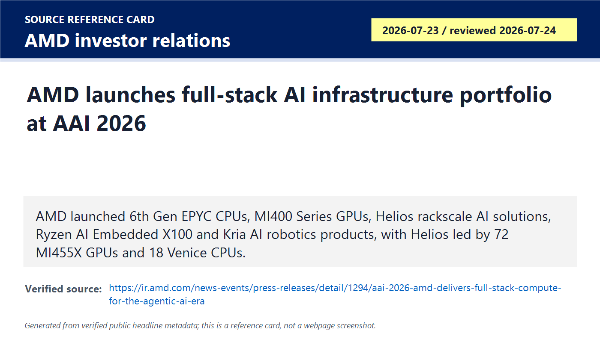
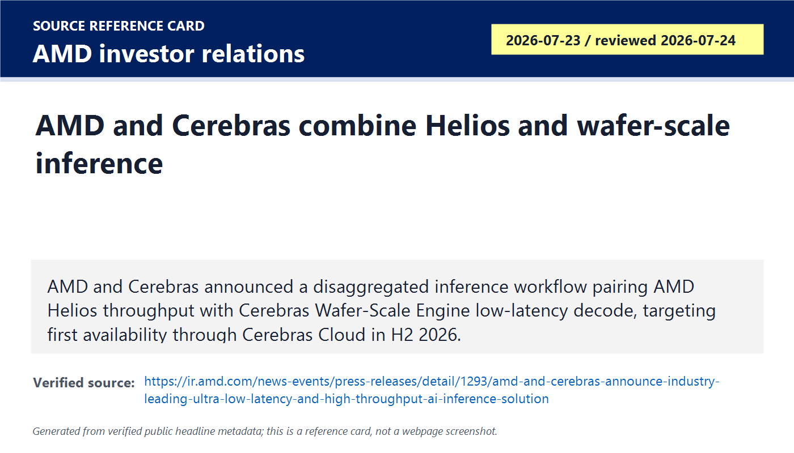
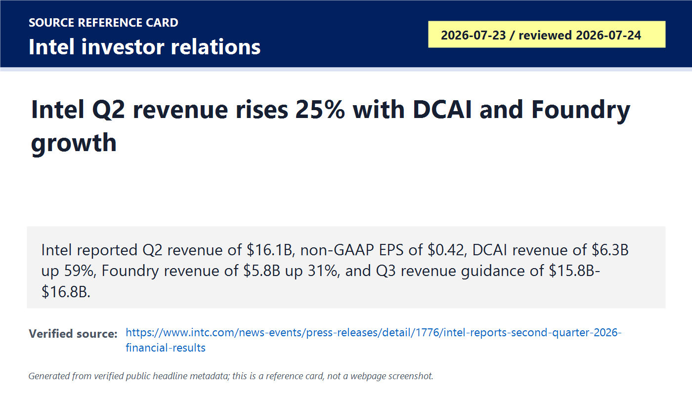
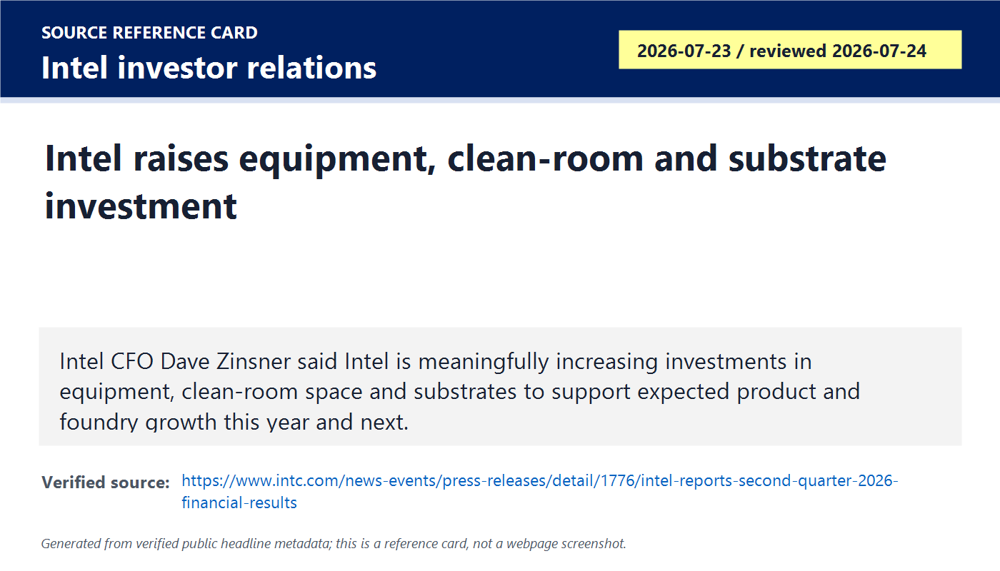
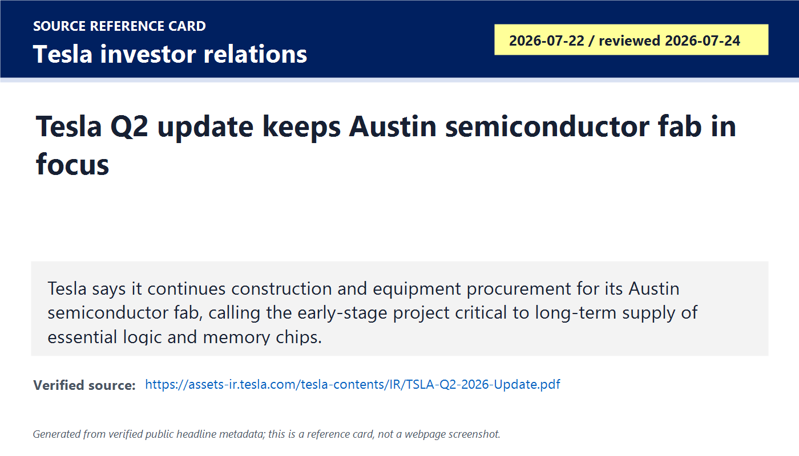
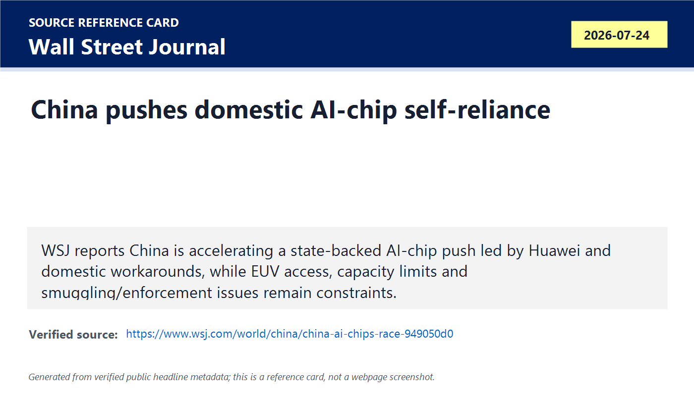
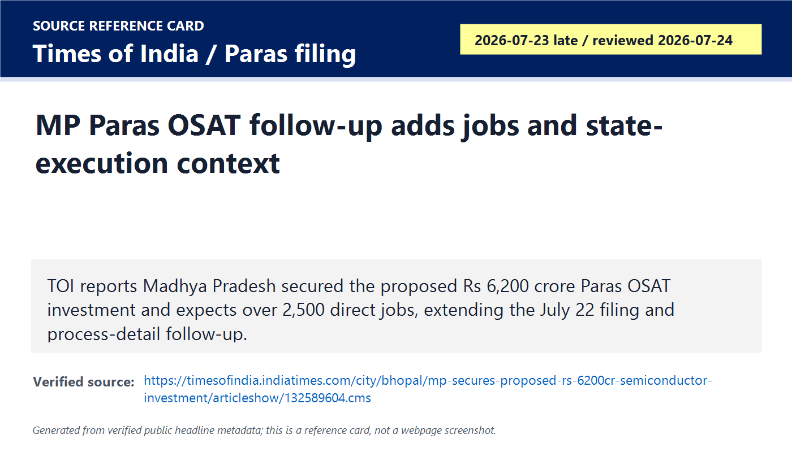
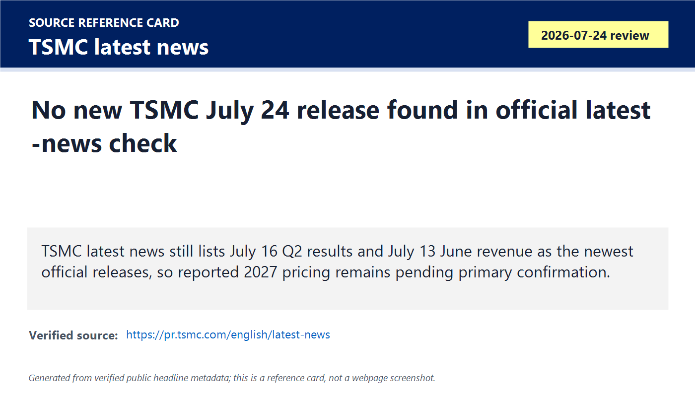

# Daily Semiconductor Current Affairs

Date: 2026-07-24

Research window: Friday update through approximately 14:45 IST / 09:15 UTC on July 24. No catch-up day was required after 2026-07-23; this note adds the July 24 daily briefing only. Several items are July 23 U.S.-time announcements that became available after yesterday's India cutoff, so they are labeled as July 24 review items.

## Quick Index

| Date | Major Topic | Source Groups | Why To Read |
|---|---|---|---|
| 2026-07-24 | AMD Advancing AI proof point lands | AMD investor relations | Converts yesterday's AMD keynote watch into confirmed roadmap, partner, rack-scale, software, and physical-AI evidence. |
| 2026-07-24 | AMD-Cerebras inference architecture | AMD investor relations | Shows inference splitting into different compute engines for prompt processing, token generation, latency, throughput, and cost. |
| 2026-07-24 | Intel Q2 earnings and foundry/equipment signal | Intel investor relations | Intel beat its own guide, reported strong DCAI and Foundry growth, and raised investment in equipment, clean room space, and substrates. |
| 2026-07-24 | Tesla chipmaking and AI capex | Tesla investor relations, market context | Tesla is explicitly linking AI/robotics scale to long-term control of logic and memory chip supply. |
| 2026-07-24 | China AI-chip self-reliance | WSJ reporting, prior export-control context | Geopolitics is shifting from chip imports alone to domestic workarounds, 3D stacking, EUV limits, and national compute capacity. |
| 2026-07-24 | India Paras MP OSAT follow-up | Times of India, Paras filing, ETElectronics | Adds state-execution and job context to the Paras OSAT project while keeping final capability unproven. |
| 2026-07-24 | Foundry, EDA/IP, memory and policy follow-ups | TSMC latest news, SK hynix IR, SEMI/market context | Keeps unresolved items clean: TSMC pricing is still unconfirmed, SK hynix earnings are pending, exact-date EDA/IP news was limited. |

**Page navigation:** [Sources](#source-map) · [Concept review](#concept-review) · [Follow-up](#what-to-watch-next) · [Technical terms](#technical-terms-used-today) · [Master glossary](../knowledge-base/glossary.md)

## Source Images And Manifest

Source manifest: [../images/2026-07-24/links.md](../images/2026-07-24/links.md)

The following are generated source-reference cards based on verified public headline/date/source metadata. They are not webpage screenshots and do not reproduce article bodies.

## Source Map

| Source | Source date | Role | Confidence / limitation |
|---|---:|---|---|
| [AMD AAI 2026: full-stack compute for agentic AI](https://ir.amd.com/news-events/press-releases/detail/1294/aai-2026-amd-delivers-full-stack-compute-for-the-agentic-ai-era) | 2026-07-23 / reviewed 2026-07-24 | Primary-source AMD launch covering 6th Gen EPYC, MI400 GPUs, Helios, ROCm, Kria, partners, customer deployment claims, and roadmap | Strong company source. Performance claims are AMD estimates and must be checked against methodology, third-party benchmarks, availability, supply, and real deployments. |
| [AMD and Cerebras inference partnership](https://ir.amd.com/news-events/press-releases/detail/1293/amd-and-cerebras-announce-industry-leading-ultra-low-latency-and-high-throughput-ai-inference-solution) | 2026-07-23 / reviewed 2026-07-24 | Primary-source announcement for Helios plus Cerebras Wafer-Scale Engine disaggregated inference | Strong company source. Availability is expected, not completed; economics and latency claims need production evidence. |
| [Intel Q2 2026 results](https://www.intc.com/news-events/press-releases/detail/1776/intel-reports-second-quarter-2026-financial-results) | 2026-07-23 / reviewed 2026-07-24 | Primary-source financial and operational update for revenue, non-GAAP EPS, DCAI, Foundry, Q3 guide, 18A-P risk production, Panther Lake HVM, and equipment investment | Strong company source. GAAP loss and non-GAAP profitability must be separated; foundry revenue includes intersegment transactions. |
| [Tesla Q2 2026 update PDF](https://assets-ir.tesla.com/tesla-contents/IR/TSLA-Q2-2026-Update.pdf) and [Tesla IR page](https://ir.tesla.com/) | 2026-07-22 / reviewed 2026-07-24 | Primary-source Tesla update showing Austin semiconductor-fab construction/equipment procurement and logic/memory supply rationale | Strong for Tesla's disclosed intent and project status. It does not prove Tesla can build competitive process technology, memory, packaging, or yield. |
| [WSJ: China's AI-chip self-reliance push](https://www.wsj.com/world/china/china-ai-chips-race-949050d0) | 2026-07-24 | Reputable reporting on China's state-backed AI-chip push, Huawei, domestic substitution, EUV limits, and compute-capacity gap | Reputable but not primary. Use as geopolitical analysis/reporting, not official Chinese policy text. |
| [Times of India: MP secures proposed Rs 6,200 crore semiconductor investment](https://timesofindia.indiatimes.com/city/bhopal/mp-secures-proposed-rs-6200cr-semiconductor-investment/articleshow/132589604.cms) | 2026-07-23 late / reviewed 2026-07-24 | Exact-date India follow-up for Paras MP OSAT jobs and state-execution context | Useful local reporting. MoU and job expectations still require funding, tools, construction, qualification, and production proof. |
| [Paras NSE filing](https://nsearchives.nseindia.com/corporate/PARAS_22072026130104_Press_ReleaseMOU.pdf) | 2026-07-22 | Primary listed-company filing for Paras Semiconductors' Madhya Pradesh OSAT MoU | Strong source for the proposal; not proof of completed facility. |
| [ETElectronics Paras process-detail follow-up](https://electronics.economictimes.indiatimes.com/news/semiconductors/paras-semiconductors-to-invest-6200-crore-in-osat-facility-in-madhya-pradesh/132553333) | 2026-07-22 / reviewed 2026-07-24 | Process detail for the proposed OSAT: 3D heterogeneous integration, hybrid bonding, fan-out, wafer bumping, flip-chip, test and reliability | Useful process-level context, still execution-dependent. |
| [TSMC latest news](https://pr.tsmc.com/english/latest-news) | Reviewed 2026-07-24 | Official foundry follow-up check | No new July 24 TSMC release found; reported 2027 pricing remains pending primary confirmation. |
| [SK hynix IR earnings page](https://www.skhynix.com/ir/UI-FR-IR06/) | Reviewed 2026-07-24 | Memory follow-up check | Used to keep SK hynix Q2 earnings as pending rather than inventing a result. |

## Verification Matrix

| Item | Confirmed / reported | Do not overclaim | Follow-up |
|---|---|---|---|
| AMD AAI launch | AMD officially launched 6th Gen EPYC, MI400 GPUs, Helios rack-scale AI systems, Ryzen AI Embedded X100, Kria AI SOM and robotics platform, plus roadmap items through MI500/MI600. | AMD's performance and tokens-per-dollar claims are vendor estimates. They need benchmark methodology, system configs, prices, software maturity, and customer deployment proof. | Track OpenAI Q4 2026 Helios bring-up, Anthropic 2 GW deployment, Meta validation, OEM availability, ROCm maturity, and independent benchmark data. |
| AMD-Cerebras | AMD and Cerebras officially announced a disaggregated inference workflow combining Helios throughput with Cerebras Wafer-Scale Engine low-latency decode. | "Expected availability" in H2 2026 is not completed deployment. The 5x tokens-per-second-per-watt claim needs workload and production validation. | Track Cerebras Cloud availability, workload classes, measured latency, queueing behavior, system cost, and software integration. |
| Intel Q2 | Intel officially reported $16.1B Q2 revenue, up 25%, non-GAAP EPS of $0.42, DCAI revenue of $6.3B up 59%, Foundry revenue of $5.8B up 31%, and Q3 revenue guide of $15.8B-$16.8B. | Intel also reported GAAP EPS of $(2.16). Do not call the quarter cleanly profitable without separating GAAP and non-GAAP. Foundry revenue includes intersegment activity. | Read the 10-Q, prepared remarks, transcript, foundry operating loss, external customer mix, capex plan, and Intel 18A/18A-P customer evidence. |
| Intel equipment signal | Intel CFO said the company is meaningfully increasing investments in equipment, clean room space, and substrates for expected product and foundry growth. | More investment is not instant output. Tools must be delivered, installed, qualified, and made productive. | Track ASML/Applied/Lam/KLA/TEL order commentary, substrate suppliers, Intel capex details, and yields. |
| Tesla chipmaking | Tesla's Q2 update says construction and equipment procurement continue for its Austin semiconductor fab and that the project is critical for long-term supply of logic and memory chips. | Early-stage construction is not a working fab. Tesla is not yet proven as a high-volume logic/memory manufacturer. | Watch tool orders, process target, partners, pilot wafers, yield, package/test scope, memory partner strategy, and cash burn. |
| China AI-chip push | WSJ reports China is accelerating self-reliance, led partly by Huawei and state-backed coordination, while EUV access and capacity remain constraints. | This is reporting, not a Chinese official release. Do not convert market-share estimates into official data without primary confirmation. | Track official policy, Huawei/Cambricon/CXMT filings, SMIC capacity, 3D-stacking proof, model compute claims, and export-control enforcement. |
| Paras MP OSAT | TOI reports the proposed Rs 6,200 crore Paras OSAT project is expected to create more than 2,500 direct jobs. Paras' filing confirms the MoU. | Job estimates and MoUs are early-stage signals. They do not prove qualified packaging/test output. | Track final investment decision, Semicon 2.0 support, construction, tool orders, technology partner, hiring, package qualification, and shipments. |
| TSMC pricing | TSMC official latest news has no new July 24 release. | Reported 2027 price increases remain unconfirmed by TSMC in today's primary check. | Watch customer commentary and TSMC official filings/transcripts. |

## 1. AMD Advancing AI: The Pending Keynote Became A Full-Stack Infrastructure Launch

Term: Rack-scale AI solution
Definition: A rack-scale AI solution is a complete compute system designed at the rack level rather than as a loose collection of servers, combining accelerators, CPUs, memory, networking, power delivery, cooling, firmware, and software into one deployable unit. It solves the cluster-building problem: modern AI performance depends on many accelerators acting together with predictable power, thermal, networking, and software behavior. In today's news, AMD Helios matters because AMD is competing against Nvidia at the AI factory rack level, not only at the GPU chip level. A comparison: a GPU card is one component; a rack-scale solution is closer to a packaged production machine for AI workloads. Source: https://ir.amd.com/news-events/press-releases/detail/1294/aai-2026-amd-delivers-full-stack-compute-for-the-agentic-ai-era

### Confirmed Facts

AMD's official AAI 2026 release says it launched 6th Gen EPYC CPUs, AMD Instinct MI400 Series GPUs, AMD Helios rackscale solutions, AMD Ryzen AI Embedded X100 processors, and AMD Kria AI SOM and Robotics Developer Platform. AMD says Helios is now in production for deployment by leading AI companies at gigawatt scale.

Term: AMD Helios
Definition: AMD Helios is AMD's rack-scale AI infrastructure platform built around multiple Instinct GPUs, EPYC CPUs, Pensando networking, and ROCm software. It solves the deployment problem for customers that need a complete AI system with compute, host CPUs, networking, memory capacity, and software aligned rather than separate parts integrated from scratch. In today's news, Helios is the center of AMD's attempt to convert accelerator roadmaps into real cloud and AI-lab deployments. Example: AMD says a Helios rack uses 72 MI455X GPUs and 18 6th Gen EPYC Venice CPUs, making it a rack architecture rather than a single accelerator announcement. Source: https://ir.amd.com/news-events/press-releases/detail/1294/aai-2026-amd-delivers-full-stack-compute-for-the-agentic-ai-era

Term: Tokens per dollar
Definition: Tokens per dollar is an AI-serving economics metric that estimates how much model output a system can generate for a given cost, including hardware price, throughput, utilization, energy, software efficiency, and deployment assumptions. It solves the business-comparison problem: AI customers care about useful output per budget, not only peak FLOPS or memory bandwidth. In today's news, AMD says Helios delivers up to 30% more inference tokens per dollar than the competition, but that must be checked against AMD's methodology, pricing assumptions, workload mix, and software maturity. A comparison: miles per gallon compares vehicles; tokens per dollar compares AI infrastructure economics. Source: https://ir.amd.com/news-events/press-releases/detail/1294/aai-2026-amd-delivers-full-stack-compute-for-the-agentic-ai-era

AMD named OpenAI, Anthropic, Meta, Microsoft, Oracle, HUMAIN, Tensorwave, Vultr, Cirrascale and others as Helios customers or deployment partners. It said OpenAI expects to bring Helios online beginning in Q4 2026, with deployments accelerating through 2027. AMD also said Anthropic plans to deploy up to 2 GW of AMD Instinct MI455X GPUs in Helios racks and that Meta is validating 6th Gen EPYC platforms and Helios racks.

Term: ROCm
Definition: ROCm is AMD's open software platform for GPU computing, including drivers, compilers, libraries, runtime support, and framework integration for AI and HPC workloads. It solves the software-portability problem: accelerator hardware is not useful at scale unless developers can run PyTorch, inference servers, kernels, communication libraries, debugging tools, and performance profilers reliably. In today's news, ROCm matters because AMD's hardware claims depend on whether software can close the gap with Nvidia's CUDA ecosystem for real workloads. A comparison: silicon is the engine; ROCm is part of the control system that lets developers use it efficiently. Source: https://ir.amd.com/news-events/press-releases/detail/1294/aai-2026-amd-delivers-full-stack-compute-for-the-agentic-ai-era

Term: Customer validation
Definition: Customer validation is evidence that a named customer is testing, qualifying, deploying, or committing to a product under real workload and operational constraints. It solves the credibility problem in hardware launches: vendor specifications are weaker than proof that serious customers can use the system. In today's news, OpenAI, Anthropic, Meta and cloud/OEM names make AMD's story stronger than a chip-only launch, but validation is not the same as volume revenue until systems are deployed, used, and paid for. Example: a lab demo proves functionality; a cloud rollout proves operational adoption. Source: https://ir.amd.com/news-events/press-releases/detail/1294/aai-2026-amd-delivers-full-stack-compute-for-the-agentic-ai-era

AMD also extended its roadmap: MI500 Series GPUs in 2027, MI600 Series GPUs in 2028, Helios 500 with MI500 and EPYC Verano, and Helios 600 with MI600 and EPYC Ferrara.

Term: Product roadmap cadence
Definition: Product roadmap cadence is the planned rhythm at which a semiconductor company introduces new CPU, GPU, networking, software, and platform generations. It solves the customer-planning problem: hyperscalers and OEMs need to plan power, cooling, data-center layout, procurement, software migration, and depreciation years ahead. In today's news, AMD's MI500/MI600 and Helios 500/600 roadmap matters because AI infrastructure buyers are making multi-year commitments, not one-quarter purchases. A comparison: a one-time chip launch is a point event; a roadmap cadence is a supply and architecture planning promise. Source: https://ir.amd.com/news-events/press-releases/detail/1294/aai-2026-amd-delivers-full-stack-compute-for-the-agentic-ai-era

### Analysis

The July 24 read is that AMD has moved from "watch the keynote" to "study the system claim." The key shift is full-stack evidence: CPU, GPU, networking, ROCm software, named customers, OEMs, infrastructure partners, and a roadmap. That is exactly what AMD needed because Nvidia's strength is not only GPU silicon; it is the ecosystem around GPUs.

The risk is that many claims are forward-looking. AMD's release includes methodology footnotes and cautions. The serious follow-up is not "did AMD announce Helios?" It is "does Helios reach customer data centers on time, run real OpenAI/Anthropic/Meta workloads efficiently, and deliver competitive utilization and software stability?"

### India Angle

For India, AMD's launch matters because AMD already has large engineering operations and earlier India-oriented AI infrastructure partnerships. Indian VLSI and systems engineers should focus on rack-level skills: firmware, validation, power and thermal testing, ROCm/compiler work, distributed systems, packaging-aware design, and AI networking.

## 2. AMD-Cerebras: Inference Is Splitting Into Workload-Specific Compute Engines

Term: Disaggregated inference
Definition: Disaggregated inference is an AI-serving architecture that separates different parts of the inference workflow across different compute engines or system pools instead of running every stage on one homogeneous cluster. It solves the mismatch problem in AI serving: prompt processing, long-context attention, decode/token generation, batching, latency-sensitive agents, and throughput-heavy requests can stress hardware differently. In today's news, AMD and Cerebras are splitting work between AMD Helios and the Cerebras Wafer-Scale Engine to optimize both throughput and low latency. A comparison: one factory line doing every job can bottleneck; specialized stations can optimize different steps. Source: https://ir.amd.com/news-events/press-releases/detail/1293/amd-and-cerebras-announce-industry-leading-ultra-low-latency-and-high-throughput-ai-inference-solution

### Confirmed Facts

AMD and Cerebras announced a technical partnership to combine AMD Helios rackscale infrastructure with the Cerebras Wafer-Scale Engine. AMD says Helios provides high-throughput prompt processing and large-context handling, while Cerebras accelerates low-latency decode and token generation. Cerebras plans to deploy AMD Helios in its data centers, with the joint solution expected first through Cerebras Cloud in the second half of 2026.

Term: Wafer-Scale Engine
Definition: A Wafer-Scale Engine is Cerebras' processor architecture that uses an entire wafer as one very large AI compute device rather than cutting the wafer into many separate chips. It solves a communication and memory-locality problem: keeping many compute cores on one wafer can reduce off-chip communication compared with a cluster of separate accelerators. In today's news, the Cerebras Wafer-Scale Engine is positioned for ultra-low-latency token generation while AMD Helios handles high-throughput rack-scale work. A comparison: ordinary chips are pieces cut from a wafer; wafer-scale computing tries to use the wafer itself as the chip. Source: https://ir.amd.com/news-events/press-releases/detail/1293/amd-and-cerebras-announce-industry-leading-ultra-low-latency-and-high-throughput-ai-inference-solution

Term: Decode stage
Definition: The decode stage in language-model inference is the step where the model generates output tokens sequentially after prompt/context processing. It solves the response-generation problem, but it is often latency-sensitive because many applications wait for tokens to appear one after another. In today's news, Cerebras is being positioned as the fast token-generation engine, while AMD Helios is the high-throughput prompt and context engine. A comparison: reading the user's long input is one stage; producing each next word in real time is another. Source: https://ir.amd.com/news-events/press-releases/detail/1293/amd-and-cerebras-announce-industry-leading-ultra-low-latency-and-high-throughput-ai-inference-solution

Term: Ultra-low-latency inference
Definition: Ultra-low-latency inference means generating AI responses with very short delay between request and output, especially for coding assistants, live agents, real-time copilots, robotics, and interactive applications. It solves the usefulness problem: even accurate AI can feel unusable if each response stalls. In today's news, AMD and Cerebras are targeting latency-sensitive inference, not just maximum batch throughput. A comparison: batch translation can wait seconds; a real-time coding assistant or robot planner needs fast response. Source: https://ir.amd.com/news-events/press-releases/detail/1293/amd-and-cerebras-announce-industry-leading-ultra-low-latency-and-high-throughput-ai-inference-solution

### Analysis

This item is important because it shows AI infrastructure becoming heterogeneous at system level. The first AI infrastructure race rewarded raw GPU supply. The next phase rewards matching each workload stage to the right hardware and software. That is why disaggregated inference is a career-relevant topic: it touches scheduling, memory, networking, service-level objectives, accelerator architecture, and cost accounting.

## 3. Intel Q2: Strong Revenue Growth, Better DCAI, Foundry Momentum, But GAAP/Non-GAAP Must Be Separated

Term: Non-GAAP EPS
Definition: Non-GAAP EPS is earnings per share calculated after excluding selected items that management believes reduce comparability, such as restructuring, certain mark-to-market items, acquisition effects, or other adjustments. It solves the operating-comparison problem, but it can also make results look cleaner than statutory GAAP if the excluded costs are economically important. In today's news, Intel reported non-GAAP EPS of $0.42 while GAAP EPS was negative, so the two must be discussed separately. A comparison: GAAP is the formal accounting result; non-GAAP is management's adjusted operating lens. Source: https://www.intc.com/news-events/press-releases/detail/1776/intel-reports-second-quarter-2026-financial-results

### Confirmed Facts

Intel reported Q2 2026 revenue of $16.1B, up 25% year over year. GAAP EPS attributable to Intel was $(2.16), while non-GAAP EPS was $0.42. Intel guided Q3 revenue to $15.8B-$16.8B, GAAP EPS to $0.31, and non-GAAP EPS to $0.38. Q2 cash from operations was $7.0B.

Term: GAAP loss
Definition: A GAAP loss is a net loss under generally accepted accounting principles, including operating results and required accounting for non-operating items, taxes, impairments, interest and other items. It solves the formal financial-reporting problem by applying standard accounting rules, even when the result differs sharply from management's adjusted measures. In today's news, Intel's GAAP EPS of $(2.16) means the quarter cannot be described as simply profitable; the operating improvement and accounting loss must both be understood. A comparison: a company can beat on adjusted EPS while still reporting a GAAP net loss. Source: https://www.intc.com/news-events/press-releases/detail/1776/intel-reports-second-quarter-2026-financial-results

Term: Data Center and AI (DCAI)
Definition: Data Center and AI is Intel's business segment for server and AI-oriented compute products, including CPUs and related data-center platforms. It solves the business-segmentation problem by separating data-center demand from client PCs and foundry services. In today's news, DCAI revenue of $6.3B, up 59%, is the clearest Intel product signal that AI-driven compute demand is lifting server platforms, not only GPUs. A comparison: AI accelerators run the matrix-heavy work, but server CPUs still feed, schedule, secure, and orchestrate many workloads. Source: https://www.intc.com/news-events/press-releases/detail/1776/intel-reports-second-quarter-2026-financial-results

Term: Intel Foundry
Definition: Intel Foundry is Intel's contract manufacturing business that aims to make chips for internal and external customers using Intel process technology, packaging, IP, and manufacturing services. It solves Intel's strategic problem of turning fabs from internal-product assets into a broader manufacturing platform, but it requires customer trust, competitive nodes, design enablement, yield, and economics. In today's news, Foundry revenue of $5.8B up 31% is encouraging, but the note must remember that segment revenues include intersegment transactions. Source: https://www.intc.com/news-events/press-releases/detail/1776/intel-reports-second-quarter-2026-financial-results

Intel's business highlights say 18A-P entered risk production and that Intel Foundry entered high-volume manufacturing for a subset of Panther Lake processors using ASML's EXE High NA EUV technology. Intel also said it expanded purpose-built silicon through a Fortinet collaboration for Security Processor 6 using Intel design, packaging, and manufacturing capabilities.

Term: 18A-P risk production
Definition: 18A-P risk production is an early manufacturing stage for Intel's enhanced 18A process where wafers are built before full mature high-volume release to validate process readiness, yield learning, customer design interaction, and manufacturing control. It solves the transition problem between development and volume production: customers need silicon evidence before betting full product ramps on a node. In today's news, Intel says 18A-P entered risk production, which is a milestone but not yet proof of high-volume external foundry success. A comparison: risk production is like a serious pilot line; mature high-volume manufacturing is the proven factory run. Source: https://www.intc.com/news-events/press-releases/detail/1776/intel-reports-second-quarter-2026-financial-results

Term: High-NA EUV
Definition: High-NA EUV is a next-generation extreme-ultraviolet lithography platform with higher numerical aperture optics, enabling finer patterning resolution than today's standard EUV systems. It solves the patterning problem at very advanced nodes where smaller features and tighter overlay become harder with existing exposure tools. In today's news, Intel mentioning ASML EXE High NA EUV for Panther Lake high-volume manufacturing is strategically important because High-NA adoption is a key tool and process-learning frontier. A comparison: standard EUV opened the 7 nm/5 nm/3 nm era; High-NA EUV is meant to support later, denser patterning with fewer compromises. Source: https://www.intc.com/news-events/press-releases/detail/1776/intel-reports-second-quarter-2026-financial-results

Term: Substrate
Definition: A substrate is the package foundation that mechanically supports chips and routes electrical connections between dies, memory, power delivery, and the printed circuit board. It solves the interconnect and mechanical-support problem after a die is fabricated. In today's news, Intel's plan to increase substrate investment matters because AI and advanced processors need high-density, reliable package substrates; a wafer fab alone cannot ship usable systems. A comparison: silicon is the active chip; the substrate is the high-performance platform it sits on and connects through. Source: https://www.intc.com/news-events/press-releases/detail/1776/intel-reports-second-quarter-2026-financial-results

Term: Clean room space
Definition: Clean room space is highly controlled manufacturing area where airborne particles, humidity, temperature, vibration, chemicals, airflow, and contamination are tightly managed for semiconductor processing. It solves the defect-control problem: microscopic contamination can ruin wafer yield or package reliability. In today's news, Intel increasing clean room investment means the company is preparing physical capacity, not only announcing demand. A comparison: buying tools without clean room capacity is like buying machines without a factory floor. Source: https://www.intc.com/news-events/press-releases/detail/1776/intel-reports-second-quarter-2026-financial-results

### Analysis

Intel's July 24 read is materially stronger than yesterday's watch item. Revenue beat, DCAI growth, foundry growth, Q3 guide and process milestones all improve the story. But discipline matters: the GAAP loss, intersegment foundry accounting, adjusted free-cash-flow pressure, external customer proof and capex intensity remain unresolved.

The equipment read-through is important. When Intel says it is raising investment in equipment, clean room space and substrates, the beneficiaries are not only Intel fabs. The upstream implication reaches ASML, Applied Materials, Lam Research, KLA, Tokyo Electron, substrate suppliers, metrology, and facilities contractors.

## 4. Tesla: AI/Robotics Strategy Is Becoming A Logic And Memory Supply Problem

Term: Semiconductor fab
Definition: A semiconductor fab is a fabrication facility that processes wafers through repeated lithography, deposition, etch, implant, cleaning, metrology, and thermal steps to make integrated circuits. It solves the physical manufacturing problem for chips, but it requires enormous capital, tools, process recipes, engineers, yields, utilities, and supply-chain depth. In today's news, Tesla says its Austin semiconductor fab is in early construction and equipment procurement, which is an important supply-chain signal but not yet working chip output. A comparison: designing an AI chip is one challenge; building a fab that can manufacture it at yield is a much harder manufacturing challenge. Source: https://assets-ir.tesla.com/tesla-contents/IR/TSLA-Q2-2026-Update.pdf

### Confirmed Facts

Tesla's Q2 update says it continues to make progress on construction and equipment procurement for its semiconductor fab in Austin. Tesla says the project is still early-stage, but critical to building its own chipmaking capabilities to ensure reliable long-term supply of essential logic and memory chips for its products.

Term: Logic chip
Definition: A logic chip is an integrated circuit built primarily to compute, control, process signals, or run instructions, such as CPUs, GPUs, AI accelerators, microcontrollers, image processors, or custom ASICs. It solves the decision and computation problem in electronic systems. In today's news, Tesla's need for logic chips is tied to vehicles, robotaxis, humanoid robots, AI data centers, control systems, and inference workloads. A comparison: logic chips think and control; memory chips store the data they work on. Source: https://assets-ir.tesla.com/tesla-contents/IR/TSLA-Q2-2026-Update.pdf

Term: Memory chip
Definition: A memory chip stores data or instructions for short-term working use, long-term nonvolatile storage, or high-bandwidth AI data movement. It solves the data-availability problem: compute cannot operate efficiently unless data is close enough, fast enough, and large enough. In today's news, Tesla explicitly names memory supply as part of its long-term chipmaking concern, reflecting the broader AI-era memory shortage and HBM/DRAM allocation pressure. A comparison: a processor is a worker; memory is the workspace and material supply. Source: https://assets-ir.tesla.com/tesla-contents/IR/TSLA-Q2-2026-Update.pdf

Term: Vertical integration
Definition: Vertical integration is a strategy where a company controls more stages of its value chain, such as design, manufacturing, packaging, software, and deployment, instead of buying each stage from external suppliers. It solves dependency and iteration-speed problems, but it increases capital, execution, and operational risk. In today's news, Tesla's fab language is a vertical-integration signal: it wants more control over logic and memory supply because AI/robotics ambitions may outgrow available external capacity. A comparison: Apple controls chip design but still uses external foundries; Tesla is signaling interest in deeper manufacturing control. Source: https://assets-ir.tesla.com/tesla-contents/IR/TSLA-Q2-2026-Update.pdf

### Analysis

Tesla matters to semiconductor current affairs because it shows AI chip demand moving outside classic cloud providers. Vehicles, robotaxis, humanoid robots, energy systems and edge AI can all require logic, memory, sensors, power semiconductors, packaging, and test. But building an in-house fab is a high-risk jump. Tesla must prove process target, tool access, manufacturing team, yield, packaging/test flow, supply-chain compliance and economic logic.

The broader market message is capex discipline. Alphabet, Tesla, Intel and AMD are all spending or planning heavily for AI. The semiconductor cycle is therefore strong, but also vulnerable to investor pushback if cash flow, deployment timing, and revenue conversion disappoint.

## 5. China AI-Chip Self-Reliance: The Geopolitical Story Is Now Workarounds, Capacity, And Packaging

Term: Domestic substitution
Definition: Domestic substitution is a strategy where a country replaces foreign suppliers with local companies for strategically important products, components, software, or manufacturing services. It solves a dependency problem under sanctions, export controls, or geopolitical risk, but it can increase cost and reduce performance if domestic alternatives lag. In today's news, WSJ reports China's push to reduce reliance on U.S. AI chips and expand domestic capability, making domestic substitution a core semiconductor policy theme. A comparison: buying Nvidia chips is import dependence; building Huawei/Cambricon/SMIC/CXMT alternatives is domestic substitution. Source: https://www.wsj.com/world/china/china-ai-chips-race-949050d0

### Reported Facts

WSJ reports that China is running a state-backed push to catch up in AI chips, with Huawei leading major domestic efforts and Chinese firms using design and packaging workarounds. The report frames EUV access, capacity limits, smuggling/enforcement problems, and the gap with U.S. compute capacity as continuing constraints.

Term: EUV chokepoint
Definition: An EUV chokepoint is a strategic dependency on extreme-ultraviolet lithography tools for the most advanced chip manufacturing nodes. It solves the geopolitical explanation for why one tool category can slow a whole country's leading-edge progress: without EUV, a fab must use harder, more expensive multi-patterning or stay behind in density, power, and yield. In today's news, China's lack of EUV access remains one reason domestic AI chips may improve but still lag leading Nvidia-class hardware. A comparison: DUV workarounds can keep progress moving, but EUV is the shorter road for many leading-edge patterns. Source: https://www.wsj.com/world/china/china-ai-chips-race-949050d0

Term: 3D stacking workaround
Definition: A 3D stacking workaround is the use of vertical chip/package integration to improve performance, bandwidth, or density when front-end transistor scaling is constrained. It solves part of the performance gap when a country or company cannot access the best lithography or process node. In today's news, reported Huawei-style workarounds matter because advanced packaging can partially compensate for weaker process technology, though not for every power, yield, or cost gap. A comparison: if each floor of a building is smaller than a competitor's, stacking more floors can help, but elevators, heat, and structure become harder. Source: https://www.wsj.com/world/china/china-ai-chips-race-949050d0

Term: Export-control enforcement
Definition: Export-control enforcement is the practical work of preventing restricted chips, tools, software, technology, or know-how from reaching prohibited users or destinations through direct shipments, resellers, cloud access, smuggling, or shell companies. It solves the gap between written rules and real-world movement of technology. In today's news, enforcement matters because Chinese AI-chip progress is shaped both by domestic capability and by how porous U.S.-led controls are. A comparison: a legal ban is the rulebook; enforcement is whether the gate actually stops the item. Source: https://www.wsj.com/world/china/china-ai-chips-race-949050d0

### Analysis

The important point is that controls are not binary. They can slow access to top chips and EUV tools while also motivating domestic alternatives, packaging workarounds, software efficiency and smuggling channels. For India, the lesson is to build trusted supply-chain capability without isolating itself from global ecosystems.

## 6. India Paras MP OSAT: Jobs Signal Is Useful, Capability Proof Still Pending

Term: Direct employment
Definition: Direct employment means jobs created inside the company or project itself, rather than indirect jobs at suppliers, logistics firms, contractors, restaurants, housing, or local services. It solves the impact-measurement problem: policymakers need to distinguish between workers hired by the OSAT facility and wider ecosystem job estimates. In today's news, TOI reports the Paras MP OSAT project is expected to create more than 2,500 direct jobs, which is useful but still a projection. A comparison: an OSAT engineer on the payroll is direct employment; a nearby supplier hiring truck drivers is indirect employment. Source: https://timesofindia.indiatimes.com/city/bhopal/mp-secures-proposed-rs-6200cr-semiconductor-investment/articleshow/132589604.cms

### Confirmed And Reported Facts

TOI reports Madhya Pradesh secured a proposed Rs 6,200 crore semiconductor investment through an MoU with Paras Defence & Space Technologies for an OSAT facility expected to create over 2,500 direct jobs. The earlier Paras filing confirms the MoU with Madhya Pradesh for an advanced packaging OSAT facility in the Ujjain-Indore corridor.

Term: State semiconductor cluster
Definition: A state semiconductor cluster is a regional ecosystem of fabs, OSAT/ATMP facilities, design centers, equipment and materials suppliers, data centers, universities, logistics, utilities, incentives, and skilled workers. It solves the ecosystem problem: semiconductor manufacturing does not succeed through one isolated factory. In today's news, Madhya Pradesh is using Paras to position itself as a semiconductor and advanced-technology destination, but cluster proof requires more companies, suppliers, training and recurring production. A comparison: one OSAT plant is a seed; a cluster is a network of mutually reinforcing capabilities. Source: https://timesofindia.indiatimes.com/city/bhopal/mp-secures-proposed-rs-6200cr-semiconductor-investment/articleshow/132589604.cms

Term: Global capability centre (GCC)
Definition: A global capability centre is an offshore or regional office where a company performs engineering, software, operations, analytics, finance, design, support, or shared-service work for global business units. It solves the talent-distribution problem by letting companies use specialized skills in different locations. In today's news, the MP Tech Growth Conclave context matters because semiconductors, data centers, and GCCs can reinforce each other if India converts engineering talent into chip design, validation, packaging, and operations capability. A comparison: a GCC may design or validate systems; an OSAT physically packages and tests chips. Source: https://timesofindia.indiatimes.com/city/bhopal/mp-secures-proposed-rs-6200cr-semiconductor-investment/articleshow/132589604.cms

### Analysis

The India update is incremental, not a new completed project. It adds jobs and state strategy, but the same execution proof remains: land handover, financing, incentives, technology partner, cleanroom construction, equipment procurement, engineers, process recipes, package qualification, customers, yields, and shipments.

## 7. Foundry, EDA/IP, Memory, And Policy Follow-Ups

Term: Official latest-news check
Definition: An official latest-news check is the review of a company's own newsroom or investor page to see whether a new primary-source announcement exists. It solves the verification problem when market reports circulate before company confirmation. In today's news, TSMC's latest-news page still showed July 16 Q2 results and July 13 monthly revenue as newest releases, so reported 2027 pricing remains pending primary confirmation. Source: https://pr.tsmc.com/english/latest-news

TSMC has no new official July 24 release in the reviewed latest-news page. That keeps reported 2027 pricing as "reported, still pending primary confirmation." SK hynix earnings remain pending; no official Q2 result should be invented before the company publishes it. Exact-date EDA/IP news was limited, but EDA/IP remains embedded in every major story: AMD ROCm and AI-assisted development, Intel 18A/18A-P design enablement, Tesla chipmaking ambition, and Paras advanced packaging all require tools, IP, signoff, package co-design, verification, and test development.

Term: EDA/IP dependency
Definition: EDA/IP dependency is the reliance of chip and package programs on electronic design automation software plus reusable IP blocks, verification IP, standard cells, memory compilers, physical-design flows, packaging models, and signoff tools. It solves the complexity problem in modern semiconductors: no team can manually design, verify and close timing/power/reliability for billion-transistor chips and advanced packages without toolchains and reusable IP. In today's news, EDA/IP has no major exact-date headline, but it underlies AMD's roadmap, Intel Foundry, Tesla's fab ambition, and Paras packaging. Source: https://www.synopsys.com/glossary/what-is-electronic-design-automation.html

Term: Memory allocation
Definition: Memory allocation is the process by which memory suppliers decide which customers receive limited DRAM, HBM, NAND, or specialty memory output under contracts, forecasts, deposits, pricing, qualification, and strategic priority. It solves the scarcity problem when demand exceeds qualified supply. In today's news, memory allocation remains central because AMD Helios, Intel AI servers, Tesla AI/robotics, Alphabet cloud, and Nvidia/Japan AI factories all compete for high-performance memory. A comparison: a price quote tells cost; allocation decides whether the customer gets the parts at all. Source: https://www.jedec.org/standards-documents/focus/memory/high-bandwidth-memory-hbm

## Follow-Up Ledger

| Prior Item | Status On 2026-07-24 | Update |
|---|---|---|
| AMD July 23 keynote from July 23 note | Updated / still open | AMD released the AAI full-stack portfolio, Helios details, partner names and roadmap. Deployment timing, benchmark methodology, ROCm maturity and customer utilization remain pending. |
| AMD-Cerebras inference watch | New / pending execution | The joint disaggregated inference architecture is announced; H2 2026 Cerebras Cloud availability and measured performance remain future proof. |
| Intel Q2 earnings from July 23 note | Updated / still open | Intel results landed with strong revenue, non-GAAP EPS, DCAI and Foundry growth, plus Q3 guide. GAAP loss, foundry profitability, external customer evidence and capex details remain follow-ups. |
| Intel equipment and substrate investment | Updated | Intel's CFO directly cited more equipment, clean room and substrate investment. Watch WFE supplier orders and Intel capex specifics. |
| Tesla AI/chipmaking | Updated | Tesla's Q2 update keeps Austin semiconductor-fab construction/equipment procurement active. Still early-stage until process, tools, yield and production are shown. |
| China AI/chip export-control and self-reliance | Updated / still pending official text | WSJ adds self-reliance context; the prior reported Chinese export-control catalogue changes remain pending official rule text. |
| Paras MP OSAT | Updated / still pending execution | TOI adds 2,500 direct-job expectation and state-positioning context. The capability proof remains tools, cleanrooms, process qualification, customers and shipments. |
| TSMC 2027 pricing reports | Still pending | TSMC latest-news check found no new July 24 primary confirmation. |
| SK hynix Q2 / HBM evidence | Still pending | Keep official SK hynix results as an upcoming memory proof point; do not substitute market previews for company release. |
| Supermicro preliminary Q4 | Still pending | Final Q4 results and export-control review outcome remain unresolved. |

## Concept Review

| Concept | Key Distinction | Why It Matters |
|---|---|---|
| GPU card vs rack-scale AI system | A GPU card is one component; a rack-scale system integrates GPUs, CPUs, networking, power, cooling and software. | AMD is competing at system level with Helios. |
| Vendor benchmark vs production economics | Vendor claims use assumptions; production economics depends on real workload, utilization, price, power and software. | AMD's tokens-per-dollar claim is important but not final proof. |
| Throughput vs latency | Throughput maximizes total work; latency minimizes delay per request. | AMD-Cerebras shows inference splitting by workload need. |
| GAAP vs non-GAAP | GAAP follows statutory accounting; non-GAAP adjusts selected items. | Intel's quarter has both strong non-GAAP improvement and GAAP loss. |
| Foundry revenue vs external foundry proof | Segment revenue can include internal/intersegment work; external proof needs customer tape-outs, revenue and yield. | Intel Foundry progress is real but still needs customer evidence. |
| Fab construction vs fab output | Construction and tool procurement are early steps; output requires process qualification and yield. | Tesla's fab signal is strategic, not completed capability. |
| Domestic substitution vs global integration | Domestic substitution reduces reliance on foreign suppliers; global integration gives access to best tools and markets. | China and India face different versions of this semiconductor policy tradeoff. |
| MoU/jobs vs qualified OSAT | Jobs and MoUs are planning signals; qualified OSAT means tested shipped products. | Paras remains execution-dependent. |

## VLSI And Career Relevance

1. Study AI infrastructure as a system: GPU, CPU, memory, package, substrate, network, cooling, software and workload economics.
2. Learn inference architecture. Prompt processing, decode, batching, latency and throughput are becoming hardware-design requirements.
3. Understand financial language. GAAP, non-GAAP, capex, gross margin and cash flow directly affect chip-roadmap credibility.
4. Follow foundry milestones carefully. Risk production, HVM, High-NA EUV and customer validation are different evidence levels.
5. For India, focus on OSAT execution skills: DFT, ATE, package design, reliability, failure analysis, cleanroom process, signal integrity and power integrity.

## India Relevance

India has two lessons today. First, AMD/Intel/Tesla show that AI infrastructure demand is expanding into CPUs, GPUs, networking, memory, substrates, fabs and system software. Indian engineers can enter many layers of that stack, not only RTL design. Second, Paras MP shows that India must convert semiconductor policy into process capability. A state MoU is useful, but the real proof will be a qualified packaging/test line with customers and repeat shipments.

## Interview Questions

1. Why is AMD Helios a rack-scale story rather than only a GPU story?
2. What does tokens per dollar measure, and why can it be misleading without methodology?
3. Why does ROCm matter for AMD's AI accelerator competitiveness?
4. What is disaggregated inference, and why might prompt processing and decode use different hardware?
5. What is the Cerebras Wafer-Scale Engine trying to solve?
6. How can Intel report strong non-GAAP EPS while also reporting a GAAP loss?
7. Why should Intel Foundry revenue be interpreted carefully?
8. What does 18A-P risk production prove, and what does it not prove?
9. Why is High-NA EUV strategically important?
10. Why are substrates and clean rooms part of the AI hardware story?
11. What would Tesla need to prove before its Austin semiconductor fab becomes credible?
12. How can 3D stacking partly compensate for limited access to leading-edge process technology?
13. Why is export-control enforcement harder for chips than for large manufacturing equipment?
14. What evidence would move Paras MP OSAT from MoU to real capability?
15. Why is EDA/IP dependency visible even on a day without a major EDA press release?

## What To Watch Next

1. AMD keynote replay, detailed Helios specs, OEM system configurations, ROCm support matrix, and independent benchmarks.
2. OpenAI, Anthropic and Meta evidence: actual Helios deployments, workloads, timelines, utilization and procurement.
3. AMD-Cerebras H2 2026 Cerebras Cloud launch and measured low-latency inference economics.
4. Intel 10-Q, prepared remarks, transcript, foundry operating income/loss, external customer wins, 18A/18A-P yield and capex specifics.
5. WFE supplier commentary from ASML, Applied Materials, Lam Research, KLA, Tokyo Electron, Advantest and Teradyne.
6. Tesla fab details: process node, tool vendors, pilot wafers, memory scope, package/test scope, yield, and financing.
7. China official AI/semiconductor policy documents and export-control catalogue changes.
8. TSMC official or customer confirmation of reported 2027 price increases.
9. SK hynix Q2 earnings and HBM allocation/pricing commentary.
10. Paras MP OSAT final investment, technology partner, equipment orders, construction, hiring and first qualified packages.

## Final Takeaway

July 24 turns yesterday's open watch items into evidence. AMD's AAI releases show a serious full-stack AI infrastructure push, but the hard proof is deployment and software maturity. Intel's Q2 result is a strong turnaround signal, but GAAP loss, foundry economics and capex intensity still matter. Tesla shows that AI and robotics can push non-traditional companies toward chipmaking, though building a fab is far harder than announcing one. China shows that export controls create both constraints and domestic substitution pressure. India's Paras update adds job and state-execution context, but the OSAT remains a project to verify, not a proven factory.

## Technical Terms Used Today

[Back to quick index](#quick-index) · [Open the master A-Z glossary](../knowledge-base/glossary.md)

**Term index:** [18A-P risk production](#daily-term-18a-p-risk-production) · [3D stacking workaround](#daily-term-3d-stacking-workaround) · [AMD Helios](#daily-term-amd-helios) · [Clean room space](#daily-term-clean-room-space) · [Customer validation](#daily-term-customer-validation) · [Data Center and AI (DCAI)](#daily-term-data-center-and-ai-dcai) · [Decode stage](#daily-term-decode-stage) · [Direct employment](#daily-term-direct-employment) · [Disaggregated inference](#daily-term-disaggregated-inference) · [Domestic substitution](#daily-term-domestic-substitution) · [EDA/IP dependency](#daily-term-eda-ip-dependency) · [EUV chokepoint](#daily-term-euv-chokepoint) · [Export-control enforcement](#daily-term-export-control-enforcement) · [GAAP loss](#daily-term-gaap-loss) · [Global capability centre (GCC)](#daily-term-global-capability-centre-gcc) · [High-NA EUV](#daily-term-high-na-euv) · [Intel Foundry](#daily-term-intel-foundry) · [Logic chip](#daily-term-logic-chip) · [Memory allocation](#daily-term-memory-allocation) · [Memory chip](#daily-term-memory-chip) · [Non-GAAP EPS](#daily-term-non-gaap-eps) · [Official latest-news check](#daily-term-official-latest-news-check) · [Product roadmap cadence](#daily-term-product-roadmap-cadence) · [Rack-scale AI solution](#daily-term-rack-scale-ai-solution) · [ROCm](#daily-term-rocm) · [Semiconductor fab](#daily-term-semiconductor-fab) · [State semiconductor cluster](#daily-term-state-semiconductor-cluster) · [Substrate](#daily-term-substrate) · [Tokens per dollar](#daily-term-tokens-per-dollar) · [Ultra-low-latency inference](#daily-term-ultra-low-latency-inference) · [Vertical integration](#daily-term-vertical-integration) · [Wafer-Scale Engine](#daily-term-wafer-scale-engine)

| Term | Meaning |
|---|---|
| [**18A-P risk production**](../knowledge-base/glossary.md#term-18a-p-risk-production) | 18A-P risk production is an early manufacturing stage for Intel's enhanced 18A process where wafers are built before full mature high-volume release to validate process readiness, yield learning, customer design interaction, and manufacturing control. It solves the transition problem between development and volume production: customers need silicon evidence before betting full product ramps on a node. |
| [**3D stacking workaround**](../knowledge-base/glossary.md#term-3d-stacking-workaround) | A 3D stacking workaround is the use of vertical chip/package integration to improve performance, bandwidth, or density when front-end transistor scaling is constrained. It solves part of the performance gap when a country or company cannot access the best lithography or process node. |
| [**AMD Helios**](../knowledge-base/glossary.md#term-amd-helios) | AMD Helios is AMD's rack-scale AI infrastructure platform built around multiple Instinct GPUs, EPYC CPUs, Pensando networking, and ROCm software. It solves the deployment problem for customers that need a complete AI system with compute, host CPUs, networking, memory capacity, and software aligned rather than separate parts integrated from scratch. |
| [**Clean room space**](../knowledge-base/glossary.md#term-clean-room-space) | Clean room space is highly controlled manufacturing area where airborne particles, humidity, temperature, vibration, chemicals, airflow, and contamination are tightly managed for semiconductor processing. It solves the defect-control problem: microscopic contamination can ruin wafer yield or package reliability. |
| [**Customer validation**](../knowledge-base/glossary.md#term-customer-validation) | Customer validation is evidence that a named customer is testing, qualifying, deploying, or committing to a product under real workload and operational constraints. It solves the credibility problem in hardware launches: vendor specifications are weaker than proof that serious customers can use the system. |
| [**Data Center and AI (DCAI)**](../knowledge-base/glossary.md#term-data-center-and-ai-dcai) | Data Center and AI is Intel's business segment for server and AI-oriented compute products, including CPUs and related data-center platforms. It solves the business-segmentation problem by separating data-center demand from client PCs and foundry services. |
| [**Decode stage**](../knowledge-base/glossary.md#term-decode-stage) | The decode stage in language-model inference is the step where the model generates output tokens sequentially after prompt/context processing. It solves the response-generation problem, but it is often latency-sensitive because many applications wait for tokens to appear one after another. |
| [**Direct employment**](../knowledge-base/glossary.md#term-direct-employment) | Direct employment means jobs created inside the company or project itself, rather than indirect jobs at suppliers, logistics firms, contractors, restaurants, housing, or local services. It solves the impact-measurement problem: policymakers need to distinguish between workers hired by the OSAT facility and wider ecosystem job estimates. |
| [**Disaggregated inference**](../knowledge-base/glossary.md#term-disaggregated-inference) | Disaggregated inference is an AI-serving architecture that separates different parts of the inference workflow across different compute engines or system pools instead of running every stage on one homogeneous cluster. It solves the mismatch problem in AI serving: prompt processing, long-context attention, decode/token generation, batching, latency-sensitive agents, and throughput-heavy requests can stress hardware differently. |
| [**Domestic substitution**](../knowledge-base/glossary.md#term-domestic-substitution) | Domestic substitution is a strategy where a country replaces foreign suppliers with local companies for strategically important products, components, software, or manufacturing services. It solves a dependency problem under sanctions, export controls, or geopolitical risk, but it can increase cost and reduce performance if domestic alternatives lag. |
| [**EDA/IP dependency**](../knowledge-base/glossary.md#term-eda-ip-dependency) | EDA/IP dependency is the reliance of chip and package programs on electronic design automation software plus reusable IP blocks, verification IP, standard cells, memory compilers, physical-design flows, packaging models, and signoff tools. It solves the complexity problem in modern semiconductors: no team can manually design, verify and close timing/power/reliability for billion-transistor chips and advanced packages without toolchains and reusable IP. |
| [**EUV chokepoint**](../knowledge-base/glossary.md#term-euv-chokepoint) | An EUV chokepoint is a strategic dependency on extreme-ultraviolet lithography tools for the most advanced chip manufacturing nodes. It solves the geopolitical explanation for why one tool category can slow a whole country's leading-edge progress: without EUV, a fab must use harder, more expensive multi-patterning or stay behind in density, power, and yield. |
| [**Export-control enforcement**](../knowledge-base/glossary.md#term-export-control-enforcement) | Export-control enforcement is the practical work of preventing restricted chips, tools, software, technology, or know-how from reaching prohibited users or destinations through direct shipments, resellers, cloud access, smuggling, or shell companies. It solves the gap between written rules and real-world movement of technology. |
| [**GAAP loss**](../knowledge-base/glossary.md#term-gaap-loss) | A GAAP loss is a net loss under generally accepted accounting principles, including operating results and required accounting for non-operating items, taxes, impairments, interest and other items. It solves the formal financial-reporting problem by applying standard accounting rules, even when the result differs sharply from management's adjusted measures. |
| [**Global capability centre (GCC)**](../knowledge-base/glossary.md#term-global-capability-centre-gcc) | A global capability centre is an offshore or regional office where a company performs engineering, software, operations, analytics, finance, design, support, or shared-service work for global business units. It solves the talent-distribution problem by letting companies use specialized skills in different locations. |
| [**High-NA EUV**](../knowledge-base/glossary.md#term-high-na-euv) | High-NA EUV is a next-generation extreme-ultraviolet lithography platform with higher numerical aperture optics, enabling finer patterning resolution than today's standard EUV systems. It solves the patterning problem at very advanced nodes where smaller features and tighter overlay become harder with existing exposure tools. |
| [**Intel Foundry**](../knowledge-base/glossary.md#term-intel-foundry) | Intel Foundry is Intel's contract manufacturing business that aims to make chips for internal and external customers using Intel process technology, packaging, IP, and manufacturing services. It solves Intel's strategic problem of turning fabs from internal-product assets into a broader manufacturing platform, but it requires customer trust, competitive nodes, design enablement, yield, and economics. |
| [**Logic chip**](../knowledge-base/glossary.md#term-logic-chip) | A logic chip is an integrated circuit built primarily to compute, control, process signals, or run instructions, such as CPUs, GPUs, AI accelerators, microcontrollers, image processors, or custom ASICs. It solves the decision and computation problem in electronic systems. |
| [**Memory allocation**](../knowledge-base/glossary.md#term-memory-allocation) | Memory allocation is the process by which memory suppliers decide which customers receive limited DRAM, HBM, NAND, or specialty memory output under contracts, forecasts, deposits, pricing, qualification, and strategic priority. It solves the scarcity problem when demand exceeds qualified supply. |
| [**Memory chip**](../knowledge-base/glossary.md#term-memory-chip) | A memory chip stores data or instructions for short-term working use, long-term nonvolatile storage, or high-bandwidth AI data movement. It solves the data-availability problem: compute cannot operate efficiently unless data is close enough, fast enough, and large enough. |
| [**Non-GAAP EPS**](../knowledge-base/glossary.md#term-non-gaap-eps) | Non-GAAP EPS is earnings per share calculated after excluding selected items that management believes reduce comparability, such as restructuring, certain mark-to-market items, acquisition effects, or other adjustments. It solves the operating-comparison problem, but it can also make results look cleaner than statutory GAAP if the excluded costs are economically important. |
| [**Official latest-news check**](../knowledge-base/glossary.md#term-official-latest-news-check) | An official latest-news check is the review of a company's own newsroom or investor page to see whether a new primary-source announcement exists. It solves the verification problem when market reports circulate before company confirmation. |
| [**Product roadmap cadence**](../knowledge-base/glossary.md#term-product-roadmap-cadence) | Product roadmap cadence is the planned rhythm at which a semiconductor company introduces new CPU, GPU, networking, software, and platform generations. It solves the customer-planning problem: hyperscalers and OEMs need to plan power, cooling, data-center layout, procurement, software migration, and depreciation years ahead. |
| [**Rack-scale AI solution**](../knowledge-base/glossary.md#term-rack-scale-ai-solution) | A rack-scale AI solution is a complete compute system designed at the rack level rather than as a loose collection of servers, combining accelerators, CPUs, memory, networking, power delivery, cooling, firmware, and software into one deployable unit. It solves the cluster-building problem: modern AI performance depends on many accelerators acting together with predictable power, thermal, networking, and software behavior. |
| [**ROCm**](../knowledge-base/glossary.md#term-rocm) | ROCm is AMD's open software platform for GPU computing, including drivers, compilers, libraries, runtime support, and framework integration for AI and HPC workloads. It solves the software-portability problem: accelerator hardware is not useful at scale unless developers can run PyTorch, inference servers, kernels, communication libraries, debugging tools, and performance profilers reliably. |
| [**Semiconductor fab**](../knowledge-base/glossary.md#term-semiconductor-fab) | A semiconductor fab is a fabrication facility that processes wafers through repeated lithography, deposition, etch, implant, cleaning, metrology, and thermal steps to make integrated circuits. It solves the physical manufacturing problem for chips, but it requires enormous capital, tools, process recipes, engineers, yields, utilities, and supply-chain depth. |
| [**State semiconductor cluster**](../knowledge-base/glossary.md#term-state-semiconductor-cluster) | A state semiconductor cluster is a regional ecosystem of fabs, OSAT/ATMP facilities, design centers, equipment and materials suppliers, data centers, universities, logistics, utilities, incentives, and skilled workers. It solves the ecosystem problem: semiconductor manufacturing does not succeed through one isolated factory. |
| [**Substrate**](../knowledge-base/glossary.md#term-substrate) | A substrate is the package foundation that mechanically supports chips and routes electrical connections between dies, memory, power delivery, and the printed circuit board. It solves the interconnect and mechanical-support problem after a die is fabricated. |
| [**Tokens per dollar**](../knowledge-base/glossary.md#term-tokens-per-dollar) | Tokens per dollar is an AI-serving economics metric that estimates how much model output a system can generate for a given cost, including hardware price, throughput, utilization, energy, software efficiency, and deployment assumptions. It solves the business-comparison problem: AI customers care about useful output per budget, not only peak FLOPS or memory bandwidth. |
| [**Ultra-low-latency inference**](../knowledge-base/glossary.md#term-ultra-low-latency-inference) | Ultra-low-latency inference means generating AI responses with very short delay between request and output, especially for coding assistants, live agents, real-time copilots, robotics, and interactive applications. It solves the usefulness problem: even accurate AI can feel unusable if each response stalls. |
| [**Vertical integration**](../knowledge-base/glossary.md#term-vertical-integration) | Vertical integration is a strategy where a company controls more stages of its value chain, such as design, manufacturing, packaging, software, and deployment, instead of buying each stage from external suppliers. It solves dependency and iteration-speed problems, but it increases capital, execution, and operational risk. |
| [**Wafer-Scale Engine**](../knowledge-base/glossary.md#term-wafer-scale-engine) | A Wafer-Scale Engine is Cerebras' processor architecture that uses an entire wafer as one very large AI compute device rather than cutting the wafer into many separate chips. It solves a communication and memory-locality problem: keeping many compute cores on one wafer can reduce off-chip communication compared with a cluster of separate accelerators. |

This page-end index covers the specialist terms central to this day's study. The fuller explanation, news context, and source remain at first use; the master glossary combines repeated terms across all days.
