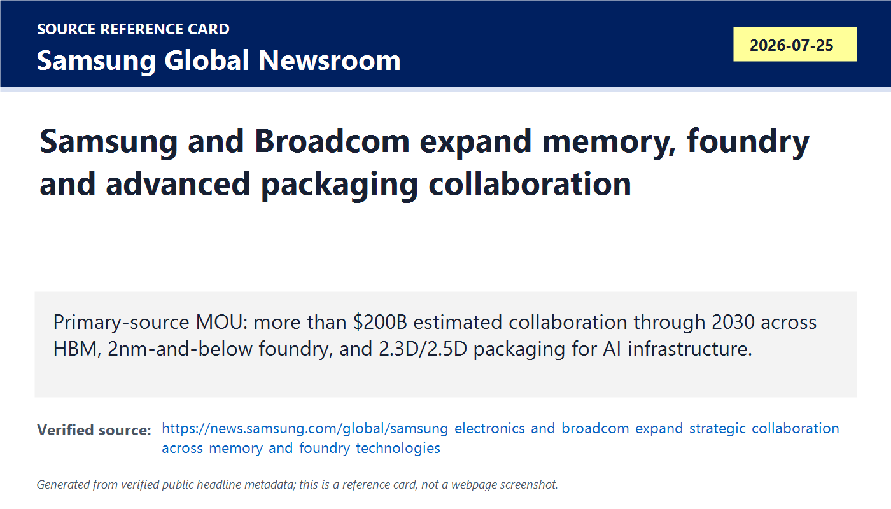
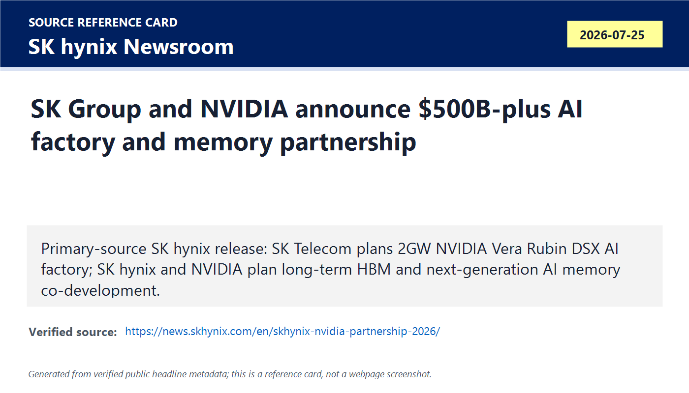
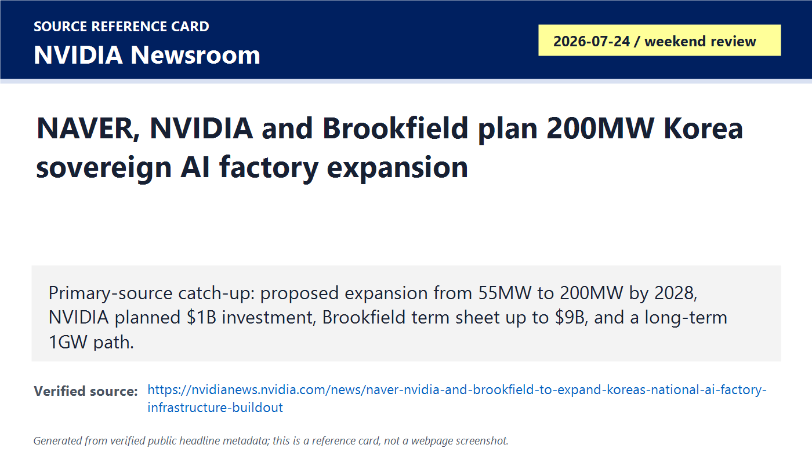
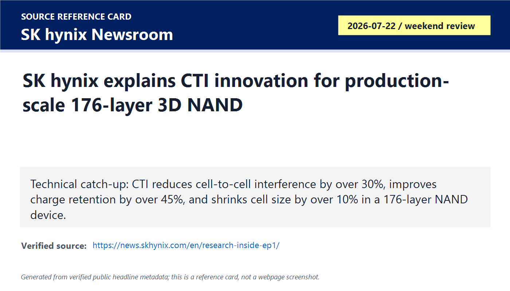
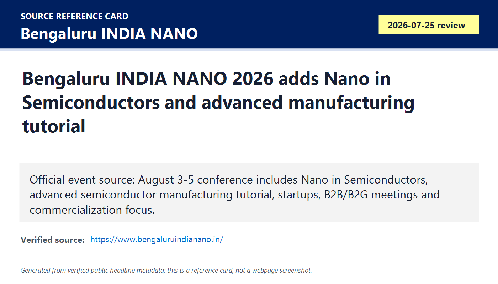

# Daily Semiconductor Current Affairs

Date: 2026-07-25

Research window: Saturday update through approximately 22:00 IST on July 25, with weekend catch-up from the nearest July 24-25 source window where exact-date primary semiconductor news was limited. This note catches up the day after the completed 2026-07-24 briefing.

## Quick Index

| Date | Major Topic | Source Groups | Why To Read |
|---|---|---|---|
| 2026-07-25 | Samsung-Broadcom AI infrastructure MOU | Samsung Global Newsroom | Shows one deal spanning memory, foundry process, and advanced packaging instead of a single-chip supply headline. |
| 2026-07-25 | SK Group-NVIDIA AI factory and memory partnership | SK hynix Newsroom, NVIDIA Newsroom | Connects 2 gigawatts of AI factory ambition with HBM4 supply and co-development. |
| 2026-07-25 | NAVER-NVIDIA-Brookfield Korea sovereign AI buildout | NVIDIA Newsroom | Turns sovereign AI from policy language into megawatts, financing conditions, data-center sites, and full-stack infrastructure. |
| 2026-07-25 | SK hynix CTI for 176-layer NAND | SK hynix Newsroom | Gives a real device/manufacturing lesson on why NAND scaling depends on interference, charge retention, and process uniformity. |
| 2026-07-25 | India Nano semiconductor-track watch | Bengaluru INDIA NANO, ET/PTI | India angle: nanofabrication, semiconductor materials, packaging, AI, startups, and commercialization are being tied together. |
| 2026-07-25 | Follow-up discipline | TSMC, AMD, Intel official pages | Keeps older open items clean: no new official TSMC pricing confirmation, AMD deployment proof remains future, Intel 10-Q details still pending. |

**Page navigation:** [Sources](#source-map) · [Concept review](#concept-review) · [Follow-up](#what-to-watch-next) · [Technical terms](#technical-terms-used-today) · [Master glossary](../knowledge-base/glossary.md)

## Source Images And Manifest

Source manifest: [../images/2026-07-25/links.md](../images/2026-07-25/links.md)

The following are generated source-reference cards based on verified public headline/date/source metadata. They are not webpage screenshots and do not reproduce article bodies.

## Source Map

| Source | Source date | Role | Confidence / limitation |
|---|---:|---|---|
| [Samsung-Broadcom memory/foundry collaboration](https://news.samsung.com/global/samsung-electronics-and-broadcom-expand-strategic-collaboration-across-memory-and-foundry-technologies) | 2026-07-25 | Primary-source MOU across HBM, 2 nm-and-below foundry, and 2.3D/2.5D packaging | Strong company source. MOU language and "estimated" value mean this is strategic intent, not guaranteed booked revenue or qualified production. |
| [SK hynix: SK Group and NVIDIA partnership](https://news.skhynix.com/en/skhynix-nvidia-partnership-2026/) | 2026-07-25 | Primary-source SK version covering USD 500B-plus initiative, 2 GW AI cloud, HBM4, and long-term memory co-development | Strong company source. Letters of intent and forward-looking statements still need financing, construction, power, tool, system and customer execution. |
| [NVIDIA: NAVER, NVIDIA and Brookfield Korea AI factory expansion](https://nvidianews.nvidia.com/news/naver-nvidia-and-brookfield-to-expand-koreas-national-ai-factory-infrastructure-buildout) | 2026-07-24 / reviewed 2026-07-25 | Primary-source weekend catch-up for 55 MW to 200 MW planned expansion, 1 GW path, NVIDIA planned USD 1B investment and Brookfield term sheet up to USD 9B | Strong source for proposal and conditions. Nonbinding term sheet and closing conditions prevent overclaiming committed deployment. |
| [SK hynix CTI 176-layer NAND research explainer](https://news.skhynix.com/en/research-inside-ep1/) | 2026-07-22 / weekend review | Primary technical company explainer linked to an IEEE IEDM paper summary on CTI for 176-layer 3D NAND | Strong for technical mechanism and claimed metrics. It is not a broad product launch or shipment disclosure. |
| [Bengaluru INDIA NANO 2026 official site](https://www.bengaluruindianano.in/) | Reviewed 2026-07-25 | Official India ecosystem source for Nano in Semiconductors track and advanced semiconductor manufacturing tutorial | Strong event source. Event programming is ecosystem/talent signal, not manufacturing output. |
| [ET/PTI: Bengaluru to host India Nano 2026](https://economictimes.indiatimes.com/tech/technology/bengaluru-to-host-3-day-india-nano-2026-event-from-3rd-august/articleshow/132623366.cms) | 2026-07-25 | Reporting with event timing, theme, speaker/delegate scale, and semiconductor coverage | Useful exact-date reporting, secondary to the official event site. |
| [TSMC latest news](https://pr.tsmc.com/english/latest-news), [Intel press releases](https://www.intc.com/news-events/press-releases), [AMD press releases](https://ir.amd.com/news-events/press-releases) | Reviewed 2026-07-25 | Official follow-up checks | No newer primary release was found beyond already logged July 23-24 items. |

## Verification Matrix

| Item | Confirmed / reported | Do not overclaim | Follow-up |
|---|---|---|---|
| Samsung-Broadcom | Samsung says the companies signed an MOU estimated at more than USD 200B across memory and foundry over five years through 2030. | MOU is not the same as binding purchase orders, wafers started, packaging qualified, or revenue recognized. | Watch Broadcom confirmation, product mapping, foundry node tape-outs, HBM allocation, package qualification and customer wins. |
| SK-NVIDIA | SK hynix says SK Group and NVIDIA signed letters of intent for a USD 500B-plus initiative, with SK Telecom planning a 2 GW NVIDIA Vera Rubin DSX AI factory and SK hynix co-developing next-generation AI memory including HBM. | LOIs are not completed infrastructure. 2 GW is an enormous power and data-center target that needs land, grid, cooling, financing and hardware delivery. | Track power permits, financing, Vera Rubin delivery, HBM4 qualification, first 2027 AI factory status and customer pricing. |
| NAVER-NVIDIA-Brookfield | NVIDIA says NAVER/NVIDIA/Brookfield plan to expand an initial 55 MW DSX buildout to 200 MW by 2028, with NAVER intending a 1 GW path. | The Brookfield term sheet is nonbinding and NVIDIA's planned USD 1B investment is conditional. | Track final committed financing, data-center construction, delivered accelerators, power availability and tenant usage. |
| SK hynix CTI | SK hynix says the new CTI approach reduced cell-to-cell interference by more than 30%, improved charge retention by more than 45%, and enabled more than 10% cell-size shrink in a 176-layer device. | This is technical research/product-enablement evidence, not a shipment volume disclosure. | Watch NAND product roadmap, mass-production adoption, yield impact and independent paper details. |
| India Nano | Official site confirms Nano in Semiconductors, advanced semiconductor manufacturing tutorial, and tracks linking AI, materials and commercialization. | Conference programming does not prove fabs or OSAT output. | Watch published agenda, speakers, startup demos, materials/tool collaborations and post-event MoUs. |

## Technical Terms / Deep Definitions

Term: Memorandum of Understanding (MOU)
Definition: An MOU is a formal statement that parties intend to cooperate, but it is usually weaker than a final supply contract or purchase order unless binding terms are explicitly included. It solves the coordination problem when companies need to align roadmaps, capacity planning, technology sharing and commercial intent before final agreements. In today's news, Samsung-Broadcom and Paras-style India project updates should be read as strategic direction, not completed production. Example: an MOU can precede a real HBM or foundry contract, but revenue still depends on price, volume, qualification and delivery. Source: https://news.samsung.com/global/samsung-electronics-and-broadcom-expand-strategic-collaboration-across-memory-and-foundry-technologies

Term: High Bandwidth Memory (HBM)
Definition: HBM is a stacked DRAM technology that places multiple memory dies vertically and connects them with very dense interconnects so an AI accelerator can move far more data per second than ordinary DIMM memory. It solves the memory-bandwidth wall: large AI models spend enormous time moving weights, activations and key-value cache data, so compute units can sit idle if memory cannot feed them. In today's news, Samsung wants to supply HBM to Broadcom AI accelerators, and SK hynix wants to co-develop next-generation HBM with NVIDIA. A comparison: a GPU is the engine; HBM is the high-flow fuel line. Source: https://www.jedec.org/standards-documents/focus/memory/high-bandwidth-memory-hbm

Term: Foundry process node
Definition: A foundry process node is a manufacturing technology generation, such as 2 nm, that defines transistor architecture, wiring rules, density, performance, power, design kits and manufacturing constraints used to fabricate chips for customers. It solves the outsourcing problem for fabless companies: Broadcom can design chips while Samsung manufactures them if the process, EDA flow and yield meet requirements. In today's news, Samsung is positioning its 2 nm-and-below process for Broadcom products. A smaller node name does not automatically mean better economics; yield, cost per good die, IP availability and packaging matter. Source: https://semiconductor.samsung.com/foundry/process-technology/

Term: Advanced packaging
Definition: Advanced packaging connects multiple dies, memory stacks, substrates and interposers into a high-performance module after wafer fabrication. It solves the scaling problem that not every improvement can come from smaller transistors; AI systems need shorter die-to-die paths, wider memory links, higher power delivery and better thermal handling. In today's news, Samsung's 2.3D and 2.5D packaging references matter because Broadcom AI/networking silicon may need logic plus memory integration beyond a simple single-die package. Source: https://semiconductor.samsung.com/foundry/advanced-package/

Term: 2.5D integration
Definition: 2.5D integration places multiple chips side by side on a silicon interposer or high-density package substrate so they communicate through very fine wires without being stacked directly on top of each other. It solves the bandwidth and yield problem for large AI chips: separate dies and HBM stacks can be manufactured and tested separately, then assembled into one package. In today's news, Samsung's 2.5D reference points to Broadcom-class AI accelerators where memory bandwidth and package routing are core design constraints. Source: https://semiconductor.samsung.com/foundry/advanced-package/

Term: AI factory
Definition: An AI factory is a large compute facility designed to turn electricity, data, chips, networking and software into trained models, inference tokens and AI services. It solves the industrialization problem for AI: individual servers are not enough when customers need reliable model training, inference, scheduling, security, observability and energy efficiency at scale. In today's news, SK Telecom, NAVER and NVIDIA frame Korea's AI buildout as factory-scale infrastructure measured in megawatts and gigawatts. Source: https://nvidianews.nvidia.com/news/naver-nvidia-and-brookfield-to-expand-koreas-national-ai-factory-infrastructure-buildout

Term: NVIDIA DSX
Definition: NVIDIA DSX is NVIDIA's full-stack AI factory platform spanning accelerators, systems, software, facility design and partner technologies for large-scale AI infrastructure. It solves deployment complexity: operators need not only GPUs, but also rack design, orchestration, lifecycle management, health automation, network topology and energy-aware scheduling. In today's news, DSX appears in both SK and NAVER Korean AI factory plans, which means NVIDIA is selling a factory architecture, not only a chip. Source: https://nvidianews.nvidia.com/news/naver-nvidia-and-brookfield-to-expand-koreas-national-ai-factory-infrastructure-buildout

Term: Sovereign AI infrastructure
Definition: Sovereign AI infrastructure is nationally or regionally controlled compute, data, model and software capacity used to reduce dependence on foreign clouds or foreign policy decisions. It solves the strategic-control problem: governments and local industries want AI systems that support local language, law, data residency, security and industrial priorities. In today's news, Korea's NAVER and SK announcements show sovereign AI moving from slogans toward financing, power, data-center capacity and supplier relationships. Source: https://nvidianews.nvidia.com/news/naver-nvidia-and-brookfield-to-expand-koreas-national-ai-factory-infrastructure-buildout

Term: Charge Trap Nitride Isolation (CTI)
Definition: CTI is a NAND device/process technique that physically isolates the nitride charge-storage regions between vertically adjacent cells so electrons stored in one cell are less likely to disturb neighboring cells. It solves the interference problem created when 3D NAND layers grow taller and cell pitch shrinks. In today's news, SK hynix says its CTI approach makes 176-layer high-density NAND more manufacturable by reducing interference and improving retention without widening channel holes. Source: https://news.skhynix.com/en/research-inside-ep1/

Term: Threshold voltage distribution
Definition: Threshold voltage distribution is the spread of voltage levels at which NAND cells are interpreted as different stored data states. It solves the read-reliability problem: if electron leakage or interference shifts those voltages, the controller may confuse one state for another and read wrong data. In today's news, SK hynix's CTI matters because a tighter threshold-voltage distribution means more reliable high-density NAND. Source: https://news.skhynix.com/en/research-inside-ep1/

Term: Nanofabrication
Definition: Nanofabrication is the set of manufacturing techniques used to build structures at nanometer scale, including thin-film deposition, lithography, etching, patterning and metrology. It solves the physical construction problem in semiconductors: circuits and memory cells now depend on features far smaller than visible light wavelengths. In today's India Nano item, nanofabrication links academic materials research to advanced semiconductor manufacturing, packaging and sensing. Source: https://www.bengaluruindianano.in/

Term: Commercialization bridge
Definition: A commercialization bridge is the path that turns research, prototypes and lab demonstrations into manufacturable products, qualified suppliers, customers and revenue. It solves the valley-of-death problem between academic research and industry adoption. In today's India item, Bengaluru INDIA NANO is relevant because it explicitly joins tutorials, startups, B2B/B2G meetings, industry roundtables and semiconductor tracks. Source: https://www.bengaluruindianano.in/

## 1. Samsung-Broadcom: One MOU Covers Memory, Foundry And Packaging

### Confirmed Facts

Samsung says it and Broadcom signed an MOU to expand collaboration across memory and foundry technologies for next-generation AI infrastructure. Samsung says the collaboration is estimated at more than USD 200 billion across memory and foundry over the five years through 2030. The memory side includes HBM supply for Broadcom's next-generation AI accelerators. The foundry side focuses on Samsung 2 nm-and-below technologies for Broadcom products, including Wireless Broadband Communications solutions, and advanced packaging built on Samsung's 2 nm process including 2.3D and 2.5D integration.

### Analysis

This is important because Broadcom is a custom-AI and networking silicon heavyweight, while Samsung has three relevant businesses under one roof: memory, foundry and advanced packaging. If Samsung can connect those pieces for Broadcom, it can sell a more integrated AI infrastructure stack. But the key word is still MOU. A serious student should not treat the USD 200B estimate as guaranteed revenue. The proof chain is: design engagement, tape-out, wafer starts, yield, HBM allocation, packaging qualification, customer ramp and revenue recognition.

### Why It Matters

AI infrastructure is moving from "who has the best chip" to "who can secure the whole bill of materials." HBM scarcity, foundry node access, package capacity and networking silicon all constrain AI cluster output. Samsung's release is a direct attempt to show Broadcom that it can reduce friction across those layers.

### VLSI / Career Relevance

For VLSI, this is a strong reminder that front-end design is not enough. A Broadcom-class AI or networking ASIC needs architecture, RTL, verification, DFT, physical design, timing closure, package-aware signal integrity, power integrity, thermal design, firmware and manufacturing test. Packaging-aware design is becoming core VLSI knowledge.

## 2. SK Group-NVIDIA: AI Factories Become Memory Demand Engines

### Confirmed Facts

SK hynix says SK Group and NVIDIA announced a USD 500B-plus initiative spanning AI factory construction and next-generation memory. SK Telecom plans a 2 GW NVIDIA Vera Rubin DSX AI Factory, with the first AI factory planned to come online in 2027. SK hynix says it will enter a long-term AI memory partnership with NVIDIA to secure and co-develop next-generation AI memory including HBM, covering workloads from large language model training to agentic AI and physical AI.

### Analysis

This is both an infrastructure story and a memory allocation story. A 2 GW AI factory plan is not just many GPUs. It requires grid power, cooling water or advanced cooling systems, networking, HBM supply, system integration, operations software and customers willing to pay for tokens. SK's advantage is that it owns a leading memory supplier and a telecom/cloud infrastructure arm. NVIDIA's advantage is that it can turn its accelerator roadmap into a national-infrastructure package.

### What Not To Overclaim

The release uses letters of intent and forward-looking language. That is useful evidence but not final deployment. The next proof will be power contracts, data-center construction progress, delivered Vera Rubin systems, HBM4 qualification and actual customer utilization.

## 3. NAVER-NVIDIA-Brookfield: Sovereign AI Gets A Financing And Power Shape

### Confirmed Facts

NVIDIA says NAVER, NVIDIA and Brookfield announced a proposed expansion of Korea's sovereign AI factory infrastructure. The plan would expand an initial NVIDIA DSX deployment at NAVER's GAK Sejong data center from 55 MW to 200 MW by 2028, while NAVER intends a path to 1 GW. NVIDIA plans to invest USD 1B into NAVER, while Brookfield has a nonbinding term sheet to fund up to USD 9B; both are conditional.

### Analysis

This item is valuable because it translates sovereign AI into measurable constraints. Megawatts tell you power draw. A data-center location tells you where grid and cooling execution must happen. A term sheet tells you financing is not automatic. A multi-tenant AI cloud tells you the business model depends on utilization across startups, enterprises, government and global AI cloud customers.

### India Angle

India's AI and semiconductor policy discussions should be read against this Korea example. If India wants sovereign AI capacity, it needs not only imported GPUs, but also power planning, data centers, memory supply, networking, local model/data capability, financing and domestic talent.

## 4. SK hynix CTI: Deep NAND Scaling Lesson

### Confirmed Facts

SK hynix's technical article says CTI was developed to address cell-to-cell interference in high-layer 3D NAND. Its new implementation deposits an oxide barrier and fills it with CTN material, avoiding silicon-nitride etching that previously widened channel holes. SK hynix says the research achieved uniform behavior across a full 176-layer stack, reduced cell-to-cell interference by more than 30%, improved charge retention by more than 45%, and enabled cell-size shrink of more than 10%.

### Analysis

This is not the flashiest market item, but it is one of the best learning items. NAND scaling used to be summarized as "add more layers." That is incomplete. When cells are packed closer, electric fields and electron movement disturb neighbors. If threshold-voltage distributions widen, the controller has a harder job reading states reliably. CTI attacks that physical problem by isolating charge-storage regions without sacrificing integration density.

### Simple Explanation

Imagine many shelves stacked vertically. Each shelf holds books representing data. If the shelves get too close and there are no dividers, books drift into nearby sections and the librarian reads the wrong label. CTI adds dividers without making the shelf structure too wide. That is why it helps density and reliability together.

## 5. India Nano: Why A Nanotech Event Belongs In A Semiconductor Notebook

### Confirmed Facts

The official Bengaluru INDIA NANO site says the August 3-5 event has a track called Nano in Semiconductors and a pre-conference tutorial on Advanced Semiconductor Manufacturing. The official page lists focus areas including advanced process technologies, packaging, lithography, materials and manufacturing techniques. ET/PTI reporting adds that the event is expected to include more than 80 speakers and over 1,000 delegates, with semiconductor coverage in the main conference.

### Analysis

India's semiconductor ecosystem needs fabs and OSAT plants, but it also needs materials science, metrology, process engineers, failure analysis, device physics and startup commercialization. Nanotechnology is not a side subject. It is the physical foundation of modern transistor, memory, sensor and packaging progress.

### VLSI / Career Relevance

For a student, this is a signal to learn beyond Verilog. Useful skills include device physics, thin films, lithography basics, process integration, TCAD, reliability, packaging, DFT and semiconductor manufacturing vocabulary. India's job market will need engineers who can bridge design and manufacturing.

## Follow-Up Ledger

| Prior item | Status | July 25 update |
|---|---|---|
| Samsung HBM4E and foundry competitiveness | Updated | Samsung now has a primary-source Broadcom MOU covering HBM, 2 nm-and-below foundry and advanced packaging. Still pending: binding orders, tape-outs, qualification and revenue. |
| SK hynix HBM / AI memory capacity | Updated | SK hynix and NVIDIA announced long-term next-generation AI memory co-development and supply intent. Still pending: HBM4 qualification, pricing, allocation and volume. |
| Korea sovereign AI infrastructure | Updated | SK and NAVER items show Korea's AI factories moving toward power/financing/data-center evidence. Still pending: final financing and deployment. |
| TSMC reported 2027 price increases | Still pending | No new official TSMC release found in the latest-news check. |
| AMD Helios deployment proof | Still pending | No newer AMD release after the July 23 AAI materials. Follow OpenAI, Anthropic, Meta and cloud deployment evidence. |
| Intel Q2 deeper proof | Still pending | No newer Intel press release after Q2 results. Read 10-Q/transcript when available for foundry losses, capex and external customers. |
| India OSAT execution | Still pending | India Nano is ecosystem/talent signal, not OSAT production proof. Paras MP and CG Semi follow-ups remain open. |

## Concept Review

| Concept | Core idea | Today's link |
|---|---|---|
| MOU vs contract | MOU shows intent; contract and shipment prove execution. | Samsung-Broadcom and SK-NVIDIA are strategic signals, not final production proof. |
| Memory plus foundry plus packaging | AI chips need all three layers together. | Samsung is pitching end-to-end capability to Broadcom. |
| AI factory economics | Tokens are produced by power, chips, memory, networking, software and utilization. | SK and NAVER plans are measured in GW/MW, not only GPUs. |
| NAND scaling | More layers are not enough; cell interference and retention matter. | SK hynix CTI shows the physical limit and the process fix. |
| India ecosystem depth | Events, tutorials and startups matter when they connect to tools, materials and manufacturing. | India Nano is a learning and ecosystem watch item. |

## VLSI And Career Relevance

1. Learn HBM and package basics: interposer, substrate, 2.5D integration, signal integrity and thermal limits.
2. Learn foundry flow language: PDK, standard cells, IP qualification, design rules, signoff, yield and tape-out.
3. Learn memory-device physics: threshold voltage, retention, disturbance, program/erase stress and error correction.
4. Learn infrastructure vocabulary: megawatts, utilization, tokens per watt, networking topology and system-level validation.
5. For India roles, connect design skills with process, packaging, DFT, validation and manufacturing readiness.

## Interview Questions

1. Why does Samsung's Broadcom MOU matter more than a simple memory-supply headline?
2. What is the difference between HBM capacity and HBM bandwidth?
3. Why does advanced packaging become a bottleneck for AI accelerators?
4. Why is a 2 GW AI factory plan harder than buying GPUs?
5. What does "sovereign AI infrastructure" mean in semiconductor terms?
6. Explain why CTI improves NAND reliability.
7. What is threshold-voltage distribution, and why does it widen in dense NAND?
8. Why should Indian VLSI students care about nanofabrication and materials?
9. What evidence would upgrade the Samsung-Broadcom MOU from intent to execution?
10. What evidence would prove SK's HBM4 partnership is translating into shipment volume?

## What To Watch Next

1. Broadcom confirmation or filings that map Samsung foundry/memory work to named product families.
2. Samsung 2 nm yield, packaging capacity and HBM supply updates.
3. SK Telecom power, site and financing evidence for the 2 GW AI factory.
4. SK hynix HBM4 qualification and allocation language.
5. NAVER/Brookfield final financing and 200 MW buildout milestones.
6. Published details or papers behind SK hynix CTI and eventual NAND product adoption.
7. Bengaluru INDIA NANO final agenda, semiconductor speakers, startup demos and post-event MoUs.
8. TSMC official word on reported 2027 price increases.

## Final Takeaway

July 25 was a weekend day, but it produced one major primary-source signal: Samsung and Broadcom are aligning memory, foundry and packaging around AI infrastructure. The SK-NVIDIA and NAVER-NVIDIA-Brookfield items show the same macro pattern from another angle: AI demand is being contracted as national-scale infrastructure measured in megawatts, HBM, power and financing. The best technical learning item is SK hynix CTI, because it explains the physical device problem behind NAND scaling. India Nano adds the local lesson: India's semiconductor ambition needs materials, nanofabrication, packaging and commercialization talent, not only headline fab announcements.

## Technical Terms Used Today

[Back to quick index](#quick-index) · [Open the master A-Z glossary](../knowledge-base/glossary.md)

**Term index:** [2.5D integration](#daily-term-2-5d-integration) · [Advanced packaging](#daily-term-advanced-packaging) · [AI factory](#daily-term-ai-factory) · [Charge Trap Nitride Isolation (CTI)](#daily-term-charge-trap-nitride-isolation-cti) · [Commercialization bridge](#daily-term-commercialization-bridge) · [Foundry process node](#daily-term-foundry-process-node) · [High-Bandwidth Memory (HBM)](#daily-term-high-bandwidth-memory-hbm) · [Memorandum of Understanding (MOU)](#daily-term-memorandum-of-understanding-mou) · [Nanofabrication](#daily-term-nanofabrication) · [NVIDIA DSX](#daily-term-nvidia-dsx) · [Sovereign AI infrastructure](#daily-term-sovereign-ai-infrastructure) · [Threshold voltage distribution](#daily-term-threshold-voltage-distribution)

| Term | Meaning |
|---|---|
| [**2.5D integration**](../knowledge-base/glossary.md#term-2-5d-integration) | 2.5D integration places multiple chips side by side on a silicon interposer or high-density package substrate so they communicate through very fine wires without being stacked directly on top of each other. It solves the bandwidth and yield problem for large AI chips: separate dies and HBM stacks can be manufactured and tested separately, then assembled into one package. |
| [**Advanced packaging**](../knowledge-base/glossary.md#term-advanced-packaging) | Advanced packaging connects multiple dies, memory stacks, substrates and interposers into a high-performance module after wafer fabrication. It solves the scaling problem that not every improvement can come from smaller transistors; AI systems need shorter die-to-die paths, wider memory links, higher power delivery and better thermal handling. |
| [**AI factory**](../knowledge-base/glossary.md#term-ai-factory) | An AI factory is a large compute facility designed to turn electricity, data, chips, networking and software into trained models, inference tokens and AI services. It solves the industrialization problem for AI: individual servers are not enough when customers need reliable model training, inference, scheduling, security, observability and energy efficiency at scale. |
| [**Charge Trap Nitride Isolation (CTI)**](../knowledge-base/glossary.md#term-charge-trap-nitride-isolation-cti) | CTI is a NAND device/process technique that physically isolates the nitride charge-storage regions between vertically adjacent cells so electrons stored in one cell are less likely to disturb neighboring cells. It solves the interference problem created when 3D NAND layers grow taller and cell pitch shrinks. |
| [**Commercialization bridge**](../knowledge-base/glossary.md#term-commercialization-bridge) | A commercialization bridge is the path that turns research, prototypes and lab demonstrations into manufacturable products, qualified suppliers, customers and revenue. It solves the valley-of-death problem between academic research and industry adoption. |
| [**Foundry process node**](../knowledge-base/glossary.md#term-foundry-process-node) | A foundry process node is a manufacturing technology generation, such as 2 nm, that defines transistor architecture, wiring rules, density, performance, power, design kits and manufacturing constraints used to fabricate chips for customers. It solves the outsourcing problem for fabless companies: Broadcom can design chips while Samsung manufactures them if the process, EDA flow and yield meet requirements. |
| [**High-Bandwidth Memory (HBM)**](../knowledge-base/glossary.md#term-high-bandwidth-memory-hbm) | HBM is a stacked DRAM technology that places multiple memory dies vertically and connects them with very dense interconnects so an AI accelerator can move far more data per second than ordinary DIMM memory. It solves the memory-bandwidth wall: large AI models spend enormous time moving weights, activations and key-value cache data, so compute units can sit idle if memory cannot feed them. |
| [**Memorandum of Understanding (MOU)**](../knowledge-base/glossary.md#term-memorandum-of-understanding-mou) | An MOU is a formal statement that parties intend to cooperate, but it is usually weaker than a final supply contract or purchase order unless binding terms are explicitly included. It solves the coordination problem when companies need to align roadmaps, capacity planning, technology sharing and commercial intent before final agreements. |
| [**Nanofabrication**](../knowledge-base/glossary.md#term-nanofabrication) | Nanofabrication is the set of manufacturing techniques used to build structures at nanometer scale, including thin-film deposition, lithography, etching, patterning and metrology. It solves the physical construction problem in semiconductors: circuits and memory cells now depend on features far smaller than visible light wavelengths. |
| [**NVIDIA DSX**](../knowledge-base/glossary.md#term-nvidia-dsx) | NVIDIA DSX is NVIDIA's full-stack AI factory platform spanning accelerators, systems, software, facility design and partner technologies for large-scale AI infrastructure. It solves deployment complexity: operators need not only GPUs, but also rack design, orchestration, lifecycle management, health automation, network topology and energy-aware scheduling. |
| [**Sovereign AI infrastructure**](../knowledge-base/glossary.md#term-sovereign-ai-infrastructure) | Sovereign AI infrastructure is nationally or regionally controlled compute, data, model and software capacity used to reduce dependence on foreign clouds or foreign policy decisions. It solves the strategic-control problem: governments and local industries want AI systems that support local language, law, data residency, security and industrial priorities. |
| [**Threshold voltage distribution**](../knowledge-base/glossary.md#term-threshold-voltage-distribution) | Threshold voltage distribution is the spread of voltage levels at which NAND cells are interpreted as different stored data states. It solves the read-reliability problem: if electron leakage or interference shifts those voltages, the controller may confuse one state for another and read wrong data. |

This page-end index covers the specialist terms central to this day's study. The fuller explanation, news context, and source remain at first use; the master glossary combines repeated terms across all days.
