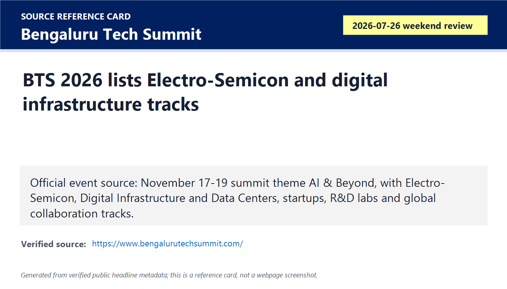
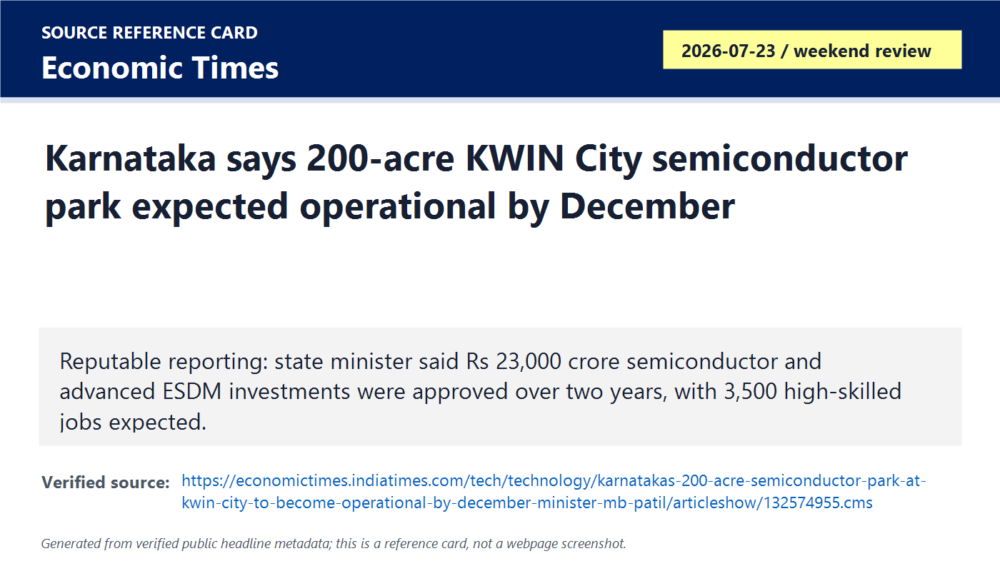
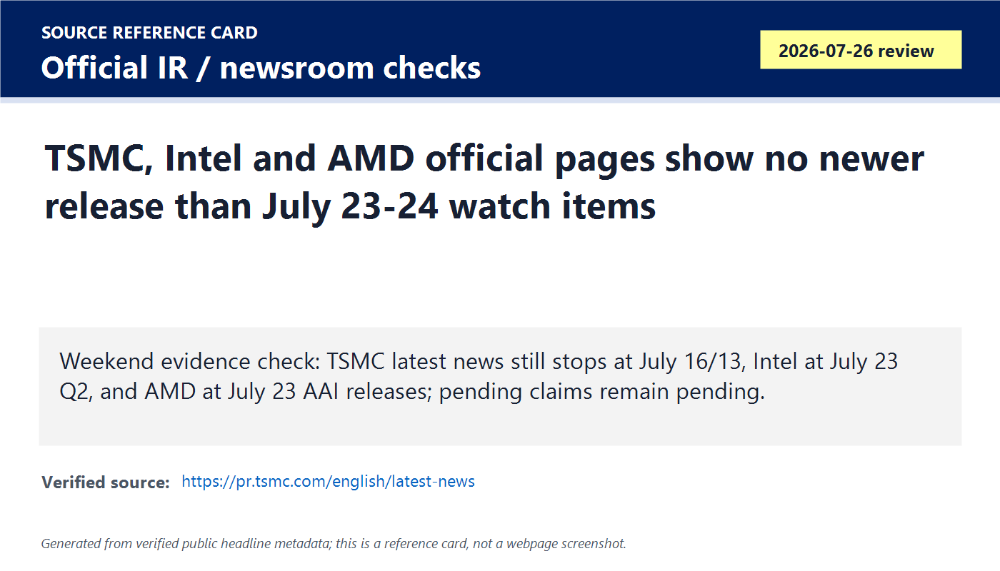
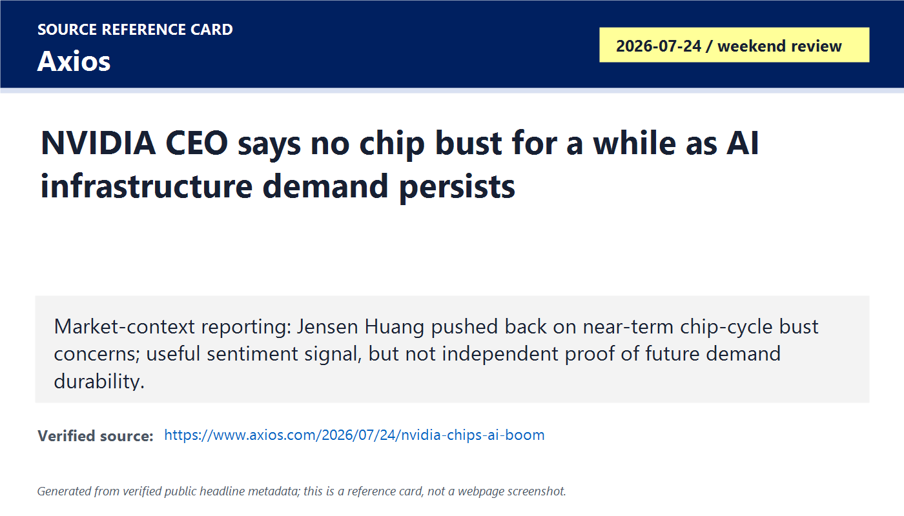

# Daily Semiconductor Current Affairs

Date: 2026-07-26

Research window: Sunday update through approximately 23:15 IST on July 26. Exact-date primary semiconductor releases were limited, so this is labeled as a weekend/catch-up briefing using the nearest July 24-26 source window and official follow-up checks. The purpose is to close the catch-up gap from 2026-07-24 through today, not to invent Sunday news where no primary source exists.

## Quick Index

| Date | Major Topic | Source Groups | Why To Read |
|---|---|---|---|
| 2026-07-26 | Official weekend release check | TSMC, AMD, Intel official pages | Prevents false updates: TSMC pricing, AMD deployments and Intel deeper filings remain open rather than confirmed. |
| 2026-07-26 | Korea AI infrastructure consolidation | Samsung, SK hynix, NVIDIA weekend sources | Shows the same pattern across three Korean-centered deals: memory, foundry, packaging, AI factories, power and financing are merging. |
| 2026-07-26 | India ecosystem: BTS and KWIN City | Bengaluru Tech Summit, Economic Times | Karnataka is positioning semiconductors through events, tracks, parks, ESDM jobs and MSME supply-chain integration. |
| 2026-07-26 | Market-cycle signal | Axios / NVIDIA CEO interview reporting | Useful sentiment check after chip-stock volatility, but CEO optimism is not independent demand proof. |
| 2026-07-26 | Next-week evidence queue | Prior daily follow-ups | Gives you a clean review list for Monday: SK hynix results, TSMC pricing, AMD/Intel execution, China policy and India project evidence. |

**Page navigation:** [Sources](#source-map) · [Concept review](#concept-review) · [Follow-up](#what-to-watch-next) · [Technical terms](#technical-terms-used-today) · [Master glossary](../knowledge-base/glossary.md)

## Source Images And Manifest

Source manifest: [../images/2026-07-26/links.md](../images/2026-07-26/links.md)

The following are generated source-reference cards based on verified public headline/date/source metadata. They are not webpage screenshots and do not reproduce article bodies.

## Source Map

| Source | Source date | Role | Confidence / limitation |
|---|---:|---|---|
| [TSMC latest news](https://pr.tsmc.com/english/latest-news) | Reviewed 2026-07-26 | Official foundry follow-up check | Latest listed releases remain July 16 Q2 results and July 13 monthly revenue. No official July 26 pricing confirmation found. |
| [Intel press releases](https://www.intc.com/news-events/press-releases) | Reviewed 2026-07-26 | Official Intel follow-up check | Latest listed release remains July 23 Q2 results; no new Sunday clarification found. |
| [AMD press releases](https://ir.amd.com/news-events/press-releases) | Reviewed 2026-07-26 | Official AMD follow-up check | Latest listed releases remain July 23 AAI/Cerebras items and earlier July 22 partnership items. Deployment proof remains future. |
| [Bengaluru Tech Summit official site](https://www.bengalurutechsummit.com/) | Reviewed 2026-07-26 | Official India ecosystem source for November 17-19 BTS 2026 and Electro-Semicon track | Strong event source. Event tracks do not equal manufacturing output. |
| [ET: KWIN City semiconductor park expected operational by December](https://economictimes.indiatimes.com/tech/technology/karnatakas-200-acre-semiconductor-park-at-kwin-city-to-become-operational-by-december-minister-mb-patil/articleshow/132574955.cms) | 2026-07-23 / weekend review | Reputable reporting on Karnataka's 200-acre semiconductor park, Rs 23,000 crore approved investments and 3,500 high-skilled jobs | Useful state-execution signal; still needs official project documentation, tenants, utilities, land, tools and production. |
| [Axios: NVIDIA CEO says no chip bust for a while](https://www.axios.com/2026/07/24/nvidia-chips-ai-boom) | 2026-07-24 / weekend review | Market sentiment and cycle-risk reporting | Useful but not neutral proof. Treat as NVIDIA CEO view, not demand guarantee. |
| [Samsung-Broadcom source](https://news.samsung.com/global/samsung-electronics-and-broadcom-expand-strategic-collaboration-across-memory-and-foundry-technologies), [SK hynix-NVIDIA source](https://news.skhynix.com/en/skhynix-nvidia-partnership-2026/), [NVIDIA-NAVER-Brookfield source](https://nvidianews.nvidia.com/news/naver-nvidia-and-brookfield-to-expand-koreas-national-ai-factory-infrastructure-buildout) | July 24-25 / consolidated 2026-07-26 | Weekend consolidation sources for Korea-centered AI infrastructure stack | Primary sources, but mostly forward-looking. Use to understand pattern, not completed deployment. |

## Verification Matrix

| Item | Confirmed / reported | Do not overclaim | Follow-up |
|---|---|---|---|
| Official release check | TSMC, Intel and AMD official pages were reviewed on July 26. No new exact-date official release was found beyond already logged July 23-25 items. | Silence is not proof that nothing is happening; it only means no new checked public release was available. | Recheck on Monday for filings, transcripts, customer confirmations and post-weekend updates. |
| Korea stack pattern | Samsung-Broadcom, SK-NVIDIA and NAVER-NVIDIA-Brookfield together point to memory, foundry, packaging, AI factories, power and financing converging. | These are not all completed contracts or deployments. Several items use MOU, LOI, proposed expansion, planned investment or nonbinding term sheet language. | Track conversion from intent to financed projects, wafer starts, HBM shipments, packages and live AI services. |
| Karnataka ecosystem | BTS official site lists Electro-Semicon among thematic tracks; ET reports a 200-acre KWIN City semiconductor park expected operational by December and Rs 23,000 crore approved investments over two years. | Event tracks and industrial parks are ecosystem preparation, not chip output. | Track tenants, infrastructure readiness, MSME supplier onboarding and signed semiconductor projects. |
| Market-cycle signal | Axios reports Jensen Huang saying he does not see a chip bust "for a while." | A CEO view is inherently interested and forward-looking. Use it as sentiment, not as independent capex durability proof. | Compare against hyperscaler capex, memory pricing, equipment orders, utilization and earnings guidance. |

## Technical Terms / Deep Definitions

Term: Official release check
Definition: An official release check is a deliberate scan of primary company or regulator pages before accepting a reported claim as confirmed. It solves the verification problem in fast-moving markets where rumors, reposts and paywalled summaries can blur the line between facts and analysis. In today's Sunday note, the official checks keep TSMC pricing, AMD deployment and Intel follow-up items in pending status instead of falsely closing them. Source: https://pr.tsmc.com/english/latest-news

Term: Weekend catch-up research
Definition: Weekend catch-up research is a labeled briefing method used when exact-date news volume is low, so the note uses the nearest 24-72 hour evidence window and explicitly marks older items as catch-up. It solves the continuity problem for a daily notebook: the calendar stays complete without pretending that every date has a new primary announcement. In today's news, July 26 is mostly a synthesis and verification day. Source: https://www.intc.com/news-events/press-releases

Term: Forward-looking statement
Definition: A forward-looking statement is company language about expected future events such as demand, deployment, investment, performance, availability or benefits. It solves a legal disclosure problem by warning readers that plans may differ from actual results because of risk and uncertainty. In today's news, SK-NVIDIA, NAVER-NVIDIA-Brookfield and Samsung-Broadcom items all need forward-looking discipline because they discuss plans, estimates, expected capacity or future collaboration. Source: https://nvidianews.nvidia.com/news/naver-nvidia-and-brookfield-to-expand-koreas-national-ai-factory-infrastructure-buildout

Term: Electro-Semicon track
Definition: An Electro-Semicon track is an event/program track focused on electronics and semiconductors, usually connecting chip design, manufacturing, components, embedded systems, supply chains and startups. It solves the ecosystem-convening problem: policy, industry, academia and investors need shared forums before projects become supply chains. In today's India item, Bengaluru Tech Summit's Electro-Semicon track is useful because Karnataka is trying to convert its software/startup base into electronics and semiconductor depth. Source: https://www.bengalurutechsummit.com/

Term: Semiconductor park
Definition: A semiconductor park is a planned industrial zone meant to host semiconductor or electronics companies with shared infrastructure such as land, utilities, roads, clean-room-ready buildings, logistics, testing services, training and supplier access. It solves the cluster problem: semiconductor projects are easier when suppliers, talent, power, water, gases, chemicals and logistics are nearby. In today's India item, KWIN City's 200-acre park is an ecosystem signal, but it becomes real only when tenants, utilities and production activity are visible. Source: https://economictimes.indiatimes.com/tech/technology/karnatakas-200-acre-semiconductor-park-at-kwin-city-to-become-operational-by-december-minister-mb-patil/articleshow/132574955.cms

Term: Electronics System Design and Manufacturing (ESDM)
Definition: ESDM covers the design, development and manufacturing of electronic systems, including boards, embedded hardware, sensors, modules, telecom equipment, industrial electronics and sometimes semiconductor-linked components. It solves the demand-pull problem for semiconductors: chip manufacturing grows stronger when local electronics products and system integrators consume and validate chips. In today's Karnataka item, semiconductor parks and ESDM investment should be read together because fabs and OSATs need downstream electronics customers. Source: https://economictimes.indiatimes.com/tech/technology/karnatakas-200-acre-semiconductor-park-at-kwin-city-to-become-operational-by-december-minister-mb-patil/articleshow/132574955.cms

Term: Market-cycle risk
Definition: Market-cycle risk is the chance that semiconductor demand, pricing, inventories or capital spending move from boom to slowdown after customers overbuy or suppliers overbuild. It solves the investor caution problem: semiconductor fundamentals can be excellent and still become dangerous if expectations exceed sustainable demand. In today's market item, Jensen Huang's optimism must be tested against hard data such as hyperscaler capex, HBM pricing, wafer starts and equipment orders. Source: https://www.axios.com/2026/07/24/nvidia-chips-ai-boom

Term: Chip bust
Definition: A chip bust is a semiconductor downturn where demand slows, inventories rise, prices fall, orders are cut and factories become underutilized. It solves a shorthand problem: investors use the phrase to describe the negative phase of the boom-bust cycle common in memory and hardware markets. In today's news, NVIDIA's CEO argues that AI demand delays such a bust, but independent proof must come from customer spending and supplier utilization. Source: https://www.axios.com/2026/07/24/nvidia-chips-ai-boom

Term: Evidence checkpoint
Definition: An evidence checkpoint is a specific future signal that can confirm, update or close an open claim, such as an earnings transcript, 10-Q filing, final investment decision, wafer start, customer qualification, shipment or official rule text. It solves the follow-up problem in daily news study: instead of leaving vague "watch this" notes, each claim gets a concrete proof target. In today's note, SK hynix earnings, TSMC pricing confirmation, AMD Helios deployment and India park tenants are evidence checkpoints. Source: https://www.sec.gov/edgar

Term: Multi-tenant AI factory
Definition: A multi-tenant AI factory is an AI compute facility built to serve multiple customers or internal groups rather than one exclusive workload. It solves the utilization problem: large AI infrastructure is too expensive to sit idle, so providers need scheduling, isolation, billing, security and workload management for many users. In today's Korea infrastructure items, NAVER's AI factory plan matters because multi-tenant usage can turn national AI infrastructure into a commercial service. Source: https://nvidianews.nvidia.com/news/naver-nvidia-and-brookfield-to-expand-koreas-national-ai-factory-infrastructure-buildout

## 1. Sunday Official Check: No False Confirmation

### Confirmed Facts

TSMC's official latest-news page reviewed on July 26 still listed July 16 Q2 results and July 13 monthly revenue as its newest releases. Intel's official press-release page still listed July 23 Q2 results as its latest item. AMD's official press-release page still showed July 23 AAI/Cerebras releases as the newest items, followed by earlier July partnership releases.

### Analysis

This matters because several open items are easy to overstate. Reported TSMC price increases remain reported, not company-confirmed in today's official check. AMD's Helios, Anthropic and OpenAI items remain strong roadmap/customer-intent evidence, but production proof is still future. Intel's Q2 result remains important, but the deeper foundry and cash-flow analysis needs filings/transcript detail.

### Why It Matters

Good current-affairs study is not only finding new stories. It is also refusing to upgrade weak evidence into strong evidence. Today's official check keeps the notebook honest.

## 2. Korea Stack Pattern: Memory, Foundry, Packaging, Power And Financing

### Confirmed Facts

The weekend evidence set includes Samsung-Broadcom on July 25, SK hynix/SK Group-NVIDIA on July 25, and NAVER-NVIDIA-Brookfield on July 24. Together they cover HBM, 2 nm-and-below foundry, 2.3D/2.5D packaging, AI factories, 2 GW SK Telecom AI cloud ambition, NAVER's 200 MW expansion target and Brookfield financing.

### Analysis

This is the clearest industry pattern of the weekend. AI infrastructure is no longer separable into neat categories. A model provider needs accelerators, HBM, networking, foundry nodes, advanced packages, power, cooling, data centers, financing and software orchestration. Korea is showing an integrated strategy because Samsung, SK hynix, SK Telecom, NAVER and government-linked events can cover many of those layers.

### Simple Explanation

Think of an AI service as a factory. The GPU is one machine, HBM is the fast local supply bin, the package is the floor layout connecting machines, the foundry builds the machines, the data center supplies power and cooling, and the cloud platform sells production time to customers.

## 3. India Ecosystem: BTS And KWIN City

### Confirmed Facts

The official Bengaluru Tech Summit site says BTS 2026 will run November 17-19 at BIEC under the theme "AI & Beyond" and lists Electro-Semicon as a thematic track. The official site also describes large exhibition and startup participation. ET reported that Karnataka's 200-acre Semiconductor Park at KWIN City is expected to become operational by December, and cited the state minister saying Karnataka had approved Rs 23,000 crore in semiconductor and advanced ESDM investments over two years, expected to create more than 3,500 high-skilled engineering jobs.

### Analysis

This is not wafer-output news, but it is useful state-execution news. India's semiconductor goal requires state-level clusters, not only central incentives. Karnataka already has design talent, global capability centers, embedded systems, aerospace and startup density. A semiconductor park can help only if it provides real utilities, tenants, suppliers, labs, packaging/test access and workforce pipelines.

### India Angle

For Kapil's review, the key distinction is "ecosystem readiness" versus "manufacturing proof." BTS and KWIN City are readiness signals. They become manufacturing proof only when named companies set up lines, tools arrive, workers are trained, packages or wafers are qualified, and customers receive shipments.

## 4. Market-Cycle Signal: NVIDIA CEO Says No Bust For A While

### Confirmed / Reported

Axios reported on July 24 that NVIDIA CEO Jensen Huang dismissed concern about a near-term chip bust and argued that AI infrastructure demand changes the traditional cycle. This is useful because it comes after recent market volatility and follows strong AI-infrastructure announcements from AMD, Intel, Samsung, SK and NVIDIA-linked partners.

### Analysis

Treat this as a sentiment signal, not a settled fact. NVIDIA has the strongest incentive to argue that AI demand is durable. The right response is to test the claim against evidence: hyperscaler capex, GPU lead times, HBM contract terms, memory prices, foundry utilization, equipment backlog, AI-service margins and customer ROI.

### Market-Moving Relevance

If the AI cycle stays strong, upstream effects reach memory, substrates, packaging, liquid cooling, power equipment, EDA, foundry and test. If demand slows, the same chain can reverse through order cuts, inventory corrections and price pressure. That is why "no chip bust" must be watched, not simply accepted.

## Follow-Up Ledger

| Prior item | Status | July 26 update |
|---|---|---|
| TSMC reported 2027 pricing | Still pending | Official TSMC latest-news page has no July 26 confirmation. Keep as reported only. |
| AMD Helios/OpenAI/Anthropic deployment | Still pending | AMD press-release page has no newer deployment proof after July 23. Track Q4 2026 OpenAI and 2027 Anthropic deployment evidence. |
| Intel Q2 / Foundry details | Still pending | Intel press-release page has no new Sunday item. Track 10-Q, transcript, Foundry operating loss and external customer mix. |
| SK hynix HBM / NVIDIA partnership | Updated | July 25 SK source confirms long-term co-development/supply intent. Still pending HBM4 qualification, allocation and volumes. |
| Samsung foundry/HBM momentum | Updated | July 25 Samsung source confirms Broadcom MOU. Still pending binding contracts, tape-outs, packaging qualification and shipments. |
| Korea sovereign AI | Updated | NAVER and SK items make Korea a major AI infrastructure watch. Still pending final financing, power and construction proof. |
| India state semiconductor ecosystem | Updated | BTS Electro-Semicon and KWIN City park add Karnataka ecosystem evidence. Still pending tenants, tools, utility readiness and output. |
| China AI/export-control policy | Still pending | No new official rule text was found in this weekend pass. Keep WSJ/FT-linked reporting as reporting, not final regulation. |

## Concept Review

| Concept | Core idea | Today's link |
|---|---|---|
| Primary-source discipline | Company/regulator pages decide what is confirmed. | TSMC/AMD/Intel checks avoided false status upgrades. |
| Stack convergence | AI hardware now links memory, foundry, packaging, power, financing and cloud software. | Korea weekend evidence shows this clearly. |
| Ecosystem readiness | Events and industrial parks prepare talent and suppliers. | BTS/KWIN City are readiness signals. |
| Proof hierarchy | MOU/LOI/proposal is weaker than shipped, qualified output. | Samsung, SK and NAVER items remain execution-dependent. |
| Cycle risk | Demand can be real but still overbuilt or overvalued. | NVIDIA CEO optimism needs data checks. |

## VLSI And Career Relevance

1. Verification engineers should study how AI accelerator complexity drives DFT, bring-up and validation across chiplets and packages.
2. Physical-design students should connect node scaling with packaging, power integrity, signal integrity and thermal constraints.
3. Memory students should follow HBM and NAND because AI infrastructure stresses both bandwidth memory and storage.
4. India-focused students should watch ESDM, semiconductor parks and events because internships and jobs often appear first around ecosystem programs.
5. Policy-aware engineers should learn proof hierarchy: announcement, MOU, LOI, final investment decision, construction, tools, qualification, shipment.

## Interview Questions

1. Why is an official release check important before updating a semiconductor tracker?
2. What is the difference between an MOU, LOI and a binding supply contract?
3. Why does AI infrastructure force memory, foundry and packaging companies to coordinate?
4. What evidence would prove a semiconductor park is more than a real-estate announcement?
5. How does ESDM demand support a semiconductor ecosystem?
6. Why can a CEO's "no chip bust" comment move sentiment but still be weak evidence?
7. What hard data would you use to test whether AI-chip demand is durable?
8. Why is multi-tenant AI infrastructure more complex than a single-customer GPU cluster?
9. Which VLSI roles benefit from packaging-aware design knowledge?
10. How would you classify Korea's weekend announcements by value-chain segment?

## What To Watch Next

1. Monday official releases after the weekend from TSMC, Samsung, SK hynix, NVIDIA, AMD, Intel and major customers.
2. SK hynix Q2/HBM evidence, including pricing, allocation, capex and HBM4 qualification language.
3. TSMC official or customer confirmation of reported 2027 foundry price increases.
4. AMD Helios customer deployment evidence from OpenAI, Anthropic, Meta and cloud providers.
5. Intel 10-Q/transcript for Foundry economics, capex, external customers and 18A/18A-P milestones.
6. Samsung-Broadcom follow-up: binding agreements, node selection, tape-outs and packaging capacity.
7. Korea AI factory buildout: power permits, construction, financing close and first workloads.
8. Karnataka KWIN City tenants, land/utilities, semiconductor park approvals and supplier onboarding.
9. China official export-control catalogue or AI model/chip rule text.
10. Equipment makers' order commentary that confirms or contradicts AI capacity expansion.

## Final Takeaway

July 26 is mainly a discipline day. There was no major exact-date primary global semiconductor release in the checked sources, so the right work was to consolidate the weekend evidence and keep follow-ups honest. The big pattern is clear: AI infrastructure demand is pulling together HBM, foundry nodes, advanced packaging, power, data centers, sovereign AI policy and financing. India should be read through the same lens: BTS and KWIN City matter only if they become real suppliers, tools, trained engineers, qualified products and customers.

## Technical Terms Used Today

[Back to quick index](#quick-index) · [Open the master A-Z glossary](../knowledge-base/glossary.md)

**Term index:** [Chip bust](#daily-term-chip-bust) · [Electro-Semicon track](#daily-term-electro-semicon-track) · [Electronics System Design and Manufacturing (ESDM)](#daily-term-electronics-system-design-and-manufacturing-esdm) · [Evidence checkpoint](#daily-term-evidence-checkpoint) · [Forward-looking statement](#daily-term-forward-looking-statement) · [Market-cycle risk](#daily-term-market-cycle-risk) · [Multi-tenant AI factory](#daily-term-multi-tenant-ai-factory) · [Official release check](#daily-term-official-release-check) · [Semiconductor park](#daily-term-semiconductor-park) · [Weekend catch-up research](#daily-term-weekend-catch-up-research)

| Term | Meaning |
|---|---|
| [**Chip bust**](../knowledge-base/glossary.md#term-chip-bust) | A chip bust is a semiconductor downturn where demand slows, inventories rise, prices fall, orders are cut and factories become underutilized. It solves a shorthand problem: investors use the phrase to describe the negative phase of the boom-bust cycle common in memory and hardware markets. |
| [**Electro-Semicon track**](../knowledge-base/glossary.md#term-electro-semicon-track) | An Electro-Semicon track is an event/program track focused on electronics and semiconductors, usually connecting chip design, manufacturing, components, embedded systems, supply chains and startups. It solves the ecosystem-convening problem: policy, industry, academia and investors need shared forums before projects become supply chains. |
| [**Electronics System Design and Manufacturing (ESDM)**](../knowledge-base/glossary.md#term-electronics-system-design-and-manufacturing-esdm) | ESDM covers the design, development and manufacturing of electronic systems, including boards, embedded hardware, sensors, modules, telecom equipment, industrial electronics and sometimes semiconductor-linked components. It solves the demand-pull problem for semiconductors: chip manufacturing grows stronger when local electronics products and system integrators consume and validate chips. |
| [**Evidence checkpoint**](../knowledge-base/glossary.md#term-evidence-checkpoint) | An evidence checkpoint is a specific future signal that can confirm, update or close an open claim, such as an earnings transcript, 10-Q filing, final investment decision, wafer start, customer qualification, shipment or official rule text. It solves the follow-up problem in daily news study: instead of leaving vague "watch this" notes, each claim gets a concrete proof target. |
| [**Forward-looking statement**](../knowledge-base/glossary.md#term-forward-looking-statement) | A forward-looking statement is company language about expected future events such as demand, deployment, investment, performance, availability or benefits. It solves a legal disclosure problem by warning readers that plans may differ from actual results because of risk and uncertainty. |
| [**Market-cycle risk**](../knowledge-base/glossary.md#term-market-cycle-risk) | Market-cycle risk is the chance that semiconductor demand, pricing, inventories or capital spending move from boom to slowdown after customers overbuy or suppliers overbuild. It solves the investor caution problem: semiconductor fundamentals can be excellent and still become dangerous if expectations exceed sustainable demand. |
| [**Multi-tenant AI factory**](../knowledge-base/glossary.md#term-multi-tenant-ai-factory) | A multi-tenant AI factory is an AI compute facility built to serve multiple customers or internal groups rather than one exclusive workload. It solves the utilization problem: large AI infrastructure is too expensive to sit idle, so providers need scheduling, isolation, billing, security and workload management for many users. |
| [**Official release check**](../knowledge-base/glossary.md#term-official-release-check) | An official release check is a deliberate scan of primary company or regulator pages before accepting a reported claim as confirmed. It solves the verification problem in fast-moving markets where rumors, reposts and paywalled summaries can blur the line between facts and analysis. |
| [**Semiconductor park**](../knowledge-base/glossary.md#term-semiconductor-park) | A semiconductor park is a planned industrial zone meant to host semiconductor or electronics companies with shared infrastructure such as land, utilities, roads, clean-room-ready buildings, logistics, testing services, training and supplier access. It solves the cluster problem: semiconductor projects are easier when suppliers, talent, power, water, gases, chemicals and logistics are nearby. |
| [**Weekend catch-up research**](../knowledge-base/glossary.md#term-weekend-catch-up-research) | Weekend catch-up research is a labeled briefing method used when exact-date news volume is low, so the note uses the nearest 24-72 hour evidence window and explicitly marks older items as catch-up. It solves the continuity problem for a daily notebook: the calendar stays complete without pretending that every date has a new primary announcement. |

This page-end index covers the specialist terms central to this day's study. The fuller explanation, news context, and source remain at first use; the master glossary combines repeated terms across all days.
