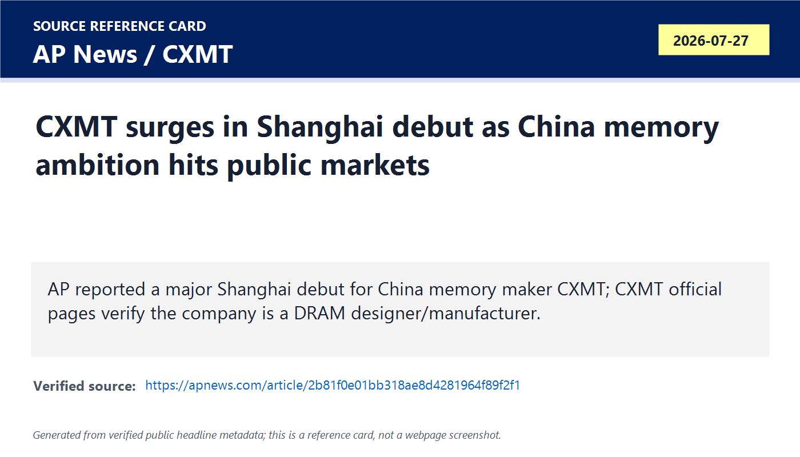
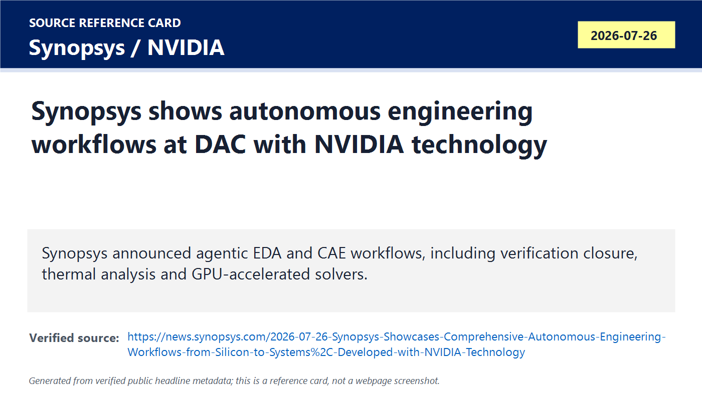
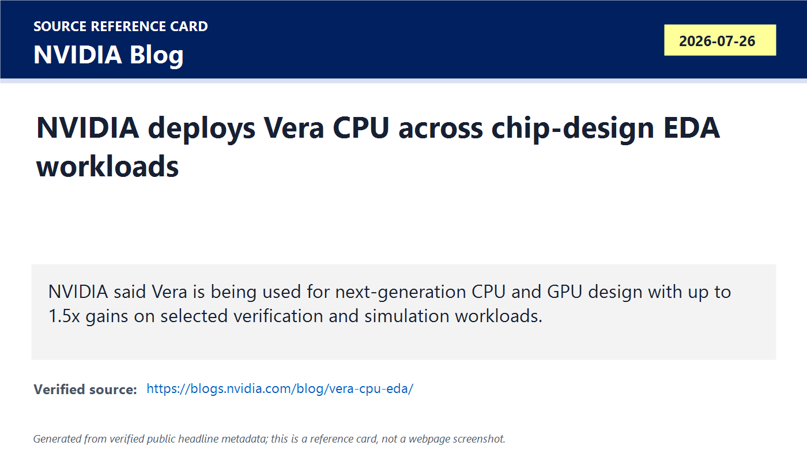
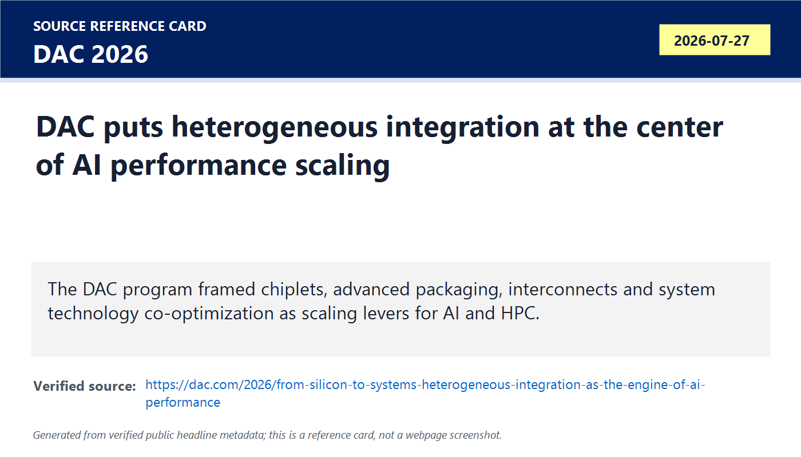
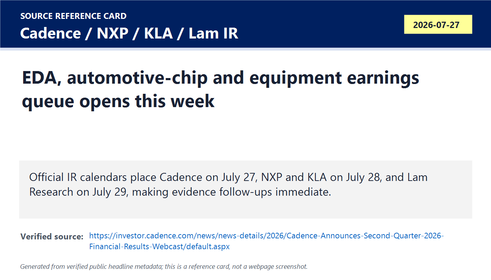
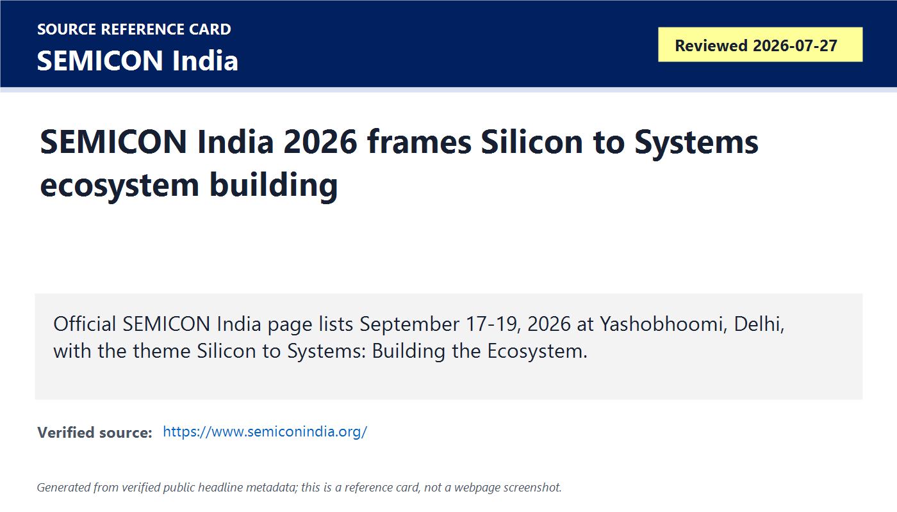

# Daily Semiconductor Current Affairs

Date: 2026-07-27

Research window: Monday update through approximately 15:20 IST on July 27, 2026. Exact-date news is strongest for the CXMT market debut and the DAC 2026 program; several U.S. earnings events occur later in the U.S. day or later this week, so they are labeled as evidence checkpoints rather than completed results.

## Quick Index

| Date | Major Topic | Source Groups | Why To Read |
|---|---|---|---|
| 2026-07-27 | CXMT Shanghai debut | AP News, CXMT official site, SEC Investor.gov definition | Memory, geopolitics, China self-reliance, market valuation and DRAM supply all meet in one event. |
| 2026-07-27 | Agentic EDA at DAC | Synopsys, NVIDIA Blog | Shows AI moving inside chip design, verification, thermal simulation and solver acceleration, not only inside end-user applications. |
| 2026-07-27 | Vera CPU for EDA workloads | NVIDIA Blog, Cadence/Synopsys references | Good VLSI career lesson: many chip-design bottlenecks remain CPU-heavy, latency-sensitive and verification-bound. |
| 2026-07-27 | Heterogeneous integration and chiplets | DAC 2026 official program | Packaging and system co-optimization are now treated as core AI-performance levers, not back-end afterthoughts. |
| 2026-07-27 | Earnings queue | Cadence, NXP, KLA, Lam Research, SK hynix official/IR pages | Keeps market-moving claims disciplined: results due after this note must be checked before conclusions are closed. |
| 2026-07-27 | India ecosystem follow-up | SEMICON India official site | India watch remains ecosystem-building: design, tools, talent, packaging, fabs and supply chain, not only one project headline. |

**Page navigation:** [Sources](#source-map) · [Concept review](#concept-review) · [Follow-up](#what-to-watch-next) · [Technical terms](#technical-terms-used-today) · [Master glossary](../knowledge-base/glossary.md)

## Source Images And Manifest

Source manifest: [../images/2026-07-27/links.md](../images/2026-07-27/links.md)

The following are generated source-reference cards based on verified public headline/date/source metadata. They are not webpage screenshots and do not reproduce article bodies.

## Source Map

| Source | Source date | Role | Confidence / limitation |
|---|---:|---|---|
| [AP News market report on CXMT debut](https://apnews.com/article/2b81f0e01bb318ae8d4281964f89f2f1) | 2026-07-27 | Reputable market-moving report on CXMT's Shanghai trading debut | Strong for market reaction. Treat valuation and first-day price moves as market facts, not proof of process-node parity with Samsung, SK hynix or Micron. |
| [CXMT official site](https://www.cxmt.com/en/) | Reviewed 2026-07-27 | Primary company source for CXMT business identity and product categories | Confirms DRAM focus and products such as DDR5, LPDDR5/5X, DDR4 and LPDDR4X. It does not independently verify IPO valuation or HBM progress. |
| [Investor.gov IPO glossary](https://www.investor.gov/introduction-investing/investing-basics/glossary/initial-public-offering-ipo) | Reviewed 2026-07-27 | Authoritative definition source for IPO mechanics | Explains what an IPO is; not semiconductor-specific. |
| [Synopsys DAC 2026 announcement](https://news.synopsys.com/2026-07-26-Synopsys-Showcases-Comprehensive-Autonomous-Engineering-Workflows-from-Silicon-to-Systems%2C-Developed-with-NVIDIA-Technology) | 2026-07-26 | Primary EDA/CAE announcement at DAC | Strong for announced capabilities. Performance claims are vendor-provided and need customer workloads, reproducibility and production adoption. |
| [NVIDIA Vera CPU EDA blog](https://blogs.nvidia.com/blog/vera-cpu-eda/) | 2026-07-26 | Primary NVIDIA explanation of Vera CPU use in EDA workflows | Strong for NVIDIA's own deployment and selected-test claims. Results are initial and workload-selected. |
| [DAC 2026 heterogeneous integration session](https://dac.com/2026/from-silicon-to-systems-heterogeneous-integration-as-the-engine-of-ai-performance) | 2026-07-27 | Official conference program source for chiplets, advanced packaging and STCO | Strong for agenda and framing. A session topic is not a commercial product result. |
| [Cadence Q2 2026 webcast notice](https://investor.cadence.com/news/news-details/2026/Cadence-Announces-Second-Quarter-2026-Financial-Results-Webcast/default.aspx) | 2026-07-06, event on 2026-07-27 | Official EDA earnings checkpoint | The webcast begins after this India-time note window, so results remain pending. |
| [NXP Q2 2026 conference-call notice](https://www.nxp.com/company/about-nxp/newsroom/NW-NXP-ANNOUNCES-CONFERENCE-CALL-2Q-2026) | 2026-07-07, event on 2026-07-28 | Official automotive/industrial semiconductor earnings checkpoint | Results are scheduled for July 28 after U.S. market close; no conclusion yet. |
| [KLA Q4 FY2026 earnings date](https://ir.kla.com/news-events/press-releases/detail/517/kla-announces-fourth-quarter-fiscal-year-2026-earnings-date) | 2026-07-01, event on 2026-07-28 | Official process-control equipment earnings checkpoint | Results are scheduled for July 28 after market close. |
| [Lam Research press-release page](https://newsroom.lamresearch.com/press-releases?l=100) | Reviewed 2026-07-27 | Equipment follow-up watch page | Search/indexed results indicate a July 29 call, while the source page is dynamic and less clean in text extraction. Keep as watch, not a closed result. |
| [SEMICON India official site](https://www.semiconindia.org/) | Reviewed 2026-07-27 | Official India ecosystem event source | Confirms September 17-19, 2026 at Yashobhoomi, Delhi, theme "Silicon to Systems: Building the Ecosystem." Program/exhibitor details remain pending. |

## Technical Terms / Deep Definitions

Term: Initial Public Offering (IPO)
Definition: An IPO is the first sale of a company's shares to the public market. The business problem it solves is capital access and liquidity: a private company can raise money, early investors can eventually sell, and public investors can price the company. In today's CXMT news, the IPO matters because a memory manufacturer becomes a visible market instrument for China's semiconductor self-reliance theme. Comparison: an IPO is not the same as production proof; a company can list shares before proving technology parity or durable margins. Source: https://www.investor.gov/introduction-investing/investing-basics/glossary/initial-public-offering-ipo

Term: DRAM
Definition: Dynamic random-access memory stores data as charge in tiny capacitors and must be refreshed repeatedly because charge leaks away. It solves the working-memory problem for CPUs, GPUs and AI systems: fast temporary data access while computation is running. In today's CXMT story, DRAM matters because China wants a domestic supplier in a market dominated by Samsung, SK hynix and Micron, while AI demand pushes memory prices and capacity value higher. Comparison: DRAM is working memory, while NAND is persistent storage that keeps data without power. Source: https://www.cxmt.com/en/

Term: STAR Market
Definition: The STAR Market is Shanghai's science-and-technology board for high-growth technology companies. The business problem it solves is giving strategic technology firms a domestic listing channel with investor appetite for long-duration R&D stories. In today's CXMT debut, the board matters because China is using public capital markets to finance a strategic semiconductor supplier. Comparison: it is closer to a Nasdaq-style growth board than a traditional low-volatility utility market. Source: https://star.sse.com.cn/en/

Term: Market capitalization
Definition: Market capitalization is share price multiplied by shares outstanding, giving the public market value assigned to a company. It solves a comparison problem for investors: it lets them compare a listed company's market value with peers, expected earnings, assets and growth. In today's CXMT news, the market cap matters because a very high first-day valuation can signal enthusiasm for memory self-reliance, but it can also outrun proof of margins, process capability and cycle durability. Source: https://www.investor.gov/introduction-investing/investing-basics/glossary/market-capitalization

Term: Electronic Design Automation (EDA)
Definition: EDA is the software and methodology stack used to design, simulate, verify, implement and sign off integrated circuits. It solves the complexity problem: modern chips are too large and timing-sensitive to design reliably by manual drawing. In today's Synopsys/NVIDIA news, EDA matters because AI and accelerated computing are being applied inside chip creation itself, especially verification and simulation. Comparison: CAD for mechanical design helps draw parts; EDA helps prove that billions of transistors will behave correctly before fabrication. Source: https://www.synopsys.com/glossary/what-is-electronic-design-automation.html

Term: Agentic EDA
Definition: Agentic EDA uses AI agents that plan, run tools, inspect results and iterate toward design or verification goals with engineer oversight. It solves a workflow bottleneck: engineers spend large amounts of time coordinating tests, coverage closure, debug and repeated tool runs. In today's DAC news, agentic EDA matters because Synopsys is presenting long-running autonomous verification and thermal workflows, shifting from assistive AI to goal-driven execution. Comparison: a script repeats fixed steps; an agentic workflow can choose next steps based on intermediate failures and coverage gaps. Source: https://news.synopsys.com/2026-07-26-Synopsys-Showcases-Comprehensive-Autonomous-Engineering-Workflows-from-Silicon-to-Systems%2C-Developed-with-NVIDIA-Technology

Term: Register-transfer level (RTL)
Definition: RTL is a digital design abstraction that describes registers, combinational logic and data transfers on clock edges, commonly written in Verilog, SystemVerilog or VHDL. It solves the design-entry problem by letting engineers specify cycle-by-cycle behavior before synthesis turns the design into gates. In today's Synopsys news, RTL matters because the claimed verification speedup is described as time-to-validated RTL, meaning the design must be checked before layout and masks. Source: https://www.synopsys.com/glossary/what-is-register-transfer-level.html

Term: Coverage closure
Definition: Coverage closure is the process of proving that the verification environment has exercised the intended design features, corner cases and state combinations sufficiently. It solves the confidence problem: a simulation can pass many tests while still missing important legal or illegal behaviors. In today's agentic verification news, coverage closure matters because Synopsys says agents can decompose verification goals and drive tests/debug toward better coverage. Comparison: passing one exam question is not mastery; coverage closure is closer to checking that the syllabus has been meaningfully tested. Source: https://news.synopsys.com/2026-07-26-Synopsys-Showcases-Comprehensive-Autonomous-Engineering-Workflows-from-Silicon-to-Systems%2C-Developed-with-NVIDIA-Technology

Term: Formal verification
Definition: Formal verification mathematically proves properties about a design instead of only trying examples in simulation. It solves the missed-corner-case problem: some bugs appear only in rare state combinations that random or directed tests may not reach. In today's NVIDIA Vera EDA note, formal verification matters because Cadence Jasper is named as a CPU-sensitive workload that benefited in selected early tests. Comparison: simulation asks "did this test pass"; formal asks "can this bad behavior ever happen under the stated assumptions." Source: https://blogs.nvidia.com/blog/vera-cpu-eda/

Term: SPICE simulation
Definition: SPICE simulation numerically analyzes analog transistor-level circuits to predict voltages, currents, timing and device interactions. It solves the analog signoff problem where discrete logic abstractions are not enough, especially for memories, I/O, RF, power and mixed-signal blocks. In today's Synopsys news, SPICE matters because GPU acceleration was highlighted for PrimeSim SPICE, showing that analog/mixed-signal workloads are also being accelerated. Source: https://www.synopsys.com/implementation-and-signoff/ams-simulation/primesim-spice.html

Term: Computer-aided engineering (CAE)
Definition: CAE uses simulation software to model physical behavior such as thermal, mechanical, electromagnetic or fluid effects before building hardware. It solves the system-design problem that electrical correctness alone is not enough: an AI accelerator package can fail if heat, stress or airflow is wrong. In today's Synopsys-Ansys-NVIDIA news, CAE matters because chip and system design are merging with thermal simulation and digital twins. Source: https://www.ansys.com/simulation-topics/what-is-computer-aided-engineering

Term: Heterogeneous integration
Definition: Heterogeneous integration combines separately manufactured dies, chiplets, memory, interposers, bridges or other components into one package or closely coupled system. It solves the scaling problem when one monolithic die becomes too expensive, too large, too low-yielding or too limited by reticle size. In today's DAC session, it matters because AI performance now depends on package-level bandwidth, power delivery, thermal design and interconnects, not just transistor density. Comparison: instead of building one huge city as a single block, heterogeneous integration connects specialized districts with very fast roads. Source: https://dac.com/2026/from-silicon-to-systems-heterogeneous-integration-as-the-engine-of-ai-performance

Term: Chiplet
Definition: A chiplet is a smaller die designed to be combined with other dies inside one package or module. It solves yield, reuse and specialization problems: designers can mix compute, I/O, memory interface and accelerator dies instead of forcing every function onto one large die. In today's DAC item, chiplets matter because the official session frames chiplet design and advanced packaging as necessary for AI/HPC scaling. Source: https://dac.com/2026/from-silicon-to-systems-heterogeneous-integration-as-the-engine-of-ai-performance

Term: System Technology Co-Optimization (STCO)
Definition: STCO optimizes technology choices across silicon process, package, board, power, cooling, software and system architecture together. It solves the local-optimization problem: a great transistor or package can still underperform if memory bandwidth, power delivery or thermal constraints are mismatched. In today's DAC source, STCO matters because Intel's system-foundry framing treats packaging and interconnects as first-class performance tools. Source: https://dac.com/2026/from-silicon-to-systems-heterogeneous-integration-as-the-engine-of-ai-performance

Term: Process control
Definition: Process control uses metrology, inspection and feedback systems to keep wafer manufacturing steps within tight tolerances. It solves the yield problem: tiny variations in film thickness, critical dimension, overlay or defects can make chips fail. In today's earnings queue, KLA matters because it is a major process-control equipment supplier; its results help indicate whether fabs are still buying tools needed to improve yield and ramp advanced processes. Source: https://ir.kla.com/news-events/press-releases/detail/517/kla-announces-fourth-quarter-fiscal-year-2026-earnings-date

Term: Wafer fabrication equipment (WFE)
Definition: WFE is the factory-tool category used to manufacture wafers, including lithography, deposition, etch, cleaning, ion implantation, metrology, inspection and process-control tools. It solves the production-capacity problem: no fab can turn designs into wafers without installed, qualified tools. In today's follow-up queue, Lam, KLA, ASML and Applied Materials matter because WFE orders and guidance show whether AI and memory demand are becoming real factory investment. Source: https://www.semi.org/en/products-services/market-data/equipment

Term: Silicon to Systems
Definition: Silicon to Systems is a design framing that connects chip design with package, board, thermal, software, data-center and end-application constraints. It solves the boundary problem: AI infrastructure performance is no longer decided only inside the chip die. In today's SEMICON India and DAC sources, the phrase matters because both India ecosystem planning and global EDA events are organizing around full-stack hardware capability. Source: https://www.semiconindia.org/

## Verification Matrix

| Item | Confirmed facts | Analysis boundary |
|---|---|---|
| CXMT public-market debut | AP reported a large Shanghai debut for CXMT on July 27; CXMT's own site says it manufactures DRAM and lists DDR5, LPDDR5/5X, DDR4 and LPDDR4X product categories. | First-day valuation does not prove HBM parity, leading-node manufacturing parity, export-control immunity, or stable memory-cycle margins. |
| Synopsys agentic EDA | Synopsys announced autonomous verification, analog/mixed-signal and CAE workflows at DAC using NVIDIA technologies, with vendor-provided speed and coverage claims. | Treat "up to" speedups as selected workload evidence until independent customer benchmarks and production outcomes appear. |
| NVIDIA Vera for EDA | NVIDIA said Vera is being deployed across its EDA workflows and that selected Cadence Jasper and Synopsys VCS workloads showed up to 1.5x performance. | Early internal tests do not prove broad EDA farm economics across all workloads, licenses, memory footprints or regression mixes. |
| DAC heterogeneous integration | DAC's July 27 session frames chiplets, advanced packaging, interconnects and STCO as AI/HPC scaling tools. | A conference presentation is a roadmap signal, not a product shipment or yield disclosure. |
| Earnings queue | Cadence is scheduled later July 27 PT; NXP and KLA are scheduled July 28; Lam is on the July 29 watch list; SK hynix IR remains a memory-results watch. | Because several results happen after this India-time note, they stay pending rather than being summarized as outcomes. |
| India ecosystem | SEMICON India official site confirms September 17-19, 2026 at Yashobhoomi, Delhi, under "Silicon to Systems: Building the Ecosystem." | Program, exhibitor and project-specific evidence still need later verification. |

## 1. CXMT Goes Public: Memory, China Policy And Market Valuation Collide

**What happened:** AP reported that Chinese memory chipmaker CXMT surged in its Shanghai debut on July 27. CXMT's own site confirms the company is focused on DRAM design, manufacturing, sales and R&D, and lists DDR5/DDR5 module, LPDDR5/5X, DDR4/DDR4 module and LPDDR4X product categories.

**Confirmed facts:** The confirmed source chain is: AP for the market event, CXMT's own site for product/business identity, and Investor.gov for IPO mechanics. CXMT is not being treated here as technically equal to the global HBM leaders simply because the stock market assigned it a high first-day value.

**Why it matters:** DRAM has become strategic because AI systems need huge working-memory bandwidth and capacity. Even if CXMT is strongest in commodity/client DRAM rather than HBM, a large public listing gives China a capital-market instrument to fund equipment, process R&D, talent hiring, capacity and possibly advanced-memory development. It also introduces a new valuation reference point for the memory upcycle.

**Value-chain segment:** Memory IDM, DRAM manufacturing, China capital markets, strategic industrial policy.

**India angle:** India should read this as a warning that semiconductor capability is not only about announcing fabs. China is using a full stack: domestic suppliers, public capital, state-backed demand, local ecosystems and policy. For India, the comparable question is whether design, ATMP/OSAT, materials, EDA access, training and customer demand can become one connected system.

**VLSI/career relevance:** For you, the key lesson is memory is a device physics plus systems topic. DRAM cells, sense amplifiers, refresh, yield, redundancy, timing closure and packaging all feed business valuation. A VLSI engineer who understands both DRAM architecture and market constraints can read this news better than someone who only tracks stock moves.

**Simple explanation:** The market is saying "China's memory company may become very important." Engineering still has to answer "what products, what yield, what speed, what power, what reliability, what customers, and what tool access?"

## 2. Synopsys And NVIDIA Push Agentic EDA From Demo Language Toward Workflow Claims

**What happened:** Synopsys announced at DAC that it is showcasing autonomous engineering workflows developed with NVIDIA technology. The announcement covers a long-running design verification agent, a thermal CAE workflow using Ansys Icepak/PyAEDT-style automation, more than 20 GPU-accelerated EDA and multiphysics products, and acceleration claims for verification, SPICE, materials and electromagnetic workloads.

**Confirmed facts:** This is a primary company announcement. Synopsys says customers are evaluating the capabilities and availability is planned for the second half of 2026. That matters because "planned availability" is not the same as general production adoption.

**Why it matters:** Verification is one of the hardest and slowest parts of VLSI. If agents can generate tests, inspect coverage, debug failures and keep a closed loop running for hours, the value is not only speed. The bigger value is fewer missed bugs, faster feedback for RTL designers, and more design alternatives explored before tape-out.

**Analysis:** The weak point is benchmark discipline. "Up to 50X" and "20% coverage improvement" can be real on selected flows and still not generalize. The right follow-up is: Which IP block? What baseline? Same licenses? Same compute? Same coverage model? Same engineer hours? Any silicon escapes reduced?

**Value-chain segment:** EDA, design verification, analog/mixed-signal design, CAE/thermal simulation, materials simulation.

**India angle:** This is directly relevant to India's design-talent push. If AI agents become part of mainstream EDA, Indian VLSI training must not stop at syntax. Students need verification planning, assertions, coverage, debug, scripting, tool orchestration and signoff thinking.

**VLSI/career relevance:** Learn SystemVerilog/UVM, formal basics, coverage metrics, TCL/Python automation, timing/power signoff concepts and how to read tool reports. Agentic EDA will not remove those skills; it will reward engineers who can supervise, constrain and audit AI-generated actions.

## 3. NVIDIA Vera CPU Shows Why Chip Design Still Needs Strong CPUs

**What happened:** NVIDIA said its Vera CPU is being used in EDA workflows for next-generation NVIDIA CPUs and GPUs, and that selected Cadence Jasper and Synopsys VCS workloads showed up to 1.5x higher performance in early testing.

**Confirmed facts:** NVIDIA's blog states Vera combines 88 custom Olympus CPU cores, an LPDDR5X memory subsystem and a scalable coherent fabric, and that selected formal verification and functional simulation workloads showed gains.

**Why it matters:** The popular AI story focuses on GPUs, but chip design farms often run many CPU-bound jobs: compile, simulation, formal proofs, incremental implementation, regression orchestration and debug. These jobs care about per-core performance, memory latency, I/O, filesystem behavior and license scheduling. Faster GPUs do not automatically speed up every verification workload.

**Analysis:** NVIDIA is also making a strategic statement: it wants to supply more of the AI data-center compute stack, and it wants its own CPU roadmap to improve its own chip-design cycle. That creates a feedback loop: better CPUs help design better GPUs and CPUs, which can then improve future EDA workloads.

**Value-chain segment:** AI infrastructure CPUs, EDA compute, design verification, data-center hardware.

**Interview angle:** A good interviewer may ask why simulation is hard to parallelize. The answer is that many logic events and proof steps depend on sequential state, memory access patterns and synchronization overhead, so single-thread and memory-system performance still matter.

## 4. DAC Puts Heterogeneous Integration At The Center Of AI Scaling

**What happened:** DAC's July 27 session "From Silicon to Systems: Heterogeneous Integration as the Engine of AI Performance" frames chiplets, advanced packaging, interconnect technologies and STCO as necessary for AI/HPC scaling.

**Confirmed facts:** The official DAC page says the session is on July 27, identifies AI/HPC demand outpacing classic Moore's Law scaling, and says heterogeneous integration of chiplets in advanced packages is essential for sustainable scaling.

**Why it matters:** AI accelerators are limited by data movement. HBM bandwidth, die-to-die links, package routing density, power delivery, thermal resistance and reliability can decide system performance as much as the compute die. That is why packaging/test is now strategic.

**Analysis:** This also explains why Samsung-Broadcom, SK hynix-NVIDIA, TSMC CoWoS, Intel advanced packaging and India OSAT projects keep recurring in the notebook. The value chain is moving from "who has the smallest node" to "who can integrate compute, memory, package, power and software into a qualified system."

**Value-chain segment:** Advanced packaging, foundry/system foundry, interconnect, AI/HPC systems.

**India angle:** For India, packaging and test may be a realistic near-term entry point, but only if it moves beyond basic assembly toward reliability, bumping, substrates, thermal management, failure analysis, process control and customer qualification.

## 5. Earnings Queue: Cadence, NXP, KLA, Lam And SK hynix Are Evidence Checkpoints

**What happened:** Official IR sources show a dense evidence window: Cadence's Q2 webcast is July 27 at 2:00 p.m. PT; NXP reports July 28 after U.S. market close; KLA reports July 28 after market close; Lam Research is a July 29 equipment watch; SK hynix remains a memory earnings watch.

**Confirmed facts:** Cadence, NXP and KLA sources are official and cleanly dated. Lam's press-release page is dynamic in the captured text, so treat it as a watch source rather than a closed claim. SK hynix IR page is official, but the precise event detail should be rechecked before writing the next note.

**Why it matters:** These reports cover three different stress points:

- EDA demand: Are AI/custom silicon customers still spending on design software and verification?
- Automotive/industrial chips: Is the non-AI chip cycle recovering through NXP and onsemi-style end markets?
- Equipment: Are fabs continuing to buy process-control, etch, deposition and inspection tools after strong AI and memory forecasts?

**Analysis:** This is a perfect example of why the daily note should not overclaim before earnings land. A scheduled webcast is evidence that a checkpoint exists, not evidence of revenue, orders, margins or guidance.

**Value-chain segment:** EDA/IP, automotive and industrial semiconductors, WFE, process control, memory earnings.

## 6. India Follow-Up: SEMICON India 2026 Is Still Ecosystem Setup

**What happened:** The official SEMICON India page lists September 17-19, 2026 at Yashobhoomi, Delhi, with the theme "Silicon to Systems: Building the Ecosystem." Program at a glance and exhibitor listing are still marked as coming soon.

**Confirmed facts:** Date, venue and theme are official. Detailed speakers, project announcements and exhibitor evidence are not yet available from the captured official page.

**Why it matters:** "Silicon to Systems" is the right framing for India because a real semiconductor ecosystem is not only a fab. It includes design houses, IP, EDA access, materials, gases, equipment components, OSAT/ATMP, substrates, reliability labs, talent pipelines, system customers and policy execution.

**Analysis:** The risk is event inflation: a conference can create visibility without creating output. The evidence to watch is project updates, customer commitments, equipment arrivals, training programs with measurable tape-outs, and manufacturing milestones.

**VLSI/career relevance:** For a student or early engineer in India, SEMICON India should be treated as a map of skills to build: RTL, verification, DFT, physical design, packaging basics, reliability, device physics, Python automation, and ability to read company/regulator sources.

## Follow-Ups From Previous Briefings

| Prior item | Status on 2026-07-27 | Evidence / next action |
|---|---|---|
| Samsung-Broadcom MOU from July 25 | Still pending | No new official contract, tape-out, HBM allocation or qualified-package shipment was found in today's source window. Keep watching Samsung, Broadcom and customer qualification evidence. |
| SK Group-NVIDIA AI factory and HBM partnership | Still pending | July 25 LOI/MOU framing remains strategic. Next proof is financing, site/power permits, construction, HBM4 qualification and SK hynix earnings commentary. |
| NAVER-NVIDIA-Brookfield Korea AI factory | Still pending | Still dependent on final investment, financing close, capacity buildout and customer utilization. |
| TSMC reported 2027 price increases | Still pending | No official July 27 TSMC confirmation found in this research window. Keep as reported, not confirmed. |
| AMD Helios and AMD-Cerebras H2 2026 deployment | Still pending | July 24 launch and roadmap remain official; live deployment volume, benchmark methodology and customer economics remain future evidence. |
| Intel Q2 and Foundry follow-up | Updated, still pending | DAC/STCO item strengthens system-foundry context, but external foundry customer scale, 18A-P yield detail and 10-Q-level economics still need follow-up. |
| India KWIN City and Paras MP OSAT | Still pending | No new exact-date official project closure found. Watch land, incentives, tool orders, customers, qualification and first shipment evidence. |

## Concept Review

| Concept | Use this mental model |
|---|---|
| Memory company IPO | A stock-market debut can fund and reprice a semiconductor company, but it does not by itself prove process, yield, reliability or customer qualification. |
| EDA bottleneck | Modern chip creation is verification-limited: bugs found late are expensive, so any tool that improves coverage and debug can change tape-out schedules. |
| CPU role in AI hardware | GPUs dominate training/inference headlines, but CPUs still coordinate design, orchestration, simulation, verification and many agentic AI control paths. |
| Heterogeneous integration | AI scaling increasingly happens through package-level bandwidth and power/thermal co-design, not only transistor shrinking. |
| Earnings checkpoint | A scheduled earnings event is a question mark, not an answer. Record what is due, then close it only after official numbers arrive. |
| India ecosystem | A national semiconductor ecosystem is a chain. Weak design, materials, tools, packaging or customers can limit the value of a fab announcement. |

## Simple Explanation

Today's semiconductor picture is: China showed market confidence in a domestic DRAM champion, the EDA industry showed AI agents entering chip-design workflows, NVIDIA showed its own CPU being used to design future chips, DAC emphasized chiplets and advanced packaging, and the next 48 hours will bring key earnings proof points. For your study, the common thread is evidence discipline: separate stock-market excitement, vendor performance claims, conference roadmaps and official financial results.

## VLSI / Career Relevance

1. For memory: learn DRAM basics, refresh, sense amplifiers, timing parameters, yield and redundancy.
2. For EDA: learn RTL, UVM, coverage, formal verification, scripting and how tool reports are interpreted.
3. For packaging: learn chiplets, interposers, substrates, microbumps, hybrid bonding, thermal resistance and reliability tests.
4. For equipment: understand why process control, metrology and inspection are as important as lithography.
5. For India: map each policy/event headline to a concrete skill or facility requirement.

## Interview Questions

1. Why does an IPO not prove semiconductor manufacturing capability?
2. What is the difference between DRAM and NAND, and why is DRAM important for AI?
3. Why is coverage closure difficult in digital verification?
4. What types of EDA workloads remain CPU-sensitive even in the GPU era?
5. Explain heterogeneous integration and why it matters for HBM-based AI accelerators.
6. What is STCO, and how is it different from optimizing only the transistor process node?
7. Why do KLA and Lam earnings matter for understanding fab buildouts?
8. How should India measure progress from "Silicon to Systems" beyond event announcements?

## What To Watch Next

- Cadence Q2 2026 results and commentary after the July 27 PT webcast.
- NXP Q2 results on July 28 for automotive, industrial and secure-connected-chip demand.
- KLA July 28 and Lam July 29 for equipment, process control, memory, foundry and advanced packaging demand.
- SK hynix Q2 materials for HBM supply, pricing, capex, NVIDIA relationship and U.S. ADR commentary.
- CXMT follow-up: official prospectus details, DRAM technology disclosures, HBM trial evidence, customer qualification and export-control exposure.
- SEMICON India 2026 program/exhibitor release and any official India Semiconductor Mission project updates.

## Final Takeaway

The strongest confirmed July 27 signal is not one single chip launch. It is the convergence of capital markets, EDA automation, CPU-heavy verification, heterogeneous integration and upcoming earnings checkpoints. The useful study habit is to ask, for every headline: is this market pricing, a vendor demo, a conference roadmap, a scheduled result, or qualified manufacturing evidence?

## Technical Terms Used Today

[Back to quick index](#quick-index) · [Open the master A-Z glossary](../knowledge-base/glossary.md)

**Term index:** [Agentic EDA](#daily-term-agentic-eda) · [Chiplet](#daily-term-chiplet) · [Computer-aided engineering (CAE)](#daily-term-computer-aided-engineering-cae) · [Coverage closure](#daily-term-coverage-closure) · [DRAM](#daily-term-dram) · [Electronic Design Automation (EDA)](#daily-term-electronic-design-automation-eda) · [Formal verification](#daily-term-formal-verification) · [Heterogeneous integration](#daily-term-heterogeneous-integration) · [Initial Public Offering (IPO)](#daily-term-initial-public-offering-ipo) · [Market capitalization](#daily-term-market-capitalization) · [Process control](#daily-term-process-control) · [Register-transfer level (RTL)](#daily-term-register-transfer-level-rtl) · [Silicon to Systems](#daily-term-silicon-to-systems) · [SPICE simulation](#daily-term-spice-simulation) · [STAR Market](#daily-term-star-market) · [System Technology Co-Optimization (STCO)](#daily-term-system-technology-co-optimization-stco) · [Wafer fabrication equipment (WFE)](#daily-term-wafer-fabrication-equipment-wfe)

| Term | Meaning |
|---|---|
| [**Agentic EDA**](../knowledge-base/glossary.md#term-agentic-eda) | Agentic EDA uses AI agents that plan, run tools, inspect results and iterate toward design or verification goals with engineer oversight. It solves a workflow bottleneck: engineers spend large amounts of time coordinating tests, coverage closure, debug and repeated tool runs. |
| [**Chiplet**](../knowledge-base/glossary.md#term-chiplet) | A chiplet is a smaller die designed to be combined with other dies inside one package or module. It solves yield, reuse and specialization problems: designers can mix compute, I/O, memory interface and accelerator dies instead of forcing every function onto one large die. |
| [**Computer-aided engineering (CAE)**](../knowledge-base/glossary.md#term-computer-aided-engineering-cae) | CAE uses simulation software to model physical behavior such as thermal, mechanical, electromagnetic or fluid effects before building hardware. It solves the system-design problem that electrical correctness alone is not enough: an AI accelerator package can fail if heat, stress or airflow is wrong. |
| [**Coverage closure**](../knowledge-base/glossary.md#term-coverage-closure) | Coverage closure is the process of proving that the verification environment has exercised the intended design features, corner cases and state combinations sufficiently. It solves the confidence problem: a simulation can pass many tests while still missing important legal or illegal behaviors. |
| [**DRAM**](../knowledge-base/glossary.md#term-dram) | Dynamic random-access memory stores data as charge in tiny capacitors and must be refreshed repeatedly because charge leaks away. It solves the working-memory problem for CPUs, GPUs and AI systems: fast temporary data access while computation is running. |
| [**Electronic Design Automation (EDA)**](../knowledge-base/glossary.md#term-electronic-design-automation-eda) | EDA is the software and methodology stack used to design, simulate, verify, implement and sign off integrated circuits. It solves the complexity problem: modern chips are too large and timing-sensitive to design reliably by manual drawing. |
| [**Formal verification**](../knowledge-base/glossary.md#term-formal-verification) | Formal verification mathematically proves properties about a design instead of only trying examples in simulation. It solves the missed-corner-case problem: some bugs appear only in rare state combinations that random or directed tests may not reach. |
| [**Heterogeneous integration**](../knowledge-base/glossary.md#term-heterogeneous-integration) | Heterogeneous integration combines separately manufactured dies, chiplets, memory, interposers, bridges or other components into one package or closely coupled system. It solves the scaling problem when one monolithic die becomes too expensive, too large, too low-yielding or too limited by reticle size. |
| [**Initial Public Offering (IPO)**](../knowledge-base/glossary.md#term-initial-public-offering-ipo) | An IPO is the first sale of a company's shares to the public market. The business problem it solves is capital access and liquidity: a private company can raise money, early investors can eventually sell, and public investors can price the company. |
| [**Market capitalization**](../knowledge-base/glossary.md#term-market-capitalization) | Market capitalization is share price multiplied by shares outstanding, giving the public market value assigned to a company. It solves a comparison problem for investors: it lets them compare a listed company's market value with peers, expected earnings, assets and growth. |
| [**Process control**](../knowledge-base/glossary.md#term-process-control) | Process control uses metrology, inspection and feedback systems to keep wafer manufacturing steps within tight tolerances. It solves the yield problem: tiny variations in film thickness, critical dimension, overlay or defects can make chips fail. |
| [**Register-transfer level (RTL)**](../knowledge-base/glossary.md#term-register-transfer-level-rtl) | RTL is a digital design abstraction that describes registers, combinational logic and data transfers on clock edges, commonly written in Verilog, SystemVerilog or VHDL. It solves the design-entry problem by letting engineers specify cycle-by-cycle behavior before synthesis turns the design into gates. |
| [**Silicon to Systems**](../knowledge-base/glossary.md#term-silicon-to-systems) | Silicon to Systems is a design framing that connects chip design with package, board, thermal, software, data-center and end-application constraints. It solves the boundary problem: AI infrastructure performance is no longer decided only inside the chip die. |
| [**SPICE simulation**](../knowledge-base/glossary.md#term-spice-simulation) | SPICE simulation numerically analyzes analog transistor-level circuits to predict voltages, currents, timing and device interactions. It solves the analog signoff problem where discrete logic abstractions are not enough, especially for memories, I/O, RF, power and mixed-signal blocks. |
| [**STAR Market**](../knowledge-base/glossary.md#term-star-market) | The STAR Market is Shanghai's science-and-technology board for high-growth technology companies. The business problem it solves is giving strategic technology firms a domestic listing channel with investor appetite for long-duration R&D stories. |
| [**System Technology Co-Optimization (STCO)**](../knowledge-base/glossary.md#term-system-technology-co-optimization-stco) | STCO optimizes technology choices across silicon process, package, board, power, cooling, software and system architecture together. It solves the local-optimization problem: a great transistor or package can still underperform if memory bandwidth, power delivery or thermal constraints are mismatched. |
| [**Wafer fabrication equipment (WFE)**](../knowledge-base/glossary.md#term-wafer-fabrication-equipment-wfe) | WFE is the factory-tool category used to manufacture wafers, including lithography, deposition, etch, cleaning, ion implantation, metrology, inspection and process-control tools. It solves the production-capacity problem: no fab can turn designs into wafers without installed, qualified tools. |

This page-end index covers the specialist terms central to this day's study. The fuller explanation, news context, and source remain at first use; the master glossary combines repeated terms across all days.
