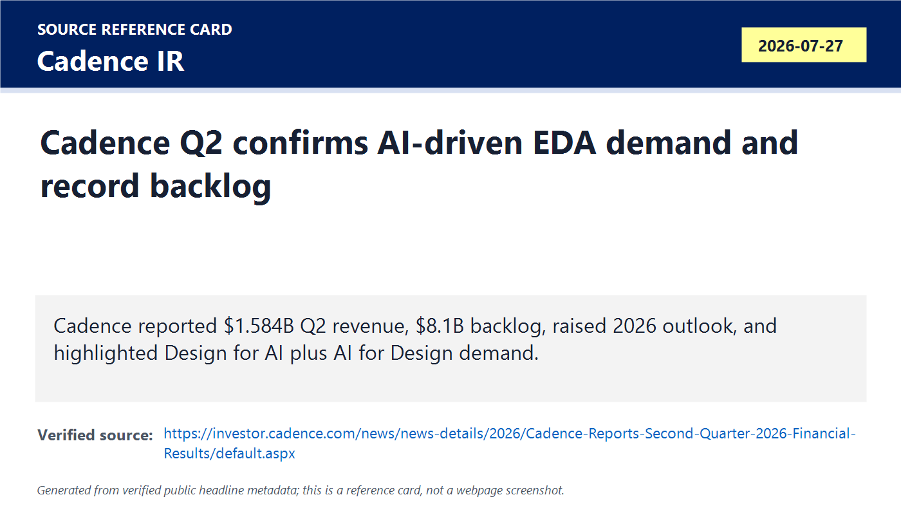
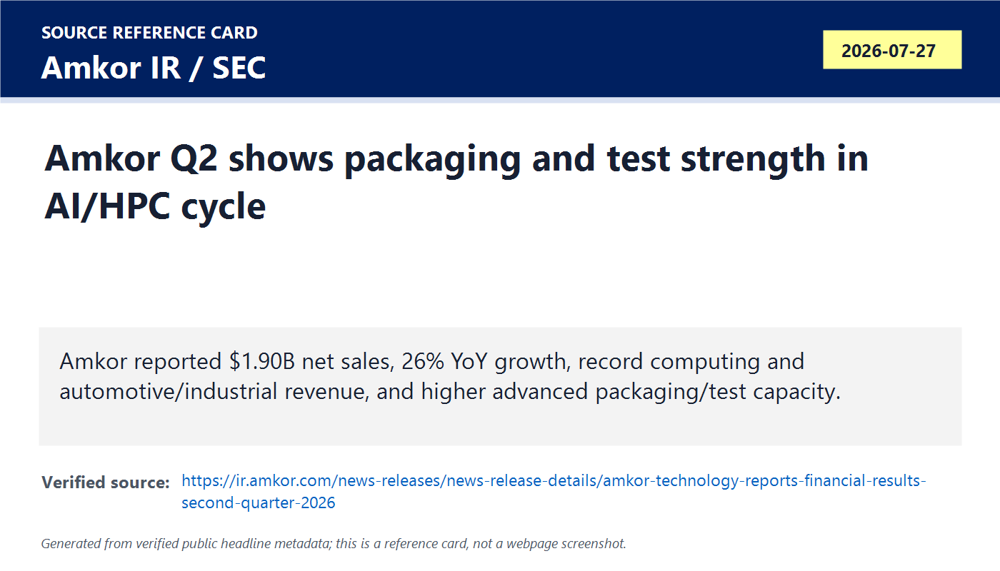
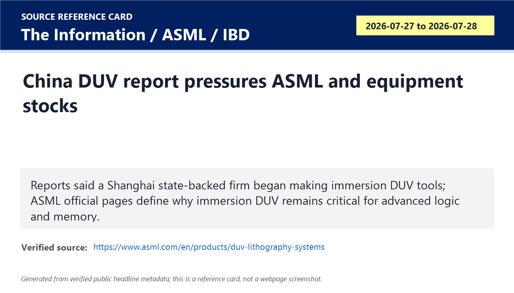
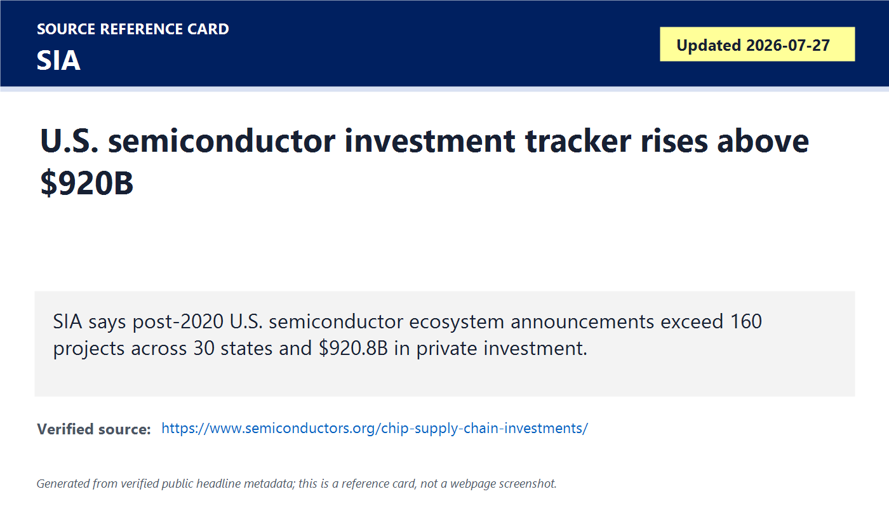
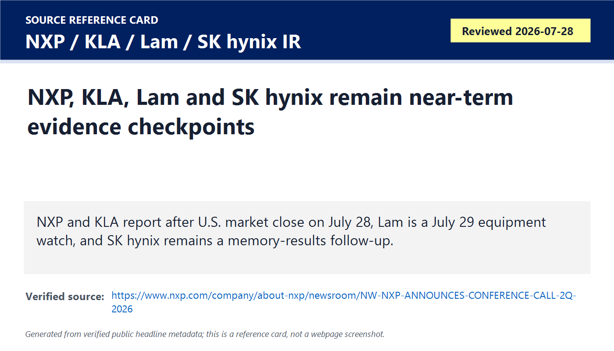
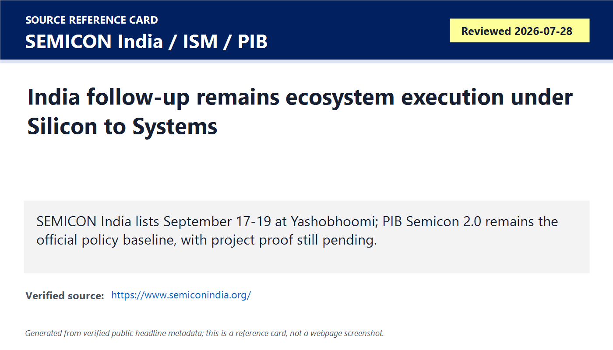

# Daily Semiconductor Current Affairs

Date: 2026-07-28

Research window: Tuesday update through approximately 15:45 IST on July 28, 2026. U.S.-market events scheduled after the Indian afternoon cutoff are treated as pending checkpoints. July 27 U.S. after-market releases are included because they landed after yesterday's India-time briefing.

## Quick Index

| Date | Major Topic | Source Groups | Why To Read |
|---|---|---|---|
| 2026-07-28 | Cadence Q2 closes yesterday's EDA checkpoint | Cadence IR | Turns agentic EDA from conference language into measurable revenue, backlog, IP, hardware and system-design demand. |
| 2026-07-28 | Amkor Q2 closes packaging/test checkpoint | Amkor IR, SEC 8-K | Shows AI/HPC and automotive demand reaching outsourced packaging and test, not only wafer fabrication. |
| 2026-07-28 | China DUV/CXMT pressure continues | AP, IBD/Tom's Hardware reporting, ASML technical pages | Connects China's memory IPO, reported domestic lithography production and equipment-stock pressure. |
| 2026-07-28 | U.S. supply-chain investment tracker | SIA | Useful policy baseline: announced U.S. semiconductor ecosystem projects now exceed $920 billion. |
| 2026-07-28 | NXP, KLA, Lam and SK hynix evidence queue | NXP, KLA, Lam, SK hynix official/IR pages | Keeps the next 24-48 hours disciplined: several market-moving results are due but not yet available at cutoff. |
| 2026-07-28 | India Semicon 2.0 and SEMICON India follow-up | PIB, SEMICON India, ISM | India angle: ecosystem execution is still the main proof path after policy approval. |

**Page navigation:** [Sources](#source-map) · [Concept review](#concept-review) · [Follow-up](#what-to-watch-next) · [Technical terms](#technical-terms-used-today) · [Master glossary](../knowledge-base/glossary.md)

## Source Images And Manifest

Source manifest: [../images/2026-07-28/links.md](../images/2026-07-28/links.md)

The following are generated source-reference cards based on verified public headline/date/source metadata. They are not webpage screenshots and do not reproduce article bodies.

## Source Map

| Source | Source date | Role | Confidence / limitation |
|---|---:|---|---|
| [Cadence Q2 2026 results](https://investor.cadence.com/news/news-details/2026/Cadence-Reports-Second-Quarter-2026-Financial-Results/default.aspx) | 2026-07-27 | Primary EDA/IP/hardware/system-design earnings source | Strong company source. Forward outlook and AI adoption language remain management statements. |
| [Amkor Q2 2026 results](https://ir.amkor.com/news-releases/news-release-details/amkor-technology-reports-financial-results-second-quarter-2026) | 2026-07-27 | Primary OSAT/advanced-packaging earnings source | Strong company source. Q3 guidance remains forward-looking and customer-concentration risks remain. |
| [Amkor SEC Form 8-K](https://www.sec.gov/Archives/edgar/data/1047127/000104712726000043/amkr-20260727.htm) | 2026-07-27 | Regulator filing verifying Amkor furnished the Q2 release | Strong filing source. The press release is furnished, not filed for Securities Exchange Act Section 18 liability. |
| [AP News on CXMT IPO](https://apnews.com/article/9cd8b79866cf4bd5ef7c1cb81215e796) | 2026-07-27 | Reputable source for CXMT market debut and memory/geopolitics context | Strong for market event; not proof of memory technology parity. |
| [Tom's Hardware report on China DUV production](https://www.tomshardware.com/tech-industry/semiconductors/china-begins-mass-production-of-domestic-immersion-duv-lithography-machines) | 2026-07-27 | Reputable technical reporting on The Information's China immersion-DUV claim | Treat as reported, not primary confirmation. Need official customer shipment/tool qualification evidence. |
| [IBD market report on ASML/chip-stock reaction](https://www.investors.com/news/technology/asml-stock-chip-stocks-slide-as-ai-trade-unwinds/) | 2026-07-28 | Market reaction source for ASML/equipment selloff | Useful market signal; not an engineering validation source. |
| [ASML DUV systems page](https://www.asml.com/en/products/duv-lithography-systems) | Reviewed 2026-07-28 | Primary technical explainer for DUV/immersion lithography role | Strong for explaining why immersion DUV matters. Does not confirm China's reported tool production. |
| [SIA U.S. semiconductor investment tracker](https://www.semiconductors.org/chip-supply-chain-investments/) | Updated 2026-07-27 | Policy/supply-chain baseline | Strong industry association source. Announced projects are not the same as completed fabs, qualified tools or shipped products. |
| [NXP Q2 2026 call notice](https://www.nxp.com/company/about-nxp/newsroom/NW-NXP-ANNOUNCES-CONFERENCE-CALL-2Q-2026) | 2026-07-07, event on 2026-07-28 | Official automotive/industrial earnings checkpoint | Results are scheduled after U.S. market close on July 28, after this note's cutoff. |
| [KLA Q4 FY2026 earnings date](https://ir.kla.com/news-events/press-releases/detail/517/kla-announces-fourth-quarter-fiscal-year-2026-earnings-date) | 2026-07-01, event on 2026-07-28 | Official process-control equipment checkpoint | Results are scheduled after market close; not yet analyzed here. |
| [Lam Research press-release page](https://newsroom.lamresearch.com/press-releases?l=100) | Reviewed 2026-07-28 | Official equipment checkpoint | Lam lists a July 29, 2026 quarterly conference call. Results remain pending. |
| [PIB Semicon 2.0 release](https://www.pib.gov.in/PressReleasePage.aspx?PRID=2284784&lang=1&reg=48) | 2026-07-15 | Official India policy baseline | Strong for policy structure and approved-project count. No new July 28 project milestone found in this window. |
| [SEMICON India official site](https://www.semiconindia.org/) | Reviewed 2026-07-28 | Official India ecosystem event follow-up | Strong for date/theme; detailed program and exhibitor listing remain pending. |

## Technical Terms / Deep Definitions

Term: Remaining Performance Obligations (RPO)
Definition: RPO is contracted revenue that a company has not yet recognized in its income statement. It solves a visibility problem for investors: revenue can be lumpy, but signed obligations show part of the future demand pipeline. In today's Cadence news, RPO matters because Cadence said $4.2 billion of backlog is expected to be recognized over the next 12 months, giving evidence that EDA demand is not only one-quarter noise. Comparison: backlog/RPO is stronger than a sales lead, but weaker than already recognized revenue. Source: https://investor.cadence.com/news/news-details/2026/Cadence-Reports-Second-Quarter-2026-Financial-Results/default.aspx

Term: Backlog
Definition: Backlog is the value of orders or contracted work that has not yet become revenue. It solves the business-visibility problem by showing work already won but not fully delivered or recognized. In today's Cadence report, the $8.1 billion quarter-end backlog matters because EDA software, IP, hardware emulation and system-design tools often sell through multi-period contracts. Example: a one-year license already delivered may become current revenue, while a multi-year subscription can sit partly in backlog. Source: https://investor.cadence.com/news/news-details/2026/Cadence-Reports-Second-Quarter-2026-Financial-Results/default.aspx

Term: Design for AI
Definition: Design for AI means creating chips, IP, packages and systems that serve AI workloads such as training, inference, networking, memory movement and data-center orchestration. It solves the workload-fit problem: an AI accelerator must be designed around tensor math, memory bandwidth, interconnect, power and software. In today's Cadence report, it matters because customer demand for AI chips pulls demand for EDA, IP, hardware verification and packaging tools. Comparison: Design for AI is building the AI hardware; AI for Design is using AI to build hardware faster. Source: https://investor.cadence.com/news/news-details/2026/Cadence-Reports-Second-Quarter-2026-Financial-Results/default.aspx

Term: AI for Design
Definition: AI for Design means using AI inside the engineering workflow: creating tests, finding bugs, optimizing layouts, exploring architectures, predicting thermal behavior or automating tool runs. It solves the productivity problem in complex VLSI, where verification, place-and-route, signoff and package co-design can consume huge engineer time. In today's Cadence result, it matters because management tied growth to AI-driven solutions and agentic products. Comparison: a GPU accelerator is the product; AI for Design is the assistant or agent helping engineers create that product. Source: https://investor.cadence.com/news/news-details/2026/Cadence-Reports-Second-Quarter-2026-Financial-Results/default.aspx

Term: Non-GAAP EPS
Definition: Non-GAAP earnings per share adjusts standard accounting profit by excluding selected items such as stock compensation, amortization, acquisition costs or one-time charges. It solves an investor-comparison problem when management believes GAAP includes items that obscure operating trend, but it can also make performance look cleaner than statutory accounting. In today's Cadence report, non-GAAP EPS matters because the company raised 2026 guidance to about $8.10 at the midpoint. Comparison: GAAP EPS is the regulated accounting view; non-GAAP EPS is management's adjusted operating view and must be reconciled. Source: https://investor.cadence.com/news/news-details/2026/Cadence-Reports-Second-Quarter-2026-Financial-Results/default.aspx

Term: Semiconductor IP
Definition: Semiconductor IP is a reusable design block such as a memory controller, interface PHY, processor core, security block or standard-cell library licensed into a chip. It solves the reuse and time-to-market problem: teams do not redesign every proven block from scratch. In today's Cadence report, IP matters because Cadence said IP revenue grew more than 40% year over year, helped by demand for Star IP and an Intel agreement. Example: buying PCIe or DDR controller IP is like using a qualified engine module instead of designing the entire engine yourself. Source: https://www.synopsys.com/glossary/what-is-semiconductor-ip.html

Term: Hardware emulation
Definition: Hardware emulation maps a chip design into special-purpose verification hardware so it can run much faster than pure software simulation before silicon exists. It solves the pre-silicon validation problem: large SoCs are too slow to verify only with normal simulators when software, firmware and system behavior must be tested. In today's Cadence report, hardware matters because the company said the hardware business had another record quarter and expanded with hyperscalers and AI innovators. Source: https://www.cadence.com/en_US/home/tools/system-design-and-verification/emulation-and-prototyping.html

Term: Outsourced Semiconductor Assembly and Test (OSAT)
Definition: OSAT companies package and test chips for customers after wafer fabrication. They solve the back-end manufacturing problem: a bare die must be connected, protected, cooled, electrically tested and qualified before it can ship. In today's Amkor report, OSAT matters because Amkor is the largest U.S.-headquartered OSAT and reported strong Q2 sales in advanced packaging and test. Comparison: TSMC fabricates wafers; Amkor can package and test dies into usable products. Source: https://ir.amkor.com/news-releases/news-release-details/amkor-technology-reports-financial-results-second-quarter-2026

Term: Advanced products
Definition: In Amkor's reporting, advanced products include flip chip, memory, wafer-level processing and related test services. This solves a packaging-performance problem: high-end chips often need denser interconnects, better electrical paths and more complex test than traditional wirebond packages. In today's Amkor result, advanced products matter because they represented $1.557 billion of Q2 net sales, showing that advanced packaging/test is a major revenue driver. Source: https://ir.amkor.com/news-releases/news-release-details/amkor-technology-reports-financial-results-second-quarter-2026

Term: Gross margin
Definition: Gross margin is revenue minus cost of sales, expressed as a percentage of revenue. It solves a profitability-quality problem: it shows how much money remains after direct manufacturing or service costs before operating expenses. In today's Amkor result, gross margin matters because OSAT businesses have high fixed costs, so utilization, yield, product mix and pricing strongly affect margin. Comparison: revenue tells you size; gross margin tells you how efficiently that revenue is being produced. Source: https://ir.amkor.com/news-releases/news-release-details/amkor-technology-reports-financial-results-second-quarter-2026

Term: Capital expenditure (capex)
Definition: Capex is money spent on long-lived assets such as buildings, cleanrooms, manufacturing tools, test handlers and packaging lines. It solves a capacity problem: semiconductor output cannot grow without physical equipment and facilities. In today's Amkor report, capex matters because the company guided full-year 2026 capital expenditures of about $2.5 billion to $3.0 billion, tied to packaging/test capacity expansion. Comparison: R&D designs future products; capex buys the production assets needed to build or qualify them. Source: https://ir.amkor.com/news-releases/news-release-details/amkor-technology-reports-financial-results-second-quarter-2026

Term: Immersion DUV lithography
Definition: Immersion DUV lithography uses deep-ultraviolet light with a liquid layer between the final lens and wafer to improve resolution and pattern small features at high volume. It solves a resolution problem: immersion raises the numerical aperture so scanners can print finer patterns than dry DUV systems. In today's China-equipment story, immersion DUV matters because a credible domestic tool would help Chinese fabs reduce reliance on imported ASML systems for many logic and DRAM layers, even though EUV remains separate and harder. Source: https://www.asml.com/en/products/duv-lithography-systems

Term: Overlay
Definition: Overlay is the alignment accuracy between one lithography layer and previously printed layers on the wafer. It solves a physical-registration problem: transistors and interconnects only work if every layer lands in the right place. In today's DUV story, overlay matters because multi-patterning with DUV can require many exposures, and tiny overlay errors can reduce yield or prevent advanced-node scaling. Comparison: stacking transparent circuit drawings works only if every sheet is aligned within nanometers. Source: https://www.asml.com/en/products/duv-lithography-systems

Term: Multiple patterning
Definition: Multiple patterning splits one dense circuit pattern across multiple lithography/etch steps so features smaller than a single exposure can be manufactured. It solves a resolution-limit problem when the available lithography wavelength cannot print the full pattern directly. In today's reported China DUV item, multiple patterning matters because DUV can stretch toward smaller nodes, but extra steps increase cost, cycle time, overlay risk and defect opportunity compared with fewer EUV exposures. Source: https://www.asml.com/en/technology/lithography-principles

Term: Advanced Manufacturing Investment Credit (Section 48D)
Definition: Section 48D is a U.S. tax credit for qualified semiconductor manufacturing investments under the CHIPS-era incentive framework. It solves a capital-cost problem: fabs, packaging plants, materials plants and tool factories require very large upfront spending, so tax credits can improve project economics. In today's SIA tracker item, it matters because SIA links the credit and grant incentives to more than $920 billion in announced U.S. semiconductor ecosystem investment since 2020. Source: https://www.semiconductors.org/chip-supply-chain-investments/

Term: Preliminary Memorandum of Terms (PMT)
Definition: A PMT is a non-binding preliminary agreement between a company and the U.S. Commerce Department that precedes final award terms. It solves a process-management problem by defining intended incentives and project direction before due diligence and final contract execution. In today's SIA source, PMT matters because announced CHIPS support still requires milestones and disbursement; it is not the same as cash already paid or capacity already built. Source: https://www.semiconductors.org/chip-supply-chain-investments/

Term: Supply-chain resilience
Definition: Supply-chain resilience is the ability of a production network to keep operating despite shocks such as geopolitical restrictions, natural disasters, demand spikes, tool bottlenecks or supplier failures. It solves the dependency problem: a chip can be blocked by one missing wafer, gas, substrate, reticle, tool part or package line. In today's SIA and India-policy items, resilience matters because both the U.S. and India are trying to reduce single-region or single-supplier exposure across the semiconductor value chain. Source: https://www.semiconductors.org/chip-supply-chain-investments/

Term: Evidence checkpoint
Definition: An evidence checkpoint is a scheduled source event that should update an open question, such as an earnings release, regulator filing, official project milestone or transcript. It solves a research-discipline problem: it prevents treating rumors, scheduled calls or market expectations as confirmed facts. In today's note, NXP, KLA, Lam and SK hynix are checkpoints because their results or disclosures are due around this window but not all are available before the India-time cutoff. Source: https://www.nxp.com/company/about-nxp/newsroom/NW-NXP-ANNOUNCES-CONFERENCE-CALL-2Q-2026

Term: Silicon to Systems
Definition: Silicon to Systems is a semiconductor strategy that connects chip design, packaging, board, software, manufacturing, data-center or product-level requirements into one ecosystem. It solves the boundary problem: AI and advanced electronics performance depends on far more than the transistor alone. In today's India follow-up, it matters because SEMICON India uses this phrase for the 2026 theme, matching the idea that India must build design, materials, machines, fabs, OSAT, R&D and talent together. Source: https://www.semiconindia.org/

## Verification Matrix

| Item | Confirmed facts | Analysis boundary |
|---|---|---|
| Cadence Q2 | Cadence reported $1.584 billion Q2 revenue, 28.4% GAAP operating margin, 45.5% non-GAAP operating margin, $2.11 non-GAAP diluted EPS, $8.1 billion backlog and raised FY2026 guidance. | Management's AI TAM, agentic adoption and future outlook remain forward-looking. |
| Amkor Q2 | Amkor reported $1.898 billion Q2 net sales, 16.8% gross margin, $200 million operating income, $174 million net income, $0.70 diluted EPS and $2.5-$3.0 billion FY2026 capex guidance. | Strong quarter does not eliminate packaging utilization, customer concentration, yield, pricing or guidance risk. |
| China DUV report | Reporting says a Shanghai state-backed firm began making immersion DUV tools; ASML official pages explain immersion systems' role in advanced logic and memory. | The China tool claim needs primary confirmation, shipment proof, uptime, overlay, throughput, yield and customer qualification evidence. |
| SIA investment tracker | SIA says U.S. semiconductor ecosystem announcements exceed 160 projects across 30 states and $920.8 billion in private investment since 2020. | Announced investment is not completed capacity; watch permitting, construction, tool installation, labor, qualification and disbursement milestones. |
| Earnings queue | NXP and KLA are scheduled after U.S. market close July 28; Lam's quarterly call is July 29; SK hynix remains a memory-results watch. | Do not close these items until official releases/transcripts are available. |
| India follow-up | PIB Semicon 2.0 remains the policy baseline with six pillars and 12 approved manufacturing units; SEMICON India lists September 17-19, 2026 and "Silicon to Systems." | No new exact-date India project milestone was found at cutoff. |

## 1. Cadence Q2: EDA Demand Is Now A Measurable AI-Cycle Signal

**What happened:** Cadence reported Q2 2026 revenue of $1.584 billion, up from $1.275 billion in Q2 2025. It reported GAAP operating margin of 28.4%, non-GAAP operating margin of 45.5%, GAAP diluted EPS of $1.33, non-GAAP diluted EPS of $2.11, quarter-end backlog of $8.1 billion, and $4.2 billion of revenue expected over the next 12 months from remaining performance obligations. Cadence also raised 2026 revenue guidance to $6.26-$6.34 billion and highlighted agentic AI across the electronic system design flow.

**Confirmed facts:** This closes yesterday's Cadence checkpoint. The official release includes the numbers, business highlights and forward-looking caveats. It specifically says core EDA revenue grew 18% year over year, IP revenue grew more than 40%, hardware delivered another record quarter, and System Design and Analysis revenue grew 37%.

**Why it matters:** EDA is upstream of every advanced chip. When EDA revenue, IP revenue, emulation hardware and system-design tools all grow together, it indicates customers are still actively designing chips, validating complex systems and buying reusable blocks. This is different from a GPU shipment headline. It is a signal that the design pipeline behind future AI accelerators, custom ASICs, chiplets and advanced packages remains active.

**Analysis:** The key distinction is between "Design for AI" and "AI for Design." Cadence is benefiting from both: customers designing AI chips and Cadence using AI agents to improve engineering workflows. That is powerful, but the risk is expectation inflation. The next proof is not only revenue growth; it is whether AI agents reduce real verification time, improve closure quality and avoid late bugs on production programs.

**Value-chain segment:** EDA, semiconductor IP, hardware emulation, system design and analysis, advanced packaging design.

**India angle:** India's design ecosystem cannot be serious without EDA fluency. PIB says 315 universities have EDA tools and 105 startups/MSMEs have tool access under the India design push. Cadence's result shows why tool literacy is economically valuable: customers pay heavily for verification, IP, emulation and system-level design because these are hard problems.

**VLSI/career relevance:** Learn RTL, UVM, assertions, coverage, timing constraints, physical-design basics, IP integration, package constraints and report debugging. The best career path is not "AI will replace verification"; it is "AI will make weak verification more dangerous and strong verification more scalable."

## 2. Amkor Q2: Packaging And Test Are No Longer Back-End Footnotes

**What happened:** Amkor reported second-quarter 2026 net sales of $1.898 billion, up 26% year over year, with gross profit of $319 million, operating income of $200 million, net income attributable to Amkor of $174 million and diluted EPS of $0.70. It guided Q3 net sales to $1.95-$2.05 billion and full-year 2026 capex to about $2.5-$3.0 billion.

**Confirmed facts:** Amkor's official release and SEC 8-K verify the announcement date and numbers. The company said advanced products, which include flip chip, memory, wafer-level processing and related test services, produced $1.557 billion of Q2 net sales. Packaging services were 88% of net sales and test services were 12%. Computing was 22% of end-market distribution and automotive/industrial/other was also 22%.

**Why it matters:** AI hardware is package-constrained. A GPU, HBM stack, interposer, substrate and thermal solution must become a working module, then a tested board, then a rack-scale system. Amkor's growth shows the AI/HPC cycle is reaching packaging and test suppliers. This supports the thesis repeated in recent notes: advanced packaging is strategic capacity, not commodity wrapping.

**Analysis:** Amkor's margins also teach a business lesson. OSAT companies carry fixed manufacturing assets and must keep utilization high. Revenue growth helps, but margins depend on mix, yield, factory loading, materials cost, depreciation and pricing. So a strong quarter is useful evidence, but not enough to assume unconstrained high-margin growth.

**Value-chain segment:** OSAT, advanced packaging, wafer-level processing, test services, AI/HPC and automotive supply chain.

**India angle:** India's OSAT/ATMP ambitions should be judged against this level of detail: product mix, advanced-product share, test capability, customer concentration, yield, capex and margin. A packaging plant announcement is the start; commercial credibility comes from qualified output and repeat customers.

**VLSI/career relevance:** Learn package types, flip-chip interconnects, wafer bumping, thermal resistance, package parasitics, ATE, known-good-die screening and reliability tests. Package/test engineers now sit close to AI performance limits.

## 3. China DUV And CXMT: The Market Is Pricing A Self-Reliance Chain

**What happened:** After CXMT's blockbuster Shanghai debut, reports said a Shanghai state-backed company began producing domestic immersion DUV lithography tools, with early production volumes reportedly targeted for 2026 and 2027. ASML and other equipment-related semiconductor stocks fell in market reporting as investors reacted to China self-reliance risk.

**Confirmed facts:** AP verifies the CXMT market debut. ASML verifies the technical importance of immersion DUV systems for advanced logic and memory production. Reporting from The Information, amplified by technical and market outlets, is the source for the China DUV production claim. No primary Chinese toolmaker release, customer acceptance report, or fab qualification result was found in this window.

**Why it matters:** DUV is not obsolete just because EUV exists. Many chip layers still use DUV, and even advanced chips rely on a mix of EUV, immersion DUV and dry DUV. If China can produce reliable immersion DUV tools, it can reduce a major equipment dependency for mature and some advanced processes. But lithography tools are judged by uptime, overlay, throughput, resist/process integration, service network and yield, not by one production headline.

**Analysis:** This is a reported threat, not a verified parity event. A domestic DUV tool can be strategically important even if it trails ASML. It may help China run more domestic wafers, learn toolmaking, and reduce sanctions leverage. But advanced AI-chip parity still requires EDA, process integration, deposition/etch/metrology, high-end packaging, memory, power delivery and software.

**Value-chain segment:** Lithography equipment, China self-reliance, export-control workarounds, memory and foundry manufacturing.

**India angle:** India should notice the "machines and materials" pillar in Semicon 2.0. Fabs are dependent on tool ecosystems. A country that only imports tools has less strategic control than one that can repair, qualify, manufacture or source parts domestically.

**VLSI/career relevance:** For device/process learning, understand why lithography is a system: wavelength, numerical aperture, k1 factor, mask, resist, focus, overlay, alignment, etch transfer and metrology. For policy learning, understand that export controls create engineering incentives for substitutes.

## 4. SIA Tracker: Announced U.S. Chip Investments Cross $920 Billion

**What happened:** SIA's investment tracker, updated July 27, says companies in the semiconductor ecosystem have announced more than 160 projects across 30 U.S. states, totaling more than $920.8 billion in private investment since 2020. It also says these projects will create/support more than 525,000 jobs, while Commerce has announced $33.0787 billion in grant awards and up to $7.15 billion in loans to 35 companies across 52 projects.

**Confirmed facts:** SIA is an industry association, not a regulator, but the tracker links project and CHIPS award data and distinguishes PMT/LOI status from final agreements and milestone disbursement.

**Why it matters:** This is the policy side of the AI/fab cycle. The U.S. is trying to rebuild multiple layers: fabs, packaging, materials, equipment components, R&D and workforce. The $920.8 billion figure is not just "money for fabs"; it spans front-end, back-end, materials, equipment and R&D facilities.

**Analysis:** The correct mental model is pipeline, not output. Announced investment turns into chips only after site work, permits, cleanrooms, tool delivery, process qualification, customer qualification, yield learning, workforce readiness and supply-chain coordination. The bigger the number, the more important execution risk becomes.

**Value-chain segment:** Policy, supply-chain investment, fabs, materials, equipment, packaging, workforce.

**India angle:** India can benchmark its own Semicon 2.0 proof standard against this: budget approval is step one; project-level tracking, milestone disbursement, tool arrival, operational capacity and customer qualification are the deeper evidence.

## 5. Earnings Queue: NXP, KLA, Lam And SK hynix Are Still Open

**What happened:** NXP is scheduled to release Q2 results after U.S. market close on July 28 and host a call at 4:30 p.m. EDT. KLA is scheduled to publish Q4 FY2026 results and review them at 2 p.m. PT on July 28. Lam Research lists a July 29 quarterly financial call. SK hynix remains a memory/HBM results follow-up.

**Confirmed facts:** NXP, KLA and Lam official pages verify their event timing. As of the India-time cutoff, these are not yet completed results for this note.

**Why it matters:** These companies cover important non-overlapping slices:

- NXP: automotive, industrial, IoT, mobile and communications-infrastructure semiconductors.
- KLA: process control, inspection and metrology, which determine advanced-node and packaging yield.
- Lam: etch/deposition/clean and packaging-related process tools.
- SK hynix: HBM, DRAM, NAND, AI memory pricing and capacity.

**Analysis:** The semiconductor cycle cannot be judged only by NVIDIA or TSMC. If NXP is weak, the broader automotive/industrial cycle may still be uneven. If KLA/Lam guide strongly, fabs are still buying tools. If SK hynix guides HBM supply tightly, memory remains a first-order AI bottleneck.

**Value-chain segment:** Automotive/industrial chips, equipment, process control, WFE, memory.

## 6. India Follow-Up: Semicon 2.0 Is Policy; Execution Proof Still Needed

**What happened:** No new exact-date India semiconductor manufacturing milestone was found in the July 28 window. The official baseline remains PIB's July 15 Semicon 2.0 approval and SEMICON India's September 17-19 event page.

**Confirmed facts:** PIB says Semicon 2.0 has a Rs.1,27,500 crore outlay and six pillars: design, machines/materials, fabs, ATMP/OSAT, R&D and talent. It also says 12 manufacturing units have been approved, three companies have started commercial production, 24 design projects have financial support, 105 startups/MSMEs have EDA tool access, and 315 universities are training students on chip design tools.

**Why it matters:** This is the correct ecosystem view. India needs more than one fab or one OSAT. It needs design-to-system capability: EDA use, IP, prototyping, materials, chemicals, gases, tools, cleanroom construction, packaging/test, R&D and reliable customers.

**Analysis:** The next meaningful India evidence is not another slogan. It is project status: land, equipment orders, cleanroom readiness, tool installation, qualified process modules, customer names, test yield, shipment quantity and repeat orders.

**VLSI/career relevance:** For your own learning, Semicon 2.0 maps directly to skills: RTL/verification for design, device physics/materials for fabs, packaging/test for ATMP, Python/TCL automation for EDA, and quality/reliability thinking for production.

## Follow-Ups From Previous Briefings

| Prior item | Status on 2026-07-28 | Evidence / next action |
|---|---|---|
| Cadence Q2 checkpoint from July 27 | Updated / closed for release status | Official Q2 results are now available and analyzed above. Continue watching transcript/customer detail if needed. |
| Amkor packaging/test checkpoint | Updated / closed for release status | Official Q2 results and SEC 8-K are available. Follow Q3 utilization, capex and customer concentration. |
| CXMT China memory debut | Updated / still pending technically | Market debut is confirmed; HBM capability, process parity, customer qualification and durable share gains remain pending. |
| China DUV production report | Updated / still pending primary proof | Reported as a potentially important equipment signal; requires official source, shipment, uptime, overlay, throughput and fab qualification proof. |
| TSMC reported 2027 price increases | Still pending | No new official TSMC pricing confirmation found during this note window. |
| AMD Helios and AMD-Cerebras deployment | Still pending | No new deployment-volume proof found. Keep watching H2 2026 customer rollout, benchmarks and economics. |
| Samsung-Broadcom MOU | Still pending | No contract/tape-out/HBM shipment update found beyond the July 25 MOU. |
| SK Group-NVIDIA AI factory/HBM LOI | Still pending | Watch SK hynix results, HBM4 qualification, financing, power and construction milestones. |
| NXP/KLA/Lam/SK hynix results | Still pending | Events occur after this note cutoff or later this week. Close only after official releases. |
| India Semicon 2.0 execution | Still pending | Policy baseline remains official; project-level proof is still the next evidence. |

## Concept Review

| Concept | Use this mental model |
|---|---|
| EDA earnings | Strong EDA revenue means future chip programs are active before future silicon exists. |
| OSAT earnings | Packaging/test revenue tells whether wafer output is moving toward qualified products. |
| DUV versus EUV | EUV prints the most critical advanced layers; DUV still prints many layers and can be stretched by multiple patterning, but with cost and overlay penalties. |
| Backlog/RPO | Revenue already recognized is the past; backlog and RPO give a limited view into future committed demand. |
| Capex | Capex is physical capacity investment, but it becomes useful only after installation, qualification and yield ramp. |
| Policy tracker | Announced projects are a pipeline. Completed, yielding, customer-qualified output is the real end state. |

## Simple Explanation

Today is about proof quality. Cadence and Amkor gave hard numbers, so those checkpoints moved from pending to updated. China DUV is important but still reported, so it stays pending for engineering proof. SIA's U.S. tracker and India's Semicon 2.0 show policy ambition, but both must be judged by execution. The next big updates are NXP, KLA, Lam and SK hynix.

## VLSI / Career Relevance

1. EDA: learn how verification, IP, emulation and package-design tools fit into one chip program.
2. Packaging/test: learn flip chip, wafer-level processing, ATE, yield, burn-in and reliability.
3. Lithography: learn DUV, EUV, overlay, focus, masks, resist and multiple patterning.
4. Markets: learn to separate revenue, backlog, capex, margin and guidance.
5. India: map each policy pillar to a concrete technical skill or facility requirement.

## Interview Questions

1. Why does EDA revenue act as an early signal for future chip activity?
2. What is the difference between backlog, RPO and recognized revenue?
3. Why is hardware emulation needed if software simulation already exists?
4. Why does advanced packaging matter for AI/HPC systems?
5. What are the main technical obstacles in building a competitive immersion DUV lithography tool?
6. Why does multiple patterning increase cost and yield risk?
7. What does gross margin tell you about an OSAT company?
8. How would you evaluate India's Semicon 2.0 execution beyond the policy announcement?

## What To Watch Next

- NXP Q2 results after U.S. market close July 28 for automotive/industrial semiconductor recovery.
- KLA Q4 FY2026 results after U.S. market close July 28 for process-control and inspection demand.
- Lam Research July 29 results/call for etch, deposition, clean, memory and advanced-packaging tool demand.
- SK hynix Q2 results for HBM supply, memory pricing, capex and NVIDIA/SK AI-factory commentary.
- Any primary confirmation of China's reported immersion DUV tool production, especially customer shipment/qualification.
- TSMC pricing, Samsung-Broadcom execution, AMD Helios deployment proof and India project-level milestones.

## Final Takeaway

July 28 is a checkpoint day. Cadence and Amkor gave hard financial evidence that AI demand is reaching EDA and packaging/test. China-related market pressure is serious but still needs engineering proof. Policy trackers in the U.S. and India show scale, but production credibility still comes from qualified tools, yield, customers and shipments.

## Technical Terms Used Today

[Back to quick index](#quick-index) · [Open the master A-Z glossary](../knowledge-base/glossary.md)

**Term index:** [Advanced Manufacturing Investment Credit (Section 48D)](#daily-term-advanced-manufacturing-investment-credit-section-48d) · [Advanced products](#daily-term-advanced-products) · [AI for Design](#daily-term-ai-for-design) · [Backlog](#daily-term-backlog) · [Capital expenditure (capex)](#daily-term-capital-expenditure-capex) · [Design for AI](#daily-term-design-for-ai) · [Evidence checkpoint](#daily-term-evidence-checkpoint) · [Gross margin](#daily-term-gross-margin) · [Hardware emulation](#daily-term-hardware-emulation) · [Immersion DUV lithography](#daily-term-immersion-duv-lithography) · [Multiple patterning](#daily-term-multiple-patterning) · [Non-GAAP EPS](#daily-term-non-gaap-eps) · [OSAT](#daily-term-osat) · [Overlay](#daily-term-overlay) · [Preliminary Memorandum of Terms (PMT)](#daily-term-preliminary-memorandum-of-terms-pmt) · [Remaining Performance Obligations (RPO)](#daily-term-remaining-performance-obligations-rpo) · [Semiconductor IP](#daily-term-semiconductor-ip) · [Silicon to Systems](#daily-term-silicon-to-systems) · [Supply-chain resilience](#daily-term-supply-chain-resilience)

| Term | Meaning |
|---|---|
| [**Advanced Manufacturing Investment Credit (Section 48D)**](../knowledge-base/glossary.md#term-advanced-manufacturing-investment-credit-section-48d) | Section 48D is a U.S. tax credit for qualified semiconductor manufacturing investments under the CHIPS-era incentive framework. It solves a capital-cost problem: fabs, packaging plants, materials plants and tool factories require very large upfront spending, so tax credits can improve project economics. |
| [**Advanced products**](../knowledge-base/glossary.md#term-advanced-products) | In Amkor's reporting, advanced products include flip chip, memory, wafer-level processing and related test services. This solves a packaging-performance problem: high-end chips often need denser interconnects, better electrical paths and more complex test than traditional wirebond packages. |
| [**AI for Design**](../knowledge-base/glossary.md#term-ai-for-design) | AI for Design means using AI inside the engineering workflow: creating tests, finding bugs, optimizing layouts, exploring architectures, predicting thermal behavior or automating tool runs. It solves the productivity problem in complex VLSI, where verification, place-and-route, signoff and package co-design can consume huge engineer time. |
| [**Backlog**](../knowledge-base/glossary.md#term-backlog) | Backlog is the value of orders or contracted work that has not yet become revenue. It solves the business-visibility problem by showing work already won but not fully delivered or recognized. |
| [**Capital expenditure (capex)**](../knowledge-base/glossary.md#term-capital-expenditure-capex) | Capex is money spent on long-lived assets such as buildings, cleanrooms, manufacturing tools, test handlers and packaging lines. It solves a capacity problem: semiconductor output cannot grow without physical equipment and facilities. |
| [**Design for AI**](../knowledge-base/glossary.md#term-design-for-ai) | Design for AI means creating chips, IP, packages and systems that serve AI workloads such as training, inference, networking, memory movement and data-center orchestration. It solves the workload-fit problem: an AI accelerator must be designed around tensor math, memory bandwidth, interconnect, power and software. |
| [**Evidence checkpoint**](../knowledge-base/glossary.md#term-evidence-checkpoint) | An evidence checkpoint is a scheduled source event that should update an open question, such as an earnings release, regulator filing, official project milestone or transcript. It solves a research-discipline problem: it prevents treating rumors, scheduled calls or market expectations as confirmed facts. |
| [**Gross margin**](../knowledge-base/glossary.md#term-gross-margin) | Gross margin is revenue minus cost of sales, expressed as a percentage of revenue. It solves a profitability-quality problem: it shows how much money remains after direct manufacturing or service costs before operating expenses. |
| [**Hardware emulation**](../knowledge-base/glossary.md#term-hardware-emulation) | Hardware emulation maps a chip design into special-purpose verification hardware so it can run much faster than pure software simulation before silicon exists. It solves the pre-silicon validation problem: large SoCs are too slow to verify only with normal simulators when software, firmware and system behavior must be tested. |
| [**Immersion DUV lithography**](../knowledge-base/glossary.md#term-immersion-duv-lithography) | Immersion DUV lithography uses deep-ultraviolet light with a liquid layer between the final lens and wafer to improve resolution and pattern small features at high volume. It solves a resolution problem: immersion raises the numerical aperture so scanners can print finer patterns than dry DUV systems. |
| [**Multiple patterning**](../knowledge-base/glossary.md#term-multiple-patterning) | Multiple patterning splits one dense circuit pattern across multiple lithography/etch steps so features smaller than a single exposure can be manufactured. It solves a resolution-limit problem when the available lithography wavelength cannot print the full pattern directly. |
| [**Non-GAAP EPS**](../knowledge-base/glossary.md#term-non-gaap-eps) | Non-GAAP earnings per share adjusts standard accounting profit by excluding selected items such as stock compensation, amortization, acquisition costs or one-time charges. It solves an investor-comparison problem when management believes GAAP includes items that obscure operating trend, but it can also make performance look cleaner than statutory accounting. |
| [**OSAT**](../knowledge-base/glossary.md#term-osat) | OSAT companies package and test chips for customers after wafer fabrication. They solve the back-end manufacturing problem: a bare die must be connected, protected, cooled, electrically tested and qualified before it can ship. |
| [**Overlay**](../knowledge-base/glossary.md#term-overlay) | Overlay is the alignment accuracy between one lithography layer and previously printed layers on the wafer. It solves a physical-registration problem: transistors and interconnects only work if every layer lands in the right place. |
| [**Preliminary Memorandum of Terms (PMT)**](../knowledge-base/glossary.md#term-preliminary-memorandum-of-terms-pmt) | A PMT is a non-binding preliminary agreement between a company and the U.S. Commerce Department that precedes final award terms. |
| [**Remaining Performance Obligations (RPO)**](../knowledge-base/glossary.md#term-remaining-performance-obligations-rpo) | RPO is contracted revenue that a company has not yet recognized in its income statement. It solves a visibility problem for investors: revenue can be lumpy, but signed obligations show part of the future demand pipeline. |
| [**Semiconductor IP**](../knowledge-base/glossary.md#term-semiconductor-ip) | Semiconductor IP is a reusable design block such as a memory controller, interface PHY, processor core, security block or standard-cell library licensed into a chip. It solves the reuse and time-to-market problem: teams do not redesign every proven block from scratch. |
| [**Silicon to Systems**](../knowledge-base/glossary.md#term-silicon-to-systems) | Silicon to Systems is a semiconductor strategy that connects chip design, packaging, board, software, manufacturing, data-center or product-level requirements into one ecosystem. It solves the boundary problem: AI and advanced electronics performance depends on far more than the transistor alone. |
| [**Supply-chain resilience**](../knowledge-base/glossary.md#term-supply-chain-resilience) | Supply-chain resilience is the ability of a production network to keep operating despite shocks such as geopolitical restrictions, natural disasters, demand spikes, tool bottlenecks or supplier failures. It solves the dependency problem: a chip can be blocked by one missing wafer, gas, substrate, reticle, tool part or package line. |

This page-end index covers the specialist terms central to this day's study. The fuller explanation, news context, and source remain at first use; the master glossary combines repeated terms across all days.
