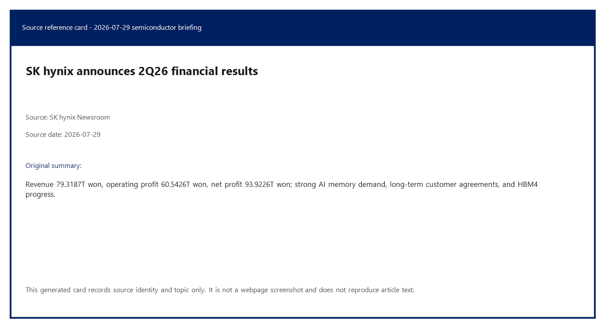
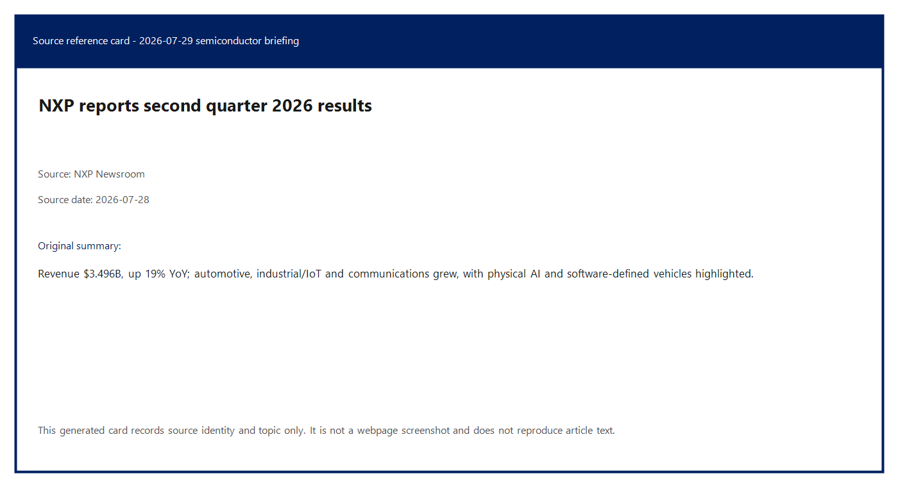
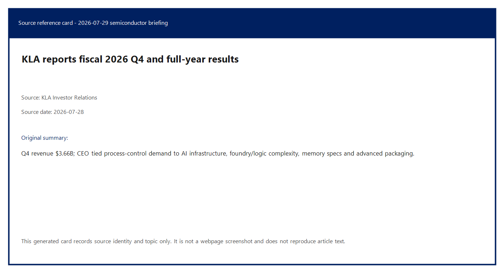
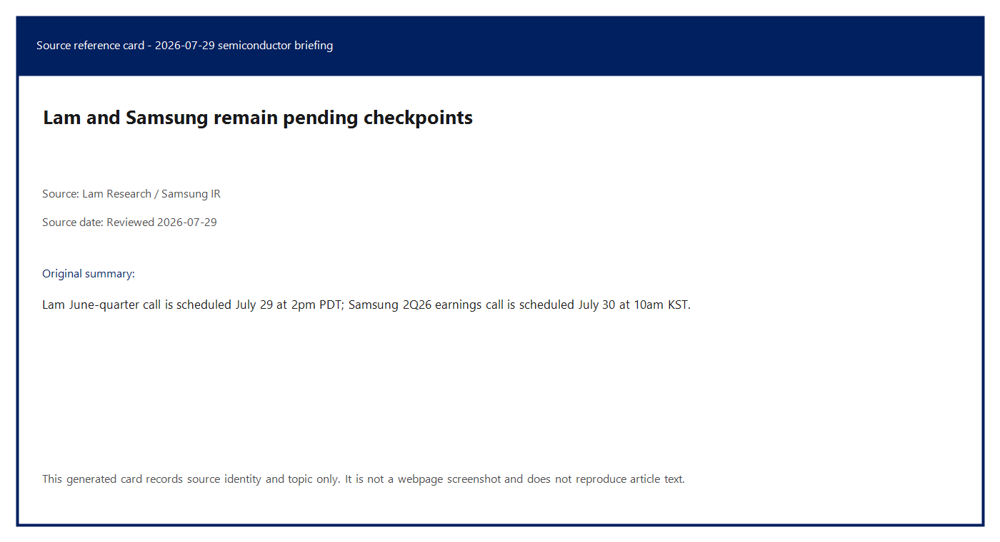
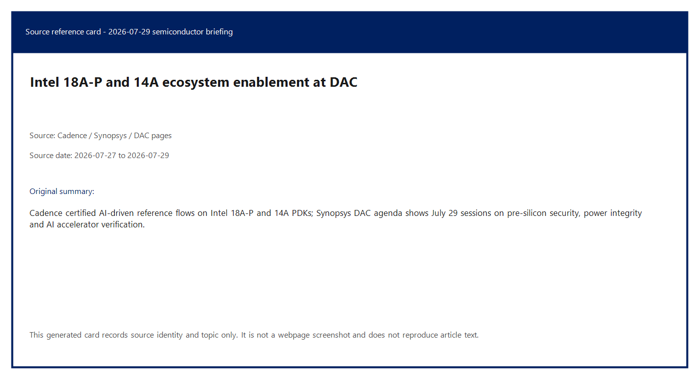
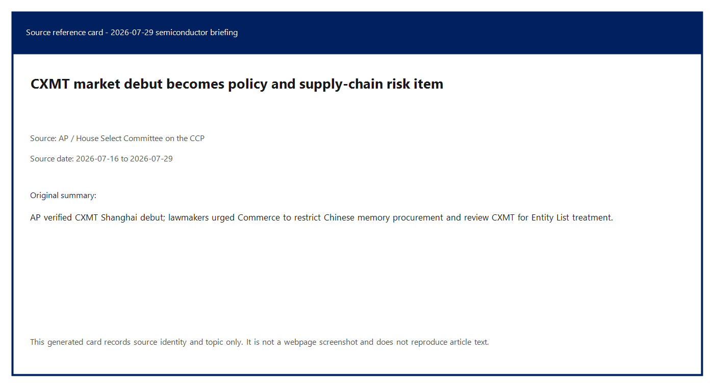
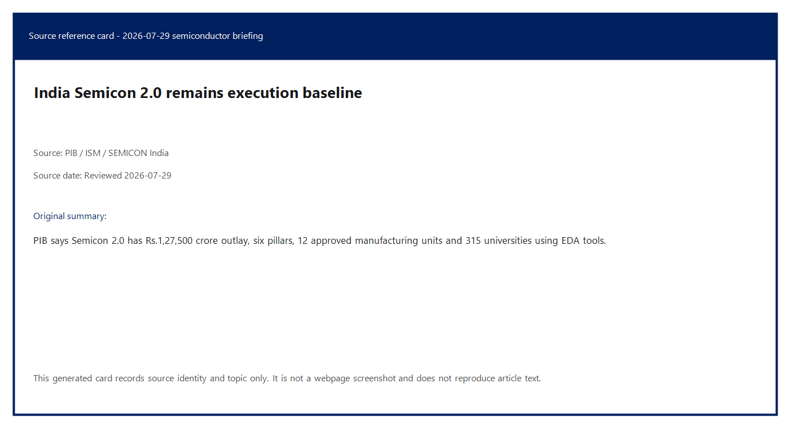
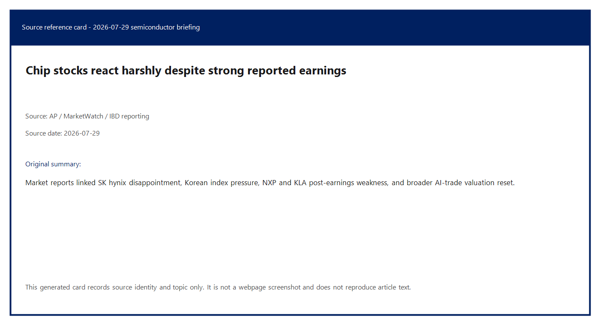

# Daily Semiconductor Current Affairs

Date: 2026-07-29

Research window: Wednesday update through approximately 16:35 IST on July 29, 2026. U.S. events scheduled after this cutoff, especially Lam Research's June-quarter call, are treated as pending checkpoints. July 28 U.S. after-market earnings are included because they landed after yesterday's India-time briefing.

## Quick Index

| Date | Major Topic | Source Groups | Why To Read |
|---|---|---|---|
| 2026-07-29 | SK hynix record memory result and market selloff | SK hynix, AP/MarketWatch/IBD reporting | Separates hard memory-cycle evidence from investor disappointment and AI-trade valuation pressure. |
| 2026-07-29 | NXP confirms auto/industrial chip recovery | NXP, WSJ/IBD reporting | Shows AI demand spreading into vehicles, factories, robots and edge systems, not only cloud accelerators. |
| 2026-07-29 | KLA confirms process-control strength | KLA, KLA technical pages | Links AI infrastructure to inspection, metrology, yield and advanced-packaging complexity. |
| 2026-07-29 | Lam and Samsung remain evidence checkpoints | Lam Research, Samsung IR | Prevents treating scheduled calls or earlier guidance as completed results. |
| 2026-07-29 | Intel foundry enablement at DAC | Cadence, Synopsys, DAC pages | Explains why certified design flows, PDKs and packaging flows matter before customer silicon appears. |
| 2026-07-29 | CXMT policy pressure after market debut | AP, House Select Committee on the CCP | Shows how memory shortages collide with export controls, national security and supply-chain sourcing. |
| 2026-07-29 | India Semicon 2.0 execution watch | PIB, ISM, SEMICON India | Keeps India focus on project execution, tooling, packaging, design, materials and talent evidence. |

**Page navigation:** [Sources](#source-map) · [Concept review](#concept-review) · [Follow-up](#what-to-watch-next) · [Technical terms](#technical-terms-used-today) · [Master glossary](../knowledge-base/glossary.md)

## Source Images And Manifest

Source manifest: [../images/2026-07-29/links.md](../images/2026-07-29/links.md)

The following are generated source-reference cards based on verified public headline/date/source metadata. They are not webpage screenshots and do not reproduce article bodies.

## Source Map

| Source | Source date | Role | Confidence / limitation |
|---|---:|---|---|
| [SK hynix 2Q26 financial results](https://news.skhynix.com/en/q2-2026-business-results/) | 2026-07-29 | Primary memory, AI server, HBM4, capacity and financial source | Strong company source. Results are preliminary under K-IFRS and management's demand commentary is forward-looking. |
| [SK hynix IR earnings release page](https://www.skhynix.com/ir/UI-FR-IR06/) | Reviewed 2026-07-29 | Official IR location for earnings materials | Strong source identity, but the dynamic page is thinner than the newsroom article in this capture. |
| [NXP Q2 2026 results](https://media.nxp.com/news-releases/news-release-details/nxp-semiconductors-reports-second-quarter-2026-results) | 2026-07-28 | Primary automotive/industrial/mobile/communications chip earnings source | Strong company source. Q3 guidance is a forecast, not a result. |
| [KLA Q4 FY2026 results](https://ir.kla.com/news-events/press-releases/detail/518/kla-corporation-reports-fiscal-2026-fourth-quarter-and-full) | 2026-07-28 | Primary semiconductor equipment/process-control earnings source | Strong company source. Guidance and AI-infrastructure demand comments remain forward-looking. |
| [KLA chip manufacturing 101](https://www.kla.com/advance/education/chip-manufacturing-101) | Reviewed 2026-07-29 | Technical definition source for process control, inspection, metrology and yield | Strong company technical explainer. It explains process control but does not independently validate KLA's earnings. |
| [KLA advanced packaging page](https://www.kla.com/solutions/advancedpackaging) | Reviewed 2026-07-29 | Technical definition source for advanced packaging process control | Strong company technical explainer. |
| [Lam Research June-quarter call notice](https://investor.lamresearch.com/2026-07-08-Lam-Research-Corporation-Announces-June-Quarter-Financial-Conference-Call) | 2026-07-08, event on 2026-07-29 | Official equipment earnings checkpoint | Results were not available before this note's India-time cutoff. |
| [Samsung IR page](https://www.samsung.com/global/ir/) | Reviewed 2026-07-29 | Official Samsung Q2 call schedule | Strong for schedule. Full 2Q26 results are due July 30, 2026 at 10:00 KST. |
| [Samsung Q2 2026 guidance](https://news.samsung.com/global/samsung-electronics-announces-earnings-guidance-for-second-quarter-2026) | 2026-07-07 | Official memory/foundry peer baseline before full results | Guidance is not the final divisional result. |
| [Cadence Intel 18A-P/14A certification blog](https://community.cadence.com/cadence_blogs_8/b/corporate-news/posts/cadence-certifies-ai-driven-reference-flows-for-intel-18a-p-and-intel-14a) | 2026-07-27 | Primary EDA/foundry enablement source | Strong vendor source. Certification reduces design risk but does not prove Intel external-customer volume or yield. |
| [Synopsys DAC 2026 agenda](https://www.synopsys.com/events/dac-2026.html) | Reviewed 2026-07-29 | EDA technical-session evidence for security, power, formal verification and AI-SoC design topics | Strong event source. Agenda presence is not the same as production silicon evidence. |
| [AP on CXMT market debut](https://apnews.com/article/9cd8b79866cf4bd5ef7c1cb81215e796) | 2026-07-27 | Reputable source for CXMT listing and China memory context | Strong for market event. Not proof of HBM parity, process parity or export-control immunity. |
| [House Select Committee letter on Chinese memory chips](https://chinaselectcommittee.house.gov/media/letters/moolenaar-whitesides-to-secretary-lutnick-hold-firm-on-chinese-memory-chips-ban) | 2026-07-16 | Primary U.S. policy source on YMTC/CXMT memory procurement restrictions | Strong for lawmakers' policy requests. It is not final BIS rule text. |
| [AP market report](https://apnews.com/article/stocks-markets-ai-oil-trump-rates-b8bfaf782877957bbaa7196b70a4d725) | 2026-07-29 | Reputable market reaction source for Korean chip selloff | Strong market reporting. Market prices can change intraday. |
| [PIB Semicon 2.0 release](https://www.pib.gov.in/PressReleasePage.aspx?PRID=2284784&lang=1&reg=48) | 2026-07-15 | Official India policy baseline | Strong for policy structure and approved-project count. No new July 29 official project milestone found. |
| [SEMICON India official site](https://www.semiconindia.org/) | Reviewed 2026-07-29 | India ecosystem event follow-up | Strong for date/theme. Detailed program and exhibitor listing remain pending. |

## Technical Terms / Deep Definitions

Term: High-Bandwidth Memory (HBM)
Definition: HBM is stacked DRAM placed very close to an AI accelerator or processor so the chip can move huge amounts of data through many short, wide connections instead of a narrow external memory bus. It solves the memory-bandwidth problem in AI training and inference: matrix engines can sit idle if weights, activations and key-value cache data cannot reach them fast enough. In today's SK hynix result, HBM matters because high-value AI server memory is the main reason memory pricing and profitability are extremely strong. Comparison: ordinary server DIMMs are like a wider road outside the city; HBM is like many short lanes directly connected to the compute die. Source: https://news.skhynix.com/en/q2-2026-business-results/

Term: HBM4
Definition: HBM4 is the next generation of high-bandwidth stacked DRAM after HBM3/HBM3E, designed for higher bandwidth, better power efficiency and tighter integration with next-generation accelerators. It solves the next AI-scaling problem: larger models and agentic workloads need more memory bandwidth per watt and more memory close to compute. In today's news, SK hynix said HBM4 met customer-required operating speeds while emphasizing power efficiency and cost competitiveness, so this is a technology proof-point as well as an earnings item. Example: if HBM3E is the current premium AI-memory highway, HBM4 is the wider and more power-efficient highway being qualified for the next accelerator generation. Source: https://news.skhynix.com/en/q2-2026-business-results/

Term: Long-Term Agreement (LTA)
Definition: An LTA is a multi-period supply contract where customer and supplier agree on future supply, and often pricing or allocation structure, before all future shipments occur. It solves the planning problem in scarce markets: AI companies need guaranteed memory supply, while memory makers need confidence before spending billions on tools, cleanrooms and packaging lines. In today's SK hynix result, LTAs matter because the company referred to agreements with around 10 key customers, which supports the argument that AI-memory demand is structural rather than only spot-market speculation. Comparison: an LTA is more binding than a forecast, but still weaker than finished products delivered and paid for. Source: https://news.skhynix.com/en/q2-2026-business-results/

Term: Capital expenditure discipline
Definition: Capital expenditure discipline means expanding fabs, cleanrooms, tools and packaging capacity in phases instead of spending without regard to customer demand, return on capital or cycle risk. It solves the memory industry's classic boom-bust problem: overbuilding during a shortage can create oversupply later. In today's SK hynix result, the phrase matters because the company is preparing M15X, Yongin, P&T7, M17 and cluster investments while saying expansion will be phased around demand and investment efficiency. Example: adding capacity after signed AI-memory demand is different from building speculative capacity into a possible downturn. Source: https://news.skhynix.com/en/q2-2026-business-results/

Term: Operating margin
Definition: Operating margin is operating profit divided by revenue. It shows how much revenue remains after cost of goods sold and operating expenses, before interest and taxes. It solves a profitability-quality problem: two companies can have the same revenue, but the one with higher operating margin converts more sales into operating profit. In today's SK hynix and KLA results, operating margin matters because high AI-linked demand is visible not only in revenue but also in profit conversion. Comparison: revenue is the size of the engine; operating margin shows how efficiently that engine turns sales into profit. Source: https://news.skhynix.com/en/q2-2026-business-results/

Term: Software-defined vehicle (SDV)
Definition: An SDV is a vehicle whose features, safety behavior, infotainment, diagnostics, driver-assistance and update path are increasingly controlled by software running on centralized compute, networking and secure processors. It solves the vehicle-upgrade and complexity problem: instead of many isolated electronic control units, automakers can use more powerful compute platforms and software updates. In today's NXP result, SDV matters because NXP pointed to software-defined vehicles as a company-specific growth driver. VLSI example: SDVs need MCUs, processors, in-vehicle networking, power management, secure elements, radar and mixed-signal chips. Source: https://media.nxp.com/news-releases/news-release-details/nxp-semiconductors-reports-second-quarter-2026-results

Term: Physical AI
Definition: Physical AI means AI that senses and acts in the physical world through vehicles, robots, factories, sensors, motors, cameras, radar and secure controllers. It solves the deployment problem beyond cloud chatbots: intelligence must run close to real-world timing, power, safety and security constraints. In today's NXP result, physical AI matters because management said AI is moving from cloud into vehicles, factories and robots, exactly where NXP sells processing, connectivity and security chips. Comparison: cloud AI answers a prompt; physical AI controls a robot arm, a vehicle subsystem or an industrial machine. Source: https://media.nxp.com/news-releases/news-release-details/nxp-semiconductors-reports-second-quarter-2026-results

Term: Edge intelligence
Definition: Edge intelligence is AI or decision-making performed near the sensor or device instead of sending every signal to a remote data center. It solves latency, privacy, bandwidth and reliability problems: a car or industrial robot cannot always wait for a cloud round trip. In today's NXP news, edge intelligence matters because NXP's portfolio sits inside vehicles, industrial systems, mobile devices and connected infrastructure where local processing and security are valuable. Example: a factory sensor detecting a machine fault locally is edge intelligence; a remote cloud model analyzing monthly logs is not the same real-time control layer. Source: https://media.nxp.com/news-releases/news-release-details/nxp-semiconductors-reports-second-quarter-2026-results

Term: Channel inventory
Definition: Channel inventory is the number of weeks of product sitting with distributors or sales-channel partners before end customers consume it. It solves a demand-quality problem: a chipmaker can ship into the channel even when final customer pull is weak, so inventory weeks help test whether revenue is clean. In today's NXP result, channel inventory matters because NXP reported 11 weeks, giving a check on whether automotive and industrial revenue growth is being supported by balanced supply-chain pull. Comparison: selling to a distributor fills the pipe; selling through to customers empties it. Source: https://media.nxp.com/news-releases/news-release-details/nxp-semiconductors-reports-second-quarter-2026-results

Term: Free cash flow
Definition: Free cash flow is cash generated from operations after capital spending needed to run or expand the business. It solves the cash-quality question: accounting profit can be strong while cash generation is weak, especially in capital-intensive sectors. In today's NXP and KLA results, free cash flow matters because both companies returned capital to shareholders while still funding operations and investment. Example: profit is an accounting view; free cash flow asks how much cash remains after the factory/tool/software business keeps itself running. Source: https://media.nxp.com/news-releases/news-release-details/nxp-semiconductors-reports-second-quarter-2026-results

Term: Process control
Definition: Process control is the set of inspection, metrology, monitoring and data-analysis steps that detect defects, measure critical features and keep semiconductor manufacturing steps within acceptable limits. It solves the yield problem: a chip may require more than a thousand process steps, and one unobserved defect can kill a die or package. In today's KLA result, process control matters because AI chips, advanced memory and advanced packaging are becoming more complex, so manufacturers need more measurement and defect-control capability. Comparison: process control is the fab's feedback nervous system, while lithography, etch and deposition are the pattern-making muscles. Source: https://www.kla.com/advance/education/chip-manufacturing-101

Term: Metrology
Definition: Metrology is precision measurement inside semiconductor manufacturing, such as measuring line width, film thickness, overlay, 3D features, wafer shape or package alignment. It solves the "did we build what we intended" problem at nanometer scale. In today's KLA item, metrology matters because leading-edge logic, memory and advanced packaging all require tighter tolerances, and poor measurement slows yield learning. Example: inspection asks whether a defect exists; metrology asks whether a dimension, alignment or material property is inside spec. Source: https://www.kla.com/advance/education/chip-manufacturing-101

Term: Advanced packaging
Definition: Advanced packaging integrates one or more dies, memory stacks, substrates and interconnect structures into a higher-performance package than a simple protective enclosure. It solves the system-scaling problem when transistor scaling alone is not enough: compute, memory and I/O must be placed closer together with high bandwidth and controlled power/thermal behavior. In today's KLA and Intel-foundry items, advanced packaging matters because AI systems depend on package-level yield, thermal analysis, signal integrity and chiplet integration. Comparison: a traditional package protects one die; advanced packaging can behave like a mini system board inside the package. Source: https://www.kla.com/solutions/advancedpackaging

Term: Process Design Kit (PDK)
Definition: A PDK is the foundry-provided rule and model package that lets chip designers use a specific manufacturing process in EDA tools. It solves the translation problem between circuit design and manufacturable silicon: designers need device models, design rules, parasitic extraction data and verification decks that match the fab process. In today's Cadence-Intel item, PDKs matter because certified flows on Intel 18A-P and 14A depend on the latest Intel Foundry PDKs. Example: designing without a PDK is like drawing a building without the local construction code and material limits. Source: https://community.cadence.com/cadence_blogs_8/b/corporate-news/posts/cadence-certifies-ai-driven-reference-flows-for-intel-18a-p-and-intel-14a

Term: Signoff-ready flow
Definition: A signoff-ready flow is an EDA methodology that has been validated for final checks such as timing, power, physical verification, reliability and manufacturability before tapeout. It solves the trust problem in advanced-node design: a chip team needs confidence that the tools, rules and checks are accepted by the foundry and can lead to manufacturable silicon. In today's Intel-foundry item, signoff-ready flows matter because Cadence says its digital and custom flows are certified for Intel 18A-P and 14A. Comparison: a prototype script may produce a layout; a signoff-ready flow is intended for real tapeout closure. Source: https://community.cadence.com/cadence_blogs_8/b/corporate-news/posts/cadence-certifies-ai-driven-reference-flows-for-intel-18a-p-and-intel-14a

Term: Design Technology Co-Optimization (DTCO)
Definition: DTCO is joint optimization of chip design rules, standard cells, routing, device structures and process technology so a new node works well for real products. It solves a scaling problem: at advanced nodes, process engineers cannot improve silicon alone and design engineers cannot ignore manufacturing constraints. In today's Cadence-Intel item, DTCO matters because Intel 14A enablement depends on tools, IP and process features being co-optimized before customers commit. Example: DTCO is the negotiation between what the fab can print and what the chip architect needs. Source: https://community.cadence.com/cadence_blogs_8/b/corporate-news/posts/cadence-certifies-ai-driven-reference-flows-for-intel-18a-p-and-intel-14a

Term: Embedded Multi-die Interconnect Bridge (EMIB)
Definition: EMIB is Intel's package-level bridge technology that connects multiple dies or chiplets with dense local interconnect embedded in the package substrate. It solves the chiplet-communication problem without requiring one very large silicon interposer under the whole package. In today's Cadence-Intel item, EMIB matters because Cadence says the certified packaging reference flow supports EMIB and EMIB-T, which are important for complex multi-chiplet AI, HPC and mobile designs. Comparison: EMIB is like placing a small high-speed bridge only where chiplets need to talk, instead of paving the entire package with a full interposer. Source: https://community.cadence.com/cadence_blogs_8/b/corporate-news/posts/cadence-certifies-ai-driven-reference-flows-for-intel-18a-p-and-intel-14a

Term: Entity List
Definition: The Entity List is a U.S. export-control tool used by the Bureau of Industry and Security to restrict exports, reexports or transfers involving listed parties when there are national-security or foreign-policy concerns. It solves a control problem: instead of banning an entire country, regulators can impose licensing limits on specific companies or institutions. In today's CXMT policy item, Entity List status matters because lawmakers asked Commerce to review CXMT for possible listing and to strengthen restrictions on YMTC. Example: selling a general chip is different from providing controlled equipment or technology to a listed entity. Source: https://chinaselectcommittee.house.gov/media/letters/moolenaar-whitesides-to-secretary-lutnick-hold-firm-on-chinese-memory-chips-ban

Term: DoD Section 1260H list
Definition: The DoD Section 1260H list identifies companies the U.S. Department of Defense considers connected to China's military-industrial ecosystem. It solves a national-security screening problem by flagging firms that may support military-civil fusion even if they are not covered by every Commerce Department export restriction. In today's CXMT item, it matters because lawmakers referenced CXMT's 1260H designation while urging tougher procurement and export-control action. Comparison: the DoD list is a warning and contracting/policy signal; the BIS Entity List is the export-licensing mechanism. Source: https://chinaselectcommittee.house.gov/media/letters/moolenaar-whitesides-to-secretary-lutnick-hold-firm-on-chinese-memory-chips-ban

Term: Evidence checkpoint
Definition: An evidence checkpoint is a scheduled source event that should update an open question, such as an earnings release, regulator filing, official project milestone, transcript, customer shipment or final rule text. It solves a research-discipline problem: it prevents treating rumors, scheduled calls or market expectations as confirmed facts. In today's note, Lam's July 29 call, Samsung's July 30 call, HBM4 customer qualification and India's project milestones are evidence checkpoints. Source: https://investor.lamresearch.com/2026-07-08-Lam-Research-Corporation-Announces-June-Quarter-Financial-Conference-Call

Term: Non-GAAP EPS
Definition: Non-GAAP EPS is earnings per share after management excludes selected accounting items such as stock compensation, amortization, acquisition effects, restructuring or other adjustments. It solves an operating-comparison problem but can also make results look cleaner than statutory accounting, so GAAP and non-GAAP must be read together. In today's NXP and KLA results, non-GAAP EPS matters because both companies use adjusted metrics to describe performance and guidance. Comparison: GAAP is the regulated accounting baseline; non-GAAP is management's adjusted operating lens. Source: https://media.nxp.com/news-releases/news-release-details/nxp-semiconductors-reports-second-quarter-2026-results

## 1. SK hynix: Record AI-Memory Earnings, Harsh Market Reaction

### Confirmed Facts

SK hynix announced its 2Q26 results on July 29, 2026. The company reported revenue of 79.3187 trillion won, operating profit of 60.5426 trillion won, operating margin of 76%, net profit of 93.9226 trillion won and net margin of 118%. It said revenue and operating profit rose 257% and 557% year over year, respectively, and that first-half revenue crossed 100 trillion won for the first time.

The company attributed the result to strong AI-infrastructure demand, higher DRAM and NAND flash prices, and sales of higher-value products including HBM, AI-server DRAM and enterprise SSDs. It also said cash and cash equivalents reached 88 trillion won, total debt decreased to 18.6 trillion won and net cash expanded to 69.4 trillion won.

On the supply side, SK hynix pointed to long-term agreements with around 10 key customers and said HBM4 had achieved customer-required operating speeds, power efficiency and cost competitiveness. It also described a capacity path involving M15X, Yongin Phase 1 cleanroom opening in early 2027, P&T7 advanced packaging, M17 NAND and a new semiconductor cluster, while emphasizing capex discipline.

### Analysis

This is a strong memory-cycle proof point. The important detail is not only revenue growth; it is profit conversion. A 76% operating margin signals that AI-memory scarcity is giving SK hynix pricing power. That is exactly what a high-value mix does: HBM and AI-server DRAM use scarce process, test and packaging resources, so the supplier can earn far more per wafer and per package than in weak commodity cycles.

The market reaction shows expectations are now severe. AP reported that South Korea's Kospi closed 6% lower on July 29, with SK hynix down 9.4% and Samsung Electronics down 4.8%, as investors sold AI-linked shares despite SK hynix's large year-over-year growth. The lesson is that "record result" and "stock goes up" are not the same thing. If investors expected even higher operating profit, more shareholder return, stronger pricing disclosure or clearer HBM4 allocation, the stock can fall even after excellent absolute numbers.

### Why It Matters

The AI hardware value chain is being constrained by memory, not only by GPU compute. If SK hynix is signing multi-year memory supply agreements, building advanced packaging capacity and accelerating cleanroom plans, then GPU vendors, cloud firms, EDA vendors, equipment makers and OSATs all need to plan around memory availability. HBM allocation can decide which AI accelerator platforms ship in volume.

### India Angle

India does not yet have domestic HBM manufacturing. The useful India lesson is where the capability gaps are: advanced DRAM process technology, TSV-style stacking, microbump or hybrid-bonding know-how, package-level thermal control, high-speed test, memory-controller design and supplier qualification. India's Semicon 2.0 packaging and talent pillars become more meaningful if they build skills around signal integrity, power integrity, DFT, ATE, reliability and package co-design.

### VLSI / Career Relevance

For a VLSI student, today's SK hynix item maps to memory architecture, DRAM cells, sense amplifiers, TSVs, advanced package routing, thermal modeling, memory-controller verification and ATE. If you want a career signal, learn how an AI accelerator's performance depends on memory bandwidth, not just MAC-array peak TOPS.

## 2. NXP: Edge And Automotive Recovery Becomes Measurable

### Confirmed Facts

NXP reported 2Q26 revenue of $3.496 billion, up 19% year over year and 10% sequentially. GAAP gross margin was 57.3%, GAAP operating margin was 30.6%, GAAP diluted net income per share was $3.02, and non-GAAP diluted net income per share was $3.61. The company reported operating cash flow of $860 million and non-GAAP free cash flow of $791 million.

By segment, NXP reported automotive revenue of $1.938 billion, industrial and IoT revenue of $755 million, mobile revenue of $351 million, and communication infrastructure and other revenue of $452 million. Year-over-year growth was 12% for automotive, 38% for industrial and IoT, 6% for mobile, and 41% for communications infrastructure and other. For 3Q26, NXP guided revenue to $3.65 billion to $3.85 billion, with a $3.75 billion midpoint.

### Analysis

NXP is a different kind of AI story from SK hynix. It is not selling HBM stacks or cloud GPUs. It sells the control, sensing, secure connectivity and processing chips that make real-world systems intelligent. Management's framing around software-defined vehicles and physical AI is useful because it puts AI inside cars, factories and robots, where timing, reliability, safety and security matter more than benchmark screenshots.

Automotive remains the largest segment, but the strongest year-over-year growth in this report was industrial/IoT and communications infrastructure. That matters because edge AI needs sensor front ends, secure MCUs, networking, power management, RF and mixed-signal interfaces. If these categories are improving together, the semiconductor cycle is broader than one cloud-compute pocket.

### Why It Matters

The market has spent months debating AI accelerator demand. NXP shows the second layer: every physical AI system needs embedded compute and secure connectivity. A robot needs motor control, sensor fusion, memory, security and communication. A software-defined vehicle needs centralized compute and many distributed semiconductor functions. These are not always leading-edge-node chips, but they are high-value, qualification-heavy devices.

### India Angle

India's electronics and automotive ecosystem can learn from this part of the value chain faster than from bleeding-edge DRAM. Embedded software, MCU programming, automotive Ethernet, CAN/LIN, radar signal processing, secure boot, functional safety, board design, EMC and mixed-signal validation are practical skill paths for Indian students and suppliers.

### VLSI / Career Relevance

Revise SoC architecture, AMBA buses, low-power design, mixed-signal interfaces, automotive safety flows, secure elements, embedded flash, analog IP and real-time verification. For interviews, be ready to explain why an automotive chip may use a mature node but still require strict reliability and qualification.

## 3. KLA: Process Control Is An AI-Factory Bottleneck

### Confirmed Facts

KLA reported fiscal 2026 fourth-quarter revenue of $3.66 billion, GAAP net income of $1.36 billion and GAAP diluted EPS of $1.04. For fiscal 2026, it reported total revenue of $13.58 billion and GAAP net income of $4.83 billion. Cash flow from operating activities was $906.4 million in the quarter and $4.14 billion for the fiscal year; free cash flow was $817.1 million in the quarter and $3.77 billion for the fiscal year.

KLA guided fiscal 2027 first-quarter revenue to $4.0 billion plus or minus $200 million, GAAP gross margin to 61.6% plus or minus 1.0%, and non-GAAP gross margin to 62.5% plus or minus 1.0%. The company explicitly tied growth momentum to AI infrastructure, more sophisticated leading-edge foundry/logic designs, higher memory-performance specifications and advanced-packaging process-control opportunities.

### Analysis

KLA is upstream evidence. When a memory maker or foundry says it will ramp AI capacity, the physical consequence is more inspection, metrology, defect review, process monitoring and data analysis. Advanced chips do not become yieldable by desire; they become yieldable through measurement and feedback.

The advanced-packaging part is especially important. In a multi-die AI package, a yield loss can waste expensive compute dies, HBM stacks, substrates and assembly time. Package-level inspection and metrology become as strategically important as front-end wafer process control. That is why KLA can benefit from both leading-edge wafer complexity and back-end packaging complexity.

### Why It Matters

AI infrastructure is not only accelerators. It is a chain of wafers, masks, lithography, etch, deposition, inspection, metrology, substrates, HBM, package assembly, thermal control and final test. KLA sits in the "find errors before they become costly" part of that chain. Strong KLA demand means fabs and packaging houses are spending to make complicated processes yield.

### India Angle

India's coming fabs and OSAT/ATMP units will need process-control maturity from day one. This is not optional quality paperwork. It means defect classification, yield dashboards, metrology recipes, control charts, reliability loops, tool matching and root-cause analysis. Students should treat KLA-style skills as a serious semiconductor career path, not a side topic.

### VLSI / Career Relevance

Learn yield, defect density, process windows, control charts, metrology, wafer maps, die sort, final test, ATE correlation and reliability. If you work in design, process control still matters because layout choices affect manufacturability, variation and yield.

## 4. Lam And Samsung: Still Pending, Do Not Prematurely Close

### Confirmed Facts

Lam Research's official notice says its June-quarter financial conference call is scheduled for Wednesday, July 29, 2026 at 2:00 p.m. Pacific Daylight Time, which is after this India-time cutoff. Samsung's official IR page says its 2Q26 earnings conference call is scheduled for July 30, 2026 at 10:00 a.m. KST. Samsung's earlier guidance, dated July 7, estimated consolidated sales of about 171 trillion won and operating profit of about 89.4 trillion won for 2Q26.

### Analysis

These are evidence checkpoints, not results. Lam matters because it is a core wafer-fabrication equipment supplier in etch, deposition and related process steps. Samsung matters because it is both a memory peer to SK hynix and a foundry competitor. But until official results, slides or transcripts are available, we should not infer divisional trends from guidance alone.

### Why It Matters

Lam can confirm whether memory and foundry customers are still pulling wafer-fabrication equipment into the AI buildout. Samsung can confirm whether HBM, DRAM, NAND and foundry trends match or diverge from SK hynix. If Samsung's memory profitability or HBM qualification commentary differs from SK hynix, that will change the competitive picture.

### India Angle

Indian policy often announces projects before tool orders, install, qualification and yield. Lam and Samsung are a useful discipline check: in semiconductors, a scheduled event is not evidence until the official numbers or engineering milestone lands.

## 5. Intel Foundry Enablement: Design Flows Before Customer Volume

### Confirmed Facts

Cadence said its AI-driven digital and custom reference flows, tools and solutions are certified on Intel 18A-P and Intel 14A technologies using the latest Intel Foundry PDKs. The announcement says the certified flows cover implementation, verification, timing and power signoff, physical verification, reliability verification and analog/custom design. Cadence also said the collaboration includes advanced packaging reference flows for EMIB and EMIB-T, plus silicon-validated IP test chips on Intel 18A.

Synopsys' DAC 2026 agenda for July 29 includes sessions around pre-silicon hardware security, side-channel leakage, AI-assisted formal verification, power integrity and SoC power-grid methods. This is not a single earnings result, but it shows what the design community is treating as urgent: security, power delivery, formal methods and AI-accelerator verification.

### Analysis

Foundry success requires an ecosystem, not only a transistor claim. A customer will not risk a multi-hundred-million-dollar AI or HPC tapeout unless the node has credible PDKs, EDA flows, IP, package flows, reliability decks, signoff methodology, emulation/prototyping paths and customer support. Cadence certification is therefore positive for Intel Foundry readiness.

The limitation is equally important. A certified flow is not the same as external customer volume, high yield or strong foundry profitability. It lowers the design barrier and reduces adoption risk; it does not by itself prove that Intel 14A will win major external AI accelerator customers.

### Why It Matters

Intel is trying to rebuild foundry credibility. The EDA/IP ecosystem is one of the first places that credibility appears. Before revenue from a customer chip shows up, there must be design enablement. That is why Cadence, Synopsys and Siemens-style certification news matters even when it looks less dramatic than a GPU launch.

### India Angle

India's design ecosystem should watch this closely. If students learn only RTL coding but ignore PDK constraints, signoff, timing closure, power integrity, DRC/LVS, package co-design and test-chip validation, they miss the real advanced-node workflow. Semicon 2.0's design pillar will be stronger if it trains engineers on full tapeout readiness, not only front-end HDL.

## 6. CXMT: Memory Supply Relief Or Policy Risk?

### Confirmed Facts

AP verified CXMT's Shanghai market debut earlier this week. The U.S. House Select Committee on the CCP posted a July 16 letter from Chairman John Moolenaar and Congressman George Whitesides to Commerce Secretary Howard Lutnick urging the U.S. not to authorize American purchases of Chinese memory chips. The letter asked BIS to strengthen YMTC restrictions, review CXMT for Entity List treatment, issue procurement guidance covering DRAM, HBM and other memory from YMTC/CXMT for AI systems, data centers, federal IT and critical infrastructure, and coordinate with allies including Korea, Japan and the EU.

Reporting on July 29 connected CXMT's market debut to renewed U.S. national-security scrutiny, but the official policy status has not changed in the sources reviewed here. Treat "probe" headlines as reported pressure unless and until Commerce, BIS, Congress or a final bill text creates a formal action.

### Analysis

This is the central policy tension in memory. AI demand has created a shortage and high prices. Chinese memory suppliers can look attractive to device makers that want lower costs or diversified supply. But U.S. lawmakers argue that procurement from Chinese memory makers could create national-security risk, subsidize a strategic competitor and weaken allied memory suppliers.

For students, the lesson is that memory is not a commodity in policy terms. DRAM, NAND and HBM sit inside AI servers, phones, PCs, vehicles and critical infrastructure. Sourcing decisions therefore become a mix of price, availability, export controls, military-civil-fusion concerns and supply-chain resilience.

### India Angle

India may benefit if global companies seek trusted non-China assembly, packaging, testing and electronics-manufacturing locations. But India cannot rely only on geopolitics. It needs repeatable quality, reliable power/water/logistics, trained engineers, supplier depth and customer-qualified output. Otherwise policy opportunity will not become semiconductor share.

## 7. India Semicon 2.0: No New July 29 Milestone, Baseline Still Strong

### Confirmed Facts

No new July 29 official India semiconductor project milestone was found in the reviewed PIB/ISM/SEMICON India sources before cutoff. The current official baseline remains the July 15 PIB Semicon 2.0 release: Rs.1,27,500 crore outlay, six pillars, 12 approved manufacturing units, cumulative investment above Rs.1.64 lakh crore, one silicon fab, one silicon carbide fab, one integrated gallium nitride Micro LED display fab and nine packaging units. PIB also said Micron, Kaynes and CG Semi have started commercial production, 24 design projects have been approved, 105 startups/MSMEs have EDA-tool access, 315 universities are training students and around 68,000 students have been trained.

### Analysis

India's semiconductor story is moving from announcement to execution. The right checklist is specific: final incentive agreements, land, permits, cleanroom progress, tool orders, tool install, imported tool support, utilities, process qualification, test qualification, customer names, actual shipments and yield/utilization data.

Semicon 2.0's strongest design choice is breadth. It does not treat a fab as the whole ecosystem. It includes design, machines, materials, more fabs, ATMP/OSAT, R&D and talent. That matches today's global news: SK hynix needs advanced packaging, KLA needs process control, NXP needs embedded and secure edge chips, and Intel Foundry needs EDA/IP enablement.

### VLSI / Career Relevance

For India-focused students, map each policy pillar to a skill:

1. Design: RTL, verification, DFT, STA, physical design, analog/layout, embedded software.
2. Machines and materials: vacuum, plasma, chemicals, gases, motion control, sensors, cleanroom operations.
3. Fabs: lithography, etch, deposition, CMP, metrology, yield.
4. ATMP/OSAT: flip chip, wirebond, wafer-level packaging, ATE, burn-in, reliability.
5. R&D: devices, process integration, packaging, compound semiconductors, thermal and power.
6. Talent: real tool practice, lab discipline, documentation and failure analysis.

## Verification Matrix

| Item | Confirmed Facts | Analysis Layer | Status |
|---|---|---|---|
| SK hynix Q2 | Official revenue/profit/margin/cash/debt/HBM4/LTA/capacity statements available | Memory supercycle remains strong, but market expectations are extreme | Updated |
| NXP Q2 | Official revenue, segment revenue, margins, cash flow and Q3 guide available | Edge/physical AI and SDV demand is becoming measurable outside cloud AI | Updated |
| KLA Q4 | Official revenue, EPS, cash flow, FY numbers and Q1 FY27 guide available | Process control is a bottleneck for leading-edge, memory and advanced packaging | Updated |
| Lam June quarter | Official event scheduled July 29 at 2 p.m. PDT | Need results, slides and transcript after U.S. close | Still pending |
| Samsung Q2 | Official July 30 call schedule and July 7 guidance available | Need full DS/memory/foundry breakdown and HBM commentary | Still pending |
| Intel 18A-P/14A EDA enablement | Cadence certification and DAC agenda available | Reduces design risk, but does not prove foundry customer volume | Updated but still open |
| CXMT policy risk | AP market event plus House Select Committee letter available | Formal U.S. rule/procurement action not yet confirmed | Still pending |
| India Semicon 2.0 | Official July 15 PIB baseline available | Execution proof requires project-level milestones | Still pending |

## Follow-Ups From Previous Research

| Prior Follow-Up | Status Today | What Changed / Next Evidence |
|---|---|---|
| NXP July 28 result | Updated | Official Q2 release is now available. Watch call transcript for inventory, auto backlog, China exposure and physical-AI customer detail. |
| KLA July 28 result | Updated | Official Q4/FY2026 result is now available. Watch shareholder letter/transcript for WFE mix, memory, China, advanced packaging and service comments. |
| Lam July 29 result | Still pending | Call occurs after this note cutoff. Close it in the next briefing only after the official result, slides or transcript land. |
| SK hynix Q2 result | Updated | Official result landed. Still watch HBM4 customer qualification, LTA pricing/allocation detail and capex execution. |
| Samsung memory/foundry result | Still pending | Full Q2 call is July 30, 2026 at 10:00 KST. Need DS division, HBM, foundry and capex commentary. |
| China immersion DUV proof | Still pending | No primary customer-shipment, uptime, overlay, throughput, yield or qualification evidence found today. |
| CXMT policy action | Updated but open | Lawmaker pressure is clear; formal BIS/Commerce rule action remains unconfirmed. |
| India Semicon 2.0 execution | Still pending | No new July 29 official milestone found; continue watching project-level approvals, FSAs, tool orders and production starts. |

## Concept Review

| Concept | Use This Mental Model | Why It Matters Today |
|---|---|---|
| Memory supercycle | A shortage becomes a supercycle when high-value demand, contracts and capacity discipline support prices for multiple quarters. | SK hynix shows record revenue/profit, but investors still questioned whether expectations have peaked. |
| Edge AI versus cloud AI | Cloud AI runs in data centers; edge AI runs near sensors, vehicles, robots and factories. | NXP's result shows AI demand in automotive/industrial chips, not only GPUs and HBM. |
| Yield control | Yield is improved by measuring, finding and correcting process variation and defects. | KLA's strength shows that AI chips need inspection and metrology as much as design ambition. |
| Foundry enablement | A node needs PDKs, EDA certification, IP, packaging flows and signoff before customers can tape out. | Cadence-Intel certification is a readiness signal, not a volume proof. |
| Evidence checkpoint | A scheduled event is a future source, not a fact. | Lam and Samsung should stay pending until official materials land. |
| Policy versus sourcing | A chip can be cheap and available but still restricted or politically risky. | CXMT shows the conflict between memory shortage relief and national-security sourcing risk. |

## Simple Explanation

Today is a proof-versus-expectations day. SK hynix, NXP and KLA gave real numbers, and the numbers are strong. But semiconductor markets still sold off because investors expected even more certainty from AI demand. The technical lesson is that AI infrastructure depends on memory, edge chips, process-control tools, packaging, EDA flows and policy permissions at the same time. The research discipline lesson is simple: official results close checkpoints; scheduled calls and political pressure stay pending until source evidence lands.

## VLSI / Career Relevance

1. Memory: learn HBM architecture, DRAM basics, TSVs, package routing, power and thermal limits.
2. Embedded/edge chips: learn MCUs, secure boot, automotive networking, sensor interfaces and real-time constraints.
3. Manufacturing: learn inspection, metrology, yield, defect density and wafer maps.
4. EDA: learn PDKs, DRC/LVS, timing signoff, power integrity, reliability checks and package-aware design.
5. Policy: learn Entity List, allied supply chains, procurement restrictions and why chip sourcing can become a national-security issue.
6. India: connect policy pillars to technical execution skills, not only exam-style definitions.

## Interview Questions

1. Why can SK hynix report record operating profit and still see its stock fall?
2. What is the difference between HBM demand and ordinary DRAM demand?
3. Why does an AI accelerator need memory bandwidth close to the compute die?
4. How does an edge AI chip differ from a cloud AI accelerator?
5. Why are automotive chips often made on mature nodes but still difficult to qualify?
6. What does process control do inside a semiconductor fab?
7. Why does advanced packaging increase inspection and metrology needs?
8. What is a PDK, and why does Intel Foundry need certified EDA flows?
9. Why is a signoff-ready flow stronger evidence than a marketing demo but weaker than customer silicon revenue?
10. How can a memory supplier become a geopolitical risk even if its chips are technically usable?
11. What evidence would close the China immersion-DUV claim?
12. What evidence would prove India's Semicon 2.0 is moving from policy to production?

## What To Watch Next

- Lam Research June-quarter result and call after July 29 U.S. close for etch/deposition, memory WFE, China and packaging commentary.
- Samsung July 30 Q2 earnings call for memory, HBM, NAND, foundry, capex and margin detail.
- SK hynix transcript or IR materials for HBM4 qualification, customer mix, LTA structure, pricing discipline and capex plan.
- NXP transcript for channel inventory, automotive order quality, China exposure, physical AI and industrial/IoT sustainability.
- KLA shareholder letter or transcript for foundry/logic versus memory mix, China exposure, advanced packaging and services.
- Formal U.S. Commerce/BIS action, if any, on CXMT/YMTC procurement or Entity List treatment.
- Any primary evidence on reported Chinese immersion DUV production: shipment, customer, uptime, overlay, throughput, yield and qualification.
- India project-level updates: final subsidy agreements, tool orders, cleanroom milestones, customers, first lots, yield and recurring shipments.

## Final Takeaway

July 29 shows the semiconductor cycle becoming both stronger and more fragile. The operating evidence from SK hynix, NXP and KLA is strong, but stock reactions show investors now demand proof of durability, not just growth. The technical center of gravity is broad: memory bandwidth, edge AI, process control, advanced packaging, EDA certification and supply-chain policy all matter together.

## Technical Terms Used Today

[Back to quick index](#quick-index) · [Open the master A-Z glossary](../knowledge-base/glossary.md)

**Term index:** [Advanced packaging](#daily-term-advanced-packaging) · [Capital expenditure discipline](#daily-term-capital-expenditure-discipline) · [Channel inventory](#daily-term-channel-inventory) · [Design Technology Co-Optimization (DTCO)](#daily-term-design-technology-co-optimization-dtco) · [DoD Section 1260H list](#daily-term-dod-section-1260h-list) · [Edge intelligence](#daily-term-edge-intelligence) · [Embedded Multi-die Interconnect Bridge (EMIB)](#daily-term-embedded-multi-die-interconnect-bridge-emib) · [Entity List](#daily-term-entity-list) · [Evidence checkpoint](#daily-term-evidence-checkpoint) · [Free cash flow](#daily-term-free-cash-flow) · [HBM4](#daily-term-hbm4) · [High-Bandwidth Memory (HBM)](#daily-term-high-bandwidth-memory-hbm) · [Long-Term Agreement (LTA)](#daily-term-long-term-agreement-lta) · [Metrology](#daily-term-metrology) · [Non-GAAP EPS](#daily-term-non-gaap-eps) · [Operating margin](#daily-term-operating-margin) · [Physical AI](#daily-term-physical-ai) · [Process control](#daily-term-process-control) · [Process Design Kit (PDK)](#daily-term-process-design-kit-pdk) · [Signoff-ready flow](#daily-term-signoff-ready-flow) · [Software-defined vehicle (SDV)](#daily-term-software-defined-vehicle-sdv)

| Term | Meaning |
|---|---|
| [**Advanced packaging**](../knowledge-base/glossary.md#term-advanced-packaging) | Advanced packaging integrates one or more dies, memory stacks, substrates and interconnect structures into a higher-performance package than a simple protective enclosure. It solves the system-scaling problem when transistor scaling alone is not enough: compute, memory and I/O must be placed closer together with high bandwidth and controlled power/thermal behavior. |
| [**Capital expenditure discipline**](../knowledge-base/glossary.md#term-capital-expenditure-discipline) | Capital expenditure discipline means expanding fabs, cleanrooms, tools and packaging capacity in phases instead of spending without regard to customer demand, return on capital or cycle risk. It solves the memory industry's classic boom-bust problem: overbuilding during a shortage can create oversupply later. |
| [**Channel inventory**](../knowledge-base/glossary.md#term-channel-inventory) | Channel inventory is the number of weeks of product sitting with distributors or sales-channel partners before end customers consume it. It solves a demand-quality problem: a chipmaker can ship into the channel even when final customer pull is weak, so inventory weeks help test whether revenue is clean. |
| [**Design Technology Co-Optimization (DTCO)**](../knowledge-base/glossary.md#term-design-technology-co-optimization-dtco) | DTCO is joint optimization of chip design rules, standard cells, routing, device structures and process technology so a new node works well for real products. It solves a scaling problem: at advanced nodes, process engineers cannot improve silicon alone and design engineers cannot ignore manufacturing constraints. |
| [**DoD Section 1260H list**](../knowledge-base/glossary.md#term-dod-section-1260h-list) | The DoD Section 1260H list identifies companies the U.S. Department of Defense considers connected to China's military-industrial ecosystem. |
| [**Edge intelligence**](../knowledge-base/glossary.md#term-edge-intelligence) | Edge intelligence is AI or decision-making performed near the sensor or device instead of sending every signal to a remote data center. It solves latency, privacy, bandwidth and reliability problems: a car or industrial robot cannot always wait for a cloud round trip. |
| [**Embedded Multi-die Interconnect Bridge (EMIB)**](../knowledge-base/glossary.md#term-embedded-multi-die-interconnect-bridge-emib) | EMIB is Intel's package-level bridge technology that connects multiple dies or chiplets with dense local interconnect embedded in the package substrate. It solves the chiplet-communication problem without requiring one very large silicon interposer under the whole package. |
| [**Entity List**](../knowledge-base/glossary.md#term-entity-list) | The Entity List is a U.S. export-control tool used by the Bureau of Industry and Security to restrict exports, reexports or transfers involving listed parties when there are national-security or foreign-policy concerns. It solves a control problem: instead of banning an entire country, regulators can impose licensing limits on specific companies or institutions. |
| [**Evidence checkpoint**](../knowledge-base/glossary.md#term-evidence-checkpoint) | An evidence checkpoint is a scheduled source event that should update an open question, such as an earnings release, regulator filing, official project milestone, transcript, customer shipment or final rule text. It solves a research-discipline problem: it prevents treating rumors, scheduled calls or market expectations as confirmed facts. |
| [**Free cash flow**](../knowledge-base/glossary.md#term-free-cash-flow) | Free cash flow is cash generated from operations after capital spending needed to run or expand the business. It solves the cash-quality question: accounting profit can be strong while cash generation is weak, especially in capital-intensive sectors. |
| [**HBM4**](../knowledge-base/glossary.md#term-hbm4) | HBM4 is the next generation of high-bandwidth stacked DRAM after HBM3/HBM3E, designed for higher bandwidth, better power efficiency and tighter integration with next-generation accelerators. It solves the next AI-scaling problem: larger models and agentic workloads need more memory bandwidth per watt and more memory close to compute. |
| [**High-Bandwidth Memory (HBM)**](../knowledge-base/glossary.md#term-high-bandwidth-memory-hbm) | HBM is stacked DRAM placed very close to an AI accelerator or processor so the chip can move huge amounts of data through many short, wide connections instead of a narrow external memory bus. It solves the memory-bandwidth problem in AI training and inference: matrix engines can sit idle if weights, activations and key-value cache data cannot reach them fast enough. |
| [**Long-Term Agreement (LTA)**](../knowledge-base/glossary.md#term-long-term-agreement-lta) | An LTA is a multi-period supply contract where customer and supplier agree on future supply, and often pricing or allocation structure, before all future shipments occur. It solves the planning problem in scarce markets: AI companies need guaranteed memory supply, while memory makers need confidence before spending billions on tools, cleanrooms and packaging lines. |
| [**Metrology**](../knowledge-base/glossary.md#term-metrology) | Metrology is precision measurement inside semiconductor manufacturing, such as measuring line width, film thickness, overlay, 3D features, wafer shape or package alignment. It solves the "did we build what we intended" problem at nanometer scale. |
| [**Non-GAAP EPS**](../knowledge-base/glossary.md#term-non-gaap-eps) | Non-GAAP EPS is earnings per share after management excludes selected accounting items such as stock compensation, amortization, acquisition effects, restructuring or other adjustments. It solves an operating-comparison problem but can also make results look cleaner than statutory accounting, so GAAP and non-GAAP must be read together. |
| [**Operating margin**](../knowledge-base/glossary.md#term-operating-margin) | Operating margin is operating profit divided by revenue. It shows how much revenue remains after cost of goods sold and operating expenses, before interest and taxes. |
| [**Physical AI**](../knowledge-base/glossary.md#term-physical-ai) | Physical AI means AI that senses and acts in the physical world through vehicles, robots, factories, sensors, motors, cameras, radar and secure controllers. It solves the deployment problem beyond cloud chatbots: intelligence must run close to real-world timing, power, safety and security constraints. |
| [**Process control**](../knowledge-base/glossary.md#term-process-control) | Process control is the set of inspection, metrology, monitoring and data-analysis steps that detect defects, measure critical features and keep semiconductor manufacturing steps within acceptable limits. It solves the yield problem: a chip may require more than a thousand process steps, and one unobserved defect can kill a die or package. |
| [**Process Design Kit (PDK)**](../knowledge-base/glossary.md#term-process-design-kit-pdk) | A PDK is the foundry-provided rule and model package that lets chip designers use a specific manufacturing process in EDA tools. It solves the translation problem between circuit design and manufacturable silicon: designers need device models, design rules, parasitic extraction data and verification decks that match the fab process. |
| [**Signoff-ready flow**](../knowledge-base/glossary.md#term-signoff-ready-flow) | A signoff-ready flow is an EDA methodology that has been validated for final checks such as timing, power, physical verification, reliability and manufacturability before tapeout. It solves the trust problem in advanced-node design: a chip team needs confidence that the tools, rules and checks are accepted by the foundry and can lead to manufacturable silicon. |
| [**Software-defined vehicle (SDV)**](../knowledge-base/glossary.md#term-software-defined-vehicle-sdv) | An SDV is a vehicle whose features, safety behavior, infotainment, diagnostics, driver-assistance and update path are increasingly controlled by software running on centralized compute, networking and secure processors. It solves the vehicle-upgrade and complexity problem: instead of many isolated electronic control units, automakers can use more powerful compute platforms and software updates. |

This page-end index covers the specialist terms central to this day's study. The fuller explanation, news context, and source remain at first use; the master glossary combines repeated terms across all days.
