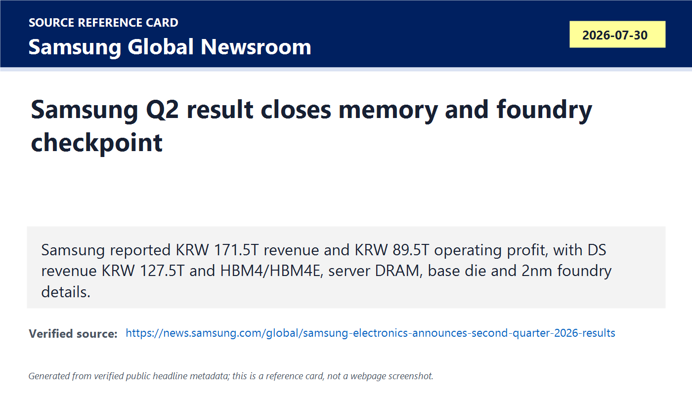
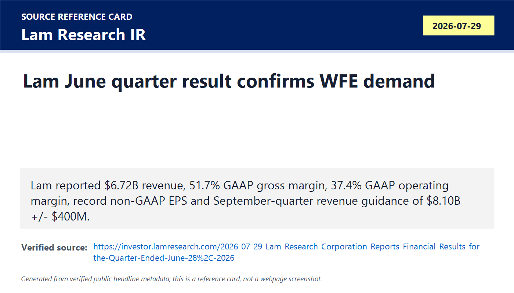
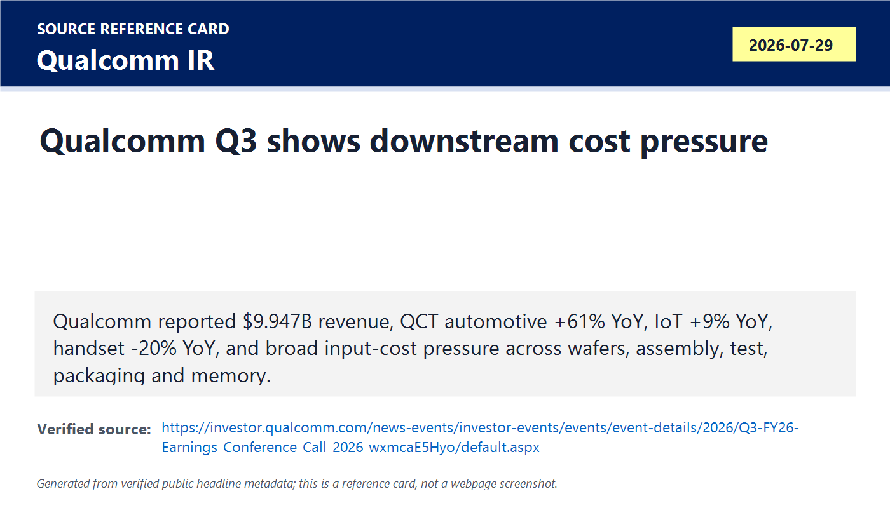
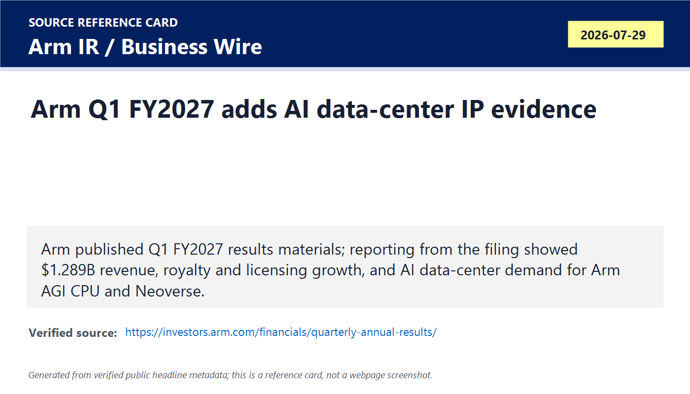
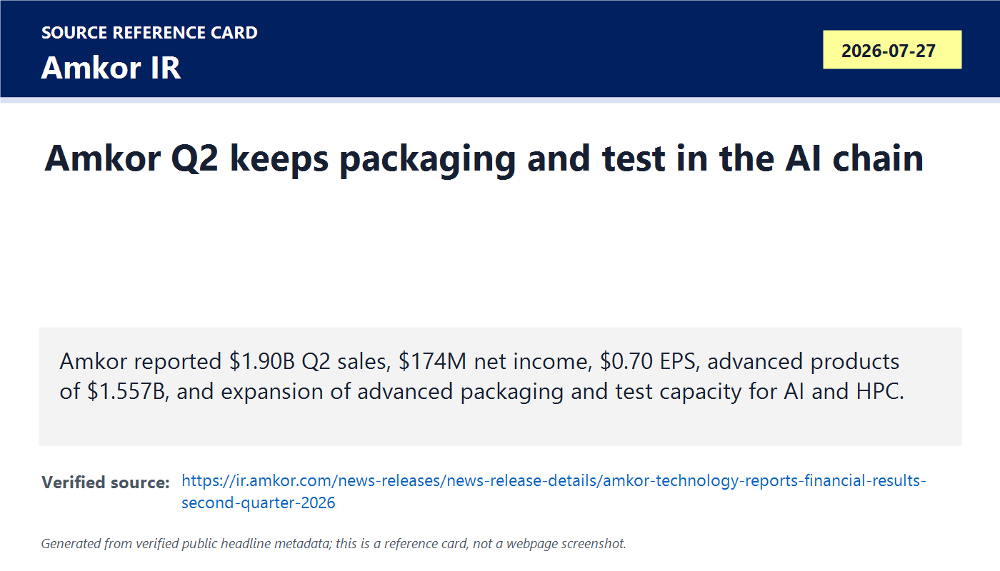
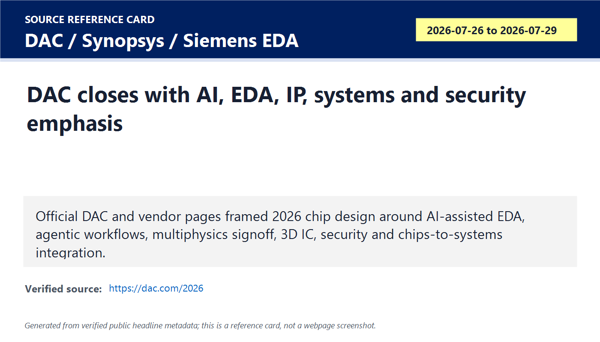
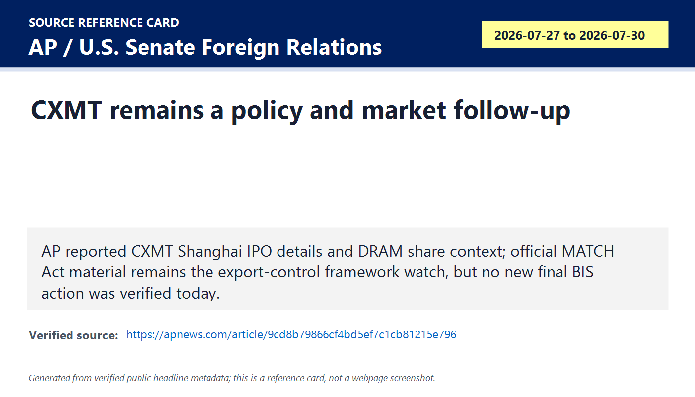
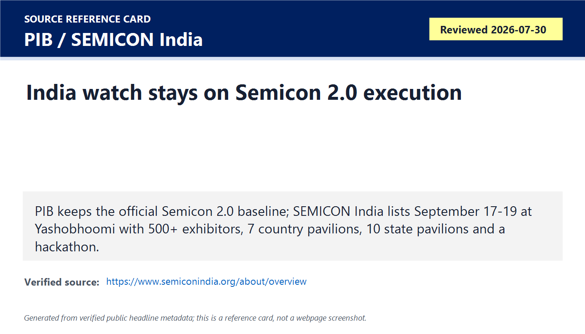

# Daily Semiconductor Current Affairs

Date: 2026-07-30

Research window: Thursday update through approximately 15:05 IST on July 30, 2026. This note closes the July 29 Lam and July 30 Samsung checkpoints that were pending in yesterday's briefing. It also uses nearest last-24-to-72-hour evidence for Arm, Qualcomm, Amkor, DAC/EDA, CXMT policy risk and India execution because those items are part of the same semiconductor value-chain signal.

## Quick Index

| Date | Major Topic | Source Groups | Why To Read |
|---|---|---|---|
| 2026-07-30 | Samsung closes memory and foundry checkpoint | Samsung, AP | Confirms Samsung's AI-memory profit, HBM4/HBM4E progress, foundry base-die demand and 2nm/HPC design-win signal. |
| 2026-07-30 | Lam closes wafer-equipment checkpoint | Lam Research | Shows that AI-linked device complexity is translating into etch, deposition, customer-support and WFE revenue. |
| 2026-07-30 | Qualcomm shows downstream cost pressure | Qualcomm | Explains why memory, advanced packaging, wafer fabrication, assembly and test inflation can hurt chip designers even when AI demand is strong. |
| 2026-07-30 | Arm adds AI data-center IP evidence | Arm, Business Wire, SEC-linked reporting | Connects chip IP, royalty revenue, licensing revenue, Arm AGI CPU and Neoverse to AI infrastructure. |
| 2026-07-30 | Amkor keeps packaging/test in the chain | Amkor | Keeps advanced packaging and test visible as a production bottleneck, not a side note. |
| 2026-07-30 | DAC/EDA and CXMT/policy remain watch items | DAC, Synopsys, Siemens EDA, AP, Senate Foreign Relations | Separates design-flow momentum from policy risk and unconfirmed final export-control action. |
| 2026-07-30 | India execution watch | PIB, SEMICON India | Maps India Semicon 2.0 and SEMICON India 2026 to actual value-chain execution skills. |

**Page navigation:** [Sources](#source-map) · [Concept review](#concept-review) · [Follow-up](#what-to-watch-next) · [Technical terms](#technical-terms-used-today) · [Master glossary](../knowledge-base/glossary.md)

## Source Images And Manifest

Source manifest: [../images/2026-07-30/links.md](../images/2026-07-30/links.md)

The following are generated source-reference cards based on verified public headline/date/source metadata. They are not webpage screenshots and do not reproduce article bodies.

## Source Map

| Source | Source date | Role | Confidence / limitation |
|---|---:|---|---|
| [Samsung Q2 2026 results](https://news.samsung.com/global/samsung-electronics-announces-second-quarter-2026-results) | 2026-07-30 | Primary Samsung earnings, memory, HBM, foundry, System LSI and division outlook source | Strong company source. Forward outlook and supply/demand comments are management expectations. |
| [AP on Samsung and Korean chipmakers](https://apnews.com/article/samsung-ai-profit-memory-chips-10c2c548a392988862d8c7bd3f6fae05) | 2026-07-30 | Reputable market/geopolitics context for Samsung, SK hynix, AI memory, China competition and capex concerns | Strong reporting source. Market prices can move after publication. |
| [Lam Research June 2026 quarter results](https://investor.lamresearch.com/2026-07-29-Lam-Research-Corporation-Reports-Financial-Results-for-the-Quarter-Ended-June-28%2C-2026) | 2026-07-29 | Primary WFE/equipment earnings source | Strong company source. September-quarter guidance is a forecast. |
| [Lam etch process explainer](https://www.lamresearch.com/products/our-processes/etch/) and [Lam product overview](https://www.lamresearch.com/products/products-overview/) | Reviewed 2026-07-30 | Technical source for etch, deposition and fab process definitions | Strong company technical source. It explains processes but does not independently validate financial results. |
| [Qualcomm Q3 FY2026 earnings event](https://investor.qualcomm.com/news-events/investor-events/events/event-details/2026/Q3-FY26-Earnings-Conference-Call-2026-wxmcaE5Hyo/default.aspx), [earnings release PDF](https://s204.q4cdn.com/645488518/files/doc_financials/2026/q3/FY2026-3rd-Quarter-Earnings-Release.pdf), and [presentation PDF](https://s204.q4cdn.com/645488518/files/doc_financials/2026/q3/FY2026-3rd-Quarter-Earnings-Presentation_7-29-26_Final.pdf) | 2026-07-29 | Primary downstream chipmaker earnings, QCT/QTL, handset, automotive, IoT, input-cost and guidance source | Strong company source. Guidance and long-range Investor Day targets remain forward-looking. |
| [Arm quarterly results page](https://investors.arm.com/financials/quarterly-annual-results/), [Business Wire release](https://www.businesswire.com/news/home/20260729964548/en/Arm-Holdings-plc-Reports-Results-for-the-First-Quarter-of-the-Fiscal-Year-Ending-2027), and [Arm AGI CPU page](https://www.arm.com/products/cloud-datacenter/arm-agi-cpu) | 2026-07-29 and reviewed 2026-07-30 | Primary/official location for Arm results materials and Arm AGI CPU technical framing | Strong source identity. Some numerical values are taken from SEC-linked/reputable reporting because the shareholder-letter PDF did not render cleanly in this capture. |
| [WSJ Arm earnings report](https://www.wsj.com/business/earnings/arm-posts-higher-revenue-profit-as-ai-demand-drives-growth-8e035f8c) | 2026-07-29 | Reputable reporting for Arm Q1 FY2027 financial values and data-center royalty context | Reputable reporting, but not a substitute for the full shareholder-letter PDF once accessible. |
| [Amkor Q2 2026 results](https://ir.amkor.com/news-releases/news-release-details/amkor-technology-reports-financial-results-second-quarter-2026) | 2026-07-27 | Primary packaging/test and OSAT earnings source inside the 72-hour catch-up window | Strong company source. Included as packaging/test context; the main new checkpoint was already noted earlier this week. |
| [DAC 2026 official site](https://dac.com/2026), [Synopsys DAC 2026 page](https://www.synopsys.com/events/dac-2026.html), and [Siemens EDA DAC 2026 page](https://events.sw.siemens.com/en-US/dac/) | 2026-07-26 to 2026-07-29 | EDA/IP, AI-assisted design, security, 3D IC and chips-to-systems evidence | Strong event/vendor sources. Agenda presence is not production silicon evidence. |
| [AP on CXMT market debut](https://apnews.com/article/cxmt-china-memory-chips-debut-shares-9cd8b79866cf4bd5ef7c1cb81215e796), [House letter on Chinese memory chips](https://chinaselectcommittee.house.gov/media/letters/moolenaar-whitesides-to-secretary-lutnick-hold-firm-on-chinese-memory-chips-ban), and [MATCH Act Senate release](https://www.foreign.senate.gov/press/rep/release/risch-ricketts-kim-introduce-match-act-level-the-global-playing-field-for-us-tech) | 2026-07-16 to 2026-07-30 | Policy, export-control, procurement and China memory risk context | Strong for public policy pressure and bill framing. No new final BIS rule or completed Entity List action was verified today. |
| [PIB Semicon 2.0 background](https://www.pib.gov.in/PressReleasePage.aspx?PRID=2284806) and [SEMICON India 2026 overview](https://www.semiconindia.org/about/overview) | 2026-07-15 and reviewed 2026-07-30 | India policy baseline and India ecosystem event update | Strong official/event sources. No new July 30 project-level manufacturing milestone was found before cutoff. |

## Technical Terms / Deep Definitions

Term: High-Bandwidth Memory 4E (HBM4E)
Definition: HBM4E is an enhanced version of the HBM4 stacked-memory generation, intended to push bandwidth, capacity, power efficiency and accelerator integration beyond baseline HBM4. It solves the next memory-wall problem: AI accelerators can contain more compute units, but they need enough nearby memory bandwidth and capacity to keep those units fed. In today's Samsung result, HBM4E matters because Samsung says it shipped HBM4E samples to major customers, which means next-generation accelerator platforms are already being planned around that memory roadmap. Comparison: HBM4 is the new highway near the AI chip; HBM4E is the widened and upgraded version being sampled for the next traffic wave. Source: https://news.samsung.com/global/samsung-electronics-announces-second-quarter-2026-results

Term: Device Solutions (DS)
Definition: Samsung's Device Solutions division is the semiconductor-facing business grouping that includes memory, system LSI and foundry activity. It solves a reporting problem: Samsung is a broad electronics company, so investors and engineers need to separate chip economics from phones, displays, appliances and networks. In today's news, DS matters because almost all of Samsung's Q2 operating profit came from semiconductors, and DS reported KRW 127.5 trillion revenue and KRW 89.2 trillion operating profit. Example: Samsung's phone unit can lose money while DS earns record profit because memory and foundry economics are different businesses. Source: https://news.samsung.com/global/samsung-electronics-announces-second-quarter-2026-results

Term: HBM base die
Definition: An HBM base die is the logic/interface die under a stack of DRAM dies that manages physical connections, signaling, test structures and package integration between the memory stack and the accelerator or substrate. It solves the integration problem in stacked memory: vertical DRAM layers need a controlled electrical interface to the outside world. In today's Samsung foundry commentary, base-die demand matters because HBM growth can create foundry demand even when the product being sold is "memory." Comparison: the DRAM dies are the storage floors; the base die is the ground-floor interface that connects the tower to the city. Source: https://news.samsung.com/global/samsung-electronics-announces-second-quarter-2026-results

Term: Second-generation 2nm process
Definition: A second-generation 2nm process is a refined version of a leading-edge manufacturing node after the first process generation, usually targeting better yield, performance, power, area, reliability or design-rule maturity. It solves the early-ramp problem: the first generation proves the technology, while later generations make it more useful for broader products. In today's Samsung result, the phrase matters because Samsung says foundry will ramp new mobile products on its second-generation 2nm process in H2 2026. Example: a first 2nm node may be the first climb up the mountain; a second-generation 2nm node is the more repeatable route customers can plan around. Source: https://news.samsung.com/global/samsung-electronics-announces-second-quarter-2026-results

Term: High-performance computing (HPC)
Definition: HPC is the category of workloads and chips that require very high compute throughput, memory bandwidth, interconnect bandwidth and energy efficiency, including AI training/inference, scientific simulation, cloud acceleration and data-center processing. It solves the need to finish huge compute jobs within useful time and power limits. In today's Samsung foundry result, 2nm HPC engagements matter because foundry design wins in AI/HPC can drive advanced-node wafer demand and advanced packaging demand. Comparison: a laptop CPU optimizes for general use; an HPC chip optimizes for massive sustained compute. Source: https://news.samsung.com/global/samsung-electronics-announces-second-quarter-2026-results

Term: Wafer fabrication equipment (WFE)
Definition: WFE is the set of front-end tools used to manufacture chips on wafers, including deposition, etch, cleaning, lithography, ion implantation, anneal, metrology and inspection. It solves the design-to-silicon problem: a chip layout becomes real only after hundreds of controlled physical and chemical process steps. In today's Lam result, WFE matters because Lam's record revenue indicates fabs are still buying the tools needed to build AI-related memory, logic and packaging-enabling capacity. Example: EDA creates the blueprint; WFE builds the transistor layers. Source: https://investor.lamresearch.com/2026-07-29-Lam-Research-Corporation-Reports-Financial-Results-for-the-Quarter-Ended-June-28%2C-2026

Term: Etch
Definition: Etch is the wafer-fabrication process that selectively removes material from a wafer to form trenches, holes, patterns and device structures. It solves the pattern-transfer problem: after lithography defines where material should remain or disappear, etch creates the physical structure. In today's Lam result, etch matters because 3D memory, advanced logic and advanced packaging need precise material removal with high aspect ratios and tight uniformity. Comparison: deposition adds material; etch carves it away. Source: https://www.lamresearch.com/products/our-processes/etch/

Term: Deposition
Definition: Deposition is the wafer-fabrication process that adds controlled thin films such as dielectrics, metals, barriers or semiconductor layers onto a wafer. It solves the construction problem in chips: transistors, capacitors, interconnects and memory structures need many carefully chosen material layers. In today's Lam result, deposition matters because AI-era chips and 3D structures require more film layers and tighter film control. Example: building a chip is not one layer of silicon; it is repeated deposition, patterning, etch and clean. Source: https://www.lamresearch.com/products/products-overview/

Term: Deferred revenue
Definition: Deferred revenue is cash or billing recorded for products or services where revenue recognition is delayed until the company satisfies accounting conditions such as delivery, installation or customer acceptance. It solves an accounting-timing problem: payment or shipment can happen before revenue is fully earned under accounting rules. In today's Lam release, deferred revenue and Japan acceptance treatment matter because they show that equipment demand can be partly hidden in timing differences before revenue is recognized. Comparison: a booked hotel payment is not the same as a completed stay. Source: https://investor.lamresearch.com/2026-07-29-Lam-Research-Corporation-Reports-Financial-Results-for-the-Quarter-Ended-June-28%2C-2026

Term: Customer support-related revenue
Definition: Customer support-related revenue is revenue from service, spare parts, upgrades, support and non-leading-edge equipment that keeps installed fab tools productive. It solves the installed-base problem: a fab tool must run, be repaired, upgraded and tuned for years after the initial sale. In today's Lam result, support revenue matters because AI capacity expansion is not only new tool shipments; it also depends on keeping the installed base available and productive. Example: buying an etch tool is the vehicle purchase; spares and service keep it running. Source: https://investor.lamresearch.com/2026-07-29-Lam-Research-Corporation-Reports-Financial-Results-for-the-Quarter-Ended-June-28%2C-2026

Term: QCT
Definition: QCT is Qualcomm CDMA Technologies, Qualcomm's semiconductor products business covering chipsets and platforms for handsets, automotive, IoT, compute, connectivity and related markets. It solves a reporting split: Qualcomm has both a chip-selling business and a licensing business. In today's Qualcomm result, QCT matters because automotive grew 61% year over year and IoT grew 9%, while handsets fell 20%, showing diversification and handset pressure at the same time. Example: QCT sells chips and platforms; QTL monetizes patents and licenses. Source: https://s204.q4cdn.com/645488518/files/doc_financials/2026/q3/FY2026-3rd-Quarter-Earnings-Release.pdf

Term: QTL
Definition: QTL is Qualcomm Technology Licensing, the business that licenses Qualcomm's patent portfolio to device makers and other customers. It solves the intellectual-property monetization problem: Qualcomm can earn revenue from cellular and related patents even when it is not selling every physical chip in a device. In today's Qualcomm result, QTL matters because its revenue and high EBT margin provide a different profit stream from QCT's hardware exposure. Comparison: QCT is selling engines; QTL is licensing the design rights that let others build compliant vehicles. Source: https://s204.q4cdn.com/645488518/files/doc_financials/2026/q3/FY2026-3rd-Quarter-Earnings-Presentation_7-29-26_Final.pdf

Term: Input-cost pressure
Definition: Input-cost pressure means the components, materials, services or manufacturing steps needed to make a product become more expensive or constrained. It solves a margin-analysis problem: revenue can be stable while profit falls if the cost base rises faster than prices. In today's Qualcomm result, input-cost pressure matters because Qualcomm explicitly cited rising costs across wafer fabrication, assembly, test, advanced packaging, memory and other materials. Example: a phone chip vendor can be hurt by HBM or DRAM shortages even if it does not sell HBM itself, because memory and packaging costs feed into device economics. Source: https://s204.q4cdn.com/645488518/files/doc_financials/2026/q3/FY2026-3rd-Quarter-Earnings-Presentation_7-29-26_Final.pdf

Term: Non-handset revenue
Definition: Non-handset revenue is revenue from markets other than smartphones, such as automotive, industrial IoT, robotics, networking, PCs, data centers and embedded systems. It solves the concentration problem for a chipmaker whose historical business depends heavily on phones. In today's Qualcomm result, non-handset revenue matters because management is trying to prove that automotive, IoT and data-center opportunities can offset handset weakness over time. Comparison: relying only on handsets is one-crop farming; non-handset growth diversifies the field. Source: https://s204.q4cdn.com/645488518/files/doc_financials/2026/q3/FY2026-3rd-Quarter-Earnings-Release.pdf

Term: Royalty revenue
Definition: Royalty revenue is money earned when customers use licensed technology or IP in shipped products, often tied to units, value, or contract terms. It solves the scaling problem for IP companies: they can benefit when partners ship chips or devices without manufacturing every chip themselves. In today's Arm result, royalty revenue matters because AI/data-center adoption of Arm-based designs can grow Arm's revenue as partners ship more processors. Example: Arm designs the CPU architecture and IP; partners build chips and pay royalties when products ship. Source: https://investors.arm.com/financials/quarterly-annual-results/

Term: Licensing revenue
Definition: Licensing revenue is money earned when a customer pays for rights to use technology, IP blocks, architecture, designs or tools, often before the customer's final chip ships. It solves the access problem: a chip company can legally use proven IP instead of building every block from scratch. In today's Arm result, licensing revenue matters because it is evidence that customers are committing to future Arm-based designs before royalties fully appear. Comparison: licensing is paying to use the blueprint; royalty revenue appears as products using that blueprint ship. Source: https://investors.arm.com/financials/quarterly-annual-results/

Term: Arm AGI CPU
Definition: Arm AGI CPU is Arm's production silicon for AI infrastructure, positioned for agentic AI workloads with high-performance, energy-efficient compute at data-center scale. It solves the CPU-side bottleneck in AI systems: accelerators need CPUs to coordinate scheduling, data movement, orchestration, networking and control. In today's Arm result, AGI CPU matters because reported demand and manufacturing-capacity commitments suggest CPUs are becoming part of the AI infrastructure race, not only GPUs and HBM. Example: an accelerator performs dense math; a data-center CPU coordinates the system around it. Source: https://www.arm.com/products/cloud-datacenter/arm-agi-cpu

Term: Outsourced Semiconductor Assembly and Test (OSAT)
Definition: OSAT is the outsourced business model where specialized companies package, assemble and test semiconductor dies for chip designers, foundries or IDMs. It solves the back-end manufacturing problem: a fabricated die is not a qualified product until it is assembled, connected, protected, tested and screened for reliability. In today's Amkor item, OSAT matters because AI/HPC products need advanced packaging and test capacity, not only wafer starts. Comparison: a fab makes the bare die; an OSAT helps turn it into a shippable component. Source: https://ir.amkor.com/news-releases/news-release-details/amkor-technology-reports-financial-results-second-quarter-2026

Term: Advanced products
Definition: In Amkor's reporting, advanced products include higher-complexity packaging/test categories such as flip chip, memory, wafer-level processing and related services. It solves the performance-packaging problem: AI, data-center, automotive and high-end mobile chips need dense interconnect, better electrical paths and more test complexity than simple packages. In today's Amkor item, advanced products matter because they represented $1.557 billion of Q2 net sales, showing that packaging complexity is a large revenue pool. Example: a low-pin-count package protects a simple chip; an advanced package can integrate compute, memory, power and high-speed I/O constraints. Source: https://ir.amkor.com/news-releases/news-release-details/amkor-technology-reports-financial-results-second-quarter-2026

Term: Agentic AI
Definition: Agentic AI refers to AI systems that can plan, call tools, coordinate tasks, keep context and take multi-step actions toward a goal rather than only produce one response. It solves the automation-depth problem: useful enterprise or engineering AI often needs workflow execution, not just text generation. In today's Samsung, Arm and DAC items, agentic AI matters because it raises demand for memory, CPUs, accelerators, data-center infrastructure and AI-assisted chip-design flows. Comparison: a chatbot answers; an agentic system plans and executes a workflow. Source: https://www.synopsys.com/events/dac-2026.html

Term: Multiphysics signoff
Definition: Multiphysics signoff is final design verification across interacting physical effects such as electrical timing, power integrity, thermal behavior, mechanical stress, electromagnetic effects and package/system interactions. It solves the late-stage failure problem: a chip can pass logic checks but fail because heat, voltage drop, package stress or signal integrity breaks real operation. In today's DAC/EDA context, multiphysics signoff matters because AI chips, 3D ICs and advanced packages behave like systems, not isolated dies. Example: timing closure alone is not enough if the package overheats or the power delivery network droops. Source: https://www.synopsys.com/events/dac-2026.html

Term: MATCH Act
Definition: The MATCH Act, or Multilateral Alignment of Technology Controls on Hardware Act, is proposed U.S. legislation aimed at aligning export controls on chokepoint semiconductor manufacturing equipment among the United States and allies. It solves a policy loophole problem: controls are weaker if a restricted buyer can purchase similar tools from a less restrictive allied supplier. In today's CXMT/policy watch, the MATCH Act matters because memory and equipment restrictions increasingly depend on allied coordination, not only U.S.-only rules. Comparison: one locked door does little if the same room has an unlocked side entrance. Source: https://www.foreign.senate.gov/press/rep/release/risch-ricketts-kim-introduce-match-act-level-the-global-playing-field-for-us-tech

Term: Technology sovereignty
Definition: Technology sovereignty means a country has enough domestic capability, trusted partners and supply-chain control to design, source, manufacture or secure critical technologies without unacceptable dependence on one foreign choke point. It solves a resilience and national-security problem: semiconductors power defense, communications, AI, vehicles, healthcare and infrastructure. In today's India and CXMT items, technology sovereignty matters because India is trying to build a trusted ecosystem while China is pushing memory self-sufficiency under export-control pressure. Example: sovereignty does not mean making every tool domestically tomorrow; it means knowing which dependencies are critical and building credible alternatives. Source: https://www.pib.gov.in/PressReleasePage.aspx?PRID=2284806

## 1. Samsung: Memory Strength Is Now A Full-Stack AI Signal

### Confirmed Facts

Samsung Electronics reported Q2 2026 consolidated revenue of KRW 171.5 trillion and operating profit of KRW 89.5 trillion. The company said revenue rose 28% quarter over quarter and that operating profit reached another all-time high. The Device Solutions division reported KRW 127.5 trillion in revenue and KRW 89.2 trillion in operating profit.

The Memory Business delivered another record quarter, driven by AI demand, limited capacity and price increases. Samsung said server revenue reached a record-high share of the sales mix, HBM4 sales scaled up, and the company shipped HBM4E samples to major customers. Samsung also said H2 2026 demand should remain server-centered because of AI infrastructure capex and broader agentic AI adoption, with server DRAM, eSSD and HBM demand expected to accelerate.

On foundry, Samsung said results improved significantly before incentive-related provisions, driven by HBM base-die demand and strong U.S. customer orders. It also said design wins with major customers expanded, with 2nm HPC engagements as an example. For H2 2026, Samsung plans to ramp new mobile products on its second-generation 2nm process and expand LPU and base-die products on 4nm.

AP added market and geopolitical context: nearly all of Samsung's operating profit came from semiconductors, Samsung and SK hynix shares have still been volatile, investors worry about huge capex and Chinese competition, and Samsung expects the supply-demand gap to widen further in 2027.

### Analysis

Samsung matters today because it confirms yesterday's open memory checkpoint from a second large supplier. SK hynix already showed record AI-memory economics; Samsung now confirms that the cycle is broader than one company. This reduces the risk that SK hynix's result was an isolated outlier.

The foundry details are especially important. HBM is usually discussed as memory, but Samsung's base-die comment shows that advanced memory also pulls foundry capacity. That means HBM demand can create work for logic processes, package co-design and testing. If AI accelerators need HBM stacks, those stacks need base dies, substrates, interposers/bridges, signal integrity, thermal control and final test.

The risk is that supply expansion is expensive and slow. Investors can believe the demand story and still punish the stocks if capex looks too large, if China memory capacity looks threatening, or if memory prices are assumed to be near peak. A record quarter does not automatically close the durability question.

### Why It Matters

This item connects memory, foundry and AI infrastructure into one system. AI customers do not buy "memory" in isolation; they need HBM, base dies, advanced packages, accelerators, servers, networking and power. Samsung's result says the AI chain is pulling several Samsung businesses at once.

### India Angle

India should study Samsung as a value-chain map. India is unlikely to build HBM leadership immediately, but it can target package test, thermal/mechanical reliability, memory-controller design, signal-integrity engineering, power integrity, embedded firmware, equipment components and materials qualification. Samsung's result is a reminder that semiconductor capability is layered: memory process, logic base die, package, test, customer contracts and capex discipline all matter.

### VLSI / Career Relevance

For VLSI students, this item maps to DRAM organization, TSVs, HBM interfaces, PHY design, memory-controller verification, base-die logic, DFT, package parasitics, thermal constraints, PDK-aware design and foundry/customer qualification. Do not treat "memory" as only a theory topic; in AI systems, memory bandwidth is often the limiter.

## 2. Lam Research: The Equipment Checkpoint Closed Strong

### Confirmed Facts

Lam Research reported June-quarter revenue of $6.72 billion, GAAP gross margin of 51.7%, GAAP operating margin of 37.4% and GAAP diluted EPS of $1.81. Non-GAAP gross margin was 52.0%, non-GAAP operating margin was 38.4% and non-GAAP diluted EPS was $1.82. Management called the quarter record revenue, operating margin and EPS.

Lam's geographic revenue mix was Taiwan 27%, China 26%, Korea 20%, Japan 9%, United States 9%, Southeast Asia 5% and Europe 4%. Systems revenue was $4.25 billion, while customer support-related revenue and other was $2.47 billion. For the September quarter, Lam guided revenue to $8.10 billion plus or minus $400 million, gross margin to 52.0% plus or minus 1%, operating margin to 39.5% plus or minus 1% and EPS to $2.15 plus or minus $0.15.

### Analysis

Lam closes yesterday's pending equipment checkpoint cleanly. KLA already showed process-control strength; Lam now adds process-tool strength. KLA measures and controls; Lam etches, deposits, cleans and supports process steps. Together, they show that AI demand is not only visible in finished chips but also in the machinery needed to build them.

The revenue geography matters. Taiwan, China and Korea together account for a large share of Lam's quarter, which maps directly to foundry, memory and China self-sufficiency pressure. This also makes export-control risk relevant: Lam's own risk language mentions trade regulations, tariffs, export controls and geopolitical tensions.

The September-quarter guidance is important but not confirmed output. It says Lam expects another strong quarter, but the actual evidence will be tool shipments, accepted installations, customer utilization, and future revenue recognition.

### Why It Matters

If Samsung and SK hynix need more memory and foundry capacity, Lam-type equipment becomes a gating item. You cannot solve a memory shortage with money alone; you need tools installed, qualified, matched, maintained and staffed. Lam's support revenue also shows the installed base is strategically valuable because uptime and upgrades affect real capacity.

### India Angle

India's Semicon 2.0 machines/materials pillar becomes more meaningful when read next to Lam. Building a fab ecosystem requires chambers, pumps, gas delivery, power supplies, robotics, spare parts, process engineers, service response, safety systems and contamination control. Indian suppliers can enter through qualified components and support ecosystems before they build full leading-edge tools.

### VLSI / Career Relevance

For a VLSI student, Lam is a reminder that chip design does not end at RTL. Etch profile, sidewall roughness, film deposition, overlay, residue, via quality and process repeatability affect timing, leakage, yield and reliability. Students interested in process integration, equipment engineering or yield should treat WFE as a serious career path.

## 3. Qualcomm: AI Demand Does Not Remove Downstream Margin Pressure

### Confirmed Facts

Qualcomm reported fiscal Q3 2026 revenue of $9.947 billion, GAAP EPS of $1.87 and non-GAAP EPS of $2.21. QCT revenue was $8.504 billion, down 5% year over year, while QTL revenue was $1.278 billion, down 3%. Within QCT, handset revenue fell 20% year over year to $5.086 billion, automotive rose 61% to $1.588 billion and IoT rose 9% to $1.830 billion.

Qualcomm returned $2.3 billion to shareholders during the quarter. It guided Q4 FY2026 revenue to $9.7 billion to $10.5 billion and non-GAAP diluted EPS to $2.05 to $2.25. Qualcomm explicitly said the semiconductor industry is seeing broad input-cost increases across wafer fabrication, assembly, test, advanced packaging, memory and other materials, and that it is taking pricing actions.

### Analysis

Qualcomm is today's useful counterweight to Samsung and Lam. Memory strength is good for memory suppliers, but it can be painful for downstream chip and device companies. If DRAM, storage, advanced packaging, wafer processing and assembly/test costs rise, a company selling phone, automotive or IoT platforms faces margin compression unless it can raise prices.

The diversification story is mixed. Automotive and IoT are clearly growing, and Qualcomm continues to frame non-handset revenue as a strategic target. But handset weakness and Apple modem share loss are still material. This tells us AI and automotive growth can coexist with near-term handset pain.

### Why It Matters

The semiconductor cycle is not one-directional. One company's pricing power can become another company's input cost. That is why this briefing should not say "AI boom helps all semis equally." Memory suppliers, WFE vendors, IP vendors, OSATs and handset SoC suppliers sit at different points in the margin chain.

### India Angle

India's electronics-manufacturing push must account for component inflation. A mobile-phone assembly ecosystem can grow exports, but if memory, packaging, wafer and test costs rise, product pricing and local value addition become harder. India should use this as a lesson: assembly growth must be paired with component, design, packaging/test and supplier localization.

### VLSI / Career Relevance

Qualcomm maps to SoC architecture, wireless basebands, RF, automotive compute, IoT connectivity, power management, firmware and hardware/software co-design. The job-market lesson is that non-handset domains such as automotive and industrial IoT need reliability, safety, networking, security and long-life support skills.

## 4. Arm: AI Infrastructure Is Also An IP And CPU Story

### Confirmed Facts

Arm's official investor page lists Q1 fiscal 2027 materials dated July 29, 2026, including a shareholder letter, results presentation, key financial data and webcast. Business Wire confirmed Arm published the shareholder letter and would furnish it to the SEC on Form 6-K. Reputable reporting from WSJ said Arm revenue rose 22% year over year to $1.29 billion, royalty revenue rose 22% to $715 million and licensing revenue rose 23% to $574 million. It also reported demand for Arm AGI CPU above $2 billion across fiscal 2027 and fiscal 2028, and Neoverse data-center processor shipments above 1.5 billion cores.

Arm's own AGI CPU page describes the product as production silicon for AI infrastructure, designed for high-performance, energy-efficient compute and extreme rack-level density for agentic AI workloads.

### Analysis

Arm is an EDA/IP-adjacent story but not a classic EDA vendor. Its value is in CPU architecture, IP licensing, ecosystem scale and royalties from partner chips. The key point for today: AI infrastructure is not only GPU compute plus HBM. CPUs coordinate accelerator workloads, networking, storage, control-plane tasks, virtualization and software stacks.

Royalty and licensing growth are different signals. Licensing tells us customers are committing to future designs. Royalty tells us products using Arm technology are shipping. A healthy AI infrastructure transition needs both: design wins now and shipped chips later.

### Why It Matters

If Arm-based data-center CPUs grow, then cloud server architecture changes. That affects compiler optimization, operating systems, interconnects, rack power, accelerator orchestration and software portability. It also matters for India because CPU IP, verification, compiler/runtime work and platform software are more accessible career paths than leading-edge fab ownership.

### India Angle

India has significant design talent. Arm's business model shows one realistic path: value can be created through IP, subsystems, verification, software enablement, compilers, security, embedded platforms and licensing. India's DLI and C2S programs should be judged by whether they create real reusable IP and tapeout experience, not only classroom exposure.

### VLSI / Career Relevance

Revise CPU microarchitecture, AMBA-style interconnect thinking, cache coherence, power/performance tradeoffs, SoC verification, physical implementation, firmware, boot, Linux kernel basics, compiler toolchains and workload profiling. AI infrastructure needs CPU engineers as much as accelerator engineers.

## 5. Amkor: Packaging/Test Is Still A Bottleneck

### Confirmed Facts

Amkor reported Q2 2026 net sales of $1.90 billion, up 26% year over year. Gross profit was $319 million, operating income $200 million, net income $174 million and diluted EPS $0.70. Amkor said it delivered record revenue in Computing and Automotive & Industrial markets and continued expanding advanced packaging and test capacity. Advanced products were $1.557 billion of Q2 net sales; packaging services represented 88% and test services 12%.

### Analysis

This is not a brand-new July 30 release, but it is still inside the 72-hour window and it matters for today's value-chain completeness. Samsung and SK hynix can sell HBM only if packaging/test capacity exists. Qualcomm explicitly cited advanced packaging and test as input-cost pressure. Amkor shows that OSAT economics are part of the same cycle.

The advanced-products number is important because it shows package complexity becoming revenue, not just engineering language. AI and HPC packages require dense interconnect, thermal reliability, package-level warpage control, ATE coverage, burn-in strategy and customer qualification.

### Why It Matters

Packaging is where many AI bottlenecks become visible. A compute die, HBM stack, substrate and power/thermal design can all be individually strong, but the product fails if package yield or final test cannot scale.

### India Angle

India's OSAT/ATMP projects should be evaluated against Amkor-style evidence: customer programs, package types, capex, equipment, test coverage, yield, reliability data, top-customer concentration and advanced-products mix. Announcing a packaging plant is easy; qualifying high-value AI/HPC packages is hard.

### VLSI / Career Relevance

Useful skills include DFT, scan/BIST, ATE pattern generation, signal integrity, power integrity, package parasitics, thermal modeling, reliability standards, failure analysis, TSV/microbump concepts and data analytics for yield.

## 6. EDA/IP At DAC: The Design Flow Is Becoming A System Flow

### Confirmed Facts

DAC 2026 was held in Long Beach from July 26-29, 2026 and framed itself as a chips-to-systems event spanning AI, design, EDA, security and systems. Synopsys' DAC page emphasized agentic AI teams, multiphysics fusion and design/signoff workflows. Siemens EDA's DAC page emphasized software-defined, AI-powered and 3D IC solutions.

### Analysis

This item does not prove that AI agents can autonomously design production chips. It proves something narrower but still important: the EDA agenda is shifting from point-tool automation toward full-flow orchestration, multiphysics closure, security and system-level integration.

The reason is physical. AI chips are no longer just a big logic die. They are chiplets, HBM, substrates, optics, networking, firmware, thermal constraints and power delivery. That pushes EDA from "draw and verify a die" toward "close a system."

### Why It Matters

The next productivity bottleneck in semiconductors may be engineering complexity. More wafers and more memory help only if teams can design, verify, sign off and package systems fast enough. DAC is therefore a leading indicator for where engineering tools are heading.

### India Angle

Indian students should not stop at Verilog syntax. Learn verification, STA, CDC/RDC, UPF, physical design, IR drop, electromigration, formal methods, DRC/LVS, package co-design and security. The industry is moving toward engineers who understand the full path from architecture to package.

### VLSI / Career Relevance

Interview preparation should include why formal verification helps, why signoff exists, why package parasitics affect timing/power, why AI assistants need human review, and how an SoC differs from a system-in-package.

## 7. CXMT And Policy: Still Open, But More Strategically Important

### Confirmed Facts

AP reported that CXMT shares surged 466% in their first day of Shanghai trading, giving the company an estimated market capitalization above $487 billion. AP also reported CXMT raised at least $8.6 billion, is among the world's largest DRAM makers, had roughly 9% of global DRAM shipments in Q1 2026, and faces challenges because access to leading chipmaking tools is restricted. AP noted U.S. lawmakers have called for blocking American purchases of CXMT memory chips over national and economic security concerns.

The House Select Committee's July 16 letter remains the primary current source for the specific CXMT/YMTC memory procurement pressure. The Senate Foreign Relations MATCH Act release remains the primary bill-framing source for allied equipment-control alignment. No new final BIS rule, completed Entity List action or formal procurement ban expansion was verified before today's cutoff.

### Analysis

CXMT is important because it sits at the intersection of three forces: memory shortage, China self-sufficiency and U.S. national security policy. If CXMT adds DRAM supply, it can ease some market pressure. But if policymakers see CXMT as a strategic or military-linked risk, customers may face sourcing limits, compliance uncertainty or reputational risk.

The distinction between policy pressure and final rule is critical. Letters, bills, briefings and reports can move markets, but they are not the same as a binding BIS rule. Today's status remains "updated but open."

### Why It Matters

The memory supercycle is becoming geopolitical. Supply availability, export controls, procurement rules and allied coordination will influence who can buy which chips, not only what the price is.

### India Angle

India can benefit from trusted-supply-chain demand only if it proves execution. Global customers will not shift critical packaging, testing, design or materials work to India because of slogans. They need yield, quality, IP protection, documentation, reliability, logistics and qualified suppliers.

### VLSI / Career Relevance

Engineers increasingly need policy literacy. If you work on memory, EDA, equipment, export-controlled IP or advanced packaging, you should understand Entity List risk, end-use controls, customer screening, design-data controls and supply-chain traceability.

## 8. India: SEMICON India Adds Ecosystem Detail, Project Evidence Still Needed

### Confirmed Facts

PIB's Semicon 2.0 background remains the official baseline: India is expanding from chip manufacturing to a full value chain including design, fabrication, advanced packaging, materials, equipment, research and skilled talent. PIB says 12 semiconductor manufacturing projects have been approved across six states; three have started commercial production; two others are expected by year-end; DLI has 103 EDA-tool applications and 24 chip design projects approved; C2S has EDA tools deployed in 320 institutions and more than 68,000 students trained.

SEMICON India 2026's official overview says the event will run September 17-19, 2026 at Yashobhoomi in Delhi. It says the 2026 edition will have 500+ exhibiting companies from more than 20 countries, 40 startups in a startup pavilion, a 3000 sq ft workforce development pavilion, seven country pavilions, ten state pavilions and a hackathon.

### Analysis

The India item has an update, but not a project milestone. SEMICON India gives ecosystem structure and event scale; it does not prove new capacity. PIB's Semicon 2.0 source gives strong policy structure; it still needs project-level evidence.

The right India checklist remains: final incentive agreements, land, utilities, cleanroom progress, tool orders, tool install, process recipes, imported tool support, materials qualification, package/test qualification, customer names, first lots, yield/utilization and repeat shipments.

### Why It Matters

Today's global news explains why India's full-value-chain approach is correct. Samsung shows memory plus foundry plus packaging. Lam shows equipment. Qualcomm shows cost pressure across wafer, assembly, test, packaging and memory. Arm shows IP. Amkor shows packaging/test. DAC shows EDA/system flow. India needs all of these layers.

### VLSI / Career Relevance

Map the India opportunity to skills: RTL and verification for design, PDK and signoff for tapeout, materials/process for fabs, DFT/ATE for test, thermal/signal integrity for packaging, equipment service for WFE, and documentation/quality systems for customer qualification.

## Verification Matrix

| Prior / Today Item | Evidence Found Today | Status | Next Evidence |
|---|---|---|---|
| Samsung Q2 full result | Official Samsung Q2 release available on July 30 with consolidated, DS, memory, foundry, System LSI and outlook details | Updated / closed for Q2 release | Watch transcript/slides for customer concentration, HBM4E sample timing, base-die mix, 2nm yield and capex detail |
| Lam June quarter | Official Lam June-quarter release available with revenue, margins, EPS, geography, systems/support split and September guide | Updated / closed for release | Watch transcript for memory/customer mix, China exposure, WFE demand by segment and advanced packaging comments |
| SK hynix Q2 | No new official update beyond July 29 result in reviewed sources | Still pending for deeper detail | Watch IR materials/transcript for HBM4 customer qualification, LTAs, capex and shareholder-return detail |
| NXP Q2 | No new official update beyond July 28 result in reviewed sources | Still pending for transcript detail | Watch channel inventory, China exposure, automotive backlog and physical-AI customer examples |
| KLA Q4 | No new official update beyond July 28 result in reviewed sources | Still pending for transcript/shareholder-letter detail | Watch WFE mix, memory versus foundry/logic, China, services and advanced packaging |
| Qualcomm Q3 | Official Q3 release/presentation available | Updated | Watch Q4 pricing actions, memory cost pass-through, Apple modem share and non-handset acceleration |
| Arm Q1 FY2027 | Official results materials page and Business Wire release available; values verified through reputable/SEC-linked reporting | Updated, but PDF extraction incomplete | Revisit shareholder-letter PDF/Form 6-K when cleanly accessible |
| Amkor Q2 packaging/test | Official July 27 release remains valid within 72-hour window | Updated earlier / still relevant | Watch customer programs, capex execution, advanced products mix and utilization |
| CXMT policy action | AP and congressional sources show pressure; no new final BIS action verified | Updated but open | Watch BIS final rule, Entity List action, NDAA text, procurement guidance |
| India Semicon 2.0 | PIB and SEMICON India official sources reviewed; no new July 30 project-level milestone found | Still pending | Watch FSAs, tool orders, cleanroom milestones, first lots, yields and customer qualification |

## Follow-Ups From Previous Research

| Prior Follow-Up | Status Today | What Changed / Next Evidence |
|---|---|---|
| Lam July 29 result | Updated | Official Lam release landed after yesterday's cutoff. The result was strong, but transcript-level detail still matters. |
| Samsung memory/foundry result | Updated | Official Samsung Q2 release landed and closes the result checkpoint. Need transcript/slides for deeper HBM4E, base-die, 2nm and capex detail. |
| SK hynix transcript and HBM4 details | Still pending | No new official transcript detail captured today beyond the July 29 release. |
| NXP call detail | Still pending | Qualcomm now adds downstream cost pressure context, but NXP-specific transcript details remain open. |
| KLA call detail | Still pending | Lam gives complementary WFE strength; KLA-specific mix detail still needs transcript/shareholder-letter follow-up. |
| China immersion DUV proof | Still pending | No primary customer-shipment, uptime, overlay, throughput, yield or qualification evidence found today. |
| CXMT policy action | Still pending | Policy pressure remains clear; no final BIS/Commerce action verified today. |
| India Semicon 2.0 execution | Still pending | SEMICON India event details improved, but no new project-level manufacturing milestone was found before cutoff. |

## Concept Review

| Concept | Simple Meaning | Why It Matters Today |
|---|---|---|
| Memory wall | Compute waits because data cannot arrive fast enough | Samsung's HBM4/HBM4E and SK hynix's HBM4 progress exist because AI accelerators are bandwidth-hungry. |
| Equipment leverage | Tool vendors benefit before chip supply expands | Lam and KLA show that more AI capacity means more process, etch, deposition, inspection and service demand. |
| Cost pass-through | A company raises prices to offset higher input costs | Qualcomm is trying to pass wafer, memory, packaging and test cost increases into product pricing. |
| IP business model | Earn money through licensing and royalties, not only manufacturing | Arm shows AI infrastructure value can accrue to CPU architecture/IP, not only fabs and GPU vendors. |
| Packaging bottleneck | Good dies still need complex package/test capacity | Amkor and Samsung base-die/HBM signals show packaging/test is a capacity constraint. |
| Policy-risk overhang | A supply source can be technically useful but politically restricted | CXMT may ease DRAM shortage but remains under U.S. policy scrutiny. |
| Execution proof | Announcements become real only after technical milestones | India needs tool install, qualification, yield and shipments, not only policy structure. |

## Simple Explanation

Today says the AI chip boom is real, but uneven. Samsung's memory division is printing record profit because AI servers need HBM and server DRAM. Lam is strong because fabs need tools to build more chips. Amkor is relevant because chips still need advanced packaging and test. Arm benefits because AI data centers need CPU IP and efficient processors.

But Qualcomm shows the other side: if memory, packaging, wafer fabrication and test costs rise, downstream chipmakers can feel margin pressure. CXMT shows a policy conflict: more Chinese DRAM supply could help shortages, but U.S. policymakers may see it as national-security risk. India should read all of this as a value-chain lesson: design, equipment, materials, fabs, packaging, test, IP, policy and customers must move together.

## VLSI / Career Relevance

1. Memory path: learn DRAM basics, HBM, TSVs, PHYs, memory controllers, timing closure, thermal issues and ATE.
2. Equipment path: learn plasma etch, deposition, contamination control, metrology, process integration and yield analytics.
3. Chip design path: learn RTL, verification, STA, CDC/RDC, DFT, UPF, PDK constraints and physical design.
4. Packaging/test path: learn flip chip, wafer-level processing, SI/PI, thermal modeling, ATE patterns, burn-in and reliability.
5. IP/software path: learn CPU architecture, cache coherence, firmware, compilers, Linux, virtualization and accelerator orchestration.
6. Policy/business path: learn export controls, sourcing risk, capex cycles, margin analysis and customer qualification.

## Interview / Discussion Questions

1. Why did Samsung's Q2 result close the memory/foundry checkpoint that was still pending yesterday?
2. How can HBM demand create foundry demand through base dies?
3. Why does a strong Lam result matter before additional chip supply appears?
4. What is the difference between etch and deposition?
5. Why can Qualcomm suffer from memory price increases even though it is not a memory supplier?
6. How do QCT and QTL differ in Qualcomm's business model?
7. Why are Arm licensing revenue and royalty revenue different evidence signals?
8. Why is a CPU still important in an AI accelerator-heavy data center?
9. What makes OSAT capacity strategically important for AI/HPC packages?
10. Why should DAC/EDA news be treated as design-flow evidence, not proof of production silicon?
11. What would convert CXMT policy pressure into a confirmed rule?
12. Which India Semicon 2.0 milestone would matter more: another announcement or a customer-qualified production lot? Why?

## What To Watch Next

- Samsung transcript/slides for HBM4E sampling detail, HBM4 sales scale, base-die demand, 2nm process ramp, foundry customer names, capex and Texas fab timing.
- Lam transcript for memory WFE, foundry/logic mix, China exposure, customer support trends, etch/deposition demand and advanced-packaging process steps.
- Qualcomm Q4 pricing actions and whether higher input costs can be passed through without hurting demand.
- Arm shareholder-letter/Form 6-K full extraction for data-center royalty detail, AGI CPU commitments and manufacturing-capacity language.
- SK hynix transcript/IR detail for LTAs, HBM4 customer qualification, capex and shareholder-return expectations.
- KLA transcript/shareholder-letter detail for WFE mix, China exposure, services and advanced packaging.
- Any formal BIS/Commerce/Entity List or NDAA action related to CXMT/YMTC memory.
- India project-level evidence: final subsidy agreements, cleanrooms, tools, first lots, yield, customer qualification and repeat shipments.

## Final Takeaway

July 30 closes two important pending checkpoints. Samsung confirms that AI memory strength is broad and tied to foundry/base-die demand. Lam confirms that the equipment layer is still being pulled by AI-driven manufacturing complexity. But Qualcomm warns that the same memory and packaging tightness can hurt downstream chip margins. The deep lesson is that semiconductors are a connected stack: memory, tools, IP, packaging, policy and India execution must be studied together.

## Technical Terms Used Today

[Back to quick index](#quick-index) · [Open the master A-Z glossary](../knowledge-base/glossary.md)

**Term index:** [Advanced products](#daily-term-advanced-products) · [Agentic AI](#daily-term-agentic-ai) · [Arm AGI CPU](#daily-term-arm-agi-cpu) · [Customer support-related revenue](#daily-term-customer-support-related-revenue) · [Deferred revenue](#daily-term-deferred-revenue) · [Deposition](#daily-term-deposition) · [Device Solutions (DS)](#daily-term-device-solutions-ds) · [Etch](#daily-term-etch) · [HBM base die](#daily-term-hbm-base-die) · [High-Bandwidth Memory 4E (HBM4E)](#daily-term-high-bandwidth-memory-4e-hbm4e) · [High-performance computing (HPC)](#daily-term-high-performance-computing-hpc) · [Input-cost pressure](#daily-term-input-cost-pressure) · [Licensing revenue](#daily-term-licensing-revenue) · [MATCH Act](#daily-term-match-act) · [Multiphysics signoff](#daily-term-multiphysics-signoff) · [Non-handset revenue](#daily-term-non-handset-revenue) · [OSAT](#daily-term-osat) · [QCT](#daily-term-qct) · [QTL](#daily-term-qtl) · [Royalty revenue](#daily-term-royalty-revenue) · [Second-generation 2nm process](#daily-term-second-generation-2nm-process) · [Technology sovereignty](#daily-term-technology-sovereignty) · [Wafer fabrication equipment (WFE)](#daily-term-wafer-fabrication-equipment-wfe)

| Term | Meaning |
|---|---|
| [**Advanced products**](../knowledge-base/glossary.md#term-advanced-products) | In Amkor's reporting, advanced products include higher-complexity packaging/test categories such as flip chip, memory, wafer-level processing and related services. It solves the performance-packaging problem: AI, data-center, automotive and high-end mobile chips need dense interconnect, better electrical paths and more test complexity than simple packages. |
| [**Agentic AI**](../knowledge-base/glossary.md#term-agentic-ai) | Agentic AI refers to AI systems that can plan, call tools, coordinate tasks, keep context and take multi-step actions toward a goal rather than only produce one response. It solves the automation-depth problem: useful enterprise or engineering AI often needs workflow execution, not just text generation. |
| [**Arm AGI CPU**](../knowledge-base/glossary.md#term-arm-agi-cpu) | Arm AGI CPU is Arm's production silicon for AI infrastructure, positioned for agentic AI workloads with high-performance, energy-efficient compute at data-center scale. It solves the CPU-side bottleneck in AI systems: accelerators need CPUs to coordinate scheduling, data movement, orchestration, networking and control. |
| [**Customer support-related revenue**](../knowledge-base/glossary.md#term-customer-support-related-revenue) | Customer support-related revenue is revenue from service, spare parts, upgrades, support and non-leading-edge equipment that keeps installed fab tools productive. It solves the installed-base problem: a fab tool must run, be repaired, upgraded and tuned for years after the initial sale. |
| [**Deferred revenue**](../knowledge-base/glossary.md#term-deferred-revenue) | Deferred revenue is cash or billing recorded for products or services where revenue recognition is delayed until the company satisfies accounting conditions such as delivery, installation or customer acceptance. It solves an accounting-timing problem: payment or shipment can happen before revenue is fully earned under accounting rules. |
| [**Deposition**](../knowledge-base/glossary.md#term-deposition) | Deposition is the wafer-fabrication process that adds controlled thin films such as dielectrics, metals, barriers or semiconductor layers onto a wafer. It solves the construction problem in chips: transistors, capacitors, interconnects and memory structures need many carefully chosen material layers. |
| [**Device Solutions (DS)**](../knowledge-base/glossary.md#term-device-solutions-ds) | Samsung's Device Solutions division is the semiconductor-facing business grouping that includes memory, system LSI and foundry activity. It solves a reporting problem: Samsung is a broad electronics company, so investors and engineers need to separate chip economics from phones, displays, appliances and networks. |
| [**Etch**](../knowledge-base/glossary.md#term-etch) | Etch is the wafer-fabrication process that selectively removes material from a wafer to form trenches, holes, patterns and device structures. It solves the pattern-transfer problem: after lithography defines where material should remain or disappear, etch creates the physical structure. |
| [**HBM base die**](../knowledge-base/glossary.md#term-hbm-base-die) | An HBM base die is the logic/interface die under a stack of DRAM dies that manages physical connections, signaling, test structures and package integration between the memory stack and the accelerator or substrate. It solves the integration problem in stacked memory: vertical DRAM layers need a controlled electrical interface to the outside world. |
| [**High-Bandwidth Memory 4E (HBM4E)**](../knowledge-base/glossary.md#term-high-bandwidth-memory-4e-hbm4e) | HBM4E is an enhanced version of the HBM4 stacked-memory generation, intended to push bandwidth, capacity, power efficiency and accelerator integration beyond baseline HBM4. It solves the next memory-wall problem: AI accelerators can contain more compute units, but they need enough nearby memory bandwidth and capacity to keep those units fed. |
| [**High-performance computing (HPC)**](../knowledge-base/glossary.md#term-high-performance-computing-hpc) | HPC is the category of workloads and chips that require very high compute throughput, memory bandwidth, interconnect bandwidth and energy efficiency, including AI training/inference, scientific simulation, cloud acceleration and data-center processing. It solves the need to finish huge compute jobs within useful time and power limits. |
| [**Input-cost pressure**](../knowledge-base/glossary.md#term-input-cost-pressure) | Input-cost pressure means the components, materials, services or manufacturing steps needed to make a product become more expensive or constrained. It solves a margin-analysis problem: revenue can be stable while profit falls if the cost base rises faster than prices. |
| [**Licensing revenue**](../knowledge-base/glossary.md#term-licensing-revenue) | Licensing revenue is money earned when a customer pays for rights to use technology, IP blocks, architecture, designs or tools, often before the customer's final chip ships. It solves the access problem: a chip company can legally use proven IP instead of building every block from scratch. |
| [**MATCH Act**](../knowledge-base/glossary.md#term-match-act) | The MATCH Act, or Multilateral Alignment of Technology Controls on Hardware Act, is proposed U.S. legislation aimed at aligning export controls on chokepoint semiconductor manufacturing equipment among the United States and allies. It solves a policy loophole problem: controls are weaker if a restricted buyer can purchase similar tools from a less restrictive allied supplier. |
| [**Multiphysics signoff**](../knowledge-base/glossary.md#term-multiphysics-signoff) | Multiphysics signoff is final design verification across interacting physical effects such as electrical timing, power integrity, thermal behavior, mechanical stress, electromagnetic effects and package/system interactions. It solves the late-stage failure problem: a chip can pass logic checks but fail because heat, voltage drop, package stress or signal integrity breaks real operation. |
| [**Non-handset revenue**](../knowledge-base/glossary.md#term-non-handset-revenue) | Non-handset revenue is revenue from markets other than smartphones, such as automotive, industrial IoT, robotics, networking, PCs, data centers and embedded systems. It solves the concentration problem for a chipmaker whose historical business depends heavily on phones. |
| [**OSAT**](../knowledge-base/glossary.md#term-osat) | OSAT is the outsourced business model where specialized companies package, assemble and test semiconductor dies for chip designers, foundries or IDMs. It solves the back-end manufacturing problem: a fabricated die is not a qualified product until it is assembled, connected, protected, tested and screened for reliability. |
| [**QCT**](../knowledge-base/glossary.md#term-qct) | QCT is Qualcomm CDMA Technologies, Qualcomm's semiconductor products business covering chipsets and platforms for handsets, automotive, IoT, compute, connectivity and related markets. It solves a reporting split: Qualcomm has both a chip-selling business and a licensing business. |
| [**QTL**](../knowledge-base/glossary.md#term-qtl) | QTL is Qualcomm Technology Licensing, the business that licenses Qualcomm's patent portfolio to device makers and other customers. It solves the intellectual-property monetization problem: Qualcomm can earn revenue from cellular and related patents even when it is not selling every physical chip in a device. |
| [**Royalty revenue**](../knowledge-base/glossary.md#term-royalty-revenue) | Royalty revenue is money earned when customers use licensed technology or IP in shipped products, often tied to units, value, or contract terms. It solves the scaling problem for IP companies: they can benefit when partners ship chips or devices without manufacturing every chip themselves. |
| [**Second-generation 2nm process**](../knowledge-base/glossary.md#term-second-generation-2nm-process) | A second-generation 2nm process is a refined version of a leading-edge manufacturing node after the first process generation, usually targeting better yield, performance, power, area, reliability or design-rule maturity. It solves the early-ramp problem: the first generation proves the technology, while later generations make it more useful for broader products. |
| [**Technology sovereignty**](../knowledge-base/glossary.md#term-technology-sovereignty) | Technology sovereignty means a country has enough domestic capability, trusted partners and supply-chain control to design, source, manufacture or secure critical technologies without unacceptable dependence on one foreign choke point. It solves a resilience and national-security problem: semiconductors power defense, communications, AI, vehicles, healthcare and infrastructure. |
| [**Wafer fabrication equipment (WFE)**](../knowledge-base/glossary.md#term-wafer-fabrication-equipment-wfe) | WFE is the set of front-end tools used to manufacture chips on wafers, including deposition, etch, cleaning, lithography, ion implantation, anneal, metrology and inspection. It solves the design-to-silicon problem: a chip layout becomes real only after hundreds of controlled physical and chemical process steps. |

This page-end index covers the specialist terms central to this day's study. The fuller explanation, news context, and source remain at first use; the master glossary combines repeated terms across all days.
