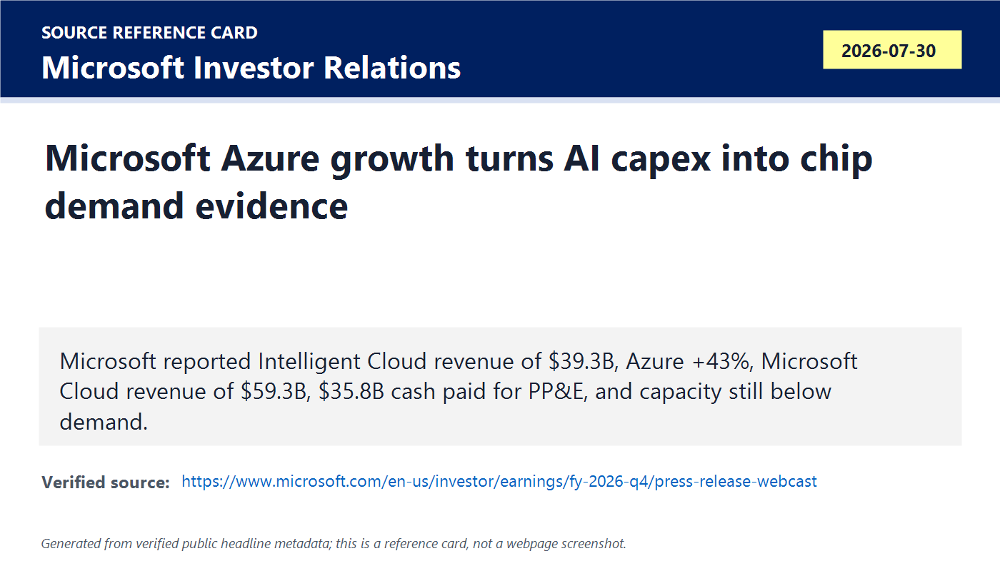
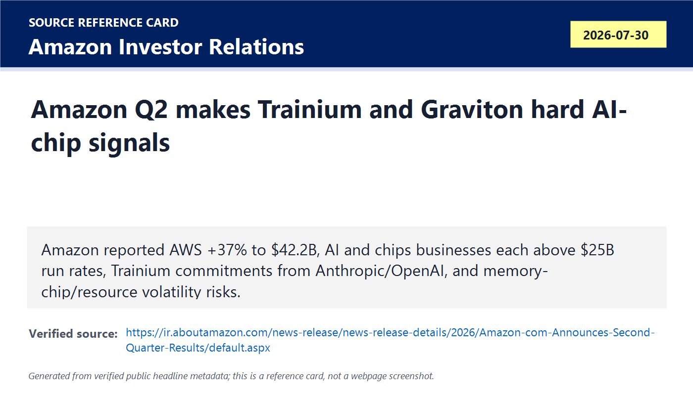
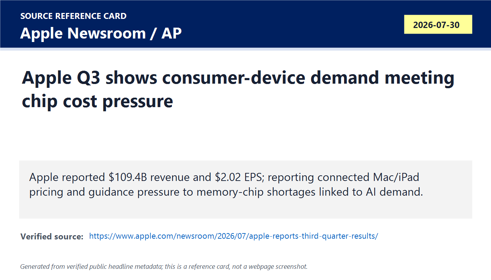
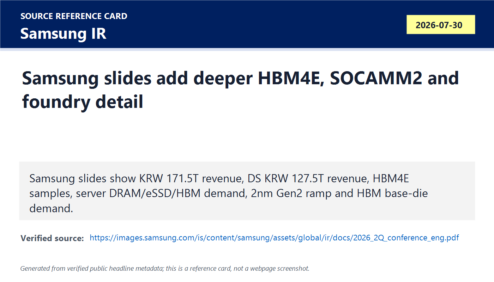
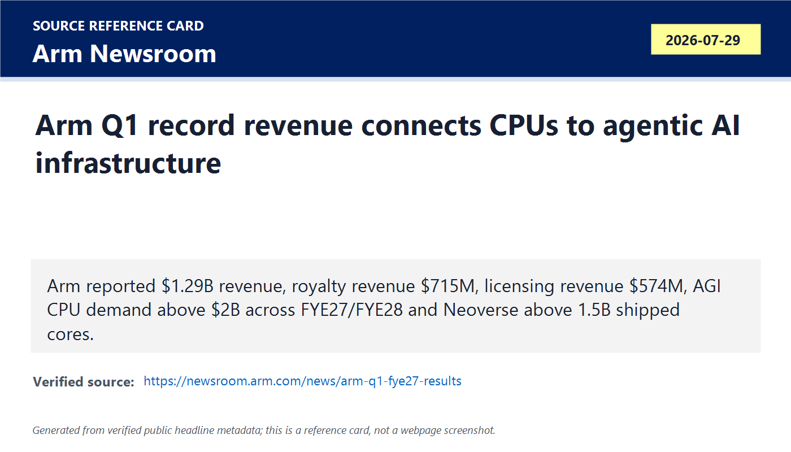
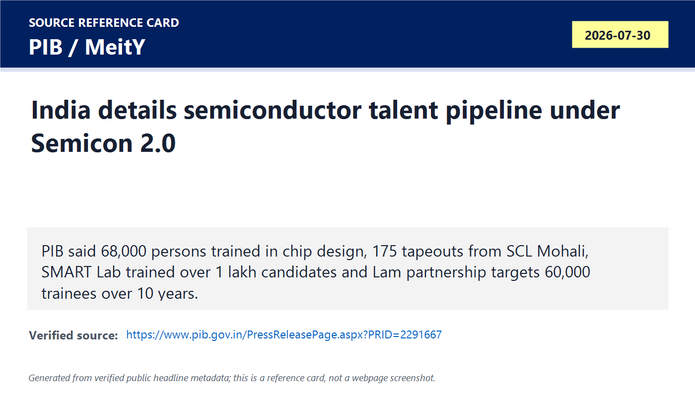
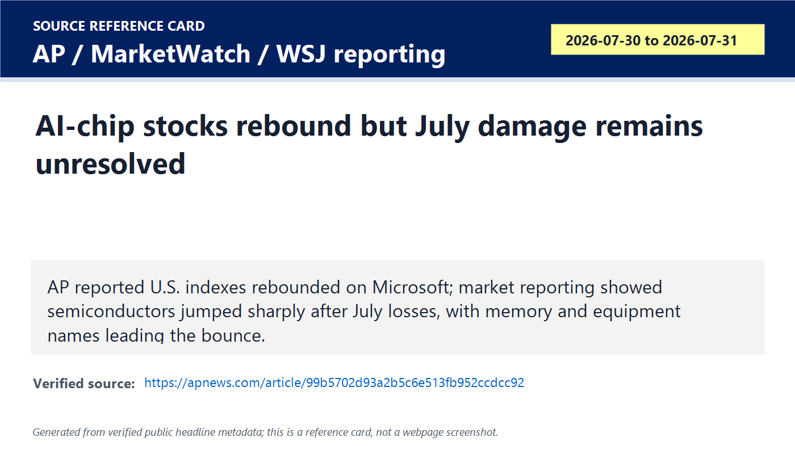
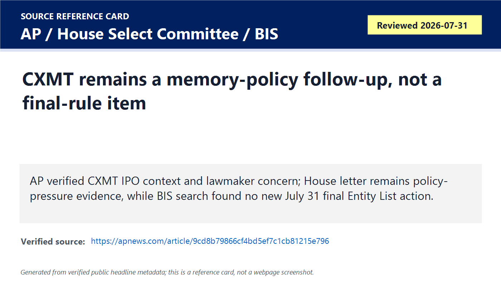

# Daily Semiconductor Current Affairs

Date: 2026-07-31

Research window: Friday update through approximately 14:45 IST on July 31, 2026. Exact-date semiconductor company releases were limited before the India-time cutoff, so this note uses today plus the nearest last-24-to-72-hour window. The main theme is demand-chain verification: Microsoft, Amazon and Apple show why AI capex and memory constraints matter to semiconductor suppliers; Samsung and Arm provide deeper follow-up evidence; India has a new official talent-pipeline release; CXMT policy remains open.

## Quick Index

| Date | Major Topic | Source Groups | Why To Read |
|---|---|---|---|
| 2026-07-31 | Microsoft turns AI cloud into capacity evidence | Microsoft, AP | Shows customer demand exceeding available cloud capacity, which maps directly to GPUs, CPUs, HBM, networking, storage and data-center hardware. |
| 2026-07-31 | Amazon makes custom AI chips measurable | Amazon | Confirms AWS growth, Trainium commitments, Graviton5 adoption and memory-chip/resource volatility inside cloud capex. |
| 2026-07-31 | Apple shows consumer-device exposure to memory pressure | Apple, AP, WSJ reporting | Explains how AI memory shortage can raise costs for phone, Mac and iPad supply chains. |
| 2026-07-31 | Samsung IR slides deepen the July 30 memory/foundry result | Samsung IR | Adds HBM4E, SOCAMM2, server DRAM, eSSD, base die and 2nm Gen2 detail beyond the headline earnings release. |
| 2026-07-31 | Arm gives official AI-infrastructure CPU/IP evidence | Arm | Connects royalties, licensing, Neoverse, Arm AGI CPU and hyperscaler adoption to AI infrastructure. |
| 2026-07-31 | India publishes semiconductor talent-pipeline evidence | PIB, ISM, SEMICON India | Moves India discussion from policy slogans to trained engineers, tapeouts, labs, Lam partnership and curriculum. |
| 2026-07-31 | Chip stocks rebound, but policy risk stays open | AP, MarketWatch/WSJ reporting, House Select Committee, BIS | Separates market bounce from unresolved CXMT/YMTC export-control and sourcing risk. |

**Page navigation:** [Sources](#source-map) · [Concept review](#concept-review) · [Follow-up](#what-to-watch-next) · [Technical terms](#technical-terms-used-today) · [Master glossary](../knowledge-base/glossary.md)

## Source Images And Manifest

Source manifest: [../images/2026-07-31/links.md](../images/2026-07-31/links.md)

The following are generated source-reference cards based on verified public headline/date/source metadata. They are not webpage screenshots and do not reproduce article bodies.

## Source Map

| Source | Source date | Role | Confidence / limitation |
|---|---:|---|---|
| [Microsoft FY26 Q4 press release](https://www.microsoft.com/en-us/investor/earnings/fy-2026-q4/press-release-webcast) and [earnings call transcript](https://www.microsoft.com/en-us/investor/events/fy-2026/earnings-fy-2026-q4) | 2026-07-30 / reviewed 2026-07-31 | Primary hyperscaler demand, Azure, Microsoft Cloud, RPO, capex and capacity-constraint source | Strong company source. It proves customer/cloud demand and capex, not direct supplier allocation by NVIDIA, AMD, memory vendors or foundries. |
| [Amazon Q2 2026 results](https://ir.aboutamazon.com/news-release/news-release-details/2026/Amazon-com-Announces-Second-Quarter-Results/default.aspx) | 2026-07-30 | Primary AWS, Trainium, Graviton5, AI/chips run-rate, capex/free-cash-flow and memory-chip risk source | Strong company source. Trainium customer commitments are Amazon's disclosure; independent deployment scale needs customer-side confirmation. |
| [Apple Q3 2026 results](https://www.apple.com/newsroom/2026/07/apple-reports-third-quarter-results/) and [AP Apple earnings report](https://apnews.com/article/94102918cb3592ebc1d2a38c4d7d819a) | 2026-07-30 / reviewed 2026-07-31 | Primary consumer-device earnings source plus reputable memory-cost/supply-chain context | Apple confirms revenue/EPS/gross margin. Memory-shortage impact is supported by reputable reporting and should be treated as supply-chain interpretation unless Apple transcript details are reviewed. |
| [Samsung Q2 2026 earnings-call PDF](https://images.samsung.com/is/content/samsung/assets/global/ir/docs/2026_2Q_conference_eng.pdf) and [Samsung result release](https://news.samsung.com/global/samsung-electronics-announces-second-quarter-2026-results) | 2026-07-30 | Primary memory/foundry detail source for HBM4E, SOCAMM2, eSSD, HBM base die and 2nm Gen2 | Strong company source. Outlook language remains forward-looking. |
| [Arm Q1 FYE27 newsroom note](https://newsroom.arm.com/news/arm-q1-fye27-results) and [Arm investor results page](https://investors.arm.com/financials/quarterly-annual-results/) | 2026-07-29 / reviewed 2026-07-31 | Primary AI-infrastructure IP/CPU, royalty, licensing, AGI CPU, Neoverse and hyperscaler adoption source | Strong company source. Demand pipeline and future manufacturing capacity are forward-looking until shipped and recognized. |
| [PIB semiconductor talent pipeline release](https://www.pib.gov.in/PressReleasePage.aspx?PRID=2291667) | 2026-07-30 | Primary India talent, C2S, tapeout, SMART Lab, Lam training partnership, NAMTECH/IBM/Purdue/ASU and Semicon 2.0 source | Strong government source. It measures training and ecosystem readiness, not production yield or commercial chip shipments. |
| [ISM SEMICON India 2026](https://ism.gov.in/semicon-india-2026) and [SEMICON India home](https://www.semiconindia.org/) | Reviewed 2026-07-31 | India ecosystem event follow-up | Strong event source. Program/exhibitor details remain pending where the site says coming soon. |
| [AP market report](https://apnews.com/article/99b5702d93a2b5c6e513fb952ccdcc92), [AP index summary](https://apnews.com/article/212b44c316056c9de10f90db562f3aed), [MarketWatch chip rebound report](https://www.marketwatch.com/story/micron-sandisk-and-other-chip-stocks-get-major-boosts-in-the-wake-of-microsofts-earnings-25460e61), and [WSJ market coverage](https://www.wsj.com/finance/stocks/u-s-stock-futures-steady-amid-inflation-fears-c66f314a) | 2026-07-30 to 2026-07-31 | Reputable market-moving context for AI/chip-stock rebound | Market data can move intraday. Use as sentiment and price-action evidence, not technology proof. |
| [AP on CXMT IPO](https://apnews.com/article/9cd8b79866cf4bd5ef7c1cb81215e796), [House Select Committee memory-chip letter](https://chinaselectcommittee.house.gov/media/letters/moolenaar-whitesides-to-secretary-lutnick-hold-firm-on-chinese-memory-chips-ban), and [BIS news/entity-list pages](https://www.bis.gov/news-updates) | Reviewed 2026-07-31 | Policy/export-control follow-up for CXMT/YMTC memory sourcing risk | Strong for public pressure and BIS-source check. No new July 31 final BIS action was verified before cutoff. |

## Technical Terms / Deep Definitions

Term: AI infrastructure capex
Definition: AI infrastructure capex is capital spending on long-lived assets needed to run AI workloads, including data centers, GPUs, custom accelerators, CPUs, HBM, storage, networking, power systems, cooling, land, buildings and grid connections. It solves the future-capacity problem: cloud providers must build physical capacity before they can sell more AI services. In today's Microsoft, Amazon and Apple-linked news, AI infrastructure capex matters because it converts software AI demand into semiconductor demand for chips, memory, equipment, substrates and power delivery. Example: a new AI feature is software, but serving it at scale requires racks full of hardware. Source: https://www.microsoft.com/en-us/investor/events/fy-2026/earnings-fy-2026-q4

Term: Azure
Definition: Azure is Microsoft's cloud platform for compute, storage, databases, networking, AI services and enterprise workloads. It solves the infrastructure-outsourcing problem: customers can rent scalable compute instead of building all data centers themselves. In today's news, Azure matters because Microsoft reported Azure and other cloud services revenue growth of 43%, and said customer demand continues to exceed available capacity. Comparison: Azure is the factory floor where many customers run workloads; semiconductors are the machines inside that factory. Source: https://www.microsoft.com/en-us/investor/earnings/fy-2026-q4/press-release-webcast

Term: Capacity constraint
Definition: A capacity constraint means demand is higher than the amount of usable supply available, whether the bottleneck is chips, memory, data-center space, power, cooling, network gear, tools or qualified labor. It solves the research question of why revenue may be limited even when customers want to buy more. In today's Microsoft result, capacity constraint matters because Azure growth was strong and management still said demand exceeds available capacity. Example: a restaurant may have customers waiting outside, but revenue is capped by seats, chefs and kitchen equipment. Source: https://www.microsoft.com/en-us/investor/events/fy-2026/earnings-fy-2026-q4

Term: Commercial remaining performance obligation (RPO)
Definition: Commercial RPO is contracted business that Microsoft has not yet recognized as revenue, including commitments expected to be recognized over future periods. It solves the visibility problem: revenue tells what already happened, while RPO gives evidence of future demand already under contract. In today's Microsoft call, RPO matters because commercial RPO grew 84% to $678 billion, indicating large future cloud/software commitments. Comparison: revenue is food already served; RPO is booked orders still waiting to be cooked and delivered. Source: https://www.microsoft.com/en-us/investor/events/fy-2026/earnings-fy-2026-q4

Term: Property, plant and equipment (PP&E)
Definition: PP&E is the accounting category for long-lived physical assets such as buildings, data centers, servers, networking equipment, power systems, fab tools and facilities. It solves the accounting problem of separating current expenses from durable assets that support operations for years. In today's Microsoft and Amazon results, PP&E matters because large cash spending on physical infrastructure is what turns AI demand into hardware demand. Example: paying engineers is operating expense; building a data center and buying AI servers is PP&E. Source: https://www.microsoft.com/en-us/investor/events/fy-2026/earnings-fy-2026-q4

Term: AWS
Definition: AWS, or Amazon Web Services, is Amazon's cloud-computing business that sells compute, storage, databases, AI/ML platforms, networking and enterprise infrastructure services. It solves the scale problem for customers that need on-demand infrastructure without owning the entire physical stack. In today's Amazon result, AWS matters because sales grew 37% year over year to $42.2 billion, making cloud growth a direct signal for AI server and chip demand. Comparison: AWS is a public utility for compute; chips are the generators inside the utility plant. Source: https://ir.aboutamazon.com/news-release/news-release-details/2026/Amazon-com-Announces-Second-Quarter-Results/default.aspx

Term: Trainium
Definition: Trainium is Amazon's custom AI accelerator family built for training and running large AI models inside AWS. It solves a cloud-economics problem: relying only on third-party GPUs can be expensive and supply-constrained, so a hyperscaler designs its own accelerator to control cost, performance, availability and software integration. In today's Amazon result, Trainium matters because Amazon said major AI labs including Anthropic and OpenAI made multi-year, multi-gigawatt commitments involving Trainium. Comparison: buying GPUs is renting a standard engine; Trainium is Amazon designing an engine for its own cloud fleet. Source: https://ir.aboutamazon.com/news-release/news-release-details/2026/Amazon-com-Announces-Second-Quarter-Results/default.aspx

Term: Graviton5
Definition: Graviton5 is Amazon's Arm-based custom server CPU generation for EC2 cloud instances. It solves the CPU cost/performance and energy-efficiency problem in hyperscale cloud: many workloads need efficient general compute around AI accelerators, databases, web services and microservices. In today's Amazon result, Graviton5 matters because Amazon said it reached general availability and provides up to 25% better compute performance than Graviton4, while Graviton is used by 98% of the top 1,000 EC2 customers. Example: an AI accelerator does matrix math; a Graviton CPU coordinates services, data movement and general-purpose work around it. Source: https://ir.aboutamazon.com/news-release/news-release-details/2026/Amazon-com-Announces-Second-Quarter-Results/default.aspx

Term: Custom silicon
Definition: Custom silicon is a chip designed for a specific company, platform or workload rather than a generic merchant chip sold broadly to every customer. It solves the optimization problem: hyperscalers can tune compute, memory, networking, security and software integration for their own fleets. In today's Amazon and Arm items, custom silicon matters because AWS Trainium, Graviton and Microsoft/Azure Cobalt-style platforms show cloud companies pulling more chip design control inside. Comparison: a merchant chip is a mass-market tool; custom silicon is a tool built for one factory's workflow. Source: https://newsroom.arm.com/news/arm-q1-fye27-results

Term: Free cash flow outflow
Definition: Free cash flow outflow means a company spent more cash on operations and capital investment than it generated after accounting for those items, producing negative free cash flow. It solves the cash-quality question: high revenue and profit can still coexist with heavy infrastructure spending. In today's Amazon result, free cash flow matters because Amazon reported a trailing-twelve-month outflow of $7.6 billion, driven primarily by a $66.1 billion year-over-year increase in purchases of property and equipment net of proceeds and incentives. Example: a business can be growing fast while cash is consumed by building the next factory. Source: https://ir.aboutamazon.com/news-release/news-release-details/2026/Amazon-com-Announces-Second-Quarter-Results/default.aspx

Term: Memory-chip supply volatility
Definition: Memory-chip supply volatility means memory availability and pricing can change sharply because demand, wafer capacity, advanced packaging, product mix and inventory all move unevenly. It solves the margin-risk question: downstream companies can be hurt by memory shortages even if they are not memory suppliers. In today's Amazon and Apple-linked news, memory-chip volatility matters because Amazon listed memory chips among resource/supply risks and AP reported Apple pricing pressure tied to memory-chip shortage. Comparison: a carmaker can be hurt by tire shortages even if it does not make tires. Source: https://ir.aboutamazon.com/news-release/news-release-details/2026/Amazon-com-Announces-Second-Quarter-Results/default.aspx

Term: Component cost pressure
Definition: Component cost pressure is the squeeze created when parts such as memory, processors, displays, substrates, batteries, packaging or test services become more expensive or scarce. It solves the profit-margin question in hardware: a company can sell more units but earn less per unit if input costs rise. In today's Apple and Samsung device-side news, component cost pressure matters because AI-driven memory demand is raising costs that can affect phones, Macs, tablets and consumer electronics. Example: if DRAM becomes expensive, a laptop vendor may raise prices even when the CPU has not changed. Source: https://apnews.com/article/94102918cb3592ebc1d2a38c4d7d819a

Term: SOCAMM2
Definition: SOCAMM2 is a Samsung memory module/product family named in its Q2 2026 materials as a high-value-added product alongside HBM4 and DDR5 for AI/server-oriented demand. It solves a memory-form-factor problem: different AI and server architectures need memory not only as commodity DIMMs but as modules optimized for density, bandwidth, power and board integration. In today's Samsung slides, SOCAMM2 matters because it shows memory suppliers are differentiating products by platform needs, not only selling generic bits. Comparison: DDR5 RDIMM is a standard server memory path; specialized modules like SOCAMM2 target more specific system integration needs. Source: https://images.samsung.com/is/content/samsung/assets/global/ir/docs/2026_2Q_conference_eng.pdf

Term: UFS 5.0
Definition: UFS 5.0 is a newer Universal Flash Storage generation for high-performance embedded flash storage in mobile and edge devices. It solves the local-storage bandwidth and latency problem: phones, tablets, AI PCs and edge devices need fast non-volatile storage for apps, local AI models, media and system data. In today's Samsung materials, UFS 5.0 matters because Samsung tied it to first-half market penetration, showing that AI-era storage demand is not limited to data-center SSDs. Comparison: eSSD serves servers; UFS serves embedded devices that still need fast storage. Source: https://images.samsung.com/is/content/samsung/assets/global/ir/docs/2026_2Q_conference_eng.pdf

Term: Arm Compute Subsystems (CSS)
Definition: Arm CSS is a package of pre-integrated Arm IP, subsystem design and implementation support that helps chip teams build processors or SoCs faster than assembling every block manually. It solves the time-to-market and integration-risk problem in advanced chip design. In today's Arm result, CSS matters because Arm linked revenue growth and AI infrastructure adoption to higher-value IP such as Armv9 and Compute Subsystems. Example: buying a CPU core is like buying an engine; CSS is closer to buying the engine plus transmission and integration kit. Source: https://newsroom.arm.com/news/arm-q1-fye27-results

Term: Armv9 architecture
Definition: Armv9 is a generation of Arm instruction-set architecture and platform features for modern computing, including performance, security and AI-capable workloads across mobile, cloud and edge devices. It solves the common-platform problem: many chip vendors can build compatible processors while differentiating implementation. In today's Arm result, Armv9 matters because Arm said adoption of technologies with higher royalty rates, such as Armv9 and CSS, supported revenue growth. Comparison: Armv9 is the rulebook; each customer still designs or chooses a processor implementation. Source: https://newsroom.arm.com/news/arm-q1-fye27-results

Term: Neoverse
Definition: Neoverse is Arm's infrastructure CPU platform family for cloud, data-center, networking and high-performance infrastructure workloads. It solves the server CPU efficiency and scalability problem for hyperscale systems. In today's Arm result, Neoverse matters because Arm said Neoverse shipments surpassed 1.5 billion cores and serve as the foundation for Arm AGI CPU and other AI infrastructure platforms. Example: a smartphone Arm core is tuned for mobile battery life; Neoverse is tuned for servers, clouds and data centers. Source: https://newsroom.arm.com/news/arm-q1-fye27-results

Term: Chips to Startup (C2S)
Definition: C2S is India's program to provide chip-design tool access, training and project support so students, researchers and startups can gain practical semiconductor design experience. It solves the talent-entry problem: advanced EDA tools are expensive, and without access engineers cannot learn real design flows. In today's PIB release, C2S matters because tool usage exceeded 240 lakh hours, about 68,000 persons were trained and 175 designs were taped out from SCL Mohali. Example: a theory course teaches logic gates; C2S gives access to the tools needed to create a tapeout-ready design. Source: https://www.pib.gov.in/PressReleasePage.aspx?PRID=2291667

Term: Tapeout
Definition: Tapeout is the point where a chip design is finalized and sent to a semiconductor fab or shuttle program for manufacturing. It solves the transition problem between design and silicon: a design must pass verification, physical checks, signoff and data preparation before fabrication. In today's India talent release, tapeout matters because PIB said 175 designs were taped out from SCL Mohali under talent-development efforts, which is stronger evidence than classroom training alone. Comparison: writing RTL is drafting a plan; tapeout is submitting the final manufacturing file. Source: https://www.pib.gov.in/PressReleasePage.aspx?PRID=2291667

Term: SMART Lab
Definition: SMART Lab stands for Skilled Manpower Advanced Research and Training Lab, a training setup mentioned by PIB at NIELIT Calicut for VLSI, embedded systems and IoT. It solves the hands-on-skilling problem: semiconductor manufacturing and design need practical labs, tools, measurements and project exposure, not only lectures. In today's India item, SMART Lab matters because PIB says it has already trained more than 1 lakh candidates. Example: an online lecture can explain layout; a lab can teach tool flow, boards, test setups and debugging behavior. Source: https://www.pib.gov.in/PressReleasePage.aspx?PRID=2291667

Term: Nanofabrication
Definition: Nanofabrication is the set of manufacturing methods used to build structures at nanometer scale, including thin-film deposition, lithography, etching, cleaning, implantation, metrology and process control. It solves the physical-construction problem in semiconductors: modern devices depend on precisely shaped features far smaller than a human hair. In today's India release, nanofabrication matters because ISM's partnership with Lam Research targets process-engineering skills for ATMP and advanced packaging. Comparison: mechanical machining cuts visible parts; nanofabrication shapes materials at transistor and interconnect scale. Source: https://www.pib.gov.in/PressReleasePage.aspx?PRID=2291667

Term: Process engineering
Definition: Process engineering is the discipline of developing, controlling and improving manufacturing steps such as deposition, etch, clean, lithography, bonding, packaging and test. It solves the repeatability problem: a semiconductor process must produce the same high-quality result across many wafers, lots and tools. In today's India item, process-engineering skills matter because fabs and packaging lines fail without engineers who understand recipes, variation, yield and root cause. Example: a design engineer asks what the chip should do; a process engineer makes sure the manufacturing step can produce it repeatedly. Source: https://www.pib.gov.in/PressReleasePage.aspx?PRID=2291667

Term: Chip-stock rebound
Definition: A chip-stock rebound is a sharp recovery in semiconductor share prices after a selloff. It solves a market-sentiment measurement problem: investors may quickly reprice expectations when new earnings or capex signals change confidence. In today's market item, the rebound matters because AP and market reporting showed Microsoft-led optimism and semiconductor gains after several difficult July sessions. This is not technology proof; it is evidence of investor expectations changing. Example: a stock can rebound because cloud demand looks better even before any new wafer ships. Source: https://apnews.com/article/99b5702d93a2b5c6e513fb952ccdcc92

Term: Final BIS action
Definition: Final BIS action means an official, binding Bureau of Industry and Security rule, license policy, Entity List action or regulatory update, not just a letter, bill proposal or media report. It solves the policy-verification problem: semiconductor sourcing decisions should not treat political pressure as already enforceable law. In today's CXMT follow-up, final BIS action matters because lawmaker pressure remains clear but no new July 31 BIS rule or Entity List action was verified before cutoff. Example: a congressional letter is a warning signal; a published BIS rule changes legal obligations. Source: https://www.bis.gov/news-updates

## 1. Microsoft: Azure Capacity Is Now Hard Semiconductor Demand Evidence

### Confirmed Facts

Microsoft reported Q4 FY2026 Intelligent Cloud revenue of $39.3 billion, up 32%, and Azure plus other cloud services revenue growth of 43%. Microsoft Cloud revenue was $59.3 billion, up 27%, and full-year cloud revenue surpassed $214 billion. The call transcript said customer demand continues to exceed available Azure capacity.

Microsoft also reported total finance leases of $5.6 billion, primarily for large data-center sites, and cash paid for property, plant and equipment of $35.8 billion in the quarter. Free cash flow was $19.6 billion, reflecting higher capital expenditures. Commercial RPO grew 84% to $678 billion, with all sequential commercial RPO growth driven by commitments from customers outside frontier-model companies.

### Analysis

This is the cleanest demand-side semiconductor signal today. Microsoft is not a memory vendor or foundry, but when it says Azure demand exceeds capacity and it is spending heavily on data-center PP&E, that demand flows upstream into accelerators, CPUs, HBM, DRAM, SSDs, networking ASICs, optical modules, power delivery, cooling and rack infrastructure.

The phrase "outside frontier-model companies" matters. It means demand is not only OpenAI-style AI labs. Enterprises, governments and general cloud customers are also creating future obligations. That supports a broader AI-infrastructure thesis.

The caution is that capex is not the same as chip shipment. Data-center projects face power, land, cooling, permitting, networking, supply and deployment timing. But the contracted demand plus capacity shortage combination is strong evidence that chip demand is still real.

### Why It Matters

Yesterday's semiconductor note showed Samsung and Lam benefiting from AI. Today Microsoft explains why: hyperscaler demand is still outpacing available infrastructure. This supports the memory/WFE cycle but also raises the execution burden on NVIDIA, AMD, Broadcom, Intel, TSMC, Samsung, SK hynix, Micron, suppliers and OSATs.

### India Angle

India can learn two things. First, data centers and AI cloud need hardware supply-chain depth, not only software talent. Second, India can participate through power infrastructure, data-center operations, chip design services, networking, firmware, verification, thermal engineering and system integration even before it owns leading-edge fabs.

### VLSI / Career Relevance

For VLSI students, Microsoft maps to CPU/GPU/HBM system architecture, PCIe/CXL, high-speed networking, rack power, thermal design, system reliability, data-center workload scheduling and accelerator utilization. A chip can be excellent and still fail commercially if cloud deployment is bottlenecked by power, cooling or capacity timing.

## 2. Amazon: AWS Turns Trainium, Graviton And Memory Risk Into Concrete Signals

### Confirmed Facts

Amazon reported Q2 2026 net sales of $200.6 billion, up 20% year over year. AWS sales rose 37% year over year to $42.2 billion, which Amazon called its fastest AWS growth in 18 quarters. AWS operating income was $16.6 billion.

Amazon said its AI and chips businesses each exceeded annual revenue run rates of more than $25 billion. It said Trainium continued gaining momentum, with Anthropic and OpenAI making multi-year, multi-gigawatt commitments, and other AI startups adopting Trainium. Amazon also said Graviton5 reached general availability, delivers up to 25% better compute performance than Graviton4, and Graviton is used by 98% of the top 1,000 EC2 customers.

Amazon's trailing-twelve-month free cash flow decreased to an outflow of $7.6 billion, driven primarily by a year-over-year increase of $66.1 billion in purchases of property and equipment net of proceeds and incentives. Amazon also listed resource and supply volatility, including memory chips, among risk factors in guidance.

### Analysis

Amazon is important because it shows the custom-silicon path. AWS still buys merchant chips, but Trainium and Graviton show how a hyperscaler can internalize more silicon control. This changes the semiconductor industry structure: cloud customers are no longer only buyers; they are also chip platform designers, software-stack owners and capacity allocators.

Trainium commitments from Anthropic and OpenAI are especially important because they suggest custom accelerators can win workloads if the price/performance/software stack is good enough. That does not eliminate NVIDIA or AMD. It means the AI hardware market is becoming more segmented: some workloads run on GPUs, some on custom accelerators, and many need Arm-based CPUs around them.

The free-cash-flow outflow is the cost of this strategy. Amazon is spending heavily before all future capacity is monetized. For semiconductors, that is positive demand, but for investors it raises ROI timing questions.

### Why It Matters

Amazon gives direct evidence for AI accelerators, server CPUs, memory, networking and storage demand. The memory-chip risk language matters because it links the memory supercycle to hyperscaler spending and cost volatility.

### India Angle

India's chip design ecosystem should study Trainium and Graviton as examples of vertical integration. The practical skill set is not only RTL; it includes compiler/runtime work, verification at scale, workload profiling, HBM/DDR controller integration, security, firmware and cloud deployment.

### VLSI / Career Relevance

Learn accelerator architecture, systolic arrays, HBM/DDR memory hierarchy, Arm server CPUs, network-on-chip, PCIe/CXL, compiler mapping, performance counters and power/performance tradeoffs. Hyperscaler chips are systems, not isolated datapaths.

## 3. Apple: Consumer Devices Are Feeling The Same Memory Cycle

### Confirmed Facts

Apple reported fiscal Q3 2026 revenue of $109.4 billion, up 16% year over year. Gross margin was 50.1%, including about 2 percentage points from tariff refunds. Diluted EPS was $2.02, up 29% year over year, with a $0.11 favorable impact from tariff refunds. Apple said it had its strongest June quarter ever, with double-digit growth across iPhone, Mac and Services and across every geographic segment.

AP reported that strong iPhone and Mac sales drove results past expectations and that Apple had raised prices on Macs and iPads due to a memory-chip shortage tied to AI-sector demand. AP also reported shares fell after hours despite the strong result.

### Analysis

Apple is a downstream mirror of the AI memory cycle. Samsung and SK hynix benefit from high-value memory demand. Apple, Qualcomm and other device/platform companies can face higher input costs. The same shortage can be good news for memory suppliers and bad news for device margins.

This is why the semiconductor cycle must be studied by position in the value chain. A record memory result does not mean every semiconductor-adjacent company benefits equally. The device maker has to decide whether to absorb costs, raise prices, change configurations, delay products or redesign supply.

### Why It Matters

AI data centers are now influencing consumer hardware economics. If AI demand consumes DRAM, HBM, advanced packaging and leading-edge capacity, phones, Macs, iPads and PCs may face shortages or cost increases.

### India Angle

India is an Apple manufacturing and electronics export hub. Memory price pressure can affect bill of materials, local assembly economics, product pricing and inventory planning. India's deeper opportunity is to move beyond assembly into components, testing, design services, repair/refurbishment, supply-chain analytics and eventually packaging/test.

### VLSI / Career Relevance

For students, this item connects semiconductor memory pricing to product engineering. Study DRAM, NAND/UFS, memory controller behavior, storage hierarchy, SoC integration, thermal limits, board design and supply-chain qualification. Hardware engineering decisions are constrained by market availability, not only ideal architecture.

## 4. Samsung Follow-Up: The Slides Add The Details Yesterday Needed

### Confirmed Facts

Samsung's Q2 earnings-call PDF shows revenue of KRW 171.5 trillion, operating profit of KRW 89.5 trillion, R&D investment of KRW 16.0 trillion and operating margin of 52.2%. Device Solutions reported KRW 127.5 trillion sales and KRW 89.2 trillion operating profit. Samsung said it achieved all-time-high bit sales for both DRAM and NAND and record-breaking memory earnings by addressing AI server demand.

The memory slide says Samsung plans to focus on high-value-added products such as HBM4, DDR5 and SOCAMM2, and said HBM4E sample shipment and Gen6/UFS 5.0 market penetration occurred in H1. For H2, Samsung expects server-centered demand backed by AI infrastructure capex, with server DRAM, enterprise SSD and HBM demand expected to keep the market undersupplied despite partial demand moderation in mobile and PC.

The S.LSI/foundry slide says foundry revenue growth was driven by HBM base-die demand and strong U.S. customer orders, with major-customer design wins including 2nm HPC engagements. Samsung also expects 2nm Gen2 mobile ramp-up, 4nm LPU ramp and base-die sales expansion.

### Analysis

This closes one part of yesterday's follow-up: the official slides give technical granularity. HBM4E, SOCAMM2, eSSD, UFS 5.0, HBM base die and 2nm Gen2 show that Samsung's AI result is not just "memory prices went up." It is a product-mix and system-integration story.

The base-die point is still underappreciated. HBM pulls logic/foundry work because stacked memory needs interface silicon. That means memory demand can support foundry revenue even when the end product is an AI memory stack.

### Why It Matters

Samsung's slides connect the full value chain: memory products, foundry, system LSI, mobile components and consumer-device cost pressure. The industry is not moving in separate lanes; AI server demand is pulling memory and foundry while mobile/PC customers feel cost pressure.

### India Angle

India's Semicon 2.0 pillars align with this complexity. Talent must cover memory systems, foundry process awareness, packaging/test, EDA, equipment and embedded storage. If Indian education trains only generic digital design, it misses the integration problem.

### VLSI / Career Relevance

Revise HBM architecture, DDR5, NAND/eSSD, UFS, base die, PHY, memory controller verification, advanced-node PDKs, timing closure, package parasitics and DFT. These are now current-affairs concepts, not only textbook topics.

## 5. Arm: CPUs And IP Are Part Of The AI Infrastructure Story

### Confirmed Facts

Arm reported Q1 FYE27 total revenue of $1.29 billion, up 22% year over year. Royalty revenue was $715 million, up 22%, and licensing revenue was $574 million, up 23%. Non-GAAP operating income was $531 million with a 41.2% margin; GAAP operating income was $91 million with a 7.1% margin.

Arm said data-center royalties more than doubled year over year. It said customer demand for Arm AGI CPU now exceeds $2 billion across FYE27 and FYE28, initial product has been delivered to multiple customers, and manufacturing capacity required for the previously outlined $1 billion opportunity has been secured. Arm also said Neoverse shipments surpassed 1.5 billion cores, with the most recent 500 million shipments in the past nine months.

Arm listed recent AI infrastructure milestones involving NVIDIA Vera, Google Axion, AWS Graviton5, Microsoft Azure Cobalt 200 and Qualcomm Dragonfly C1000.

### Analysis

Arm is the CPU/IP layer of the AI stack. GPUs and HBM get the most attention, but agentic AI systems still need CPUs to coordinate retrieval, tools, scheduling, storage, networking, security and service orchestration. If CPUs are inefficient, accelerator utilization suffers.

Royalty revenue means products are shipping. Licensing revenue means future designs are being committed. Arm having both grow suggests the platform is gaining near-term and future traction.

### Why It Matters

This broadens the AI hardware view. AI infrastructure is not one chip; it is accelerators, CPUs, NICs, DPUs, memory, storage, switches and software. Arm's data-center traction means CPU architecture is still a strategic battlefield.

### India Angle

India has a realistic opportunity in IP, verification, firmware, compilers and platform software. Arm's model shows that semiconductor value can be captured without owning every fab. DLI/C2S success should be measured by reusable IP, verification depth and tapeout experience.

### VLSI / Career Relevance

Study ISA versus microarchitecture, cache coherence, AMBA-style buses, coherency protocols, low-power design, SoC integration, compiler/runtime interaction, Linux bring-up and performance profiling.

## 6. India: Talent Pipeline Evidence Gets More Concrete

### Confirmed Facts

PIB published a July 30 release saying India has adopted a multi-pronged roadmap to build a semiconductor talent pipeline across chip design, fabrication, assembly, testing, marking and packaging. It said C2S tool usage exceeded 240 lakh hours, about 68,000 persons have been trained and 175 designs taped out from SCL Mohali.

PIB also said the SMART Lab at NIELIT Calicut aims to train 1 lakh engineers in VLSI, embedded systems and IoT, and that more than 1 lakh candidates have already been trained. For manufacturing skilling, MeitY approved a semiconductor assembly and ESD training laboratory at NIELIT Guwahati for ATMP training, especially relevant to North Eastern Region manufacturing initiatives.

PIB said ISM has partnered with Lam Research for a large-scale nanofabrication and process-engineering training program targeting 60,000 trained manpower over 10 years. It also listed industry/academic partnerships: NAMTECH for about 5,000 professionals over five years, IBM for a semiconductor research center in India, Purdue University and Arizona State University for workforce and R&D collaboration. It reiterated that Semicon 2.0 was approved on July 15, 2026 with an outlay of Rs 1.275 lakh crore and dedicated pillars for R&D and talent development.

### Analysis

This is the best India source today. It does not prove fab yield or commercial chip output. But it does give measurable talent signals: tool hours, trained people, tapeouts, labs and industry partnerships.

The tapeout count matters more than generic "engineers trained." A tapeout means a team went through a real design-to-manufacturing handoff. Even shuttle-scale or academic tapeouts build practical knowledge of EDA flows, signoff, PDKs, DRC/LVS, packaging assumptions and documentation.

The Lam partnership is strategically important because India needs process and equipment talent, not only chip designers. Fabs and OSATs depend on process engineers, tool service, recipe control, contamination discipline and yield learning.

### Why It Matters

India's semiconductor story is moving from policy announcement toward skill-system construction. That still does not equal manufacturing leadership, but it is a necessary layer. Without trained process, packaging, test and design engineers, government incentives cannot become reliable output.

### VLSI / Career Relevance

For Indian students, the signal is direct: build project evidence. Learn EDA tools, complete tapeout-style flows where possible, understand ATMP/OSAT, practice DFT/ATE basics, learn process vocabulary and document projects clearly. The hiring market will reward proof, not only certificates.

## 7. Market Reaction And CXMT Policy: Rebound Is Not Resolution

### Confirmed Facts

AP reported that U.S. indexes rebounded on Thursday, July 30: the S&P 500 rose 1.7%, the Dow rose 1.2% and the Nasdaq rose 2.8%, led by Microsoft. AP also reported that Microsoft had its best day since 2008 and that chipmakers including Micron, Lam Research and AMD rebounded after recent losses. Separate market reporting said semiconductor ETFs and memory/equipment names jumped sharply, but many chip stocks remained down heavily for July.

For CXMT, the status remains open. AP verified the July 27 IPO and DRAM context earlier this week. The House Select Committee letter remains primary evidence of U.S. lawmaker pressure on Chinese memory sourcing. A BIS source check before cutoff did not verify a new July 31 final rule, Entity List action or completed procurement ban.

### Analysis

The chip-stock rebound reflects a change in investor confidence after Microsoft and Amazon showed AI cloud strength. But a rebound is not a technical proof. It does not prove HBM supply, foundry yield, ROI on AI capex or resolution of policy risk.

The correct interpretation is narrower: investors saw enough demand evidence to buy some beaten-down semiconductor names after a harsh July selloff. The burden of proof now moves to continued cloud revenue, utilization, memory pricing discipline, capex ROI and supplier execution.

The CXMT issue is separate. Chinese DRAM supply can relieve shortages but create sourcing risk if U.S. policy tightens. Until BIS or another formal authority acts, it remains a policy-risk watch item, not a completed rule.

### Why It Matters

Semiconductors are currently priced by both fundamentals and fear. Fundamentals: cloud demand, memory shortage, WFE orders, IP revenue. Fear: capex bubble, China competition, export controls, inflation and valuation. A daily notebook must track both without mixing them.

### India Angle

India benefits only if it can convert geopolitical trust into operational competence. A trusted supply-chain label helps, but customers still need quality, yield, cost, logistics, IP protection and repeat shipments.

### VLSI / Career Relevance

Understand market signals, but do not use stock prices as engineering evidence. Use official releases for technical facts; use market reaction to understand expectations, valuation and risk appetite.

## Verification Matrix

| Prior / Today Item | Evidence Found Today | Status | Next Evidence |
|---|---|---|---|
| Samsung transcript/slides | Official Samsung earnings-call PDF available with HBM4E, SOCAMM2, server DRAM/eSSD/HBM, foundry base die and 2nm Gen2 detail | Updated | Watch final reviewed financials, full Q&A transcript, HBM4E qualification timing and 2nm yield/customer details |
| Lam transcript detail | No new official transcript detail captured beyond July 29 release before cutoff | Still pending | Watch official webcast/transcript for NAND/DRAM/foundry mix, China exposure, services and advanced packaging |
| Qualcomm Q4 pricing/actions | No new official update beyond Q3 release/presentation; market reports continue to discuss price increases and memory costs | Still pending | Watch customer acceptance of price increases and Q4 margin/guidance updates |
| Arm shareholder letter | Arm newsroom now gives clean official values and AI-infrastructure details | Updated | Watch Form 6-K/shareholder letter extraction and customer shipment recognition |
| Hyperscaler capex | Microsoft and Amazon official results show cloud growth, capex/PP&E spending, capacity constraints and custom-chip signals | Updated | Watch actual chip purchase mix, deployment timing, utilization and ROI |
| Apple memory/device pressure | Apple official result plus reputable reporting on memory-cost pressure | Updated but needs transcript | Watch Apple call transcript/10-Q for supply-constraint and component-cost wording |
| India Semicon 2.0 execution | New PIB release gives talent pipeline, tapeout and training evidence | Updated | Still need project-level manufacturing milestones: tool orders, cleanrooms, first lots, yield, customers |
| CXMT/YMTC policy | No new final BIS action verified; AP/House pressure remains current | Still pending | Watch BIS, Commerce, Entity List updates, NDAA text and procurement guidance |

## Follow-Ups From Previous Research

| Prior Follow-Up | Status Today | What Changed / Next Evidence |
|---|---|---|
| Samsung memory/foundry deeper details | Updated | Official slides add HBM4E, SOCAMM2, UFS 5.0, HBM base-die and 2nm Gen2 details. |
| Arm full results detail | Updated | Arm newsroom now provides official Q1 values and AI infrastructure details, including AGI CPU demand and Neoverse core shipments. |
| India Semicon 2.0 execution | Updated but open | New PIB talent release adds measurable skilling/tapeout evidence, but no new production/yield milestone. |
| Hyperscaler AI capex proof | Updated | Microsoft and Amazon give strong official cloud/capex/custom-chip demand signals. |
| Lam mix detail | Still pending | Release is closed; official transcript/mix detail still needed. |
| Qualcomm memory-cost pass-through | Still pending | Q3 result is closed; actual customer response to price increases remains future evidence. |
| CXMT formal policy action | Still pending | No new final BIS rule or Entity List action found. |
| China immersion DUV proof | Still pending | No primary customer-shipment, uptime, overlay, throughput, yield or qualification evidence found today. |

## Concept Review

| Concept | Simple Meaning | Why It Matters Today |
|---|---|---|
| Demand chain | End-customer cloud/device demand becomes upstream chip, memory, tool and packaging demand | Microsoft, Amazon and Apple explain why Samsung, SK hynix, Lam, Arm and OSATs matter. |
| Capacity constraint | Customers want more than suppliers can deliver | Azure demand exceeds capacity, AWS invests heavily, and memory shortages affect devices. |
| Custom silicon | Hyperscalers design chips for their own workloads | Trainium, Graviton, Cobalt, Axion and Arm AGI CPU point to cloud-custom chip architecture. |
| Memory pressure | DRAM/HBM/NAND demand raises prices and limits supply | Memory suppliers benefit; Apple/Qualcomm/device makers face input-cost pressure. |
| Tapeout as proof | A design reached manufacturing handoff | India C2S tapeouts are stronger evidence than classroom training alone. |
| Market bounce | Investors reprice expectations after new earnings | Chip-stock rebound shows sentiment changed, not that technical constraints disappeared. |
| Policy verification | Only official rules change compliance obligations | CXMT remains open until BIS/Commerce or binding law acts. |

## Simple Explanation

Today is about the customer side of semiconductors. Microsoft and Amazon are buying and building huge AI infrastructure because cloud demand is still bigger than available capacity. That demand becomes orders for accelerators, HBM, CPUs, SSDs, networking, power, cooling and tools. Amazon also shows that cloud companies are not only buyers; they are designing custom chips like Trainium and Graviton.

Apple shows the opposite side of the same cycle: when AI data centers consume memory and leading-edge supply, consumer devices can face higher component costs. Samsung's slides explain why memory suppliers are strong, while Arm shows that CPUs and IP are also critical in AI systems. India added useful talent-pipeline evidence, but production proof still requires actual manufacturing milestones.

## VLSI / Career Relevance

1. Cloud hardware: learn CPU/GPU/accelerator architecture, HBM, CXL, PCIe, data-center networking and power/thermal constraints.
2. Custom silicon: study workload profiling, compiler/runtime mapping, verification, DFT, firmware and performance counters.
3. Memory systems: revise DRAM, NAND, UFS, DDR5, HBM, eSSD and memory-controller behavior.
4. Physical implementation: connect PDK rules, STA, IR drop, electromigration, DRC/LVS and package parasitics.
5. Process/manufacturing: learn nanofabrication, process engineering, yield, contamination control and tool uptime.
6. India career path: build proof through projects, tool flows, tapeout-style work, internships, lab work and documentation.

## Interview / Discussion Questions

1. Why is Microsoft Azure capacity constraint a semiconductor demand signal?
2. How does commercial RPO differ from current revenue?
3. Why does Amazon designing Trainium not automatically remove demand for merchant GPUs?
4. What is the difference between Trainium and Graviton in the AWS hardware stack?
5. Why can AI memory demand hurt Apple while helping Samsung/SK hynix?
6. How does HBM demand create foundry demand through base dies?
7. Why are Arm royalty revenue and licensing revenue different signals?
8. Why is Neoverse relevant to AI infrastructure even though GPUs do most matrix math?
9. Why is tapeout stronger evidence than a certificate in semiconductor education?
10. What skills does process engineering require that RTL design does not?
11. Why should a chip-stock rebound not be treated as proof that supply constraints are solved?
12. What evidence would convert CXMT policy risk from "open" to "confirmed action"?

## What To Watch Next

- Microsoft: actual AI capacity additions, capex guide, Azure utilization, GPU/CPU fleet mix and supply bottlenecks.
- Amazon: Trainium deployment scale, Graviton5 adoption, memory-chip cost exposure, AWS capex and customer workloads.
- Apple: transcript/10-Q language on memory, advanced-node supply, component costs, margins and India revenue.
- Samsung: final reviewed Q2 financials, HBM4E customer qualification, 2nm Gen2 ramp and base-die demand durability.
- Arm: Form 6-K/shareholder letter details, AGI CPU shipments, Neoverse data-center royalties and customer concentration.
- India: tool installs, first lots, yield, customer qualification, and whether C2S/SMART/Lam/NAMTECH training creates job-ready output.
- Lam/Qualcomm/KLA/NXP: transcript-level details still pending from this week's earnings stack.
- CXMT/YMTC: BIS final rule, Entity List update, procurement guidance, NDAA language or allied sourcing restrictions.

## Final Takeaway

July 31 confirms that AI semiconductor demand is not only supplier hype. Microsoft and Amazon show real cloud capacity pressure and custom-chip commitments. Apple shows the same memory cycle pushing costs into consumer devices. Samsung and Arm show memory, foundry, CPU and IP layers becoming more connected. India's new PIB release is useful because it gives talent and tapeout evidence, but manufacturing proof still requires real production milestones.

## Technical Terms Used Today

[Back to quick index](#quick-index) · [Open the master A-Z glossary](../knowledge-base/glossary.md)

**Term index:** [AI infrastructure capex](#daily-term-ai-infrastructure-capex) · [Arm Compute Subsystems (CSS)](#daily-term-arm-compute-subsystems-css) · [Armv9 architecture](#daily-term-armv9-architecture) · [AWS](#daily-term-aws) · [Azure](#daily-term-azure) · [Capacity constraint](#daily-term-capacity-constraint) · [Chip-stock rebound](#daily-term-chip-stock-rebound) · [Chips to Startup (C2S)](#daily-term-chips-to-startup-c2s) · [Commercial remaining performance obligation (RPO)](#daily-term-commercial-remaining-performance-obligation-rpo) · [Component cost pressure](#daily-term-component-cost-pressure) · [Custom silicon](#daily-term-custom-silicon) · [Final BIS action](#daily-term-final-bis-action) · [Free cash flow outflow](#daily-term-free-cash-flow-outflow) · [Graviton5](#daily-term-graviton5) · [Memory-chip supply volatility](#daily-term-memory-chip-supply-volatility) · [Nanofabrication](#daily-term-nanofabrication) · [Neoverse](#daily-term-neoverse) · [Process engineering](#daily-term-process-engineering) · [Property, plant and equipment (PP&E)](#daily-term-property-plant-and-equipment-pp-and-e) · [SMART Lab](#daily-term-smart-lab) · [SOCAMM2](#daily-term-socamm2) · [Tape-out](#daily-term-tape-out) · [Trainium](#daily-term-trainium) · [UFS 5.0](#daily-term-ufs-5-0)

| Term | Meaning |
|---|---|
| [**AI infrastructure capex**](../knowledge-base/glossary.md#term-ai-infrastructure-capex) | AI infrastructure capex is capital spending on long-lived assets needed to run AI workloads, including data centers, GPUs, custom accelerators, CPUs, HBM, storage, networking, power systems, cooling, land, buildings and grid connections. It solves the future-capacity problem: cloud providers must build physical capacity before they can sell more AI services. |
| [**Arm Compute Subsystems (CSS)**](../knowledge-base/glossary.md#term-arm-compute-subsystems-css) | Arm CSS is a package of pre-integrated Arm IP, subsystem design and implementation support that helps chip teams build processors or SoCs faster than assembling every block manually. It solves the time-to-market and integration-risk problem in advanced chip design. |
| [**Armv9 architecture**](../knowledge-base/glossary.md#term-armv9-architecture) | Armv9 is a generation of Arm instruction-set architecture and platform features for modern computing, including performance, security and AI-capable workloads across mobile, cloud and edge devices. It solves the common-platform problem: many chip vendors can build compatible processors while differentiating implementation. |
| [**AWS**](../knowledge-base/glossary.md#term-aws) | AWS, or Amazon Web Services, is Amazon's cloud-computing business that sells compute, storage, databases, AI/ML platforms, networking and enterprise infrastructure services. It solves the scale problem for customers that need on-demand infrastructure without owning the entire physical stack. |
| [**Azure**](../knowledge-base/glossary.md#term-azure) | Azure is Microsoft's cloud platform for compute, storage, databases, networking, AI services and enterprise workloads. It solves the infrastructure-outsourcing problem: customers can rent scalable compute instead of building all data centers themselves. |
| [**Capacity constraint**](../knowledge-base/glossary.md#term-capacity-constraint) | A capacity constraint means demand is higher than the amount of usable supply available, whether the bottleneck is chips, memory, data-center space, power, cooling, network gear, tools or qualified labor. It solves the research question of why revenue may be limited even when customers want to buy more. |
| [**Chip-stock rebound**](../knowledge-base/glossary.md#term-chip-stock-rebound) | A chip-stock rebound is a sharp recovery in semiconductor share prices after a selloff. It solves a market-sentiment measurement problem: investors may quickly reprice expectations when new earnings or capex signals change confidence. |
| [**Chips to Startup (C2S)**](../knowledge-base/glossary.md#term-chips-to-startup-c2s) | C2S is India's program to provide chip-design tool access, training and project support so students, researchers and startups can gain practical semiconductor design experience. It solves the talent-entry problem: advanced EDA tools are expensive, and without access engineers cannot learn real design flows. |
| [**Commercial remaining performance obligation (RPO)**](../knowledge-base/glossary.md#term-commercial-remaining-performance-obligation-rpo) | Commercial RPO is contracted business that Microsoft has not yet recognized as revenue, including commitments expected to be recognized over future periods. It solves the visibility problem: revenue tells what already happened, while RPO gives evidence of future demand already under contract. |
| [**Component cost pressure**](../knowledge-base/glossary.md#term-component-cost-pressure) | Component cost pressure is the squeeze created when parts such as memory, processors, displays, substrates, batteries, packaging or test services become more expensive or scarce. It solves the profit-margin question in hardware: a company can sell more units but earn less per unit if input costs rise. |
| [**Custom silicon**](../knowledge-base/glossary.md#term-custom-silicon) | Custom silicon is a chip designed for a specific company, platform or workload rather than a generic merchant chip sold broadly to every customer. It solves the optimization problem: hyperscalers can tune compute, memory, networking, security and software integration for their own fleets. |
| [**Final BIS action**](../knowledge-base/glossary.md#term-final-bis-action) | Final BIS action means an official, binding Bureau of Industry and Security rule, license policy, Entity List action or regulatory update, not just a letter, bill proposal or media report. It solves the policy-verification problem: semiconductor sourcing decisions should not treat political pressure as already enforceable law. |
| [**Free cash flow outflow**](../knowledge-base/glossary.md#term-free-cash-flow-outflow) | Free cash flow outflow means a company spent more cash on operations and capital investment than it generated after accounting for those items, producing negative free cash flow. It solves the cash-quality question: high revenue and profit can still coexist with heavy infrastructure spending. |
| [**Graviton5**](../knowledge-base/glossary.md#term-graviton5) | Graviton5 is Amazon's Arm-based custom server CPU generation for EC2 cloud instances. It solves the CPU cost/performance and energy-efficiency problem in hyperscale cloud: many workloads need efficient general compute around AI accelerators, databases, web services and microservices. |
| [**Memory-chip supply volatility**](../knowledge-base/glossary.md#term-memory-chip-supply-volatility) | Memory-chip supply volatility means memory availability and pricing can change sharply because demand, wafer capacity, advanced packaging, product mix and inventory all move unevenly. It solves the margin-risk question: downstream companies can be hurt by memory shortages even if they are not memory suppliers. |
| [**Nanofabrication**](../knowledge-base/glossary.md#term-nanofabrication) | Nanofabrication is the set of manufacturing methods used to build structures at nanometer scale, including thin-film deposition, lithography, etching, cleaning, implantation, metrology and process control. It solves the physical-construction problem in semiconductors: modern devices depend on precisely shaped features far smaller than a human hair. |
| [**Neoverse**](../knowledge-base/glossary.md#term-neoverse) | Neoverse is Arm's infrastructure CPU platform family for cloud, data-center, networking and high-performance infrastructure workloads. It solves the server CPU efficiency and scalability problem for hyperscale systems. |
| [**Process engineering**](../knowledge-base/glossary.md#term-process-engineering) | Process engineering is the discipline of developing, controlling and improving manufacturing steps such as deposition, etch, clean, lithography, bonding, packaging and test. It solves the repeatability problem: a semiconductor process must produce the same high-quality result across many wafers, lots and tools. |
| [**Property, plant and equipment (PP&E)**](../knowledge-base/glossary.md#term-property-plant-and-equipment-pp-and-e) | PP&E is the accounting category for long-lived physical assets such as buildings, data centers, servers, networking equipment, power systems, fab tools and facilities. It solves the accounting problem of separating current expenses from durable assets that support operations for years. |
| [**SMART Lab**](../knowledge-base/glossary.md#term-smart-lab) | SMART Lab stands for Skilled Manpower Advanced Research and Training Lab, a training setup mentioned by PIB at NIELIT Calicut for VLSI, embedded systems and IoT. It solves the hands-on-skilling problem: semiconductor manufacturing and design need practical labs, tools, measurements and project exposure, not only lectures. |
| [**SOCAMM2**](../knowledge-base/glossary.md#term-socamm2) | SOCAMM2 is a Samsung memory module/product family named in its Q2 2026 materials as a high-value-added product alongside HBM4 and DDR5 for AI/server-oriented demand. It solves a memory-form-factor problem: different AI and server architectures need memory not only as commodity DIMMs but as modules optimized for density, bandwidth, power and board integration. |
| [**Tape-out**](../knowledge-base/glossary.md#term-tape-out) | Tapeout is the point where a chip design is finalized and sent to a semiconductor fab or shuttle program for manufacturing. It solves the transition problem between design and silicon: a design must pass verification, physical checks, signoff and data preparation before fabrication. |
| [**Trainium**](../knowledge-base/glossary.md#term-trainium) | Trainium is Amazon's custom AI accelerator family built for training and running large AI models inside AWS. It solves a cloud-economics problem: relying only on third-party GPUs can be expensive and supply-constrained, so a hyperscaler designs its own accelerator to control cost, performance, availability and software integration. |
| [**UFS 5.0**](../knowledge-base/glossary.md#term-ufs-5-0) | UFS 5.0 is a newer Universal Flash Storage generation for high-performance embedded flash storage in mobile and edge devices. It solves the local-storage bandwidth and latency problem: phones, tablets, AI PCs and edge devices need fast non-volatile storage for apps, local AI models, media and system data. |

This page-end index covers the specialist terms central to this day's study. The fuller explanation, news context, and source remain at first use; the master glossary combines repeated terms across all days.
