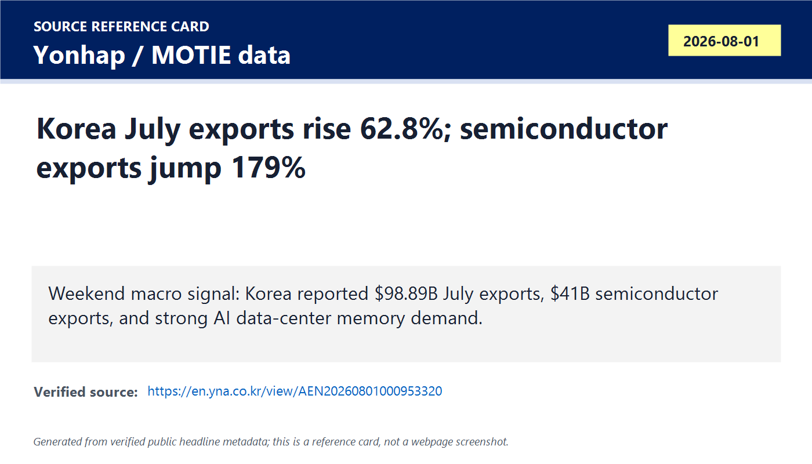
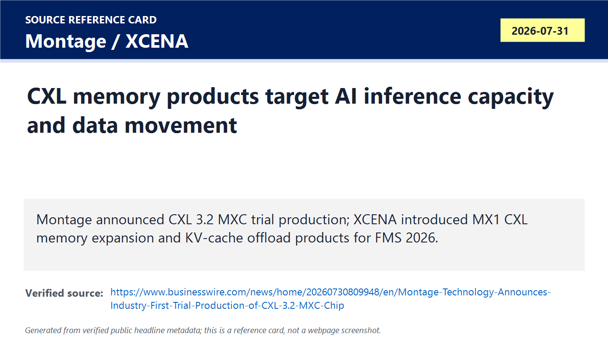
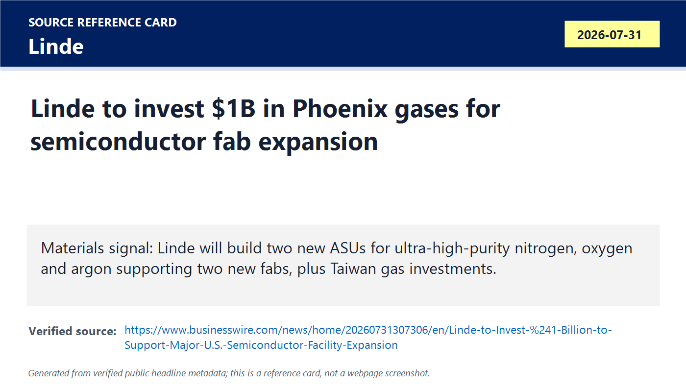
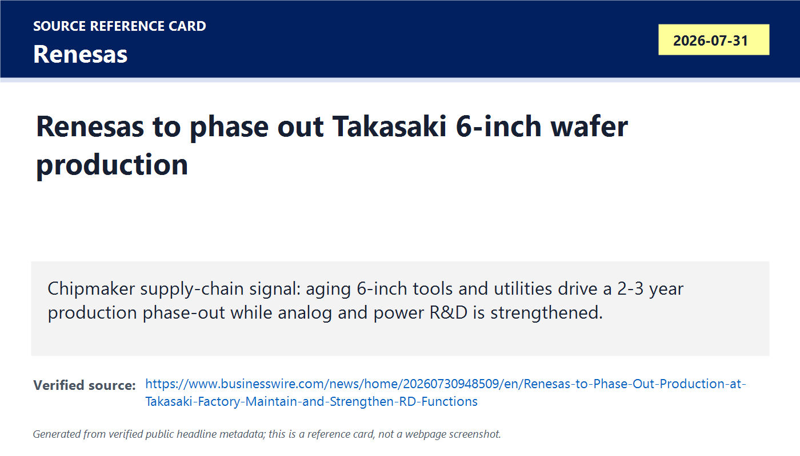
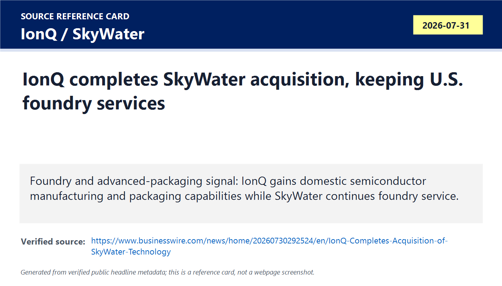
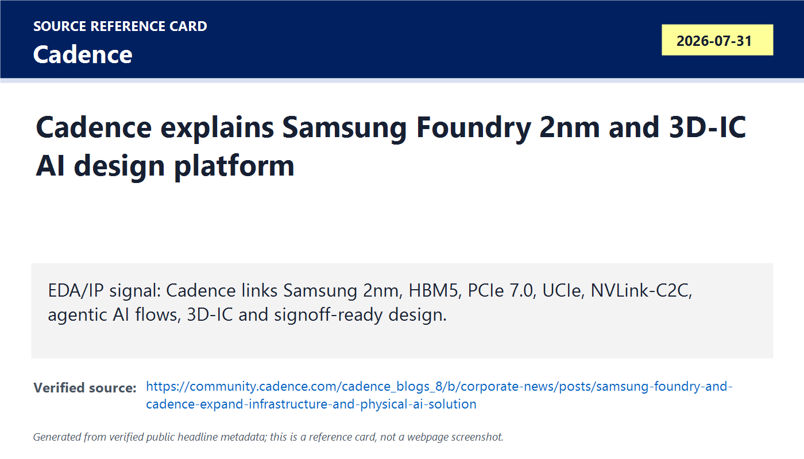
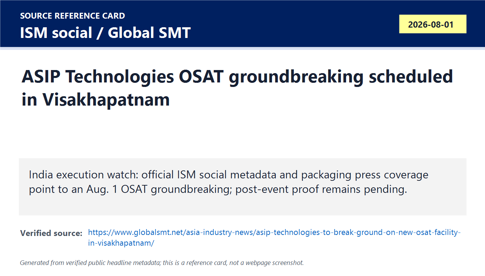
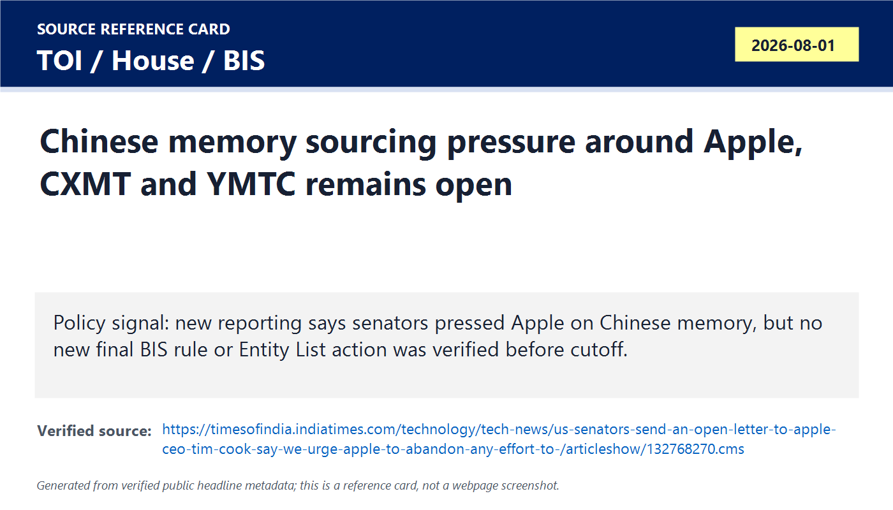

# Daily Semiconductor Current Affairs

Date: 2026-08-01

Research window: Saturday update through approximately 14:45 IST on August 1, 2026. This is weekend/catch-up research, so exact-August-1 company releases are limited; the page uses August 1 macro/policy reporting plus verified July 31 releases from the nearest last-24-to-72-hour window. The main theme is that the AI memory cycle is no longer only a chipmaker earnings story: it is visible in Korean exports, CXL memory architecture, fab gases, mature-node factory decisions, foundry ownership, EDA/IP enablement, India OSAT execution, and U.S.-China memory-sourcing politics.

## Quick Index

| Date | Major Topic | Source Groups | Why To Read |
|---|---|---|---|
| 2026-08-01 | Weekend Korea export data verifies AI-memory demand | Yonhap, Aju Press, MOTIE-cited data | Turns memory-cycle claims into trade data: semiconductor exports rose sharply and stayed above USD 40B for a second month. |
| 2026-08-01 | CXL memory expansion becomes a near-term AI-inference product story | Montage, XCENA, CXL/PCI-SIG references | Explains why AI systems now need memory pooling, KV-cache offload, high-speed IO, and data-movement reduction. |
| 2026-08-01 | Linde shows materials/gases as a hidden fab bottleneck | Linde | Connects Phoenix and Taiwan fab/packaging expansion to ultra-high-purity nitrogen, oxygen, argon, hydrogen and ASUs. |
| 2026-08-01 | Renesas and SkyWater show manufacturing restructuring below leading edge | Renesas, IonQ/SkyWater | Covers a 6-inch factory phase-out, analog/power R&D shift, U.S. trusted-foundry capability and quantum packaging. |
| 2026-08-01 | Cadence-Samsung shows EDA/IP as an advanced-node competitiveness layer | Cadence, Samsung Foundry context | Connects 2nm, 3D-IC, HBM5, UCIe, NVLink-C2C, signoff and agentic AI design flows. |
| 2026-08-01 | India ASIP OSAT watch moves from policy to ground execution | ISM social metadata, Global SMT, SEMICON India, PIB | Tracks the Visakhapatnam OSAT groundbreaking watch and keeps final event proof separate from schedule evidence. |
| 2026-08-01 | Apple-CXMT/YMTC pressure keeps export-control risk open | TOI, House Select Committee, BIS, DoD | Separates political pressure and reported letters from binding BIS or procurement action. |

**Page navigation:** [Sources](#source-map) · [Concept review](#concept-review) · [Follow-up](#what-to-watch-next) · [Technical terms](#technical-terms-used-today) · [Master glossary](../knowledge-base/glossary.md)

## Source Images And Manifest

Source manifest: [../images/2026-08-01/links.md](../images/2026-08-01/links.md)

The following are generated source-reference cards based on verified public headline/date/source metadata. They are not webpage screenshots and do not reproduce article bodies.

## Source Map

| Source | Source date | Role | Confidence / limitation |
|---|---:|---|---|
| [Yonhap on South Korea July exports](https://en.yna.co.kr/view/AEN20260801000953320) and [Aju Press export report](https://m.ajupress.com/amp/20260801095956472) | 2026-08-01 | Reputable reporting based on South Korea industry ministry trade data | Strong for export values and sector growth; exact product mix inside semiconductors still needs full ministry dataset when available. |
| [Montage CXL 3.2 MXC release](https://www.businesswire.com/news/home/20260730809948/en/Montage-Technology-Announces-Industry-First-Trial-Production-of-CXL-3.2-MXC-Chip), [XCENA MX1 release](https://www.businesswire.com/news/home/20260731455701/en/XCENA-Unveils-MX1-Production-Lineup-to-Accelerate-Push-Into-Hyperscale-AI-Infrastructure), [PCI-SIG PCIe 6.0 page](https://pcisig.com/pci-express-6.0-specification), and [CXL Consortium resource page](https://computeexpresslink.org/resource-library/) | 2026-07-31 / references reviewed 2026-08-01 | Primary product releases plus standards references for memory expansion and high-speed IO | Strong for announced capabilities; performance, qualification, volume shipments and customer deployments remain future proof points. |
| [Linde semiconductor gases investment release](https://www.businesswire.com/news/home/20260731307306/en/Linde-to-Invest-%241-Billion-to-Support-Major-U.S.-Semiconductor-Facility-Expansion) | 2026-07-31 | Primary materials and fab-infrastructure source | Strong for investment, Phoenix/Taiwan gases and ASU details; customer name is not disclosed. |
| [Renesas Q2 results](https://www.businesswire.com/news/home/20260730481394/en/Renesas-Reports-Financial-Results-for-the-Second-Quarter-Ended-June-30-2026), [Renesas Takasaki phase-out release](https://www.businesswire.com/news/home/20260730948509/en/Renesas-to-Phase-Out-Production-at-Takasaki-Factory-Maintain-and-Strengthen-RD-Functions), and [Renesas forecast release](https://www.businesswire.com/news/home/20260730207758/en/Renesas-Announces-Consolidated-Forecasts) | 2026-07-31 | Primary chipmaker earnings, mature-node capacity and analog/power R&D source | Strong for reported values and Takasaki plan; customer-by-customer supply impact is not disclosed. |
| [IonQ completes SkyWater acquisition](https://www.businesswire.com/news/home/20260730292524/en/IonQ-Completes-Acquisition-of-SkyWater-Technology) | 2026-07-31 | Primary foundry/advanced-packaging ownership and trusted-foundry source | Strong for transaction closing and stated operating model; quantum roadmap benefits are forward-looking. |
| [Cadence July 31 Samsung Foundry blog](https://community.cadence.com/cadence_blogs_8/b/corporate-news/posts/samsung-foundry-and-cadence-expand-infrastructure-and-physical-ai-solution) and [Cadence May 28 press release](https://www.cadence.com/en_US/home/company/newsroom/press-releases/pr/2026/cadence-and-samsung-foundry-deepen-2nm-and-3dic-collaboration-to.html) | 2026-07-31 / 2026-05-28 | Primary EDA/IP, Samsung Foundry 2nm, 3D-IC and signoff-flow source | Strong for partnership and tool/IP scope; production silicon outcomes remain later evidence. |
| [ISM social-source mirror via Global SMT](https://www.globalsmt.net/asia-industry-news/asip-technologies-to-break-ground-on-new-osat-facility-in-visakhapatnam/), [SEMICON India 2026](https://www.semiconindia.org/), [ISM SEMICON India page](https://ism.gov.in/semicon-india-2026), and [PIB Semicon 2.0 approval](https://www.pib.gov.in/PressReleasePage.aspx?PRID=2284784&lang=1&reg=48) | 2026-07-30 to 2026-08-01 | India OSAT/event/policy follow-up | Schedule evidence is useful but not final completion proof. Need post-event official PIB/ISM release, equipment orders, qualification and shipments. |
| [TOI on senators pressing Apple](https://timesofindia.indiatimes.com/technology/tech-news/us-senators-send-an-open-letter-to-apple-ceo-tim-cook-say-we-urge-apple-to-abandon-any-effort-to-/articleshow/132768270.cms), [House Select Committee memory-chip letter](https://chinaselectcommittee.house.gov/media/letters/moolenaar-whitesides-to-secretary-lutnick-hold-firm-on-chinese-memory-chips-ban), [BIS Entity List page](https://www.bis.gov/entity-list), and [DoD Section 1260H PDF](https://media.defense.gov/2026/Jun/08/2003945537/-1/-1/1/ENTITIES-IDENTIFIED-AS-CHINESE-MILITARY-COMPANIES-OPERATING-IN-THE-UNITED-STATES-IN-ACCORDANCE-WITH-SECTION-1260H.PDF) | Reviewed 2026-08-01 | Policy/export-control verification for CXMT/YMTC memory sourcing | Strong for pressure and status check; no new binding BIS rule or Entity List action was verified before cutoff. |

## Technical Terms / Deep Definitions

Term: Memory export concentration
Definition: Memory export concentration means a country's export growth depends heavily on DRAM, NAND, HBM, enterprise SSDs or related memory products rather than being evenly distributed across many sectors. It solves a diagnostic problem for semiconductor current affairs: if Korea's exports rise mainly because memory prices and shipments rise, the data tells us more about the AI memory cycle than about every part of the economy. In today's news it matters because Korea's July exports were led by semiconductor exports above USD 40B, so the macro story is tightly connected to Samsung, SK hynix, Micron-like supply dynamics, AI data centers and memory pricing. Example: a country can report strong total exports while the real driver is one high-value chip category. Source: https://en.yna.co.kr/view/AEN20260801000953320

Term: DRAM
Definition: DRAM, or dynamic random-access memory, is volatile memory that stores bits as charge in tiny capacitors and must be refreshed repeatedly because charge leaks away. It solves the working-memory problem for CPUs, GPUs and accelerators: systems need fast temporary storage for active code, model weights, activations, buffers and operating-system data. In today's Korea, Apple and CXMT/YMTC news, DRAM matters because AI servers consume very large memory capacity and bandwidth, pushing prices and supply allocation in ways that affect both data centers and consumer devices. Comparison: DRAM is the desk space where active work sits, while NAND flash is the shelf where data remains after power is off. Source: https://www.micron.com/products/memory/dram-components

Term: NAND flash
Definition: NAND flash is non-volatile memory that stores data in floating-gate or charge-trap cells and keeps the data without power. It solves the persistent-storage problem for phones, SSDs, servers, AI training datasets, model checkpoints and edge devices. In today's export and CXL discussions, NAND matters because enterprise SSD demand grows with AI infrastructure and some memory-sourcing policy pressure includes YMTC, a major Chinese NAND supplier. Comparison: DRAM is fast working space; NAND is persistent storage for files, datasets and model states. Source: https://www.micron.com/products/storage/nand-flash

Term: Compute Express Link (CXL)
Definition: Compute Express Link, or CXL, is an open industry interconnect that runs on the PCIe physical layer and gives CPUs, memory devices and accelerators coherent or memory-semantic communication paths. It solves the memory disaggregation problem: servers often have stranded DRAM in one place and memory shortages in another, while AI workloads need flexible capacity near compute. In today's Montage and XCENA news, CXL matters because vendors are moving from concept to trial-production and production-lineup products for memory expansion, pooling and AI inference. Example: instead of adding a full extra server just to get more memory, a data center can attach CXL memory capacity to the host system. Source: https://computeexpresslink.org/resource-library/

Term: CXL Type 3 device
Definition: A CXL Type 3 device is a CXL-attached memory device that provides host-accessible memory capacity without acting primarily as an accelerator with its own cache-coherent compute engine. It solves the server-memory scaling problem by letting memory expansion modules, cards or EDSFF devices add capacity outside ordinary DIMM slots. In today's Montage news, Type 3 matters because the MXC controller is presented as supporting CXL.mem and CXL.io for memory expansion products. Comparison: a Type 1 CXL device is accelerator-like, a Type 2 device combines accelerator and memory behavior, and Type 3 is memory-expansion focused. Source: https://computeexpresslink.org/resource-library/

Term: KV cache
Definition: KV cache is the stored set of key and value tensors created during transformer inference so the model does not recompute attention information for earlier tokens each time it generates a new token. It solves the latency and compute-waste problem in long-context AI inference: without caching, every generated token would repeatedly revisit the full prior sequence at high cost. In today's XCENA news, KV cache matters because long context windows make memory capacity and bandwidth a first-order bottleneck, so CXL-attached memory is being proposed for KV-cache sharing and offload. Example: for a chatbot conversation, the KV cache is like keeping a working index of earlier words so the model can continue quickly. Source: https://huggingface.co/docs/transformers/v4.45.2/kv_cache

Term: Memory pooling
Definition: Memory pooling is an architecture where memory capacity is treated as a shared resource that can be allocated across hosts, accelerators or workloads rather than being permanently trapped inside one server. It solves the stranded-memory and utilization problem in data centers: one server may sit idle with unused DRAM while another cannot run a larger model because it lacks memory. In today's CXL news, memory pooling matters because both Montage and XCENA position CXL memory products as a way to scale AI infrastructure without always scaling compute one server at a time. Comparison: fixed DRAM is like every room having its own locked water tank; memory pooling is like a building-level reservoir allocated where needed. Source: https://computeexpresslink.org/webinars/an-overview-of-the-compute-express-link-cxl-2-0-ecns-330/

Term: PCIe 6.x
Definition: PCIe 6.x refers to the sixth generation PCI Express interconnect family, with PCIe 6.0 supporting a 64.0 GT/s raw data rate and up to 256 GB/s in a x16 configuration. It solves the high-speed IO problem between CPUs, accelerators, SSDs, NICs and CXL devices by doubling bandwidth over PCIe 5.0 while adding PAM4 signaling, FEC and FLIT-based encoding. In today's Montage news, PCIe 6.x matters because CXL 3.2 memory devices ride on high-speed PCIe-class physical links, so memory expansion depends on both protocol and signal-integrity engineering. Example: if CXL is the memory-sharing language, PCIe 6.x is the high-speed road carrying the packets. Source: https://pcisig.com/pci-express-6.0-specification

Term: Ultra-high-purity industrial gases
Definition: Ultra-high-purity industrial gases are gases such as nitrogen, oxygen, argon, hydrogen and specialty mixtures produced and delivered with extremely tight contamination limits for semiconductor processing. They solve the contamination-control problem: a few parts-per-billion of the wrong impurity can change film growth, etch chemistry, oxidation, plasma behavior, wafer defects and yield. In today's Linde news, these gases matter because new fabs and advanced packaging sites cannot run reliably without local, redundant and high-purity gas supply. Comparison: a fab's gas system is like clean blood supply for process tools; ordinary industrial gas purity is not enough for advanced wafer manufacturing. Source: https://www.businesswire.com/news/home/20260731307306/en/Linde-to-Invest-%241-Billion-to-Support-Major-U.S.-Semiconductor-Facility-Expansion

Term: Air separation unit (ASU)
Definition: An air separation unit is an industrial plant that separates atmospheric air into gases such as nitrogen, oxygen and argon, often using cryogenic distillation or related separation processes. It solves the bulk-gas supply problem for fabs: high-volume gases must be available continuously near the site instead of being delivered only by cylinders or trucks. In today's Linde news, ASUs matter because Linde plans two new SPECTRA ASUs in Phoenix and additional units in Taiwan to support semiconductor manufacturing and advanced packaging expansion. Example: a fab does not buy nitrogen like a lab bottle; it needs a local utility-scale gas plant. Source: https://www.businesswire.com/news/home/20260731307306/en/Linde-to-Invest-%241-Billion-to-Support-Major-U.S.-Semiconductor-Facility-Expansion

Term: 6-inch wafer line
Definition: A 6-inch wafer line is a semiconductor manufacturing line built around wafers about 150 mm in diameter, commonly used for older analog, power, discrete, sensor or specialty processes. It solves a legacy-product supply problem because many long-lifecycle chips do not need cutting-edge 300 mm fabs, but the old tools and facilities can become difficult to maintain as suppliers stop supporting them. In today's Renesas news, the 6-inch line matters because Takasaki production is being phased out due to aging equipment, utilities and discontinued support for some materials and maintenance. Comparison: it is like an older but specialized factory line that still makes needed parts, until spare parts and service support disappear. Source: https://www.businesswire.com/news/home/20260730948509/en/Renesas-to-Phase-Out-Production-at-Takasaki-Factory-Maintain-and-Strengthen-RD-Functions

Term: Analog IC
Definition: An analog IC is an integrated circuit that processes continuously varying real-world signals such as voltage, current, temperature, pressure, sound, radio frequency or power-control signals. It solves the bridge problem between the physical world and digital systems: sensors, power rails, chargers, automotive electronics and RF front ends need analog behavior even when the main processor is digital. In today's Renesas news, analog ICs matter because Takasaki R&D will be maintained and strengthened for analog IC and power semiconductor work aimed at data-center and automotive applications. Example: a CPU thinks in ones and zeros; an analog IC measures and conditions the messy voltage coming from a sensor. Source: https://www.renesas.com/en/products/analog-products

Term: Discrete power semiconductor
Definition: A discrete power semiconductor is a single-function power device such as a diode, MOSFET, IGBT or related component used to switch, rectify or control electrical power. It solves the power-conversion problem in cars, chargers, servers, industrial drives and renewable-energy systems where current, voltage, efficiency and heat matter. In today's Renesas news, discrete power semiconductors matter because Renesas is keeping R&D at Takasaki for power devices serving data-center and automotive growth areas. Comparison: an AI server may use advanced processors, but every rack still depends on power semiconductors to convert and deliver electricity safely. Source: https://www.renesas.com/en/products/power-power-management

Term: Trusted Foundry
Definition: A Trusted Foundry is a semiconductor manufacturing source accredited or recognized for secure handling of sensitive designs, often relevant to defense, government and critical-infrastructure customers. It solves the supply-chain assurance problem: customers need confidence that design files, masks, wafers, packaging and process information are protected from tampering, leakage or untrusted dependency. In today's IonQ/SkyWater news, Trusted Foundry matters because SkyWater is described as a DMEA-accredited Category 1A Trusted Foundry while continuing U.S.-based foundry services under IonQ ownership. Example: a defense sensor ASIC may care as much about secure manufacturing provenance as about transistor density. Source: https://www.businesswire.com/news/home/20260730292524/en/IonQ-Completes-Acquisition-of-SkyWater-Technology

Term: Advanced packaging
Definition: Advanced packaging integrates multiple dies, chiplets, interposers, memory stacks or heterogeneous components into one higher-level package to improve bandwidth, latency, power, size or system functionality beyond what a single monolithic die can easily provide. It solves the scaling problem when simply shrinking transistors becomes too expensive, power-limited or yield-limited. In today's IonQ, Cadence-Samsung and India ASIP news, advanced packaging matters because AI, quantum, 3D-IC and OSAT projects increasingly depend on package-level integration, not only wafer fabrication. Example: HBM next to a GPU on an interposer is an advanced-packaging problem as much as a memory-chip problem. Source: https://eps.ieee.org/technology/heterogeneous-integration-roadmap/

Term: Agentic AI EDA flow
Definition: An agentic AI EDA flow uses AI agents to plan and execute parts of chip-design workflows such as RTL checks, constraints, implementation, verification, debug, power optimization, timing closure or signoff under engineer supervision. It solves the productivity and iteration-cost problem: advanced nodes and multi-die systems create too many constraints for manual trial-and-error alone. In today's Cadence-Samsung news, agentic AI EDA matters because Cadence positions AI-assisted implementation, 3D-IC and signoff flows as part of a production-ready Samsung 2nm design ecosystem. Comparison: a script runs fixed commands; an agentic flow can choose next design actions based on goals and feedback, but still must be verified by engineers. Source: https://community.cadence.com/cadence_blogs_8/b/corporate-news/posts/samsung-foundry-and-cadence-expand-infrastructure-and-physical-ai-solution

Term: 3D-IC
Definition: A 3D-IC is a three-dimensional integrated circuit or package architecture where dies are stacked or connected vertically with dense interconnects, often using through-silicon vias, hybrid bonding or interposers. It solves the bandwidth, area and power problem by shortening paths between logic, memory and IO blocks compared with spreading every function across a large board. In today's Cadence-Samsung and SkyWater/advanced packaging news, 3D-IC matters because AI and physical-AI systems need more bandwidth and integration than conventional single-die scaling can provide economically. Example: stacking memory close to compute cuts data-movement energy compared with sending everything across a motherboard. Source: https://eps.ieee.org/technology/heterogeneous-integration-roadmap/

Term: UCIe
Definition: UCIe, or Universal Chiplet Interconnect Express, is an open die-to-die interconnect standard intended to let chiplets communicate inside a package across a common electrical/protocol framework. It solves the chiplet interoperability problem: without shared interfaces, every multi-die system becomes a custom one-off integration project. In today's Cadence-Samsung news, UCIe matters because Cadence lists UCIe 64G IP for chiplet-based integration on advanced Samsung processes. Comparison: PCIe connects devices on boards; UCIe is designed for much shorter die-to-die links inside packages. Source: https://uciexpress.org/

Term: NVLink-C2C
Definition: NVLink-C2C is NVIDIA's chip-to-chip coherent interconnect technology for tightly coupling CPUs, GPUs or other dies in accelerated-computing systems. It solves the bottleneck between high-performance compute blocks that need low-latency, high-bandwidth, coherent communication. In today's Cadence-Samsung news, NVLink-C2C matters because Cadence says its Samsung 2nm platform includes NVLink-C2C-enabled interconnect IP for next-generation AI architectures. Comparison: if PCIe is a general-purpose expansion link, NVLink-C2C is a specialized close-coupling link for accelerator-class systems. Source: https://www.nvidia.com/en-us/data-center/nvlink-c2c/

Term: SF2P
Definition: SF2P is Samsung Foundry's performance-enhanced second-generation 2nm-class process platform referenced in Cadence-Samsung collaboration material. It solves the leading-edge process option problem for customers that need very high performance-per-watt for AI, HPC, mobile or physical-AI chips while also requiring an ecosystem of IP, PDKs, signoff tools and packaging flows. In today's Cadence note, SF2P matters because advanced-node competitiveness depends on process technology plus ready design flows, not process naming alone. Example: a 2nm node without verified IP and signoff collateral is hard to adopt, even if transistor targets look good. Source: https://www.cadence.com/en_US/home/company/newsroom/press-releases/pr/2026/cadence-and-samsung-foundry-deepen-2nm-and-3dic-collaboration-to.html

Term: OSAT
Definition: OSAT, or outsourced semiconductor assembly and test, is the business that receives wafers or dies, assembles them into packages, performs electrical/reliability tests and ships qualified components. It solves the post-fab manufacturing problem for fabless firms, IDMs and foundries that need high-volume packaging and test without owning every back-end facility themselves. In today's India ASIP watch, OSAT matters because India is trying to turn policy incentives into physical back-end capacity in Visakhapatnam and other locations. Comparison: a foundry makes the silicon die; an OSAT makes it usable, testable and shippable as a component. Source: https://www.semi.org/en/products-services/market-data/ww-assembly-test-facility-database

Term: Entity List
Definition: The Entity List is a U.S. Bureau of Industry and Security restricted-party list that imposes license requirements on exports, reexports and transfers involving named entities under the Export Administration Regulations. It solves the enforcement problem in export controls: instead of only controlling product categories, the U.S. can restrict transactions with specific organizations of concern. In today's CXMT/YMTC watch, the Entity List matters because political pressure is rising, but no new final BIS Entity List action against CXMT/YMTC was verified before cutoff. Comparison: a congressional letter is pressure; an Entity List rule is an enforceable licensing trigger. Source: https://www.bis.gov/entity-list

Term: Section 1260H list
Definition: The Section 1260H list is a U.S. Department of Defense list identifying Chinese military companies operating directly or indirectly in the United States under the FY2021 National Defense Authorization Act framework. It solves an identification and procurement-risk problem: the government flags firms it views as linked to China's military-civil fusion or defense industrial base. In today's Apple-CXMT/YMTC pressure story, the 1260H list matters because reported objections to Chinese memory sourcing cite military-company concerns, but 1260H status is not identical to a BIS Entity List ban. Example: 1260H can create reputational and contracting risk even when a separate export-control license rule has not changed. Source: https://media.defense.gov/2026/Jun/08/2003945537/-1/-1/1/ENTITIES-IDENTIFIED-AS-CHINESE-MILITARY-COMPANIES-OPERATING-IN-THE-UNITED-STATES-IN-ACCORDANCE-WITH-SECTION-1260H.PDF

Term: Procurement restriction
Definition: A procurement restriction is a rule limiting what government agencies or contractors may buy, source or include in government-supported supply chains. It solves the trusted-supply problem by preventing public funds or sensitive systems from depending on suppliers considered risky. In today's CXMT/YMTC watch, procurement restriction matters because lawmakers are pushing for memory-sourcing limits, but the current verified evidence still shows pressure and watch items rather than a new final procurement rule for all commercial products. Comparison: export controls restrict selling technology outward; procurement restrictions restrict what the government and covered contractors buy inward. Source: https://chinaselectcommittee.house.gov/media/letters/moolenaar-whitesides-to-secretary-lutnick-hold-firm-on-chinese-memory-chips-ban

## Deep Briefing

### 1. Korea July Exports Make The Memory Cycle Measurable

**Confirmed facts:** Yonhap reported on August 1 that South Korea's July exports were USD 98.89B, up 62.8% year over year, with imports up 26.5% to USD 68.56B and a USD 30.32B trade surplus. Semiconductor exports rose 179% year over year to USD 41B, remaining above USD 40B for a second consecutive month. Yonhap attributes the figures to the Ministry of Trade, Industry and Resources and states that memory-chip demand for AI data centers kept DRAM and NAND prices high. Aju Press separately reported the same headline totals and added that computer exports were strong, led by enterprise SSDs used in AI infrastructure.

**Analysis:** This is not just "Korea exports were good." It is evidence that AI infrastructure demand has moved from individual company guidance into national trade data. Samsung and SK hynix earnings already told us suppliers were making record memory profits; the export data tells us those profits are attached to real cross-border shipments and high prices. The caveat is that export value can rise from price more than volume, so this does not prove capacity is expanding enough. It proves the current cycle is still tight and valuable.

**Why it matters:** Korea is one of the cleanest macro gauges for the memory part of AI. If Korean chip exports stay above USD 40B while memory pricing remains elevated, Micron, Samsung, SK hynix, packaging suppliers, test vendors, gas suppliers, wafer suppliers and data-center buyers all remain exposed to the same cycle. If that number weakens later, it would be an early warning that AI memory demand, pricing or customer procurement is cooling.

**India angle:** India imports large amounts of memory and storage for phones, PCs, servers and electronics assembly. High Korean memory prices can raise India's bill-of-material costs even if Indian manufacturing volumes rise. For India to capture more value, OSAT/ATMP and eventually memory-related packaging/test capability matter, but India is not yet a DRAM/HBM producer at Korean scale.

**VLSI/career relevance:** Learn DRAM/NAND basics, memory-controller behavior, HBM vs DDR, eSSD architecture, signal integrity and supply-chain economics. A good VLSI engineer should be able to explain how "semiconductor exports up 179%" links to memory prices, wafer starts, package capacity, test time, yield and customer allocation.

### 2. CXL Memory Expansion Moves From Architecture Talk To Product Evidence

**Confirmed facts:** Montage announced trial production of a CXL 3.2 Memory eXpander Controller chip. The release says the controller supports CXL Type 3 behavior, CXL.mem and CXL.io, PCIe 6.x/CXL 3.2 protocol support, up to 64 GT/s transfer rates, dual DDR5 memory controllers up to 8000 MT/s, PCIe PHY, DDR5 PHY and RISC-V management subsystems. Montage also says the chip has been integrated into next-generation CXL products by memory module makers including Samsung and SK hynix, with initial validation completed. XCENA announced its MX1 production lineup for CXL memory expansion, near-data processing and KV-cache offload, including MX1 Compute with 2,048 RISC-V cores, MX1 Expand with eight DRAM slots, and FMS 2026 demonstrations with Intel Xeon 6.

**Analysis:** This item is technically important because the AI bottleneck is shifting from "do we have enough accelerators?" to "can we feed the accelerators and hold the working set efficiently?" For LLM inference, KV cache grows with sequence length, batch size and active users. HBM is fast but expensive and capacity-limited. Ordinary DRAM is cheaper but tied to CPU sockets and DIMM slots. CXL sits in the middle: it may not replace HBM, but it can add flexible capacity, pooling and tiering around CPU/accelerator systems.

**Confirmed vs analysis discipline:** Confirmed: Montage and XCENA announced products and demos. Analysis: whether this becomes mainstream depends on latency, software support, server-platform BIOS/firmware maturity, hyperscaler validation, reliability, security and total-cost-of-ownership results. A press release does not prove production deployment at scale.

**Why it matters:** AI inference cost is increasingly memory cost. If CXL can offload KV cache or reduce stranded DRAM, it can affect GPU utilization, server count, power, memory procurement and rack architecture. It also creates a VLSI opportunity in memory controllers, PHYs, coherent protocols, RISC-V management cores, validation, compliance testing and systems software.

**India angle:** India can participate here through verification, firmware, board design, memory-module validation, server platform software, data-center operations and CXL compliance testing even before it has leading-edge fabs. This is a realistic VLSI career bridge: engineers can work on memory subsystem validation and protocol verification from India.

### 3. Linde Shows Fab Expansion Needs Materials Infrastructure, Not Only Tools

**Confirmed facts:** Linde announced a long-term agreement to supply ultra-high-purity industrial gases to a large semiconductor manufacturer expanding a Phoenix, Arizona manufacturing complex. Linde said it will invest USD 1B to expand its on-site gases complex, build two new SPECTRA air separation units and associated infrastructure, and supply nitrogen, oxygen and argon for two new semiconductor fabs. It also said Linde LienHwa in Taiwan was selected by the same customer to supply gases to new manufacturing and advanced packaging facilities, with about USD 800M planned for ASUs and hydrogen production units.

**Analysis:** This is a strong hidden-supply-chain item. Investors and students often track EUV tools, GPUs and HBM, but fabs cannot run without bulk gases, specialty gases, exhaust systems, ultrapure water, chemicals, power and facilities. Gas capacity is not glamorous, but it is a gating utility. A new fab with insufficient gas purity or uptime is not production capacity. Linde's Phoenix/Taiwan combination also hints that the customer is expanding across both U.S. and Taiwan manufacturing footprints, but the customer is not named in the release, so that link should not be overclaimed.

**Why it matters:** Materials and facility suppliers often receive capex signals before chips ship. If fabs are preparing two new facilities and associated advanced packaging sites, upstream ecosystem spending is already moving. This supports the broader AI-capex thesis from Microsoft/Amazon/Samsung, but at a different layer of the value chain.

**India angle:** India's Semicon 2.0 pillar for materials and equipment is meaningful only if companies can localize high-purity gases, chemicals, spares, safety systems and qualified services. For an Indian fab/OSAT ecosystem, gas plants and contamination control are core infrastructure, not side utilities.

**VLSI/career relevance:** Process engineering requires understanding gases, plasma chemistry, oxidation, deposition, etch and contamination. Even RTL engineers benefit from knowing why yield and process stability affect cost, supply and schedule.

### 4. Renesas And SkyWater Show The Manufacturing Base Is Restructuring Below Leading Edge

**Confirmed facts:** Renesas reported Q2 non-GAAP revenue of 405.3B yen, non-GAAP gross margin of 58.1%, non-GAAP operating profit of 132.7B yen and non-GAAP operating margin of 32.7%. It also announced that it will gradually scale down and end production at the Takasaki Factory over the next two to three years. Renesas said the site operates a 6-inch wafer line and that structural changes, discontinued production materials, maintenance-support limits, aging equipment and aging utilities make continued production of some products increasingly difficult. R&D functions at the site, mainly analog ICs and discrete power semiconductors, will be maintained and strengthened for data-center and automotive applications. Separately, IonQ completed its acquisition of SkyWater Technology, saying SkyWater will continue serving foundry customers and operate under the SkyWater name.

**Analysis:** This pair of items shows the semiconductor industry has two simultaneous movements. At the high end, everyone talks about 2nm, HBM and AI accelerators. At the base layer, older wafer lines still make needed analog, power and specialty parts, but tool support and utility aging create hard constraints. Renesas is not simply abandoning chips; it is moving away from a harder-to-support production base while keeping R&D for growth areas. IonQ/SkyWater is the opposite movement: a system company buying foundry and packaging capability to vertically integrate a specialized computing roadmap.

**Why it matters:** Mature-node capacity is not automatically stable. Old tools age, spare parts disappear, process recipes become hard to sustain, and customer migration needs time. At the same time, U.S.-based foundry and advanced packaging capacity is becoming strategically valuable for defense, quantum, sensing and critical infrastructure. The industry is not one uniform "chip shortage"; each node, wafer size, package type and customer market has its own bottleneck.

**India angle:** India should study Renesas carefully. Building new OSAT or fab capacity is one challenge; maintaining older equipment, qualified suppliers, utilities, process recipes, metrology and customer support for decades is another. India can also learn from SkyWater's model: trusted specialty manufacturing and advanced packaging can be valuable even outside the leading-edge foundry race.

**VLSI/career relevance:** This is relevant for analog layout, power devices, reliability, DFT, test engineering, product engineering, process transfer and failure analysis. Many jobs are not "design a 2nm AI chip"; they are keeping real products manufacturable, qualified and reliable across long lifecycles.

### 5. Cadence-Samsung Shows Advanced Nodes Need EDA, IP, Packaging And Signoff Together

**Confirmed facts:** Cadence published a July 31 blog explaining its expanded collaboration with Samsung Foundry around infrastructure AI and physical AI design. It links Samsung's second-generation 2nm platform with Cadence memory/interface IP and certified flows across digital implementation, custom design, 3D-IC planning, power integrity, extraction, timing, verification and AI-driven exploration. The article highlights HBM5, PCIe 7.0, PCIe 6.0, UCIe 64G, 224G/256G SerDes and NVLink-C2C-enabled interconnect. Cadence's earlier May 28 press release is the primary partnership announcement behind this technical explanation.

**Analysis:** This matters because the foundry battle is not only transistor density. Customers choose a node when they trust the full design ecosystem: PDKs, standard cells, memory compilers, interface IP, signoff decks, thermal/power analysis, package planning, reliability checks and support from EDA vendors. Samsung Foundry's competitive position against TSMC and Intel depends partly on whether customers can tape out complex AI/HPC/edge chips with low integration risk. Cadence is framing AI-era design as a systems problem: chiplets, memory stacks, package interconnects, power/thermal limits and signoff convergence all interact.

**Why it matters:** For AI chips, data movement can dominate energy and performance. HBM, UCIe, PCIe, NVLink-C2C and SerDes are not side features; they determine whether compute blocks can communicate fast enough. EDA tools are the control layer that makes such systems designable and verifiable.

**India angle:** EDA/IP is one of India's strongest entry paths. Indian engineers can contribute in RTL verification, STA, physical design, signoff, IP validation, formal, DFT, package-aware design and CAD methodology even when wafer manufacturing happens elsewhere. India semiconductor policy should not treat EDA as secondary to fabs.

**VLSI/career relevance:** Revise PPA, timing closure, IR drop, electromigration, DRC/LVS, extraction, protocol IP, UCIe, PCIe, SerDes, HBM PHY/controller concepts and 3D-IC planning. Interviewers increasingly ask why a chip's package and interconnect can limit performance even if the core logic is fast.

### 6. India ASIP OSAT Watch: Schedule Evidence Is Useful, Completion Proof Still Needed

**Confirmed facts:** Global SMT mirrored official India Semiconductor Mission social metadata saying the groundbreaking ceremony of Advanced System in Package Technologies' OSAT facility was scheduled for August 1, 2026 at Visakhapatnam, Andhra Pradesh, with national and state leaders expected. Earlier reporting placed the ASIP project as an ISM-sanctioned OSAT facility in Andhra Pradesh. SEMICON India 2026 remains scheduled for September 17-19 at Yashobhoomi, Delhi, under the "Silicon to Systems: Building the Ecosystem" theme. PIB's July 15 Semicon 2.0 release remains the official policy baseline with Rs 1,27,500 crore approved for semiconductor design and manufacturing ecosystem development.

**Analysis:** This is an India execution item, but it must be handled carefully. A scheduled groundbreaking is stronger than a policy slogan but weaker than post-event photos, land possession, civil work completion, tool orders, hiring, process qualification, customer audits and first shipments. The correct status today is "updated but still open." If an official PIB/ISM post-event release appears later today, the next note should close the schedule item and move the tracker to execution milestones.

**Why it matters:** OSAT is the realistic first scale layer for India because packaging and test can create semiconductor jobs, supplier networks and customer relationships before full front-end fabs mature. But OSAT competitiveness requires equipment, process recipes, reliability testing, yield, cycle time, customer trust and skilled operators.

**India angle:** Visakhapatnam could become meaningful if the project moves beyond ceremony to equipment and customer proof. The nearby electronics/data-center ecosystem angle matters, but packaging/test demand still depends on customers choosing India for cost, reliability, geopolitics and supply-chain diversification.

**VLSI/career relevance:** For students, OSAT means DFT, ATE, test program development, package reliability, thermal/mechanical stress, failure analysis, yield engineering, product engineering and quality systems. These are high-value VLSI-adjacent careers, not "lesser" semiconductor work.

### 7. Apple-CXMT/YMTC Pressure Keeps Policy Risk Open

**Confirmed facts:** Times of India reported on August 1 that U.S. senators led by Chuck Schumer and Jim Banks sent an open letter urging Apple not to use Chinese memory chips from CXMT, YMTC or other state-backed suppliers. Earlier official House Select Committee material urged Commerce to hold firm on Chinese memory-chip restrictions. BIS's public Entity List page was checked before cutoff, and no new final BIS rule or Entity List action was verified today. The DoD Section 1260H PDF is relevant background for Chinese military-company designation risk, but a 1260H designation is not the same thing as a BIS Entity List action.

**Analysis:** The policy story is no longer abstract. Memory shortage gives Apple and other device makers an incentive to diversify suppliers. U.S. memory/security policy gives lawmakers and Micron-like domestic suppliers an incentive to block Chinese sourcing. CXMT's Shanghai debut and YMTC's NAND position make the issue bigger than one Apple procurement decision. But the evidence standard stays strict: political letters, media reports and market pressure are not the same as a final legal restriction.

**Why it matters:** If U.S. rules block Chinese memory sourcing, non-Chinese DRAM/NAND suppliers gain pricing power and strategic leverage, but downstream device costs may stay high. If rules allow limited sourcing, Apple and other consumer hardware makers may reduce cost pressure, but lawmakers may escalate procurement or export-control action. Either path affects memory pricing, supply-chain mapping and customer qualification.

**India angle:** India could benefit if companies diversify assembly and packaging supply chains away from China, but India still needs competitive quality, reliability and ramp execution. Policy tension alone does not create domestic capability.

**VLSI/career relevance:** Policy literacy matters for engineers. A memory device is not only a circuit; it has provenance, export classification, customer qualification, data-security concerns and geopolitical risk.

## Verification Matrix

| Item | Confirmed Fact | Analysis / Inference | Status |
|---|---|---|---|
| Korea exports | July exports USD 98.89B; semiconductor exports USD 41B, up 179% YoY, according to ministry-cited reporting | Export value confirms memory-cycle strength but not exact volume/yield split | Confirmed, exact official dataset follow-up |
| Montage CXL 3.2 MXC | Trial production announced with CXL.mem/CXL.io, PCIe 6.x, dual DDR5 controllers and partner validation language | Production impact depends on validation, server support, latency and customer deployment | Confirmed release, deployment pending |
| XCENA MX1 | Production lineup announced for CXL memory expansion, near-data processing and KV-cache offload | Product could reduce inference memory pressure if TCO and reliability prove out | Confirmed release, benchmark/customer proof pending |
| Linde gases | USD 1B Phoenix gas investment plus Taiwan gas investment for new manufacturing and advanced packaging facilities | Strong materials/fab infrastructure signal, but customer identity is not disclosed | Confirmed release |
| Renesas Takasaki | 6-inch production phase-out over 2-3 years and R&D retention/strengthening | Shows mature-node structural risk and long-lifecycle supply management | Confirmed release |
| IonQ/SkyWater | Acquisition completed; SkyWater continues as U.S.-based foundry subsidiary | Quantum/full-stack manufacturing benefits remain forward-looking | Confirmed closing |
| Cadence-Samsung | Cadence described 2nm, 3D-IC, HBM5, UCIe, NVLink-C2C, signoff and AI design-flow platform | Real competitiveness depends on customer tapeouts, silicon validation and yield | Confirmed partnership content |
| ASIP India OSAT | Groundbreaking was scheduled for August 1 in ISM-linked social metadata and packaging press coverage | Completion proof still needs official post-event release and project milestones | Updated but open |
| CXMT/YMTC policy | Lawmaker pressure reported; House letter and BIS/DoD background checked | No final BIS action verified before cutoff | Still pending |

## Follow-Ups From Previous Research

| Prior Follow-Up | Status Today | What Changed / Next Evidence |
|---|---|---|
| Lam transcript/mix detail | Still pending | No new transcript-level mix detail was added today. Next evidence: official transcript or detailed customer/segment commentary. |
| Qualcomm memory-cost pass-through | Still pending | The Apple-CXMT policy pressure reinforces memory-cost stress, but Qualcomm's actual customer response to price increases remains future evidence. |
| CXMT formal policy action | Updated but open | New Apple/CXMT/YMTC pressure was reported, and House/BIS/DoD sources were checked. No new final BIS Entity List or procurement rule was verified. |
| China immersion DUV proof | Still pending | No primary customer-shipment, uptime, overlay, throughput, yield or qualification evidence was found today. |
| India Semicon 2.0 execution | Updated but open | ASIP Visakhapatnam OSAT groundbreaking was scheduled for August 1, but post-event official proof and project-execution milestones remain pending. |
| Hyperscaler AI capex proof | Updated indirectly | Korea export data and CXL memory product releases show downstream effects of the same AI infrastructure demand chain. Exact hyperscaler supplier allocation remains pending. |
| Arm Form 6-K/shareholder letter details | Still pending | No new Arm filing detail was added today. Watch customer concentration, AGI CPU shipment proof and Neoverse royalty detail. |

## Concept Review

| Concept | Simple Meaning | Why It Matters Today |
|---|---|---|
| Memory cycle | Memory prices and supplier profits rise or fall with demand, supply and inventory | Korea exports, Apple cost pressure and CXMT policy all point to one memory-cycle center. |
| Memory hierarchy | Systems use different memory/storage layers with different cost, speed and capacity | HBM, DDR5, CXL-attached DRAM, SSDs and NAND each solve different AI bottlenecks. |
| Data movement | Moving bits can cost more energy/time than computing on them | XCENA's near-data and KV-cache focus exists because inference is memory/data-movement limited. |
| Fab utilities | Gases, water, power, chemicals and facilities that keep process tools running | Linde shows fabs require local high-purity gas infrastructure before output can scale. |
| Mature-node fragility | Older process lines can become hard to maintain even when demand remains | Renesas Takasaki shows aging 6-inch equipment support can become a supply-chain issue. |
| Design enablement | PDKs, IP, tools and signoff flows that let customers tape out on a node | Cadence-Samsung shows advanced-node adoption depends on ecosystem readiness. |
| Back-end manufacturing | Assembly, packaging and final test after wafer fabrication | ASIP OSAT is India's practical route into semiconductor manufacturing execution. |
| Policy verification | Distinguishing pressure from binding rules | CXMT/YMTC remains open until BIS, procurement law or another enforceable rule changes. |

## Simple Explanation

Today is a Saturday catch-up, so the best signal is not one single dramatic company launch. The important pattern is that AI memory demand is showing up everywhere. Korea's exports show memory chips are moving at huge value. Montage and XCENA show engineers are trying to add flexible CXL memory because inference needs more capacity and better utilization. Linde shows fabs need gases and utilities before they can make more chips. Renesas shows older factories can become supply risks when equipment and utility support age out.

The other half of the story is ecosystem control. Cadence and Samsung are showing that advanced-node competition depends on IP, signoff, packaging and AI-assisted design flows, not only a process-node name. India is trying to convert OSAT policy into physical projects. The U.S.-China memory question remains unresolved because companies want cheaper supply, while lawmakers worry about national security and strategic dependency.

## VLSI / Career Relevance

1. Memory systems: learn DRAM, NAND, HBM, DDR5, CXL, memory controllers, KV cache behavior and performance counters.
2. Protocol/design verification: CXL, PCIe, UCIe and SerDes need deep verification, compliance testing and debug skills.
3. Physical design/signoff: advanced AI chips require timing closure, power integrity, extraction, thermal analysis and package-aware constraints.
4. Process/manufacturing: gases, contamination control, wafer size, tool uptime and yield affect real supply, not only circuit design.
5. Packaging/test: OSAT careers include DFT, ATE, package reliability, failure analysis, product engineering and quality systems.
6. Policy literacy: engineers should understand Entity List, trusted supply, procurement restrictions and why customer sourcing can become geopolitical.

## Interview / Discussion Questions

1. Why can semiconductor export value rise faster than chip shipment volume?
2. How do DRAM, NAND, HBM and CXL-attached memory solve different problems?
3. Why does KV cache become a memory-capacity problem in long-context inference?
4. What is the difference between a CXL Type 3 memory device and a GPU accelerator?
5. Why does PCIe 6.x signal integrity matter for CXL memory systems?
6. Why are ultra-high-purity gases part of semiconductor capacity, not just utilities?
7. What risks appear when a company phases out a 6-inch wafer line?
8. Why can analog and power semiconductor R&D matter for data centers?
9. Why is a Trusted Foundry valuable for defense and quantum applications?
10. Why does 2nm process adoption require IP and signoff flows?
11. How does UCIe differ from PCIe at a system-in-package level?
12. Why is an OSAT groundbreaking not the same as first commercial shipments?
13. What evidence would close the ASIP Visakhapatnam watch item?
14. What is the difference between a DoD 1260H designation and a BIS Entity List action?
15. How could a ban on Chinese memory chips help suppliers but hurt device makers?

## What To Watch Next

- Korea: full ministry export tables, memory price/volume split, enterprise SSD details and August momentum.
- Montage/XCENA/FMS: live demos, latency numbers, reliability data, customer PoCs, server compatibility and production shipment proof.
- Linde/customer fabs: permits, construction, ASU commissioning, gas supply start date and which Phoenix/Taiwan fabs/packaging lines are supported.
- Renesas: product migration plan, customer impact, inventory buildup, employee reassignment and final Takasaki closure schedule.
- SkyWater/IonQ: Q2 call on August 5, foundry customer retention, advanced packaging roadmap and quantum manufacturing milestones.
- Cadence/Samsung: customer tapeouts on SF2P, PDK maturity, IP silicon validation, yield and package-level signoff proof.
- India ASIP: official post-event release, land/civil work, equipment orders, hiring, process qualification, customers and first shipment target.
- CXMT/YMTC: BIS final rule, Entity List updates, NDAA/procurement language, Apple response and allied restrictions.

## Final Takeaway

August 1 is a strong weekend evidence day because it links the same AI memory pressure across macro exports, memory architecture, fab infrastructure, mature-node restructuring, EDA/IP enablement, India OSAT execution and geopolitics. The confirmed fact is that demand and ecosystem investment remain strong. The disciplined analysis is that many items are still not final output: CXL products need deployment proof, ASIP needs post-groundbreaking execution, Cadence-Samsung needs tapeouts, and CXMT/YMTC needs binding policy action before the risk can be marked closed.

## Technical Terms Used Today

[Back to quick index](#quick-index) · [Open the master A-Z glossary](../knowledge-base/glossary.md)

**Term index:** [3D-IC](#daily-term-3d-ic) · [6-inch wafer line](#daily-term-6-inch-wafer-line) · [Advanced packaging](#daily-term-advanced-packaging) · [Agentic AI EDA flow](#daily-term-agentic-ai-eda-flow) · [Air separation unit (ASU)](#daily-term-air-separation-unit-asu) · [Analog IC](#daily-term-analog-ic) · [Compute Express Link (CXL)](#daily-term-compute-express-link-cxl) · [CXL Type 3 device](#daily-term-cxl-type-3-device) · [Discrete power semiconductor](#daily-term-discrete-power-semiconductor) · [DRAM](#daily-term-dram) · [Entity List](#daily-term-entity-list) · [KV cache](#daily-term-kv-cache) · [Memory export concentration](#daily-term-memory-export-concentration) · [Memory pooling](#daily-term-memory-pooling) · [NAND flash](#daily-term-nand-flash) · [NVLink-C2C](#daily-term-nvlink-c2c) · [OSAT](#daily-term-osat) · [PCIe 6.x](#daily-term-pcie-6-x) · [Procurement restriction](#daily-term-procurement-restriction) · [Section 1260H list](#daily-term-section-1260h-list) · [SF2P](#daily-term-sf2p) · [Trusted Foundry](#daily-term-trusted-foundry) · [UCIe](#daily-term-ucie) · [Ultra-high-purity industrial gases](#daily-term-ultra-high-purity-industrial-gases)

| Term | Meaning |
|---|---|
| [**3D-IC**](../knowledge-base/glossary.md#term-3d-ic) | A 3D-IC is a three-dimensional integrated circuit or package architecture where dies are stacked or connected vertically with dense interconnects, often using through-silicon vias, hybrid bonding or interposers. It solves the bandwidth, area and power problem by shortening paths between logic, memory and IO blocks compared with spreading every function across a large board. |
| [**6-inch wafer line**](../knowledge-base/glossary.md#term-6-inch-wafer-line) | A 6-inch wafer line is a semiconductor manufacturing line built around wafers about 150 mm in diameter, commonly used for older analog, power, discrete, sensor or specialty processes. It solves a legacy-product supply problem because many long-lifecycle chips do not need cutting-edge 300 mm fabs, but the old tools and facilities can become difficult to maintain as suppliers stop supporting them. |
| [**Advanced packaging**](../knowledge-base/glossary.md#term-advanced-packaging) | Advanced packaging integrates multiple dies, chiplets, interposers, memory stacks or heterogeneous components into one higher-level package to improve bandwidth, latency, power, size or system functionality beyond what a single monolithic die can easily provide. It solves the scaling problem when simply shrinking transistors becomes too expensive, power-limited or yield-limited. |
| [**Agentic AI EDA flow**](../knowledge-base/glossary.md#term-agentic-ai-eda-flow) | An agentic AI EDA flow uses AI agents to plan and execute parts of chip-design workflows such as RTL checks, constraints, implementation, verification, debug, power optimization, timing closure or signoff under engineer supervision. It solves the productivity and iteration-cost problem: advanced nodes and multi-die systems create too many constraints for manual trial-and-error alone. |
| [**Air separation unit (ASU)**](../knowledge-base/glossary.md#term-air-separation-unit-asu) | An air separation unit is an industrial plant that separates atmospheric air into gases such as nitrogen, oxygen and argon, often using cryogenic distillation or related separation processes. It solves the bulk-gas supply problem for fabs: high-volume gases must be available continuously near the site instead of being delivered only by cylinders or trucks. |
| [**Analog IC**](../knowledge-base/glossary.md#term-analog-ic) | An analog IC is an integrated circuit that processes continuously varying real-world signals such as voltage, current, temperature, pressure, sound, radio frequency or power-control signals. It solves the bridge problem between the physical world and digital systems: sensors, power rails, chargers, automotive electronics and RF front ends need analog behavior even when the main processor is digital. |
| [**Compute Express Link (CXL)**](../knowledge-base/glossary.md#term-compute-express-link-cxl) | Compute Express Link, or CXL, is an open industry interconnect that runs on the PCIe physical layer and gives CPUs, memory devices and accelerators coherent or memory-semantic communication paths. It solves the memory disaggregation problem: servers often have stranded DRAM in one place and memory shortages in another, while AI workloads need flexible capacity near compute. |
| [**CXL Type 3 device**](../knowledge-base/glossary.md#term-cxl-type-3-device) | A CXL Type 3 device is a CXL-attached memory device that provides host-accessible memory capacity without acting primarily as an accelerator with its own cache-coherent compute engine. It solves the server-memory scaling problem by letting memory expansion modules, cards or EDSFF devices add capacity outside ordinary DIMM slots. |
| [**Discrete power semiconductor**](../knowledge-base/glossary.md#term-discrete-power-semiconductor) | A discrete power semiconductor is a single-function power device such as a diode, MOSFET, IGBT or related component used to switch, rectify or control electrical power. It solves the power-conversion problem in cars, chargers, servers, industrial drives and renewable-energy systems where current, voltage, efficiency and heat matter. |
| [**DRAM**](../knowledge-base/glossary.md#term-dram) | DRAM, or dynamic random-access memory, is volatile memory that stores bits as charge in tiny capacitors and must be refreshed repeatedly because charge leaks away. It solves the working-memory problem for CPUs, GPUs and accelerators: systems need fast temporary storage for active code, model weights, activations, buffers and operating-system data. |
| [**Entity List**](../knowledge-base/glossary.md#term-entity-list) | The Entity List is a U.S. Bureau of Industry and Security restricted-party list that imposes license requirements on exports, reexports and transfers involving named entities under the Export Administration Regulations. |
| [**KV cache**](../knowledge-base/glossary.md#term-kv-cache) | KV cache is the stored set of key and value tensors created during transformer inference so the model does not recompute attention information for earlier tokens each time it generates a new token. It solves the latency and compute-waste problem in long-context AI inference: without caching, every generated token would repeatedly revisit the full prior sequence at high cost. |
| [**Memory export concentration**](../knowledge-base/glossary.md#term-memory-export-concentration) | Memory export concentration means a country's export growth depends heavily on DRAM, NAND, HBM, enterprise SSDs or related memory products rather than being evenly distributed across many sectors. It solves a diagnostic problem for semiconductor current affairs: if Korea's exports rise mainly because memory prices and shipments rise, the data tells us more about the AI memory cycle than about every part of the economy. |
| [**Memory pooling**](../knowledge-base/glossary.md#term-memory-pooling) | Memory pooling is an architecture where memory capacity is treated as a shared resource that can be allocated across hosts, accelerators or workloads rather than being permanently trapped inside one server. It solves the stranded-memory and utilization problem in data centers: one server may sit idle with unused DRAM while another cannot run a larger model because it lacks memory. |
| [**NAND flash**](../knowledge-base/glossary.md#term-nand-flash) | NAND flash is non-volatile memory that stores data in floating-gate or charge-trap cells and keeps the data without power. It solves the persistent-storage problem for phones, SSDs, servers, AI training datasets, model checkpoints and edge devices. |
| [**NVLink-C2C**](../knowledge-base/glossary.md#term-nvlink-c2c) | NVLink-C2C is NVIDIA's chip-to-chip coherent interconnect technology for tightly coupling CPUs, GPUs or other dies in accelerated-computing systems. It solves the bottleneck between high-performance compute blocks that need low-latency, high-bandwidth, coherent communication. |
| [**OSAT**](../knowledge-base/glossary.md#term-osat) | OSAT, or outsourced semiconductor assembly and test, is the business that receives wafers or dies, assembles them into packages, performs electrical/reliability tests and ships qualified components. It solves the post-fab manufacturing problem for fabless firms, IDMs and foundries that need high-volume packaging and test without owning every back-end facility themselves. |
| [**PCIe 6.x**](../knowledge-base/glossary.md#term-pcie-6-x) | PCIe 6.x refers to the sixth generation PCI Express interconnect family, with PCIe 6.0 supporting a 64.0 GT/s raw data rate and up to 256 GB/s in a x16 configuration. It solves the high-speed IO problem between CPUs, accelerators, SSDs, NICs and CXL devices by doubling bandwidth over PCIe 5.0 while adding PAM4 signaling, FEC and FLIT-based encoding. |
| [**Procurement restriction**](../knowledge-base/glossary.md#term-procurement-restriction) | A procurement restriction is a rule limiting what government agencies or contractors may buy, source or include in government-supported supply chains. It solves the trusted-supply problem by preventing public funds or sensitive systems from depending on suppliers considered risky. |
| [**Section 1260H list**](../knowledge-base/glossary.md#term-section-1260h-list) | The Section 1260H list is a U.S. Department of Defense list identifying Chinese military companies operating directly or indirectly in the United States under the FY2021 National Defense Authorization Act framework. |
| [**SF2P**](../knowledge-base/glossary.md#term-sf2p) | SF2P is Samsung Foundry's performance-enhanced second-generation 2nm-class process platform referenced in Cadence-Samsung collaboration material. It solves the leading-edge process option problem for customers that need very high performance-per-watt for AI, HPC, mobile or physical-AI chips while also requiring an ecosystem of IP, PDKs, signoff tools and packaging flows. |
| [**Trusted Foundry**](../knowledge-base/glossary.md#term-trusted-foundry) | A Trusted Foundry is a semiconductor manufacturing source accredited or recognized for secure handling of sensitive designs, often relevant to defense, government and critical-infrastructure customers. It solves the supply-chain assurance problem: customers need confidence that design files, masks, wafers, packaging and process information are protected from tampering, leakage or untrusted dependency. |
| [**UCIe**](../knowledge-base/glossary.md#term-ucie) | UCIe, or Universal Chiplet Interconnect Express, is an open die-to-die interconnect standard intended to let chiplets communicate inside a package across a common electrical/protocol framework. It solves the chiplet interoperability problem: without shared interfaces, every multi-die system becomes a custom one-off integration project. |
| [**Ultra-high-purity industrial gases**](../knowledge-base/glossary.md#term-ultra-high-purity-industrial-gases) | Ultra-high-purity industrial gases are gases such as nitrogen, oxygen, argon, hydrogen and specialty mixtures produced and delivered with extremely tight contamination limits for semiconductor processing. They solve the contamination-control problem: a few parts-per-billion of the wrong impurity can change film growth, etch chemistry, oxidation, plasma behavior, wafer defects and yield. |

This page-end index covers the specialist terms central to this day's study. The fuller explanation, news context, and source remain at first use; the master glossary combines repeated terms across all days.
