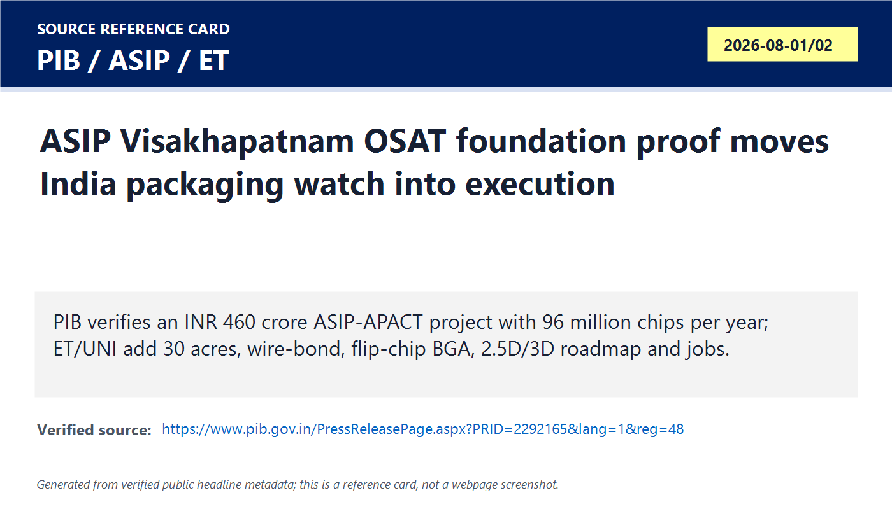
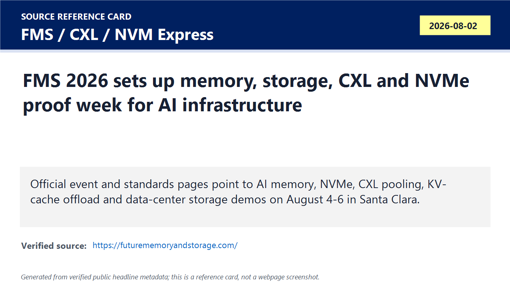
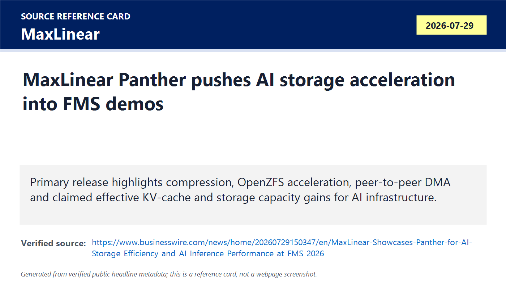
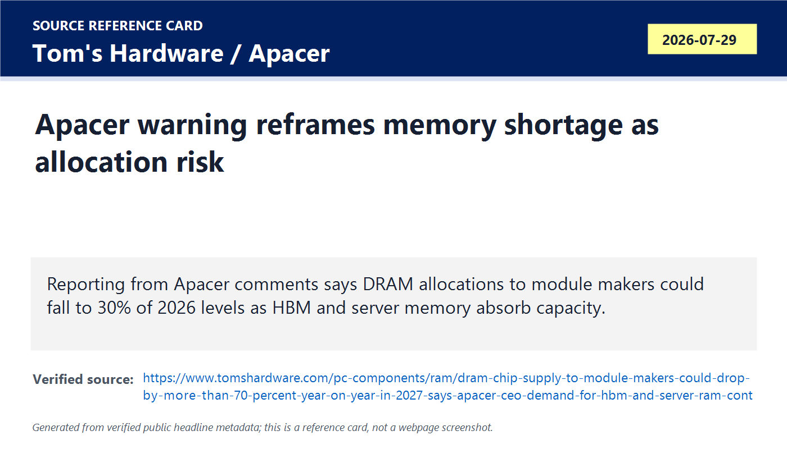
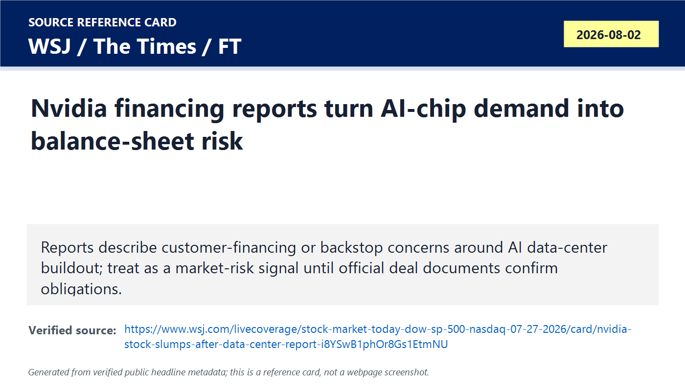
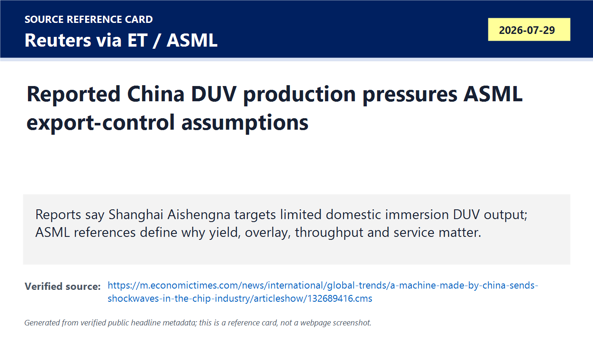
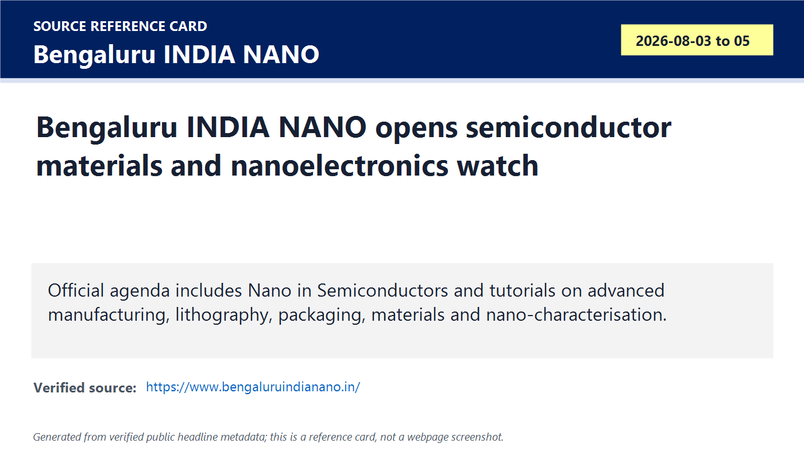
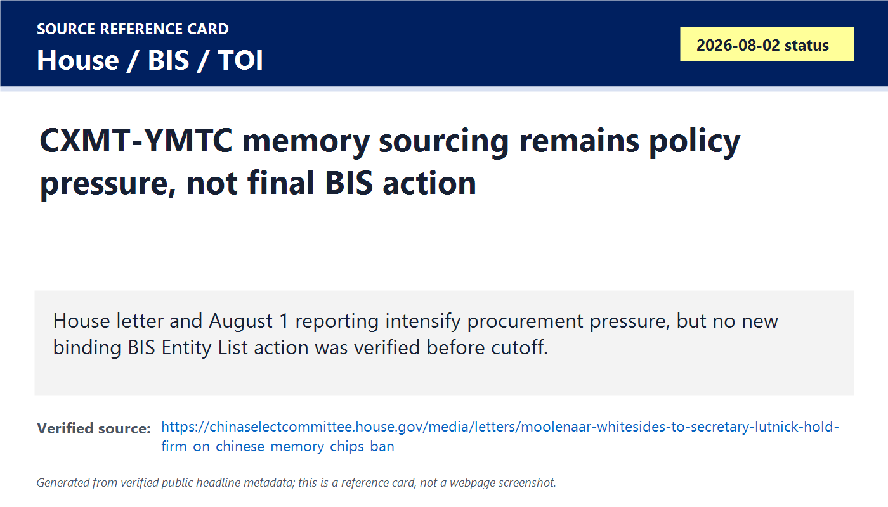

# Daily Semiconductor Current Affairs

Date: 2026-08-02

Research window: Sunday update through approximately 14:00 IST on August 2, 2026. This is weekend/catch-up research, so the page combines August 1 India project evidence, August 2 status checks, and the nearest last-24-to-72-hour semiconductor developments. The main theme is execution proof: India packaging moved from scheduled watch to foundation evidence, memory/storage suppliers are preparing proof demos for FMS week, memory shortage risk is now allocation risk, and China/US policy pressure remains unresolved until binding official action appears.

## Quick Index

| Date | Major Topic | Source Groups | Why To Read |
|---|---|---|---|
| 2026-08-02 | India packaging project moves from schedule to foundation evidence | PIB, ASIP, ET, UNI | Separates an official foundation-stone milestone from later production, qualification, equipment and customer proof. |
| 2026-08-02 | Memory and storage event week sets the next AI-infrastructure proof queue | FMS, standards groups, Marvell, Microchip, MaxLinear | Shows why AI systems are now constrained by memory capacity, storage movement, latency and platform validation. |
| 2026-08-02 | Memory supply risk shifts from price headlines to buyer allocation | Apacer-reported comments, Tom's Hardware, Digitimes | Explains why module makers, PC makers, embedded buyers and India electronics firms can be squeezed even when AI demand is strong. |
| 2026-08-02 | AI-chip financing reports become a market-risk signal | WSJ, The Times, FT, Nvidia official context | Teaches why demand funded by supplier/customer loops needs a stricter quality check than ordinary chip orders. |
| 2026-08-02 | China lithography-equipment claim is important but not parity proof | Reuters via ET, ASML official technology pages | Keeps self-reliance signal separate from high-volume yield, overlay, throughput and service proof. |
| 2026-08-02 | India nanoelectronics and semiconductor-materials watch opens | Bengaluru INDIA NANO, Moneycontrol | Connects materials, nanoscale fabrication and training to India's longer semiconductor capability pipeline. |
| 2026-08-02 | Chinese memory sourcing remains policy pressure, not final action | House Select Committee, BIS, TOI | Separates letters and procurement pressure from a verified new BIS rule or Entity List update. |

**Page navigation:** [Sources](#source-map) · [Concept review](#concept-review) · [Follow-up](#what-to-watch-next) · [Technical terms](#technical-terms-used-today) · [Master glossary](../knowledge-base/glossary.md)

## Technical Terms / Deep Definitions

Term: Foundation stone
Definition: A foundation stone is a formal project-launch milestone showing that a government or company has publicly started a physical project, but it is not the same as installed equipment, qualified production or customer shipments. It solves the evidence-classification problem in current-affairs study: you can mark the project as moving from announcement to execution, while still keeping later manufacturing proof open. In today's ASIP news it matters because PIB verifies that the Prime Minister was scheduled to lay the foundation stone for the Visakhapatnam semiconductor project, but the next proof points are tools, process qualification, yield and shipments. Comparison: a foundation stone is like tapeout in chip design: important progress, but not working silicon. Source: https://www.pib.gov.in/PressReleasePage.aspx?PRID=2292165&lang=1&reg=48

Term: OSAT
Definition: OSAT, or outsourced semiconductor assembly and test, is the back-end semiconductor business that receives wafers or individual dies, assembles them into usable packages, electrically tests them, screens reliability and ships qualified components. It solves the post-fabrication problem for fabless companies, IDMs and foundries that need packaging and test capacity without owning every back-end facility themselves. In today's ASIP item, OSAT matters because India can enter more realistic semiconductor manufacturing through packaging/test before it has large-scale leading-edge wafer fabs. Example: a foundry makes the silicon die; an OSAT makes it protected, connected, tested and shippable. Source: https://www.semi.org/en/products-services/market-data/ww-assembly-test-facility-database

Term: ATMP
Definition: ATMP means assembly, testing, marking and packaging, a manufacturing stage that turns wafer-level silicon into traceable commercial components. It solves four linked problems: attach the die to a substrate or leadframe, connect it electrically, verify it under test, mark it for traceability and package it for board assembly. In today's ASIP news, ATMP matters because ASIP's official site says it is approved under MeitY-ISM for OSAT/ATMP and offers design-for-test, package design, bumping, assembly, testing and dropship services. Comparison: OSAT is the business model; ATMP is the actual back-end work performed. Source: https://asip-tech.com/

Term: Wire-bond packaging
Definition: Wire-bond packaging connects a chip die to package leads or substrate pads using fine metal wires, usually gold, copper or aluminum. It solves the low-cost electrical-connection problem for many mature, power, sensor, analog, microcontroller and lower-pin-count products. In today's ASIP follow-up, wire-bond matters because reporting says the Visakhapatnam facility starts with wire-bond capability, which is practical for initial OSAT ramp but not enough for every high-bandwidth AI package. Comparison: wire-bond is like using tiny arched jumper wires; flip-chip is like flipping the die down onto many bumps for shorter, denser connections. Source: https://asip-tech.com/

Term: Flip-chip BGA
Definition: Flip-chip BGA means the die is flipped face-down and connected to a ball-grid-array package through solder bumps rather than long wire loops. It solves the higher-pin-count, shorter-interconnect and better-electrical-performance problem for processors, networking chips, memory controllers and higher-speed devices. In today's ASIP item, flip-chip BGA matters because reporting says the facility will start with flip-chip BGA alongside wire-bond, giving India a stronger path toward higher-performance packaging than wire-bond alone. Example: compared with wire-bond, flip-chip shortens signal paths and can improve power delivery and thermal behavior. Source: https://eps.ieee.org/technology/heterogeneous-integration-roadmap/

Term: 2.5D packaging
Definition: 2.5D packaging places multiple dies side by side on an interposer or advanced substrate so they can communicate through dense, short interconnects without fully stacking active dies on top of each other. It solves the bandwidth and yield problem for large AI/HPC systems: instead of making one huge monolithic die, designers can place compute chiplets and HBM stacks close together. In today's ASIP roadmap, 2.5D matters because reporting says advanced 2.5D capability is targeted later, which would move the facility closer to AI/HPC packaging needs if executed. Example: GPU plus HBM on a silicon interposer is a classic 2.5D pattern. Source: https://eps.ieee.org/technology/heterogeneous-integration-roadmap/

Term: 3D packaging
Definition: 3D packaging stacks dies vertically or connects them through dense vertical interconnects such as through-silicon vias or hybrid bonding to reduce distance, improve bandwidth and save board area. It solves the data-movement and form-factor problem when side-by-side packaging is not compact or fast enough. In today's ASIP and Bengaluru materials watch, 3D packaging matters because advanced AI, memory and sensor systems increasingly need vertical integration, but it requires difficult thermal, test, alignment and reliability control. Comparison: 2.5D is neighboring apartments on a shared platform; 3D is a high-rise stack with vertical elevators. Source: https://eps.ieee.org/technology/heterogeneous-integration-roadmap/

Term: Package qualification
Definition: Package qualification is the controlled reliability and electrical-validation process proving that a packaged chip survives stress such as temperature cycling, humidity, voltage, vibration, board assembly and long-term operating conditions. It solves the trust problem between an OSAT and customers: a device is not commercial just because it was assembled once. In today's ASIP follow-up, package qualification matters because the foundation milestone does not prove customer-approved production; automotive, data-center and telecom customers will need qualification data before volume use. Example: for an automotive chip, qualification can be more important than the initial lab demo because field failures are expensive and safety-critical. Source: https://www.jedec.org/standards-documents/focus/quality-and-reliability

Term: NVMe
Definition: NVMe, or Non-Volatile Memory Express, is a storage protocol designed for flash and other non-volatile media over PCIe, with queues and command structures built for high parallelism and low latency. It solves the bottleneck created by older storage protocols that were designed for spinning disks, not SSDs and AI data-center workloads. In today's FMS setup, NVMe matters because NVM Express plans feature updates and live demonstrations around live migration, power, platform innovation and telemetry. Comparison: SATA was built for older storage behavior; NVMe is built for many simultaneous SSD operations over PCIe. Source: https://nvmexpress.org/event/future-of-memory-and-storage-fms-2026/

Term: Storage accelerator
Definition: A storage accelerator is hardware or a subsystem that offloads storage-related work such as compression, encryption, erasure coding, data integrity checks, file-system acceleration or data movement from the host CPU. It solves the CPU-overhead and bandwidth problem in AI systems: feeding GPUs and large models can waste many CPU cycles on moving and transforming data. In today's MaxLinear Panther news, storage acceleration matters because the company claims Panther can improve effective capacity and inference throughput by offloading storage and KV-cache-related work. Example: instead of a CPU spending cycles compressing data, a dedicated accelerator can do it while the CPU runs application logic. Source: https://www.businesswire.com/news/home/20260729150347/en/MaxLinear-Showcases-Panther-for-AI-Storage-Efficiency-and-AI-Inference-Performance-at-FMS-2026

Term: Peer-to-peer DMA
Definition: Peer-to-peer DMA, or direct memory access, lets devices such as SSDs, NICs, GPUs or accelerators move data directly between each other without routing all traffic through host CPU memory. It solves the data-path inefficiency problem in high-throughput systems: every unnecessary CPU copy adds latency, power, cache pollution and bandwidth pressure. In today's MaxLinear item, peer-to-peer DMA matters because Panther demonstrations target direct movement between storage and compute endpoints for AI workloads. Comparison: ordinary CPU-mediated transfer is like every package passing through a central office; peer-to-peer DMA lets two departments exchange it directly. Source: https://www.businesswire.com/news/home/20260729150347/en/MaxLinear-Showcases-Panther-for-AI-Storage-Efficiency-and-AI-Inference-Performance-at-FMS-2026

Term: Erasure coding
Definition: Erasure coding is a data-protection method that splits data into fragments and adds mathematical parity fragments so the original data can be reconstructed even if some drives or nodes fail. It solves the storage-reliability problem with less capacity overhead than simple full replication. In today's MaxLinear Panther news, erasure coding matters because AI storage systems need durability for large datasets and model states while still controlling cost and bandwidth. Example: instead of keeping three complete copies, a system can keep data plus parity fragments across many drives. Source: https://www.businesswire.com/news/home/20260729150347/en/MaxLinear-Showcases-Panther-for-AI-Storage-Efficiency-and-AI-Inference-Performance-at-FMS-2026

Term: Compute Express Link (CXL)
Definition: Compute Express Link, or CXL, is an open interconnect built on the PCIe physical layer that enables CPUs, memory devices and accelerators to communicate with cache-coherent or memory-semantic behavior. It solves the memory-disaggregation problem: data centers often have stranded memory in one machine while another workload lacks capacity. In today's FMS item, CXL matters because the official CXL event page highlights memory pooling, memory tiering and KV-cache offload as ways to move beyond the memory wall. Example: instead of buying another complete server just to get more memory, a platform can attach or pool CXL memory. Source: https://computeexpresslink.org/event/future-of-memory-and-storage-fms-2026/

Term: KV cache
Definition: KV cache is the stored key and value tensor state used during transformer inference so the model does not recompute attention information for earlier tokens every time it generates a new token. It solves the repeated-computation problem in long-context AI inference, where each additional generated token would otherwise revisit the full previous sequence at high cost. In today's FMS and MaxLinear discussion, KV cache matters because long context windows create large memory-capacity and data-movement pressure. Example: in a long chatbot session, KV cache is the model's working memory for earlier context. Source: https://huggingface.co/docs/transformers/main/cache_explanation

Term: Memory allocation
Definition: Memory allocation means the amount of DRAM, HBM, NAND or finished memory products suppliers assign to each customer or channel when demand exceeds available supply. It solves the scarcity-management problem for memory makers, who must decide whether AI servers, cloud customers, module makers, phones, PCs, automotive buyers or industrial customers get priority. In today's Apacer warning, allocation matters because a buyer can have money and still fail to receive enough chips if suppliers reserve capacity for higher-priority AI and server customers. Comparison: price answers "how expensive is it"; allocation answers "can you get it at all." Source: https://www.tomshardware.com/pc-components/ram/dram-chip-supply-to-module-makers-could-drop-by-more-than-70-percent-year-on-year-in-2027-says-apacer-ceo-demand-for-hbm-and-server-ram-continues-to-devour-manufacturing-capacity

Term: High-Bandwidth Memory (HBM)
Definition: High-Bandwidth Memory is stacked DRAM connected with very wide interfaces and dense vertical interconnects, designed to deliver far more bandwidth near GPUs and AI accelerators than ordinary DIMMs. It solves the memory-bandwidth wall for AI training and inference, where compute units can sit idle if data cannot arrive fast enough. In today's Apacer and AI-infrastructure items, HBM matters because memory suppliers prioritize HBM and server DRAM capacity, squeezing lower-priority module channels. Comparison: DDR DIMMs are general-purpose highway lanes; HBM is a very wide, short bridge placed next to the accelerator. Source: https://www.jedec.org/standards-documents/focus/high-bandwidth-memory-hbm

Term: DRAM module
Definition: A DRAM module is a board-level memory product, such as a DIMM or SO-DIMM, that combines multiple DRAM chips with electrical routing, control components and sometimes power-management or buffer chips. It solves the system-integration problem: computer and server makers need installable memory units, not loose DRAM dies. In today's Apacer item, modules matter because independent module makers depend on allocations from major DRAM manufacturers; if allocation falls, downstream PC, embedded and industrial supply can tighten. Example: Apacer and similar firms turn DRAM chips into modules for finished systems. Source: https://www.jedec.org/standards-documents/focus/memory-modules

Term: Vendor financing
Definition: Vendor financing is when a supplier helps finance a customer's purchase or project through loans, guarantees, equity investment, deferred payment terms or backstop commitments. It solves the adoption-financing problem when the customer's infrastructure is expensive but the supplier wants demand for its products to scale faster. In today's Nvidia reports, vendor financing matters because reported AI data-center structures raise the question of whether chip demand is fully independent customer demand or partly financed by the chip supplier. Comparison: normal demand is a customer paying from its own budget; vendor financing is the seller helping the buyer afford the seller's product. Source: https://www.wsj.com/livecoverage/stock-market-today-dow-sp-500-nasdaq-07-27-2026/card/nvidia-stock-slumps-after-data-center-report-i8YSwB1phOr8Gs1EtmNU

Term: Circular financing
Definition: Circular financing is a market-risk pattern where money appears to flow in loops between suppliers, customers, investors and projects, making revenue growth look strong even though demand may depend on financing support from the same ecosystem. It solves no engineering problem; it is a risk label used to test demand quality and balance-sheet exposure. In today's Nvidia item, circular financing matters because reports describe concerns that Nvidia's investments or backstops may support customers who then buy Nvidia chips. Example: if a chipmaker funds a data-center customer and that customer uses the money to buy the chipmaker's GPUs, investors must ask how durable that demand is. Source: https://www.wsj.com/livecoverage/stock-market-today-dow-sp-500-nasdaq-07-27-2026/card/nvidia-stock-slumps-after-data-center-report-i8YSwB1phOr8Gs1EtmNU

Term: DUV immersion lithography
Definition: DUV immersion lithography uses deep-ultraviolet light, commonly 193 nm, with liquid between the lens and wafer to improve imaging resolution for semiconductor patterning. It solves the pattern-transfer problem for many advanced and mature chips without using EUV, though it may require multiple patterning for very small features. In today's China equipment story, DUV immersion matters because reported domestic production would reduce some dependence on imported ASML tools, but matching ASML-class yield, overlay, throughput, reliability and service remains much harder than building a small number of tools. Comparison: DUV immersion is a mature but still critical workhorse; EUV is the shorter-wavelength tool used for the most advanced layers. Source: https://www.asml.com/en/products/duv-lithography-systems

Term: Overlay
Definition: Overlay is the alignment accuracy between successive lithography layers on a wafer. It solves the layer-registration problem: transistors and interconnects only work if each patterned layer lands precisely over the previous layers. In today's China DUV discussion, overlay matters because a lithography tool can print patterns but still fail high-volume manufacturing if layer-to-layer alignment is poor. Example: if a contact hole misses the transistor region underneath, the chip can fail even if the individual pattern looks sharp. Source: https://www.asml.com/en/technology/lithography-principles

Term: Lithography tool throughput
Definition: Lithography tool throughput is the number of wafers a lithography system can expose per hour while meeting required imaging, focus and overlay specifications. It solves the factory-economics problem: a tool that works slowly or needs frequent downtime may be unsuitable for commercial high-volume manufacturing. In today's China DUV item, throughput matters because reported domestic tools must prove not just that they can expose wafers, but that they can do it fast, reliably and with acceptable yield. Comparison: a prototype printer may print one perfect page; a fab tool must print thousands of high-quality pages every day. Source: https://www.asml.com/en/products/duv-lithography-systems

Term: Nanoelectronics
Definition: Nanoelectronics is electronics built or engineered at nanometer length scales, where materials, interfaces, quantum effects, defects and surface behavior strongly affect device performance. It solves the miniaturization and material-limit problem for next-generation transistors, sensors, memories, photonics and packaging. In today's Bengaluru INDIA NANO item, nanoelectronics matters because the event explicitly links nanotechnology to semiconductors, advanced materials, nanoscale fabrication and chip architectures. Example: gate-all-around nanosheet transistors and 2D-material devices are nanoelectronics problems, not only layout problems. Source: https://www.bengaluruindianano.in/

Term: Nano-characterisation
Definition: Nano-characterisation is the measurement and analysis of structures, films, defects and interfaces at nanometer scale using tools such as electron microscopy, atomic-force microscopy, spectroscopy and other metrology methods. It solves the visibility problem in advanced manufacturing: engineers cannot fix defects, film non-uniformity or interface failures they cannot measure. In today's Bengaluru INDIA NANO watch, nano-characterisation matters because semiconductor materials and process research need proof at the nanoscale before moving toward manufacturable devices. Comparison: ordinary inspection may show a chip works or fails; nano-characterisation helps reveal the physical reason. Source: https://www.bengaluruindianano.in/conference.php

Term: Entity List
Definition: The Entity List is a U.S. Bureau of Industry and Security restricted-party list that imposes license requirements on exports, reexports and transfers involving listed entities under the Export Administration Regulations. It solves the enforcement problem in export controls by applying restrictions to named organizations, not only broad technology categories. In today's CXMT/YMTC item, the Entity List matters because lawmakers are urging tighter treatment of Chinese memory companies, but no new final BIS action was verified before cutoff. Comparison: a congressional letter is pressure; an Entity List rule is an enforceable licensing trigger. Source: https://www.bis.gov/entity-list

Term: Section 1260H list
Definition: The Section 1260H list is a U.S. Department of Defense list identifying Chinese military companies operating directly or indirectly in the United States under the National Defense Authorization Act framework. It solves a government-risk-identification problem by flagging companies tied by the U.S. government to China's military or defense-industrial ecosystem. In today's Apple/CXMT/YMTC sourcing pressure, 1260H matters because reported objections cite this status, but 1260H is not identical to a BIS Entity List export ban. Example: a company can face reputational and procurement risk from 1260H status even before a separate export-control rule changes. Source: https://www.chinaselectcommittee.house.gov/media/letters/moolenaar-whitesides-to-secretary-lutnick-hold-firm-on-chinese-memory-chips-ban

## Source Images And Manifest

Source manifest: [../images/2026-08-02/links.md](../images/2026-08-02/links.md)

The following are generated source-reference cards based on verified public headline/date/source metadata. They are not webpage screenshots and do not reproduce article bodies.

## Source Map

| Source | Source date | Role | Confidence / limitation |
|---|---:|---|---|
| [PIB PM visit and ASIP project note](https://www.pib.gov.in/PressReleasePage.aspx?PRID=2292165&lang=1&reg=48), [PIB semiconductor-project approvals](https://www.pib.gov.in/PressReleasePage.aspx?PRID=2155456), [ASIP official site](https://asip-tech.com/), [ET ASIP post-event report](https://m.economictimes.com/news/india/pm-modi-launches-south-indias-first-chip-plant/articleshow/132795523.cms), and [UNI ASIP report](https://www.uniindia.com/~/pm-modi-lays-foundation-stone-for-south-india-s-first-semiconductor-osat-facility-in-visakhapatnam/India/news/3929046.html) | 2026-07-31 to 2026-08-02 | India packaging project verification | PIB is strong for official project facts; ET/UNI add post-event and technical-process details. Commercial output, customer qualification and equipment installation remain unverified. |
| [FMS official event site](https://www.terrapinn.com/conference/future-memory-storage/), [NVM Express FMS page](https://nvmexpress.org/event/future-of-memory-and-storage-fms-2026/), [CXL Consortium FMS page](https://computeexpresslink.org/event/future-of-memory-and-storage-fms-2026/), [Marvell FMS page](https://www.marvell.com/company/events/fms-2026.html), and [Microchip FMS page](https://www.microchip.com/en-us/about/events-info/future-of-memory-and-storage) | Event opens 2026-08-04 | Memory/storage proof-week setup | Strong for agenda and announced demos; real evidence still requires live demos, validation data, customer proof and deployment metrics. |
| [MaxLinear Panther FMS release](https://www.businesswire.com/news/home/20260729150347/en/MaxLinear-Showcases-Panther-for-AI-Storage-Efficiency-and-AI-Inference-Performance-at-FMS-2026) and [XCENA MX1 release](https://www.businesswire.com/news/home/20260731455701/en/XCENA-Unveils-MX1-Production-Lineup-to-Accelerate-Push-Into-Hyperscale-AI-Infrastructure) | 2026-07-29 / 2026-07-31 | Product-level AI storage and memory-expansion evidence | Strong for announced claims and demos; proof still needs independent performance, power, TCO and customer deployment data. |
| [Tom's Hardware on Apacer warning](https://www.tomshardware.com/pc-components/ram/dram-chip-supply-to-module-makers-could-drop-by-more-than-70-percent-year-on-year-in-2027-says-apacer-ceo-demand-for-hbm-and-server-ram-continues-to-devour-manufacturing-capacity), [Digitimes headline page](https://www.digitimes.com/news/a20260727PD221/dram-price-2027-apacer-market.html), and [Apacer official site](https://www.apacer.com/) | 2026-07-29 | Memory allocation and shortage analysis | Strong as reputable reporting of Apacer comments; Digitimes is subscription limited; global DRAM production is not the same as allocation to independent module makers. |
| [WSJ Nvidia market report](https://www.wsj.com/livecoverage/stock-market-today-dow-sp-500-nasdaq-07-27-2026/card/nvidia-stock-slumps-after-data-center-report-i8YSwB1phOr8Gs1EtmNU), [The Times Nvidia financing commentary](https://www.thetimes.com/business/technology/article/nvidia-tech-bank-vb87w2fs7), [FT Nvidia financing report](https://www.ft.com/content/33714af0-a646-4271-8078-49a87182917f), and [Nvidia official site](https://www.nvidia.com/en-us/) | 2026-07-27 to 2026-08-02 | Market-moving AI-accelerator financing risk | Treat as reported market-risk signal. No official Nvidia/OpenAI definitive contract or guarantee document was verified before cutoff. |
| [ET / Reuters-derived China DUV report](https://m.economictimes.com/news/international/global-trends/a-machine-made-by-china-sends-shockwaves-in-the-chip-industry/articleshow/132689416.cms), [ASML lithography principles](https://www.asml.com/en/technology/lithography-principles), [ASML DUV systems](https://www.asml.com/en/products/duv-lithography-systems), and [ASML EUV systems](https://www.asml.com/en/products/euv-lithography-systems) | 2026-07-29 / references reviewed 2026-08-02 | Equipment and export-control watch | Important but not primary-confirmed from the Chinese toolmaker. It is a self-reliance signal, not proof of ASML-class high-volume manufacturing parity. |
| [Bengaluru INDIA NANO official site](https://www.bengaluruindianano.in/), [Bengaluru INDIA NANO conference page](https://www.bengaluruindianano.in/conference.php), and [Moneycontrol event report](https://www.moneycontrol.com/news/business/bengaluru-india-nano-2026-to-spotlight-ai-semiconductors-and-nanotech-commercialisation-from-august-3-5-13983428.html) | 2026-08-03 to 2026-08-05 | India materials, nanoelectronics and skills watch | Strong for agenda and focus areas; it is research/talent/commercialization signal, not manufacturing-output proof. |
| [House Select Committee memory-chip letter](https://chinaselectcommittee.house.gov/media/letters/moolenaar-whitesides-to-secretary-lutnick-hold-firm-on-chinese-memory-chips-ban), [BIS Entity List page](https://www.bis.gov/entity-list), and [TOI Apple-senators report](https://timesofindia.indiatimes.com/technology/tech-news/us-senators-send-an-open-letter-to-apple-ceo-tim-cook-say-we-urge-apple-to-abandon-any-effort-to-/articleshow/132768270.cms) | 2026-07-16 to 2026-08-02 | Policy/export-control follow-up | Strong for political pressure and status check; no new binding BIS Entity List action was verified before cutoff. |

## Deep Briefing

### 1. ASIP Visakhapatnam Closes The Foundation Watch, But Not The Production Watch

**Confirmed facts:** PIB said the Prime Minister would lay the foundation stone of the ASIP Semiconductor Project at Visakhapatnam on August 1. PIB states the project is being developed with investment above INR 460 crore by ASIP Technologies Pvt Ltd in partnership with APACT of the Republic of Korea, that it is Andhra Pradesh's first semiconductor manufacturing facility approved under the India Semiconductor Mission, and that the facility will manufacture around 96 million chips annually. ASIP's official site describes the company as approved by MeitY-ISM for OSAT/ATMP and offering package design, bumping, assembly, testing and dropship services. ET and UNI reporting add that the Tarluvada site is 30 acres, starts with wire-bond and flip-chip BGA, targets advanced 2.5D/3D capabilities within two to three years, and is expected to support high-skilled direct and indirect jobs.

**Analysis:** This is a real update from the August 1 watch item because official PIB evidence exists for the project and post-event reporting adds a process roadmap. But it is not yet proof of commercial semiconductor output. For a semiconductor project, the evidence ladder is: approval, land, foundation, civil construction, tool order, tool install, process development, engineering samples, reliability qualification, customer qualification, yield learning, pilot production and volume shipments. Today moves ASIP from schedule/approval to execution evidence. It does not close the equipment, qualification or shipment questions.

**Why it matters:** India's early semiconductor manufacturing base is more likely to scale through back-end packaging/test than through instant leading-edge wafer fabrication. That is pragmatic because OSAT/ATMP can serve mobile, telecom, automotive, consumer and industrial chips and can build process, reliability and supply-chain discipline. If ASIP actually ramps, it gives India a training ground for DFT, package engineering, ATE, reliability and customer-quality roles.

**India angle:** This is directly India-relevant. Andhra Pradesh gains a semiconductor project under ISM, and the APACT partnership gives an international process-learning path. The bigger national question is whether India can create multiple repeatable back-end projects with qualified engineers, local materials, substrates, gases, test handlers, burn-in systems and customer programs.

**VLSI/career relevance:** Learn DFT, scan test, ATE pattern generation, package parasitics, power integrity, thermal paths, JEDEC-style reliability, failure analysis and production-yield metrics. For interviews, do not just say "India got a chip plant." Say which manufacturing stage it covers and what proof remains pending.

### 2. FMS Week Makes Memory And Storage The Next AI-Infrastructure Proof Queue

**Confirmed facts:** FMS 2026 runs August 4-6 in Santa Clara. The official event page frames the conference around advanced memory and storage enabling AI systems, data centers, hyperscalers and enterprises. The CXL Consortium page highlights a panel on going beyond the memory wall with cache-coherent memory architecture, memory pooling, sharing, tiering and KV-cache offload. NVM Express lists FMS sessions and demonstrations around NVMe feature updates, live migration, power/platform innovation, telemetry and quality of service. Marvell and Microchip event pages point to data storage for scalable AI infrastructure, CXL, PCIe, storage controllers, switches, retimers and direct GPU/SSD access demonstrations. MaxLinear announced Panther demos around AI workload compression, OpenZFS acceleration, peer-to-peer DMA and storage efficiency.

**Analysis:** The important point is not that another trade show is happening. The important point is that AI-system bottlenecks are being pulled into memory hierarchy, storage protocols, I/O fabric, cache management and software stack validation. GPU headlines are still central, but inference economics depend on whether data can reach compute fast enough and whether memory capacity can scale without wasting expensive accelerator time. The FMS proof queue should be judged by demo clarity, server platforms used, latency numbers, software integration, customer names, power data and total-cost claims.

**Why it matters:** If CXL and NVMe improvements work in real deployments, data centers can improve accelerator utilization, reduce stranded DRAM, tier KV cache, lower CPU overhead and improve storage throughput. If the demos remain narrow, the practical bottleneck stays with HBM, server DRAM, SSDs and custom hyperscaler integration.

**India angle:** India does not need leading-edge fabs to participate in this layer. CXL/NVMe verification, PCIe signal-integrity validation, firmware, Linux drivers, data-center platform qualification, board design and storage software are all realistic VLSI/software roles.

**VLSI/career relevance:** Study PCIe transaction layers, NVMe queues, CXL.mem, DMA, cache coherency basics, storage latency, RISC-V management cores and validation test plans. A good interview answer should connect the protocol to AI workload behavior, not only recite the acronym.

### 3. Apacer Warning Shows Memory Shortage Is Now An Allocation Problem

**Confirmed facts:** Tom's Hardware, citing Apacer CEO C.K. Chang and Digitimes-related reporting, said DRAM supply from major memory makers to independent module makers could drop to about 30% of 2026 levels in 2027. The report says shortages may last through mid-2027, that Apacer's inventory rose materially, and that the company arranged additional financing. The report also distinguishes allocation to independent module makers from total global DRAM production. It says major suppliers are prioritizing HBM, server memory and direct AI/cloud customers, with server-related applications taking a large share of capacity.

**Analysis:** This is a useful warning because it changes the memory story from "prices are high" to "some buyers may not get enough supply at all." That is more serious for module makers, embedded customers, industrial systems and smaller OEMs. A shortage can exist even when suppliers are highly profitable and total wafer output is high, because the scarce output is committed to higher-margin AI/server customers.

**Why it matters:** Memory allocation can hit PC builds, edge-AI devices, automotive electronics, telecom gear, industrial controllers and Indian electronics assembly. It also affects working capital: companies build inventory earlier, take loans, accept higher costs or redesign systems around available parts. That is operational risk, not just market sentiment.

**India angle:** India's electronics manufacturing push can be squeezed by imported DRAM/NAND cost and availability. If memory suppliers prioritize cloud and AI buyers, Indian device makers and EMS firms may face higher bill-of-material costs. This is another reason India should track not only fabs, but also supply contracts, distribution channels, module assembly and inventory discipline.

**VLSI/career relevance:** Engineers should understand memory BOM risk, second-source qualification, DDR validation, SPD/PMIC issues, thermal margins and procurement lead times. A chip design can be technically correct but commercially delayed if the memory subsystem is unavailable.

### 4. Nvidia Financing Reports Turn AI-Accelerator Demand Into A Balance-Sheet Quality Question

**Confirmed facts:** WSJ reported that Nvidia shares fell after reporting about a roughly USD 250B backstop discussion tied to a large OpenAI data-center project. The Times and FT also reported broader concerns about Nvidia investing in or supporting customers, with investors questioning whether some AI demand is financed through supplier/customer structures. Nvidia's own public site continues to show strong AI-platform momentum across AI computing, rack-scale systems and accelerator ecosystems, but no official Nvidia/OpenAI final guarantee document was verified before cutoff.

**Analysis:** This should be treated as a market-risk signal, not a confirmed accounting conclusion. Demand quality matters. If hyperscalers and AI labs buy GPUs from their own cash flow because workloads generate returns, that is one kind of demand. If suppliers provide guarantees, equity funding or backstops that enable those purchases, the revenue may still be real, but risk shifts onto the supplier's balance sheet and ecosystem. That can make growth look more fragile during a downturn.

**Why it matters:** AI accelerator demand is the central support beam for advanced foundry, HBM, packaging, substrates, networking, power systems, cooling and data-center construction. If financing structures become more aggressive, semiconductor investors will ask whether the cycle is demand-led or financing-led. That affects Nvidia, memory suppliers, foundries, OSATs and equipment vendors.

**India angle:** India should watch this because AI data-center capex drives global component shortages and prices. If global AI capex becomes financially stretched, India may see both risks and opportunities: lower component prices in a correction, but weaker investment appetite for local AI infrastructure.

**VLSI/career relevance:** Engineers often ignore financing, but semiconductor cycles are capital-intensive. Learn to connect product demand, customer capex, revenue recognition, supplier credit risk and inventory cycles. A VLSI career is safer when you understand both transistor-level bottlenecks and business-cycle risk.

### 5. China DUV Reporting Is A Self-Reliance Signal, Not ASML Parity Proof

**Confirmed facts:** Reuters-derived reporting carried by ET says Shanghai Aishengna is planning limited production of domestic immersion DUV lithography tools, with a small number of systems this year and more next year. The same reporting cautions that working tools are not the same as high-volume manufacturing capability. ASML's official pages explain that DUV systems remain indispensable across many chip layers, while EUV uses much shorter 13.5 nm light for the most advanced patterning layers.

**Analysis:** The meaningful signal is that China is attacking the lithography chokepoint under export controls. The limitation is equally important: a few domestic tools do not prove ASML-class overlay, uptime, service network, throughput, resist/process integration or yield. Lithography is a system problem, not just an optical-machine problem. The tool must work with photoresists, masks, process windows, metrology, etch, deposition, defect inspection and factory automation.

**Why it matters:** DUV remains necessary even in advanced fabs because not every layer needs EUV. If China can build reliable domestic DUV capacity, it can support mature-node and some advanced-node multi-patterning strategies despite export limits. But if tool performance is low, it may serve as backup or learning platform rather than true replacement.

**India angle:** India is not competing directly with ASML, but this story matters for supply-chain strategy. Equipment dependence shapes national semiconductor policy. India should learn that fabs require an ecosystem of tools, service engineers, spares, metrology and process recipes, not only money and land.

**VLSI/career relevance:** For students, this is a clean way to learn why process nodes depend on lithography alignment, CD control, overlay, throughput and yield. In an interview, explain why "China made a DUV tool" is not the same as "China can manufacture advanced chips at ASML-like productivity."

### 6. Bengaluru INDIA NANO Is A Materials And Talent Watch, Not Output Proof

**Confirmed facts:** Bengaluru INDIA NANO 2026 runs August 3-5 in Bengaluru under the theme "Nanotech's Next Frontier: AI & Beyond - Conceive, Converge, Commercialize." The official site lists tracks including Nano in Semiconductors and tutorials on advanced semiconductor manufacturing, lithography, packaging, materials and nano-characterisation. The conference page frames the event around moving nanoscience toward practical and commercial impact.

**Analysis:** This is not a fab announcement, so it should not be overhyped as manufacturing capacity. Its value is talent, research commercialization, materials awareness and process education. Semiconductors are increasingly materials-limited: gate stacks, interconnects, dielectrics, photoresists, packaging materials, thermal interfaces and defect metrology all determine whether device scaling works.

**Why it matters:** India's semiconductor ecosystem needs engineers who understand nanoscale materials and measurement, not only digital RTL. Events like this can build the people pipeline for process integration, packaging, reliability, failure analysis and device research.

**India angle:** Karnataka already hosts design, EDA, embedded and electronics talent. A serious nanoelectronics/materials program can connect universities, startups and industry with real semiconductor process problems. The proof to watch after the event is MoUs, startup pilots, lab-to-industry projects, training numbers and equipment access.

**VLSI/career relevance:** If you are studying VLSI, do not treat materials as "only for fabrication people." Device physics, variability, interconnect delay, thermal limits, reliability and packaging all affect digital design timing, power and yield.

### 7. CXMT/YMTC Pressure Remains Open Because No New BIS Action Was Verified

**Confirmed facts:** The House Select Committee letter dated July 16 urged Commerce to hold firm against U.S. purchases of Chinese memory chips and recommended stronger treatment of YMTC and review of CXMT. TOI reported on August 1 that U.S. senators sent Apple CEO Tim Cook a letter urging Apple to avoid CXMT/YMTC memory globally and asking for responses by August 21. BIS's Entity List page was checked, but no new final BIS action against CXMT/YMTC was verified before cutoff in this notebook update.

**Analysis:** This remains a policy-pressure item, not a closed legal-action item. The difference matters. A letter can move sentiment, procurement behavior and company risk management. A BIS rule or Entity List update changes enforceable export-control obligations. Until there is final text, the right status is "still pending."

**Why it matters:** Memory shortages make Chinese suppliers more attractive to device makers, but policy pressure can limit that sourcing path. If Apple or another major OEM avoids CXMT/YMTC, non-Chinese suppliers gain bargaining power. If rules tighten, the memory cycle becomes even more geopolitical.

**India angle:** India could benefit if global buyers diversify trusted electronics supply chains, but only if Indian packaging, module assembly, testing, compliance and component ecosystems are credible. Policy pressure alone does not create Indian capability.

**VLSI/career relevance:** Learn the difference between technical capability, procurement restriction, export control and market access. Semiconductor engineers working in global companies must understand that a technically valid part may be unusable if policy risk blocks it.

## Verification Matrix

| Item | Confirmed Facts | Analysis Boundary | Status |
|---|---|---|---|
| ASIP Visakhapatnam | PIB verifies project details, investment, ISM approval and annual chip target; ASIP verifies OSAT/ATMP positioning; ET/UNI add process roadmap | Not yet proof of commercial production, equipment install, qualification or customers | Updated; foundation watch closed, production watch open |
| FMS week | Official event and standards pages verify dates, agenda focus and planned sessions/demos | Demo claims need live evidence, benchmarks and customer proof | Updated; event opens August 4 |
| MaxLinear Panther | Primary release verifies claimed compression/offload demos for FMS | Vendor claims need independent workload and TCO proof | Open proof item |
| Apacer memory allocation | Reputable reporting verifies Apacer warning and allocation framing | Not a global DRAM-production collapse claim; it is channel allocation pressure | Updated; watch 2027 contract allocations |
| Nvidia financing | Reputable reporting verifies market concern and stock reaction | No official final guarantee/backstop document verified | Still pending |
| China DUV | Reuters-derived reporting plus ASML technical references verify why the claim matters | No direct Chinese primary source or high-volume proof verified | Still pending |
| Bengaluru INDIA NANO | Official agenda verifies semiconductor/materials/nano-characterisation tracks | Not manufacturing output | Updated; watch event outcomes |
| CXMT/YMTC policy | House letter and TOI reporting verify pressure; BIS page checked | No new final BIS action verified before cutoff | Still pending |

## Follow-Ups From Previous Research

| Prior item | Previous status | 2026-08-02 update | New status |
|---|---|---|---|
| ASIP Visakhapatnam scheduled foundation | August 1 watch item needed post-event proof | PIB official project facts plus ET/UNI post-event reporting now support the foundation milestone | Updated; foundation watch closed, production/qualification watch open |
| India OSAT execution evidence | Projects needed more than policy approval | ASIP adds a concrete Andhra Pradesh back-end project with APACT partnership and 96M chip/year target | Updated; still needs tools, customers and first shipments |
| CXL / memory expansion | August 1 tracked CXL products | FMS week adds standards and vendor proof queue for CXL, NVMe and storage acceleration | Updated; event proof pending |
| Memory inflation and chipflation | Prior notes tracked rising DRAM/HBM pressure | Apacer warning turns this into allocation and working-capital risk for module makers | Updated; 2027 allocation contracts pending |
| China DUV claim | Earlier notes treated it as reported, not primary-confirmed | No direct primary Chinese source or high-volume manufacturing proof found today | Still pending |
| Nvidia AI demand quality | Prior notes tracked AI capex and chip-stock volatility | Financing reports make demand quality and vendor exposure a watch item | Still pending |
| CXMT/YMTC sourcing pressure | Prior notes found no final BIS action | House/TOI pressure remains, but no new verified final BIS action before cutoff | Still pending |
| Bengaluru INDIA NANO semiconductor track | Prior notes had event setup | Official event begins August 3 with semiconductor/nano materials tracks | Updated; outcomes pending |

## Concept Review

| Concept | Plain explanation | Why it matters today | Interview question |
|---|---|---|---|
| Back-end manufacturing | Packaging and testing after the wafer is made | ASIP is a back-end capability story, not a leading-edge fab story | What evidence would prove an OSAT is commercially ready? |
| Memory hierarchy | Different memory/storage tiers trade speed, capacity and cost | FMS, HBM, CXL, NVMe and KV cache all sit in this hierarchy | Why can AI inference be memory-bound even with powerful GPUs? |
| Allocation vs price | Supply shortage can appear as limited quantity, not only higher price | Apacer warning says module makers may get fewer chips | Why can total DRAM output rise while some buyers still face shortages? |
| Demand quality | Whether purchases are funded by independent customer demand or financing loops | Nvidia reports raise vendor-financing and circular-financing questions | Why do investors care who finances AI data-center capex? |
| Lithography productivity | Patterning success depends on alignment, speed, uptime and yield | China DUV reporting needs proof beyond working prototypes | Why is overlay more important than a headline about building a lithography machine? |
| Materials metrology | Measuring nanoscale materials and defects | Bengaluru INDIA NANO focuses on nanoelectronics and characterisation | How does materials metrology affect yield and device scaling? |
| Policy status discipline | Separate pressure, proposal, rule and enforcement | CXMT/YMTC remains pressure until final BIS/procurement action | What is the difference between 1260H status and Entity List treatment? |

## Simple Explanation

Today is a discipline check. India has a meaningful semiconductor-packaging milestone in Visakhapatnam, but we should not call it production until tools are installed, packages are qualified and chips ship. Memory and storage are becoming the core bottlenecks for AI, so FMS week will matter more than a normal conference. At the same time, memory shortage is getting practical: some module makers may not get enough allocation. Nvidia demand remains strong, but financing reports mean investors will inspect whether AI-chip sales are funded by durable customer cash flow or by supplier-backed structures. China DUV and CXMT/YMTC are important geopolitical stories, but both need better final evidence before closing.

## VLSI / Career Relevance

For a VLSI career, today's page tells you where jobs and questions are moving:

- Packaging/test: DFT, ATE, package parasitics, reliability and failure analysis are becoming India-relevant through ASIP and other OSAT projects.
- Memory systems: learn HBM, DDR, CXL, NVMe, KV cache, storage acceleration and data movement because AI chips are increasingly memory-limited.
- Verification: CXL/NVMe/PCIe systems need protocol verification, firmware validation and interoperability testing.
- Process/equipment literacy: DUV, overlay, throughput and nano-characterisation are useful even for design engineers because manufacturing limits shape chip cost and yield.
- Business awareness: allocation, vendor financing and export controls can decide whether a technically strong product reaches customers.

## Interview / Discussion Questions

1. What is the difference between a foundation-stone milestone and qualified semiconductor production?
2. Why is OSAT/ATMP a realistic early path for India compared with immediate leading-edge wafer fabrication?
3. How do wire-bond and flip-chip BGA differ electrically and economically?
4. Why does 2.5D packaging matter for AI/HPC systems?
5. What problem does CXL try to solve in AI servers?
6. Why does KV cache make memory capacity important for inference?
7. How can a memory shortage appear as allocation pressure instead of only price increases?
8. What risk does vendor financing create for AI-chip suppliers?
9. Why is a reported domestic DUV tool not enough to prove ASML parity?
10. What is the difference between a congressional letter, the Section 1260H list and a BIS Entity List action?

## What To Watch Next

- ASIP: official post-event PIB/ISM release, construction timeline, equipment vendors, test handlers, package types, reliability labs, customer names, qualification milestones and first shipments.
- FMS August 4-6: CXL/NVMe live demos, latency data, customer PoCs, server-platform support, storage-accelerator benchmarks and software-stack maturity.
- Apacer/memory: 2027 allocation contracts, module pricing, PC/phone BOM impact, HBM capacity conversion and NAND enterprise SSD pricing.
- Nvidia financing: official filings, guarantees, off-balance-sheet exposure, customer capex quality and AI data-center utilization.
- China DUV: direct toolmaker confirmation, customer shipments, uptime, overlay, throughput, yield and service evidence.
- Bengaluru INDIA NANO: semiconductor track outcomes, MoUs, startup pilots, lab access, training programs and materials/process collaborations.
- CXMT/YMTC: Apple response by the reported August 21 deadline, BIS updates and any binding procurement language.

## Final Takeaway

The semiconductor story today is not one headline. It is a chain: packaging capacity in India, memory bottlenecks in AI, storage/protocol proof at FMS, allocation stress in the supply chain, financing risk around accelerator demand, lithography self-reliance pressure in China, and export-control uncertainty around Chinese memory. The right study habit is to mark each story by evidence level: confirmed fact, reported claim, analysis and pending proof.

## Technical Terms Used Today

[Back to quick index](#quick-index) · [Open the master A-Z glossary](../knowledge-base/glossary.md)

**Term index:** [2.5D packaging](#daily-term-2-5d-packaging) · [3D packaging](#daily-term-3d-packaging) · [ATMP](#daily-term-atmp) · [Circular financing](#daily-term-circular-financing) · [Compute Express Link (CXL)](#daily-term-compute-express-link-cxl) · [DRAM module](#daily-term-dram-module) · [DUV immersion lithography](#daily-term-duv-immersion-lithography) · [Entity List](#daily-term-entity-list) · [Erasure coding](#daily-term-erasure-coding) · [Flip-chip BGA](#daily-term-flip-chip-bga) · [Foundation stone](#daily-term-foundation-stone) · [High-Bandwidth Memory (HBM)](#daily-term-high-bandwidth-memory-hbm) · [KV cache](#daily-term-kv-cache) · [Lithography tool throughput](#daily-term-lithography-tool-throughput) · [Memory allocation](#daily-term-memory-allocation) · [Nano-characterisation](#daily-term-nano-characterisation) · [Nanoelectronics](#daily-term-nanoelectronics) · [NVMe](#daily-term-nvme) · [OSAT](#daily-term-osat) · [Overlay](#daily-term-overlay) · [Package qualification](#daily-term-package-qualification) · [Peer-to-peer DMA](#daily-term-peer-to-peer-dma) · [Section 1260H list](#daily-term-section-1260h-list) · [Storage accelerator](#daily-term-storage-accelerator) · [Vendor financing](#daily-term-vendor-financing) · [Wire-bond packaging](#daily-term-wire-bond-packaging)

| Term | Meaning |
|---|---|
| [**2.5D packaging**](../knowledge-base/glossary.md#term-2-5d-packaging) | 2.5D packaging places multiple dies side by side on an interposer or advanced substrate so they can communicate through dense, short interconnects without fully stacking active dies on top of each other. It solves the bandwidth and yield problem for large AI/HPC systems: instead of making one huge monolithic die, designers can place compute chiplets and HBM stacks close together. |
| [**3D packaging**](../knowledge-base/glossary.md#term-3d-packaging) | 3D packaging stacks dies vertically or connects them through dense vertical interconnects such as through-silicon vias or hybrid bonding to reduce distance, improve bandwidth and save board area. It solves the data-movement and form-factor problem when side-by-side packaging is not compact or fast enough. |
| [**ATMP**](../knowledge-base/glossary.md#term-atmp) | ATMP means assembly, testing, marking and packaging, a manufacturing stage that turns wafer-level silicon into traceable commercial components. It solves four linked problems: attach the die to a substrate or leadframe, connect it electrically, verify it under test, mark it for traceability and package it for board assembly. |
| [**Circular financing**](../knowledge-base/glossary.md#term-circular-financing) | Circular financing is a market-risk pattern where money appears to flow in loops between suppliers, customers, investors and projects, making revenue growth look strong even though demand may depend on financing support from the same ecosystem. It solves no engineering problem; it is a risk label used to test demand quality and balance-sheet exposure. |
| [**Compute Express Link (CXL)**](../knowledge-base/glossary.md#term-compute-express-link-cxl) | Compute Express Link, or CXL, is an open interconnect built on the PCIe physical layer that enables CPUs, memory devices and accelerators to communicate with cache-coherent or memory-semantic behavior. It solves the memory-disaggregation problem: data centers often have stranded memory in one machine while another workload lacks capacity. |
| [**DRAM module**](../knowledge-base/glossary.md#term-dram-module) | A DRAM module is a board-level memory product, such as a DIMM or SO-DIMM, that combines multiple DRAM chips with electrical routing, control components and sometimes power-management or buffer chips. It solves the system-integration problem: computer and server makers need installable memory units, not loose DRAM dies. |
| [**DUV immersion lithography**](../knowledge-base/glossary.md#term-duv-immersion-lithography) | DUV immersion lithography uses deep-ultraviolet light, commonly 193 nm, with liquid between the lens and wafer to improve imaging resolution for semiconductor patterning. It solves the pattern-transfer problem for many advanced and mature chips without using EUV, though it may require multiple patterning for very small features. |
| [**Entity List**](../knowledge-base/glossary.md#term-entity-list) | The Entity List is a U.S. Bureau of Industry and Security restricted-party list that imposes license requirements on exports, reexports and transfers involving listed entities under the Export Administration Regulations. |
| [**Erasure coding**](../knowledge-base/glossary.md#term-erasure-coding) | Erasure coding is a data-protection method that splits data into fragments and adds mathematical parity fragments so the original data can be reconstructed even if some drives or nodes fail. It solves the storage-reliability problem with less capacity overhead than simple full replication. |
| [**Flip-chip BGA**](../knowledge-base/glossary.md#term-flip-chip-bga) | Flip-chip BGA means the die is flipped face-down and connected to a ball-grid-array package through solder bumps rather than long wire loops. It solves the higher-pin-count, shorter-interconnect and better-electrical-performance problem for processors, networking chips, memory controllers and higher-speed devices. |
| [**Foundation stone**](../knowledge-base/glossary.md#term-foundation-stone) | A foundation stone is a formal project-launch milestone showing that a government or company has publicly started a physical project, but it is not the same as installed equipment, qualified production or customer shipments. It solves the evidence-classification problem in current-affairs study: you can mark the project as moving from announcement to execution, while still keeping later manufacturing proof open. |
| [**High-Bandwidth Memory (HBM)**](../knowledge-base/glossary.md#term-high-bandwidth-memory-hbm) | High-Bandwidth Memory is stacked DRAM connected with very wide interfaces and dense vertical interconnects, designed to deliver far more bandwidth near GPUs and AI accelerators than ordinary DIMMs. It solves the memory-bandwidth wall for AI training and inference, where compute units can sit idle if data cannot arrive fast enough. |
| [**KV cache**](../knowledge-base/glossary.md#term-kv-cache) | KV cache is the stored key and value tensor state used during transformer inference so the model does not recompute attention information for earlier tokens every time it generates a new token. It solves the repeated-computation problem in long-context AI inference, where each additional generated token would otherwise revisit the full previous sequence at high cost. |
| [**Lithography tool throughput**](../knowledge-base/glossary.md#term-lithography-tool-throughput) | Lithography tool throughput is the number of wafers a lithography system can expose per hour while meeting required imaging, focus and overlay specifications. It solves the factory-economics problem: a tool that works slowly or needs frequent downtime may be unsuitable for commercial high-volume manufacturing. |
| [**Memory allocation**](../knowledge-base/glossary.md#term-memory-allocation) | Memory allocation means the amount of DRAM, HBM, NAND or finished memory products suppliers assign to each customer or channel when demand exceeds available supply. It solves the scarcity-management problem for memory makers, who must decide whether AI servers, cloud customers, module makers, phones, PCs, automotive buyers or industrial customers get priority. |
| [**Nano-characterisation**](../knowledge-base/glossary.md#term-nano-characterisation) | Nano-characterisation is the measurement and analysis of structures, films, defects and interfaces at nanometer scale using tools such as electron microscopy, atomic-force microscopy, spectroscopy and other metrology methods. It solves the visibility problem in advanced manufacturing: engineers cannot fix defects, film non-uniformity or interface failures they cannot measure. |
| [**Nanoelectronics**](../knowledge-base/glossary.md#term-nanoelectronics) | Nanoelectronics is electronics built or engineered at nanometer length scales, where materials, interfaces, quantum effects, defects and surface behavior strongly affect device performance. It solves the miniaturization and material-limit problem for next-generation transistors, sensors, memories, photonics and packaging. |
| [**NVMe**](../knowledge-base/glossary.md#term-nvme) | NVMe, or Non-Volatile Memory Express, is a storage protocol designed for flash and other non-volatile media over PCIe, with queues and command structures built for high parallelism and low latency. It solves the bottleneck created by older storage protocols that were designed for spinning disks, not SSDs and AI data-center workloads. |
| [**OSAT**](../knowledge-base/glossary.md#term-osat) | OSAT, or outsourced semiconductor assembly and test, is the back-end semiconductor business that receives wafers or individual dies, assembles them into usable packages, electrically tests them, screens reliability and ships qualified components. It solves the post-fabrication problem for fabless companies, IDMs and foundries that need packaging and test capacity without owning every back-end facility themselves. |
| [**Overlay**](../knowledge-base/glossary.md#term-overlay) | Overlay is the alignment accuracy between successive lithography layers on a wafer. It solves the layer-registration problem: transistors and interconnects only work if each patterned layer lands precisely over the previous layers. |
| [**Package qualification**](../knowledge-base/glossary.md#term-package-qualification) | Package qualification is the controlled reliability and electrical-validation process proving that a packaged chip survives stress such as temperature cycling, humidity, voltage, vibration, board assembly and long-term operating conditions. It solves the trust problem between an OSAT and customers: a device is not commercial just because it was assembled once. |
| [**Peer-to-peer DMA**](../knowledge-base/glossary.md#term-peer-to-peer-dma) | Peer-to-peer DMA, or direct memory access, lets devices such as SSDs, NICs, GPUs or accelerators move data directly between each other without routing all traffic through host CPU memory. It solves the data-path inefficiency problem in high-throughput systems: every unnecessary CPU copy adds latency, power, cache pollution and bandwidth pressure. |
| [**Section 1260H list**](../knowledge-base/glossary.md#term-section-1260h-list) | The Section 1260H list is a U.S. Department of Defense list identifying Chinese military companies operating directly or indirectly in the United States under the National Defense Authorization Act framework. |
| [**Storage accelerator**](../knowledge-base/glossary.md#term-storage-accelerator) | A storage accelerator is hardware or a subsystem that offloads storage-related work such as compression, encryption, erasure coding, data integrity checks, file-system acceleration or data movement from the host CPU. It solves the CPU-overhead and bandwidth problem in AI systems: feeding GPUs and large models can waste many CPU cycles on moving and transforming data. |
| [**Vendor financing**](../knowledge-base/glossary.md#term-vendor-financing) | Vendor financing is when a supplier helps finance a customer's purchase or project through loans, guarantees, equity investment, deferred payment terms or backstop commitments. It solves the adoption-financing problem when the customer's infrastructure is expensive but the supplier wants demand for its products to scale faster. |
| [**Wire-bond packaging**](../knowledge-base/glossary.md#term-wire-bond-packaging) | Wire-bond packaging connects a chip die to package leads or substrate pads using fine metal wires, usually gold, copper or aluminum. It solves the low-cost electrical-connection problem for many mature, power, sensor, analog, microcontroller and lower-pin-count products. |

This page-end index covers the specialist terms central to this day's study. The fuller explanation, news context, and source remain at first use; the master glossary combines repeated terms across all days.
