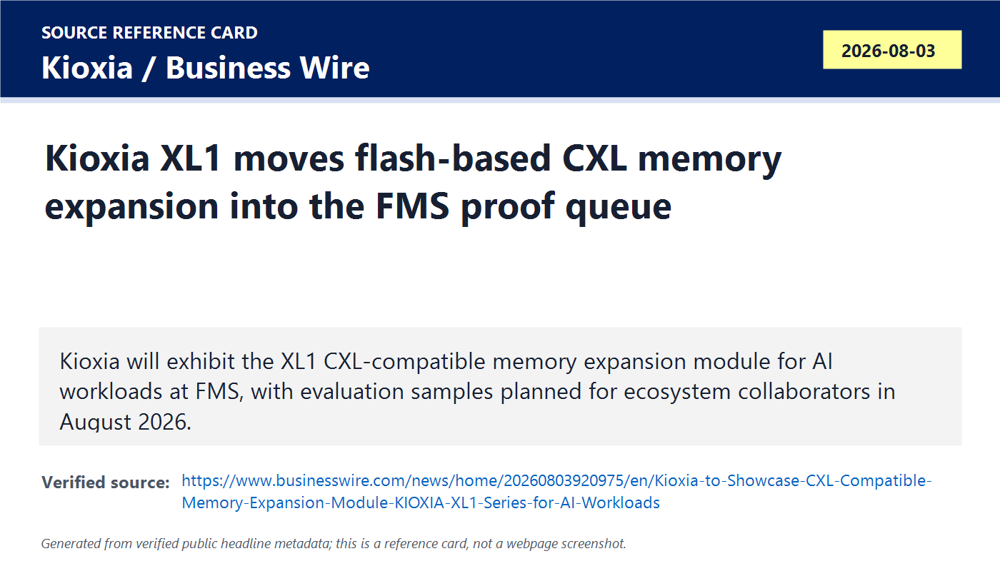
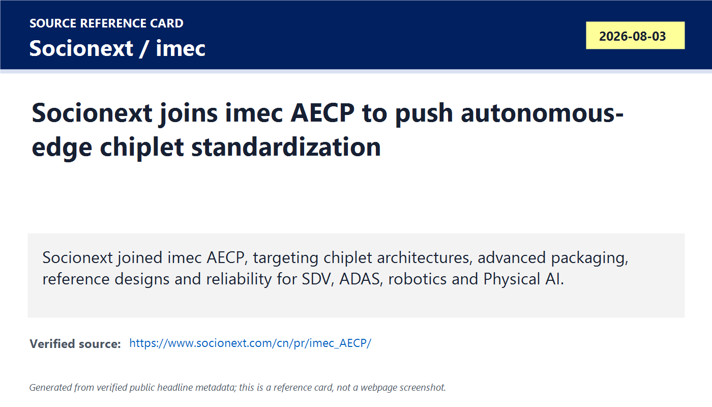
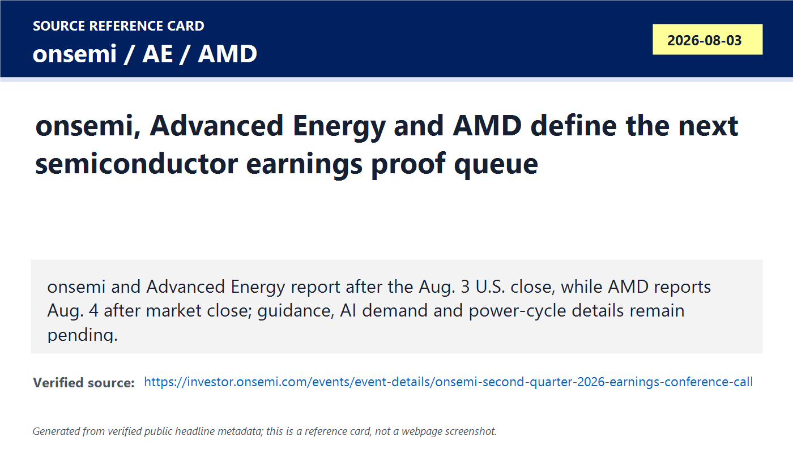
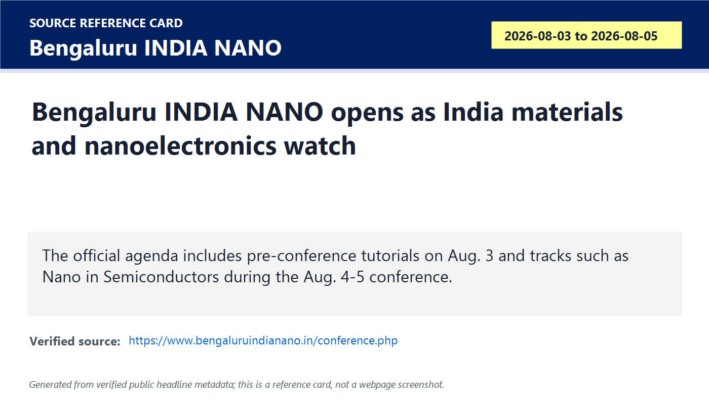
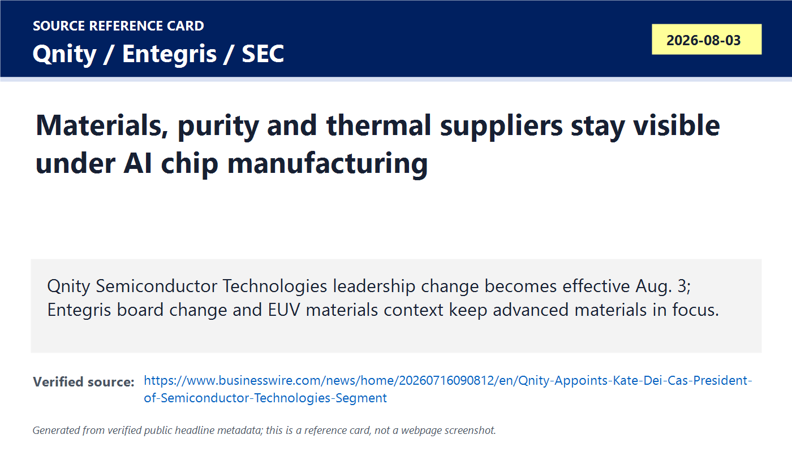
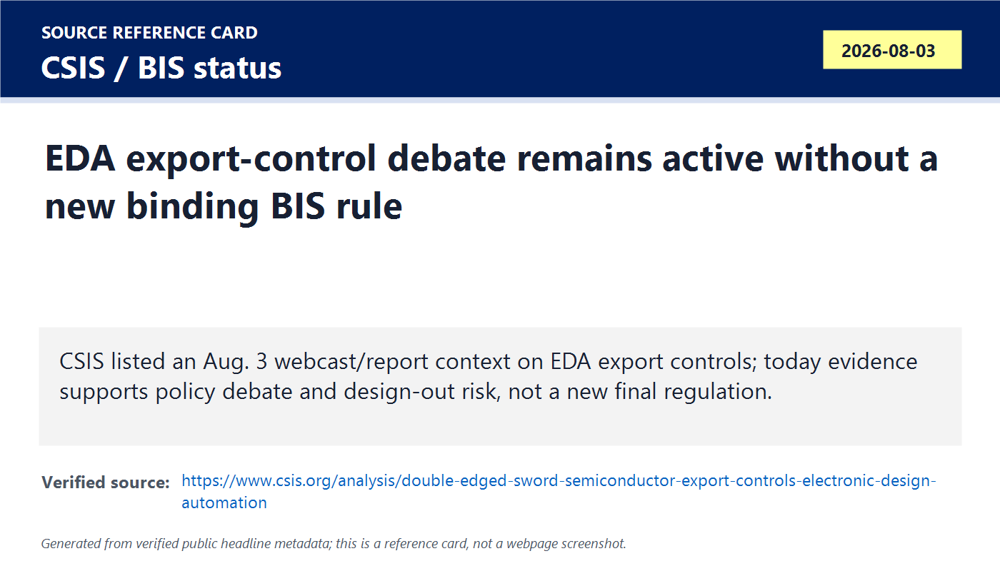
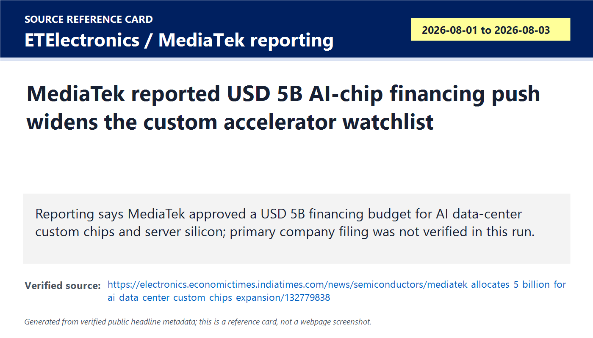

# Daily Semiconductor Current Affairs

Date: 2026-08-03

Research window: Monday update through approximately 15:50 IST on August 3, 2026. This is an exact-day note where possible, with one clearly labeled catch-up item from the July 30 to August 3 window. The main theme is proof discipline: Kioxia moved CXL memory expansion from conference setup into a product-evaluation item, Socionext joined imec's autonomous-edge chiplet program, earnings proof points are queued for onsemi, Advanced Energy and AMD, India Nano opened as a materials/talent signal, and policy/EDA export-control debate remains active without a new binding BIS rule verified before cutoff.

## Quick Index

| Date | Major Topic | Source Groups | Why To Read |
|---|---|---|---|
| 2026-08-03 | Kioxia XL1 makes flash-based CXL memory expansion an exact-day FMS item | Kioxia, Business Wire, CXL Consortium, Kioxia XL-FLASH page | Teaches why AI infrastructure is trying to place flash between DRAM and SSD rather than treating storage and memory as separate worlds. |
| 2026-08-03 | Socionext joins imec AECP for autonomous-edge chiplets | Socionext, imec, UCIe/Synopsys references | Shows why chiplet adoption depends on standards, functional safety, EDA, packaging and mass-production quality, not only die-to-die bandwidth. |
| 2026-08-03 | onsemi and Advanced Energy report today; AMD reports tomorrow | Official IR pages from onsemi, Advanced Energy and AMD | Sets the market-moving proof queue for power semiconductors, equipment power, AI accelerators, EPYC CPUs and data-center demand. |
| 2026-08-03 | Bengaluru INDIA NANO opens as India materials and nanoelectronics watch | Bengaluru INDIA NANO, Moneycontrol | Separates talent, materials and commercialization signals from actual manufacturing output. |
| 2026-08-03 | Qnity and Entegris keep materials, purity and thermal suppliers visible | Qnity, Entegris, SEC filing, Advanced Energy/onsemi context | Reminds you that AI chips need gases, chemicals, purity control, thermal paths and packaging materials as much as GPUs and fabs. |
| 2026-08-03 | CSIS EDA export-control debate stays active | CSIS, BIS status, Synopsys EDA/IP references | Explains why policy pressure is moving into design tools and IP, while distinguishing analysis from enforceable law. |
| 2026-08-03 | MediaTek reported USD 5B AI-chip financing push | ETElectronics, TaiwanPlus, MediaTek technical blog | A reported, not primary-verified, signal that custom AI accelerator ambitions are expanding beyond Nvidia/AMD/Broadcom. |
| 2026-08-03 | SEMICON West Phoenix move is a U.S. ecosystem geography catch-up | SEMI | Shows how conferences and supplier ecosystems follow manufacturing clusters, workforce pipelines and advanced-packaging locations. |

**Page navigation:** [Sources](#source-map) · [Concept review](#concept-review) · [Follow-up](#what-to-watch-next) · [Technical terms](#technical-terms-used-today) · [Master glossary](../knowledge-base/glossary.md)

## Technical Terms / Deep Definitions

Term: Evaluation sample
Definition: An evaluation sample is an early product unit shipped to selected partners so they can test compatibility, performance, firmware, software support, signal integrity, thermal behavior and use-case fit before commercial release. It solves the validation gap between a vendor announcement and real deployment: customers need hardware in their own systems before they can qualify it. In today's Kioxia item it matters because XL1 is not yet a broad commercial product; August 2026 samples are for ecosystem collaborators and some functions may not be fully tested. Example: an evaluation sample is like an engineering sample CPU: useful evidence, but not final volume availability. Source: https://www.businesswire.com/news/home/20260803920975/en/Kioxia-to-Showcase-CXL-Compatible-Memory-Expansion-Module-KIOXIA-XL1-Series-for-AI-Workloads

Term: Compute Express Link (CXL)
Definition: Compute Express Link, or CXL, is an industry-supported cache-coherent interconnect for processors, memory expansion devices and accelerators, built to let CPUs and attached devices share memory with less software and hardware duplication. It solves the data-center memory problem where one server lacks memory while another has unused capacity, or where an accelerator needs a larger memory space than local DRAM/HBM can provide. In today's Kioxia news, CXL matters because it is the interface that lets a flash-based module participate closer to the memory hierarchy instead of behaving only like a block SSD. Comparison: PCIe normally connects devices; CXL adds memory/coherency semantics on top of PCIe-style links. Source: https://computeexpresslink.org/about-cxl/

Term: CXL-compatible memory expansion module
Definition: A CXL-compatible memory expansion module is a device that attaches through CXL and exposes additional memory capacity to a host platform, usually as slower or differently managed memory than local DRAM. It solves capacity pressure in AI and data-center systems without forcing every server to be built with the maximum possible DRAM from day one. In today's news, Kioxia XL1 matters because it uses XL-FLASH behind CXL, so less frequently accessed data can move to a lower-cost tier while DRAM handles the hottest data. Example: local DRAM is the desk surface; CXL memory expansion is a nearby cabinet that is slower than the desk but much closer than a warehouse. Source: https://www.businesswire.com/news/home/20260803920975/en/Kioxia-to-Showcase-CXL-Compatible-Memory-Expansion-Module-KIOXIA-XL1-Series-for-AI-Workloads

Term: XL-FLASH
Definition: XL-FLASH is Kioxia's low-latency, high-performance flash memory designed to reduce the performance gap between volatile DRAM and ordinary NAND flash storage. It solves the problem that DRAM is fast but expensive and capacity-limited, while NAND is cheaper and persistent but traditionally too slow to behave like memory. In today's XL1 item, XL-FLASH is the physical media that makes a flash-backed CXL memory tier credible for less frequently accessed AI data. Comparison: ordinary SSD NAND is optimized for storage capacity; XL-FLASH is optimized to behave closer to storage-class memory. Source: https://europe.kioxia.com/en-mea/business/memory/xlflash.html

Term: Memory tiering
Definition: Memory tiering is the practice of placing data across multiple memory layers according to speed, cost, latency, bandwidth and access frequency. It solves the economic problem of keeping every byte in expensive DRAM or HBM even when some data is cold or only occasionally used. In today's Kioxia news, tiering matters because XL1 aims to place less frequently accessed data on a CXL flash module while keeping hotter data in DRAM. Example: HBM/DRAM handle the most urgent data, CXL memory handles warm data, and SSD/object storage handles colder data. Source: https://www.businesswire.com/news/home/20260803920975/en/Kioxia-to-Showcase-CXL-Compatible-Memory-Expansion-Module-KIOXIA-XL1-Series-for-AI-Workloads

Term: Chiplet
Definition: A chiplet is a smaller die that performs a defined function and is integrated with other dies inside an advanced package to form one larger system. It solves the yield, cost and design-reuse problem created by very large monolithic chips: smaller dies can be optimized separately, reused across products and combined through package-level interconnect. In today's Socionext/imec item, chiplets matter because autonomous cars, robots and edge-AI systems need scalable compute without redesigning one huge SoC for every vehicle or machine. Comparison: a monolithic SoC is one large printed book; chiplets are specialized chapters bound together in one package. Source: https://www.synopsys.com/glossary/what-is-ucie.html

Term: Advanced packaging
Definition: Advanced packaging is a set of manufacturing methods that combine multiple dies, memory stacks, substrates, interposers or other components into one high-density package to improve bandwidth, power efficiency, form factor and system performance. It solves the problem that transistor scaling alone no longer delivers enough performance per cost, especially for AI and automotive compute. In today's AECP item, advanced packaging matters because chiplets only become useful if the package can connect them reliably and at high bandwidth under real thermal and safety constraints. Example: 2.5D GPU plus HBM packaging is advanced packaging; a simple single-die plastic package is not enough for many AI/HPC systems. Source: https://semiconductorengine.org/about-the-engine/what-is-advanced-packaging/

Term: 2.5D/3D/5.5D packaging
Definition: 2.5D packaging places dies side by side on an interposer or advanced substrate, 3D packaging stacks dies vertically, and 5.5D is imec/Socionext language for more advanced combinations that blend interposer, stacking and heterogeneous integration approaches. It solves the data-movement problem by shortening interconnects between logic, memory, sensor and accelerator dies. In today's Socionext item, the term matters because AECP research explicitly targets leading-edge logic plus 2.5D/3D/5.5D packaging for autonomous systems. Comparison: 2.5D is like buildings on a shared platform; 3D is a vertical high-rise; 5.5D points to even more complex mixed layouts. Source: https://www.socionext.com/cn/pr/imec_AECP/

Term: Autonomous Edge Chiplet Program (AECP)
Definition: AECP is imec's collaborative research program that expands its Automotive Chiplet Program into autonomous edge domains such as vehicles, robotics and aerospace. It solves the ecosystem problem of making chiplets practical across companies: participants need common architectures, standards, reference designs, packaging rules, reliability targets and verification methods. In today's news, Socionext joining AECP matters because a chipmaker with automotive SoC experience is adding customer-specific chiplet and IP integration expertise to the program. Example: AECP is not a single product; it is a pre-competitive platform-building effort. Source: https://www.socionext.com/cn/pr/imec_AECP/

Term: Reference design
Definition: A reference design is a validated example architecture, board, package, chiplet arrangement or system flow that partners can reuse as a starting point. It solves the adoption-risk problem because customers do not want to invent every interface, power tree, safety mechanism and validation method from zero. In today's AECP item, reference designs matter because imec says the program aims to accelerate standardization and practical implementation of chiplet technology. Comparison: a reference design is like a known-good recipe; customers can modify it, but the baseline has already been tested. Source: https://www.socionext.com/cn/pr/imec_AECP/

Term: Functional safety
Definition: Functional safety is the discipline of designing electronic and software-controlled systems so that faults are detected, controlled or mitigated before they create unreasonable risk. It solves the safety problem in cars, robots and autonomous machines where a chip or software fault can affect steering, braking, sensing or motion. In today's Socionext/imec news, functional safety matters because automotive and Physical AI chiplets need long-term reliability and predictable failure behavior, not only peak TOPS. Example: ISO 26262 is a major road-vehicle functional-safety standard. Source: https://www.iso.org/standard/43464.html

Term: Software-defined vehicle (SDV)
Definition: A software-defined vehicle is a vehicle architecture where many features, controls, updates and user experiences are controlled by software running on centralized or zonal compute platforms rather than isolated fixed-function ECUs. It solves the flexibility and updateability problem in cars: automakers want to add, improve and monetize features after shipment. In today's AECP item, SDV matters because it increases demand for high-performance, reliable automotive compute, making chiplets and advanced packaging more relevant. Comparison: an older car has many separate appliance-like controllers; an SDV behaves more like a rolling compute platform. Source: https://www.synopsys.com/blogs/chip-design/software-defined-vehicles-synopsys-arm.html

Term: Physical AI
Definition: Physical AI means AI systems that sense, decide and act in the physical world, such as vehicles, robots, drones, factory machines, medical devices and autonomous infrastructure. It solves the gap between cloud AI and real-world action by placing compute close to sensors and actuators where latency, power and safety matter. In today's Socionext item, Physical AI matters because chiplet platforms built for autonomous cars can also serve robotics and edge systems. Example: a chatbot is mostly digital AI; an autonomous warehouse robot is Physical AI. Source: https://www.imec-int.com/en/articles/horsepower-high-performance-compute-automotive-chiplets-take-leap-towards-autonomous-edge

Term: Earnings checkpoint
Definition: An earnings checkpoint is a scheduled company financial release and conference call used to convert market expectations into verified revenue, margins, guidance, backlog, segment demand and management commentary. It solves the evidence problem in daily research: speculation is not the same as official numbers. In today's note, onsemi, Advanced Energy and AMD are checkpoints because their results occur after the India cutoff or on August 4, so the correct status is pending. Example: an earnings date is a proof gate, not proof itself. Source: https://investor.onsemi.com/events/event-details/onsemi-second-quarter-2026-earnings-conference-call

Term: Silicon carbide (SiC)
Definition: Silicon carbide is a wide-bandgap semiconductor material used to switch and convert power efficiently at higher voltages, temperatures and power levels than ordinary silicon. It solves the power-electronics problem in EVs, industrial drives, charging, solar and energy infrastructure where lower losses and smaller systems matter. In today's onsemi earnings watch, SiC matters because automotive and industrial recovery can affect demand for power devices, modules and capacity utilization. Comparison: silicon is the traditional power device material; SiC handles tougher high-voltage/high-temperature work with better efficiency. Source: https://www.onsemi.com/solutions/technology/silicon-carbide-sic

Term: Precision power conversion
Definition: Precision power conversion is the controlled conversion, measurement and regulation of electrical power for mission-critical systems such as semiconductor equipment, data centers, medical devices and telecom infrastructure. It solves the problem that advanced equipment cannot tolerate unstable voltage, inefficient conversion or poor control during plasma, deposition, etch, test or high-density compute operation. In today's Advanced Energy item, it matters because the company serves semiconductor equipment and AI data-center power architecture, making its earnings a read-through for tool and infrastructure demand. Example: a fab etch chamber needs tightly controlled RF/plasma power; an AI rack needs efficient DC power delivery. Source: https://www.advancedenergy.com/en-us/about/

Term: Power factor correction (PFC)
Definition: Power factor correction is a power-electronics function that shapes AC input current so electrical power is drawn more efficiently and with less reactive or distorted current. It solves the grid and power-supply efficiency problem when many high-power systems draw energy from AC mains. In today's Advanced Energy context, PFC matters because the company recently launched a high-density module, and AI data centers and semiconductor equipment both need efficient front-end power conversion. Comparison: poor power factor is like pulling current in messy bursts; PFC makes the load look cleaner to the grid and downstream converters. Source: https://www.advancedenergy.com/en-us/products/dc-dc-conversion-products/encapsulated-pcb-mount/pfc-bmp/

Term: Semiconductor materials
Definition: Semiconductor materials are the wafers, gases, chemicals, precursors, photoresists, dielectrics, metals, slurries, filters, packaging materials and thermal materials used to build and package chips. They solve the physical manufacturing problem: design files cannot become working silicon without atom-level material control. In today's Qnity/Entegris item, materials matter because AI chips require advanced process chemistry, purity control, thermal paths and packaging integration, not only leading-edge lithography. Example: a small contaminant in a high-purity chemical can become a killer defect on a wafer. Source: https://www.entegris.com/en/home/about-us/news/news-archive.html

Term: Advanced purity solutions
Definition: Advanced purity solutions are systems, filters, containers, handling methods and materials controls that keep semiconductor chemicals, gases and process fluids extremely clean. They solve the defectivity problem because modern chip features are so small that trace contamination can ruin yield. In today's Entegris context, purity matters because Entegris describes itself as a leader in advanced materials and purity solutions, and AI/HPC manufacturing raises the cost of every defect. Comparison: ordinary industrial cleanliness is not enough for nanometer-scale wafer processing. Source: https://www.entegris.com/en/home/about-us/news/news-archive.html

Term: Thermal interface material (TIM)
Definition: A thermal interface material is placed between a hot component and a heat spreader, lid, cold plate or heat sink to reduce microscopic air gaps and improve heat transfer. It solves the heat-removal problem in high-power chips and packages where poor thermal contact can throttle performance or reduce lifetime. In today's materials discussion, TIM matters because AI accelerators, HBM stacks and 2.5D/3D packages create high heat density that packaging materials must manage. Example: TIM is the bridge between a chip package and its cooling hardware; without it, heat transfer is much worse. Source: https://www.edge-ai-vision.com/2025/09/thermal-interface-materials-the-critical-heat-transfer-frontier-in-advanced-semiconductor-packaging/

Term: Nanotechnology commercialization
Definition: Nanotechnology commercialization is the process of moving nanoscale research, materials, fabrication methods, sensors or devices from lab results into manufacturable products, startups, process tools or industrial partnerships. It solves the gap between academic discovery and market impact. In today's Bengaluru INDIA NANO item, commercialization matters because the event theme and tracks focus on AI, semiconductors and practical deployment, but the proof is later MoUs, pilots, startups and manufacturing adoption. Example: a lab nanosensor becomes commercial only after manufacturable process, reliability, cost and customer use are proven. Source: https://www.bengaluruindianano.in/conference.php

Term: Electronic Design Automation (EDA)
Definition: Electronic Design Automation is the software and methodology stack used to design, simulate, verify, implement and sign off integrated circuits. It solves the complexity problem of building chips with billions of transistors by automating planning, RTL checks, synthesis, place-and-route, timing, power, verification and manufacturing preparation. In today's CSIS item, EDA matters because export controls on design tools can shape who can design advanced chips, not just who can fabricate them. Comparison: without EDA, modern VLSI design would be like trying to hand-draw an entire city map at transistor scale. Source: https://www.synopsys.com/glossary/what-is-electronic-design-automation.html

Term: Semiconductor IP
Definition: Semiconductor IP is a pre-designed and often pre-verified block of logic, memory, interface, security, analog or subsystem circuitry licensed for use inside a custom SoC. It solves time-to-market and verification risk because chip designers do not want to recreate every PCIe, memory controller, SerDes, CPU subsystem or security block from scratch. In today's EDA export-control discussion, IP matters because restricting EDA alone may not be enough if design know-how and reusable blocks can be sourced, copied or replaced. Example: a USB controller IP block is like a certified component inside a larger chip design. Source: https://www.synopsys.com/designware-ip.html

Term: Design-out
Definition: Design-out is the strategic removal or replacement of a foreign vendor, tool, IP block, material or component from a product or supply chain. It solves a dependency and sanctions-risk problem for restricted countries or customers, but can also reduce revenue and influence for the original supplier. In today's CSIS item, design-out matters because export controls on EDA may push Chinese firms to replace U.S. design software and IP over time, even if the transition is technically painful. Example: replacing a U.S. EDA tool with a domestic alternative is design-out. Source: https://www.csis.org/analysis/double-edged-sword-semiconductor-export-controls-electronic-design-automation

Term: Export controls
Definition: Export controls are legal restrictions on transferring specified goods, software, technology, services or know-how to certain countries, companies, people or end uses. They solve national-security and foreign-policy problems by limiting access to sensitive technology, but they can also reshape commercial incentives and accelerate local alternatives. In today's note, export controls matter because EDA, semiconductor IP, advanced tools, AI chips and memory sourcing are all policy pressure points. Example: a new BIS rule is binding law; a think-tank report or congressional letter is not binding by itself. Source: https://www.federalregister.gov/documents/2022/10/13/2022-21658/implementation-of-additional-export-controls-certain-advanced-computing-and-semiconductor

Term: Discretionary financing budget
Definition: A discretionary financing budget is a board-approved pool of funding that management can use flexibly for long-term growth, investments, capacity support, working capital, acquisitions, prepayments or supply-chain commitments within approved limits. It solves strategic optionality: a company can move quickly if a large customer, supply deal or capacity opportunity appears. In today's MediaTek item, the term matters because reporting says the board approved a USD 5B budget tied partly to AI data-center chip expansion, but the exact uses and primary company documentation were not verified in this run. Example: the budget is permission and capacity to finance; it is not automatically proof that USD 5B has already been spent. Source: https://electronics.economictimes.indiatimes.com/news/semiconductors/mediatek-allocates-5-billion-for-ai-data-center-custom-chips-expansion/132779838

Term: Custom AI accelerator
Definition: A custom AI accelerator is a chip designed for a particular customer's AI training, inference, networking or data-center workload rather than a general market GPU. It solves the efficiency and control problem for hyperscalers that want lower cost per token, better power efficiency, custom memory/networking choices and supply-chain leverage. In today's MediaTek reporting, custom AI accelerators matter because smartphone chipmakers are trying to enter cloud data-center silicon where customer-specific ASICs are a major growth lane. Comparison: Nvidia GPUs are broad platforms; a custom AI accelerator is closer to a tailored engine for one cloud provider's system. Source: https://www.mediatek.com/tek-talk-blogs/from-silicon-to-scale-inside-mediateks-ai-data-center-solution

Term: SEMICON West
Definition: SEMICON West is SEMI's North American semiconductor industry event covering the electronics design and manufacturing supply chain, including fabs, equipment, materials, packaging, test, workforce and policy. It solves the coordination problem for a fragmented supply chain by putting toolmakers, suppliers, customers, governments and talent programs in one event cycle. In today's catch-up item, the Phoenix move matters because events tend to follow where manufacturing clusters, workforce programs and supplier ecosystems are growing. Example: moving the event does not create capacity, but it signals where the supply-chain center of gravity is shifting. Source: https://www.semi.org/en/semi-press-release/semi-announces-new-spring-schedule-for-semicon-west-beginning-march-30-april-1-2027

Term: Semiconductor cluster
Definition: A semiconductor cluster is a geographic concentration of fabs, OSATs, equipment suppliers, materials companies, universities, utilities, workforce programs, logistics providers and government incentives. It solves the coordination and speed problem because semiconductor manufacturing depends on nearby suppliers, trained workers, reliable power/water, service engineers and repeatable logistics. In today's SEMICON West catch-up, Arizona's cluster matters because SEMI cites more than USD 200B in semiconductor investment since 2020 and workforce-development efforts as reasons Phoenix becomes the long-term home. Comparison: one fab is a facility; a cluster is the surrounding ecosystem that helps the facility ramp and survive. Source: https://www.semi.org/en/semi-press-release/semi-announces-new-spring-schedule-for-semicon-west-beginning-march-30-april-1-2027

## Source Images

## Source Map

| Source | Source date | Role | Confidence / limitation |
|---|---:|---|---|
| [Kioxia XL1 Business Wire release](https://www.businesswire.com/news/home/20260803920975/en/Kioxia-to-Showcase-CXL-Compatible-Memory-Expansion-Module-KIOXIA-XL1-Series-for-AI-Workloads), [Kioxia news page](https://www.kioxia.com/en-jp/news.html), [CXL Consortium overview](https://computeexpresslink.org/about-cxl/), and [Kioxia XL-FLASH page](https://europe.kioxia.com/en-mea/business/memory/xlflash.html) | 2026-08-03 | Exact-day memory/CXL evidence | Strong for announcement, event timing, media type and evaluation-sample status. Commercial release, latency, endurance, OS support and customer deployments remain pending. |
| [Socionext AECP release](https://www.socionext.com/cn/pr/imec_AECP/) and [imec AECP explainer](https://www.imec-int.com/en/articles/horsepower-high-performance-compute-automotive-chiplets-take-leap-towards-autonomous-edge) | 2026-08-03 / context reviewed today | Chiplet, automotive, robotics and Physical AI evidence | Strong official source for participation and program goals. No product tapeout, package qualification or customer deployment was announced today. |
| [onsemi Q2 event page](https://investor.onsemi.com/events/event-details/onsemi-second-quarter-2026-earnings-conference-call), [Advanced Energy press page](https://www.advancedenergy.com/en-us/about/news/press/), [Advanced Energy about page](https://www.advancedenergy.com/en-us/about/), and [AMD Q2 schedule](https://ir.amd.com/news-events/press-releases/detail/1289/amd-to-report-fiscal-second-quarter-2026-financial-results) | 2026-08-03 / 2026-08-04 | Earnings proof queue | Strong for timing and business segments. Results and guidance were pending at the India cutoff. |
| [Bengaluru INDIA NANO official site](https://www.bengaluruindianano.in/), [conference page](https://www.bengaluruindianano.in/conference.php), and [Moneycontrol report](https://www.moneycontrol.com/news/business/bengaluru-india-nano-2026-to-spotlight-ai-semiconductors-and-nanotech-commercialisation-from-august-3-5-13983428.html) | 2026-08-03 to 2026-08-05 | India materials, nanoelectronics and skilling watch | Strong for agenda and event scope. This is talent/research/commercialization evidence, not manufacturing output. |
| [Qnity leadership release](https://www.businesswire.com/news/home/20260716090812/en/Qnity-Appoints-Kate-Dei-Cas-President-of-Semiconductor-Technologies-Segment), [Entegris news archive](https://www.entegris.com/en/home/about-us/news/news-archive.html), and [Entegris 8-K](https://www.sec.gov/Archives/edgar/data/1101302/000110130226000141/entg-20260728.htm) | Effective 2026-08-03 / filings 2026-07-29 | Materials, purity and supplier governance context | Strong for leadership/effective-date facts and SEC board disclosure. Treat as ecosystem signal, not direct demand proof. |
| [CSIS EDA export-controls page](https://www.csis.org/analysis/double-edged-sword-semiconductor-export-controls-electronic-design-automation), [Synopsys EDA definition](https://www.synopsys.com/glossary/what-is-electronic-design-automation.html), [Synopsys semiconductor IP page](https://www.synopsys.com/designware-ip.html), and [BIS/Federal Register advanced-computing control baseline](https://www.federalregister.gov/documents/2022/10/13/2022-21658/implementation-of-additional-export-controls-certain-advanced-computing-and-semiconductor) | CSIS webcast listed for 2026-08-03 | Policy/export-control and EDA/IP study item | Strong as policy analysis and debate; no new binding BIS final rule was verified before cutoff. |
| [ETElectronics MediaTek report](https://electronics.economictimes.indiatimes.com/news/semiconductors/mediatek-allocates-5-billion-for-ai-data-center-custom-chips-expansion/132779838), [TaiwanPlus report](https://www.taiwanplus.com/news/taiwan-news/business/260802005/mediatek-plans-us5b-expansion-into-ai-data-center-chips), and [MediaTek AI data-center blog](https://www.mediatek.com/tek-talk-blogs/from-silicon-to-scale-inside-mediateks-ai-data-center-solution) | 2026-08-01 to 2026-08-03 | Reported custom AI-chip financing signal | Treated as reported, not primary-verified in this run. Need MediaTek filing or official release before closing as confirmed corporate action. |
| [SEMI SEMICON West Phoenix release](https://www.semi.org/en/semi-press-release/semi-announces-new-spring-schedule-for-semicon-west-beginning-march-30-april-1-2027) and [SEMICON West 2026 page](https://www.semiconwest.org/about/welcome) | 2026-07-30 catch-up | U.S. semiconductor geography and ecosystem watch | Strong for event move and dates. This is cluster signal, not new fab-capacity proof. |

## Deep Briefing

### 1. Kioxia XL1 Turns CXL Memory Expansion Into A Product-Evaluation Item

**Confirmed facts:** Kioxia announced that it will exhibit the KIOXIA XL1 series at FMS in Santa Clara from August 4-6. The company describes XL1 as a CXL-compatible memory expansion module using low-latency XL-FLASH. Kioxia says the module is designed for memory-intensive AI workloads, improves DRAM utilization by placing less frequently accessed data on the module, and bridges the performance/cost gap between conventional DRAM and SSDs. Evaluation samples are scheduled for industry ecosystem collaborators in August 2026, and Kioxia explicitly cautions that the sample drives are for evaluation, some functions may not be fully tested, and specifications can change.

**Analysis:** This is more useful than the generic FMS setup from August 2 because it is a named product and a sampling schedule. It does not prove commercial deployment. The evidence ladder is: announcement, event demo, evaluation sample, software stack support, platform qualification, customer proof-of-concept, performance/power/endurance disclosure, volume release and then data-center deployment. XL1 is around the evaluation-sample stage.

**Why it matters:** AI infrastructure is moving from "buy more GPUs" to "feed the compute stack more intelligently." HBM is fast but scarce and expensive; DRAM is fast but costly at scale; SSDs have capacity but behave like storage. CXL-backed XL-FLASH tries to put a flash tier into the memory hierarchy so a server can keep hot data in DRAM and warm/cold-but-needed data in a cheaper attached memory tier. If it works, it can improve memory capacity economics for inference, vector search, retrieval, caching and large data pipelines.

**What can go wrong:** Flash endurance, write amplification, page-management policy, Linux/kernel support, CXL latency overhead, application placement, telemetry, cooling, reliability and customer software integration can all decide whether the module becomes useful beyond demos. AI inference does not automatically benefit from every extra memory tier; the access pattern must match the latency/capacity tradeoff.

**India angle:** India can study and work in this layer even without a leading-edge fab. Roles include CXL verification, PCIe signal integrity, firmware, Linux memory management, storage-class memory benchmarking, board validation, thermal testing and data-center software. Indian data-center operators should also watch whether memory tiering reduces AI serving costs or only adds complexity.

**VLSI/career relevance:** For interviews, explain memory hierarchy with numbers and tradeoffs: HBM/DRAM/CXL memory/SSD differ by latency, bandwidth, capacity, cost, persistence and software handling. A strong answer should say that CXL is not "faster SSD"; it is an interconnect enabling memory-semantic access to attached capacity.

### 2. Socionext Joining imec AECP Shows Chiplets Need Ecosystem Discipline

**Confirmed facts:** Socionext announced on August 3 that it joined imec's Autonomous Edge Chiplet Program. The company says participation supports practical chiplet adoption for autonomous applications and high-performance, high-quality leading-edge SoCs. The release connects the need to software-defined vehicles, ADAS, autonomous driving, robotics, aerospace and Physical AI. It says chiplets can improve performance, flexibility and development efficiency, but complexity, design quality and mass-production quality remain challenges. It also says AECP promotes verification of chiplet architectures and advanced packaging against requirements for performance, functional safety, reliability and long-term supply, with standardization and reference designs as goals.

**Analysis:** This is a real chipmaker/ecosystem update, not just another research headline. Socionext's value is its custom SoC and automotive experience. imec's value is the shared pre-competitive platform where automakers, robotics companies, EDA vendors, semiconductor firms and packaging participants can align. The important point is that autonomous-edge chiplets are not only a UCIe interconnect problem. The hard parts are partitioning, latency, package thermals, fault containment, functional safety, DFT, known-good-die testing, supply longevity, software platform stability and vendor interoperability.

**Why it matters:** Automotive and robotic systems are brutal test cases for chiplets. A cloud AI board can often be replaced or rebooted; a car or robot must operate safely, in temperature extremes, for long life cycles, under cost pressure. If chiplets survive automotive requirements, the architecture becomes more credible for many edge-AI systems. If they fail safety and qualification requirements, monolithic or tightly controlled custom platforms remain stronger.

**India angle:** India already has design-services, verification, embedded and automotive software talent. AECP-type ecosystems create demand for engineers who can validate IP blocks, run ISO 26262-oriented flows, verify interconnect protocols, create DFT strategies for multi-die systems, and reason about packaging parasitics. India should connect its OSAT ambitions with chiplet test and reliability capability, not only with basic assembly.

**VLSI/career relevance:** Study SoC partitioning, UCIe concepts, interposer/substrate routing, DFT for chiplets, boundary scan, built-in self-test, safety mechanisms, reset/isolation domains and reliability qualification. A good interview answer should distinguish "chiplet as a die" from "chiplet as a qualified multi-vendor product ecosystem."

### 3. The Earnings Proof Queue Is About Power, Equipment And AI Demand Quality

**Confirmed facts:** onsemi's official event page lists its Q2 2026 earnings conference call for August 3 at 5:00 PM EDT. Advanced Energy says it will report Q2 2026 results after the market closes on August 3, with a call at 4:30 PM ET. AMD says it will report fiscal Q2 2026 results on Tuesday, August 4 after market close, with a call at 5:00 PM ET / 2:00 PM PT. At the India cutoff for this note, onsemi and Advanced Energy results had not yet landed, and AMD was still tomorrow's event.

**Analysis:** These are not news outcomes yet; they are evidence checkpoints. The correct action is to define what each result must answer. onsemi is important for automotive/industrial semiconductors, image sensors, power devices and SiC demand. Advanced Energy is important because its power conversion and control systems touch semiconductor equipment and AI data-center power architecture. AMD is important because the market will test whether EPYC, Instinct/MI accelerators, ROCm, hyperscaler demand and AI infrastructure spending are translating into official revenue and guidance.

**Why it matters:** The semiconductor market is currently split. AI infrastructure and memory look strong, but auto/industrial and handset areas have been uneven. Earnings can show whether the cycle is broadening or staying concentrated around a few AI and memory winners. Also, AI data centers are no longer only a GPU question; they need power conversion, cooling, server CPUs, networking, memory, storage and procurement discipline.

**What to watch after the calls:** For onsemi, watch automotive/industrial growth, SiC utilization, gross margin, inventory, Fab Right updates and customer demand. For Advanced Energy, watch semiconductor-equipment demand, service revenue, AI data-center power commentary, margins and backlog. For AMD, watch data-center revenue, MI-series accelerator shipments, EPYC adoption, hyperscaler/customer concentration, ROCm/software commentary, gross margin and 2H guidance.

**India angle:** Indian VLSI students should treat earnings as a way to map where hiring and project demand may appear: power electronics, firmware, validation, EDA compute, embedded AI, storage and data-center hardware. Indian electronics companies should also watch if power and memory costs keep rising because those affect BOM and infrastructure budgets.

**VLSI/career relevance:** Learn to read financial releases without losing engineering focus. Revenue by segment tells you where designs are shipping. Gross margin and inventory tell you whether supply/demand is healthy. Capex and backlog tell you whether tool and factory demand is real. Guidance tells you management's next-quarter confidence.

### 4. Bengaluru INDIA NANO Opens As A Materials And Talent Signal

**Confirmed facts:** Bengaluru INDIA NANO 2026 runs from August 3-5 in Bengaluru. The official site says August 3 is dedicated to pre-event tutorials, while the main conference and exhibition run August 4-5. The conference page says the program includes tracks such as Nano in Semiconductors, Nano in Agriculture & Health and Nano in Energy & Environment. Moneycontrol reports that the event includes pre-conference tutorials covering advanced semiconductor manufacturing, AI for science and engineering, and nano-characterisation, with more than 80 global speakers and about 1,000 delegates.

**Analysis:** This is an India semiconductor ecosystem item, but not a production milestone. It should be valued for the right reasons: materials education, nanofabrication awareness, process characterization, startup exposure, lab-to-industry links and workforce formation. Semiconductor manufacturing is not just lithography machines; it is physics, chemistry, metrology, materials, contamination control and reliability. India needs this knowledge base if it wants credible process, packaging, sensor and compound-semiconductor capability.

**Why it matters:** AI chips are becoming materials-limited. HBM, interposers, substrates, thermal interface materials, underfills, dielectrics, photoresists, high-purity gases and metrology all affect yield and performance. A national ecosystem that ignores materials will stay stuck at slogans and assembly. Events like India Nano can create the vocabulary and cross-disciplinary networks needed for later manufacturing depth.

**India angle:** Karnataka already has strong design, embedded and startup talent. The opportunity is to connect design engineers with materials scientists, nanofabrication labs, characterization equipment and packaging engineers. The proof to watch after the event is not speeches; it is MoUs, funded pilots, startup outcomes, lab access, internships, process-training numbers and industry qualification pathways.

**VLSI/career relevance:** Students should revise device physics, thin films, defects, metrology, packaging materials, lithography basics, reliability and thermal engineering. If you are only learning RTL, add at least enough process/materials literacy to understand why physical implementation and yield constraints exist.

### 5. Qnity And Entegris Show The Below-Fab Materials Layer

**Confirmed facts:** Qnity said Kate Dei Cas becomes President of its Semiconductor Technologies segment effective August 3. The release describes Qnity as a technology provider across the semiconductor value chain, with high-performance materials and integration expertise for AI, HPC and advanced connectivity. Entegris announced that Robert A. Bruggeworth, Qorvo CEO, joins its board effective August 3, and an SEC 8-K confirms the board appointment and related governance details. Entegris' archive also describes the company as a leader in advanced materials and purity solutions for the semiconductor industry and includes a May 2026 EUV lithography cross-licensing item with JSR/Inpria.

**Analysis:** Leadership and board moves are not demand proof by themselves. The reason they belong in today's note is that materials suppliers are becoming strategic under AI scaling. A GPU is only visible at the end of the chain. Before that, fabs and OSATs need gases, chemicals, filters, containers, wet process control, photoresist ecosystems, advanced packaging materials and thermal paths. AI/HPC increases die size, power density, package complexity and defect cost, so materials and purity suppliers matter more, not less.

**Why it matters:** A fab can spend billions on tools and still fail yield if materials, contamination control, slurry chemistry, gas delivery, photoresist performance or thermal packaging are weak. Advanced packaging also shifts value into underfills, bonding materials, substrates and thermal interface materials. The materials layer is less glamorous but often decides whether advanced-node and HBM systems can be manufactured at scale.

**India angle:** India should not only chase fabs. Materials, gases, filters, substrates, chemicals, tooling components, thermal materials and process support are realistic ecosystem entry points. Bengaluru INDIA NANO, India Semiconductor Mission skilling, and OSAT projects should connect to this layer. The next proof is supplier qualification, not only local production announcements.

**VLSI/career relevance:** If you work in physical design or packaging-aware design, materials are not optional background. Power integrity, electromigration, thermal resistance, package warpage and signal integrity all depend on physical materials and process constraints.

### 6. CSIS Keeps EDA Export Controls In The Policy Debate, But No New Rule Was Verified

**Confirmed facts:** CSIS listed an August 3 webcast/report context around "The Double-Edged Sword of Semiconductor Export Controls: Electronic Design Automation." The underlying CSIS line of analysis focuses on how controls on EDA and core design IP affect China design-out and design-around strategies. Synopsys' technical pages define EDA as the tools used to design and build chips and show that semiconductor IP is a reusable, silicon-proven block portfolio for SoC designs. No new binding BIS final rule on EDA was verified before this note's cutoff.

**Analysis:** This is a policy analysis item, not a legal change. That distinction matters. A congressional letter, think-tank report or webcast can influence future rules, but companies comply with actual BIS rules, Entity List updates, license requirements and contract restrictions. The strategic risk is still real: if U.S. controls on EDA and IP become too broad, Chinese firms may invest harder in domestic design tools and IP. Controls can slow near-term capability but accelerate long-term substitution.

**Why it matters:** EDA is a hidden chokepoint. Advanced chips require synthesis, physical implementation, timing signoff, power signoff, verification, analog/mixed-signal tools, DFT, emulation, formal verification, package/thermal analysis and foundry-qualified flows. If a country cannot access leading EDA/IP, its design productivity suffers. But if it designs out foreign tools, U.S. and allied vendors can lose revenue, telemetry, standards influence and customer lock-in.

**India angle:** India benefits from access to leading EDA tools, global design IP and multinational design centers. It should strengthen local design talent, open-source EDA literacy and domestic IP capability without isolating itself from global tooling. For students, EDA is not just software; it is national competitiveness infrastructure.

**VLSI/career relevance:** Learn at least one front-end and one back-end tool conceptually: RTL simulation, synthesis, static timing analysis, place-and-route, DRC/LVS, signoff and power analysis. In an interview, explain why export controls on EDA affect chip design even if no wafer fab is involved.

### 7. MediaTek AI-Chip Financing Is A Reported Signal, Not A Closed Fact

**Confirmed facts from reporting:** ETElectronics and TaiwanPlus report that MediaTek approved a USD 5B budget to support long-term growth including AI data-center chips. ETElectronics says MediaTek expects data-center AI chip revenue above USD 2B in 2026 and that its first custom AI chip is scheduled for Q4 2026. MediaTek's own technical blog gives context that it is positioning around AI data-center ASICs and a large addressable market, but this run did not verify the primary board filing or a detailed official release for the reported USD 5B budget.

**Analysis:** Treat this as a market-moving watch item, not final evidence. MediaTek has strong SoC, connectivity, IP integration and high-volume customer experience. But custom AI accelerators for data centers are a different business: they require customer-specific architecture, advanced packaging, HBM/DRAM supply, foundry allocation, firmware/software, data-center validation, networking, power/thermal engineering and long product support. Financing permission does not equal booked revenue or qualified silicon.

**Why it matters:** The AI accelerator market is widening from Nvidia/AMD/Broadcom/Marvell-style stories into custom ASIC programs from more chip designers. Hyperscalers want cost, supply leverage and workload optimization. If MediaTek executes, it can diversify beyond smartphones. If not, the financing headline may fade into another ambition story.

**India angle:** India should watch custom silicon because it creates roles in architecture, RTL, verification, DFT, software, package integration, board validation and data-center deployment. Indian design centers may participate even when fabrication and packaging happen elsewhere.

**VLSI/career relevance:** Learn the difference between GPU, ASIC, ASSP and custom accelerator. A custom accelerator trades general flexibility for power/performance/cost fit to a target workload. The job skill is not just Verilog; it is workload understanding, memory hierarchy, interconnect, compiler/runtime and system validation.

### 8. SEMICON West Phoenix Move Is Catch-Up Evidence Of Cluster Gravity

**Catch-up label:** This source is from July 30, not exact August 3. It is included because it affects the U.S. semiconductor ecosystem and was still relevant in the last-72-hour catch-up window.

**Confirmed facts:** SEMI announced that SEMICON West will begin a new annual spring schedule from March 30-April 1, 2027 at the Phoenix Convention Center, with Phoenix becoming the long-term home of the event. SEMI says future events are scheduled for May 9-11, 2028 and April 3-5, 2029. SEMICON West 2026 still runs October 13-15 at Moscone Center in San Francisco. SEMI says Phoenix's semiconductor ecosystem has attracted more than USD 200B in investments since 2020 and cites workforce development, jobs and advanced manufacturing momentum.

**Analysis:** An event relocation does not create fab capacity. But it is a strong ecosystem signal. Conferences follow customers, suppliers, workforce programs, governments and logistics. Arizona's cluster now includes foundry, packaging, equipment, materials and training momentum, so SEMI is aligning its flagship North American event with where manufacturing execution is increasingly visible.

**Why it matters:** Semiconductor manufacturing is geographic. Fabs need power, water, land, local suppliers, trained technicians, universities, government incentives, logistics and rapid equipment service. A cluster can reduce friction and create repeated learning. That is why Taiwan, Korea, Arizona, Hsinchu, Dresden, Singapore and parts of Japan matter as ecosystems, not only as single facilities.

**India angle:** India should study Phoenix carefully. A state does not become a semiconductor hub by announcing one project. It needs repeatable utilities, workforce, supplier qualification, local services, reliability labs, logistics and policy continuity. SEMICON India can play a similar convening role only if project execution follows.

**VLSI/career relevance:** Engineers should understand geography as a technical constraint. A fab's ramp depends on people, spares, chemicals, water, power, cleanroom contractors and field service. These are not "business-only" issues; they determine yield and schedule.

## Verification Matrix

| Item | Evidence status | Confirmed facts | Analysis boundary |
|---|---|---|---|
| Kioxia XL1 | Confirmed announcement and evaluation-sample plan | Official/Business Wire release says FMS exhibit, CXL interface, XL-FLASH media and August 2026 evaluation samples | Commercial release, performance, endurance, OS support and customer deployments remain unproven. |
| Socionext AECP | Confirmed official participation | Socionext says it joined imec AECP and targets chiplet standardization, reference designs, safety and reliability | No product, tapeout, standard completion or mass-production proof today. |
| onsemi / Advanced Energy / AMD | Confirmed schedules only | Official IR pages set earnings dates and calls | Results and guidance pending after cutoff / tomorrow. |
| Bengaluru INDIA NANO | Confirmed official event agenda | Official site confirms Aug. 3 tutorials and Aug. 4-5 conference with Nano in Semiconductors | Talent/materials signal, not manufacturing output. |
| Qnity / Entegris | Confirmed leadership and board facts | Qnity effective-date release; Entegris news/SEC filing | Supplier-governance/materials signal, not direct demand proof. |
| CSIS EDA controls | Confirmed policy discussion | CSIS webcast/report context exists; EDA/IP definitions from Synopsys | No new binding BIS rule verified. |
| MediaTek AI-chip financing | Reported, not primary closed | Reputable reporting says USD 5B financing budget and AI data-center push | Needs official filing/release, customer proof and silicon schedule evidence. |
| SEMICON West Phoenix | Confirmed catch-up | SEMI official release gives Phoenix/spring schedule and investment context | Event move signals cluster gravity, not new capacity by itself. |

## Concept Review

| Concept | Plain Explanation | Why It Matters Today | Revise Next |
|---|---|---|---|
| Memory hierarchy | Systems use multiple layers of memory/storage because no one medium is cheapest, fastest and largest at the same time. | Kioxia XL1 tries to add a CXL flash tier between DRAM and SSD for AI workloads. | DRAM, NAND, HBM, SSD, CXL.mem, Linux NUMA. |
| Chiplet adoption | Chiplets split a system into smaller dies, but the ecosystem must solve interconnect, package, test, safety and supply. | Socionext/imec AECP is about making autonomous-edge chiplets practical, not just theoretical. | UCIe, interposers, known-good die, DFT, ISO 26262. |
| Earnings as evidence | Earnings are official proof checkpoints for demand, margin, inventory and guidance. | onsemi, Advanced Energy and AMD are queued; do not close them before results land. | Segment revenue, gross margin, capex, backlog, guidance. |
| Materials as scaling limiter | Chips are built from controlled materials and process chemistry, not only design files. | Qnity, Entegris and India Nano show that materials/purity/thermal topics remain central. | Defectivity, contamination, TIMs, photoresist, precursor chemistry. |
| Export controls below hardware | Policy can target design tools, IP and know-how, not only chips and lithography machines. | CSIS EDA discussion highlights design-out risk and policy tradeoffs. | BIS, Entity List, EDA flow, semiconductor IP licensing. |

## Follow-ups From Previous Research

| Prior item | Status today | Update |
|---|---|---|
| FMS memory/storage proof queue from August 2 | Updated | Kioxia XL1 adds a named CXL memory expansion module and August evaluation-sample plan; live demo evidence from FMS August 4-6 remains pending. |
| ASIP Visakhapatnam India OSAT foundation from August 2 | Still pending beyond foundation | No new production, tool-install, qualification, customer or shipment evidence was verified today. |
| Bengaluru INDIA NANO watch from July 25/August 2 | Updated | Event opened with August 3 tutorial day; main conference outcomes, MoUs, pilots and startup evidence remain pending. |
| Nvidia financing/circular-demand risk from August 2 | Still pending | No official Nvidia/OpenAI binding document was verified today. Keep it as reported market-risk context. |
| China DUV / ASML parity question from August 2 | Still pending | No direct Chinese primary source, customer shipment, overlay, throughput, uptime, yield or HVM proof was verified today. |
| CXMT/YMTC/Apple sourcing policy pressure | Still pending | No new BIS Entity List or final rule action was verified before cutoff; Apple response watch remains open around August 21. |
| AMD post-AAI execution proof | Still pending | AMD reports Q2 on August 4 after market close; watch AI accelerator revenue, EPYC, customer demand, ROCm and guidance. |
| onsemi/Advanced Energy evidence queue | Still pending | Both report after the August 3 U.S. close; update next note after official numbers and guidance are available. |

## Interview Questions

1. Why is Kioxia XL1 better described as memory expansion than as a normal SSD?
2. What problem does CXL solve that ordinary PCIe storage does not solve?
3. Why might flash-backed CXL memory help some AI workloads but not all workloads?
4. What are the hardest barriers to automotive chiplet adoption?
5. Why is functional safety more important in automotive/robotics chiplets than in ordinary consumer chips?
6. How do earnings results help verify semiconductor current-affairs claims?
7. Why do semiconductor materials suppliers matter during an AI chip boom?
8. What is the difference between a policy report and a binding export-control rule?
9. Why should a USD 5B financing headline be treated differently from confirmed product revenue?
10. What makes a semiconductor cluster stronger than a single semiconductor facility?

## Simple Explanation

Today's semiconductor news is about the layers below the obvious headlines. Kioxia is trying to make flash act closer to memory for AI servers. Socionext and imec are trying to make chiplets safe and reusable for cars, robots and other autonomous machines. onsemi, Advanced Energy and AMD are about to give official numbers that will show whether demand is broadening beyond headlines. India Nano is important because semiconductors need materials and measurement talent, not only coding. CSIS reminds us that export controls can target design software and IP, not only machines and GPUs.

The practical lesson: every semiconductor headline should be placed on an evidence ladder. Announcement is not production. Evaluation sample is not deployment. Event agenda is not output. Policy analysis is not binding law. Earnings schedule is not results. This discipline keeps the notebook useful for review.

## What To Watch Next

- Kioxia XL1: FMS demo details, latency, endurance, capacity, form factor, OS/kernel support, customer PoCs and commercial release plan.
- Socionext/imec AECP: reference design releases, participants, UCIe/interconnect choices, packaging demos, safety documentation and automotive/robotics proof.
- onsemi: Q2 revenue, auto/industrial recovery, SiC utilization, inventory and Fab Right commentary.
- Advanced Energy: semiconductor-equipment demand, AI data-center power commentary, backlog, margins and PFC/DC-DC product traction.
- AMD: Q2 data-center revenue, MI accelerator shipments, EPYC demand, ROCm ecosystem, gross margin and 2H guidance.
- Bengaluru INDIA NANO: post-event MoUs, startup pilots, training outcomes, lab access and semiconductor materials/process partnerships.
- CSIS/BIS: any actual BIS rule, Entity List update or licensing change affecting EDA, IP, tools, China or memory sourcing.
- MediaTek: official filing/release for the USD 5B budget, customer names, node, packaging, HBM/memory supply and first custom AI-chip production evidence.
- SEMICON West/Phoenix: supplier announcements, workforce programs, tool/materials investments and whether SEMICON West 2027 becomes more manufacturing-execution focused.

## Final Takeaway

August 3 is not dominated by one giant fab or GPU launch. It is a systems day: memory tiering, autonomous-edge chiplets, earnings proof gates, materials suppliers, India nanoelectronics, EDA controls and cluster geography. The strongest confirmed item is Kioxia XL1 because it is exact-day product-evaluation evidence. The most strategically important open items are the U.S. earnings calls, AMD's August 4 results, FMS live demos, and whether reported AI-chip financing turns into official silicon and customer proof.

## Technical Terms Used Today

[Back to quick index](#quick-index) · [Open the master A-Z glossary](../knowledge-base/glossary.md)

**Term index:** [2.5D/3D/5.5D packaging](#daily-term-2-5d-3d-5-5d-packaging) · [Advanced packaging](#daily-term-advanced-packaging) · [Advanced purity solutions](#daily-term-advanced-purity-solutions) · [Autonomous Edge Chiplet Program (AECP)](#daily-term-autonomous-edge-chiplet-program-aecp) · [Chiplet](#daily-term-chiplet) · [Compute Express Link (CXL)](#daily-term-compute-express-link-cxl) · [Custom AI accelerator](#daily-term-custom-ai-accelerator) · [CXL-compatible memory expansion module](#daily-term-cxl-compatible-memory-expansion-module) · [Design-out](#daily-term-design-out) · [Discretionary financing budget](#daily-term-discretionary-financing-budget) · [Earnings checkpoint](#daily-term-earnings-checkpoint) · [Electronic Design Automation (EDA)](#daily-term-electronic-design-automation-eda) · [Evaluation sample](#daily-term-evaluation-sample) · [Export controls](#daily-term-export-controls) · [Functional safety](#daily-term-functional-safety) · [Memory tiering](#daily-term-memory-tiering) · [Nanotechnology commercialization](#daily-term-nanotechnology-commercialization) · [Physical AI](#daily-term-physical-ai) · [Power factor correction (PFC)](#daily-term-power-factor-correction-pfc) · [Precision power conversion](#daily-term-precision-power-conversion) · [Reference design](#daily-term-reference-design) · [SEMICON West](#daily-term-semicon-west) · [Semiconductor cluster](#daily-term-semiconductor-cluster) · [Semiconductor IP](#daily-term-semiconductor-ip) · [Semiconductor materials](#daily-term-semiconductor-materials) · [Silicon carbide (SiC)](#daily-term-silicon-carbide-sic) · [Software-defined vehicle (SDV)](#daily-term-software-defined-vehicle-sdv) · [Thermal interface material (TIM)](#daily-term-thermal-interface-material-tim) · [XL-FLASH](#daily-term-xl-flash)

| Term | Meaning |
|---|---|
| [**2.5D/3D/5.5D packaging**](../knowledge-base/glossary.md#term-2-5d-3d-5-5d-packaging) | 2.5D packaging places dies side by side on an interposer or advanced substrate, 3D packaging stacks dies vertically, and 5.5D is imec/Socionext language for more advanced combinations that blend interposer, stacking and heterogeneous integration approaches. It solves the data-movement problem by shortening interconnects between logic, memory, sensor and accelerator dies. |
| [**Advanced packaging**](../knowledge-base/glossary.md#term-advanced-packaging) | Advanced packaging is a set of manufacturing methods that combine multiple dies, memory stacks, substrates, interposers or other components into one high-density package to improve bandwidth, power efficiency, form factor and system performance. It solves the problem that transistor scaling alone no longer delivers enough performance per cost, especially for AI and automotive compute. |
| [**Advanced purity solutions**](../knowledge-base/glossary.md#term-advanced-purity-solutions) | Advanced purity solutions are systems, filters, containers, handling methods and materials controls that keep semiconductor chemicals, gases and process fluids extremely clean. They solve the defectivity problem because modern chip features are so small that trace contamination can ruin yield. |
| [**Autonomous Edge Chiplet Program (AECP)**](../knowledge-base/glossary.md#term-autonomous-edge-chiplet-program-aecp) | AECP is imec's collaborative research program that expands its Automotive Chiplet Program into autonomous edge domains such as vehicles, robotics and aerospace. It solves the ecosystem problem of making chiplets practical across companies: participants need common architectures, standards, reference designs, packaging rules, reliability targets and verification methods. |
| [**Chiplet**](../knowledge-base/glossary.md#term-chiplet) | A chiplet is a smaller die that performs a defined function and is integrated with other dies inside an advanced package to form one larger system. It solves the yield, cost and design-reuse problem created by very large monolithic chips: smaller dies can be optimized separately, reused across products and combined through package-level interconnect. |
| [**Compute Express Link (CXL)**](../knowledge-base/glossary.md#term-compute-express-link-cxl) | Compute Express Link, or CXL, is an industry-supported cache-coherent interconnect for processors, memory expansion devices and accelerators, built to let CPUs and attached devices share memory with less software and hardware duplication. It solves the data-center memory problem where one server lacks memory while another has unused capacity, or where an accelerator needs a larger memory space than local DRAM/HBM can provide. |
| [**Custom AI accelerator**](../knowledge-base/glossary.md#term-custom-ai-accelerator) | A custom AI accelerator is a chip designed for a particular customer's AI training, inference, networking or data-center workload rather than a general market GPU. It solves the efficiency and control problem for hyperscalers that want lower cost per token, better power efficiency, custom memory/networking choices and supply-chain leverage. |
| [**CXL-compatible memory expansion module**](../knowledge-base/glossary.md#term-cxl-compatible-memory-expansion-module) | A CXL-compatible memory expansion module is a device that attaches through CXL and exposes additional memory capacity to a host platform, usually as slower or differently managed memory than local DRAM. It solves capacity pressure in AI and data-center systems without forcing every server to be built with the maximum possible DRAM from day one. |
| [**Design-out**](../knowledge-base/glossary.md#term-design-out) | Design-out is the strategic removal or replacement of a foreign vendor, tool, IP block, material or component from a product or supply chain. It solves a dependency and sanctions-risk problem for restricted countries or customers, but can also reduce revenue and influence for the original supplier. |
| [**Discretionary financing budget**](../knowledge-base/glossary.md#term-discretionary-financing-budget) | A discretionary financing budget is a board-approved pool of funding that management can use flexibly for long-term growth, investments, capacity support, working capital, acquisitions, prepayments or supply-chain commitments within approved limits. It solves strategic optionality: a company can move quickly if a large customer, supply deal or capacity opportunity appears. |
| [**Earnings checkpoint**](../knowledge-base/glossary.md#term-earnings-checkpoint) | An earnings checkpoint is a scheduled company financial release and conference call used to convert market expectations into verified revenue, margins, guidance, backlog, segment demand and management commentary. It solves the evidence problem in daily research: speculation is not the same as official numbers. |
| [**Electronic Design Automation (EDA)**](../knowledge-base/glossary.md#term-electronic-design-automation-eda) | Electronic Design Automation is the software and methodology stack used to design, simulate, verify, implement and sign off integrated circuits. It solves the complexity problem of building chips with billions of transistors by automating planning, RTL checks, synthesis, place-and-route, timing, power, verification and manufacturing preparation. |
| [**Evaluation sample**](../knowledge-base/glossary.md#term-evaluation-sample) | An evaluation sample is an early product unit shipped to selected partners so they can test compatibility, performance, firmware, software support, signal integrity, thermal behavior and use-case fit before commercial release. It solves the validation gap between a vendor announcement and real deployment: customers need hardware in their own systems before they can qualify it. |
| [**Export controls**](../knowledge-base/glossary.md#term-export-controls) | Export controls are legal restrictions on transferring specified goods, software, technology, services or know-how to certain countries, companies, people or end uses. They solve national-security and foreign-policy problems by limiting access to sensitive technology, but they can also reshape commercial incentives and accelerate local alternatives. |
| [**Functional safety**](../knowledge-base/glossary.md#term-functional-safety) | Functional safety is the discipline of designing electronic and software-controlled systems so that faults are detected, controlled or mitigated before they create unreasonable risk. It solves the safety problem in cars, robots and autonomous machines where a chip or software fault can affect steering, braking, sensing or motion. |
| [**Memory tiering**](../knowledge-base/glossary.md#term-memory-tiering) | Memory tiering is the practice of placing data across multiple memory layers according to speed, cost, latency, bandwidth and access frequency. It solves the economic problem of keeping every byte in expensive DRAM or HBM even when some data is cold or only occasionally used. |
| [**Nanotechnology commercialization**](../knowledge-base/glossary.md#term-nanotechnology-commercialization) | Nanotechnology commercialization is the process of moving nanoscale research, materials, fabrication methods, sensors or devices from lab results into manufacturable products, startups, process tools or industrial partnerships. It solves the gap between academic discovery and market impact. |
| [**Physical AI**](../knowledge-base/glossary.md#term-physical-ai) | Physical AI means AI systems that sense, decide and act in the physical world, such as vehicles, robots, drones, factory machines, medical devices and autonomous infrastructure. It solves the gap between cloud AI and real-world action by placing compute close to sensors and actuators where latency, power and safety matter. |
| [**Power factor correction (PFC)**](../knowledge-base/glossary.md#term-power-factor-correction-pfc) | Power factor correction is a power-electronics function that shapes AC input current so electrical power is drawn more efficiently and with less reactive or distorted current. It solves the grid and power-supply efficiency problem when many high-power systems draw energy from AC mains. |
| [**Precision power conversion**](../knowledge-base/glossary.md#term-precision-power-conversion) | Precision power conversion is the controlled conversion, measurement and regulation of electrical power for mission-critical systems such as semiconductor equipment, data centers, medical devices and telecom infrastructure. It solves the problem that advanced equipment cannot tolerate unstable voltage, inefficient conversion or poor control during plasma, deposition, etch, test or high-density compute operation. |
| [**Reference design**](../knowledge-base/glossary.md#term-reference-design) | A reference design is a validated example architecture, board, package, chiplet arrangement or system flow that partners can reuse as a starting point. It solves the adoption-risk problem because customers do not want to invent every interface, power tree, safety mechanism and validation method from zero. |
| [**SEMICON West**](../knowledge-base/glossary.md#term-semicon-west) | SEMICON West is SEMI's North American semiconductor industry event covering the electronics design and manufacturing supply chain, including fabs, equipment, materials, packaging, test, workforce and policy. It solves the coordination problem for a fragmented supply chain by putting toolmakers, suppliers, customers, governments and talent programs in one event cycle. |
| [**Semiconductor cluster**](../knowledge-base/glossary.md#term-semiconductor-cluster) | A semiconductor cluster is a geographic concentration of fabs, OSATs, equipment suppliers, materials companies, universities, utilities, workforce programs, logistics providers and government incentives. It solves the coordination and speed problem because semiconductor manufacturing depends on nearby suppliers, trained workers, reliable power/water, service engineers and repeatable logistics. |
| [**Semiconductor IP**](../knowledge-base/glossary.md#term-semiconductor-ip) | Semiconductor IP is a pre-designed and often pre-verified block of logic, memory, interface, security, analog or subsystem circuitry licensed for use inside a custom SoC. It solves time-to-market and verification risk because chip designers do not want to recreate every PCIe, memory controller, SerDes, CPU subsystem or security block from scratch. |
| [**Semiconductor materials**](../knowledge-base/glossary.md#term-semiconductor-materials) | Semiconductor materials are the wafers, gases, chemicals, precursors, photoresists, dielectrics, metals, slurries, filters, packaging materials and thermal materials used to build and package chips. They solve the physical manufacturing problem: design files cannot become working silicon without atom-level material control. |
| [**Silicon carbide (SiC)**](../knowledge-base/glossary.md#term-silicon-carbide-sic) | Silicon carbide is a wide-bandgap semiconductor material used to switch and convert power efficiently at higher voltages, temperatures and power levels than ordinary silicon. It solves the power-electronics problem in EVs, industrial drives, charging, solar and energy infrastructure where lower losses and smaller systems matter. |
| [**Software-defined vehicle (SDV)**](../knowledge-base/glossary.md#term-software-defined-vehicle-sdv) | A software-defined vehicle is a vehicle architecture where many features, controls, updates and user experiences are controlled by software running on centralized or zonal compute platforms rather than isolated fixed-function ECUs. It solves the flexibility and updateability problem in cars: automakers want to add, improve and monetize features after shipment. |
| [**Thermal interface material (TIM)**](../knowledge-base/glossary.md#term-thermal-interface-material-tim) | A thermal interface material is placed between a hot component and a heat spreader, lid, cold plate or heat sink to reduce microscopic air gaps and improve heat transfer. It solves the heat-removal problem in high-power chips and packages where poor thermal contact can throttle performance or reduce lifetime. |
| [**XL-FLASH**](../knowledge-base/glossary.md#term-xl-flash) | XL-FLASH is Kioxia's low-latency, high-performance flash memory designed to reduce the performance gap between volatile DRAM and ordinary NAND flash storage. It solves the problem that DRAM is fast but expensive and capacity-limited, while NAND is cheaper and persistent but traditionally too slow to behave like memory. |

This page-end index covers the specialist terms central to this day's study. The fuller explanation, news context, and source remain at first use; the master glossary combines repeated terms across all days.
