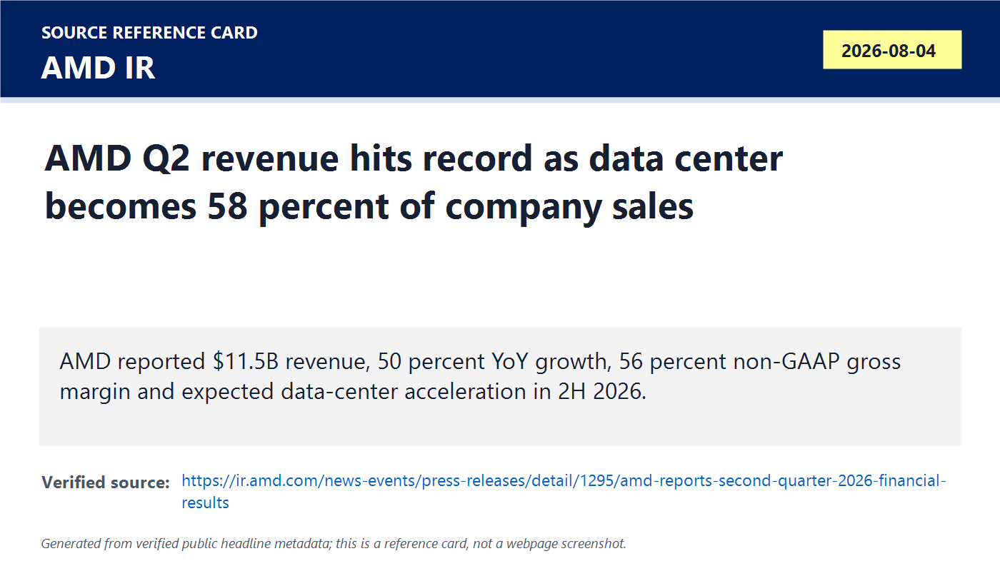
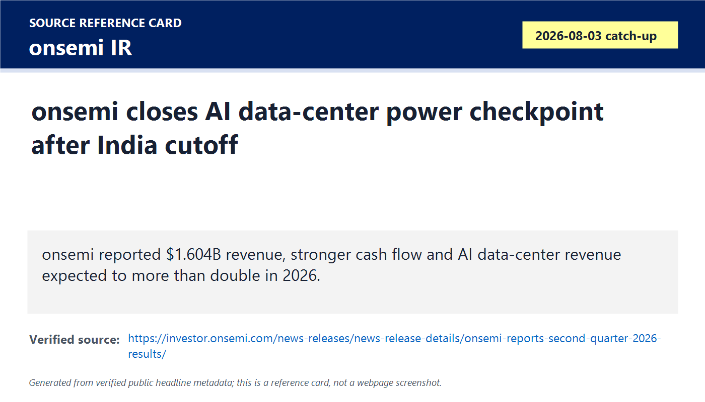
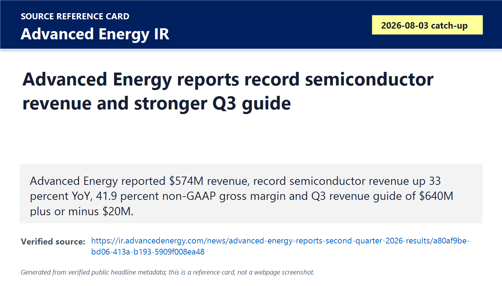
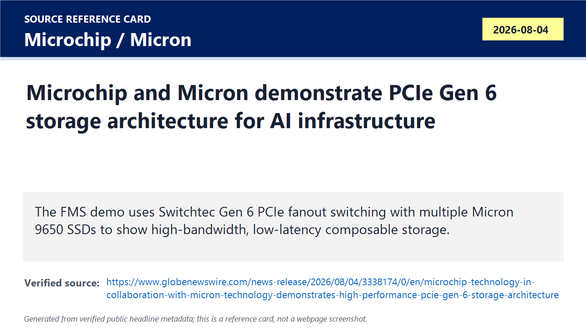
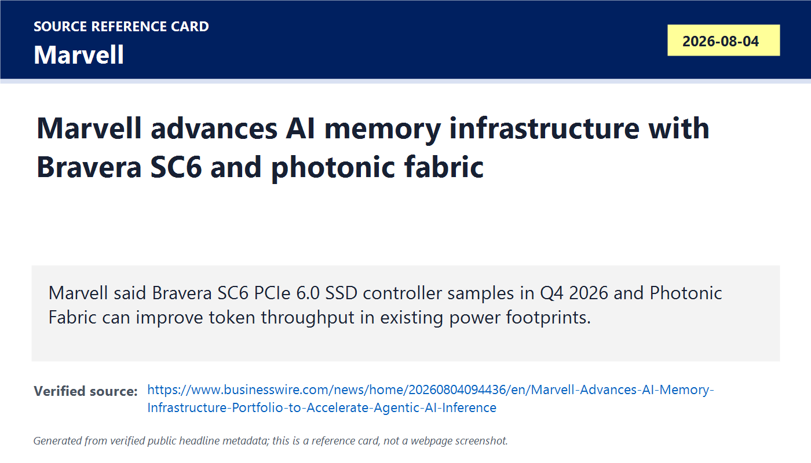
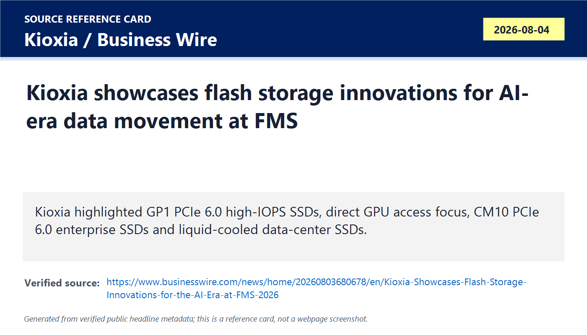
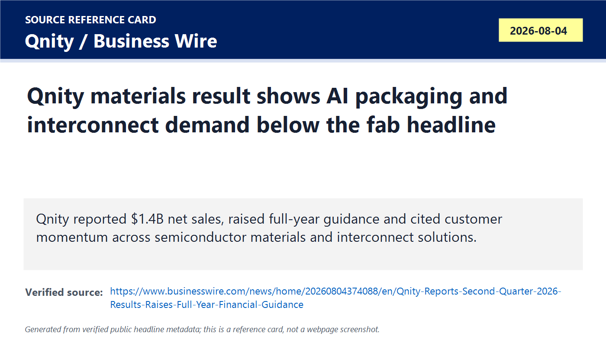
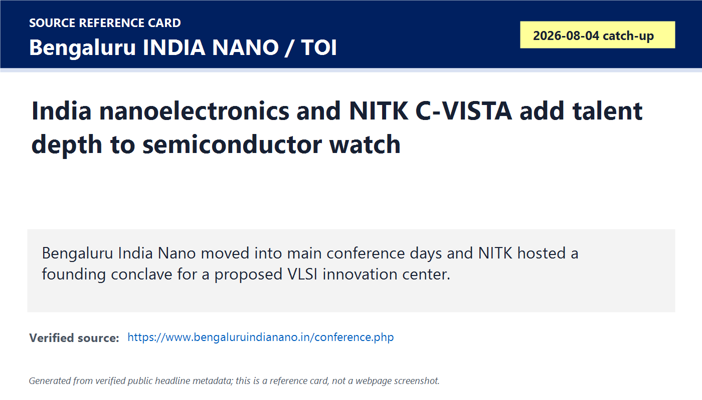

# Daily Semiconductor Current Affairs

Date: 2026-08-04

Research window: Tuesday catch-up through the August 4 U.S. market close and FMS opening window. This note closes several August 3 proof queues that landed after the India cutoff, then adds exact-day FMS memory/storage, materials, and India ecosystem items. The main pattern is that AI infrastructure demand is showing up outside GPUs: data-center CPUs, power conversion, PCIe switching, SSD controllers, NAND tiers, packaging materials, and India talent programs.

## Quick Index

| Date | Major Topic | Source Groups | Why To Read |
|---|---|---|---|
| 2026-08-04 | AMD Q2 2026 record revenue and data-center mix | AMD IR, AMD SEC filing context, investor reporting for later reaction watch | Teaches how official AI-chip demand can be strong while market expectations still require proof of durability. |
| 2026-08-04 | onsemi and Advanced Energy close the August 3 earnings proof queue | onsemi IR, Advanced Energy IR | Shows AI data-center and semiconductor equipment demand through power semiconductors and precision power conversion. |
| 2026-08-04 | Microchip-Micron and Marvell make PCIe 6 storage a live FMS theme | Microchip/Micron release, Marvell release, PCI-SIG references | Explains why AI inference increasingly depends on storage, switching, memory hierarchy, and data movement. |
| 2026-08-04 | Kioxia pushes AI flash products and liquid-cooled enterprise SSDs at FMS | Kioxia / Business Wire / FMS context | Adds NAND and SSD architecture to the same AI infrastructure bottleneck story. |
| 2026-08-04 | Qnity Q2 gives materials and advanced-packaging suppliers an earnings signal | Qnity / Business Wire | Shows how AI and advanced packaging pull chemicals, interconnect materials, and process materials into the news flow. |
| 2026-08-04 | Bengaluru INDIA NANO and NITK C-VISTA add India talent and research depth | Bengaluru INDIA NANO, Moneycontrol, Times of India | Separates India ecosystem and skilling evidence from actual fab or OSAT production proof. |

**Page navigation:** [Sources](#source-map) · [Concept review](#concept-review) · [Follow-up](#what-to-watch-next) · [Technical terms](#technical-terms-used-today) · [Master glossary](../knowledge-base/glossary.md)

## Technical Terms / Deep Definitions

Term: Non-GAAP
Definition: Non-GAAP means a company reports adjusted financial measures that do not strictly follow Generally Accepted Accounting Principles, usually excluding items such as stock compensation, restructuring, acquisition costs, or one-time charges. It solves the business-analysis problem of separating recurring operating performance from special accounting items, but it can also make results look stronger if investors ignore what was excluded. In today's AMD, onsemi, and Advanced Energy results, non-GAAP figures matter because management and analysts often compare chip cycles using adjusted gross margin, operating income, and EPS. Example: GAAP EPS is the audited accounting view; non-GAAP EPS is management's adjusted operating view. Source: https://www.sec.gov/oiea/investor-alerts-and-bulletins/investor-alert-non-gaap-financial-measures

Term: Data Center segment
Definition: A Data Center segment is a company's reporting category for chips, systems, or services sold into server, cloud, AI, networking, and enterprise infrastructure customers. It solves the investor-analysis problem of separating AI/cloud demand from PCs, gaming, embedded, automotive, or consumer products. In today's AMD result, the Data Center segment matters because AMD said it represented 58% of company revenue, making server CPUs and AI accelerators the central demand proof point. Comparison: a gaming GPU sale and an AI accelerator sale may use related silicon skills, but the buyer, margin profile, software dependency, and supply-chain constraints are different. Source: https://ir.amd.com/news-events/press-releases/detail/1295/amd-reports-second-quarter-2026-financial-results

Term: High-Bandwidth Memory (HBM)
Definition: High-Bandwidth Memory is stacked DRAM connected through very wide, short interconnects so an AI accelerator can move much more data per second than with ordinary memory modules. It solves the memory-bandwidth bottleneck in AI training and inference, where compute units can sit idle if weights, activations, or cache data cannot arrive fast enough. In today's FMS storage news, HBM matters because Marvell's KV-cache argument is about moving some inference data out of scarce HBM into cheaper shared memory or storage tiers. Example: HBM is like a very wide road right beside the processor, while an SSD is a distant warehouse with much larger capacity but higher latency. Source: https://www.jedec.org/standards-documents/technology-focus-areas/high-bandwidth-memory-hbm

Term: AI data-center power tree
Definition: An AI data-center power tree is the chain of electrical conversion stages that moves power from grid input to racks, boards, accelerator packages, memory, networking silicon, and voltage rails. It solves the problem that GPUs, CPUs, HBM, optics, fans, pumps, and storage all need different voltages with high efficiency and fast transient response. In today's onsemi, Advanced Energy, and Infineon-adjacent context, the power tree matters because AI growth is limited not only by chips but by the ability to deliver stable, efficient power to very dense racks. Example: a 48 V rack bus may be stepped down through converters to low-voltage rails near an accelerator package. Source: https://www.onsemi.com/solutions/applications/data-center

Term: Gallium nitride (GaN)
Definition: Gallium nitride is a wide-bandgap semiconductor material used for fast, efficient power switching at high frequency and high power density. It solves the power-conversion problem where ordinary silicon switches lose too much energy or require larger passive components at high switching speeds. In today's onsemi result, GaN matters because onsemi highlighted its GaNEXUS portfolio, linking power-device technology to AI data-center and high-efficiency power applications. Comparison: silicon carbide often fits very high-voltage EV and grid work; GaN often fits compact, high-frequency power supplies and adapters. Source: https://www.onsemi.com/solutions/technology/gallium-nitride-gan

Term: Precision power conversion
Definition: Precision power conversion is tightly controlled conversion, measurement, and regulation of electrical power for systems that cannot tolerate unstable voltage or inefficient delivery, including semiconductor manufacturing equipment and AI data centers. It solves the manufacturing and infrastructure problem that plasma tools, deposition tools, etch chambers, inspection systems, and dense AI racks need accurate, reliable power under changing loads. In today's Advanced Energy result, record semiconductor revenue matters because precision power demand can reveal upstream tool and fab activity before finished chips ship. Example: a fab plasma etch tool needs carefully controlled RF power; an AI rack needs efficient DC conversion across many boards. Source: https://www.advancedenergy.com/en-us/about/

Term: PCIe Gen 6
Definition: PCIe Gen 6 is the sixth generation of the PCI Express interconnect standard, doubling the raw transfer rate of PCIe Gen 5 to 64 GT/s per lane and using newer signaling and error-control methods to keep bandwidth rising. It solves the system bottleneck where CPUs, GPUs, SSDs, network devices, and accelerators need more I/O bandwidth than older PCIe links can provide. In today's Microchip-Micron, Marvell, and Kioxia FMS items, PCIe Gen 6 matters because storage and switching must keep up with AI accelerators and shared memory tiers. Comparison: PCIe Gen 5 is a high-speed highway; Gen 6 adds more lanes of effective data movement per physical lane. Source: https://pcisig.com/pcie-60-specification

Term: PCIe fanout switch
Definition: A PCIe fanout switch is a switching chip that connects one or more host processors to many downstream PCIe devices such as SSDs, GPUs, NICs, or accelerators. It solves the topology problem when a single CPU root complex lacks enough direct lanes or when many high-bandwidth devices need flexible connectivity. In today's Microchip-Micron demo, the Switchtec Gen 6 fanout switch matters because it sits between host processors and multiple Micron SSDs so drives can run nearer their full PCIe 6 potential. Example: it acts like a traffic interchange between the host and many fast endpoints, not like a simple cable. Source: https://www.globenewswire.com/news-release/2026/08/04/3338174/0/en/microchip-technology-in-collaboration-with-micron-technology-demonstrates-high-performance-pcie-gen-6-storage-architecture-for-ai-and-data-center-infrastructure.html

Term: Composable infrastructure
Definition: Composable infrastructure means compute, memory, storage, and networking resources can be pooled and assigned dynamically to workloads instead of being fixed inside one rigid server. It solves the utilization problem where one system has idle storage or memory while another workload is starved. In today's PCIe Gen 6 storage demo, composability matters because fast switches make it easier to create disaggregated pools for AI training, inference, and data pipelines. Comparison: a fixed server is like a prebuilt desktop PC; composable infrastructure is like a lab bench where parts can be assigned to the experiment that needs them. Source: https://www.globenewswire.com/news-release/2026/08/04/3338174/0/en/microchip-technology-in-collaboration-with-micron-technology-demonstrates-high-performance-pcie-gen-6-storage-architecture-for-ai-and-data-center-infrastructure.html

Term: SSD controller
Definition: An SSD controller is the processor and firmware engine inside a solid-state drive that manages NAND flash, error correction, wear leveling, host interface traffic, queueing, encryption, and performance scheduling. It solves the problem that raw NAND cells are slow, error-prone, and wear-limited unless a controller hides those details from the host system. In today's Marvell Bravera SC6 item, the SSD controller matters because PCIe 6 AI storage performance depends on controller architecture, not only NAND capacity. Example: NAND is the storage media; the controller is the traffic manager and reliability engine. Source: https://www.marvell.com/products/storage/bravera-storage-controllers.html

Term: KV cache
Definition: A KV cache is the stored key and value tensor data that a transformer model reuses during autoregressive inference so it does not recompute attention information for earlier tokens every time it generates a new token. It solves the latency and compute-reuse problem in long-context AI inference, but it can consume huge memory capacity as context length, batch size, and model size rise. In today's Marvell news, KV cache matters because Marvell argues that moving some cache data from HBM to SSD or shared memory can improve infrastructure efficiency. Comparison: it is like keeping notes from earlier conversation turns nearby so the model does not reread everything from scratch. Source: https://developer.nvidia.com/blog/mastering-llm-techniques-inference-optimization/

Term: Write amplification
Definition: Write amplification is the effect where an SSD writes more physical NAND data than the host requested because of garbage collection, wear leveling, metadata updates, and block erase constraints. It solves nothing by itself; it is a cost that SSD controllers try to reduce so endurance, latency, and performance improve. In today's Marvell item, lower write amplification matters because AI data pipelines and cache workloads can stress SSD endurance. Example: if the host writes 1 GB but the SSD internally writes 3 GB, write amplification is 3x. Source: https://www.micron.com/about/blog/storage/ssd/what-is-write-amplification

Term: GPU direct access
Definition: GPU direct access means a GPU can reach storage or memory resources with fewer CPU-mediated copies, reducing data-movement overhead between accelerator memory and storage. It solves the bottleneck where CPUs become traffic controllers for huge AI datasets even when GPUs are the real compute engines. In today's Kioxia GP1 FMS item, GPU direct access matters because high-IOPS SSDs are being positioned for AI workloads that need faster feeding of accelerators. Comparison: ordinary data loading may pass through CPU memory; GPU direct paths try to shorten that route. Source: https://developer.nvidia.com/gpudirect

Term: High IOPS
Definition: High IOPS means high input/output operations per second, usually referring to how many small read or write operations a storage device can complete in one second. It solves the small-random-access problem in databases, metadata-heavy systems, AI data loading, retrieval, and cache workloads where large sequential bandwidth alone is not enough. In today's Kioxia item, high IOPS matters because AI systems may need many fast accesses rather than only streaming large files. Comparison: bandwidth measures how much cargo moves per second; IOPS measures how many trips can be completed. Source: https://nvmexpress.org/resources/nvme-technology/

Term: Direct liquid cooling
Definition: Direct liquid cooling places a liquid-cooled cold plate or fluid path close to hot components so heat moves into liquid instead of relying only on air. It solves the thermal problem in dense servers where air cooling cannot remove enough heat from CPUs, GPUs, memory, SSDs, and power devices. In today's Kioxia CM10/NX1 context, direct liquid cooling matters because storage is also becoming part of the high-density AI thermal design, not just GPUs. Comparison: air cooling is like using room air to remove heat; direct liquid cooling puts a heat-removal path directly on the component. Source: https://www.opencompute.org/wiki/Cooling_Environments/Advanced_Cooling_Solutions

Term: Organic sales
Definition: Organic sales growth measures revenue growth from the existing business after excluding effects such as acquisitions, divestitures, or currency swings. It solves the analysis problem of telling whether demand truly grew in the core business rather than only through corporate transactions. In today's Qnity result, organic sales growth matters because the company reported strong growth in semiconductor materials demand, especially around AI, data centers, and advanced packaging. Example: if a company buys another company, reported sales can rise even without more customer demand; organic sales tries to remove that distortion. Source: https://www.sec.gov/oiea/investor-alerts-and-bulletins/investor-alert-non-gaap-financial-measures

Term: Interconnect Solutions
Definition: Interconnect Solutions are materials, films, dielectrics, adhesives, metallization, and integration technologies that help electrical signals and power move between dies, packages, boards, and systems. They solve the packaging and signal-integrity problem as chips move from single-die packages toward HBM, chiplets, 2.5D/3D integration, and dense AI boards. In today's Qnity result, Interconnect Solutions matter because the segment's growth was tied to AI, data centers, and advanced packaging. Example: compute dies need transistor scaling, but they also need package-level wiring to reach memory and other dies. Source: https://www.qnity.com/industries/semiconductor

Term: Adjusted EBITDA
Definition: Adjusted EBITDA is earnings before interest, taxes, depreciation, and amortization, further adjusted for selected items management excludes. It solves the business-comparison problem of estimating operating cash-like profitability across companies with different capital structures and depreciation schedules, but it is not the same as free cash flow. In today's Qnity guidance, adjusted EBITDA matters because materials suppliers are being valued on operating leverage from AI and advanced packaging demand. Comparison: EBITDA ignores many real costs; free cash flow asks how much cash remains after operating and capital needs. Source: https://www.sec.gov/oiea/investor-alerts-and-bulletins/investor-alert-non-gaap-financial-measures

Term: VLSI Centre of Excellence
Definition: A VLSI Centre of Excellence is an organized academic-industry-government hub for chip design, verification, fabrication awareness, tools, curriculum, projects, and talent development. It solves the ecosystem problem that semiconductor capability requires coordinated labs, mentors, EDA access, industry projects, and long training cycles rather than isolated classroom theory. In today's NITK C-VISTA item, the concept matters because India needs VLSI skill depth to support design, verification, packaging, testing, and eventual manufacturing. Example: a good center should create tapeout-ready and test-ready engineers, not only host seminars. Source: https://timesofindia.indiatimes.com/city/mangaluru/nitk-hosts-founding-conclave-for-new-semiconductor-centre/articleshow/132868140.cms

## Source Images

## Source Map

| Source | Source date | Role | Confidence / limitation |
|---|---:|---|---|
| [AMD Q2 2026 release](https://ir.amd.com/news-events/press-releases/detail/1295/amd-reports-second-quarter-2026-financial-results) and [AMD 8-K](https://ir.amd.com/financial-information/sec-filings/content/0000002488-26-000121/amd-20260804.htm) | 2026-08-04 | Official chipmaker earnings evidence | Strong for revenue, margins, EPS, segment mix, and management commentary. Market reaction is handled in the August 5 follow-up because it developed after the release. |
| [onsemi Q2 2026 release](https://investor.onsemi.com/news-releases/news-release-details/onsemi-reports-second-quarter-2026-results/) | 2026-08-03 after U.S. close | Catch-up power semiconductor earnings evidence | Strong official source for results, segment detail, AI data-center commentary, and Q3 guide. It landed after the August 3 India cutoff, so it closes that proof queue today. |
| [Advanced Energy Q2 2026 release](https://ir.advancedenergy.com/news/advanced-energy-reports-second-quarter-2026-results/a80af9be-bd06-413a-b193-5909f008ea48) | 2026-08-03 after U.S. close | Catch-up semiconductor-equipment power evidence | Strong official source for revenue, record semiconductor revenue, margins, EPS, cash flow, and Q3 guide. Customer-level tool demand details remain limited. |
| [Microchip and Micron PCIe 6 storage demo](https://www.globenewswire.com/news-release/2026/08/04/3338174/0/en/microchip-technology-in-collaboration-with-micron-technology-demonstrates-high-performance-pcie-gen-6-storage-architecture-for-ai-and-data-center-infrastructure.html) | 2026-08-04 | Exact-day storage/interconnect evidence | Strong for demo architecture and product positioning. A demo is not deployment; watch customer systems and measured workload data. |
| [Marvell AI memory infrastructure release](https://www.businesswire.com/news/home/20260804094436/en/Marvell-Advances-AI-Memory-Infrastructure-Portfolio-to-Accelerate-Agentic-AI-Inference) | 2026-08-04 | Exact-day SSD controller, KV-cache, and photonic fabric evidence | Strong for vendor roadmap and sampling timing. Performance claims need customer benchmarks, system topology, workload disclosure, and power data. |
| [Kioxia FMS 2026 release](https://www.businesswire.com/news/home/20260803680678/en/Kioxia-Showcases-Flash-Storage-Innovations-for-the-AI-Era-at-FMS-2026) and [Kioxia GP1 release](https://www.businesswire.com/news/home/20260803241004/en/Kioxia-Announces-KIOXIA-GP1-Series-Super-High-IOPS-SSDs-for-AI-Applications) | 2026-08-03 / showcased 2026-08-04 to 2026-08-06 | FMS flash and SSD architecture evidence | Strong for product announcements and event showcase. Deployment, endurance, latency, GPU-direct stack maturity, and thermal design wins remain follow-ups. |
| [Qnity Q2 2026 release](https://www.businesswire.com/news/home/20260804374088/en/Qnity-Reports-Second-Quarter-2026-Results-Raises-Full-Year-Financial-Guidance) | 2026-08-04 | Materials and packaging supplier earnings evidence | Strong for net sales, guidance, and segment growth. The source is company-reported; customer-specific design wins and wafer-start linkages are not disclosed. |
| [Bengaluru INDIA NANO conference page](https://www.bengaluruindianano.in/conference.php), [Moneycontrol preview](https://www.moneycontrol.com/news/business/bengaluru-india-nano-2026-to-spotlight-ai-semiconductors-and-nanotech-commercialisation-from-august-3-5-13983428.html), and [Times of India NITK C-VISTA report](https://timesofindia.indiatimes.com/city/mangaluru/nitk-hosts-founding-conclave-for-new-semiconductor-centre/articleshow/132868140.cms) | 2026-08-03 to 2026-08-05 | India materials, nanoelectronics, and talent ecosystem evidence | Strong for event scope and C-VISTA conclave reporting. This is ecosystem and skilling evidence, not production output. |

## Deep Briefing

### 1. AMD Q2 Is A Strong Official AI Demand Print, But It Sets Up An Expectations Test

**Confirmed facts:** AMD reported Q2 2026 revenue of USD 11.5 billion, GAAP gross margin of 54%, operating income of USD 2.0 billion, net income of USD 2.3 billion, and diluted EPS of USD 1.38. On a non-GAAP basis, AMD reported gross margin of 56%, operating income of USD 3.1 billion, net income of USD 2.8 billion, and diluted EPS of USD 1.66. Management said revenue rose 50% year over year and that Data Center represented 58% of company revenue. AMD also said it expects data-center sales to accelerate in the second half of 2026.

**Analysis:** This closes the August 3 AMD proof queue on the official-number side. The result confirms AMD is no longer mainly a PC or gaming cycle story; data-center CPUs and AI accelerators are now the center of the investment case. The key unanswered question is quality of growth: how much is EPYC CPU share gain, how much is Instinct accelerator shipment, how much depends on a small number of hyperscale customers, and how durable are margins as packaging, HBM, and capacity costs rise.

**Why it matters:** Nvidia still dominates AI accelerators, but AMD's official data-center scale matters because hyperscalers want supply diversity, software leverage, and negotiating power. If AMD can keep shipping MI accelerators, grow EPYC, improve ROCm, and secure HBM/package capacity, the AI supply chain broadens. If growth is lumpy or customer-concentrated, the market will treat the print as less durable.

**India angle:** Indian VLSI students should map AMD demand to roles in verification, physical design, CPU/GPU validation, HBM package validation, ROCm software, PCIe/CXL, server board bring-up, and data-center deployment. Indian electronics companies should also watch memory and package-cost pass-through because high-end AI demand can raise input costs elsewhere.

**VLSI/career relevance:** Do not read earnings as just finance. Segment revenue tells you which chips are shipping. Gross margin hints at supply constraint and pricing power. Guidance shows management confidence. A strong interview answer connects revenue to architecture, memory, packaging, software ecosystem, and customer concentration.

### 2. onsemi And Advanced Energy Turn AI Power From Background Detail Into Evidence

**Confirmed facts:** onsemi reported Q2 revenue of USD 1.604 billion, up 9% year over year, with GAAP gross margin of 38.4%, non-GAAP gross margin of 39.3%, GAAP EPS of USD 0.56, and non-GAAP EPS of USD 0.74. Management said AI data center was the fastest-growing end market and expected revenue from that area to more than double in 2026. The company also highlighted Synaptics, NVIDIA MGX ecosystem participation, Great Wall platform wins, GaNEXUS, EliteSiC, and Rivian R2 activity. Advanced Energy reported Q2 revenue of USD 574 million, up 30% year over year, record semiconductor revenue up 33%, GAAP gross margin of 41.1%, non-GAAP EPS of USD 2.74, and Q3 revenue guidance of USD 640 million plus or minus USD 20 million.

**Analysis:** These results close the August 3 after-close proof queue. The common message is that AI infrastructure is pulling on the power layer. onsemi is closer to power devices, modules, sensing, and automotive/industrial demand. Advanced Energy is closer to power conversion and control systems used in semiconductor tools and demanding infrastructure. Together, they show that AI demand is not limited to GPUs and HBM. It reaches power conversion, tool power, analog control, thermal design, and factory equipment.

**Why it matters:** Power is becoming a limiting resource in data centers and fabs. A faster accelerator is useless if a rack cannot deliver stable power, a fab tool cannot maintain plasma/process control, or a package cannot dissipate heat. These earnings also help separate broadening cycle evidence from pure AI accelerator hype: when power suppliers and equipment power vendors beat or guide higher, the chain is deeper than one chip headline.

**What can go wrong:** The risk is that AI commentary hides weakness in automotive or industrial markets. onsemi still needs sustained SiC and power-device utilization. Advanced Energy still depends on semiconductor equipment cycles, tool shipments, and customer capex timing. Strong AI power does not automatically mean every end market has recovered.

**India angle:** India has practical entry points in power electronics, validation, firmware, industrial control, board design, reliability, and data-center power infrastructure. These are more attainable near-term than leading-edge wafer fabrication and are directly linked to AI deployment.

**VLSI/career relevance:** Revise power integrity, voltage regulators, transient response, switching losses, thermal resistance, wide-bandgap devices, reliability, and semiconductor equipment basics. A good answer should say AI hardware scaling is a power-delivery problem as much as a compute-density problem.

### 3. Microchip-Micron And Marvell Show That AI Inference Needs A Data-Movement Stack

**Confirmed facts:** Microchip and Micron announced an FMS 2026 demonstration using a Microchip Switchtec Gen 6 PCIe fanout switch as a high-bandwidth, low-latency interconnect between host processors and multiple Micron 9650 SSDs. The release says PCIe 6.0 doubles PCIe 5.0 bandwidth to 64 GT/s per lane and that Switchtec Gen 6 switches are built on 3 nm. Marvell announced its Bravera SC6 PCIe 6.0 SSD controller, said it doubles performance versus its PCIe 5.0 predecessor, and positioned it for AI inference by moving more KV cache from HBM to SSD. Marvell also discussed a Photonic Fabric path for loading KV cache from a shared memory tier and said Bravera SC6 is expected to sample in Q4 2026.

**Analysis:** These are not competing headlines; they are two parts of one architecture story. Microchip and Micron focus on the switched PCIe 6 topology that lets hosts and SSDs communicate at high speed. Marvell focuses on the SSD controller and memory/storage hierarchy that decides whether AI inference can use storage tiers efficiently. The deeper point is that inference cost is increasingly dominated by data movement, cache placement, memory capacity, and system topology.

**Why it matters:** Long-context and agentic AI workloads can produce enormous KV-cache pressure. HBM is too expensive and scarce to hold everything. Ordinary SSD access can be too slow if the system path is inefficient. PCIe 6 switches, better SSD controllers, smarter cache policies, and possibly optical/shared-memory fabrics are attempts to create a hierarchy where the hottest data stays in HBM, warm data moves to memory/storage tiers, and cold data stays further away.

**What can go wrong:** Vendor claims must be tested by workload. A KV-cache offload idea works only if latency, prefetching, software scheduling, endurance, write amplification, and batch behavior line up. A switch can have high bandwidth, but topology, queueing, power, thermals, and software stack support can still bottleneck real systems.

**India angle:** This is a strong career area for Indian engineers: PCIe verification, NVMe firmware, SSD validation, Linux kernel storage, CXL memory management, AI inference serving, signal integrity, SerDes testing, and data-center system architecture.

**VLSI/career relevance:** Learn to reason across chip, package, board, protocol, firmware, and workload. Interviewers may ask why PCIe Gen 6 matters when a GPU already has HBM. The answer: HBM handles immediate high-bandwidth compute data, but total inference systems need storage, cache, memory expansion, and interconnects to feed accelerators economically.

### 4. Kioxia Keeps NAND And SSD Architecture In The AI Bottleneck Discussion

**Confirmed facts:** Kioxia said it would showcase flash memory and SSD innovations for the AI era at FMS 2026. Its FMS-related announcements include GP1 Series PCIe 6.0 NVMe super-high-IOPS SSDs optimized for GPU direct access, and additional enterprise/data-center SSD products including CM10 and NX1 context around PCIe 6.0/5.0 and direct liquid cooling support. The FMS event runs August 4-6.

**Analysis:** Kioxia's message fits the same pattern as Microchip, Micron, and Marvell: AI infrastructure needs more than accelerator peak TOPS. It needs predictable data feeding. NAND is not replacing HBM, but it can handle larger and colder data pools if the system can reduce latency and copy overhead. The shift to PCIe 6, high IOPS, and liquid-cooled SSD designs shows storage is being pulled into the same high-density rack engineering problem as accelerators.

**Why it matters:** NAND vendors benefit when AI systems require massive datasets, checkpoints, retrieval stores, vector databases, logs, cache tiers, and fast local storage. But the winning products are not generic SSDs. They need controllers, firmware, endurance, thermal designs, and software integration built around AI access patterns.

**India angle:** India can build useful capability in SSD firmware, NVMe validation, test automation, thermal characterization, server validation, and AI storage benchmarking. These skills connect directly to data-center jobs and do not require owning a leading-edge fab.

**VLSI/career relevance:** Revise NVMe queues, NAND endurance, ECC, wear leveling, PCIe signal integrity, thermal throttling, and latency vs bandwidth. A strong answer distinguishes capacity from usable low-latency data availability.

### 5. Qnity Shows Materials And Advanced Packaging Are Earning-Cycle Items, Not Side Notes

**Confirmed facts:** Qnity reported Q2 2026 net sales of about USD 1.4 billion, up 22% year over year, and raised full-year guidance. Reporting around the release highlighted strong growth in Interconnect Solutions driven by AI, data centers, and advanced packaging, and growth in Semiconductor Technologies. The company raised full-year net sales guidance to USD 5.55 billion to USD 5.65 billion and adjusted operating EBITDA guidance to USD 1.675 billion to USD 1.725 billion.

**Analysis:** This is a high-value materials signal. AI chip scaling stresses interconnect density, package substrates, dielectrics, thermal paths, contamination control, and yield. Materials suppliers can show demand earlier or in parallel with fabs and OSATs because customers must qualify materials before volume production. Qnity's segment strength supports the thesis that advanced packaging and AI data-center demand are pulling through the materials layer.

**Why it matters:** A GPU package is a materials system: compute dies, HBM stacks, interposer/substrate, underfill, solder, dielectrics, thermal interface materials, and board interconnects all have to work together. Yield loss at packaging scale is expensive because the package may already contain multiple high-value dies.

**India angle:** India should treat materials and packaging supply chains as strategic entry points. High-purity chemicals, process materials, substrates, thermal materials, and reliability labs can support OSAT and fab ambitions. The proof to watch is supplier qualification and customer adoption, not only manufacturing announcements.

**VLSI/career relevance:** Physical design and package-aware design engineers must understand that routing, power integrity, signal integrity, and thermal behavior depend on real materials. This is where EDA constraints meet chemistry and manufacturing.

### 6. Bengaluru INDIA NANO And NITK C-VISTA Are India Ecosystem Evidence

**Confirmed facts:** Bengaluru INDIA NANO 2026 runs August 3-5, with the main conference and exhibition on August 4-5 and tracks including Nano in Semiconductors. Moneycontrol reported features such as startup pitching, poster presentations, a startup pavilion, student programs, and commercialization focus. Times of India reported that NITK Surathkal hosted a founding conclave on August 3-4 for a proposed Centre of Excellence for VLSI Innovation for Systems, Technology & Applications, or C-VISTA.

**Analysis:** This is not fab-output evidence. It is ecosystem evidence. India needs research depth, process literacy, nano-characterization, VLSI design training, industry-academia links, and startup commercialization paths. These programs matter if they convert into funded labs, EDA access, tapeout projects, packaging/test collaborations, internships, and industry qualification.

**Why it matters:** India can lose time if it treats semiconductor capability as only a policy or capex problem. The bottleneck is also trained people who understand devices, materials, verification, layout, test, packaging, reliability, and manufacturing economics. A VLSI center and nanotechnology conference are useful only if they create repeatable training and project outcomes.

**VLSI/career relevance:** Students should use this to choose study depth: RTL and verification are important, but so are DFT, physical design, signal integrity, process basics, materials, test, and packaging. For India careers, the best profiles will bridge design and manufacturing awareness.

## Follow-Up Ledger

| Prior item | Status on 2026-08-04 | Evidence |
|---|---|---|
| August 3 onsemi earnings checkpoint | Updated and closed for Q2 result; future watch remains AI data-center power revenue and automotive/industrial recovery | onsemi official Q2 release |
| August 3 Advanced Energy earnings checkpoint | Updated and closed for Q2 result; future watch remains semiconductor equipment power demand and Q3 execution | Advanced Energy official Q2 release |
| August 3 AMD earnings checkpoint | Updated with official Q2 result; market reaction and expectation test carried to August 5 | AMD official Q2 release |
| August 2 FMS memory/storage setup | Updated with named Microchip-Micron, Marvell, and Kioxia FMS announcements | Vendor releases |
| August 3 Qnity/Entegris materials watch | Updated for Qnity Q2 result; Entegris remains a materials/purity context watch | Qnity release |
| India Nano opening watch | Updated: main conference started August 4 and NITK C-VISTA conclave added | Official event page, Moneycontrol, Times of India |

## Concept Review

| Concept | Deep Definition | Why It Matters In This News | Revise Next | Source |
|---|---|---|---|---|
| Earnings as engineering evidence | Earnings releases convert product claims into measured revenue, margins, guidance, segment mix, and management commentary. For engineers, they show which architectures and end markets are actually shipping. | AMD, onsemi, Advanced Energy, and Qnity all show AI demand through different layers of the value chain. | Segment revenue, gross margin, guidance, backlog, capex. | https://www.sec.gov/edgar |
| AI memory hierarchy | AI systems use multiple layers of memory and storage because no single layer is best for speed, capacity, cost, and power. | FMS items show HBM, SSD, PCIe 6, and cache placement all becoming AI bottleneck tools. | HBM, DRAM, CXL, NVMe, SSD latency, KV cache. | https://www.jedec.org/standards-documents/technology-focus-areas/high-bandwidth-memory-hbm |
| Power delivery as a scaling limit | More compute density requires better conversion efficiency, transient response, thermal handling, and voltage regulation. | onsemi and Advanced Energy show power suppliers participating directly in AI infrastructure growth. | VRMs, GaN, SiC, power integrity, data-center rack power. | https://www.onsemi.com/solutions/applications/data-center |
| Advanced packaging materials | Advanced packages need interconnect materials, dielectrics, underfills, substrates, thermal materials, and purity control to connect many high-value dies. | Qnity's growth connects materials to AI and data-center packaging demand. | Underfill, interposer, organic substrate, TIM, reliability. | https://www.qnity.com/industries/semiconductor |
| India ecosystem proof | Ecosystem proof is evidence of training, labs, tools, centers, startup pathways, and industry links before production output appears. | India Nano and C-VISTA are useful because they can create talent and research capacity, but they are not chip shipments. | C2S, DLI, OSAT skills, nano-characterization, DFT. | https://www.bengaluruindianano.in/conference.php |

## Simple Explanation

The August 4 story is that AI chips are no longer the only story in AI hardware. AMD proved strong data-center demand. onsemi and Advanced Energy showed power and equipment power are being pulled by AI. Microchip, Micron, Marvell, and Kioxia showed that storage and interconnects must feed the accelerators. Qnity showed materials and packaging are part of the earnings cycle. India Nano and C-VISTA showed India is trying to build the skills and research base underneath future semiconductor projects.

## Interview Questions

1. Why can AMD report record data-center revenue but still face investor skepticism after earnings?
2. Explain why PCIe Gen 6 matters for AI storage even when GPUs already have HBM.
3. What is a KV cache, and why does it create memory-capacity pressure during inference?
4. Compare GaN and SiC as power semiconductor materials.
5. Why are materials suppliers important in advanced packaging?
6. What proof would convert India Nano or C-VISTA from ecosystem signal into semiconductor output evidence?

## What To Watch Next

1. AMD August 5 trading reaction, Q3 guidance interpretation, and any customer-specific AI accelerator details.
2. FMS customer demonstrations that include measured latency, bandwidth, endurance, power, and real inference workloads.
3. onsemi and Advanced Energy Q3 execution against AI power and equipment-power comments.
4. Qnity and other materials suppliers for advanced packaging and AI data-center material qualification.
5. India follow-ups from Bengaluru INDIA NANO and NITK C-VISTA: MoUs, lab funding, EDA access, tapeout projects, internships, and industry partners.

## Technical Terms Used Today

[Back to quick index](#quick-index) · [Open the master A-Z glossary](../knowledge-base/glossary.md)

**Term index:** [Adjusted EBITDA](#daily-term-adjusted-ebitda) · [AI data-center power tree](#daily-term-ai-data-center-power-tree) · [Composable infrastructure](#daily-term-composable-infrastructure) · [Data Center segment](#daily-term-data-center-segment) · [Direct liquid cooling](#daily-term-direct-liquid-cooling) · [Gallium nitride (GaN)](#daily-term-gallium-nitride-gan) · [GPU direct access](#daily-term-gpu-direct-access) · [High IOPS](#daily-term-high-iops) · [High-Bandwidth Memory (HBM)](#daily-term-high-bandwidth-memory-hbm) · [Interconnect Solutions](#daily-term-interconnect-solutions) · [KV cache](#daily-term-kv-cache) · [Non-GAAP](#daily-term-non-gaap) · [Organic sales](#daily-term-organic-sales) · [PCIe fanout switch](#daily-term-pcie-fanout-switch) · [PCIe Gen 6](#daily-term-pcie-gen-6) · [Precision power conversion](#daily-term-precision-power-conversion) · [SSD controller](#daily-term-ssd-controller) · [VLSI Centre of Excellence](#daily-term-vlsi-centre-of-excellence) · [Write amplification](#daily-term-write-amplification)

| Term | Meaning |
|---|---|
| [**Adjusted EBITDA**](../knowledge-base/glossary.md#term-adjusted-ebitda) | Adjusted EBITDA is earnings before interest, taxes, depreciation, and amortization, further adjusted for selected items management excludes. It solves the business-comparison problem of estimating operating cash-like profitability across companies with different capital structures and depreciation schedules, but it is not the same as free cash flow. |
| [**AI data-center power tree**](../knowledge-base/glossary.md#term-ai-data-center-power-tree) | An AI data-center power tree is the chain of electrical conversion stages that moves power from grid input to racks, boards, accelerator packages, memory, networking silicon, and voltage rails. It solves the problem that GPUs, CPUs, HBM, optics, fans, pumps, and storage all need different voltages with high efficiency and fast transient response. |
| [**Composable infrastructure**](../knowledge-base/glossary.md#term-composable-infrastructure) | Composable infrastructure means compute, memory, storage, and networking resources can be pooled and assigned dynamically to workloads instead of being fixed inside one rigid server. It solves the utilization problem where one system has idle storage or memory while another workload is starved. |
| [**Data Center segment**](../knowledge-base/glossary.md#term-data-center-segment) | A Data Center segment is a company's reporting category for chips, systems, or services sold into server, cloud, AI, networking, and enterprise infrastructure customers. It solves the investor-analysis problem of separating AI/cloud demand from PCs, gaming, embedded, automotive, or consumer products. |
| [**Direct liquid cooling**](../knowledge-base/glossary.md#term-direct-liquid-cooling) | Direct liquid cooling places a liquid-cooled cold plate or fluid path close to hot components so heat moves into liquid instead of relying only on air. It solves the thermal problem in dense servers where air cooling cannot remove enough heat from CPUs, GPUs, memory, SSDs, and power devices. |
| [**Gallium nitride (GaN)**](../knowledge-base/glossary.md#term-gallium-nitride-gan) | Gallium nitride is a wide-bandgap semiconductor material used for fast, efficient power switching at high frequency and high power density. It solves the power-conversion problem where ordinary silicon switches lose too much energy or require larger passive components at high switching speeds. |
| [**GPU direct access**](../knowledge-base/glossary.md#term-gpu-direct-access) | GPU direct access means a GPU can reach storage or memory resources with fewer CPU-mediated copies, reducing data-movement overhead between accelerator memory and storage. It solves the bottleneck where CPUs become traffic controllers for huge AI datasets even when GPUs are the real compute engines. |
| [**High IOPS**](../knowledge-base/glossary.md#term-high-iops) | High IOPS means high input/output operations per second, usually referring to how many small read or write operations a storage device can complete in one second. It solves the small-random-access problem in databases, metadata-heavy systems, AI data loading, retrieval, and cache workloads where large sequential bandwidth alone is not enough. |
| [**High-Bandwidth Memory (HBM)**](../knowledge-base/glossary.md#term-high-bandwidth-memory-hbm) | High-Bandwidth Memory is stacked DRAM connected through very wide, short interconnects so an AI accelerator can move much more data per second than with ordinary memory modules. It solves the memory-bandwidth bottleneck in AI training and inference, where compute units can sit idle if weights, activations, or cache data cannot arrive fast enough. |
| [**Interconnect Solutions**](../knowledge-base/glossary.md#term-interconnect-solutions) | Interconnect Solutions are materials, films, dielectrics, adhesives, metallization, and integration technologies that help electrical signals and power move between dies, packages, boards, and systems. They solve the packaging and signal-integrity problem as chips move from single-die packages toward HBM, chiplets, 2.5D/3D integration, and dense AI boards. |
| [**KV cache**](../knowledge-base/glossary.md#term-kv-cache) | A KV cache is the stored key and value tensor data that a transformer model reuses during autoregressive inference so it does not recompute attention information for earlier tokens every time it generates a new token. It solves the latency and compute-reuse problem in long-context AI inference, but it can consume huge memory capacity as context length, batch size, and model size rise. |
| [**Non-GAAP**](../knowledge-base/glossary.md#term-non-gaap) | Non-GAAP means a company reports adjusted financial measures that do not strictly follow Generally Accepted Accounting Principles, usually excluding items such as stock compensation, restructuring, acquisition costs, or one-time charges. It solves the business-analysis problem of separating recurring operating performance from special accounting items, but it can also make results look stronger if investors ignore what was excluded. |
| [**Organic sales**](../knowledge-base/glossary.md#term-organic-sales) | Organic sales growth measures revenue growth from the existing business after excluding effects such as acquisitions, divestitures, or currency swings. It solves the analysis problem of telling whether demand truly grew in the core business rather than only through corporate transactions. |
| [**PCIe fanout switch**](../knowledge-base/glossary.md#term-pcie-fanout-switch) | A PCIe fanout switch is a switching chip that connects one or more host processors to many downstream PCIe devices such as SSDs, GPUs, NICs, or accelerators. It solves the topology problem when a single CPU root complex lacks enough direct lanes or when many high-bandwidth devices need flexible connectivity. |
| [**PCIe Gen 6**](../knowledge-base/glossary.md#term-pcie-gen-6) | PCIe Gen 6 is the sixth generation of the PCI Express interconnect standard, doubling the raw transfer rate of PCIe Gen 5 to 64 GT/s per lane and using newer signaling and error-control methods to keep bandwidth rising. It solves the system bottleneck where CPUs, GPUs, SSDs, network devices, and accelerators need more I/O bandwidth than older PCIe links can provide. |
| [**Precision power conversion**](../knowledge-base/glossary.md#term-precision-power-conversion) | Precision power conversion is tightly controlled conversion, measurement, and regulation of electrical power for systems that cannot tolerate unstable voltage or inefficient delivery, including semiconductor manufacturing equipment and AI data centers. It solves the manufacturing and infrastructure problem that plasma tools, deposition tools, etch chambers, inspection systems, and dense AI racks need accurate, reliable power under changing loads. |
| [**SSD controller**](../knowledge-base/glossary.md#term-ssd-controller) | An SSD controller is the processor and firmware engine inside a solid-state drive that manages NAND flash, error correction, wear leveling, host interface traffic, queueing, encryption, and performance scheduling. It solves the problem that raw NAND cells are slow, error-prone, and wear-limited unless a controller hides those details from the host system. |
| [**VLSI Centre of Excellence**](../knowledge-base/glossary.md#term-vlsi-centre-of-excellence) | A VLSI Centre of Excellence is an organized academic-industry-government hub for chip design, verification, fabrication awareness, tools, curriculum, projects, and talent development. It solves the ecosystem problem that semiconductor capability requires coordinated labs, mentors, EDA access, industry projects, and long training cycles rather than isolated classroom theory. |
| [**Write amplification**](../knowledge-base/glossary.md#term-write-amplification) | Write amplification is the effect where an SSD writes more physical NAND data than the host requested because of garbage collection, wear leveling, metadata updates, and block erase constraints. It solves nothing by itself; it is a cost that SSD controllers try to reduce so endurance, latency, and performance improve. |

This page-end index covers the specialist terms central to this day's study. The fuller explanation, news context, and source remain at first use; the master glossary combines repeated terms across all days.
