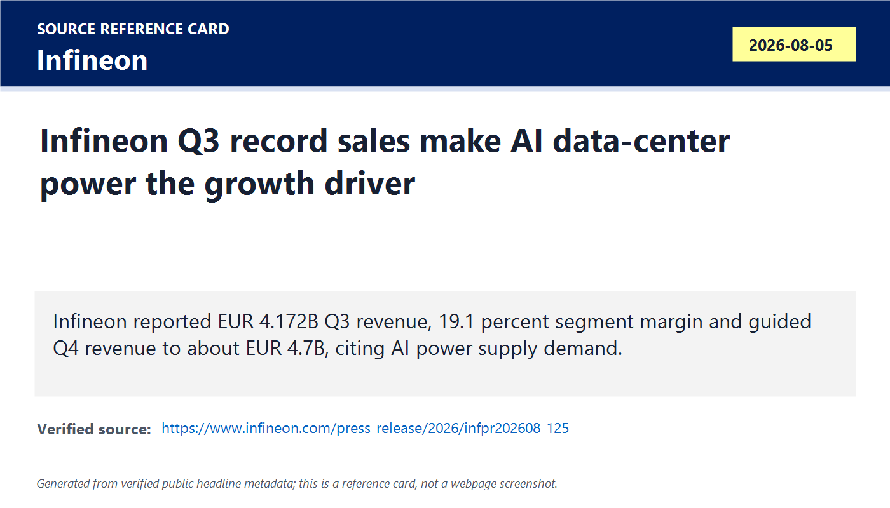
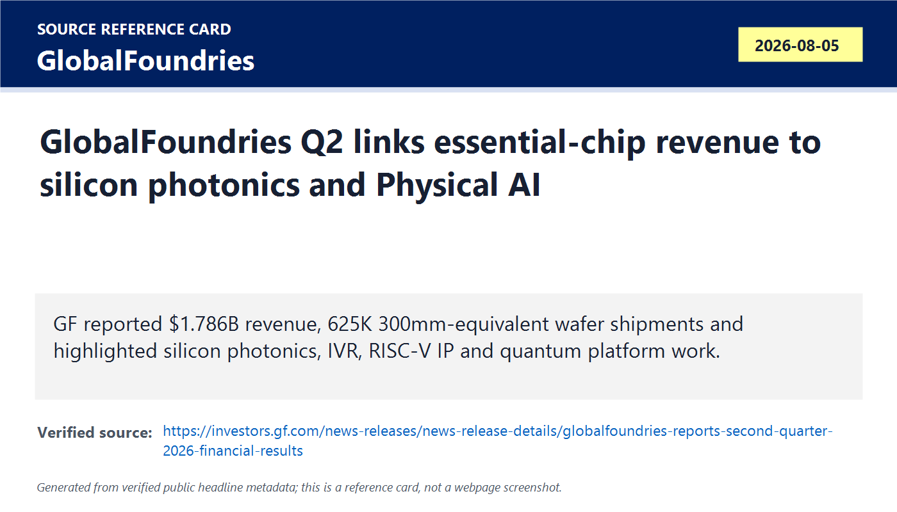
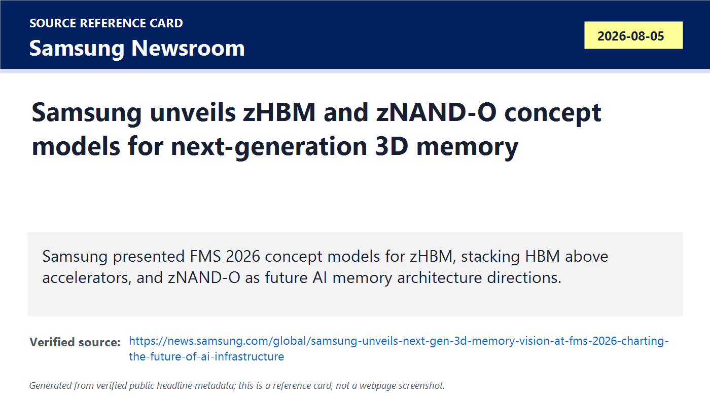
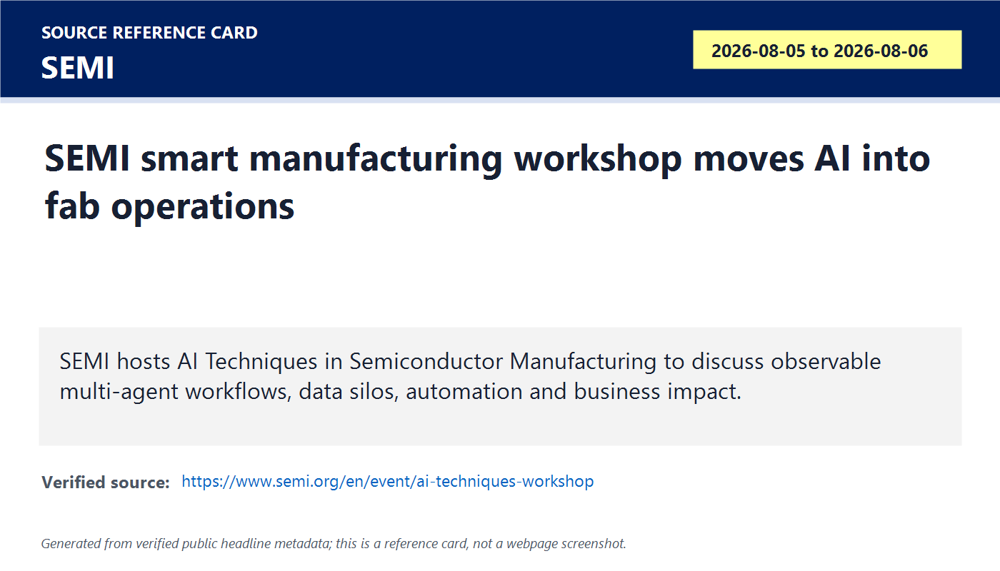
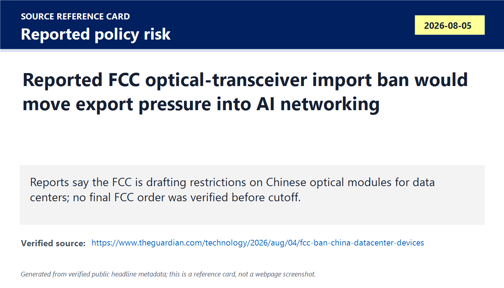
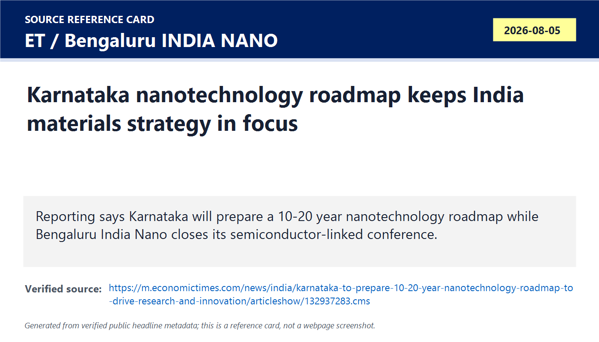
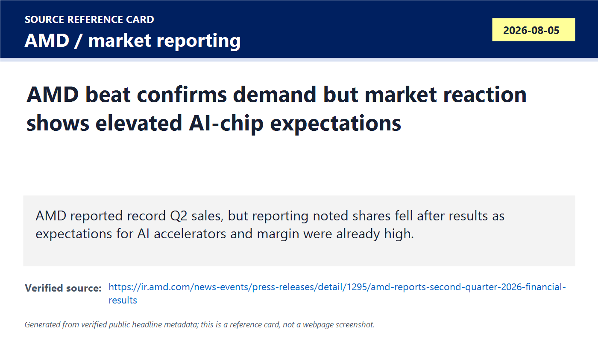

# Daily Semiconductor Current Affairs

Date: 2026-08-05

Research window: Wednesday update through approximately 20:00 IST on August 5, 2026, with one market-reaction follow-up from AMD's August 4 after-close earnings. Today's central theme is proof versus policy risk: Infineon and GlobalFoundries gave official evidence that AI data centers are pulling power and silicon-photonics capability, Samsung showed a future 3D memory direction at FMS, SEMI framed AI inside fabs, and reporting on a possible U.S. optical-transceiver restriction added supply-chain risk that is not yet a final rule.

## Quick Index

| Date | Major Topic | Source Groups | Why To Read |
|---|---|---|---|
| 2026-08-05 | Infineon Q3 FY2026 record revenue and AI power commitments | Infineon official release | Shows AI data-center power becoming a high-value chipmaker growth driver. |
| 2026-08-05 | GlobalFoundries Q2 and AI data-center optical/networking strategy | GlobalFoundries official release | Connects foundry demand to silicon photonics, SiGe, IVR, RISC-V IP, and U.S. policy support. |
| 2026-08-05 | Samsung zHBM and zNAND-O at FMS | Samsung Global Newsroom, Business Wire | Teaches why memory may move from side-by-side packaging to vertical 3D architectures near AI accelerators. |
| 2026-08-05 | SEMI workshop on AI techniques in semiconductor manufacturing | SEMI | Moves AI from chip products into fab operations, data workflows, and process discovery. |
| 2026-08-05 | Reported FCC draft ban on Chinese optical modules and data-center devices | Guardian, Caixin, ET, BIS status check | Important geopolitics item, but it must be labeled as reported draft policy until final official action appears. |
| 2026-08-05 | Karnataka nanotechnology roadmap and AMD expectation-risk follow-up | ET Karnataka report, AMD/Investopedia/IBD | Adds India policy depth and shows how strong earnings can still fall short of elevated AI-trade expectations. |

**Page navigation:** [Sources](#source-map) · [Concept review](#concept-review) · [Follow-up](#what-to-watch-next) · [Technical terms](#technical-terms-used-today) · [Master glossary](../knowledge-base/glossary.md)

## Technical Terms / Deep Definitions

Term: Segment Result
Definition: Segment Result is Infineon's internal profitability measure for each operating segment after allocating directly attributable revenues and costs under the company's reporting method. It solves the business-analysis problem of seeing operating strength by segment without treating every accounting item as core business performance. In today's Infineon result, Segment Result and Segment Result Margin matter because management used them to show profitability while AI data-center power and automotive recovery shape guidance. Example: revenue tells how much was sold; segment result indicates how much operating profit the segment generated under management's measure. Source: https://www.infineon.com/press-release/2026/infpr202608-125

Term: Capacity reservation agreement
Definition: A capacity reservation agreement is a customer commitment that reserves future supply, production capacity, or product availability, often with commercial terms that can include prepayments, minimum purchases, or allocation rights. It solves the supply assurance problem when demand is high and customers fear shortages in critical chips or modules. In today's Infineon item, these agreements matter because the company said multi-year AI customer reservations are concluded or under negotiation with cumulative high-single-digit-billion-euro revenue potential. Comparison: a spot order buys what is available now; a reservation agreement tries to secure future capacity before it is scarce. Source: https://www.infineon.com/press-release/2026/infpr202608-125

Term: AI data-center power supply
Definition: An AI data-center power supply converts and regulates electrical energy for dense AI servers, accelerator racks, memory, networking, cooling, and facility infrastructure. It solves the problem that AI clusters draw enormous, fast-changing power loads that must remain efficient and stable from grid to chip rails. In today's Infineon and onsemi follow-up context, power supplies matter because AI growth is now a semiconductor demand driver for MOSFETs, GaN, SiC, controllers, sensors, and voltage regulation. Example: increasing accelerator power can require redesigning rack-level power conversion, not just installing a bigger GPU. Source: https://www.infineon.com/cms/en/applications/solutions/data-center/

Term: Silicon photonics
Definition: Silicon photonics integrates optical components such as modulators, waveguides, photodetectors, and sometimes lasers or laser-coupling structures on silicon-based platforms to move data using light. It solves the bandwidth, latency, and energy problem of moving huge data volumes between chips, boards, racks, and data centers when electrical links become too power-hungry or bandwidth-limited. In today's GlobalFoundries result and reported optical-module policy story, silicon photonics matters because AI clusters need high-speed optical networking and supply-chain resilience. Comparison: copper electrical links are useful over short distances; optical links carry more data farther with lower loss in many high-speed cases. Source: https://gf.com/technology-platforms/silicon-photonics/

Term: Silicon germanium (SiGe)
Definition: Silicon germanium is a semiconductor alloy that combines silicon with germanium to improve carrier mobility and high-frequency performance for RF, analog, optical, and mixed-signal devices. It solves the performance problem for circuits that need faster analog/RF behavior than ordinary silicon CMOS can provide while still using silicon manufacturing infrastructure. In today's GlobalFoundries release, SiGe matters because the company links it with optical networking and AI data-center growth. Example: SiGe BiCMOS can support high-speed optical transceiver and RF front-end circuits. Source: https://gf.com/technology-platforms/sige/

Term: 300mm-equivalent wafer shipment
Definition: A 300mm-equivalent wafer shipment converts wafer output into a common 300 mm wafer basis so capacity can be compared across fabs and wafer sizes. It solves the reporting problem that a 200 mm wafer and a 300 mm wafer do not contain the same silicon area or die count. In today's GlobalFoundries result, 625,000 300mm-equivalent wafer shipments matter because they show foundry output volume rising 8% year over year and sequentially. Comparison: it is like converting different package sizes into one standard unit before comparing volume. Source: https://investors.gf.com/news-releases/news-release-details/globalfoundries-reports-second-quarter-2026-financial-results

Term: Integrated voltage regulator (IVR)
Definition: An integrated voltage regulator places voltage-regulation circuitry closer to, or inside, the processor/package so power can be delivered with lower parasitic losses and faster response. It solves the power-delivery problem created by large AI chips whose current demand changes extremely quickly across many voltage domains. In today's GlobalFoundries item, IVR matters because the Photeon acquisition is tied to AI data-center power delivery. Comparison: a board-level regulator is farther from the load; an IVR moves regulation closer to the silicon that needs stable voltage. Source: https://investors.gf.com/news-releases/news-release-details/globalfoundries-reports-second-quarter-2026-financial-results

Term: RISC-V processor IP
Definition: RISC-V processor IP is a licensable processor design based on the open RISC-V instruction set architecture, packaged with implementation files, verification collateral, software tools, and integration support. It solves the custom-compute problem by letting chipmakers add configurable CPU cores without designing an instruction set and toolchain from zero. In today's GlobalFoundries release, RISC-V IP matters because GF says the Synopsys ARC Processor IP acquisition with MIPS adds processor IP and software tools for Physical AI custom design and manufacturing. Comparison: the ISA is the language; processor IP is a working core design that speaks that language. Source: https://riscv.org/about/

Term: Physical AI
Definition: Physical AI means AI systems that perceive, decide, and act in the physical world, such as robots, vehicles, drones, industrial machines, and autonomous infrastructure. It solves the deployment gap between cloud AI and real-world systems by combining sensors, edge compute, control, safety, and low-latency response. In today's GlobalFoundries release, Physical AI matters because custom RISC-V/IP and manufacturing support are being positioned for edge and embodied AI systems. Comparison: a chatbot is digital AI; an autonomous robot is Physical AI. Source: https://www.imec-int.com/en/articles/horsepower-high-performance-compute-automotive-chiplets-take-leap-towards-autonomous-edge

Term: zHBM
Definition: zHBM is Samsung's concept for vertically stacking high-bandwidth memory directly above AI accelerators rather than placing HBM stacks beside the processor on an interposer. It solves the package-distance and bandwidth-density problem by trying to shorten the physical connection between memory and compute, but it creates harder thermal, yield, bonding, and test challenges. In today's Samsung FMS item, zHBM matters because it points to a possible post-side-by-side HBM architecture for AI infrastructure. Comparison: conventional HBM sits next to the GPU; zHBM imagines memory above the accelerator like floors on top of a compute building. Source: https://news.samsung.com/global/samsung-unveils-next-gen-3d-memory-vision-at-fms-2026-charting-the-future-of-ai-infrastructure

Term: zNAND-O
Definition: zNAND-O is Samsung's next-generation 3D memory concept presented at FMS 2026 as part of its AI infrastructure memory vision. It solves the problem of pushing NAND or storage-class memory closer to high-performance AI data paths, though Samsung's public announcement gives concept-level direction rather than full production specifications. In today's note, zNAND-O matters because memory vendors are exploring vertical, 3D, and near-compute forms beyond ordinary SSD placement. Comparison: ordinary NAND is usually behind an SSD controller; zNAND-O points toward a more tightly integrated 3D memory role. Source: https://news.samsung.com/global/samsung-unveils-next-gen-3d-memory-vision-at-fms-2026-charting-the-future-of-ai-infrastructure

Term: 3D memory
Definition: 3D memory stacks memory cells, dies, or functional layers vertically so capacity, bandwidth, or proximity can rise without only expanding sideways on the package or board. It solves the area and interconnect problem as two-dimensional scaling becomes harder and AI systems demand more memory near compute. In today's Samsung item, 3D memory matters because zHBM and zNAND-O are both attempts to use vertical integration to improve AI memory architecture. Example: NAND flash already uses many vertical layers; HBM stacks DRAM dies; zHBM would push vertical stacking even closer to the accelerator. Source: https://semiconductor.samsung.com/us/dram/hbm/

Term: Thermal density
Definition: Thermal density is the amount of heat generated per unit area or volume, especially inside a chip, package, rack, or module. It solves no problem by itself; it is the constraint designers must manage so devices do not throttle, fail reliability tests, or damage nearby components. In today's Samsung zHBM discussion, thermal density matters because stacking hot logic and memory vertically can shorten connections but makes heat removal much harder. Comparison: spreading heat across a table is easier than stacking many hot plates on top of each other. Source: https://semiengineering.com/knowledge_centers/packaging/thermal-management/

Term: Smart manufacturing
Definition: Smart manufacturing uses data, sensors, automation, analytics, AI, and connected workflows to improve factory decisions, yield, maintenance, scheduling, and process control. It solves the problem that advanced semiconductor fabs generate huge amounts of process data that humans cannot manually interpret fast enough. In today's SEMI workshop, smart manufacturing matters because the focus is AI techniques deployed inside semiconductor manufacturing, not only AI chips sold to customers. Example: predictive maintenance on a deposition tool is smart manufacturing; a standalone spreadsheet after a failure is not enough. Source: https://www.semi.org/en/communities/smart-manufacturing

Term: Multi-agent workflow
Definition: A multi-agent workflow is an AI or automation system where multiple specialized agents handle separate tasks, exchange state, and coordinate toward an outcome under observable controls. It solves the complexity problem in manufacturing analysis where data cleaning, anomaly detection, recipe search, documentation, and decision support may require different tools and responsibilities. In today's SEMI workshop, multi-agent workflows matter because SEMI's agenda highlights observable and scalable approaches rather than black-box AI demos. Comparison: one chatbot gives answers; a multi-agent manufacturing workflow separates planner, data analyst, tool specialist, and verifier roles. Source: https://www.semi.org/en/event/ai-techniques-workshop

Term: Data silo
Definition: A data silo is a store of data that is isolated by tool, department, vendor, security boundary, format, or ownership so it cannot easily be combined with related data. It solves local control and security needs but creates a factory-learning problem because yield or equipment issues often require cross-tool, cross-process context. In today's SEMI workshop, data silos matter because autonomous discovery and AI manufacturing require connecting metrology, inspection, process, maintenance, and product data safely. Example: lithography overlay data and etch defect data may be stored separately even when the root cause crosses both steps. Source: https://www.semi.org/en/event/ai-techniques-workshop

Term: Optical transceiver
Definition: An optical transceiver is a module that converts electrical data signals into optical signals for fiber transmission and converts received optical signals back into electrical form. It solves the high-bandwidth networking problem in data centers, where copper links become too lossy or power-hungry over distance. In today's reported U.S. policy item, optical transceivers matter because AI clusters need massive east-west bandwidth between accelerators, switches, and racks, and Chinese suppliers are major participants in this component chain. Comparison: a NIC speaks electrical signals inside a server; an optical transceiver is the light-based doorway to the fiber network. Source: https://www.ieee802.org/3/

Term: Reported draft ban
Definition: A reported draft ban is a media-reported policy proposal that has not yet become a final, enforceable regulation or order. It solves no legal requirement by itself; it is a risk signal that researchers must track separately from binding action. In today's optical-transceiver story, this matters because Guardian, Caixin, and market reports describe FCC-related draft activity, but no final BIS or FCC rule was verified in this run. Example: a draft policy can move stocks immediately, but companies usually cannot determine compliance obligations until final text is issued. Source: https://www.bis.gov/news-updates

Term: Co-packaged optics
Definition: Co-packaged optics places optical engines very close to switching or compute silicon, often inside the same package or module boundary, to reduce electrical trace length, power, and bandwidth bottlenecks. It solves the interconnect scaling problem as AI clusters require more network bandwidth per rack and per watt. In today's optical-module risk story, co-packaged optics matters because any restriction on optical supply chains can accelerate interest in domestic or alternate optical packaging ecosystems. Comparison: pluggable optical modules sit at the panel edge; co-packaged optics moves optical conversion closer to the switch ASIC. Source: https://www.oiforum.com/technical-work/hot-topics/co-packaging/

Term: Nanotechnology roadmap
Definition: A nanotechnology roadmap is a long-term plan that prioritizes research themes, infrastructure, talent, funding, industry collaboration, and commercialization paths for nanoscale science and engineering. It solves the policy problem of scattered research by turning conferences and labs into sequenced investment choices. In today's Karnataka item, the roadmap matters because semiconductors depend on nanoscale materials, process control, characterization, sensors, and packaging. Example: a roadmap can decide whether a state funds nano-characterization labs, semiconductor materials startups, or university-industry pilots. Source: https://m.economictimes.com/news/india/karnataka-to-prepare-10-20-year-nanotechnology-roadmap-to-drive-research-and-innovation/articleshow/132937283.cms

Term: Expectations risk
Definition: Expectations risk is the chance that a stock or sector falls even after good results because investors had already priced in an even stronger outcome. It solves the market-analysis problem of separating company performance from valuation and sentiment. In today's AMD follow-up, expectations risk matters because reporting said AMD beat or guided well but shares fell after hours as AI-chip expectations were already high. Example: an exam score of 90 can disappoint if everyone expected 98. Source: https://www.investopedia.com/market-update-amd-stock-earnings-q2-chipmaker-ai-12033859

## Source Images

## Source Map

| Source | Source date | Role | Confidence / limitation |
|---|---:|---|---|
| [Infineon Q3 FY2026 release](https://www.infineon.com/press-release/2026/infpr202608-125) | 2026-08-05 | Official chipmaker earnings and AI power demand evidence | Strong for revenue, segment result, guidance, capacity reservation commentary, and AI power demand. Customer names and contract terms are not disclosed. |
| [GlobalFoundries Q2 2026 release](https://investors.gf.com/news-releases/news-release-details/globalfoundries-reports-second-quarter-2026-financial-results) | 2026-08-05 | Official foundry earnings, silicon photonics, SiGe, IVR, RISC-V/IP evidence | Strong for financials, wafer shipments, business highlights, and Q3 guidance. Some highlighted strategic deals remain subject to closing, awards, or execution milestones. |
| [Samsung FMS 2026 memory release](https://news.samsung.com/global/samsung-unveils-next-gen-3d-memory-vision-at-fms-2026-charting-the-future-of-ai-infrastructure) and [Business Wire version](https://www.businesswire.com/news/home/20260804593440/en/Samsung-Unveils-Next-Gen-3D-Memory-Vision-at-FMS-2026-Charting-the-Future-of-AI-Infrastructure) | 2026-08-05 / 2026-08-04 | Official memory architecture concept evidence | Strong for concept models and architecture direction. zHBM and zNAND-O are concept signals, not production shipments or customer qualification. |
| [SEMI AI Techniques in Semiconductor Manufacturing Workshop](https://www.semi.org/en/event/ai-techniques-workshop) | 2026-08-05 to 2026-08-06 | Official manufacturing-AI workshop evidence | Strong for agenda and themes. The event itself does not prove deployed fab productivity gains. |
| [Guardian optical-device policy report](https://www.theguardian.com/technology/2026/aug/04/fcc-ban-china-datacenter-devices), [Caixin report](https://www.caixinglobal.com/2026-08-05/us-drafts-ban-on-chinese-optical-modules-exposing-mutual-supply-chain-risks-102471268.html), [ET India market report](https://m.economictimes.com/markets/stocks/news/sterlite-tech-hfcl-gain-5-each-on-reports-of-us-ban-on-chinese-data-centre-devices/articleshow/132902650.cms), and [BIS news status page](https://www.bis.gov/news-updates) | 2026-08-04 to 2026-08-05 | Geopolitics, optical transceiver, and supply-chain risk evidence | Treated as reported draft policy and market reaction. No final BIS/FCC rule was verified in this run. |
| [Karnataka nanotechnology roadmap report](https://m.economictimes.com/news/india/karnataka-to-prepare-10-20-year-nanotechnology-roadmap-to-drive-research-and-innovation/articleshow/132937283.cms) and [Bengaluru INDIA NANO conference page](https://www.bengaluruindianano.in/conference.php) | 2026-08-05 | India policy, materials, and nanoelectronics ecosystem evidence | Strong for reported state roadmap intent and event context. Final roadmap document, budget, institutions, and project list remain pending. |
| [AMD Q2 2026 release](https://ir.amd.com/news-events/press-releases/detail/1295/amd-reports-second-quarter-2026-financial-results), [Investopedia market update](https://www.investopedia.com/market-update-amd-stock-earnings-q2-chipmaker-ai-12033859), and [Investors Business Daily report](https://www.investors.com/news/technology/amd-stock-q2-2026-earnings-advanced-micro-devices/) | 2026-08-04 to 2026-08-05 | Market reaction and expectations-risk follow-up | Official source verifies results; market reports verify after-hours reaction and analyst-expectation context. Treat stock movement as sentiment, not operating failure. |

## Deep Briefing

### 1. Infineon Makes AI Data-Center Power A Confirmed Growth Driver

**Confirmed facts:** Infineon reported Q3 FY2026 revenue of EUR 4.172 billion, Segment Result of EUR 797 million, and Segment Result Margin of 19.1%. The company guided Q4 revenue to rise by a good 13% to around EUR 4.7 billion, with Segment Result Margin around 23%. For FY2026, it expects revenue around EUR 16.3 billion. Management said AI data-center power supply solutions are in very high demand and are the most important growth driver. Infineon also said it has concluded or is negotiating multi-year capacity reservation agreements with leading AI customers, with cumulative revenue potential in the high single-digit billion euros.

**Analysis:** This is important because it is official chipmaker evidence from outside the GPU/memory center of the AI trade. Infineon is a power, automotive, industrial, and security semiconductor leader. Its language says the AI data-center power supply chain is now important enough to move company-level growth. Capacity reservations also show customers are trying to secure future supply, not only buying current spot volume.

**Why it matters:** AI clusters are power-limited systems. More accelerators need more conversion stages, protection, monitoring, sensing, and efficient switching. This pulls demand for MOSFETs, GaN, SiC, controllers, drivers, sensors, and modules. If Infineon's AI power reservations convert into shipment revenue, the AI semiconductor value chain becomes broader and more durable than a pure accelerator cycle.

**What can go wrong:** Capacity reservations can be negotiated, revised, or delayed. Customer identity, exact products, margins, and shipment ramps are not disclosed. Also, AI power strength can mask weaker parts of automotive or industrial demand if those markets slow.

**India angle:** India can participate through power electronics, validation, board design, firmware, reliability, and data-center infrastructure. A practical India strategy should connect semiconductor training with power-system design, not only digital RTL.

**VLSI/career relevance:** Study power integrity, voltage regulation, package parasitics, thermal design, transient response, and wide-bandgap devices. A strong answer should connect power semiconductor choices to rack density and total cost of ownership.

### 2. GlobalFoundries Shows Foundry Value In Optical, Power, And Custom IP Layers

**Confirmed facts:** GlobalFoundries reported preliminary Q2 2026 revenue of USD 1.786 billion, gross margin of 28.3%, non-IFRS gross margin of 29.9%, net income of USD 167 million, non-IFRS net income of USD 256 million, adjusted EBITDA of USD 587 million, cash and marketable securities of USD 3.3 billion, and 625,000 300mm-equivalent wafer shipments. The company said strategic growth drivers included optical networking within AI data centers, silicon photonics, and silicon germanium. GF also highlighted a July letter of intent with the U.S. Department of Commerce for a USD 300 million award to accelerate U.S. silicon photonics, the Photeon IVR acquisition for AI data-center power delivery, and acquisition of Synopsys ARC Processor IP with MIPS to add RISC-V processor IP and tools for Physical AI.

**Analysis:** GF is not trying to compete directly with TSMC or Samsung at the leading-edge GPU node. Its strategy is specialty manufacturing: RF, embedded memory, photonics, SiGe, power delivery, secure/trusted supply, and differentiated process platforms. AI data centers need these layers. Optical networking needs photonics and high-speed analog. Power delivery needs IVR and power integration. Physical AI needs custom embedded processors, sensors, connectivity, and reliability.

**Why it matters:** This is a useful correction to "only 2 nm matters" thinking. Leading-edge logic is critical, but AI infrastructure also needs optical links, power-management chips, RF/analog, embedded compute, and specialty processes. GF's wafer shipment growth and strategic highlights show foundry value can exist outside the most advanced digital node.

**What can go wrong:** Business highlights are not the same as fully ramped revenue. The Commerce award is based on a letter of intent, acquisitions must integrate, customers must tape out and qualify products, and specialty platforms still face pricing, utilization, and competition risks.

**India angle:** India can learn from this model. A realistic ecosystem is not only advanced-node fabs. Specialty processes, silicon photonics packaging, RF/analog design, power management, RISC-V IP, embedded systems, and trusted electronics can be strategic entry points.

**VLSI/career relevance:** Learn specialty process tradeoffs: SiGe for analog/RF speed, silicon photonics for optical I/O, RISC-V for customizable embedded compute, and IVR for power delivery. In interviews, explain why an AI data center needs many non-GPU chips.

### 3. Samsung's zHBM And zNAND-O Are Concept Signals For Future AI Memory

**Confirmed facts:** Samsung said at FMS 2026 that it unveiled concept models of zHBM and zNAND-O as part of its next-generation 3D memory vision for AI infrastructure. Samsung described zHBM as vertically stacking HBM directly above AI accelerators, moving beyond the conventional side-by-side HBM and processor arrangement.

**Analysis:** This is not a product shipment. It is a roadmap signal. Conventional HBM already stacks DRAM dies, but those stacks usually sit beside the GPU/accelerator on an interposer. zHBM goes further by placing memory vertically above the accelerator. That could shorten physical distances and improve bandwidth density, but it creates hard problems in thermal extraction, bonding yield, stress, test access, repair, package warpage, and known-good stacking.

**Why it matters:** The memory wall keeps pushing packaging innovation. If AI accelerators need more bandwidth and lower energy per bit, memory may need to move closer to compute. But stacking memory above hot logic can make heat removal much harder. The winner will not be the most dramatic concept; it will be the architecture that balances bandwidth, power, thermals, yield, serviceability, and cost.

**India angle:** This is a study signal for packaging/test capability. India OSAT ambitions should track hybrid bonding, thermal characterization, 2.5D/3D inspection, known-good-die test, and reliability, even if zHBM itself is far from local production.

**VLSI/career relevance:** Revise HBM packaging, interposers, microbumps, hybrid bonding, thermal paths, DFT for stacked dies, and yield compounding. A strong answer should say vertical stacking reduces interconnect distance but raises thermal and yield risk.

### 4. SEMI Moves AI Into Semiconductor Manufacturing Workflows

**Confirmed facts:** SEMI's AI Techniques in Semiconductor Manufacturing workshop is scheduled for August 5-6 at SEMI headquarters in Milpitas. The official agenda frames the workshop around real-world deployment, impact, lessons learned from AI techniques, observable and scalable multi-agent workflows, movement from restrictive data silos toward autonomous discovery, tangible business results, and AI apps.

**Analysis:** This is not a chip product announcement. It is a manufacturing productivity signal. AI in fabs matters because process windows are narrow, equipment fleets are complex, and defect/yield root causes can cross lithography, deposition, etch, cleaning, metrology, inspection, maintenance, and supplier data. The serious version of AI manufacturing is not a demo chatbot; it is controlled, auditable, secure analysis that improves yield, cycle time, recipe learning, maintenance, and engineering productivity.

**Why it matters:** Semiconductor manufacturing is data-rich but difficult to integrate. If AI can safely connect tool logs, metrology, inspection, and process history, fabs can respond faster to excursions and shorten learning cycles. But if AI is unobservable or trained on incomplete data silos, it can create false confidence.

**India angle:** India can build talent in fab data engineering, statistical process control, metrology analytics, manufacturing execution systems, and AI-assisted yield analysis. These skills will matter for OSAT, compound semiconductor, sensors, and future fabs.

**VLSI/career relevance:** Study SPC, yield analysis, process control, anomaly detection, design-for-manufacturing, and manufacturing data pipelines. Verification discipline also transfers: AI manufacturing systems need traceability and checks, not magic outputs.

### 5. Reported U.S. Optical-Transceiver Restrictions Are A Policy Risk, Not Final Law Yet

**Confirmed facts:** Guardian and Caixin reported that U.S. authorities are drafting restrictions that could affect Chinese data-center components, especially optical transceivers or optical modules. Market reporting said Chinese optical suppliers and some India-listed optical/networking names moved in response. A BIS news status check did not verify a final BIS rule in this run.

**Analysis:** This must be labeled carefully. The story is important because optical transceivers are critical to AI data-center networking and Chinese firms are significant suppliers. But a reported draft is not enforceable final text. The practical research position is: policy risk updated, final rule pending. The market can price risk immediately, but compliance teams need official language, covered products, effective dates, scope, exemptions, and enforcement agency details.

**Why it matters:** AI clusters are networked computers. GPUs without high-speed optical links are stranded. If the U.S. restricts Chinese optical modules, the supply chain could shift toward non-China vendors, domestic manufacturing, co-packaged optics, and alternate suppliers. It could also raise cost, delay deployments, or trigger retaliatory pressure.

**India angle:** ET reported Indian optical/networking stocks such as Sterlite Technologies and HFCL gained on the reports. That is a market signal, not proof of new orders. India could benefit only if local firms qualify products, meet speed/reliability requirements, secure customers, and scale manufacturing.

**VLSI/career relevance:** Optical transceivers combine high-speed analog, photonics, packaging, thermal, firmware, DSP, and compliance. For interviews, explain why networking is part of AI hardware scaling and why policy can affect components beyond GPUs.

### 6. Karnataka Roadmap And AMD Reaction Add Local Policy Depth And Market Discipline

**Confirmed facts:** ET reported that Karnataka plans to prepare a 10-20 year nanotechnology roadmap to support research, innovation, academic-industry collaboration, investment, and commercialization around nanoscience. Separately, AMD's official Q2 result from August 4 showed record revenue and strong data-center mix, while Investopedia and IBD reported that AMD shares fell after hours despite beats/guidance because expectations around AI demand were high.

**Analysis:** These two items teach different discipline. The Karnataka roadmap is long-horizon ecosystem planning; it needs budgets, labs, institutional ownership, startup pipelines, and industry projects before it becomes execution. The AMD reaction is market discipline; strong numbers can still disappoint if valuation already assumed stronger acceleration or clearer customer proof.

**Why it matters:** In policy, roadmaps must become funded programs. In markets, good engineering demand is not the same as a good stock reaction. Semiconductor research should track both without confusing them. A daily note should not say "AMD fell because results were bad" if official numbers were strong; it should say "expectations were very high and investors wanted more proof."

**India angle:** Karnataka has a credible design and startup base, but a roadmap should target concrete semiconductor-adjacent capabilities: nano-characterization, materials labs, packaging reliability, sensors, compound semiconductors, EDA-linked university projects, and industry qualification. For AMD-style market reading, Indian students should learn to separate operating performance from valuation reaction.

**VLSI/career relevance:** Engineers who understand both technical proof and market proof communicate better. They can explain why a package architecture, power device, optical link, or memory tier matters, while also asking whether it is shipping, qualified, profitable, and scalable.

## Follow-Up Ledger

| Prior item | Status on 2026-08-05 | Evidence |
|---|---|---|
| August 4 AMD official result | Updated: official result strong, market reaction negative because expectations were elevated | AMD release, Investopedia, IBD |
| August 4 FMS memory/storage queue | Updated: Samsung added zHBM and zNAND-O concept direction; deployment proof remains pending | Samsung FMS release |
| August 4 power semiconductor/equipment-power strength | Updated: Infineon added a larger AI data-center power confirmation and multi-year reservation language | Infineon release |
| GlobalFoundries strategic AI infrastructure watch | Updated and closed for Q2 result; new follow-ups are Commerce award execution, silicon photonics customers, Photeon integration, and RISC-V IP integration | GF release |
| U.S.-China component controls | Updated: optical-transceiver risk moved to reported draft status; still pending final official rule | Guardian, Caixin, BIS status |
| India Nano/Karnataka ecosystem watch | Updated: Karnataka nanotechnology roadmap reported; still pending final roadmap, budgets, labs, and project list | ET, Bengaluru INDIA NANO |

## Concept Review

| Concept | Deep Definition | Why It Matters In This News | Revise Next | Source |
|---|---|---|---|---|
| AI power supply chain | The AI power supply chain includes grid infrastructure, UPS, rack power, converters, controllers, GaN/SiC/silicon power devices, voltage regulators, sensors, and package-level power delivery. | Infineon says AI data-center power is its most important growth driver. | Power integrity, voltage regulation, wide-bandgap devices, rack power. | https://www.infineon.com/cms/en/applications/solutions/data-center/ |
| Specialty foundry value | Specialty foundries create value through differentiated process platforms such as RF, SiGe, photonics, embedded memory, power, and trusted manufacturing rather than only the smallest digital node. | GF links AI data-center growth to optical networking, silicon photonics, SiGe, IVR, and RISC-V/IP. | SiGe, photonics, analog/RF, embedded compute, foundry economics. | https://gf.com/technology-platforms/ |
| 3D memory tradeoff | 3D memory brings memory physically closer or stacks it vertically to improve density and bandwidth, but it raises heat, yield, bonding, test, and reliability difficulty. | Samsung zHBM and zNAND-O are concept models for future AI memory architectures. | HBM, hybrid bonding, TSV, thermals, known-good die. | https://news.samsung.com/global/samsung-unveils-next-gen-3d-memory-vision-at-fms-2026-charting-the-future-of-ai-infrastructure |
| AI in fab operations | AI in fabs uses data and models to improve yield, maintenance, process control, anomaly detection, scheduling, and engineering learning cycles. | SEMI's workshop focuses on real deployment, multi-agent workflows, data silos, and autonomous discovery. | SPC, MES, metrology, yield analytics, traceability. | https://www.semi.org/en/event/ai-techniques-workshop |
| Policy-risk verification | Policy-risk verification separates media reports, draft proposals, letters, and market reactions from final enforceable rules. | The optical-transceiver item is important but remains reported draft risk until official text appears. | BIS/FCC rulemaking, Entity List, scope, effective dates, compliance. | https://www.bis.gov/news-updates |

## Simple Explanation

August 5 says AI infrastructure is spreading through the value chain. Infineon showed demand for power chips and power supplies. GlobalFoundries showed specialty foundry demand from optical networking, SiGe, power delivery, and RISC-V custom IP. Samsung showed future memory may stack vertically closer to accelerators. SEMI showed AI is entering fab operations. The optical-transceiver story is serious because AI needs fast networking, but it is still reported draft policy, not final law. Karnataka's roadmap is useful India ecosystem planning, but the proof will be funded execution.

## Interview Questions

1. Why does AI data-center growth create demand for power semiconductors?
2. Explain why silicon photonics matters for AI clusters.
3. What is the difference between zHBM and conventional side-by-side HBM packaging?
4. Why is a reported draft ban different from a final export-control rule?
5. How can AI improve semiconductor manufacturing without becoming an unverified black box?
6. Why can a company beat earnings expectations and still see its stock fall?

## What To Watch Next

1. Final FCC/BIS text, if any, on Chinese optical transceivers or broader data-center devices.
2. Infineon AI power reservation conversion into shipment revenue and margin evidence.
3. GF silicon photonics award execution, customer design wins, Photeon IVR integration, and RISC-V/IP rollout.
4. Samsung zHBM/zNAND-O production path: bonding, thermals, test, yield, and customer qualification.
5. SEMI workshop outputs or company case studies showing measurable fab productivity gains from AI.
6. Karnataka roadmap publication, budget, named institutions, lab access, startup support, and semiconductor materials links.

## Technical Terms Used Today

[Back to quick index](#quick-index) · [Open the master A-Z glossary](../knowledge-base/glossary.md)

**Term index:** [300mm-equivalent wafer shipment](#daily-term-300mm-equivalent-wafer-shipment) · [3D memory](#daily-term-3d-memory) · [AI data-center power supply](#daily-term-ai-data-center-power-supply) · [Capacity reservation agreement](#daily-term-capacity-reservation-agreement) · [Co-packaged optics](#daily-term-co-packaged-optics) · [Data silo](#daily-term-data-silo) · [Expectations risk](#daily-term-expectations-risk) · [Integrated voltage regulator (IVR)](#daily-term-integrated-voltage-regulator-ivr) · [Multi-agent workflow](#daily-term-multi-agent-workflow) · [Nanotechnology roadmap](#daily-term-nanotechnology-roadmap) · [Optical transceiver](#daily-term-optical-transceiver) · [Physical AI](#daily-term-physical-ai) · [Reported draft ban](#daily-term-reported-draft-ban) · [RISC-V processor IP](#daily-term-risc-v-processor-ip) · [Segment Result](#daily-term-segment-result) · [Silicon germanium (SiGe)](#daily-term-silicon-germanium-sige) · [Silicon photonics](#daily-term-silicon-photonics) · [Smart manufacturing](#daily-term-smart-manufacturing) · [Thermal density](#daily-term-thermal-density) · [zHBM](#daily-term-zhbm) · [zNAND-O](#daily-term-znand-o)

| Term | Meaning |
|---|---|
| [**300mm-equivalent wafer shipment**](../knowledge-base/glossary.md#term-300mm-equivalent-wafer-shipment) | A 300mm-equivalent wafer shipment converts wafer output into a common 300 mm wafer basis so capacity can be compared across fabs and wafer sizes. It solves the reporting problem that a 200 mm wafer and a 300 mm wafer do not contain the same silicon area or die count. |
| [**3D memory**](../knowledge-base/glossary.md#term-3d-memory) | 3D memory stacks memory cells, dies, or functional layers vertically so capacity, bandwidth, or proximity can rise without only expanding sideways on the package or board. It solves the area and interconnect problem as two-dimensional scaling becomes harder and AI systems demand more memory near compute. |
| [**AI data-center power supply**](../knowledge-base/glossary.md#term-ai-data-center-power-supply) | An AI data-center power supply converts and regulates electrical energy for dense AI servers, accelerator racks, memory, networking, cooling, and facility infrastructure. It solves the problem that AI clusters draw enormous, fast-changing power loads that must remain efficient and stable from grid to chip rails. |
| [**Capacity reservation agreement**](../knowledge-base/glossary.md#term-capacity-reservation-agreement) | A capacity reservation agreement is a customer commitment that reserves future supply, production capacity, or product availability, often with commercial terms that can include prepayments, minimum purchases, or allocation rights. It solves the supply assurance problem when demand is high and customers fear shortages in critical chips or modules. |
| [**Co-packaged optics**](../knowledge-base/glossary.md#term-co-packaged-optics) | Co-packaged optics places optical engines very close to switching or compute silicon, often inside the same package or module boundary, to reduce electrical trace length, power, and bandwidth bottlenecks. It solves the interconnect scaling problem as AI clusters require more network bandwidth per rack and per watt. |
| [**Data silo**](../knowledge-base/glossary.md#term-data-silo) | A data silo is a store of data that is isolated by tool, department, vendor, security boundary, format, or ownership so it cannot easily be combined with related data. It solves local control and security needs but creates a factory-learning problem because yield or equipment issues often require cross-tool, cross-process context. |
| [**Expectations risk**](../knowledge-base/glossary.md#term-expectations-risk) | Expectations risk is the chance that a stock or sector falls even after good results because investors had already priced in an even stronger outcome. It solves the market-analysis problem of separating company performance from valuation and sentiment. |
| [**Integrated voltage regulator (IVR)**](../knowledge-base/glossary.md#term-integrated-voltage-regulator-ivr) | An integrated voltage regulator places voltage-regulation circuitry closer to, or inside, the processor/package so power can be delivered with lower parasitic losses and faster response. It solves the power-delivery problem created by large AI chips whose current demand changes extremely quickly across many voltage domains. |
| [**Multi-agent workflow**](../knowledge-base/glossary.md#term-multi-agent-workflow) | A multi-agent workflow is an AI or automation system where multiple specialized agents handle separate tasks, exchange state, and coordinate toward an outcome under observable controls. It solves the complexity problem in manufacturing analysis where data cleaning, anomaly detection, recipe search, documentation, and decision support may require different tools and responsibilities. |
| [**Nanotechnology roadmap**](../knowledge-base/glossary.md#term-nanotechnology-roadmap) | A nanotechnology roadmap is a long-term plan that prioritizes research themes, infrastructure, talent, funding, industry collaboration, and commercialization paths for nanoscale science and engineering. It solves the policy problem of scattered research by turning conferences and labs into sequenced investment choices. |
| [**Optical transceiver**](../knowledge-base/glossary.md#term-optical-transceiver) | An optical transceiver is a module that converts electrical data signals into optical signals for fiber transmission and converts received optical signals back into electrical form. It solves the high-bandwidth networking problem in data centers, where copper links become too lossy or power-hungry over distance. |
| [**Physical AI**](../knowledge-base/glossary.md#term-physical-ai) | Physical AI means AI systems that perceive, decide, and act in the physical world, such as robots, vehicles, drones, industrial machines, and autonomous infrastructure. It solves the deployment gap between cloud AI and real-world systems by combining sensors, edge compute, control, safety, and low-latency response. |
| [**Reported draft ban**](../knowledge-base/glossary.md#term-reported-draft-ban) | A reported draft ban is a media-reported policy proposal that has not yet become a final, enforceable regulation or order. It solves no legal requirement by itself; it is a risk signal that researchers must track separately from binding action. |
| [**RISC-V processor IP**](../knowledge-base/glossary.md#term-risc-v-processor-ip) | RISC-V processor IP is a licensable processor design based on the open RISC-V instruction set architecture, packaged with implementation files, verification collateral, software tools, and integration support. It solves the custom-compute problem by letting chipmakers add configurable CPU cores without designing an instruction set and toolchain from zero. |
| [**Segment Result**](../knowledge-base/glossary.md#term-segment-result) | Segment Result is Infineon's internal profitability measure for each operating segment after allocating directly attributable revenues and costs under the company's reporting method. It solves the business-analysis problem of seeing operating strength by segment without treating every accounting item as core business performance. |
| [**Silicon germanium (SiGe)**](../knowledge-base/glossary.md#term-silicon-germanium-sige) | Silicon germanium is a semiconductor alloy that combines silicon with germanium to improve carrier mobility and high-frequency performance for RF, analog, optical, and mixed-signal devices. It solves the performance problem for circuits that need faster analog/RF behavior than ordinary silicon CMOS can provide while still using silicon manufacturing infrastructure. |
| [**Silicon photonics**](../knowledge-base/glossary.md#term-silicon-photonics) | Silicon photonics integrates optical components such as modulators, waveguides, photodetectors, and sometimes lasers or laser-coupling structures on silicon-based platforms to move data using light. It solves the bandwidth, latency, and energy problem of moving huge data volumes between chips, boards, racks, and data centers when electrical links become too power-hungry or bandwidth-limited. |
| [**Smart manufacturing**](../knowledge-base/glossary.md#term-smart-manufacturing) | Smart manufacturing uses data, sensors, automation, analytics, AI, and connected workflows to improve factory decisions, yield, maintenance, scheduling, and process control. It solves the problem that advanced semiconductor fabs generate huge amounts of process data that humans cannot manually interpret fast enough. |
| [**Thermal density**](../knowledge-base/glossary.md#term-thermal-density) | Thermal density is the amount of heat generated per unit area or volume, especially inside a chip, package, rack, or module. It solves no problem by itself; it is the constraint designers must manage so devices do not throttle, fail reliability tests, or damage nearby components. |
| [**zHBM**](../knowledge-base/glossary.md#term-zhbm) | zHBM is Samsung's concept for vertically stacking high-bandwidth memory directly above AI accelerators rather than placing HBM stacks beside the processor on an interposer. It solves the package-distance and bandwidth-density problem by trying to shorten the physical connection between memory and compute, but it creates harder thermal, yield, bonding, and test challenges. |
| [**zNAND-O**](../knowledge-base/glossary.md#term-znand-o) | zNAND-O is Samsung's next-generation 3D memory concept presented at FMS 2026 as part of its AI infrastructure memory vision. It solves the problem of pushing NAND or storage-class memory closer to high-performance AI data paths, though Samsung's public announcement gives concept-level direction rather than full production specifications. |

This page-end index covers the specialist terms central to this day's study. The fuller explanation, news context, and source remain at first use; the master glossary combines repeated terms across all days.
