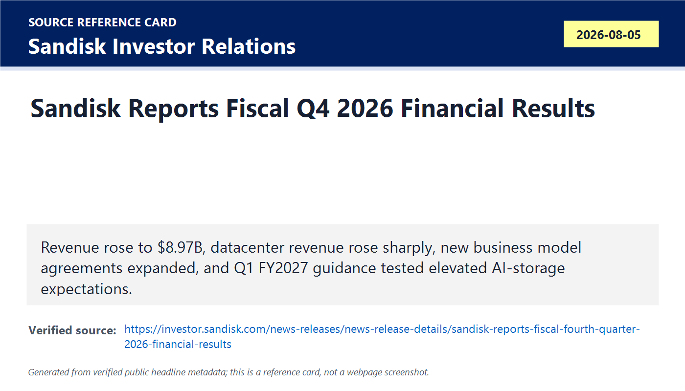
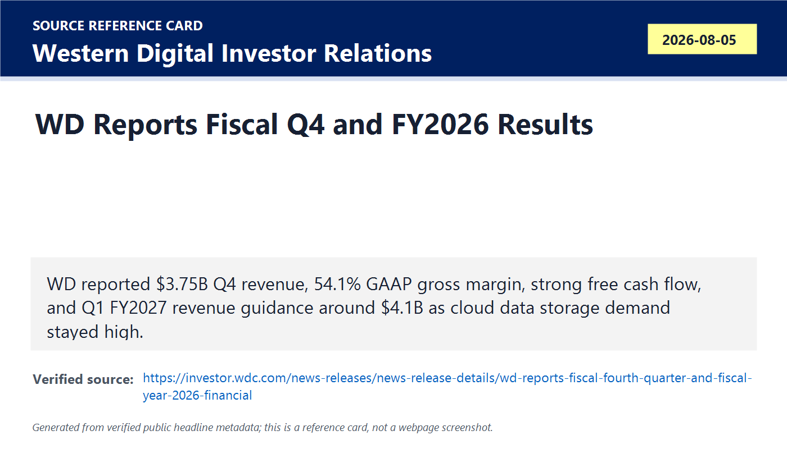
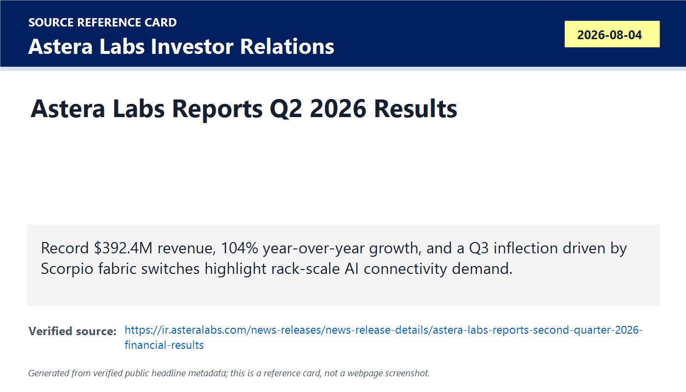
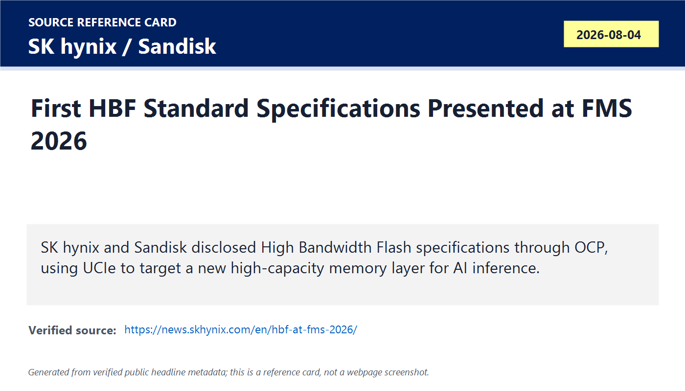
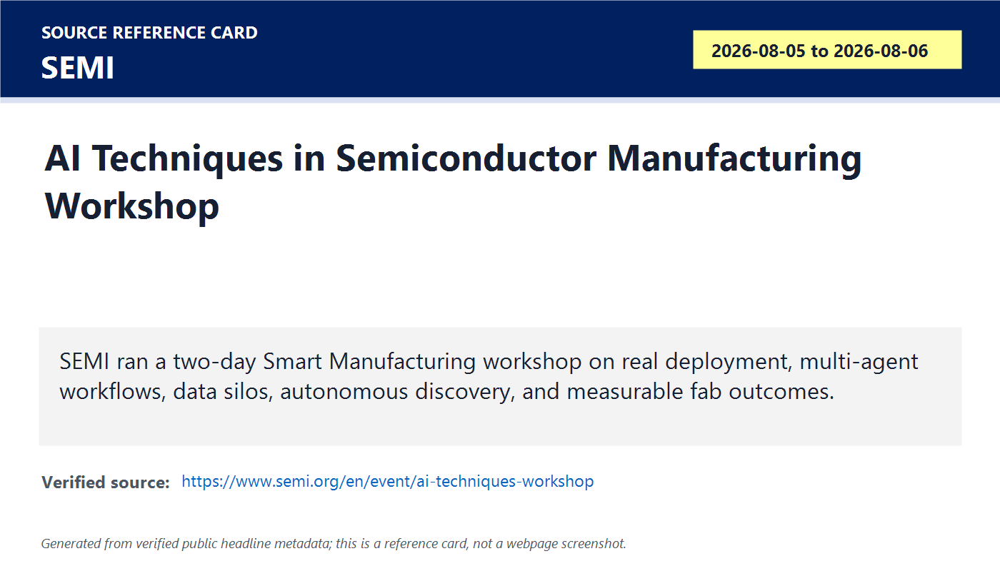
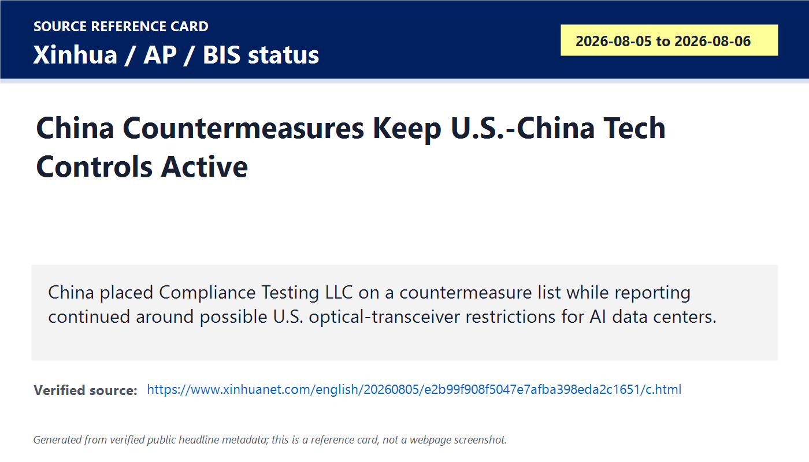
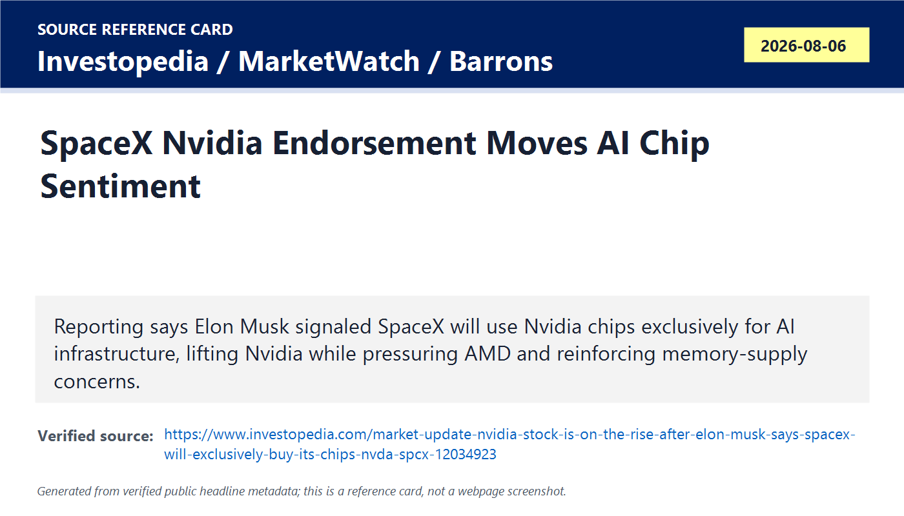
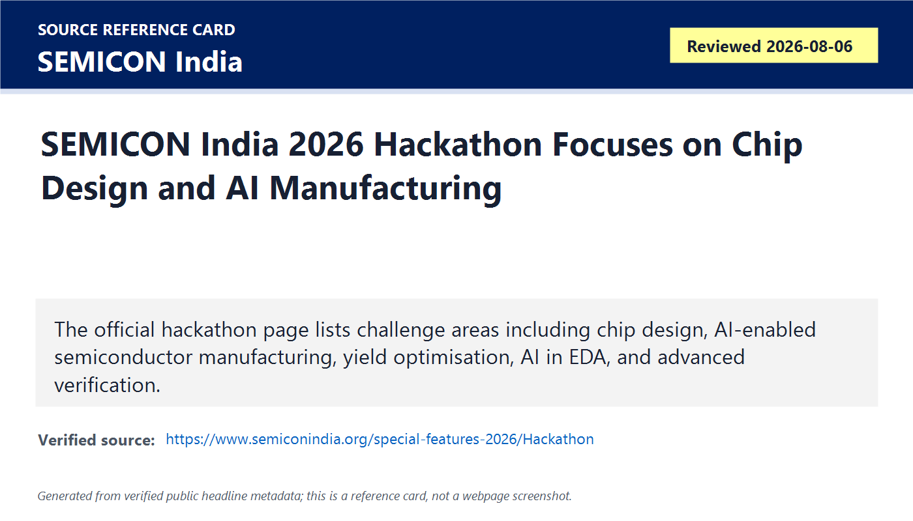

# Daily Semiconductor Current Affairs

Date: 2026-08-06

Research window: Thursday update through approximately 14:00 IST on August 6, 2026. Because several market-moving U.S. releases landed after the August 5 India cutoff, this is a same-day India note plus a last-24-hour catch-up note. The main pattern is that AI infrastructure demand is now stressing the whole data path: flash and HDD storage, AI fabric switches, high-bandwidth flash standards, NVMe power behavior, optical-networking policy risk, and India talent programs.

## Quick Index

| Date | Major Topic | Source Groups | Why To Read |
|---|---|---|---|
| 2026-08-06 | Sandisk Q4 FY2026 proves AI storage pricing and datacenter growth | Sandisk Investor Relations, market reaction reports | Shows NAND/storage demand can produce extreme margins, but guidance and expectations still matter. |
| 2026-08-06 | WD Q4 FY2026 shows HDD/cloud storage strength after the Sandisk separation | Western Digital Investor Relations, market reporting | Explains why AI data growth benefits hard drives and not only SSDs/HBM. |
| 2026-08-06 | Astera Labs Q2 shows AI rack-scale connectivity demand | Astera Labs Investor Relations | Teaches AI fabric switches, retimers, CXL/PCIe/Ethernet data movement, and why connectivity chips matter. |
| 2026-08-06 | SK hynix-Sandisk HBF standard expands the memory hierarchy debate at FMS | SK hynix, PRNewswire, OCP/UCIe context, FMS/NVMe sources | Shows a possible new memory tier between HBM and SSDs for AI inference. |
| 2026-08-06 | SEMI and NVM Express keep manufacturing AI and storage standards visible | SEMI, NVM Express, FMS official page | Connects AI infrastructure to fab analytics, NVMe power management, live migration, and standards work. |
| 2026-08-06 | Optical-policy and China countermeasure risk remain open | Xinhua, AP, Guardian/Caixin context, BIS status check | Separates binding Chinese countermeasures from still-reported U.S. optical-transceiver draft risk. |
| 2026-08-06 | India talent follow-up: SEMICON India Hackathon | SEMICON India official page | Maps India career preparation to chip design, AI-enabled manufacturing, yield optimisation, AI in EDA, and advanced verification. |

**Page navigation:** [Sources](#source-map) · [Concept review](#concept-review) · [Follow-up](#what-to-watch-next) · [Technical terms](#technical-terms-used-today) · [Master glossary](../knowledge-base/glossary.md)

## Technical Terms / Deep Definitions

Term: Datacenter revenue
Definition: Datacenter revenue is sales tied to cloud, hyperscaler, enterprise, AI infrastructure, storage, networking, and server customers rather than consumer or client devices. It solves the business-analysis problem of separating infrastructure demand from PCs, phones, cameras, or retail storage. In today's Sandisk result, datacenter revenue matters because it rose sharply and shows AI infrastructure is pulling NAND flash and storage capacity, not only GPUs and HBM. Example: a flash device sold into a hyperscale AI cluster counts differently from a consumer USB drive even if both use NAND. Source: https://investor.sandisk.com/news-releases/news-release-details/sandisk-reports-fiscal-fourth-quarter-2026-financial-results

Term: NAND flash
Definition: NAND flash is non-volatile semiconductor memory that stores data in floating-gate or charge-trap cells and keeps data without power. It solves the storage problem for SSDs, phones, memory cards, embedded systems, and data centers by providing dense, persistent storage at lower cost per bit than DRAM. In today's Sandisk, SK hynix, and FMS items, NAND matters because AI inference and data pipelines need large storage tiers close enough to feed accelerators economically. Comparison: DRAM is faster and volatile; NAND is slower but persistent and much denser. Source: https://www.kioxia.com/en-jp/business/memory/nand-flash.html

Term: New Business Model agreement
Definition: A New Business Model agreement is Sandisk's label for customer agreements intended to deepen long-term datacenter relationships and reduce storage-cycle volatility through more structured commercial commitments. It solves the business problem that memory and storage suppliers historically swing between shortages and oversupply, so customers and suppliers want clearer supply, pricing, and capacity visibility. In today's Sandisk result, NBMs matter because the company said it added five more agreements after announcing five in April. Example: it is closer to a strategic supply arrangement than a one-off spot sale, but the exact terms are company-specific and not fully public. Source: https://investor.sandisk.com/news-releases/news-release-details/sandisk-reports-fiscal-fourth-quarter-2026-financial-results

Term: Hard disk drive (HDD)
Definition: A hard disk drive stores data magnetically on spinning platters read and written by moving heads. It solves the cold and warm data capacity problem because HDDs can offer very low cost per terabyte for large datasets, backups, logs, media, and cloud object storage. In today's WD result, HDD matters because AI creates massive data storage needs even when compute hot paths use HBM, DRAM, and SSDs. Comparison: SSDs are faster and more shock-resistant; HDDs are usually cheaper for very large capacity. Source: https://www.westerndigital.com/solutions/data-center

Term: Free cash flow
Definition: Free cash flow is cash generated from operations minus capital expenditures, showing cash left after funding the assets needed to run and grow the business. It solves the quality-of-earnings problem because high accounting profit is less useful if the company must spend nearly all cash on factories, tools, inventory, or infrastructure. In today's WD and Sandisk context, free cash flow matters because storage companies are using AI demand to generate cash, repurchase shares, pay dividends, or fund future capacity. Example: net income is an accounting result; free cash flow asks how much cash remains after investment needs. Source: https://www.investor.gov/introduction-investing/investing-basics/glossary/free-cash-flow

Term: AI fabric switch
Definition: An AI fabric switch is a high-bandwidth switching chip or device that connects accelerators, CPUs, memory expanders, storage, and networking endpoints inside rack-scale AI systems. It solves the data-movement problem where many devices must communicate at high speed without being trapped behind a single host or fixed topology. In today's Astera result, Scorpio fabric switches matter because management expects them to become the company's largest product family in Q3. Comparison: a server motherboard switch connects local devices; an AI fabric switch helps build a rack-scale system fabric. Source: https://ir.asteralabs.com/news-releases/news-release-details/astera-labs-reports-second-quarter-2026-financial-results

Term: Retimer
Definition: A retimer is a signal-conditioning chip that receives a high-speed signal, cleans up timing and noise, and retransmits it so the link can travel farther or remain reliable at higher data rates. It solves the signal-integrity problem in PCIe, CXL, Ethernet, and other high-speed links where loss, jitter, crosstalk, and board/package effects degrade the signal. In today's Astera news, retimers matter because 224G Ethernet, PCIe, CXL, and rack-scale AI links need clean signals across boards, cables, and modules. Comparison: a redriver boosts a signal; a retimer fully recovers clock/data and retransmits a cleaner signal. Source: https://www.asteralabs.com/products/taurus/

Term: Signal conditioning
Definition: Signal conditioning is the use of circuits such as retimers, redrivers, equalizers, clock recovery, and diagnostics to preserve data quality across high-speed electrical links. It solves the physical-channel problem that faster links become more sensitive to board traces, connectors, packages, cables, and temperature. In today's Astera result, signal conditioning matters because AI racks need reliable PCIe, CXL, Ethernet, and UALink paths at very high data rates. Example: without signal conditioning, a 224G link can look electrically open but fail under real traffic due to errors. Source: https://www.asteralabs.com/products/taurus/

Term: Universal Chiplet Interconnect Express (UCIe)
Definition: Universal Chiplet Interconnect Express is an open specification for connecting chiplets inside packages, defining how different dies can communicate with standardized protocols and physical interfaces. It solves the interoperability problem in multi-die systems where each vendor would otherwise create proprietary die-to-die links. In today's HBF item, UCIe matters because SK hynix and Sandisk say HBF adopts UCIe so the flash-based memory tier can integrate with different processors, including CPUs and GPUs. Comparison: PCIe connects board-level devices; UCIe targets chiplet-level connections inside a package. Source: https://uciexpress.org/

Term: High Bandwidth Flash (HBF)
Definition: High Bandwidth Flash is a proposed NAND-based memory tier that aims to provide much higher bandwidth than ordinary SSD storage while offering more capacity than HBM, using stacked flash and a high-speed processor interface. It solves the AI inference problem where models, KV caches, embeddings, and long-context data may be too large for HBM but too latency-sensitive for ordinary SSD access. In today's SK hynix-Sandisk news, HBF matters because the first open standard specifications were disclosed through OCP at FMS 2026. Comparison: HBM is fastest and closest, HBF aims to be larger and still package-close, and SSDs provide broader persistent storage. Source: https://news.skhynix.com/en/hbf-at-fms-2026/

Term: Open Compute Project (OCP)
Definition: Open Compute Project is an industry organization that publishes open hardware designs, specifications, and best practices for data-center infrastructure. It solves the ecosystem problem where hyperscalers, chipmakers, system builders, and suppliers need shared standards to reduce fragmentation and speed adoption. In today's HBF item, OCP matters because SK hynix and Sandisk disclosed HBF specifications through OCP to position the technology as an open industry standard rather than a proprietary memory island. Example: OCP can make a rack, storage, or memory specification easier for multiple vendors to implement. Source: https://www.opencompute.org/

Term: 4D NAND
Definition: 4D NAND is SK hynix's branding for a 3D NAND architecture that places peripheral control circuitry under the memory cell array, improving die area efficiency and performance scaling. It solves the physical-scaling problem where adding more NAND layers and peripheral circuits can make die size, cost, and power harder to manage. In today's HBF/FMS item, 4D NAND matters because SK hynix showcased a tenth-generation 375-layer version as part of its AI memory/storage roadmap. Comparison: ordinary 3D NAND stacks cells vertically; 4D NAND also optimizes where support circuitry sits. Source: https://news.skhynix.com/en/hbf-at-fms-2026/

Term: NVMe power limit configuration
Definition: NVMe power limit configuration is a proposed or emerging NVMe capability that lets a host enforce strict power caps on storage devices beyond ordinary predefined power states. It solves the platform power-budget problem where servers, laptops, and dense AI systems need predictable SSD behavior from boot through runtime. In today's FMS standards context, it matters because NVM Express sessions included power and voltage telemetry proposals for next-generation SSDs. Example: instead of trusting an SSD's generic power state, the host can set a tighter power ceiling for the platform. Source: https://nvmexpress.org/event/future-of-memory-and-storage-fms-2026/

Term: Countermeasure list
Definition: A countermeasure list is a government sanctions or restrictions mechanism used to impose limits on named foreign entities in response to actions the government considers harmful. It solves the policy-enforcement problem of targeting specific companies without banning all trade in a sector. In today's China-U.S. tech-control update, the term matters because Xinhua reported China placed Compliance Testing LLC on its countermeasure list effective August 5. Example: being listed can restrict transactions, cooperation, or other activities with the named entity inside that jurisdiction. Source: https://www.xinhuanet.com/english/20260805/e2b99f908f5047e7afba398eda2c1651/c.html

Term: Optical transceiver
Definition: An optical transceiver is a module that converts electrical data signals into optical signals for fiber links and converts incoming optical signals back into electrical form. It solves the data-center networking problem because AI clusters need high-bandwidth, lower-loss communication across servers, switches, and racks. In today's policy update, optical transceivers matter because reported U.S. draft restrictions on Chinese modules remain a supply-chain risk, while China countermeasures show the dispute can widen. Comparison: copper is useful over short board or rack distances; optical links carry high-speed data farther with lower loss. Source: https://www.ieee802.org/3/

Term: Yield optimisation
Definition: Yield optimisation is the engineering process of increasing the percentage of manufactured dies or packaged parts that meet specifications by reducing defects, process variation, test escapes, and reliability failures. It solves the cost problem in semiconductors because every failed die, package, or module raises the cost per good unit. In today's SEMICON India Hackathon item, yield optimisation matters because the official challenge areas include it, showing students must learn manufacturing analytics, not only RTL. Example: improving yield from 70% to 90% can be more valuable than designing a slightly faster circuit. Source: https://www.semiconindia.org/special-features-2026/Hackathon

Term: AI in EDA
Definition: AI in EDA means using machine learning or agentic systems to assist chip-design tasks such as verification, synthesis, placement, routing, timing closure, power analysis, debugging, and design-space exploration. It solves the productivity problem caused by enormous VLSI complexity and limited expert engineering time, but results must still be verified through formal, simulation, signoff, and silicon checks. In today's SEMICON India Hackathon item, AI in EDA matters because it appears as an official challenge area for student innovation. Comparison: AI may suggest a floorplan, but signoff tools still prove whether timing, power, and DRC rules pass. Source: https://www.synopsys.com/glossary/what-is-electronic-design-automation.html

Term: Advanced verification
Definition: Advanced verification is the use of systematic methods such as constrained-random simulation, formal verification, emulation, assertion-based checks, coverage closure, protocol compliance, and hardware/software co-verification to prove a chip behaves correctly before tapeout. It solves the correctness problem that modern SoCs are too complex to test by hand or by a few directed tests. In today's SEMICON India Hackathon item, advanced verification matters because India talent programs are explicitly targeting verification depth. Example: a PCIe controller may pass simple tests but fail rare ordering, reset, or error-handling cases unless advanced verification finds them. Source: https://semiengineering.com/knowledge_centers/eda-design/verification/

Term: Exclusivity signal
Definition: An exclusivity signal is a statement or reported commercial direction suggesting that a major buyer intends to rely primarily or exclusively on one supplier for a future technology layer. It solves no engineering problem by itself; it is market evidence about customer preference, supply allocation, and competitive positioning. In today's Nvidia/SpaceX reporting, the signal matters because reported comments that SpaceX will use Nvidia chips exclusively lifted Nvidia sentiment and pressured rivals such as AMD. Example: an exclusive accelerator commitment can move stocks even before purchase-order details are public. Source: https://www.investopedia.com/market-update-nvidia-stock-is-on-the-rise-after-elon-musk-says-spacex-will-exclusively-buy-its-chips-nvda-spcx-12034923

## Source Images

## Source Map

| Source | Source date | Role | Confidence / limitation |
|---|---:|---|---|
| [Sandisk fiscal Q4 2026 release](https://investor.sandisk.com/news-releases/news-release-details/sandisk-reports-fiscal-fourth-quarter-2026-financial-results), plus [IBD market reaction](https://www.investors.com/news/technology/sandisk-stock-sndk-fiscal-q4-2026-earnings/) and [MarketWatch reaction](https://www.marketwatch.com/story/sandisks-stock-falls-as-the-companys-forecast-doesnt-live-up-to-high-expectations-8fd13d9b) | 2026-08-05 / reviewed 2026-08-06 | Official NAND/storage earnings and market-expectation evidence | Strong for Sandisk financials, segment data, NBMs, buyback, and guidance. Market reaction is sentiment, not operating failure. |
| [WD fiscal Q4 2026 release](https://investor.wdc.com/news-releases/news-release-details/wd-reports-fiscal-fourth-quarter-and-fiscal-year-2026-financial), plus [IBD](https://www.investors.com/news/technology/western-digital-stock-wdc-earnings-june-2026/) and [WSJ reporting](https://www.wsj.com/business/earnings/western-digital-profit-surges-as-revenue-grows-8837d0bf) | 2026-08-05 / reviewed 2026-08-06 | Official HDD/cloud storage earnings evidence | Strong for WD financials, cash flow, and guidance. Stock reaction depends on expectations and peer comparison. |
| [Astera Labs Q2 2026 release](https://ir.asteralabs.com/news-releases/news-release-details/astera-labs-reports-second-quarter-2026-financial-results) | 2026-08-04 / reviewed 2026-08-06 | AI fabric connectivity and high-speed interconnect evidence | Strong for revenue, margins, business highlights, and guidance. Customer shipment concentration and long-term competition remain follow-ups. |
| [SK hynix HBF release](https://news.skhynix.com/en/hbf-at-fms-2026/) and [PRNewswire version](https://www.prnewswire.com/news-releases/sk-hynix-unveils-first-hbf-standard-specifications-with-sandisk-presenting-ai-memory-solutions-at-fms-2026-302841792.html), with [FMS official page](https://www.terrapinn.com/conference/future-memory-storage/index.stm) | 2026-08-04 to 2026-08-06 | High Bandwidth Flash, UCIe, OCP, 4D NAND and AI memory hierarchy evidence | Strong for standard-specification announcement and event context. Product availability, latency, workload results, and ecosystem adoption remain pending. |
| [NVM Express FMS 2026 event page](https://nvmexpress.org/event/future-of-memory-and-storage-fms-2026/) and [SEMI AI Techniques Workshop](https://www.semi.org/en/event/ai-techniques-workshop) | 2026-08-04 to 2026-08-06 | Storage standards and AI manufacturing workflow evidence | Strong for agenda and technical topics. Event sessions are not the same as deployed customer outcomes. |
| [Xinhua on Compliance Testing countermeasure](https://www.xinhuanet.com/english/20260805/e2b99f908f5047e7afba398eda2c1651/c.html), [AP China countermeasures report](https://apnews.com/article/china-us-sanctions-drone-forced-labor-ad0b637298e9608c5351bca84debeb25), and [BIS news status page](https://www.bis.gov/news-updates) | 2026-08-05 to 2026-08-06 | Geopolitics and policy/export-control risk evidence | Strong for China's countermeasure status from state media and AP reporting. No final U.S. optical-transceiver rule was verified in this run. |
| [Investopedia Nvidia/SpaceX market update](https://www.investopedia.com/market-update-nvidia-stock-is-on-the-rise-after-elon-musk-says-spacex-will-exclusively-buy-its-chips-nvda-spcx-12034923), [MarketWatch memory-chip comments](https://www.marketwatch.com/story/elon-musk-addresses-memory-chip-stock-concerns-with-one-simple-observation-df134d47), and [NVIDIA Rubin release](https://investor.nvidia.com/news/press-release-details/2026/NVIDIA-Kicks-Off-the-Next-Generation-of-AI-With-Rubin--Six-New-Chips-One-Incredible-AI-Supercomputer/default.aspx) | 2026-08-06 / Nvidia Rubin context from 2026-01-05 | Market-moving AI accelerator demand signal | Treat as reported customer-intent and sentiment unless official supply contracts or purchase quantities are disclosed. |
| [SEMICON India Hackathon](https://www.semiconindia.org/special-features-2026/Hackathon), [SEMICON India overview](https://www.semiconindia.org/about/overview), and [TSMC financial calendar](https://investor.tsmc.com/english/financial-calendar) | Reviewed 2026-08-06 | India talent and foundry follow-up evidence | Strong for official hackathon areas and TSMC July revenue date. Hackathon is talent evidence, not production output; TSMC July revenue remains pending until August 10. |

## Deep Briefing

### 1. Sandisk Shows AI Storage Is Pricing-Power Evidence, But Guidance Still Matters

**Confirmed facts:** Sandisk reported fiscal Q4 2026 revenue of USD 8.97 billion, up 51% sequentially and 372% year over year. GAAP net income was USD 6.90 billion, GAAP diluted EPS was USD 43.97, and non-GAAP diluted EPS was USD 39.25. Management said sequential revenue growth came about one-third from higher volumes and two-thirds from higher pricing. Fiscal 2026 revenue was USD 20.25 billion, up 175% year over year, with Datacenter revenue up 437%. Sandisk also said it signed five additional New Business Model agreements after the five discussed in April, and it expanded its buyback authorization by USD 14 billion.

**Analysis:** This is one of the clearest storage-cycle proof points of the week. Sandisk is showing that AI infrastructure demand and storage scarcity are turning into pricing power. The volume/pricing split is especially important: two-thirds of sequential growth from pricing means tight supply and customer urgency are driving profit. That is good for supplier cash generation but risky for downstream buyers.

**Why it matters:** AI demand does not only consume HBM. Training data, checkpoints, vector stores, retrieval data, logs, long-context artifacts, and inference caches require huge persistent storage. If NAND suppliers can lock in NBMs and improve pricing, the storage layer becomes a strategic part of AI infrastructure economics.

**What can go wrong:** The stock reaction showed expectations risk. If investors already assumed very strong pricing, guidance that is only in-line can disappoint. Also, high margins can invite capacity additions, substitution, customer pushback, or inventory digestion later.

**India angle:** India data centers, startups, and electronics companies should watch storage pricing because it affects cloud costs and device BOMs. For careers, SSD firmware, NAND validation, storage benchmarking, and data-center storage architecture become more important.

**VLSI/career relevance:** Learn NAND endurance, ECC, controller firmware, QoS, wear leveling, SSD thermal throttling, and PCIe/NVMe validation. A strong answer should explain why a storage company can benefit from AI even without selling GPUs.

### 2. WD Shows AI Data Growth Still Needs HDD Capacity

**Confirmed facts:** WD reported fiscal Q4 revenue of USD 3.747 billion, up 44% year over year, GAAP gross margin of 54.1%, non-GAAP gross margin of 54.4%, GAAP diluted EPS of USD 8.21, non-GAAP diluted EPS of USD 3.56, operating cash flow of USD 1.39 billion, and free cash flow of USD 1.28 billion. WD guided Q1 FY2027 revenue to USD 4.1 billion plus or minus USD 100 million and non-GAAP EPS to USD 4.00 plus or minus USD 0.15.

**Analysis:** After the Sandisk separation, WD is a clearer hard-drive and large-scale storage infrastructure read-through. AI systems need expensive hot memory, but they also produce and consume oceans of colder data. HDDs remain relevant where capacity cost dominates latency. WD's cash flow and guidance suggest hyperscaler and cloud storage demand is strong enough to lift HDD economics.

**Why it matters:** AI has multiple data temperatures. HBM handles hot compute data. DRAM and CXL memory handle working sets. SSDs handle fast local or nearline data. HDDs handle large persistent datasets, backups, logs, media, and archival training corpora. Ignoring HDDs gives an incomplete AI infrastructure map.

**What can go wrong:** HDD demand depends on hyperscaler capex, inventory discipline, areal-density roadmaps, pricing, and cloud return on invested capital. Strong results can still face stock pressure if investors wanted more aggressive guidance after a large run-up.

**India angle:** India can build capability in storage-system validation, firmware testing, cloud storage operations, data-center reliability, and power/thermal testing. This is practical infrastructure work adjacent to semiconductors.

**VLSI/career relevance:** Compare latency, bandwidth, capacity, cost per bit, power, and reliability across HBM, DRAM, NAND SSD, and HDD. The best engineers can place each technology in the memory/storage hierarchy instead of calling one "better" in isolation.

### 3. Astera Labs Turns AI Connectivity Into A Semiconductor Earnings Story

**Confirmed facts:** Astera Labs reported Q2 revenue of USD 392.4 million, up 27% sequentially and 104% year over year. GAAP gross margin was 73.3%, non-GAAP gross margin was 73.7%, GAAP net income was USD 153.1 million, and non-GAAP diluted EPS was USD 0.80. Management said Q3 revenue inflection would be driven by Scorpio X-Series 320-lane fabric switch production ramp, and recent highlights included 3.2T Taurus signal-conditioning products for 224G Ethernet and UALink, optical interconnect demonstrations, AMD Advancing AI interoperability, CXL memory controller work, and expanded Taiwan operations.

**Analysis:** Astera is a clean example of AI demand moving into the connectivity layer. GPUs and HBM get attention, but rack-scale systems need signal integrity and fabric devices to move data across accelerators, CPUs, memory expanders, NICs, SSDs, and switches. Scorpio becoming the largest product family would mean AI fabrics are not just lab demos; they are becoming revenue.

**Why it matters:** AI clusters are distributed systems. More accelerators only help if the interconnect keeps them fed and synchronized. Retimers, redrivers, fabric switches, CXL controllers, Ethernet devices, diagnostics, and telemetry decide whether rack-scale architecture is reliable at production speed.

**What can go wrong:** Connectivity suppliers can be exposed to platform timing, customer concentration, Nvidia/AMD platform transitions, CXL adoption speed, optical timing, and high valuation expectations. Strong revenue growth still needs durable design wins and multi-generation platform relevance.

**India angle:** This is a direct career map: PCIe/CXL/Ethernet verification, SerDes validation, signal integrity, UVM, firmware, telemetry, board bring-up, and interop labs. India engineers can contribute heavily without owning fabs.

**VLSI/career relevance:** Revise SerDes, jitter, equalization, lane margining, protocol verification, retimer architecture, CXL.mem, PCIe hierarchy, and Ethernet link training. The interview-level answer is that AI performance is a system-link problem, not only a compute-die problem.

### 4. HBF Is The Most Important FMS Memory-Hierarchy Concept To Study Today

**Confirmed facts:** SK hynix and Sandisk disclosed the first High Bandwidth Flash standard specifications around FMS 2026 through the Open Compute Project. The sources say HBF adopts UCIe as the processor interface, aims to ease AI memory bottlenecks, and targets a new memory layer between HBM and storage. Public summaries describe up to 512 GB capacity and bandwidth classes up to 3 TB/s, while SK hynix also showcased tenth-generation 375-layer 4D NAND with improved performance per watt.

**Analysis:** HBF is important because it attacks the memory wall from the other side. HBM is very fast but capacity-limited and expensive. Ordinary SSDs have capacity but are too far away in latency and protocol terms for many hot AI inference data paths. HBF tries to use NAND capacity in a package-close, high-bandwidth, standard interface form.

**Why it matters:** Large AI inference is increasingly limited by memory capacity, bandwidth, and cache movement. If HBF works, an accelerator could keep some large model data, embeddings, retrieval data, or cache tiers closer than SSD while avoiding the cost of putting everything in HBM. It could also shift packaging and standards competition toward UCIe-based memory modules.

**What can go wrong:** The key risks are latency, endurance, write amplification, thermal behavior, package complexity, software placement, reliability, and ecosystem adoption. "Up to 3 TB/s" does not mean HBM-like latency. The workload must tolerate the tier.

**India angle:** India should study HBF as a cross-layer skill item: memory architecture, UCIe, package test, NAND reliability, firmware, Linux memory tiering, compiler/runtime placement, and AI inference serving.

**VLSI/career relevance:** A good answer should draw a hierarchy: HBM for hottest tensors, DRAM/CXL for working sets, HBF for larger near-memory data, SSD for persistent fast storage, HDD/object storage for colder data. Then explain latency, bandwidth, capacity, cost, and endurance tradeoffs.

### 5. SEMI And NVM Express Show Standards And Manufacturing AI Are Still The Base Layer

**Confirmed facts:** SEMI's AI Techniques in Semiconductor Manufacturing workshop runs August 5-6 and focuses on real-world deployment, observable multi-agent workflows, moving beyond data silos, autonomous discovery, and business results. NVM Express participated at FMS 2026 with sessions on live migration, power and platform innovations, NVMe power telemetry, power limit configuration, NVMe roadmap, virtualization, subsystem local memory, and NVMe over Fabrics support.

**Analysis:** These agenda items are not product revenue, but they matter because standards and manufacturing workflows decide whether hardware scales reliably. NVMe power limit and telemetry features matter when SSDs sit inside dense AI servers. SEMI's manufacturing AI focus matters when fabs and OSATs need faster root-cause analysis, yield learning, and tool maintenance.

**Why it matters:** AI data centers and semiconductor factories both have many devices, many vendors, and tight operating windows. Without standards, each product becomes a custom integration burden. Without manufacturing analytics, capacity additions do not automatically become yield.

**What can go wrong:** Standards work can be slow, optional, or unevenly adopted. AI manufacturing projects can fail if data is siloed, models are not trusted, or engineers cannot trace the recommendation back to process evidence.

**India angle:** This is highly relevant to India because new OSATs and future fabs need yield engineers, manufacturing-data engineers, test engineers, and storage/firmware validation talent. These are realistic hiring areas.

**VLSI/career relevance:** Learn NVMe, CXL, PCIe, power states, telemetry, SPC, yield analytics, DFT, and failure analysis. The same verification mindset used in RTL applies to manufacturing data: evidence, coverage, traceability, and reproducibility.

### 6. Policy Risk Updated: China Countermeasures Are Confirmed, U.S. Optical Ban Is Still Reported Draft

**Confirmed facts:** Xinhua reported that China placed U.S. firm Compliance Testing LLC on a countermeasure list effective August 5, 2026. AP reported broader Chinese countermeasures including tighter drone-related export controls and trade restrictions on U.S. entities. The earlier U.S. optical-transceiver story remains reported draft risk in this run; no final BIS rule was verified on the BIS news page before the cutoff.

**Analysis:** This matters because the U.S.-China tech conflict is moving beyond GPU export controls into certification, components, drones, optical modules, routers, and data-center devices. Even when one item is not a final rule, countermeasures in adjacent areas can raise supply-chain risk and compliance uncertainty.

**Why it matters:** AI data centers depend on optical transceivers, switches, power devices, storage, servers, certification labs, firmware, and international logistics. Policy pressure on any one layer can delay deployment or change supplier selection.

**What can go wrong:** Researchers can overstate the story. China's Compliance Testing listing appears binding within China's framework, but the U.S. optical-transceiver ban remains reported draft unless official text appears. Keep these statuses separate.

**India angle:** India may see opportunity in alternate optical/networking supply chains, but stock moves are not the same as qualified orders. India suppliers need speed, reliability, certification, volume, and customer trust.

**VLSI/career relevance:** Engineers should understand that compliance and supply-chain constraints affect design choices. A high-speed optical module is not just a photonics problem; it is also security, certification, sourcing, firmware, and reliability.

### 7. SpaceX-Nvidia Reporting Shows Customer Preference Can Move The AI-Chip Market

**Confirmed facts:** Market reporting said Elon Musk indicated SpaceX will use Nvidia chips exclusively for AI infrastructure, lifting Nvidia sentiment while pressuring AMD and other AI hardware names. Reporting also said Musk emphasized memory as a limiting factor. Nvidia's own earlier Rubin release provides official context for the architecture being praised, but the customer-exclusivity detail in this run is based on market reporting rather than a newly reviewed Nvidia contract filing.

**Analysis:** This is a market-moving signal, not a full procurement proof. It matters because very large AI buyers can influence accelerator allocation and investor sentiment. A high-profile buyer favoring Nvidia reinforces Nvidia's platform advantage, software ecosystem, and supply-allocation power. It also shows why AMD can report strong numbers and still trade weakly if investors see top buyers concentrating future demand elsewhere.

**Why it matters:** AI accelerator competition is not only chip specs. Buyers choose platforms based on software, rack design, memory availability, networking, power, roadmap confidence, and supply guarantees. A single large buyer's preference can affect perceived market share.

**India angle:** India AI infrastructure planners should watch platform concentration risk. For careers, CUDA/Nvidia ecosystem skills remain valuable, but AMD ROCm, open networking, storage, power, and validation are also needed because customers want options.

**VLSI/career relevance:** Learn how to distinguish benchmark performance from ecosystem adoption. A chip can be technically good and still lose a deployment if software, supply, memory, or rack integration is weaker.

### 8. SEMICON India Hackathon Is A Career-Relevant Talent Signal, Not Production Proof

**Confirmed facts:** The SEMICON India 2026 Hackathon page lists challenge areas including Chip Design, AI-enabled Semiconductor Manufacturing, Yield Optimisation, AI in EDA, and Advanced Verification. It is open to undergraduate, postgraduate, and PhD students, with top teams moving toward the SEMICON India 2026 Grand Finale. The SEMICON India overview says the 2026 event runs September 17-19 at Yashobhoomi, New Delhi and includes more than 500 exhibiting companies, country pavilions, state pavilions, a workforce development pavilion, a startup pavilion, and the hackathon.

**Analysis:** This is not manufacturing-output proof. It is talent-pipeline proof. The good news is that the challenge areas are not generic coding topics; they map directly to VLSI, manufacturing analytics, verification, and EDA. The risk is that hackathons become shallow unless problem statements, datasets, mentors, evaluation, and follow-on internships are serious.

**Why it matters:** India needs engineers who can solve real semiconductor problems: verification coverage, yield analytics, design automation, manufacturing data, and deployable prototypes. This official challenge framing is useful because it pushes students toward industry problems instead of generic app ideas.

**India angle:** Kapil should track this as a possible study and career checklist: chip design basics, SystemVerilog/UVM, Python data analysis for yield, EDA scripting, DFT, verification coverage, and manufacturing concepts.

**VLSI/career relevance:** A strong student project should include a reproducible flow, test cases, metrics, limitations, and deployment plan. For example, an AI-in-EDA project should show what design stage it helps, what data it uses, how it is verified, and what failure modes remain.

## Follow-Up Ledger

| Prior item | Status on 2026-08-06 | Evidence |
|---|---|---|
| August 5 memory/storage market reaction watch | Updated: Sandisk and WD both beat officially, but stocks reacted to guidance and elevated expectations | Sandisk IR, WD IR, IBD, MarketWatch |
| August 4/5 FMS memory hierarchy queue | Updated: HBF becomes the key study item, with UCIe/OCP/open-spec positioning; production proof remains pending | SK hynix/Sandisk, FMS, OCP context |
| August 5 SEMI AI manufacturing workshop | Still active and updated through day 2; wait for customer case studies before claiming yield gains | SEMI |
| August 5 optical-transceiver policy risk | Updated: China countermeasure against Compliance Testing is confirmed; U.S. optical-transceiver restriction still reported draft/no final BIS rule verified | Xinhua, AP, BIS |
| August 5 AMD expectation-risk follow-up | Updated by Nvidia/SpaceX market reports; AMD remains operationally strong but sentiment favors Nvidia platform concentration | Investopedia, MarketWatch, Nvidia Rubin context |
| Foundry monthly revenue watch | Still pending: TSMC July 2026 monthly sales is scheduled for August 10, not available today | TSMC financial calendar |
| India ecosystem watch | Updated: SEMICON India Hackathon official areas align with chip design, AI manufacturing, yield, AI in EDA, and advanced verification | SEMICON India |

## Concept Review

| Concept | Deep Definition | Why It Matters In This News | Revise Next | Source |
|---|---|---|---|---|
| AI memory/storage hierarchy | AI systems need multiple storage and memory layers because each layer optimizes different tradeoffs: latency, bandwidth, capacity, power, endurance, and cost. | Sandisk, WD, HBF, and NVM Express all show AI demand spreading from HBM into NAND, SSDs, HDDs, and standards. | HBM vs DRAM vs HBF vs SSD vs HDD. | https://news.skhynix.com/en/hbf-at-fms-2026/ |
| Rack-scale connectivity | Rack-scale connectivity links many chips, servers, accelerators, memory devices, storage devices, and network devices into a usable AI system. | Astera's Scorpio, Taurus, CXL and Ethernet work shows connectivity is a revenue-generating semiconductor layer. | SerDes, retimers, PCIe, CXL, Ethernet, UALink. | https://ir.asteralabs.com/news-releases/news-release-details/astera-labs-reports-second-quarter-2026-financial-results |
| Standards as adoption tools | Standards define shared interfaces, behavior, power features, reliability expectations, and interoperability rules so multiple vendors can build compatible systems. | HBF through OCP, UCIe, and NVMe sessions show that AI infrastructure needs shared rules. | OCP, UCIe, NVMe, PCIe, CXL. | https://www.opencompute.org/ |
| Policy-status discipline | Policy-status discipline separates confirmed legal action from proposals, reports, letters, market rumors, or analysis. | China countermeasures are confirmed; the U.S. optical-transceiver ban remains reported draft in this run. | BIS, FCC, Entity List, Covered List, export controls. | https://www.bis.gov/news-updates |
| India talent pipeline | Talent-pipeline evidence includes official challenge areas, mentors, labs, tools, internships, and industry problem statements. | SEMICON India Hackathon gives concrete VLSI and manufacturing challenge areas for students. | UVM, DFT, yield analytics, AI in EDA, manufacturing data. | https://www.semiconindia.org/special-features-2026/Hackathon |

## Simple Explanation

Today is about the data path around AI. Sandisk proved NAND/storage pricing power. WD proved hard drives still matter for cloud-scale data. Astera proved connectivity chips are critical inside AI racks. SK hynix and Sandisk proposed HBF as a new memory tier between HBM and SSDs. SEMI and NVM Express showed manufacturing AI and storage standards are still the foundation. Policy risk stayed active because China confirmed a countermeasure while the U.S. optical-transceiver story remains draft reporting. India added a useful career signal through the SEMICON India Hackathon.

## Interview Questions

1. Why can AI growth benefit both SSD/NAND suppliers and HDD suppliers?
2. Explain HBF and why it is different from HBM and an SSD.
3. What does a retimer do in a high-speed AI rack?
4. Why is UCIe important for chiplet and package-level memory integration?
5. How do you separate confirmed policy action from reported draft restrictions?
6. What makes a serious AI-in-EDA student project different from a generic AI demo?
7. Why can a storage company beat earnings but still sell off after guidance?

## What To Watch Next

1. Sandisk and WD: whether NBMs, pricing, and guidance hold after the first post-result trading day.
2. HBF: OCP specification details, Google/Tenstorrent engagement, latency numbers, endurance, software placement, and sample timelines.
3. Astera: Scorpio production ramp, customer concentration, optical interconnect adoption, and platform timing with AMD/Nvidia systems.
4. Policy: any final FCC/BIS/Federal Register text on optical transceivers or Chinese data-center components.
5. TSMC July 2026 sales release scheduled for August 10.
6. SEMICON India Hackathon: final problem statements, mentor details, datasets, tool access, and top-team outputs.

## Technical Terms Used Today

[Back to quick index](#quick-index) · [Open the master A-Z glossary](../knowledge-base/glossary.md)

**Term index:** [4D NAND](#daily-term-4d-nand) · [Advanced verification](#daily-term-advanced-verification) · [AI fabric switch](#daily-term-ai-fabric-switch) · [AI in EDA](#daily-term-ai-in-eda) · [Countermeasure list](#daily-term-countermeasure-list) · [Datacenter revenue](#daily-term-datacenter-revenue) · [Exclusivity signal](#daily-term-exclusivity-signal) · [Free cash flow](#daily-term-free-cash-flow) · [Hard disk drive (HDD)](#daily-term-hard-disk-drive-hdd) · [High Bandwidth Flash (HBF)](#daily-term-high-bandwidth-flash-hbf) · [NAND flash](#daily-term-nand-flash) · [New Business Model agreement](#daily-term-new-business-model-agreement) · [NVMe power limit configuration](#daily-term-nvme-power-limit-configuration) · [Open Compute Project (OCP)](#daily-term-open-compute-project-ocp) · [Optical transceiver](#daily-term-optical-transceiver) · [Retimer](#daily-term-retimer) · [Signal conditioning](#daily-term-signal-conditioning) · [Universal Chiplet Interconnect Express (UCIe)](#daily-term-universal-chiplet-interconnect-express-ucie) · [Yield optimisation](#daily-term-yield-optimisation)

| Term | Meaning |
|---|---|
| [**4D NAND**](../knowledge-base/glossary.md#term-4d-nand) | 4D NAND is SK hynix's branding for a 3D NAND architecture that places peripheral control circuitry under the memory cell array, improving die area efficiency and performance scaling. It solves the physical-scaling problem where adding more NAND layers and peripheral circuits can make die size, cost, and power harder to manage. |
| [**Advanced verification**](../knowledge-base/glossary.md#term-advanced-verification) | Advanced verification is the use of systematic methods such as constrained-random simulation, formal verification, emulation, assertion-based checks, coverage closure, protocol compliance, and hardware/software co-verification to prove a chip behaves correctly before tapeout. It solves the correctness problem that modern SoCs are too complex to test by hand or by a few directed tests. |
| [**AI fabric switch**](../knowledge-base/glossary.md#term-ai-fabric-switch) | An AI fabric switch is a high-bandwidth switching chip or device that connects accelerators, CPUs, memory expanders, storage, and networking endpoints inside rack-scale AI systems. It solves the data-movement problem where many devices must communicate at high speed without being trapped behind a single host or fixed topology. |
| [**AI in EDA**](../knowledge-base/glossary.md#term-ai-in-eda) | AI in EDA means using machine learning or agentic systems to assist chip-design tasks such as verification, synthesis, placement, routing, timing closure, power analysis, debugging, and design-space exploration. It solves the productivity problem caused by enormous VLSI complexity and limited expert engineering time, but results must still be verified through formal, simulation, signoff, and silicon checks. |
| [**Countermeasure list**](../knowledge-base/glossary.md#term-countermeasure-list) | A countermeasure list is a government sanctions or restrictions mechanism used to impose limits on named foreign entities in response to actions the government considers harmful. It solves the policy-enforcement problem of targeting specific companies without banning all trade in a sector. |
| [**Datacenter revenue**](../knowledge-base/glossary.md#term-datacenter-revenue) | Datacenter revenue is sales tied to cloud, hyperscaler, enterprise, AI infrastructure, storage, networking, and server customers rather than consumer or client devices. It solves the business-analysis problem of separating infrastructure demand from PCs, phones, cameras, or retail storage. |
| [**Exclusivity signal**](../knowledge-base/glossary.md#term-exclusivity-signal) | An exclusivity signal is a statement or reported commercial direction suggesting that a major buyer intends to rely primarily or exclusively on one supplier for a future technology layer. It solves no engineering problem by itself; it is market evidence about customer preference, supply allocation, and competitive positioning. |
| [**Free cash flow**](../knowledge-base/glossary.md#term-free-cash-flow) | Free cash flow is cash generated from operations minus capital expenditures, showing cash left after funding the assets needed to run and grow the business. It solves the quality-of-earnings problem because high accounting profit is less useful if the company must spend nearly all cash on factories, tools, inventory, or infrastructure. |
| [**Hard disk drive (HDD)**](../knowledge-base/glossary.md#term-hard-disk-drive-hdd) | A hard disk drive stores data magnetically on spinning platters read and written by moving heads. It solves the cold and warm data capacity problem because HDDs can offer very low cost per terabyte for large datasets, backups, logs, media, and cloud object storage. |
| [**High Bandwidth Flash (HBF)**](../knowledge-base/glossary.md#term-high-bandwidth-flash-hbf) | High Bandwidth Flash is a proposed NAND-based memory tier that aims to provide much higher bandwidth than ordinary SSD storage while offering more capacity than HBM, using stacked flash and a high-speed processor interface. It solves the AI inference problem where models, KV caches, embeddings, and long-context data may be too large for HBM but too latency-sensitive for ordinary SSD access. |
| [**NAND flash**](../knowledge-base/glossary.md#term-nand-flash) | NAND flash is non-volatile semiconductor memory that stores data in floating-gate or charge-trap cells and keeps data without power. It solves the storage problem for SSDs, phones, memory cards, embedded systems, and data centers by providing dense, persistent storage at lower cost per bit than DRAM. |
| [**New Business Model agreement**](../knowledge-base/glossary.md#term-new-business-model-agreement) | A New Business Model agreement is Sandisk's label for customer agreements intended to deepen long-term datacenter relationships and reduce storage-cycle volatility through more structured commercial commitments. It solves the business problem that memory and storage suppliers historically swing between shortages and oversupply, so customers and suppliers want clearer supply, pricing, and capacity visibility. |
| [**NVMe power limit configuration**](../knowledge-base/glossary.md#term-nvme-power-limit-configuration) | NVMe power limit configuration is a proposed or emerging NVMe capability that lets a host enforce strict power caps on storage devices beyond ordinary predefined power states. It solves the platform power-budget problem where servers, laptops, and dense AI systems need predictable SSD behavior from boot through runtime. |
| [**Open Compute Project (OCP)**](../knowledge-base/glossary.md#term-open-compute-project-ocp) | Open Compute Project is an industry organization that publishes open hardware designs, specifications, and best practices for data-center infrastructure. It solves the ecosystem problem where hyperscalers, chipmakers, system builders, and suppliers need shared standards to reduce fragmentation and speed adoption. |
| [**Optical transceiver**](../knowledge-base/glossary.md#term-optical-transceiver) | An optical transceiver is a module that converts electrical data signals into optical signals for fiber links and converts incoming optical signals back into electrical form. It solves the data-center networking problem because AI clusters need high-bandwidth, lower-loss communication across servers, switches, and racks. |
| [**Retimer**](../knowledge-base/glossary.md#term-retimer) | A retimer is a signal-conditioning chip that receives a high-speed signal, cleans up timing and noise, and retransmits it so the link can travel farther or remain reliable at higher data rates. It solves the signal-integrity problem in PCIe, CXL, Ethernet, and other high-speed links where loss, jitter, crosstalk, and board/package effects degrade the signal. |
| [**Signal conditioning**](../knowledge-base/glossary.md#term-signal-conditioning) | Signal conditioning is the use of circuits such as retimers, redrivers, equalizers, clock recovery, and diagnostics to preserve data quality across high-speed electrical links. It solves the physical-channel problem that faster links become more sensitive to board traces, connectors, packages, cables, and temperature. |
| [**Universal Chiplet Interconnect Express (UCIe)**](../knowledge-base/glossary.md#term-universal-chiplet-interconnect-express-ucie) | Universal Chiplet Interconnect Express is an open specification for connecting chiplets inside packages, defining how different dies can communicate with standardized protocols and physical interfaces. It solves the interoperability problem in multi-die systems where each vendor would otherwise create proprietary die-to-die links. |
| [**Yield optimisation**](../knowledge-base/glossary.md#term-yield-optimisation) | Yield optimisation is the engineering process of increasing the percentage of manufactured dies or packaged parts that meet specifications by reducing defects, process variation, test escapes, and reliability failures. It solves the cost problem in semiconductors because every failed die, package, or module raises the cost per good unit. |

This page-end index covers the specialist terms central to this day's study. The fuller explanation, news context, and source remain at first use; the master glossary combines repeated terms across all days.
