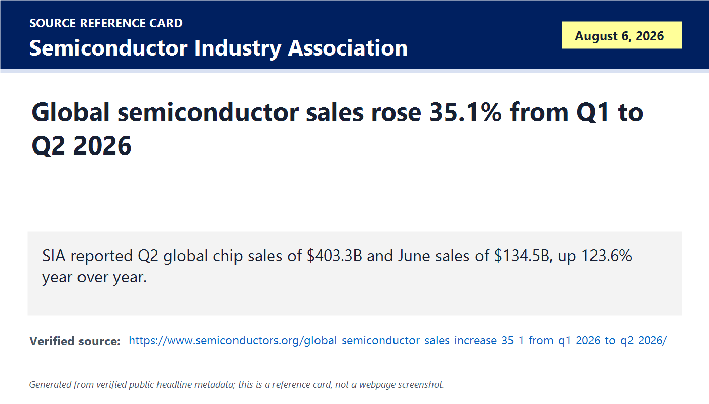
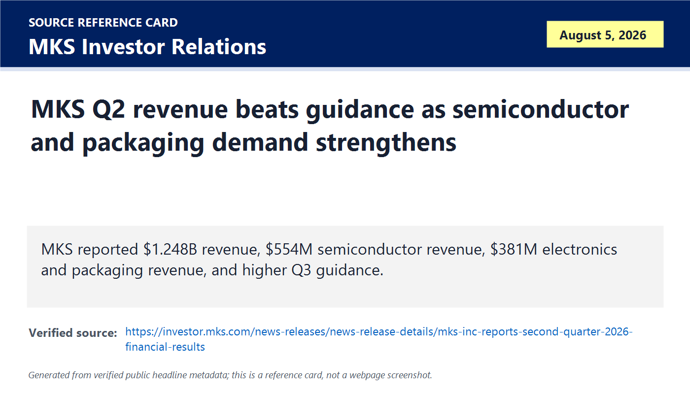
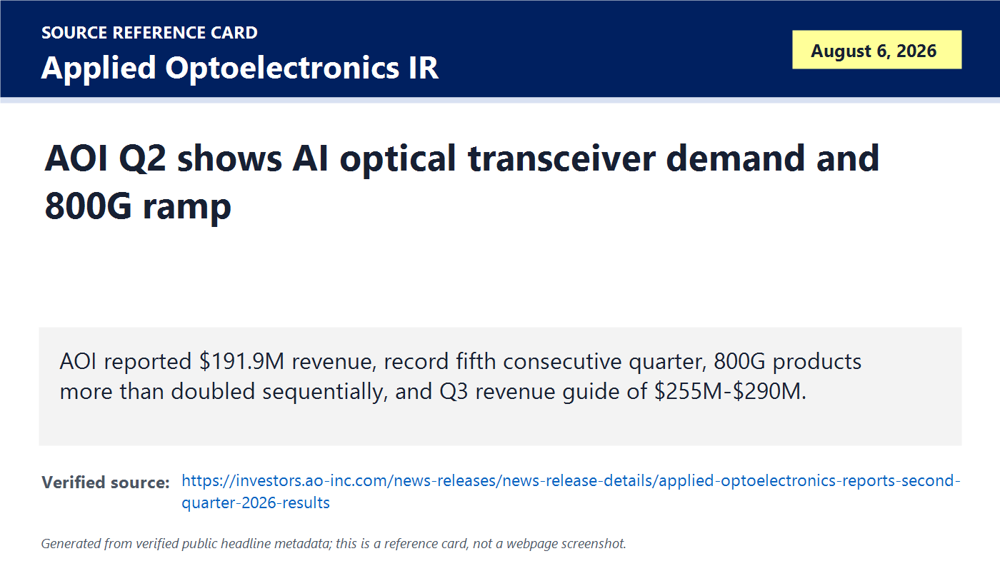
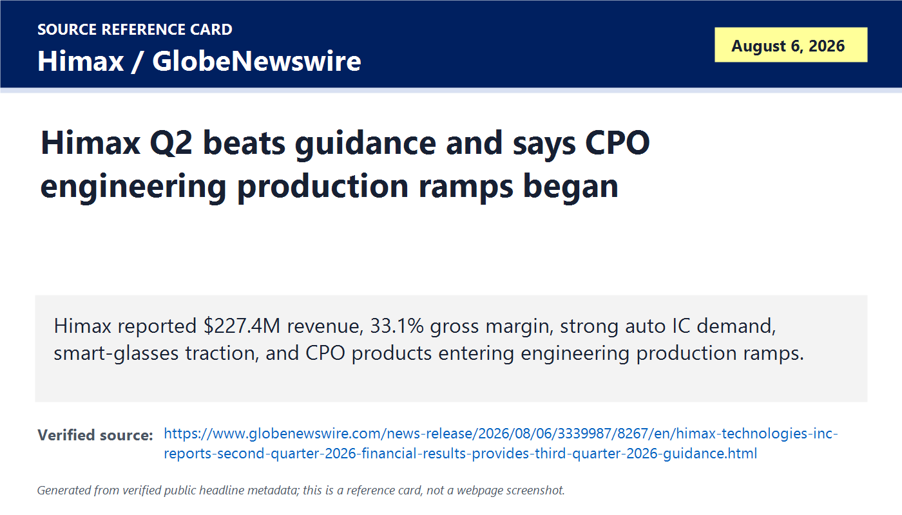
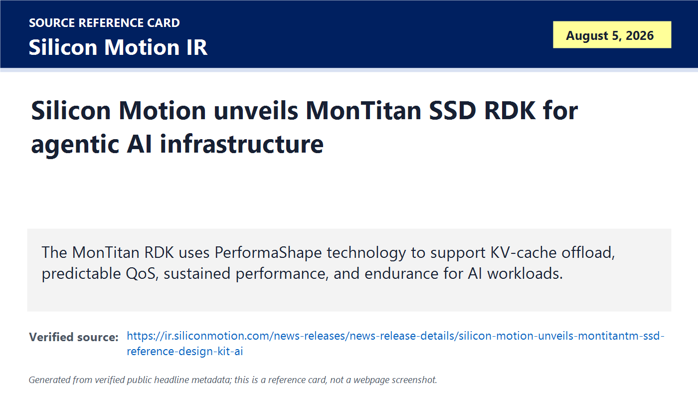
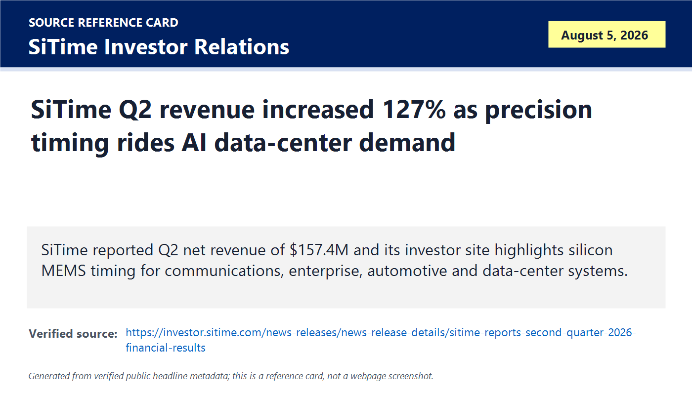
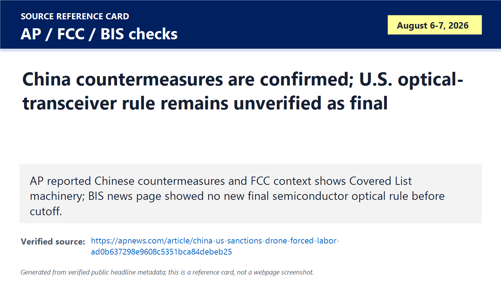
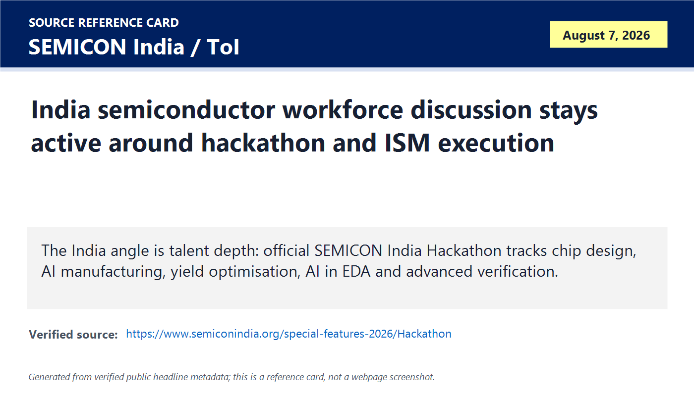

# Daily Semiconductor Current Affairs

Date: 2026-08-07

Research window: Friday update through approximately 15:10 IST on August 7, 2026. Most market-moving company releases landed after the August 6 India cutoff, so this is a last-24-to-48-hour update. The main pattern is that the AI semiconductor cycle is no longer only a GPU/HBM story: the verified evidence now shows demand in industry-wide sales, equipment subsystems, electronics and packaging, optical transceivers, SSD controllers, CPO, precision timing, and India talent programs.

## Quick Index

| Date | Major Topic | Source Groups | Why To Read |
|---|---|---|---|
| 2026-08-07 | SIA says Q2 semiconductor sales surged 35.1% from Q1 | SIA, WSTS context | Gives the macro baseline: the cycle is very strong, but it is also running at a speed that demands caution about sustainability. |
| 2026-08-07 | MKS Q2 shows equipment, process, electronics and packaging demand | MKS Investor Relations | Shows AI capex flowing into tool subsystems, process inputs, power/laser/vacuum/control layers, and advanced packaging infrastructure. |
| 2026-08-07 | Applied Optoelectronics Q2 verifies 800G optical demand | AOI Investor Relations, AP/FCC/BIS policy checks | Connects AI clusters to optical transceiver capacity and the U.S.-China component-security debate. |
| 2026-08-07 | Silicon Motion MonTitan RDK deepens the AI storage hierarchy | Silicon Motion Investor Relations | Explains KV-cache offload, SSD QoS, tail latency, and why NAND controllers matter for inference. |
| 2026-08-07 | Himax and SiTime show less visible AI hardware dependencies | Himax, SiTime Investor Relations | Covers CPO engineering ramps, automotive display ICs, smart glasses, MEMS timing, and cluster synchronization. |
| 2026-08-07 | Policy status remains mixed: China action confirmed; U.S. optical rule not final | AP, FCC, BIS | Separates confirmed countermeasures from reported draft restrictions. |
| 2026-08-07 | Foundry follow-up remains pending until TSMC July sales on August 10 | TSMC Investor Relations | Keeps the foundry revenue watch honest: no new July monthly sales release exists yet. |
| 2026-08-07 | India angle: workforce depth, hackathon tracks, and no new official production milestone today | SEMICON India, ToI workforce discussion | Useful for VLSI career planning, but not proof of new manufacturing output. |

**Page navigation:** [Sources](#source-map) · [Concept review](#concept-review) · [Follow-up](#what-to-watch-next) · [Technical terms](#technical-terms-used-today) · [Master glossary](../knowledge-base/glossary.md)

## Technical Terms / Deep Definitions

Term: Three-month moving average
Definition: A three-month moving average is a statistical smoothing method that reports the average of the current month and the previous two months instead of one noisy month alone. It solves the market-data problem that semiconductor shipments can jump around because of quarter-end purchasing, inventory corrections, holidays, and customer timing. In today's SIA release, it matters because monthly semiconductor sales are compiled by WSTS and reported as a three-month moving average, so June 2026 is a smoothed demand signal rather than a single raw shipment month. Example: a one-month spike can look dramatic; a three-month moving average asks whether the direction is sustained. Source: https://www.semiconductors.org/global-semiconductor-sales-increase-35-1-from-q1-2026-to-q2-2026/

Term: WSTS
Definition: World Semiconductor Trade Statistics is an independent industry statistics organization that collects and reports semiconductor market data from participating companies. It solves the trust problem in global chip sales data by using a common reporting framework rather than relying only on analyst estimates or company anecdotes. In today's SIA item, WSTS matters because SIA says its monthly sales data are compiled by WSTS. Comparison: SIA publishes the public release; WSTS is the statistical source behind the monthly shipment series. Source: https://www.wsts.org/

Term: Wafer fabrication equipment
Definition: Wafer fabrication equipment, often shortened to WFE, is the category of tools used to manufacture integrated circuits on wafers, including deposition, etch, lithography support, cleaning, ion implantation, inspection, metrology, process control, and related subsystems. It solves the physical manufacturing problem of repeatedly building, patterning, removing, measuring, and controlling ultra-thin films at nanometer scale. In today's MKS result, WFE matters because equipment and subsystem demand is a leading indicator for future wafer capacity, NAND upgrades, advanced packaging, and AI-linked process complexity. Example: a GPU shipment in 2027 may depend on tool orders and subsystem capacity placed much earlier. Source: https://www.semi.org/en/market-data

Term: Electronics and packaging
Definition: Electronics and packaging is the value-chain area that supports printed circuit boards, substrates, interconnect, advanced package assembly, surface preparation, plating, chemistry, inspection, and reliability work after or around wafer fabrication. It solves the system-integration problem that a die must be electrically connected, protected, cooled, powered, and tested before it can become a usable product. In today's MKS result, electronics and packaging matters because MKS reported strong revenue in that segment while AI systems increasingly need advanced packaging and high-density boards. Comparison: wafer fabrication builds the transistor layers; packaging and electronics make the chip usable in a board, module, server, or rack. Source: https://www.semi.org/en/resources/semiconductor101

Term: 800G optical transceiver
Definition: An 800G optical transceiver is a data-center optical module that can transmit and receive roughly 800 gigabits per second by converting electrical signals from switches or accelerators into optical signals for fiber and back again. It solves the AI networking problem that copper links lose too much signal and consume too much power over the distances needed inside large clusters. In today's Applied Optoelectronics result, 800G matters because the company said those products more than doubled sequentially and expects demand to exceed production capacity through mid-2027. Comparison: a 100G or 400G link may be enough for older networks; AI clusters push toward 800G and 1.6T links to keep accelerators fed. Source: https://investors.ao-inc.com/news-releases/news-release-details/applied-optoelectronics-reports-second-quarter-2026-results

Term: 1.6T optical transceiver
Definition: A 1.6T optical transceiver is a next-generation optical module class designed around roughly 1.6 terabits per second of aggregate throughput. It solves the scaling problem where AI clusters need more bandwidth per port so fewer ports, cables, switch stages, and watts are needed for the same data movement. In today's AOI result, 1.6T matters because the company discussed customer engagement and production-capacity plans for 800G and 1.6 Tb products. Example: doubling link speed can reduce network complexity if reliability, power, thermal behavior, and cost are controlled. Source: https://investors.ao-inc.com/news-releases/news-release-details/applied-optoelectronics-reports-second-quarter-2026-results

Term: Co-packaged optics
Definition: Co-packaged optics is an architecture that places optical engines very close to, or in the same package environment as, a switch or compute ASIC instead of using only pluggable optical modules at the front panel. It solves the electrical-loss and power problem that appears when very high-speed signals must travel across long board traces from a chip to a pluggable module. In today's Himax result, CPO matters because the company said its CPO products entered engineering production ramps and expects 2027 shipments to exceed 2026. Comparison: pluggable optics are easier to service; CPO can reduce electrical distance and power but makes packaging, cooling, test, and field replacement harder. Source: https://www.oiforum.com/technical-work/hot-topics/co-packaging/

Term: Quality of service
Definition: Quality of service, or QoS, is the ability of a system to control performance characteristics such as latency, throughput, fairness, priority, and predictability under real workloads. It solves the multi-tenant infrastructure problem where one workload can otherwise create long delays or unpredictable service for another workload. In today's Silicon Motion item, QoS matters because the MonTitan RDK is positioned for predictable SSD behavior in agentic AI and KV-cache offload workloads. Example: average latency can look fine while rare tail-latency spikes still stall a GPU; QoS tries to control both. Source: https://nvmexpress.org/specifications/

Term: KV-cache offload
Definition: KV-cache offload is the movement of transformer attention key-value cache data out of the fastest accelerator memory into a larger but slower memory or storage tier when the cache becomes too large or expensive to keep entirely in HBM. It solves the long-context and high-concurrency inference problem where serving many users or very long prompts can consume huge memory capacity. In today's Silicon Motion item, KV-cache offload matters because enterprise SSD controllers are being marketed as part of the AI inference memory hierarchy, not just as ordinary storage. Comparison: HBM is closest and fastest; SSD-backed offload is slower but can expand effective context capacity if latency is controlled. Source: https://developer.nvidia.com/blog/mastering-llm-techniques-inference-optimization/

Term: Tail latency
Definition: Tail latency is the slowest slice of response times, often measured at the 95th, 99th, or 99.9th percentile rather than the average. It solves the performance-analysis problem that averages hide rare delays that can stall distributed systems and waste accelerator time. In today's Silicon Motion and AOI items, tail latency matters because AI inference, optical networks, and SSD-backed cache paths all need predictable worst-case behavior, not only high peak bandwidth. Example: a storage device with low average latency but bad 99th-percentile latency can make an AI service feel slow or waste expensive GPUs waiting for data. Source: https://queue.acm.org/detail.cfm?id=2800693

Term: MEMS timing
Definition: MEMS timing uses micro-electromechanical resonators and clock circuits made with semiconductor manufacturing methods to generate stable timing signals. It solves the synchronization problem in electronics where processors, radios, networks, sensors, storage, and distributed systems need accurate clocks to exchange data reliably. In today's SiTime item, MEMS timing matters because AI clusters need tighter time synchronization to improve utilization and reduce wait cycles across many accelerators and network devices. Comparison: quartz timing is older and widely used; MEMS timing can offer semiconductor-style integration, ruggedness, programmability, and supply-chain advantages. Source: https://investor.sitime.com/

Term: Super-TCXO
Definition: A Super-TCXO is a high-performance temperature-compensated crystal oscillator class designed to hold frequency very accurately across temperature changes and system stress. It solves the clock-stability problem where temperature drift can degrade synchronization, radio performance, network timing, or distributed compute coordination. In today's SiTime context, Super-TCXO matters because precision timing is being linked to AI data-center GPU utilization and sub-nanosecond synchronization targets. Comparison: an ordinary oscillator provides a clock; a TCXO corrects temperature-related drift; a high-end Super-TCXO targets much tighter stability. Source: https://investor.sitime.com/news-releases/news-release-details/sitime-boosts-gpu-utilization-ai-data-centers-elite-2-super-tcxo

Term: Guidance
Definition: Guidance is management's forward-looking estimate of future revenue, margin, earnings, or business conditions. It solves the investor-communication problem of setting a measurable expectation for the next quarter or year, but it is not a guaranteed result. In today's MKS, AOI, Himax, and storage follow-ups, guidance matters because markets often react more to the next-quarter outlook than to the quarter just reported. Example: a company can beat Q2 results but sell off if Q3 guidance is below investor expectations. Source: https://www.sec.gov/oiea/investor-alerts-and-bulletins/ib_analystreports

Term: Gross margin
Definition: Gross margin is revenue minus cost of goods sold, divided by revenue, and it measures how much sales value remains after direct production costs. It solves the profitability-quality problem by showing whether a company has pricing power, manufacturing efficiency, favorable mix, or cost pressure before operating expenses. In today's MKS, AOI, Himax, and SiTime items, gross margin matters because AI-linked demand is valuable only if suppliers can convert it into profitable output. Comparison: revenue tells how much was sold; gross margin tells how profitable the product layer was before R&D, sales, and corporate costs. Source: https://www.investor.gov/introduction-investing/investing-basics/glossary/gross-margin

Term: Covered List
Definition: The FCC Covered List is a U.S. communications-security list of equipment and services determined to pose an unacceptable risk to national security or the security and safety of U.S. persons. It solves the policy-enforcement problem of blocking authorization or use of risky communications equipment through a formal list rather than ad hoc case-by-case concern. In today's optical-policy update, the Covered List matters because recent FCC actions and reported optical-transceiver proposals use this machinery or related equipment-authorization logic. Example: a reported draft restriction is not final law until the relevant agency text is issued, but the Covered List shows the mechanism that could be used. Source: https://docs.fcc.gov/public/attachments/FCC-26-50A1.pdf

Term: Equipment authorization
Definition: Equipment authorization is the FCC process that permits radio-frequency or communications devices to be marketed, imported, or sold in the United States after meeting applicable rules. It solves the market-access problem by making compliance a gate before equipment reaches customers. In today's policy item, equipment authorization matters because restricting authorization for a device class can function like an import and market barrier even when the target is a component category rather than a finished server. Comparison: an export control limits outbound technology; equipment authorization limits access to the U.S. device market. Source: https://www.fcc.gov/oet/ea/rfdevice

Term: Monthly sales release
Definition: A monthly sales release is a recurring company disclosure that reports revenue for a specific month before full quarterly results are available. It solves the timeliness problem for investors and supply-chain researchers who want earlier evidence of demand, utilization, pricing, and customer pull. In today's foundry follow-up, monthly sales release matters because TSMC's July 2026 sales are scheduled for August 10, so there is no verified July foundry revenue update yet. Example: TSMC monthly sales can indicate foundry momentum before detailed quarterly margin and node-mix data arrive. Source: https://investor.tsmc.com/english/financial-calendar

Term: India Semiconductor Mission
Definition: India Semiconductor Mission is India's government program for building domestic semiconductor design, manufacturing, packaging, display, materials, equipment, and talent capability. It solves the national supply-chain problem that India historically had strong chip-design talent but limited domestic front-end and back-end manufacturing depth. In today's India item, ISM matters because workforce articles and SEMICON India programs must be judged against actual ISM execution milestones such as approved projects, tools, output, qualification, and customers. Comparison: a hackathon builds talent; ISM project execution must eventually prove commercial manufacturing and validated chips. Source: https://www.ism.gov.in/

## Source Images

## Source Map

| Item | Source | Date | Link | Use In This Note |
|---|---|---|---|---|
| Global semiconductor sales | Semiconductor Industry Association | Aug. 6, 2026 | https://www.semiconductors.org/global-semiconductor-sales-increase-35-1-from-q1-2026-to-q2-2026/ | Primary market-wide sales evidence. |
| MKS Q2 | MKS Investor Relations | Aug. 5, 2026 | https://investor.mks.com/news-releases/news-release-details/mks-inc-reports-second-quarter-2026-financial-results | Primary equipment/subsystems, electronics and packaging evidence. |
| Applied Optoelectronics Q2 | AOI Investor Relations | Aug. 6, 2026 | https://investors.ao-inc.com/news-releases/news-release-details/applied-optoelectronics-reports-second-quarter-2026-results | Primary optical-transceiver and AI datacenter revenue evidence. |
| Himax Q2 | Himax / GlobeNewswire | Aug. 6, 2026 | https://www.globenewswire.com/news-release/2026/08/06/3339987/8267/en/himax-technologies-inc-reports-second-quarter-2026-financial-results-provides-third-quarter-2026-guidance.html | Primary display IC, automotive, smart-glasses and CPO update. |
| Silicon Motion MonTitan | Silicon Motion Investor Relations | Aug. 5, 2026 | https://ir.siliconmotion.com/news-releases/news-release-details/silicon-motion-unveils-montitantm-ssd-reference-design-kit-ai | Primary AI SSD controller and KV-cache offload evidence. |
| SiTime Q2 and timing context | SiTime Investor Relations | Aug. 5, 2026 | https://investor.sitime.com/news-releases/news-release-details/sitime-reports-second-quarter-2026-financial-results | Primary Q2 revenue source and timing-silicon context. |
| SiTime Elite 2 context | SiTime Investor Relations | May 4, 2026 | https://investor.sitime.com/news-releases/news-release-details/sitime-boosts-gpu-utilization-ai-data-centers-elite-2-super-tcxo | Technical context for timing and AI cluster synchronization. |
| China countermeasures | AP | Aug. 6, 2026 | https://apnews.com/article/china-us-sanctions-drone-forced-labor-ad0b637298e9608c5351bca84debeb25 | Reputable reporting on confirmed Chinese measures and U.S. context. |
| FCC Covered List machinery | FCC PDF | 2026 | https://docs.fcc.gov/public/attachments/FCC-26-50A1.pdf | Official policy mechanism context; not proof of a final optical-transceiver ban. |
| BIS status check | BIS News and Updates | Checked Aug. 7, 2026 | https://www.bis.gov/news-updates | Verification that no new final BIS optical-transceiver rule was found before cutoff. |
| TSMC foundry checkpoint | TSMC financial calendar | Checked Aug. 7, 2026 | https://investor.tsmc.com/english/financial-calendar | Confirms July 2026 monthly sales is scheduled for Aug. 10. |
| India talent and hackathon | SEMICON India | Checked Aug. 7, 2026 | https://www.semiconindia.org/special-features-2026/Hackathon | Official India VLSI/chip design/yield/verification talent signal. |
| India workforce discussion | Times of India | Aug. 7, 2026 | https://timesofindia.indiatimes.com/toi-blogs/nation-notes/future-ready-workforce-for-indias-semiconductor-industry/articleshow/133026993.cms | Same-day commentary signal; treated as opinion, not project-level proof. |

## Deep Briefing

### 1. SIA confirms the semiconductor cycle is extremely strong

**Confirmed facts:** SIA said global semiconductor sales reached USD 403.3 billion in Q2 2026, up 35.1% from Q1. June 2026 sales were USD 134.5 billion, up 123.6% year-to-year and 9.7% month-to-month. SIA also said June year-to-year sales increased across the Americas, Asia Pacific/All Other, China, Europe, and Japan.

**Analysis:** This is a huge macro signal. It supports what the company earnings have been showing: AI demand is pulling logic, memory, networking, storage, power, equipment, and packaging. But the growth rate is so large that you should read it with cycle discipline. Semiconductor markets can overshoot because buyers build inventory, capacity arrives late, and pricing expands faster than unit demand during shortages. The right question is not "is demand strong?" It clearly is. The better question is "which layers are structurally capacity-constrained, and which are temporarily benefiting from shortage pricing?"

**Why it matters:** A broad SIA acceleration reduces the chance that individual results from AMD, Sandisk, WD, Astera, MKS, or AOI are isolated company stories. The cycle is broad. That matters for VLSI careers because hiring, internships, EDA usage, tapeouts, verification budgets, packaging demand, and equipment orders usually improve when customers believe end-market demand is durable.

**India angle:** India benefits from a strong global cycle only if projects move from approval to tools, qualification, customers, and trained operators. A booming global market raises the prize, but it also raises competition for tools, substrates, gases, memory, experienced process engineers, and packaging know-how.

**VLSI/career relevance:** Use this item as the macro introduction in interviews. If someone asks "why semiconductors now?", do not answer only "AI chips." Explain that AI increases compute, memory, storage, networking, power, advanced packaging, EDA, verification, and manufacturing-control demand together.

### 2. MKS shows AI capex flowing into the manufacturing support stack

**Confirmed facts:** MKS reported Q2 2026 revenue of USD 1.248 billion, above guidance. Semiconductor revenue was USD 554 million, electronics and packaging revenue was USD 381 million, and specialty industrial revenue was USD 313 million. The company guided Q3 revenue to USD 1.350 billion plus or minus USD 40 million and said the guidance considers the business environment including U.S. import tariffs and retaliatory actions up to the release date.

**Analysis:** MKS is useful because it sits below the headline chipmakers. Its result is not "Nvidia sold more GPUs." It is evidence that the manufacturing base needs more enabling technologies. Semiconductor tools need vacuum, power, photonics, motion, measurement, laser, process-control, and chemistry-related subsystems. Electronics and packaging demand also matters because AI servers need high-density boards, substrates, interconnect, packaging flows, and reliability work. This is where capital expenditure becomes physical manufacturing capability.

**Why it matters:** AI infrastructure cannot scale if the tool and packaging support layers bottleneck. The MKS result supports the "full stack capex" view: fabs, packaging lines, substrate/board infrastructure, materials, process control, and equipment subsystems all participate.

**India angle:** For India, this is a warning and opportunity. Building fabs or OSATs is not just land plus a headline tool. It requires qualified suppliers for gases, chemicals, power systems, vacuum, metrology support, spares, service, and contamination control. India Semiconductor Mission 2.0 goals around materials and equipment are strategically correct, but the hard part is certification and reliability.

**VLSI/career relevance:** If you study physical design or verification only, you may miss how manufacturing limits shape design choices. DFM, package-aware design, thermal limits, signal integrity, and yield learning all depend on the manufacturing support stack.

### 3. Applied Optoelectronics gives hard evidence for AI optical links

**Confirmed facts:** Applied Optoelectronics reported Q2 revenue of USD 191.9 million, compared with USD 103.0 million a year earlier and USD 151.1 million in Q1. Datacenter revenue was USD 107.7 million, compared with USD 44.8 million a year earlier. The company said 800G products more than doubled sequentially, demand for 800G and 1.6 Tb products remains robust, and it expects production capability of around 650,000 800G and 1.6 Tb products per month by year-end. Q3 revenue guidance is USD 255 million to USD 290 million.

**Analysis:** This closes part of yesterday's optical-networking follow-up. We still do not have a final U.S. rule on Chinese optical transceivers, but we do have an official company result showing that AI datacenter optical demand is real and measurable. AOI is still loss-making on a GAAP basis, so the story is not clean profitability yet. The important technical point is that optical links are becoming a capacity constraint in the AI cluster, not a background commodity.

**Why it matters:** GPU clusters are limited by data movement. If accelerators cannot exchange gradients, activations, parameters, cache data, or inference requests quickly enough, expensive compute sits idle. Optical transceivers are therefore a semiconductor supply-chain layer tied directly to AI cluster throughput.

**India angle:** India has electronics and networking companies that can benefit from optical-policy shifts, but building competitive optical modules requires photonics know-how, lasers, DSPs, packaging, test, reliability, and supply chain access. This is a higher bar than generic electronics assembly.

**VLSI/career relevance:** Revise SerDes, PAM4 signaling, clock-data recovery, retimers, DSP equalization, thermal design, and link budgets. Optical modules combine analog/mixed-signal circuits, digital signal processing, photonics, packaging, firmware, and high-volume test.

### 4. Silicon Motion pushes SSD controllers into the AI inference memory hierarchy

**Confirmed facts:** Silicon Motion unveiled the MonTitan SSD Reference Design Kit for AI infrastructure at FMS 2026. The company says the platform uses PerformaShape technology and targets enterprise SSDs serving as a persistent memory layer for KV-cache offload and agentic AI workloads, with predictable QoS, sustained performance, and optimized endurance.

**Analysis:** This is important because it shows SSD controllers trying to move from "storage peripheral" to "inference architecture component." If models, context windows, agents, tools, embeddings, and retrieval stores grow faster than HBM capacity, systems need a tier between memory and bulk storage. The hard technical question is tail latency. A controller that looks fast on average can still be bad for AI if occasional stalls block a GPU batch or make an agent workflow unpredictable.

**Why it matters:** Memory hierarchy is becoming a product battleground. HBM is still the premium bandwidth layer, but CXL, HBF, SSD cache tiers, and storage controllers are competing to reduce the cost of serving large models. The controller matters because it schedules NAND access, manages error correction, wear, garbage collection, power, and QoS.

**India angle:** This is relevant for Indian VLSI students because SSD controller work spans RTL, firmware, ECC, PCIe/NVMe protocol, verification, DFT, embedded processors, security, and performance modeling. It is a more accessible career path than trying to work only on frontier GPUs.

**VLSI/career relevance:** For interview preparation, be ready to explain why average bandwidth is not enough. AI storage needs predictable service under mixed reads/writes, multiple tenants, garbage collection, thermal throttling, and endurance limits.

### 5. Himax and SiTime show the hidden dependencies around AI systems

**Confirmed facts:** Himax reported Q2 revenue of USD 227.4 million, up 14.2% sequentially, gross margin of 33.1%, and after-tax profit of USD 19.9 million. It said automotive IC demand helped the beat, smart-glasses engagement remains active, and CPO products entered engineering production ramps in Q3 with 2027 shipments expected to significantly exceed 2026. SiTime reported Q2 net revenue of USD 157.4 million, up 127% year-to-year, and its investor materials position the company around silicon MEMS timing for communications, enterprise, automotive, industrial, aerospace, mobile, IoT, and consumer systems.

**Analysis:** These are not the first names people mention in AI hardware, but they show why the ecosystem is broad. Himax is tied to display drivers, automotive interfaces, smart-glasses sensing/display, and CPO support. SiTime is tied to timing, synchronization, and clock quality. In AI clusters, tiny timing errors and weak synchronization can create wait cycles, retransmits, link instability, or underutilized expensive accelerators.

**Why it matters:** The semiconductor value chain is full of "small" chips that become critical when systems scale. An AI rack needs timing devices, power devices, optical modules, sensors, display/control ICs, retimers, SSD controllers, management controllers, and firmware. The bottleneck can move to a component that looks minor on a block diagram.

**India angle:** India can build talent around these mixed-signal, embedded, verification, and system-integration layers. Not every VLSI career must target GPU architecture. Timing, interfaces, display, sensor, power, firmware, and test are serious semiconductor roles.

**VLSI/career relevance:** Revise clocking, jitter, ppm stability, temperature compensation, CDC, reset synchronization, PLL concepts, and system-level timing. For CPO, revise package parasitics, thermal coupling, optical engines, switch ASIC interfaces, reliability, and test.

### 6. Policy status: confirmed China countermeasures, no final U.S. optical-transceiver rule found

**Confirmed facts:** AP reported China announced countermeasures against the United States, including controls on drone exports to the U.S. and bans on dealings with six U.S. entities. AP also reported China banned Compliance Testing LLC from business in China because of work with the FCC. FCC materials show the Covered List and equipment-authorization mechanism that can restrict covered communications equipment. BIS News and Updates did not show a new final semiconductor optical-transceiver rule before this note's cutoff.

**Analysis:** The policy status is precise: China action is confirmed; the U.S. optical-transceiver ban remains reported draft risk in this notebook until an FCC, Federal Register, or BIS final text appears. This distinction matters because markets may trade on reports before law exists. For study, treat "reported drafting" as a risk signal, not as a binding compliance requirement.

**Why it matters:** AI networking depends on optical modules. If U.S. policy restricts Chinese modules, supply may tighten, prices may move, and Western suppliers may gain demand. But if the final rule is narrower, delayed, or includes exemptions, the market impact changes.

**India angle:** Indian optical, telecom, EMS, and data-center suppliers may see opportunity if buyers diversify away from China. But the constraint is not just assembly. The hard parts include lasers, optical engines, DSPs, high-speed testing, thermal design, firmware, reliability, and customer qualification.

**VLSI/career relevance:** Export controls are now part of semiconductor engineering literacy. A design engineer may need to know where IP, EDA tools, foundry access, packaging, test, and customer shipment restrictions apply.

### 7. Foundry follow-up stays pending until August 10

**Confirmed facts:** TSMC's financial calendar lists "TSMC Monthly Sales - July 2026" for August 10, 2026 at 13:30 Asia/Taipei. No July 2026 monthly sales release was available on August 7 before this note's cutoff.

**Analysis:** This closes nothing yet. Foundry monthly revenue is still one of the cleanest near-term checks on AI hardware demand because TSMC sits behind many leading accelerators, CPUs, networking chips, and advanced packaging flows. But writing a number before the release would be speculation.

**Why it matters:** A strong TSMC July number would support the AI demand story at the foundry layer. A weaker number would force us to ask whether demand is shifting, capacity is constrained elsewhere, customers pulled forward, or product mix changed.

**India angle:** India foundry ambitions should be benchmarked against disciplined monthly and quarterly operating evidence. Announcements matter less than revenue, wafer starts, utilization, yield, customer mix, and qualified output.

**VLSI/career relevance:** Learn to separate foundry revenue from chipmaker revenue. AMD, Nvidia, Apple, Qualcomm, Broadcom, and MediaTek can all use foundries, but revenue recognition and cycle timing differ across the value chain.

### 8. India update: useful workforce signal, no new official production milestone today

**Confirmed facts:** SEMICON India Hackathon official material lists challenge areas in chip design, AI-enabled semiconductor manufacturing, yield optimisation, AI in EDA, and advanced verification. The Times of India published a same-day workforce-oriented discussion on India's semiconductor industry. No new official India project-level production, tool-install, qualification, or shipment milestone was verified today before cutoff.

**Analysis:** This is a talent update rather than a production update. That matters. India needs both: trained VLSI engineers, process technicians, packaging/test engineers, reliability engineers, equipment service teams, and manufacturing data people; but training does not automatically equal qualified output. The hackathon is still valuable because it maps student work to actual industry problems instead of generic software demos.

**Why it matters:** For you, this is directly actionable. The official challenge areas point to skills worth building: RTL design, verification, manufacturing analytics, yield learning, EDA automation, scripting, statistics, and hardware-aware AI.

**India angle:** Keep ASIP Visakhapatnam, CG Semi, Tata/PSMC Dholera, Micron, Kaynes, HCL-Foxconn, and SEMICON India 2026 on the follow-up list. Close an item only when official project evidence lands.

**VLSI/career relevance:** If you want to stand out, do not just say "AI in semiconductors." Build one solid project: a verification automation flow, yield-analysis notebook, UVM-style testbench, fault model, placement/timing data analysis, or SSD/NVMe protocol simulation.

## Follow-Up Ledger

| Prior item | Status on 2026-08-07 | Evidence |
|---|---|---|
| August 6 Sandisk/WD storage earnings | Still open: no new primary filing or guidance update beyond yesterday's official releases; watch pricing, NBMs, HDD cloud demand, and first-week market reaction | Sandisk IR, WD IR, market reaction sources from prior note |
| August 6 Astera Scorpio ramp | Still pending: no new production/customer metric today; Q3 ramp remains the next proof point | Astera IR from Aug. 4 |
| August 6 HBF/OCP standard | Still pending: no new OCP public spec detail, sample latency, endurance, software placement, or customer adoption evidence verified today | SK hynix/Sandisk/OCP context |
| August 5/6 optical-transceiver policy risk | Updated: AOI Q2 confirms real optical demand; China countermeasures confirmed; no final U.S. optical-transceiver rule found before cutoff | AOI IR, AP, FCC, BIS |
| August 5 SEMI AI manufacturing workshop | Still pending: workshop occurred, but no public customer case-study metrics found today | SEMI |
| Foundry monthly revenue watch | Still pending: TSMC July 2026 monthly sales scheduled for August 10 | TSMC financial calendar |
| India ecosystem watch | Updated but not closed: workforce/hackathon evidence remains useful, but no new production milestone today | SEMICON India, ToI |

## Concept Review

| Concept | Deep Definition | Why It Matters In This News | Revise Next | Source |
|---|---|---|---|---|
| Market cycle discipline | Semiconductor markets expand through unit growth, price growth, mix improvement, and inventory behavior; the same forces can reverse when customers over-order or capacity arrives. | SIA growth is enormous, so it supports demand but also requires caution. | WSTS data, inventory cycles, memory pricing, utilization. | https://www.semiconductors.org/global-semiconductor-sales-increase-35-1-from-q1-2026-to-q2-2026/ |
| Manufacturing support stack | Advanced chips require tools, subsystems, gases, chemicals, power, vacuum, metrology, controls, packaging, boards, and test infrastructure. | MKS shows demand below the visible chipmaker layer. | WFE, process control, packaging, contamination control. | https://investor.mks.com/news-releases/news-release-details/mks-inc-reports-second-quarter-2026-financial-results |
| Optical AI networking | AI clusters depend on high-bandwidth, low-latency links between accelerators, switches, storage, and servers. | AOI's 800G and 1.6T discussion confirms optics are becoming a measurable growth layer. | SerDes, PAM4, CDR, optical modules, CPO. | https://investors.ao-inc.com/news-releases/news-release-details/applied-optoelectronics-reports-second-quarter-2026-results |
| AI storage hierarchy | AI systems need HBM, DRAM, CXL/HBF-like tiers, SSDs, and HDDs because each layer trades latency, bandwidth, capacity, power, endurance, and cost differently. | Silicon Motion's RDK is another signal that SSD controllers are being designed for inference memory behavior. | HBM, CXL, SSD controllers, NVMe, KV cache. | https://ir.siliconmotion.com/news-releases/news-release-details/silicon-motion-unveils-montitantm-ssd-reference-design-kit-ai |
| Policy-status discipline | Treat official rules, agency lists, and company filings differently from reports, drafts, letters, market rumors, and opinion columns. | China countermeasure is confirmed; U.S. optical restriction remains unfinalized in this run. | BIS, FCC, Covered List, Federal Register. | https://www.bis.gov/news-updates |

## Simple Explanation

Today's briefing says the AI chip boom is spreading outward. SIA shows the whole market is growing fast. MKS shows tool and packaging support demand. AOI shows optical transceiver demand. Silicon Motion shows SSD controllers being pulled into AI inference. Himax and SiTime show CPO, display/sensing, and timing are also part of the system. Policy risk remains active, but the U.S. optical-transceiver story is still not final law. India's strongest exact update today is talent and workforce depth, not a new production milestone.

## Interview Questions

1. Why does SIA use a three-month moving average for monthly semiconductor sales?
2. How can AI demand benefit an equipment subsystem supplier like MKS?
3. Why are 800G and 1.6T optical transceivers important for AI clusters?
4. What is CPO, and why is it harder than ordinary pluggable optics?
5. Explain KV-cache offload and why SSD QoS matters for inference.
6. Why can timing devices affect GPU utilization in distributed AI systems?
7. How do you distinguish a confirmed policy action from a reported draft rule?
8. What India semiconductor evidence would count as real production proof instead of ecosystem activity?

## What To Watch Next

1. TSMC July 2026 monthly sales on August 10.
2. Any final FCC, Federal Register, or BIS text on Chinese optical transceivers or data-center components.
3. AOI execution toward 650,000 monthly 800G/1.6T product capacity by year-end.
4. MKS semiconductor and electronics/packaging demand versus Q3 guidance.
5. Silicon Motion MonTitan customer adoption, latency data, endurance, and production SSD partners.
6. Himax CPO engineering ramp movement from engineering production to meaningful shipments in 2027.
7. SiTime timing adoption evidence in AI clusters, especially customer names or platform design wins.
8. SEMICON India Hackathon problem statements, tools, mentors, finalists, and whether outputs map to real EDA/manufacturing problems.

## Technical Terms Used Today

[Back to quick index](#quick-index) · [Open the master A-Z glossary](../knowledge-base/glossary.md)

**Term index:** [1.6T optical transceiver](#daily-term-1-6t-optical-transceiver) · [800G optical transceiver](#daily-term-800g-optical-transceiver) · [Co-packaged optics](#daily-term-co-packaged-optics) · [Covered List](#daily-term-covered-list) · [Electronics and packaging](#daily-term-electronics-and-packaging) · [Equipment authorization](#daily-term-equipment-authorization) · [Gross margin](#daily-term-gross-margin) · [Guidance](#daily-term-guidance) · [India Semiconductor Mission](#daily-term-india-semiconductor-mission) · [KV-cache offload](#daily-term-kv-cache-offload) · [MEMS timing](#daily-term-mems-timing) · [Monthly sales release](#daily-term-monthly-sales-release) · [Quality of service](#daily-term-quality-of-service) · [Super-TCXO](#daily-term-super-tcxo) · [Tail latency](#daily-term-tail-latency) · [Three-month moving average](#daily-term-three-month-moving-average) · [Wafer fabrication equipment](#daily-term-wafer-fabrication-equipment) · [WSTS](#daily-term-wsts)

| Term | Meaning |
|---|---|
| [**1.6T optical transceiver**](../knowledge-base/glossary.md#term-1-6t-optical-transceiver) | A 1.6T optical transceiver is a next-generation optical module class designed around roughly 1.6 terabits per second of aggregate throughput. It solves the scaling problem where AI clusters need more bandwidth per port so fewer ports, cables, switch stages, and watts are needed for the same data movement. |
| [**800G optical transceiver**](../knowledge-base/glossary.md#term-800g-optical-transceiver) | An 800G optical transceiver is a data-center optical module that can transmit and receive roughly 800 gigabits per second by converting electrical signals from switches or accelerators into optical signals for fiber and back again. It solves the AI networking problem that copper links lose too much signal and consume too much power over the distances needed inside large clusters. |
| [**Co-packaged optics**](../knowledge-base/glossary.md#term-co-packaged-optics) | Co-packaged optics is an architecture that places optical engines very close to, or in the same package environment as, a switch or compute ASIC instead of using only pluggable optical modules at the front panel. It solves the electrical-loss and power problem that appears when very high-speed signals must travel across long board traces from a chip to a pluggable module. |
| [**Covered List**](../knowledge-base/glossary.md#term-covered-list) | The FCC Covered List is a U.S. communications-security list of equipment and services determined to pose an unacceptable risk to national security or the security and safety of U.S. persons. It solves the policy-enforcement problem of blocking authorization or use of risky communications equipment through a formal list rather than ad hoc case-by-case concern. |
| [**Electronics and packaging**](../knowledge-base/glossary.md#term-electronics-and-packaging) | Electronics and packaging is the value-chain area that supports printed circuit boards, substrates, interconnect, advanced package assembly, surface preparation, plating, chemistry, inspection, and reliability work after or around wafer fabrication. It solves the system-integration problem that a die must be electrically connected, protected, cooled, powered, and tested before it can become a usable product. |
| [**Equipment authorization**](../knowledge-base/glossary.md#term-equipment-authorization) | Equipment authorization is the FCC process that permits radio-frequency or communications devices to be marketed, imported, or sold in the United States after meeting applicable rules. It solves the market-access problem by making compliance a gate before equipment reaches customers. |
| [**Gross margin**](../knowledge-base/glossary.md#term-gross-margin) | Gross margin is revenue minus cost of goods sold, divided by revenue, and it measures how much sales value remains after direct production costs. It solves the profitability-quality problem by showing whether a company has pricing power, manufacturing efficiency, favorable mix, or cost pressure before operating expenses. |
| [**Guidance**](../knowledge-base/glossary.md#term-guidance) | Guidance is management's forward-looking estimate of future revenue, margin, earnings, or business conditions. It solves the investor-communication problem of setting a measurable expectation for the next quarter or year, but it is not a guaranteed result. |
| [**India Semiconductor Mission**](../knowledge-base/glossary.md#term-india-semiconductor-mission) | India Semiconductor Mission is India's government program for building domestic semiconductor design, manufacturing, packaging, display, materials, equipment, and talent capability. It solves the national supply-chain problem that India historically had strong chip-design talent but limited domestic front-end and back-end manufacturing depth. |
| [**KV-cache offload**](../knowledge-base/glossary.md#term-kv-cache-offload) | KV-cache offload is the movement of transformer attention key-value cache data out of the fastest accelerator memory into a larger but slower memory or storage tier when the cache becomes too large or expensive to keep entirely in HBM. It solves the long-context and high-concurrency inference problem where serving many users or very long prompts can consume huge memory capacity. |
| [**MEMS timing**](../knowledge-base/glossary.md#term-mems-timing) | MEMS timing uses micro-electromechanical resonators and clock circuits made with semiconductor manufacturing methods to generate stable timing signals. It solves the synchronization problem in electronics where processors, radios, networks, sensors, storage, and distributed systems need accurate clocks to exchange data reliably. |
| [**Monthly sales release**](../knowledge-base/glossary.md#term-monthly-sales-release) | A monthly sales release is a recurring company disclosure that reports revenue for a specific month before full quarterly results are available. It solves the timeliness problem for investors and supply-chain researchers who want earlier evidence of demand, utilization, pricing, and customer pull. |
| [**Quality of service**](../knowledge-base/glossary.md#term-quality-of-service) | Quality of service, or QoS, is the ability of a system to control performance characteristics such as latency, throughput, fairness, priority, and predictability under real workloads. It solves the multi-tenant infrastructure problem where one workload can otherwise create long delays or unpredictable service for another workload. |
| [**Super-TCXO**](../knowledge-base/glossary.md#term-super-tcxo) | A Super-TCXO is a high-performance temperature-compensated crystal oscillator class designed to hold frequency very accurately across temperature changes and system stress. It solves the clock-stability problem where temperature drift can degrade synchronization, radio performance, network timing, or distributed compute coordination. |
| [**Tail latency**](../knowledge-base/glossary.md#term-tail-latency) | Tail latency is the slowest slice of response times, often measured at the 95th, 99th, or 99.9th percentile rather than the average. It solves the performance-analysis problem that averages hide rare delays that can stall distributed systems and waste accelerator time. |
| [**Three-month moving average**](../knowledge-base/glossary.md#term-three-month-moving-average) | A three-month moving average is a statistical smoothing method that reports the average of the current month and the previous two months instead of one noisy month alone. It solves the market-data problem that semiconductor shipments can jump around because of quarter-end purchasing, inventory corrections, holidays, and customer timing. |
| [**Wafer fabrication equipment**](../knowledge-base/glossary.md#term-wafer-fabrication-equipment) | Wafer fabrication equipment, often shortened to WFE, is the category of tools used to manufacture integrated circuits on wafers, including deposition, etch, lithography support, cleaning, ion implantation, inspection, metrology, process control, and related subsystems. It solves the physical manufacturing problem of repeatedly building, patterning, removing, measuring, and controlling ultra-thin films at nanometer scale. |
| [**WSTS**](../knowledge-base/glossary.md#term-wsts) | World Semiconductor Trade Statistics is an independent industry statistics organization that collects and reports semiconductor market data from participating companies. It solves the trust problem in global chip sales data by using a common reporting framework rather than relying only on analyst estimates or company anecdotes. |

This page-end index covers the specialist terms central to this day's study. The fuller explanation, news context, and source remain at first use; the master glossary combines repeated terms across all days.
