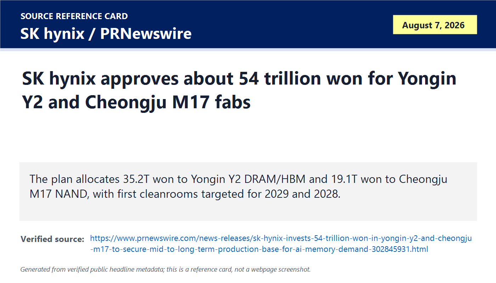
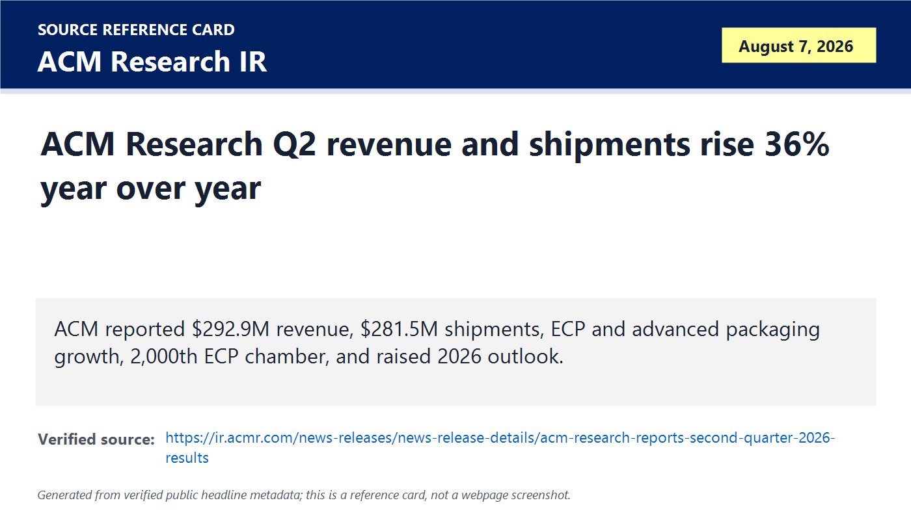
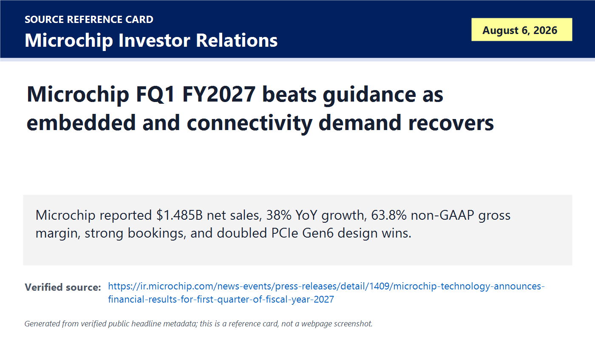
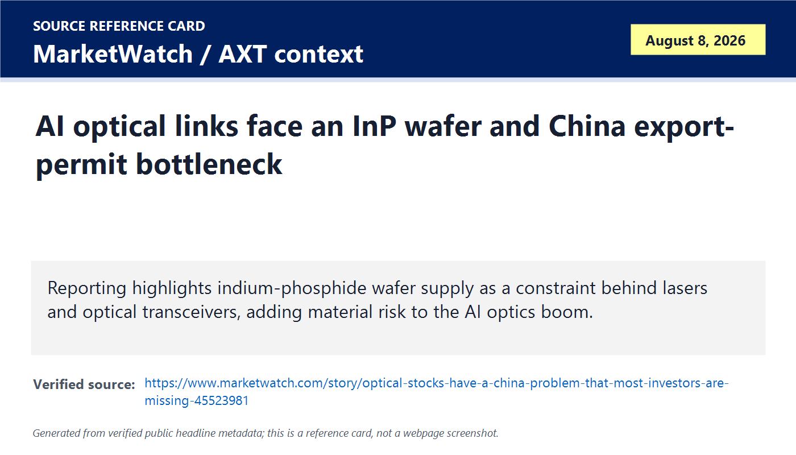
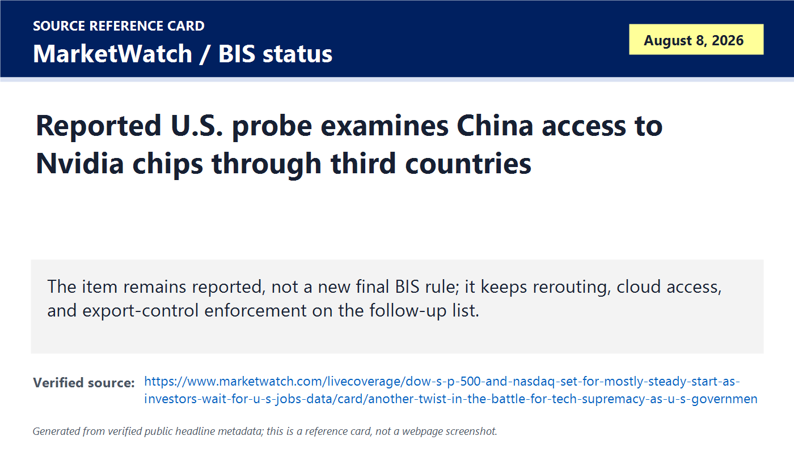
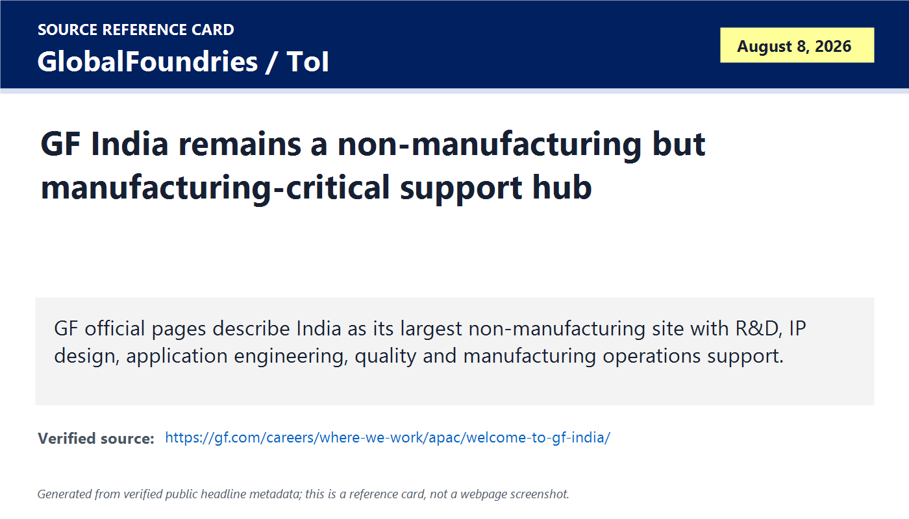
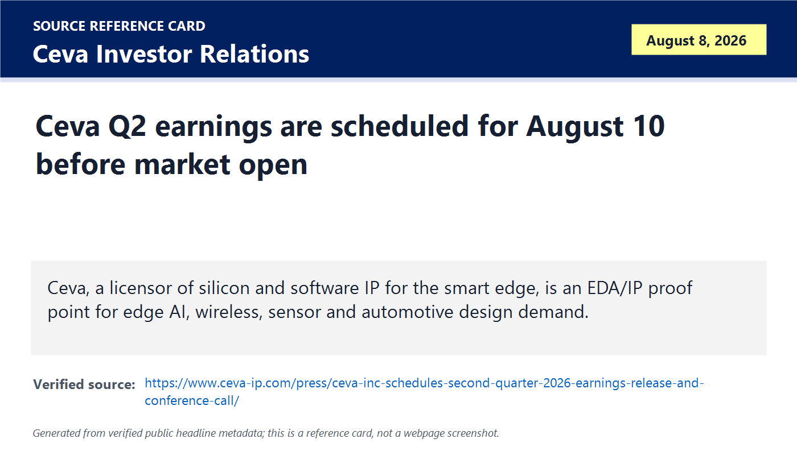
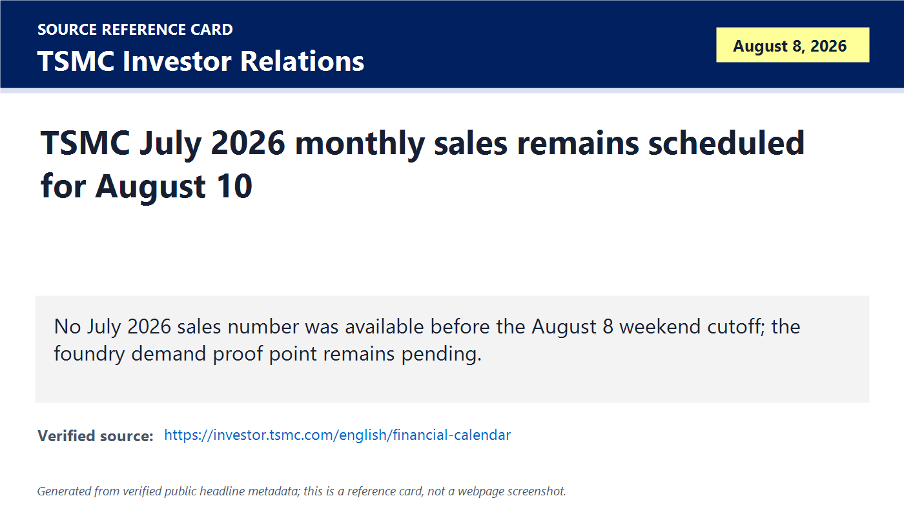

# Daily Semiconductor Current Affairs

Date: 2026-08-08

Research window: Saturday weekend catch-up through approximately 16:15 IST on August 8, 2026. Exact same-day semiconductor releases were limited, so this note uses verified August 7-8 items and the nearest 24-to-72-hour proof window. The main pattern today is capacity proof: SK hynix is committing long-cycle memory fab spending, ACM Research is showing equipment demand, Microchip is showing embedded-chip recovery, optical and Nvidia-China access stories remain policy-risk reporting rather than final rules, and August 10 becomes the next hard proof day for Ceva and TSMC.

## Quick Index

| Date | Major Topic | Source Groups | Why To Read |
|---|---|---|---|
| 2026-08-08 | SK hynix approves KRW 54.3T long-cycle memory fab investment | SK hynix / PRNewswire company release | Shows how AI memory demand is being converted into multi-year physical capacity plans. |
| 2026-08-08 | ACM Research Q2 shows process-equipment and packaging-tool strength | ACM Research Investor Relations | Links AI and advanced packaging demand to wafer cleaning, plating, furnace, and tool shipments. |
| 2026-08-08 | Microchip Q1 FY2027 confirms embedded and connectivity recovery | Microchip Investor Relations / SEC | Gives a non-GPU read-through on microcontrollers, analog, connectivity, automotive, industrial, and PCIe design wins. |
| 2026-08-08 | Optical/InP and Nvidia-China stories remain reported policy risk | MarketWatch, BIS status check | Separates market-moving reports from binding export-control or agency action. |
| 2026-08-08 | GlobalFoundries India page confirms manufacturing-critical support work | GlobalFoundries official India page | Shows India's role in R&D, IP design, characterization, quality, and manufacturing operations support, not only fab headlines. |
| 2026-08-08 | August 10 proof queue: Ceva Q2 and TSMC July monthly sales | Ceva Investor Relations, TSMC Investor Relations | Sets the next evidence checkpoints for EDA/IP and foundry demand. |

**Page navigation:** [Sources](#source-map) · [Concept review](#concept-review) · [Follow-up](#what-to-watch-next) · [Technical terms](#technical-terms-used-today) · [Master glossary](../knowledge-base/glossary.md)

## Technical Terms / Deep Definitions

Term: Fab capital expenditure
Definition: Fab capital expenditure is the long-term money a semiconductor company commits to buildings, cleanrooms, utilities, tools, automation, process infrastructure, and capacity ramps for wafer manufacturing. It solves the business and manufacturing problem that chip demand cannot be served by software or inventory alone; companies must lock in land, power, water, construction, tools, and supplier capacity years before output arrives. In today's SK hynix item, it matters because AI memory demand is being translated into KRW 54.3 trillion of new DRAM/HBM and NAND production-base spending rather than only quarterly sales commentary. Example: buying HBM in 2027 depends partly on fab and tool decisions made years earlier. Source: https://www.semi.org/en/resources/semiconductor101

Term: Cleanroom
Definition: A cleanroom is a controlled manufacturing space where airborne particles, temperature, humidity, vibration, chemical contamination, airflow, and human activity are managed so microscopic defects do not damage wafers. It solves the physical problem that modern transistor and memory structures are so small that tiny particles can kill yield or reliability. In today's SK hynix plan, cleanroom completion dates matter because a fab announcement does not become wafer output until the controlled space, utilities, tools, recipes, and qualification are ready. Comparison: a normal factory keeps machines organized; a fab cleanroom keeps the air and surfaces controlled at semiconductor defect levels. Source: https://www.semi.org/en/resources/semiconductor101

Term: DRAM
Definition: Dynamic random-access memory is volatile memory that stores each bit as charge in a tiny capacitor and must be refreshed regularly to retain data. It solves the system problem of giving processors fast working memory, but it loses data when power is removed and needs constant refresh circuitry. In today's SK hynix item, DRAM matters because HBM is built from stacked DRAM dies, so AI accelerator bandwidth depends on both advanced DRAM process capacity and packaging capacity. Example: ordinary server DRAM expands system memory capacity; HBM places DRAM stacks very close to AI accelerators for much higher bandwidth. Source: https://www.jedec.org/standards-documents/focus/semiconductor-memory/ddr5-sdram

Term: High-Bandwidth Memory (HBM)
Definition: High-Bandwidth Memory is a stacked DRAM technology that uses multiple memory dies connected through vertical interconnects and a wide interface to deliver very high bandwidth near a processor or accelerator. It solves the AI and HPC problem that compute chips can perform more operations than ordinary memory systems can feed with data. In today's SK hynix item, HBM matters because the company explicitly connects its production-base investment to expected AI memory demand. Comparison: DDR memory sits farther from the processor and uses narrower channels; HBM is stacked and packaged close to the compute die to trade cost and packaging complexity for bandwidth. Source: https://www.jedec.org/standards-documents/docs/jesd238

Term: NAND flash
Definition: NAND flash is non-volatile semiconductor memory that stores data in floating-gate or charge-trap cells and retains data without power. It solves the storage problem for SSDs, phones, servers, embedded devices, and AI data pipelines where capacity and persistence matter more than DRAM-like latency. In today's SK hynix item, NAND matters because the Cheongju M17 plan says AI storage and enterprise demand still require long-cycle flash capacity, not only HBM. Example: HBM feeds accelerator math in real time; NAND holds models, datasets, logs, checkpoints, and retrieval stores at much larger capacity. Source: https://www.jedec.org/standards-documents/focus/flash/solid-state-drives

Term: Electrochemical plating (ECP)
Definition: Electrochemical plating is a semiconductor process that deposits metal onto a wafer or package substrate by using an electric current through a chemical bath. It solves the interconnect and packaging problem of building copper lines, bumps, redistribution layers, pillars, and other conductive structures with controlled thickness and uniformity. In today's ACM Research item, ECP matters because advanced packaging, chiplet integration, and high-density interconnects need reliable metal deposition beyond ordinary front-end transistor processing. Comparison: lithography defines where a feature should exist; plating helps fill or build conductive material in those defined areas. Source: https://www.acmrcsh.com/product-services/electrochemical-plating/

Term: Advanced packaging equipment
Definition: Advanced packaging equipment is the tool set used to assemble, connect, test, and protect multiple dies, memory stacks, interposers, redistribution layers, substrates, and thermal structures in high-performance packages. It solves the scaling problem that transistor shrinking alone no longer provides enough bandwidth, area, power, and cost improvement for AI hardware. In today's ACM Research item, it matters because ECP and packaging-related tools are a visible bridge between wafer fabrication and AI accelerators with HBM or chiplets. Example: a GPU package with HBM needs package-level interconnect and assembly precision that a simple single-die package does not. Source: https://www.semi.org/en/resources/semiconductor101

Term: Wafer cleaning
Definition: Wafer cleaning removes particles, organic residues, metals, native oxides, and process chemicals from wafers between manufacturing steps. It solves the yield problem that contamination left before deposition, etch, lithography, or bonding can create defects, leakage, poor adhesion, or reliability failures. In today's ACM Research item, cleaning matters because advanced nodes, memory, and packaging create more process steps and tighter defect tolerance, increasing the value of specialized cleaning tools. Comparison: cleaning a visible surface is cosmetic; wafer cleaning controls invisible contamination that can decide whether a die passes electrical test. Source: https://www.acmrcsh.com/product-services/single-wafer-cleaning/

Term: Bookings
Definition: Bookings are customer orders or order commitments received during a period, usually before all of the related products ship or revenue is recognized. They solve the demand-visibility problem by showing whether customers are placing future orders faster or slower than current shipments. In today's Microchip result, bookings matter because management said bookings meaningfully exceeded shipments, suggesting the embedded-chip recovery is not limited to one quarter of deliveries. Example: revenue is what was recognized; bookings are an early demand signal for future revenue if orders hold. Source: https://www.sec.gov/oiea/investor-alerts-and-bulletins/ib_analystreports

Term: Backlog
Definition: Backlog is the value or volume of customer orders that have been booked but not yet fulfilled. It solves the planning problem of showing how much future work is already in the queue, although backlog can change if customers cancel, delay, or revise orders. In today's Microchip item, a higher backlog matters because it supports management's recovery narrative in microcontrollers, analog, connectivity, automotive, industrial, and data-center-adjacent products. Comparison: bookings are new orders arriving; backlog is the accumulated unfilled order book. Source: https://www.sec.gov/oiea/investor-alerts-and-bulletins/ib_analystreports

Term: Expedite request
Definition: An expedite request is a customer request to receive parts faster than the normal lead time or previously agreed schedule. It solves the operational problem of urgent demand, shortages, line-down risk, or customer inventory mismatch, but it can also stress factories, distribution, and allocation systems. In today's Microchip result, elevated expedite requests matter because they are a practical signal that customers may be short of embedded and connectivity components again. Example: a car supplier may ask to pull in microcontroller shipments if production schedules recover faster than expected. Source: https://www.microchip.com/en-us/support/quality

Term: PCIe Gen 6
Definition: PCI Express Gen 6 is a high-speed serial interconnect generation specified by PCI-SIG with 64 GT/s signaling per lane, using PAM4 signaling and forward error correction to move more data between CPUs, accelerators, switches, NICs, and SSDs. It solves the system-bandwidth problem created by AI servers where accelerators, storage, and network adapters need faster local communication. In today's Microchip item, PCIe Gen 6 matters because design-win momentum in this area points to demand around next-generation AI, storage, and data-center platforms. Comparison: PCIe Gen 5 doubled Gen 4 speed; Gen 6 doubles Gen 5 again but needs more complex signal integrity and error correction. Source: https://pcisig.com/pci-express-60-specification

Term: Indium phosphide (InP)
Definition: Indium phosphide is a compound semiconductor made from indium and phosphorus that is useful for high-speed and optoelectronic devices such as lasers, photodetectors, and optical communication components. It solves the materials problem that silicon is excellent for CMOS logic but is not always the best material for emitting or detecting light efficiently at telecom wavelengths. In today's optical-policy item, InP matters because AI data-center optical links can depend on materials and photonic components that are vulnerable to supply-chain and China-policy risk. Comparison: silicon is the default logic platform; InP is a specialized photonics material for high-speed optical functions. Source: https://www.rp-photonics.com/indium_phosphide.html

Term: Optical transceiver
Definition: An optical transceiver is a module that converts electrical data signals into optical signals for fiber transmission and converts received optical signals back into electrical signals. It solves the data-center networking problem that high-speed electrical links become too lossy and power-hungry over longer board, rack, and cluster distances. In today's MarketWatch and prior AOI context, optical transceivers matter because AI clusters need massive low-latency data movement, and policy restrictions or material shortages can directly affect cluster buildouts. Example: GPUs may be available, but without enough 800G or 1.6T optical links the cluster network can bottleneck. Source: https://www.oiforum.com/technical-work/hot-topics/800g/

Term: Export-control enforcement
Definition: Export-control enforcement is the investigation and legal action used to make sure controlled technologies, products, software, or know-how do not reach restricted users or destinations without authorization. It solves the policy problem that rules are weak if companies can bypass them through intermediaries, false end users, or routing through third countries. In today's Nvidia-China access reporting, enforcement matters because the key question is not only whether a chip is restricted on paper, but whether advanced AI chips are still reaching restricted buyers through indirect channels. Comparison: a regulation defines the boundary; enforcement tests whether the boundary is actually being obeyed. Source: https://www.bis.gov/enforcement

Term: Third-country transshipment
Definition: Third-country transshipment is the movement of goods through an intermediate country before reaching the final destination, sometimes legitimately for logistics and sometimes to hide a restricted end user. It solves normal logistics needs in global trade, but it creates a compliance problem when controlled chips or equipment are routed to evade export rules. In today's Nvidia-China access report, it matters because investigations into China access often focus on whether restricted products were obtained through resellers, cloud providers, or countries not named in the original shipment paperwork. Example: a shipment that appears destined for Country A can still create risk if the real end user is in Country B. Source: https://www.bis.gov/enforcement

Term: Manufacturing operations support
Definition: Manufacturing operations support is the engineering and data work that helps fabs and production lines run reliably, including process monitoring, quality systems, product characterization, yield analysis, planning, automation, and issue resolution. It solves the factory-execution problem that a fab is not only machines and recipes; it needs continuous engineering feedback to turn wafers into qualified products at yield. In today's GlobalFoundries India item, it matters because GF describes India as doing manufacturing operations support, which is manufacturing-critical work even though India is not listed as one of GF's wafer-fab sites. Comparison: a fab operator runs tools on-site; a remote support team may analyze data, qualify products, debug issues, and improve processes across sites. Source: https://gf.com/careers/where-we-work/apac/welcome-to-gf-india/

Term: Silicon IP licensing
Definition: Silicon IP licensing is the business of providing reusable processor cores, connectivity blocks, DSPs, security modules, interfaces, or software stacks that chip designers integrate into their own SoCs under license. It solves the design-cost and time-to-market problem because companies do not need to reinvent every verified block from scratch. In today's Ceva watch, it matters because wireless, edge AI, sensor, automotive, and smart-edge chips often depend on licensed IP before they reach tape-out. Example: a chip company may design the SoC integration but license a DSP, Bluetooth, Wi-Fi, or AI-accelerator block from an IP vendor. Source: https://www.arm.com/glossary/semiconductor-ip

Term: Monthly sales release
Definition: A monthly sales release is a recurring company disclosure that reports revenue for a specific month before full quarterly results are available. It solves the timeliness problem for investors and supply-chain researchers who want earlier evidence of demand, utilization, pricing, and customer pull. In today's foundry follow-up, it matters because TSMC's July 2026 monthly sales are scheduled for August 10, so the correct status on August 8 is pending rather than guessed. Example: TSMC monthly sales can indicate foundry momentum before detailed quarterly margin and node-mix data arrive. Source: https://investor.tsmc.com/english/financial-calendar

Term: Earnings watch
Definition: An earnings watch is a tracked upcoming financial release, call, or filing used as a future evidence checkpoint rather than as a completed fact. It solves the research-discipline problem of separating what has already been verified from what must be checked after a scheduled disclosure. In today's Ceva and TSMC items, earnings watch matters because August 10 should close or update EDA/IP and foundry questions with official numbers instead of rumor. Comparison: a rumor asks "what might happen"; an earnings watch records "what official data will soon answer this." Source: https://www.sec.gov/oiea/investor-alerts-and-bulletins/ib_analystreports

## Source Images

## Source Map

| Item | Source | Date | Link | Use In This Note |
|---|---|---|---|---|
| SK hynix fab investment | SK hynix company release via PRNewswire | Aug. 8, 2026 | https://www.prnewswire.com/news-releases/sk-hynix-invests-54-trillion-won-in-yongin-y2-and-cheongju-m17-to-secure-mid-to-long-term-production-base-for-ai-memory-demand-302845931.html | Primary company release for KRW 54.3T memory production-base plan. |
| ACM Research Q2 | ACM Research Investor Relations | Aug. 7, 2026 | https://ir.acmr.com/news-releases/news-release-details/acm-research-reports-second-quarter-2026-results | Primary equipment, cleaning, ECP, advanced packaging, and outlook evidence. |
| Microchip Q1 FY2027 | Microchip Investor Relations | Aug. 7, 2026 | https://ir.microchip.com/news-events/press-releases/detail/1409/microchip-technology-announces-financial-results-for-first-quarter-of-fiscal-year-2027 | Primary embedded-chip, bookings, backlog, margin, and guidance evidence. |
| Optical/InP market risk | MarketWatch | Aug. 2026 | https://www.marketwatch.com/story/optical-stocks-have-a-china-problem-that-most-investors-are-missing-45523981 | Reputable market reporting; treated as policy/materials risk, not official rule text. |
| Nvidia China access reporting | MarketWatch | Aug. 2026 | https://www.marketwatch.com/livecoverage/dow-s-p-500-and-nasdaq-set-for-mostly-steady-start-as-investors-wait-for-u-s-jobs-data/card/another-twist-in-the-battle-for-tech-supremacy-as-u-s-government-reportedly-probes-china-s-access-to-nvidia-chips-yzNOyHIRM6T8w1ThpzNB | Reputable market reporting on a probe; not treated as final BIS rule. |
| BIS status check | BIS News and Updates | Checked Aug. 8, 2026 | https://www.bis.gov/news-updates | Official status check for whether a new final rule appeared before cutoff. |
| GlobalFoundries India | GlobalFoundries official careers/site page | Checked Aug. 8, 2026 | https://gf.com/careers/where-we-work/apac/welcome-to-gf-india/ | Official evidence for India R&D, IP design, product characterization, quality, and manufacturing operations support. |
| GlobalFoundries manufacturing hubs | GlobalFoundries official manufacturing page | Checked Aug. 8, 2026 | https://gf.com/manufacturing/hubs/ | Context for separating GF India support work from wafer-fab locations. |
| Ceva Q2 schedule | Ceva Investor Relations | Aug. 2026 | https://www.ceva-ip.com/press/ceva-inc-schedules-second-quarter-2026-earnings-release-and-conference-call/ | EDA/IP earnings-watch checkpoint for Aug. 10. |
| TSMC July sales schedule | TSMC Investor Relations | Checked Aug. 8, 2026 | https://investor.tsmc.com/english/financial-calendar | Foundry monthly sales checkpoint for Aug. 10. |

## Deep Briefing

### 1. SK hynix turns AI memory confidence into long-cycle fab spending

**Confirmed facts:** SK hynix said its board approved a KRW 54.3 trillion investment plan for new fabs at Yongin Semiconductor Cluster and Cheongju. The company described KRW 35.2 trillion for the Yongin Y2 fab and KRW 19.1 trillion for the Cheongju M17 fab. The stated purpose is to secure a mid-to-long-term production base for AI memory demand, with the investment plan spanning 2026 through 2031. The release describes Y2 as a DRAM/HBM production base and M17 as a NAND flash production base, with construction and cleanroom completion staged across the next few years rather than immediate output.

**Analysis:** This is the strongest item today because it moves from "AI memory is in demand" to "we are committing long-dated manufacturing capacity." That does not mean new HBM or NAND supply appears immediately. The sequence is board approval, land and construction, cleanroom, utilities, tool move-in, process qualification, yield learning, customer qualification, and only then meaningful shipments. The investment also shows SK hynix is managing two memory problems at once: HBM/DRAM bandwidth for AI accelerators and NAND capacity for AI storage, checkpoints, retrieval, and enterprise infrastructure.

**Why it matters:** HBM shortages have shaped AI accelerator availability and pricing. A KRW 54.3 trillion plan tells equipment suppliers, materials vendors, construction partners, tool makers, and customers that SK hynix expects the AI memory cycle to last beyond one quarter. It also creates future risk: if every supplier expands aggressively, the memory cycle can eventually swing from shortage to oversupply. The right follow-up is capacity timing, not just investment size.

**India angle:** India should read this as the scale benchmark. A memory fab is not a policy slogan; it is a multi-year industrial system with utilities, cleanrooms, tools, process engineers, contamination control, supplier contracts, and customer qualification. India's near-term advantage remains design, packaging/test, materials, operations support, and talent buildup, while leading-edge memory fabs require a much deeper manufacturing base.

**VLSI/career relevance:** For VLSI study, connect HBM to memory controllers, PHYs, package-aware design, thermal constraints, signal integrity, and test. Also connect NAND to SSD controllers, ECC, wear management, PCIe/NVMe, firmware, and enterprise storage reliability. Memory is not one topic; AI systems need several memory tiers with different latency, bandwidth, endurance, cost, and packaging tradeoffs.

### 2. ACM Research Q2 shows equipment strength below the chipmaker headline layer

**Confirmed facts:** ACM Research reported Q2 2026 revenue of USD 292.9 million, up 36.1% year-to-year. Shipments were USD 281.5 million, up 36.4% year-to-year. GAAP gross margin was about 46%, and the company raised its 2026 revenue outlook to approximately USD 1.125 billion to USD 1.175 billion. The company highlighted cleaning, ECP, furnace, front-end processing, and advanced packaging-related tools, and noted the delivery of its 2,000th ECP process chamber.

**Analysis:** ACM is an important equipment read-through because its tools sit in manufacturing steps that become harder as chip complexity rises. Wafer cleaning gets more critical when defect tolerance tightens. ECP becomes more important when interconnect and advanced packaging structures require controlled metal deposition. Furnace and front-end processing tools matter for film, thermal, and process-integration work. This is not a GPU sale, but it is the upstream machinery that decides whether memory, logic, and advanced packaging capacity can actually ramp.

**Why it matters:** AI hardware creates demand for fabs, but fabs create demand for specialized equipment. Equipment revenue and shipments can therefore act as earlier evidence than finished-chip shipments. The risk is customer concentration and geography: ACM has meaningful China exposure, so export-control, localization, domestic tool substitution, and customer capex timing must all be watched.

**India angle:** India wants a semiconductor equipment and materials ecosystem, not only imported turnkey factories. ACM shows why: cleaning, plating, metrology support, process control, and packaging tools create high-value engineering jobs. For India, the realistic first path is supplier engineering, service, process support, and packaging/test tooling before matching the full breadth of advanced front-end equipment.

**VLSI/career relevance:** If you are a design student, do not ignore manufacturing steps. DFM, yield, electromigration, bump reliability, redistribution layers, and package parasitics are affected by processes such as cleaning and plating. A chip can be logically correct and still fail if manufacturing variation or packaging defects are not controlled.

### 3. Microchip shows recovery in embedded semiconductors, not just AI accelerators

**Confirmed facts:** Microchip reported fiscal Q1 2027 net sales of USD 1.485 billion, up strongly year-to-year and sequentially. The company reported GAAP gross margin of 59.4% and non-GAAP gross margin of 63.8%. Management said revenue exceeded the high end of guidance, non-GAAP EPS exceeded the high end of guidance, bookings meaningfully exceeded shipments, backlog was higher, and expedite requests remained elevated. Microchip also pointed to connectivity and data-center-adjacent design activity including PCIe Gen 6.

**Analysis:** This matters because the semiconductor recovery is broadening into embedded and mixed-signal categories. Microchip is not an AI GPU company. Its signals come from microcontrollers, analog, FPGA, timing, Ethernet, connectivity, automotive, industrial, and embedded customers. Strong bookings and expedite requests can mean customers are rebuilding inventory or responding to real end demand. The correct discipline is to track whether backlog converts to shipments without recreating the boom-bust shortages seen in earlier cycles.

**Why it matters:** AI infrastructure still needs embedded controllers, power management, security devices, timing, Ethernet, storage interfaces, board-management controllers, and industrial control. Automotive and factory markets also use microcontrollers and analog chips heavily. A Microchip recovery indicates demand may be improving outside the narrow accelerator/HBM lane.

**India angle:** This is highly relevant for Indian VLSI careers because embedded semiconductor work is accessible across design verification, FPGA prototyping, firmware, board bring-up, validation, automotive Ethernet, industrial interfaces, and power-aware mixed-signal systems. India can create value in these design and validation layers even before it has broad front-end manufacturing.

**VLSI/career relevance:** Revise AMBA-style buses, microcontroller peripherals, clock/reset design, interrupt controllers, mixed-signal interfaces, ADC/DAC basics, PCIe fundamentals, Ethernet PHY concepts, and verification plans. For interviews, use Microchip to explain that the semiconductor industry is not only CPUs and GPUs.

### 4. Optical/InP and Nvidia-China access reports are market-moving but not final policy

**Confirmed facts:** MarketWatch published optical-stock reporting that tied China risk to optical components and InP-related supply-chain concerns. MarketWatch also reported that the U.S. government was probing or examining China's access to Nvidia chips. A BIS News and Updates check before this note's cutoff did not show a new final semiconductor optical-transceiver rule or a new final Nvidia-China access rule.

**Analysis:** Treat this as a policy-risk update, not a rule update. The reported optical issue matters because AI clusters depend on optical transceivers and compound-semiconductor photonics materials. The Nvidia access report matters because export controls are only as effective as enforcement, end-user checks, cloud access controls, distributor behavior, and transshipment monitoring. But until a regulator publishes a final rule, enforcement action, Entity List addition, charging document, settlement, or Federal Register notice, the notebook should not call it binding law.

**Why it matters:** Markets react before agencies finish. Optical suppliers, Chinese component vendors, hyperscalers, Nvidia, cloud providers, distributors, and compliance teams all have exposure. A final rule could shift demand to non-China optical suppliers or tighten AI-chip access. A narrow or delayed rule would have a different effect.

**India angle:** India could benefit from supply-chain diversification in optical networking and electronics manufacturing, but only if it builds more than assembly. High-speed optics require lasers, photodiodes, DSPs, SerDes, firmware, thermal design, reliability, and test. On AI-chip policy, India also needs compliance literacy because design, cloud training, distribution, and customer access can all be affected by U.S. rules.

**VLSI/career relevance:** Learn the difference between device design and compliance boundary. A technically legal chip shipment can become a compliance issue if the end user, destination, performance threshold, cloud access route, or reseller chain violates a rule. Engineers increasingly need enough policy knowledge to design products and workflows that can be sold globally.

### 5. GlobalFoundries India confirms manufacturing-critical work without claiming an India fab

**Confirmed facts:** GlobalFoundries' official India page describes GF India as its largest non-manufacturing site and lists work across R&D, IP design, application engineering, product characterization, quality, and manufacturing operations support. GF also lists its manufacturing hubs separately on its official manufacturing page.

**Analysis:** This is a useful India story precisely because it is not overclaimed. GF India is not presented as a wafer fab. It is a manufacturing-critical engineering and support center. That includes product characterization, quality, IP, application engineering, and operations support that feed real semiconductor products and fabs elsewhere. In a mature semiconductor company, these functions are not secondary; they help products qualify, ramp, debug, and sustain yield.

**Why it matters:** India semiconductor progress should be measured across the whole value chain. Front-end fabs are important, but support engineering, IP design, validation, characterization, reliability, yield analytics, and customer engineering are also high-value work. GF India shows an official example of India participating in global semiconductor operations even without local GF wafer fabrication.

**India angle:** This supports a practical career path. Students should target roles in IP verification, product engineering, validation, characterization, reliability, DFT, test engineering, data analysis, and manufacturing operations support. These roles can connect directly to fab outcomes even when the fab is in Singapore, Germany, or the United States.

**VLSI/career relevance:** Product characterization is a bridge between design and manufacturing. You test how real silicon behaves across voltage, temperature, frequency, process corners, stress, aging, and customer use cases. This is where datasheets become defensible and where design assumptions meet measured hardware.

### 6. Ceva and TSMC set up the August 10 proof queue

**Confirmed facts:** Ceva scheduled its Q2 2026 earnings release and conference call for August 10. TSMC's investor calendar lists July 2026 monthly sales for August 10 at 13:30 Asia/Taipei. No official August 10 result existed before the August 8 cutoff.

**Analysis:** These are pending checkpoints. Ceva will help answer whether edge AI, wireless, sensor, and smart-edge IP licensing demand is strengthening. TSMC will provide one of the cleanest near-term foundry demand checks because its monthly sales sit behind AI accelerators, CPUs, networking ASICs, smartphone SoCs, and advanced packaging flows. The important research discipline is to write "scheduled" today and update only after the official release.

**Why it matters:** EDA/IP and foundry are two different layers. Ceva tells us whether chip designers are licensing building blocks and software for future SoCs. TSMC tells us whether wafer manufacturing revenue is converting across current customer demand. Together, they help distinguish future design pipeline from current manufacturing pull.

**India angle:** Indian design-service and startup ecosystems watch IP demand because licensed IP lowers tape-out barriers. Indian manufacturing and OSAT ambitions watch TSMC because foundry utilization, node mix, packaging capacity, and customer concentration define the benchmark for serious execution.

**VLSI/career relevance:** For IP, revise integration, verification, interface compliance, low-power constraints, firmware hooks, and licensing economics. For foundry revenue, revise wafer starts, utilization, process node mix, gross margin, advanced packaging attach, and the delay between customer orders and recognized foundry revenue.

## Follow-Up Ledger

| Prior item | Status on 2026-08-08 | Evidence |
|---|---|---|
| August 6 Sandisk/WD storage earnings | Still open: no new primary post-earnings customer or guidance update was verified today; keep watching NAND pricing, WD cloud/HDD demand, and AI storage spending | Sandisk/WD prior notes |
| August 6 Astera Scorpio ramp | Still pending: no new customer shipment or production-ramp metric verified today; Q3 product-family ramp remains the next proof point | Astera prior note |
| August 6 HBF/OCP standard | Still pending: no public latency, endurance, software placement, sample, or customer-adoption proof verified today | SK hynix/Sandisk/OCP prior context |
| August 5/7 optical-transceiver policy risk | Updated but not closed: MarketWatch adds optical/InP and Nvidia-China access reporting; no final BIS/FCC rule found before cutoff | MarketWatch, BIS |
| August 5 SEMI AI manufacturing workshop | Still pending: no public customer case-study metrics, yield gains, cycle-time gains, or deployed workflow numbers verified today | SEMI prior note |
| Foundry monthly revenue watch | Still pending: TSMC July 2026 monthly sales is scheduled for August 10 | TSMC Investor Relations |
| India ecosystem watch | Updated but not closed: GF India official page confirms deep engineering/support work; no new India wafer-fab or OSAT production milestone verified today | GlobalFoundries official pages |
| Ceva IP earnings watch | New pending item: Q2 2026 result is scheduled for August 10 | Ceva Investor Relations |

## Concept Review

| Concept | Deep Definition | Why It Matters In This News | Revise Next | Source |
|---|---|---|---|---|
| Capacity timing | Semiconductor capacity arrives through a staged path: investment approval, construction, cleanroom, tools, recipe setup, qualification, yield ramp, customer approval, and shipment. | SK hynix's KRW 54.3T plan is important, but it is not immediate supply. | Fab ramp sequence, yield, tool lead times, memory cycles. | https://www.semi.org/en/resources/semiconductor101 |
| Manufacturing tool leverage | Tool suppliers benefit when fabs and packaging lines become more complex and more numerous. | ACM's Q2 shows cleaning, plating, furnace, and advanced packaging equipment as upstream AI-cycle evidence. | Cleaning, ECP, deposition, thermal tools, process control. | https://ir.acmr.com/news-releases/news-release-details/acm-research-reports-second-quarter-2026-results |
| Embedded-cycle recovery | Microcontrollers, analog, connectivity, and embedded control chips recover differently from GPUs and HBM. | Microchip's bookings/backlog signals suggest broader demand returning beyond AI accelerators. | MCU architecture, analog basics, Ethernet, PCIe, automotive/industrial demand. | https://ir.microchip.com/news-events/press-releases/detail/1409/microchip-technology-announces-financial-results-for-first-quarter-of-fiscal-year-2027 |
| Policy-status discipline | A report, probe, draft, final rule, enforcement action, and company filing are different evidence classes. | Optical/InP and Nvidia-China items are real risk signals, but not final policy in this run. | BIS, FCC, Entity List, Federal Register, end-user rules. | https://www.bis.gov/news-updates |
| India full-stack participation | A country can participate through design, IP, validation, characterization, quality, operations support, OSAT, materials, tools, or wafer fabs. | GF India shows manufacturing-critical support work even without a local GF fab. | Product engineering, characterization, reliability, yield analytics, DFT. | https://gf.com/careers/where-we-work/apac/welcome-to-gf-india/ |

## Simple Explanation

Today is a weekend catch-up, so the note does not pretend there were many fresh Saturday releases. The strongest confirmed item is SK hynix's KRW 54.3T memory fab investment, which says AI memory demand is now driving multi-year physical capacity planning. ACM Research shows tool demand below the chipmaker layer. Microchip shows recovery in embedded and connectivity chips. Optical/InP and Nvidia-China access stories are important but still reporting, not final law. GF India is useful because it shows India's real role in semiconductor engineering support. Ceva and TSMC are the next official proof points on August 10.

## Interview Questions

1. Why does a memory fab investment not immediately increase HBM or NAND supply?
2. What is the difference between DRAM, HBM, and NAND in an AI system?
3. Why do wafer cleaning and ECP become more important as packaging and interconnect density increase?
4. How do bookings and backlog differ from revenue?
5. Why can expedite requests signal a semiconductor-cycle turn?
6. What makes PCIe Gen 6 harder than PCIe Gen 5 from a signal-integrity point of view?
7. Why is InP important for optical communication but not a replacement for silicon CMOS logic?
8. What evidence would turn a reported export-control probe into a confirmed policy event?
9. Why is GlobalFoundries India still semiconductor-relevant even though it is a non-manufacturing site?
10. Why should Ceva and TSMC be tracked as separate EDA/IP and foundry proof points?

## What To Watch Next

1. TSMC July 2026 monthly sales on August 10.
2. Ceva Q2 2026 earnings on August 10, especially licensing, royalty, edge AI, wireless, and customer-design signals.
3. Any final BIS, FCC, Federal Register, or enforcement text related to optical transceivers, Nvidia China access, or third-country routing.
4. SK hynix Y2 and M17 construction, cleanroom, tool move-in, and capacity timing updates.
5. ACM Research customer concentration, China exposure, ECP chamber demand, and advanced packaging tool adoption.
6. Microchip backlog conversion, expedite requests, margin quality, and whether recovery spreads across automotive, industrial, communications, and data-center-adjacent products.
7. GF India hiring or project evidence tied to product characterization, yield, reliability, or manufacturing operations support.

## Technical Terms Used Today

[Back to quick index](#quick-index) · [Open the master A-Z glossary](../knowledge-base/glossary.md)

**Term index:** [Advanced packaging equipment](#daily-term-advanced-packaging-equipment) · [Backlog](#daily-term-backlog) · [Bookings](#daily-term-bookings) · [Cleanroom](#daily-term-cleanroom) · [DRAM](#daily-term-dram) · [Earnings watch](#daily-term-earnings-watch) · [Electrochemical plating (ECP)](#daily-term-electrochemical-plating-ecp) · [Expedite request](#daily-term-expedite-request) · [Export-control enforcement](#daily-term-export-control-enforcement) · [Fab capital expenditure](#daily-term-fab-capital-expenditure) · [High-Bandwidth Memory (HBM)](#daily-term-high-bandwidth-memory-hbm) · [Indium phosphide (InP)](#daily-term-indium-phosphide-inp) · [Manufacturing operations support](#daily-term-manufacturing-operations-support) · [Monthly sales release](#daily-term-monthly-sales-release) · [NAND flash](#daily-term-nand-flash) · [Optical transceiver](#daily-term-optical-transceiver) · [PCIe Gen 6](#daily-term-pcie-gen-6) · [Silicon IP licensing](#daily-term-silicon-ip-licensing) · [Third-country transshipment](#daily-term-third-country-transshipment) · [Wafer cleaning](#daily-term-wafer-cleaning)

| Term | Meaning |
|---|---|
| [**Advanced packaging equipment**](../knowledge-base/glossary.md#term-advanced-packaging-equipment) | Advanced packaging equipment is the tool set used to assemble, connect, test, and protect multiple dies, memory stacks, interposers, redistribution layers, substrates, and thermal structures in high-performance packages. It solves the scaling problem that transistor shrinking alone no longer provides enough bandwidth, area, power, and cost improvement for AI hardware. |
| [**Backlog**](../knowledge-base/glossary.md#term-backlog) | Backlog is the value or volume of customer orders that have been booked but not yet fulfilled. It solves the planning problem of showing how much future work is already in the queue, although backlog can change if customers cancel, delay, or revise orders. |
| [**Bookings**](../knowledge-base/glossary.md#term-bookings) | Bookings are customer orders or order commitments received during a period, usually before all of the related products ship or revenue is recognized. They solve the demand-visibility problem by showing whether customers are placing future orders faster or slower than current shipments. |
| [**Cleanroom**](../knowledge-base/glossary.md#term-cleanroom) | A cleanroom is a controlled manufacturing space where airborne particles, temperature, humidity, vibration, chemical contamination, airflow, and human activity are managed so microscopic defects do not damage wafers. It solves the physical problem that modern transistor and memory structures are so small that tiny particles can kill yield or reliability. |
| [**DRAM**](../knowledge-base/glossary.md#term-dram) | Dynamic random-access memory is volatile memory that stores each bit as charge in a tiny capacitor and must be refreshed regularly to retain data. It solves the system problem of giving processors fast working memory, but it loses data when power is removed and needs constant refresh circuitry. |
| [**Earnings watch**](../knowledge-base/glossary.md#term-earnings-watch) | An earnings watch is a tracked upcoming financial release, call, or filing used as a future evidence checkpoint rather than as a completed fact. It solves the research-discipline problem of separating what has already been verified from what must be checked after a scheduled disclosure. |
| [**Electrochemical plating (ECP)**](../knowledge-base/glossary.md#term-electrochemical-plating-ecp) | Electrochemical plating is a semiconductor process that deposits metal onto a wafer or package substrate by using an electric current through a chemical bath. It solves the interconnect and packaging problem of building copper lines, bumps, redistribution layers, pillars, and other conductive structures with controlled thickness and uniformity. |
| [**Expedite request**](../knowledge-base/glossary.md#term-expedite-request) | An expedite request is a customer request to receive parts faster than the normal lead time or previously agreed schedule. It solves the operational problem of urgent demand, shortages, line-down risk, or customer inventory mismatch, but it can also stress factories, distribution, and allocation systems. |
| [**Export-control enforcement**](../knowledge-base/glossary.md#term-export-control-enforcement) | Export-control enforcement is the investigation and legal action used to make sure controlled technologies, products, software, or know-how do not reach restricted users or destinations without authorization. It solves the policy problem that rules are weak if companies can bypass them through intermediaries, false end users, or routing through third countries. |
| [**Fab capital expenditure**](../knowledge-base/glossary.md#term-fab-capital-expenditure) | Fab capital expenditure is the long-term money a semiconductor company commits to buildings, cleanrooms, utilities, tools, automation, process infrastructure, and capacity ramps for wafer manufacturing. It solves the business and manufacturing problem that chip demand cannot be served by software or inventory alone; companies must lock in land, power, water, construction, tools, and supplier capacity years before output arrives. |
| [**High-Bandwidth Memory (HBM)**](../knowledge-base/glossary.md#term-high-bandwidth-memory-hbm) | High-Bandwidth Memory is a stacked DRAM technology that uses multiple memory dies connected through vertical interconnects and a wide interface to deliver very high bandwidth near a processor or accelerator. It solves the AI and HPC problem that compute chips can perform more operations than ordinary memory systems can feed with data. |
| [**Indium phosphide (InP)**](../knowledge-base/glossary.md#term-indium-phosphide-inp) | Indium phosphide is a compound semiconductor made from indium and phosphorus that is useful for high-speed and optoelectronic devices such as lasers, photodetectors, and optical communication components. It solves the materials problem that silicon is excellent for CMOS logic but is not always the best material for emitting or detecting light efficiently at telecom wavelengths. |
| [**Manufacturing operations support**](../knowledge-base/glossary.md#term-manufacturing-operations-support) | Manufacturing operations support is the engineering and data work that helps fabs and production lines run reliably, including process monitoring, quality systems, product characterization, yield analysis, planning, automation, and issue resolution. It solves the factory-execution problem that a fab is not only machines and recipes; it needs continuous engineering feedback to turn wafers into qualified products at yield. |
| [**Monthly sales release**](../knowledge-base/glossary.md#term-monthly-sales-release) | A monthly sales release is a recurring company disclosure that reports revenue for a specific month before full quarterly results are available. It solves the timeliness problem for investors and supply-chain researchers who want earlier evidence of demand, utilization, pricing, and customer pull. |
| [**NAND flash**](../knowledge-base/glossary.md#term-nand-flash) | NAND flash is non-volatile semiconductor memory that stores data in floating-gate or charge-trap cells and retains data without power. It solves the storage problem for SSDs, phones, servers, embedded devices, and AI data pipelines where capacity and persistence matter more than DRAM-like latency. |
| [**Optical transceiver**](../knowledge-base/glossary.md#term-optical-transceiver) | An optical transceiver is a module that converts electrical data signals into optical signals for fiber transmission and converts received optical signals back into electrical signals. It solves the data-center networking problem that high-speed electrical links become too lossy and power-hungry over longer board, rack, and cluster distances. |
| [**PCIe Gen 6**](../knowledge-base/glossary.md#term-pcie-gen-6) | PCI Express Gen 6 is a high-speed serial interconnect generation specified by PCI-SIG with 64 GT/s signaling per lane, using PAM4 signaling and forward error correction to move more data between CPUs, accelerators, switches, NICs, and SSDs. It solves the system-bandwidth problem created by AI servers where accelerators, storage, and network adapters need faster local communication. |
| [**Silicon IP licensing**](../knowledge-base/glossary.md#term-silicon-ip-licensing) | Silicon IP licensing is the business of providing reusable processor cores, connectivity blocks, DSPs, security modules, interfaces, or software stacks that chip designers integrate into their own SoCs under license. It solves the design-cost and time-to-market problem because companies do not need to reinvent every verified block from scratch. |
| [**Third-country transshipment**](../knowledge-base/glossary.md#term-third-country-transshipment) | Third-country transshipment is the movement of goods through an intermediate country before reaching the final destination, sometimes legitimately for logistics and sometimes to hide a restricted end user. It solves normal logistics needs in global trade, but it creates a compliance problem when controlled chips or equipment are routed to evade export rules. |
| [**Wafer cleaning**](../knowledge-base/glossary.md#term-wafer-cleaning) | Wafer cleaning removes particles, organic residues, metals, native oxides, and process chemicals from wafers between manufacturing steps. It solves the yield problem that contamination left before deposition, etch, lithography, or bonding can create defects, leakage, poor adhesion, or reliability failures. |

This page-end index covers the specialist terms central to this day's study. The fuller explanation, news context, and source remain at first use; the master glossary combines repeated terms across all days.
