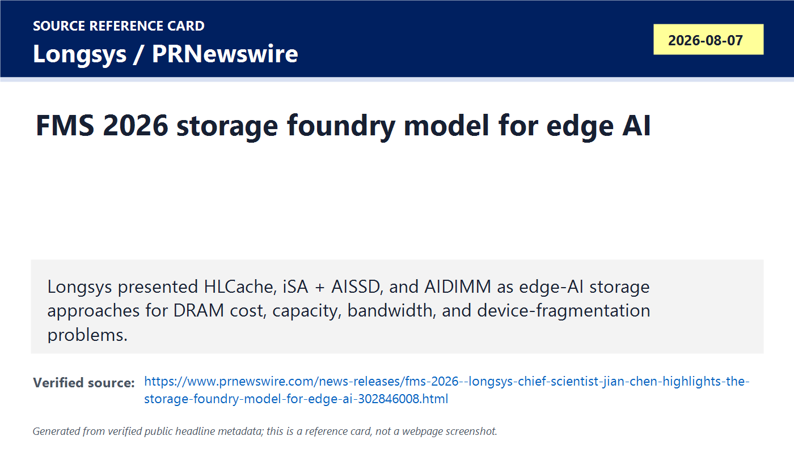
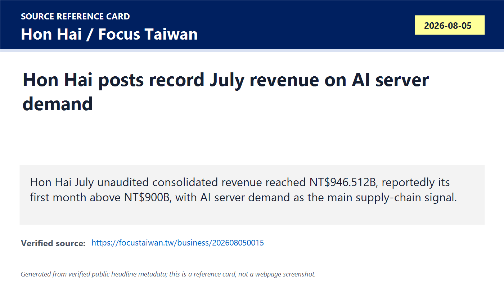
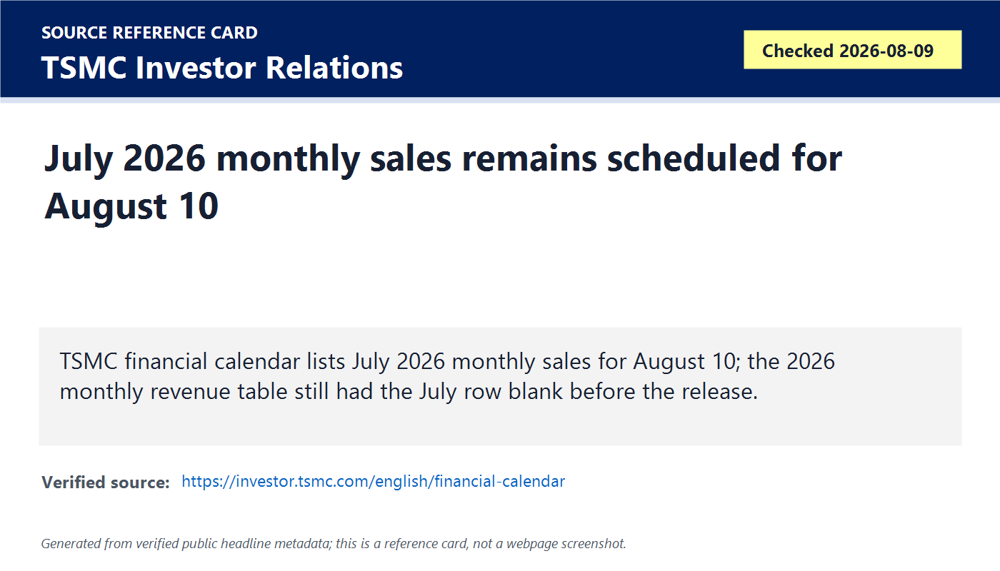
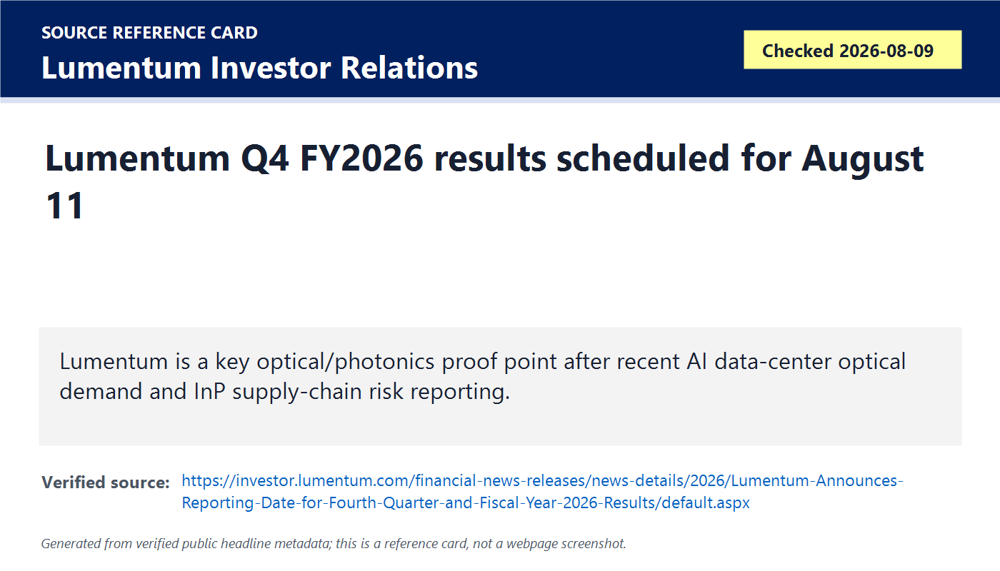
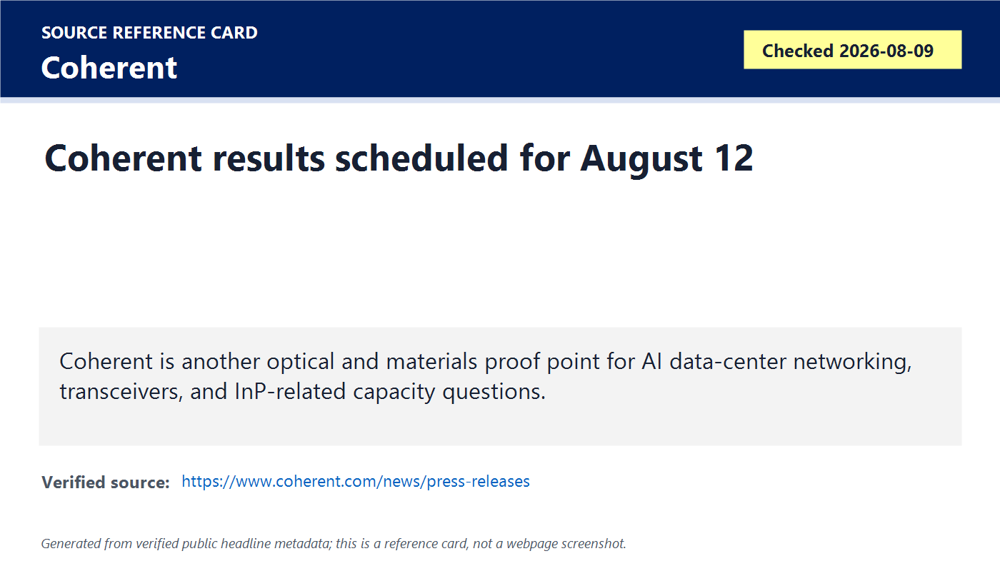
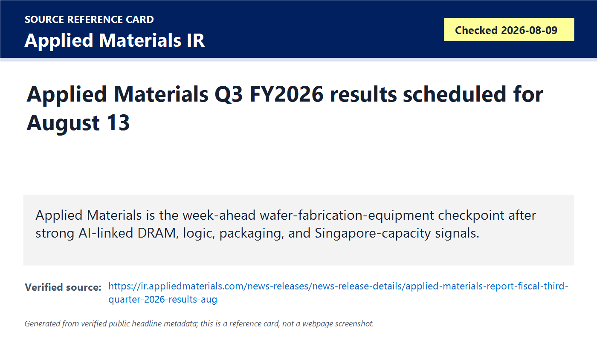
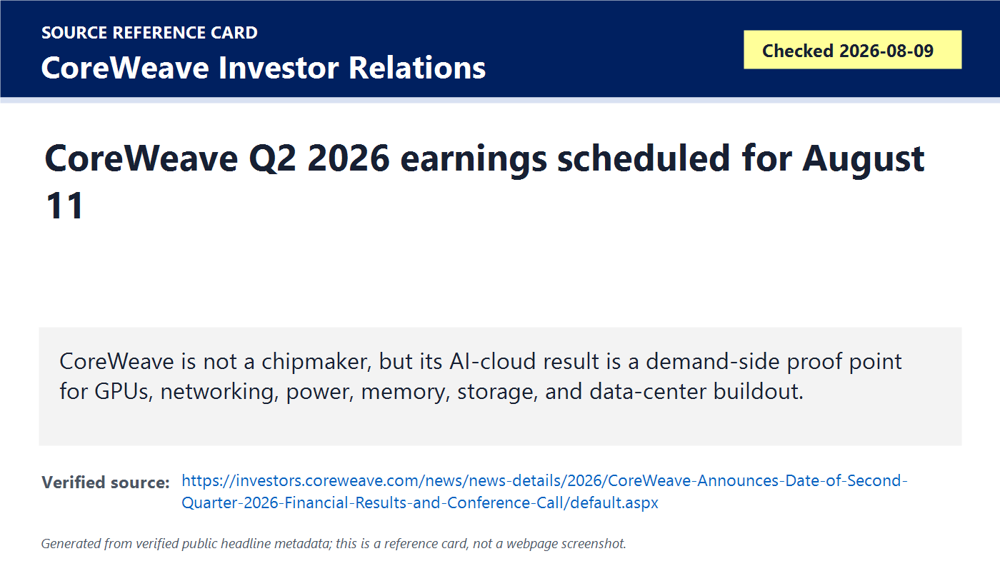
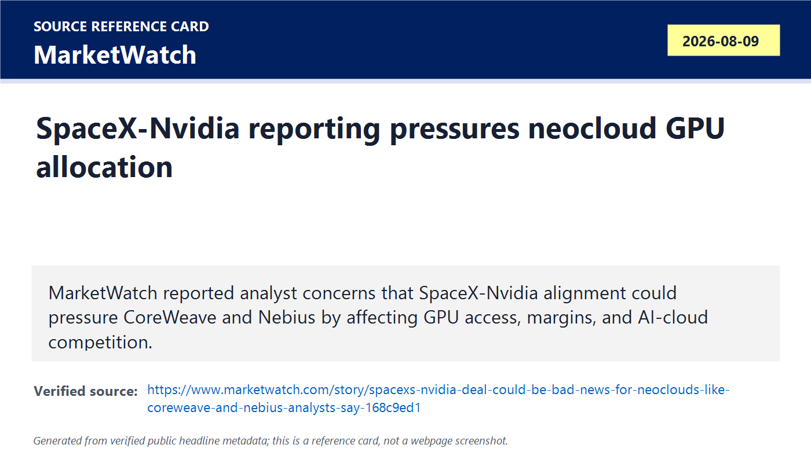
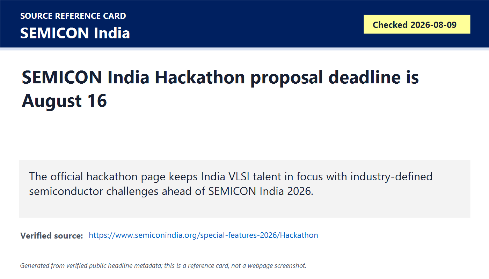
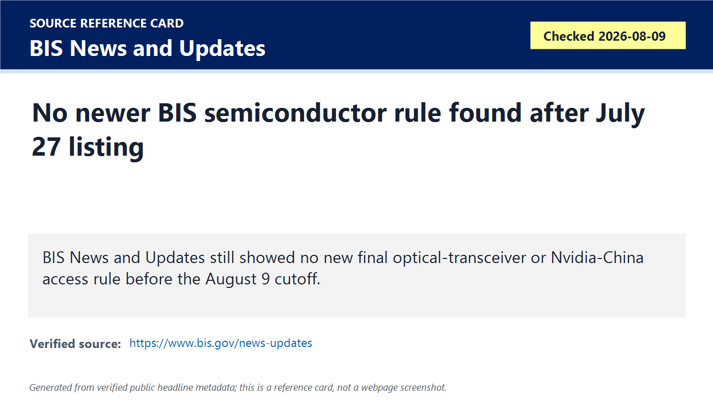

# Daily Semiconductor Current Affairs

Date: 2026-08-09

Research window: Sunday weekend update through approximately 15:20 IST on August 9, 2026. Exact Sunday semiconductor company releases were limited, so this note is labeled as a weekend/week-ahead proof-queue briefing. It updates August 7-9 developments and identifies which items remain pending until official disclosures on August 10-13. The strongest pattern is that AI semiconductor demand is now being tested through edge-AI storage, AI-server supply-chain revenue, optical/photonics earnings, foundry monthly sales, equipment earnings, and cloud GPU allocation.

## Quick Index

| Date | Major Topic | Source Groups | Why To Read |
|---|---|---|---|
| 2026-08-09 | Edge-AI storage becomes a real FMS architecture theme | Longsys / PRNewswire | Shows AI memory pressure moving into UFS, SSD, DIMM-like modules, firmware, packaging, and device-level storage design. |
| 2026-08-09 | Foxconn July revenue confirms AI-server supply-chain strength | Hon Hai official page, Focus Taiwan | Gives a supply-chain read-through from server/rack assembly rather than chipmaker revenue alone. |
| 2026-08-09 | August 10-13 proof queue: TSMC, Ceva, Lumentum, Coherent, Applied Materials, CoreWeave | Official IR pages | Sets the next official checkpoints for foundry, IP, optics, equipment, and AI-cloud demand. |
| 2026-08-09 | SpaceX-Nvidia reporting raises GPU-allocation and neocloud risk | MarketWatch, CoreWeave IR | Separates market-moving reporting from official Nvidia allocation or contract proof. |
| 2026-08-09 | Policy status: no newer BIS semiconductor rule found before cutoff | BIS | Keeps optical/Nvidia-China risk evidence-disciplined. |
| 2026-08-09 | India update: SEMICON India Hackathon proposal deadline approaches | SEMICON India | Useful for VLSI career planning; no new production milestone verified today. |

**Page navigation:** [Sources](#source-map) · [Concept review](#concept-review) · [Follow-up](#what-to-watch-next) · [Technical terms](#technical-terms-used-today) · [Master glossary](../knowledge-base/glossary.md)

## Technical Terms / Deep Definitions

Term: Edge AI
Definition: Edge AI means running artificial-intelligence inference or smaller adaptation workloads close to the device, machine, sensor, phone, PC, robot, vehicle, or factory system instead of sending every task to a cloud data center. It solves the latency, privacy, bandwidth, cost, and reliability problem that appears when billions of devices need local decisions or intermittent connectivity. In today's Longsys item, edge AI matters because storage and memory products are being customized for AI PCs, mobile devices, industrial systems, robots, and other fragmented end devices. Comparison: cloud AI centralizes large training and serving; edge AI pushes selected inference and context handling closer to the user or machine. Source: https://www.nvidia.com/en-us/glossary/edge-ai/

Term: Storage foundry model
Definition: A storage foundry model is a business and engineering approach where a storage company offers customized hardware, firmware, host software, packaging, testing, and manufacturing work for customer-specific systems, similar in spirit to how a chip foundry builds customer designs but applied to storage subsystems. It solves the product-fragmentation problem that edge-AI devices have different processors, operating systems, AI models, power limits, form factors, and security needs. In today's Longsys item, it matters because the company is arguing that standard storage products are not enough for edge AI; customers need co-optimized storage designs. Example: a robot, AI PC, and industrial gateway may all use NAND, but their latency, endurance, temperature, and model-cache behavior can differ sharply. Source: https://www.prnewswire.com/news-releases/fms-2026--longsys-chief-scientist-jian-chen-highlights-the-storage-foundry-model-for-edge-ai-302846008.html

Term: UFS
Definition: Universal Flash Storage is a JEDEC storage interface and device standard for embedded NAND-based storage used in phones, vehicles, edge devices, and other compact systems. It solves the embedded-storage problem by providing higher performance and more advanced command handling than older eMMC-style storage while fitting mobile and low-power use cases. In today's Longsys item, UFS matters because HLCache UFS is positioned as a way to manage hot and cold data in mobile AI devices under memory pressure. Comparison: UFS is common in mobile/embedded systems; NVMe SSDs are more common in PCs, servers, and high-performance storage paths. Source: https://www.jedec.org/standards-documents/focus/flash/universal-flash-storage-ufs

Term: Hot and cold data
Definition: Hot and cold data describe how frequently data is accessed: hot data is used often or recently, while cold data is accessed rarely or can tolerate slower retrieval. This classification solves the memory-hierarchy problem of deciding what should stay in fast, expensive memory and what can move to cheaper, slower storage. In today's Longsys item, hot/cold data matters because edge AI devices must decide which model, cache, app, and context data deserves scarce DRAM versus NAND storage. Example: the current prompt context may be hot; an old media file or rarely used model shard may be cold. Source: https://www.snia.org/education/online-dictionary

Term: Mixture-of-experts (MoE)
Definition: Mixture-of-experts is a neural-network architecture that contains multiple expert subnetworks and routes each token or input to only a subset of those experts. It solves the scaling problem of increasing model capacity without activating every parameter on every inference step, but it creates memory-placement and routing complexity. In today's Longsys item, MoE matters because iSA + AISSD is positioned around offloading MoE parameters and KV cache to storage resources for local AI inference. Comparison: a dense model uses the whole model each step; an MoE model activates selected experts, which can save compute but complicate memory and storage movement. Source: https://arxiv.org/abs/1701.06538

Term: KV cache
Definition: A KV cache stores the key and value tensors generated by a transformer attention model so the model does not recompute attention information for previous tokens during inference. It solves the long-context inference problem by saving compute, but it can consume large amounts of memory as context length and user concurrency grow. In today's Longsys item, KV cache matters because storage vendors are trying to offload or tier this data when DRAM is too small or expensive. Example: HBM or DRAM gives fast access, while SSD offload may expand capacity if latency and scheduling are controlled. Source: https://developer.nvidia.com/blog/mastering-llm-techniques-inference-optimization/

Term: AIDIMM
Definition: AIDIMM is Longsys' described plug-in high-bandwidth memory architecture for edge-AI systems, using a DIMM-like upgrade idea with a native 256-bit interface and stated bandwidth up to 307.2 GB/s. It solves the edge-system upgrade problem where a device may need more local AI memory bandwidth without a full motherboard or SoC redesign. In today's note, AIDIMM matters as a signal that memory innovation is spreading beyond cloud HBM into modular edge-AI formats. Comparison: HBM is stacked near an accelerator in high-end packages; AIDIMM is framed as a plug-in memory architecture for edge-AI systems. Source: https://www.prnewswire.com/news-releases/fms-2026--longsys-chief-scientist-jian-chen-highlights-the-storage-foundry-model-for-edge-ai-302846008.html

Term: Memory bandwidth
Definition: Memory bandwidth is the amount of data a memory system can transfer per second between memory and compute logic. It solves the feed-the-compute problem: processors and accelerators can only work at full speed if data arrives fast enough. In today's Longsys, SK hynix, and Foxconn-related items, bandwidth matters because AI workloads are constrained by moving model weights, activations, KV cache, and intermediate data, not only by arithmetic units. Example: a system with strong compute but weak memory bandwidth can leave AI accelerators idle. Source: https://www.jedec.org/standards-documents/docs/jesd238

Term: Electronics manufacturing services (EMS)
Definition: Electronics manufacturing services are outsourced manufacturing services for electronics products, including assembly, testing, supply-chain management, logistics, and sometimes design-for-manufacturing support. EMS solves the production-scale problem for brands and system companies that do not want to build every factory, line, and supplier network themselves. In today's Foxconn item, EMS matters because AI servers and racks create semiconductor demand beyond chips: boards, modules, cables, power systems, cooling, and final integration must be manufactured at scale. Comparison: TSMC manufactures wafers; Foxconn/Hon Hai assembles complex electronics systems and increasingly AI server infrastructure. Source: https://www.ipc.org/

Term: AI server rack
Definition: An AI server rack is a rack-level compute system containing accelerators, CPUs, memory, storage, networking, power distribution, cooling, firmware, and management hardware for AI training or inference. It solves the system-integration problem that one GPU board is not enough; large AI workloads need many devices coordinated through power, thermal, network, and software infrastructure. In today's Foxconn and CoreWeave items, AI server racks matter because demand for Nvidia and other accelerators becomes revenue for rack builders, optics suppliers, power suppliers, SSD vendors, and data-center operators. Comparison: a chip is a component; an AI server rack is the deployed unit that turns chips into usable compute capacity. Source: https://www.opencompute.org/projects/rack-and-power

Term: Unaudited consolidated revenue
Definition: Unaudited consolidated revenue is company revenue reported across a group of subsidiaries before completion of full external audit procedures. It solves the timeliness problem by giving investors and supply-chain researchers fast monthly or quarterly demand evidence, but the numbers can later be adjusted. In today's Foxconn item, it matters because Hon Hai's July monthly revenue gives an early AI-server supply-chain signal before full quarterly margins and product-mix details arrive. Comparison: monthly unaudited revenue is fast; audited annual financial statements are more complete and controlled. Source: https://www.investor.gov/introduction-investing/investing-basics/glossary/financial-statements

Term: Demand-side proof point
Definition: A demand-side proof point is evidence from customers, cloud operators, system builders, or downstream buyers showing that they are ordering, deploying, or monetizing semiconductor-based systems. It solves the research problem of distinguishing supplier optimism from actual customer pull. In today's CoreWeave, Foxconn, and SpaceX/Nvidia items, demand-side proof matters because AI chipmakers can report strong sales only if cloud builders, hyperscalers, enterprises, and system integrators can absorb and deploy the hardware. Example: TSMC revenue is a manufacturing-side signal; CoreWeave capacity, backlog, and earnings are demand-side signals. Source: https://www.sec.gov/oiea/investor-alerts-and-bulletins/ib_analystreports

Term: Silicon IP
Definition: Silicon intellectual property is a reusable circuit or subsystem block, such as a processor core, DSP, interface, wireless block, security engine, or AI accelerator, licensed for integration into a larger chip. It solves the design-time and verification-cost problem because teams can reuse qualified blocks instead of designing every function from scratch. In today's Ceva proof queue, silicon IP matters because wireless, smart-edge, automotive, and edge-AI chips often start by licensing proven IP before SoC integration and tape-out. Comparison: buying a chip gives you hardware; licensing IP gives you a design block to integrate into your own chip. Source: https://www.arm.com/glossary/semiconductor-ip

Term: Optical earnings watch
Definition: An optical earnings watch is a tracked upcoming financial result from companies that make lasers, transceivers, optical engines, photonic components, or related materials used in data-center networks. It solves the evidence problem of verifying whether optical AI demand is translating into revenue, margins, capacity, and customer commitments. In today's Lumentum and Coherent watch, it matters because optical components are a major bottleneck and policy-risk area for AI cluster scaling. Example: AOI gave one official optical signal earlier; Lumentum and Coherent can test whether that strength is broader. Source: https://www.oiforum.com/technical-work/hot-topics/800g/

Term: InP wafer
Definition: An InP wafer is a wafer made from indium phosphide, a compound semiconductor material used for high-speed and optoelectronic devices such as lasers and photodetectors. It solves the photonics-materials problem that silicon does not emit light efficiently for many telecom and data-center optical functions. In today's optical watch, InP wafers matter because reported China-linked supply constraints can affect lasers and transceiver production for AI data centers. Comparison: silicon wafers dominate CMOS logic; InP wafers support specialized optical devices. Source: https://www.rp-photonics.com/indium_phosphide.html

Term: Wafer fabrication equipment
Definition: Wafer fabrication equipment is the tool category used to manufacture semiconductor wafers, including lithography, deposition, etch, cleaning, ion implantation, metrology, inspection, thermal processing, and process-control systems. It solves the physical manufacturing problem of building, patterning, removing, cleaning, and measuring material layers at nanometer scale. In today's Applied Materials watch, WFE matters because AI-linked DRAM, logic, and advanced packaging demand must eventually show up in equipment orders, revenue, and guidance. Comparison: chipmakers sell chips; equipment vendors sell the tools that make future chip output possible. Source: https://www.semi.org/en/market-data

Term: Neocloud
Definition: A neocloud is a specialized AI cloud provider built around large GPU clusters and AI infrastructure rather than a broad general-purpose cloud platform. It solves the market problem that hyperscalers cannot always satisfy AI compute demand quickly or flexibly, so customers rent capacity from specialized GPU-cloud operators. In today's CoreWeave and SpaceX/Nvidia item, neocloud matters because GPU allocation, financing cost, and data-center execution can decide whether these firms benefit from or lose to direct hardware buyers. Example: CoreWeave is a neocloud; AWS, Azure, and Google Cloud are larger general-purpose hyperscalers. Source: https://investors.coreweave.com/news/news-details/2026/CoreWeave-Announces-Date-of-Second-Quarter-2026-Financial-Results-and-Conference-Call/default.aspx

Term: GPU allocation
Definition: GPU allocation is the process by which scarce accelerator supply is assigned across customers, cloud providers, internal projects, regions, and contracts. It solves the business problem of rationing limited advanced-chip, HBM, packaging, networking, and rack capacity when demand exceeds supply. In today's SpaceX/Nvidia reporting, allocation matters because a large buyer with strategic importance can change who gets the newest chips and when. Comparison: a purchase order says a buyer wants chips; allocation determines whether supply is actually reserved, delivered, and installed. Source: https://www.sec.gov/oiea/investor-alerts-and-bulletins/ib_analystreports

Term: Official status check
Definition: An official status check is a deliberate review of regulator, company, standards-body, or filing pages to verify whether a reported event has become a formal disclosure, rule, filing, or enforcement action. It solves the research-quality problem of not treating rumors, analyst notes, drafts, or media reports as completed facts. In today's BIS item, official status checking matters because optical-transceiver and Nvidia-China access reports remain policy risks unless BIS, FCC, the Federal Register, or a court/enforcement source publishes binding text. Example: MarketWatch reporting can move stocks; BIS text changes compliance duties. Source: https://www.bis.gov/news-updates

Term: Industry-defined semiconductor challenge
Definition: An industry-defined semiconductor challenge is a student or engineering problem statement created around real chip-design, verification, EDA, yield, manufacturing, packaging, or test needs rather than a generic coding exercise. It solves the talent-alignment problem by making training closer to actual semiconductor workflows. In today's SEMICON India Hackathon item, it matters because the August 16 proposal deadline pushes students toward applied VLSI and manufacturing problems with industry visibility. Comparison: a generic hackathon may reward app demos; a semiconductor challenge should involve signals, flows, constraints, data, tools, or physical manufacturing behavior. Source: https://www.semiconindia.org/special-features-2026/Hackathon

## Source Images

## Source Map

| Item | Source | Date | Link | Use In This Note |
|---|---|---|---|---|
| Edge AI storage at FMS | Longsys / PRNewswire | Aug. 7, 2026 | https://www.prnewswire.com/news-releases/fms-2026--longsys-chief-scientist-jian-chen-highlights-the-storage-foundry-model-for-edge-ai-302846008.html | Company release for Storage Foundry Model, HLCache, iSA + AISSD, and AIDIMM. |
| Hon Hai July revenue | Hon Hai official page | Aug. 5, 2026 | https://www.honhai.com/en-us/press-center/press-releases/latest-news/1352 | Official page confirming July 2026 monthly revenue release listing. |
| Hon Hai July revenue numbers | Focus Taiwan / CNA | Aug. 5, 2026 | https://focustaiwan.tw/business/202608050015 | Reputable Taiwan reporting with NT$946.512B, +54.19% YoY, first month above NT$900B. |
| TSMC financial calendar | TSMC Investor Relations | Checked Aug. 9, 2026 | https://investor.tsmc.com/english/financial-calendar | Official Aug. 10 schedule for July 2026 monthly sales. |
| TSMC 2026 monthly revenue table | TSMC Investor Relations | Checked Aug. 9, 2026 | https://investor.tsmc.com/english/monthly-revenue/2026 | Official table showing Jan-Jun data and blank July row before release. |
| Ceva Q2 schedule | Ceva Investor Relations | Checked Aug. 9, 2026 | https://www.ceva-ip.com/press/ceva-inc-schedules-second-quarter-2026-earnings-release-and-conference-call/ | Official Aug. 10 silicon-IP earnings checkpoint. |
| Lumentum Q4 schedule | Lumentum Investor Relations | Checked Aug. 9, 2026 | https://investor.lumentum.com/financial-news-releases/news-details/2026/Lumentum-Announces-Reporting-Date-for-Fourth-Quarter-and-Fiscal-Year-2026-Results/default.aspx | Official Aug. 11 optical/photonics earnings checkpoint. |
| Coherent results schedule | Coherent | Checked Aug. 9, 2026 | https://www.coherent.com/news/press-releases | Official page showing results scheduled for Aug. 12. |
| Applied Materials Q3 schedule | Applied Materials Investor Relations | Checked Aug. 9, 2026 | https://ir.appliedmaterials.com/news-releases/news-release-details/applied-materials-report-fiscal-third-quarter-2026-results-aug | Official Aug. 13 wafer-equipment earnings checkpoint. |
| CoreWeave Q2 schedule | CoreWeave Investor Relations | Checked Aug. 9, 2026 | https://investors.coreweave.com/news/news-details/2026/CoreWeave-Announces-Date-of-Second-Quarter-2026-Financial-Results-and-Conference-Call/default.aspx | Demand-side AI-cloud proof queue for GPU, networking, storage, power, and data-center deployment. |
| SpaceX/Nvidia neocloud market signal | MarketWatch | Aug. 9, 2026 | https://www.marketwatch.com/story/spacexs-nvidia-deal-could-be-bad-news-for-neoclouds-like-coreweave-and-nebius-analysts-say-168c9ed1 | Market reporting; treated as allocation/competition risk, not official contract detail. |
| Nvidia-China access reporting | MarketWatch | Aug. 8, 2026 | https://www.marketwatch.com/livecoverage/dow-s-p-500-and-nasdaq-set-for-mostly-steady-start-as-investors-wait-for-u-s-jobs-data/card/another-twist-in-the-battle-for-tech-supremacy-as-u-s-government-reportedly-probes-china-s-access-to-nvidia-chips-yzNOyHIRM6T8w1ThpzNB | Prior reporting remains open; no official BIS rule found today. |
| BIS status check | BIS News and Updates | Checked Aug. 9, 2026 | https://www.bis.gov/news-updates | Official policy-status check. |
| SEMICON India Hackathon | SEMICON India | Checked Aug. 9, 2026 | https://www.semiconindia.org/special-features-2026/Hackathon | India VLSI talent and industry-defined problem-source checkpoint. |

## Deep Briefing

### 1. Longsys shows edge AI pushing storage companies into system co-design

**Confirmed facts:** Longsys said its chief scientist Jian Chen presented at FMS 2026 on August 5 and discussed the Storage Foundry Model for edge AI. The release says the company presented HLCache UFS, iSA + AISSD, and AIDIMM. It frames the problem as high DRAM cost, limited memory capacity, bandwidth constraints, and fragmented edge-AI devices. The release also describes Longsys capabilities across chip design, firmware, material engineering, host software, hardware design, packaging, automated testing, and mass production.

**Analysis:** This is not just a product announcement. It is a sign that AI memory hierarchy is spreading from cloud HBM into edge devices. In cloud training, the problem is usually HBM capacity, HBM bandwidth, GPU interconnect, and data-center networking. At the edge, the problem changes: power limits are tighter, form factors vary, processors differ, operating systems differ, models are smaller or specialized, and cost pressure is higher. That is why a storage vendor is talking about firmware, host software, packaging, and system adaptation instead of only NAND density.

**Why it matters:** If edge AI scales, semiconductor value will move into storage controllers, UFS firmware, SSD scheduling, packaging/test, embedded memory hierarchy, and device-specific validation. The story connects to prior Silicon Motion, Kioxia, CXL, HBF, and SSD-controller notes: AI is turning storage from passive capacity into an active system-performance layer.

**India angle:** This is a realistic opportunity area for Indian VLSI students. Edge-AI storage involves RTL verification, firmware, Linux/storage stack work, embedded systems, performance modeling, ECC, wear management, packaging/test, and board validation. Those are closer entry paths than trying to jump directly into HBM stack design.

**VLSI/career relevance:** Build one project around a storage hierarchy problem: simulate KV-cache offload, model hot/cold data migration, verify an NVMe/UFS controller block, or measure latency under garbage collection. The interview-ready point is that memory capacity, bandwidth, latency, endurance, and software scheduling are all design variables.

### 2. Foxconn/Hon Hai July revenue gives a supply-chain proof point for AI servers

**Confirmed facts:** Hon Hai's official site lists an August 5 monthly-revenue release for July 2026. Focus Taiwan reported Hon Hai July unaudited consolidated revenue of NT$946.512 billion, the first month above NT$900 billion, up 54.19% year-to-year. The reporting links the record revenue to AI server demand.

**Analysis:** This is a different kind of semiconductor signal. Foxconn is not the foundry making wafers and not the GPU designer. It is a system manufacturing and integration layer. AI server demand becomes visible in rack assembly, cloud-and-networking hardware, boards, cables, power systems, thermal systems, storage, and logistics. That makes Foxconn monthly revenue a useful supply-chain read-through. The missing piece is margin and mix. Record revenue can still have weaker profitability if components, memory, logistics, tariffs, or customer pricing pressure rise.

**Why it matters:** Semiconductor demand becomes real only when chips are installed into systems. AI server revenue confirms that chips, boards, optics, power, and cooling are moving through the deployment chain. It also supports the August 10 TSMC and August 11 CoreWeave proof queue: manufacturing output and cloud demand need to line up.

**India angle:** India should study this layer carefully. The country may not immediately replicate leading-edge fabs, but electronics manufacturing, server integration, power systems, thermal modules, optical assembly, PCB/substrate ecosystems, and test infrastructure are closer industrial opportunities. Foxconn's global role also matters because it has India manufacturing exposure outside this specific Taiwan revenue item.

**VLSI/career relevance:** If you work in VLSI, understand the rack-level consequences of your chip. A PCIe signal-integrity bug, power-management weakness, or thermal design miss can become a server/rack deployment problem. System-level thinking is no longer optional.

### 3. The August 10-13 proof queue is unusually dense

**Confirmed facts:** TSMC lists July 2026 monthly sales for August 10. Its 2026 monthly revenue table showed Jan-Jun revenue and a blank July row before the release; June revenue was NT$442.680 billion and year-to-date revenue through June was NT$2.404 trillion, up 35.6%. Ceva scheduled Q2 2026 results for August 10. Lumentum scheduled fiscal Q4/full-year 2026 results for August 11. Coherent says it will release results for the quarter ended June 30, 2026 on August 12. Applied Materials scheduled fiscal Q3 2026 results for August 13. CoreWeave scheduled Q2 2026 results for August 11.

**Analysis:** This is the most important research structure for the next few days. Each source tests a different value-chain layer:

- TSMC tests foundry demand and current wafer-manufacturing revenue.
- Ceva tests silicon-IP demand for smart edge, wireless, sensor, automotive, and edge AI.
- Lumentum and Coherent test optical/photonics demand and InP-linked supply-chain questions.
- Applied Materials tests wafer-fabrication-equipment demand, especially AI-linked DRAM, logic, and advanced-packaging tool spend.
- CoreWeave tests the demand side of AI cloud: whether customers can absorb expensive GPU capacity profitably.

**Why it matters:** The AI semiconductor cycle can look strong in one layer and weak in another. For example, a foundry may be full while an AI cloud provider struggles with debt or data-center delays. Or optical companies may show demand but hit materials constraints. The proof queue forces the notebook to update layer by layer instead of using one company's result as the whole industry answer.

**India angle:** This is how India should measure its own semiconductor progress: by value-chain segment and evidence type. A design-policy announcement, OSAT milestone, talent event, foundry proposal, and actual monthly revenue are different evidence classes. Keep them separate.

**VLSI/career relevance:** Use the proof queue as a study map. IP teaches reusable blocks and verification. Foundry teaches process and yield. Optics teaches SerDes and photonics. Equipment teaches manufacturing physics. Cloud demand teaches how hardware becomes deployed compute.

### 4. SpaceX-Nvidia reporting turns GPU allocation into a market risk

**Confirmed facts:** MarketWatch reported on August 9 that analysts see SpaceX's Nvidia alignment as a potential negative for neoclouds such as CoreWeave and Nebius. The same theme follows earlier reporting that SpaceX will rely on Nvidia systems. No official Nvidia allocation contract, specific shipment schedule, or supply-priority filing was verified in this run. CoreWeave's official Q2 result is scheduled for August 11, so its actual numbers remain pending.

**Analysis:** This item is market-moving but not fully primary-confirmed. The logic is still important. In a constrained AI accelerator market, large customers compete not only on price but also on strategic relationship, deployment speed, power access, data-center construction, and software stack commitment. If a giant buyer receives priority access to future Nvidia systems, smaller AI-cloud providers may face higher costs, delayed capacity, or weaker bargaining power. That is the risk the market is trying to price before hard evidence arrives.

**Why it matters:** AI demand is not simply "more GPUs sold." The allocation of GPUs can change winners and losers across hyperscalers, neoclouds, enterprise customers, sovereign AI projects, and startups. It can also affect demand for HBM, networking, storage, optical modules, power supplies, and racks.

**India angle:** India should watch this because sovereign AI, local cloud capacity, startup GPU access, and data-center policy all depend on where scarce accelerators are allocated globally. Even if India has software demand, it still needs affordable compute access, power, cooling, and network capacity.

**VLSI/career relevance:** Learn to separate engineering superiority from supply allocation. A technically strong accelerator or cloud service may still lose if it cannot secure enough chips, memory, packaging, optics, or power.

### 5. Policy status remains open: no new BIS semiconductor rule found today

**Confirmed facts:** BIS News and Updates was checked on August 9. The visible latest listed item was July 27, and no newer final BIS semiconductor rule, Nvidia-China access rule, or optical-transceiver rule appeared before this note's cutoff. MarketWatch reporting on China's access to Nvidia chips and optical/InP supply-chain risk remains treated as reporting, not binding regulatory text.

**Analysis:** This is the evidence discipline the notebook needs. Policy risk can move stocks and management behavior before the rule exists, but engineering and compliance teams need exact legal text. The follow-up should look for BIS, FCC, Federal Register, Entity List, enforcement actions, settlement agreements, charging letters, or official company filings.

**Why it matters:** Export controls increasingly shape chip architecture, product segmentation, EDA access, cloud availability, distributor behavior, and customer contracts. But treating reports as final rules creates false certainty.

**India angle:** India can benefit from supply-chain diversification, but it also needs compliance maturity. Indian design, cloud, electronics, and distribution firms must understand end-user checks, country restrictions, resale controls, and data-center access rules if they want to serve global semiconductor customers.

**VLSI/career relevance:** Policy literacy is now part of semiconductor literacy. A chip's performance, interconnect, memory bandwidth, and destination can determine whether a sale needs a license.

### 6. India update: SEMICON India Hackathon is the live career-action item

**Confirmed facts:** SEMICON India Hackathon's official page remains live and lists proposal submission for August 16. The page frames the event around industry semiconductor challenges. No new India wafer-fab, OSAT production, tool-install, qualification, or shipment milestone was verified today before cutoff.

**Analysis:** This is a talent and ecosystem update, not a production update. The useful part is the deadline: it gives students a real reason to convert study into a proposal. For Kapil, this matters because it connects current affairs to action. A strong proposal should not be generic "AI for semiconductors." It should define a specific chip-design, EDA, verification, yield, storage, test, or manufacturing-data problem and show a measurable solution path.

**Why it matters:** India's semiconductor ecosystem needs proof at multiple levels: student skill, project execution, IP, OSAT output, customer qualification, and manufacturing scale. The hackathon addresses talent and problem familiarity, which are necessary but not sufficient.

**India angle:** This is directly India-relevant. It also shows why the notebook tracks definitions deeply: if you understand terms like yield, DFT, EDA, KV cache, PCIe, UFS, and manufacturing operations support, you can write better proposals and interview answers.

**VLSI/career relevance:** A good proposal could target automated RTL linting, verification coverage closure, yield-anomaly detection, wafer-map clustering, packaging-test data analysis, or storage-controller behavior under AI inference loads. Make it measurable: input data, method, expected output, baseline, and validation metric.

## Follow-Up Ledger

| Prior item | Status on 2026-08-09 | Evidence |
|---|---|---|
| Foundry monthly revenue watch | Still pending: TSMC July 2026 monthly sales is scheduled for August 10; July row still blank before release | TSMC financial calendar and monthly revenue table |
| Ceva IP earnings watch | Still pending: Q2 2026 result scheduled for August 10 | Ceva IR |
| Optical-transceiver policy risk | Updated but not closed: Lumentum Aug. 11 and Coherent Aug. 12 results are the next optical proof points; no final BIS/FCC rule found today | Lumentum, Coherent, BIS |
| Nvidia-China access report | Still pending: MarketWatch reporting remains unconfirmed by a new BIS final rule or enforcement action today | MarketWatch, BIS |
| August 6 HBF/OCP standard | Still pending: no public latency, endurance, software-placement, sample, or customer-adoption proof verified today | Prior SK hynix/Sandisk/OCP context |
| August 6 Astera Scorpio ramp | Still pending: no new customer shipment or Q3 ramp metric verified today | Prior Astera context |
| August 5 SEMI AI manufacturing workshop | Still pending: no public customer case-study metrics found today | SEMI prior context |
| India ecosystem watch | Updated but not closed: SEMICON India Hackathon proposal deadline remains August 16; no new production milestone today | SEMICON India |
| SK hynix Y2/M17 capex | Still pending for execution milestones: construction, cleanroom, tool move-in, qualification and capacity timing remain future proof points | SK hynix prior note |

## Concept Review

| Concept | Deep Definition | Why It Matters In This News | Revise Next | Source |
|---|---|---|---|---|
| Edge-AI memory hierarchy | Edge devices need a memory and storage stack that balances latency, bandwidth, capacity, power, endurance, cost, and form factor. | Longsys shows storage companies designing around model/cache movement, not only raw NAND capacity. | UFS, NVMe, KV cache, hot/cold data, SSD controllers, firmware. | https://www.prnewswire.com/news-releases/fms-2026--longsys-chief-scientist-jian-chen-highlights-the-storage-foundry-model-for-edge-ai-302846008.html |
| System-manufacturing read-through | AI chip demand becomes deployable only after servers, racks, boards, optics, cooling, power and logistics are assembled. | Foxconn's record July revenue gives downstream supply-chain evidence. | EMS, ODM, rack assembly, thermal/power systems, supply-chain timing. | https://focustaiwan.tw/business/202608050015 |
| Proof queue discipline | Scheduled releases are evidence checkpoints, not facts. | TSMC, Ceva, Lumentum, Coherent, AMAT and CoreWeave need official updates next week. | Earnings calendars, IR pages, guidance, monthly revenue, follow-up ledgers. | https://investor.tsmc.com/english/financial-calendar |
| GPU allocation risk | Scarce accelerators, HBM, packaging and rack capacity can be preferentially assigned to strategic customers. | SpaceX/Nvidia reporting may affect neocloud competitiveness even before official allocation proof. | Nvidia supply chain, HBM, cloud capex, neocloud business models. | https://www.marketwatch.com/story/spacexs-nvidia-deal-could-be-bad-news-for-neoclouds-like-coreweave-and-nebius-analysts-say-168c9ed1 |
| Official policy verification | A media report becomes compliance reality only when an agency, filing, court, or official rule creates binding text. | BIS showed no new final semiconductor rule today, so optical/Nvidia-China items stay open. | BIS, FCC, Federal Register, Entity List, enforcement actions. | https://www.bis.gov/news-updates |

## Simple Explanation

Today is a Sunday proof-queue note. The real action is not one dramatic new rule or earnings print; it is the set of official checkpoints about to land. Longsys shows that edge AI needs smarter storage and memory hierarchy. Foxconn's July revenue shows AI servers are moving through the supply chain. TSMC, Ceva, Lumentum, Coherent, Applied Materials and CoreWeave will update key layers next week. Market reports around SpaceX and Nvidia may affect GPU allocation and neocloud competition, but they are not official shipment contracts. BIS still has no new final semiconductor rule visible today. India has a practical action item: SEMICON India Hackathon proposals are due August 16.

## Interview Questions

1. Why does edge AI create different memory and storage problems than cloud AI?
2. What is the difference between UFS and NVMe from a system-use perspective?
3. Why can KV-cache offload help local AI inference but also create latency risk?
4. Why is Foxconn/Hon Hai revenue useful for semiconductor researchers even though Foxconn is not a foundry?
5. How do TSMC, Ceva, Lumentum, Coherent, Applied Materials and CoreWeave each test a different part of the AI semiconductor value chain?
6. What is GPU allocation risk, and why can it affect neoclouds?
7. How do you distinguish a market-moving report from an official export-control rule?
8. What would make a SEMICON India Hackathon proposal more semiconductor-specific than a generic AI/software proposal?

## What To Watch Next

1. TSMC July 2026 monthly sales on August 10.
2. Ceva Q2 2026 result on August 10.
3. CoreWeave Q2 2026 result on August 11, especially capacity deployment, backlog, capex, debt, margins and customer commitments.
4. Lumentum Q4 FY2026 result on August 11 and Coherent result on August 12 for optical AI demand and InP exposure.
5. Applied Materials Q3 FY2026 result on August 13 for wafer-equipment demand, AI DRAM, logic, advanced packaging and China/customer mix.
6. Any BIS, FCC, Federal Register, or enforcement text related to optical transceivers or Nvidia-China access.
7. SEMICON India Hackathon proposal submissions by August 16.

## Technical Terms Used Today

[Back to quick index](#quick-index) · [Open the master A-Z glossary](../knowledge-base/glossary.md)

**Term index:** [AI server rack](#daily-term-ai-server-rack) · [AIDIMM](#daily-term-aidimm) · [Demand-side proof point](#daily-term-demand-side-proof-point) · [Edge AI](#daily-term-edge-ai) · [Electronics manufacturing services (EMS)](#daily-term-electronics-manufacturing-services-ems) · [GPU allocation](#daily-term-gpu-allocation) · [Hot and cold data](#daily-term-hot-and-cold-data) · [Industry-defined semiconductor challenge](#daily-term-industry-defined-semiconductor-challenge) · [InP wafer](#daily-term-inp-wafer) · [KV cache](#daily-term-kv-cache) · [Memory bandwidth](#daily-term-memory-bandwidth) · [Mixture-of-experts (MoE)](#daily-term-mixture-of-experts-moe) · [Neocloud](#daily-term-neocloud) · [Official status check](#daily-term-official-status-check) · [Optical earnings watch](#daily-term-optical-earnings-watch) · [Silicon IP](#daily-term-silicon-ip) · [Storage foundry model](#daily-term-storage-foundry-model) · [UFS](#daily-term-ufs) · [Unaudited consolidated revenue](#daily-term-unaudited-consolidated-revenue) · [Wafer fabrication equipment](#daily-term-wafer-fabrication-equipment)

| Term | Meaning |
|---|---|
| [**AI server rack**](../knowledge-base/glossary.md#term-ai-server-rack) | An AI server rack is a rack-level compute system containing accelerators, CPUs, memory, storage, networking, power distribution, cooling, firmware, and management hardware for AI training or inference. It solves the system-integration problem that one GPU board is not enough; large AI workloads need many devices coordinated through power, thermal, network, and software infrastructure. |
| [**AIDIMM**](../knowledge-base/glossary.md#term-aidimm) | AIDIMM is Longsys' described plug-in high-bandwidth memory architecture for edge-AI systems, using a DIMM-like upgrade idea with a native 256-bit interface and stated bandwidth up to 307.2 GB/s. It solves the edge-system upgrade problem where a device may need more local AI memory bandwidth without a full motherboard or SoC redesign. |
| [**Demand-side proof point**](../knowledge-base/glossary.md#term-demand-side-proof-point) | A demand-side proof point is evidence from customers, cloud operators, system builders, or downstream buyers showing that they are ordering, deploying, or monetizing semiconductor-based systems. It solves the research problem of distinguishing supplier optimism from actual customer pull. |
| [**Edge AI**](../knowledge-base/glossary.md#term-edge-ai) | Edge AI means running artificial-intelligence inference or smaller adaptation workloads close to the device, machine, sensor, phone, PC, robot, vehicle, or factory system instead of sending every task to a cloud data center. It solves the latency, privacy, bandwidth, cost, and reliability problem that appears when billions of devices need local decisions or intermittent connectivity. |
| [**Electronics manufacturing services (EMS)**](../knowledge-base/glossary.md#term-electronics-manufacturing-services-ems) | Electronics manufacturing services are outsourced manufacturing services for electronics products, including assembly, testing, supply-chain management, logistics, and sometimes design-for-manufacturing support. EMS solves the production-scale problem for brands and system companies that do not want to build every factory, line, and supplier network themselves. |
| [**GPU allocation**](../knowledge-base/glossary.md#term-gpu-allocation) | GPU allocation is the process by which scarce accelerator supply is assigned across customers, cloud providers, internal projects, regions, and contracts. It solves the business problem of rationing limited advanced-chip, HBM, packaging, networking, and rack capacity when demand exceeds supply. |
| [**Hot and cold data**](../knowledge-base/glossary.md#term-hot-and-cold-data) | Hot and cold data describe how frequently data is accessed: hot data is used often or recently, while cold data is accessed rarely or can tolerate slower retrieval. This classification solves the memory-hierarchy problem of deciding what should stay in fast, expensive memory and what can move to cheaper, slower storage. |
| [**Industry-defined semiconductor challenge**](../knowledge-base/glossary.md#term-industry-defined-semiconductor-challenge) | An industry-defined semiconductor challenge is a student or engineering problem statement created around real chip-design, verification, EDA, yield, manufacturing, packaging, or test needs rather than a generic coding exercise. It solves the talent-alignment problem by making training closer to actual semiconductor workflows. |
| [**InP wafer**](../knowledge-base/glossary.md#term-inp-wafer) | An InP wafer is a wafer made from indium phosphide, a compound semiconductor material used for high-speed and optoelectronic devices such as lasers and photodetectors. It solves the photonics-materials problem that silicon does not emit light efficiently for many telecom and data-center optical functions. |
| [**KV cache**](../knowledge-base/glossary.md#term-kv-cache) | A KV cache stores the key and value tensors generated by a transformer attention model so the model does not recompute attention information for previous tokens during inference. It solves the long-context inference problem by saving compute, but it can consume large amounts of memory as context length and user concurrency grow. |
| [**Memory bandwidth**](../knowledge-base/glossary.md#term-memory-bandwidth) | Memory bandwidth is the amount of data a memory system can transfer per second between memory and compute logic. It solves the feed-the-compute problem: processors and accelerators can only work at full speed if data arrives fast enough. |
| [**Mixture-of-experts (MoE)**](../knowledge-base/glossary.md#term-mixture-of-experts-moe) | Mixture-of-experts is a neural-network architecture that contains multiple expert subnetworks and routes each token or input to only a subset of those experts. It solves the scaling problem of increasing model capacity without activating every parameter on every inference step, but it creates memory-placement and routing complexity. |
| [**Neocloud**](../knowledge-base/glossary.md#term-neocloud) | A neocloud is a specialized AI cloud provider built around large GPU clusters and AI infrastructure rather than a broad general-purpose cloud platform. It solves the market problem that hyperscalers cannot always satisfy AI compute demand quickly or flexibly, so customers rent capacity from specialized GPU-cloud operators. |
| [**Official status check**](../knowledge-base/glossary.md#term-official-status-check) | An official status check is a deliberate review of regulator, company, standards-body, or filing pages to verify whether a reported event has become a formal disclosure, rule, filing, or enforcement action. It solves the research-quality problem of not treating rumors, analyst notes, drafts, or media reports as completed facts. |
| [**Optical earnings watch**](../knowledge-base/glossary.md#term-optical-earnings-watch) | An optical earnings watch is a tracked upcoming financial result from companies that make lasers, transceivers, optical engines, photonic components, or related materials used in data-center networks. It solves the evidence problem of verifying whether optical AI demand is translating into revenue, margins, capacity, and customer commitments. |
| [**Silicon IP**](../knowledge-base/glossary.md#term-silicon-ip) | Silicon intellectual property is a reusable circuit or subsystem block, such as a processor core, DSP, interface, wireless block, security engine, or AI accelerator, licensed for integration into a larger chip. It solves the design-time and verification-cost problem because teams can reuse qualified blocks instead of designing every function from scratch. |
| [**Storage foundry model**](../knowledge-base/glossary.md#term-storage-foundry-model) | A storage foundry model is a business and engineering approach where a storage company offers customized hardware, firmware, host software, packaging, testing, and manufacturing work for customer-specific systems, similar in spirit to how a chip foundry builds customer designs but applied to storage subsystems. It solves the product-fragmentation problem that edge-AI devices have different processors, operating systems, AI models, power limits, form factors, and security needs. |
| [**UFS**](../knowledge-base/glossary.md#term-ufs) | Universal Flash Storage is a JEDEC storage interface and device standard for embedded NAND-based storage used in phones, vehicles, edge devices, and other compact systems. It solves the embedded-storage problem by providing higher performance and more advanced command handling than older eMMC-style storage while fitting mobile and low-power use cases. |
| [**Unaudited consolidated revenue**](../knowledge-base/glossary.md#term-unaudited-consolidated-revenue) | Unaudited consolidated revenue is company revenue reported across a group of subsidiaries before completion of full external audit procedures. It solves the timeliness problem by giving investors and supply-chain researchers fast monthly or quarterly demand evidence, but the numbers can later be adjusted. |
| [**Wafer fabrication equipment**](../knowledge-base/glossary.md#term-wafer-fabrication-equipment) | Wafer fabrication equipment is the tool category used to manufacture semiconductor wafers, including lithography, deposition, etch, cleaning, ion implantation, metrology, inspection, thermal processing, and process-control systems. It solves the physical manufacturing problem of building, patterning, removing, cleaning, and measuring material layers at nanometer scale. |

This page-end index covers the specialist terms central to this day's study. The fuller explanation, news context, and source remain at first use; the master glossary combines repeated terms across all days.
