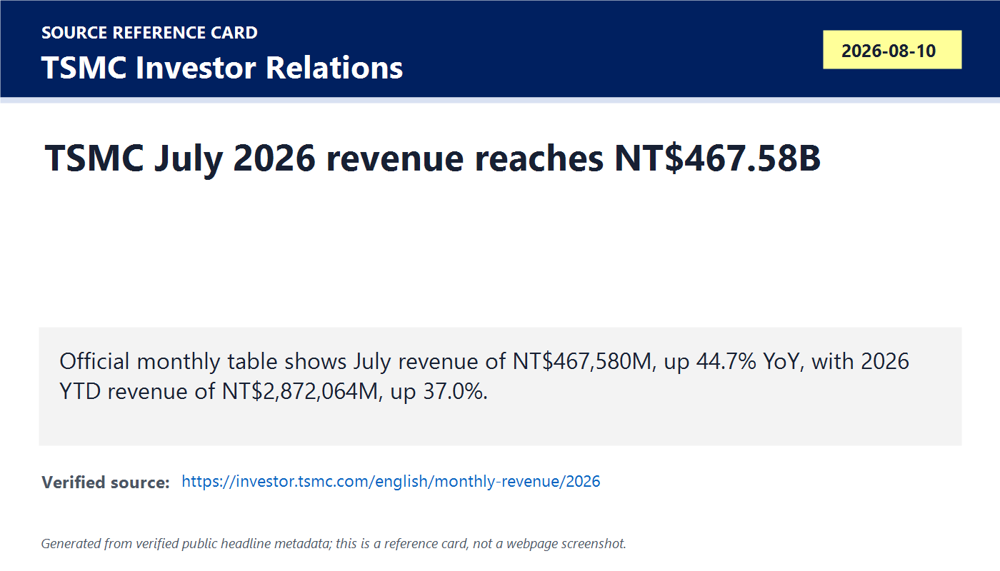
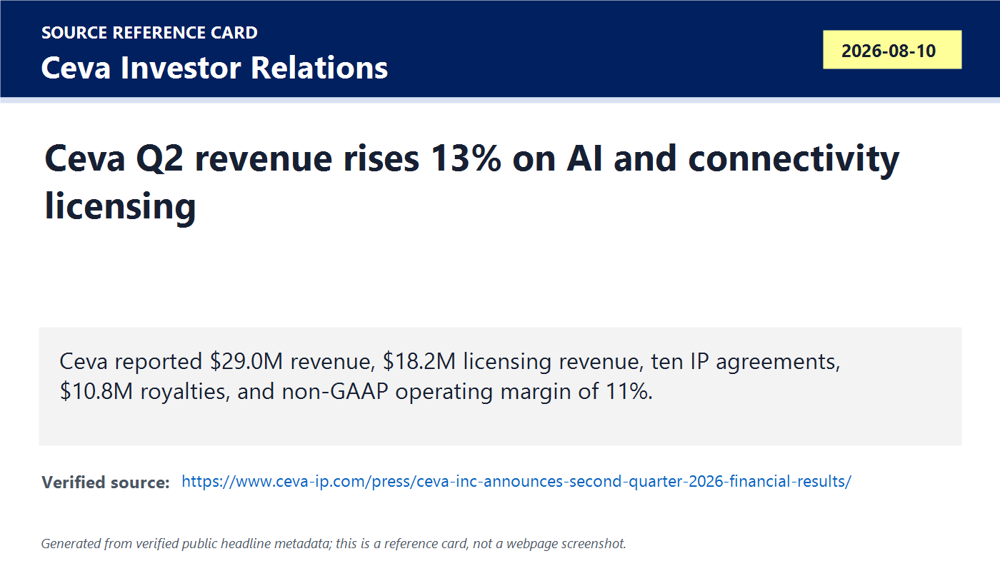
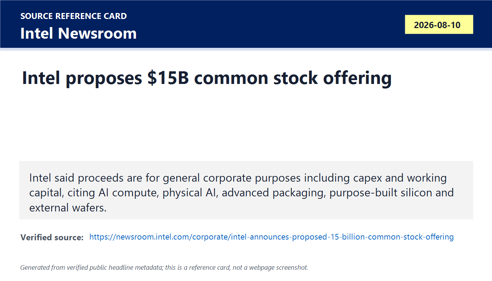
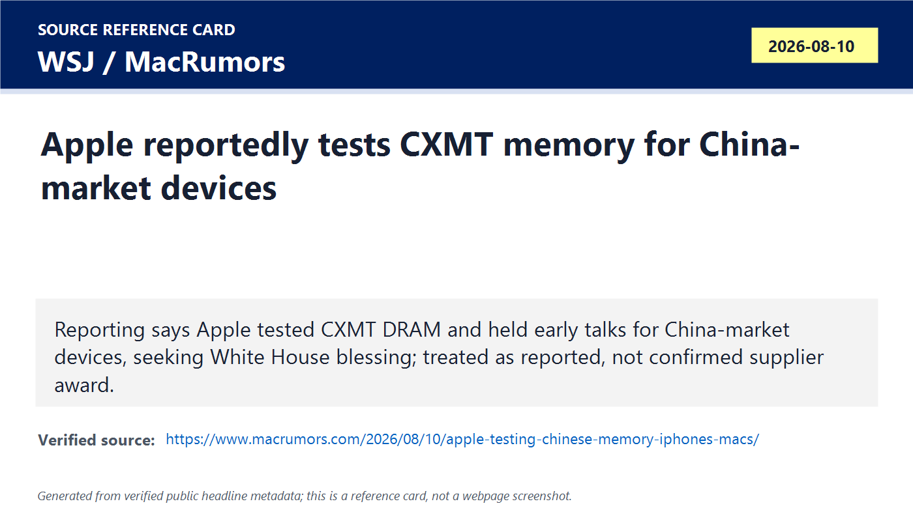
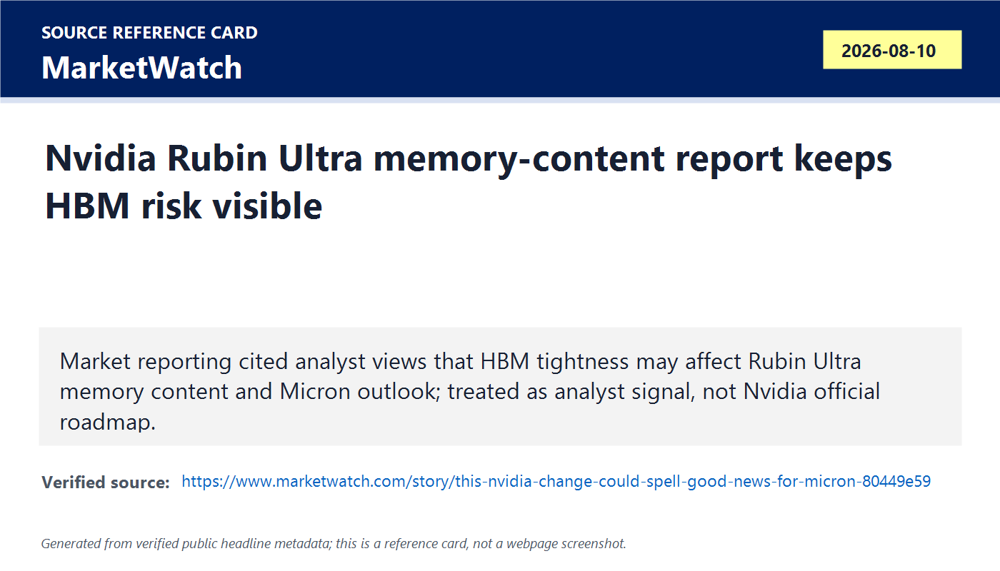
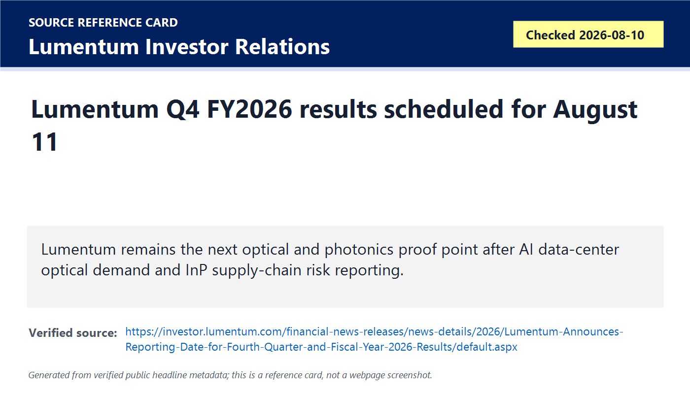
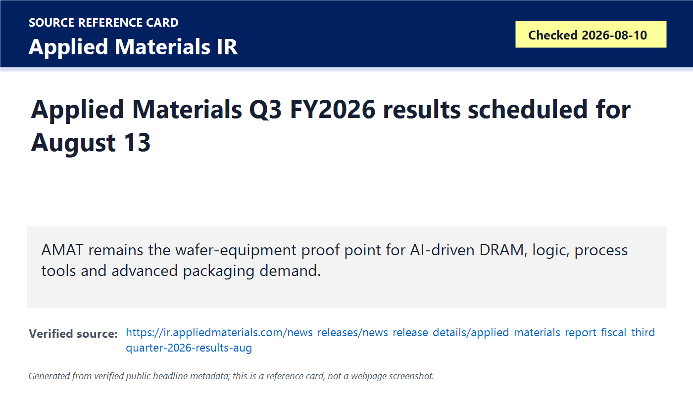
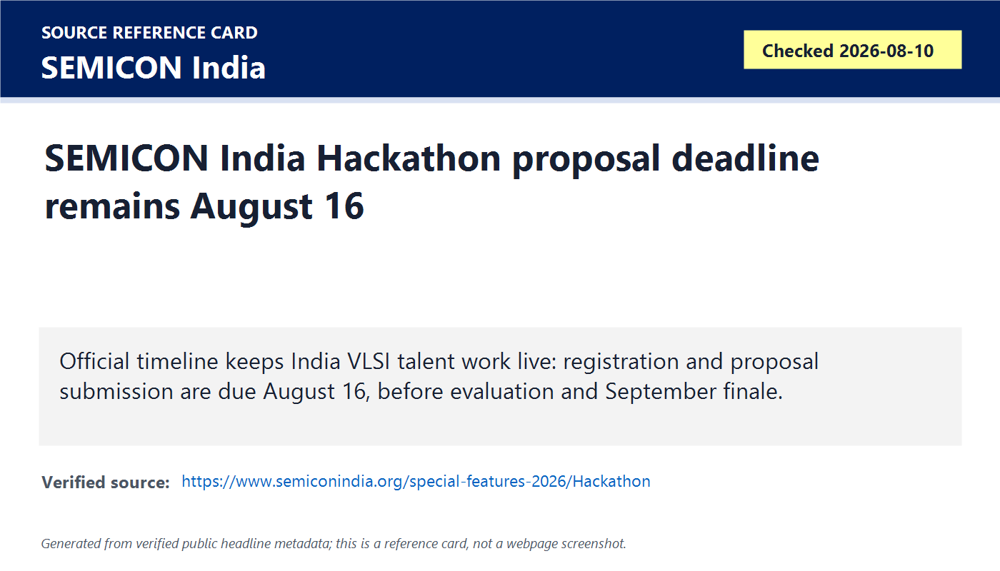
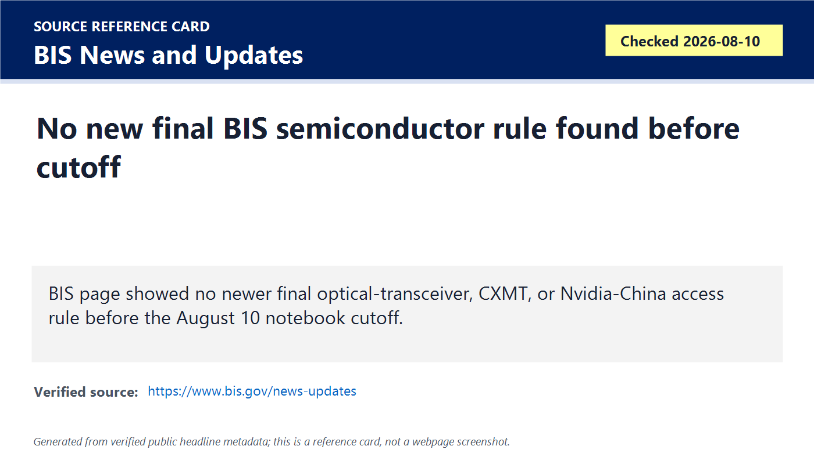

# Daily Semiconductor Current Affairs

Date: 2026-08-10

Research window: Monday update through approximately 20:00 IST on August 10, 2026, covering today's official releases and the nearest 24-72 hour context where exact-day semiconductor news was limited. The main signal is that the August proof queue started converting from "watch" items into official evidence: TSMC posted very strong July foundry revenue, Ceva reported better IP licensing momentum, Intel proposed a large equity raise, memory geopolitics stayed noisy but partly unconfirmed, and optics/equipment results remained pending.

## Quick Index

| Date | Major Topic | Source Groups | Why To Read |
|---|---|---|---|
| 2026-08-10 | TSMC July monthly revenue confirms foundry strength | TSMC Investor Relations | Official foundry revenue rose to NT$467.58B in July, making AI and advanced-node demand visible in current manufacturing revenue. |
| 2026-08-10 | Ceva Q2 result closes the silicon-IP watch | Ceva Investor Relations | Licensing revenue reached its highest level in three years and the company cited AI/NPU and connectivity deals. |
| 2026-08-10 | Intel proposes $15B common stock offering | Intel Newsroom | Shows Intel funding capex, working capital, foundry ambitions, advanced packaging, and AI-compute expansion through equity. |
| 2026-08-10 | Apple-CXMT and Nvidia-Rubin/HBM reports keep memory risk active | WSJ/MacRumors, MarketWatch | Useful as market-moving reporting, but not treated as official supplier awards or Nvidia roadmap confirmation. |
| 2026-08-10 | Lumentum and Applied Materials remain next official proof points | Official IR pages | Keeps optics/photonics and wafer-equipment follow-ups scheduled instead of guessed. |
| 2026-08-10 | India and policy status stay evidence-disciplined | SEMICON India, BIS | SEMICON India Hackathon deadline remains live; no new final BIS semiconductor rule was verified before cutoff. |

**Page navigation:** [Sources](#source-map) · [Concept review](#concept-review) · [Follow-up](#what-to-watch-next) · [Technical terms](#technical-terms-used-today) · [Master glossary](../knowledge-base/glossary.md)

## Technical Terms / Deep Definitions

Term: Foundry monthly revenue
Definition: Foundry monthly revenue is the revenue a contract chip manufacturer reports for one month from making wafers for customers. It solves the research problem of getting a near-real-time demand signal before full quarterly earnings arrive, but it does not reveal exact customers, nodes, margins, or utilization by product. In today's TSMC item, it matters because July revenue shows wafer-manufacturing demand remained strong after the prior proof queue. Example: TSMC monthly revenue is current foundry output evidence; an analyst estimate is only a forecast. Source: https://investor.tsmc.com/english/monthly-revenue/2026

Term: Consolidated net revenue
Definition: Consolidated net revenue is revenue reported for a company group after combining the parent and controlled subsidiaries and removing internal transactions, usually after returns, discounts, and similar deductions from gross sales. It solves the accounting problem of showing the economic sales of the whole group rather than double-counting sales between related entities. In today's TSMC item, it matters because the July number is a consolidated company-wide manufacturing signal, not one fab or one customer. Comparison: consolidated revenue is group-level; segment revenue breaks sales into business lines when the company provides that detail. Source: https://www.investor.gov/introduction-investing/investing-basics/glossary/financial-statements

Term: Year-to-date revenue
Definition: Year-to-date revenue is the cumulative revenue from the start of the fiscal or calendar year through the current reporting period. It solves the context problem of not overreacting to one month by showing how the year is tracking as a whole. In today's TSMC item, the 2026 year-to-date total matters because July strength is added to an already strong January-July base. Example: a single month can spike because of shipment timing; year-to-date data smooths some of that noise. Source: https://investor.tsmc.com/english/monthly-revenue/2026

Term: Silicon IP licensing
Definition: Silicon IP licensing is the business of selling rights to use reusable chip-design blocks such as DSPs, wireless engines, processor subsystems, NPUs, security blocks, and interfaces inside a customer's SoC. It solves the design-time, verification-cost, and schedule-risk problem because chip teams do not need to build every circuit from scratch. In today's Ceva result, licensing matters because new agreements indicate future chips may integrate Ceva blocks before royalties appear in shipment volume. Comparison: licensing IP is like buying a proven circuit blueprint; buying chips is buying finished hardware. Source: https://www.arm.com/glossary/semiconductor-ip

Term: Royalty revenue
Definition: Royalty revenue is money earned when a licensee ships products or uses licensed technology under an agreement that pays the IP owner per unit, per design, or by another usage formula. It solves the business-model problem of letting an IP supplier benefit after customer chips move into volume production. In today's Ceva item, royalties matter because they are the lagging proof that earlier license wins have turned into shipped products. Example: a license agreement is a design-in signal; royalty revenue is a shipment-linked signal. Source: https://www.sec.gov/Archives/edgar/data/0001173489/000117348924000006/ceva-20231231.htm

Term: Non-GAAP operating margin
Definition: Non-GAAP operating margin is operating income as a percentage of revenue after management excludes certain expenses or accounting items from standard GAAP results. It solves the communication problem of showing an adjusted view of operating performance, but it must be checked against GAAP because exclusions can make profitability look cleaner than statutory accounting. In today's Ceva result, it matters because the company reported stronger adjusted operating leverage along with licensing growth. Comparison: GAAP is the regulated accounting baseline; non-GAAP is management's adjusted lens. Source: https://www.sec.gov/oiea/investor-alerts-and-bulletins/non-gaap-financial-measures

Term: Underwritten public offering
Definition: An underwritten public offering is a sale of securities to public investors where investment banks buy or arrange the sale of shares under agreed terms. It solves the capital-raising problem by giving a company faster access to large pools of investor money, but it can dilute existing shareholders and signals funding needs. In today's Intel item, it matters because Intel is trying to fund capex and working capital while executing manufacturing, foundry, and advanced-packaging plans. Example: a debt raise increases obligations; a common-stock offering increases shares outstanding. Source: https://www.investor.gov/introduction-investing/investing-basics/glossary/underwriter

Term: Capital expenditure
Definition: Capital expenditure, or capex, is money spent on long-lived assets such as fabs, cleanrooms, lithography tools, deposition tools, advanced-packaging lines, buildings, and infrastructure. It solves the manufacturing-capacity problem: semiconductor output cannot grow without physical assets that take time to build, install, qualify, and ramp. In today's Intel item, capex matters because the company explicitly lists capital expenditures as a planned use of offering proceeds. Comparison: capex builds future capacity; operating expense pays for current operations such as salaries and utilities. Source: https://www.sec.gov/Archives/edgar/data/50863/000005086326000094/intc-20251227.htm

Term: Dilution
Definition: Dilution happens when a company issues new shares and each existing share represents a smaller percentage ownership claim on the company. It solves the funding problem for the company but creates a tradeoff for shareholders because the ownership base expands. In today's Intel item, dilution matters because a large common-stock offering can fund fabs and working capital while reducing existing shareholders' percentage stake unless future earnings grow enough to offset it. Example: issuing debt avoids immediate share dilution but adds interest and repayment obligations. Source: https://www.investor.gov/introduction-investing/investing-basics/glossary/dilution

Term: External wafers
Definition: External wafers are wafers manufactured for outside customers rather than for the manufacturer's own internal product groups. It solves the foundry-business question of whether a manufacturing network can attract third-party designs and compete as a merchant supplier. In today's Intel offering release, external wafers matter because Intel linked AI demand and foundry opportunities to financing needs. Comparison: Intel product wafers serve Intel CPUs or accelerators; external wafers serve customers using Intel Foundry capacity. Source: https://www.intel.com/content/www/us/en/foundry/overview.html

Term: Vendor qualification
Definition: Vendor qualification is the engineering, reliability, supply-chain, compliance, and commercial process used before a customer approves a supplier's component for production. It solves the risk problem that an unqualified component can fail performance, reliability, security, export-control, or customer-support requirements. In today's Apple-CXMT reporting, qualification matters because testing memory does not equal a confirmed supplier award. Example: a phone maker may test a DRAM vendor for months before using that memory in production devices. Source: https://www.jedec.org/standards-documents/focus/quality-reliability

Term: HBM supply constraint
Definition: An HBM supply constraint is a shortage or tight allocation of high-bandwidth memory stacks, packaging capacity, qualified yields, or supplier commitments relative to AI accelerator demand. It solves no problem by itself; it is the bottleneck that forces chipmakers to redesign products, prioritize customers, raise prices, or delay ramps. In today's Nvidia-Rubin market report, HBM tightness matters because memory content can shape accelerator configuration and revenue for memory suppliers. Comparison: ordinary server DRAM can be expanded with DIMMs; HBM is integrated close to the accelerator package and is much harder to substitute late. Source: https://www.jedec.org/standards-documents/docs/jesd238

Term: Memory content
Definition: Memory content is the amount, type, bandwidth, and value of memory included in a device, board, server, or accelerator platform. It solves the sizing problem of connecting chip demand to memory vendor revenue and system performance. In today's Nvidia-Rubin/HBM item, memory content matters because a change in HBM quantity per accelerator can shift both performance and supplier sales. Example: two GPUs can use the same compute die family but very different HBM stack counts or capacities. Source: https://www.jedec.org/standards-documents/docs/jesd238

Term: Optical earnings watch
Definition: An optical earnings watch is a tracked financial-result checkpoint for companies that make lasers, optical transceivers, photonic components, or related optical materials used in data-center networks. It solves the evidence problem of verifying whether AI-networking demand is turning into real revenue, margin, backlog, and capacity guidance. In today's note, Lumentum remains important because optical links are a practical bottleneck for scaling AI clusters. Example: AOI gave one optical demand signal earlier; Lumentum and Coherent test whether that strength is broader. Source: https://www.oiforum.com/technical-work/hot-topics/800g/

Term: Wafer fabrication equipment
Definition: Wafer fabrication equipment is the tool set used to manufacture semiconductor wafers, including lithography, deposition, etch, cleaning, implantation, metrology, inspection, thermal processing, and process-control systems. It solves the physical manufacturing problem of building, patterning, removing, cleaning, and measuring material layers at nanometer scale. In today's Applied Materials watch, WFE matters because AI-linked DRAM, logic, and advanced-packaging demand must eventually show up in equipment orders and guidance. Comparison: chipmakers sell chips; equipment makers sell the machines that make future chip output possible. Source: https://www.semi.org/en/market-data

Term: Proposal submission deadline
Definition: A proposal submission deadline is the formal last date by which participants must submit a project plan, problem statement, approach, and expected output for review. It solves the program-management problem of turning open interest into comparable, reviewable entries. In today's SEMICON India Hackathon update, the August 16 deadline matters because students need to convert semiconductor interest into a specific VLSI, EDA, verification, yield, manufacturing, or design proposal. Example: registering interest is not enough; a proposal needs a defined input, method, output, and validation metric. Source: https://www.semiconindia.org/special-features-2026/Hackathon

Term: Entity List
Definition: The Entity List is a U.S. export-control list identifying foreign persons, companies, organizations, or institutions subject to additional license requirements for exports, reexports, or in-country transfers of controlled items. It solves the national-security policy problem of restricting access to sensitive goods, software, and technology for named parties. In today's BIS status check, it matters because reports about CXMT, optical components, or Nvidia-China access become operationally binding only when official rules, listings, or license policies appear. Comparison: media reporting can warn of risk; the Entity List creates compliance obligations. Source: https://www.bis.gov/entity-list

## Source Images

## Source Map

| Item | Source | Date | Link | Use In This Note |
|---|---|---|---|---|
| TSMC July monthly revenue | TSMC Investor Relations | Aug. 10, 2026 | https://investor.tsmc.com/english/monthly-revenue/2026 | Official July revenue, YoY change, and year-to-date consolidated revenue. |
| Ceva Q2 FY2026 result | Ceva Investor Relations | Aug. 10, 2026 | https://www.ceva-ip.com/press/ceva-inc-announces-second-quarter-2026-financial-results/ | Official silicon-IP licensing, royalty, revenue, margin, and NPU-IP evidence. |
| Intel proposed $15B offering | Intel Newsroom | Aug. 10, 2026 | https://newsroom.intel.com/corporate/intel-announces-proposed-15-billion-common-stock-offering | Official initial financing announcement and stated use of proceeds. |
| Apple-CXMT memory testing report | MacRumors summary of WSJ reporting | Aug. 10, 2026 | https://www.macrumors.com/2026/08/10/apple-testing-chinese-memory-iphones-macs/ | Reputable report used as a reported memory/geopolitics signal, not official supplier confirmation. |
| Nvidia Rubin Ultra / HBM market report | MarketWatch | Aug. 10, 2026 | https://www.marketwatch.com/story/this-nvidia-change-could-spell-good-news-for-micron-80449e59 | Market/analyst signal on HBM tightness and memory content, not official Nvidia roadmap proof. |
| Lumentum Q4 schedule | Lumentum Investor Relations | Checked Aug. 10, 2026 | https://investor.lumentum.com/financial-news-releases/news-details/2026/Lumentum-Announces-Reporting-Date-for-Fourth-Quarter-and-Fiscal-Year-2026-Results/default.aspx | Official August 11 optical/photonics earnings checkpoint. |
| Applied Materials Q3 schedule | Applied Materials Investor Relations | Checked Aug. 10, 2026 | https://ir.appliedmaterials.com/news-releases/news-release-details/applied-materials-report-fiscal-third-quarter-2026-results-aug | Official August 13 wafer-equipment earnings checkpoint. |
| SEMICON India Hackathon | SEMICON India | Checked Aug. 10, 2026 | https://www.semiconindia.org/special-features-2026/Hackathon | Official India VLSI talent timeline, including August 16 proposal deadline. |
| BIS policy status check | BIS News and Updates | Checked Aug. 10, 2026 | https://www.bis.gov/news-updates | Official status check; no new final semiconductor rule verified before cutoff. |

## Deep Briefing

### 1. TSMC July revenue turns the foundry watch into official evidence

**Confirmed facts:** TSMC's official 2026 monthly revenue table lists July consolidated net revenue of NT$467.580 billion, up 44.7% year over year. The table lists 2026 year-to-date revenue of NT$2.872064 trillion, up 37.0%, and states that 2026 figures have not been audited.

**Analysis:** This is a strong manufacturing-side signal. It does not name Nvidia, Apple, AMD, Broadcom, Qualcomm, or any specific customer, so the correct conclusion is not "one customer drove the number." The disciplined conclusion is that TSMC's aggregate wafer-manufacturing revenue remained very strong in July. Given the broader earnings season, the likely support areas are advanced logic, AI accelerators, high-performance computing, advanced packaging pull-through, smartphone and PC silicon recovery in selected pockets, and customers building inventory for later product ramps.

**Why it matters:** TSMC is the most important foundry proof point in the notebook because many AI accelerators, CPUs, GPUs, networking chips, and mobile SoCs depend on its process capacity. Monthly revenue is faster than quarterly earnings, so it helps check whether the AI semiconductor cycle is still visible in current output. The limitation is equally important: revenue does not tell us wafer starts, node mix, gross margin, CoWoS bottlenecks, packaging yield, or customer concentration.

**India angle:** India should read this as a benchmark for the gap between policy announcements and production evidence. A mature foundry ecosystem is measured through qualified wafers, repeat customer orders, utilization, yield, and revenue. India's near-term opportunities are still more realistic in design services, verification, OSAT/ATMP, equipment support, materials, and electronics manufacturing, while long-term fab ambitions need proof at the same level of discipline.

**VLSI/career relevance:** For a student, TSMC's number is not just finance. It is a pointer to what skills are in demand: physical design closure for advanced nodes, DFT, signoff, chiplet integration, high-speed interfaces, package-aware design, SRAM/cache tradeoffs, and manufacturing/yield literacy.

### 2. Ceva Q2 shows IP licensing improving before royalties fully catch up

**Confirmed facts:** Ceva reported Q2 2026 revenue of $29.0 million, up 13% year over year. Licensing and related revenue was $18.2 million, up 21% and described as the highest in three years. The company reported ten IP licensing agreements, including two first-time customers and two direct OEMs. Royalty revenue was $10.8 million, up 1% year over year and 17% sequentially. Ceva also reported non-GAAP operating income of $3.1 million and non-GAAP operating margin of 11%. The release said a leading global AI/computing platform company selected NeuPro-M NPU IP.

**Analysis:** This closes the August 9 Ceva proof queue with a useful distinction: licensing strength leads future chip programs, while royalties confirm shipped volume from prior programs. A new NPU IP selection by a major AI/computing platform customer is relevant, but the source does not identify the customer or disclose chip timing. Treat it as a design-win signal, not as immediate volume revenue. The healthier adjusted operating margin suggests the IP business is getting more leverage from licensing activity, but GAAP/non-GAAP differences still need attention.

**Why it matters:** Silicon IP is a quiet but essential layer of semiconductor progress. AI chips and edge devices are not only built from custom compute cores. They use licensed DSP, connectivity, security, vision, sensor, memory-interface, and neural-processing blocks. IP strength often appears before final chips reach market, so it helps forecast future SoC activity.

**India angle:** India has a stronger near-term path in design and IP than in leading-edge wafer manufacturing. Ceva's result is a reminder that reusable IP, verification, validation, firmware enablement, and customer support can be globally valuable even without owning a fab.

**VLSI/career relevance:** Learn how IP is integrated into an SoC: bus interfaces, clock/reset domains, power domains, verification IP, synthesis constraints, DFT wrappers, firmware drivers, and performance validation. An interview question can move from "What is an NPU?" to "How do you verify a third-party accelerator block inside a larger SoC?"

### 3. Intel's proposed $15B offering makes funding a central semiconductor variable

**Confirmed facts:** Intel announced a proposed $15 billion underwritten public offering of common stock on August 10. The company said proceeds are intended for general corporate purposes, including capital expenditures and working capital. The release also referenced demand driven by investment in AI compute and progress in physical AI, purpose-built silicon, advanced packaging, and external wafers. Underwriters received a 30-day option to purchase up to $2.25 billion of additional shares.

**Analysis:** Intel's announcement is not a technology milestone by itself. It is a financing milestone for a company trying to execute an unusually capital-intensive strategy: product recovery, foundry expansion, process competitiveness, external customer wafers, advanced packaging, and AI infrastructure relevance. The equity route reduces pressure to rely only on debt, but it introduces dilution. That tradeoff is rational only if the new capital supports assets and customer wins that improve future earnings power.

**Why it matters:** Semiconductor strategy is constrained by physics and balance sheets. A fab network needs billions of dollars before it produces qualified revenue. Equipment, cleanrooms, EUV/DUV tools, metrology, test, packaging, and working capital all demand cash. Intel's financing therefore belongs in a VLSI notebook because technology roadmaps survive only when funding, customer demand, and execution line up.

**India angle:** India should study this as a warning about fab economics. Semiconductor manufacturing policy cannot be evaluated only by headline investment size. The harder questions are who funds capex, who bears ramp risk, which customers commit wafers, what process node is targeted, who supplies equipment, and how yield learning is financed during early production.

**VLSI/career relevance:** When you evaluate a chip company, connect the technical claims to capital intensity. A new node, package, or AI accelerator is not only a design problem; it is a capacity, yield, validation, and financing problem.

### 4. Apple-CXMT and Nvidia/HBM reports keep memory geopolitics active, but confirmation is incomplete

**Confirmed facts:** MacRumors summarized Wall Street Journal reporting that Apple tested memory from China's CXMT and held early talks for devices sold in China, while also noting that U.S. approval would be relevant. Separately, MarketWatch reported analyst discussion around Nvidia Rubin Ultra memory-content changes and HBM tightness, with implications for Micron. No official Apple supplier award, CXMT customer announcement, or Nvidia technical roadmap change was verified in this run.

**Analysis:** These are important reports, but they must stay in the "reported, not confirmed" bucket. The Apple-CXMT story matters because it sits at the intersection of memory supply, China localization, U.S. policy approval, and customer qualification. Testing a component is not the same as shipping it at scale. The Nvidia/HBM item matters because memory content per accelerator directly affects HBM suppliers, packaging constraints, and system performance. But an analyst's description of a possible specification adjustment is not a formal Nvidia product disclosure.

**Why it matters:** Memory is now geopolitical infrastructure. HBM, DRAM, NAND, local Chinese suppliers, U.S. approval, and customer qualification can all affect device cost and AI infrastructure capacity. The memory cycle is no longer only a commodity pricing cycle; it is tied to export controls, packaging, supplier diversification, and AI-roadmap choices.

**India angle:** India should not treat CXMT or HBM reports as distant China/U.S. news only. Memory availability and pricing affect Indian electronics manufacturing, phones, PCs, servers, cloud services, and design decisions. India also needs supplier-qualification discipline if it wants deeper electronics and semiconductor manufacturing roles.

**VLSI/career relevance:** In interviews, avoid saying "Apple selected CXMT" or "Nvidia changed Rubin Ultra" unless official sources confirm it. The stronger answer is: "reports suggest testing or design pressure; confirmed evidence would require Apple/CXMT/Nvidia disclosure, supply-chain filings, or product teardown/qualification proof."

### 5. Optics and equipment stay in the proof queue

**Confirmed facts:** Lumentum's official IR page says it will report fiscal Q4 and full-year 2026 results on August 11 after market close. Applied Materials' official IR page says it will report fiscal Q3 2026 results on August 13. Both items were still pending before this notebook cutoff.

**Analysis:** The optics and equipment checks are essential because they test the semiconductor cycle beyond chip designers. Lumentum can show whether AI networking demand is reaching photonics suppliers and whether optical components face margin, capacity, or China-linked supply-chain pressure. Applied Materials can show whether AI-related logic, DRAM, and advanced-packaging demand is translating into wafer-fabrication-equipment orders and guidance.

**Why it matters:** AI infrastructure needs more than GPUs. It needs optical links, lasers, transceivers, power devices, process tools, deposition, etch, metrology, packaging, and test. If equipment or optics weakens while foundry revenue is strong, the cycle may be uneven. If both strengthen, the AI buildout looks broader.

**India angle:** Equipment and optical supply chains are opportunity areas for India if the country builds manufacturing support, precision components, test, assembly, and engineering-service capabilities. But proof should be measured through qualified suppliers, customer wins, and shipped components, not only policy statements.

**VLSI/career relevance:** A VLSI engineer should understand WFE and optics because chips are built and deployed inside physical systems. Yield, process variation, signal integrity, power, thermals, and optical bandwidth all connect back to circuit design choices.

### 6. India and policy status: deadline active, no new final BIS rule

**Confirmed facts:** SEMICON India Hackathon's official timeline still lists August 16 as the registration and proposal submission deadline. BIS News and Updates was checked and no newer final semiconductor rule, optical-transceiver rule, CXMT action, or Nvidia-China access rule was found before the August 10 cutoff.

**Analysis:** The India item is a career-action update, not a manufacturing milestone. The policy item is a status check, not an absence of risk. Reports can matter before official text arrives, but compliance-grade conclusions require BIS, Federal Register, FCC, Entity List, enforcement, or company filing evidence.

**Why it matters:** The notebook is now tracking both learning and evidence discipline. The hackathon is useful because it can turn VLSI reading into a proposal. BIS status is useful because it prevents reported policy drafts from being treated as enacted rules.

**India angle:** Kapil's practical next step is to convert one notebook theme into a proposal: AI in EDA, verification coverage, yield optimization, wafer-map analytics, packaging-test data, storage-controller behavior for AI inference, or power/thermal monitoring for AI servers.

**VLSI/career relevance:** Choose one measurable project. Define input data, baseline, method, output, verification method, and success metric. That is the difference between a semiconductor proposal and a generic AI demo.

## Follow-Up Ledger

| Prior item | Status on 2026-08-10 | Evidence |
|---|---|---|
| Foundry monthly revenue watch | Closed/updated: TSMC July revenue is now official at NT$467.580B, up 44.7% YoY | TSMC Investor Relations |
| Ceva IP earnings watch | Closed/updated: Ceva reported Q2 revenue, licensing growth, royalty revenue, and NPU-IP selection | Ceva Investor Relations |
| Intel funding and foundry execution | New/open: proposed $15B offering announced; pricing and close still pending | Intel Newsroom |
| Optical-transceiver policy risk | Still pending: Lumentum reports August 11 and Coherent reports August 12; no final BIS/FCC rule found | Lumentum, BIS |
| Nvidia-China access report | Still pending: no new final BIS rule or enforcement action verified before cutoff | BIS |
| Apple-CXMT memory report | New/open: reporting says testing and early talks; no official Apple/CXMT supplier award verified | WSJ/MacRumors |
| Nvidia Rubin/HBM memory-content report | New/open: market/analyst report only; no official Nvidia roadmap update verified | MarketWatch |
| August 6 HBF/OCP standard | Still pending: no public latency, endurance, software-placement, sample, or customer-adoption proof verified today | Prior SK hynix/Sandisk/OCP context |
| August 6 Astera Scorpio ramp | Still pending: no new customer shipment or Q3 ramp metric verified today | Prior Astera context |
| August 5 SEMI AI manufacturing workshop | Still pending: no public customer case-study metrics found today | SEMI prior context |
| India ecosystem watch | Updated but not closed: SEMICON India Hackathon proposal deadline remains August 16; no new production milestone today | SEMICON India |

## Concept Review

| Concept | Deep Definition | Why It Matters In This News | Revise Next | Source |
|---|---|---|---|---|
| Foundry revenue as evidence | Monthly foundry revenue is a fast company-reported demand signal, but it lacks customer, node, capacity, and margin detail. | TSMC's July number confirms strong current manufacturing revenue while leaving mix questions open. | Revenue vs wafer starts, utilization, node mix, CoWoS bottlenecks. | https://investor.tsmc.com/english/monthly-revenue/2026 |
| IP revenue timing | Licensing revenue appears when designs are signed; royalty revenue appears later as customer products ship. | Ceva's licensing strength may point to future SoC activity before royalties fully reflect volume. | SoC integration, NPU IP, verification IP, royalty models. | https://www.ceva-ip.com/press/ceva-inc-announces-second-quarter-2026-financial-results/ |
| Fab financing | Advanced semiconductor manufacturing needs capital before revenue: land, cleanrooms, tools, people, yield learning, inventory, and working capital. | Intel's proposed offering shows financing is part of process and foundry execution. | Capex, dilution, debt vs equity, tool qualification. | https://newsroom.intel.com/corporate/intel-announces-proposed-15-billion-common-stock-offering |
| Memory qualification discipline | Testing a supplier does not prove a production award or shipment volume. | Apple-CXMT reporting needs official or teardown/customer evidence before being treated as confirmed. | DRAM qualification, vendor approval, geopolitical risk. | https://www.jedec.org/standards-documents/focus/quality-reliability |
| Official policy verification | Binding export-control risk requires agency text, legal publication, listing, enforcement, or company filing evidence. | BIS showed no new final semiconductor rule before cutoff, so reported optical/Nvidia/CXMT items remain open. | BIS, Entity List, Federal Register, license policy. | https://www.bis.gov/news-updates |

## Simple Explanation

August 10 was a proof-conversion day. TSMC's official July revenue confirmed strong foundry demand. Ceva's Q2 result showed silicon-IP licensing momentum and a new AI/NPU design-win signal. Intel announced plans to raise $15B through common stock, which shows that AI/foundry ambitions still need large funding. Apple-CXMT and Nvidia-HBM stories are important but still reported signals, not confirmed company actions. Lumentum, CoreWeave, Supermicro, Coherent, and Applied Materials remain the next official checks. India has one practical deadline: SEMICON India Hackathon proposals are due August 16.

## Interview Questions

1. Why is TSMC monthly revenue useful, and what does it still not tell you?
2. What is the difference between silicon IP licensing revenue and royalty revenue?
3. Why can a common-stock offering help a semiconductor company and still worry shareholders?
4. Why is testing CXMT memory not the same as Apple awarding CXMT a production supply contract?
5. How can HBM supply constraints change accelerator design, memory vendor revenue, and packaging demand?
6. Why do optical earnings matter for AI clusters?
7. What official evidence would close a reported export-control story?
8. How would you convert today's India hackathon update into a specific VLSI project proposal?

## What To Watch Next

1. Intel offering pricing, final size, and closing date.
2. Lumentum fiscal Q4 and FY2026 result on August 11 after market close.
3. CoreWeave Q2 2026 result on August 11 for AI-cloud demand, capex, debt, and customer commitments.
4. Supermicro Q4 FY2026 result on August 11 for AI-server backlog, margins, export-control review status, and guidance.
5. Coherent FY2026 Q4 result on August 12 for optical demand and InP/photonics exposure.
6. Applied Materials Q3 FY2026 result on August 13 for WFE, AI DRAM, logic, advanced packaging, and China mix.
7. Any official BIS, FCC, Federal Register, Entity List, or enforcement update on optical transceivers, CXMT, or Nvidia-China access.

## Technical Terms Used Today

[Back to quick index](#quick-index) · [Open the master A-Z glossary](../knowledge-base/glossary.md)

**Term index:** [Capital expenditure (capex)](#daily-term-capital-expenditure-capex) · [Consolidated net revenue](#daily-term-consolidated-net-revenue) · [Dilution](#daily-term-dilution) · [Entity List](#daily-term-entity-list) · [External wafers](#daily-term-external-wafers) · [Foundry monthly revenue](#daily-term-foundry-monthly-revenue) · [HBM supply constraint](#daily-term-hbm-supply-constraint) · [Memory content](#daily-term-memory-content) · [Non-GAAP operating margin](#daily-term-non-gaap-operating-margin) · [Optical earnings watch](#daily-term-optical-earnings-watch) · [Proposal submission deadline](#daily-term-proposal-submission-deadline) · [Royalty revenue](#daily-term-royalty-revenue) · [Silicon IP licensing](#daily-term-silicon-ip-licensing) · [Underwritten public offering](#daily-term-underwritten-public-offering) · [Vendor qualification](#daily-term-vendor-qualification) · [Wafer fabrication equipment](#daily-term-wafer-fabrication-equipment) · [Year-to-date revenue](#daily-term-year-to-date-revenue)

| Term | Meaning |
|---|---|
| [**Capital expenditure (capex)**](../knowledge-base/glossary.md#term-capital-expenditure-capex) | Capital expenditure, or capex, is money spent on long-lived assets such as fabs, cleanrooms, lithography tools, deposition tools, advanced-packaging lines, buildings, and infrastructure. It solves the manufacturing-capacity problem: semiconductor output cannot grow without physical assets that take time to build, install, qualify, and ramp. |
| [**Consolidated net revenue**](../knowledge-base/glossary.md#term-consolidated-net-revenue) | Consolidated net revenue is revenue reported for a company group after combining the parent and controlled subsidiaries and removing internal transactions, usually after returns, discounts, and similar deductions from gross sales. It solves the accounting problem of showing the economic sales of the whole group rather than double-counting sales between related entities. |
| [**Dilution**](../knowledge-base/glossary.md#term-dilution) | Dilution happens when a company issues new shares and each existing share represents a smaller percentage ownership claim on the company. It solves the funding problem for the company but creates a tradeoff for shareholders because the ownership base expands. |
| [**Entity List**](../knowledge-base/glossary.md#term-entity-list) | The Entity List is a U.S. export-control list identifying foreign persons, companies, organizations, or institutions subject to additional license requirements for exports, reexports, or in-country transfers of controlled items. It solves the national-security policy problem of restricting access to sensitive goods, software, and technology for named parties. |
| [**External wafers**](../knowledge-base/glossary.md#term-external-wafers) | External wafers are wafers manufactured for outside customers rather than for the manufacturer's own internal product groups. It solves the foundry-business question of whether a manufacturing network can attract third-party designs and compete as a merchant supplier. |
| [**Foundry monthly revenue**](../knowledge-base/glossary.md#term-foundry-monthly-revenue) | Foundry monthly revenue is the revenue a contract chip manufacturer reports for one month from making wafers for customers. It solves the research problem of getting a near-real-time demand signal before full quarterly earnings arrive, but it does not reveal exact customers, nodes, margins, or utilization by product. |
| [**HBM supply constraint**](../knowledge-base/glossary.md#term-hbm-supply-constraint) | An HBM supply constraint is a shortage or tight allocation of high-bandwidth memory stacks, packaging capacity, qualified yields, or supplier commitments relative to AI accelerator demand. It solves no problem by itself; it is the bottleneck that forces chipmakers to redesign products, prioritize customers, raise prices, or delay ramps. |
| [**Memory content**](../knowledge-base/glossary.md#term-memory-content) | Memory content is the amount, type, bandwidth, and value of memory included in a device, board, server, or accelerator platform. It solves the sizing problem of connecting chip demand to memory vendor revenue and system performance. |
| [**Non-GAAP operating margin**](../knowledge-base/glossary.md#term-non-gaap-operating-margin) | Non-GAAP operating margin is operating income as a percentage of revenue after management excludes certain expenses or accounting items from standard GAAP results. It solves the communication problem of showing an adjusted view of operating performance, but it must be checked against GAAP because exclusions can make profitability look cleaner than statutory accounting. |
| [**Optical earnings watch**](../knowledge-base/glossary.md#term-optical-earnings-watch) | An optical earnings watch is a tracked financial-result checkpoint for companies that make lasers, optical transceivers, photonic components, or related optical materials used in data-center networks. It solves the evidence problem of verifying whether AI-networking demand is turning into real revenue, margin, backlog, and capacity guidance. |
| [**Proposal submission deadline**](../knowledge-base/glossary.md#term-proposal-submission-deadline) | A proposal submission deadline is the formal last date by which participants must submit a project plan, problem statement, approach, and expected output for review. It solves the program-management problem of turning open interest into comparable, reviewable entries. |
| [**Royalty revenue**](../knowledge-base/glossary.md#term-royalty-revenue) | Royalty revenue is money earned when a licensee ships products or uses licensed technology under an agreement that pays the IP owner per unit, per design, or by another usage formula. It solves the business-model problem of letting an IP supplier benefit after customer chips move into volume production. |
| [**Silicon IP licensing**](../knowledge-base/glossary.md#term-silicon-ip-licensing) | Silicon IP licensing is the business of selling rights to use reusable chip-design blocks such as DSPs, wireless engines, processor subsystems, NPUs, security blocks, and interfaces inside a customer's SoC. It solves the design-time, verification-cost, and schedule-risk problem because chip teams do not need to build every circuit from scratch. |
| [**Underwritten public offering**](../knowledge-base/glossary.md#term-underwritten-public-offering) | An underwritten public offering is a sale of securities to public investors where investment banks buy or arrange the sale of shares under agreed terms. It solves the capital-raising problem by giving a company faster access to large pools of investor money, but it can dilute existing shareholders and signals funding needs. |
| [**Vendor qualification**](../knowledge-base/glossary.md#term-vendor-qualification) | Vendor qualification is the engineering, reliability, supply-chain, compliance, and commercial process used before a customer approves a supplier's component for production. It solves the risk problem that an unqualified component can fail performance, reliability, security, export-control, or customer-support requirements. |
| [**Wafer fabrication equipment**](../knowledge-base/glossary.md#term-wafer-fabrication-equipment) | Wafer fabrication equipment is the tool set used to manufacture semiconductor wafers, including lithography, deposition, etch, cleaning, implantation, metrology, inspection, thermal processing, and process-control systems. It solves the physical manufacturing problem of building, patterning, removing, cleaning, and measuring material layers at nanometer scale. |
| [**Year-to-date revenue**](../knowledge-base/glossary.md#term-year-to-date-revenue) | Year-to-date revenue is the cumulative revenue from the start of the fiscal or calendar year through the current reporting period. It solves the context problem of not overreacting to one month by showing how the year is tracking as a whole. |

This page-end index covers the specialist terms central to this day's study. The fuller explanation, news context, and source remain at first use; the master glossary combines repeated terms across all days.
