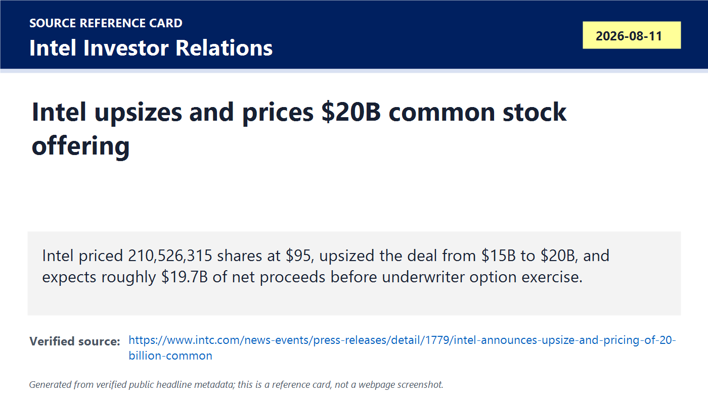
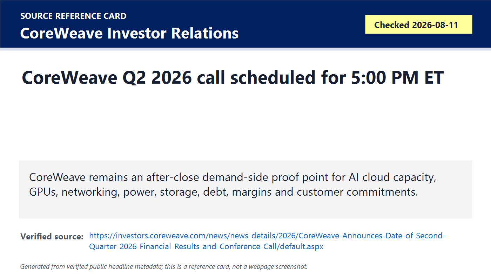
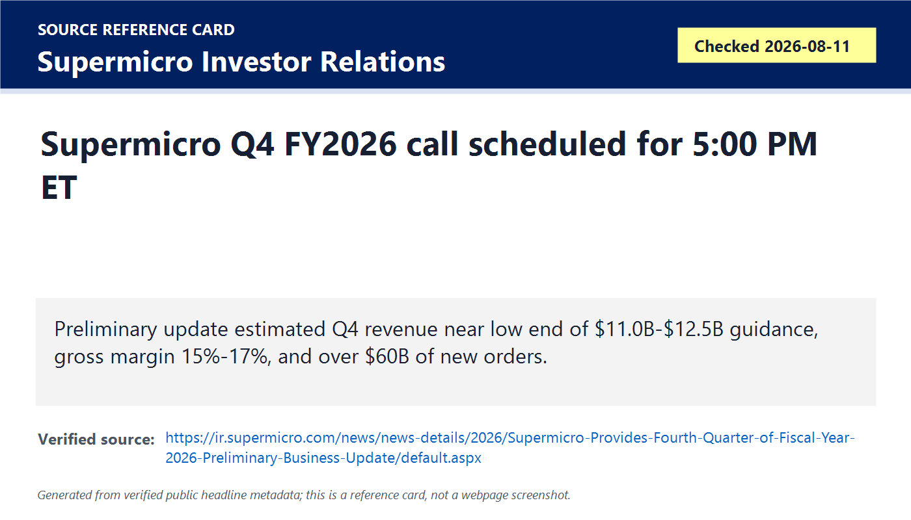
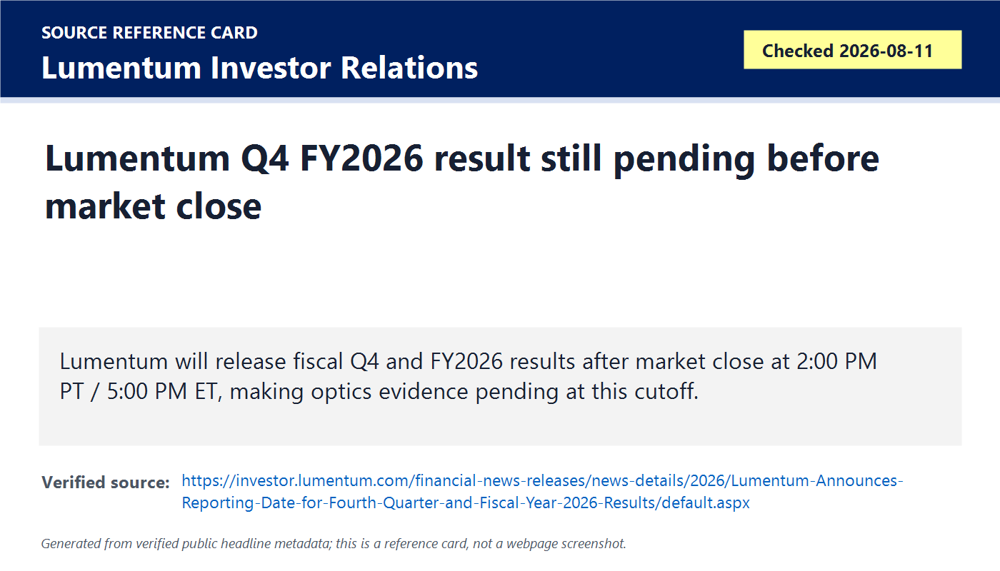
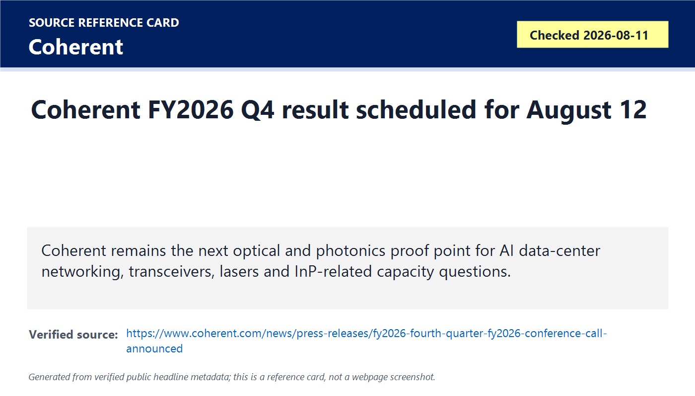
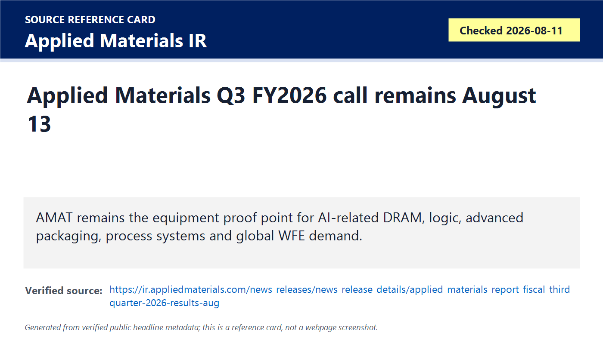
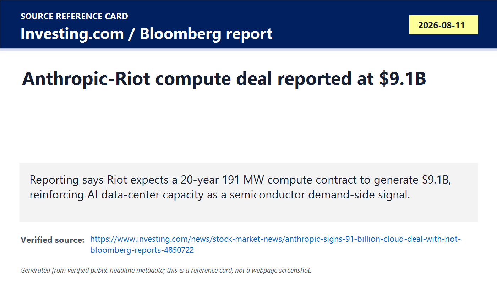
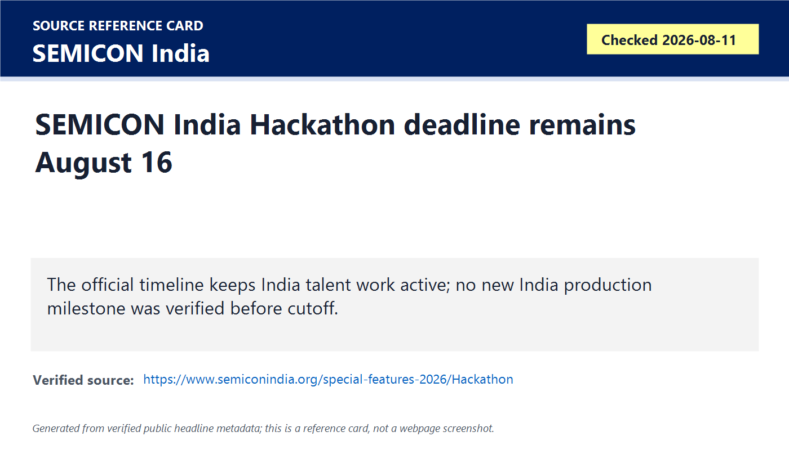
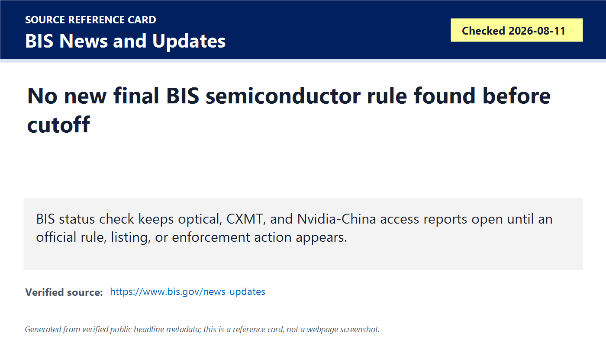

# Daily Semiconductor Current Affairs

Date: 2026-08-11

Research window: Tuesday update through the heartbeat cutoff, approximately 15:58 IST on August 11, 2026. Because several important U.S. earnings releases were scheduled after the cutoff, this note separates official early-day facts from after-close items that remain pending. The main confirmed event is Intel upsizing and pricing its equity raise to $20B. The main open proof queue is CoreWeave, Supermicro, Lumentum, Coherent, and Applied Materials, which will test AI-cloud demand, AI-server economics, optics/photonics demand, and wafer-equipment strength over August 11-13.

## Quick Index

| Date | Major Topic | Source Groups | Why To Read |
|---|---|---|---|
| 2026-08-11 | Intel upsizes and prices $20B common stock offering | Intel Investor Relations | Closes the prior proposed offering into priced terms and makes financing, dilution, capex, and foundry execution the main story. |
| 2026-08-11 | CoreWeave and Supermicro remain after-close AI infrastructure proof points | CoreWeave IR, Supermicro IR | Tests whether AI cloud and AI-server demand is real in capacity, backlog, revenue quality, margins, debt, and customer commitments. |
| 2026-08-11 | Lumentum, Coherent, and Applied Materials keep optics/equipment queue alive | Official IR pages | Optical networking and wafer-equipment evidence is still pending at this cutoff. |
| 2026-08-11 | Riot/Anthropic compute-contract reporting reinforces AI data-center demand | Investing.com / Bloomberg report | Important demand-side signal, but treated as reporting rather than official semiconductor company evidence. |
| 2026-08-11 | BIS, CXMT, Nvidia-China, and optical policy status remain open | BIS, prior reporting | No new final BIS semiconductor rule was verified before cutoff, so reported policy risks stay unresolved. |
| 2026-08-11 | India update remains SEMICON India Hackathon | SEMICON India | August 16 proposal deadline remains the concrete India VLSI action item; no new production milestone verified. |

**Page navigation:** [Sources](#source-map) · [Concept review](#concept-review) · [Follow-up](#what-to-watch-next) · [Technical terms](#technical-terms-used-today) · [Master glossary](../knowledge-base/glossary.md)

## Technical Terms / Deep Definitions

Term: Upsized offering
Definition: An upsized offering is a securities sale that is increased above the originally announced size because the issuer and underwriters decide investor demand and pricing can support a larger raise. It solves the funding problem faster by bringing in more capital in one transaction, but it can also increase dilution for existing shareholders. In today's Intel item, the offering moved from a proposed $15B to a priced $20B deal, making the financing signal stronger than the prior day's announcement. Example: a company may launch at $15B and upsize to $20B if investor demand is deep enough at the set price. Source: https://www.investor.gov/introduction-investing/investing-basics/glossary/underwriter

Term: Public offering price
Definition: Public offering price is the price per share or security at which the company sells newly issued securities to public investors in an offering. It solves the transaction problem of turning a proposed raise into exact proceeds and share count. In today's Intel item, the $95 per-share price determines how many new shares are issued and how much dilution investors face. Comparison: market price moves every trading day; public offering price is the agreed sale price for the new securities. Source: https://www.investor.gov/introduction-investing/investing-basics/glossary/prospectus

Term: Net proceeds
Definition: Net proceeds are the cash the issuer expects to receive after underwriting discounts, commissions, and offering expenses are subtracted from gross proceeds. It solves the cash-planning problem by showing how much money is actually available for capex, working capital, debt management, or other uses. In today's Intel item, estimated net proceeds of about $19.7B matter because that is the funding pool before any underwriter option exercise. Example: gross proceeds can be $20B while net proceeds are lower after transaction costs. Source: https://www.investor.gov/introduction-investing/investing-basics/glossary/prospectus

Term: Underwriter option
Definition: An underwriter option, often called an overallotment option, gives underwriters the right to buy additional shares for a limited period after an offering, usually to support transaction execution and meet extra demand. It solves the market-distribution problem when demand exceeds the base offering or stabilization is needed. In today's Intel item, the 30-day option could add more shares beyond the base 210,526,315 shares if exercised. Comparison: the base offering is already priced; the option is potential additional issuance. Source: https://www.investor.gov/introduction-investing/investing-basics/glossary/underwriter

Term: Investment-grade credit rating
Definition: An investment-grade credit rating is a bond or issuer rating that credit agencies consider lower risk than speculative-grade debt. It solves the capital-access problem because higher-rated issuers can often borrow more cheaply and from a wider investor base. In today's Intel context, equity financing matters partly because semiconductor companies must manage credit profile, debt cost, and capex needs together. Example: raising equity may protect borrowing capacity but dilutes shareholders; raising debt avoids dilution but can pressure ratings and interest expense. Source: https://www.investor.gov/introduction-investing/investing-basics/glossary/bond-rating

Term: AI cloud capacity
Definition: AI cloud capacity is the deployed computing, networking, storage, power, cooling, and software infrastructure available to rent or use for AI training and inference. It solves the demand problem for customers that need GPUs or accelerators without building their own data centers. In today's CoreWeave and Riot/Anthropic items, capacity matters because semiconductor demand becomes revenue only when chips turn into usable compute. Comparison: a GPU shipment is component supply; AI cloud capacity is installed, powered, networked, and sellable compute. Source: https://investors.coreweave.com/news/news-details/2026/CoreWeave-Announces-Date-of-Second-Quarter-2026-Financial-Results-and-Conference-Call/default.aspx

Term: After-market earnings release
Definition: An after-market earnings release is a company result published after the stock exchange closes for regular trading. It solves the disclosure-timing problem by giving investors time to read numbers before the next full trading session, but it means an early-day notebook must mark the result pending if the release has not occurred yet. In today's note, CoreWeave, Supermicro, and Lumentum are after-close proof points, so their final numbers are not included before the cutoff. Example: a 5:00 PM ET call occurs after the U.S. market close and after this India-time daily run. Source: https://www.sec.gov/edgar/browse/

Term: Data-center building-block solution
Definition: A data-center building-block solution is a modular server or rack architecture made from configurable compute, GPU, storage, networking, power, cooling, motherboard, chassis, and software components. It solves the customization and time-to-market problem because customers can assemble systems for different AI, enterprise, storage, or edge workloads without redesigning every platform. In today's Supermicro watch, the term matters because backlog and margins depend on which customer and product blocks are being delivered. Comparison: a single server SKU is fixed; a building-block platform is a reusable menu of system pieces. Source: https://ir.supermicro.com/news/news-details/2026/Supermicro-Provides-Fourth-Quarter-of-Fiscal-Year-2026-Preliminary-Business-Update/default.aspx

Term: Gross margin
Definition: Gross margin is revenue minus cost of goods sold, expressed as a percentage of revenue. It solves the profitability-quality problem by showing how much money remains after direct product costs before operating expenses, interest, and taxes. In today's Supermicro preliminary update, gross margin matters because the company estimated 15%-17%, far above earlier guidance, due to favorable customer and product mix. Example: high revenue with low gross margin can mean weak pricing power; improving gross margin can show better mix or cost control. Source: https://www.investor.gov/introduction-investing/investing-basics/glossary/gross-margin

Term: Backlog
Definition: Backlog is customer orders or commitments received but not yet recognized as revenue because delivery, acceptance, or performance obligations are still pending. It solves the visibility problem by showing demand that may convert into future revenue, but it can be affected by cancellations, delays, terms, and customer concentration. In today's Supermicro update, backlog matters because more than $60B of new orders would be a major AI-server signal, but the company also warned some orders may not be firm commitments. Comparison: revenue is already recognized; backlog is future execution risk. Source: https://www.sec.gov/oiea/investor-alerts-and-bulletins/ib_revenue

Term: Preliminary unaudited results
Definition: Preliminary unaudited results are early company estimates released before the full accounting close, audit, review, and filing process is complete. They solve the timeliness problem by giving investors a fast update, but they can change after final procedures. In today's Supermicro item, preliminary results matter because revenue, gross margin, and backlog are important, but the company explicitly warned that final results may differ. Example: preliminary revenue near a guidance range is useful evidence but not a filed 10-K or 10-Q. Source: https://www.sec.gov/edgar/browse/

Term: Export-control review
Definition: An export-control review is an internal, board, regulator, or legal examination of whether transactions complied with rules governing exports, reexports, transfers, end users, destinations, and controlled technology. It solves the compliance-risk problem by investigating whether shipments or services may have violated legal restrictions. In today's Supermicro item, the review matters because the company said alleged export-control issues could affect forecasts, preliminary results, and prior-period results. Example: a strong backlog can still carry risk if some customers or destinations raise compliance concerns. Source: https://www.bis.gov/licensing

Term: Optical transceiver
Definition: An optical transceiver is a module that converts electrical data signals into optical signals and back, usually for high-speed network links between switches, servers, and data centers. It solves the distance and bandwidth problem because copper links become too lossy and power-hungry at high speeds and longer reaches. In today's Lumentum and Coherent watch, transceivers matter because AI clusters need massive low-latency network bandwidth between accelerators and racks. Comparison: copper is useful for short electrical links; optical modules move data farther and faster with different cost, thermal, and supply-chain constraints. Source: https://www.oiforum.com/technical-work/hot-topics/800g/

Term: InP supply chain
Definition: The InP supply chain covers indium phosphide wafers, epitaxy, photonic devices, lasers, detectors, packaging, testing, and module assembly used in high-speed optical communications. It solves the material problem that silicon cannot efficiently emit light for many laser-based data-center and telecom functions. In today's optics queue, InP matters because prior reporting raised China-linked optical supply-chain risk and upcoming optical earnings may show whether demand or constraints are visible. Comparison: silicon dominates CMOS logic; InP is specialized for optoelectronic functions. Source: https://www.rp-photonics.com/indium_phosphide.html

Term: Compute contract
Definition: A compute contract is an agreement to provide computing capacity, often measured by power, GPUs, servers, location, duration, and service obligations, to a customer over time. It solves the capacity-assurance problem for AI companies that need guaranteed infrastructure rather than spot-market access. In today's Riot/Anthropic reporting, the reported 20-year arrangement matters because it would turn semiconductor hardware demand into long-lived data-center service revenue if executed. Example: buying GPUs is a component purchase; signing a compute contract secures access to installed infrastructure. Source: https://www.sec.gov/oiea/investor-alerts-and-bulletins/ib_analystreports

Term: Power capacity
Definition: Power capacity is the amount of electrical power a facility can reliably deliver to compute, cooling, networking, storage, and support systems, often expressed in megawatts. It solves the deployment bottleneck problem because AI hardware is useless without enough grid connection, backup power, cooling, and facility infrastructure. In today's Riot/Anthropic report, 191 MW matters because power availability is now one of the limiting variables for AI-chip deployment. Comparison: a chip data sheet gives watts per device; data-center power capacity determines how many devices can be installed and operated. Source: https://www.opencompute.org/projects/rack-and-power

Term: Demand-side proof point
Definition: A demand-side proof point is evidence from customers, cloud operators, system builders, or downstream buyers showing that they are ordering, deploying, or monetizing semiconductor-based systems. It solves the research problem of separating supplier optimism from actual customer pull. In today's CoreWeave, Supermicro, and Riot/Anthropic items, demand-side proof matters because AI chip demand must be absorbed by data centers, cloud contracts, power systems, servers, networking, and customers. Example: TSMC revenue is manufacturing-side evidence; CoreWeave usage, Supermicro backlog, or a compute contract is demand-side evidence. Source: https://www.sec.gov/oiea/investor-alerts-and-bulletins/ib_analystreports

Term: Official status check
Definition: An official status check is a deliberate review of regulator, company, standards-body, or filing pages to verify whether a reported event has become a formal disclosure, rule, filing, or enforcement action. It solves the research-quality problem of not treating rumors, analyst notes, drafts, or media reports as completed facts. In today's BIS item, official status checking matters because optical, CXMT, and Nvidia-China access reports remain unresolved until official text appears. Comparison: a news report can move stocks; a BIS rule changes compliance duties. Source: https://www.bis.gov/news-updates

## Source Images

## Source Map

| Item | Source | Date | Link | Use In This Note |
|---|---|---|---|---|
| Intel upsized and priced offering | Intel Investor Relations | Aug. 11, 2026 | https://www.intc.com/news-events/press-releases/detail/1779/intel-announces-upsize-and-pricing-of-20-billion-common | Official pricing, share count, $20B size, net proceeds, and underwriter option. |
| CoreWeave Q2 schedule | CoreWeave Investor Relations | Checked Aug. 11, 2026 | https://investors.coreweave.com/news/news-details/2026/CoreWeave-Announces-Date-of-Second-Quarter-2026-Financial-Results-and-Conference-Call/default.aspx | Official after-close AI-cloud earnings checkpoint; result not available at cutoff. |
| Supermicro preliminary Q4 update | Supermicro Investor Relations | Checked Aug. 11, 2026 | https://ir.supermicro.com/news/news-details/2026/Supermicro-Provides-Fourth-Quarter-of-Fiscal-Year-2026-Preliminary-Business-Update/default.aspx | Official preliminary AI-server revenue, margin, backlog, schedule, and export-control review context. |
| Lumentum Q4 schedule | Lumentum Investor Relations | Checked Aug. 11, 2026 | https://investor.lumentum.com/financial-news-releases/news-details/2026/Lumentum-Announces-Reporting-Date-for-Fourth-Quarter-and-Fiscal-Year-2026-Results/default.aspx | Official after-close optical/photonics result schedule; result pending at cutoff. |
| Coherent FY2026 Q4 schedule | Coherent | Checked Aug. 11, 2026 | https://www.coherent.com/news/press-releases/fy2026-fourth-quarter-fy2026-conference-call-announced | Official August 12 photonics/optics result schedule. |
| Applied Materials Q3 schedule | Applied Materials Investor Relations | Checked Aug. 11, 2026 | https://ir.appliedmaterials.com/news-releases/news-release-details/applied-materials-report-fiscal-third-quarter-2026-results-aug | Official August 13 wafer-equipment result schedule. |
| Anthropic-Riot compute deal report | Investing.com / Bloomberg report | Aug. 11, 2026 | https://www.investing.com/news/stock-market-news/anthropic-signs-91-billion-cloud-deal-with-riot-bloomberg-reports-4850722 | Reputable reporting used as an AI data-center capacity signal, not official semiconductor supplier evidence. |
| SEMICON India Hackathon | SEMICON India | Checked Aug. 11, 2026 | https://www.semiconindia.org/special-features-2026/Hackathon | Official India VLSI talent timeline and August 16 proposal deadline. |
| BIS policy status check | BIS News and Updates | Checked Aug. 11, 2026 | https://www.bis.gov/news-updates | Official status check; no new final semiconductor rule verified before cutoff. |

## Deep Briefing

### 1. Intel turns the proposed equity raise into a priced $20B transaction

**Confirmed facts:** Intel announced on August 11 that it priced 210,526,315 shares of common stock at $95.00 per share. The offering was upsized from the previously announced $15B to $20B. Intel said underwriters have a 30-day option to buy up to 31,578,947 additional shares. The company expects the offering to close on August 12 and expects net proceeds of about $19.7B if the option is not exercised. The stated use remains general corporate purposes, including capital expenditures and working capital.

**Analysis:** This updates and mostly closes the August 10 financing item. The important change is that the market now has exact terms: size, price, share count, and expected net proceeds. For Intel, the capital can support fab investments, process execution, foundry ambitions, advanced packaging, AI-compute capacity, inventory, and working capital. For shareholders, the tradeoff is dilution. A $20B equity raise can strengthen the balance sheet, but it also raises the bar: management now needs to convert capital into manufacturing milestones, customer wins, margin improvement, and credible external-wafer revenue.

**Why it matters:** Intel is one of the few companies trying to be both a major chip designer and a leading-edge manufacturer for itself and outside customers. That strategy requires huge capex before proof arrives. Today's offering is therefore not a side issue; it is a core semiconductor event because process technology, yield ramp, advanced packaging, and customer qualification all depend on sustained funding.

**India angle:** India's semiconductor policy should treat Intel's raise as a realistic benchmark for fab economics. Even in the U.S., with a major incumbent manufacturer, leading-edge manufacturing needs tens of billions in capital. India can still build meaningful value in OSAT/ATMP, design, verification, EDA services, equipment components, materials, and electronics manufacturing while long-cycle fab capacity develops.

**VLSI/career relevance:** When reading a fab roadmap, ask: how is it funded, what tools are needed, what yield evidence exists, who are the customers, and when does revenue start? VLSI engineering is tied to capital allocation because advanced nodes and advanced packaging are physically expensive.

### 2. CoreWeave and Supermicro are the after-close AI infrastructure tests

**Confirmed facts:** CoreWeave's official investor page says its Q2 2026 conference call is scheduled for August 11 at 5:00 PM Eastern Time. At this notebook cutoff, the result was not yet available. Supermicro's official preliminary update, published July 21, schedules its Q4/full-year fiscal 2026 call for August 11 at 5:00 PM ET. Supermicro estimated Q4 revenue near the low end of its $11.0B-$12.5B guidance, estimated GAAP and non-GAAP gross margins of 15%-17%, and said backlog rose to record levels with more than $60B of new orders in Q4. The company cautioned that the data is preliminary and unaudited, that some orders may be cancellable or delayed, and that a board review of alleged export-control issues could affect forecasts, preliminary results, and prior results.

**Analysis:** These two names test AI infrastructure from different directions. CoreWeave tests AI-cloud demand, financing, utilization, customer concentration, depreciation, interest costs, and how quickly expensive GPU clusters turn into revenue. Supermicro tests AI-server and rack demand, but its preliminary update already shows the quality question: backlog can be huge while revenue timing, margin, customer mix, firm commitments, and compliance review remain critical.

**Why it matters:** AI-chip demand is not proven only when Nvidia, AMD, TSMC, or memory suppliers report strong numbers. It is proven downstream when cloud providers and server builders can deploy, sell, and support systems profitably. If CoreWeave shows capacity demand but weak cash economics, the AI cycle may be supply-strong but financially stretched. If Supermicro shows huge backlog but uncertain revenue conversion or export-control risk, the system-build layer remains risky.

**India angle:** India needs this demand-side lens for its own AI and semiconductor planning. GPU access, data-center power, cloud contracts, server integration, networking, and compliance determine whether India can turn AI software ambition into deployed compute. Local VLSI talent also needs to understand server systems, not only chip blocks.

**VLSI/career relevance:** A chip does not succeed alone. It must sit inside a board, rack, thermal envelope, power budget, network topology, firmware stack, and support model. Study PCIe/CXL, SerDes, memory hierarchy, power integrity, DFT, thermal design, and system validation together.

### 3. Optics and equipment remain the next official semiconductor evidence points

**Confirmed facts:** Lumentum's official page says it will release fiscal Q4 and full-year 2026 results on August 11 after the market closes, with a 2:00 PM PT / 5:00 PM ET webcast. Coherent's official page says it will release results for the quarter ended June 30, 2026 on August 12 after the NYSE closes, followed by a 4:30 PM ET webcast. Applied Materials remains scheduled to report fiscal Q3 2026 results on August 13.

**Analysis:** The next three releases test whether AI infrastructure demand is spreading into the physical layers that make clusters possible. Lumentum and Coherent test optical components, lasers, photonics, transceivers, and material constraints. Applied Materials tests wafer-fabrication-equipment demand, which is the front-end capacity and process-control side of the cycle. These are different from GPU designer earnings, and that difference matters. AI demand can be strong while optics, WFE, or packaging capacity becomes the bottleneck.

**Why it matters:** The AI buildout requires a chain: foundry wafers, memory stacks, packaging, server boards, optical links, racks, data-center power, cooling, and cloud customers. Any weak link can slow revenue recognition or system deployment.

**India angle:** Optics, equipment components, test, precision manufacturing, and materials are plausible India ecosystem opportunities. The country does not need to own every leading-edge transistor step to participate, but it needs measurable supplier qualification and customer proof.

**VLSI/career relevance:** Add optical interconnects and manufacturing equipment to your revision map. For chip design interviews, understand why SerDes, retimers, CPO, transceivers, WFE, process variation, and metrology all affect AI system scaling.

### 4. Riot/Anthropic reporting reinforces power and compute as semiconductor demand signals

**Confirmed facts:** Investing.com, citing Bloomberg reporting, said Anthropic signed a $9.1B cloud deal with Riot. The report describes a 20-year arrangement involving 191 MW of compute capacity and says extension options could bring the contract value to $16.1B. This is treated as reputable reporting, not as an official semiconductor company release.

**Analysis:** The important point is not Riot alone. The important point is that AI demand is increasingly expressed as long-duration compute and power commitments. AI labs need guaranteed capacity. Data-center operators need power, cooling, land, financing, construction, networking, servers, accelerators, storage, and customers. A 191 MW reported contract is a semiconductor signal because it can imply future demand for GPUs or accelerators, HBM, networking chips, optical modules, SSD/HDD storage, power semiconductors, switchgear, cooling, and server integration.

**Why it matters:** The AI-chip cycle is constrained by power and deployment speed as much as by chip design. If AI labs keep signing long-term capacity deals, the semiconductor demand chain stays supported. If power or financing fails, chip orders can slow even if model demand is high.

**India angle:** India must treat power capacity as part of semiconductor and AI infrastructure policy. AI cloud capacity in India will require reliable grid access, power electronics, cooling, data-center sites, optical connectivity, and financing. This connects chips to energy policy.

**VLSI/career relevance:** Learn power at multiple levels: transistor power, SoC power domains, board VRMs, rack power, data-center megawatts, and thermal limits. AI infrastructure is one continuous power-delivery problem from silicon to grid.

### 5. Policy and memory follow-ups remain unresolved at the official-source level

**Confirmed facts:** BIS News and Updates was checked again before this note's cutoff. No newer final BIS semiconductor rule, optical-transceiver rule, CXMT action, or Nvidia-China access rule was verified. The Apple-CXMT memory story from August 10 remains reported, not confirmed by Apple or CXMT. The Nvidia/HBM memory-content item remains market/analyst reporting, not an official Nvidia roadmap disclosure.

**Analysis:** This is the core evidence-discipline rule for today's notebook. Policy risk can be real before it is final, and supplier testing can be real before a production award. But a student or analyst should label these stages correctly. Reports move expectations; official rules and company disclosures change compliance duties, supplier status, and production facts.

**Why it matters:** Export controls now influence chip design, HBM variants, performance thresholds, country-specific products, data-center access, resale, EDA availability, and supply-chain routing. But acting as if every report is final creates bad analysis.

**India angle:** India can benefit from diversification, but only if firms build compliance maturity. Semiconductor participation requires end-user checks, export-control literacy, supplier documentation, customer qualification, and data-center governance.

**VLSI/career relevance:** In interviews, say what is confirmed and what is not. A precise answer is stronger than an exciting answer. For example: "BIS has not issued a new final rule at this cutoff; the item remains a reported policy risk."

### 6. India update: the hackathon deadline remains the practical action

**Confirmed facts:** SEMICON India Hackathon's official page lists registration and proposal submission on August 16, with challenge areas including chip design, AI-enabled semiconductor manufacturing, yield optimisation, AI in EDA, and advanced verification. No new India fab, OSAT production, tool-install, qualification, or shipment milestone was verified before the cutoff.

**Analysis:** This remains a talent pipeline update rather than production evidence. The useful thing is that the problem areas map directly to VLSI study. A strong proposal should define a semiconductor-specific problem, use a real dataset or realistic simulation, and show how the output will be verified.

**Why it matters:** Current affairs should convert into action. If you want to review everything from today onward, this is the kind of item that should become a project idea, not just a news note.

**India angle:** The strongest India framing is practical: pick one challenge area, define a project, and make it measurable by August 16.

**VLSI/career relevance:** Better proposal examples include automated coverage-gap detection for SystemVerilog testbenches, wafer-map anomaly classification, EDA log triage, IR-drop risk prediction, package-test yield analysis, or AI-assisted RTL linting. Avoid generic "AI app" framing.

## Follow-Up Ledger

| Prior item | Status on 2026-08-11 | Evidence |
|---|---|---|
| Intel funding and foundry execution | Updated: proposed $15B offering is now a priced $20B offering; expected close on August 12 remains a final settlement watch | Intel Investor Relations |
| TSMC July monthly revenue | Closed from August 10; next monthly revenue watch moves to August sales in September | TSMC Investor Relations |
| Ceva IP earnings watch | Closed from August 10; future follow-up is royalty conversion and named customer/product evidence | Ceva Investor Relations |
| CoreWeave AI-cloud demand | Still pending at cutoff: Q2 call scheduled for August 11 after market close | CoreWeave Investor Relations |
| Supermicro AI-server backlog/margin | Still pending at cutoff for final Q4 call; preliminary update remains useful but unaudited and tied to export-control review risk | Supermicro Investor Relations |
| Lumentum optical earnings | Still pending at cutoff: result scheduled after market close on August 11 | Lumentum Investor Relations |
| Coherent optical earnings | Still pending: result scheduled for August 12 after NYSE close | Coherent |
| Applied Materials WFE earnings | Still pending: Q3 FY2026 result scheduled for August 13 | Applied Materials Investor Relations |
| Optical-transceiver policy risk | Still pending: no new final BIS/FCC rule verified before cutoff | BIS |
| Apple-CXMT memory report | Still pending: reporting only; no official Apple/CXMT supplier award verified | WSJ/MacRumors |
| Nvidia Rubin/HBM memory-content report | Still pending: market/analyst reporting only; no official Nvidia roadmap change verified | MarketWatch |
| HBF/OCP standard | Still pending: no public latency, endurance, software-placement, samples, or customer-adoption proof verified today | Prior SK hynix/Sandisk/OCP context |
| Astera Scorpio ramp | Still pending: no new customer shipment or Q3 ramp metric verified today | Prior Astera context |
| SEMI AI manufacturing workshop | Still pending: no public customer case-study metrics found today | SEMI prior context |
| India ecosystem watch | Updated but not closed: SEMICON India Hackathon proposal deadline remains August 16; no new production milestone today | SEMICON India |

## Concept Review

| Concept | Deep Definition | Why It Matters In This News | Revise Next | Source |
|---|---|---|---|---|
| Semiconductor financing discipline | Fab and packaging plans need large capital before full technical proof arrives, so funding structure becomes part of semiconductor execution risk. | Intel's $20B priced offering gives capital but increases dilution and execution pressure. | Equity vs debt, capex, yield ramp, external customer wafers. | https://www.intc.com/news-events/press-releases/detail/1779/intel-announces-upsize-and-pricing-of-20-billion-common |
| AI infrastructure proof chain | AI demand must be verified across cloud capacity, server backlog, optical networking, power, storage, equipment, and customer contracts, not only chip shipments. | CoreWeave, Supermicro, Lumentum, Coherent, AMAT, and Riot/Anthropic all test different downstream layers. | GPU clusters, data-center power, optics, server racks, WFE. | https://investors.coreweave.com/news/news-details/2026/CoreWeave-Announces-Date-of-Second-Quarter-2026-Financial-Results-and-Conference-Call/default.aspx |
| Backlog quality | Backlog is useful only if orders are firm, deliverable, profitable, compliant, and not concentrated in fragile customers. | Supermicro reported record backlog but also warned about preliminary data, order terms, and export-control review risk. | Revenue recognition, customer concentration, cancellation risk, compliance. | https://ir.supermicro.com/news/news-details/2026/Supermicro-Provides-Fourth-Quarter-of-Fiscal-Year-2026-Preliminary-Business-Update/default.aspx |
| Power as a semiconductor constraint | AI chips require facility-level power, cooling, networking, and construction before they become usable compute. | The reported Riot/Anthropic 191 MW deal shows semiconductor demand translating into power-constrained capacity. | Rack power, VRMs, thermal design, data-center grid access. | https://www.opencompute.org/projects/rack-and-power |
| Official-source cutoff discipline | Notes should label whether an item is official, reported, scheduled, preliminary, or pending at the research cutoff. | Today's after-close releases remain pending in this note because they occur after the heartbeat cutoff. | IR calendars, SEC filings, BIS, Federal Register, source hierarchy. | https://www.sec.gov/edgar/browse/ |

## Simple Explanation

August 11 is a financing and proof-queue day. Intel's raise is no longer just proposed: it is priced as a $20B common-stock offering at $95 per share, with about $19.7B expected net proceeds before any underwriter option. That gives Intel money for capex and working capital, but it also dilutes shareholders and raises execution pressure. CoreWeave, Supermicro, and Lumentum report after the cutoff, so they stay pending today. Coherent and Applied Materials are still scheduled for August 12 and 13. A reported Riot/Anthropic compute deal shows AI demand also depends on data-center power and long-term capacity contracts. BIS has no new final semiconductor rule verified before cutoff. India remains focused on the SEMICON India Hackathon deadline of August 16.

## Interview Questions

1. Why is Intel's August 11 announcement stronger evidence than its August 10 proposed offering?
2. What is dilution, and why can it be acceptable if capex produces future revenue?
3. Why should CoreWeave and Supermicro be treated as demand-side proof points rather than chipmaker proof points?
4. What are the risks in using backlog as evidence of future semiconductor demand?
5. Why are optical transceivers and InP materials important for AI clusters?
6. How can a 191 MW compute contract affect demand for GPUs, memory, optics, storage, and power semiconductors?
7. Why does an after-market earnings release remain pending in an India-time afternoon notebook?
8. What source would convert the Apple-CXMT or Nvidia-China story from reported risk into confirmed fact?
9. How would you turn the SEMICON India Hackathon challenge areas into one measurable project?

## What To Watch Next

1. Intel offering close on August 12 and any final net proceeds or option exercise disclosure.
2. CoreWeave Q2 2026 after-close result: revenue, utilization, capex, debt, customer concentration, margins, guidance, and contracted capacity.
3. Supermicro Q4 FY2026 final result: revenue versus preliminary range, gross margin quality, backlog conversion, customer mix, and export-control review status.
4. Lumentum Q4 FY2026 result after market close for AI optical demand, margin, inventory, capacity, China exposure, and InP/photonics signals.
5. Coherent FY2026 Q4 result on August 12 for broader photonics and optical networking confirmation.
6. Applied Materials Q3 FY2026 result on August 13 for WFE demand, AI DRAM, logic, advanced packaging, China mix, and order/guidance quality.
7. BIS, FCC, Federal Register, Entity List, or enforcement updates tied to optical transceivers, CXMT, or Nvidia-China access.
8. SEMICON India Hackathon proposal submission by August 16.

## Technical Terms Used Today

[Back to quick index](#quick-index) · [Open the master A-Z glossary](../knowledge-base/glossary.md)

**Term index:** [After-market earnings release](#daily-term-after-market-earnings-release) · [AI cloud capacity](#daily-term-ai-cloud-capacity) · [Backlog](#daily-term-backlog) · [Compute contract](#daily-term-compute-contract) · [Data-center building-block solution](#daily-term-data-center-building-block-solution) · [Demand-side proof point](#daily-term-demand-side-proof-point) · [Export-control review](#daily-term-export-control-review) · [Gross margin](#daily-term-gross-margin) · [InP supply chain](#daily-term-inp-supply-chain) · [Investment-grade credit rating](#daily-term-investment-grade-credit-rating) · [Net proceeds](#daily-term-net-proceeds) · [Official status check](#daily-term-official-status-check) · [Optical transceiver](#daily-term-optical-transceiver) · [Power capacity](#daily-term-power-capacity) · [Preliminary unaudited results](#daily-term-preliminary-unaudited-results) · [Public offering price](#daily-term-public-offering-price) · [Underwriter option](#daily-term-underwriter-option) · [Upsized offering](#daily-term-upsized-offering)

| Term | Meaning |
|---|---|
| [**After-market earnings release**](../knowledge-base/glossary.md#term-after-market-earnings-release) | An after-market earnings release is a company result published after the stock exchange closes for regular trading. It solves the disclosure-timing problem by giving investors time to read numbers before the next full trading session, but it means an early-day notebook must mark the result pending if the release has not occurred yet. |
| [**AI cloud capacity**](../knowledge-base/glossary.md#term-ai-cloud-capacity) | AI cloud capacity is the deployed computing, networking, storage, power, cooling, and software infrastructure available to rent or use for AI training and inference. It solves the demand problem for customers that need GPUs or accelerators without building their own data centers. |
| [**Backlog**](../knowledge-base/glossary.md#term-backlog) | Backlog is customer orders or commitments received but not yet recognized as revenue because delivery, acceptance, or performance obligations are still pending. It solves the visibility problem by showing demand that may convert into future revenue, but it can be affected by cancellations, delays, terms, and customer concentration. |
| [**Compute contract**](../knowledge-base/glossary.md#term-compute-contract) | A compute contract is an agreement to provide computing capacity, often measured by power, GPUs, servers, location, duration, and service obligations, to a customer over time. It solves the capacity-assurance problem for AI companies that need guaranteed infrastructure rather than spot-market access. |
| [**Data-center building-block solution**](../knowledge-base/glossary.md#term-data-center-building-block-solution) | A data-center building-block solution is a modular server or rack architecture made from configurable compute, GPU, storage, networking, power, cooling, motherboard, chassis, and software components. It solves the customization and time-to-market problem because customers can assemble systems for different AI, enterprise, storage, or edge workloads without redesigning every platform. |
| [**Demand-side proof point**](../knowledge-base/glossary.md#term-demand-side-proof-point) | A demand-side proof point is evidence from customers, cloud operators, system builders, or downstream buyers showing that they are ordering, deploying, or monetizing semiconductor-based systems. It solves the research problem of separating supplier optimism from actual customer pull. |
| [**Export-control review**](../knowledge-base/glossary.md#term-export-control-review) | An export-control review is an internal, board, regulator, or legal examination of whether transactions complied with rules governing exports, reexports, transfers, end users, destinations, and controlled technology. It solves the compliance-risk problem by investigating whether shipments or services may have violated legal restrictions. |
| [**Gross margin**](../knowledge-base/glossary.md#term-gross-margin) | Gross margin is revenue minus cost of goods sold, expressed as a percentage of revenue. It solves the profitability-quality problem by showing how much money remains after direct product costs before operating expenses, interest, and taxes. |
| [**InP supply chain**](../knowledge-base/glossary.md#term-inp-supply-chain) | The InP supply chain covers indium phosphide wafers, epitaxy, photonic devices, lasers, detectors, packaging, testing, and module assembly used in high-speed optical communications. It solves the material problem that silicon cannot efficiently emit light for many laser-based data-center and telecom functions. |
| [**Investment-grade credit rating**](../knowledge-base/glossary.md#term-investment-grade-credit-rating) | An investment-grade credit rating is a bond or issuer rating that credit agencies consider lower risk than speculative-grade debt. It solves the capital-access problem because higher-rated issuers can often borrow more cheaply and from a wider investor base. |
| [**Net proceeds**](../knowledge-base/glossary.md#term-net-proceeds) | Net proceeds are the cash the issuer expects to receive after underwriting discounts, commissions, and offering expenses are subtracted from gross proceeds. It solves the cash-planning problem by showing how much money is actually available for capex, working capital, debt management, or other uses. |
| [**Official status check**](../knowledge-base/glossary.md#term-official-status-check) | An official status check is a deliberate review of regulator, company, standards-body, or filing pages to verify whether a reported event has become a formal disclosure, rule, filing, or enforcement action. It solves the research-quality problem of not treating rumors, analyst notes, drafts, or media reports as completed facts. |
| [**Optical transceiver**](../knowledge-base/glossary.md#term-optical-transceiver) | An optical transceiver is a module that converts electrical data signals into optical signals and back, usually for high-speed network links between switches, servers, and data centers. It solves the distance and bandwidth problem because copper links become too lossy and power-hungry at high speeds and longer reaches. |
| [**Power capacity**](../knowledge-base/glossary.md#term-power-capacity) | Power capacity is the amount of electrical power a facility can reliably deliver to compute, cooling, networking, storage, and support systems, often expressed in megawatts. It solves the deployment bottleneck problem because AI hardware is useless without enough grid connection, backup power, cooling, and facility infrastructure. |
| [**Preliminary unaudited results**](../knowledge-base/glossary.md#term-preliminary-unaudited-results) | Preliminary unaudited results are early company estimates released before the full accounting close, audit, review, and filing process is complete. They solve the timeliness problem by giving investors a fast update, but they can change after final procedures. |
| [**Public offering price**](../knowledge-base/glossary.md#term-public-offering-price) | Public offering price is the price per share or security at which the company sells newly issued securities to public investors in an offering. It solves the transaction problem of turning a proposed raise into exact proceeds and share count. |
| [**Underwriter option**](../knowledge-base/glossary.md#term-underwriter-option) | An underwriter option, often called an overallotment option, gives underwriters the right to buy additional shares for a limited period after an offering, usually to support transaction execution and meet extra demand. It solves the market-distribution problem when demand exceeds the base offering or stabilization is needed. |
| [**Upsized offering**](../knowledge-base/glossary.md#term-upsized-offering) | An upsized offering is a securities sale that is increased above the originally announced size because the issuer and underwriters decide investor demand and pricing can support a larger raise. It solves the funding problem faster by bringing in more capital in one transaction, but it can also increase dilution for existing shareholders. |

This page-end index covers the specialist terms central to this day's study. The fuller explanation, news context, and source remain at first use; the master glossary combines repeated terms across all days.
