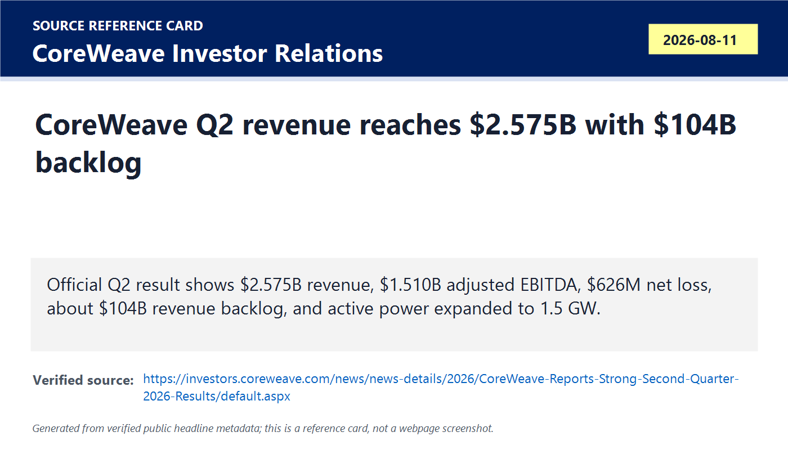
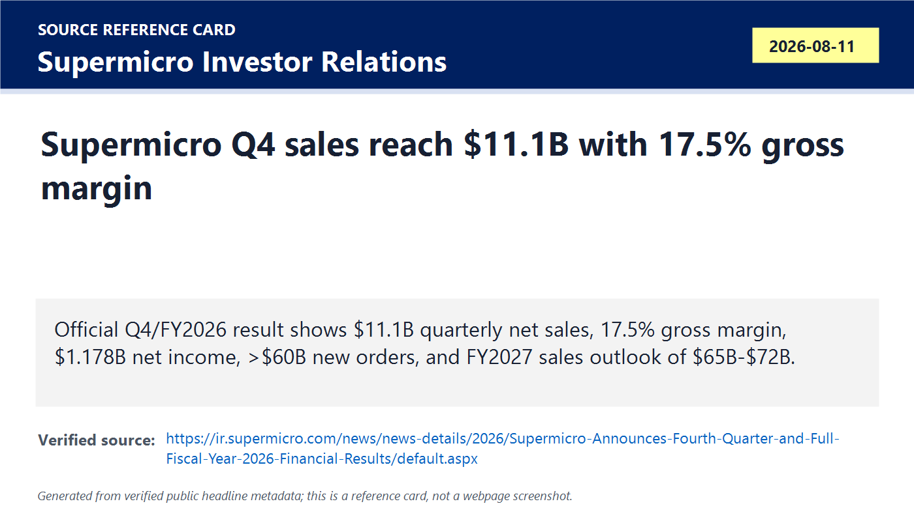
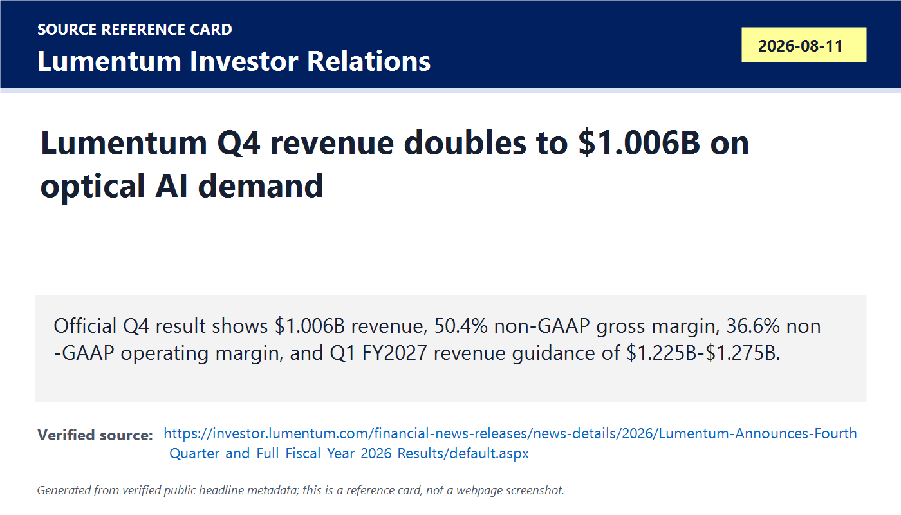
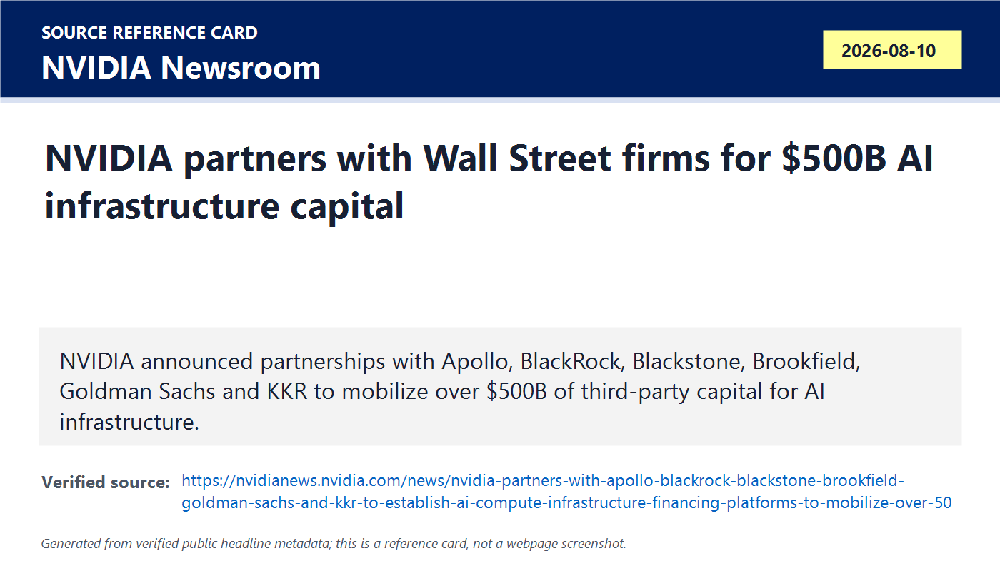
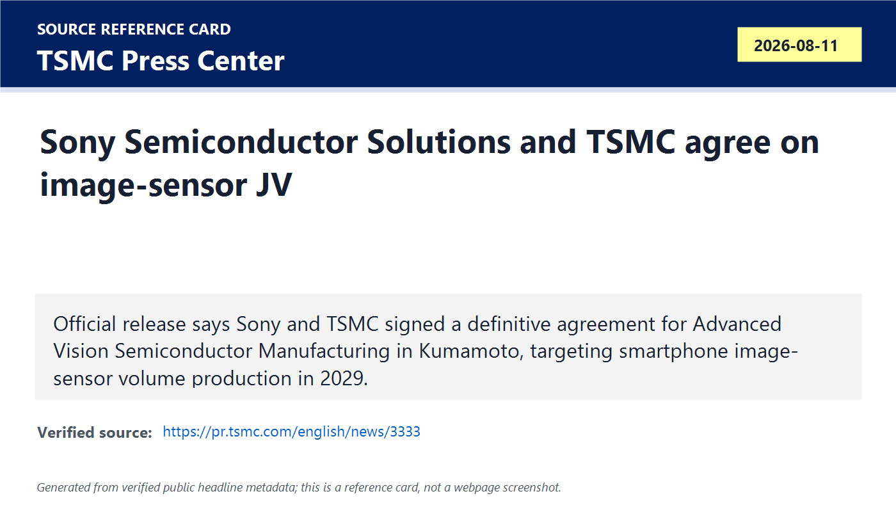
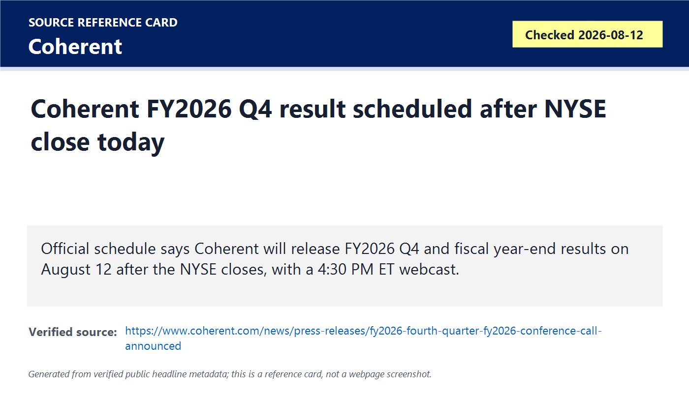
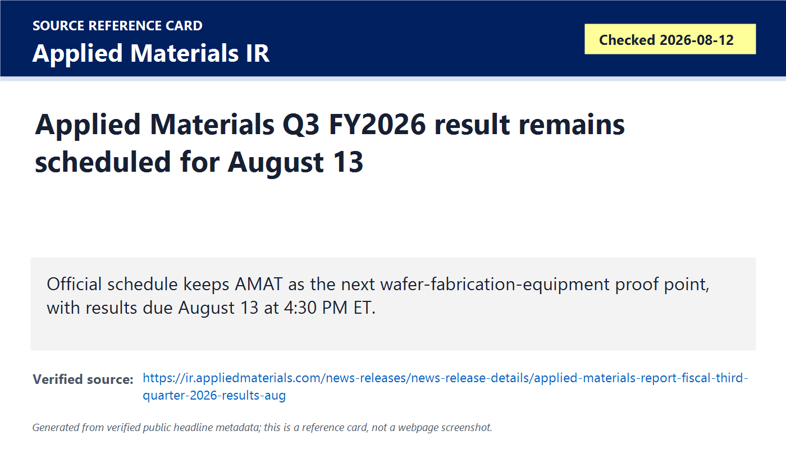
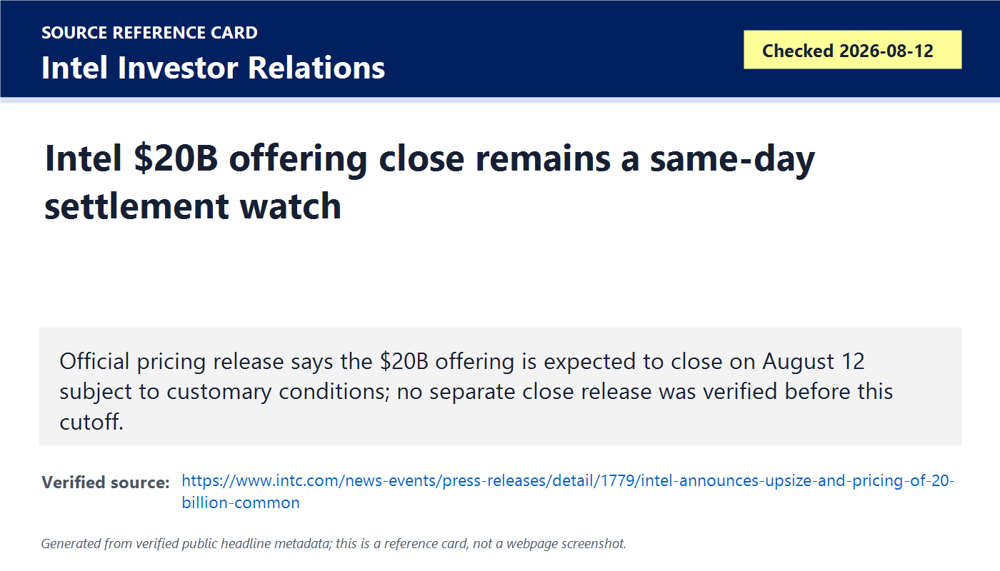
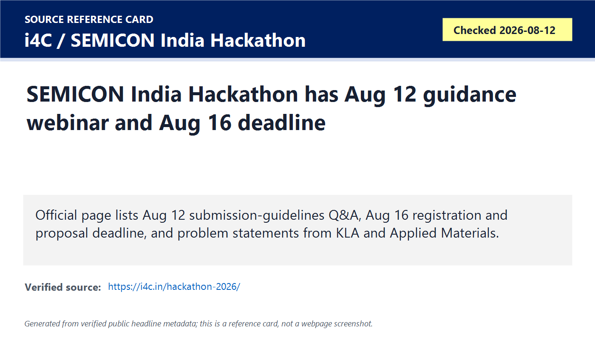
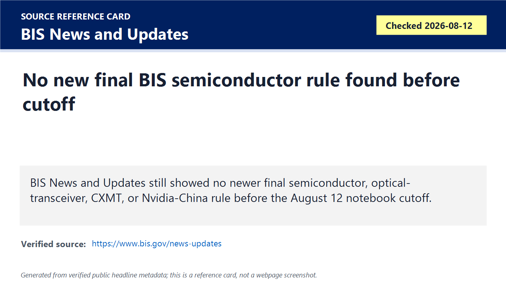

# Daily Semiconductor Current Affairs

Date: 2026-08-12

Research window: Wednesday update through the heartbeat cutoff, approximately 15:40 IST on August 12, 2026. This note catches up the August 11 after-close releases from CoreWeave, Supermicro, and Lumentum, adds last-72-hour context from NVIDIA's AI infrastructure financing announcement and the Sony Semiconductor Solutions / TSMC Japan image-sensor joint venture, and keeps same-day pending items clearly marked. Coherent reports after the NYSE close on August 12, Applied Materials reports on August 13, Intel's priced offering was expected to close on August 12, and no newer final BIS semiconductor rule was verified before cutoff.

## Quick Index

| Date | Major Topic | Source Groups | Why To Read |
|---|---|---|---|
| 2026-08-12 | CoreWeave Q2 closes AI-cloud demand proof queue | CoreWeave Investor Relations | Tests AI infrastructure revenue, power capacity, backlog, financing, losses, and NVIDIA Vera Rubin validation. |
| 2026-08-12 | Supermicro Q4 closes AI-server proof queue | Supermicro Investor Relations | Gives official revenue, margin, backlog, cash flow, and FY2027 outlook for AI server systems. |
| 2026-08-12 | Lumentum Q4 closes optical-link demand proof queue | Lumentum Investor Relations | Shows 1.6T optics, OCS, CPO lasers, cloud modules, and debt-accounting effects in one result. |
| 2026-08-12 | NVIDIA compute financing becomes official last-72-hour context | NVIDIA Newsroom | Moves AI infrastructure from chip sales into investable, third-party financing platforms, with final agreements still pending. |
| 2026-08-12 | Sony and TSMC form Japan image-sensor JV | TSMC PR / Sony Semiconductor Solutions context | Adds a Japan industrial-policy, foundry, and advanced-sensor manufacturing item with 2029 production target. |
| 2026-08-12 | Coherent, AMAT, Intel, BIS, and SEMICON India remain follow-ups | Official company/regulator/event pages | Separates pending earnings, policy, offering-close, and India talent items from confirmed facts. |

**Page navigation:** [Sources](#source-map) · [Concept review](#concept-review) · [Follow-up](#what-to-watch-next) · [Technical terms](#technical-terms-used-today) · [Master glossary](../knowledge-base/glossary.md)

## Technical Terms / Deep Definitions

Term: Revenue backlog
Definition: Revenue backlog is the value of contracted customer demand that has not yet been recognized as revenue because delivery, service availability, or other performance obligations remain unfinished. It solves the visibility problem by showing future demand beyond current-quarter sales, but it does not prove timing, margin, customer concentration, or cancellation risk by itself. In today's CoreWeave result, about USD 104B of backlog matters because AI cloud demand is being measured as future capacity commitments, not only current revenue. Example: recognized revenue is work already earned under accounting rules; backlog is a queue of future work that still must be delivered. Source: https://www.sec.gov/oiea/investor-alerts-and-bulletins/ib_revenue

Term: Active power
Definition: Active power is the amount of data-center power capacity that is already energized and usable for running compute infrastructure, typically stated in megawatts or gigawatts. It solves the practical deployment problem: GPUs, networking, cooling, and storage cannot become sellable AI cloud capacity until the site has available power. In today's CoreWeave result, 1.5 GW of active power matters because it is a hard infrastructure measure behind AI compute supply. Comparison: ordering GPUs is a component event; energizing power capacity is an operating-infrastructure event. Source: https://www.opencompute.org/projects/rack-and-power

Term: Contracted power
Definition: Contracted power is power capacity reserved or secured under contracts but not necessarily fully active yet. It solves the long-lead planning problem for AI data centers, where grid interconnection, substations, backup power, cooling, and construction can take longer than chip delivery. In today's CoreWeave result, about 3.7 GW of contracted power matters because it points to future AI-cloud expansion if facilities, financing, and customer demand convert. Example: contracted power is like a reserved runway; active power is the runway already open for traffic. Source: https://www.opencompute.org/projects/rack-and-power

Term: Adjusted EBITDA
Definition: Adjusted EBITDA is earnings before interest, taxes, depreciation, and amortization, further adjusted for selected company-defined items. It solves the operating-performance comparison problem by trying to show cash-like operating profit before financing structure and asset depreciation, but it can hide important costs in capital-heavy businesses. In today's CoreWeave result, adjusted EBITDA margin of 59% looks strong while net loss remains large because interest, depreciation, and other costs matter heavily in AI data centers. Comparison: adjusted EBITDA can show operating scale; net income shows the broader accounting result after more costs. Source: https://www.sec.gov/oiea/investor-alerts-and-bulletins/ib_non-gaap

Term: Bring-up and validation
Definition: Bring-up and validation is the engineering process of powering on new hardware, checking firmware, boards, links, thermal behavior, memory, interconnect, and software, then proving the system works against expected behavior. It solves the gap between "hardware exists" and "hardware is reliable enough to deploy." In today's CoreWeave result, Vera Rubin NVL72 bring-up and validation matters because future AI platforms are not useful until rack-scale systems work under real infrastructure conditions. Example: tape-out sends a chip design to manufacturing; bring-up proves the manufactured system can start and operate. Source: https://semiengineering.com/knowledge_centers/eda-design/definitions/bring-up/

Term: NVIDIA Vera Rubin NVL72
Definition: NVIDIA Vera Rubin NVL72 is a next-generation NVIDIA rack-scale AI platform referenced by CoreWeave as having completed bring-up and validation in CoreWeave's environment. It solves the scale-up AI problem by packaging many accelerators, memory, networking, power, cooling, and system software into a tightly connected rack design. In today's news, it matters because CoreWeave is signaling readiness for a post-Blackwell AI infrastructure generation, not just current GPU rental demand. Comparison: a single accelerator is a chip or module; an NVL72-style rack is a full AI compute system. Source: https://investors.coreweave.com/news/news-details/2026/CoreWeave-Reports-Strong-Second-Quarter-2026-Results/default.aspx

Term: AI server
Definition: An AI server is a system built to host accelerators, CPUs, memory, storage, high-speed networking, power delivery, cooling, firmware, and management software for AI training or inference. It solves the system-integration problem by turning chips into deployable compute nodes. In today's Supermicro result, AI servers matter because revenue, backlog, gross margin, and FY2027 guidance show whether chip demand is converting into shipped rack and server infrastructure. Comparison: NVIDIA or AMD sells accelerators; Supermicro sells configured servers or rack-scale systems around them. Source: https://www.supermicro.com/en/solutions/ai

Term: Gross margin
Definition: Gross margin is revenue minus cost of goods sold, expressed as a percentage of revenue. It solves the profitability-quality problem by showing how much money remains after direct product costs before operating expenses, interest, and taxes. In today's Supermicro and Lumentum results, margin matters because AI demand is more valuable when the company can ship products without sacrificing pricing or absorbing excessive build cost. Example: high revenue with low gross margin can still be weak economics; high revenue with improving gross margin is stronger evidence. Source: https://www.investor.gov/introduction-investing/investing-basics/glossary/gross-margin

Term: Non-GAAP result
Definition: A non-GAAP result is a company financial metric adjusted away from standard GAAP accounting, often excluding selected costs, stock compensation, restructuring charges, or one-time items. It solves the comparison problem when unusual accounting events distort period-to-period operating trends, but investors must read the reconciliation because adjustments can remove real costs. In today's Lumentum result, the gap between a GAAP net loss and non-GAAP net income matters because one-time debt extinguishment accounting dominates the GAAP result. Source: https://www.sec.gov/oiea/investor-alerts-and-bulletins/ib_non-gaap

Term: Optical link
Definition: An optical link is a data path that uses light, usually through fiber and optical modules, to move information between chips, boards, racks, or data centers. It solves the bandwidth-distance-power problem because copper electrical links become lossy and power-hungry at high speeds and longer reaches. In today's Lumentum and Coherent watch, optical links matter because AI clusters need enormous low-latency bandwidth between accelerators and switches. Comparison: copper is often good for short in-box links; optics becomes essential as distance and bandwidth rise. Source: https://www.oiforum.com/technical-work/hot-topics/800g/

Term: 1.6T optical transceiver
Definition: A 1.6T optical transceiver is a networking module class targeting about 1.6 terabits per second of aggregate data rate across optical lanes. It solves the AI-cluster bandwidth problem by increasing link capacity between switches, servers, and data-center fabrics. In today's Lumentum result, 1.6T adoption matters because cloud customers are moving beyond 800G toward denser optical bandwidth for larger AI systems. Example: 1.6T is roughly double 800G aggregate link rate, though real system value also depends on reach, power, thermals, cost, and switch availability. Source: https://www.oiforum.com/technical-work/hot-topics/800g/

Term: Optical circuit switch
Definition: An optical circuit switch is a device that redirects optical paths directly, often without converting every signal into electronics for packet switching. It solves the network-reconfiguration and power-efficiency problem in large clusters by creating high-bandwidth optical paths between selected endpoints. In today's Lumentum result, OCS matters because AI data centers need flexible interconnect fabrics as model sizes and traffic patterns change. Comparison: an Ethernet packet switch processes packets electronically; an optical circuit switch establishes light paths. Source: https://www.oiforum.com/

Term: Co-packaged optics
Definition: Co-packaged optics places optical engines very close to, or in the same package region as, switch or compute silicon instead of using only pluggable modules at the faceplate. It solves the electrical-link power and bandwidth-density problem as data rates rise and electrical traces become inefficient over distance. In today's Lumentum result, CPO lasers matter because optical power sources and packaging reliability become central to next-generation AI switching. Comparison: pluggable optics are replaceable front-panel modules; CPO moves optical functionality closer to the ASIC. Source: https://www.oiforum.com/technical-work/hot-topics/co-packaging/

Term: Debt extinguishment
Definition: Debt extinguishment is an accounting event where existing debt is repaid, exchanged, converted, or otherwise settled, causing gains or losses to be recognized depending on the terms and carrying value. It solves a capital-structure problem by changing obligations, but it can create large non-cash accounting effects. In today's Lumentum result, a one-time non-cash debt extinguishment loss explains why GAAP net loss is huge even while non-GAAP operating results are strong. Source: https://www.sec.gov/files/form8-k.pdf

Term: AI factory
Definition: An AI factory is NVIDIA's term for a data-center-scale production system that takes data and turns it into AI outputs using accelerated compute, networking, storage, software, power, and operations. It solves the business-framing problem by treating AI infrastructure as production capacity, not just IT hardware. In today's NVIDIA financing item, AI factories matter because the company is trying to make compute infrastructure an investable asset class for large capital providers. Comparison: a traditional data center hosts general workloads; an AI factory is optimized for high-throughput AI training and inference. Source: https://nvidianews.nvidia.com/news/nvidia-partners-with-apollo-blackrock-blackstone-brookfield-goldman-sachs-and-kkr-to-establish-ai-compute-infrastructure-financing-platforms-to-mobilize-over-500-billion-of-third-party-capital

Term: Compute financing platform
Definition: A compute financing platform is a capital structure or investment vehicle designed to fund AI infrastructure such as accelerators, servers, data centers, networking, and software-backed usage contracts. It solves the funding-scale problem because AI clusters can require billions of dollars before customer revenue is fully realized. In today's NVIDIA item, the platform concept matters because NVIDIA is partnering with large financial institutions to mobilize third-party capital for customer infrastructure. Example: equipment leasing funds aircraft in aviation; compute financing may fund GPU clusters and data centers for AI customers. Source: https://nvidianews.nvidia.com/news/nvidia-partners-with-apollo-blackrock-blackstone-brookfield-goldman-sachs-and-kkr-to-establish-ai-compute-infrastructure-financing-platforms-to-mobilize-over-500-billion-of-third-party-capital

Term: Third-party capital
Definition: Third-party capital is money supplied by outside investors rather than by the company selling the hardware or the customer using the hardware. It solves the balance-sheet problem by spreading infrastructure funding across banks, asset managers, private capital, and infrastructure investors. In today's NVIDIA item, third-party capital matters because the announced goal is to mobilize more than USD 500B without making NVIDIA itself the only financier of AI buildout. Comparison: vendor financing puts more burden on the supplier; third-party financing tries to move funding to independent capital pools. Source: https://www.investor.gov/introduction-investing/investing-basics/glossary/private-equity-fund

Term: Memorandum of understanding
Definition: A memorandum of understanding is a formal statement of intended cooperation that may precede final binding agreements. It solves the coordination problem by documenting strategic intent, roles, and next steps before every contract term is finalized. In today's NVIDIA item, the MOU caveat matters because the financing platforms are subject to final agreements, so the capital goal is not the same as already deployed money. Example: an MOU is stronger than a casual discussion, but weaker than a closed financing contract. Source: https://www.trade.gov/knowledge-product/memorandum-understanding

Term: Image sensor
Definition: An image sensor is a semiconductor device that converts light into electrical signals, usually using arrays of pixels that capture photons and turn them into charge or voltage. It solves the machine-vision and camera problem for smartphones, vehicles, industrial inspection, medical devices, and robotics. In today's Sony / TSMC JV item, image sensors matter because advanced process technology is being tied to future smartphone camera production in Japan. Comparison: a logic processor computes instructions; an image sensor turns optical information into digital data. Source: https://www.sony-semicon.com/en/technology/is.html

Term: Joint venture
Definition: A joint venture is a separately organized business created by two or more companies to share investment, technology, manufacturing, or market access while defining control and ownership. It solves the risk-sharing problem when one company has product technology and another has manufacturing expertise. In today's Sony / TSMC item, the JV matters because Sony is planned as the controlling shareholder while TSMC contributes process and manufacturing know-how for next-generation image sensors. Example: a supplier contract buys output; a JV creates a shared operating entity. Source: https://www.investor.gov/introduction-investing/investing-basics/glossary/joint-venture

Term: Volume production
Definition: Volume production is sustained, repeatable manufacturing at commercial scale with acceptable yield, quality, cost, and customer qualification. It solves the difference between prototype success and real product supply. In today's Sony / TSMC item, 2029 volume production matters because the JV is strategic but still years away from commercial output. Comparison: a pilot line proves process feasibility; volume production supplies real customers at scale. Source: https://www.semi.org/en/resources/semiconductor101

Term: Regulatory approval
Definition: Regulatory approval is formal permission from government authorities required before certain transactions, investments, mergers, joint ventures, or exports can close. It solves the public-interest and compliance problem by checking competition, national security, foreign investment, and industry rules. In today's Sony / TSMC item, approval matters because the definitive agreement still depends on closing conditions before the JV can be completed. Example: signing a deal announces intent; regulatory approval allows the deal to finish legally. Source: https://www.ftc.gov/advice-guidance/competition-guidance/guide-antitrust-laws/mergers

Term: Semiconductor inspection image
Definition: A semiconductor inspection image is a microscope, optical, SEM, or tool-generated image used to find defects, pattern errors, contamination, overlay problems, or process variation on wafers or packages. It solves the yield-learning problem by giving engineers visual evidence of manufacturing quality. In today's SEMICON India Hackathon item, inspection-image restoration matters because noisy images can hide defects or create false positives in inspection workflows. Comparison: a normal camera image is meant for human viewing; inspection imagery is tied to defect detection, metrology, and process control. Source: https://www.kla.com/products/inspection

Term: Speckle noise
Definition: Speckle noise is granular interference noise often seen in coherent imaging systems where reflected waves combine constructively and destructively. It solves no useful business problem by itself; it is a physical imaging problem that algorithms must reduce without destroying defect details. In today's hackathon problem, speckle noise matters because degraded semiconductor inspection images need restoration while preserving true defect information. Comparison: Gaussian noise is random additive fluctuation; speckle is multiplicative-looking granular interference. Source: https://www.nist.gov/image/speckle-pattern

Term: Super-resolution
Definition: Super-resolution is an imaging method that reconstructs or estimates a higher-resolution image from lower-resolution data. It solves the inspection and metrology problem when tools have limits in optics, sampling, scan speed, or noise but engineers still need finer visual detail. In today's hackathon problem, super-resolution matters because restoring downsampled semiconductor inspection images can improve defect review if it does not hallucinate false structures. Example: upscaling a phone photo for looks is not enough; semiconductor super-resolution must preserve measurable features and defects. Source: https://ieeexplore.ieee.org/document/6473374

Term: Navigation-error recovery
Definition: Navigation-error recovery is the process of estimating and correcting position, rotation, scale, or alignment error so an inspection or metrology tool can return to the intended die or wafer site. It solves the repeatability problem in wafer inspection, where engineers need to revisit the same pattern location accurately across images, scans, or process steps. In today's Applied Materials hackathon problem, navigation-error recovery matters because DRAM and FinFET layouts are repetitive and can confuse algorithms unless the solution uses robust features and uncertainty checks. Example: GPS recovery locates a car on a map; wafer navigation recovery locates a die site inside a dense circuit pattern. Source: https://www.appliedmaterials.com/us/en/semiconductor/semiconductor-inspection-and-metrology.html

Term: Official status check
Definition: An official status check is a deliberate review of regulator, company, standards-body, or filing pages to verify whether a reported event has become a formal disclosure, rule, filing, enforcement action, or completed transaction. It solves the research-quality problem of not treating rumors, schedules, drafts, or market reports as completed facts. In today's BIS and Intel checks, it matters because reported policy risk and expected offering close remain different from official final text. Comparison: a media report can move stocks; a regulator rule or company filing changes obligations. Source: https://www.bis.gov/news-updates

## Source Images

## Source Map

| Item | Source | Date | Link | Use In This Note |
|---|---|---|---|---|
| CoreWeave Q2 results | CoreWeave Investor Relations | 2026-08-11 | https://investors.coreweave.com/news/news-details/2026/CoreWeave-Reports-Strong-Second-Quarter-2026-Results/default.aspx | Official AI-cloud revenue, backlog, power, losses, financing, and Vera Rubin NVL72 validation. |
| Supermicro Q4/FY2026 results | Supermicro Investor Relations | 2026-08-11 | https://ir.supermicro.com/news/news-details/2026/Supermicro-Announces-Fourth-Quarter-and-Full-Fiscal-Year-2026-Financial-Results/default.aspx | Official AI-server revenue, margin, cash flow, backlog commentary, and FY2027 outlook. |
| Lumentum Q4/FY2026 results | Lumentum Investor Relations | 2026-08-11 | https://investor.lumentum.com/financial-news-releases/news-details/2026/Lumentum-Announces-Fourth-Quarter-and-Full-Fiscal-Year-2026-Results/default.aspx | Official optical-link, 1.6T, OCS, CPO laser, revenue, margin, and debt-accounting evidence. |
| NVIDIA AI compute infrastructure financing platforms | NVIDIA Newsroom | 2026-08-10 | https://nvidianews.nvidia.com/news/nvidia-partners-with-apollo-blackrock-blackstone-brookfield-goldman-sachs-and-kkr-to-establish-ai-compute-infrastructure-financing-platforms-to-mobilize-over-500-billion-of-third-party-capital | Last-72-hour official context for third-party AI infrastructure financing; final agreements still pending. |
| Sony Semiconductor Solutions / TSMC image-sensor JV | TSMC PR | 2026-08-11 | https://pr.tsmc.com/english/news/3333 | Official Japan joint venture, investment, ownership, advanced image-sensor process, government support premise, and 2029 production target. |
| Coherent FY2026 Q4 schedule | Coherent | Checked 2026-08-12 | https://www.coherent.com/news/press-releases/fy2026-fourth-quarter-fy2026-conference-call-announced | Same-day after-close photonics and optical result remains pending before cutoff. |
| Applied Materials Q3 schedule | Applied Materials Investor Relations | Checked 2026-08-12 | https://ir.appliedmaterials.com/news-releases/news-release-details/applied-materials-report-fiscal-third-quarter-2026-results-aug | August 13 wafer-fabrication-equipment result remains pending. |
| Intel expected offering close | Intel Investor Relations | Checked 2026-08-12 | https://www.intc.com/news-events/press-releases/detail/1779/intel-announces-upsize-and-pricing-of-20-billion-common | Official pricing release said close was expected August 12; no separate close release verified before cutoff. |
| SEMICON India Hackathon 2026 | India Innovation Centre / SEMICON India Hackathon | Checked 2026-08-12 | https://i4c.in/hackathon-2026/ | Official India problem statements, deadlines, KLA/Applied Materials mentorship, and VLSI talent evidence. |
| BIS policy status | BIS News and Updates | Checked 2026-08-12 | https://www.bis.gov/news-updates | Official status check; no newer final semiconductor, optical, CXMT, or Nvidia-China rule verified before cutoff. |

## Deep Briefing

### 1. CoreWeave: AI cloud demand is confirmed, but financing quality remains the exam question

**Confirmed facts:** CoreWeave reported Q2 2026 revenue of USD 2.575B, compared with USD 1.212B a year earlier. The company also reported operating loss of USD 49M, net loss of USD 626M, net loss margin of 24%, and basic/diluted net loss per share of USD 1.14. Its adjusted EBITDA was USD 1.510B with a 59% adjusted EBITDA margin. CoreWeave said revenue backlog was about USD 104B as of June 30, 2026 and that this excludes more than USD 25B of net new customer commitments added early in Q3. It expanded active power by nearly 500 MW to reach 1.5 GW, reported about 3.7 GW of contracted power, and said it completed the industry's first bring-up and validation of NVIDIA Vera Rubin NVL72. It also announced private fiber and cross-cloud connection products, and disclosed financing actions including a USD 3.1B term loan, a USD 1B Jane Street strategic investment, and more than USD 10B raised through unsecured debt and convertible bonds.

**Analysis:** This closes the August 11 after-close AI-cloud proof queue with strong top-line and infrastructure evidence, but not with clean profitability. Revenue roughly doubled year over year and backlog is very large, so customer demand for AI compute appears real. The hard part is that AI-cloud companies convert chips into revenue through expensive assets: data centers, GPUs, networking, storage, power contracts, fiber, debt, and depreciation. That is why adjusted EBITDA and net loss diverge. Adjusted EBITDA says the operating platform is scaling; net loss says financing and asset intensity remain heavy. Both are true, and a serious semiconductor reader should keep both in the same frame.

**Why it matters:** CoreWeave is a demand-side check on the AI semiconductor chain. If chipmakers report strong accelerator demand, the next question is whether AI cloud operators can power, deploy, network, finance, and sell that compute profitably. The Vera Rubin NVL72 validation note is also important because it suggests the next NVIDIA platform generation is moving through real infrastructure bring-up, not only slideware.

**India angle:** India should read CoreWeave as a warning about AI infrastructure capital intensity. A national AI-compute plan needs power allocation, fiber, financing, local data-center capacity, cloud contracts, and operations talent. The chip is only one layer.

**VLSI/career relevance:** Study system validation, PCIe/CXL, NVLink-style scale-up networking, power integrity, thermal design, firmware bring-up, high-speed SerDes, and observability. AI cloud demand creates jobs not only in RTL and verification but also in hardware-system validation and data-center reliability engineering.

### 2. Supermicro: AI-server revenue and backlog are strong, with margin quality improving

**Confirmed facts:** Supermicro reported Q4 FY2026 net sales of USD 11.1B, up from USD 10.2B in Q3 FY2026 and USD 5.8B in Q4 FY2025. Q4 gross margin was 17.5%, compared with 9.9% in Q3 and 9.5% a year earlier. Q4 net income was USD 1.178B and diluted EPS was USD 1.62; non-GAAP diluted EPS was USD 1.70. Q4 cash flow from operations was USD 747M, while capex and investments were USD 25M. For full FY2026, net sales were USD 39.1B compared with USD 22.0B in FY2025, gross margin was 10.8%, net income was USD 2.2B, and diluted EPS was USD 3.26. The CEO said the company generated more than USD 60B in new orders and entered FY2027 with record backlog. For Q1 FY2027, Supermicro guided net sales of USD 14.5B to USD 15.5B and non-GAAP diluted EPS of USD 1.01 to USD 1.10. FY2027 net sales guidance is USD 65B to USD 72B.

**Analysis:** Supermicro converts the August 11 preliminary story into official numbers. The important signal is not just that revenue is high; it is that margin improved sharply while backlog and orders remain strong. That combination suggests a better customer and product mix than the weaker-margin AI-server periods that worried investors earlier. Still, the prior preliminary update's export-control-review caveat should remain a governance watch until the final filing, call commentary, or board review status clearly resolves it.

**Why it matters:** AI accelerators become useful when they are assembled into servers and racks with power, cooling, storage, networking, firmware, management, and support. Supermicro is therefore a middle-layer proof point between chip designers and AI-cloud customers. Its FY2027 guidance implies the system-build layer expects continued demand.

**India angle:** India can learn two things. First, server and rack integration is a real semiconductor-adjacent opportunity. Second, compliance matters. If India wants to become a trusted electronics and AI-infrastructure supplier, export-control screening, customer documentation, traceability, and audit processes have to mature alongside manufacturing.

**VLSI/career relevance:** For interviews, connect AI servers to board design, power delivery, thermal design, signal integrity, high-speed interconnect, DFT, manufacturing test, firmware, and reliability. Server companies expose how a chip-level spec becomes a shippable system.

### 3. Lumentum: optical links are now a first-class AI bottleneck proof point

**Confirmed facts:** Lumentum reported Q4 FY2026 net revenue of USD 1.0063B, up 24.5% sequentially and 109.3% year over year. GAAP gross margin was 47.4% and non-GAAP gross margin was 50.4%. GAAP operating margin was 27.8% and non-GAAP operating margin was 36.6%. Non-GAAP net income was USD 326.3M and non-GAAP diluted EPS was USD 3.23. The company reported a GAAP net loss of USD 7.2B, driven by equitization of convertible notes and a one-time non-cash debt extinguishment loss of USD 7.8B. Q1 FY2027 guidance is revenue of USD 1.225B to USD 1.275B, non-GAAP operating margin of 39.5% to 40.5%, and non-GAAP diluted EPS of USD 4.05 to USD 4.35. Management highlighted cloud module growth, 1.6T adoption, optical circuit switch solutions, ultra-high-power CPO lasers, an initial ELS module order, and NPO engagements.

**Analysis:** Lumentum is the cleanest optical confirmation in today's run. The operating numbers say AI data-center optical demand is not theoretical. Revenue doubled year over year, margins are strong, and next-quarter guidance steps up again. The accounting caveat is equally important: the GAAP net loss is dominated by debt extinguishment, so the operating story and capital-structure story must be read separately.

**Why it matters:** AI clusters need accelerators, but they also need enormous optical bandwidth. Larger model training and inference systems drive demand for 800G, 1.6T, optical switching, lasers, and eventually co-packaged optics. If optics cannot scale in bandwidth, power, cost, and reliability, GPUs wait on the network.

**India angle:** India should not see optical networking as separate from semiconductors. Optical modules, photonic devices, test, packaging, precision assembly, fiber infrastructure, and data-center networking are part of the AI supply chain. This is a realistic space for supplier development and skilled test/validation work.

**VLSI/career relevance:** Learn SerDes basics, PAM signaling, optical transceiver architecture, switch ASICs, photonic packaging, laser reliability, thermal management, and production test. Digital designers increasingly need enough system context to understand why link power and bandwidth shape chip architecture.

### 4. NVIDIA financing: AI infrastructure is being turned into an investable asset class

**Confirmed facts:** On August 10, NVIDIA announced strategic partnerships with Apollo, BlackRock, Blackstone, Brookfield, Goldman Sachs, and KKR to establish independent AI compute infrastructure financing platforms. NVIDIA said the effort is intended to mobilize more than USD 500B of third-party capital over time. The release frames NVIDIA compute and full-stack AI infrastructure as an investable asset class and says the partnerships are subject to final agreements.

**Analysis:** This is a last-72-hour catch-up item because it changes how to read CoreWeave and broader AI cloud economics. NVIDIA is not only selling chips; it is helping create financing structures so customers can buy, lease, deploy, or fund large AI factories. The bullish interpretation is that independent capital lowers the bottleneck between hardware demand and deployed infrastructure. The risk interpretation is that AI demand is becoming more dependent on long-duration contracts, utilization assumptions, financing terms, and asset residual values. Both should be tracked.

**Why it matters:** AI semiconductor demand is now tied to capital markets. If third-party investors fund more infrastructure, chip demand can stay strong. If utilization, customer credit, power access, or returns disappoint, financing could tighten and slow orders.

**India angle:** India needs to think in the same financial language. AI compute capacity will require infrastructure funds, data-center operators, state power policy, local demand, sovereign or enterprise customers, and clear utilization plans. Semiconductor policy and infrastructure finance are now linked.

**VLSI/career relevance:** This is not an RTL topic, but it affects careers. The volume of accelerator, networking, memory, and power-chip jobs depends on whether financed infrastructure actually gets deployed. Engineers should understand demand signals and not read chip roadmaps in isolation.

### 5. Sony / TSMC: Japan image-sensor JV shows specialization beyond AI accelerators

**Confirmed facts:** Sony Semiconductor Solutions and TSMC signed a legally binding definitive agreement to establish Advanced Vision Semiconductor Manufacturing Corporation in Koshi City, Kumamoto Prefecture, Japan. The JV is intended as a core hub for development and manufacturing needed for volume production of smartphone image sensors using advanced manufacturing process technology. Volume production is expected in 2029. Sony is planned as the sole controlling shareholder and the JV as a consolidated Sony Group subsidiary. Sony will contribute about JPY 465B through cash and assets, while TSMC will contribute about JPY 282B. The investment plan is being considered on the premise of Japanese government support, and completion is subject to regulatory approvals and customary closing conditions.

**Analysis:** This is not an AI accelerator story, but it is high-quality semiconductor current affairs. It shows how national semiconductor ecosystems are built around specialization. Sony brings image-sensor product and device knowledge. TSMC brings advanced process and manufacturing expertise. Japan brings policy support and geographic resilience. The target date, 2029, also keeps expectations realistic: the agreement is strategic now, but production proof is years away.

**Why it matters:** Semiconductor leadership is not only about CPUs, GPUs, and HBM. Image sensors are advanced mixed-signal, photonic, process, packaging, and yield products. Smartphones, vehicles, robotics, and industrial vision all depend on sensor quality.

**India angle:** India should study this JV because it shows a possible model: combine a product leader, a manufacturing-process leader, and state support around a specific segment. For India, the lesson is to pick concrete product categories and build supplier qualification, not just broad slogans about fabs.

**VLSI/career relevance:** Image sensors involve analog design, pixel design, readout circuits, noise, ADCs, timing, signal processing, layout matching, yield, wafer-level test, and packaging. This is a strong domain for students who like both circuits and real-world sensing.

### 6. Follow-up queue: Coherent, Applied Materials, Intel, BIS, and India remain open

**Confirmed facts:** Coherent's official page says FY2026 Q4 results will be released after the NYSE close on August 12 with a 4:30 PM ET webcast. Applied Materials' official page says fiscal Q3 2026 results will be reported on August 13 at 4:30 PM ET. Intel's official pricing release said the USD 20B common-stock offering was expected to close on August 12, but no separate closing release was verified before the cutoff. BIS News and Updates showed no newer final semiconductor, optical-transceiver, CXMT, or Nvidia-China rule before cutoff. The India Innovation Centre SEMICON India Hackathon page shows official problem statements and deadlines, including registration from July 24 to August 16 and a grand finale on September 17-18 at Yashobhoomi, New Delhi.

**Analysis:** The right move is not to guess. Coherent can confirm or weaken the optical-demand story after the U.S. close. Applied Materials can confirm whether wafer-fabrication-equipment demand is matching the AI cycle. Intel close requires final settlement evidence. BIS policy risk remains open until regulator text appears. India hackathon evidence is useful for talent and project work, not for claiming production output.

**Why it matters:** Follow-up discipline prevents false closure. A daily current-affairs notebook should say "closed," "updated," or "still pending" rather than mixing official releases, schedules, and reports.

**India angle:** The hackathon's KLA and Applied Materials problem statements are unusually practical. AI-based restoration of semiconductor inspection images and navigation-error recovery for wafer inspection tools are real manufacturing-adjacent problems. They connect Indian students to inspection, metrology, image processing, EDA-style evaluation, and tool engineering.

**VLSI/career relevance:** If you want one practical project from today's India item, build a reproducible inspection-image-restoration pipeline or wafer-navigation recovery model with synthetic data, metrics, citations, and a GitHub repository. That is closer to semiconductor engineering than a generic AI demo.

## Follow-Up Ledger

| Prior item | Status on 2026-08-12 | Evidence |
|---|---|---|
| CoreWeave AI-cloud demand | Updated and closed for Q2 result: official release now gives revenue, backlog, active power, contracted power, losses, financing, and Vera Rubin validation | CoreWeave Investor Relations |
| Supermicro AI-server backlog/margin | Updated and closed for Q4 result: official release now gives revenue, margin, cash flow, backlog commentary, and FY2027 guidance | Supermicro Investor Relations |
| Supermicro export-control review caveat | Still pending as governance/compliance watch: prior preliminary caveat should remain open until filing/call/board review clarity resolves it | Prior Supermicro official preliminary context |
| Lumentum optical earnings | Updated and closed for Q4 result: official release confirms strong optical revenue, margins, 1.6T/cloud/CPO/OCS signals, and debt-accounting caveat | Lumentum Investor Relations |
| Coherent optical earnings | Still pending: result scheduled after NYSE close on August 12 | Coherent |
| Applied Materials WFE earnings | Still pending: result scheduled for August 13 | Applied Materials Investor Relations |
| Intel offering close | Still pending at cutoff: pricing release expected August 12 close, but no separate close release verified | Intel Investor Relations |
| NVIDIA financing reports | Updated: now official NVIDIA release covers compute financing platforms, but final agreements and deployed capital remain pending | NVIDIA Newsroom |
| Sony / TSMC Japan image-sensor JV | New and updated: definitive agreement signed, but regulatory approvals and 2029 volume production remain pending | TSMC PR |
| Optical-transceiver policy risk | Still pending: no new final BIS/FCC rule verified before cutoff | BIS |
| Apple-CXMT memory report | Still pending: no official Apple/CXMT supplier award verified today | Prior reporting and BIS status |
| Nvidia-China access risk | Still pending: no new final BIS rule verified today | BIS |
| Nvidia Rubin/HBM memory-content report | Partly updated by CoreWeave Vera Rubin NVL72 validation, but HBM-content claims remain unconfirmed by NVIDIA roadmap disclosure | CoreWeave / prior market reporting |
| HBF/OCP standard | Still pending: no public latency, endurance, software-placement, samples, or customer adoption proof verified today | Prior SK hynix/Sandisk/OCP context |
| Astera Scorpio ramp | Still pending: no new customer shipment or Q3 ramp metric verified today | Prior Astera context |
| SEMI AI manufacturing workshop | Still pending as public metrics: no yield, cycle-time, or maintenance case-study metric verified today | Prior SEMI context |
| India ecosystem watch | Updated: hackathon problem statements now provide concrete KLA and Applied Materials inspection/metrology problems; no production milestone closed | India Innovation Centre / SEMICON India Hackathon |

## Concept Review

| Concept | Deep Definition | Why It Matters In This News | Revise Next | Source |
|---|---|---|---|---|
| AI infrastructure economics | AI infrastructure economics studies whether accelerators, servers, networking, power, cooling, software, financing, depreciation, and customer contracts produce profitable compute capacity. | CoreWeave shows huge revenue/backlog and active power, but net loss remains large because infrastructure is capital intensive. | EBITDA vs net income, capex, depreciation, debt, utilization, customer concentration. | https://investors.coreweave.com/news/news-details/2026/CoreWeave-Reports-Strong-Second-Quarter-2026-Results/default.aspx |
| AI server systems | AI server systems integrate accelerators, CPUs, memory, storage, networking, power, cooling, firmware, management, and manufacturing test into deployable hardware. | Supermicro's revenue, margin, orders, and FY2027 outlook show AI chip demand converting into system-level revenue. | Board design, thermal design, power integrity, rack integration, firmware validation. | https://ir.supermicro.com/news/news-details/2026/Supermicro-Announces-Fourth-Quarter-and-Full-Fiscal-Year-2026-Financial-Results/default.aspx |
| Optical bottleneck | The optical bottleneck is the data-movement limit created when cluster bandwidth, link power, module supply, switching, or photonic packaging cannot keep up with accelerator growth. | Lumentum's 1.6T, OCS, and CPO laser signals show optical links are now central to AI scaling. | 800G vs 1.6T, SerDes, PAM, switch ASICs, CPO, laser reliability. | https://investor.lumentum.com/financial-news-releases/news-details/2026/Lumentum-Announces-Fourth-Quarter-and-Full-Fiscal-Year-2026-Results/default.aspx |
| Infrastructure finance | Infrastructure finance funds large, long-lived assets such as data centers, power systems, servers, and networking through investors expecting usage-linked returns. | NVIDIA's USD 500B target reframes AI compute as an investable asset class, with final agreements still pending. | Asset-backed finance, utilization risk, third-party capital, customer contracts. | https://nvidianews.nvidia.com/news/nvidia-partners-with-apollo-blackrock-blackstone-brookfield-goldman-sachs-and-kkr-to-establish-ai-compute-infrastructure-financing-platforms-to-mobilize-over-500-billion-of-third-party-capital |
| Sensor manufacturing specialization | Image-sensor manufacturing combines photodiodes, pixel arrays, analog readout, process tuning, wafer-level quality, packaging, and product-specific yield learning. | Sony and TSMC's Japan JV shows advanced semiconductor strategy outside GPU logic and memory. | CMOS image sensors, ADCs, noise, pixel layout, backside illumination, wafer test. | https://pr.tsmc.com/english/news/3333 |
| Evidence cutoff discipline | Evidence cutoff discipline means separating what is official now from what is scheduled, reported, pending, preliminary, or subject to approval. | Coherent, AMAT, Intel close, BIS, and India milestones need different status labels instead of being treated as complete. | IR calendars, SEC filings, regulator pages, Federal Register, company releases. | https://www.bis.gov/news-updates |

## Simple Explanation

August 12 is a catch-up day for the big August 11 after-close releases. CoreWeave shows AI-cloud demand is real in revenue, backlog, power, and customer commitments, but losses and financing costs remain serious. Supermicro shows AI-server demand converting into revenue, stronger margins, cash flow, backlog, and a big FY2027 outlook. Lumentum shows optical links are now a major AI infrastructure bottleneck and revenue opportunity, especially around 1.6T, optical switching, and CPO lasers. NVIDIA's August 10 financing announcement says large capital providers may fund AI factories, but final agreements are still pending. Sony and TSMC's Japan image-sensor JV shows semiconductor geopolitics beyond GPUs, with 2029 production still years away. Coherent, Intel closing confirmation, Applied Materials, BIS policy updates, and India hackathon outcomes remain next follow-ups.

## Interview Questions

1. Why can CoreWeave report a high adjusted EBITDA margin and still report a large net loss?
2. What is the difference between active power and contracted power in an AI data-center business?
3. Why is Supermicro a demand-side proof point for AI chips even though it does not design the accelerators?
4. What does gross margin tell you about AI-server revenue quality?
5. Why are 1.6T optical transceivers and CPO lasers important for AI clusters?
6. How should you interpret Lumentum's GAAP net loss when non-GAAP operating performance is strong?
7. Why does NVIDIA want third-party capital involved in AI infrastructure financing?
8. What makes Sony / TSMC's image-sensor JV a semiconductor strategy story even though it is not about GPUs?
9. What official source would close the Intel offering-close watch?
10. Why should BIS policy reports remain pending until official rule or enforcement text appears?
11. How would you design a semiconductor inspection-image restoration project for the SEMICON India Hackathon?
12. What is the career connection between wafer inspection navigation and VLSI manufacturing?

## What To Watch Next

1. Coherent FY2026 Q4 result after the August 12 NYSE close: revenue, datacenter optics, InP exposure, lasers, transceiver demand, guidance, and policy risk.
2. Intel common-stock offering close confirmation: final settlement, net proceeds, and any underwriter option exercise.
3. Applied Materials fiscal Q3 result on August 13: wafer-fabrication-equipment demand, AI DRAM/HBM, logic/foundry, China mix, service revenue, and orders.
4. CoreWeave follow-up: Q3 commitments, Vera Rubin platform timing, capex, debt terms, customer concentration, depreciation, and utilization.
5. Supermicro follow-up: export-control review clarity, backlog conversion, customer mix, FY2027 margin quality, and rack-scale delivery proof.
6. Lumentum follow-up: 1.6T shipment ramp, OCS deployments, CPO laser orders, ELS/NPO traction, capacity, and customer concentration.
7. NVIDIA financing follow-up: final agreements, named financed projects, balance-sheet exposure, and actual deployed third-party capital.
8. Sony / TSMC follow-up: regulatory approval, Japanese government support terms, construction/tool timeline, and 2029 volume-production progress.
9. BIS, FCC, Federal Register, and Entity List updates for optical transceivers, CXMT/YMTC, and Nvidia-China access.
10. SEMICON India Hackathon deadline on August 16 and finalist evidence in September.

## Technical Terms Used Today

[Back to quick index](#quick-index) · [Open the master A-Z glossary](../knowledge-base/glossary.md)

**Term index:** [1.6T optical transceiver](#daily-term-1-6t-optical-transceiver) · [Active power](#daily-term-active-power) · [Adjusted EBITDA](#daily-term-adjusted-ebitda) · [AI factory](#daily-term-ai-factory) · [AI server](#daily-term-ai-server) · [Bring-up and validation](#daily-term-bring-up-and-validation) · [Co-packaged optics](#daily-term-co-packaged-optics) · [Compute financing platform](#daily-term-compute-financing-platform) · [Contracted power](#daily-term-contracted-power) · [Debt extinguishment](#daily-term-debt-extinguishment) · [Gross margin](#daily-term-gross-margin) · [Image sensor](#daily-term-image-sensor) · [Joint venture](#daily-term-joint-venture) · [Memorandum of understanding](#daily-term-memorandum-of-understanding) · [Navigation-error recovery](#daily-term-navigation-error-recovery) · [Non-GAAP result](#daily-term-non-gaap-result) · [NVIDIA Vera Rubin NVL72](#daily-term-nvidia-vera-rubin-nvl72) · [Official status check](#daily-term-official-status-check) · [Optical circuit switch](#daily-term-optical-circuit-switch) · [Optical link](#daily-term-optical-link) · [Regulatory approval](#daily-term-regulatory-approval) · [Revenue backlog](#daily-term-revenue-backlog) · [Semiconductor inspection image](#daily-term-semiconductor-inspection-image) · [Speckle noise](#daily-term-speckle-noise) · [Super-resolution](#daily-term-super-resolution) · [Third-party capital](#daily-term-third-party-capital) · [Volume production](#daily-term-volume-production)

| Term | Meaning |
|---|---|
| [**1.6T optical transceiver**](../knowledge-base/glossary.md#term-1-6t-optical-transceiver) | A 1.6T optical transceiver is a networking module class targeting about 1.6 terabits per second of aggregate data rate across optical lanes. It solves the AI-cluster bandwidth problem by increasing link capacity between switches, servers, and data-center fabrics. |
| [**Active power**](../knowledge-base/glossary.md#term-active-power) | Active power is the amount of data-center power capacity that is already energized and usable for running compute infrastructure, typically stated in megawatts or gigawatts. It solves the practical deployment problem: GPUs, networking, cooling, and storage cannot become sellable AI cloud capacity until the site has available power. |
| [**Adjusted EBITDA**](../knowledge-base/glossary.md#term-adjusted-ebitda) | Adjusted EBITDA is earnings before interest, taxes, depreciation, and amortization, further adjusted for selected company-defined items. It solves the operating-performance comparison problem by trying to show cash-like operating profit before financing structure and asset depreciation, but it can hide important costs in capital-heavy businesses. |
| [**AI factory**](../knowledge-base/glossary.md#term-ai-factory) | An AI factory is NVIDIA's term for a data-center-scale production system that takes data and turns it into AI outputs using accelerated compute, networking, storage, software, power, and operations. It solves the business-framing problem by treating AI infrastructure as production capacity, not just IT hardware. |
| [**AI server**](../knowledge-base/glossary.md#term-ai-server) | An AI server is a system built to host accelerators, CPUs, memory, storage, high-speed networking, power delivery, cooling, firmware, and management software for AI training or inference. It solves the system-integration problem by turning chips into deployable compute nodes. |
| [**Bring-up and validation**](../knowledge-base/glossary.md#term-bring-up-and-validation) | Bring-up and validation is the engineering process of powering on new hardware, checking firmware, boards, links, thermal behavior, memory, interconnect, and software, then proving the system works against expected behavior. It solves the gap between "hardware exists" and "hardware is reliable enough to deploy." In today's CoreWeave result, Vera Rubin NVL72 bring-up and validation matters because future AI platforms are not useful until rack-scale systems work under real infrastructure conditions. |
| [**Co-packaged optics**](../knowledge-base/glossary.md#term-co-packaged-optics) | Co-packaged optics places optical engines very close to, or in the same package region as, switch or compute silicon instead of using only pluggable modules at the faceplate. It solves the electrical-link power and bandwidth-density problem as data rates rise and electrical traces become inefficient over distance. |
| [**Compute financing platform**](../knowledge-base/glossary.md#term-compute-financing-platform) | A compute financing platform is a capital structure or investment vehicle designed to fund AI infrastructure such as accelerators, servers, data centers, networking, and software-backed usage contracts. It solves the funding-scale problem because AI clusters can require billions of dollars before customer revenue is fully realized. |
| [**Contracted power**](../knowledge-base/glossary.md#term-contracted-power) | Contracted power is power capacity reserved or secured under contracts but not necessarily fully active yet. It solves the long-lead planning problem for AI data centers, where grid interconnection, substations, backup power, cooling, and construction can take longer than chip delivery. |
| [**Debt extinguishment**](../knowledge-base/glossary.md#term-debt-extinguishment) | Debt extinguishment is an accounting event where existing debt is repaid, exchanged, converted, or otherwise settled, causing gains or losses to be recognized depending on the terms and carrying value. It solves a capital-structure problem by changing obligations, but it can create large non-cash accounting effects. |
| [**Gross margin**](../knowledge-base/glossary.md#term-gross-margin) | Gross margin is revenue minus cost of goods sold, expressed as a percentage of revenue. It solves the profitability-quality problem by showing how much money remains after direct product costs before operating expenses, interest, and taxes. |
| [**Image sensor**](../knowledge-base/glossary.md#term-image-sensor) | An image sensor is a semiconductor device that converts light into electrical signals, usually using arrays of pixels that capture photons and turn them into charge or voltage. It solves the machine-vision and camera problem for smartphones, vehicles, industrial inspection, medical devices, and robotics. |
| [**Joint venture**](../knowledge-base/glossary.md#term-joint-venture) | A joint venture is a separately organized business created by two or more companies to share investment, technology, manufacturing, or market access while defining control and ownership. It solves the risk-sharing problem when one company has product technology and another has manufacturing expertise. |
| [**Memorandum of understanding**](../knowledge-base/glossary.md#term-memorandum-of-understanding) | A memorandum of understanding is a formal statement of intended cooperation that may precede final binding agreements. It solves the coordination problem by documenting strategic intent, roles, and next steps before every contract term is finalized. |
| [**Navigation-error recovery**](../knowledge-base/glossary.md#term-navigation-error-recovery) | Navigation-error recovery is the process of estimating and correcting position, rotation, scale, or alignment error so an inspection or metrology tool can return to the intended die or wafer site. It solves the repeatability problem in wafer inspection, where engineers need to revisit the same pattern location accurately across images, scans, or process steps. |
| [**Non-GAAP result**](../knowledge-base/glossary.md#term-non-gaap-result) | A non-GAAP result is a company financial metric adjusted away from standard GAAP accounting, often excluding selected costs, stock compensation, restructuring charges, or one-time items. It solves the comparison problem when unusual accounting events distort period-to-period operating trends, but investors must read the reconciliation because adjustments can remove real costs. |
| [**NVIDIA Vera Rubin NVL72**](../knowledge-base/glossary.md#term-nvidia-vera-rubin-nvl72) | NVIDIA Vera Rubin NVL72 is a next-generation NVIDIA rack-scale AI platform referenced by CoreWeave as having completed bring-up and validation in CoreWeave's environment. It solves the scale-up AI problem by packaging many accelerators, memory, networking, power, cooling, and system software into a tightly connected rack design. |
| [**Official status check**](../knowledge-base/glossary.md#term-official-status-check) | An official status check is a deliberate review of regulator, company, standards-body, or filing pages to verify whether a reported event has become a formal disclosure, rule, filing, enforcement action, or completed transaction. It solves the research-quality problem of not treating rumors, schedules, drafts, or market reports as completed facts. |
| [**Optical circuit switch**](../knowledge-base/glossary.md#term-optical-circuit-switch) | An optical circuit switch is a device that redirects optical paths directly, often without converting every signal into electronics for packet switching. It solves the network-reconfiguration and power-efficiency problem in large clusters by creating high-bandwidth optical paths between selected endpoints. |
| [**Optical link**](../knowledge-base/glossary.md#term-optical-link) | An optical link is a data path that uses light, usually through fiber and optical modules, to move information between chips, boards, racks, or data centers. It solves the bandwidth-distance-power problem because copper electrical links become lossy and power-hungry at high speeds and longer reaches. |
| [**Regulatory approval**](../knowledge-base/glossary.md#term-regulatory-approval) | Regulatory approval is formal permission from government authorities required before certain transactions, investments, mergers, joint ventures, or exports can close. It solves the public-interest and compliance problem by checking competition, national security, foreign investment, and industry rules. |
| [**Revenue backlog**](../knowledge-base/glossary.md#term-revenue-backlog) | Revenue backlog is the value of contracted customer demand that has not yet been recognized as revenue because delivery, service availability, or other performance obligations remain unfinished. It solves the visibility problem by showing future demand beyond current-quarter sales, but it does not prove timing, margin, customer concentration, or cancellation risk by itself. |
| [**Semiconductor inspection image**](../knowledge-base/glossary.md#term-semiconductor-inspection-image) | A semiconductor inspection image is a microscope, optical, SEM, or tool-generated image used to find defects, pattern errors, contamination, overlay problems, or process variation on wafers or packages. It solves the yield-learning problem by giving engineers visual evidence of manufacturing quality. |
| [**Speckle noise**](../knowledge-base/glossary.md#term-speckle-noise) | Speckle noise is granular interference noise often seen in coherent imaging systems where reflected waves combine constructively and destructively. It solves no useful business problem by itself; it is a physical imaging problem that algorithms must reduce without destroying defect details. |
| [**Super-resolution**](../knowledge-base/glossary.md#term-super-resolution) | Super-resolution is an imaging method that reconstructs or estimates a higher-resolution image from lower-resolution data. It solves the inspection and metrology problem when tools have limits in optics, sampling, scan speed, or noise but engineers still need finer visual detail. |
| [**Third-party capital**](../knowledge-base/glossary.md#term-third-party-capital) | Third-party capital is money supplied by outside investors rather than by the company selling the hardware or the customer using the hardware. It solves the balance-sheet problem by spreading infrastructure funding across banks, asset managers, private capital, and infrastructure investors. |
| [**Volume production**](../knowledge-base/glossary.md#term-volume-production) | Volume production is sustained, repeatable manufacturing at commercial scale with acceptable yield, quality, cost, and customer qualification. It solves the difference between prototype success and real product supply. |

This page-end index covers the specialist terms central to this day's study. The fuller explanation, news context, and source remain at first use; the master glossary combines repeated terms across all days.
