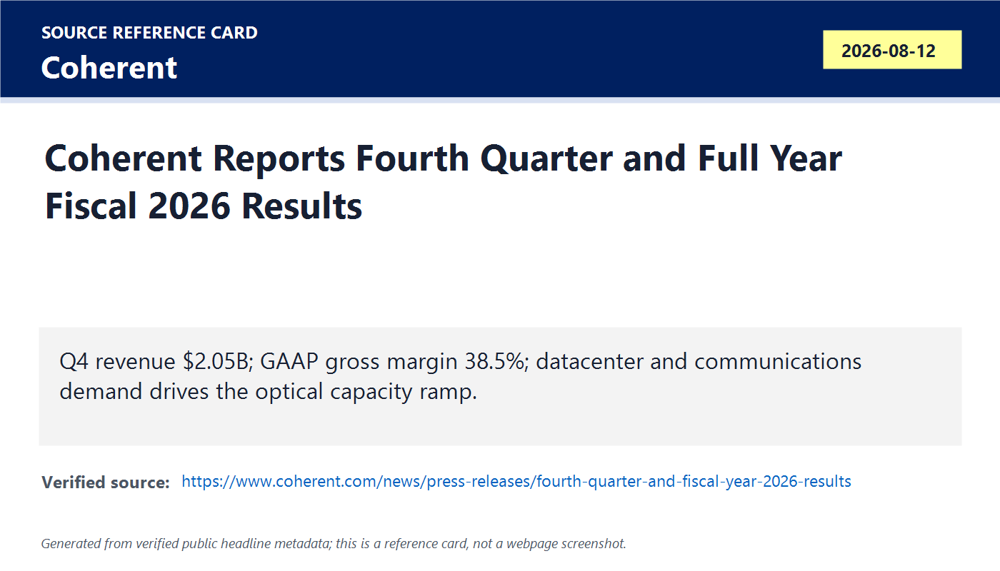
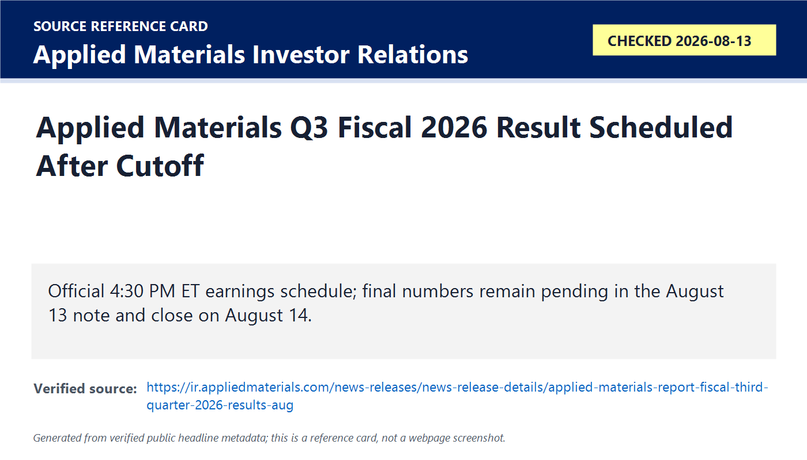
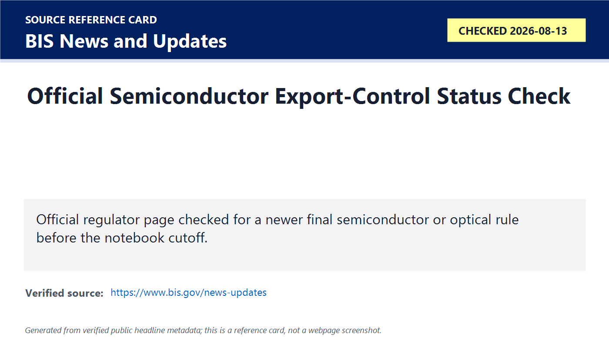
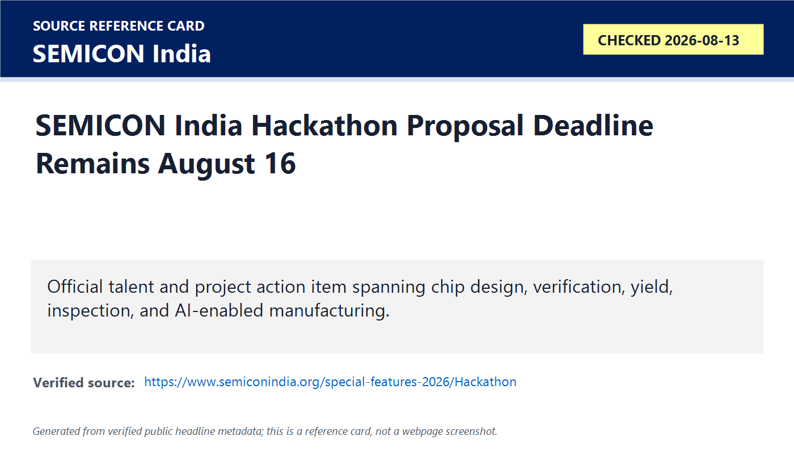

# Daily Semiconductor Current Affairs

Date: 2026-08-13

Research window: Thursday update through approximately 23:15 IST on August 13, 2026. The main completed proof point is Coherent's fiscal Q4 and full-year 2026 result, released after the NYSE close on August 12. Applied Materials' fiscal Q3 release was scheduled after the U.S. market close on August 13 and was not yet available at this cutoff, so it remains pending here and is closed in the August 14 note.

## Quick Index

| Date | Major Topic | Source Groups | Why To Read |
|---|---|---|---|
| 2026-08-13 | Coherent closes the AI-optics proof queue | Coherent earnings release and investor presentation | Tests whether AI networking demand is converting into photonics revenue, margins, capacity investment, and forward guidance. |
| 2026-08-13 | Datacenter & Communications dominates the mix | Coherent full release | Separates AI-linked optical growth from a weaker industrial segment. |
| 2026-08-13 | Copper-to-optical transition becomes a business result | Coherent management commentary | Connects SerDes reach, bandwidth density, link power, transceivers, lasers, and co-packaged optics to financial evidence. |
| 2026-08-13 | Applied Materials remains the next after-close checkpoint | Applied Materials Investor Relations | Keeps DRAM, leading-edge foundry/logic, advanced packaging, and wafer-equipment demand pending until August 14. |
| 2026-08-13 | BIS and SEMICON India remain status/action checks | BIS; SEMICON India Hackathon | Preserves policy evidence discipline and the August 16 India talent deadline. |

**Page navigation:** [Sources](#source-map) · [Concept review](#concept-review) · [Follow-up](#what-to-watch-next) · [Technical terms](#technical-terms-used-today) · [Master glossary](../knowledge-base/glossary.md)

## Technical Terms / Deep Definitions

Term: Basis point
Definition: A basis point is one hundredth of one percentage point. It solves the communication problem of describing small changes in rates or margins without ambiguity. Coherent's GAAP gross margin improved 277 basis points year over year, which means an increase of 2.77 percentage points, from 35.7% to 38.5%. Source: https://www.investor.gov/introduction-investing/investing-basics/glossary/basis-point

Term: Pro forma growth
Definition: Pro forma growth is a comparison adjusted to make two periods more comparable after acquisitions, divestitures, or structural changes. It solves the problem that reported growth can mix underlying business expansion with changes in what the company owns. Coherent reported Q4 revenue up 34% year over year and 42% on a pro forma basis, so the reader should use the reconciliation rather than treating the two percentages as interchangeable. Source: https://www.sec.gov/oiea/investor-alerts-and-bulletins/ib_non-gaap

Term: Datacenter optical connectivity
Definition: Datacenter optical connectivity is the collection of lasers, modulators, photodetectors, transceivers, fiber links, and switching interfaces that move data between servers, accelerators, racks, and facilities using light. It solves the bandwidth-distance-power problem that appears when high-speed copper links become too lossy, short-reach, or power-hungry. In Coherent's result, the category matters because Datacenter & Communications supplied $1.615B of the $2.046B quarterly revenue. Source: https://www.oiforum.com/technical-work/hot-topics/800g/

Term: Copper-to-optical transition
Definition: The copper-to-optical transition is the movement of progressively shorter and more numerous data paths from electrical copper interconnects to photonic links as bandwidth, reach, and power constraints tighten. It does not mean copper disappears; copper remains effective over short distances, while optics moves closer to the switch or compute package when electrical reach becomes uneconomic. Coherent explicitly tied its outlook to AI datacenter architectures shifting toward optical connectivity. Source: https://www.oiforum.com/technical-work/hot-topics/co-packaging/

Term: Capacity ramp
Definition: A capacity ramp is the staged increase of manufacturing output as equipment is installed, processes are qualified, yields stabilize, suppliers scale, and customers approve production. It solves the gap between strong demand and deliverable product. Coherent's inventory and capital-spending increases matter because optical demand can become revenue only if laser, wafer, packaging, module, and test capacity ramps reliably. Source: https://www.semi.org/en/resources/semiconductor101

Term: Segment mix
Definition: Segment mix is the proportion of total revenue or profit contributed by different business units or end markets. It solves the analysis problem of seeing whether company-wide growth is broad or concentrated. Coherent's Q4 Datacenter & Communications revenue rose to $1.615B while Industrial revenue was $430.5M, so the AI-linked optical segment drove the result while industrial demand remained softer. Source: https://www.investor.gov/introduction-investing/investing-basics/glossary/revenue

Term: Operating leverage
Definition: Operating leverage is the tendency for operating profit to grow faster than revenue when fixed or semi-fixed costs are spread over higher sales and gross margin improves. It solves the profitability-scaling question: strong demand is more valuable when incremental revenue produces disproportionate profit. Coherent's full-year revenue grew 22.5%, while non-GAAP operating income grew 40.5%, illustrating positive operating leverage. Source: https://www.investor.gov/introduction-investing/investing-basics/glossary/operating-income

Term: Forward guidance
Definition: Forward guidance is management's estimate of future revenue, margin, expenses, earnings, or other metrics. It solves the visibility problem by converting current orders and capacity expectations into a near-term range, but it remains uncertain and is not a guarantee. Coherent guided fiscal Q1 2027 revenue to $2.2B-$2.4B and non-GAAP EPS to $1.85-$2.05. Source: https://www.sec.gov/oiea/investor-alerts-and-bulletins/ib_analystreports

Term: Capital intensity
Definition: Capital intensity is the amount of long-lived physical investment required to produce revenue. It solves the comparison problem between businesses that can grow mainly through software or labor and those that need fabs, tools, cleanrooms, packaging lines, and test equipment. Coherent spent about $1.103B on property, plant, and equipment in fiscal 2026 as it expanded optical capacity. Source: https://www.investor.gov/introduction-investing/investing-basics/glossary/capital-expenditures

Term: Official status check
Definition: An official status check is a deliberate review of company, regulator, exchange, or standards-body pages to determine whether a scheduled, reported, or rumored event has become a formal disclosure. It solves the research-quality problem of mixing confirmed facts with expectations. Applied Materials remained scheduled but unpublished at this day's cutoff, while Coherent had moved from pending to confirmed. Source: https://www.sec.gov/edgar/browse/

## Source Images

## Source Map

| Item | Source | Date | Link | Use In This Note |
|---|---|---|---|---|
| Coherent fiscal Q4 and FY2026 results | Coherent | Aug. 12, 2026 | https://www.coherent.com/news/press-releases/fourth-quarter-and-fiscal-year-2026-results | Official revenue, margin, EPS, segment, cash-flow, capex, and Q1 FY2027 guidance evidence. |
| Coherent investor presentation | Coherent | Aug. 12, 2026 | https://www.coherent.com/content/dam/coherent/site/en/documents/investors/investor-presentations/2026/august-12/investor-presentation-20260812.pdf | Official context for AI datacenter demand, optical platforms, and manufacturing priorities. |
| Applied Materials Q3 schedule | Applied Materials Investor Relations | Checked Aug. 13, 2026 | https://ir.appliedmaterials.com/news-releases/news-release-details/applied-materials-report-fiscal-third-quarter-2026-results-aug | Official after-close equipment checkpoint; result pending at this note's cutoff. |
| BIS policy status | Bureau of Industry and Security | Checked Aug. 13, 2026 | https://www.bis.gov/news-updates | Official check for a newer final semiconductor/export-control action. |
| SEMICON India Hackathon | SEMICON India | Checked Aug. 13, 2026 | https://www.semiconindia.org/special-features-2026/Hackathon | Official August 16 proposal deadline and VLSI/AI-manufacturing challenge context. |

## Deep Briefing

### 1. Coherent converts AI-optics demand into revenue and margin proof

Coherent reported fiscal Q4 revenue of $2.046B, up 13.3% sequentially and 33.8% year over year. GAAP gross margin reached 38.5%, up 277 basis points year over year, and non-GAAP gross margin reached 40.2%. GAAP diluted EPS was $1.19 versus a loss of $0.83 a year earlier; non-GAAP diluted EPS was $1.74 versus $1.00.

The result matters because it provides a cleaner AI infrastructure proof point than a product announcement alone. Revenue grew, gross margin expanded, and earnings grew faster than sales. That pattern suggests optical demand is not being bought solely through price cuts or unprofitable capacity. The important caveat is that non-GAAP measures remove selected costs, so GAAP and non-GAAP results should be read together.

For VLSI study, the financial result is evidence that the interconnect bottleneck is becoming commercially important. Accelerators can compute only when data arrives from HBM, neighboring accelerators, switches, storage, and other racks. As aggregate bandwidth rises, electrical insertion loss, equalization complexity, reach, and power make optics increasingly valuable.

### 2. Segment data shows concentrated strength, not a uniform industrial recovery

Datacenter & Communications produced $1.615B of Q4 revenue, compared with $1.018B a year earlier. Industrial produced $430.5M, down from $511.1M. For the full year, Datacenter & Communications reached $5.275B while Industrial was $1.844B.

This mix prevents a misleading conclusion. Coherent did not simply experience a broad recovery across every end market. AI datacenter and communications demand carried the company while industrial demand was weaker. That concentration is good for near-term optical growth but creates customer, cycle, and capacity-allocation risk. If hyperscale spending pauses, the strong segment can move quickly in the other direction.

The engineering lesson is to map a company to its actual end-market exposures. The same photonics supplier may sell lasers for datacenters, telecom, industrial cutting, sensing, and instrumentation; each demand cycle behaves differently.

### 3. Guidance says the optical ramp is expected to continue

Coherent guided fiscal Q1 2027 revenue to $2.2B-$2.4B, non-GAAP gross margin to 39.5%-41.5%, and non-GAAP diluted EPS to $1.85-$2.05. The midpoint implies another sequential revenue increase from Q4.

Guidance is not proof of future execution, but it is useful when paired with capacity actions. Fiscal 2026 additions to property, plant, and equipment were about $1.103B, up sharply from $440.8M in fiscal 2025. Inventory also rose to $2.581B from $1.438B. These figures show management preparing for higher production, but they also create working-capital and utilization risk if demand or qualification timing changes.

### 4. The copper-to-optical transition is a system-design constraint

Coherent said AI datacenter architectures are increasingly moving from copper toward optical connectivity. The correct interpretation is distance- and bandwidth-specific. Copper remains attractive for short, low-cost links. Optics becomes more compelling as reach, aggregate throughput, front-panel density, and link power become harder to manage.

The transition affects multiple engineering layers: high-speed SerDes, DSP, clocking, laser sources, modulators, photodetectors, fiber coupling, thermal design, packaging, test, firmware, and network architecture. Pluggable transceivers solve one stage of the problem. Co-packaged optics moves optical engines closer to the switch ASIC when electrical traces between the ASIC and front panel become a severe power and bandwidth bottleneck.

### 5. India relevance: optics, packaging, test, and precision manufacturing are practical entry points

India's semiconductor strategy should read Coherent's result as more than a U.S. stock-market event. AI systems require a large optical and electro-optical supply chain, including compound-semiconductor wafers, epitaxy, lasers, drivers, transimpedance amplifiers, modules, fiber assemblies, connectors, precision alignment, thermal packaging, reliability qualification, and automated test.

India does not need to own every leading-edge logic step before participating. Useful near- and medium-term opportunities include photonics design services, packaging and test, electronics manufacturing, optical-module assembly, reliability labs, precision components, firmware, and network-system validation. The hard requirement is customer qualification and repeatable manufacturing evidence.

### 6. Applied Materials remains pending until the next day's note

Applied Materials' official calendar placed its fiscal Q3 earnings call at 4:30 PM ET on August 13, after this India-time cutoff. Therefore, no Q3 number belongs in the August 13 confirmed section. The proper research workflow is to keep the event pending here and close it when the official release appears. That result will test whether AI demand is moving upstream into DRAM, leading-edge foundry/logic, advanced packaging, deposition, etch, CMP, metrology, and service revenue.

## Follow-Up Ledger

| Prior item | Status on 2026-08-13 | Evidence |
|---|---|---|
| Coherent FY2026 Q4 | Closed: official result published after the August 12 cutoff | Coherent |
| Applied Materials FY2026 Q3 | Pending at cutoff: scheduled after U.S. market close on August 13 | Applied Materials IR |
| Intel $20B offering close | No separate official close release verified in this research window | Intel IR / SEC watch |
| BIS semiconductor policy | No newer final semiconductor action verified at cutoff | BIS |
| SEMICON India Hackathon | Open action item: proposal deadline remains August 16 | SEMICON India |

## Concept Review

| Concept | Deep Definition | Why It Matters In This News | Revise Next | Source |
|---|---|---|---|---|
| Optical interconnect scaling | Moving data optically reduces reach and power constraints that worsen as electrical link rates and distances rise. | Coherent's datacenter segment growth turns the interconnect bottleneck into financial evidence. | SerDes, insertion loss, transceivers, CPO, laser sources. | https://www.oiforum.com/technical-work/hot-topics/co-packaging/ |
| Segment-mix analysis | Company-wide growth must be decomposed by end market to see concentration and cyclicality. | Datacenter & Communications grew strongly while Industrial declined. | Customer concentration, utilization, cycle risk. | https://www.coherent.com/news/press-releases/fourth-quarter-and-fiscal-year-2026-results |
| Capacity-ramp risk | Capex and inventory must convert into qualified, shipped, profitable output. | Coherent increased property investment and inventory to support demand. | Yield, qualification, working capital, utilization. | https://www.semi.org/en/resources/semiconductor101 |
| Earnings evidence hierarchy | Official releases and filings close proof queues; schedules and reports do not. | Coherent is confirmed, while AMAT remains pending until its official after-close release. | IR pages, SEC filings, cutoff discipline. | https://www.sec.gov/edgar/browse/ |

## Simple Explanation

Coherent's result shows that AI demand is spreading beyond GPUs into the optical links connecting servers, switches, and racks. Revenue reached $2.05B, margins improved, and Datacenter & Communications supplied most of the business. The company also guided to another strong quarter and invested heavily in capacity. The key caution is concentration: industrial revenue weakened, so the result is mainly an AI/datacenter story. Applied Materials still reports after this note's cutoff and is handled on August 14.

## Interview Questions

1. Why does AI accelerator scaling increase demand for optical interconnects?
2. What does a 277-basis-point gross-margin improvement mean in percentage points?
3. Why should Datacenter & Communications and Industrial revenue be analyzed separately?
4. How can a capacity ramp create both opportunity and risk?
5. What is the difference between a scheduled earnings event and a confirmed result?

## What To Watch Next

- Applied Materials Q3 revenue, segment mix, DRAM/foundry/logic commentary, advanced-packaging products, and Q4 guidance.
- Coherent's optical capacity utilization, inventory conversion, customer concentration, and cash generation.
- Whether 1.6T transceivers, optical circuit switching, and co-packaged optics move from qualification to high-volume revenue.
- Any final BIS semiconductor/export-control publication.
- SEMICON India Hackathon proposal submission by August 16.

## Technical Terms Used Today

[Back to quick index](#quick-index) · [Open the master A-Z glossary](../knowledge-base/glossary.md)

**Term index:** [Basis point](#daily-term-basis-point) · [Capacity ramp](#daily-term-capacity-ramp) · [Capital intensity](#daily-term-capital-intensity) · [Copper-to-optical transition](#daily-term-copper-to-optical-transition) · [Datacenter optical connectivity](#daily-term-datacenter-optical-connectivity) · [Forward guidance](#daily-term-forward-guidance) · [Official status check](#daily-term-official-status-check) · [Operating leverage](#daily-term-operating-leverage) · [Pro forma growth](#daily-term-pro-forma-growth) · [Segment mix](#daily-term-segment-mix)

| Term | Meaning |
|---|---|
| [**Basis point**](../knowledge-base/glossary.md#term-basis-point) | A basis point is one hundredth of one percentage point. It solves the communication problem of describing small changes in rates or margins without ambiguity. |
| [**Capacity ramp**](../knowledge-base/glossary.md#term-capacity-ramp) | A capacity ramp is the staged increase of manufacturing output as equipment is installed, processes are qualified, yields stabilize, suppliers scale, and customers approve production. It solves the gap between strong demand and deliverable product. |
| [**Capital intensity**](../knowledge-base/glossary.md#term-capital-intensity) | Capital intensity is the amount of long-lived physical investment required to produce revenue. It solves the comparison problem between businesses that can grow mainly through software or labor and those that need fabs, tools, cleanrooms, packaging lines, and test equipment. |
| [**Copper-to-optical transition**](../knowledge-base/glossary.md#term-copper-to-optical-transition) | The copper-to-optical transition is the movement of progressively shorter and more numerous data paths from electrical copper interconnects to photonic links as bandwidth, reach, and power constraints tighten. It does not mean copper disappears; copper remains effective over short distances, while optics moves closer to the switch or compute package when electrical reach becomes uneconomic. |
| [**Datacenter optical connectivity**](../knowledge-base/glossary.md#term-datacenter-optical-connectivity) | Datacenter optical connectivity is the collection of lasers, modulators, photodetectors, transceivers, fiber links, and switching interfaces that move data between servers, accelerators, racks, and facilities using light. It solves the bandwidth-distance-power problem that appears when high-speed copper links become too lossy, short-reach, or power-hungry. |
| [**Forward guidance**](../knowledge-base/glossary.md#term-forward-guidance) | Forward guidance is management's estimate of future revenue, margin, expenses, earnings, or other metrics. It solves the visibility problem by converting current orders and capacity expectations into a near-term range, but it remains uncertain and is not a guarantee. |
| [**Official status check**](../knowledge-base/glossary.md#term-official-status-check) | An official status check is a deliberate review of company, regulator, exchange, or standards-body pages to determine whether a scheduled, reported, or rumored event has become a formal disclosure. It solves the research-quality problem of mixing confirmed facts with expectations. |
| [**Operating leverage**](../knowledge-base/glossary.md#term-operating-leverage) | Operating leverage is the tendency for operating profit to grow faster than revenue when fixed or semi-fixed costs are spread over higher sales and gross margin improves. It solves the profitability-scaling question: strong demand is more valuable when incremental revenue produces disproportionate profit. |
| [**Pro forma growth**](../knowledge-base/glossary.md#term-pro-forma-growth) | Pro forma growth is a comparison adjusted to make two periods more comparable after acquisitions, divestitures, or structural changes. It solves the problem that reported growth can mix underlying business expansion with changes in what the company owns. |
| [**Segment mix**](../knowledge-base/glossary.md#term-segment-mix) | Segment mix is the proportion of total revenue or profit contributed by different business units or end markets. It solves the analysis problem of seeing whether company-wide growth is broad or concentrated. |

This page-end index covers the specialist terms central to this day's study. The fuller explanation, news context, and source remain at first use; the master glossary combines repeated terms across all days.
